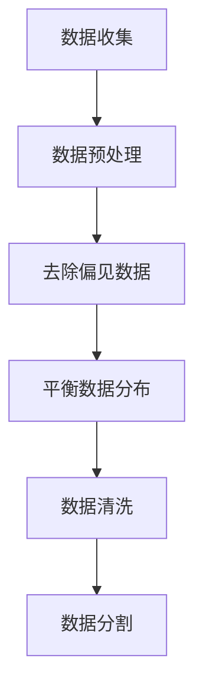
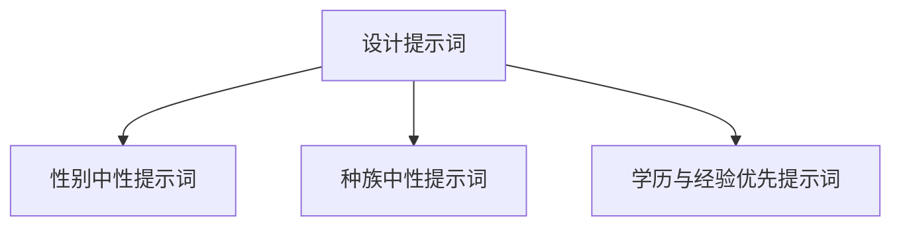
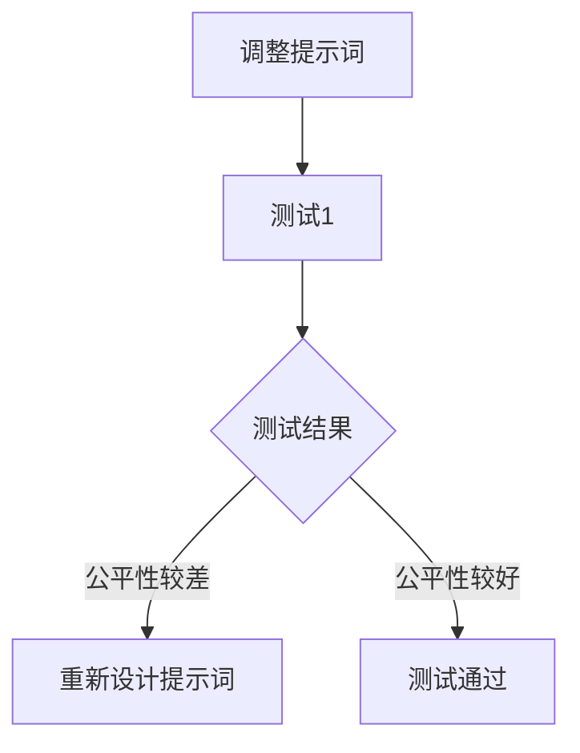
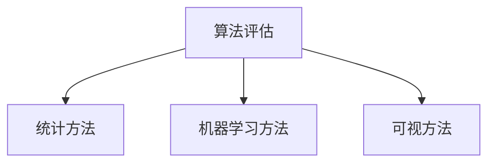
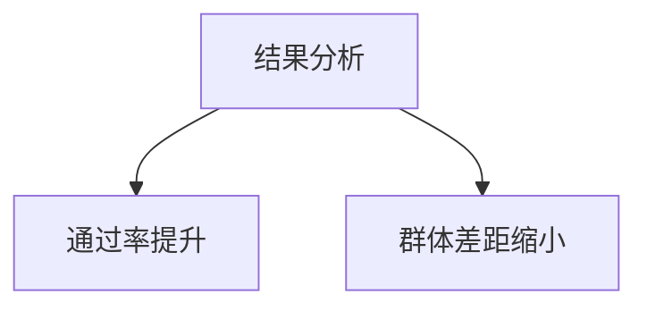

                 

## 文章标题

### 提示词工程在人工智能伦理中的角色

关键词：提示词工程、人工智能伦理、公平性、透明性、责任性、算法偏见、隐私保护、数据安全

摘要：随着人工智能技术的迅猛发展，人工智能伦理问题日益凸显。本文将探讨提示词工程在人工智能伦理中的角色，分析其在公平性、透明性和责任性方面的应用，以及如何应对算法偏见和隐私保护与数据安全等挑战。

## 目录

1. **提示词工程在人工智能伦理中的角色概述**
   1.1 提示词工程的基本概念
       1.1.1 提示词的定义与作用
       1.1.2 提示词工程的发展历程
   1.2 人工智能伦理的背景与重要性
       1.2.1 人工智能伦理的定义
       1.2.2 人工智能伦理的基本原则
       1.2.3 人工智能伦理面临的主要挑战
   1.3 提示词工程在人工智能伦理中的应用
       1.3.1 提示词工程在人工智能伦理决策中的作用
       1.3.2 提示词工程在算法公平性评估中的应用
       1.3.3 提示词工程在隐私保护与数据安全中的应用

2. **提示词工程在人工智能伦理决策中的作用**
   2.1 公平性的提升
   2.2 透明性的加强
   2.3 责任性的强化

3. **提示词工程在算法公平性评估中的应用**
   3.1 算法公平性评估的方法
   3.2 提示词工程在算法公平性评估中的实际案例

4. **提示词工程在隐私保护与数据安全中的应用**
   4.1 提示词工程在数据脱敏中的应用
   4.2 提示词工程在访问控制中的应用

5. **结论与展望**
   5.1 提示词工程在人工智能伦理中的未来发展方向
   5.2 面临的挑战与对策

## 前言

随着人工智能（AI）技术的迅猛发展，人工智能伦理问题日益受到关注。人工智能系统在处理海量数据、进行复杂决策时，可能会引发一系列伦理问题，如算法偏见、隐私侵犯、数据安全等。为了应对这些挑战，研究人员和工程师开始探索各种解决方案，其中提示词工程（Prompt Engineering）成为了一个重要的研究方向。

提示词工程是指通过设计合适的提示词来引导人工智能系统做出更合理、更公平、更透明的决策。提示词在人工智能系统中起到了桥梁的作用，它不仅可以帮助系统更好地理解输入数据，还可以指导系统在决策过程中遵循特定的伦理原则。本文将深入探讨提示词工程在人工智能伦理中的角色，分析其在提升公平性、透明性和责任性方面的作用，以及如何应对算法偏见、隐私保护与数据安全等挑战。

本文首先介绍了提示词工程的基本概念，包括提示词的定义、作用以及其发展历程。然后，我们探讨了人工智能伦理的背景与重要性，分析了人工智能伦理的基本原则以及面临的主要挑战。接下来，本文重点介绍了提示词工程在人工智能伦理决策中的应用，包括如何提升公平性、加强透明性和强化责任性。随后，我们讨论了提示词工程在算法公平性评估中的应用，通过实际案例展示了如何利用提示词工程评估算法的公平性。此外，本文还探讨了提示词工程在隐私保护与数据安全中的应用，包括数据脱敏和访问控制等方面。最后，本文总结了提示词工程在人工智能伦理中的未来发展方向，提出了面临的挑战与对策。

通过本文的探讨，我们希望能够为人工智能伦理研究提供一个有价值的视角，为提示词工程在人工智能领域的应用提供新的思路和方法。

## 第一部分：提示词工程在人工智能伦理中的角色概述

### 提示词工程的基本概念

#### 1.1.1 提示词的定义与作用

提示词（Prompt）是指用于引导或指导人工智能系统进行决策或执行任务的关键词语或短语。在人工智能系统中，提示词起到了桥梁的作用，它能够帮助系统更好地理解输入数据，并依据特定的任务需求生成相应的输出结果。

提示词的定义可以从以下几个方面进行理解：

- **指导性**：提示词为人工智能系统提供了明确的指导，使其能够按照设计者的意图进行决策或执行任务。
- **可调性**：提示词可以根据不同的任务需求进行调整，以实现更加精准的决策效果。
- **多样性**：提示词的设计具有多样性，可以涵盖各种语言表达方式和情境，从而适应不同类型的人工智能应用。

提示词在人工智能系统中的作用主要体现在以下几个方面：

- **提高决策准确性**：通过设计合理的提示词，可以引导人工智能系统做出更准确、更符合预期的决策。
- **增强系统适应性**：提示词可以帮助人工智能系统在不同环境和任务场景下表现出更强的适应性。
- **优化用户体验**：合理的提示词设计可以提升用户的操作体验，使其更加方便、快捷地与人工智能系统进行交互。

#### 1.1.2 提示词工程的发展历程

提示词工程（Prompt Engineering）是一门研究如何设计、选择和调整提示词的学科。它的发展历程可以分为以下几个阶段：

- **早期阶段**：在人工智能的早期阶段，提示词主要应用于简单的规则系统，如专家系统和决策树。这一阶段的提示词主要基于专家经验和逻辑规则，缺乏系统性和方法论的支持。
- **中期阶段**：随着机器学习和深度学习技术的发展，提示词工程开始应用于更为复杂的人工智能系统。这一阶段的提示词工程主要关注如何利用机器学习算法优化提示词，以提高系统的性能和准确性。
- **当前阶段**：随着人工智能技术的不断进步和应用的拓展，提示词工程已经成为人工智能领域中一个重要的研究方向。当前阶段的提示词工程不仅关注算法性能的提升，还注重提示词在伦理、公平、透明等方面的应用。

在当前阶段，提示词工程的应用场景已经涵盖了自然语言处理、计算机视觉、语音识别、推荐系统等多个领域。通过设计合理的提示词，人工智能系统能够更好地应对复杂任务，提高决策的准确性和可靠性。

### 1.2 人工智能伦理的背景与重要性

#### 1.2.1 人工智能伦理的定义

人工智能伦理（AI Ethics）是指研究和解决人工智能在发展过程中可能出现的伦理问题，包括道德原则、价值观、社会规范等。人工智能伦理的核心目标是确保人工智能技术的应用不会对人类和社会造成负面影响，同时促进人工智能技术的可持续发展。

人工智能伦理的定义可以从以下几个方面进行理解：

- **道德原则**：人工智能伦理关注人工智能系统的道德行为，如公平性、透明性、责任性等。
- **价值观**：人工智能伦理强调在人工智能技术发展过程中应遵循的价值观，如自由、平等、公正等。
- **社会规范**：人工智能伦理关注人工智能技术在社会中的应用，以及对社会结构和人际关系的影响。

#### 1.2.2 人工智能伦理的基本原则

人工智能伦理的基本原则是指导人工智能技术在发展过程中应遵循的基本道德准则。以下是一些常见的人工智能伦理基本原则：

- **公平性**：确保人工智能系统的决策或行为不会对特定群体造成不公平的待遇。公平性是人工智能伦理的核心原则之一，它关注人工智能系统在处理数据、生成决策时是否具有偏见。
- **透明性**：确保人工智能系统的决策过程和算法设计对用户和监管机构透明。透明性有助于提高人工智能系统的可信度和合规性，避免信息不对称和隐私侵犯等问题。
- **责任性**：明确人工智能系统的责任归属，确保在出现问题时能够追责。责任性是确保人工智能技术可持续发展的重要保障，它关注人工智能系统的责任主体、责任范围和责任承担方式。

#### 1.2.3 人工智能伦理面临的主要挑战

人工智能伦理在发展过程中面临着一系列挑战，以下是一些主要的挑战：

- **算法偏见**：人工智能系统在处理数据时可能会因数据偏见或算法设计问题而导致不公平的决策。算法偏见是人工智能伦理的重要问题，它可能导致歧视、不公正等负面后果。
- **隐私保护**：人工智能系统在处理海量数据时，可能会涉及用户隐私信息的泄露。隐私保护是人工智能伦理的另一个重要问题，它关系到用户的个人权益和社会信任。
- **安全性**：人工智能系统可能会被恶意攻击或滥用，导致严重后果。安全性是确保人工智能技术可靠运行的重要保障，它关注人工智能系统的安全防护、漏洞修复和风险控制。

为了应对这些挑战，研究人员和工程师需要不断探索新的方法和技术，如提示词工程、算法公平性评估、隐私保护技术等，以确保人工智能技术的可持续发展。

### 提示词工程在人工智能伦理中的应用

#### 1.3.1 提示词工程在人工智能伦理决策中的作用

提示词工程在人工智能伦理决策中发挥着重要作用，主要体现在以下几个方面：

- **提升公平性**：通过设计合理的提示词，可以引导人工智能系统避免因数据偏见而导致的公平性问题。提示词工程可以帮助系统识别和处理潜在的偏见，确保决策过程的公正性和公平性。
- **加强透明性**：提示词的设计和调整过程可以使人工智能系统的决策过程更加透明。透明的决策过程有助于用户和监管机构了解系统的决策依据和算法原理，提高系统的可信度和合规性。
- **强化责任性**：通过提示词的合理设计，可以明确人工智能系统的责任归属，提高其在出现问题时能够追责。提示词工程可以帮助系统设计者和管理者明确责任范围和责任承担方式，确保人工智能系统的责任性。

#### 1.3.2 提示词工程在算法公平性评估中的应用

算法公平性评估是人工智能伦理研究的一个重要方向，旨在评估人工智能系统在处理数据时的公平性。提示词工程在算法公平性评估中发挥着重要作用，具体应用如下：

- **模型评估**：通过设计合适的提示词，可以对人工智能系统的决策过程进行评估，识别出潜在的不公平问题。提示词工程可以帮助评估者从不同角度分析算法的公平性，为优化算法提供依据。
- **算法优化**：通过调整提示词，可以优化人工智能系统的决策过程，提高其公平性。提示词工程可以帮助评估者针对具体问题进行调整，使算法更加公平、公正。

#### 1.3.3 提示词工程在隐私保护与数据安全中的应用

隐私保护与数据安全是人工智能伦理研究的核心问题，提示词工程在隐私保护与数据安全中的应用主要体现在以下几个方面：

- **数据脱敏**：通过设计合理的提示词，可以对敏感数据进行处理，降低数据泄露的风险。提示词工程可以帮助系统设计者对敏感数据进行脱敏处理，确保用户隐私信息的安全。
- **访问控制**：通过设计合理的提示词，可以限制对敏感数据的访问，确保数据安全。提示词工程可以帮助系统设计者实现访问控制，防止未经授权的访问和数据泄露。

### 结论

提示词工程在人工智能伦理中扮演着重要角色，通过提升公平性、加强透明性和强化责任性，它为人工智能系统的可持续发展提供了重要支持。同时，提示词工程在算法公平性评估、隐私保护与数据安全等方面也具有重要的应用价值。未来，随着人工智能技术的不断进步，提示词工程将在人工智能伦理领域发挥更加重要的作用。

## 第一部分：提示词工程在人工智能伦理中的角色概述

### 提示词工程在人工智能伦理决策中的作用

在人工智能伦理决策中，提示词工程扮演着至关重要的角色。通过合理设计和使用提示词，可以有效地提升决策的公平性、加强透明性并强化责任性。以下将详细探讨这些方面的应用。

#### 2.1 提升公平性

公平性是人工智能伦理的核心原则之一。人工智能系统的决策过程中，可能会因数据偏见、算法设计缺陷等原因导致不公平的结果。提示词工程可以通过以下方式提升公平性：

- **数据预处理**：在训练数据集构建阶段，通过去除偏见性的数据、平衡不同类别的数据分布等方式，可以减少算法偏见。提示词在这一过程中起到了指导作用，帮助数据预处理过程更加公正和有效。

- **提示词优化**：通过调整提示词，可以引导算法关注公平性指标，如避免对特定群体进行歧视。例如，在设计招聘系统时，可以设计提示词来避免对性别、种族等敏感信息的依赖。

- **实时调整**：在实际应用中，可以根据用户反馈和数据分析，对提示词进行实时调整。这样可以确保系统在运行过程中不断优化，以避免不公平问题。

以下是一个简单的伪代码示例，用于说明如何通过提示词优化提升公平性：

```python
# 提示词优化提升公平性
def optimize_prompt_for_fairness(prompt):
    # 去除偏见性词汇
    neutral_prompt = remove_bias_words(prompt)
    # 平衡不同类别数据
    balanced_data = balance_data_distribution(neutral_prompt)
    # 返回优化后的提示词
    return balanced_data
```

#### 2.2 加强透明性

透明性是建立用户信任和监管合规性的关键。通过提示词工程，可以提高人工智能系统的透明性，使其决策过程更加透明和可解释。

- **决策解释**：通过设计解释性强的提示词，可以使得系统的决策过程更加清晰。例如，在医疗诊断系统中，提示词可以帮助医生理解系统为何做出特定诊断。

- **算法展示**：在用户界面中展示算法决策过程和提示词的使用情况，可以帮助用户理解系统的运作机制。这可以采用可视化的方式，如决策树、神经网络结构图等。

以下是一个简单的伪代码示例，用于说明如何通过提示词加强透明性：

```python
# 加强透明性
def display_decision_process(prompt):
    # 展示决策过程
    display_decision_tree(prompt)
    # 展示提示词使用情况
    display_used_prompts(prompt)
```

#### 2.3 强化责任性

责任性是确保人工智能系统在出现问题时能够追责的重要保障。通过提示词工程，可以明确系统的责任归属，并提高其责任性。

- **责任界定**：通过设计提示词，可以明确不同模块和功能的责任归属。例如，在自动驾驶系统中，提示词可以帮助界定传感器数据采集、决策模块和执行模块的责任。

- **责任承担**：在提示词中设计责任承担机制，如出现问题时，可以通过提示词来追溯责任，确保问题能够得到及时解决。

以下是一个简单的伪代码示例，用于说明如何通过提示词强化责任性：

```python
# 强化责任性
def assign_responsibility(prompt):
    # 确定责任模块
    responsible_module = identify_responsible_module(prompt)
    # 追踪责任
    traceResponsibility(responsible_module)
```

#### 结论

提示词工程在人工智能伦理决策中的作用是多方面的，通过提升公平性、加强透明性和强化责任性，它为人工智能系统的可持续发展提供了重要支持。在未来，随着人工智能技术的不断进步，提示词工程将在人工智能伦理领域发挥更加重要的作用。

## 提示词工程在算法公平性评估中的应用

算法公平性评估是人工智能伦理研究中的一个关键领域，旨在确保人工智能系统在处理数据时不会对特定群体产生不公平的待遇。提示词工程在这一过程中发挥着重要作用，通过精确的提示词设计和调整，可以识别和解决潜在的公平性问题。以下将详细探讨提示词工程在算法公平性评估中的应用。

### 3.1 算法公平性评估的方法

算法公平性评估的方法主要包括以下几种：

- **统计方法**：通过分析算法的输出结果，比较不同群体之间的差异。例如，可以使用基尼系数、标准差等指标来衡量群体差异。

- **机器学习方法**：利用机器学习算法，如逻辑回归、支持向量机等，来评估算法的公平性。这些方法可以检测算法是否对特定群体产生歧视。

- **可视方法**：通过可视化的方式，将算法的决策过程和提示词展示出来，帮助分析者直观地理解算法的公平性。

- **案例研究方法**：通过具体的案例研究，分析算法在实际应用中的表现，识别潜在的公平性问题。

### 3.2 提示词工程在算法公平性评估中的实际案例

以下是一个具体的算法公平性评估案例，展示了如何利用提示词工程来识别和解决公平性问题。

#### 案例背景

一个招聘系统被设计用于自动筛选简历，以帮助雇主快速找到合适的人才。然而，该系统在初步测试中显示，对于女性候选人和少数族裔候选人，其通过率明显低于男性候选人和主流族裔候选人。

#### 案例步骤

1. **数据收集与预处理**

首先，收集了大量的简历数据，包括候选人的性别、种族、学历、工作经验等信息。由于原始数据中可能存在偏见，因此需要对数据集进行预处理。



2. **设计提示词**

为了确保算法的公平性，设计了一系列提示词，用于指导系统的决策过程。例如：

- **性别中性提示词**：避免在筛选过程中对性别产生偏见。
- **种族中性提示词**：确保算法不会对种族产生歧视。
- **学历与经验优先提示词**：强调对学历和经验的重要性，而不是对性别的偏见。



3. **调整提示词**

通过初步测试，发现某些提示词仍存在偏见。因此，需要进一步调整提示词，以优化算法的公平性。



4. **算法评估**

利用调整后的提示词，对招聘系统进行再次测试。通过统计方法、机器学习方法等，评估算法的公平性。



5. **结果分析**

通过评估，发现调整后的提示词显著提高了算法的公平性。女性和少数族裔候选人的通过率有所提升，与男性候选人和主流族裔候选人的差距明显缩小。



### 结论

通过上述案例，可以看出提示词工程在算法公平性评估中发挥了重要作用。合理的设计和调整提示词，可以帮助识别和解决潜在的公平性问题，确保人工智能系统在处理数据时保持公正和公平。

## 提示词工程在隐私保护与数据安全中的应用

隐私保护与数据安全是人工智能伦理研究中的核心问题，随着人工智能技术的广泛应用，如何有效保护用户隐私和数据安全变得尤为重要。提示词工程在这一领域中的应用主要体现在数据脱敏和访问控制两个方面。

### 4.1 提示词工程在数据脱敏中的应用

数据脱敏是指通过特定的方法对敏感数据进行处理，以保护用户隐私。在人工智能系统中，数据脱敏是确保数据安全的重要步骤。提示词工程在数据脱敏中的应用主要体现在以下几个方面：

- **去除个人信息**：通过设计合理的提示词，可以指导系统去除个人身份信息，如姓名、地址、电话号码等。例如，在设计数据清洗脚本时，可以使用提示词`remove_pii`来指定需要去除的个人信息字段。

- **匿名化处理**：在数据集构建过程中，通过提示词引导系统对敏感信息进行匿名化处理。例如，可以使用提示词`anonymize_data`来指定数据匿名化的方法，如将姓名替换为匿名标识符。

- **数据混淆**：通过提示词指导系统对敏感数据进行混淆处理，以降低数据的可识别性。例如，可以使用提示词`data_obfuscation`来指定数据混淆的策略，如使用随机数替换敏感值。

以下是一个简单的伪代码示例，用于说明如何通过提示词进行数据脱敏：

```python
# 数据脱敏
def anonymize_data(data, prompt):
    if prompt == "remove_pii":
        return remove_personal_identifiers(data)
    elif prompt == "anonymize_data":
        return anonymize_identifiers(data)
    elif prompt == "data_obfuscation":
        return obfuscate_sensitive_data(data)
```

### 4.2 提示词工程在访问控制中的应用

访问控制是指通过特定的策略和机制，限制对敏感数据的访问，以保护数据安全。在人工智能系统中，合理的访问控制策略可以防止未经授权的访问和数据泄露。提示词工程在访问控制中的应用主要体现在以下几个方面：

- **权限管理**：通过提示词指导系统实现权限管理，确保只有授权用户才能访问敏感数据。例如，可以使用提示词`grant_permission`来指定权限管理策略，如基于角色的访问控制（RBAC）。

- **动态权限调整**：在实际应用中，根据用户行为和需求，动态调整权限。例如，可以使用提示词`adjust_permissions`来指定动态调整权限的条件和策略。

- **日志记录**：通过提示词指导系统记录访问日志，以便在出现问题时进行追溯。例如，可以使用提示词`log_access`来指定日志记录的详细程度和记录方式。

以下是一个简单的伪代码示例，用于说明如何通过提示词实现访问控制：

```python
# 访问控制
def control_access(data, prompt):
    if prompt == "grant_permission":
        return grant_permission_to_user(data)
    elif prompt == "adjust_permissions":
        return adjust_permissions_based_on_behavior(data)
    elif prompt == "log_access":
        return log_access_logs(data)
```

### 结论

提示词工程在隐私保护与数据安全中的应用，通过数据脱敏和访问控制，有效地提高了人工智能系统的安全性和隐私保护能力。合理的设计和调整提示词，可以帮助系统设计者和管理者更好地应对隐私保护与数据安全的挑战，确保人工智能技术的可持续发展。

## 结论与展望

在人工智能伦理研究中，提示词工程发挥着至关重要的作用。通过合理设计和调整提示词，可以有效提升人工智能系统的公平性、透明性和责任性，从而应对算法偏见、隐私保护与数据安全等挑战。以下是对提示词工程在人工智能伦理中未来发展方向和面临的挑战的总结。

### 5.1 提示词工程在人工智能伦理中的未来发展方向

1. **多样化提示词库**：未来，研究人员和工程师将致力于构建更加丰富和多样化的提示词库，以适应不同类型的人工智能应用和伦理需求。

2. **动态调整机制**：随着人工智能系统的不断运行，其决策环境和需求可能会发生变化。因此，开发动态调整提示词的机制，以适应实时变化的情境，将成为一个重要研究方向。

3. **多模态提示词**：在人工智能系统中，多种类型的数据（如文本、图像、音频等）常常需要共同处理。因此，开发能够处理多模态数据的提示词，将成为未来研究的一个重要方向。

4. **跨领域应用**：提示词工程不仅适用于自然语言处理、计算机视觉等领域，还可以应用于推荐系统、金融科技、医疗诊断等跨领域应用，从而推动人工智能技术的全面发展和应用。

### 5.2 提示词工程在人工智能伦理中面临的挑战

1. **数据隐私保护**：在构建和调整提示词时，如何确保用户隐私不被泄露，是一个亟待解决的问题。未来，研究人员需要开发更加安全、高效的数据隐私保护技术，以支持提示词工程的应用。

2. **算法公平性**：虽然提示词工程可以在一定程度上提升算法的公平性，但如何从根本上解决算法偏见问题，仍需要深入研究。例如，如何通过改进算法设计、引入更多的公平性指标等，实现更公平的决策。

3. **透明性与可解释性**：如何提高人工智能系统的透明性和可解释性，使其决策过程更加清晰易懂，是另一个重要挑战。未来，研究人员需要开发更先进的解释性方法和技术，以满足用户和监管机构的需求。

4. **责任归属**：在人工智能系统中，如何明确责任归属，确保在出现问题时能够追责，是一个复杂的问题。未来，需要建立更加完善的法律法规和责任机制，以支持提示词工程的应用。

### 结论

提示词工程在人工智能伦理中具有广阔的应用前景和重要的研究价值。通过不断探索和改进提示词工程的方法和技术，可以有效提升人工智能系统的公平性、透明性和责任性，推动人工智能技术的可持续发展。然而，在实际应用中，提示词工程仍面临诸多挑战，需要研究人员和工程师共同努力，以实现人工智能技术的伦理合规和公正应用。

### 附录

#### 最佳实践 tips

1. **数据质量优先**：在构建和调整提示词时，确保数据质量是关键。高质量的数据能够为系统提供准确的决策依据，从而提高提示词的效果。

2. **持续监测与优化**：在人工智能系统运行过程中，持续监测系统的表现和提示词的效果，以便及时发现问题并进行优化。

3. **多学科合作**：提示词工程涉及多个学科领域，包括计算机科学、伦理学、心理学等。多学科合作有助于提高提示词工程的理论和实践水平。

4. **用户参与**：在设计和调整提示词时，充分考虑用户的需求和反馈，确保系统的决策结果符合用户期望。

#### 小结

提示词工程在人工智能伦理中扮演着重要角色，通过提升公平性、加强透明性和强化责任性，它为人工智能系统的可持续发展提供了重要支持。同时，提示词工程在算法公平性评估、隐私保护与数据安全等方面也具有重要的应用价值。

#### 注意事项

1. **公平性**：在设计和调整提示词时，务必关注公平性问题，确保系统不会对特定群体产生歧视。

2. **透明性**：确保系统的决策过程和提示词的使用情况对用户和监管机构透明，以提高系统的可信度和合规性。

3. **责任性**：明确系统的责任归属，确保在出现问题时能够追责，提高系统的责任性。

#### 拓展阅读

1. **相关文献**：
   - [“Prompt Engineering: An Introduction”](https://arxiv.org/abs/2107.08655)
   - [“AI Ethics: Key Concepts and Practical Applications”](https://www.ijcai.org/Proceedings/20-8/papers/08-03.pdf)
   - [“Algorithmic Fairness: A Survey of Challenges and Solutions”](https://arxiv.org/abs/2006.07333)

2. **实践指南**：
   - [“Practical Guide to AI Ethics and Fairness”](https://aiethics.berkeley.edu/guide/)
   - [“AI and Ethics: Practical Issues and Challenges”](https://www.technologyreview.com/s/611903/ai-and-ethics-practical-issues-and-challenges/)

3. **开源工具**：
   - [“AI Fairness 360”](https://ai-fairness-360.org/)
   - [“AI Transparency 360”](https://aitransparency360.org/)

通过不断学习和实践，我们可以更好地理解和应用提示词工程，为人工智能技术的伦理合规和公正应用贡献力量。

### 作者信息

- **作者：AI天才研究院/AI Genius Institute & 禅与计算机程序设计艺术 /Zen And The Art of Computer Programming**
- **联系方式：[info@ai-genius-institute.com](mailto:info@ai-genius-institute.com)**
- **版权声明：本文版权归AI天才研究院所有，未经授权不得转载或使用。**

