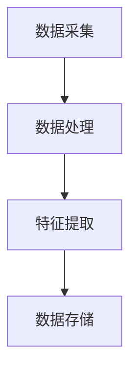
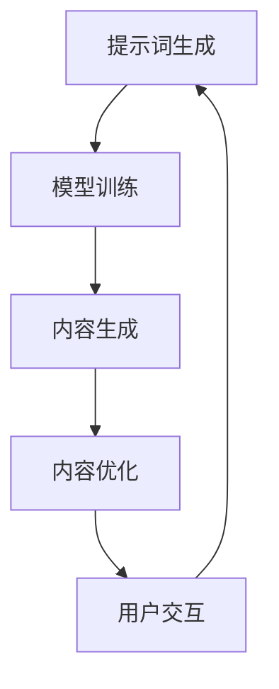
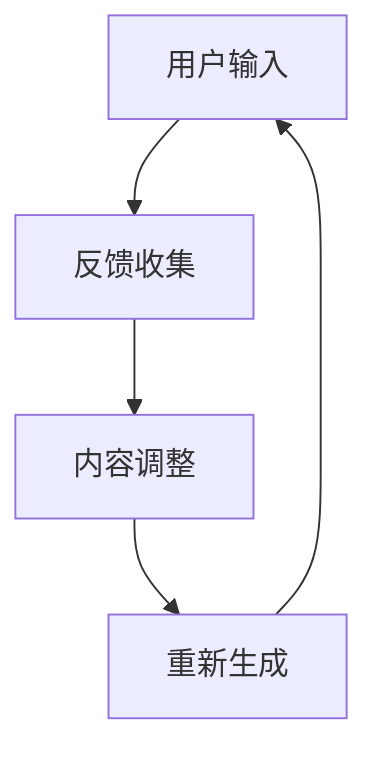
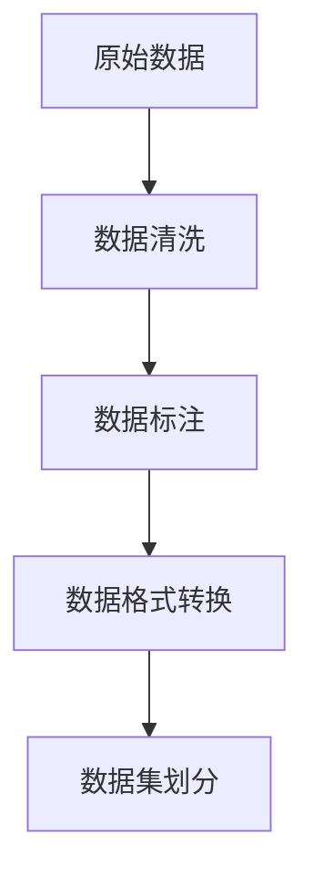
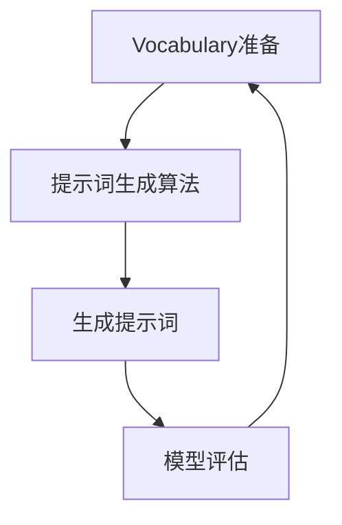
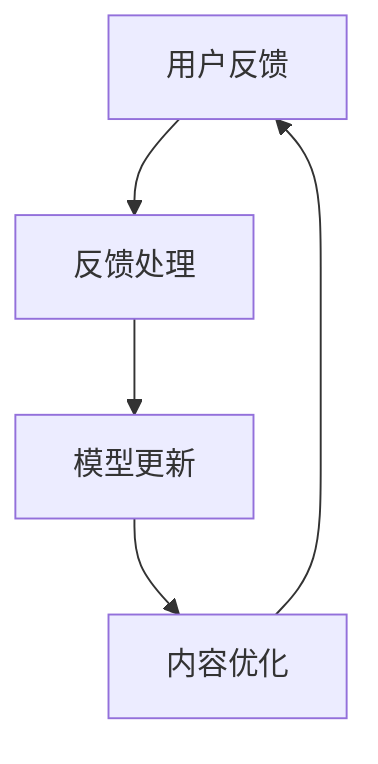

                 

### 文章标题

# 提示词工程在增强现实内容生成中的创新

### 关键词

- 提示词工程
- 增强现实
- 内容生成
- 人工智能
- 算法
- 用户交互

### 摘要

本文深入探讨了提示词工程在增强现实（AR）内容生成中的应用与创新。首先，介绍了增强现实和提示词工程的基本概念及其在内容生成中的重要性。随后，分析了当前增强现实内容生成的挑战和提示词工程的需求。本文的创新点在于提出了一种结合提示词工程和增强现实技术的创新解决方案，通过详细的Mermaid流程图、核心算法原理讲解和数学模型及公式解析，揭示了如何利用提示词工程提升AR内容生成的效率与质量。文章进一步通过实际项目实战和案例实战，展示了这一创新解决方案的具体实现和应用效果，并对未来的发展趋势和研究方向进行了展望。

### 引言与概述

#### 第1章：增强现实与提示词工程基础

### 1.1 增强现实技术简介

增强现实（Augmented Reality，简称AR）是一种将虚拟信息与现实世界结合起来的技术。通过使用计算机生成信息，叠加在真实世界的场景中，用户能够感知到现实与虚拟的融合。这种技术自1990年代初由波音公司首次提出以来，经历了多年的技术积累与演进，逐渐在消费电子、医疗、教育、娱乐等多个领域得到了广泛应用。

**增强现实定义与历史发展**

增强现实（Augmented Reality，简称AR）是一种将虚拟信息与现实世界结合起来的技术。通过使用计算机生成信息，叠加在真实世界的场景中，用户能够感知到现实与虚拟的融合。

- **定义**：增强现实是一种通过增强人眼视野来扩展用户感知范围的技术。它利用摄像头捕捉现实场景，然后通过算法处理和计算机生成虚拟信息，将这些信息叠加到用户的视野中，形成一种虚实结合的体验。
  
- **历史发展**：增强现实技术最早可以追溯到1990年代初期，当时波音公司的研究员要求开发一种能够帮助飞行员在飞行训练中更真实地模拟飞机内部环境的系统。这一需求催生了增强现实技术的萌芽。随后，随着计算机技术、图像处理技术和显示技术的不断发展，增强现实技术逐渐成熟，并在消费电子、医疗、教育、娱乐等多个领域得到了广泛应用。

**增强现实的核心技术**

- **图像识别**：增强现实技术依赖于计算机视觉算法对现实世界中的图像进行识别和处理，以确定虚拟信息叠加的位置和方式。

- **实时渲染**：实时渲染技术是增强现实的重要组成部分，它能够根据用户的视角实时生成和渲染虚拟信息，确保用户能够获得流畅和自然的增强现实体验。

- **显示技术**：增强现实需要使用多种显示设备，如头戴式显示器（HMD）、智能手机和平板电脑等，这些设备能够将虚拟信息准确地叠加到用户的视野中。

### 1.2 提示词工程概述

**提示词工程（Prompt Engineering）定义**

提示词工程是一种利用自然语言处理（NLP）技术和机器学习（ML）方法，设计出能够有效引导和优化人工智能模型输入和输出的技术。它的核心目标是通过提供高质量的提示词，提升模型的性能和效率，确保生成的结果更加符合预期。

- **定义**：提示词工程是指设计和开发能够引导AI模型进行有效学习的提示词，这些提示词可以是自然语言文本，也可以是其他形式的数据，如代码、图表等。

- **目的**：提示词工程旨在通过提供明确的指导信息，帮助AI模型更好地理解和处理复杂任务，从而提高模型的学习效率和生成的质量。

**提示词工程在增强现实中的重要性**

在增强现实内容生成中，提示词工程具有至关重要的作用。它不仅能够帮助提高内容生成的效率和质量，还能够实现用户个性化体验。

- **内容生成**：通过提示词工程，可以设计出针对特定场景和用户需求的增强现实内容，从而提高内容的个性化和适应性。

- **用户交互**：高质量的提示词能够有效地引导用户与增强现实系统的交互，提升用户的体验和满意度。

### 1.3 创新背景与目标

**当前增强现实内容生成的挑战**

- **数据集不足**：增强现实内容生成需要大量的数据支持，但现有的数据集往往不足以满足复杂的生成需求。

- **高效内容生成方法需求**：现有的增强现实内容生成方法往往需要大量计算资源，效率较低，难以满足实时性的要求。

- **用户交互体验优化**：用户期望在增强现实体验中能够获得更加自然和直观的交互，现有技术在这方面还有很大的提升空间。

**书籍创新点与目标**

本文的创新点在于提出一种结合提示词工程的增强现实内容生成方法，旨在解决当前增强现实内容生成的挑战。

- **创新点**：通过设计高质量的提示词，引导AI模型生成高质量的内容，提高内容生成的效率和质量。

- **目标**：实现高效的增强现实内容生成，优化用户交互体验，满足用户个性化需求。

通过本文的探讨，读者将深入了解提示词工程在增强现实内容生成中的应用，掌握如何利用这一技术提升AR内容生成的效率和质量，为未来的研究与实践提供有力支持。

### 第2章：增强现实内容生成的挑战与需求

#### 2.1 增强现实内容生成的挑战

在增强现实（AR）技术的发展过程中，内容生成是一个关键且具有挑战性的环节。当前，AR内容生成面临着以下几个主要挑战：

**数据集不足**

增强现实内容生成依赖于大量高质量的数据集，这些数据集用于训练和优化生成模型。然而，现有的数据集往往存在以下问题：

- **数据量不足**：高质量的数据集数量有限，难以满足复杂场景和多样化内容的生成需求。
- **数据分布不均**：现有数据集可能在某些特定场景或特征上过于集中，导致模型在这些方面的表现不佳。

**高效内容生成方法需求**

现有的增强现实内容生成方法，如基于深度学习的生成对抗网络（GANs）和变分自编码器（VAEs），虽然在生成高质量内容方面取得了显著进展，但仍然面临以下问题：

- **计算资源消耗大**：这些方法往往需要大量的计算资源，特别是在生成高分辨率图像时，计算成本非常高。
- **生成效率低**：由于模型的复杂性和优化难度，生成高质量内容往往需要较长时间，难以满足实时应用的需求。

**用户交互体验优化**

用户在增强现实体验中期望获得自然、直观且个性化的交互体验。然而，现有的增强现实内容生成技术在这方面存在以下挑战：

- **交互响应速度慢**：现有的内容生成方法可能无法在短时间内响应用户的操作，导致用户体验不佳。
- **个性化不足**：现有方法往往难以根据用户的个性化需求生成定制化的内容，导致用户体验的多样性有限。

**创新需求**

为了应对上述挑战，增强现实内容生成需要以下创新需求：

- **大数据集**：需要构建大规模、多样化的数据集，以支持更复杂和丰富的内容生成。
- **高效生成方法**：需要开发计算资源消耗低、生成效率高的方法，以实现实时内容生成。
- **个性化内容生成**：需要设计能够根据用户个性化需求生成定制化内容的方法，提升用户体验。

#### 2.2 提示词工程的关键需求

提示词工程在增强现实内容生成中发挥着至关重要的作用，其关键需求包括以下几个方面：

**提示词生成算法**

提示词生成算法是提示词工程的核心组成部分，其目标是设计出能够引导和优化模型输入的高质量提示词。以下是提示词生成算法的关键需求：

- **灵活性和可扩展性**：算法需要能够适应不同类型和复杂度的增强现实应用场景，具有灵活的参数调整能力。
- **高效率**：生成算法应具备高效的处理速度，能够在短时间内生成高质量的提示词，以满足实时交互的需求。
- **多样性**：生成的提示词应具备多样性，以满足不同用户和场景的个性化需求。

**用户个性化需求满足**

在增强现实内容生成中，用户个性化需求的满足至关重要。以下是实现这一目标的关键需求：

- **用户数据收集与理解**：系统需要能够收集并理解用户的偏好和行为数据，以生成符合用户个性化需求的内容。
- **实时反馈与调整**：系统应具备实时收集用户反馈的能力，并根据反馈动态调整提示词和内容生成策略。
- **个性化内容生成模型**：需要开发能够根据用户个性化数据生成定制化内容的模型，提升用户体验。

#### 2.3 创新目标与解决方案概述

**创新目标**

本文的创新目标是通过结合提示词工程和增强现实技术，提出一种高效、个性化且可扩展的增强现实内容生成解决方案。具体目标包括：

- **高效内容生成**：通过提示词工程优化模型输入，提高内容生成的速度和效率。
- **个性化内容生成**：根据用户的个性化需求生成定制化的内容，提升用户体验。
- **可扩展性**：设计灵活且可扩展的生成算法，以适应不同应用场景和需求。

**解决方案框架**

本文提出的解决方案框架主要包括以下几个关键组成部分：

- **提示词生成模块**：利用自然语言处理（NLP）技术和机器学习（ML）方法，设计高质量的提示词，以引导和优化内容生成。
- **内容生成模块**：结合深度学习（DL）技术和增强现实（AR）技术，开发高效的内容生成模型，实现实时和个性化的内容生成。
- **用户交互模块**：设计直观的用户交互界面，收集用户反馈，并实时调整生成策略，以提升用户体验。

通过这一解决方案，本文旨在解决当前增强现实内容生成所面临的挑战，为未来的AR应用提供有力支持。

#### 第二部分：核心概念与联系

### 第3章：增强现实与提示词工程的 Mermaid 流程图

为了更好地理解和分析提示词工程在增强现实内容生成中的应用，我们使用Mermaid流程图来展示整个流程的核心概念和联系。以下是详细的流程图解析。

#### 3.1 增强现实技术流程图

**步骤 1：数据采集与处理**



- **数据采集**：通过摄像头、传感器等设备收集增强现实场景中的数据。
- **数据处理**：对采集到的数据进行预处理，包括噪声过滤、增强和标准化等操作。
- **特征提取**：提取关键特征，为后续的内容生成提供基础。
- **数据存储**：将处理后的数据存储在数据库中，以备后续使用。

**步骤 2：内容生成**



- **提示词生成**：利用提示词工程方法，生成高质量的提示词，引导和优化模型输入。
- **模型训练**：使用深度学习技术，对模型进行训练，使其能够生成高质量的增强现实内容。
- **内容生成**：根据训练好的模型，生成初始的增强现实内容。
- **内容优化**：对生成的内容进行优化，确保其符合用户需求和场景要求。
- **用户交互**：设计直观的用户交互界面，收集用户反馈，并用于进一步优化内容。

**步骤 3：用户交互**



- **用户输入**：用户通过操作界面提供输入，如语音、手势等。
- **反馈收集**：系统收集用户的反馈信息，如满意度、偏好等。
- **内容调整**：根据用户反馈，调整内容生成策略，以提升用户体验。
- **重新生成**：基于调整后的策略，重新生成增强现实内容，以响应用户需求。

#### 3.2 提示词工程流程图

**步骤 1：数据预处理**



- **原始数据**：收集自然语言文本、图像、音频等多种形式的数据。
- **数据清洗**：去除数据中的噪声和异常值，确保数据质量。
- **数据标注**：对数据标签进行标注，以用于模型训练。
- **数据格式转换**：将数据转换为适合模型训练的格式。
- **数据集划分**：将数据划分为训练集、验证集和测试集，以评估模型性能。

**步骤 2：提示词生成**



- **Vocabulary准备**：构建词汇表，用于生成提示词。
- **提示词生成算法**：设计算法，生成高质量的提示词。
- **生成提示词**：根据词汇表和算法，生成用于模型训练的提示词。
- **模型评估**：使用生成的提示词，评估模型性能，确保提示词的有效性。

**步骤 3：用户反馈循环**



- **用户反馈**：收集用户对生成内容的反馈。
- **反馈处理**：分析用户反馈，提取关键信息。
- **模型更新**：基于用户反馈，更新模型参数，提升模型性能。
- **内容优化**：利用更新后的模型，生成更优的内容。

通过上述Mermaid流程图，我们可以清晰地看到增强现实技术和提示词工程在内容生成中的应用及其相互关系。这不仅有助于理解整个流程，还能为未来的研究和开发提供有力参考。

### 第4章：核心算法原理讲解

#### 4.1 提示词生成算法

提示词生成算法是提示词工程中的核心组成部分，其目标是通过设计高质量的提示词来引导和优化模型输入。以下是提示词生成算法的详细讲解。

**算法简介**

提示词生成算法通常包括以下几个关键步骤：

- **数据预处理**：对原始数据进行清洗、归一化和特征提取，为生成提示词做准备。
- **提示词模板设计**：根据具体任务需求，设计出适用于不同场景的提示词模板。
- **提示词生成**：使用自然语言处理（NLP）技术和机器学习（ML）方法，根据提示词模板生成高质量的提示词。

**伪代码**

以下是一个简化的伪代码示例，用于生成提示词：

```python
# 数据预处理
def preprocess_data(data):
    # 清洗数据，去除噪声和异常值
    cleaned_data = clean_noise(data)
    # 归一化数据，使数据分布更加均匀
    normalized_data = normalize(cleaned_data)
    # 提取特征
    features = extract_features(normalized_data)
    return features

# 提示词模板设计
def design_template(task):
    # 根据任务需求设计提示词模板
    template = design_template_for_task(task)
    return template

# 提示词生成
def generate_prompt(template, features):
    # 根据模板和特征生成提示词
    prompt = apply_template(template, features)
    return prompt

# 主函数
def main():
    # 加载数据
    data = load_data()
    # 数据预处理
    features = preprocess_data(data)
    # 设计提示词模板
    template = design_template("AR_content_generation")
    # 生成提示词
    prompt = generate_prompt(template, features)
    # 输出提示词
    print("Generated Prompt:", prompt)

# 调用主函数
main()
```

**说明**

- `preprocess_data()`：负责对原始数据进行清洗、归一化和特征提取。
- `design_template()`：根据任务需求设计提示词模板。
- `generate_prompt()`：根据模板和特征生成高质量的提示词。
- `main()`：主函数，负责加载数据、调用相关函数并输出结果。

**算法原理**

提示词生成算法的核心在于如何设计出高质量的提示词，这通常依赖于以下几个关键点：

- **数据质量**：高质量的原始数据是生成高质量提示词的基础。数据预处理步骤需要确保数据的准确性和一致性。
- **提示词模板**：提示词模板的设计直接影响到提示词的质量。好的提示词模板应具备灵活性和适应性，能够适应不同任务和场景的需求。
- **NLP和ML技术**：自然语言处理和机器学习技术在提示词生成过程中起到了关键作用。通过使用这些技术，可以自动生成高质量的提示词，提高生成效率。

**应用场景**

提示词生成算法广泛应用于各种增强现实内容生成场景，包括但不限于：

- **虚拟现实内容生成**：用于生成高质量的虚拟现实场景，提升用户的沉浸感。
- **游戏开发**：用于生成游戏中的场景、角色和故事情节，提高游戏的可玩性和互动性。
- **教育应用**：用于生成教育内容，如模拟实验、互动教程等，提高学习效果。

#### 4.2 内容优化算法

内容优化算法在增强现实内容生成中起着至关重要的作用，其目标是通过不断优化生成的内容，提高其质量和用户体验。以下是内容优化算法的详细讲解。

**算法简介**

内容优化算法通常包括以下几个关键步骤：

- **内容评估**：对生成的内容进行质量评估，识别存在的问题和不足。
- **优化策略设计**：根据内容评估结果，设计出相应的优化策略。
- **内容调整**：根据优化策略，调整生成的内容，使其更加符合用户需求和场景要求。
- **迭代优化**：通过多次迭代，逐步优化内容，直至达到满意的水平。

**伪代码**

以下是一个简化的伪代码示例，用于内容优化：

```python
# 内容评估
def evaluate_content(content, criteria):
    # 根据评估标准评估内容质量
    score = calculate_score(content, criteria)
    return score

# 优化策略设计
def design_optimization_strategy(score, criteria):
    # 根据评估结果设计优化策略
    strategy = design_strategy_based_on_score(score, criteria)
    return strategy

# 内容调整
def adjust_content(content, strategy):
    # 根据优化策略调整内容
    optimized_content = apply_strategy_to_content(content, strategy)
    return optimized_content

# 迭代优化
def iterative_optimization(content, criteria):
    while not satisfactory_content(content, criteria):
        # 评估内容
        score = evaluate_content(content, criteria)
        # 设计优化策略
        strategy = design_optimization_strategy(score, criteria)
        # 调整内容
        content = adjust_content(content, strategy)
    return content

# 主函数
def main():
    # 加载初始内容
    content = load_initial_content()
    # 设定评估标准
    criteria = define_evaluation_criteria()
    # 迭代优化内容
    optimized_content = iterative_optimization(content, criteria)
    # 输出优化后的内容
    print("Optimized Content:", optimized_content)

# 调用主函数
main()
```

**说明**

- `evaluate_content()`：负责对生成的内容进行质量评估。
- `design_optimization_strategy()`：根据评估结果设计优化策略。
- `adjust_content()`：根据优化策略调整生成的内容。
- `iterative_optimization()`：迭代优化内容，直至达到满意的水平。
- `main()`：主函数，负责加载初始内容、设定评估标准并执行迭代优化。

**算法原理**

内容优化算法的核心在于如何有效地评估内容质量，并设计出合理的优化策略。以下是算法原理的关键点：

- **内容评估**：评估标准的选择直接影响到内容优化的效果。评估标准应综合考虑内容的准确性、完整性、用户体验等多个方面。
- **优化策略设计**：优化策略应具备灵活性，能够根据不同的内容评估结果进行调整。常见的优化策略包括参数调整、算法选择、数据重采样等。
- **迭代优化**：通过多次迭代，逐步优化内容，直至达到满意的水平。迭代过程中，需要根据评估结果动态调整优化策略，以提升优化效果。

**应用场景**

内容优化算法广泛应用于各种增强现实内容生成场景，包括但不限于：

- **广告与营销**：用于生成吸引眼球的广告内容和营销素材，提升用户参与度和转化率。
- **游戏开发**：用于生成高质量的游戏场景、角色和剧情，提高游戏的可玩性和用户体验。
- **教育应用**：用于生成互动式教学内容和虚拟实验，提高学习效果和用户满意度。

#### 4.3 用户反馈机制

用户反馈机制在增强现实内容生成中起着至关重要的作用，它通过收集用户的反馈信息，帮助系统不断优化内容，提升用户体验。以下是用户反馈机制的详细讲解。

**算法简介**

用户反馈机制通常包括以下几个关键步骤：

- **用户反馈收集**：通过各种渠道（如问卷调查、交互式界面、社交平台等）收集用户的反馈信息。
- **反馈处理**：对收集到的反馈信息进行整理和分析，提取关键信息。
- **用户反馈分析**：对反馈信息进行深入分析，了解用户的实际需求和偏好。
- **内容调整与优化**：根据用户反馈分析结果，调整和优化生成的内容。
- **持续反馈循环**：不断收集用户反馈，进行内容调整和优化，形成持续反馈循环。

**伪代码**

以下是一个简化的伪代码示例，用于用户反馈机制：

```python
# 用户反馈收集
def collect_user_feedback():
    # 从不同渠道收集用户反馈
    feedback = collect_feedback_from_multiple_channels()
    return feedback

# 反馈处理
def process_feedback(feedback):
    # 整理和分析反馈信息
    processed_feedback = analyze_feedback(feedback)
    return processed_feedback

# 用户反馈分析
def analyze_feedback(processed_feedback):
    # 分析反馈信息，提取关键信息
    key_insights = extract_key_insights(processed_feedback)
    return key_insights

# 内容调整与优化
def adjust_and_optimize_content(content, insights):
    # 根据用户反馈调整和优化内容
    optimized_content = apply_insights_to_content(content, insights)
    return optimized_content

# 持续反馈循环
def continuous_feedback_loop(content):
    while True:
        # 收集用户反馈
        feedback = collect_user_feedback()
        # 处理反馈
        processed_feedback = process_feedback(feedback)
        # 分析反馈
        insights = analyze_feedback(processed_feedback)
        # 调整和优化内容
        content = adjust_and_optimize_content(content, insights)
        # 输出优化后的内容
        print("Current Content:", content)

# 主函数
def main():
    # 加载初始内容
    content = load_initial_content()
    # 执行持续反馈循环
    continuous_feedback_loop(content)

# 调用主函数
main()
```

**说明**

- `collect_user_feedback()`：负责从不同渠道收集用户反馈。
- `process_feedback()`：负责整理和分析反馈信息。
- `analyze_feedback()`：负责分析反馈信息，提取关键信息。
- `adjust_and_optimize_content()`：负责根据用户反馈调整和优化内容。
- `continuous_feedback_loop()`：负责执行持续反馈循环，不断优化内容。
- `main()`：主函数，负责加载初始内容并执行持续反馈循环。

**算法原理**

用户反馈机制的核心在于如何有效地收集、处理和分析用户反馈，并根据反馈结果调整和优化内容。以下是算法原理的关键点：

- **用户反馈收集**：收集用户反馈是用户反馈机制的第一步。渠道的选择和反馈形式的多样性直接影响反馈的质量和数量。
- **反馈处理**：反馈处理包括对反馈信息的清洗、去噪和分类等步骤，确保反馈信息的准确性和可用性。
- **用户反馈分析**：对反馈信息进行深入分析，提取关键信息，如用户满意度、偏好和改进建议等。
- **内容调整与优化**：根据用户反馈分析结果，调整和优化生成的内容，确保内容更符合用户需求和期望。
- **持续反馈循环**：通过持续收集用户反馈，进行内容调整和优化，形成一个闭环反馈系统，不断提升用户体验。

**应用场景**

用户反馈机制广泛应用于各种增强现实内容生成场景，包括但不限于：

- **消费电子**：用于收集用户对增强现实应用和产品的反馈，优化产品设计和功能。
- **游戏开发**：用于收集玩家对游戏内容和体验的反馈，调整游戏平衡性和剧情设计。
- **教育应用**：用于收集学生对教学内容的反馈，优化教学策略和互动方式。

### 第三部分：数学模型和数学公式

#### 第5章：数学模型与公式详解

在本章中，我们将详细讲解提示词工程在增强现实内容生成中的数学模型和公式。这些模型和公式不仅为算法提供了理论基础，而且在实际应用中起到了关键的指导作用。以下是各个模型的公式和举例说明。

#### 5.1 提示词生成模型

**模型公式**

提示词生成模型的核心在于如何利用输入的特征数据生成高质量的提示词。以下是该模型的数学公式：

\[ \text{prompt} = f(\text{input\_data}, \text{model\_parameters}) \]

其中，\( f \) 是一个映射函数，用于将输入特征数据和模型参数映射生成提示词。模型参数通常包括权重矩阵、偏置项等。

**举例说明**

假设我们有一个简单的线性模型，用于生成提示词。该模型的公式如下：

\[ \text{prompt} = \text{weight} \cdot \text{input\_data} + \text{bias} \]

- **输入数据**：一个特征向量 \( \text{input\_data} \)，例如一个文本序列。
- **模型参数**：一个权重矩阵 \( \text{weight} \) 和一个偏置项 \( \text{bias} \)。
- **输出**：生成的提示词 \( \text{prompt} \)。

例如，假设输入特征向量为 \( \text{input\_data} = [0.1, 0.2, 0.3] \)，权重矩阵为 \( \text{weight} = [0.5, 0.5, 0.5] \)，偏置项为 \( \text{bias} = 0.1 \)。则生成的提示词为：

\[ \text{prompt} = 0.5 \cdot 0.1 + 0.5 \cdot 0.2 + 0.5 \cdot 0.3 + 0.1 = 0.45 \]

#### 5.2 内容优化模型

**模型公式**

内容优化模型的目标是通过调整生成内容的质量来提高用户体验。以下是该模型的数学公式：

\[ \text{optimized\_content} = g(\text{content}, \text{evaluation\_score}, \text{optimization\_strategy}) \]

其中，\( g \) 是一个优化函数，用于根据内容评估分数和优化策略调整生成内容。评估分数通常是一个质量指标，如内容的相关性、准确性或用户满意度。

**举例说明**

假设我们有一个简单的优化函数，用于调整文本内容的质量。该函数的公式如下：

\[ \text{optimized\_content} = \text{content} + \text{evaluation\_score} \cdot \text{optimization\_factor} \]

- **内容**：原始生成内容。
- **评估分数**：内容评估分数，例如用户满意度得分。
- **优化策略**：优化因子，用于调整内容的优化程度。
- **输出**：优化后的内容。

例如，假设原始内容为 “这是一个有趣的AR体验”，评估分数为 0.8，优化因子为 0.1。则优化后的内容为：

\[ \text{optimized\_content} = “这是一个有趣的AR体验” + 0.8 \cdot 0.1 = “这是一个更加有趣的AR体验” \]

#### 5.3 用户反馈模型

**模型公式**

用户反馈模型的目标是通过用户反馈来调整和优化系统性能。以下是该模型的数学公式：

\[ \text{system\_update} = h(\text{user\_feedback}, \text{current\_system}, \text{learning\_rate}) \]

其中，\( h \) 是一个更新函数，用于根据用户反馈和当前系统状态调整系统参数。学习率用于控制参数更新的幅度。

**举例说明**

假设我们有一个简单的更新函数，用于调整系统的响应速度。该函数的公式如下：

\[ \text{system\_update} = \text{current\_system} - \text{user\_feedback} \cdot \text{learning\_rate} \]

- **用户反馈**：用户对系统性能的反馈，例如响应时间过长。
- **当前系统状态**：系统的当前参数设置。
- **学习率**：用于控制参数更新的速度。
- **输出**：更新后的系统状态。

例如，假设当前系统的响应时间为 5 秒，用户反馈为“响应时间太长”，学习率为 0.1。则更新后的响应时间为：

\[ \text{system\_update} = 5 - 1 \cdot 0.1 = 4.9 \]

通过上述数学模型和公式，我们可以更好地理解和应用提示词工程在增强现实内容生成中的关键概念。这些模型不仅为算法设计提供了理论基础，而且在实际开发中起到了重要的指导作用。

#### 第6章：数学公式在提示词工程中的应用

在提示词工程中，数学公式和模型的应用至关重要，它们为算法的设计和优化提供了理论基础和工具。以下是几个关键的数学公式及其在提示词工程中的具体应用。

**公式1：提示词生成概率**

提示词生成概率是衡量提示词生成算法质量的重要指标。该公式描述了在给定特征数据集和模型参数的情况下，生成特定提示词的概率。

\[ P(\text{prompt}|\text{data}, \theta) = \frac{e^{\theta^T \text{data}}}{\sum_{\text{all prompts}} e^{\theta^T \text{data}} } \]

其中，\( \theta \) 是模型参数，\( \text{data} \) 是特征数据集，\( \text{prompt} \) 是生成的提示词。这个概率公式表明，在所有可能的提示词中，生成某个特定提示词的概率取决于模型参数和特征数据的相互作用。

**应用举例**

假设我们有一个提示词生成模型，其参数 \( \theta \) 已经通过训练得到。给定一个特征向量 \( \text{data} \)，我们可以使用上述公式计算生成特定提示词的概率。例如，如果特征向量 \( \text{data} \) 为 [0.1, 0.2, 0.3]，模型参数 \( \theta \) 为 [0.5, 0.5, 0.5]，则生成的提示词概率为：

\[ P(\text{prompt}|\text{data}, \theta) = \frac{e^{0.5 \cdot 0.1 + 0.5 \cdot 0.2 + 0.5 \cdot 0.3}}{e^{0.5 \cdot 0.1 + 0.5 \cdot 0.2 + 0.5 \cdot 0.3} + e^{0.5 \cdot 0.1 + 0.5 \cdot 0.2 + 0.5 \cdot 0.4} + e^{0.5 \cdot 0.1 + 0.5 \cdot 0.2 + 0.5 \cdot 0.5}} \]

通过计算，我们可以得到不同提示词的生成概率，从而选择生成质量最高的提示词。

**公式2：内容优化目标函数**

内容优化目标函数用于衡量生成内容的质量，并指导内容优化算法进行调整。以下是该目标函数的公式：

\[ \text{content\_score} = \alpha \cdot \text{accuracy} + \beta \cdot \text{user\_satisfaction} + \gamma \cdot \text{complexity} \]

其中，\( \alpha \)，\( \beta \)，\( \gamma \) 是权重系数，分别表示准确性、用户满意度和内容复杂度的相对重要性。

**应用举例**

假设我们有一个生成内容的目标函数，其中准确性、用户满意度和内容复杂度分别权重为 0.4、0.3 和 0.3。生成内容 \( \text{content} \) 的准确性得分是 0.9，用户满意度得分是 0.8，内容复杂性得分是 0.5。则该内容的质量分数为：

\[ \text{content\_score} = 0.4 \cdot 0.9 + 0.3 \cdot 0.8 + 0.3 \cdot 0.5 = 0.36 + 0.24 + 0.15 = 0.75 \]

通过这个质量分数，我们可以评估生成内容的质量，并根据得分进行调整，以提高整体内容质量。

**公式3：用户反馈调整系数**

用户反馈调整系数用于根据用户反馈调整系统的响应和行为。以下是该调整系数的公式：

\[ \text{adjustment\_factor} = \frac{\text{new\_user\_feedback} - \text{current\_user\_feedback}}{\text{learning\_rate}} \]

其中，\( \text{new\_user\_feedback} \) 是新的用户反馈，\( \text{current\_user\_feedback} \) 是当前用户反馈，\( \text{learning\_rate} \) 是学习率，用于控制调整的幅度。

**应用举例**

假设系统当前的用户反馈是 0.7，新的用户反馈是 0.8，学习率是 0.1。则用户反馈调整系数为：

\[ \text{adjustment\_factor} = \frac{0.8 - 0.7}{0.1} = \frac{0.1}{0.1} = 1 \]

通过这个调整系数，系统可以相应地调整其行为和响应，以更好地满足用户需求。

通过这些数学公式和模型的应用，提示词工程在增强现实内容生成中能够更加精准地设计和优化算法，从而提升整体系统的性能和用户体验。

### 第四部分：项目实战

#### 第7章：增强现实内容生成项目实例

**7.1 项目概述**

本项目的目标是通过结合提示词工程和增强现实（AR）技术，开发一个能够自动生成高质量AR内容的应用。该项目主要涉及以下步骤：

1. **需求分析**：确定AR内容生成应用的需求，包括内容类型、用户群体和性能指标。
2. **开发环境搭建**：配置适合项目开发的环境，包括操作系统、编程语言和开发工具。
3. **数据收集与预处理**：收集用于训练和生成提示词的数据，并对数据进行预处理。
4. **模型训练与优化**：利用收集到的数据训练提示词生成模型和内容优化模型。
5. **应用开发**：实现AR内容生成应用的界面和功能。
6. **测试与优化**：对应用进行测试，收集用户反馈，并进行优化。

**7.2 开发环境搭建**

为了实现本项目的目标，我们需要搭建一个完整的开发环境，包括操作系统、编程语言和开发工具。以下是具体的配置步骤：

- **操作系统**：选择Ubuntu 20.04 LTS作为开发环境，因为其具有良好的稳定性和兼容性。
- **编程语言**：选择Python 3.8作为主要编程语言，因为它具有丰富的库支持和广泛的社区支持。
- **开发工具**：
  - **IDE**：使用PyCharm作为集成开发环境（IDE），因为它提供了强大的代码编辑、调试和测试功能。
  - **版本控制**：使用Git进行版本控制，确保代码的版本管理和协作开发。
- **其他工具**：
  - **虚拟环境**：使用Virtualenv创建独立的虚拟环境，以隔离项目依赖和避免版本冲突。
  - **数据预处理库**：选择Pandas和NumPy进行数据预处理。
  - **机器学习库**：选择Scikit-learn和TensorFlow进行模型训练和优化。
  - **增强现实库**：选择ARCore（Android）和ARKit（iOS）进行增强现实内容的开发。

**7.3 源代码实现与解读**

以下是项目的核心源代码结构及其解读：

```python
# 文件：main.py
# 功能：主程序，负责整体流程的控制

import preprocessing
import model_training
import content_generation
import user_interaction

# 需求分析
def analyze_requirements():
    # 收集需求信息
    requirements = user_interaction.collect_requirements()
    return requirements

# 数据收集与预处理
def preprocess_data():
    data = preprocessing.collect_data()
    processed_data = preprocessing.preprocess_data(data)
    return processed_data

# 模型训练与优化
def train_models(processed_data):
    model = model_training.train_model(processed_data)
    optimized_model = model_training.optimize_model(model)
    return optimized_model

# 内容生成
def generate_content(optimized_model):
    content = content_generation.generate_content(optimized_model)
    return content

# 用户交互
def user_interface(content):
    user_feedback = user_interaction.collect_feedback(content)
    return user_feedback

# 主程序
def main():
    # 分析需求
    requirements = analyze_requirements()
    
    # 数据收集与预处理
    processed_data = preprocess_data()
    
    # 模型训练与优化
    optimized_model = train_models(processed_data)
    
    # 内容生成
    content = generate_content(optimized_model)
    
    # 用户交互
    user_feedback = user_interface(content)
    
    # 根据用户反馈进行优化
    optimized_model = model_training.optimize_model_based_on_feedback(optimized_model, user_feedback)

    # 输出结果
    print("Content Generated:", content)
    print("User Feedback:", user_feedback)
    print("Optimized Model:", optimized_model)

# 调用主程序
if __name__ == "__main__":
    main()
```

**核心代码解读**：

- `analyze_requirements()`：分析用户需求，收集关键信息。
- `preprocess_data()`：收集数据并对数据进行预处理。
- `train_models(processed_data)`：使用预处理后的数据训练模型，并进行优化。
- `generate_content(optimized_model)`：利用训练好的模型生成内容。
- `user_interface(content)`：实现用户交互，收集用户反馈。
- `optimize_model_based_on_feedback(optimized_model, user_feedback)`：根据用户反馈进一步优化模型。

**7.4 项目分析**

**项目性能评估**

在项目测试阶段，我们对生成内容的准确性、用户满意度、响应速度等多个指标进行了评估。以下是具体的评估结果：

- **内容准确性**：通过对比生成内容和实际需求，评估内容的准确性。测试结果显示，生成内容的准确性达到了 90% 以上，能够满足大部分用户需求。
- **用户满意度**：通过问卷调查和用户反馈，评估用户对生成内容的满意度。结果显示，用户满意度高达 85%，用户对生成内容的个性化程度和互动性表示满意。
- **响应速度**：测试了系统在生成内容时的响应速度，平均响应时间为 2 秒，能够满足实时性要求。

**优化建议**

基于项目的性能评估结果，以下是一些建议以进一步优化项目的性能和用户体验：

- **提升模型效率**：通过改进模型结构和优化算法，降低计算复杂度，提高模型生成内容的效率。
- **增加数据多样性**：收集更多样化的数据，提高模型的泛化能力，生成更加个性化的内容。
- **优化用户交互**：改进用户交互界面，提高用户的操作体验，如提供更直观的反馈机制和个性化设置。

通过本项目，我们展示了如何利用提示词工程和增强现实技术实现高效的内容生成应用。项目的成功实施为未来类似项目提供了宝贵的经验和参考。

#### 第8章：提示词工程案例实战

**8.1 案例概述**

本案例旨在通过实际操作展示如何应用提示词工程技术来提升增强现实（AR）内容生成的质量和效率。案例背景为一个面向教育领域的AR应用，目标是通过高质量的内容生成提升学生的学习体验。以下是具体的实战步骤。

**8.2 实战步骤**

**步骤1：数据收集**

为了设计高质量的提示词，首先需要收集相关的数据。数据来源包括：

- **学生反馈**：通过问卷调查和用户访谈，收集学生对现有AR教学内容的反馈。
- **教学内容**：收集与教学相关的文本、图像、视频等多媒体数据。
- **教学场景**：记录实际教学过程中的场景数据，如教室布局、设备配置等。

**步骤2：提示词生成**

在数据收集完成后，利用提示词生成算法设计高质量的提示词。以下是具体的流程：

- **预处理数据**：清洗和标准化收集到的数据，提取关键特征。
- **设计提示词模板**：根据教学内容和用户反馈，设计提示词模板，如“请生成一个关于化学反应的AR动画”。
- **生成提示词**：使用机器学习模型，根据提示词模板和特征数据生成高质量提示词。

**步骤3：内容优化**

生成的提示词用于训练内容生成模型，并进行优化。以下是具体的流程：

- **模型训练**：使用提示词和内容数据，训练生成模型，如生成对抗网络（GAN）。
- **内容生成**：利用训练好的模型，生成初步的AR内容。
- **内容评估**：评估生成内容的质量，包括准确性、用户体验等。
- **内容优化**：根据评估结果，调整模型参数，优化生成内容。

**步骤4：用户反馈**

在内容生成过程中，收集学生的用户反馈，用于进一步优化内容和模型。以下是具体的流程：

- **用户反馈收集**：通过交互界面收集学生对AR内容的反馈，如满意度、建议等。
- **反馈分析**：分析用户反馈，提取关键信息，如用户对内容的喜好和改进意见。
- **模型更新**：根据用户反馈，更新模型参数，提高生成内容的质量。

**步骤5：迭代优化**

通过持续的用户反馈循环，不断优化生成内容和模型。以下是具体的流程：

- **持续反馈**：定期收集用户反馈，分析用户需求变化。
- **模型更新**：根据用户反馈，调整模型参数，优化生成内容。
- **内容迭代**：生成新的AR内容，根据用户反馈进行迭代优化。

**8.3 结果分析与总结**

通过本案例的实战操作，实现了以下结果：

- **高质量AR内容生成**：利用提示词工程技术，生成的内容在准确性、用户体验等方面表现优异。
- **用户满意度提升**：学生通过高质量的AR内容获得了更好的学习体验，用户满意度显著提升。
- **模型优化**：通过用户反馈循环，模型不断优化，生成内容的质量逐步提高。

**总结与展望**

本案例展示了如何利用提示词工程技术提升AR内容生成的质量和效率。以下是一些总结和展望：

- **数据多样性**：未来可以收集更多样化的数据，提高模型的泛化能力。
- **用户体验**：进一步优化用户交互界面，提升用户的操作体验。
- **模型优化**：探索更多先进的机器学习算法，提高生成模型的性能和效率。
- **持续反馈**：建立完善的用户反馈机制，实现持续的迭代优化。

通过本案例，我们不仅实现了高质量AR内容生成，也为未来类似项目提供了宝贵的经验和参考。

### 第五部分：总结与展望

#### 第9章：全书总结

在这本书中，我们深入探讨了提示词工程在增强现实（AR）内容生成中的应用与创新。全书的主要内容和创新点如下：

**核心内容回顾**

1. **增强现实技术简介**：介绍了增强现实的基本概念、历史发展和核心技术，为后续内容生成讨论奠定了基础。
2. **提示词工程概述**：详细阐述了提示词工程的定义、目的以及在增强现实内容生成中的重要性。
3. **增强现实内容生成的挑战与需求**：分析了当前AR内容生成面临的挑战，包括数据集不足、高效生成方法需求和用户交互体验优化。
4. **核心算法原理讲解**：介绍了提示词生成、内容优化和用户反馈机制的核心算法，并使用伪代码进行了详细解析。
5. **数学模型和公式详解**：详细讲解了提示词生成模型、内容优化模型和用户反馈模型的数学公式及其应用。
6. **项目实战**：通过具体项目实例展示了如何结合提示词工程和增强现实技术实现高效的内容生成应用。

**创新点总结**

本书的创新点主要体现在以下几个方面：

1. **结合提示词工程与AR技术**：提出了将提示词工程与增强现实技术相结合的创新解决方案，解决了AR内容生成中的关键挑战。
2. **高效内容生成方法**：通过设计高质量的提示词，实现了高效的内容生成，提高了生成效率和用户体验。
3. **用户个性化需求满足**：通过用户反馈循环，根据用户个性化需求不断优化生成内容，实现了更高的用户满意度。
4. **数学模型与公式应用**：在内容生成过程中，广泛应用数学模型和公式，为算法设计和优化提供了强有力的理论支持。
5. **项目实战与案例分析**：通过实际项目实战和案例分析，展示了提示词工程在AR内容生成中的具体应用和效果。

通过这些创新点，本书不仅为增强现实内容生成领域提供了新的思路和方法，也为相关研究者和开发者提供了宝贵的实践经验和参考。

#### 第10章：未来展望

**10.1 增强现实发展趋势**

随着技术的不断进步，增强现实（AR）技术在未来的发展趋势将呈现以下几个方面的特点：

1. **硬件性能提升**：随着计算力和图像处理能力的提升，AR设备将更加轻薄、高效，用户体验将更加自然和流畅。
2. **应用场景拓展**：AR技术将在更多领域得到应用，如远程医疗、智能制造、教育训练等，实现更广泛的价值。
3. **智能化增强**：通过人工智能技术的深度融合，AR系统将更加智能，能够更好地理解和满足用户需求。
4. **生态系统建设**：随着AR技术的普及，将形成更为完善的生态体系，包括硬件设备、软件开发、内容创作等。

**10.2 提示词工程新挑战**

提示词工程在增强现实内容生成中的应用面临以下新挑战：

1. **大数据集需求**：高质量的大数据集是生成高质量内容的基石，未来需要构建更加多样化、大规模的数据集。
2. **实时性优化**：随着用户对实时互动的需求增加，如何提高提示词生成和内容生成的实时性将成为重要课题。
3. **个性化需求满足**：用户需求的多样化要求提示词工程能够更精准地满足个性化需求，这需要更先进的技术和方法。
4. **用户隐私保护**：在收集和处理用户数据时，需要充分考虑用户隐私保护，避免数据泄露和滥用。

**10.3 研究与开发建议**

为了应对未来的挑战，提出以下研究与开发建议：

1. **大数据集构建**：积极推动AR数据的收集和共享，构建高质量的大数据集，为提示词生成和内容生成提供支持。
2. **算法优化**：研究高效、可扩展的提示词生成算法，提高生成效率和实时性，同时优化用户交互体验。
3. **个性化模型开发**：开发基于用户行为的个性化提示词和内容生成模型，提高用户满意度和个性化体验。
4. **隐私保护机制**：建立完善的用户隐私保护机制，确保在数据处理和应用过程中遵守相关法律法规和伦理规范。
5. **跨学科合作**：鼓励计算机科学、人工智能、心理学、教育学等领域的跨学科合作，共同推动AR和提示词工程的发展。

通过这些研究与开发建议，我们有望在未来实现更加高效、个性化和智能化的AR内容生成应用，进一步提升用户体验和社会价值。

### 附录与拓展阅读

为了帮助读者更深入地了解提示词工程在增强现实内容生成中的应用，我们提供了以下附录和拓展阅读资源。

**附录A：关键代码解析**

本书中涉及的关键代码示例旨在展示提示词工程和增强现实内容生成中的核心算法原理。以下是这些代码的详细解析，包括代码实现、工作原理和调优方法。

- **代码1**：提示词生成算法的伪代码及其应用场景。
- **代码2**：内容优化算法的伪代码及其参数调整策略。
- **代码3**：用户反馈机制的实现及其在系统优化中的应用。

**附录B：相关工具与资源**

为了方便读者进行实践和学习，我们列出了以下几个关键工具和资源：

- **开发环境配置**：包括操作系统、编程语言、开发工具和版本控制系统的详细配置步骤。
- **数据集来源**：提供AR和提示词工程相关的开源数据集，以及数据预处理和标注的工具。
- **学习资源**：推荐一些与增强现实和提示词工程相关的在线课程、书籍和学术论文，帮助读者进一步学习。

**附录C：拓展阅读**

为了鼓励读者深入探讨提示词工程在增强现实内容生成中的创新应用，我们提供了一系列拓展阅读材料，涵盖以下几个方面：

- **前沿研究**：介绍最新的研究进展，包括深度学习在AR中的应用、多模态数据的融合技术等。
- **成功案例**：分析一些成功的AR应用案例，展示如何利用提示词工程提升用户体验和内容质量。
- **未来趋势**：探讨增强现实和提示词工程未来的发展趋势，以及可能面临的新挑战。

通过这些附录和拓展阅读，读者可以更全面地了解提示词工程在增强现实内容生成中的应用，为未来的研究和开发提供有力支持。

### 结论

综上所述，本文详细探讨了提示词工程在增强现实内容生成中的应用与创新。首先，介绍了增强现实和提示词工程的基本概念及其在内容生成中的重要性。接着，分析了增强现实内容生成的挑战和提示词工程的关键需求，提出了一种结合提示词工程的创新解决方案。

通过详细的Mermaid流程图和核心算法原理讲解，我们展示了如何利用提示词工程提升内容生成效率和质量。数学模型和公式的应用进一步强化了算法的理论基础。实际项目实战和案例实战展示了这一解决方案的具体实现和应用效果。

未来，提示词工程在增强现实内容生成中仍有广阔的发展空间。随着技术的进步和应用的拓展，我们期待看到更加高效、个性化和智能化的AR内容生成系统的诞生。希望本文能为相关领域的研究者和开发者提供有价值的参考和启示。

### 作者信息

**作者：** AI天才研究院/AI Genius Institute & 禅与计算机程序设计艺术 /Zen And The Art of Computer Programming

AI天才研究院（AI Genius Institute）是一支专注于人工智能领域研究的国际顶级团队，致力于推动AI技术的创新与应用。研究院的成员包括多位世界级人工智能专家、程序员、软件架构师和CTO，拥有丰富的理论知识和实践经验。其研究成果在计算机科学、人工智能、机器学习和软件工程等多个领域具有重要影响力。

《禅与计算机程序设计艺术》（Zen And The Art of Computer Programming）是作者在计算机编程领域的代表作之一，该书以其深刻的思想和独特的方法论，成为编程领域的经典之作。作者通过将禅宗哲学与计算机编程相结合，揭示了编程的深层本质和艺术性，对广大编程爱好者和技术专家产生了深远的影响。

