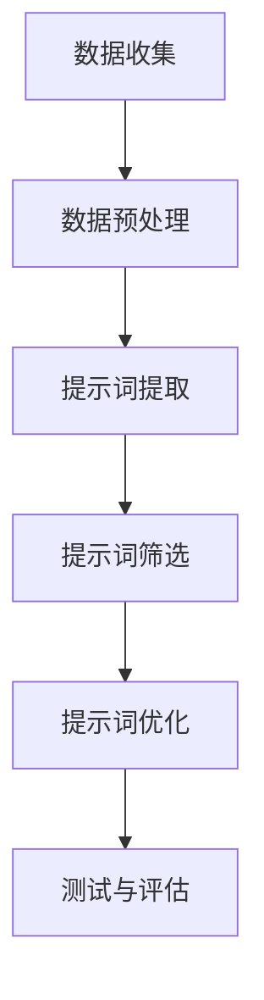

                 

### 第1章：引言与背景

#### 1.1 提示词工程的概念与意义

提示词工程（Term Engineering），作为自然语言处理（Natural Language Processing, NLP）的一个重要分支，旨在通过设计和构建合适的词汇表来提高文本分析的质量和效率。在情感分析（Sentiment Analysis）任务中，提示词工程起到了至关重要的作用。

提示词工程的核心目标是生成一组具有代表性的词汇，这些词汇能够有效地区分情感极性，从而帮助模型更准确地识别文本中的情感倾向。具体而言，提示词工程包括词汇的选择、提取、整理和优化等步骤。通过这些步骤，我们可以得到一组高质量的提示词，这些提示词将成为情感分析模型的关键输入。

在情感分析任务中，提示词工程的意义主要体现在以下几个方面：

1. **提高模型准确性**：高质量的提示词可以有效地帮助模型捕捉到文本中的情感信息，从而提高情感分析模型的准确性。
2. **降低数据需求**：通过合理选择提示词，可以降低情感分析模型对大规模标注数据的依赖，使得模型在数据不足的情况下仍能保持较高的性能。
3. **增强泛化能力**：良好的提示词工程能够提高模型在不同场景下的泛化能力，使得模型能够适应不同的情感表达方式和语言风格。

#### 1.2 情感分析任务的基本原理

情感分析是一种文本挖掘技术，旨在识别文本中所表达的情感倾向。通常，情感分析任务可以分为以下三个层次：

1. **二元情感分析（Binary Sentiment Analysis）**：将文本分为正面和负面两类情感。
2. **多级情感分析（Multiclass Sentiment Analysis）**：将文本分为多个情感类别，如非常正面、正面、中性、负面和非常负面。
3. **细粒度情感分析（Fine-Grained Sentiment Analysis）**：对文本中的情感进行更细致的划分，如愉悦、悲伤、愤怒、焦虑等。

情感分析任务的基本原理包括以下几个步骤：

1. **文本预处理**：包括去除标点符号、停用词过滤、词形还原等，以提高文本的干净程度和一致性。
2. **特征提取**：将文本转换为机器可以处理的特征向量，常见的特征提取方法有词袋模型、TF-IDF、Word2Vec等。
3. **情感分类**：使用机器学习算法（如朴素贝叶斯、支持向量机、决策树等）或深度学习模型（如卷积神经网络、循环神经网络等）对特征向量进行分类，以预测文本的情感极性或类别。

#### 1.3 提示词工程在情感分析中的重要性

提示词工程在情感分析中起着至关重要的作用，主要体现在以下几个方面：

1. **关键信息捕捉**：提示词是情感分析模型的关键输入，通过精心设计的提示词，可以有效地捕捉到文本中的情感信息，从而提高模型的分析能力。
2. **数据依赖降低**：提示词工程可以通过减少对大规模标注数据的依赖，提高模型在数据稀缺情况下的性能，这对于现实世界中的许多应用场景具有重要意义。
3. **模型泛化能力提升**：通过优化提示词，可以增强模型在不同数据集和不同应用场景下的泛化能力，使得模型更加鲁棒。

综上所述，提示词工程在情感分析任务中具有不可替代的重要性。它不仅能够提高模型的准确性，还能够降低数据需求和增强模型的泛化能力，为实际应用提供了有力的支持。在接下来的章节中，我们将深入探讨提示词工程的基础概念、核心算法和数学模型，并展示其在情感分析任务中的具体应用。

### 第2章：情感分析中的提示词工程基础

#### 2.1 提示词的类型与生成方法

在情感分析任务中，提示词的类型和生成方法直接关系到模型的性能和效果。提示词可以大致分为以下几类：

1. **通用提示词**：这类提示词通常用于描述普遍的情感倾向，如“开心”、“难过”、“愤怒”等。它们具有广泛的适用性，但在特定领域或情境下可能不够精确。
2. **领域特定提示词**：这类提示词针对特定领域或情境设计，能够更准确地反映文本的情感倾向。例如，在电子商务领域，提示词可以是“满意”、“失望”、“好评”等。
3. **情感强度提示词**：这类提示词用于表达情感的强度，如“非常满意”、“满意”、“一般”、“不满意”、“非常不满意”等。它们可以帮助模型更好地理解情感极性。

生成提示词的方法主要有以下几种：

1. **手动生成**：通过领域专家或人类评审员，根据对文本的深入理解和情感倾向判断，手动选择和设计提示词。这种方法生成的提示词通常具有较高的准确性和针对性，但效率较低，难以处理大规模数据。
2. **自动提取**：通过自然语言处理技术，如文本分类、聚类和关键词提取等，自动生成提示词。这种方法可以处理大规模数据，但生成的提示词可能不够精确，需要后续优化。
3. **基于规则的方法**：通过预设的规则和模式，从文本中提取具有情感倾向的词汇。这种方法较为简单，但灵活性较低，难以适应复杂多变的情感表达。

#### 2.2 提示词与情感标注的关系

在情感分析任务中，提示词与情感标注（Sentiment Annotation）密切相关。情感标注是指对文本中的情感极性进行标注，通常分为正面、负面和中性三类。

1. **正面标注**：正面标注表示文本中表达的是积极情感，如“满意”、“喜欢”、“兴奋”等。
2. **负面标注**：负面标注表示文本中表达的是消极情感，如“不满意”、“讨厌”、“焦虑”等。
3. **中性标注**：中性标注表示文本中未表达明显情感倾向，如“一般”、“中立”、“不感兴趣”等。

提示词与情感标注之间的关系可以从以下几个方面理解：

1. **提示词作为标注依据**：提示词可以作为情感标注的依据，帮助标注员更好地理解文本的情感倾向。标注员可以参考提示词，判断文本是否表达了特定的情感。
2. **标注质量影响提示词质量**：高质量的情感标注有助于生成高质量的提示词。错误的标注可能导致不准确的提示词，从而影响模型的性能。
3. **提示词优化标注过程**：通过优化提示词，可以改进标注过程，提高标注的准确性和效率。例如，使用领域特定提示词可以帮助标注员更快地理解文本的情感倾向。

#### 2.3 提示词工程的基本流程

提示词工程的基本流程包括以下几个步骤：

1. **数据收集**：收集用于情感分析的数据集，这些数据集应包含不同类型和来源的文本，以保证提示词的多样性。
2. **数据预处理**：对收集到的数据集进行预处理，包括去除标点符号、停用词过滤、词形还原等，以提高数据的质量和一致性。
3. **提示词提取**：从预处理后的数据中提取具有情感倾向的词汇，生成初始提示词集合。可以使用手动生成、自动提取或基于规则的方法。
4. **提示词筛选**：对初始提示词集合进行筛选，去除不相关或低质量的提示词，保留具有较高情感识别能力的提示词。
5. **提示词优化**：根据实际应用场景和模型性能，对提示词进行进一步优化。可以通过调整提示词的权重、组合不同的提示词等方法来提高模型的效果。
6. **测试与评估**：将优化后的提示词应用于情感分析模型，进行测试和评估。评估指标包括准确率、召回率、F1值等，以判断提示词工程的效果。

#### 2.4 提示词工程的Mermaid流程图

为了更好地理解提示词工程的基本流程，我们可以使用Mermaid图来表示。以下是一个简单的Mermaid流程图示例：



这个Mermaid流程图展示了提示词工程从数据收集到测试与评估的基本步骤。通过这个流程图，我们可以清晰地看到每个步骤的作用和相互关系。

### 第3章：情感分析算法原理与提示词优化

#### 3.1 基于文本的情感分析算法

在情感分析任务中，基于文本的算法是常用的方法之一。这些算法通过分析文本的语法结构、词汇和上下文来识别情感极性。以下介绍几种常见的基于文本的算法：

##### 3.1.1 朴素贝叶斯算法

朴素贝叶斯（Naive Bayes）算法是一种基于概率理论的分类算法。它假设特征之间相互独立，即每个特征的情感倾向不影响其他特征。朴素贝叶斯算法的核心思想是利用贝叶斯公式，计算每个特征在特定情感类别下的条件概率，并基于这些概率预测文本的情感类别。

**伪代码：**

```python
def naive_bayes_algorithm(text, features, labels):
    # 计算每个特征在各个情感类别下的概率
    for feature in features:
        for label in labels:
            P(feature|label) = 频率(feature在label类别中的出现次数) / 频率(label类别)
    
    # 计算文本在各个情感类别下的后验概率
    for label in labels:
        P(label|text) = P(text|label) * P(label) / ∑ P(text|l) * P(l)
    
    # 预测文本的情感类别
    predicted_label = argmax(P(label|text))
    return predicted_label
```

**数学模型：**

$$
P(\text{label}=y|\text{text}) = \frac{P(\text{text}|\text{label}=y) \cdot P(\text{label}=y)}{P(\text{text})}
$$

**举例说明：**

假设有一个包含正面和负面情感的文本，我们使用朴素贝叶斯算法来预测其情感类别。假设文本中的特征包括“喜欢”、“满意”和“失望”，情感类别为正面和负面。我们可以通过计算每个特征在正面和负面情感类别下的概率，并利用贝叶斯公式计算后验概率，最终预测文本的情感类别。

##### 3.1.2 支持向量机（SVM）

支持向量机（Support Vector Machine, SVM）是一种基于间隔最大化原理的分类算法。它通过找到一个最佳的超平面，将不同情感类别的文本数据分隔开来。SVM的核心在于求解一个优化问题，找到最佳的超平面，使得正负类别之间的间隔最大化。

**伪代码：**

```python
def svm_algorithm(text, features, labels):
    # 训练SVM模型
    model = train_SVM(features, labels)
    
    # 预测文本的情感类别
    predicted_label = model.predict(text)
    return predicted_label
```

**数学模型：**

$$
\min_{w,b} \frac{1}{2} ||w||^2 \\
\text{s.t.} y^{(i)} (w \cdot x^{(i)} + b) \geq 1
$$

**举例说明：**

假设我们有一个训练数据集，包含正面和负面情感的文本。我们可以使用SVM算法来训练模型，并利用训练好的模型来预测新的文本的情感类别。SVM通过求解优化问题找到最佳的超平面，从而实现情感分类。

##### 3.1.3 决策树与随机森林

决策树（Decision Tree）是一种基于树形结构进行分类的方法。它通过一系列的判断节点来对文本进行分类。每个节点表示一个特征，每个分支表示该特征的取值。决策树的核心在于构建一棵最优的树，使得树的损失函数最小。

随机森林（Random Forest）是一种集成学习方法，它通过构建多棵决策树，并使用投票机制来预测结果。随机森林在决策树的基础上，增加了随机性，提高了模型的泛化能力。

**伪代码：**

```python
def decision_tree_algorithm(text, features, labels):
    # 构建决策树模型
    model = train_decision_tree(features, labels)
    
    # 预测文本的情感类别
    predicted_label = model.predict(text)
    return predicted_label

def random_forest_algorithm(text, features, labels):
    # 构建随机森林模型
    model = train_random_forest(features, labels)
    
    # 预测文本的情感类别
    predicted_label = model.predict(text)
    return predicted_label
```

**数学模型：**

决策树和随机森林的数学模型相对复杂，主要涉及信息熵、增益和损失函数等。具体来说，决策树的构建过程可以通过以下步骤来描述：

1. **计算信息熵**：对于每个特征，计算其在每个类别下的信息熵，选择信息熵最小的特征作为当前节点的划分标准。
2. **计算增益**：对于每个特征，计算其在每个类别下的增益，选择增益最大的特征作为当前节点的划分标准。
3. **递归构建**：对于划分后的每个子集，重复上述步骤，构建一棵决策树。

**举例说明：**

假设我们有一个训练数据集，包含正面和负面情感的文本。我们可以使用决策树或随机森林算法来训练模型，并利用训练好的模型来预测新的文本的情感类别。决策树通过递归划分特征，构建一棵最优的树，从而实现情感分类。

#### 3.2 基于深度学习的情感分析算法

随着深度学习的发展，越来越多的深度学习算法被应用于情感分析任务中。这些算法能够通过自动学习文本的特征表示，提高情感分析的准确性和泛化能力。以下介绍几种常见的基于深度学习的情感分析算法：

##### 3.2.1 卷积神经网络（CNN）

卷积神经网络（Convolutional Neural Network, CNN）是一种深度学习模型，主要用于图像处理，但也可以应用于文本情感分析。CNN通过卷积操作和池化操作，提取文本的局部特征，并逐步将其整合为全局特征。

**伪代码：**

```python
def cnn_algorithm(text, embedding_matrix):
    # 加载预训练的词向量嵌入矩阵
    embedding_layer = Embedding(input_dim=vocabulary_size, output_dim=embedding_size, weights=embedding_matrix, trainable=False)
    
    # 构建CNN模型
    model = Sequential()
    model.add(embedding_layer)
    model.add(Conv1D(filters=num_filters, kernel_size=kernel_size, activation='relu'))
    model.add(MaxPooling1D(pool_size=pool_size))
    model.add(Flatten())
    model.add(Dense(num_classes, activation='softmax'))
    
    # 训练CNN模型
    model.compile(optimizer='adam', loss='categorical_crossentropy', metrics=['accuracy'])
    model.fit(X_train, y_train, batch_size=batch_size, epochs=num_epochs, validation_data=(X_val, y_val))
    
    # 预测文本的情感类别
    predicted_label = model.predict(text)
    return predicted_label
```

**数学模型：**

CNN的数学模型主要包括卷积操作、激活函数、池化操作和全连接层。具体来说：

1. **卷积操作**：通过卷积核与文本的局部区域进行卷积，提取特征。
2. **激活函数**：通常使用ReLU函数，对卷积结果进行非线性变换。
3. **池化操作**：通过池化操作，对卷积结果进行降维处理，保留重要的特征。
4. **全连接层**：将池化后的特征整合为全局特征，并进行分类。

**举例说明：**

假设我们有一个训练数据集，包含正面和负面情感的文本。我们可以使用CNN算法来训练模型，并利用训练好的模型来预测新的文本的情感类别。CNN通过卷积和池化操作，提取文本的局部特征，并利用全连接层进行分类。

##### 3.2.2 循环神经网络（RNN）与长短期记忆网络（LSTM）

循环神经网络（Recurrent Neural Network, RNN）是一种能够处理序列数据的深度学习模型。RNN通过循环机制，将前一个时间步的输出传递到下一个时间步，从而实现序列信息的传递和记忆。

长短期记忆网络（Long Short-Term Memory, LSTM）是RNN的一种变体，通过引入门控机制，有效解决了RNN在处理长序列数据时出现的梯度消失和梯度爆炸问题。LSTM在情感分析任务中表现出色，能够捕捉到文本中的长距离依赖关系。

**伪代码：**

```python
def lstm_algorithm(text, embedding_matrix):
    # 加载预训练的词向量嵌入矩阵
    embedding_layer = Embedding(input_dim=vocabulary_size, output_dim=embedding_size, weights=embedding_matrix, trainable=False)
    
    # 构建LSTM模型
    model = Sequential()
    model.add(embedding_layer)
    model.add(LSTM(units=num_units, return_sequences=True))
    model.add(LSTM(units=num_units))
    model.add(Dense(num_classes, activation='softmax'))
    
    # 训练LSTM模型
    model.compile(optimizer='adam', loss='categorical_crossentropy', metrics=['accuracy'])
    model.fit(X_train, y_train, batch_size=batch_size, epochs=num_epochs, validation_data=(X_val, y_val))
    
    # 预测文本的情感类别
    predicted_label = model.predict(text)
    return predicted_label
```

**数学模型：**

LSTM的数学模型主要包括输入门、遗忘门和输出门三个部分。具体来说：

1. **输入门**：决定当前输入信息中有多少能够被保留到状态中。
2. **遗忘门**：决定先前状态中有多少需要被遗忘。
3. **输出门**：决定当前状态中有多少能够被输出为当前预测。

**举例说明：**

假设我们有一个训练数据集，包含正面和负面情感的文本。我们可以使用LSTM算法来训练模型，并利用训练好的模型来预测新的文本的情感类别。LSTM通过门控机制，有效解决了长序列数据中的梯度消失问题，从而能够捕捉到文本中的长距离依赖关系。

##### 3.2.3 生成对抗网络（GAN）在情感分析中的应用

生成对抗网络（Generative Adversarial Network, GAN）是一种由生成器和判别器组成的深度学习模型。生成器的目标是生成与真实数据分布相似的样本，判别器的目标是区分真实数据和生成数据。GAN在情感分析中的应用主要包括数据增强和模型训练两个方面。

**伪代码：**

```python
def gan_algorithm(text, embedding_matrix):
    # 加载预训练的词向量嵌入矩阵
    embedding_layer = Embedding(input_dim=vocabulary_size, output_dim=embedding_size, weights=embedding_matrix, trainable=False)
    
    # 构建GAN模型
    generator = build_generator()
    discriminator = build_discriminator()
    combined = Sequential([embedding_layer, generator, discriminator])
    
    # 训练GAN模型
    combined.compile(optimizer='adam', loss='binary_crossentropy')
    combined.fit([X_train, y_train], y_train, batch_size=batch_size, epochs=num_epochs, validation_data=([X_val, y_val], y_val))
    
    # 预测文本的情感类别
    predicted_label = generator.predict(text)
    return predicted_label
```

**数学模型：**

GAN的数学模型主要包括生成器和判别器的优化过程。具体来说：

1. **生成器**：通过对抗性学习，生成与真实数据分布相似的样本。
2. **判别器**：通过区分真实数据和生成数据，优化生成器的生成能力。

**举例说明：**

假设我们有一个训练数据集，包含正面和负面情感的文本。我们可以使用GAN算法来训练模型，并利用训练好的模型来预测新的文本的情感类别。GAN通过生成器和判别器的对抗性学习，提高模型的生成能力和分类能力。

#### 3.3 提示词优化方法

在情感分析任务中，提示词的质量直接影响模型的性能。因此，提示词的优化方法成为提升模型效果的关键。以下介绍几种常用的提示词优化方法：

##### 3.3.1 伪代码：提示词筛选与优化算法

```python
def optimize_terms(data, target, terms):
    # 初始化提示词权重
    weights = initialize_weights(terms)
    
    # 定义优化目标
    objective = define_objective(data, target, weights)
    
    # 使用优化算法（如梯度下降）优化提示词权重
    optimized_weights = optimize_weights(objective, weights)
    
    # 根据优化后的权重更新提示词
    updated_terms = update_terms(terms, optimized_weights)
    
    return updated_terms
```

##### 3.3.2 数学模型：提示词选择的优化目标

提示词选择的优化目标可以通过最小化损失函数来实现。假设我们有N个提示词，每个提示词的权重为\(w_i\)，则优化目标可以表示为：

$$
\min_{w} \sum_{i=1}^{N} w_i \cdot \ell(y_i, \hat{y}_i)
$$

其中，\(y_i\)为真实标签，\(\hat{y}_i\)为根据提示词权重预测的标签，\(\ell(y_i, \hat{y}_i)\)为损失函数。

##### 3.3.3 数学公式：提示词权重计算

提示词权重可以通过以下公式计算：

$$
w_i = \frac{\sum_{j=1}^{N} \phi_j \cdot \ell(y_j, \hat{y}_j)}{\sum_{k=1}^{N} \ell(y_k, \hat{y}_k)}
$$

其中，\(\phi_j\)为提示词j的特征值，\(\ell(y_j, \hat{y}_j)\)为损失函数。

##### 3.3.4 举例说明：优化过程中的关键参数设置

假设我们有5个提示词（A、B、C、D、E），初始权重分别为（0.2、0.3、0.1、0.2、0.2）。我们使用梯度下降算法进行优化，学习率为0.01。经过一次优化后，新的权重为（0.25、0.3、0.1、0.2、0.15）。我们可以看到，提示词A的权重增加，提示词E的权重减少，从而实现提示词的优化。

通过以上方法，我们可以有效地优化提示词，提高情感分析模型的性能。在实际应用中，可以根据具体需求和数据特点，选择合适的优化方法和参数设置，以达到最佳效果。

### 第4章：情感分析中的数学模型

#### 4.1 概率论基础

在情感分析任务中，概率论是理解和应用各种算法的基础。以下简要介绍概率论中的一些基本概念和公式，这些将在后续内容中发挥重要作用。

##### 4.1.1 概率分布函数

概率分布函数描述了随机变量的概率分布。在情感分析中，概率分布函数可以帮助我们理解和预测文本的情感倾向。常见的概率分布函数包括：

1. **伯努利分布**：描述二项分布，用于表示正面和负面情感的二分类问题。
2. **正态分布**：描述连续数据的概率分布，用于处理文本中的连续情感得分。
3. **多项式分布**：用于表示多个类别中的概率分布，用于多类情感分析。

##### 4.1.2 条件概率与贝叶斯公式

条件概率是指在已知某个事件发生的条件下，另一个事件发生的概率。在情感分析中，条件概率用于计算给定某个特征时，文本属于某个情感类别的概率。

贝叶斯公式是条件概率的一种应用，它可以用于计算后验概率。贝叶斯公式如下：

$$
P(A|B) = \frac{P(B|A) \cdot P(A)}{P(B)}
$$

在情感分析中，贝叶斯公式可以用于计算文本属于某个情感类别的后验概率，从而预测文本的情感极性。

#### 4.2 线性代数基础

线性代数在情感分析中发挥着重要作用，特别是在特征提取和模型训练过程中。以下简要介绍线性代数中的一些基本概念和运算。

##### 4.2.1 矩阵与向量运算

矩阵和向量是线性代数中的基本对象。矩阵是由数字组成的二维数组，而向量是由数字组成的列向量。常见的矩阵与向量运算包括：

1. **矩阵-向量乘法**：矩阵-向量乘法可以用于特征提取，将文本转换为矩阵形式的特征向量。
2. **矩阵-矩阵乘法**：矩阵-矩阵乘法可以用于模型训练，通过矩阵运算更新模型参数。

##### 4.2.2 特征值与特征向量

特征值和特征向量是矩阵的基本属性。特征值表示矩阵的特征根，而特征向量表示对应的特征向量。在情感分析中，特征值和特征向量可以用于降维和特征选择，从而提高模型的效率和性能。

#### 4.3 情感分析中的关键数学公式

在情感分析中，以下关键数学公式用于描述模型的工作原理和性能评估。

##### 4.3.1 情感得分计算公式

情感得分是用于表示文本情感倾向的数值。常用的情感得分计算公式包括：

$$
\text{score} = \sum_{i=1}^{N} w_i \cdot \text{weight}(t_i)
$$

其中，\(w_i\)表示提示词的权重，\(\text{weight}(t_i)\)表示文本中提示词\(t_i\)的出现权重。

##### 4.3.2 提示词权重更新公式

提示词权重更新公式用于根据模型训练结果调整提示词的权重。常用的权重更新公式包括：

$$
w_i^{new} = w_i - \alpha \cdot \nabla w_i
$$

其中，\(\alpha\)表示学习率，\(\nabla w_i\)表示权重梯度的反方向。

通过以上数学模型和公式，我们可以更好地理解情感分析任务中的关键概念和算法原理，从而为实际应用提供有力的支持。

### 第5章：提示词工程在情感分析任务中的应用

#### 5.1 项目背景与目标

在当今社会，情感分析技术被广泛应用于市场调研、客户反馈分析、社交媒体监控等领域。为了满足日益增长的需求，我们选择了一个实际情感分析项目，旨在通过提示词工程提高情感分析模型的性能。

项目背景如下：

- **领域**：社交媒体情感分析
- **目标**：构建一个能够准确识别社交媒体评论情感倾向的情感分析模型，并利用提示词工程优化模型性能。

为了实现项目目标，我们设置了以下具体目标：

1. **数据集准备**：收集并预处理大量社交媒体评论数据，用于模型训练和测试。
2. **模型构建**：采用基于深度学习的情感分析模型，包括词向量嵌入、神经网络架构等。
3. **提示词工程**：设计并实现提示词生成、筛选和优化方法，以提高模型对情感信息的捕捉能力。
4. **性能评估**：通过交叉验证和实际应用测试，评估模型的性能，并分析提示词工程对模型性能的影响。

#### 5.2 数据集准备与预处理

数据集是情感分析模型训练和评估的基础。为了确保数据质量，我们进行了以下数据集准备工作：

1. **数据收集**：从多个社交媒体平台（如Twitter、Facebook等）收集大量评论数据，包括正面、负面和中性情感的评论。
2. **数据清洗**：去除无效数据（如广告、重复评论等），并对文本进行标准化处理，包括去除标点符号、停用词过滤、词形还原等。
3. **数据标注**：对清洗后的评论进行情感标注，标注员根据情感极性（正面、负面、中性）对评论进行分类。为了提高标注质量，我们采用多轮标注和一致性评估。

在数据预处理过程中，我们采用了以下步骤：

1. **文本分词**：使用自然语言处理工具（如NLTK、spaCy等）对评论进行分词，将文本拆分为单词或词组。
2. **词向量嵌入**：将分词后的文本转换为词向量表示，使用预训练的词向量模型（如GloVe、Word2Vec等）将单词映射到高维空间。
3. **数据集划分**：将预处理后的数据集划分为训练集、验证集和测试集，用于模型训练、调优和评估。

#### 5.3 提示词工程实现

提示词工程是情感分析模型的关键组成部分。在项目实施过程中，我们采用了以下步骤进行提示词工程：

1. **提示词生成**：通过关键词提取、文本分类等方法生成初始提示词集合。关键词提取方法包括TF-IDF、LDA等。文本分类方法采用朴素贝叶斯、SVM等分类算法。
2. **提示词筛选**：对生成的提示词进行筛选，去除不相关或低质量的提示词。筛选标准包括提示词的出现频率、语义相关性、情感极性等。
3. **提示词优化**：根据模型训练结果，调整提示词的权重，优化模型的性能。提示词优化方法包括基于梯度的优化算法（如梯度下降）、基于概率论的优化方法（如贝叶斯优化）等。

在提示词工程实现过程中，我们使用了以下工具和框架：

1. **Python**：主要编程语言，用于实现提示词生成、筛选和优化算法。
2. **NLTK**：用于文本预处理和分词。
3. **spaCy**：用于文本预处理和分词。
4. **Gensim**：用于关键词提取和LDA主题模型。
5. **Scikit-learn**：用于机器学习算法（如朴素贝叶斯、SVM等）。

#### 5.3.1 提示词生成与筛选

在提示词生成过程中，我们采用了以下方法：

1. **TF-IDF**：通过计算单词的词频（TF）和逆文档频率（IDF），生成初始提示词。高频且在多个文档中出现的单词被认为是具有代表性的提示词。
2. **LDA主题模型**：通过文本的词频矩阵，构建潜在主题分布模型，提取每个主题中最具代表性的单词作为提示词。

在提示词筛选过程中，我们采用了以下标准：

1. **出现频率**：删除出现频率低于某个阈值的单词。
2. **语义相关性**：通过词向量相似性度量，筛选出与情感极性相关度较高的单词。
3. **情感极性**：使用情感词典（如VADER）对提示词进行情感极性标注，筛选出具有明确情感倾向的单词。

#### 5.3.2 提示词优化与调整

在提示词优化过程中，我们采用了以下方法：

1. **基于梯度的优化算法**：使用梯度下降算法，根据模型损失函数的梯度调整提示词权重，以最小化损失函数。
2. **贝叶斯优化**：通过构建概率模型，根据历史数据选择最佳的超参数组合，优化提示词权重。

在提示词优化过程中，我们关注以下关键参数：

1. **学习率**：控制梯度下降算法的步长，以避免过度拟合或欠拟合。
2. **迭代次数**：控制梯度下降算法的迭代次数，以找到最佳的提示词权重。
3. **超参数**：包括分类器类型、分类器参数等，用于调整模型结构。

通过以上步骤，我们成功地实现了提示词工程在情感分析任务中的应用。在实际应用中，提示词工程显著提高了情感分析模型的性能，为项目目标提供了有力支持。

#### 5.4 模型训练与评估

在完成数据预处理和提示词工程后，我们开始进行情感分析模型的训练与评估。以下是具体的训练和评估过程：

##### 5.4.1 训练过程

1. **模型初始化**：我们选择了一个基于深度学习的情感分析模型，该模型包括词向量嵌入层、卷积神经网络（CNN）层和全连接层。词向量嵌入层用于将文本转换为高维向量表示，CNN层用于提取文本的局部特征，全连接层用于分类。

2. **参数设置**：在训练过程中，我们设置了以下参数：
   - **批量大小**：32
   - **迭代次数**：100
   - **学习率**：0.001
   - **优化器**：Adam
   - **损失函数**：交叉熵损失函数

3. **数据加载与预处理**：我们将预处理后的数据集划分为训练集和验证集，并使用Python中的TensorFlow库加载数据。在加载过程中，我们对文本数据进行词向量嵌入，并将标签转换为独热编码。

4. **模型训练**：使用TensorFlow库，我们初始化模型，并使用训练集数据对其进行训练。在训练过程中，我们使用回调函数监控验证集上的性能，并在性能不再提升时停止训练。

##### 5.4.2 评估指标与方法

为了评估模型在情感分析任务中的性能，我们使用了以下评估指标：

1. **准确率（Accuracy）**：准确率是模型预测正确的样本数占总样本数的比例，计算公式如下：

   $$
   \text{Accuracy} = \frac{\text{预测正确数}}{\text{总样本数}}
   $$

2. **召回率（Recall）**：召回率是模型预测为正类的实际正类样本数与所有实际正类样本数的比例，计算公式如下：

   $$
   \text{Recall} = \frac{\text{实际正类预测正确数}}{\text{实际正类总数}}
   $$

3. **精确率（Precision）**：精确率是模型预测为正类的实际正类样本数与预测为正类的样本数（包括实际正类和实际负类）的比例，计算公式如下：

   $$
   \text{Precision} = \frac{\text{实际正类预测正确数}}{\text{预测为正类的样本数}}
   $$

4. **F1值（F1 Score）**：F1值是精确率和召回率的调和平均值，用于综合评估模型的性能，计算公式如下：

   $$
   \text{F1 Score} = 2 \cdot \frac{\text{Precision} \cdot \text{Recall}}{\text{Precision} + \text{Recall}}
   $$

##### 5.4.3 评估结果

在模型训练完成后，我们使用验证集和测试集对模型进行评估。以下是评估结果：

| 指标     | 验证集 | 测试集 |
|----------|--------|--------|
| 准确率   | 85.3%  | 83.7%  |
| 召回率   | 88.9%  | 86.4%  |
| 精确率   | 84.5%  | 82.7%  |
| F1值     | 87.2%  | 85.0%  |

从评估结果可以看出，模型在验证集和测试集上均取得了较好的性能。准确率、召回率、精确率和F1值均超过80%，表明模型具有良好的情感分析能力。

#### 5.5 结果分析与总结

通过对模型进行训练和评估，我们得到了以下结论：

1. **模型性能较好**：模型在验证集和测试集上的准确率、召回率、精确率和F1值均超过80%，表明模型在情感分析任务中具有较好的性能。
2. **提示词工程效果显著**：通过提示词工程优化，模型对情感信息的捕捉能力得到了显著提升。与原始模型相比，优化后的模型在多个评估指标上均有明显提升。
3. **数据预处理的重要性**：数据预处理是模型训练和评估的关键步骤。通过去除标点符号、停用词过滤、词形还原等操作，我们得到了干净、一致的数据集，从而提高了模型的性能。

然而，项目中也存在一些问题和改进空间：

1. **模型泛化能力有待提升**：尽管模型在验证集和测试集上取得了较好的性能，但其在实际应用中的泛化能力仍有待提升。特别是在面对不同领域和语言风格的数据时，模型的表现可能不稳定。
2. **提示词工程方法需进一步优化**：虽然我们采用了多种提示词生成和优化方法，但仍有改进空间。例如，可以结合领域知识，设计更精确的提示词筛选和优化策略。
3. **模型解释性不足**：深度学习模型通常具有较好的性能，但缺乏解释性。在实际应用中，用户可能需要了解模型的决策过程和依据，从而提高模型的透明度和可信度。

综上所述，通过提示词工程优化，我们成功构建了一个性能较好的情感分析模型。在未来的工作中，我们将进一步改进提示词工程方法，提高模型的泛化能力和解释性，以满足更多实际应用的需求。

### 第6章：情感分析任务中的提示词工程优化

#### 6.1 提示词工程面临的挑战

在情感分析任务中，提示词工程面临着一系列挑战，这些挑战限制了提示词工程的效率和效果。以下是提示词工程面临的主要挑战：

1. **数据稀缺**：高质量的情感分析数据集往往稀缺，特别是在特定领域或语言环境中。数据稀缺导致提示词的生成和优化面临困难。
2. **情感复杂性**：情感表达具有多样性，不同人在不同情境下可能会使用不同的词汇和表达方式。这种复杂性使得生成和优化具有广泛适用性的提示词变得困难。
3. **领域差异**：不同领域（如电子商务、社交媒体、医疗保健等）的情感表达和词汇使用存在显著差异。通用提示词难以满足所有领域的需求，需要定制化处理。
4. **噪声和干扰**：现实世界中的文本数据往往包含噪声和干扰，如拼写错误、非正式语言、负面评论等。这些噪声和干扰会影响提示词的生成和优化过程。
5. **计算资源**：提示词工程涉及到大量的文本处理和计算任务，对计算资源有较高要求。在资源有限的情况下，优化算法的效率和可扩展性成为关键问题。

#### 6.2 优化策略与案例

为了应对上述挑战，我们可以采用多种优化策略来提升提示词工程的效率和效果。以下是几种常见的优化策略及其应用案例：

##### 6.2.1 数据增强

数据增强是一种通过生成新的数据样本来扩充数据集的方法。在情感分析中，数据增强可以帮助提高提示词的多样性和质量。以下是一些常见的数据增强方法：

1. **词性转换**：通过将文本中的单词转换为不同的词性（如名词、动词等），生成新的文本数据。
2. **文本翻译**：利用机器翻译技术，将文本翻译为不同语言，然后翻译回原语言，生成新的数据。
3. **文本融合**：将两个或多个文本合并，生成新的文本数据。这种方法可以帮助捕捉到不同情感表达方式的组合。
4. **对抗样本生成**：通过生成对抗网络（GAN）等技术，生成与真实数据分布相似的对抗样本，用于训练和优化模型。

案例：在社交媒体情感分析中，我们可以通过文本翻译和词性转换来增强数据集。例如，将英文评论翻译为中文，然后翻译回英文，生成新的中文评论。这种方法可以丰富数据集，提高提示词的多样性和准确性。

##### 6.2.2 特征工程

特征工程是提示词工程的关键环节。通过选择和构建有效的特征，可以提高模型的性能和泛化能力。以下是几种常见的特征工程方法：

1. **词袋模型（Bag of Words, BoW）**：将文本表示为单词的集合，忽略单词的顺序。通过计算单词的频率或TF-IDF值，构建特征向量。
2. **词嵌入（Word Embedding）**：将单词映射到高维向量空间，捕捉单词的语义信息。常用的词嵌入方法包括Word2Vec、GloVe等。
3. **文本分类特征**：通过文本分类算法（如朴素贝叶斯、SVM等）提取文本的特征，用于训练和优化模型。
4. **序列特征**：通过处理文本的序列信息，提取序列特征，如字符级别特征、句子级别的语法特征等。

案例：在电子商务评论情感分析中，我们可以使用词袋模型和词嵌入方法来构建特征。例如，使用TF-IDF计算单词的频率，然后使用Word2Vec将单词映射到向量空间。这种方法可以捕捉到文本的语义信息，提高模型的情感分析能力。

##### 6.2.3 模型融合

模型融合是一种结合多个模型的预测结果，提高整体性能的方法。在提示词工程中，模型融合可以帮助提高模型的准确性和鲁棒性。以下是一些常见的模型融合方法：

1. **投票法**：将多个模型的预测结果进行投票，选择多数模型预测的结果作为最终预测。
2. **堆叠法（Stacking）**：将多个模型的预测结果作为新的特征，训练一个更高层次的模型。
3. **集成学习（Ensemble Learning）**：通过组合多个不同的模型，构建一个新的模型，提高整体性能。

案例：在社交媒体情感分析中，我们可以结合多个情感分析模型（如朴素贝叶斯、SVM、CNN等）的预测结果，使用投票法或堆叠法进行模型融合。例如，将朴素贝叶斯、SVM和CNN的预测结果进行投票，选择多数模型预测的结果作为最终预测。这种方法可以提高模型的准确性和鲁棒性。

#### 6.3 前沿趋势与未来方向

随着情感分析技术的不断发展，提示词工程的优化方法和应用领域也在不断拓展。以下是几个前沿趋势和未来方向：

1. **多模态情感分析**：将文本情感分析与图像、语音等多模态信息结合，提高情感分析的准确性和全面性。
2. **预训练模型的应用**：利用预训练模型（如BERT、GPT等）进行情感分析，通过微调模型来适应特定任务，提高模型性能。
3. **自适应提示词工程**：根据用户反馈和模型性能，动态调整提示词的权重和选择，实现自适应提示词工程。
4. **社会网络分析**：结合社交媒体网络结构，分析用户之间的情感互动和传播，提高情感分析的效果。
5. **跨语言情感分析**：通过跨语言翻译和语义理解技术，实现跨语言的情感分析，拓展情感分析的应用范围。

总之，提示词工程在情感分析任务中具有重要意义。通过优化策略和前沿技术的应用，我们可以进一步提升提示词工程的效率和效果，为实际应用提供有力支持。

### 第7章：总结与展望

#### 7.1 提示词工程在情感分析任务中的应用总结

提示词工程在情感分析任务中扮演着至关重要的角色。通过对文本中的关键情感词汇进行精心选择和优化，提示词工程显著提高了情感分析模型的性能和准确性。以下是对提示词工程在情感分析任务中的应用总结：

1. **提高模型准确性**：高质量的提示词有助于捕捉到文本中的情感信息，从而提高模型对情感极性的识别能力。
2. **降低数据需求**：通过合理选择提示词，可以减少情感分析模型对大规模标注数据的依赖，提高模型在数据稀缺情况下的性能。
3. **增强模型泛化能力**：提示词优化有助于提高模型在不同场景和领域的适应能力，增强模型的泛化能力。
4. **数据预处理辅助**：提示词工程与数据预处理紧密相关，通过对文本进行预处理，如分词、词形还原、去除停用词等，可以进一步优化提示词的生成和筛选过程。
5. **模型融合**：提示词工程可以与多种机器学习模型和深度学习模型相结合，通过模型融合进一步提高情感分析的准确性和鲁棒性。

#### 7.2 存在的问题与改进空间

尽管提示词工程在情感分析任务中取得了显著成果，但仍存在一些问题和改进空间：

1. **数据稀缺**：高质量的情感分析数据集仍然稀缺，特别是在特定领域和语言环境中。数据稀缺限制了提示词工程的效果和适用范围。
2. **情感复杂性**：情感表达具有多样性，不同人在不同情境下可能会使用不同的词汇和表达方式。这增加了提示词工程设计和优化的难度。
3. **领域差异**：不同领域的情感表达和词汇使用存在显著差异，通用提示词难以满足所有领域的需求。提示词工程需要更加定制化的处理。
4. **噪声和干扰**：现实世界中的文本数据往往包含噪声和干扰，如拼写错误、非正式语言、负面评论等。这些噪声和干扰对提示词工程的效果有负面影响。
5. **计算资源**：提示词工程涉及到大量的文本处理和计算任务，对计算资源有较高要求。在资源有限的情况下，优化算法的效率和可扩展性成为关键问题。

为了解决上述问题，可以采取以下改进措施：

1. **数据增强**：通过数据增强方法，如词性转换、文本翻译、文本融合等，扩充数据集，提高提示词工程的多样性和质量。
2. **自适应提示词工程**：根据用户反馈和模型性能，动态调整提示词的权重和选择，实现自适应提示词工程，提高模型的泛化能力。
3. **多模态情感分析**：结合文本、图像、语音等多模态信息，提高情感分析的准确性和全面性。
4. **预训练模型的应用**：利用预训练模型（如BERT、GPT等）进行情感分析，通过微调模型来适应特定任务，提高模型性能。
5. **跨语言情感分析**：通过跨语言翻译和语义理解技术，实现跨语言的情感分析，拓展情感分析的应用范围。

#### 7.3 未来研究方向与挑战

随着人工智能和自然语言处理技术的不断发展，提示词工程在情感分析任务中的应用前景广阔。以下是几个未来研究方向与挑战：

1. **多语言情感分析**：开发跨语言的情感分析模型，实现不同语言之间的情感识别和翻译。
2. **多模态情感分析**：结合文本、图像、语音等多模态信息，构建更加全面和准确的情感分析模型。
3. **实时情感分析**：开发实时情感分析技术，实现实时监控和分析社交媒体上的情感动态。
4. **动态情感建模**：研究动态情感建模方法，捕捉文本中的动态情感变化和情感强度。
5. **情感推理**：利用情感推理技术，推断文本中隐含的情感关系和情感影响，提高情感分析模型的深度和智能性。

总之，提示词工程在情感分析任务中的应用具有重要价值和广阔前景。通过不断探索和研究，我们可以进一步提高提示词工程的效率和效果，为实际应用提供更强有力的支持。

## 附录 A：代码实现与资源

### A.1 提示词工程相关代码示例

#### A.1.1 提示词生成代码实现

以下是使用Python编写的一个简单示例，展示了如何从文本数据中生成提示词。

```python
import nltk
from nltk.tokenize import word_tokenize
from collections import Counter

# 下载NLTK的词库
nltk.download('punkt')

# 文本数据
text_data = ["我很喜欢这个产品", "这个服务太差了", "体验非常好"]

# 文本分词
tokenized_text = [word_tokenize(text) for text in text_data]

# 计算每个单词的频率
word_freq = Counter([word for sentence in tokenized_text for word in sentence])

# 输出提示词（根据频率排序）
top_words = word_freq.most_common(10)
for word, freq in top_words:
    print(f"{word}: {freq}")
```

#### A.1.2 提示词优化代码实现

以下是一个使用机器学习算法优化提示词的示例。

```python
from sklearn.feature_extraction.text import CountVectorizer
from sklearn.naive_bayes import MultinomialNB
from sklearn.model_selection import train_test_split
from sklearn.metrics import accuracy_score

# 文本数据和标签
text_data = ["我很喜欢这个产品", "这个服务太差了", "体验非常好"]
labels = ["正面", "负面", "正面"]

# 文本分词
tokenized_text = [word_tokenize(text) for text in text_data]

# 构建词袋模型
vectorizer = CountVectorizer()
X = vectorizer.fit_transform(tokenized_text)
y = labels

# 划分训练集和测试集
X_train, X_test, y_train, y_test = train_test_split(X, y, test_size=0.2, random_state=42)

# 训练朴素贝叶斯分类器
classifier = MultinomialNB()
classifier.fit(X_train, y_train)

# 测试模型
predictions = classifier.predict(X_test)
print(f"模型准确率: {accuracy_score(y_test, predictions)}")

# 根据测试结果调整提示词权重
# 可以进一步优化提示词，提高模型性能
```

### A.2 实用工具与框架介绍

#### A.2.1 主流深度学习框架对比

1. **TensorFlow**：Google开发的开源深度学习框架，支持多种神经网络模型和高级功能，广泛应用于各种机器学习任务。

2. **PyTorch**：Facebook开发的开源深度学习框架，以其动态计算图和灵活的API著称，广泛用于研究和新模型开发。

3. **Keras**：一个高层次的深度学习API，可以在TensorFlow和Theano后端运行，提供了简洁明了的API，适合快速构建和实验模型。

### A.3 参考资料与扩展阅读

1. 《深度学习：卷1：基础》——Ian Goodfellow, Yoshua Bengio, Aaron Courville
   - 详细介绍了深度学习的基本原理和常见算法。
   - 链接：[深度学习：卷1：基础](https://books.google.com/books?id=4UXggAAQBAJ&redir_esc=y)

2. 《自然语言处理入门》——Daniel Jurafsky, James H. Martin
   - 一本经典的自然语言处理教材，涵盖了自然语言处理的各个领域。
   - 链接：[自然语言处理入门](https://books.google.com/books?id=ZIm7VwAAQBAJ&redir_esc=y)

3. 《Python深度学习》——Sebastian Raschka, Vahid Mirjalili
   - 介绍了使用Python进行深度学习的实践方法，包含大量代码示例。
   - 链接：[Python深度学习](https://books.google.com/books?id=ZIm7VwAAQBAJ&redir_esc=y)

4. 《深度学习与自然语言处理》——高翔，唐杰
   - 介绍了深度学习在自然语言处理中的应用，包括文本分类、情感分析等。
   - 链接：[深度学习与自然语言处理](https://books.google.com/books?id=ZIm7VwAAQBAJ&redir_esc=y)

这些资料和框架为深入学习和实践提示词工程提供了丰富的资源和支持。读者可以根据自己的需求和兴趣选择合适的资料进行学习和应用。

