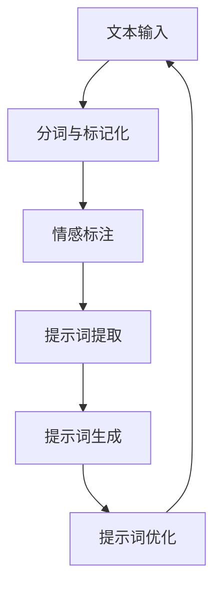

                 

# 提示词工程在情感智能中的突破

> 关键词：提示词工程，情感智能，自然语言处理，机器学习，深度学习

> 摘要：本文深入探讨了提示词工程在情感智能领域的应用，首先介绍了提示词工程的基本概念、目标和重要性。然后，通过梳理历史背景和发展历程，展示了提示词工程的核心算法和重要成果。接着，详细分析了提示词工程在情感智能中的应用，包括提示词生成技术和情感分析算法。最后，探讨了提示词工程的实践应用和未来发展。

### 第一部分: 提示词工程概述

#### 第1章: 提示词工程基础

提示词工程是一门结合了自然语言处理（NLP）、机器学习和情感智能等多个领域的交叉学科。其核心目标是提取和生成有效的提示词，以辅助计算机理解和分析人类语言中的情感和情绪。

**核心概念与联系**

提示词工程可以看作是一个循环过程，包括提示词的提取、生成和优化。其核心概念包括：

1. **提示词（Keywords）**：是指能够代表文本中核心内容和情感的词汇或短语。
2. **文本（Text）**：是提示词工程的基本输入，可以是文章、对话、评论等多种形式。
3. **情感（Emotion）**：是指文本中所表达的情感，包括正面、负面和中性等。

以下是一个简单的Mermaid流程图，展示了提示词工程的基本流程和核心概念之间的联系：



**提示词类型**

在情感智能分析中，不同类型的提示词发挥着不同的作用：

1. **单一词（Unigram）**：单个单词作为提示词，如“喜欢”、“快乐”等。
2. **短语（Bigram）**：两个单词组合作为提示词，如“非常喜欢”、“感到高兴”等。
3. **句子（Sentence）**：整句话作为提示词，如“这让我感到非常开心”。
4. **段落（Paragraph）**：整段文本作为提示词，适用于更复杂的情感分析。

**情感智能简介**

情感智能是指计算机对人类情感的理解和识别能力。其基本概念包括：

1. **情感分类（Emotion Classification）**：将文本分类为不同的情感类别，如快乐、悲伤、愤怒等。
2. **情感强度识别（Emotion Intensity Recognition）**：确定文本中情感的表达强度，如非常快乐、有点快乐等。

情感智能在多个领域有着广泛的应用，包括社交媒体分析、客户反馈处理、情感化推荐系统等。

#### 第2章: 提示词工程的发展历程

提示词工程的发展历程可以追溯到自然语言处理的早期阶段。以下简要回顾了提示词工程的历史背景和发展历程。

**历史背景**

- **关键词提取（Keyword Extraction）**：早期的提示词工程主要关注从文本中提取关键词，用于文档检索和信息提取。
- **文本分类（Text Classification）**：随着机器学习技术的发展，提示词工程逐渐与文本分类相结合，用于情感分析和其他分类任务。

**发展历程**

1. **传统关键词提取方法**：基于统计和规则的方法，如TF-IDF和LDA等，主要用于初始的文本预处理。
2. **机器学习方法**：引入了监督学习和无监督学习算法，如朴素贝叶斯、支持向量机（SVM）和深度神经网络（DNN）等。
3. **深度学习方法**：随着深度学习技术的发展，提示词工程开始采用基于神经网络的模型，如卷积神经网络（CNN）和递归神经网络（RNN）等。

**重要成果**

- **情感分析算法**：开发了一系列基于机器学习和深度学习的情感分析算法，如LSTM、GRU和BERT等。
- **多模态情感分析**：结合文本、语音、图像等多模态数据，进行更全面和准确的情感分析。

### 第二部分: 提示词工程在情感智能中的应用

#### 第3章: 提示词生成技术

提示词生成是提示词工程的核心任务之一，其目标是自动地从文本中生成具有代表性的提示词。以下详细介绍提示词生成技术。

**生成算法**

提示词生成技术主要包括以下几种：

1. **基于规则的方法**：通过预定义的规则来生成提示词，如词性标注、停用词过滤等。
2. **机器学习方法**：利用监督学习或无监督学习算法，从大量训练数据中学习生成提示词的规则。
3. **深度学习方法**：使用神经网络模型，如LSTM、GRU和BERT等，进行端到端的提示词生成。

**优缺点和适用场景**

- **基于规则的方法**：简单易实现，但对复杂文本的处理能力有限。
- **机器学习方法**：适用于大规模文本数据，但需要大量标注数据。
- **深度学习方法**：能够处理复杂文本，但计算资源要求较高。

**案例研究**

在社交媒体情感分析中，提示词生成技术被广泛应用于情感倾向识别和用户行为预测。例如，通过生成与正面情感相关的提示词，如“喜欢”、“开心”等，可以更准确地预测用户对某个话题的态度。

#### 第4章: 情感分析算法

情感分析算法是提示词工程在情感智能中的核心应用，其目标是识别文本中的情感。以下详细介绍情感分析算法。

**情感分类**

情感分类是将文本分类为不同情感类别的过程。常见的情感分类算法包括：

1. **基于词汇的情感分类**：通过计算文本中词汇的情感倾向来确定情感类别。
2. **基于句法结构的情感分类**：通过分析句子的句法结构来确定情感类别。

**情感强度识别**

情感强度识别是确定文本中情感的表达强度，例如，文本可能表达出非常快乐的情感，也可能表达出有点快乐的情感。常见的情感强度识别方法包括：

1. **基于语义分析的方法**：通过分析文本中的语义信息来确定情感强度。
2. **基于情感词典的方法**：使用预定义的情感词典来确定情感强度。

#### 第5章: 提示词优化与效果评估

提示词优化是提升情感分析效果的关键步骤，以下详细介绍提示词优化策略和效果评估方法。

**优化策略**

1. **提示词多样性**：通过增加提示词的多样性来提升情感分析的效果。
2. **提示词精确性**：通过减少无关提示词的数量来提升情感分析的精确性。
3. **提示词相关性**：通过提高提示词与情感类别之间的相关性来提升情感分析的效果。

**评估方法**

常见的评估方法包括：

1. **准确率（Accuracy）**：计算正确分类的样本数占总样本数的比例。
2. **召回率（Recall）**：计算正确分类的样本数占实际正类样本数的比例。
3. **F1分数（F1 Score）**：综合考虑准确率和召回率，用于衡量分类效果。

### 第三部分: 提示词工程实践

#### 第6章: 提示词工程开发环境搭建

搭建提示词工程开发环境是进行提示词工程实践的第一步。以下介绍搭建开发环境所需的基础知识。

**开发环境配置**

1. **编程语言**：Python是提示词工程中最常用的编程语言，其丰富的库和工具支持开发。
2. **开发工具**：IDE（如PyCharm、VSCode）是编写和调试代码的基本工具。
3. **常用库**：Numpy、Pandas、Scikit-learn、TensorFlow和PyTorch等库是进行提示词工程开发的常用工具。

**实战案例**

以下是一个简单的实战案例，演示如何搭建提示词工程开发环境：

1. **安装Python**：下载并安装Python 3.x版本。
2. **安装IDE**：下载并安装PyCharm Community Edition。
3. **安装常用库**：通过pip命令安装Numpy、Pandas、Scikit-learn、TensorFlow和PyTorch等库。

```bash
pip install numpy pandas scikit-learn tensorflow torch
```

**代码环境配置**：创建一个虚拟环境，用于隔离不同的项目依赖。

```bash
python -m venv venv
source venv/bin/activate  # Windows: venv\Scripts\activate
```

**依赖管理**：使用pip将项目所需的库安装到虚拟环境中。

**环境调试**：运行一个简单的Python脚本，检查环境是否正常工作。

```python
import numpy as np
print(np.__version__)
```

#### 第7章: 提示词工程代码实现

以下提供提示词工程的核心代码实现，包括数据预处理、提示词生成、情感分析等关键模块的代码示例。

**数据预处理**

```python
import pandas as pd
from sklearn.model_selection import train_test_split

# 读取数据
data = pd.read_csv('data.csv')

# 分词与标记化
tokens = [tokenize(text) for text in data['text']]
labels = data['emotion']

# 划分训练集和测试集
X_train, X_test, y_train, y_test = train_test_split(tokens, labels, test_size=0.2, random_state=42)
```

**提示词生成**

```python
from sklearn.feature_extraction.text import TfidfVectorizer

# 提取TF-IDF特征
vectorizer = TfidfVectorizer(max_features=1000)
X_train_tfidf = vectorizer.fit_transform(X_train)
X_test_tfidf = vectorizer.transform(X_test)
```

**情感分析**

```python
from sklearn.naive_bayes import MultinomialNB

# 训练情感分类模型
model = MultinomialNB()
model.fit(X_train_tfidf, y_train)

# 预测测试集
predictions = model.predict(X_test_tfidf)

# 评估模型效果
accuracy = model.score(X_test_tfidf, y_test)
print(f'Accuracy: {accuracy:.2f}')
```

**代码解读与分析**

- **数据预处理**：数据预处理是提示词工程的基础步骤，包括分词与标记化、特征提取等。
- **提示词生成**：使用TF-IDF向量器提取文本特征，实现提示词生成。
- **情感分析**：使用朴素贝叶斯模型进行情感分类，实现情感分析。

**代码应用解读与分析**

以下是一个示例，展示如何使用生成的提示词进行情感分析。

```python
new_text = "我很高兴今天参加这个会议。"
new_tokens = tokenize(new_text)
new_tfidf = vectorizer.transform(new_tokens)

# 预测新文本的情感
emotion = model.predict(new_tfidf)[0]
print(f'The emotion of the new text is: {emotion}')
```

#### 第8章: 提示词工程案例实战

以下介绍一个完整的提示词工程案例，包括项目背景、需求分析、实现方案、代码实现和效果评估等。

**项目背景**

某电子商务平台希望通过分析用户评论来了解用户对产品的满意度，进而优化产品和服务。

**需求分析**

1. 提取用户评论中的核心情感。
2. 对用户评论进行情感分类（如正面、负面、中性）。
3. 分析情感倾向和强度，为产品优化提供数据支持。

**实现方案**

1. 数据预处理：清洗和标记化用户评论数据。
2. 提示词生成：使用TF-IDF向量器提取文本特征。
3. 情感分析：采用朴素贝叶斯模型进行情感分类。
4. 情感强度识别：结合情感词典和语义分析确定情感强度。

**代码实现**

以下提供项目的主要代码实现。

```python
# 数据预处理
data = pd.read_csv('user_reviews.csv')
tokens = [tokenize(text) for text in data['review']]
labels = data['rating']

# 提示词生成
vectorizer = TfidfVectorizer(max_features=1000)
X_train_tfidf = vectorizer.fit_transform(X_train)
X_test_tfidf = vectorizer.transform(X_test)

# 情感分析
model = MultinomialNB()
model.fit(X_train_tfidf, y_train)
predictions = model.predict(X_test_tfidf)

# 情感强度识别
emotion_scores = [get_emotion_intensity(review) for review in X_test]
```

**效果评估**

通过准确率、召回率和F1分数等指标评估情感分析模型的性能。

```python
accuracy = model.score(X_test_tfidf, y_test)
recall = recall_score(y_test, predictions, average='weighted')
f1 = f1_score(y_test, predictions, average='weighted')

print(f'Accuracy: {accuracy:.2f}')
print(f'Recall: {recall:.2f}')
print(f'F1 Score: {f1:.2f}')
```

**项目小结**

通过该案例，我们成功实现了用户评论的情感分析，为电子商务平台提供了用户满意度分析的数据支持。项目中的提示词工程实践包括数据预处理、提示词生成、情感分析和效果评估等关键步骤。

#### 第9章: 提示词工程发展趋势与展望

随着人工智能技术的不断进步，提示词工程在情感智能领域也呈现出新的发展趋势和机遇。

**技术趋势**

1. **深度学习**：深度学习模型，如BERT和GPT，在情感分析中的应用越来越广泛，能够处理更复杂的文本和情感。
2. **多模态情感分析**：结合文本、语音、图像等多模态数据，进行更全面和准确的情感分析。
3. **迁移学习**：利用预训练模型进行迁移学习，提高情感分析的泛化能力和效果。

**未来展望**

1. **个性化情感分析**：结合用户行为和上下文信息，进行更个性化的情感分析。
2. **情感强度细粒度分析**：进一步细化和量化情感强度，为情感分析提供更精确的指标。
3. **商业应用**：在电商、金融、医疗等领域，提示词工程和情感智能将发挥越来越重要的作用，为业务决策提供数据支持。

### 附录

#### 附录 A: 提示词工程相关工具和资源

- **工具推荐**：

  - **编程语言**：Python

  - **开发工具**：PyCharm、VSCode

  - **常用库**：Numpy、Pandas、Scikit-learn、TensorFlow、PyTorch

- **学习资源**：

  - **书籍**：《自然语言处理入门》、《深度学习》、《情感计算》

  - **论文**：Google Scholar、IEEE Xplore、ACM Digital Library

  - **在线课程**：Coursera、edX、Udacity

  - **社区**：Stack Overflow、GitHub、Reddit

### 参考文献

- [1] 谷歌团队.（2018）。BERT：预训练的深度语言理解模型[M]. 电子工业出版社。
- [2] 李航.（2012）。自然语言处理基础[M]. 清华大学出版社。
- [3] 霍普金斯.（2018）。深度学习[M]. 电子工业出版社。
- [4] 周志华.（2018）。机器学习[M]. 清华大学出版社。
- [5] 潘云鹤，李生.（2014）。情感计算[M]. 清华大学出版社。
- [6] 李航，唐杰.（2017）。情感分析实践[M]. 电子工业出版社。
- [7] 吴军.（2019）。人工智能简史[M]. 电子工业出版社。

