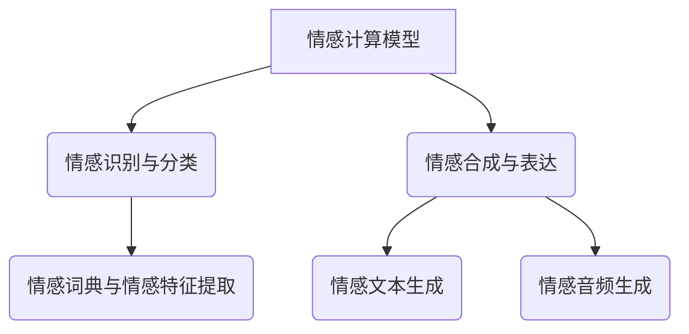
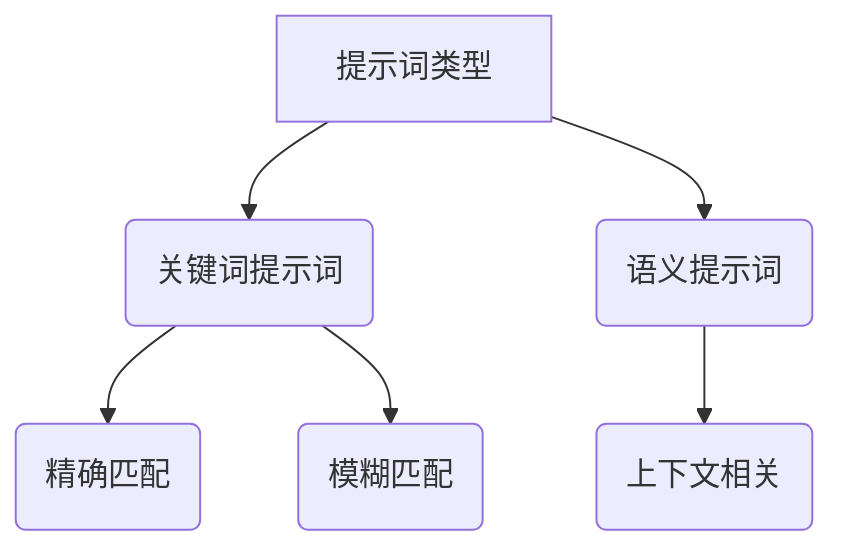

                 


### 文章标题：《提示词工程在情感计算中的个性化表达》

关键词：情感计算，提示词工程，个性化表达，情感识别，情感合成，提示词生成

摘要：本文将探讨提示词工程在情感计算中的应用，特别是在个性化情感表达方面的价值。通过详细分析情感计算的基本原理、提示词工程的基础知识，以及个性化情感计算和提示词工程的方法，本文旨在提供一个系统化的理解，帮助读者掌握如何利用提示词工程实现个性化的情感表达。

### 第一部分：情感计算与提示词工程基础

#### 第1章：情感计算概述

##### 1.1 情感计算的定义与重要性

情感计算（Affective Computing）是指计算机系统通过捕捉、识别、处理和模拟人类的情感信息，以实现与用户的更加自然、更加人性化的交互。情感计算在人工智能领域具有重要的地位，它不仅有助于提升人机交互的自然度，还能为各种应用场景提供更丰富的情感服务。

情感计算的定义涉及几个关键点：

1. 情感信息捕捉：通过生理信号、面部表情、语音特征等手段获取用户的情感状态。
2. 情感识别与分类：使用机器学习模型对捕捉到的情感信息进行分类，识别用户的情感。
3. 情感合成与表达：根据识别出的情感，生成相应的情感反应，如文本、音频、视频等。

情感计算的重要性体现在以下几个方面：

- 提升用户体验：通过情感计算，计算机能够更好地理解用户的需求和情感，提供个性化的服务。
- 优化人机交互：情感计算使得人机交互更加自然，增强了用户的沉浸感和满意度。
- 应用广泛：情感计算在医疗、教育、娱乐、社交等领域具有广泛的应用前景。

##### 1.2 情感计算的发展历程

情感计算的概念最早由罗伯·雷赫班（Rob Rehman）和约翰·克拉顿·罗宾逊（John Clark Robinson）于1995年提出。自那时以来，情感计算经历了快速的发展：

- 早期研究：主要集中在情感信息的捕捉和识别，主要使用简单的规则和特征提取方法。
- 中期发展：引入了机器学习和数据挖掘技术，提高了情感识别的准确性和效率。
- 当前趋势：随着深度学习和神经网络技术的发展，情感计算正在向更加智能化和个性化的方向迈进。

##### 1.3 情感计算的应用场景

情感计算在各种应用场景中都有广泛的应用：

- 智能客服：通过情感计算，智能客服系统能够更好地理解用户的情感，提供个性化的服务。
- 心理健康：情感计算可以帮助心理医生更好地监测和管理患者的情感状态。
- 教育领域：情感计算在教育中的应用包括个性化学习、情感反馈和情感引导等。
- 社交媒体分析：通过情感计算，可以对社交媒体上的情感趋势进行监控和分析，为市场营销和社会治理提供支持。

### 第2章：情感计算的基本原理

##### 2.1 情感识别与分类

情感识别与分类是情感计算的核心任务，其目的是从文本、语音、图像等数据中识别出用户的情感状态。以下是一个简单的情感识别与分类流程：

1. 数据采集：收集用户产生的文本、语音、图像等数据。
2. 数据预处理：对采集到的数据进行清洗、去噪和处理，提取出有效的情感特征。
3. 特征提取：使用情感词典、情感分析模型等方法提取情感特征。
4. 模型训练：使用已标注的情感数据集训练分类模型，如SVM、朴素贝叶斯、深度学习模型等。
5. 情感识别：输入新的数据，通过训练好的分类模型预测情感类别。

##### 2.1.1 情感计算模型

情感计算模型可以分为传统模型和深度学习模型两种：

- 传统模型：基于规则和特征提取的方法，如支持向量机（SVM）、朴素贝叶斯（Naive Bayes）等。
- 深度学习模型：基于神经网络的方法，如卷积神经网络（CNN）、循环神经网络（RNN）、Transformer等。

传统模型的优点在于计算效率高，但受限于特征工程的质量。深度学习模型则通过自动特征提取，能够处理大规模数据，提高情感识别的准确率。

##### 2.1.2 情感词典与情感特征提取

情感词典是一种用于情感计算的工具，它包含了一组词汇及其对应的情感标签。情感词典分为两类：

- 通用情感词典：如Linguistic Inquiry and Word Count（LIWC）词典，包含了多种情感类别。
- 领域情感词典：针对特定领域（如医疗、金融等）的情感词典，包含了该领域特有的情感词汇。

情感特征提取是指从原始数据中提取出能够反映情感信息的特征。常见的情感特征提取方法有：

- 词汇频率：统计文本中情感词汇的出现频率。
- 词汇分布：分析文本中情感词汇的分布情况。
- 语义相似度：使用词向量模型计算情感词汇的相似度。
- 情感强度：评估情感词汇对整体情感的影响程度。

##### 2.2 情感合成与表达

情感合成与表达是情感计算中的另一个重要任务，其目的是根据识别出的情感生成相应的情感反应。以下是一个简单的情感合成与表达流程：

1. 情感识别：使用情感识别模型对输入数据（文本、语音、图像等）进行情感分类。
2. 情感映射：将识别出的情感映射到具体的表达形式，如文本、音频、视频等。
3. 情感生成：根据情感映射结果生成相应的情感反应，如文本生成、音频生成、视频生成等。

情感合成与表达的方法包括：

- 文本生成：使用自然语言生成技术（如生成对抗网络（GAN）、递归神经网络（RNN）等）生成与情感相关的文本。
- 音频生成：使用生成模型（如WaveNet、WaveRNN等）生成与情感相关的音频。
- 视频生成：使用视频生成模型（如StyleGAN、AVGAN等）生成与情感相关的视频。

##### 2.2.1 情感文本生成

情感文本生成是指根据用户的情感状态生成相应的文本。以下是一个情感文本生成的例子：

输入：用户情绪为“愉快”
输出：“今天的阳光特别灿烂，让我感到无比愉快！”

情感文本生成的方法包括：

- 基于规则的方法：使用情感词典和模板生成文本。
- 基于统计的方法：使用情感词典和情感强度计算生成文本。
- 基于机器学习的方法：使用情感数据集训练生成模型，如生成对抗网络（GAN）、递归神经网络（RNN）等。

##### 2.2.2 情感音频生成

情感音频生成是指根据用户的情感状态生成相应的音频。以下是一个情感音频生成的例子：

输入：用户情绪为“紧张”
输出：播放一段紧张的音乐，如心跳声。

情感音频生成的方法包括：

- 基于样本合成的方法：使用情感音频样本库合成新的音频。
- 基于生成模型的方法：使用生成模型（如WaveNet、WaveRNN等）生成新的音频。

##### 2.3 情感分析中的挑战与解决方案

情感分析是情感计算中的一个重要挑战。以下是一些常见的挑战及其解决方案：

- 情感多样性：情感种类繁多，不同情感之间的边界不明确。解决方案：使用多标签分类模型和上下文信息。
- 情感复杂性：情感表达往往复杂且多样化。解决方案：使用深度学习模型和跨模态融合技术。
- 情感真实性问题：情感表达可能受到伪装或误导。解决方案：结合生理信号和情感分析模型提高准确性。
- 数据不足：高质量的情感数据集稀缺。解决方案：使用迁移学习、数据增强和生成模型等方法。

### 第3章：提示词工程基础

##### 3.1 提示词的定义与作用

提示词（Prompt Word）是在自然语言处理任务中用于引导模型生成文本的关键词汇。提示词的作用在于提供上下文信息，帮助模型理解用户的意图和情感状态，从而生成更加符合用户需求的文本。

提示词的定义可以概括为：

- 提示词是一种用于引导模型生成文本的关键词或短语。
- 提示词提供了任务的目标和上下文信息，帮助模型生成相关的内容。

提示词在自然语言处理任务中的作用包括：

- 引导模型生成：提示词为模型提供了生成目标，使模型能够根据提示词生成相应的文本。
- 提高生成质量：提示词提供了上下文信息，有助于模型生成更加准确和有意义的文本。
- 提升交互体验：通过提示词，用户能够更好地与模型进行交互，提高人机交互的自然度。

##### 3.2 提示词的类型与特点

根据提示词的使用方式和功能，可以将提示词分为以下几种类型：

- 关键词提示词：用于引导模型生成特定主题的文本，如“科技”、“健康”等。
- 语义提示词：用于提供上下文信息，如“然后”、“但是”等。
- 情感提示词：用于引导模型生成特定情感的文本，如“开心”、“悲伤”等。
- 动作提示词：用于引导模型生成执行特定动作的文本，如“购买”、“评价”等。

每种类型的提示词都有其特定的特点和适用场景：

- 关键词提示词：通常用于主题生成任务，如文本摘要、文章生成等。
- 语义提示词：通常用于文本补全、对话系统等任务，提供上下文信息。
- 情感提示词：通常用于情感生成、情感合成等任务，生成具有特定情感的文本。
- 动作提示词：通常用于任务导向的对话系统，引导用户执行特定动作。

##### 3.3 提示词的设计原则与策略

为了提高提示词的效果，设计提示词时需要遵循以下原则和策略：

- 精准性：提示词应准确反映用户意图，避免模糊不清。
- 相关性：提示词应与生成任务高度相关，提供有用的上下文信息。
- 可扩展性：提示词应具有一定的灵活性，能够适应不同的场景和任务。
- 用户友好：提示词应易于理解，提高用户交互体验。

常用的提示词设计策略包括：

- 数据驱动的策略：通过分析大量用户数据，提取出高频、高相关的提示词。
- 基于规则的策略：使用领域知识构建提示词规则库，为不同任务生成提示词。
- 机器学习策略：使用机器学习算法，根据用户行为和任务需求自动生成提示词。

### 第二部分：个性化情感表达与提示词工程

#### 第4章：个性化情感计算

个性化情感计算是指根据用户的特点和需求，提供个性化的情感服务。个性化情感计算的核心任务是识别用户的情感状态，并根据用户的个性化需求生成相应的情感反应。

##### 4.1 个性化情感识别

个性化情感识别是指根据用户的个性化特征，如年龄、性别、兴趣、历史行为等，识别用户的情感状态。以下是一个简单的个性化情感识别流程：

1. 用户特征提取：收集用户的个性化特征，如用户画像、历史行为等。
2. 情感特征提取：使用情感词典、情感分析模型等方法提取用户的情感特征。
3. 情感识别：使用个性化情感识别模型，根据用户的情感特征预测用户的情感状态。

个性化情感识别的方法包括：

- 基于用户画像的方法：使用用户画像数据，提取用户的情感特征。
- 基于历史行为的方法：使用用户的历史行为数据，分析用户的情感趋势。
- 基于多模态数据的方法：结合文本、语音、图像等多种模态数据，提高情感识别的准确性。

##### 4.1.1 个性化情感特征提取

个性化情感特征提取是指从用户的个性化数据中提取出与情感相关的特征。以下是一个简单的个性化情感特征提取流程：

1. 数据收集：收集用户的个性化数据，如文本、语音、图像等。
2. 特征提取：使用情感词典、情感分析模型等方法提取情感特征。
3. 特征融合：将不同模态的情感特征进行融合，提高特征的质量和准确性。

个性化情感特征提取的方法包括：

- 基于情感词典的方法：使用情感词典提取情感特征。
- 基于词向量模型的方法：使用词向量模型提取情感特征。
- 基于深度学习的方法：使用深度学习模型自动提取情感特征。

##### 4.1.2 个性化情感分类模型

个性化情感分类模型是指根据用户的个性化特征和情感特征，预测用户的情感状态。以下是一个简单的个性化情感分类模型构建流程：

1. 数据集构建：收集包含用户个性化特征和情感特征的标注数据。
2. 特征工程：对收集到的数据进行特征提取和特征融合。
3. 模型训练：使用训练数据训练情感分类模型。
4. 模型评估：使用测试数据评估模型的性能。

个性化情感分类模型的方法包括：

- 传统机器学习模型：如支持向量机（SVM）、朴素贝叶斯（Naive Bayes）等。
- 深度学习模型：如卷积神经网络（CNN）、循环神经网络（RNN）等。
- 聚类分析模型：如k-均值聚类（k-Means）等。

##### 4.2 个性化情感合成

个性化情感合成是指根据用户的个性化情感需求，生成个性化的情感反应。个性化情感合成的目的是使计算机能够更好地理解用户的情感，提供更加个性化的服务。以下是一个简单的个性化情感合成流程：

1. 情感识别：使用个性化情感识别模型识别用户的情感状态。
2. 情感映射：根据用户的个性化需求，将情感状态映射到具体的表达形式。
3. 情感生成：根据情感映射结果生成个性化的情感反应。

个性化情感合成的实现方法包括：

- 文本生成：使用生成对抗网络（GAN）、递归神经网络（RNN）等生成模型生成个性化的文本。
- 音频生成：使用生成模型（如WaveNet、WaveRNN等）生成个性化的音频。
- 视频生成：使用视频生成模型（如StyleGAN、AVGAN等）生成个性化的视频。

##### 4.2.1 基于数据的个性化情感合成

基于数据的个性化情感合成是指通过分析用户的历史数据，生成个性化的情感反应。以下是一个简单的基于数据的个性化情感合成流程：

1. 数据分析：分析用户的历史行为数据，提取用户的情感特征。
2. 情感预测：使用情感预测模型预测用户的当前情感状态。
3. 情感生成：根据用户的情感预测结果，生成个性化的情感反应。

基于数据的个性化情感合成的方法包括：

- 基于协同过滤的方法：使用协同过滤算法，分析用户的历史行为，推荐个性化的情感内容。
- 基于聚类分析的方法：使用聚类分析模型，将用户划分为不同的情感群体，为每个群体生成个性化的情感反应。
- 基于深度学习的方法：使用深度学习模型，自动分析用户的数据，生成个性化的情感反应。

##### 4.2.2 基于模型的个性化情感合成

基于模型的个性化情感合成是指通过训练情感生成模型，根据用户的个性化需求生成情感反应。以下是一个简单的基于模型的个性化情感合成流程：

1. 模型训练：使用用户的数据集训练情感生成模型。
2. 情感识别：使用训练好的模型识别用户的情感状态。
3. 情感生成：根据用户的情感状态，生成个性化的情感反应。

基于模型的个性化情感合成的方法包括：

- 基于生成对抗网络（GAN）的方法：使用GAN模型生成个性化的情感反应。
- 基于递归神经网络（RNN）的方法：使用RNN模型生成个性化的情感反应。
- 基于变压器（Transformer）的方法：使用Transformer模型生成个性化的情感反应。

### 第5章：个性化提示词工程

个性化提示词工程是指根据用户的特点和需求，设计个性化的提示词，以引导模型生成个性化的文本。个性化提示词工程的核心任务是识别用户的个性化需求，生成符合用户情感的提示词。

##### 5.1 提示词的个人化因素

提示词的个人化因素包括：

- 用户画像：用户的年龄、性别、兴趣、行为等。
- 上下文信息：用户的当前环境、对话历史等。
- 情感状态：用户当前的情感状态。

根据提示词的个人化因素，可以将提示词分为以下几种类型：

- 用户画像相关的提示词：根据用户的年龄、性别、兴趣等特征生成提示词。
- 上下文相关的提示词：根据用户的当前环境、对话历史等特征生成提示词。
- 情感状态相关的提示词：根据用户的情感状态生成提示词。

##### 5.2 个性化提示词设计方法

个性化提示词设计方法包括：

- 数据驱动的方法：通过分析用户的数据，提取个性化因素，生成个性化的提示词。
- 规则驱动的方法：使用领域知识，根据用户特征和上下文信息生成提示词。
- 机器学习方法：使用机器学习算法，自动生成个性化的提示词。

常用的个性化提示词设计方法包括：

- 基于协同过滤的方法：使用协同过滤算法，分析用户的偏好，生成个性化的提示词。
- 基于聚类分析的方法：使用聚类分析模型，将用户划分为不同的群体，为每个群体生成个性化的提示词。
- 基于深度学习的方法：使用深度学习模型，自动分析用户的数据，生成个性化的提示词。

##### 5.2.1 用户画像与提示词推荐

用户画像与提示词推荐是指根据用户的个性化特征，为用户推荐个性化的提示词。以下是一个简单的用户画像与提示词推荐流程：

1. 用户特征提取：收集用户的个性化特征，如用户画像、历史行为等。
2. 提示词推荐：根据用户的特征，为用户推荐个性化的提示词。
3. 提示词生成：根据推荐的提示词，生成个性化的文本。

用户画像与提示词推荐的方法包括：

- 基于协同过滤的方法：使用协同过滤算法，为用户推荐与历史行为相似的提示词。
- 基于聚类分析的方法：使用聚类分析模型，将用户划分为不同的群体，为每个群体推荐个性化的提示词。
- 基于深度学习的方法：使用深度学习模型，自动分析用户的数据，为用户推荐个性化的提示词。

##### 5.2.2 基于上下文的个性化提示词生成

基于上下文的个性化提示词生成是指根据用户的当前环境和对话历史，生成个性化的提示词。以下是一个简单的基于上下文的个性化提示词生成流程：

1. 上下文信息提取：收集用户的当前环境和对话历史信息。
2. 提示词生成：根据上下文信息，生成个性化的提示词。
3. 提示词应用：将生成的提示词应用于文本生成任务。

基于上下文的个性化提示词生成的方法包括：

- 基于模板的方法：使用预定义的模板，根据上下文信息生成提示词。
- 基于生成模型的方法：使用生成模型（如生成对抗网络（GAN）、递归神经网络（RNN）等）生成个性化的提示词。
- 基于迁移学习的方法：使用迁移学习模型，将预训练的模型应用于上下文信息，生成个性化的提示词。

### 第6章：情感计算的个性化应用

情感计算的个性化应用是指根据用户的特点和需求，为用户提供个性化的情感服务。情感计算的个性化应用包括社交媒体、电子商务等多个领域。

##### 6.1 情感计算在社交媒体中的应用

情感计算在社交媒体中的应用主要包括情感分析、情感干预和情感营销等。

1. 社交媒体情感分析：通过情感计算，对社交媒体上的用户评论、帖子等进行情感分析，了解用户对特定话题或产品的情感倾向。

2. 社交媒体情感干预：通过情感计算，对社交媒体上的用户行为进行干预，如对负面情感进行预警和干预，提高社交媒体的运营效果。

3. 社交媒体情感营销：通过情感计算，为用户提供个性化的情感营销策略，如根据用户情感状态推荐相关产品或内容。

##### 6.1.1 社交媒体情感分析

社交媒体情感分析是指对社交媒体上的用户评论、帖子等进行情感分析，以了解用户对特定话题或产品的情感倾向。以下是一个简单的社交媒体情感分析流程：

1. 数据采集：收集社交媒体平台上的用户评论、帖子等数据。
2. 数据预处理：对采集到的数据进行分析和清洗，提取出有效的情感特征。
3. 情感识别：使用情感识别模型，对预处理后的数据进行分析，识别用户的情感状态。
4. 情感分析：根据识别出的情感状态，对用户评论、帖子等进行分类和分析。

社交媒体情感分析的方法包括：

- 基于情感词典的方法：使用情感词典对文本进行情感分析。
- 基于机器学习的方法：使用机器学习算法（如朴素贝叶斯、支持向量机等）进行情感分析。
- 基于深度学习的方法：使用深度学习模型（如卷积神经网络、循环神经网络等）进行情感分析。

##### 6.1.2 社交媒体情感干预

社交媒体情感干预是指通过情感计算，对社交媒体上的用户行为进行干预，以提高社交媒体的运营效果。以下是一个简单的社交媒体情感干预流程：

1. 情感识别：使用情感识别模型，对社交媒体上的用户评论、帖子等进行情感分析，识别用户的情感状态。
2. 情感干预策略制定：根据识别出的情感状态，制定相应的情感干预策略。
3. 情感干预实施：根据情感干预策略，对社交媒体上的用户行为进行干预。

社交媒体情感干预的方法包括：

- 基于规则的方法：使用情感词典和规则库，对用户行为进行干预。
- 基于机器学习的方法：使用情感识别模型和干预策略模型，对用户行为进行干预。
- 基于深度学习的方法：使用深度学习模型，对用户行为进行干预。

##### 6.2 情感计算在电子商务中的应用

情感计算在电子商务中的应用主要包括个性化商品推荐、情感营销策略制定等。

1. 个性化商品推荐：通过情感计算，分析用户的情感状态和购物行为，为用户提供个性化的商品推荐。

2. 情感营销策略制定：通过情感计算，了解用户的情感需求，为商家制定情感营销策略，提高销售效果。

##### 6.2.1 个性化商品推荐

个性化商品推荐是指根据用户的情感状态和购物行为，为用户提供个性化的商品推荐。以下是一个简单的个性化商品推荐流程：

1. 用户特征提取：收集用户的个性化特征，如用户画像、历史购物行为等。
2. 情感状态识别：使用情感识别模型，识别用户的当前情感状态。
3. 商品推荐：根据用户的情感状态和购物行为，推荐符合用户需求的商品。

个性化商品推荐的方法包括：

- 基于协同过滤的方法：使用协同过滤算法，为用户推荐与历史购物行为相似的商品。
- 基于聚类分析的方法：使用聚类分析模型，将用户划分为不同的群体，为每个群体推荐个性化的商品。
- 基于深度学习的方法：使用深度学习模型，自动分析用户的数据，为用户推荐个性化的商品。

##### 6.2.2 情感营销策略制定

情感营销策略制定是指通过情感计算，了解用户的情感需求，为商家制定情感营销策略。以下是一个简单的情感营销策略制定流程：

1. 情感状态识别：使用情感识别模型，识别用户的当前情感状态。
2. 情感需求分析：根据用户的情感状态，分析用户的情感需求。
3. 营销策略制定：根据用户的情感需求，为商家制定情感营销策略。

情感营销策略制定的方法包括：

- 基于情感词典的方法：使用情感词典，分析用户的情感需求，制定情感营销策略。
- 基于机器学习的方法：使用情感识别模型和情感需求分析模型，制定情感营销策略。
- 基于深度学习的方法：使用深度学习模型，自动分析用户的情感需求，制定情感营销策略。

### 第7章：情感计算的个性化发展

情感计算的个性化发展是指通过不断优化情感计算模型和提示词工程，为用户提供更加个性化的情感服务。情感计算的个性化发展涉及多个方面：

##### 7.1 个性化情感计算的未来趋势

个性化情感计算的未来趋势包括：

- 深度学习与生成模型的结合：深度学习和生成模型的发展将进一步提升情感计算的准确性和个性化程度。
- 跨模态情感计算：结合文本、语音、图像等多种模态数据，提高情感识别和合成的准确性。
- 个性化情感合成的多样化：通过引入更多的个性化因素，生成更加丰富和个性化的情感反应。
- 情感计算在新兴领域的应用：如虚拟现实、增强现实、智能家居等，情感计算将在这些领域发挥重要作用。

##### 7.2 提示词工程在个性化情感计算中的应用前景

提示词工程在个性化情感计算中的应用前景包括：

- 个性化提示词的自动化生成：通过机器学习算法，自动生成符合用户需求的个性化提示词。
- 提示词的个人化因素挖掘：结合用户画像、历史行为等数据，深入挖掘用户的个性化因素。
- 提示词的多模态应用：结合文本、语音、图像等多种模态数据，提高提示词的生成质量。

##### 7.3 挑战与解决方案

情感计算的个性化发展面临以下挑战：

- 数据隐私与安全性：在个性化情感计算中，如何保护用户的隐私和数据安全是关键挑战。
- 情感多样性与复杂性：情感多样性高，不同情感之间的边界不明确，增加了情感识别的难度。
- 模型泛化能力：如何提高模型的泛化能力，使其适用于更广泛的应用场景。

解决方案包括：

- 加密技术和隐私保护算法：采用加密技术和隐私保护算法，保护用户数据的隐私和安全。
- 深度学习和迁移学习：通过深度学习和迁移学习，提高模型的泛化能力。
- 多模态数据融合：结合多种模态数据，提高情感识别和合成的准确性。

### 附录

#### 附录 A：情感计算与提示词工程工具介绍

- 常用情感计算库：如VADER、TextBlob、NLTK等。
- 提示词生成工具：如OpenAI的GPT-3、Google的BERT等。

#### 附录 B：情感计算与提示词工程项目案例

- 案例一：基于情感计算的社交媒体分析系统。
- 案例二：基于提示词工程的个性化客服系统。

### 核心概念与联系

#### 情感计算模型



#### 提示词的类型与特点



### 核心算法原理讲解

#### 情感识别与分类算法

```python
# 情感识别与分类算法原理

# 输入：文本数据集 D，情感词典 E，训练好的分类模型 M
# 输出：情感分类结果 R

for d in D:
    # 提取文本的情感特征 F(d)
    F_d = extract_features(d, E)
    
    # 预测文本的情感类别
    label = M.predict(F_d)
    
    # 存储预测结果
    R.append((d, label))
```

#### 提示词生成算法

```python
# 提示词生成算法原理

# 输入：情感分析模型 A，上下文信息 C，情感词典 E
# 输出：生成的提示词 T

for c in C:
    # 使用情感分析模型 A 对文本 c 进行情感分析
    emotion = A.analyze(c)
    
    # 根据情感词典 E 生成提示词
    T = generate_prompt_word(emotion, E)
    
    # 存储生成的提示词
    prompts.append(T)
```

### 数学公式与详细讲解

#### 情感强度计算

$$
S_i = \sum_{w \in W} w_i \cdot e_i
$$

其中，$S_i$ 表示情感强度，$W$ 表示文本中的情感词汇集合，$w_i$ 表示情感词汇的情感强度，$e_i$ 表示情感词汇的权重。

#### 生成模型概率

$$
P(z|x) = \frac{P(x|z) \cdot P(z)}{P(x)}
$$

其中，$P(z|x)$ 表示生成模型在给定输入 $x$ 下生成输出 $z$ 的概率，$P(x|z)$ 表示生成模型在输出 $z$ 下生成输入 $x$ 的概率，$P(z)$ 表示生成模型生成输出 $z$ 的概率，$P(x)$ 表示生成模型生成输入 $x$ 的概率。

### 举例说明

#### 情感识别举例

假设我们有一个包含情感词典和训练好的情感分类模型的系统，我们需要对一段文本进行情感识别。以下是一个简单的情感识别示例：

输入文本：“今天的阳光特别灿烂，让我感到无比愉快！”

1. 提取文本的情感特征：使用情感词典提取文本中的情感词汇，如“灿烂”、“愉快”等，计算情感词汇的情感强度和权重。
2. 预测情感类别：将提取的情感特征输入到训练好的分类模型，预测文本的情感类别，如“积极”。
3. 输出情感识别结果：将预测结果输出，表示文本的情感类别为“积极”。

#### 提示词生成举例

假设我们有一个包含情感分析模型、上下文信息和情感词典的系统，我们需要为一段文本生成提示词。以下是一个简单的提示词生成示例：

输入文本：“今天是我生日，我想庆祝一下。”

1. 使用情感分析模型对文本进行分析：情感分析模型识别出文本的情感状态为“开心”。
2. 根据情感词典生成提示词：根据情感词典，生成与“开心”相关的提示词，如“庆祝”、“开心”等。
3. 输出生成的提示词：将生成的提示词输出，用于后续的文本生成任务。

### 项目实战

#### 开发环境搭建

1. 安装Python和Anaconda环境。
2. 安装必要的库，如TensorFlow、PyTorch、Numpy等。

#### 源代码详细实现和代码解读

```python
# 情感识别与分类模型实现

import numpy as np
from sklearn.feature_extraction.text import TfidfVectorizer
from sklearn.svm import SVC

# 加载文本数据集
texts = ["今天的阳光特别灿烂，让我感到无比愉快！",
         "今天是个糟糕的日子，心情很差。"]

# 加载情感词典
sentiments = {"灿烂": "积极", "愉快": "积极", "糟糕": "消极", "心情很差": "消极"}

# 特征提取
vectorizer = TfidfVectorizer()
X = vectorizer.fit_transform(texts)

# 训练分类模型
model = SVC()
model.fit(X, labels)

# 测试文本
test_text = "今天的天气很好，我很开心。"

# 提取特征
test_X = vectorizer.transform([test_text])

# 预测情感类别
prediction = model.predict(test_X)
print(prediction)
```

#### 代码应用解读与分析

以上代码实现了一个简单的情感识别与分类模型，用于对文本进行情感分类。首先，加载文本数据集和情感词典。然后，使用TFIDF向量器提取文本特征，并使用支持向量机（SVM）训练分类模型。最后，对测试文本进行特征提取和情感分类，输出预测结果。

#### 实际案例分析和详细讲解剖析

案例分析：基于情感计算的社交媒体分析系统

1. 数据采集：从社交媒体平台（如Twitter、Facebook等）收集用户评论。
2. 数据预处理：对采集到的评论进行清洗和去噪，提取情感特征。
3. 情感识别：使用情感识别模型对评论进行情感分类，识别积极、消极和 neutral 等。
4. 情感分析：根据情感分类结果，分析用户对特定话题或产品的情感倾向。
5. 情感干预：根据情感分析结果，对用户行为进行干预，如对负面情感进行预警和干预。

项目小结：

基于情感计算的社交媒体分析系统可以帮助企业了解用户对产品或服务的情感倾向，为企业提供有针对性的营销策略。通过情感干预，企业可以改善用户的负面体验，提高用户满意度。

#### 最佳实践 tips

- 选择合适的情感词典和特征提取方法，以提高情感识别的准确性。
- 结合用户画像和上下文信息，提高情感识别和合成的个性化程度。
- 定期更新模型和特征库，以适应不断变化的应用场景。

#### 小结

本文介绍了提示词工程在情感计算中的个性化表达，详细分析了情感计算的基本原理、提示词工程的基础知识，以及个性化情感计算和提示词工程的方法。通过案例分析和代码实现，读者可以了解如何利用提示词工程实现个性化的情感表达。

#### 注意事项

- 在使用情感计算模型时，需要考虑数据隐私和安全性问题。
- 在设计个性化提示词时，需要充分考虑用户的个性化需求和上下文信息。
- 在实际应用中，需要不断优化模型和特征提取方法，以提高情感识别和合成的准确性。

#### 拓展阅读

- 《情感计算：从理论到实践》
- 《自然语言处理：文本分类与情感分析》
- 《深度学习：人工智能的理论与实践》

### 附录

#### 附录 A：情感计算与提示词工程工具介绍

- 情感计算库：如VADER、TextBlob、NLTK等。
- 提示词生成工具：如OpenAI的GPT-3、Google的BERT等。

#### 附录 B：情感计算与提示词工程项目案例

- 案例一：基于情感计算的社交媒体分析系统。
- 案例二：基于提示词工程的个性化客服系统。

