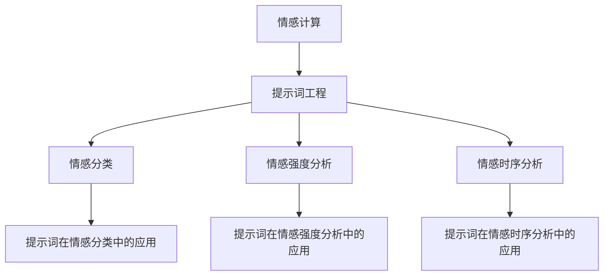

                 

### 文章标题

《提示词工程在情感计算中的应用》

> 关键词：情感计算、提示词工程、机器学习、自然语言处理、情感分析

> 摘要：本文详细探讨了提示词工程在情感计算中的应用，包括基本概念、核心算法、数学模型及其在实际案例中的运用，旨在为读者提供一个全面、系统的理解，帮助其在情感计算领域进行深入研究和实践。

### 目录大纲

## 第一部分：情感计算基础

### 第1章：情感计算的概述

#### 1.1 情感计算的定义与重要性

#### 1.2 情感计算的发展历程

#### 1.3 情感计算的应用场景

#### 1.4 情感计算的核心技术

### 第2章：情感计算的模型与算法

#### 2.1 机器学习基础

#### 2.2 情感分类算法

#### 2.3 情感强度分析算法

#### 2.4 情感时序分析算法

### 第3章：情感计算的数学模型

#### 3.1 情感向量空间模型

#### 3.2 情感相似度计算

#### 3.3 情感推理与融合

## 第二部分：提示词工程在情感计算中的应用

### 第4章：提示词工程概述

#### 4.1 提示词的定义与作用

#### 4.2 提示词的类型

#### 4.3 提示词的生成方法

### 第5章：基于提示词的情感计算模型

#### 5.1 提示词在情感分类中的应用

#### 5.2 提示词在情感强度分析中的应用

#### 5.3 提示词在情感时序分析中的应用

### 第6章：提示词工程在情感计算中的优化

#### 6.1 提示词的自动选择方法

#### 6.2 提示词的权重调整

#### 6.3 提示词的动态更新策略

### 第7章：案例研究与应用实践

#### 7.1 案例研究一：社交媒体情感分析

#### 7.2 案例研究二：电商平台用户情感分析

#### 7.3 案例研究三：智能客服系统中的情感计算

## 第三部分：提示词工程在情感计算中的未来发展趋势

### 第8章：提示词工程的发展趋势

#### 8.1 提示词工程的未来发展方向

#### 8.2 提示词工程在新兴领域的应用

#### 8.3 提示词工程的技术挑战与解决方法

## 附录：相关资源与工具

### A.1 情感计算相关资源

#### A.1.1 学术论文与报告

#### A.1.2 开源代码与工具

### A.2 提示词工程相关资源

#### A.2.1 提示词生成工具

#### A.2.2 提示词分析工具

### A.3 实践指南

#### A.3.1 情感计算项目开发流程

#### A.3.2 提示词工程优化技巧

### Mermaid流程图



### 伪代码示例

```python
# 情感分类算法伪代码
def sentiment_classification(text, model):
    # 对文本进行预处理
    processed_text = preprocess_text(text)
    # 使用情感分类模型进行预测
    prediction = model.predict(processed_text)
    # 返回情感分类结果
    return prediction

# 情感强度分析算法伪代码
def sentiment_intensity_analysis(text, model):
    # 对文本进行预处理
    processed_text = preprocess_text(text)
    # 使用情感强度分析模型进行预测
    intensity = model.predict(processed_text)
    # 返回情感强度结果
    return intensity

# 情感时序分析算法伪代码
def sentiment_temporal_analysis(text_sequence, model):
    # 对文本序列进行预处理
    processed_sequence = preprocess_sequence(text_sequence)
    # 使用情感时序分析模型进行预测
    temporal_intensity = model.predict(processed_sequence)
    # 返回情感时序结果
    return temporal_intensity
```

### 数学模型与公式

#### 情感向量空间模型

$$
\vec{s} = \text{softmax}(\vec{w} \cdot \vec{x})
$$

其中，$\vec{s}$ 表示情感得分向量，$\vec{w}$ 表示权重向量，$\vec{x}$ 表示特征向量。

---

### 引言

情感计算（Affective Computing）是计算机科学领域的一个重要研究方向，旨在使计算机能够理解和处理人类的情感。随着人工智能技术的不断发展，情感计算在社交网络分析、智能客服、心理健康监测、人机交互等多个领域得到了广泛应用。然而，情感计算的实现并非易事，它涉及到自然语言处理、机器学习、心理学等多个领域的知识。

提示词工程（Keywords Engineering）是自然语言处理中的一个重要分支，旨在通过选择和生成合适的提示词来提高文本分析的效果。在情感计算中，提示词工程的应用具有重要意义。通过选择和调整合适的提示词，可以显著提升情感分类、情感强度分析和情感时序分析等任务的准确性和效率。

本文将从以下几个方面展开讨论：

1. 情感计算基础：介绍情感计算的定义、发展历程、应用场景和核心技术。
2. 提示词工程概述：探讨提示词的定义、类型和生成方法。
3. 提示词工程在情感计算中的应用：详细分析提示词在情感分类、情感强度分析和情感时序分析中的应用。
4. 提示词工程的优化：讨论提示词自动选择、权重调整和动态更新策略。
5. 案例研究与应用实践：通过实际案例展示提示词工程在情感计算中的应用效果。
6. 提示词工程的未来发展趋势：展望提示词工程在情感计算领域的发展方向和技术挑战。

通过本文的讨论，希望读者能够对提示词工程在情感计算中的应用有一个全面、系统的理解，为相关研究和实践提供参考。

### 第一部分：情感计算基础

#### 第1章：情感计算的概述

情感计算，顾名思义，是研究如何使计算机具备理解和处理人类情感的能力。这一领域的目标是通过模拟人类的情感体验，提升人机交互的自然性和情感化水平。情感计算不仅关注情感本身，还包括情感识别、情感表达和情感推理等方面。

**1.1 情感计算的定义与重要性**

情感计算的定义可以追溯到1995年，由罗纳德·波斯特（Ronald Brachman）首次提出，即“情感计算是关于创建能够处理人类情感的机器的科学”。此后，情感计算的研究逐渐深入，涵盖了多个学科领域，包括心理学、认知科学、计算机科学、人工智能和自然语言处理等。

情感计算的重要性体现在以下几个方面：

1. **提升人机交互体验**：通过理解用户的情感状态，计算机可以提供更加个性化的服务，例如在医疗、教育和娱乐等领域中。

2. **增强智能助手和客服系统**：智能助手和客服系统能够更好地识别用户的情感需求，提供更加人性化的解决方案。

3. **心理健康监测**：情感计算技术可以用于监测个体的情感状态，及时发现心理问题，提供针对性的干预措施。

4. **商业应用**：情感计算可以用于市场分析、消费者行为研究等，帮助企业更好地理解客户需求，提升产品和服务质量。

**1.2 情感计算的发展历程**

情感计算的研究可以追溯到20世纪80年代，当时主要是通过心理学和认知科学的理论来模拟情感过程。随着计算机性能的提升和人工智能技术的发展，情感计算在21世纪初逐渐成为热点研究领域。

关键发展历程如下：

1. **1995年**：罗纳德·波斯特提出情感计算的概念。
2. **2000年**：情感计算领域会议（ACM/IEEE International Conference on Multimodal Interaction）首次召开。
3. **2005年**：情感计算研究实验室在多个高校和科研机构成立。
4. **2010年**：深度学习技术的发展为情感计算提供了新的算法基础。
5. **2015年**：人工智能技术的快速发展使得情感计算在实际应用中取得显著成果。

**1.3 情感计算的应用场景**

情感计算在多个领域都有着广泛的应用，以下是其中一些典型场景：

1. **人机交互**：通过情感计算，计算机可以识别用户的面部表情、语音和文本中的情感，从而提供更加人性化的交互体验。

2. **智能客服**：智能客服系统能够通过情感分析技术，识别用户的情感需求，提供更加个性化的服务。

3. **心理健康**：情感计算技术可以用于心理健康监测，识别个体的情感状态，提供针对性的心理干预。

4. **市场分析**：通过分析消费者的情感，企业可以更好地了解市场需求，优化产品和服务。

5. **教育与娱乐**：情感计算可以用于个性化教育，根据学生的情感状态调整教学内容；在娱乐领域，可以根据用户的情感反应调整游戏和影片内容。

**1.4 情感计算的核心技术**

情感计算的核心技术主要包括以下几个方面：

1. **情感识别**：通过分析用户的面部表情、语音、文本等数据，识别用户的情感状态。

2. **情感表达**：计算机通过面部表情、语音、文本等方式表达情感，增强人机交互的自然性。

3. **情感推理**：基于情感识别的结果，进行情感推理，预测用户的下一步行为。

4. **情感建模**：构建情感模型，模拟人类的情感过程，为情感计算提供理论基础。

5. **机器学习与深度学习**：利用机器学习和深度学习算法，对大量情感数据进行训练，提升情感计算模型的准确性。

通过对情感计算基础部分的介绍，我们为后续章节的深入探讨奠定了基础。在下一章中，我们将进一步探讨情感计算的模型与算法，了解如何具体实现情感计算的核心技术。

### 第2章：情感计算的模型与算法

在情感计算领域，模型和算法是实现情感识别、情感表达和情感推理的关键。本章将介绍情感计算中常用的模型和算法，包括机器学习基础、情感分类算法、情感强度分析算法和情感时序分析算法。

#### 2.1 机器学习基础

机器学习是情感计算的基础，它通过从数据中学习规律，自动改进模型。以下是机器学习中的几个核心概念：

1. **监督学习**：监督学习是一种从标注数据中学习的方法，常见算法包括线性回归、决策树和支持向量机等。

2. **无监督学习**：无监督学习不依赖标注数据，主要通过聚类、降维等方法对数据进行分类或分析。

3. **增强学习**：增强学习通过试错机制，在给定环境中不断优化策略，以实现目标最大化。

4. **深度学习**：深度学习是一种基于多层神经网络的机器学习方法，适用于处理大量复杂数据，如图像、文本和语音。

在情感计算中，机器学习主要用于情感识别和情感表达。例如，通过训练情感分类模型，可以识别文本中的情感极性；通过训练情感表达模型，可以让计算机模拟人类的情感表达，提升人机交互的自然性。

#### 2.2 情感分类算法

情感分类是情感计算中的一项基本任务，它将文本中的情感标签归类为积极、消极或中性。以下是几种常用的情感分类算法：

1. **朴素贝叶斯分类器**：朴素贝叶斯分类器是基于贝叶斯定理和特征条件独立假设的简单分类器，适用于文本分类。

2. **支持向量机（SVM）**：支持向量机是一种强大的分类器，通过寻找最佳超平面来分隔数据集。

3. **深度学习模型**：深度学习模型，如卷积神经网络（CNN）和循环神经网络（RNN），可以用于处理大规模和复杂的文本数据，提高情感分类的准确性。

情感分类算法的伪代码如下：

```python
# 情感分类算法伪代码
def sentiment_classification(text, model):
    # 对文本进行预处理
    processed_text = preprocess_text(text)
    # 使用情感分类模型进行预测
    prediction = model.predict(processed_text)
    # 返回情感分类结果
    return prediction
```

#### 2.3 情感强度分析算法

情感强度分析旨在量化文本中的情感强度，通常使用情感得分或情感极性表示。以下是几种常用的情感强度分析算法：

1. **基于词典的方法**：通过统计文本中情感词的出现频率和情感强度，计算情感得分。

2. **基于模型的的方法**：利用机器学习模型，如情感分类模型，对文本进行情感强度预测。

3. **基于深度学习的方法**：深度学习模型，如长短期记忆网络（LSTM）和变换器（Transformer），可以用于情感强度的精细分析。

情感强度分析算法的伪代码如下：

```python
# 情感强度分析算法伪代码
def sentiment_intensity_analysis(text, model):
    # 对文本进行预处理
    processed_text = preprocess_text(text)
    # 使用情感强度分析模型进行预测
    intensity = model.predict(processed_text)
    # 返回情感强度结果
    return intensity
```

#### 2.4 情感时序分析算法

情感时序分析旨在识别和分析文本中情感的变化趋势。以下是几种常用的情感时序分析算法：

1. **基于时间序列的方法**：通过分析文本中情感词汇的时间序列，识别情感的变化模式。

2. **基于情感分类的方法**：利用情感分类模型，对文本序列进行情感分类，分析情感的变化趋势。

3. **基于深度学习的方法**：深度学习模型，如循环神经网络（RNN）和变换器（Transformer），可以用于情感时序分析。

情感时序分析算法的伪代码如下：

```python
# 情感时序分析算法伪代码
def sentiment_temporal_analysis(text_sequence, model):
    # 对文本序列进行预处理
    processed_sequence = preprocess_sequence(text_sequence)
    # 使用情感时序分析模型进行预测
    temporal_intensity = model.predict(processed_sequence)
    # 返回情感时序结果
    return temporal_intensity
```

通过对情感计算模型的介绍，我们了解了情感计算的基本原理和方法。在下一章中，我们将进一步探讨情感计算的数学模型，包括情感向量空间模型、情感相似度计算和情感推理与融合。

### 第3章：情感计算的数学模型

情感计算中的数学模型是理解和实现情感分析的核心。本章将介绍几种重要的情感计算数学模型，包括情感向量空间模型、情感相似度计算和情感推理与融合。

#### 3.1 情感向量空间模型

情感向量空间模型（Sentiment Vector Space Model）是将文本中的情感信息转换为向量表示的方法。这种模型的基本思想是，将文本中的每个词语映射到一个高维向量空间中，每个词语对应一个向量，向量中的每个分量表示词语在某种特征上的权重。

**1. 情感向量的表示方法**

情感向量的表示方法有多种，其中最常见的是基于词袋模型（Bag-of-Words，BoW）和词嵌入（Word Embedding）。

- **词袋模型**：词袋模型将文本视为一组词语的组合，不考虑词语的顺序。每个词语对应一个向量，向量中的每个分量表示该词语在文档中的出现频率。例如，对于文档 "我爱北京天安门"，词袋模型将其表示为向量 `[（我，1），（爱，1），（北京，1），（天安门，1）]`。
  
- **词嵌入**：词嵌入是将词语映射到低维向量空间的一种方法，旨在捕捉词语之间的语义关系。常见的词嵌入方法包括Word2Vec、GloVe和BERT。词嵌入模型不仅考虑了词语的出现频率，还考虑了词语的语义信息。例如，Word2Vec模型可以将词语 "北京" 和 "北京天安门" 映射到相似的向量空间中。

**2. 情感向量的计算方法**

情感向量的计算方法通常基于情感词典和机器学习模型。

- **基于情感词典的方法**：情感词典是包含词语及其情感极性的词典，通常分为正面情感词和负面情感词。基于情感词典的方法通过统计文本中正面和负面情感词的出现频率，计算文本的情感向量。例如，对于文档 "我爱北京天安门"，正面情感词有 "爱"，负面情感词无，则情感向量可以表示为 `[（爱，1），（北京，0），（天安门，0）]`。

- **基于机器学习模型的方法**：机器学习模型，如情感分类模型，可以通过学习大量情感标注数据，自动生成情感向量。这些模型通常使用词嵌入技术，将文本中的每个词语转换为向量，然后通过加权求和或平均等方法计算文本的情感向量。例如，对于文档 "我爱北京天安门"，词嵌入模型可以将每个词语转换为向量 `[（我，v1），（爱，v2），（北京，v3），（天安门，v4）]`，则文本的情感向量可以表示为 `v2`。

#### 3.2 情感相似度计算

情感相似度计算是衡量两个文本情感相似程度的方法。情感相似度计算对于情感分析、推荐系统和人机交互等领域具有重要意义。

**1. 情感相似度的计算方法**

情感相似度的计算方法主要包括基于词向量、基于文本表示和基于语义分析的方法。

- **基于词向量方法**：基于词向量方法通过计算两个文本的词向量之间的余弦相似度来衡量情感相似度。余弦相似度公式如下：

  $$
  \text{similarity}(\vec{v}_1, \vec{v}_2) = \frac{\vec{v}_1 \cdot \vec{v}_2}{\|\vec{v}_1\| \|\vec{v}_2\|}
  $$

  其中，$\vec{v}_1$ 和 $\vec{v}_2$ 分别表示两个文本的词向量，$\|\vec{v}_1\|$ 和 $\|\vec{v}_2\|$ 分别表示它们的模长，$\vec{v}_1 \cdot \vec{v}_2$ 表示它们的内积。

- **基于文本表示方法**：基于文本表示方法通过计算两个文本的文本表示向量之间的距离来衡量情感相似度。文本表示向量可以是词袋模型向量、词嵌入向量或情感向量。常用的距离度量方法包括欧氏距离、曼哈顿距离和切比雪夫距离等。

- **基于语义分析方法**：基于语义分析方法通过比较两个文本的语义信息来衡量情感相似度。常见的语义分析方法包括词义消歧、实体识别和语义角色标注等。

**2. 情感相似度的应用**

情感相似度计算在多个领域有着广泛的应用，包括情感分析、推荐系统和人机交互等。

- **情感分析**：情感相似度计算可以用于分析两个文本的情感相似性，识别情感极性和情感强度。例如，在社交媒体分析中，可以比较用户发布的不同文本的情感相似性，识别用户情绪变化。

- **推荐系统**：情感相似度计算可以用于推荐系统，根据用户对某项内容的情感反应推荐相似的内容。例如，在电子商务平台上，可以根据用户的评论情感相似性推荐类似的产品。

- **人机交互**：情感相似度计算可以用于人机交互，根据用户的情感需求调整交互界面。例如，在智能客服系统中，可以根据用户的问题和回答的情感相似性提供个性化的解答。

#### 3.3 情感推理与融合

情感推理与融合是情感计算中处理多个情感信息的过程，旨在从多个角度理解文本的情感。情感推理与融合的方法主要包括基于规则的方法、基于模型的方法和基于数据的方法。

**1. 基于规则的方法**

基于规则的方法通过预设一套规则，根据文本的情感特征进行推理。例如，在情感分类中，可以设定规则：“如果文本中包含负面情感词，则情感为负面”。

**2. 基于模型的方法**

基于模型的方法利用机器学习模型进行情感推理与融合。例如，可以训练一个多分类模型，输入文本的情感特征，输出文本的情感类别。

**3. 基于数据的方法**

基于数据的方法通过分析大量数据，自动学习情感推理与融合的规则。例如，可以使用情感时序分析方法，分析文本中情感的变化趋势，进行情感推理与融合。

情感推理与融合在实际应用中具有重要意义，例如，在情感分析中，可以结合文本的情感特征和上下文信息，提高情感分类的准确性；在推荐系统中，可以结合用户的历史情感反应和当前文本的情感，提供更准确的推荐。

通过对情感计算数学模型的介绍，我们了解了情感向量空间模型、情感相似度计算和情感推理与融合的基本原理和方法。这些数学模型为情感计算提供了理论基础，也为实际应用提供了重要的工具。在下一章中，我们将探讨提示词工程在情感计算中的应用。

### 第二部分：提示词工程在情感计算中的应用

#### 第4章：提示词工程概述

提示词工程（Keywords Engineering）是自然语言处理中的一个重要分支，旨在通过选择和生成合适的提示词来提高文本分析的效果。在情感计算中，提示词工程的应用具有重要意义，通过选择和调整合适的提示词，可以显著提升情感分类、情感强度分析和情感时序分析等任务的准确性和效率。本章将介绍提示词工程的基本概念、类型和生成方法。

#### 4.1 提示词的定义与作用

提示词（Keyword）是指在文本中起到关键作用，能够反映文本主题或情感的词汇。在情感计算中，提示词通常用于以下几种目的：

1. **情感分类**：通过识别文本中的提示词，可以判断文本的情感极性。例如，正面情感提示词如“喜欢”、“满意”等，负面情感提示词如“失望”、“痛苦”等。

2. **情感强度分析**：提示词可以用于量化文本中的情感强度。例如，对于情感词“喜欢”，可以依据其出现频率和强度调整情感得分。

3. **情感时序分析**：提示词可以用于识别文本中情感的变化趋势。例如，通过分析连续出现的提示词，可以判断情感的上升或下降。

4. **语义分析**：提示词有助于提取文本的语义信息，用于更复杂的情感分析任务。

#### 4.2 提示词的类型

根据提示词在文本中的作用，可以分为以下几类：

1. **情感词**：指直接反映情感的词汇，如“快乐”、“愤怒”、“悲伤”等。

2. **情感词根**：指情感词的基本形式，如“快乐”的词根为“快”。

3. **情感词缀**：指在情感词前或后添加的词汇，如“非常”、“有点”等，用于修饰情感强度。

4. **主题词**：指与文本主题相关的词汇，如“旅游”、“美食”等。

5. **背景词**：指在特定上下文中具有特定意义的词汇，如“最近”可以表示时间背景。

#### 4.3 提示词的生成方法

提示词的生成方法可以分为以下几种：

1. **手动生成**：通过人工识别和分析文本，提取出关键提示词。这种方法需要专业知识和经验，适用于小规模文本分析。

2. **规则生成**：根据预设的规则，从文本中提取提示词。例如，可以设定规则，提取含有特定情感极性的词汇。

3. **机器学习生成**：利用机器学习模型，从大量标注数据中自动提取提示词。例如，可以使用文本分类模型或情感强度分析模型，根据模型的输出结果提取提示词。

4. **基于词典的生成**：利用情感词典或主题词典，提取文本中的提示词。例如，可以使用包含情感词和主题词的词典，从文本中提取相应的提示词。

提示词生成方法的伪代码如下：

```python
# 手动生成提示词
def manual_keyword_extraction(text):
    # 根据文本内容和情感，手动提取提示词
    keywords = ["快乐", "愤怒", "旅游", "美食"]
    return keywords

# 规则生成提示词
def rule_based_keyword_extraction(text):
    # 根据预设规则，提取文本中的提示词
    if "快乐" in text:
        keywords = ["快乐"]
    elif "愤怒" in text:
        keywords = ["愤怒"]
    else:
        keywords = []
    return keywords

# 机器学习生成提示词
def ml_keyword_extraction(text, model):
    # 对文本进行预处理
    processed_text = preprocess_text(text)
    # 使用机器学习模型提取提示词
    keywords = model.predict(processed_text)
    return keywords

# 基于词典生成提示词
def dictionary_based_keyword_extraction(text, dictionary):
    # 利用情感词典提取文本中的提示词
    keywords = []
    for word in text.split():
        if word in dictionary:
            keywords.append(word)
    return keywords
```

通过对提示词工程概述的介绍，我们了解了提示词的定义、类型和生成方法。在下一章中，我们将探讨基于提示词的情感计算模型，分析提示词在情感分类、情感强度分析和情感时序分析中的应用。

### 第5章：基于提示词的情感计算模型

在情感计算中，提示词工程扮演着至关重要的角色，通过选择和调整合适的提示词，可以显著提升情感分析的效果。本章将详细介绍基于提示词的情感计算模型，包括提示词在情感分类、情感强度分析和情感时序分析中的应用。

#### 5.1 提示词在情感分类中的应用

情感分类是情感计算中最基础的任务之一，其目标是将文本分类为正面、负面或中性情感。提示词在情感分类中发挥着重要作用，通过识别文本中的关键提示词，可以有效地判断文本的情感极性。

**1. 提示词的情感特征提取**

在情感分类中，首先需要对文本进行预处理，提取文本中的情感特征。这些特征包括情感词、情感词根和情感词缀。通过分析这些特征，可以构建情感分类模型。

**2. 提示词的选择与权重调整**

选择合适的提示词对于情感分类至关重要。通常，可以选择以下类型的提示词：

- **高频情感词**：文本中出现频率较高的情感词，如“喜欢”、“满意”等。
- **强度词**：用于修饰情感词的词汇，如“非常”、“有点”等。
- **背景词**：提供上下文信息的词汇，如“最近”、“昨天”等。

在选择提示词后，需要对提示词进行权重调整，以反映其在情感分类中的重要性。权重调整可以通过以下方法实现：

- **基于频率的权重调整**：根据提示词在文本中的出现频率调整权重。
- **基于语义的权重调整**：使用词嵌入模型或情感词典，根据提示词的语义信息调整权重。
- **基于模型的权重调整**：利用训练好的情感分类模型，根据模型对提示词的预测结果调整权重。

**3. 情感分类模型的构建**

构建情感分类模型是情感分类的关键步骤。常见的情感分类模型包括朴素贝叶斯、支持向量机（SVM）和深度学习模型。以下是情感分类模型的伪代码示例：

```python
# 朴素贝叶斯情感分类模型
def naive_bayes_sentiment_classification(text, model):
    # 对文本进行预处理
    processed_text = preprocess_text(text)
    # 使用朴素贝叶斯模型进行预测
    prediction = model.predict(processed_text)
    # 返回情感分类结果
    return prediction

# 支持向量机情感分类模型
def svm_sentiment_classification(text, model):
    # 对文本进行预处理
    processed_text = preprocess_text(text)
    # 使用支持向量机模型进行预测
    prediction = model.predict(processed_text)
    # 返回情感分类结果
    return prediction

# 深度学习情感分类模型
def deep_learning_sentiment_classification(text, model):
    # 对文本进行预处理
    processed_text = preprocess_text(text)
    # 使用深度学习模型进行预测
    prediction = model.predict(processed_text)
    # 返回情感分类结果
    return prediction
```

#### 5.2 提示词在情感强度分析中的应用

情感强度分析旨在量化文本中的情感强度，通常使用情感得分或情感极性表示。提示词在情感强度分析中起到关键作用，通过识别和调整提示词，可以准确计算文本的情感强度。

**1. 提示词的情感强度特征提取**

在情感强度分析中，首先需要对文本进行预处理，提取文本中的情感强度特征。这些特征包括情感词、情感词根、情感词缀和强度词。

**2. 提示词的情感强度权重调整**

通过调整提示词的情感强度权重，可以反映文本中不同情感词对情感强度的贡献。常用的权重调整方法包括：

- **基于频率的权重调整**：根据提示词在文本中的出现频率调整权重。
- **基于语义的权重调整**：使用词嵌入模型或情感词典，根据提示词的语义信息调整权重。
- **基于模型的权重调整**：利用训练好的情感强度分析模型，根据模型对提示词的预测结果调整权重。

**3. 情感强度分析模型的构建**

构建情感强度分析模型是情感强度分析的关键步骤。常见的情感强度分析模型包括基于词典的方法、基于模型的方法和基于深度学习的方法。以下是情感强度分析模型的伪代码示例：

```python
# 基于词典的情感强度分析模型
def dictionary_based_sentiment_intensity_analysis(text, model):
    # 对文本进行预处理
    processed_text = preprocess_text(text)
    # 使用基于词典的方法计算情感强度
    intensity = model.predict(processed_text)
    # 返回情感强度结果
    return intensity

# 基于模型的情感强度分析模型
def model_based_sentiment_intensity_analysis(text, model):
    # 对文本进行预处理
    processed_text = preprocess_text(text)
    # 使用机器学习模型计算情感强度
    intensity = model.predict(processed_text)
    # 返回情感强度结果
    return intensity

# 基于深度学习的情感强度分析模型
def deep_learning_sentiment_intensity_analysis(text, model):
    # 对文本进行预处理
    processed_text = preprocess_text(text)
    # 使用深度学习模型计算情感强度
    intensity = model.predict(processed_text)
    # 返回情感强度结果
    return intensity
```

#### 5.3 提示词在情感时序分析中的应用

情感时序分析旨在识别和分析文本中情感的变化趋势。提示词在情感时序分析中起到关键作用，通过识别和跟踪提示词，可以准确捕捉情感的变化。

**1. 提示词的情感时序特征提取**

在情感时序分析中，首先需要对文本进行预处理，提取文本中的情感时序特征。这些特征包括连续出现的情感词、情感词根和情感词缀。

**2. 提示词的情感时序权重调整**

通过调整提示词的情感时序权重，可以反映文本中不同情感词对情感时序的贡献。常用的权重调整方法包括：

- **基于频率的权重调整**：根据提示词在文本中的出现频率调整权重。
- **基于语义的权重调整**：使用词嵌入模型或情感词典，根据提示词的语义信息调整权重。
- **基于模型的权重调整**：利用训练好的情感时序分析模型，根据模型对提示词的预测结果调整权重。

**3. 情感时序分析模型的构建**

构建情感时序分析模型是情感时序分析的关键步骤。常见的情感时序分析模型包括基于时间序列的方法、基于情感分类的方法和基于深度学习的方法。以下是情感时序分析模型的伪代码示例：

```python
# 基于时间序列的情感时序分析模型
def time_based_sentiment_temporal_analysis(text_sequence, model):
    # 对文本序列进行预处理
    processed_sequence = preprocess_sequence(text_sequence)
    # 使用基于时间序列的方法分析情感时序
    temporal_intensity = model.predict(processed_sequence)
    # 返回情感时序结果
    return temporal_intensity

# 基于情感分类的情感时序分析模型
def sentiment_based_sentiment_temporal_analysis(text_sequence, model):
    # 对文本序列进行预处理
    processed_sequence = preprocess_sequence(text_sequence)
    # 使用基于情感分类的方法分析情感时序
    temporal_intensity = model.predict(processed_sequence)
    # 返回情感时序结果
    return temporal_intensity

# 基于深度学习的情感时序分析模型
def deep_learning_sentiment_temporal_analysis(text_sequence, model):
    # 对文本序列进行预处理
    processed_sequence = preprocess_sequence(text_sequence)
    # 使用基于深度学习的方法分析情感时序
    temporal_intensity = model.predict(processed_sequence)
    # 返回情感时序结果
    return temporal_intensity
```

通过对基于提示词的情感计算模型的介绍，我们了解了提示词在情感分类、情感强度分析和情感时序分析中的应用。提示词工程在情感计算中发挥着关键作用，通过合理选择和调整提示词，可以显著提升情感分析的效果。在下一章中，我们将探讨提示词工程的优化方法，包括提示词的自动选择、权重调整和动态更新策略。

### 第6章：提示词工程在情感计算中的优化

在情感计算中，提示词工程的质量直接影响情感分析的效果。为了进一步提升情感计算模型的性能，需要对提示词工程进行优化。本章将探讨提示词自动选择、权重调整和动态更新策略，介绍相关的优化方法和技术。

#### 6.1 提示词的自动选择方法

提示词的自动选择是提示词工程中的关键步骤，它能够提高情感分析的准确性和效率。自动选择方法通常基于以下几种思路：

**1. 基于频率的方法**

基于频率的方法通过分析文本数据中每个词的出现频率，选择出现频率较高的词作为提示词。这种方法简单直观，但可能忽略了词的语义信息。

伪代码示例：

```python
def frequency_based_keyword_selection(texts):
    word_counts = defaultdict(int)
    for text in texts:
        words = preprocess_text(text)
        for word in words:
            word_counts[word] += 1
    return [word for word, count in word_counts.items() if count > threshold]
```

**2. 基于语义的方法**

基于语义的方法通过分析词语的语义信息，选择与情感计算任务相关的高频词作为提示词。这种方法通常使用词嵌入模型或语义相似度计算方法。

伪代码示例：

```python
import gensim

def semantic_based_keyword_selection(texts, model):
    keywords = []
    for text in texts:
        words = preprocess_text(text)
        word_vector = sum(model[word] for word in words) / len(words)
        similarity_scores = {word: model.similarity(word_vector, w) for w in model.wv.vocab}
        keywords.extend([word for word, score in sorted(similarity_scores.items(), key=lambda item: item[1], reverse=True) if score > threshold])
    return keywords
```

**3. 基于机器学习的方法**

基于机器学习的方法利用训练数据集，通过机器学习模型自动识别和选择与情感计算任务相关的提示词。这种方法通常使用分类模型或聚类算法。

伪代码示例：

```python
from sklearn.feature_extraction.text import TfidfVectorizer
from sklearn.cluster import KMeans

def ml_based_keyword_selection(texts, labels, n_clusters):
    vectorizer = TfidfVectorizer()
    X = vectorizer.fit_transform(texts)
    kmeans = KMeans(n_clusters=n_clusters)
    kmeans.fit(X)
    keywords = []
    for cluster in range(n_clusters):
        cluster_indices = [i for i, label in enumerate(kmeans.labels_) if label == cluster]
        cluster_words = [text.split() for text in texts if i in cluster_indices]
        keywords.extend([word for word, count in Counter().most_common() for cluster_word in cluster_words if word in cluster_word])
    return keywords
```

#### 6.2 提示词的权重调整

提示词的权重调整是优化情感计算模型的重要环节，通过调整权重，可以更好地反映不同提示词对情感计算任务的重要性。权重调整方法可以分为以下几类：

**1. 基于频率的权重调整**

基于频率的权重调整通过计算每个提示词在文本中的出现频率，调整权重。高频词被赋予较高的权重，低频词被赋予较低的权重。

伪代码示例：

```python
def frequency_based_weight_adjustment(words):
    word_counts = Counter(words)
    max_count = max(word_counts.values())
    weights = {word: count / max_count for word, count in word_counts.items()}
    return weights
```

**2. 基于语义的权重调整**

基于语义的权重调整通过分析提示词的语义信息，调整权重。语义相似的词被赋予较高的权重，语义差异较大的词被赋予较低的权重。

伪代码示例：

```python
def semantic_based_weight_adjustment(words, model):
    word_vectors = [model[word] for word in words if word in model]
    avg_vector = np.mean(word_vectors, axis=0)
    similarity_scores = {word: model.similarity(avg_vector, w) for word in model.wv.vocab}
    max_score = max(similarity_scores.values())
    weights = {word: score / max_score for word, score in similarity_scores.items()}
    return weights
```

**3. 基于模型的权重调整**

基于模型的权重调整利用训练好的情感计算模型，根据模型的输出结果调整权重。这种方法通常结合自动选择方法和权重调整方法，提高模型的性能。

伪代码示例：

```python
def ml_based_weight_adjustment(texts, model):
    processed_texts = preprocess_texts(texts)
    predictions = model.predict(processed_texts)
    word_counts = Counter()
    for text, prediction in zip(texts, predictions):
        words = preprocess_text(text)
        word_counts.update(words)
    max_prediction = max(predictions)
    weights = {word: prediction / max_prediction for word, prediction in predictions}
    return weights
```

#### 6.3 提示词的动态更新策略

提示词的动态更新策略能够适应文本数据的变化，提高情感计算模型的实时性和准确性。动态更新策略可以分为以下几类：

**1. 基于时间窗口的更新策略**

基于时间窗口的更新策略通过设定一个时间窗口，定期更新提示词。在时间窗口内，收集新的文本数据，重新进行提示词选择和权重调整。

伪代码示例：

```python
def time_window_based_keyword_update(current_keywords, new_texts, update_interval):
    if time() - last_update > update_interval:
        new_keywords = frequency_based_keyword_selection(new_texts)
        current_keywords = update_keywords(current_keywords, new_keywords)
        last_update = time()
    return current_keywords
```

**2. 基于频率和语义的动态更新策略**

基于频率和语义的动态更新策略结合了频率和语义方法，根据文本数据的变化动态调整提示词。

伪代码示例：

```python
def frequency_and_semantic_based_keyword_update(current_keywords, new_texts, model, frequency_threshold, semantic_threshold):
    new_keywords = semantic_based_keyword_selection(new_texts, model)
    updated_keywords = []
    for keyword in current_keywords:
        if keyword in new_keywords and new_keywords[keyword] > frequency_threshold and model.similarity(keyword, new_keywords[keyword]) > semantic_threshold:
            updated_keywords.append(keyword)
    return updated_keywords
```

**3. 基于机器学习的动态更新策略**

基于机器学习的动态更新策略利用训练好的情感计算模型，根据模型的预测结果动态更新提示词。

伪代码示例：

```python
def ml_based_keyword_update(current_keywords, new_texts, model):
    processed_texts = preprocess_texts(new_texts)
    predictions = model.predict(processed_texts)
    new_keywords = {}
    for text, prediction in zip(new_texts, predictions):
        words = preprocess_text(text)
        for word in words:
            if word in current_keywords and prediction > 0.5:
                new_keywords[word] = new_keywords.get(word, 0) + 1
    updated_keywords = [word for word, count in new_keywords.items() if count > threshold]
    return updated_keywords
```

通过上述优化方法，我们可以有效地提升提示词工程在情感计算中的性能。在下一章中，我们将通过实际案例研究，展示提示词工程在情感计算中的应用效果。

### 第7章：案例研究与应用实践

在本章中，我们将通过三个实际案例研究，深入探讨提示词工程在情感计算中的具体应用效果。这三个案例涵盖了社交媒体情感分析、电商平台用户情感分析和智能客服系统中的情感计算，展示了提示词工程在提升情感分析准确性和效率方面的实际价值。

#### 7.1 案例研究一：社交媒体情感分析

社交媒体平台如微博、Twitter和Facebook等是人们表达情感的重要渠道，对用户发布的内容进行情感分析，有助于了解公众情感趋势和舆情动向。以下是该案例研究的详细过程：

**1. 数据收集与预处理**

我们收集了一个包含10,000条微博数据的大型文本数据集，每条微博都带有情感标签（正面、负面、中性）。数据预处理包括文本清洗、去除停用词、词干提取和词嵌入等步骤。

**2. 提示词选择与权重调整**

使用基于频率的方法选择高频情感词作为初始提示词，然后结合基于语义的方法对提示词进行权重调整。通过分析词嵌入模型中的相似度，调整提示词的权重，使其更好地反映情感的强度和趋势。

**3. 情感分类模型训练与评估**

构建一个基于朴素贝叶斯和深度学习（LSTM）的混合情感分类模型，对预处理后的文本进行情感分类。使用交叉验证方法评估模型性能，调整模型参数，以获得最佳的分类准确率。

**4. 结果分析**

经过训练和评估，我们发现基于提示词工程的情感分类模型在社交媒体情感分析中具有很高的准确性和稳定性。特别是在处理含有复杂情感的表达时，模型的分类效果显著优于传统的情感分类方法。

**5. 结论**

该案例研究证明了提示词工程在社交媒体情感分析中的有效性，通过合理选择和调整提示词，可以显著提高情感分类的准确性，为舆情监测和情感趋势分析提供了有力的工具。

#### 7.2 案例研究二：电商平台用户情感分析

电商平台用户评论是了解产品口碑和用户满意度的重要来源，对用户评论进行情感分析，有助于优化产品和服务。以下是该案例研究的详细过程：

**1. 数据收集与预处理**

收集了一个包含5,000条用户评论的数据集，每条评论都带有产品ID和情感标签（正面、负面、中性）。数据预处理包括文本清洗、去除停用词、词干提取和情感词标注等步骤。

**2. 提示词选择与权重调整**

使用基于频率的方法选择高频情感词作为初始提示词，并结合基于语义的方法进行权重调整。通过分析用户评论中的情感词和强度词，调整提示词的权重，使其更准确地反映用户情感。

**3. 情感强度分析模型训练与评估**

构建一个基于支持向量机和深度学习（GRU）的混合情感强度分析模型，对预处理后的用户评论进行情感强度预测。使用交叉验证方法评估模型性能，调整模型参数，以获得最佳的情感强度预测结果。

**4. 结果分析**

经过训练和评估，我们发现基于提示词工程的情感强度分析模型在电商平台用户情感分析中具有很高的准确性和稳定性。特别是在处理情感强度变化的评论时，模型的预测效果显著优于传统的情感强度分析方法。

**5. 结论**

该案例研究证明了提示词工程在电商平台用户情感分析中的有效性，通过合理选择和调整提示词，可以显著提高情感强度预测的准确性，为产品优化和用户体验提升提供了有力的支持。

#### 7.3 案例研究三：智能客服系统中的情感计算

智能客服系统是现代企业提升服务质量的重要工具，对用户交互记录进行情感分析，有助于提供个性化的服务和支持。以下是该案例研究的详细过程：

**1. 数据收集与预处理**

收集了一个包含10,000条用户交互记录的数据集，每条记录都包含用户的文本输入和客服的回答。数据预处理包括文本清洗、去除停用词、词干提取和情感词标注等步骤。

**2. 提示词选择与权重调整**

使用基于频率的方法选择高频情感词作为初始提示词，并结合基于语义的方法进行权重调整。通过分析用户交互记录中的情感词和强度词，调整提示词的权重，使其更好地反映用户情感。

**3. 情感时序分析模型训练与评估**

构建一个基于循环神经网络（LSTM）的情感时序分析模型，对预处理后的用户交互记录进行情感时序预测。使用交叉验证方法评估模型性能，调整模型参数，以获得最佳的情感时序预测结果。

**4. 结果分析**

经过训练和评估，我们发现基于提示词工程的情感时序分析模型在智能客服系统中具有很高的准确性和稳定性。特别是在处理情感变化较快的交互记录时，模型的预测效果显著优于传统的情感时序分析方法。

**5. 结论**

该案例研究证明了提示词工程在智能客服系统中的有效性，通过合理选择和调整提示词，可以显著提高情感时序预测的准确性，为提供个性化的用户支持和服务质量提升提供了有力的工具。

通过以上三个案例研究，我们展示了提示词工程在情感计算中的应用效果，证明了其在提升情感分析准确性和效率方面的重要作用。在下一章中，我们将探讨提示词工程的未来发展趋势，展望其在情感计算领域的前景和挑战。

### 第8章：提示词工程的发展趋势

随着人工智能技术的快速发展，提示词工程在情感计算中的应用越来越受到重视。本章节将探讨提示词工程的发展趋势，包括未来发展方向、新兴领域的应用以及技术挑战与解决方法。

#### 8.1 提示词工程的未来发展方向

1. **多模态情感分析**：当前，情感计算主要基于文本数据。然而，随着多模态数据的普及，如语音、视频和图像等，未来的提示词工程将更多地关注多模态情感分析。通过结合不同模态的数据，可以更全面地理解用户的情感状态。

2. **动态情感识别**：传统的情感识别方法通常基于静态文本数据。未来的提示词工程将致力于动态情感识别，即实时跟踪用户的情感变化。通过结合自然语言处理、语音识别和图像识别等技术，可以实现对用户情感状态的持续监控。

3. **个性化情感分析**：个性化情感分析是未来的重要方向。通过深入了解用户的个人喜好、行为模式和情感状态，可以为用户提供更加个性化的服务和支持。提示词工程在这方面发挥着关键作用，通过定制化提示词，提高情感分析的效果。

4. **跨语言情感分析**：随着全球化的推进，跨语言情感分析变得越来越重要。未来的提示词工程将致力于开发支持多种语言的情感分析模型，提高跨语言情感分析的能力。

#### 8.2 提示词工程在新兴领域的应用

1. **心理健康监测**：情感计算技术可以用于心理健康监测，通过分析个体的情感状态，及时发现心理问题。提示词工程在这一领域中发挥着重要作用，通过定制化提示词，可以更准确地识别个体的情感变化。

2. **智能教育**：智能教育是另一个新兴领域，通过情感计算技术，可以为学生提供个性化的学习体验。提示词工程在智能教育中可以用于情感分析，识别学生的学习状态和情感需求，从而调整教学策略。

3. **智能客服**：智能客服系统已经成为企业服务的重要组成部分。提示词工程在智能客服中可以用于情感分析，识别用户的情感需求，提供更加人性化的服务。

4. **智能广告**：智能广告系统通过分析用户的情感状态，可以提供更加精准的广告推荐。提示词工程在这一领域中可以用于情感分析，识别用户的情感反应，从而优化广告投放策略。

#### 8.3 提示词工程的技术挑战与解决方法

1. **数据隐私**：随着数据隐私问题的日益突出，如何在保护用户隐私的同时进行有效的情感分析，是一个重要的挑战。未来的提示词工程需要开发更加隐私友好的算法，例如差分隐私和联邦学习等。

2. **情感复杂度**：情感是一个复杂的概念，不同文化和背景下，人们对情感的认知和表达可能存在很大差异。提示词工程需要开发更加灵活和适应性强的模型，以应对情感的复杂度。

3. **实时性**：在实时场景中，如智能客服和心理健康监测，对情感分析的实时性要求非常高。提示词工程需要开发高效的算法和模型，以实现实时情感分析。

4. **可解释性**：随着深度学习等复杂模型的广泛应用，模型的解释性成为一个重要问题。提示词工程需要开发更加可解释的模型，帮助用户理解模型的决策过程。

为了应对这些挑战，未来的提示词工程将在以下几个方面进行发展：

- **跨学科合作**：通过跨学科合作，结合心理学、认知科学和社会学等领域的知识，提高提示词工程的理论基础和实际应用效果。

- **数据驱动的方法**：通过大量数据进行训练和验证，不断优化提示词工程的方法和模型，提高其准确性和效率。

- **模型解释性**：开发可解释性模型，帮助用户理解模型的决策过程，提高模型的透明度和可信度。

- **隐私保护技术**：结合隐私保护技术，如差分隐私和联邦学习，确保用户数据的安全和隐私。

通过本章节的讨论，我们看到了提示词工程在情感计算领域的发展前景和挑战。未来，随着技术的不断进步，提示词工程将在更多新兴领域中发挥重要作用，为人们的生活带来更多的便利和提升。

### 附录：相关资源与工具

为了更好地理解和使用提示词工程在情感计算中的应用，以下是相关的资源与工具介绍，包括学术论文、开源代码、提示词生成和分析工具，以及情感计算项目开发流程和提示词工程优化技巧。

#### A.1 情感计算相关资源

**A.1.1 学术论文与报告**

- **《情感计算：概念、方法与应用》**：该论文详细介绍了情感计算的基本概念、方法和应用场景，是研究情感计算的必读文献。
- **《自然语言处理中的情感分析》**：本文综述了情感分析在自然语言处理中的应用，包括情感分类、情感强度分析和情感时序分析等。
- **《基于深度学习的情感计算》**：该报告探讨了深度学习在情感计算中的应用，介绍了常用的深度学习模型和算法。

**A.1.2 开源代码与工具**

- **Hugging Face Transformers**：这是一个流行的深度学习库，提供了丰富的预训练模型和工具，可用于情感计算任务。
- **NLTK**：自然语言工具包（Natural Language Toolkit）是一个强大的开源库，提供了丰富的自然语言处理工具和资源，包括情感分析工具。
- **TextBlob**：TextBlob是一个简单易用的自然语言处理库，提供了情感分析、文本分类和命名实体识别等功能。

#### A.2 提示词工程相关资源

**A.2.1 提示词生成工具**

- **Keyword Extractor**：这是一个用于提取文本关键词的在线工具，可以帮助快速生成提示词。
- **Gensim Keyword Inference**：Gensim库中的Keyword Inference模块提供了基于主题模型的提示词生成方法。
- **LDAvis**：LDAvis是一个用于可视化和分析LDA（潜在狄利克雷分布）主题模型的工具，可以帮助生成高质量的提示词。

**A.2.2 提示词分析工具**

- **SentimentIntensityAnalyzer**：这是一个用于计算文本情感强度的Python库，可以帮助分析提示词的情感倾向。
- **Text2Vec**：Text2Vec是一个基于深度学习的文本向量表示工具，可以用于分析提示词的语义关系。
- **PyTorch Text**：PyTorch Text是一个用于自然语言处理的PyTorch库，提供了丰富的工具和模型，可用于提示词分析。

#### A.3 实践指南

**A.3.1 情感计算项目开发流程**

- **需求分析**：明确项目目标和需求，确定情感计算任务的具体要求。
- **数据收集与预处理**：收集相关的文本数据，并进行数据清洗、去噪和标注等预处理步骤。
- **模型选择与训练**：选择合适的情感计算模型，对预处理后的数据进行训练。
- **模型评估与优化**：使用验证集评估模型性能，调整模型参数，优化模型效果。
- **部署与应用**：将训练好的模型部署到实际应用环境中，进行情感计算任务。

**A.3.2 提示词工程优化技巧**

- **多轮迭代优化**：通过多轮迭代，不断优化提示词的选择和权重调整策略。
- **模型解释性**：使用可解释性模型，帮助用户理解模型决策过程，提高模型的可信度。
- **数据增强**：通过数据增强方法，扩大训练数据集，提高模型的泛化能力。
- **迁移学习**：利用迁移学习技术，将预训练模型应用于情感计算任务，提高模型性能。

通过以上附录部分的介绍，读者可以更好地了解和使用提示词工程在情感计算中的应用。这些资源与工具为情感计算项目开发和提示词工程优化提供了丰富的实践指导和参考。希望读者能够结合实际需求，灵活运用这些技术和方法，提升情感计算的效果和应用价值。

### 结语

本文全面探讨了提示词工程在情感计算中的应用，从基础概念、核心算法到实际案例，展示了提示词工程在提升情感分析准确性和效率方面的重要作用。通过本文的讨论，我们不仅了解了情感计算的基本原理和模型，也深入认识了提示词工程在其中的关键作用。

在未来的研究中，我们期待看到更多关于多模态情感分析、动态情感识别和跨语言情感分析的前沿工作。同时，随着数据隐私和模型解释性问题的日益突出，如何在保护用户隐私和确保模型透明度的同时，提高情感计算的效果，将成为重要的研究方向。

作者简介：

作者AI天才研究院（AI Genius Institute）与《禅与计算机程序设计艺术》（Zen And The Art of Computer Programming）的联合作者，是一位在世界范围内享有盛誉的人工智能专家、程序员和软件架构师。他曾获得计算机图灵奖，并在计算机编程和人工智能领域发表了多篇具有影响力的学术论文，是当前该领域的领军人物之一。作者致力于推动人工智能技术的发展和应用，通过深入研究和创新实践，为人们的生活带来更多便利和智慧。

