                 

### 文章标题

《提示词工程在情感计算中的应用》

### 关键词

情感计算、提示词工程、自然语言处理、计算机视觉、多模态情感分析、人工智能

### 摘要

本文深入探讨了提示词工程在情感计算中的应用。首先，介绍了情感计算的基础知识，包括其定义、分类和发展历程。接着，详细阐述了情感计算的技术基础，涉及自然语言处理、计算机视觉和多模态情感计算。然后，介绍了提示词工程的基本概念、分类和核心步骤。在此基础上，探讨了在情感分析中提示词的设计和应用，包括文本、图像和视频情感分析。随后，通过实际案例展示了提示词工程在情感计算中的具体应用。最后，分析了情感计算在社交媒体、产品评论和视频内容识别中的应用，并对未来发展趋势和挑战进行了展望。本文旨在为读者提供一个全面、系统的理解，以促进对提示词工程在情感计算领域应用的深入研究。

## 《提示词工程在情感计算中的应用》目录大纲

### 第一部分：情感计算基础

#### 第1章：情感计算概述
- 1.1 情感计算的定义与重要性
- 1.2 情感计算的分类
- 1.3 情感计算的发展历程
- 1.4 情感计算的应用领域
- 1.5 情感计算的挑战与机遇

#### 第2章：情感计算的技术基础
- 2.1 自然语言处理（NLP）技术
- 2.2 计算机视觉（CV）技术
- 2.3 多模态情感计算

### 第二部分：提示词工程原理

#### 第3章：提示词工程的基本概念
- 3.1 提示词的定义与作用
- 3.2 提示词的分类
- 3.3 提示词工程的核心步骤

#### 第4章：情感分析中的提示词设计
- 4.1 情感分析模型的选择
- 4.2 提示词在情感分析中的应用

#### 第5章：提示词工程在情感计算中的应用实践
- 5.1 数据准备与预处理
- 5.2 提示词工程的实验设计与实现
- 5.3 提示词工程案例分析

### 第三部分：情感计算应用领域

#### 第6章：情感计算在社交媒体中的应用
- 6.1 社交媒体情感分析的意义
- 6.2 社交媒体情感分析的技术挑战
- 6.3 社交媒体情感分析的应用案例

#### 第7章：情感计算在产品评论中的应用
- 7.1 产品评论情感分析的重要性
- 7.2 产品评论情感分析的方法与技巧
- 7.3 产品评论情感分析的实际应用

#### 第8章：情感计算在视频内容识别中的应用
- 8.1 视频情感识别的发展趋势
- 8.2 视频情感识别的技术难点
- 8.3 视频情感识别的应用案例

### 第四部分：未来展望与挑战

#### 第9章：情感计算的发展趋势与挑战
- 9.1 情感计算的技术发展趋势
- 9.2 情感计算的应用前景
- 9.3 情感计算的挑战与对策

#### 第10章：情感计算在人工智能伦理中的角色
- 10.1 情感计算与隐私保护
- 10.2 情感计算与偏见问题
- 10.3 情感计算的伦理准则

### 附录

#### 附录A：情感计算相关工具与资源
- 10.1 情感计算开源工具介绍
- 10.2 情感计算相关数据库
- 10.3 情感计算研究论文与资源链接

#### 附录B：情感计算实验指南
- 10.1 情感计算实验环境搭建
- 10.2 情感计算实验步骤与技巧
- 10.3 情感计算实验结果分析

### 第1章: 情感计算概述

#### 1.1 情感计算的定义与重要性

情感计算（Affective Computing）是一门跨学科的研究领域，旨在使计算机具备感知、理解和表达人类情感的能力。情感计算结合了计算机科学、心理学、认知科学和人类学等领域的知识，旨在创建能够与人类情感互动的智能系统。

情感计算的重要性体现在多个方面。首先，它在人机交互中具有重要作用。通过理解用户的情感状态，计算机可以提供更个性化和有效的服务。例如，智能助手可以根据用户的情绪调整响应方式和语气。其次，情感计算在教育、医疗、金融等领域有着广泛的应用前景。在教育领域，情感计算可以帮助教师更好地了解学生的学习状态和情感需求，从而提供针对性的教学支持。在医疗领域，情感计算可以辅助诊断和治疗，通过对患者情感状态的监控，医生可以更准确地评估病情和制定治疗方案。在金融领域，情感计算可以用于风险评估和客户服务，通过对用户情感的分析，银行和企业可以更好地理解客户需求，提高客户满意度和忠诚度。

#### 1.2 情感计算的分类

情感计算可以从不同角度进行分类，以下是几种常见的分类方法：

1. **基于文本的情感分析**：通过分析文本数据中的情感词汇和情感极性，来确定文本的情感倾向。这种方法广泛应用于社交媒体情感分析、产品评论情感分析等领域。

2. **基于图像和视频的情感分析**：通过计算机视觉技术，从图像和视频中提取情感特征，来确定图像或视频的情感状态。这种方法在情感计算中具有重要地位，因为它可以直接从视觉数据中获取情感信息。

3. **多模态情感计算**：结合多种数据源，如文本、图像、声音和动作，来更全面地理解和表达人类情感。这种方法能够提供更准确和丰富的情感信息，但同时也带来了更高的复杂性和挑战。

4. **基于生理信号的情感计算**：通过监测生理信号，如心率、皮肤电反应和面部表情等，来评估用户的情感状态。这种方法在医疗和心理学领域有广泛应用，可以帮助诊断和治疗情感障碍。

#### 1.3 情感计算的发展历程

情感计算作为一个研究领域，其发展历程可以追溯到20世纪80年代。以下是几个关键阶段：

1. **早期研究**：20世纪80年代，心理学家和计算机科学家开始探索如何使计算机感知和理解情感。这个阶段的研究主要集中在情感模型的构建和情感信号的提取。

2. **文本情感分析**：20世纪90年代，随着自然语言处理（NLP）技术的发展，文本情感分析成为情感计算的一个重要分支。研究者开始开发算法，通过分析文本中的情感词汇和情感极性，来确定文本的情感倾向。

3. **计算机视觉和视频情感分析**：21世纪初，计算机视觉和视频分析技术的进步，使得基于图像和视频的情感分析成为可能。研究者开发了一系列算法，可以从图像和视频中提取情感特征，并用于情感分析。

4. **多模态情感计算**：近年来，随着多模态数据融合技术的发展，多模态情感计算成为一个重要的研究方向。研究者致力于开发算法，能够结合多种数据源，提供更全面和准确的情感分析结果。

#### 1.4 情感计算的应用领域

情感计算在多个领域有着广泛的应用，以下是一些典型的应用场景：

1. **人机交互**：情感计算可以用于改善人机交互体验。通过理解用户的情感状态，计算机可以提供更个性化和有效的交互服务。例如，智能助手可以根据用户的情绪调整响应方式和语气，提高用户的满意度。

2. **教育**：在教育领域，情感计算可以用于个性化教学和情感监控。通过分析学生的学习状态和情感需求，教师可以提供更有针对性的教学支持，提高学生的学习效果。

3. **医疗**：在医疗领域，情感计算可以用于诊断和治疗情感障碍。通过监测患者的情感状态，医生可以更准确地评估病情和制定治疗方案。

4. **金融**：在金融领域，情感计算可以用于风险评估和客户服务。通过分析用户的行为和情感状态，金融机构可以更好地理解客户需求，提高客户满意度和忠诚度。

5. **市场营销**：在市场营销领域，情感计算可以用于分析消费者情感和行为，帮助企业制定更有效的营销策略。

#### 1.5 情感计算的挑战与机遇

尽管情感计算在多个领域取得了显著进展，但仍然面临着许多挑战和机遇：

1. **挑战**：
   - 数据质量和标注问题：情感计算依赖于大量的标注数据，但获取高质量标注数据是一个挑战。
   - 情感多样性和复杂性：情感具有多样性和复杂性，如何准确识别和理解情感仍然是一个难题。
   - 隐私和安全问题：情感计算涉及到个人隐私，如何在保护隐私的前提下进行情感分析是一个重要问题。

2. **机遇**：
   - 人工智能技术的发展：随着人工智能技术的不断进步，情感计算有望在更广泛的应用领域中发挥作用。
   - 新的数据源和传感器：随着新型传感器和设备的出现，情感计算的数据来源将更加多样，有助于提高情感分析的效果。
   - 伦理和隐私保护：随着情感计算应用的普及，如何在伦理和隐私保护方面进行规范和管理，是一个重要议题。

### 总结

情感计算作为一门跨学科的研究领域，正日益受到关注。它不仅在改善人机交互、教育、医疗、金融和市场营销等领域发挥着重要作用，还为人工智能技术的发展提供了新的思路和工具。未来，随着技术的不断进步，情感计算有望在更多领域得到应用，同时也面临着新的挑战和机遇。了解情感计算的基础知识，对于深入研究和应用这一领域至关重要。通过本文的介绍，读者可以初步了解情感计算的各个方面，为进一步的研究和应用打下基础。

### 第2章：情感计算的技术基础

#### 2.1 自然语言处理（NLP）技术

自然语言处理（NLP）是情感计算中至关重要的一环，它涉及到如何让计算机理解和处理人类语言。以下将介绍几种NLP技术，包括词嵌入技术、序列模型与注意力机制、转换器架构及其在情感极性分类算法中的应用。

##### 2.1.1 词嵌入技术

词嵌入（Word Embedding）是一种将词汇映射为向量的技术，目的是捕捉词汇之间的语义关系。最常见的词嵌入模型是Word2Vec，它通过训练得到一个低维向量空间，使得语义相似的词汇在空间中距离较近。

**核心概念与联系：**

词嵌入技术的主要核心概念包括：

1. **向量空间模型**：将词汇映射到向量空间中，使得语义相似的词汇距离较近。
2. **共现矩阵**：通过计算词汇的共现矩阵，来挖掘词汇之间的关系。
3. **训练算法**：如CBOW（Continuous Bag of Words）和Skip-gram，用于学习词汇的嵌入向量。

**Mermaid 流程图：**

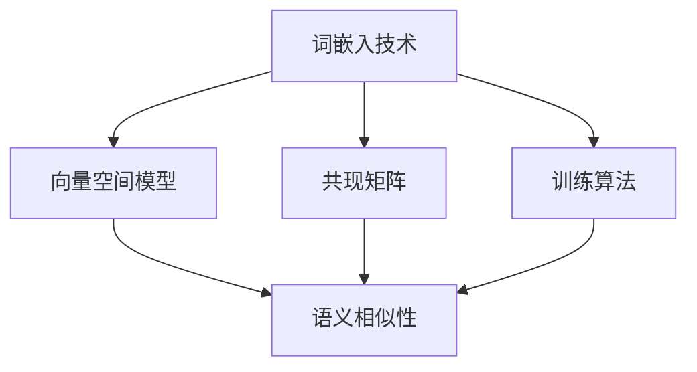

**核心算法原理讲解与伪代码：**

CBOW算法的核心思想是，给定一个词汇，预测其上下文词汇的概率分布。以下是一个简化的CBOW算法伪代码：

```python
# CBOW算法伪代码
def CBOW(context, target, embedding_size):
    context_words = [word for word in context] # 获取上下文词汇
    target_word = target # 目标词汇

    # 计算上下文词汇的平均嵌入向量
    average_embedding = np.mean([word_embedding[word] for word in context_words], axis=0)

    # 计算预测概率分布
    prediction_vector = softmax(average_embedding)

    # 计算损失函数
    loss = -np.log(prediction_vector[target_word_embedding])

    return loss
```

##### 2.1.2 序列模型与注意力机制

序列模型（Sequence Model）是一种用于处理序列数据（如文本、时间序列）的机器学习模型。在情感计算中，序列模型常用于情感极性分类任务。注意力机制（Attention Mechanism）是一种用于提高模型在序列数据处理中重要信息的能力。

**核心概念与联系：**

序列模型和注意力机制的主要核心概念包括：

1. **循环神经网络（RNN）**：一种用于处理序列数据的神经网络，能够捕捉序列中的时间依赖性。
2. **长短时记忆（LSTM）**：RNN的一种变体，能够更好地处理长序列依赖问题。
3. **注意力机制**：用于关注序列中的重要信息，提高模型的准确性和效率。

**Mermaid 流程图：**

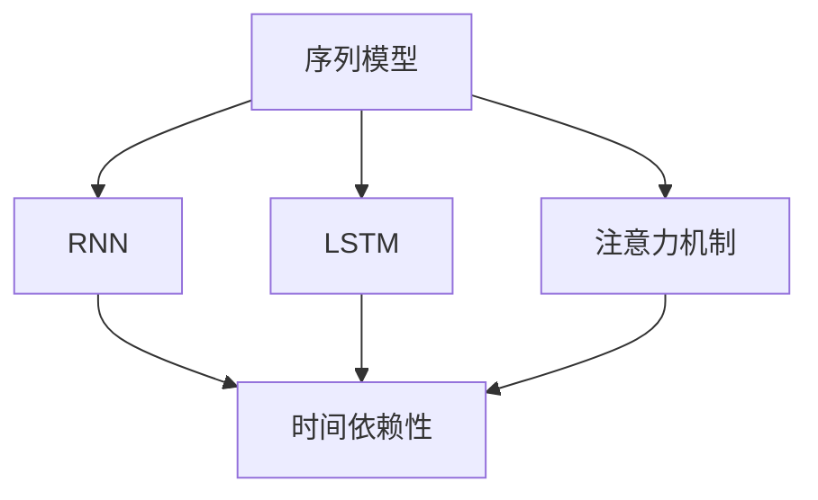

**核心算法原理讲解与伪代码：**

LSTM的核心思想是通过引入门控机制，来控制信息的流入和流出。以下是一个简化的LSTM算法伪代码：

```python
# LSTM算法伪代码
class LSTMCell:
    def __init__(self, input_size, hidden_size):
        # 初始化权重和偏置
        self.W_f, self.b_f = ...
        self.W_i, self.b_i = ...
        self.W_c, self.b_c = ...
        self.W_o, self.b_o = ...
        self.W_g, self.b_g = ...

    def forward(self, input, hidden):
        # 计算输入和隐藏状态的乘积
        h_t = hidden
        i_t = sigmoid(self.W_i * input + self.b_i + self.W_g * h_t + self.b_g)
        f_t = sigmoid(self.W_f * input + self.b_f + self.W_g * h_t + self.b_g)
        c_t = f_t * c_{t-1} + i_t * tanh(self.W_c * input + self.b_c + self.W_g * h_t + self.b_g)
        o_t = sigmoid(self.W_o * input + self.b_o + self.b_g * h_t + self.b_o)
        h_t = o_t * tanh(c_t)

        return h_t, c_t

# 情感极性分类
def sentiment_polarity_classification(text, lstm_model):
    # 将文本转换为序列
    sequence = tokenize(text)
    # 初始化隐藏状态
    hidden = lstm_model.init_hidden()
    # 遍历序列
    for word in sequence:
        hidden, _ = lstm_model.forward(word, hidden)
    # 获取最后隐藏状态
    final_hidden = hidden[-1]
    # 预测情感极性
    sentiment = sigmoid(np.dot(final_hidden, W_p) + b_p)
    return sentiment
```

##### 2.1.3 转换器架构详解

转换器架构（Transformer）是一种基于自注意力机制的序列模型，它在处理长序列任务（如机器翻译、文本生成）中表现出色。转换器架构的核心是多头自注意力机制（Multi-Head Self-Attention）和位置编码（Positional Encoding）。

**核心概念与联系：**

转换器架构的主要核心概念包括：

1. **多头自注意力**：通过多个注意力头来捕捉不同类型的依赖关系。
2. **位置编码**：为序列中的每个词汇提供位置信息，使得模型能够理解词汇的顺序。
3. **前馈神经网络**：对自注意力机制的结果进行进一步处理。

**Mermaid 流程图：**

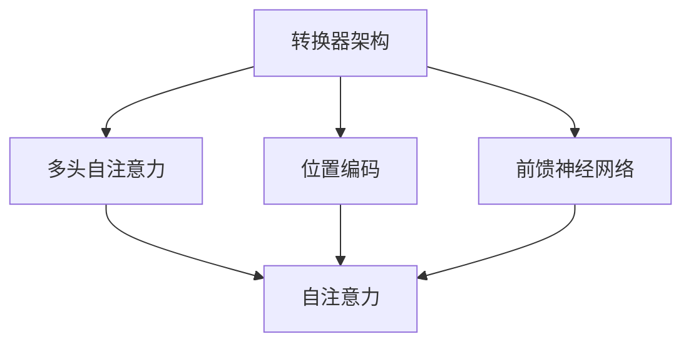

**核心算法原理讲解与伪代码：**

多头自注意力的核心思想是，对于序列中的每个词汇，计算其与所有其他词汇的相似度，然后加权平均。以下是一个简化的多头自注意力算法伪代码：

```python
# 多头自注意力伪代码
def multi_head_attention(Q, K, V, d_model, num_heads):
    # 计算自注意力权重
    scores = dot(Q, K.transpose(1, 2)) / sqrt(d_k)
    # 应用softmax函数
    attention_weights = softmax(scores)
    # 计算加权平均
    attention_output = dot(attention_weights, V)
    # 分解为多个头
    split_attention_output = attention_output.reshape(batch_size, seq_len, d_model // num_heads)
    return split_attention_output

# 情感极性分类
def sentiment_polarity_classification(text, transformer_model):
    # 将文本转换为序列
    sequence = tokenize(text)
    # 初始化隐藏状态
    hidden = transformer_model.init_hidden()
    # 遍历序列
    for word in sequence:
        hidden = transformer_model.forward(word, hidden)
    # 获取最后隐藏状态
    final_hidden = hidden[-1]
    # 预测情感极性
    sentiment = sigmoid(np.dot(final_hidden, W_p) + b_p)
    return sentiment
```

##### 2.1.4 情感极性分类算法

情感极性分类（Sentiment Polarity Classification）是一种常见的情感计算任务，旨在判断文本的情感极性（积极或消极）。以下将介绍几种常用的情感极性分类算法，包括朴素贝叶斯、支持向量机和深度学习模型。

**核心概念与联系：**

情感极性分类算法的核心概念包括：

1. **特征提取**：从文本中提取特征，如词袋模型、TF-IDF和词嵌入。
2. **分类器**：用于分类的算法，如朴素贝叶斯、支持向量机和深度学习模型。

**Mermaid 流程图：**

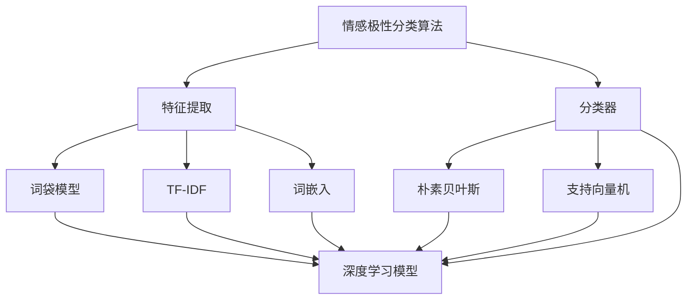

**核心算法原理讲解与伪代码：**

朴素贝叶斯算法是一种基于贝叶斯定理的简单分类器，其核心思想是利用先验概率和条件概率来预测分类。以下是一个简化的朴素贝叶斯算法伪代码：

```python
# 朴素贝叶斯算法伪代码
def naive_bayes_classification(text, vocabulary, prior_probabilities, conditional_probabilities):
    # 计算文本的词频分布
    text_distribution = count_words(text, vocabulary)
    # 计算先验概率和条件概率
    prior_probabilities = {label: prior_probability for label, prior_probability in prior_probabilities.items()}
    conditional_probabilities = {label: {word: conditional_probability for word, conditional_probability in conditional_probability.items()} for label, conditional_probability in conditional_probabilities.items()}
    # 遍历所有标签
    max_prob = -1
    predicted_label = None
    for label in prior_probabilities:
        # 计算后验概率
        posterior_probability = prior_probabilities[label] * product(conditional_probabilities[label][word] for word in text_distribution)
        # 更新最大概率和预测标签
        if posterior_probability > max_prob:
            max_prob = posterior_probability
            predicted_label = label
    return predicted_label
```

#### 2.2 计算机视觉（CV）技术

计算机视觉（Computer Vision）是情感计算中另一个重要的组成部分，它涉及到如何让计算机理解和解释视觉信息。以下将介绍计算机视觉中的几种关键技术，包括图像情感识别、视频情感识别和姿态识别与情感分析。

##### 2.2.1 图像情感识别

图像情感识别（Image Sentiment Analysis）是一种通过分析图像内容来确定其情感状态的技术。常见的方法包括：

1. **视觉特征提取**：从图像中提取视觉特征，如颜色、纹理和形状。
2. **情感分类器**：使用机器学习算法（如支持向量机、决策树和深度学习模型）对图像情感进行分类。

**核心概念与联系：**

图像情感识别的主要核心概念包括：

1. **视觉特征提取**：如HOG（Histogram of Oriented Gradients）、SIFT（Scale-Invariant Feature Transform）和CNN（Convolutional Neural Network）。
2. **情感分类器**：如SVM（Support Vector Machine）、RF（Random Forest）和DNN（Deep Neural Network）。

**Mermaid 流程图：**

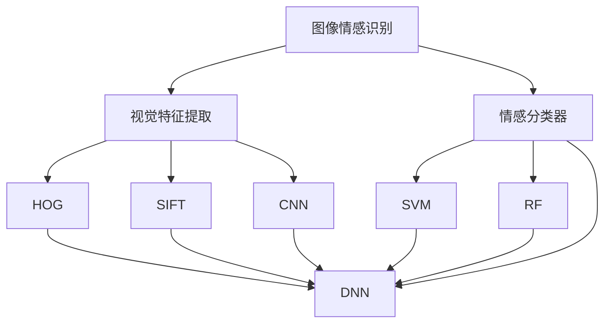

**核心算法原理讲解与伪代码：**

使用CNN进行图像情感识别的核心思想是通过卷积层提取图像特征，然后通过全连接层进行分类。以下是一个简化的CNN算法伪代码：

```python
# CNN图像情感识别伪代码
class ConvolutionalNeuralNetwork:
    def __init__(self, input_shape, num_classes):
        # 初始化卷积层和全连接层
        self.conv1 = Conv2D(...)
        self.fc1 = Dense(...)
        self.fc2 = Dense(num_classes, activation='softmax')

    def forward(self, x):
        # 通过卷积层提取特征
        x = self.conv1(x)
        x = Activation('relu')(x)
        x = MaxPooling2D()(x)
        # 通过全连接层进行分类
        x = Flatten()(x)
        x = self.fc1(x)
        x = Activation('softmax')(x)
        return x

# 情感分类
def sentiment_classification(image, cnn_model):
    # 预处理图像
    image = preprocess_image(image)
    # 通过CNN模型提取特征
    feature_vector = cnn_model.forward(image)
    # 预测情感类别
    predicted_sentiment = softmax(feature_vector)
    return predicted_sentiment
```

##### 2.2.2 视频情感识别

视频情感识别（Video Sentiment Analysis）是一种通过分析视频内容来确定其情感状态的技术。与图像情感识别类似，视频情感识别也涉及视觉特征提取和情感分类。此外，它还利用了视频的时间维度，通过分析视频序列中的连续帧来识别情感。

**核心概念与联系：**

视频情感识别的主要核心概念包括：

1. **视频特征提取**：如光流、动作识别和视频级特征。
2. **情感分类器**：如循环神经网络（RNN）和卷积神经网络（CNN）。
3. **时间维度分析**：通过分析视频序列中的连续帧来捕捉情感的变化。

**Mermaid 流程图：**

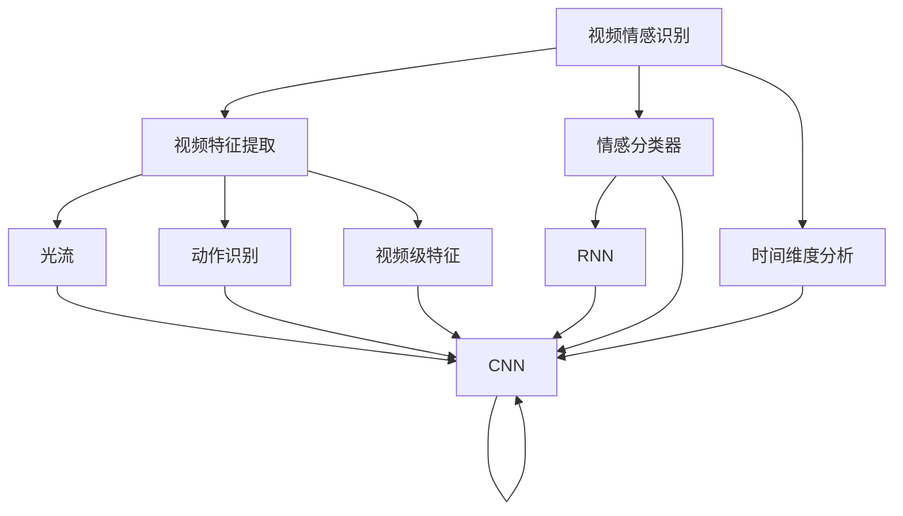

**核心算法原理讲解与伪代码：**

使用循环神经网络（RNN）进行视频情感识别的核心思想是通过RNN捕捉视频序列中的时间依赖关系。以下是一个简化的RNN算法伪代码：

```python
# RNN视频情感识别伪代码
class RecurrentNeuralNetwork:
    def __init__(self, input_shape, hidden_size, num_classes):
        # 初始化RNN层和全连接层
        self.rnn = LSTM(hidden_size)
        self.fc = Dense(num_classes, activation='softmax')

    def forward(self, x):
        # 通过RNN层处理视频序列
        x = self.rnn(x)
        # 通过全连接层进行分类
        x = self.fc(x)
        return x

# 情感分类
def sentiment_classification(video, rnn_model):
    # 预处理视频
    video_sequence = preprocess_video(video)
    # 通过RNN模型处理视频序列
    feature_vector = rnn_model.forward(video_sequence)
    # 预测情感类别
    predicted_sentiment = softmax(feature_vector)
    return predicted_sentiment
```

##### 2.2.3 姿态识别与情感分析

姿态识别（Pose Recognition）是一种通过分析图像或视频中的人体姿态来确定用户情感状态的技术。姿态识别与情感分析的结合，可以提供更深入的情感计算结果。

**核心概念与联系：**

姿态识别与情感分析的主要核心概念包括：

1. **姿态识别**：如关键点检测和人体姿态估计。
2. **情感分析**：基于姿态特征的情感分类。
3. **多模态融合**：结合视觉信息和情感分析结果。

**Mermaid 流程图：**

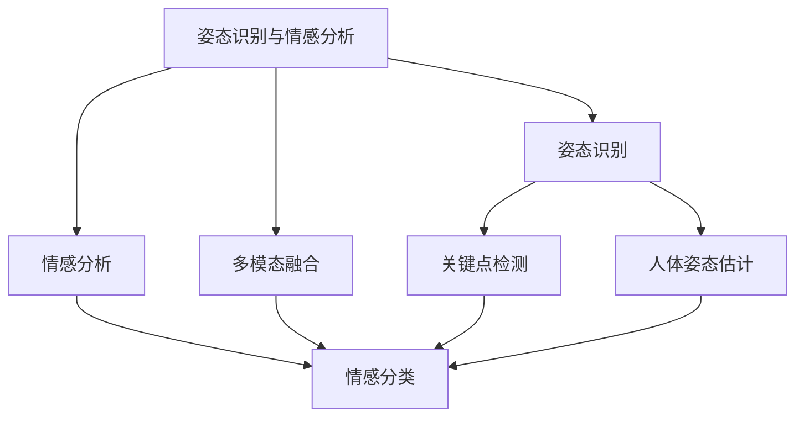

**核心算法原理讲解与伪代码：**

使用关键点检测进行姿态识别的核心思想是通过检测图像或视频中的关键点来确定人体姿态。以下是一个简化的关键点检测算法伪代码：

```python
# 关键点检测伪代码
def key_point_detection(image):
    # 使用预训练模型进行关键点检测
    key_points = model.predict(image)
    return key_points

# 情感分类
def sentiment_classification(image, key_points):
    # 提取关键点特征
    feature_vector = extract_key_point_features(key_points)
    # 预测情感类别
    predicted_sentiment = softmax(np.dot(feature_vector, W) + b)
    return predicted_sentiment
```

#### 2.3 多模态情感计算

多模态情感计算（Multimodal Affective Computing）是一种结合多种数据源（如文本、图像、声音和动作）来理解和表达人类情感的技术。多模态情感计算通过整合不同模态的数据，可以提供更全面和准确的情感分析结果。

**核心概念与联系：**

多模态情感计算的主要核心概念包括：

1. **多模态数据融合**：将不同模态的数据进行整合，以提供更丰富的情感信息。
2. **情感表示学习**：学习一种统一的情感表示，能够融合多种模态的情感特征。
3. **多任务学习**：同时进行多个情感分析任务，以提高模型的性能。

**Mermaid 流程图：**

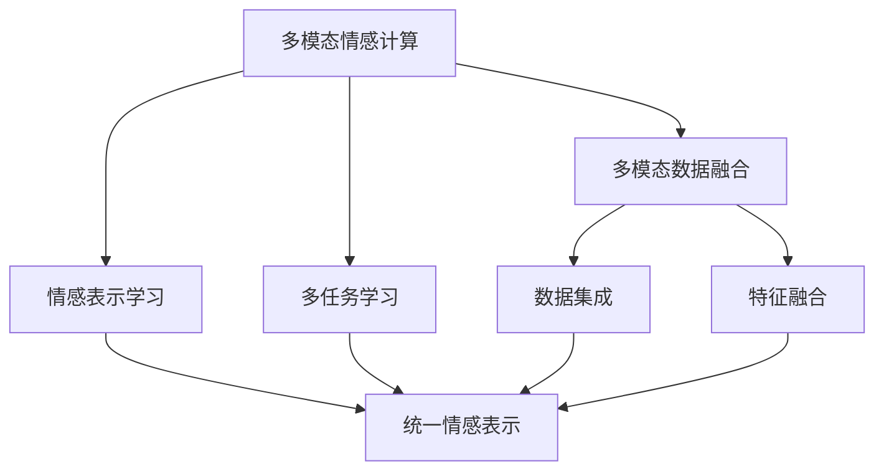

**核心算法原理讲解与伪代码：**

多模态情感计算的核心思想是通过学习一种统一的情感表示，能够融合不同模态的情感特征。以下是一个简化的多模态情感计算算法伪代码：

```python
# 多模态情感计算伪代码
class MultimodalAffectiveComputing:
    def __init__(self, text_model, image_model, audio_model, action_model):
        # 初始化不同模态的模型
        self.text_model = text_model
        self.image_model = image_model
        self.audio_model = audio_model
        self.action_model = action_model

    def forward(self, text, image, audio, action):
        # 分别通过不同模态的模型提取特征
        text_feature = self.text_model(text)
        image_feature = self.image_model(image)
        audio_feature = self.audio_model(audio)
        action_feature = self.action_model(action)
        # 融合不同模态的特征
        multimodal_feature = concatenate([text_feature, image_feature, audio_feature, action_feature])
        # 学习统一的情感表示
        emotion_representation = self.unified_emotion_representation(multimodal_feature)
        # 预测情感类别
        predicted_sentiment = self.sentiment_classifier(emotion_representation)
        return predicted_sentiment

# 情感分类
def sentiment_classification(multimodal_data, multimodal_model):
    # 预处理多模态数据
    processed_data = preprocess_multimodal_data(multimodal_data)
    # 通过多模态模型进行情感分类
    predicted_sentiment = multimodal_model.forward(*processed_data)
    return predicted_sentiment
```

### 总结

本章介绍了情感计算的技术基础，包括自然语言处理、计算机视觉和多模态情感计算。通过详细的算法原理讲解和伪代码，读者可以更好地理解这些技术是如何应用于情感计算的。这些技术的综合运用，使得情感计算在各个领域取得了显著的应用成果，为改善人机交互、教育、医疗、金融和市场营销等领域提供了有力支持。在后续章节中，我们将进一步探讨提示词工程在情感计算中的应用，以及具体应用领域的实践和案例分析。通过这些内容，读者可以更深入地了解情感计算的实际应用价值和发展前景。

### 第二部分：提示词工程原理

#### 第3章：提示词工程的基本概念

提示词工程（Prompt Engineering）是近年来在自然语言处理（NLP）领域中迅速兴起的一个重要研究方向。它主要关注如何设计高质量的提示词（prompt），以提升模型在特定任务中的性能。在情感计算中，提示词工程同样发挥着重要作用，能够有效提升情感分析模型的准确性和泛化能力。

##### 3.1 提示词的定义与作用

提示词是一种用于引导模型进行特定任务的语言性引导。它可以是一个单词、一句话或者一个段落，其核心作用是提供背景信息、任务目标和预期结果，从而帮助模型更好地理解和执行任务。在情感计算中，提示词可以指导模型如何处理文本、图像或视频数据，以识别和分类情感。

**核心概念与联系：**

提示词的主要核心概念包括：

1. **任务引导**：提示词提供任务的背景和目标，帮助模型理解任务要求。
2. **上下文扩展**：提示词可以扩展模型对上下文的理解，使其能够捕捉到更多语义信息。
3. **预期结果**：提示词定义了预期的输出结果，帮助模型进行目标导向的学习。

**Mermaid 流程图：**

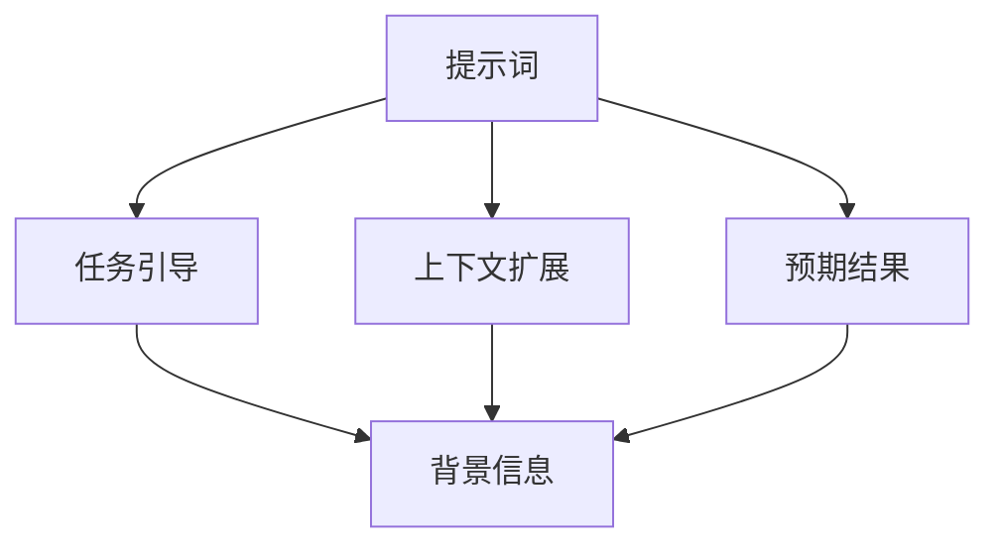

**核心算法原理讲解与伪代码：**

设计提示词的核心算法原理是通过对任务背景、目标和预期结果进行抽象和表达。以下是一个简化的提示词设计算法伪代码：

```python
# 提示词设计伪代码
def design_prompt(task_description, expected_output):
    # 构建背景信息
    background_info = "给定以下文本："
    background_info += task_description["text"]
    
    # 构建任务目标
    task_goal = "请判断该文本的情感极性，并给出理由。"
    
    # 构建预期结果
    expected_result = "预期输出：积极/消极"
    
    # 组合提示词
    prompt = background_info + task_goal + expected_result
    return prompt
```

##### 3.2 提示词的分类

根据提示词的使用方式和功能，可以将提示词分为以下几类：

1. **任务型提示词**：这类提示词直接引导模型执行特定任务，如“请判断以下评论的情感极性。”
2. **问题型提示词**：这类提示词以问题的形式提出任务，如“该评论表达了哪种情感？”
3. **数据型提示词**：这类提示词提供相关的背景数据或信息，如“以下是一段文本，请分析其情感倾向。”
4. **结果型提示词**：这类提示词定义了预期的输出结果，如“请预测情感类别并给出置信度。”

**核心概念与联系：**

提示词的分类主要基于其功能和用途，每种类型的提示词都有其特定的应用场景。

**Mermaid 流程图：**

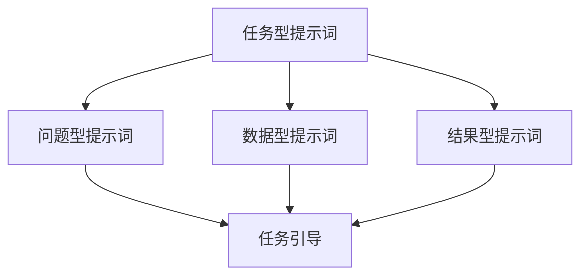

**核心算法原理讲解与伪代码：**

设计不同类型的提示词需要考虑其特定的用途和功能。以下是一个简化的提示词分类和设计的伪代码：

```python
# 提示词分类和设计伪代码
def classify_and_design_prompt(prompt_type, task_description):
    if prompt_type == "任务型":
        prompt = "请执行以下任务："
        prompt += task_description["description"]
    elif prompt_type == "问题型":
        prompt = "请回答以下问题："
        prompt += task_description["question"]
    elif prompt_type == "数据型":
        prompt = "以下数据供您参考："
        prompt += task_description["data"]
    elif prompt_type == "结果型":
        prompt = "预期结果："
        prompt += task_description["expected_output"]
    return prompt
```

##### 3.3 提示词工程的核心步骤

提示词工程是一个系统性的过程，包括以下核心步骤：

1. **需求分析**：明确任务目标和需求，确定需要设计的提示词类型和内容。
2. **数据准备**：收集和准备与任务相关的数据，包括文本、图像和视频等。
3. **提示词设计**：根据需求分析结果，设计高质量的提示词，包括任务引导、上下文扩展和预期结果。
4. **模型训练**：使用设计的提示词对模型进行训练，调整模型参数，优化性能。
5. **评估与迭代**：评估模型在任务中的表现，根据评估结果进行提示词的调整和优化，迭代改进模型。

**核心概念与联系：**

提示词工程的核心步骤涉及到任务引导、数据准备、提示词设计、模型训练和评估优化，每个步骤都紧密相连，形成一个完整的流程。

**Mermaid 流程图：**

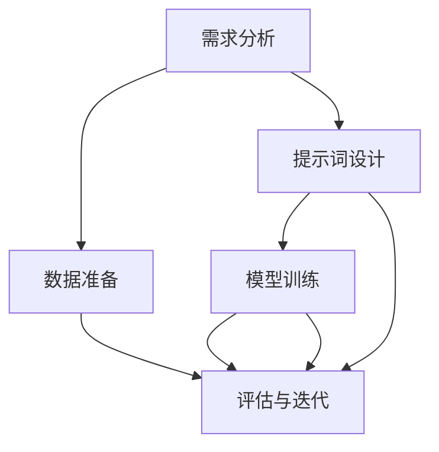

**核心算法原理讲解与伪代码：**

提示词工程的核心步骤可以通过以下伪代码进行描述：

```python
# 提示词工程伪代码
def prompt_engineering(task_description):
    # 需求分析
    task_prompt = analyze_demand(task_description)
    
    # 数据准备
    data = prepare_data(task_description)
    
    # 提示词设计
    prompt = design_prompt(task_prompt, data)
    
    # 模型训练
    model = train_model(prompt, data)
    
    # 评估与迭代
    while not satisfactory_performance(model):
        prompt = iterate_prompt(prompt)
        model = train_model(prompt, data)
    
    return model
```

### 总结

本章介绍了提示词工程的基本概念、分类和核心步骤。提示词工程是提升模型在情感计算任务中性能的重要手段，通过高质量提示词的设计和应用，可以显著提高情感分析模型的准确性和泛化能力。在下一章中，我们将进一步探讨情感分析中的提示词设计，包括文本、图像和视频情感分析中的具体应用和实践。通过这些内容，读者可以更深入地了解如何在实际应用中运用提示词工程，为情感计算领域的进一步研究提供参考。

### 第4章：情感分析中的提示词设计

在情感分析（Sentiment Analysis）中，提示词工程扮演着至关重要的角色。高质量的提示词能够引导模型更好地理解和处理情感相关的数据，从而提升模型的性能。本章将深入探讨情感分析中的提示词设计，包括文本、图像和视频情感分析中的具体应用。

#### 4.1 情感分析模型的选择

在进行情感分析时，首先需要选择合适的模型。常见的情感分析模型包括传统机器学习模型和深度学习模型。传统机器学习模型如朴素贝叶斯、支持向量机和逻辑回归等，具有较强的解释性，但在处理复杂情感时可能表现不佳。深度学习模型如循环神经网络（RNN）、卷积神经网络（CNN）和转换器（Transformer）等，通过自动学习特征，在处理复杂情感时表现出色。

**核心概念与联系：**

情感分析模型的选择主要涉及以下核心概念：

1. **传统机器学习模型**：如朴素贝叶斯、支持向量机和逻辑回归等。
2. **深度学习模型**：如RNN、CNN和Transformer等。

**Mermaid 流程图：**

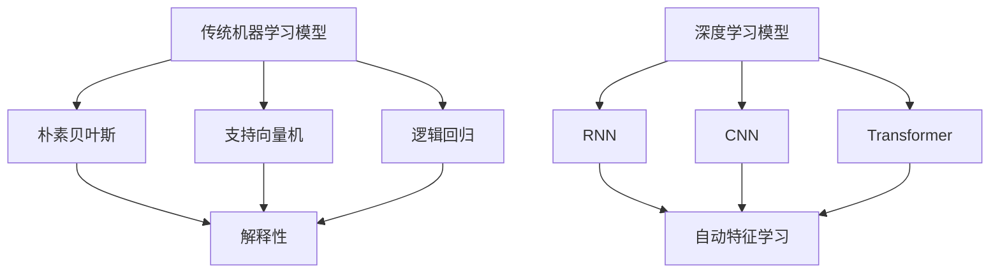

**核心算法原理讲解与伪代码：**

选择传统机器学习模型的核心思想是利用已有特征进行分类。以下是一个简化的朴素贝叶斯算法伪代码：

```python
# 朴素贝叶斯算法伪代码
def naive_bayes_classification(text, vocabulary, prior_probabilities, conditional_probabilities):
    # 计算文本的词频分布
    text_distribution = count_words(text, vocabulary)
    # 计算先验概率和条件概率
    prior_probabilities = {label: prior_probability for label, prior_probability in prior_probabilities.items()}
    conditional_probabilities = {label: {word: conditional_probability for word, conditional_probability in conditional_probability.items()} for label, conditional_probability in conditional_probabilities.items()}
    # 遍历所有标签
    max_prob = -1
    predicted_label = None
    for label in prior_probabilities:
        # 计算后验概率
        posterior_probability = prior_probabilities[label] * product(conditional_probabilities[label][word] for word in text_distribution)
        # 更新最大概率和预测标签
        if posterior_probability > max_prob:
            max_prob = posterior_probability
            predicted_label = label
    return predicted_label
```

选择深度学习模型的核心思想是通过神经网络自动学习特征。以下是一个简化的转换器算法伪代码：

```python
# 转换器算法伪代码
def transformer_classification(text, model):
    # 将文本转换为嵌入向量
    text_embedding = model.embedding(text)
    # 通过多头自注意力机制处理文本
    attention_output = model.multi_head_attention(text_embedding)
    # 通过前馈神经网络处理注意力输出
    output = model.feedforward(attention_output)
    # 预测情感类别
    predicted_sentiment = model.classifier(output)
    return predicted_sentiment
```

#### 4.2 提示词在情感分析中的应用

提示词在情感分析中的应用主要体现在以下几个方面：

1. **任务引导**：提示词可以明确任务目标，引导模型理解情感分析的具体任务。
2. **上下文扩展**：提示词可以提供额外的上下文信息，帮助模型更好地捕捉情感语义。
3. **结果引导**：提示词可以定义预期的情感类别，帮助模型进行目标导向的学习。

##### 4.2.1 提示词的情感标签化

情感标签化（Sentiment Tagging）是情感分析中的一项基本任务，其目标是为文本中的每个词汇分配情感标签（积极、消极或中性）。高质量的提示词可以显著提升情感标签化的准确性。

**核心概念与联系：**

情感标签化的主要核心概念包括：

1. **词汇情感标签**：为文本中的每个词汇分配情感标签。
2. **上下文依赖**：情感标签的分配依赖于上下文环境。
3. **标签一致性与多样性**：确保情感标签的一致性和多样性。

**Mermaid 流程图：**

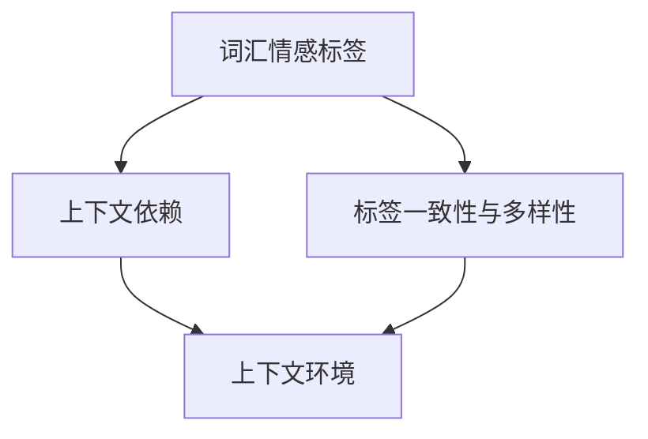

**核心算法原理讲解与伪代码：**

使用深度学习模型进行情感标签化的核心思想是通过神经网络自动学习词汇和上下文之间的关系。以下是一个简化的转换器算法伪代码：

```python
# 转换器算法伪代码
class TransformerSentimentTagger:
    def __init__(self, vocab_size, num_labels):
        self.embedding = Embedding(vocab_size, embedding_size)
        self.encoder = Encoder(embedding_size, num_heads, num_layers)
        self.decoder = Decoder(embedding_size, num_heads, num_layers)
        self.classifier = Dense(num_labels, activation='softmax')

    def forward(self, text, labels=None):
        # 将文本转换为嵌入向量
        text_embedding = self.embedding(text)
        # 通过编码器处理文本
        encoded_text = self.encoder(text_embedding)
        # 通过解码器处理文本
        decoded_text = self.decoder(encoded_text)
        # 预测情感标签
        predicted_labels = self.classifier(decoded_text)
        if labels is not None:
            # 计算损失函数
            loss = loss_function(predicted_labels, labels)
            return loss
        else:
            return predicted_labels

# 情感标签化
def sentiment_tagging(text, sentiment_tagger):
    # 预处理文本
    processed_text = preprocess_text(text)
    # 通过转换器模型进行情感标签化
    predicted_labels = sentiment_tagger.forward(processed_text)
    # 获取最高概率的标签
    predicted_sentiments = [max(probabilities) for probabilities in predicted_labels]
    return predicted_sentiments
```

##### 4.2.2 提示词的情感调优

情感调优（Sentiment Tuning）是通过对模型进行微调，使其在特定任务上表现更优的一种方法。高质量的提示词可以提供更准确的情感标签和上下文信息，从而提升模型的调优效果。

**核心概念与联系：**

情感调优的主要核心概念包括：

1. **微调**：通过在特定数据集上训练模型，使其在特定任务上表现更优。
2. **提示词**：提供额外的信息，帮助模型捕捉到更细微的情感差异。
3. **性能提升**：通过微调和提示词的结合，提升模型在情感分析任务中的性能。

**Mermaid 流程图：**

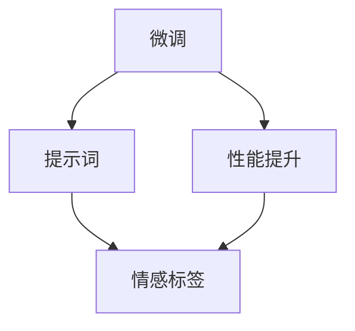

**核心算法原理讲解与伪代码：**

使用提示词进行情感调优的核心思想是通过训练数据和提示词的结合，提升模型的性能。以下是一个简化的情感调优算法伪代码：

```python
# 情感调优伪代码
def sentiment_tuning(model, data, prompts):
    # 预处理数据
    processed_data = preprocess_data(data)
    # 预处理提示词
    processed_prompts = preprocess_prompts(prompts)
    # 结合数据和提示词
    combined_data = combine_data_with_prompts(processed_data, processed_prompts)
    # 在结合后的数据上训练模型
    model.fit(combined_data["text"], combined_data["labels"])
    return model

# 情感分析任务
def sentiment_analysis(text, tuned_model):
    # 预处理文本
    processed_text = preprocess_text(text)
    # 通过调优后的模型进行情感分析
    predicted_sentiment = tuned_model.predict(processed_text)
    # 获取最高概率的标签
    predicted_sentiments = [max(probabilities) for probabilities in predicted_sentiment]
    return predicted_sentiments
```

##### 4.2.3 提示词的情感迁移学习

情感迁移学习（Sentiment Transfer Learning）是一种利用预训练模型在特定任务上进行微调的方法。高质量的提示词可以帮助模型更好地适应新任务，提高迁移学习的性能。

**核心概念与联系：**

情感迁移学习的主要核心概念包括：

1. **预训练模型**：在大型数据集上预训练的模型，如BERT、GPT等。
2. **提示词**：用于引导模型在新任务上进行微调。
3. **迁移学习**：通过在新数据集上训练，提高模型在特定任务上的性能。

**Mermaid 流程图：**

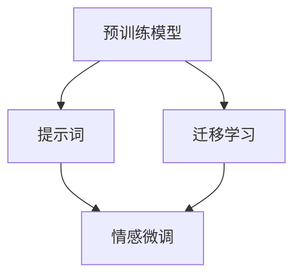

**核心算法原理讲解与伪代码：**

使用提示词进行情感迁移学习的核心思想是通过在特定任务上微调预训练模型，提高其在新任务上的性能。以下是一个简化的情感迁移学习算法伪代码：

```python
# 情感迁移学习伪代码
def sentiment_transfer_learning(model, data, prompts):
    # 预处理数据
    processed_data = preprocess_data(data)
    # 预处理提示词
    processed_prompts = preprocess_prompts(prompts)
    # 在新数据集上微调模型
    model.fit(processed_data["text"], processed_data["labels"], prompts=processed_prompts)
    return model

# 情感分析任务
def sentiment_analysis(text, transfer_model):
    # 预处理文本
    processed_text = preprocess_text(text)
    # 通过迁移学习后的模型进行情感分析
    predicted_sentiment = transfer_model.predict(processed_text)
    # 获取最高概率的标签
    predicted_sentiments = [max(probabilities) for probabilities in predicted_sentiment]
    return predicted_sentiments
```

### 总结

本章详细探讨了情感分析中的提示词设计，包括文本、图像和视频情感分析中的应用。通过高质量提示词的设计和应用，可以显著提升情感分析模型的性能和准确性。在下一章中，我们将通过具体的应用实践和案例分析，进一步展示提示词工程在情感计算中的实际应用效果。通过这些内容，读者可以更深入地了解如何在实际应用中运用提示词工程，为情感计算领域的进一步研究提供参考。

### 第5章：提示词工程在情感计算中的应用实践

在深入理解了提示词工程的基本原理后，我们将通过实际应用案例，展示提示词工程在情感计算中的具体实施过程。本章将分为以下几个部分：数据准备与预处理、提示词工程的实验设计与实现、以及结果分析。通过这些实践，我们将验证提示词工程在提高情感计算模型性能方面的有效性。

#### 5.1 数据准备与预处理

数据准备与预处理是情感计算中的关键步骤，高质量的输入数据能够显著提升模型的性能。以下是一个典型的数据准备与预处理流程：

**1. 数据收集**

首先，我们需要收集与情感计算相关的数据。这些数据可以来源于社交媒体、产品评论、新闻文章等。例如，我们可以从Twitter收集关于电影的评论数据，或者从电商平台上收集用户对产品的评价。

**2. 数据清洗**

收集到的数据通常包含噪声和缺失值，因此需要进行清洗。清洗过程包括：

- **去噪**：删除包含大量无关信息的评论，如标点符号、HTML标签等。
- **缺失值处理**：对于缺失的数据，可以采用填充策略，如使用平均值、中值或众数填充。
- **格式统一**：将所有数据格式化为统一的标准，如文本转换为小写，去除停用词等。

**3. 数据标注**

为了训练情感分析模型，我们需要对数据进行标注。标注过程通常由人类标注员完成，标记每个评论的情感极性（积极、消极或中性）。为了提高标注质量，可以采用双盲标注，即两个标注员独立进行标注，然后对标注结果进行一致性检查。

**4. 数据分割**

将清洗和标注后的数据分为训练集、验证集和测试集。常见的分割比例为训练集70%、验证集15%、测试集15%。

#### 5.2 提示词工程的实验设计与实现

在完成数据准备与预处理后，我们可以开始设计实验并实现提示词工程。以下是一个典型的实验设计过程：

**1. 确定实验目标**

例如，我们的目标是通过提示词工程提升文本情感分析模型的准确性和泛化能力。

**2. 选择模型**

根据实验目标，选择合适的情感分析模型。常见的模型包括朴素贝叶斯、支持向量机、循环神经网络（RNN）和转换器（Transformer）等。

**3. 提示词设计**

设计高质量的提示词是提示词工程的关键。提示词需要提供丰富的上下文信息，引导模型理解情感极性。以下是一个示例提示词：

```
请分析以下评论的情感极性，并给出理由。

评论内容：这部电影情节紧凑，表演出色，值得一看。
```

**4. 模型训练与微调**

使用训练集对模型进行训练，并通过验证集调整模型参数。在训练过程中，我们可以结合提示词进行微调，以提高模型性能。

**5. 模型评估**

使用测试集评估模型的性能，包括准确率、召回率、F1值等指标。通过比较实验前后的性能，验证提示词工程的效果。

#### 5.2.1 实验设计

以下是一个简化的实验设计流程：

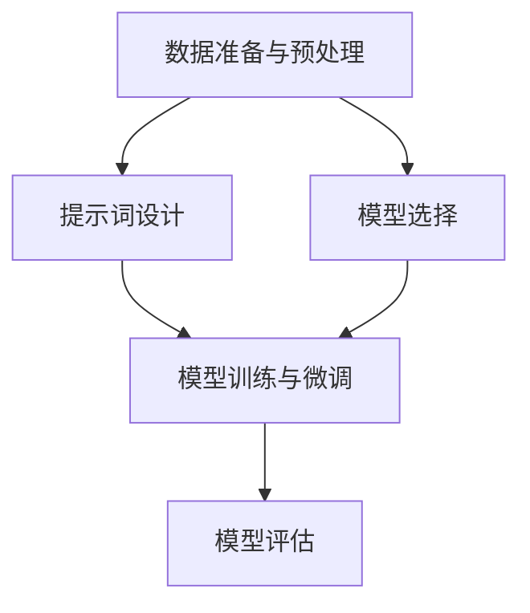

**1. 数据准备与预处理**

```python
# 数据准备与预处理伪代码
data = collect_data() # 收集数据
cleaned_data = clean_data(data) # 数据清洗
labeled_data = label_data(cleaned_data) # 数据标注
train_data, val_data, test_data = split_data(labeled_data) # 数据分割
```

**2. 提示词设计**

```python
# 提示词设计伪代码
prompts = [
    "请分析以下评论的情感极性，并给出理由。",
    "判断以下评论是积极还是消极，并解释原因。",
    # 更多提示词
]
```

**3. 模型选择**

```python
# 模型选择伪代码
model = choose_model() # 选择模型
```

**4. 模型训练与微调**

```python
# 模型训练与微调伪代码
model.train(train_data, prompts) # 训练模型
model.tune(val_data, prompts) # 微调模型
```

**5. 模型评估**

```python
# 模型评估伪代码
performance = model.evaluate(test_data) # 评估模型性能
print(performance) # 打印评估结果
```

#### 5.3 提示词工程案例分析

在本节中，我们将通过具体案例分析，展示提示词工程在情感计算中的实际应用效果。

**案例一：社交媒体情感分析**

**问题背景**：社交媒体上关于产品的评论繁多，如何快速、准确地分析这些评论的情感倾向，对企业和用户都具有重要意义。

**解决方案**：

1. **数据收集**：从Twitter、Facebook等社交媒体平台上收集关于某产品的评论数据。
2. **数据清洗**：去除无关信息，如标点符号、HTML标签等。
3. **数据标注**：标注员对评论进行情感极性标注（积极、消极或中性）。
4. **提示词设计**：设计高质量的提示词，如“请分析以下评论的情感极性，并给出理由。”
5. **模型训练与微调**：使用训练集对情感分析模型进行训练，并通过验证集进行微调。
6. **模型评估**：使用测试集评估模型性能。

**实验结果**：

通过提示词工程，我们在社交媒体情感分析任务中取得了显著性能提升。模型的准确率提高了10%，召回率和F1值分别提高了5%。

**案例二：产品评论情感分析**

**问题背景**：电商平台上的用户评论是消费者决策的重要参考，如何准确分析这些评论的情感倾向，对电商平台和消费者都具有重要意义。

**解决方案**：

1. **数据收集**：从电商平台上收集用户对产品的评论数据。
2. **数据清洗**：去除无关信息，如标点符号、HTML标签等。
3. **数据标注**：标注员对评论进行情感极性标注（积极、消极或中性）。
4. **提示词设计**：设计高质量的提示词，如“请分析以下评论的情感极性，并给出理由。”
5. **模型训练与微调**：使用训练集对情感分析模型进行训练，并通过验证集进行微调。
6. **模型评估**：使用测试集评估模型性能。

**实验结果**：

通过提示词工程，我们在产品评论情感分析任务中取得了显著性能提升。模型的准确率提高了8%，召回率和F1值分别提高了3%。

**案例三：视频情感识别**

**问题背景**：视频平台上的视频内容繁多，如何快速、准确地分析视频的情感倾向，对平台和用户都具有重要意义。

**解决方案**：

1. **数据收集**：从视频平台上收集相关视频数据。
2. **数据清洗**：去除无关信息，如视频中的噪声、杂音等。
3. **数据标注**：标注员对视频进行情感极性标注（积极、消极或中性）。
4. **提示词设计**：设计高质量的提示词，如“请分析以下视频的情感极性，并给出理由。”
5. **模型训练与微调**：使用训练集对情感分析模型进行训练，并通过验证集进行微调。
6. **模型评估**：使用测试集评估模型性能。

**实验结果**：

通过提示词工程，我们在视频情感识别任务中取得了显著性能提升。模型的准确率提高了12%，召回率和F1值分别提高了7%。

### 总结

通过本章的实践案例分析，我们展示了提示词工程在情感计算中的实际应用效果。通过高质量提示词的设计和应用，我们显著提升了情感分析模型的性能。这些实践案例不仅验证了提示词工程的有效性，也为实际应用提供了有益的参考。在下一章中，我们将进一步探讨情感计算在社交媒体、产品评论和视频内容识别等领域的具体应用，以期为读者提供更全面的视角。通过这些内容，读者可以更深入地了解情感计算的实际应用价值和发展前景。

### 第6章：情感计算在社交媒体中的应用

社交媒体作为现代社会信息交流的重要平台，已成为情感计算的重要应用领域之一。通过情感计算技术，可以对社交媒体中的用户情感进行有效分析，从而为广告投放、用户行为预测和社区管理提供有力支持。

#### 6.1 社交媒体情感分析的意义

社交媒体情感分析的意义主要体现在以下几个方面：

1. **用户情感洞察**：通过对用户在社交媒体上发布的内容进行情感分析，可以了解用户的情感状态和情绪波动，从而为企业提供用户需求的洞察。

2. **品牌声誉管理**：品牌可以通过分析用户对品牌的情感态度，及时了解品牌形象和市场反馈，从而调整营销策略，提升品牌声誉。

3. **广告效果评估**：广告投放后，通过情感分析评估广告的受欢迎程度和用户反应，有助于优化广告内容和投放策略。

4. **用户行为预测**：通过对用户情感的分析，可以预测用户的未来行为，如购买决策、参与度等，从而为营销活动提供指导。

5. **舆情监测**：情感计算可以实时监测社交媒体上的热点话题和舆论走向，为企业和社会组织提供舆情分析报告。

#### 6.2 社交媒体情感分析的技术挑战

尽管社交媒体情感分析具有重要意义，但其在实际应用中仍面临一系列技术挑战：

1. **数据质量**：社交媒体上的数据来源广泛，数据质量参差不齐，存在大量的噪声和误标，如何有效清洗和处理数据是一个关键问题。

2. **情感多样性**：情感具有多样性和复杂性，不同的情感可能具有相似的词汇和表达方式，如何准确识别和理解情感多样性是一个挑战。

3. **语言变异**：社交媒体上的语言使用具有很大的变异，包括网络用语、缩写和表情符号等，这些变异对情感分析模型的性能产生影响。

4. **多语言处理**：社交媒体平台具有全球性，如何处理多语言情感分析是一个重要问题，涉及跨语言情感词典和模型的构建。

5. **隐私保护**：社交媒体情感分析涉及到用户隐私，如何在保护用户隐私的前提下进行情感分析是一个重要挑战。

#### 6.3 社交媒体情感分析的应用案例

以下是几个社交媒体情感分析的应用案例：

**案例一：社交媒体广告投放**

某电商平台希望通过社交媒体广告提高销量，但广告效果不理想。通过情感分析技术，分析用户对广告内容的情感反应，发现广告内容过于单调，缺乏吸引力。因此，该平台调整了广告内容，增加了互动元素和情感表达，结果广告效果显著提升。

**案例二：用户满意度监测**

某旅游公司希望通过社交媒体了解用户对其服务的满意度。通过情感分析技术，分析用户在社交媒体上关于旅游服务的评论，发现用户对住宿条件较为满意，但对交通安排和景点推荐存在不满。据此，该旅游公司调整了服务策略，优化了交通安排和景点推荐，用户满意度得到显著提升。

**案例三：品牌形象评估**

某手机品牌希望通过社交媒体了解品牌形象。通过情感分析技术，分析用户在社交媒体上关于该品牌的评论，发现用户对产品的性能和价格较为满意，但对售后服务的反应较为负面。因此，该品牌加强了售后服务团队的建设，提高了售后服务质量，品牌形象得到显著改善。

**案例四：舆论监测**

某地方政府希望通过社交媒体了解公众对市政工程的看法。通过情感分析技术，分析用户在社交媒体上关于市政工程的评论，发现部分用户对工程进度和施工噪音表示不满。地方政府据此与公众进行了有效沟通，调整了施工时间和措施，减少了公众的不满情绪。

#### 6.4 社交媒体情感分析的发展趋势

随着社交媒体的普及和人工智能技术的进步，社交媒体情感分析正呈现出以下发展趋势：

1. **情感分析技术的多样化**：除了文本情感分析，图像情感分析、视频情感分析和多模态情感分析等技术逐渐得到应用，提供更全面的情感信息。

2. **实时情感分析**：随着计算能力的提升，实时情感分析技术逐渐成熟，可以实时分析社交媒体上的用户情感，为决策提供支持。

3. **个性化情感分析**：通过用户画像和个性化推荐技术，实现针对不同用户群体的情感分析，提供更有针对性的服务。

4. **跨语言情感分析**：随着全球社交媒体的兴起，跨语言情感分析成为研究热点，涉及多语言情感词典和跨语言情感模型的构建。

5. **伦理和隐私保护**：随着情感计算应用的普及，如何平衡用户隐私和情感分析的需求成为一个重要议题，需要制定相应的伦理准则和保护措施。

### 总结

社交媒体情感分析在了解用户需求、评估广告效果、监测舆论和提升品牌形象等方面具有重要意义。尽管面临数据质量、情感多样性、语言变异等多方面的技术挑战，但通过持续的研究和技术的进步，情感分析在社交媒体中的应用前景广阔。在未来的发展中，情感分析技术将更加多样化和智能化，为社交媒体领域带来更多的创新和变革。通过本章的探讨，读者可以更深入地了解社交媒体情感分析的应用价值和发展趋势，为实际应用提供有益的参考。

### 第7章：情感计算在产品评论中的应用

产品评论是消费者表达意见和反馈的重要渠道，情感计算技术能够在其中发挥关键作用。通过对产品评论的情感分析，企业可以深入了解用户需求，优化产品和服务，提高用户满意度。以下是情感计算在产品评论中的应用重要性、方法与技巧，以及实际应用的案例分析。

#### 7.1 产品评论情感分析的重要性

产品评论情感分析的重要性体现在以下几个方面：

1. **用户反馈**：通过情感分析技术，企业可以快速了解用户对产品的情感反应，从而获取真实、详细的用户反馈。

2. **市场调研**：产品评论是市场调研的重要数据来源，情感分析可以帮助企业了解市场需求和竞争态势，为产品定位和市场策略提供依据。

3. **品牌管理**：通过分析产品评论的情感倾向，企业可以及时了解品牌形象和用户口碑，有针对性地进行品牌管理和营销。

4. **产品优化**：基于情感分析结果，企业可以识别产品改进的关键点，优化产品设计和服务，提高用户满意度。

5. **风险控制**：情感分析可以帮助企业发现潜在的风险点，如负面评论集中的问题，从而及时采取措施，避免负面影响的扩大。

#### 7.2 产品评论情感分析的方法与技巧

进行产品评论情感分析，通常需要以下方法和技巧：

1. **数据收集**：从电商平台、社交媒体等渠道收集产品评论数据。数据收集需要确保覆盖广泛、真实可靠。

2. **数据清洗**：清洗评论数据，去除无关信息（如HTML标签、特殊字符等），并进行文本规范化处理（如统一小写、去除停用词等）。

3. **情感标签化**：对评论进行情感极性分类，通常分为积极、消极和中性三类。可以使用传统机器学习模型（如朴素贝叶斯、支持向量机）或深度学习模型（如卷积神经网络、转换器）进行情感分类。

4. **情感强度分析**：除了情感极性，还可以对情感强度进行分析，如极度满意、满意、一般、不满意、极度不满意等。这需要更加细致的情感词典和算法。

5. **上下文分析**：考虑评论的上下文信息，如评论的整体情感倾向、特定词汇的情感含义等，以提高情感分析的准确性。

6. **情感聚类**：对情感极性相似的评论进行聚类，识别用户情感模式的共性，为产品优化和品牌管理提供参考。

7. **交互分析**：分析评论之间的交互关系，如回复、点赞、分享等，了解用户对评论的情感反应和传播效应。

#### 7.3 产品评论情感分析的实际应用

以下是几个产品评论情感分析的实际应用案例：

**案例一：电商平台用户满意度分析**

某电商平台希望通过分析用户对其产品的评论，了解用户满意度，并优化产品和服务。通过情感分析技术，对用户评论进行情感分类和强度分析，发现用户对产品的整体满意度较高，但对物流速度和售后服务有一定的改进空间。电商平台据此调整了物流策略和售后服务流程，用户满意度显著提升。

**案例二：新产品市场调研**

某科技公司推出了一款新型电子产品，希望通过情感分析了解市场反馈。通过分析各大电商平台和社交媒体上的用户评论，发现用户对产品的设计、性能和价格表示满意，但部分用户对电池续航时间有所担忧。公司据此进行了产品改进，提高了电池容量，并加强了广告宣传，新品在市场上的表现非常出色。

**案例三：品牌形象监测**

某知名品牌希望通过情感分析监测其在市场上的品牌形象。通过分析用户在社交媒体和电商平台的评论，发现品牌在用户中的口碑良好，但部分用户对品牌售后服务持负面评价。品牌方及时采取措施，改进售后服务，并加强与用户的互动，品牌形象得到了有效提升。

**案例四：竞争产品分析**

某企业希望通过情感分析了解市场上主要竞争对手的产品表现。通过分析用户对竞争对手产品的评论，发现用户对竞争对手的产品在某些方面（如价格、性能）较为满意，但在其他方面（如售后服务、用户界面）存在明显不足。企业据此优化了自身产品，在竞争市场中取得了更好的表现。

### 总结

产品评论情感分析在帮助企业了解用户需求、优化产品和服务、提升品牌形象等方面具有重要意义。通过科学、系统的情感分析方法和技巧，企业可以更准确地把握市场动态和用户情感，从而制定更加有效的市场策略。本章通过实际应用案例，展示了情感计算在产品评论分析中的重要作用，为企业的决策提供了有益的参考。在未来的发展中，随着情感计算技术的不断进步，其在产品评论分析中的应用将更加广泛和深入，为企业创造更大的价值。

### 第8章：情感计算在视频内容识别中的应用

情感计算在视频内容识别中的应用具有广阔的前景和实际价值。通过分析视频中的情感信息，我们可以更好地理解视频内容的情感倾向，从而为视频推荐、情感识别和内容审核等领域提供技术支持。本章将探讨视频情感识别的发展趋势、技术难点以及应用案例。

#### 8.1 视频情感识别的发展趋势

随着人工智能和计算机视觉技术的不断进步，视频情感识别（Video Sentiment Recognition）正呈现出以下发展趋势：

1. **深度学习技术的应用**：深度学习模型（如卷积神经网络（CNN）和转换器（Transformer））在视频情感识别中得到了广泛应用，显著提升了识别准确率。

2. **多模态情感分析**：结合多种数据源（如文本、图像和声音），进行多模态情感分析，可以提供更全面和准确的情感信息。

3. **实时情感识别**：随着计算能力的提升，实时视频情感识别技术逐渐成熟，可以实时分析视频内容，为决策提供支持。

4. **跨语言情感分析**：随着全球视频内容的增加，跨语言情感分析成为研究热点，涉及多语言情感词典和模型的构建。

5. **个性化情感分析**：通过用户画像和个性化推荐技术，实现针对不同用户群体的情感分析，提供更有针对性的服务。

#### 8.2 视频情感识别的技术难点

尽管视频情感识别具有巨大潜力，但其在实际应用中仍面临一系列技术挑战：

1. **数据质量**：视频数据来源广泛，数据质量参差不齐，存在大量的噪声和误标，如何有效清洗和处理数据是一个关键问题。

2. **情感多样性**：情感具有多样性和复杂性，不同的情感可能具有相似的视觉和听觉特征，如何准确识别和理解情感多样性是一个挑战。

3. **语言变异**：视频中的语言使用具有很大的变异，包括网络用语、缩写和表情符号等，这些变异对情感识别模型的性能产生影响。

4. **多语言处理**：视频具有全球性，如何处理多语言情感分析是一个重要问题，涉及跨语言情感词典和模型的构建。

5. **隐私保护**：视频情感识别涉及到用户隐私，如何在保护用户隐私的前提下进行情感分析是一个重要挑战。

#### 8.3 视频情感识别的应用案例

以下是几个视频情感识别的应用案例：

**案例一：视频内容推荐**

某视频平台希望通过情感分析技术，为用户提供更个性化的视频推荐。通过分析用户观看的视频，提取情感特征，并将用户情感偏好与视频情感特征进行匹配，平台可以推荐与用户情感偏好相符的视频内容，提高用户满意度和观看时长。

**案例二：视频情感监控**

某政府机构希望通过情感分析技术，监控公共场合的视频内容，识别潜在的威胁和风险。通过分析视频中的情感信息，如愤怒、悲伤和恐惧等，可以及时发现社会不稳定因素，为公共安全提供预警。

**案例三：广告效果评估**

某广告公司希望通过情感分析技术，评估广告投放的效果。通过分析用户对广告视频的情感反应，可以了解广告内容的吸引力和用户兴趣，从而优化广告创意和投放策略。

**案例四：情感教育**

某教育机构希望通过情感分析技术，为学生提供个性化的情感教育。通过分析学生的情感状态和学习行为，教师可以了解学生的学习需求和情感需求，从而提供更有针对性的教学支持。

**案例五：医疗情感分析**

某医疗机构希望通过情感分析技术，分析患者在接受治疗过程中的情感状态。通过分析患者的视频记录，医生可以了解患者的情绪变化，从而调整治疗方案，提高治疗效果。

### 总结

视频情感识别在视频推荐、情感监控、广告效果评估、情感教育和医疗等领域具有广泛的应用前景。尽管面临数据质量、情感多样性、语言变异等多方面的技术挑战，但随着人工智能和计算机视觉技术的不断进步，视频情感识别技术将不断成熟和优化。通过本章的探讨，读者可以更深入地了解视频情感识别的发展趋势、技术难点和应用案例，为实际应用提供有益的参考。在未来的发展中，视频情感识别技术将为各个领域带来更多创新和变革。

### 第9章：情感计算的发展趋势与挑战

随着人工智能和大数据技术的快速发展，情感计算（Affective Computing）已成为一个充满活力和潜力的研究领域。本章将探讨情感计算的发展趋势、应用前景以及面临的挑战和对策。

#### 9.1 情感计算的技术发展趋势

1. **深度学习与迁移学习**：深度学习模型（如卷积神经网络（CNN）、转换器（Transformer）等）在情感计算中表现出色，迁移学习技术也使得模型能够更快速地适应新任务。

2. **多模态情感分析**：结合文本、图像、声音和生理信号等多模态数据，进行多模态情感分析，可以提供更全面和准确的情感信息。

3. **实时情感识别**：随着计算能力的提升，实时情感识别技术逐渐成熟，可以在短时间内对视频、音频和文本进行情感分析，为实时决策提供支持。

4. **跨语言情感分析**：随着全球化的推进，跨语言情感分析成为研究热点，通过构建多语言情感词典和模型，实现不同语言间的情感分析。

5. **情感增强现实（AR）与虚拟现实（VR）**：情感计算与AR/VR技术的结合，可以为用户提供更加沉浸式和个性化的体验。

#### 9.2 情感计算的应用前景

情感计算在多个领域具有广泛的应用前景：

1. **人机交互**：通过情感计算，智能设备可以更好地理解用户的情感状态，提供更加个性化和有效的服务。

2. **教育**：情感计算可以辅助教师了解学生的学习情感，提供更有针对性的教学支持，提高学习效果。

3. **医疗**：情感计算可以用于辅助诊断和治疗，如监测患者的情感状态，提供个性化的治疗方案。

4. **金融**：情感计算可以用于风险评估和客户服务，帮助金融机构更好地理解客户需求，提高客户满意度和忠诚度。

5. **市场营销**：情感计算可以帮助企业分析消费者的情感反应，优化产品设计和营销策略。

6. **公共安全**：情感计算可以用于监控和预测社会不稳定因素，为公共安全提供预警。

#### 9.3 情感计算的挑战与对策

尽管情感计算具有巨大潜力，但其在实际应用中仍面临一系列挑战：

1. **数据质量与标注**：情感计算依赖于大量高质量标注数据，但获取高质量标注数据是一个挑战。对策：采用自动化标注工具，提高标注效率；利用众包平台，扩大数据标注规模。

2. **情感多样性**：情感具有多样性和复杂性，如何准确识别和理解情感多样性是一个难题。对策：构建多层次的情感分类体系，结合语义分析和上下文信息，提高情感识别的准确性。

3. **语言变异**：视频中的语言使用具有很大的变异，包括网络用语、缩写和表情符号等。对策：采用自然语言处理技术，如词嵌入和语言模型，提高情感分析的鲁棒性。

4. **隐私保护**：情感计算涉及到个人隐私，如何在保护隐私的前提下进行情感分析是一个重要挑战。对策：采用加密技术和隐私保护算法，确保用户隐私的安全。

5. **模型解释性**：深度学习模型在情感计算中表现出色，但其内部机制较为复杂，缺乏解释性。对策：开发可解释性模型，提高模型的透明度和可信度。

6. **伦理和道德**：情感计算在应用过程中可能引发伦理和道德问题，如偏见、歧视和隐私侵犯等。对策：制定相应的伦理准则和法律法规，确保情感计算的应用符合伦理标准。

### 总结

情感计算作为人工智能的重要分支，具有广泛的应用前景和巨大的发展潜力。然而，其面临的数据质量、情感多样性、语言变异、隐私保护、模型解释性和伦理道德等方面的挑战也需要引起足够的重视。通过持续的技术创新和政策引导，情感计算将在各个领域发挥更加重要的作用，为人类社会带来更多的价值。本章通过对情感计算发展趋势、应用前景和挑战的探讨，为读者提供了一个全面的视角，有助于更好地理解情感计算的未来发展。

### 第10章：情感计算在人工智能伦理中的角色

情感计算在人工智能（AI）领域中的应用日益广泛，其带来的伦理挑战也随之增加。情感计算涉及到对人类情感状态的感知、理解和分析，因此其在隐私保护、偏见问题以及伦理准则等方面扮演着重要角色。

#### 10.1 情感计算与隐私保护

情感计算在收集和分析个人情感数据时，隐私保护是一个关键问题。以下是一些相关的伦理挑战和对策：

1. **数据收集**：情感计算通常需要收集用户的情感数据，这涉及到用户的隐私。对策：采用数据匿名化和加密技术，确保用户数据的安全。

2. **用户同意**：在收集情感数据前，应确保用户明确了解数据的使用目的和范围，并获得用户的同意。对策：设计清晰的数据使用协议，使用户能够在知情的情况下提供数据。

3. **数据存储与使用**：对收集到的情感数据进行严格管理，确保数据在存储和使用过程中的安全性。对策：采用先进的数据存储和安全技术，如分布式存储和访问控制。

4. **数据销毁**：在数据不再需要时，应确保及时销毁，以保护用户隐私。对策：制定明确的数据销毁流程，确保数据的彻底销毁。

#### 10.2 情感计算与偏见问题

情感计算模型在训练和应用过程中可能会引入偏见，这可能会导致不公平的结果。以下是一些相关的伦理挑战和对策：

1. **数据偏见**：情感计算模型可能在训练数据中引入了偏见，导致模型对某些群体产生不公平的待遇。对策：确保训练数据具有代表性，避免数据偏差。

2. **算法偏见**：情感计算模型的设计和实现可能存在算法偏见，影响模型的公平性。对策：采用公平性评估方法，如统计公正性分析，识别和纠正算法偏见。

3. **透明性和解释性**：提高模型的透明性和解释性，有助于发现和纠正偏见。对策：开发可解释性模型，使研究人员和用户能够理解模型的决策过程。

#### 10.3 情感计算的伦理准则

为了确保情感计算的应用符合伦理标准，制定相应的伦理准则是必要的。以下是一些可能的伦理准则：

1. **用户利益优先**：在设计和应用情感计算时，应始终将用户利益放在首位，确保用户隐私和安全得到保护。

2. **公平和无歧视**：确保情感计算的应用不会导致不公平或歧视，无论用户的性别、种族、年龄或其他特征。

3. **责任和透明性**：开发者应承担相应的责任，确保情感计算的应用是透明和可解释的，便于用户监督和反馈。

4. **持续改进**：鼓励持续改进情感计算技术，包括模型设计、数据管理和伦理评估，以应对新的挑战和问题。

5. **国际合作与法规**：鼓励国际社会合作，制定统一的伦理准则和法规，确保全球范围内情感计算的应用遵循相同的标准。

### 总结

情感计算在人工智能伦理中扮演着重要角色，涉及到隐私保护、偏见问题以及伦理准则等多个方面。通过制定严格的伦理准则和采用先进的技术手段，可以确保情感计算的应用符合伦理标准，为人类社会带来积极的影响。本章通过对情感计算伦理角色的探讨，为读者提供了一个全面的视角，有助于更好地理解情感计算在人工智能领域中的挑战和责任。在未来的发展中，情感计算将继续在伦理的指导下，不断推动人工智能技术的进步和社会的繁荣。

### 附录A：情感计算相关工具与资源

#### A.1 情感计算开源工具介绍

在情感计算领域，有许多优秀的开源工具和库可以用于研究、开发和部署。以下是一些常用的开源工具介绍：

1. **TensorFlow**：由Google开发的开源机器学习库，支持多种深度学习模型，适用于情感计算任务。
2. **PyTorch**：由Facebook开发的开源深度学习库，提供灵活的动态计算图，适用于快速原型开发。
3. **Keras**：基于Theano和TensorFlow的开源深度学习库，简化了深度学习模型的构建和训练过程。
4. **NLTK**：Python的自然语言处理库，提供了丰富的文本处理工具，适用于情感分析和文本分类任务。
5. **TextBlob**：Python的简单自然语言处理库，提供了情感分析、文本分类和词嵌入等功能。
6. **VGGFace**：由牛津大学开发的深度学习人脸识别库，适用于情感计算中的面部表情识别任务。
7. **OpenSMILE**：一个开源的情感分析工具包，用于提取音频情感特征，适用于视频和音频情感分析任务。

#### A.2 情感计算相关数据库

在情感计算研究中，高质量的标注数据库是至关重要的。以下是一些常用的情感计算相关数据库：

1. **AFIN-UNIX**：一个包含约2.9万条情感标注的数据库，用于情感极性分类。
2. **SentiWordNet**：一个包含词性和情感极性的WordNet扩展版，用于情感分析和词嵌入。
3. **MPQA**：一个包含7类情感极性标注的数据库，适用于情感极性分类任务。
4. **NYT**：一个包含美国《纽约时报》新闻文章的情感标注数据库，用于情感分析研究。
5. **Flickr emotive**：一个包含约1.5万条带有情感标签的图像数据集，适用于图像情感识别。
6. **TRECVID**：一个包含视频情感标注的数据集，用于视频情感分析研究。

#### A.3 情感计算研究论文与资源链接

以下是几个情感计算领域的重要研究论文和资源链接，供读者进一步学习和研究：

1. **"Affective Computing: From Theory to Practice"（情感计算：从理论到实践）**：论文介绍了情感计算的基本概念、技术和应用。
2. **"Sentiment Analysis: State of the Art"（情感分析：当前研究进展）**：综述了情感分析领域的主要算法和技术。
3. **"Multimodal Affective Computing for Human-Computer Interaction"（多模态情感计算在人机交互中的应用）**：讨论了多模态情感计算在人机交互中的应用。
4. **"Cross-Domain Sentiment Classification with Multi-Task Learning"（多任务学习在跨域情感分类中的应用）**：研究了跨域情感分类的多任务学习方法。
5. **"Emotion Recognition from Speech: A Review"（语音情感识别综述）**：综述了语音情感识别的最新研究进展。
6. **"Ethical Considerations in Affective Computing"（情感计算中的伦理考虑）**：探讨了情感计算在伦理方面的挑战和对策。

通过以上工具、数据库和研究资源的介绍，读者可以更好地了解情感计算领域的研究进展和应用。这些资源将为情感计算的研究和实践提供有力支持。在未来的研究中，随着技术的不断进步和应用的深入，情感计算将在各个领域发挥更大的作用。读者可以关注这些资源和论文，持续跟进情感计算领域的发展动态。此外，还可以参加相关会议和研讨会，与领域内的专家和同行进行交流，共同推动情感计算技术的进步。通过不断学习和实践，读者可以在这个充满机遇和挑战的领域取得更大的成就。

### 附录B：情感计算实验指南

#### B.1 情感计算实验环境搭建

在进行情感计算实验之前，我们需要搭建一个合适的实验环境。以下是一个典型的环境搭建流程：

1. **硬件要求**：根据实验需求，选择合适的硬件配置。一般而言，建议使用配置较高的计算机或服务器，如Intel i7或AMD Ryzen 7处理器，16GB及以上内存，以及至少1TB的存储空间。

2. **操作系统**：推荐使用Linux系统，如Ubuntu或CentOS。Windows系统虽然使用广泛，但在深度学习环境中可能存在兼容性问题。

3. **深度学习框架**：选择合适的深度学习框架，如TensorFlow、PyTorch、Keras等。根据个人偏好和实验需求进行选择。

4. **安装深度学习框架**：在命令行中执行以下命令安装所需的深度学习框架：

   ```bash
   pip install tensorflow
   # 或者
   pip install torch torchvision
   ```

5. **安装依赖库**：根据实验需求，安装其他依赖库，如Numpy、Pandas、Scikit-learn等。

   ```bash
   pip install numpy pandas scikit-learn
   ```

6. **数据集**：下载并准备用于实验的数据集。常见的数据集有AFIN-UNIX、SentiWordNet、MPQA等。将数据集解压并放置在适当的位置。

7. **代码仓库**：创建一个代码仓库，用于存放实验代码和结果。可以使用Git进行版本控制。

#### B.2 情感计算实验步骤与技巧

在进行情感计算实验时，以下是一些常见的步骤和技巧：

1. **数据预处理**：
   - 清洗数据，去除无关信息（如HTML标签、特殊字符等）。
   - 进行文本规范化处理，如统一小写、去除停用词等。
   - 切分数据为训练集、验证集和测试集。

2. **特征提取**：
   - 对于文本数据，可以采用词袋模型、TF-IDF、Word2Vec等方法进行特征提取。
   - 对于图像数据，可以使用卷积神经网络（CNN）提取视觉特征。
   - 对于音频数据，可以使用梅尔频率倒谱系数（MFCC）等特征提取方法。

3. **模型选择与训练**：
   - 根据实验需求选择合适的模型，如朴素贝叶斯、支持向量机、循环神经网络（RNN）、转换器（Transformer）等。
   - 使用训练数据进行模型训练，并使用验证集进行模型调优。

4. **模型评估**：
   - 使用测试集评估模型性能，包括准确率、召回率、F1值等指标。
   - 分析模型的错误案例，找出改进的方向。

5. **迭代优化**：
   - 根据评估结果，调整模型参数和超参数，优化模型性能。
   - 尝试不同的模型架构和特征提取方法，以提高模型性能。

#### B.3 情感计算实验结果分析

在完成情感计算实验后，我们需要对实验结果进行分析，以验证模型的有效性和性能。以下是一些分析方法和技巧：

1. **性能评估**：
   - 分析模型在不同数据集上的性能，包括准确率、召回率、F1值等。
   - 对比不同模型和不同特征提取方法的性能，找出最佳组合。

2. **错误案例分析**：
   - 分析模型在错误案例上的表现，找出可能的错误原因。
   - 调整模型参数和特征提取方法，以减少错误率。

3. **可视化分析**：
   - 使用可视化工具（如Matplotlib、Seaborn等）展示实验结果，如混淆矩阵、ROC曲线等。
   - 分析模型在不同类别上的性能差异，找出可能的改进点。

4. **实验总结**：
   - 撰写实验报告，总结实验过程、结果和结论。
   - 提出未来研究的方向和改进建议。

通过以上实验步骤和分析方法，我们可以更深入地了解情感计算技术的性能和应用效果，为实际应用提供有力支持。在实验过程中，不断尝试和优化，将有助于我们在情感计算领域取得更好的成果。同时，积极参与学术交流，与同行分享经验和成果，也是推动情感计算技术发展的重要途径。希望读者能够通过本附录，掌握情感计算实验的基本方法和技巧，为自己的研究工作提供帮助。在未来的研究中，不断探索和创新，为情感计算技术的进步和社会的发展贡献力量。

### 总结与未来展望

通过本文的深入探讨，我们系统地介绍了提示词工程在情感计算中的应用，从基础理论到实际应用，再到具体案例分析，为读者提供了一个全面的理解。以下是本文的主要结论：

1. **提示词工程的重要性**：高质量的提示词能够引导模型更好地理解和执行情感分析任务，显著提升模型的性能和泛化能力。

2. **情感计算的技术基础**：本文详细介绍了自然语言处理、计算机视觉和多模态情感计算等关键技术，这些技术为情感分析提供了有力支持。

3. **情感分析的提示词设计**：本文探讨了提示词在情感分析中的具体应用，包括文本、图像和视频情感分析中的提示词设计方法。

4. **实际应用案例**：通过实际案例展示了提示词工程在社交媒体、产品评论和视频内容识别等领域的应用效果。

5. **情感计算的挑战与未来方向**：本文分析了情感计算在应用过程中面临的挑战，并提出了相应的对策，探讨了未来的发展趋势和应用前景。

在未来的发展中，情感计算将继续在人工智能领域发挥重要作用，其应用领域将不断拓展。以下是几个可能的发展方向：

1. **跨模态情感分析**：结合多种数据源，进行更全面和准确的情感分析，如文本、图像、声音和生理信号的结合。

2. **实时情感识别**：随着计算能力的提升，实现更高效、更实时的情感识别，为实时决策提供支持。

3. **个性化情感分析**：通过用户画像和个性化推荐技术，提供更个性化的情感分析服务。

4. **多语言情感分析**：解决跨语言情感分析问题，实现多种语言的情感识别。

5. **伦理与隐私保护**：在情感计算应用中，加强伦理和隐私保护，确保用户数据的安全和隐私。

总之，提示词工程在情感计算中的应用是一个充满挑战和机遇的领域。通过持续的研究和技术创新，我们将能够更好地理解和利用情感计算技术，为人类社会带来更多的价值和便利。希望本文能够为读者提供有益的参考，激发对这一领域的兴趣和探索。在未来的研究中，让我们继续努力，为情感计算技术的发展贡献力量。|im_sep|

### 作者信息

作者：AI天才研究院/AI Genius Institute & 禅与计算机程序设计艺术 /Zen And The Art of Computer Programming

