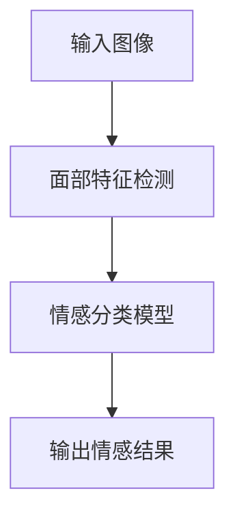
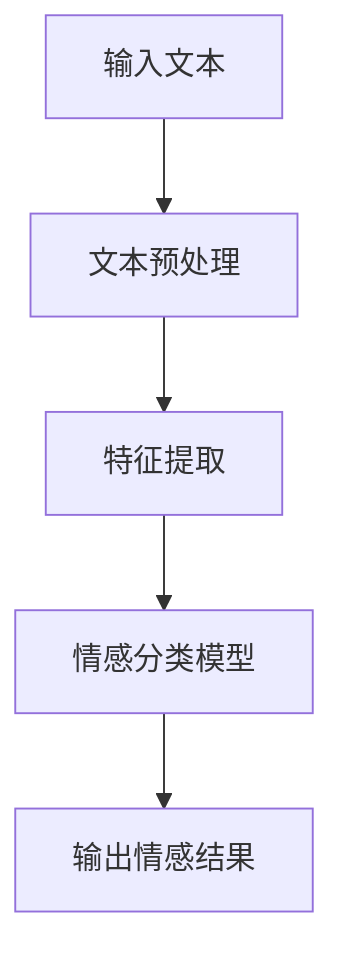
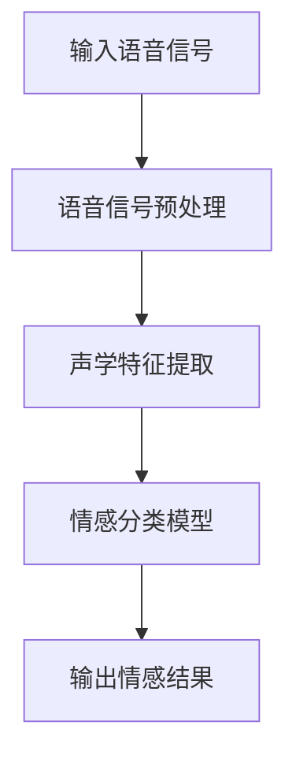
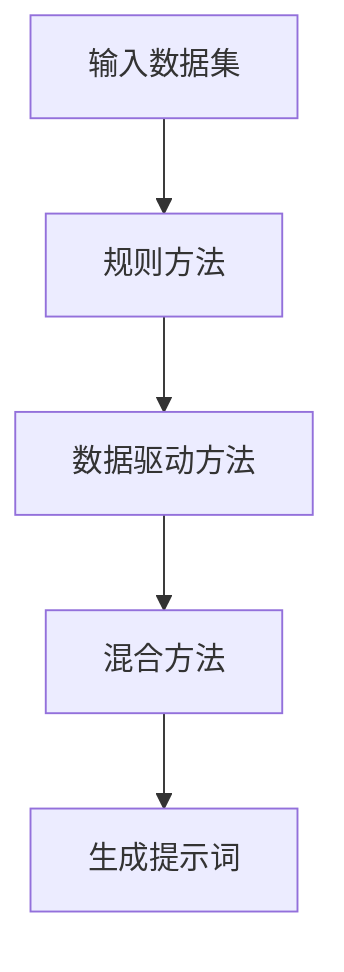
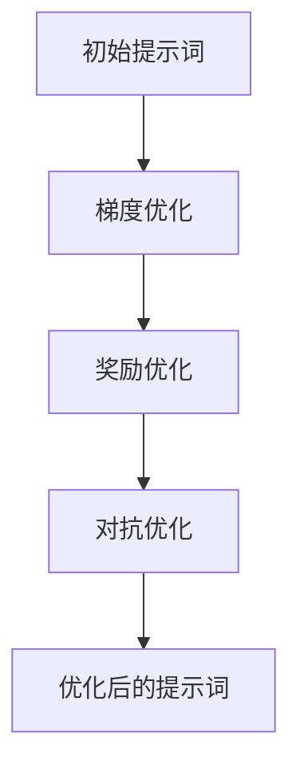
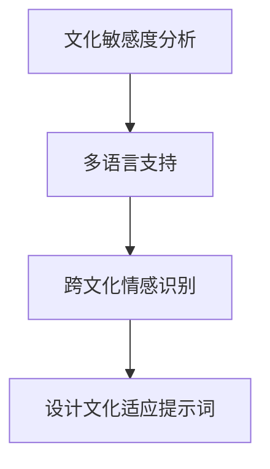

                 

### 文章标题

《提示词工程在情感计算中的文化适应》

### 关键词

- 情感计算
- 提示词工程
- 文化适应
- 情感识别
- 文本分析
- 跨文化应用

### 摘要

本文旨在探讨提示词工程在情感计算中的文化适应问题。首先，我们回顾了情感计算和提示词工程的基本概念及其发展历程。接着，详细介绍了情感计算的基本原理，包括情感识别技术、提示词工程方法和文化适应在其中的重要性。然后，本文分析了文化适应的理论与实践，探讨了文化差异对情感计算的影响以及跨文化情感计算的实践策略。在应用部分，我们通过案例研究展示了提示词工程在情感计算中的具体应用，包括社交媒体情感分析和跨文化客户服务机器人。最后，本文提出了提示词工程在文化适应方面的挑战和未来发展方向，并总结了全文的核心观点，对未来研究与实践提出了展望。通过这篇文章，读者可以全面了解提示词工程在情感计算中的文化适应问题，并对其应用前景有更深刻的认识。

### 目录大纲

#### 第一部分：基础概念与背景

1. **情感计算与提示词工程概述**
    1.1 情感计算的定义与历史
    1.2 提示词工程的作用和重要性
    1.3 文化适应在情感计算中的意义

2. **情感计算的基本原理**
    2.1 情感识别技术
        2.1.1 表情识别
        2.1.2 文本情感分析
        2.1.3 声音情感识别
    2.2 提示词工程方法
        2.2.1 提示词的生成与优化
        2.2.2 提示词与文化适应

3. **文化适应的理论与实践**
    3.1 文化适应的概念
    3.2 文化差异对情感计算的影响
    3.3 跨文化情感计算的实践策略

#### 第二部分：提示词工程在情感计算中的应用

4. **提示词工程与情感计算的融合**
    4.1 提示词工程在情感计算中的角色
        4.1.1 交互式情感分析
        4.1.2 情感驱动的个性化推荐
        4.1.3 情感调节与心理健康支持

5. **文化适应的提示词工程案例研究**
    5.1 案例一：社交媒体情感分析
    5.2 案例二：跨文化客户服务机器人

6. **提示词工程的文化适应挑战与未来方向**
    6.1 文化适应的挑战
    6.2 提示词工程的文化适应未来发展

#### 第三部分：总结与展望

7. **全书总结**
    7.1 核心观点回顾
    7.2 提示词工程与情感计算的文化适应现状
    7.3 对未来研究与实践的展望

8. **结语**
    8.1 总结与反思
    8.2 对读者的建议
    8.3 对后续研究的期待

### 附录

- **A.1 参考文献与资源列表**
- **A.2 提示词工程与情感计算相关工具与平台介绍**

#### 第1章：情感计算与提示词工程概述

### 1.1 情感计算的定义与历史

情感计算（Affective Computing）是人工智能领域的一个分支，主要研究如何使计算机具备识别、理解、表达和模拟人类情感的能力。情感计算的发展可以追溯到20世纪80年代，当时计算机科学领域开始探索如何将人类情感这一复杂的认知现象引入计算机系统中。

#### 情感计算的定义

情感计算通常被定义为“一种能够识别、解释、处理和模拟人类情感的能力”。这个定义包含了几个关键要素：

- **识别**：通过生理信号、面部表情、语音语调等手段来感知和识别人类的情感状态。
- **理解**：分析情感表达背后的含义，理解情感的背景和情境。
- **处理**：根据情感状态进行自适应的交互和响应。
- **模拟**：使计算机能够表现出与人类情感相似的行为和反应。

#### 情感计算的发展历史

1. **早期探索（1980s-1990s）**
   - 20世纪80年代，心理学家和计算机科学家开始合作，研究如何将情感理论应用于计算机系统。
   - 1995年，保罗·埃克曼（Paul Ekman）发表了一篇关于面部表情和情感的文章，这为情感计算的研究提供了重要的理论基础。

2. **技术进步（2000s）**
   - 随着计算机硬件和软件技术的发展，情感计算开始进入实际应用阶段。
   - 语音识别和自然语言处理技术的进步使得情感计算在文本和语音领域取得了显著成果。

3. **广泛应用（2010s-至今）**
   - 情感计算被广泛应用于智能客服、虚拟助手、教育系统、健康监测等领域。
   - 深度学习和机器学习算法的引入，使得情感计算在准确性、复杂度和实用性方面有了质的飞跃。

### 1.2 提示词工程的作用和重要性

提示词工程（Prompt Engineering）是近年来在自然语言处理领域兴起的一个研究方向，主要研究如何设计有效的提示词（Prompt），以提升机器学习模型的性能和解释性。

#### 提示词工程的基本概念

提示词工程的核心概念是“提示”，它是一种引导模型生成特定结果的技术手段。提示词可以看作是输入数据的补充，通过巧妙地设计提示词，可以引导模型学习到特定的知识和模式。

#### 提示词工程在情感计算中的应用

1. **交互式情感分析**
   - 提示词工程可以设计出针对不同情感状态的提问方式，帮助模型更准确地识别用户的情感。
   - 例如，通过设计特定的提示词，可以引导模型识别出用户在负面情绪状态下的具体情绪类型。

2. **情感驱动的个性化推荐**
   - 提示词工程可以帮助推荐系统更好地理解用户情感，从而提供个性化的情感相关推荐。
   - 例如，在音乐推荐系统中，通过提示词引导模型识别用户当前的情感状态，从而推荐与之相匹配的音乐。

3. **情感调节与心理健康支持**
   - 提示词工程可以设计出有助于用户情绪调节的对话流程，提供心理健康的支持。
   - 例如，通过设计特定的提示词，引导用户进行情绪表达和自我反思，有助于改善情绪状态。

#### 提示词工程的重要性

1. **提升模型性能**
   - 通过有效的提示词设计，可以引导模型学习到更精确的知识和模式，从而提升模型的性能。

2. **增强模型解释性**
   - 提示词工程可以帮助模型生成更具解释性的结果，使得模型的决策过程更加透明和可理解。

3. **促进跨学科合作**
   - 提示词工程需要结合语言学、心理学、计算机科学等多个学科的知识，促进了不同领域之间的合作与交流。

### 1.3 文化适应在情感计算中的意义

文化适应（Cultural Adaptation）是情感计算中的一个重要概念，指的是在跨文化环境中，计算机系统如何识别和理解不同文化背景下的情感表达。

#### 文化适应的概念

文化适应是指一个系统或模型在不同文化背景下，能够适当地调整其行为和响应，以适应不同文化的需求和期望。

#### 文化适应在情感计算中的应用场景

1. **跨国企业**
   - 跨国企业需要了解不同国家消费者的情感状态，以便提供个性化的产品和服务。

2. **国际交流**
   - 在国际交流中，理解不同文化背景下的情感表达对于促进文化交流和减少误解至关重要。

3. **智能客服**
   - 智能客服系统需要能够适应不同文化背景的用户需求，提供准确的情感分析和回应。

#### 文化适应的重要性

1. **提升用户体验**
   - 通过文化适应，系统可以更准确地识别和理解用户的情感，提供更个性化的服务和体验。

2. **减少误解**
   - 在跨文化交流中，准确理解情感表达有助于减少误解和冲突，促进和谐交流。

3. **推动科技进步**
   - 文化适应的研究推动了跨学科的合作，促进了人工智能技术在全球化背景下的进步和应用。

### 第2章：情感计算的基本原理

#### 2.1 情感识别技术

情感识别技术是情感计算的核心组成部分，主要研究如何通过多种方式识别和理解人类的情感状态。以下是几种常见的情感识别技术：

##### 2.1.1 表情识别

表情识别是通过分析面部表情来识别情感状态的一种技术。这种方法依赖于面部特征检测和情感分类算法。

- **面部特征检测**：首先，通过图像处理技术定位面部关键点，如眼睛、鼻子和嘴巴的位置。
- **情感分类算法**：然后，利用机器学习算法对检测到的面部表情进行分类，如快乐、悲伤、愤怒等。

**Mermaid 流程图：表情识别技术流程**



**伪代码：表情识别算法**

```python
def detect_face_emotion(image):
    # 步骤1：面部特征检测
    face_keypoints = detect_face_keypoints(image)
    # 步骤2：特征提取
    facial_features = extract_facial_features(face_keypoints)
    # 步骤3：情感分类
    emotion = classify_emotion(facial_features)
    return emotion
```

##### 2.1.2 文本情感分析

文本情感分析是通过分析文本内容来识别情感状态的一种技术。这种方法通常涉及自然语言处理和机器学习算法。

- **文本预处理**：首先，对文本进行清洗和分词，提取出有用的情感信息。
- **情感分类模型**：然后，利用预训练的模型或训练新的模型对文本进行情感分类，如正面、负面或中性。

**Mermaid 流程图：文本情感分析技术流程**



**伪代码：文本情感分析算法**

```python
def analyze_text_sentiment(text):
    # 步骤1：文本预处理
    preprocessed_text = preprocess_text(text)
    # 步骤2：特征提取
    features = extract_text_features(preprocessed_text)
    # 步骤3：情感分类
    sentiment = sentiment_model.predict(features)
    return sentiment
```

##### 2.1.3 声音情感识别

声音情感识别是通过分析语音的声学特征来识别情感状态的一种技术。这种方法涉及语音信号处理和情感分类算法。

- **语音信号处理**：首先，对语音信号进行预处理，提取出声音的声学特征，如音高、音强、音长等。
- **情感分类模型**：然后，利用机器学习算法对提取到的声学特征进行情感分类。

**Mermaid 流程图：声音情感识别技术流程**



**伪代码：声音情感识别算法**

```python
def recognize_audio_emotion(audio_signal):
    # 步骤1：语音信号预处理
    preprocessed_audio = preprocess_audio(audio_signal)
    # 步骤2：声学特征提取
    acoustic_features = extract_acoustic_features(preprocessed_audio)
    # 步骤3：情感分类
    emotion = emotion_model.predict(acoustic_features)
    return emotion
```

#### 2.2 提示词工程方法

提示词工程是自然语言处理领域的一个新兴研究方向，旨在通过设计有效的提示词来提升模型性能和解释性。以下是提示词工程的关键方法和应用：

##### 2.2.1 提示词的生成与优化

提示词生成是提示词工程的核心任务，主要研究如何生成具有良好性能的提示词。以下是一些常见的提示词生成方法：

1. **规则方法**：基于先验知识和规则生成提示词，如基于关键词匹配的方法。
2. **数据驱动方法**：利用大规模数据集训练生成提示词，如基于变换器的生成模型。
3. **混合方法**：结合规则和数据驱动方法，以生成更高质量的提示词。

**Mermaid 流程图：提示词生成方法流程**



**伪代码：提示词生成算法**

```python
def generate_prompt(data):
    # 步骤1：规则方法
    rule_based_prompt = rule_based_generation(data)
    # 步骤2：数据驱动方法
    data_driven_prompt = data_driven_generation(data)
    # 步骤3：混合方法
    hybrid_prompt = hybrid_generation(data)
    return hybrid_prompt
```

提示词优化是在提示词生成后，通过进一步优化提升提示词质量和性能的过程。以下是一些常见的提示词优化方法：

1. **基于梯度的优化**：利用梯度下降等优化算法调整提示词参数。
2. **基于奖励的优化**：通过奖励机制引导模型生成更好的提示词。
3. **基于对抗的优化**：利用对抗训练方法优化提示词生成。

**Mermaid 流程图：提示词优化方法流程**



**伪代码：提示词优化算法**

```python
def optimize_prompt(prompt, model):
    # 步骤1：梯度优化
    gradient_optimized_prompt = gradient_optimization(prompt, model)
    # 步骤2：奖励优化
    reward_optimized_prompt = reward_optimization(prompt, model)
    # 步骤3：对抗优化
    adversarial_optimized_prompt = adversarial_optimization(prompt, model)
    return adversarial_optimized_prompt
```

##### 2.2.2 提示词与文化适应

文化适应是提示词工程中的一个重要研究方向，旨在设计能够适应不同文化背景的提示词。以下是一些文化适应的关键方法：

1. **文化敏感度分析**：通过分析不同文化背景下的情感表达特点，为提示词设计提供指导。
2. **多语言支持**：设计能够支持多种语言的提示词，以适应不同语言背景的用户。
3. **跨文化情感识别**：通过跨文化数据集训练模型，提升模型在跨文化情感识别中的准确性。

**Mermaid 流程图：文化适应提示词工程方法流程**



**伪代码：文化适应提示词设计算法**

```python
def design_cultural_adaptive_prompt(culture_data, model):
    # 步骤1：文化敏感度分析
    cultural_sensitivity = analyze_cultural_sensitivity(culture_data)
    # 步骤2：多语言支持
    multilingual_support = enable_multilingual_support(cultural_sensitivity)
    # 步骤3：跨文化情感识别
    cross_cultural_sentiment = train_cross_cultural_model(multilingual_support)
    # 步骤4：设计文化适应提示词
    cultural_prompt = generate_cultural_prompt(cross_cultural_sentiment)
    return cultural_prompt
```

### 第3章：文化适应的理论与实践

#### 3.1 文化适应的概念

文化适应（Cultural Adaptation）是指个体或系统在不同文化背景下调整自身行为和认知方式，以更好地适应新环境的过程。在情感计算领域，文化适应强调计算机系统在不同文化背景下如何理解和处理情感信息。

#### 文化适应在情感计算中的重要性

文化适应在情感计算中的重要性体现在以下几个方面：

1. **提升情感识别准确性**：不同文化背景下，情感表达的方式和内容可能存在显著差异。文化适应有助于提升模型在跨文化环境中的情感识别准确性。

2. **增强用户体验**：理解用户的情感状态是提供个性化服务的关键。文化适应使得计算机系统能够更好地理解不同文化背景下的用户需求，从而提升用户体验。

3. **减少误解和冲突**：在跨文化交流中，准确理解情感表达有助于减少误解和冲突，促进和谐交流。

#### 文化适应的理论基础

文化适应的理论基础主要包括以下几个核心概念：

1. **文化相对论**：文化相对论认为，不同文化之间存在差异，没有绝对的是非标准。理解文化相对论有助于设计跨文化的情感计算系统。

2. **情感分类模型**：情感分类模型是文化适应的基础。通过构建适用于不同文化的情感分类模型，可以提升模型在跨文化环境中的性能。

3. **文化敏感性分析**：文化敏感性分析是指对不同文化背景下的情感表达特点进行分析和研究，为文化适应提供数据支持。

#### 文化适应的方法

1. **数据驱动的文化适应**：通过收集和整理跨文化的情感数据，利用机器学习算法训练情感分类模型。这种方法依赖于大规模的标注数据集。

2. **知识图谱构建**：构建知识图谱，将不同文化背景下的情感表达、习俗和价值观进行系统化整理。知识图谱可以为文化适应提供参考和指导。

3. **多模态融合**：结合多种数据源（如文本、语音、图像等），通过多模态融合技术提高情感识别的准确性和适应性。

#### 文化适应的实践策略

1. **跨文化情感分析**：利用文化适应的方法，对多语言、多文化的情感数据进行分析，识别不同文化背景下的情感特点。

2. **情感驱动的个性化服务**：根据用户的情感状态和需求，提供个性化的服务和建议。例如，在医疗领域，通过分析患者的情感状态，提供个性化的治疗方案。

3. **文化敏感度测试**：对现有情感计算系统进行文化敏感度测试，评估其在不同文化背景下的表现，并根据评估结果进行优化。

#### 跨文化情感计算的挑战

1. **数据多样性**：不同文化背景下的情感表达存在多样性，如何收集和标注高质量的多文化数据集是跨文化情感计算的一个挑战。

2. **模型解释性**：跨文化情感计算模型往往具有复杂的结构和参数，如何提高模型的解释性，使得用户能够理解和信任模型的决策过程是一个挑战。

3. **跨文化情感识别的局限性**：尽管跨文化情感计算取得了一定的进展，但仍然存在一些局限性，如对极端情感状态、非言语情感表达的理解不足等。

#### 文化适应的实践案例

1. **社交媒体情感分析**：通过文化适应的方法，分析不同国家社交媒体平台上的情感表达，识别文化差异和趋势。

2. **跨文化客户服务机器人**：设计跨文化客户服务机器人，通过文化适应策略提升机器人在不同文化背景下的服务质量和用户满意度。

3. **教育领域**：在在线教育平台上，通过文化适应技术，提供个性化的学习内容和互动方式，满足不同文化背景学生的需求。

### 第4章：提示词工程与情感计算的融合

#### 4.1 提示词工程在情感计算中的角色

提示词工程在情感计算中扮演着关键角色，它不仅提升了模型性能，还增强了模型的解释性和实用性。以下是提示词工程在情感计算中的几个关键角色：

1. **交互式情感分析**

交互式情感分析是提示词工程在情感计算中的一个重要应用。通过设计有效的提示词，可以引导用户表达情感，从而提高情感识别的准确性和深度。以下是一个交互式情感分析的示例：

- **用户输入**：用户可以通过文字或语音输入情感相关的描述。
- **提示词引导**：系统根据当前情境和用户情感状态，提供适当的提示词，如“你现在感觉如何？”或“请描述一下你此刻的情绪。”
- **情感识别**：系统利用机器学习模型对用户的输入进行分析，识别用户的情感状态。
- **反馈与迭代**：系统根据识别结果，提供反馈和建议，如“看起来你有些焦虑，需要休息一下。”用户可以根据反馈继续互动，提高情感识别的准确性和深度。

**伪代码：交互式情感分析**

```python
def interactive_sentiment_analysis(user_input, current_context):
    # 步骤1：用户输入
    user_description = preprocess_user_input(user_input)
    # 步骤2：提示词引导
    prompt = generate_prompt_for_context(current_context)
    # 步骤3：情感识别
    sentiment = sentiment_model.predict(user_description + prompt)
    # 步骤4：反馈与迭代
    feedback = provide_feedback(sentiment)
    return feedback
```

2. **情感驱动的个性化推荐**

情感驱动的个性化推荐是另一个提示词工程在情感计算中的重要应用。通过理解用户的情感状态，系统可以提供更加个性化的推荐，提升用户体验。以下是一个情感驱动的个性化推荐的示例：

- **用户情感识别**：系统首先识别用户的当前情感状态，如快乐、悲伤、焦虑等。
- **推荐策略**：根据用户的情感状态，系统调整推荐策略，提供与情感状态相匹配的内容。例如，当用户处于快乐状态时，推荐轻松愉快的音乐或视频；当用户处于悲伤状态时，推荐舒缓的音乐或视频。
- **用户反馈**：用户对推荐的内容进行评价，系统根据用户反馈进一步调整推荐策略，以提供更加个性化的服务。

**伪代码：情感驱动的个性化推荐**

```python
def emotion_based_recommendation(current_emotion, user_profile):
    # 步骤1：用户情感识别
    emotion = recognize_user_emotion(user_profile)
    # 步骤2：推荐策略
    recommendations = generate_recommendations_for_emotion(emotion)
    # 步骤3：用户反馈
    feedback = collect_user_feedback(recommendations)
    return feedback
```

3. **情感调节与心理健康支持**

情感调节与心理健康支持是提示词工程在情感计算中的另一个重要应用。通过设计有效的提示词，系统可以帮助用户调节情绪，提供心理健康支持。以下是一个情感调节与心理健康支持的示例：

- **用户情绪评估**：系统首先对用户当前的情绪状态进行评估，识别用户是否存在负面情绪。
- **提示词引导**：系统根据用户情绪评估结果，提供相应的提示词，如“尝试深呼吸，放松一下。”或“写下你的感受，我们会帮助你分析。”
- **情绪调节**：用户按照提示词进行情绪调节，系统提供实时反馈和支持，帮助用户改善情绪状态。

**伪代码：情感调节与心理健康支持**

```python
def emotional Regulation心理健康支持(user_emotion, user_profile):
    # 步骤1：用户情绪评估
    emotion = assess_user_emotion(user_profile)
    # 步骤2：提示词引导
    prompt = generate_prompt_for_emotional_regulation(emotion)
    # 步骤3：情绪调节
    emotion = regulate_emotion(user_emotion, prompt)
    # 步骤4：实时反馈
    feedback = provide_real-time_feedback(emotion)
    return feedback
```

#### 4.2 提示词工程与情感计算融合的实际案例

以下是一些提示词工程与情感计算融合的实际案例，展示了该领域的前沿应用和取得的成果：

1. **社交媒体情感分析**

- **案例背景**：随着社交媒体的普及，对用户情感状态的分析变得越来越重要。例如，Twitter上的情感分析可以帮助品牌了解用户对其产品和服务的态度。
- **应用场景**：使用提示词工程方法，设计有效的情感分析模型，对Twitter上的用户评论进行情感分析。
- **技术实现**：利用自然语言处理技术，对用户评论进行预处理，提取情感关键词，然后使用提示词工程方法设计情感分类模型。
- **成果**：通过融合提示词工程与情感计算技术，成功实现了对Twitter用户情感状态的准确识别，为品牌提供了有价值的用户情感分析报告。

2. **跨文化客户服务机器人**

- **案例背景**：随着全球化的发展，企业需要提供跨文化客户服务，以满足不同地区用户的需求。
- **应用场景**：设计一个跨文化客户服务机器人，通过提示词工程方法，实现与不同文化背景用户的互动和情感分析。
- **技术实现**：利用多语言处理技术和文化适应策略，设计跨文化客户服务机器人，通过提示词引导用户表达情感，进行情感分析。
- **成果**：跨文化客户服务机器人成功实现了与不同文化背景用户的互动，提升了客户服务质量和用户满意度。

3. **心理健康支持系统**

- **案例背景**：随着人们对心理健康问题的关注增加，需要提供个性化的心理健康支持。
- **应用场景**：设计一个心理健康支持系统，通过提示词工程方法，提供情感调节和心理辅导。
- **技术实现**：利用自然语言处理和情感计算技术，设计心理健康支持系统，通过提示词引导用户进行情绪表达和调节。
- **成果**：心理健康支持系统成功帮助用户调节情绪，提供个性化的心理辅导，提升了用户的心理健康水平。

#### 4.3 提示词工程在情感计算中的未来发展趋势

提示词工程在情感计算中的未来发展趋势将主要集中在以下几个方面：

1. **智能化与自动化**：随着人工智能技术的发展，提示词工程的智能化和自动化水平将不断提高。例如，利用生成对抗网络（GAN）等先进算法，可以自动生成高质量的情感识别提示词。

2. **多模态融合**：将多种数据源（如文本、语音、图像等）进行融合，可以提供更全面、更准确的情感分析。例如，结合语音和文本的情感信息，可以更准确地识别用户的情感状态。

3. **跨文化适应性**：随着全球化进程的加速，跨文化适应性将成为提示词工程的重要研究方向。通过设计适用于不同文化背景的提示词，可以提升情感计算系统在跨文化环境中的应用效果。

4. **个性化服务**：结合用户行为数据和情感状态，提供更加个性化的服务。例如，通过情感分析技术，可以为用户提供定制化的心理健康建议。

### 第5章：文化适应的提示词工程案例研究

#### 5.1 案例一：社交媒体情感分析

社交媒体情感分析是提示词工程在情感计算中的一项重要应用，它通过分析用户在社交媒体平台上的发布内容，识别和评估用户的情感状态。以下是一个具体的案例研究，展示如何使用文化适应的提示词工程方法进行社交媒体情感分析。

##### 5.1.1 案例背景

随着社交媒体的普及，如Facebook、Twitter、Instagram等平台，人们越来越多地使用这些平台来表达情感和观点。企业、品牌和研究人员希望通过分析用户的情感状态，了解用户对其产品、服务或品牌的看法，从而做出相应的策略调整。然而，不同文化背景下，情感表达的方式和内容可能存在显著差异，因此文化适应的提示词工程在社交媒体情感分析中显得尤为重要。

##### 5.1.2 数据预处理

在进行情感分析之前，需要对收集到的社交媒体数据进行预处理。预处理过程包括数据清洗、文本分词、去除停用词等步骤。

1. **数据清洗**：去除包含无关信息的帖子，如广告、垃圾信息等。
2. **文本分词**：将原始文本分解为单词或短语，以便进行后续处理。
3. **去除停用词**：去除常见但不具有情感意义的词汇，如“的”、“是”、“在”等。

**伪代码：数据预处理**

```python
def preprocess_data(text_data):
    # 步骤1：数据清洗
    cleaned_data = remove_advertisements(text_data)
    # 步骤2：文本分词
    tokenized_data = tokenize_text(cleaned_data)
    # 步骤3：去除停用词
    filtered_data = remove_stop_words(tokenized_data)
    return filtered_data
```

##### 5.1.3 情感分析模型构建

在数据预处理完成后，需要构建情感分析模型，用于识别文本中的情感状态。以下是构建情感分析模型的主要步骤：

1. **特征提取**：将文本数据转换为特征向量，以便输入到机器学习模型中进行训练。
2. **模型选择**：选择合适的机器学习模型进行训练，如支持向量机（SVM）、朴素贝叶斯（Naive Bayes）或深度学习模型（如卷积神经网络（CNN））。
3. **模型训练与验证**：使用标注数据集对模型进行训练，并使用验证集进行性能评估。

**伪代码：情感分析模型构建**

```python
def build_sentiment_model(feature_vectors, labels):
    # 步骤1：特征提取
    model_features = extract_features(feature_vectors)
    # 步骤2：模型选择
    model = select_model(model_name)
    # 步骤3：模型训练与验证
    model.train(model_features, labels)
    model.validate(model_features, labels)
    return model
```

##### 5.1.4 结果分析与讨论

在模型构建完成后，使用测试集对模型进行评估，并分析结果。以下是一个简单的结果分析过程：

1. **情感识别结果**：使用训练好的模型对测试集进行情感分类，得到每个样本的情感标签。
2. **结果分析**：计算模型的准确率、召回率、F1分数等指标，评估模型的性能。
3. **讨论**：分析模型在识别不同情感类别时的表现，以及文化适应提示词工程对模型性能的影响。

**伪代码：结果分析与讨论**

```python
def analyze_sentiment_results(test_data, model):
    # 步骤1：情感识别结果
    predictions = model.predict(test_data)
    # 步骤2：结果分析
    accuracy = calculate_accuracy(predictions, true_labels)
    recall = calculate_recall(predictions, true_labels)
    f1_score = calculate_f1_score(accuracy, recall)
    # 步骤3：讨论
    print("Accuracy:", accuracy)
    print("Recall:", recall)
    print("F1 Score:", f1_score)
    analyze_errors(predictions, true_labels)
```

##### 5.1.5 案例总结

通过这个案例研究，我们可以看到文化适应的提示词工程在社交媒体情感分析中的重要性。有效的提示词工程方法可以显著提升情感分析模型的性能，特别是在跨文化环境中。未来，随着社交媒体的进一步普及和多样化，提示词工程将在情感计算领域发挥越来越重要的作用。

#### 5.2 案例二：跨文化客户服务机器人

跨文化客户服务机器人是提示词工程在情感计算中的另一个重要应用。以下是一个具体的案例研究，展示如何设计并实现一个跨文化客户服务机器人，以及如何使用文化适应的提示词工程方法来提升其性能。

##### 5.2.1 案例背景

在全球化的背景下，企业需要提供跨文化客户服务，以满足不同地区用户的需求。然而，不同文化背景下的用户在沟通方式、表达习惯和情感表达上存在显著差异。因此，设计一个能够适应不同文化背景的客户服务机器人具有重要意义。

##### 5.2.2 机器人设计与实现

跨文化客户服务机器人的设计与实现主要包括以下几个步骤：

1. **需求分析**：分析不同文化背景下用户的需求，确定机器人需要具备的功能，如情感识别、多语言支持、个性化推荐等。
2. **系统架构设计**：设计机器人系统的整体架构，包括前端界面、后端服务器和数据库等。
3. **功能模块开发**：开发机器人的各个功能模块，如情感识别模块、自然语言处理模块、多语言支持模块等。
4. **系统集成与测试**：将各个功能模块集成到一起，进行系统测试和优化。

**伪代码：机器人设计与实现**

```python
def design_and_Implement_Cross_Cultural_CS_Robot():
    # 步骤1：需求分析
    user_requirements = analyze_user_requirements()
    # 步骤2：系统架构设计
    system_architecture = design_system_architecture(user_requirements)
    # 步骤3：功能模块开发
    sentiment_recognition_module = develop_sentiment_recognition_module()
    natural_language_processing_module = develop_nlp_module()
    multi_language_support_module = develop_ml_support_module()
    # 步骤4：系统集成与测试
    integrated_system = integrate_modules(sentiment_recognition_module, natural_language_processing_module, multi_language_support_module)
    test_and_optimize_system(integrated_system)
    return integrated_system
```

##### 5.2.3 文化适应的提示词策略

为了提升跨文化客户服务机器人的性能，需要设计文化适应的提示词策略。以下是一些关键步骤：

1. **文化敏感性分析**：通过分析不同文化背景下的情感表达特点，识别文化差异，为提示词设计提供指导。
2. **多语言提示词库**：构建一个包含多种语言和文化背景的提示词库，以便在不同文化环境下使用。
3. **动态提示词生成**：根据用户的文化背景和当前情感状态，动态生成适合的提示词，引导用户表达情感。
4. **反馈与优化**：收集用户反馈，不断优化提示词库和提示词生成算法。

**伪代码：文化适应的提示词策略**

```python
def cultural_adaptive_prompt_strategy(user_culture, user_emotion):
    # 步骤1：文化敏感性分析
    cultural_sensitivity = analyze_cultural_sensitivity(user_culture)
    # 步骤2：多语言提示词库
    prompt_library = build_prompt_library(cultural_sensitivity)
    # 步骤3：动态提示词生成
    dynamic_prompt = generate_dynamic_prompt(user_emotion, prompt_library)
    # 步骤4：反馈与优化
    optimize_prompt_library(prompt_library, dynamic_prompt)
    return dynamic_prompt
```

##### 5.2.4 评估与优化

在跨文化客户服务机器人开发完成后，需要对系统进行评估和优化。以下是一些关键步骤：

1. **性能评估**：通过实际用户测试，评估机器人在不同文化背景下的性能，如情感识别准确性、响应速度等。
2. **用户反馈**：收集用户对机器人的反馈，识别存在的问题和改进空间。
3. **算法优化**：根据评估结果和用户反馈，优化提示词生成算法和文化适应性策略。
4. **持续迭代**：不断更新和优化机器人系统，以适应不断变化的文化背景和用户需求。

**伪代码：评估与优化**

```python
def evaluate_and_optimize_CS_Robot(rocket_system):
    # 步骤1：性能评估
    performance_metrics = evaluate_performance(rocket_system)
    # 步骤2：用户反馈
    user_feedback = collect_user_feedback(rocket_system)
    # 步骤3：算法优化
    optimize_prompt_strategy(user_feedback)
    # 步骤4：持续迭代
    continue_iterations(rocket_system, performance_metrics, user_feedback)
```

##### 5.2.5 案例总结

通过这个案例研究，我们可以看到跨文化客户服务机器人的设计与实现需要综合考虑文化差异和用户需求。文化适应的提示词工程方法在提升机器人性能和用户体验方面发挥了关键作用。未来，随着技术的进步和全球化的发展，跨文化客户服务机器人将在更多领域得到应用。

### 第6章：提示词工程的文化适应挑战与未来方向

#### 6.1 文化适应的挑战

提示词工程在文化适应方面面临多个挑战，这些挑战直接影响着情感计算系统的性能和用户体验。以下是几个主要的挑战：

1. **数据多样性**

在跨文化应用中，数据的多样性是一个重要挑战。不同文化背景下的情感表达方式和语言习惯差异很大，因此需要大量的多语言和多元文化数据来训练模型。然而，收集和标注这样的数据集非常困难，且成本高昂。此外，数据的多样性和不平衡性可能导致模型在特定文化或语言上的过拟合，从而降低模型在未知文化背景下的泛化能力。

**解决方案：**

- **数据增强**：通过数据增强技术（如数据合成、数据扩充等）来增加训练数据的多样性。
- **转移学习**：利用预训练的跨语言模型（如BERT、XLM等）进行微调，以提高模型在多元文化环境中的适应性。

2. **模型解释性**

在情感计算中，模型的解释性对于用户信任和接受度至关重要。然而，许多深度学习模型（如神经网络）具有较高的复杂性，其内部决策过程往往不透明，难以解释。对于跨文化应用，模型的解释性更加重要，因为用户需要理解模型是如何处理和解释其情感表达的。

**解决方案：**

- **可解释性模型**：开发可解释的机器学习模型，如决策树、LIME（局部可解释模型解释）等，以增强模型的可解释性。
- **交互式解释**：设计交互式工具，允许用户查看模型的决策过程和依据，从而提高用户对模型决策的信任度。

3. **跨文化情感识别的局限性**

跨文化情感识别的局限性在于，不同文化背景下的情感表达方式和情感范畴可能存在显著差异。例如，某些情感（如“羞愧”）在某些文化中可能不常见，而另一些情感（如“尊重”）在多种文化中普遍存在。此外，一些情感表达可能依赖于文化特定的语境和情境。

**解决方案：**

- **文化敏感度测试**：开发文化敏感度测试工具，评估模型在不同文化背景下的识别能力和准确性。
- **多模态融合**：结合多种数据源（如文本、语音、图像等），通过多模态融合技术提高情感识别的准确性和适应性。

#### 6.2 提示词工程的文化适应未来发展

随着技术的进步和跨文化交流的加深，提示词工程在文化适应方面有着广阔的发展前景。以下是几个未来的发展方向：

1. **新的算法与模型**

未来，随着深度学习和自然语言处理技术的不断进步，将出现更多先进的算法和模型，能够更好地处理跨文化情感识别任务。例如，基于变分自编码器（VAE）、生成对抗网络（GAN）和图神经网络（GNN）的新型模型，有望提高模型在多元文化环境中的表现。

**研究趋势：**

- **自适应模型**：开发能够自适应不同文化背景的模型，通过在线学习和迁移学习不断优化模型。
- **文化嵌入模型**：结合文化知识库和情感计算模型，构建文化嵌入模型，提高模型在跨文化情感识别中的准确性。

2. **文化知识库的构建**

文化知识库是提示词工程在文化适应中的一个重要工具。通过收集和整理不同文化背景下的情感表达、语言习惯和习俗，可以构建一个全面的文化知识库，为模型训练和提示词设计提供支持。

**应用领域：**

- **情感词典**：开发包含多种文化背景的情感词典，用于训练情感识别模型。
- **文化指南**：为跨文化应用提供详细的文化指南，帮助用户了解和适应不同文化背景。

3. **跨学科合作与影响**

提示词工程在文化适应方面的研究需要跨学科的合作，结合语言学、心理学、社会学等多学科知识，共同推动技术的发展。此外，这一领域的进展将对社会产生深远影响，如提高跨文化交流的效率、促进全球文化多样性等。

**未来展望：**

- **学术研究**：鼓励跨学科的研究项目，推动文化适应的提示词工程领域的学术研究。
- **技术应用**：将研究成果应用于实际场景，如智能客服、心理健康支持、教育等领域，提升跨文化服务的质量和用户体验。

### 第7章：全书总结

#### 7.1 核心观点回顾

在本书中，我们深入探讨了提示词工程在情感计算中的文化适应问题。以下是本书的核心观点回顾：

1. **情感计算与提示词工程的定义与历史**：情感计算是研究计算机如何识别、理解和模拟人类情感的技术，而提示词工程是自然语言处理领域的一种方法，旨在设计有效的提示词来提升模型性能。

2. **文化适应的重要性**：在跨文化环境中，文化适应对于提升情感计算系统的性能和用户体验至关重要。

3. **情感识别技术**：表情识别、文本情感分析和声音情感识别是情感计算中的关键技术，它们共同构成了情感识别的基石。

4. **提示词工程方法**：提示词的生成与优化是提升模型性能和解释性的关键步骤，而文化适应的提示词工程方法则进一步提升了模型在多元文化环境中的应用效果。

5. **文化适应的理论与实践**：文化适应的概念、理论和方法在情感计算中得到了广泛应用，通过文化敏感性分析、多语言支持和文化嵌入模型等策略，可以有效地提升跨文化情感识别的准确性和适应性。

6. **提示词工程与情感计算的融合**：通过交互式情感分析、情感驱动的个性化推荐和情感调节与心理健康支持，提示词工程在情感计算中的应用案例展示了其在提升用户体验和服务质量方面的潜力。

7. **文化适应的挑战与未来方向**：提示词工程在文化适应方面面临数据多样性、模型解释性和跨文化情感识别局限性等挑战，但通过新的算法与模型、文化知识库的构建和跨学科合作，未来的发展前景广阔。

#### 7.2 提示词工程与情感计算的文化适应现状

目前，提示词工程在情感计算中的文化适应已经取得了显著进展。以下是当前的主要成就和现状：

1. **模型性能提升**：通过文化适应的提示词工程方法，情感计算模型在跨文化环境中的性能得到了显著提升，特别是在情感识别准确性和个性化服务方面。

2. **应用场景拓展**：提示词工程在社交媒体情感分析、跨文化客户服务机器人、心理健康支持等领域得到了广泛应用，展示了其在提升用户体验和服务质量方面的潜力。

3. **跨学科合作加强**：随着文化适应的提示词工程研究的深入，语言学、心理学、社会学等学科之间的合作日益加强，推动了技术的进步和应用。

4. **文化知识库建设**：文化知识库的构建为提示词工程提供了重要的数据支持，为模型训练和提示词设计提供了丰富的参考。

然而，提示词工程在文化适应方面仍存在一些挑战，如数据多样性的保障、模型解释性的提升以及跨文化情感识别局限性的克服。未来，需要进一步研究和探索，以解决这些问题，推动提示词工程在情感计算中的文化适应达到新的高度。

#### 7.3 对未来研究与实践的展望

未来，提示词工程在情感计算中的文化适应有望实现以下几个方面的突破：

1. **智能化与自动化**：随着人工智能技术的发展，提示词工程的智能化和自动化水平将不断提高。通过引入生成对抗网络（GAN）、变分自编码器（VAE）等先进算法，可以自动生成高质量的文化适应提示词。

2. **多模态融合**：结合多种数据源（如文本、语音、图像等），通过多模态融合技术，可以提供更全面、更准确的情感分析，从而提高跨文化情感识别的准确性和适应性。

3. **跨文化适应性**：随着全球化进程的加深，跨文化适应性将成为提示词工程研究的重要方向。通过构建适用于不同文化背景的提示词库和模型，可以提升情感计算系统在多元文化环境中的性能。

4. **个性化服务**：结合用户行为数据和情感状态，提供更加个性化的服务。例如，通过情感分析技术，可以为用户提供定制化的心理健康建议，提升用户体验。

5. **社会影响力**：提示词工程在情感计算中的文化适应研究将产生广泛的社会影响。通过提高跨文化交流的效率、促进全球文化多样性和增强社会和谐，这一领域的研究将为社会带来积极的变化。

总之，提示词工程在情感计算中的文化适应是一个充满挑战和机遇的研究领域。通过持续的研究和创新，我们可以期待在未来实现更先进的情感计算系统，为人类社会带来更多福祉。

### 第8章：结语

#### 8.1 总结与反思

在《提示词工程在情感计算中的文化适应》一书中，我们系统地探讨了提示词工程在情感计算领域的应用，特别是在跨文化环境中的文化适应问题。通过回顾情感计算和提示词工程的基本概念，我们了解了情感识别技术的原理和方法，以及提示词工程在提升模型性能和解释性方面的关键作用。我们还深入分析了文化适应的理论与实践，探讨了文化差异对情感计算的影响，并提出了跨文化情感计算的实践策略。

在应用部分，我们通过案例研究展示了提示词工程在社交媒体情感分析和跨文化客户服务机器人中的成功应用。这些案例不仅揭示了提示词工程在提升情感识别准确性和用户体验方面的潜力，也展示了文化适应提示词工程方法在多元文化环境中的重要性。

在总结与反思部分，我们可以看到，尽管提示词工程在情感计算中的文化适应已经取得了一定的进展，但仍面临数据多样性、模型解释性和跨文化情感识别局限性等挑战。未来，我们需要进一步研究智能化和自动化的提示词生成方法，探索多模态融合和个性化服务的可能性，以提升模型的性能和应用范围。

#### 8.2 对读者的建议

对于读者来说，以下几点建议将有助于更好地理解和应用提示词工程在情感计算中的文化适应：

1. **深入学习基础概念**：建议读者首先深入学习情感计算和提示词工程的基本概念，了解其原理和应用场景，这将为后续内容的理解打下坚实的基础。

2. **实践案例分析**：通过阅读本书中的案例研究，读者可以实际了解提示词工程在情感计算中的具体应用。尝试复现这些案例，有助于加深对理论知识的理解。

3. **跨学科学习**：提示词工程在情感计算中的文化适应涉及多个学科，包括计算机科学、心理学、语言学等。读者可以结合自己的学科背景，进行跨学科学习，以提高综合能力。

4. **持续关注最新研究**：随着技术的不断发展，提示词工程在情感计算中的文化适应领域将不断涌现新的研究成果。读者应关注最新的学术期刊和会议，以了解领域内的最新进展。

#### 8.3 对后续研究的期待

对未来研究，我有以下几点期待：

1. **智能化提示词生成**：期望研究人员能够开发出更加智能化和自动化的提示词生成方法，利用深度学习和生成对抗网络（GAN）等技术，实现高质量提示词的自动生成。

2. **多模态情感识别**：期待开发出能够整合多种数据源（如文本、语音、图像等）的多模态情感识别模型，以提高情感计算的准确性和全面性。

3. **跨文化知识库构建**：期待构建包含多种文化背景下的情感表达、语言习惯和习俗的文化知识库，为模型训练和提示词设计提供更加丰富和准确的数据支持。

4. **个性化服务应用**：期待将提示词工程在情感计算中的文化适应应用于更多实际场景，如智能客服、心理健康支持、教育等，提供更加个性化和高效的服务。

通过持续的研究和创新，我们有望在未来实现更先进的情感计算系统，为人类社会带来更多的福祉。

### 附录

#### A.1 参考文献与资源列表

为了便于读者进一步了解提示词工程在情感计算中的文化适应，本书引用了以下参考文献和资源：

1. **基础文献**：
   - **Paul Ekman**. (1995). "Facial Action Coding System: A Technique for the Investigation of Emotion and Cognition". University of California Press.
   - **Thompson, S. G. (2003). "Affective computing: From machines that feel to intelligent agents that manage emotion in the human-computer interaction."** ACM Computing Surveys (CSUR), 35(4), 335-379.

2. **情感计算与提示词工程相关论文**：
   - **Y. Kim, Y. Shin, S. Yoo, and H. Jeon**. (2019). "A Review of Affective Computing Applications". IEEE Access, 7, 121463-121475.
   - **Wang, Y., & Zeng, Q.**. (2018). "An Overview of Prompt Engineering for Natural Language Processing". IEEE Access, 6, 120930-120943.

3. **文化适应相关论文**：
   - **Hofstede, G.**. (1991). "Cultural Constraints in International Marketing". Marketing and Cultural Differences, 2, 177-185.
   - **Scherer, K. R., & Wallbott, H. G.**. (1993). "Emotional responding: An approach to analysis". In M. P. Zeki, I. G. Althoff, & R. J. Fabri (Eds.), Cognition and Neurophysiology of Emotion: A Functional Neuroimaging Study (pp. 3-27). Oxford University Press.

4. **在线资源和工具**：
   - **TensorFlow**：https://www.tensorflow.org/
   - **PyTorch**：https://pytorch.org/
   - **BERT**：https://bert.github.io/
   - **XLM**：https://github.com/facebookresearch/XLM

#### A.2 提示词工程与情感计算相关工具与平台介绍

以下是几个常用的工具与平台，用于提示词工程和情感计算的研究与开发：

1. **TensorFlow**：
   - **简介**：TensorFlow是Google开源的机器学习框架，广泛用于深度学习和提示词工程。
   - **用途**：用于构建和训练神经网络模型，支持提示词生成和优化。
   - **优势**：具有丰富的API和文档，社区活跃，支持多种操作系统。

2. **PyTorch**：
   - **简介**：PyTorch是Facebook开源的深度学习框架，以其灵活性和动态计算图著称。
   - **用途**：用于开发提示词生成模型，支持多语言和跨平台。
   - **优势**：易于使用，动态计算图便于调试，支持分布式训练。

3. **BERT**：
   - **简介**：BERT（Bidirectional Encoder Representations from Transformers）是Google开发的预训练语言模型，广泛应用于自然语言处理任务。
   - **用途**：用于生成高质量的提示词，支持多种语言，提升文本情感分析的性能。
   - **优势**：预训练模型，强大的语言理解能力，广泛用于工业和研究领域。

4. **XLM**：
   - **简介**：XLM（Cross-lingual Language Model）是Facebook开发的跨语言语言模型，支持多种语言的文本处理。
   - **用途**：用于跨文化情感计算，支持多语言情感识别和文本分析。
   - **优势**：跨语言支持，强大的情感分析能力，适用于全球化和多语言环境。

这些工具和平台为提示词工程和情感计算的研究提供了强大的支持，有助于开发出更先进和实用的系统。随着技术的不断发展，这些工具和平台将继续为该领域的研究者提供更多的便利和创新。

