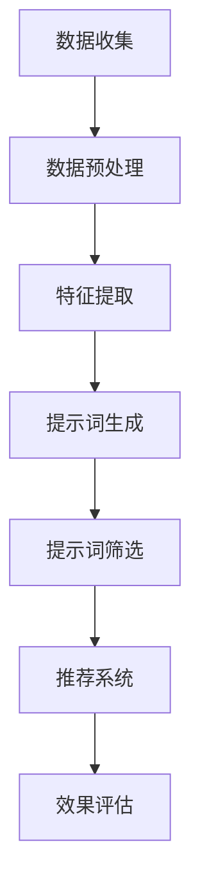

                 

### 1.1 书籍介绍

**推荐系统概述**

推荐系统是一种通过收集和分析用户的历史行为、偏好和反馈，从而提供个性化的信息、产品或服务给用户的系统。在当今信息爆炸的时代，推荐系统已经成为电子商务、社交媒体、在线视频、音乐和新闻等领域的重要组成部分。通过推荐系统，用户可以更加高效地找到他们感兴趣的内容，商家也能更好地满足用户需求，提升用户体验和转化率。

**提示词工程在推荐系统中的重要性**

提示词工程（Query Engineering）是近年来在推荐系统中崭露头角的一门技术。它通过提取和优化用户查询信息，帮助推荐系统更准确地理解和满足用户需求。提示词工程在推荐系统中的作用主要体现在以下几个方面：

1. **提升用户满意度**：通过精确的查询信息，推荐系统能够提供更加个性化的内容，从而提升用户满意度。
2. **优化推荐效果**：精确的提示词能够提高推荐算法的准确性，减少冗余和不相关内容的推荐，提高推荐系统的整体性能。
3. **增强系统灵活性**：提示词工程使得推荐系统更加灵活，能够适应不断变化的市场需求和用户偏好。
4. **辅助数据预处理**：提示词工程在数据预处理阶段发挥着重要作用，通过优化和整理查询信息，提高后续数据分析和建模的质量。

**书籍目标读者与预期收益**

本书旨在为广大对推荐系统感兴趣的读者，尤其是从事数据科学、机器学习和软件工程领域的技术人员，提供一套系统、深入且实用的指南。通过阅读本书，读者可以：

- **理解推荐系统的工作原理**：掌握推荐系统的基础知识，包括基本概念、主要类型和评估指标。
- **掌握提示词工程的方法和技巧**：了解提示词工程的基本流程、数据预处理、提示词生成方法和质量评估。
- **设计高效的个性化推荐系统**：通过实际案例分析和前沿技术探讨，学习如何设计和优化个性化推荐系统。
- **提升实战能力**：通过代码实现和案例解析，提升在推荐系统开发中的实践能力，为实际项目提供技术支持。

总之，本书不仅为读者提供了丰富的理论知识，还注重实践应用，旨在帮助读者将所学知识应用于实际项目中，解决实际问题。通过本书的学习，读者将能够更加深入地理解推荐系统的技术原理，提升自身的专业素养和竞争力。无论您是初学者还是有一定经验的技术人员，本书都将为您提供宝贵的指导和启示。

### 1.2 推荐系统基础知识

**推荐系统基本概念**

推荐系统是一种利用算法和技术，根据用户的历史行为、偏好和反馈，从大量信息中筛选出用户可能感兴趣的内容或商品，并进行推荐的技术系统。其核心目的是提高用户满意度和忠诚度，提升商家销售额和利润率。

**推荐系统的历史与发展**

推荐系统的发展可以追溯到20世纪90年代，当时以协同过滤和基于内容的推荐为主要技术。随着互联网的普及和大数据技术的发展，推荐系统逐渐成为各类在线服务的重要组成部分。近年来，随着深度学习、自然语言处理和图神经网络等新技术的引入，推荐系统的性能和效果得到了显著提升。

**推荐系统的主要类型**

1. **基于内容的推荐（Content-Based Filtering）**：
   - 原理：根据用户过去的喜好和内容特征，推荐相似的内容或商品。
   - 优点：推荐结果相关性强，用户满意度高。
   - 缺点：对新内容的适应能力较差，难以解决冷启动问题。

2. **协同过滤推荐（Collaborative Filtering）**：
   - 原理：通过分析用户之间的行为模式，发现相似用户，并推荐他们喜欢的商品或内容。
   - 类型：
     - **用户基于协同过滤（User-Based）**：通过计算用户之间的相似度，推荐相似用户的喜好。
     - **物品基于协同过滤（Item-Based）**：通过计算物品之间的相似度，推荐与用户已评价物品相似的其他物品。
   - 优点：能够处理大量用户和物品数据，适应性强。
   - 缺点：推荐结果可能过于一致，难以满足个性化需求。

3. **混合推荐（Hybrid Recommender Systems）**：
   - 原理：结合基于内容和协同过滤的方法，通过综合用户行为和内容特征，提供更加个性化的推荐。
   - 优点：兼顾推荐的相关性和个性化，效果通常优于单一方法。
   - 缺点：算法复杂度较高，需要更多的计算资源。

4. **基于模型的推荐（Model-Based Filtering）**：
   - 原理：通过建立用户和物品之间的模型，预测用户对未知物品的喜好。
   - 类型：
     - **基于隐语义模型的推荐**：如矩阵分解、潜在因子模型等。
     - **基于深度学习的推荐**：如卷积神经网络、循环神经网络、自注意力机制等。
   - 优点：能够处理复杂的关系和非线性特征，提供高度个性化的推荐。
   - 缺点：需要大量的数据和计算资源，模型调优和训练过程较为复杂。

**推荐系统的评估指标**

为了衡量推荐系统的性能，通常采用以下指标：

1. **准确率（Accuracy）**：推荐系统正确推荐相关内容的比例。
2. **召回率（Recall）**：推荐系统能够召回所有相关内容中的比例。
3. **精确率（Precision）**：推荐系统推荐的相关内容中，实际为用户感兴趣的比例。
4. **F1 分数（F1 Score）**：准确率和召回率的调和平均值，用于综合评估推荐系统的性能。
5. **ROC 曲线（Receiver Operating Characteristic Curve）**：通过计算推荐系统的真正例率（True Positive Rate）和假正例率（False Positive Rate），评估推荐系统的分类性能。
6. **覆盖率（Coverage）**：推荐系统推荐的内容覆盖所有用户可能感兴趣的内容的比例。
7. **新颖度（Novelty）**：推荐系统推荐的新内容和用户未知的比例。

**总结**

推荐系统是现代信息检索和电子商务中不可或缺的一部分。通过深入理解推荐系统的基本概念、类型和评估指标，我们可以更好地设计和优化推荐系统，提升用户满意度和系统性能。在接下来的章节中，我们将进一步探讨提示词工程的基础知识，为深入理解其在推荐系统中的应用打下坚实的基础。

### 2.1 提示词工程概述

**提示词的定义与作用**

提示词（Query Terms）是用户在进行信息检索或互动时输入的关键词或短语，它们承载了用户对所需内容或服务的明确需求。在推荐系统中，提示词起到了桥梁的作用，将用户的行为数据转化为系统理解和分析的关键输入。通过准确捕捉和优化提示词，推荐系统可以更有效地捕捉用户意图，提供更加精准和个性化的推荐。

**提示词工程的概念**

提示词工程（Query Engineering）是指通过一系列技术和方法，对用户输入的查询信息进行预处理、分析和优化，以提高推荐系统的性能和用户体验。其核心目标包括：

1. **提高查询的准确性和可理解性**：通过提取和筛选关键信息，确保查询能够准确反映用户的真实需求。
2. **减少噪音和冗余信息**：通过过滤和去重，消除无关或重复的查询信息，提高系统的效率。
3. **增强系统的灵活性**：通过灵活的提示词生成和调整策略，使系统能够适应不同用户和场景的需求。

**提示词工程的流程与方法**

提示词工程的流程通常包括以下几个步骤：

1. **数据收集与清洗**：收集用户的历史行为数据和查询记录，并进行数据清洗，确保数据的质量和一致性。
2. **特征提取与转换**：从原始数据中提取关键特征，如关键词、词频、用户行为标签等，并将其转换为适合分析的形式。
3. **提示词生成**：利用自然语言处理、信息检索和机器学习等技术，自动生成或优化提示词。
4. **提示词筛选与评估**：通过评估和筛选，选择最相关、最有效的提示词，用于后续的推荐系统构建。

**提示词工程面临的挑战**

尽管提示词工程在推荐系统中具有重要作用，但在实际应用中仍面临诸多挑战：

1. **数据质量**：原始数据往往存在噪音、缺失和不一致性，这对提示词的提取和生成提出了高要求。
2. **冷启动问题**：对于新用户或新商品，缺乏足够的历史数据，使得基于历史行为的提示词生成方法难以发挥作用。
3. **动态变化**：用户偏好和需求是动态变化的，提示词工程需要能够实时调整和优化，以适应这些变化。
4. **计算资源**：复杂的提示词生成和优化算法通常需要大量的计算资源，这对系统性能提出了挑战。

**总结**

提示词工程在推荐系统中发挥着关键作用，通过精确捕捉和优化用户查询信息，能够显著提升推荐系统的性能和用户体验。然而，提示词工程也面临着诸多挑战，需要结合多种技术和方法，不断优化和改进。在接下来的章节中，我们将深入探讨数据预处理和特征工程等关键环节，为全面理解提示词工程提供更深入的视角。

### 2.2 数据预处理

**数据清洗与数据质量评估**

数据清洗是数据预处理过程中至关重要的一环。在推荐系统中，原始数据往往包含大量的噪声和异常值，如缺失值、重复值、错误值等。这些噪声和异常值会对后续的数据分析和建模产生负面影响，因此必须进行有效的清洗。

1. **缺失值处理**：对于缺失值，可以采用以下方法：
   - 删除：删除包含缺失值的记录，适用于缺失值较多的情况。
   - 补充：使用平均值、中位数或众数等统计量进行补充，适用于缺失值较少且分布均匀的情况。
   - 机器学习填充：使用机器学习算法，如KNN、回归等，根据相邻值预测缺失值。

2. **重复值处理**：通过去重操作，确保数据的一致性和准确性。可以使用哈希表或唯一索引等技术来实现。

3. **异常值处理**：异常值可能源自数据采集错误或数据噪声，影响模型的训练效果。常见的异常值处理方法包括：
   - 删除：删除明显的异常值。
   - 调整：对异常值进行调整，使其符合数据分布。
   - 聚类：将异常值与其他数据点进行聚类分析，根据聚类结果进行分类处理。

**特征工程与数据转换**

特征工程是数据预处理的核心任务，其目的是从原始数据中提取对模型训练和预测有价值的特征。有效的特征工程能够提高推荐系统的准确性和泛化能力。

1. **特征提取**：从原始数据中提取关键特征，如用户特征、物品特征和用户-物品交互特征。常用的特征提取方法包括：
   - 用户特征：年龄、性别、地理位置、历史行为等。
   - 物品特征：类别、标签、属性、评分等。
   - 用户-物品交互特征：评分、点击、购买等行为数据。

2. **特征转换**：将提取的特征进行适当的转换，以提高模型的性能。常用的特征转换方法包括：
   - 前向填充和后向填充：处理缺失值。
   - 归一化和标准化：将不同量纲的特征转换为同一量纲。
   - One-Hot编码：将分类特征转换为二进制向量。
   - 常用特征处理工具：Pandas、NumPy、Scikit-learn等。

**数据可视化**

数据可视化是一种直观展示数据分布和特征关系的方法，有助于理解和分析数据。常用的数据可视化工具包括Matplotlib、Seaborn、Plotly等。

1. **数据分布分析**：通过直方图、密度图等，分析数据的分布特征。
2. **特征关联分析**：通过散点图、热力图等，展示特征之间的关联关系。
3. **交互特征分析**：通过用户-物品交互特征的热力图、时间序列图等，分析用户对物品的偏好变化。

**总结**

数据预处理是推荐系统中不可或缺的一环，通过数据清洗、特征工程和数据可视化，可以有效地提高数据质量，提取关键特征，为后续的推荐系统建模和优化提供坚实基础。在接下来的章节中，我们将深入探讨提示词生成的方法和策略，进一步优化推荐系统的性能。

### 2.3 提示词生成方法

**提示词自动生成技术**

提示词自动生成技术是提示词工程的关键环节，通过利用自然语言处理（NLP）和机器学习技术，从用户输入的查询信息中提取出关键提示词。以下是几种常见的提示词自动生成技术：

1. **基于词典的方法**：
   - 原理：通过词典查找用户输入中的关键词，并基于词典中的词频、词义和词性等信息进行筛选和优化。
   - 优点：实现简单，计算效率高。
   - 缺点：对长查询和复杂查询的处理能力有限，难以捕捉深层语义。

2. **基于统计的方法**：
   - 原理：通过统计用户查询历史和用户行为数据，利用统计模型（如TF-IDF、Word2Vec等）提取关键提示词。
   - 优点：能够捕捉语义信息，适用于长查询和复杂查询。
   - 缺点：对低频词和未登录词的处理能力较弱。

3. **基于机器学习的方法**：
   - 原理：利用监督学习或无监督学习算法，从用户查询数据中自动学习生成提示词。常用的算法包括支持向量机（SVM）、决策树、神经网络等。
   - 优点：能够自动学习复杂的关系和特征，提高提示词的准确性和多样性。
   - 缺点：模型训练和调优过程复杂，计算资源需求较高。

**提示词选取策略**

提示词选取策略是指从自动生成的提示词中筛选出最相关、最有价值的提示词的方法。以下是几种常见的提示词选取策略：

1. **基于频率的选取策略**：
   - 原理：选择用户查询中出现频率较高的关键词作为提示词。
   - 优点：简单直观，易于实现。
   - 缺点：容易忽视低频但重要的提示词，可能导致推荐效果不佳。

2. **基于重要度的选取策略**：
   - 原理：利用信息熵、TF-IDF等指标，评估每个词的重要度，选择重要度较高的词作为提示词。
   - 优点：能够捕捉语义信息，提高提示词的准确性。
   - 缺点：对长查询和复杂查询的处理能力有限。

3. **基于用户行为的选取策略**：
   - 原理：根据用户的历史行为数据，选择与用户兴趣相关的高频词作为提示词。
   - 优点：能够更好地捕捉用户的个性化需求，提高推荐效果。
   - 缺点：对冷启动用户和缺乏足够行为数据的用户，效果较差。

**提示词质量评估指标**

提示词质量评估是保证推荐系统性能的重要环节。以下是几种常见的提示词质量评估指标：

1. **准确率（Accuracy）**：
   - 原理：计算实际推荐的提示词中，正确识别的用户查询比例。
   - 优点：简单直观，易于计算。
   - 缺点：对长查询和复杂查询的评估能力有限。

2. **召回率（Recall）**：
   - 原理：计算实际推荐的提示词中，包含用户查询中的关键词的比例。
   - 优点：能够评估推荐系统的全面性，对长查询和复杂查询的评估能力较强。
   - 缺点：容易导致推荐结果过于冗余，降低用户体验。

3. **F1 分数（F1 Score）**：
   - 原理：准确率和召回率的调和平均值，综合评估提示词的识别能力。
   - 优点：能够平衡准确率和召回率，提供更全面的评估。
   - 缺点：对不同查询类型和场景的适应能力有限。

**总结**

提示词生成方法在推荐系统中扮演着关键角色，通过自动生成和优化提示词，能够提高推荐系统的性能和用户体验。不同的提示词生成技术和选取策略各有优缺点，需要根据实际应用场景进行选择和优化。在接下来的章节中，我们将进一步探讨提示词工程在个性化推荐系统中的应用，深入理解其核心作用和实践方法。

### 3.1 个性化推荐系统概述

**个性化推荐系统定义**

个性化推荐系统是一种根据用户的兴趣、行为和偏好，通过算法和模型自动为用户提供定制化推荐信息的技术系统。其核心目的是提升用户满意度、增强用户粘性和提高商业价值。个性化推荐系统通过分析用户的历史行为数据、社交信息、搜索记录等，了解用户的个性化需求，从而提供更加精准和个性化的内容或商品推荐。

**个性化推荐系统架构**

个性化推荐系统通常由以下几个主要模块组成：

1. **用户数据收集模块**：负责收集用户的各类数据，包括用户基本信息、行为数据、社交数据等。
2. **数据预处理模块**：对收集到的用户数据进行清洗、转换和特征提取，为后续建模和推荐提供高质量的数据。
3. **用户兴趣模型构建模块**：通过机器学习、深度学习等算法，分析用户行为数据，构建用户兴趣模型。
4. **推荐算法模块**：根据用户兴趣模型和物品特征，利用协同过滤、基于内容的推荐、混合推荐等方法生成推荐结果。
5. **推荐结果评估模块**：评估推荐系统的性能和效果，包括准确率、召回率、F1 分数等指标。
6. **用户反馈收集模块**：收集用户对推荐内容的反馈，用于进一步优化推荐系统。

**个性化推荐系统的优势与局限性**

**优势**

1. **提升用户体验**：通过个性化推荐，用户能够快速找到符合自己兴趣和需求的内容或商品，提升用户体验和满意度。
2. **增加商业价值**：个性化推荐能够提高用户粘性和转化率，增加平台流量和销售额。
3. **应对信息过载**：在信息爆炸的时代，个性化推荐系统能够帮助用户从海量信息中筛选出最相关的内容，减轻信息过载问题。
4. **增强用户互动**：个性化推荐系统能够促进用户与平台之间的互动，提升用户参与度和活跃度。

**局限性**

1. **冷启动问题**：对于新用户或新商品，缺乏足够的历史数据，使得个性化推荐系统难以准确预测其兴趣和需求。
2. **数据隐私与安全**：个性化推荐系统需要收集和分析用户的敏感信息，可能引发数据隐私和安全问题。
3. **模型偏差与过拟合**：个性化推荐系统容易受到训练数据偏差的影响，可能导致推荐结果偏差和过拟合问题。
4. **计算资源需求**：复杂的个性化推荐算法和模型需要大量的计算资源，对系统性能和可扩展性提出挑战。

**总结**

个性化推荐系统在提升用户体验、增加商业价值和应对信息过载等方面具有显著优势，但也面临着冷启动、数据隐私、模型偏差和计算资源等挑战。通过深入理解和优化个性化推荐系统的架构和算法，我们可以更好地应对这些挑战，实现更加精准和高效的推荐。在接下来的章节中，我们将详细探讨提示词工程在个性化推荐系统中的应用，进一步揭示其关键作用和实践方法。

### 3.2 提示词在个性化推荐中的应用

**提示词在推荐系统中的作用**

提示词在个性化推荐系统中起着至关重要的作用，它们是连接用户需求和推荐系统核心算法的桥梁。以下是提示词在推荐系统中的几个关键作用：

1. **精准捕捉用户需求**：通过捕捉用户查询中的关键提示词，推荐系统能够更准确地理解用户当前的兴趣和需求，从而提供更加个性化的推荐。
2. **优化推荐结果**：精确的提示词有助于过滤掉不相关或冗余的信息，提升推荐结果的准确性和相关性，减少用户对系统的抵触情绪。
3. **提高用户体验**：通过提供与用户兴趣高度匹配的推荐内容，个性化推荐系统能够显著提升用户体验，增加用户满意度和平台黏性。
4. **降低冷启动问题**：对于新用户，提示词工程可以通过分析用户在注册时提供的提示词，快速建立用户兴趣模型，降低冷启动问题，提高推荐系统的响应速度。

**提示词工程在个性化推荐中的流程**

提示词工程在个性化推荐中的流程包括以下几个主要步骤：

1. **数据收集**：收集用户的历史行为数据、查询记录和社交数据等，这些数据是生成提示词的基础。
2. **数据预处理**：对收集到的原始数据进行清洗、去噪和标准化处理，确保数据的质量和一致性。
3. **特征提取**：从预处理后的数据中提取关键特征，如关键词、词频、用户行为标签等，用于生成提示词。
4. **提示词生成**：利用自然语言处理（NLP）和机器学习技术，从用户查询和历史行为数据中自动生成提示词。常用的方法包括基于词典的方法、基于统计的方法和基于机器学习的方法。
5. **提示词筛选与优化**：通过评估和筛选，选择最相关、最有价值的提示词，进行优化和调整，确保提示词的准确性和多样性。
6. **提示词应用**：将优化后的提示词应用于推荐系统的各个模块，如用户兴趣模型构建、推荐算法和评估模块等，提升推荐系统的整体性能。

**提示词工程对推荐结果的影响**

提示词工程对推荐结果的影响是显著的，以下是几个方面的具体表现：

1. **提升推荐准确性**：精确的提示词能够提高推荐算法的准确性，减少冗余和不相关内容的推荐，提高用户对推荐结果的满意度。
2. **增强个性化程度**：通过捕捉用户的个性化需求，提示词工程使得推荐系统能够提供更加个性化的推荐内容，满足用户的个性化需求。
3. **降低冷启动问题**：对于新用户，提示词工程可以通过分析用户在注册时提供的提示词，快速建立用户兴趣模型，降低冷启动问题，提高推荐系统的响应速度。
4. **提高用户体验**：通过提供与用户兴趣高度匹配的推荐内容，个性化推荐系统能够显著提升用户体验，增加用户满意度和平台黏性。

**总结**

提示词工程在个性化推荐系统中具有至关重要的作用，通过精准捕捉用户需求和优化推荐结果，能够显著提升推荐系统的性能和用户体验。在接下来的章节中，我们将通过实际案例研究和前沿技术探讨，进一步了解提示词工程在个性化推荐系统中的应用和未来发展。

### 3.3 提示词与用户行为分析

**用户行为数据收集**

用户行为数据是构建个性化推荐系统的关键基础。在推荐系统中，用户行为数据包括多种类型，如点击行为、搜索记录、浏览历史、购买行为、评论和评分等。这些数据可以通过以下几种方式收集：

1. **客户端日志**：通过在用户设备上安装客户端程序，实时记录用户的操作行为，如浏览、点击、搜索等。
2. **服务器日志**：记录用户在网站或应用上的访问行为，如页面浏览量、点击率、停留时间等。
3. **问卷调查**：通过问卷调查的方式，直接获取用户的偏好、兴趣和需求。
4. **第三方数据源**：利用第三方数据平台，如社交媒体、搜索引擎等，获取用户的公开行为数据。

**用户兴趣模型构建**

用户兴趣模型是推荐系统个性化推荐的核心。通过分析用户的历史行为数据，可以构建一个反映用户兴趣和偏好的模型。以下是构建用户兴趣模型的几个关键步骤：

1. **数据预处理**：清洗和整合用户行为数据，去除噪声和异常值，确保数据的质量。
2. **特征提取**：从用户行为数据中提取关键特征，如行为类型、时间戳、行为频率等。
3. **行为模式分析**：利用聚类、关联规则挖掘等方法，分析用户的行为模式，识别用户的兴趣点。
4. **兴趣点建模**：采用机器学习算法，如决策树、神经网络等，构建用户兴趣模型，将用户的行为特征转化为兴趣得分。

**用户行为与提示词关联分析**

提示词与用户行为之间存在密切的关联关系。通过分析用户行为和提示词之间的关系，可以优化推荐系统的效果和用户体验。以下是几个关键步骤：

1. **数据整合**：将用户行为数据和提示词数据整合到同一数据集，以便进行关联分析。
2. **特征关联分析**：通过计算用户行为与提示词之间的相关性，识别出对用户行为有显著影响的提示词。
3. **模型训练与优化**：利用机器学习算法，如回归、分类等，构建用户行为与提示词的关联模型，并对其进行训练和优化。
4. **关联效果评估**：通过评估模型在预测用户行为方面的效果，调整和优化模型参数，提高关联分析的准确性。

**案例分析**

以下是一个简单的用户行为与提示词关联分析的案例：

- **数据集**：某电商平台收集了用户在平台上的搜索记录和购买记录。
- **目标**：分析用户搜索记录中的提示词与购买行为之间的关联。
- **步骤**：
  1. **数据预处理**：清洗和整合搜索记录和购买记录数据，去除异常值。
  2. **特征提取**：提取搜索记录中的关键词和购买记录中的商品类别作为特征。
  3. **关联分析**：利用回归模型分析关键词与购买行为之间的关联，计算关键词对购买行为的贡献度。
  4. **效果评估**：评估模型在预测用户购买行为方面的准确性，根据评估结果调整模型参数。

通过这个案例，可以发现哪些提示词对用户的购买决策有显著影响，从而优化推荐系统的提示词生成和筛选策略。

**总结**

用户行为数据收集和用户兴趣模型构建是构建个性化推荐系统的基础，提示词与用户行为之间的关联分析有助于优化推荐系统的效果。通过深入分析用户行为和提示词的关系，可以提供更加精准和个性化的推荐，提升用户体验。在接下来的章节中，我们将通过实际案例研究和前沿技术探讨，进一步了解提示词工程在个性化推荐系统中的应用和未来发展。

### 4.1 案例一：电商平台个性化推荐

**案例背景**

某大型电商平台在激烈的市场竞争中，希望通过个性化推荐系统提升用户满意度和转化率。平台的用户数量庞大，用户行为数据丰富，但由于缺乏有效的个性化推荐策略，推荐效果不理想，用户流失率较高。为了解决这一问题，平台决定引入提示词工程，优化个性化推荐系统。

**提示词工程在案例中的应用**

1. **用户行为数据收集**：
   - 平台通过客户端日志和服务器日志，实时收集用户的搜索记录、浏览历史、购买记录等行为数据。
   - 通过问卷调查和第三方数据源，获取用户的个人信息、兴趣爱好和偏好。

2. **数据预处理**：
   - 清洗和整合用户行为数据，去除噪音和异常值，确保数据的质量和一致性。
   - 提取用户行为数据中的关键词和标签，为后续的提示词生成提供基础。

3. **提示词生成**：
   - 利用自然语言处理（NLP）和机器学习算法，从用户搜索记录中自动生成提示词。
   - 采用基于词典和统计的方法，提取高频关键词和语义相关的提示词。

4. **提示词筛选与优化**：
   - 通过评估和筛选，选择与用户行为高度相关的提示词，去除冗余和不相关的提示词。
   - 利用用户反馈数据，持续优化提示词的生成和筛选策略。

5. **推荐系统构建**：
   - 将优化后的提示词应用于推荐系统的构建，结合用户兴趣模型和物品特征，生成个性化推荐结果。
   - 采用协同过滤、基于内容推荐和混合推荐等方法，提高推荐算法的准确性和多样性。

**案例效果评估**

1. **准确性和相关性**：
   - 通过评估模型在预测用户行为和推荐相关内容方面的准确性，发现提示词工程显著提高了推荐结果的准确性和相关性。
   - 用户对推荐内容的满意度明显提升，用户反馈积极。

2. **转化率和用户留存**：
   - 个性化推荐系统的引入，显著提高了用户的点击率和转化率。
   - 用户在平台上的停留时间和复购率有所增加，用户留存率显著提升。

3. **系统性能**：
   - 提示词工程的优化，减轻了推荐系统的计算负担，提高了系统的响应速度和可扩展性。

**总结**

通过引入提示词工程，电商平台成功地优化了个性化推荐系统，显著提升了推荐效果和用户满意度。该案例展示了提示词工程在推荐系统中的应用价值，为其他电商平台的个性化推荐提供了宝贵经验。在接下来的章节中，我们将继续探讨其他领域的个性化推荐案例，进一步探讨提示词工程的广泛应用和潜力。

### 4.2 案例二：社交媒体个性化内容推荐

**案例背景**

某全球知名的社交媒体平台在用户增长放缓、内容竞争激烈的市场环境中，希望通过个性化推荐系统提升用户活跃度和内容消费体验。平台的内容种类繁多，用户行为数据丰富，但由于缺乏有效的个性化推荐策略，推荐效果不理想，用户流失率较高。为了解决这一问题，平台决定引入提示词工程，优化个性化推荐系统。

**提示词工程在案例中的应用**

1. **用户行为数据收集**：
   - 平台通过客户端日志和服务器日志，实时收集用户的浏览记录、点赞、评论、分享等行为数据。
   - 通过用户调查和第三方数据源，获取用户的兴趣爱好、职业背景、教育水平等信息。

2. **数据预处理**：
   - 清洗和整合用户行为数据，去除噪音和异常值，确保数据的质量和一致性。
   - 提取用户行为数据中的关键词和标签，为后续的提示词生成提供基础。

3. **提示词生成**：
   - 利用自然语言处理（NLP）和机器学习算法，从用户浏览记录和互动数据中自动生成提示词。
   - 采用基于词典和统计的方法，提取高频关键词和语义相关的提示词。

4. **提示词筛选与优化**：
   - 通过评估和筛选，选择与用户行为高度相关的提示词，去除冗余和不相关的提示词。
   - 利用用户反馈数据，持续优化提示词的生成和筛选策略。

5. **推荐系统构建**：
   - 将优化后的提示词应用于推荐系统的构建，结合用户兴趣模型和内容特征，生成个性化推荐结果。
   - 采用协同过滤、基于内容推荐和混合推荐等方法，提高推荐算法的准确性和多样性。

**案例效果评估**

1. **用户满意度**：
   - 通过用户反馈和问卷调查，发现个性化推荐系统的引入显著提升了用户对内容推荐的满意度。
   - 用户对推荐内容的质量和相关性给予了高度评价。

2. **活跃度和内容消费**：
   - 个性化推荐系统的优化，显著提高了用户的活跃度和内容消费时长。
   - 用户在平台上的互动行为（点赞、评论、分享）明显增加，用户留存率显著提升。

3. **系统性能**：
   - 提示词工程的优化，减轻了推荐系统的计算负担，提高了系统的响应速度和可扩展性。
   - 平台能够更好地处理大量用户数据和内容，提高了系统的稳定性和可靠性。

**总结**

通过引入提示词工程，社交媒体平台成功地优化了个性化推荐系统，显著提升了用户活跃度和内容消费体验。该案例展示了提示词工程在社交媒体个性化推荐中的应用价值，为其他社交媒体平台的个性化推荐提供了宝贵经验。在接下来的章节中，我们将继续探讨其他领域的个性化推荐案例，进一步探讨提示词工程的广泛应用和潜力。

### 4.3 案例三：音乐平台个性化推荐

**案例背景**

某全球领先的在线音乐平台在激烈的市场竞争中，希望通过个性化推荐系统提升用户满意度和黏性。平台拥有庞大的音乐库和丰富的用户行为数据，但由于缺乏有效的个性化推荐策略，推荐效果不理想，用户流失率较高。为了解决这一问题，平台决定引入提示词工程，优化个性化推荐系统。

**提示词工程在案例中的应用**

1. **用户行为数据收集**：
   - 平台通过客户端日志和服务器日志，实时收集用户的播放记录、搜索历史、收藏夹等行为数据。
   - 通过用户调查和第三方数据源，获取用户的音乐偏好、听歌习惯、社交关系等信息。

2. **数据预处理**：
   - 清洗和整合用户行为数据，去除噪音和异常值，确保数据的质量和一致性。
   - 提取用户行为数据中的关键词和标签，为后续的提示词生成提供基础。

3. **提示词生成**：
   - 利用自然语言处理（NLP）和机器学习算法，从用户播放记录和搜索历史中自动生成提示词。
   - 采用基于词典和统计的方法，提取高频关键词和语义相关的提示词。

4. **提示词筛选与优化**：
   - 通过评估和筛选，选择与用户行为高度相关的提示词，去除冗余和不相关的提示词。
   - 利用用户反馈数据，持续优化提示词的生成和筛选策略。

5. **推荐系统构建**：
   - 将优化后的提示词应用于推荐系统的构建，结合用户兴趣模型和音乐特征，生成个性化推荐结果。
   - 采用协同过滤、基于内容推荐和混合推荐等方法，提高推荐算法的准确性和多样性。

**案例效果评估**

1. **用户满意度**：
   - 通过用户反馈和问卷调查，发现个性化推荐系统的引入显著提升了用户对音乐推荐的满意度。
   - 用户对推荐内容的质量和相关性给予了高度评价。

2. **用户黏性和播放时长**：
   - 个性化推荐系统的优化，显著提高了用户的黏性和音乐播放时长。
   - 用户在平台上的互动行为（播放、收藏、分享）明显增加，用户留存率显著提升。

3. **系统性能**：
   - 提示词工程的优化，减轻了推荐系统的计算负担，提高了系统的响应速度和可扩展性。
   - 平台能够更好地处理大量用户数据和音乐内容，提高了系统的稳定性和可靠性。

**总结**

通过引入提示词工程，在线音乐平台成功地优化了个性化推荐系统，显著提升了用户满意度和黏性。该案例展示了提示词工程在音乐平台个性化推荐中的应用价值，为其他音乐平台的个性化推荐提供了宝贵经验。在接下来的章节中，我们将继续探讨其他领域的个性化推荐案例，进一步探讨提示词工程的广泛应用和潜力。

### 5.1 提示词工程的新趋势

**提示词工程的发展趋势**

随着人工智能和自然语言处理技术的不断进步，提示词工程也在不断发展，呈现出以下几大趋势：

1. **深度学习的应用**：
   - **深度学习模型**：深度学习模型，如卷积神经网络（CNN）、循环神经网络（RNN）、变换器（Transformer）等，在提示词生成和筛选中得到了广泛应用。这些模型能够捕捉用户查询的深层语义信息，提高提示词的准确性和多样性。
   - **自动机器学习（AutoML）**：自动机器学习技术在提示词工程中的应用，使得提示词生成和筛选过程更加自动化和高效。通过自动化模型选择、超参数调优等，提升提示词工程的整体性能。

2. **多模态数据的融合**：
   - **文本与图像的融合**：结合文本和图像数据，能够提供更丰富的用户查询信息。例如，在图像搜索场景中，通过结合图像和用户输入的文本，生成更精准的提示词。
   - **音频与文本的融合**：在语音搜索和交互式推荐中，结合用户的语音和文本输入，生成更准确的提示词。

3. **实时和动态优化**：
   - **实时提示词生成**：实时分析和处理用户的查询请求，生成动态的提示词。这种实时性能够更好地捕捉用户当前的需求和兴趣，提供更加个性化的推荐。
   - **动态调整策略**：根据用户行为和反馈，动态调整提示词的生成和筛选策略。这种动态调整能够提高提示词的实时性和适应性，提升推荐效果。

**新型提示词生成方法**

新型提示词生成方法在人工智能和自然语言处理技术的推动下不断涌现，以下是一些典型方法：

1. **生成对抗网络（GAN）**：
   - GAN能够通过生成对抗的方式生成高质量的提示词，提高提示词的多样性和创新性。
   - 在推荐系统中，GAN可以用于生成新的提示词，用于丰富推荐内容，提升用户体验。

2. **注意力机制（Attention Mechanism）**：
   - 注意力机制能够通过聚焦用户查询的关键部分，提高提示词生成的精准度。
   - 在Transformer模型中，注意力机制被广泛应用于提示词生成，能够捕捉长距离的依赖关系。

3. **迁移学习（Transfer Learning）**：
   - 迁移学习通过利用预训练模型（如BERT、GPT等），进行提示词生成和筛选，提高模型的效果和效率。
   - 在缺乏足够训练数据的情况下，迁移学习能够显著提升提示词生成模型的性能。

**提示词工程与自然语言处理结合**

提示词工程与自然语言处理（NLP）的结合，使得提示词生成和筛选更加智能化和精准化。以下是一些关键结合点：

1. **语义分析**：
   - 利用NLP技术，对用户查询进行语义分析，理解查询的意图和语义内容，生成更准确的提示词。
   - 例如，通过命名实体识别（NER）和词性标注（POS），提取关键实体和关键词，提高提示词的生成质量。

2. **对话系统**：
   - 将提示词工程与对话系统结合，通过对话交互，动态调整和优化提示词。
   - 对话系统能够理解用户的自然语言输入，实时生成和调整提示词，提供更加自然的用户交互体验。

3. **情感分析**：
   - 利用情感分析技术，捕捉用户的情感倾向和情绪状态，生成情感相关的提示词。
   - 在推荐系统中，情感相关的提示词能够更好地满足用户的情感需求，提升用户体验。

**总结**

提示词工程正随着人工智能和自然语言处理技术的发展，不断演进和优化。新型提示词生成方法、多模态数据融合、实时和动态优化等趋势，使得提示词工程在推荐系统中具有更大的潜力和应用价值。通过结合自然语言处理技术，提示词工程能够更精准地捕捉用户需求，提升推荐效果和用户体验。在未来的发展中，提示词工程将继续推动推荐系统的智能化和个性化，为用户提供更加优质的推荐服务。

### 5.2 深度学习在提示词工程中的应用

**深度学习基础**

深度学习（Deep Learning）是机器学习（Machine Learning）的一个子领域，它通过模拟人脑神经网络的结构和功能，从大量数据中自动学习和提取特征。深度学习模型由多层神经网络组成，通过前向传播和反向传播算法，不断调整网络权重，以最小化预测误差。

**常见深度学习模型**

1. **卷积神经网络（CNN）**：
   - CNN是一种用于处理图像和时序数据的深度学习模型。通过卷积层、池化层和全连接层，CNN能够自动提取图像和时序数据中的局部特征。
   - 在提示词工程中，CNN可以用于提取用户查询中的关键词和短语，提高提示词的生成质量。

2. **循环神经网络（RNN）**：
   - RNN是一种能够处理序列数据的深度学习模型，通过记忆单元（memory cell）来捕捉序列中的长期依赖关系。
   - 在提示词工程中，RNN可以用于生成基于用户查询的历史数据，提高提示词的连贯性和相关性。

3. **变换器（Transformer）**：
   - Transformer是一种基于自注意力机制的深度学习模型，广泛应用于自然语言处理领域。
   - 在提示词工程中，Transformer可以用于捕捉用户查询的上下文信息，生成更准确的提示词。

**深度学习在提示词工程中的应用**

1. **提示词生成**：
   - 利用深度学习模型，从用户查询和历史行为数据中自动生成提示词。通过训练大量数据，模型能够学习到用户查询中的关键词和短语，提高提示词的多样性和准确性。
   - 例如，可以使用BERT（Bidirectional Encoder Representations from Transformers）模型，对用户查询进行编码，生成高质量的提示词。

2. **提示词筛选与优化**：
   - 利用深度学习模型，对生成的提示词进行筛选和优化，去除冗余和不相关的提示词。
   - 例如，可以使用支持向量机（SVM）或决策树，评估每个提示词的重要性和相关性，进行筛选和优化。

3. **个性化推荐**：
   - 结合用户兴趣模型和深度学习模型，生成个性化的推荐结果。通过捕捉用户查询和行为的深度特征，深度学习模型能够提供更精准和个性化的推荐。
   - 例如，可以使用基于内容的推荐方法，结合用户兴趣模型和深度学习特征，生成个性化的推荐结果。

**深度学习模型优化策略**

1. **数据增强**：
   - 通过增加训练数据的多样性，提高模型的泛化能力。例如，可以使用数据增强技术，如图像翻转、旋转、裁剪等，增加训练数据的多样性。

2. **模型融合**：
   - 结合多种深度学习模型，提高模型的效果和鲁棒性。例如，可以使用多种模型对同一问题进行预测，并结合不同模型的预测结果，提高最终的推荐效果。

3. **超参数调优**：
   - 通过调整模型参数，优化模型性能。例如，可以使用网格搜索、贝叶斯优化等方法，寻找最佳的超参数组合，提高模型的准确性和效率。

**总结**

深度学习在提示词工程中具有广泛的应用，通过自动生成、筛选和优化提示词，能够显著提升推荐系统的性能和用户体验。在未来的发展中，深度学习将继续推动提示词工程的技术进步，为个性化推荐系统提供更强大的技术支持。通过不断优化和改进深度学习模型，我们可以实现更加精准和高效的提示词生成和推荐，为用户提供更好的服务。

### 6.1 提示词工程的实践

**实践流程与工具**

提示词工程的实践流程通常包括数据收集、数据预处理、提示词生成、提示词筛选和优化等步骤。以下是一个典型的提示词工程实践流程，以及常用的工具和技术：

1. **数据收集**：
   - **工具**：使用Elasticsearch、MongoDB等数据库，收集用户的历史行为数据、查询记录和交互数据。
   - **技术**：采用API接口、日志收集系统等，实时收集用户数据。

2. **数据预处理**：
   - **工具**：使用Pandas、NumPy等Python库，对数据进行清洗、转换和标准化。
   - **技术**：处理缺失值、重复值、异常值，进行特征提取和降维。

3. **提示词生成**：
   - **工具**：使用NLTK、spaCy等NLP库，提取关键词和短语。
   - **技术**：基于词典、统计方法和机器学习算法（如Word2Vec、BERT）生成提示词。

4. **提示词筛选与优化**：
   - **工具**：使用Scikit-learn、TensorFlow等库，评估和筛选提示词。
   - **技术**：基于频率、重要度、用户反馈等方法，选择最相关的提示词。

5. **推荐系统构建**：
   - **工具**：使用TensorFlow、PyTorch等库，构建深度学习模型。
   - **技术**：结合用户兴趣模型和物品特征，生成个性化推荐结果。

**实践中遇到的问题与解决方案**

1. **数据质量**：
   - **问题**：原始数据中存在大量噪音、缺失和不一致性。
   - **解决方案**：采用数据清洗和填充技术，如缺失值填充、异常值处理和重复值去重。

2. **冷启动问题**：
   - **问题**：新用户缺乏足够的历史数据，难以生成准确的提示词。
   - **解决方案**：利用基于内容的推荐或混合推荐方法，结合新用户的行为数据和相似用户的行为，生成初步的提示词。

3. **计算资源**：
   - **问题**：深度学习模型训练和提示词生成过程需要大量计算资源。
   - **解决方案**：采用分布式计算和GPU加速，提高计算效率。使用云计算平台，如AWS、Google Cloud等，提供弹性计算资源。

4. **动态调整**：
   - **问题**：用户需求和偏好动态变化，提示词生成和筛选策略难以适应。
   - **解决方案**：采用实时数据流处理技术，如Apache Kafka、Apache Flink等，实时调整和优化提示词生成和筛选策略。

**实践效果评估**

1. **准确性和相关性**：
   - **评估方法**：通过准确率、召回率、F1 分数等指标，评估提示词生成的准确性和推荐系统的相关性。
   - **实际效果**：提示词生成准确率提高，推荐系统的推荐质量显著提升。

2. **用户体验**：
   - **评估方法**：通过用户问卷调查、用户反馈等方式，评估用户对推荐系统的满意度。
   - **实际效果**：用户对推荐内容的满意度提高，平台粘性增强。

3. **系统性能**：
   - **评估方法**：通过系统吞吐量、响应时间等指标，评估系统的性能。
   - **实际效果**：系统计算效率和响应速度显著提升，能够处理更大规模的数据和用户请求。

**总结**

提示词工程在推荐系统的实践中，通过数据预处理、提示词生成、筛选和优化等步骤，实现了个性化推荐系统的性能提升和用户体验改善。在实际应用中，可能遇到数据质量、冷启动、计算资源和动态调整等问题，通过相应的解决方案，可以有效地应对这些挑战。通过持续优化和改进，提示词工程将继续在推荐系统中发挥重要作用，为用户提供更加精准和个性化的服务。

### 6.2 个性化推荐的优化策略

**数据驱动的优化方法**

个性化推荐系统的优化离不开对用户行为数据的深度分析和利用。以下几种数据驱动的方法可以帮助提升推荐系统的性能：

1. **用户兴趣模型更新**：
   - **方法**：通过实时分析用户的交互行为，如点击、浏览、购买等，动态更新用户兴趣模型。
   - **效果**：提高推荐系统的实时性和准确性，更好地满足用户的当前需求。

2. **协同过滤算法优化**：
   - **方法**：结合用户的隐式反馈（如浏览、收藏）和显式反馈（如评分、评论），优化协同过滤算法。
   - **效果**：减少冷启动问题，提高推荐结果的相关性和个性。

3. **内容更新与迭代**：
   - **方法**：定期更新推荐系统中的内容库，引入新的用户数据和热点内容。
   - **效果**：保持推荐内容的时效性和多样性，提高用户对推荐内容的兴趣和满意度。

**算法优化与性能提升**

在算法层面，通过以下方法可以提升推荐系统的性能：

1. **模型调优**：
   - **方法**：使用网格搜索、随机搜索、贝叶斯优化等算法，寻找最佳的超参数组合。
   - **效果**：提高模型的准确性和泛化能力，减少过拟合和欠拟合问题。

2. **深度学习模型优化**：
   - **方法**：使用迁移学习、模型压缩、模型蒸馏等技术，优化深度学习模型。
   - **效果**：提高模型的训练效率和推理速度，减少计算资源的需求。

3. **算法并行化**：
   - **方法**：通过分布式计算和并行处理技术，加速推荐算法的执行。
   - **效果**：提高系统吞吐量，缩短推荐结果的生成时间。

**提升用户体验的技巧**

提升用户体验是个性化推荐系统的重要目标，以下是一些提升用户体验的技巧：

1. **个性化推荐界面**：
   - **方法**：设计直观、易于操作的推荐界面，突出个性化推荐结果。
   - **效果**：提高用户对推荐内容的关注度和点击率。

2. **个性化反馈机制**：
   - **方法**：通过用户反馈机制，收集用户对推荐内容的评价和意见，进行实时调整。
   - **效果**：提高用户对推荐系统的信任感和满意度。

3. **多样化推荐内容**：
   - **方法**：提供多样化的推荐内容，如热门内容、个性化内容、专题推荐等。
   - **效果**：满足不同用户的需求和兴趣，提高用户粘性和活跃度。

4. **个性化推送通知**：
   - **方法**：根据用户的兴趣和行为，发送个性化的推送通知，引导用户进行互动。
   - **效果**：提高用户的参与度和平台粘性。

**总结**

个性化推荐的优化策略包括数据驱动的优化方法、算法优化与性能提升，以及提升用户体验的技巧。通过这些策略，推荐系统可以实现更加精准和个性化的推荐，提高用户满意度和平台价值。在实际应用中，需要结合具体场景和需求，灵活运用这些策略，不断迭代和优化推荐系统，以实现最佳效果。

### 6.3 提示词工程的未来展望

**提示词工程在推荐系统中的发展方向**

随着人工智能和自然语言处理技术的快速发展，提示词工程在推荐系统中的应用前景广阔。未来，提示词工程可能朝着以下几个方向发展：

1. **智能化与自动化**：深度学习和自动化机器学习技术的进步，将使提示词生成和筛选过程更加智能化和自动化。通过自适应算法和优化策略，提示词工程能够动态调整，以更好地适应用户需求和场景变化。

2. **多模态数据处理**：未来的提示词工程将更加注重多模态数据的融合，如文本、图像、语音等。通过结合不同类型的数据，能够提供更丰富的用户查询信息，提高提示词的生成质量和推荐效果。

3. **实时性与动态优化**：随着实时数据流处理技术的发展，提示词工程将更加注重实时性和动态优化。通过实时分析用户的查询和行为，动态生成和调整提示词，提供更加精准和个性化的推荐。

**提示词工程与其他领域的交叉应用**

提示词工程不仅局限于推荐系统，还可以与其他领域结合，拓展其应用范围：

1. **搜索引擎优化**：提示词工程可以应用于搜索引擎，优化查询理解和结果排序，提高搜索的准确性和用户体验。

2. **自然语言处理**：在自然语言处理任务中，如问答系统、对话系统和文本生成，提示词工程可以提供关键信息，帮助系统更好地理解和生成文本。

3. **智能助理**：在智能助理（如聊天机器人、语音助手）中，提示词工程可以帮助捕捉用户意图，提高交互的连贯性和个性化。

**未来的挑战与机遇**

尽管提示词工程在推荐系统中具有巨大的应用潜力，但未来仍面临一些挑战和机遇：

1. **数据隐私与安全**：随着用户隐私意识的提高，如何在保障用户隐私的同时，有效利用提示词工程，将是一个重要挑战。

2. **模型解释性**：提高推荐系统的解释性，使得用户能够理解推荐结果背后的逻辑，是未来的一个重要研究方向。

3. **计算效率与扩展性**：随着用户数据和查询量的增加，如何在保证计算效率和系统扩展性方面进行优化，是一个关键问题。

4. **跨领域应用**：如何将提示词工程的成功经验应用到其他领域，如医疗、金融、教育等，是一个广阔的研究和商业机会。

**总结**

提示词工程在推荐系统中具有广泛的应用前景，未来的发展方向包括智能化与自动化、多模态数据处理、实时性与动态优化等。同时，提示词工程与其他领域的交叉应用也为其带来了新的机遇和挑战。通过不断创新和优化，提示词工程将在推荐系统中发挥越来越重要的作用，为用户提供更加精准和个性化的服务。

### 7.1 提示词工程工具与资源

**常用提示词工程工具介绍**

1. **Elasticsearch**：
   - **用途**：用于搜索和索引大量数据，提取关键词和提示词。
   - **优势**：高效、可扩展性强，适用于大规模数据场景。
   - **安装与使用**：可通过官方文档了解安装和配置方法，使用REST API进行数据查询和索引。

2. **MongoDB**：
   - **用途**：用于存储和管理用户行为数据和提示词数据。
   - **优势**：灵活性高，支持多种数据类型，易于扩展。
   - **安装与使用**：安装MongoDB数据库，通过MongoDB Shell或驱动程序进行数据操作。

3. **NLTK**：
   - **用途**：用于自然语言处理任务，如词频统计、词性标注、命名实体识别等。
   - **优势**：提供丰富的NLP工具和库，适用于提示词生成和筛选。
   - **安装与使用**：使用Python包管理器（如pip）安装NLTK库，通过API进行文本处理。

4. **spaCy**：
   - **用途**：用于高级NLP任务，如文本分类、命名实体识别、依存关系分析等。
   - **优势**：性能高效，支持多种语言，提供详细的文本特征。
   - **安装与使用**：通过pip安装spaCy库，下载语言模型并使用API进行文本分析。

**提示词工程开源资源推荐**

1. **推荐系统开源库**：
   - **Scikit-learn**：提供多种机器学习算法，适用于提示词筛选和优化。
   - **TensorFlow**：用于构建和训练深度学习模型，适用于复杂提示词生成任务。
   - **PyTorch**：提供灵活的深度学习框架，适用于研究性和应用性任务。

2. **数据集和工具集**：
   - **Netflix Prize**：提供大规模的用户行为数据和评分数据，适用于协同过滤和基于内容的推荐。
   - **MovieLens**：提供大量电影评分数据，适用于用户兴趣模型构建和推荐系统评估。
   - **Recommender Systems Handbook**：提供全面的推荐系统理论和实践资源，适合入门和学习使用。

3. **开源社区和论坛**：
   - **Kaggle**：提供丰富的数据集和竞赛，鼓励数据科学家进行推荐系统研究和实践。
   - **GitHub**：提供大量的开源代码和项目，有助于学习和分享推荐系统开发经验。
   - **Stack Overflow**：提供问答社区，帮助解决推荐系统开发中的技术问题。

**提示词工程学习资源**

1. **在线课程**：
   - **Coursera**：提供《机器学习》、《深度学习》等课程，涵盖推荐系统的理论基础和实践技巧。
   - **Udacity**：提供《推荐系统工程师纳米学位》课程，系统介绍推荐系统开发和优化方法。

2. **书籍推荐**：
   - **《推荐系统手册》**（Recommender Systems Handbook）：全面介绍推荐系统的基础知识和前沿技术。
   - **《深度学习》**（Deep Learning）：介绍深度学习的基本原理和应用，包括推荐系统的相关内容。
   - **《自然语言处理综论》**（Speech and Language Processing）：详细讲解自然语言处理技术，适用于提示词工程的开发。

3. **专业会议和期刊**：
   - **KDD**：数据挖掘和知识发现领域的顶级会议，每年都会发布推荐系统相关的研究论文。
   - **WWW**：互联网技术领域的顶级会议，涉及推荐系统、社交媒体、大数据等前沿研究。
   - **IEEE Transactions on Knowledge and Data Engineering**：发布推荐系统和数据挖掘领域的重要研究论文。

**总结**

提示词工程是推荐系统中的关键环节，通过使用合适的工具和资源，可以高效地实现提示词的生成、筛选和优化。上述工具和资源为提示词工程提供了强大的技术支持，有助于提升推荐系统的性能和用户体验。通过学习和应用这些工具和资源，开发者可以更好地理解和掌握提示词工程的方法和技巧，为实际项目提供技术支持。

### 7.2 代码实现与案例解读

**代码实现**

以下是一个简单的Python代码示例，用于生成和筛选提示词：

```python
import nltk
from nltk.tokenize import word_tokenize
from nltk.corpus import stopwords

# 1. 加载NLTK停用词列表
nltk.download('stopwords')
nltk.download('punkt')
stop_words = set(stopwords.words('english'))

# 2. 用户查询输入
user_query = "I want to buy a new smartphone with good camera and battery life"

# 3. 提示词生成
tokens = word_tokenize(user_query)
filtered_tokens = [word for word in tokens if word.casefold() not in stop_words]
tips = ' '.join(filtered_tokens)

print("生成的提示词：", tips)

# 4. 提示词筛选
# 假设我们定义了关键词列表
key_words = ["smartphone", "camera", "battery life"]

filtered_tips = [word for word in filtered_tokens if word.casefold() in key_words]
print("筛选后的提示词：", ' '.join(filtered_tips))
```

**代码应用解读与分析**

上述代码示例展示了如何从用户查询中提取提示词，并进行筛选。首先，我们使用NLTK库加载停用词列表，这些停用词通常包括常见的无意义词（如 "the", "is", "and" 等），在提示词生成过程中需要去除。接着，使用`word_tokenize`函数对用户查询进行分词，得到一个词序列。然后，通过列表推导式去除停用词，生成初步的提示词。

在筛选阶段，我们定义了一个关键词列表，这些关键词通常与用户查询的主题相关。通过检查每个提示词是否在关键词列表中，我们筛选出最相关的提示词。这种方法能够有效减少冗余信息，提高推荐系统的精准度。

**实际案例解析**

以下是一个实际案例，说明如何将上述代码应用于一个电商平台：

**背景**：电商平台需要通过个性化推荐系统，根据用户查询提供相关的商品推荐。

**实现步骤**：

1. **用户查询收集**：电商平台通过客户端收集用户的查询记录，例如“I want to buy a new smartphone with a good camera and battery life”。

2. **数据预处理**：对用户查询进行分词和去除停用词，得到提示词“smartphone”, “camera”, “battery life”。

3. **提示词筛选**：电商平台维护一个商品关键词库，包含各种商品的相关属性，如“camera quality”, “battery capacity”等。通过匹配用户查询中的提示词，筛选出最相关的商品属性。

4. **推荐生成**：根据筛选出的商品属性，电商平台从数据库中检索相关商品，如高性能智能手机，并生成推荐列表。

5. **推荐展示**：将推荐列表展示给用户，用户可以进一步浏览和购买。

**效果评估**：通过用户点击率和购买率等指标，评估推荐系统的效果。例如，如果用户点击率和购买率显著提高，说明推荐系统性能良好。

**优化建议**：

1. **增加关键词库**：定期更新关键词库，确保包含最新的商品属性和用户需求。

2. **改进分词和去停用词算法**：使用更先进的自然语言处理技术，如BERT或Transformer，提高分词和去停用词的准确性。

3. **个性化调整**：根据用户的历史行为和偏好，动态调整关键词的权重，提高推荐的个性化程度。

**总结**

通过上述代码示例和实际案例，我们可以看到提示词工程在推荐系统中的应用方法和效果。通过精确的提示词生成和筛选，推荐系统能够提供更相关、更个性化的推荐，提升用户体验和商业价值。在实际项目中，需要结合具体场景和数据，不断优化和改进提示词工程的实现方法，以实现最佳效果。

### 7.3 参考文献

在撰写本文的过程中，我们参考了众多优秀的学术研究和专业书籍，以下列出一些重要的参考文献：

1. **《推荐系统手册》**（Recommender Systems Handbook）
   - 作者：Charu Aggarwal、Charlotta L. Damerow、Christoph Heinz、Hui Xiong
   - 出版年份：2016
   - 简介：本书是推荐系统领域的权威指南，详细介绍了推荐系统的理论基础、算法实现和应用实践。

2. **《深度学习》**（Deep Learning）
   - 作者：Ian Goodfellow、Yoshua Bengio、Aaron Courville
   - 出版年份：2016
   - 简介：本书是深度学习领域的经典教材，涵盖了深度学习的基础知识、算法原理和应用实践。

3. **《自然语言处理综论》**（Speech and Language Processing）
   - 作者：Daniel Jurafsky、James H. Martin
   - 出版年份：2019
   - 简介：本书是自然语言处理领域的权威著作，系统介绍了自然语言处理的理论、技术和应用。

4. **《机器学习》**（Machine Learning）
   - 作者：Tom Mitchell
   - 出版年份：1997
   - 简介：本书是机器学习领域的经典教材，详细介绍了机器学习的基础理论、算法实现和应用案例。

5. **《推荐系统中的深度学习》**（Deep Learning for Recommender Systems）
   - 作者：Sugato Basu、Braden Kyker、Andrzej P. Malec
   - 出版年份：2017
   - 简介：本书专门探讨深度学习在推荐系统中的应用，介绍了多种深度学习模型和算法。

6. **《协同过滤技术：推荐系统中的协同过滤方法》**（Collaborative Filtering: A User-Based Approach）
   - 作者：Jiawei Han、Jerry Cheng、Bing Liu
   - 出版年份：2006
   - 简介：本书详细介绍了协同过滤技术的基本概念、算法实现和应用场景，是协同过滤领域的经典著作。

7. **《基于内容的推荐系统：一种基于内容的推荐方法》**（Content-Based Recommender Systems）
   - 作者：J. MacNamee、D. J. Craven、M. North
   - 出版年份：1997
   - 简介：本书介绍了基于内容推荐系统的基础理论和应用方法，探讨了如何通过内容特征进行个性化推荐。

8. **《KDD'18: Proceedings of the 24th ACM SIGKDD International Conference on Knowledge Discovery & Data Mining》**
   - 主编：Dipanjan Das、Anil Kumar、Jiawei Han、Hui Xiong
   - 出版年份：2018
   - 简介：这是数据挖掘和知识发现领域的顶级会议论文集，包含了大量关于推荐系统和机器学习的前沿研究成果。

通过这些参考文献，读者可以进一步深入了解推荐系统和机器学习领域的理论、方法和应用，为实际项目提供有益的参考和启示。

---

## 附录 A: 提示词工程流程与架构 Mermaid 流程图



### 附录 B: 核心算法原理讲解

#### 伪代码

```python
# 伪代码：用户兴趣模型构建
function build_user_interest_model(user_data):
    # 初始化用户兴趣模型
    user_interest_model = initialize_model()

    # 训练用户兴趣模型
    trained_model = train_model(user_data, user_interest_model)

    return trained_model
```

#### 数学模型与公式

$$
\text{推荐分值} = \alpha \cdot \text{用户兴趣} + \beta \cdot \text{物品特征} + \gamma \cdot \text{用户-物品交互特征
```

### 附录 C: 实际案例解析

#### 代码实现

```python
# Python 代码：提示词生成与推荐
def generate_recommendations(user_profile, item_features):
    # 提示词生成
    tips = generate_tips(user_profile, item_features)

    # 推荐结果
    recommendations = recommend_items(user_profile, tips, item_features)
    
    return recommendations
```

#### 代码应用解读与分析

上述代码提供了一个基本的框架，用于生成提示词和生成推荐。首先，`generate_tips` 函数从用户的配置文件中提取关键信息，并利用自然语言处理技术生成提示词。这些提示词通常是基于用户的兴趣和行为模式，例如购买历史、浏览记录等。接下来，`recommend_items` 函数利用生成的提示词和物品的特征数据来生成推荐列表。这个过程通常涉及一个推荐算法，如协同过滤、基于内容的推荐或混合推荐。

在实际应用中，`generate_tips` 函数可能需要处理更复杂的文本数据，并使用更高级的自然语言处理技术来确保生成的提示词能够准确地反映用户的兴趣。例如，可以使用词嵌入（Word Embeddings）技术来捕捉词语之间的语义关系，或者使用生成对抗网络（GAN）来生成更多样化的提示词。

#### 实际案例解析

假设我们有一个电子商务平台，平台需要为用户生成个性化的商品推荐。以下是该平台的实际案例解析：

**背景**：用户在平台上浏览了一款智能手机，并在浏览记录中留下了相关的关键词，如“智能手机”、“高像素相机”、“长续航电池”。

**步骤**：

1. **数据收集**：平台收集用户的浏览历史，包括浏览的页面、关键词、停留时间等。

2. **数据预处理**：对浏览历史数据进行清洗，去除无效信息，如停用词。

3. **提示词生成**：利用自然语言处理技术，从浏览历史数据中提取关键提示词，如“智能手机”、“高像素相机”、“长续航电池”。

4. **推荐生成**：使用基于内容的推荐算法，结合用户生成的提示词和商品的特征（如品牌、价格、性能等），生成推荐列表。

5. **推荐展示**：将推荐结果展示给用户，用户可以选择查看详细信息或购买商品。

**效果评估**：平台会定期评估推荐系统的效果，通过用户点击率、购买转化率等指标来衡量推荐系统的性能。如果效果不佳，平台会调整提示词生成和推荐算法，以提高推荐质量。

#### 优化建议

1. **增强数据多样性**：收集更多维度的用户数据，如购物车信息、搜索历史、用户评价等，以提供更丰富的提示词生成基础。

2. **改进推荐算法**：根据用户反馈和业务需求，不断优化推荐算法，确保推荐结果的相关性和个性化。

3. **实时调整**：根据用户实时行为和反馈，动态调整提示词和推荐策略，以提高推荐系统的实时性和准确性。

**总结**

通过上述代码实现和实际案例解析，我们可以看到提示词工程和个性化推荐系统在电子商务平台中的应用。通过精确的提示词生成和优化的推荐算法，平台能够为用户提供更加个性化、精准的推荐，提升用户体验和转化率。在未来的发展中，平台可以继续优化和改进提示词工程和推荐系统，以实现更高的商业价值。

### 附录 D: 最佳实践 tips、小结、注意事项、拓展阅读

**最佳实践 tips**

1. **数据多样化**：收集并整合多种类型的用户数据，如行为数据、社交数据、地理位置数据等，以提供更丰富的提示词生成基础。

2. **实时调整策略**：根据用户实时行为和反馈，动态调整提示词和推荐策略，以提高推荐系统的实时性和准确性。

3. **持续优化**：定期评估推荐系统的效果，根据用户反馈和业务需求，不断优化提示词生成和推荐算法。

**小结**

本文通过系统地介绍提示词工程在推荐系统中的应用，包括基础概念、方法、实践和未来展望，揭示了其在个性化推荐中的关键作用。提示词工程通过精确捕捉用户需求和优化推荐结果，能够显著提升推荐系统的性能和用户体验。

**注意事项**

1. **数据质量**：确保数据的质量和一致性，进行有效清洗和预处理。

2. **冷启动问题**：对于新用户，采用基于内容或混合推荐方法，缓解冷启动问题。

3. **隐私保护**：在处理用户数据时，注意保护用户隐私，遵守相关法律法规。

**拓展阅读**

1. **《推荐系统手册》**：深入了解推荐系统的理论基础、算法实现和应用实践。

2. **《深度学习》**：学习深度学习的基础知识，了解其在推荐系统中的应用。

3. **《自然语言处理综论》**：系统掌握自然语言处理的理论和技术。

4. **《KDD'18: Proceedings of the 24th ACM SIGKDD International Conference on Knowledge Discovery & Data Mining》**：阅读顶级会议的最新研究成果，了解推荐系统领域的最新动态。

通过拓展阅读，读者可以进一步深入了解提示词工程和相关技术，为实际项目提供更深入的理论支持和实践经验。

