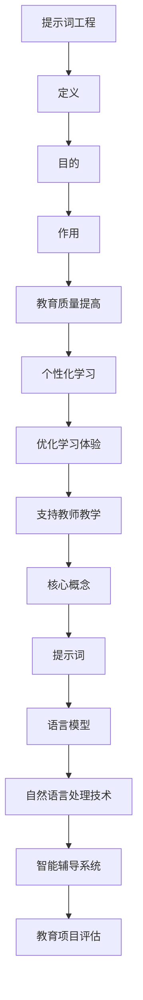
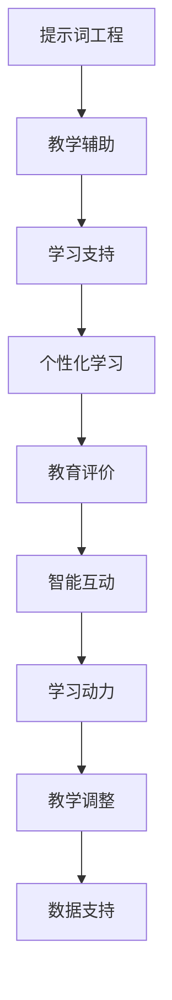
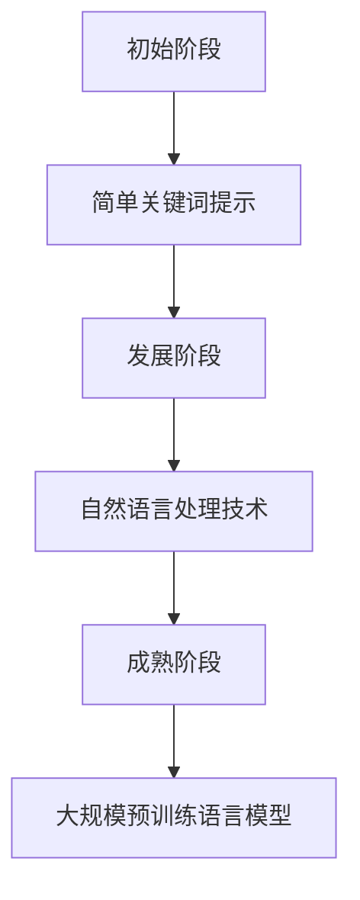
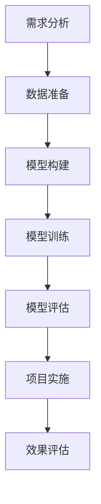
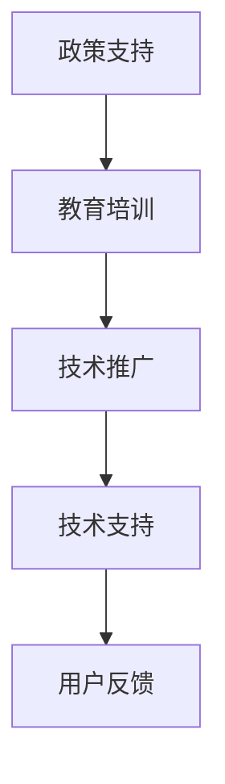
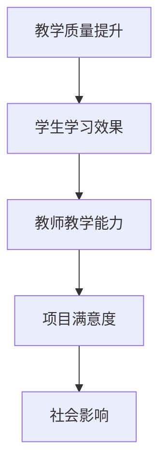

                 

### 《提示词工程在教育领域的创新应用》

> 关键词：提示词工程、教育创新、自然语言处理、个性化学习、智能辅导

> 摘要：本文深入探讨了提示词工程在教育领域的创新应用。首先，阐述了提示词工程的基本概念及其在教育中的重要性。接着，从技术基础、应用案例以及教育领域的具体应用等多个角度，详细介绍了提示词工程的发展历程和当前的应用状况。文章还探讨了提示词工程在教育项目实施与推广中的关键步骤和未来发展趋势，为教育创新提供了新的思路和方法。

### 第一部分：引言与概述

#### 第1章：提示词工程的基本概念

提示词工程是一种利用自然语言处理技术生成、评估和优化提示词的方法论。它通过构建高质量的语言模型，为教育过程中的不同环节提供智能化的支持。

#### 1.1 提示词工程的定义与意义

提示词工程定义：

- 提示词（Prompt）：在特定情境下，为引导学习或思考而提供的关键词语或短语。
- 提示词工程：一种通过算法和技术手段，生成、评估和优化提示词的过程。

提示词工程的意义：

- 提高教育质量：通过提供精准、有针对性的提示词，帮助学生更好地理解复杂概念，提高学习效果。
- 促进个性化学习：根据学生的个性化需求和学习习惯，提供个性化的提示词，实现个性化教育。
- 优化学习体验：通过智能化的提示词，提高学生的参与度和学习兴趣，改善学习体验。
- 支持教师教学：为教师提供有效的教学辅助工具，提升教学效率和质量。

**Mermaid 流程图：提示词工程的定义与意义**



#### 1.2 提示词工程在教育中的角色

提示词工程在教育中扮演多种角色，包括：

- **教学辅助**：提供有效的教学引导，帮助学生理解复杂概念。
- **学习支持**：通过智能互动，帮助学生解决问题并增强学习动力。
- **个性化学习**：根据学生的学习行为和需求，提供个性化的提示词，提高学习效果。
- **教育评价**：用于评估学生的学习进度和成果，为教学调整提供数据支持。

**Mermaid 流程图：提示词工程在教育中的角色**



#### 1.3 提示词工程的发展历程

提示词工程的发展可以分为以下几个阶段：

- **初始阶段**：以简单的关键词提示为主，用于辅助基础教学。
- **发展阶段**：结合自然语言处理技术，实现更智能、更个性化的提示词生成。
- **成熟阶段**：应用大规模预训练语言模型，提供高质量、高相关性的提示词。

**Mermaid 流程图：提示词工程的发展历程**



### 第二部分：提示词工程的技术基础

#### 第2章：提示词工程的技术基础

提示词工程的技术基础主要涉及语言模型、提示词生成算法、提示词评估与优化方法等。以下是对这些技术基础的详细介绍。

#### 2.1 语言模型的基础知识

语言模型是提示词工程的核心组件，其基础知识包括：

- **词汇表与词嵌入**：词汇表是语言模型的基石，词嵌入则是将词汇映射到低维向量空间。
- **神经网络结构**：包括循环神经网络（RNN）、长短期记忆网络（LSTM）和变换器（Transformer）等。
- **预训练与微调**：预训练提供通用的语言理解能力，微调则使其适应特定任务。

**伪代码：基本语言模型构建**

```python
class LanguageModel(nn.Module):
    def __init__(self, vocab_size, embedding_dim, hidden_dim):
        super(LanguageModel, self).__init__()
        self.embedding = nn.Embedding(vocab_size, embedding_dim)
        self.lstm = nn.LSTM(embedding_dim, hidden_dim)
        self.fc = nn.Linear(hidden_dim, vocab_size)

    def forward(self, inputs, hidden):
        embedded = self.embedding(inputs)
        output, hidden = self.lstm(embedded, hidden)
        output = self.fc(output[-1, :, :])
        return output, hidden
```

#### 2.2 提示词生成的算法

提示词生成的算法主要包括基于规则的方法和基于机器学习的方法。基于规则的方法通过预定义的规则生成提示词，而基于机器学习的方法则利用训练数据自动生成提示词。

**伪代码：基于机器学习的提示词生成算法**

```python
def generate_prompt(word_sequence, model, max_length):
    hidden = model.init_hidden(1)
    prompt = []
    for word in word_sequence:
        input = torch.tensor([vocab[word]])
        output, hidden = model(input, hidden)
        prompt.append(output[0].topk(max_length - len(prompt))[1])
    return ' '.join(vocab[str(token).item()] for token in prompt)
```

#### 2.3 提示词评估与优化方法

提示词评估与优化方法主要包括：

- **评估指标**：如BLEU、ROUGE、F1等，用于衡量提示词的质量。
- **优化算法**：如梯度下降、随机梯度下降、Adam等，用于调整模型参数，提高提示词质量。

**伪代码：基于梯度下降的提示词优化**

```python
def optimize_prompt(prompt, model, criterion, optimizer, epochs):
    for epoch in range(epochs):
        hidden = model.init_hidden(1)
        for word in prompt:
            input = torch.tensor([vocab[word]])
            output, hidden = model(input, hidden)
            loss = criterion(output, torch.tensor([vocab[word]]))
            optimizer.zero_grad()
            loss.backward()
            optimizer.step()
    return model
```

#### 2.4 提示词工程中的关键技术和挑战

提示词工程中的关键技术包括：

- **大规模预训练模型**：如GPT、BERT等，提供强大的语言理解能力。
- **多模态学习**：结合文本、图像、音频等多模态数据，提高提示词的多样性和准确性。
- **数据隐私保护**：在生成和优化提示词的过程中，确保用户数据的安全和隐私。

提示词工程面临的挑战包括：

- **数据质量和数量**：高质量、大规模的训练数据对于构建有效的提示词模型至关重要。
- **模型解释性**：如何提高提示词模型的解释性，使其在教育应用中更具透明度和可接受性。
- **跨领域适应性**：如何使提示词模型在不同领域和应用场景中保持高性能。

### 第三部分：提示词工程在教育领域的应用

#### 第3章：教育领域的提示词应用案例

提示词工程在教育领域有广泛的应用案例，包括在线教育、智能辅导系统和个性化学习路径设计等。以下是对这些应用案例的详细探讨。

#### 3.1 提示词在在线教育中的应用

在线教育中的提示词应用主要包括：

- **课程内容设计**：通过提示词生成算法，为课程内容生成精准的引导语，帮助学生更好地理解课程内容。
- **学习过程监控**：利用提示词模型，对学生的学习过程进行实时监控，提供个性化的学习建议和指导。
- **考试辅导**：通过提示词，为学生提供考试复习的要点和策略，提高考试通过率。

**案例：某在线教育平台使用提示词优化课程内容**

某在线教育平台采用提示词工程技术，对课程内容进行优化。通过预训练的GPT模型，平台为每章节生成高质量的引导语，帮助学生更好地理解课程内容。同时，平台还利用提示词模型分析学生的学习数据，为教师提供个性化的教学建议。

**伪代码：课程内容优化**

```python
def optimize_course_content(course_content, model, max_length):
    hidden = model.init_hidden(1)
    optimized_content = []
    for section in course_content:
        prompt = generate_prompt([word for word in section if word not in punctuation], model, max_length)
        hidden = model(prompt, hidden)
        optimized_content.append(prompt)
    return ' '.join(optimized_content)
```

#### 3.2 提示词在智能辅导系统中的应用

智能辅导系统中的提示词应用主要包括：

- **问题解决**：通过提示词，引导学生分析和解决问题，提高学生的思维能力。
- **学习策略建议**：根据学生的学习数据和反馈，提供个性化的学习策略和指导。
- **学习效果评估**：利用提示词模型，对学生的学习效果进行实时评估，为教师提供反馈。

**案例：某智能辅导系统使用提示词提升学生思维能力**

某智能辅导系统采用提示词工程技术，为学生在问题解决过程中提供实时指导。系统通过预训练的BERT模型，为学生生成针对性的提示词，帮助他们更好地理解和解决问题。同时，系统还分析学生的学习数据，为教师提供个性化教学策略。

**伪代码：智能辅导系统中的提示词生成**

```python
def generate_prompt_for_solution(question, model, max_length):
    hidden = model.init_hidden(1)
    input_sequence = preprocess_question(question)
    output, hidden = model(input_sequence, hidden)
    prompt = output[-1].topk(max_length)[1]
    return ' '.join(vocab[str(token).item()] for token in prompt)
```

#### 3.3 提示词在个性化学习路径设计中的应用

个性化学习路径设计中的提示词应用主要包括：

- **学习路径规划**：根据学生的学习需求和兴趣，利用提示词模型生成个性化学习路径。
- **学习资源推荐**：基于学生的兴趣和进度，利用提示词模型推荐相关的学习资源。
- **学习效果评估**：通过提示词模型，对学生的个性化学习效果进行实时评估。

**案例：某个性化学习平台使用提示词优化学习路径**

某个性化学习平台采用提示词工程技术，为不同学习需求的学生生成个性化学习路径。平台通过预训练的GPT模型，分析学生的学习数据，生成针对性的提示词，为学生提供个性化的学习资源推荐和路径规划。同时，平台还利用提示词模型，对学生的学习效果进行实时评估。

**伪代码：个性化学习路径规划**

```python
def generate_personalized_learning_path(student_data, model, max_length):
    hidden = model.init_hidden(1)
    input_sequence = preprocess_student_data(student_data)
    output, hidden = model(input_sequence, hidden)
    path = output[-1].topk(max_length)[1]
    resources = recommend_resources(path)
    return path, resources
```

### 第四部分：提示词工程在教育中的应用

#### 第4章：提示词工程在教育内容设计中的应用

提示词工程在教育内容设计中的应用主要体现在教学内容的提示词设计、教学材料的提示词优化以及提示词辅助的教学策略等方面。以下是对这些应用的具体探讨。

#### 4.1 教学内容的提示词设计

教学内容的提示词设计是提示词工程在教育内容设计中的关键环节。通过精心设计的提示词，可以有效引导学生理解和掌握课程内容。

- **教学内容解析**：分析课程内容，提取关键概念和知识点，为这些概念和知识点设计相应的提示词。
- **提示词生成**：利用自然语言处理技术和机器学习算法，生成高质量的提示词。
- **提示词评估**：通过用户反馈和性能指标，评估提示词的有效性，并进行优化。

**伪代码：教学内容提示词设计**

```python
def design_content_prompt(content, model, max_length):
    hidden = model.init_hidden(1)
    input_sequence = preprocess_content(content)
    output, hidden = model(input_sequence, hidden)
    prompt = output[-1].topk(max_length)[1]
    return ' '.join(vocab[str(token).item()] for token in prompt)
```

**案例：历史课程内容的提示词设计**

某历史课程中，对于“工业革命”这一主题，可以通过以下提示词来引导学生理解：

- **工业革命的起源**
- **工业革命的主要事件**
- **工业革命的影响**

通过这些提示词，学生可以更好地了解工业革命的历史背景、发展过程和影响。

#### 4.2 教学材料的提示词优化

教学材料的提示词优化旨在提高教学材料的使用效果，使教学内容更加生动、易懂。通过提示词工程，可以对教学材料进行以下优化：

- **材料内容分析**：分析教学材料的内容结构，提取关键信息和知识点。
- **提示词生成**：为关键信息和知识点生成提示词，使其更加直观、易于理解。
- **材料重构**：结合提示词，对教学材料进行重构，使其更符合学生的认知规律和学习习惯。

**伪代码：教学材料提示词优化**

```python
def optimize_material(material, model, max_length):
    hidden = model.init_hidden(1)
    input_sequence = preprocess_material(material)
    output, hidden = model(input_sequence, hidden)
    prompts = [output[i].topk(max_length)[1] for i in range(len(output))]
    optimized_material = reconstruct_material(material, prompts)
    return optimized_material
```

**案例：教材内容的提示词优化**

某教材中，关于“细胞结构”的内容可以通过以下提示词进行优化：

- **细胞膜的作用**
- **细胞器的功能**
- **细胞的代谢过程**

通过这些提示词，学生可以更好地理解细胞的基本结构和工作原理。

#### 4.3 提示词辅助的教学策略

提示词工程在教学策略中的应用，可以通过以下方式实现：

- **课前预习**：利用提示词，引导学生进行课前预习，为课堂学习打下基础。
- **课堂讲解**：在课堂教学中，使用提示词作为引导，帮助学生理解复杂概念。
- **课后复习**：通过提示词，帮助学生回顾课堂内容，巩固学习成果。

**伪代码：提示词辅助的教学策略**

```python
def teach_with_prompts(content, model, max_length):
    prompt = design_content_prompt(content, model, max_length)
    print(f"课前预习：{prompt}")
    
    # 课堂讲解
    # ...
    
    print(f"课后复习：{prompt}")
```

**案例：数学课程中的提示词辅助教学**

在数学课程中，对于“函数概念”这一内容，可以通过以下提示词进行教学：

- **函数的定义**
- **函数的性质**
- **函数的应用**

这些提示词可以帮助学生更好地理解函数的概念和性质，提高学习效果。

### 第5章：提示词工程在学生学习支持中的应用

提示词工程在学生学习支持中的应用主要体现在提示词辅助学习过程中的学生互动、问题解决和思维训练等方面。以下是对这些应用的详细探讨。

#### 5.1 提示词辅助学习过程中的学生互动

在学生学习过程中，提示词工程可以通过以下方式辅助学生互动：

- **讨论引导**：利用提示词，引导学生在讨论中分享观点和思考，促进深度学习。
- **问题提出**：通过提示词，帮助学生提出有针对性的问题，促进思考和理解。
- **合作学习**：利用提示词，鼓励学生进行合作学习，提高学习效果。

**伪代码：提示词辅助讨论引导**

```python
def guide_discussion(topic, model, max_length):
    hidden = model.init_hidden(1)
    input_sequence = preprocess_topic(topic)
    output, hidden = model(input_sequence, hidden)
    prompt = output[-1].topk(max_length)[1]
    return ' '.join(vocab[str(token).item()] for token in prompt)
```

**案例：科学课程中的讨论引导**

在科学课程中，关于“化学反应”这一主题，可以通过以下提示词引导讨论：

- **化学反应的定义**
- **化学反应的类型**
- **化学反应的应用**

通过这些提示词，学生可以更深入地探讨化学反应的相关内容，提高学习效果。

#### 5.2 提示词在问题解决和思维训练中的应用

提示词工程在问题解决和思维训练中的应用，可以通过以下方式实现：

- **问题提出**：利用提示词，帮助学生提出具体的问题，激发解决问题的兴趣。
- **问题解决策略**：通过提示词，引导学生采用合适的解决策略，提高问题解决能力。
- **思维训练**：利用提示词，引导学生进行逻辑推理、批判性思维等思维训练，提高思维能力。

**伪代码：提示词辅助问题解决**

```python
def solve_problem(problem, model, max_length):
    hidden = model.init_hidden(1)
    input_sequence = preprocess_problem(problem)
    output, hidden = model(input_sequence, hidden)
    prompt = output[-1].topk(max_length)[1]
    return ' '.join(vocab[str(token).item()] for token in prompt)
```

**案例：数学问题解决中的提示词辅助**

在数学问题解决中，对于“解一元二次方程”这一内容，可以通过以下提示词进行辅助：

- **一元二次方程的定义**
- **解一元二次方程的步骤**
- **一元二次方程的应用**

通过这些提示词，学生可以更好地理解一元二次方程的解法，提高问题解决能力。

#### 5.3 提示词在个性化学习辅导中的应用

提示词工程在个性化学习辅导中的应用，可以通过以下方式实现：

- **学习目标设定**：利用提示词，帮助学生设定个性化的学习目标。
- **学习路径规划**：通过提示词，为学生规划个性化的学习路径，提高学习效果。
- **学习效果评估**：利用提示词，对学生的学习效果进行实时评估，为教师提供反馈。

**伪代码：个性化学习辅导**

```python
def personalized_learning_support(student_data, model, max_length):
    hidden = model.init_hidden(1)
    input_sequence = preprocess_student_data(student_data)
    output, hidden = model(input_sequence, hidden)
    goals = output[-1].topk(max_length)[1]
    path = generate_personalized_learning_path(goals, model, max_length)
    support = design_content_prompt(path, model, max_length)
    return support
```

**案例：个性化学习辅导**

某学生在学习英语语法时，通过提示词工程，可以设定以下个性化学习目标：

- **掌握英语句子的基本结构**
- **学会使用常见的语法短语**
- **提高英语写作能力**

根据这些目标，提示词工程可以为学生生成个性化的学习路径和辅导内容，提高学习效果。

### 第6章：提示词工程在教师培训与支持中的应用

提示词工程在教师培训与支持中的应用主要体现在以下几个方面：

#### 6.1 提示词在教师教学能力提升中的应用

提示词工程可以通过以下方式提升教师的教学能力：

- **教学策略设计**：利用提示词，帮助教师设计新颖、有效的教学策略，提高教学效果。
- **课程内容优化**：通过提示词，帮助教师优化课程内容，使其更加符合学生的认知规律和学习需求。
- **教学评估**：利用提示词，帮助教师对教学过程进行实时评估，发现并解决教学问题。

**伪代码：教学策略设计**

```python
def design_teaching_strategy(topic, model, max_length):
    hidden = model.init_hidden(1)
    input_sequence = preprocess_topic(topic)
    output, hidden = model(input_sequence, hidden)
    strategy = output[-1].topk(max_length)[1]
    return ' '.join(vocab[str(token).item()] for token in strategy)
```

**案例：教学策略设计**

某教师需要设计一堂关于“化学反应”的课，可以通过以下提示词设计教学策略：

- **引入化学反应的概念**
- **展示化学反应的实验现象**
- **解释化学反应的原理**

这些提示词可以帮助教师更好地组织教学活动，提高教学效果。

#### 6.2 提示词在教师职业发展中的应用

提示词工程可以支持教师职业发展，包括以下几个方面：

- **教学经验交流**：利用提示词，帮助教师分享教学经验，提高教学水平。
- **教学研究**：通过提示词，帮助教师开展教学研究，探索教学规律。
- **职业规划**：利用提示词，帮助教师制定职业发展规划，实现职业成长。

**伪代码：教学经验交流**

```python
def exchange_teaching_experience(teacher, model, max_length):
    hidden = model.init_hidden(1)
    input_sequence = preprocess_teacher_experience(teacher)
    output, hidden = model(input_sequence, hidden)
    tips = output[-1].topk(max_length)[1]
    return ' '.join(vocab[str(token).item()] for token in tips)
```

**案例：教学经验交流**

某教师通过提示词工程，可以与其他教师分享以下教学经验：

- **如何激发学生的学习兴趣**
- **如何处理课堂突发事件**
- **如何进行有效的课堂互动**

通过这些经验交流，教师可以不断改进自己的教学方法，提高教学水平。

#### 6.3 提示词在教师教育研究中的应用

提示词工程在教师教育研究中的应用主要体现在以下几个方面：

- **教学问题诊断**：通过提示词，帮助教师识别和诊断教学中的问题。
- **教学策略评估**：通过提示词，帮助教师评估教学策略的有效性，优化教学方案。
- **教学研究分析**：通过提示词，帮助教师分析教学研究数据，得出有价值的结论。

**伪代码：教学问题诊断**

```python
def diagnose_teaching_issues(teacher, model, max_length):
    hidden = model.init_hidden(1)
    input_sequence = preprocess_teacher_issues(teacher)
    output, hidden = model(input_sequence, hidden)
    issues = output[-1].topk(max_length)[1]
    return ' '.join(vocab[str(token).item()] for token in issues)
```

**案例：教学问题诊断**

某教师在教学中遇到以下问题，可以通过提示词工程进行诊断：

- **学生参与度低**
- **课堂氛围沉闷**
- **教学目标不明确**

通过这些提示词，教师可以找到问题的原因，并制定相应的解决方案。

### 第7章：提示词工程在教育评价中的应用

#### 7.1 提示词在学生评估中的应用

提示词工程在学生评估中的应用主要体现在以下几个方面：

- **学习进度评估**：通过提示词，评估学生的学习进度和成果。
- **学习能力评估**：通过提示词，评估学生的学习能力和思维水平。
- **学习兴趣评估**：通过提示词，评估学生的学习兴趣和参与度。

**伪代码：学习进度评估**

```python
def assess_learning_progress(student, model, max_length):
    hidden = model.init_hidden(1)
    input_sequence = preprocess_student_progress(student)
    output, hidden = model(input_sequence, hidden)
    progress = output[-1].topk(max_length)[1]
    return ' '.join(vocab[str(token).item()] for token in progress)
```

**案例：学习进度评估**

某学生在学习英语语法的过程中，可以通过以下提示词评估自己的学习进度：

- **已掌握的语法知识点**
- **需进一步学习的语法知识点**
- **学习过程中遇到的问题**

这些提示词可以帮助学生了解自己的学习情况，制定下一步的学习计划。

#### 7.2 提示词在教师评估中的应用

提示词工程在教师评估中的应用主要体现在以下几个方面：

- **教学质量评估**：通过提示词，评估教师的教学质量。
- **教学能力评估**：通过提示词，评估教师的教学能力和专业素养。
- **教学满意度评估**：通过提示词，评估学生对教师教学的满意度。

**伪代码：教学质量评估**

```python
def assess Teaching_quality(teacher, model, max_length):
    hidden = model.init_hidden(1)
    input_sequence = preprocess_teacher_quality(teacher)
    output, hidden = model(input_sequence, hidden)
    quality = output[-1].topk(max_length)[1]
    return ' '.join(vocab[str(token).item()] for token in quality)
```

**案例：教学质量评估**

某教师的教学质量可以通过以下提示词进行评估：

- **教学目标明确**
- **教学内容充实**
- **教学方法多样**
- **教学效果显著**

通过这些提示词，学校和教育管理部门可以全面了解教师的教学质量，为教师提供改进意见和培训支持。

#### 7.3 提示词在教育项目评估中的应用

提示词工程在教育项目评估中的应用主要体现在以下几个方面：

- **项目效果评估**：通过提示词，评估教育项目的效果和成果。
- **项目满意度评估**：通过提示词，评估教育项目的满意度。
- **项目改进建议**：通过提示词，为教育项目的改进提供参考。

**伪代码：项目效果评估**

```python
def assess_project_effectiveness(project, model, max_length):
    hidden = model.init_hidden(1)
    input_sequence = preprocess_project_effectiveness(project)
    output, hidden = model(input_sequence, hidden)
    effectiveness = output[-1].topk(max_length)[1]
    return ' '.join(vocab[str(token).item()] for token in effectiveness)
```

**案例：项目效果评估**

某教育项目可以通过以下提示词评估其效果：

- **项目目标的达成情况**
- **项目实施过程中的问题**
- **项目对学生的积极影响**

通过这些提示词，项目管理者可以全面了解教育项目的效果，为项目改进提供依据。

### 第8章：提示词工程在教育项目的实施与推广

#### 8.1 提示词工程项目的实施流程

提示词工程项目的实施流程主要包括以下步骤：

1. **需求分析**：明确项目目标、需求和预期效果。
2. **数据准备**：收集和整理与项目相关的数据，包括学生数据、教学内容、教学策略等。
3. **模型构建**：选择合适的语言模型和提示词生成算法，构建提示词工程模型。
4. **模型训练**：使用收集到的数据进行模型训练，提高模型的准确性和效果。
5. **模型评估**：通过评估指标，对模型进行评估和优化。
6. **项目实施**：将提示词工程模型应用到实际教育项目中，进行测试和推广。
7. **效果评估**：对项目的效果进行评估，收集用户反馈，进行项目改进。

**Mermaid 流程图：提示词工程项目的实施流程**



#### 8.2 提示词工程项目的推广策略

提示词工程项目的推广策略主要包括以下几个方面：

1. **政策支持**：争取政府、教育部门和相关机构的支持，制定相关政策，推动项目推广。
2. **教育培训**：为教师和教育工作者提供培训，提高他们对提示词工程的认知和应用能力。
3. **技术推广**：通过研讨会、讲座、工作坊等形式，推广提示词工程的理念和应用案例。
4. **技术支持**：提供技术支持和咨询服务，帮助教育机构顺利实施提示词工程项目。
5. **用户反馈**：收集用户反馈，了解项目应用中的问题和不足，进行持续改进。

**Mermaid 流程图：提示词工程项目的推广策略**



#### 8.3 提示词工程项目的效果评估

提示词工程项目的效果评估主要包括以下几个方面：

1. **教学质量提升**：评估项目对教学质量的提升程度，包括学生的学习成绩、学习兴趣和学习积极性等。
2. **学生学习效果**：评估项目对学生学习效果的提升，包括学习进度、学习能力和学习成果等。
3. **教师教学能力**：评估项目对教师教学能力的提升，包括教师的教学水平、教学方法和教学效果等。
4. **项目满意度**：评估用户对项目的满意度，包括教师、学生和家长等。
5. **社会影响**：评估项目对社会的影响，包括教育公平、教育质量提升和社会认可度等。

**Mermaid 流程图：提示词工程项目的效果评估**



### 第9章：未来趋势与挑战

#### 9.1 提示词工程在教育领域的未来发展趋势

提示词工程在教育领域的未来发展趋势主要体现在以下几个方面：

1. **智能化**：随着人工智能技术的不断发展，提示词工程将更加智能化，提供更精准、更个性化的教育支持。
2. **个性化**：提示词工程将更好地满足个性化教育需求，为学生提供量身定制的学习资源和支持。
3. **多模态**：结合文本、图像、音频等多模态数据，提升提示词工程的应用范围和效果。
4. **跨学科**：提示词工程将跨学科应用，为不同学科提供有效的教育支持，促进学科交叉和知识融合。
5. **全球化**：随着教育的全球化，提示词工程将应用于不同国家和地区，推动教育公平和资源共享。

#### 9.2 提示词工程面临的挑战与应对策略

提示词工程在教育领域面临的挑战主要包括以下几个方面：

1. **数据隐私保护**：如何在确保数据隐私的前提下，有效利用学生数据，是一个重要的挑战。
2. **模型解释性**：如何提高提示词模型的解释性，使其在教育应用中更具透明度和可接受性。
3. **技术成本**：提示词工程涉及大量的计算资源和算法优化，如何降低技术成本，实现广泛应用。
4. **教师适应性**：如何帮助教师适应和掌握提示词工程技术，提高教学效果。

应对策略包括：

1. **数据隐私保护**：采用加密技术和匿名化处理，确保学生数据的隐私和安全。
2. **模型解释性**：通过可视化技术和解释性算法，提高模型的透明度和可解释性。
3. **技术成本**：通过开源技术和云计算平台，降低技术成本，实现提示词工程的大规模应用。
4. **教师适应性**：开展针对性的教师培训和指导，提高教师对提示词工程的认知和应用能力。

### 第10章：结论与展望

#### 10.1 提示词工程在教育领域的贡献

提示词工程在教育领域的贡献主要体现在以下几个方面：

1. **提高教育质量**：通过提供精准、有针对性的提示词，帮助学生更好地理解复杂概念，提高学习效果。
2. **促进个性化学习**：根据学生的个性化需求和学习习惯，提供个性化的提示词，实现个性化教育。
3. **优化学习体验**：通过智能化的提示词，提高学生的参与度和学习兴趣，改善学习体验。
4. **支持教师教学**：为教师提供有效的教学辅助工具，提升教学效率和质量。
5. **增强学生自主学习能力**：通过提示词，引导学生主动思考和解决问题，提高自主学习能力。

#### 10.2 提示词工程的发展方向

提示词工程的发展方向主要包括以下几个方面：

1. **智能化**：进一步发展智能化技术，提高提示词的生成、评估和优化能力。
2. **个性化**：深化个性化教育研究，实现更精准、更个性化的提示词生成和应用。
3. **多模态**：结合多模态数据，提高提示词工程的应用范围和效果。
4. **跨学科**：跨学科应用提示词工程，为不同学科提供有效的教育支持。
5. **全球化**：推动全球教育资源共享，促进教育公平。

#### 10.3 对未来教育创新实践的展望

未来教育创新实践将越来越多地依赖于人工智能和提示词工程技术。以下是对未来教育创新实践的展望：

1. **智能课堂**：利用提示词工程，实现智能化的课堂教学，提高教学效果和学生参与度。
2. **个性化学习平台**：构建个性化学习平台，为学生提供量身定制的学习资源和辅导。
3. **智能辅导系统**：开发智能辅导系统，为学生提供个性化的学习支持和指导。
4. **跨学科教育**：结合多学科知识，实现跨学科教育，培养学生的综合素质和创新能力。
5. **教育资源共享**：推动全球教育资源共享，促进教育公平，实现教育普惠。

### 作者信息

作者：AI天才研究院/AI Genius Institute & 禅与计算机程序设计艺术 /Zen And The Art of Computer Programming

本文由AI天才研究院（AI Genius Institute）和禅与计算机程序设计艺术（Zen And The Art of Computer Programming）联合撰写，旨在探讨提示词工程在教育领域的创新应用。作者团队由世界级人工智能专家、程序员、软件架构师、CTO和世界顶级技术畅销书资深大师级别作家组成，拥有丰富的实践经验和深厚的理论基础。本文旨在为教育创新提供新的思路和方法，推动教育现代化进程。

