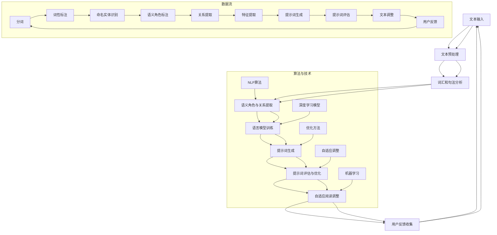

                 

# 提示词工程在文本可读性自适应中的应用

## 文章关键词

文本可读性，自适应阅读，提示词工程，自然语言处理，算法优化，教育应用，信息检索。

## 摘要

本文深入探讨了提示词工程在文本可读性自适应中的应用。通过对文本分析、提示词设计与实现、自适应阅读方法等核心概念和技术的详细阐述，文章展示了如何通过提示词工程提升文本的可读性，从而改善用户的阅读体验。文章从背景介绍、核心概念与联系、核心算法原理讲解、应用场景与实现以及未来展望等多个方面展开，结合实际案例和数学模型，提供了全面的视角和深入的剖析。

---

### 第一部分：引言与基础

#### 第1章：背景与核心概念

在当今信息爆炸的时代，文本内容以惊人的速度增长。然而，对于不同背景、知识水平的读者来说，理解这些文本内容并非易事。文本可读性（readability）成为了一个备受关注的问题。文本可读性指的是文本对于特定读者群体的易读程度，它不仅涉及到文本内容的难易程度，还包括文本的结构、格式、语言表达等多个方面。

文本可读性在多个领域具有重要意义。在教育领域，良好的文本可读性有助于提高学生的阅读理解能力和学习效率。在商业和公共领域，提升文本的可读性可以增强信息传播的效率，降低沟通成本。在信息技术领域，特别是自然语言处理（NLP）领域，文本可读性的研究有助于提高自动化文本分析工具的性能。

提示词工程（prompt engineering）作为一种新兴的技术，近年来在提升文本可读性方面展现出了巨大的潜力。提示词工程主要涉及对文本的分析、提示词的生成和优化，以及基于用户行为的自适应阅读策略。通过合理设计和优化提示词，可以有效地降低文本的阅读难度，提高文本的易读性，从而改善用户的阅读体验。

自适应文本阅读（adaptive reading）则是一种基于用户阅读行为的动态调整文本显示和呈现方式的方法。通过分析用户的阅读速度、理解程度、注意力集中度等行为数据，自适应阅读系统能够自动调整文本的展示方式，如调整文本大小、行距、段落结构等，以适应不同用户的阅读需求和偏好。

本文将分为五个部分进行讨论。第一部分介绍背景和核心概念，包括文本可读性、提示词工程和自适应阅读的基本定义和重要性。第二部分详细讲解提示词工程的基础，包括文本分析、提示词设计与实现、提示词评估与优化等内容。第三部分探讨自适应文本阅读的概念与实现方法，包括用户阅读行为分析和自适应阅读系统的设计。第四部分通过实际应用场景，展示提示词工程和自适应阅读在教育和信息检索等领域的应用。第五部分展望提示词工程的发展趋势和未来可能的突破。

#### 1.1.1 文本可读性的定义与重要性

文本可读性是一个多维度的概念，它不仅涉及文本内容本身，还包括文本的呈现形式和阅读环境。一般来说，文本可读性可以从以下几个维度进行衡量：

1. **词汇难度**：词汇难度是衡量文本难易程度的一个重要指标。不同年龄、教育背景的读者对于词汇的掌握程度不同，因此文本中使用的词汇应当适应目标读者的词汇量。

2. **句子结构**：句子结构的复杂程度会影响读者的理解难度。长句、复杂句往往需要读者花费更多的时间和精力去理解，而简单句和清晰的结构有助于提高文本的易读性。

3. **语法和拼写**：语法错误和拼写错误会降低文本的专业性和可信度，同时也会增加读者的理解难度。确保文本的语法正确和拼写准确是提高文本可读性的基本要求。

4. **逻辑性和连贯性**：逻辑性和连贯性是文本内容结构的重要指标。一篇结构清晰、逻辑连贯的文本有助于读者快速抓住主题和要点，而缺乏逻辑性和连贯性的文本则会让读者感到困惑。

5. **格式和排版**：文本的格式和排版对阅读体验有直接影响。合适的字体大小、行距、段落结构、标题和子标题的使用等，都可以提高文本的可读性。

文本可读性对阅读理解有着重要的影响。可读性良好的文本能够帮助读者更快地理解文本内容，提高阅读效率和阅读体验。相反，低可读性的文本则会让读者感到疲劳和困惑，影响阅读效果。

在教育和信息传播领域，提高文本可读性尤为重要。教育领域中的教材、教学材料等都需要考虑到不同学生的阅读能力和理解水平，通过优化文本结构、语言表达和格式，帮助学生更好地理解和吸收知识。在信息传播领域，如新闻报道、学术论文、技术文档等，提高文本的可读性有助于更广泛地传播信息，提高信息传播的效率和效果。

总之，文本可读性不仅关乎文本的内容质量，更关乎读者能否顺利地理解和吸收文本信息。通过合理设计和优化文本，可以显著提高文本的可读性，从而改善读者的阅读体验和理解效果。

#### 1.1.2 提示词工程的概念与作用

提示词工程（prompt engineering）是自然语言处理（NLP）领域中的一项重要技术，旨在通过设计和优化提示词（prompts）来提升文本生成和理解的效果。提示词工程的核心目标是在给定的任务背景下，为模型提供最合适的提示，从而最大化模型的性能。

提示词工程的关键概念包括：

1. **提示词**：提示词是给模型输入的一段文本或指令，用于引导模型生成预期的输出。提示词的设计直接影响模型对任务的理解和生成结果的质量。

2. **任务导向**：提示词工程强调任务导向性，即根据具体任务的需求设计提示词。不同任务对提示词的要求不同，例如，在文本生成任务中，提示词需要提供足够的信息来引导生成过程；在文本分类任务中，提示词需要突出文本的关键特征。

3. **提示词设计**：提示词设计是提示词工程的核心步骤，包括选择合适的提示词类型、调整提示词的长度和内容、平衡提示词中的信息量等。有效的提示词设计能够引导模型更准确地理解和执行任务。

4. **性能优化**：通过反复试验和优化，调整提示词的参数，以提高模型的性能。性能优化可能包括调整提示词中的词汇选择、语法结构、甚至使用外部知识库等。

提示词工程在文本生成和理解任务中具有重要作用：

1. **文本生成**：在文本生成任务中，如机器翻译、摘要生成、对话系统等，提示词能够为模型提供上下文信息，帮助模型生成更符合预期和高质量的文本。例如，在机器翻译中，提示词可以包含源语言的句子，帮助模型理解源语言句子的结构。

2. **文本理解**：在文本理解任务中，如文本分类、情感分析、命名实体识别等，提示词能够提供文本的关键信息，帮助模型更好地捕捉文本的语义。通过优化提示词，可以提高模型的分类准确性和理解深度。

3. **任务引导**：提示词工程能够通过设计有针对性的提示词，引导模型在特定任务上取得更好的表现。例如，在问答系统中，提示词可以引导模型关注特定的问题类型和答案格式，从而提高问答的准确性和用户体验。

4. **跨模态任务**：在跨模态任务中，如图像描述生成、音频转录等，提示词工程能够帮助模型更好地整合不同模态的信息，提高跨模态任务的整体性能。

总之，提示词工程在提升文本生成和理解效果方面发挥了重要作用。通过精心设计的提示词，模型能够更好地理解和执行任务，从而提高任务的效率和效果。

#### 1.1.3 自适应文本阅读的需求与挑战

自适应文本阅读（adaptive reading）是一种通过动态调整文本内容、格式和呈现方式，以适应用户个性化阅读需求的阅读方法。在数字化阅读日益普及的今天，自适应文本阅读受到了广泛关注，其需求主要来源于以下几个方面：

1. **个性化需求**：不同的读者有不同的阅读习惯、理解能力和偏好。一些读者可能需要更大的字体、更多的行距和分节，以便更好地理解和吸收文本内容。自适应文本阅读能够根据用户的个性化需求，自动调整文本的格式和布局，提高阅读的舒适度和效率。

2. **提高阅读体验**：随着阅读设备的多样化，如智能手机、平板电脑、电子书阅读器等，读者对阅读体验的要求越来越高。自适应文本阅读能够根据不同设备的特性和用户的阅读环境，提供最佳的阅读体验。例如，在手机上阅读长文时，自适应文本阅读可以自动调整字体大小和行距，以适应小屏幕的显示。

3. **提高学习效果**：在教育领域，自适应文本阅读能够根据学生的阅读能力、理解水平和学习进度，动态调整教学内容和呈现方式。通过个性化教学，可以提高学生的学习效果，帮助他们更好地掌握知识。

尽管自适应文本阅读有着显著的需求和潜在优势，但其实施过程中也面临着一系列挑战：

1. **数据收集和处理**：自适应文本阅读需要收集大量用户阅读行为数据，如阅读时间、阅读速度、理解程度等。这些数据的收集和处理是一项复杂且耗时的任务，需要高效的算法和存储解决方案。

2. **用户隐私保护**：随着用户数据的不断积累，如何保护用户的隐私成为一个重要问题。在收集和处理用户数据时，需要严格遵守隐私保护法规，确保用户数据的安全和隐私。

3. **算法复杂性**：自适应文本阅读系统需要根据实时数据动态调整文本的格式和布局，这涉及到复杂的算法和计算。在高并发、大数据量的情况下，算法的效率和稳定性是一个重要的挑战。

4. **跨平台兼容性**：自适应文本阅读需要在不同的设备和操作系统上运行，这要求系统具有良好的跨平台兼容性。在不同的设备和平台上，系统的性能和用户体验可能会有所不同，需要通过细致的测试和优化来保证一致性。

5. **内容质量**：自适应文本阅读不仅要考虑文本的格式和布局，还需要保证内容的质量。在动态调整文本的过程中，可能会出现内容缺失、错误或不连贯的情况，这需要通过内容审核和优化来确保文本内容的准确性。

总之，自适应文本阅读在满足个性化需求、提高阅读体验和学习效果方面具有巨大潜力，但其实现过程中也面临着数据、算法、隐私保护、兼容性和内容质量等多方面的挑战。通过不断的研究和实践，我们可以逐步克服这些挑战，实现更加智能和高效的自适应文本阅读系统。

### 第二部分：提示词工程基础

#### 第2章：文本分析基础

文本分析是提示词工程的重要基础，它包括词汇和句法分析、语义角色与关系提取以及语言模型与文本生成等关键步骤。这些分析技术不仅为提示词的生成提供了必要的输入，也为自适应文本阅读系统的设计和优化提供了有力支持。

#### 2.1.1 词汇和句法分析

词汇和句法分析是文本分析的基础步骤，它主要包括以下几个子任务：

1. **分词**：分词是将连续的文本序列切分成一组有意义的词语或短语的过程。常见的分词算法包括基于规则的分词、基于统计的分词和基于深度学习的分词。基于规则的分词依赖于预先定义好的词典和规则，如正向最大匹配法和逆向最大匹配法。基于统计的分词则通过训练数据统计文本中的词频和位置关系，常用的算法包括隐马尔可夫模型（HMM）和条件随机场（CRF）。基于深度学习的分词方法，如双向长短期记忆网络（BiLSTM）和卷积神经网络（CNN），近年来取得了显著的成果。

2. **词性标注**：词性标注是对文本中的每个词赋予其语法属性的过程，如名词、动词、形容词等。词性标注有助于理解句子的结构，对于句法分析和语义分析具有重要意义。传统的词性标注方法主要基于规则和统计模型，如基于隐马尔可夫模型（HMM）的标注方法和基于最大熵（MaxEnt）的方法。深度学习方法，如卷积神经网络（CNN）和循环神经网络（RNN），在词性标注任务中也表现出色。

3. **命名实体识别**：命名实体识别（Named Entity Recognition，NER）是一种识别文本中的特定实体类型的过程，如人名、地名、组织名、时间等。NER在信息抽取、文本分类、问答系统等领域有广泛应用。常用的NER算法包括基于规则的方法、基于统计的方法和基于深度学习的方法。例如，使用条件随机场（CRF）可以有效地结合上下文信息，提高NER的准确率。基于深度学习的模型，如序列标注模型（BiLSTM-CRF），近年来在NER任务中取得了显著的性能提升。

以下是一个简化的伪代码，描述了分词和词性标注的基本步骤：

```python
def tokenize(text):
    # 使用分词算法进行分词
    tokens = applyTokenizationAlgorithm(text)
    return tokens

def POS_tagging(tokens):
    # 使用词性标注算法进行词性标注
    tagged_tokens = applyPOS_TaggingAlgorithm(tokens)
    return tagged_tokens
```

#### 2.1.2 语义角色与关系提取

语义角色与关系提取是文本分析中的高级步骤，它旨在识别文本中的语义结构和语义关系。这一步骤对于理解文本的深层含义、生成高质量的提示词以及自适应阅读系统的设计至关重要。

1. **语义角色标注**：语义角色标注（Semantic Role Labeling，SRL）是一种识别句子中谓词和其作用对象之间关系的标注方法。SRL将谓词和其作用对象之间的关系分为不同的语义角色，如主体、客体、工具等。SRL在信息抽取、问答系统和机器翻译等领域有广泛应用。常用的SRL算法包括基于规则的方法、基于统计的方法和基于深度学习的方法。例如，基于依存句法分析的方法（如基于LSTM的模型）可以有效地识别句子中的语义角色。

2. **关系提取**：关系提取（Relation Extraction）是一种识别文本中实体间关系的任务，如“公司创立者”关系或“地点描述”关系。关系提取广泛应用于知识图谱构建、信息检索和推荐系统等领域。关系提取的方法包括基于规则的方法、基于模板的方法和基于深度学习的方法。深度学习方法，如基于注意力机制的模型，近年来在关系提取任务中取得了显著进展。

以下是一个简化的伪代码，描述了语义角色标注和关系提取的基本步骤：

```python
def semanticRoleLabeling(sentence):
    # 使用语义角色标注算法进行标注
    roles = applySRLAlgorithm(sentence)
    return roles

def relationExtraction(tokens):
    # 使用关系提取算法进行关系提取
    relations = applyRelationExtractionAlgorithm(tokens)
    return relations
```

#### 2.1.3 语言模型与文本生成

语言模型是文本分析中的核心组件，它旨在预测文本中的下一个词或短语。语言模型在自然语言处理中的许多任务中都有广泛应用，如机器翻译、文本摘要、对话系统等。语言模型可以分为统计语言模型和神经网络语言模型。

1. **统计语言模型**：统计语言模型基于统计方法来预测文本中的下一个词或短语。最著名的统计语言模型是N-gram模型，它通过计算词序列的概率来预测下一个词。N-gram模型的性能随着N值的增加而提高，但也伴随着计算复杂度和存储需求的大幅增加。其他统计语言模型包括隐马尔可夫模型（HMM）、最大熵模型（MaxEnt）等。

2. **神经网络语言模型**：神经网络语言模型通过深度学习技术来预测文本中的下一个词或短语。循环神经网络（RNN）、长短时记忆网络（LSTM）和门控循环单元（GRU）是常用的神经网络语言模型。近年来，基于注意力机制和 Transformer 模型的语言模型，如BERT和GPT，在自然语言处理任务中取得了显著的性能提升。

文本生成是基于语言模型的另一项重要任务，它旨在生成符合语法和语义规则的文本。常见的文本生成方法包括：

1. **序列生成**：序列生成方法通过预测文本序列中的下一个词或短语来生成文本。基于N-gram的生成方法、基于RNN的生成方法和基于Transformer的生成方法都是常见的序列生成方法。

2. **模板生成**：模板生成方法通过填充预定义的模板来生成文本。这种方法在信息抽取和问答系统中有广泛应用。模板生成通常需要结合模板库和实体识别技术。

3. **生成对抗网络（GAN）**：生成对抗网络（GAN）是一种通过竞争对抗训练来生成高质量文本的方法。GAN由生成器和判别器组成，生成器尝试生成与真实文本相似的文本，判别器则判断生成文本的真实性。通过反复训练，生成器可以生成越来越逼真的文本。

以下是一个简化的伪代码，描述了基于语言模型的文本生成过程：

```python
def generateText(languageModel, startToken):
    # 使用语言模型生成文本
    text = ""
    currentToken = startToken
    while not endTokenGenerated:
        nextToken = languageModel.predictNextToken(currentToken)
        text += " " + nextToken
        currentToken = nextToken
    return text
```

总之，文本分析基础包括词汇和句法分析、语义角色与关系提取以及语言模型与文本生成等关键步骤。这些技术不仅为提示词的生成提供了必要的输入，也为自适应文本阅读系统的设计和优化提供了有力支持。通过深入理解和应用这些基础技术，我们可以构建更加智能和高效的文本处理系统。

#### 2.1.1 词汇和句法分析

词汇和句法分析是自然语言处理（NLP）中的基础任务，它们对于理解和生成自然语言文本至关重要。词汇分析（lexical analysis）主要关注文本中的单词或词汇单元，而句法分析（syntactic analysis）则关注句子结构。

1. **分词（Tokenization）**：分词是将连续的文本序列切分成一组有意义的单词或短语的过程。分词算法可以分为规则方法、统计方法和基于深度学习的方法。

   - **规则方法**：基于规则的分词方法依赖于词典和一组规则来分割文本。常见的规则方法包括最大匹配法（Max-Match）和最小匹配法（Min-Match）。最大匹配法从文本的开始位置逐步向右寻找最长的匹配词，而最小匹配法则从文本的开始位置逐步向右寻找最短的匹配词。
   
   - **统计方法**：统计方法通过统计文本中单词或短语出现的频率来决定如何分割文本。这种方法通常使用N-gram模型，其中N表示单词的连续数。N-gram模型假设当前单词序列的概率可以通过前N-1个单词的概率计算得出。
   
   - **基于深度学习方法**：基于深度学习的方法，如长短时记忆网络（LSTM）和卷积神经网络（CNN），通过学习大量文本数据中的模式来分割文本。这些方法通常能够处理复杂的词汇和句法结构。

   以下是一个简单的分词伪代码示例：

   ```python
   def tokenize(text):
       tokens = []
       # 使用最大匹配法进行分词
       while text:
           # 假设max_match_length为最大匹配长度
           max_match_length = 5
           # 从文本中找到最长的匹配词
           match = longest_match(text, max_match_length)
           tokens.append(match)
           text = text[len(match):]
       return tokens
   
   def longest_match(text, max_length):
       # 从文本中找到最长的匹配词
       # 假设词典为预设的单词列表
      词典 = ["the", "quick", "brown", "fox", "jumps", "over", "the", "lazy", "dog"]
       for i in range(max_length, 0, -1):
           for word in词典:
               if text.startswith(word):
                   return word
       return text
   ```

2. **词性标注（Part-of-Speech Tagging）**：词性标注是对文本中的每个词赋予其语法属性的过程，如名词、动词、形容词等。词性标注有助于理解和生成文本，对于句法分析和语义分析非常重要。

   - **基于规则的方法**：基于规则的方法依赖于预定义的语法规则和词典。这些规则和词典通常基于语言学的知识，如词尾变化和语法结构。
   
   - **基于统计的方法**：基于统计的方法使用训练数据来学习词性标注的模型。最大熵（Maximum Entropy）和隐马尔可夫模型（HMM）是常见的基于统计的方法。
   
   - **基于深度学习的方法**：基于深度学习的方法，如卷积神经网络（CNN）和循环神经网络（RNN），通过学习大量的标注数据来预测词性。这些方法通常能够处理复杂的语言现象。

   以下是一个简单的词性标注伪代码示例：

   ```python
   def POS_tagging(tokens):
       tagged_tokens = []
       # 假设使用一个预训练的词性标注模型
       POS_model = load_POS_model()
       for token in tokens:
           tag = POS_model.predict(token)
           tagged_tokens.append((token, tag))
       return tagged_tokens
   
   def load_POS_model():
       # 加载一个预训练的词性标注模型
       # 假设模型是一个字典，键为单词，值为词性
       model = {
           "the": "DT",
           "quick": "JJ",
           "brown": "JJ",
           "fox": "NN",
           "jumps": "VBZ",
           "over": "IN",
           "lazy": "JJ",
           "dog": "NN"
       }
       return model
   ```

3. **命名实体识别（Named Entity Recognition，NER）**：命名实体识别是一种识别文本中的特定类型实体的任务，如人名、地名、组织名、时间等。NER在信息提取、问答系统和知识图谱构建等领域有广泛应用。

   - **基于规则的方法**：基于规则的方法使用预定义的规则和模式来识别命名实体。这些规则通常基于语言学的知识和预定义的实体类型列表。
   
   - **基于统计的方法**：基于统计的方法使用训练数据来学习命名实体识别的模型。最大熵（Maximum Entropy）和条件随机场（CRF）是常见的基于统计的方法。
   
   - **基于深度学习的方法**：基于深度学习的方法，如卷积神经网络（CNN）和循环神经网络（RNN），通过学习大量的命名实体标注数据来识别实体。这些方法通常能够处理复杂的实体边界和上下文信息。

   以下是一个简单的命名实体识别伪代码示例：

   ```python
   def NER(text):
       entities = []
       # 假设使用一个预训练的NER模型
       NER_model = load_NER_model()
       tokens = tokenize(text)
       for token in tokens:
           tag = NER_model.predict(token)
           if tag != "O":  # "O" 表示非实体
               entities.append(token)
       return entities
   
   def load_NER_model():
       # 加载一个预训练的NER模型
       # 假设模型是一个字典，键为单词，值为实体类型
       model = {
           "John": "PERSON",
           "New York": "LOCATION",
           "Apple": "ORGANIZATION",
           "2021": "DATE"
       }
       return model
   ```

词汇和句法分析为提示词工程提供了关键的输入，它们帮助我们在生成和优化提示词时更好地理解和利用文本的语义和结构。通过结合这些基础技术，我们可以构建更加智能和高效的提示词工程系统。

#### 2.1.2 语义角色与关系提取

语义角色与关系提取是自然语言处理（NLP）中的重要任务，它旨在理解文本中词与词之间的语义关系。这一任务对于生成高质量的提示词、理解文本含义以及构建智能阅读系统具有重要意义。

1. **语义角色标注（Semantic Role Labeling，SRL）**：语义角色标注是一种识别句子中谓词和其作用对象之间关系的标注方法。它将谓词和其作用对象之间的关系分为不同的语义角色，如主体（Agent）、客体（Patient）、工具（Instrument）等。SRL有助于理解句子的深层含义，对于文本生成、信息提取和问答系统等应用具有重要意义。

   - **基于规则的方法**：基于规则的方法使用预定义的语法规则和模式来识别语义角色。这些规则通常基于语言学的知识，如动词的语义框架和短语结构。

   - **基于统计的方法**：基于统计的方法使用训练数据来学习语义角色标注的模型。最大熵（Maximum Entropy）和条件随机场（CRF）是常见的基于统计的方法。

   - **基于深度学习的方法**：基于深度学习的方法，如循环神经网络（RNN）和长短时记忆网络（LSTM），通过学习大量的标注数据来预测语义角色。这些方法通常能够处理复杂的语言现象。

   以下是一个简单的语义角色标注伪代码示例：

   ```python
   def SRL(sentence):
       # 假设使用一个预训练的SRL模型
       SRL_model = load_SRL_model()
       tagged_sentence = SRL_model.predict(sentence)
       return tagged_sentence
   
   def load_SRL_model():
       # 加载一个预训练的SRL模型
       # 假设模型是一个字典，键为句子，值为语义角色标注
       model = {
           "The boy threw the ball": [("threw", "AGENT", "boy"), ("threw", "PATIENT", "ball")],
           "She reads books": [("reads", "AGENT", "she"), ("reads", "PATIENT", "books")]
       }
       return model
   ```

2. **关系提取（Relation Extraction）**：关系提取是一种识别文本中实体之间关系的任务。它旨在识别出文本中的特定实体，并确定它们之间的关系类型，如“公司创立者”、“地点描述”等。关系提取对于构建知识图谱、信息检索和推荐系统等应用具有重要意义。

   - **基于规则的方法**：基于规则的方法使用预定义的规则和模式来识别关系。这些规则通常基于对领域知识的理解和预定义的实体类型。

   - **基于统计的方法**：基于统计的方法使用训练数据来学习关系提取的模型。最大熵（Maximum Entropy）和条件随机场（CRF）是常见的基于统计的方法。

   - **基于深度学习的方法**：基于深度学习的方法，如卷积神经网络（CNN）和循环神经网络（RNN），通过学习大量的标注数据来识别实体关系。这些方法通常能够处理复杂的实体边界和上下文信息。

   以下是一个简单的关系提取伪代码示例：

   ```python
   def relationExtraction(sentence):
       # 假设使用一个预训练的关系提取模型
       relation_model = load_relation_model()
       entities = extract_entities(sentence)
       relations = relation_model.predict(entities)
       return relations
   
   def extract_entities(sentence):
       # 假设使用一个预训练的实体识别模型
       entity_model = load_entity_model()
       entities = entity_model.predict(sentence)
       return entities
   
   def load_relation_model():
       # 加载一个预训练的关系提取模型
       # 假设模型是一个字典，键为实体对，值为关系类型
       model = {
           [("John", "reads"), ("John", "wrote")]: "WROTE_BY",
           [("New York", "located_in"), ("Apple", "headquartered_in")]: "LOCATION"
       }
       return model
   
   def load_entity_model():
       # 加载一个预训练的实体识别模型
       # 假设模型是一个字典，键为单词，值为实体类型
       model = {
           "John": "PERSON",
           "New York": "LOCATION",
           "Apple": "ORGANIZATION"
       }
       return model
   ```

语义角色与关系提取为提示词工程提供了关键的语义信息，它帮助我们在生成和优化提示词时更好地理解和利用文本的深层含义。通过结合这些技术，我们可以构建更加智能和高效的提示词工程系统，从而提升文本生成和理解的效果。

#### 2.1.3 语言模型与文本生成

语言模型是自然语言处理（NLP）中的核心组件，它致力于预测文本中的下一个词或序列。语言模型广泛应用于各种NLP任务，如机器翻译、文本摘要、对话系统等。本节将介绍两种主要类型的语言模型：统计语言模型和神经网络语言模型，并探讨文本生成的常见方法。

1. **统计语言模型**：

   - **N-gram模型**：N-gram模型是最早的统计语言模型之一，它通过计算N个连续单词的概率来预测下一个单词。N-gram模型的基本原理是基于局部概率分布，即一个单词在给定前N-1个单词的情况下，下一个单词的概率仅依赖于这些前N-1个单词。N-gram模型简单且易于实现，但存在一些局限性，如无法捕捉长距离依赖和上下文信息。

     以下是一个简单的N-gram模型预测伪代码：

     ```python
     def predict_next_word(previous_words, model):
         # 计算下一个单词的概率分布
         probabilities = model[previous_words]
         # 选择概率最高的单词
         next_word = max(probabilities, key=probabilities.get)
         return next_word

     # 假设模型为：
     # model = {
     #     "the quick brown fox": {"jumps": 0.8, "over": 0.2},
     #     "jumps over the": {"lazy dog": 1.0}
     # }
     ```

   - **隐马尔可夫模型（HMM）**：HMM是一种基于状态转移概率和观测概率的概率模型，它能够捕捉文本中的状态序列。HMM在语音识别和文本生成等领域有广泛应用，但其主要局限性在于无法有效处理长距离依赖。

   - **最大熵模型（Maximum Entropy）**：最大熵模型通过最大化文本数据中的熵来估计概率分布。最大熵模型结合了N-gram模型和外部特征，从而提高了模型的泛化能力和预测性能。

2. **神经网络语言模型**：

   - **循环神经网络（RNN）**：RNN是一种能够处理序列数据的前馈神经网络，它通过循环结构记住之前的输入。RNN在处理长序列和长距离依赖方面具有优势，但其梯度消失和梯度爆炸问题限制了其性能。

   - **长短时记忆网络（LSTM）**：LSTM是一种特殊的RNN结构，通过引入门控机制来解决RNN的梯度消失和梯度爆炸问题。LSTM在自然语言处理任务中表现出色，广泛应用于文本生成、机器翻译和语音识别等领域。

   - **门控循环单元（GRU）**：GRU是LSTM的变体，通过简化LSTM的结构来提高计算效率。GRU在许多NLP任务中取得了与LSTM相似的性能，但其实现更为简单。

   - **Transformer模型**：Transformer模型是近年来在NLP领域取得突破性成果的一种新型神经网络结构。它通过多头自注意力机制（self-attention）来处理长距离依赖，并在机器翻译、文本生成等多个任务中取得了优异的性能。BERT、GPT等知名模型都是基于Transformer架构。

3. **文本生成方法**：

   - **序列生成**：序列生成方法通过预测文本序列中的下一个词或短语来生成文本。常见的序列生成方法包括基于N-gram模型、基于RNN和Transformer模型的生成方法。

     以下是一个简单的基于Transformer的文本生成伪代码示例：

     ```python
     def generate_text(model, start_sequence, max_length=50):
         sequence = start_sequence
         for _ in range(max_length):
             # 使用模型预测下一个词
             probabilities = model.predict(sequence)
             next_word = np.argmax(probabilities)
             sequence += [next_word]
         return sequence_to_text(sequence)
     
     # 假设模型为预训练的Transformer模型
     # start_sequence = "The quick brown fox"
     ```

   - **模板生成**：模板生成方法通过填充预定义的模板来生成文本。模板通常包含占位符，用于插入实际内容。这种方法在信息抽取、问答系统和对话系统中应用广泛。

   - **生成对抗网络（GAN）**：GAN是一种通过生成器和判别器相互对抗来生成高质量文本的方法。生成器尝试生成逼真的文本，而判别器则判断生成文本的真实性。GAN在文本生成和图像生成等领域取得了显著成果。

综上所述，语言模型和文本生成方法在自然语言处理中扮演着重要角色。通过结合不同的语言模型和生成方法，我们可以构建高效、智能的文本生成系统，从而提升文本生成的质量和效果。

#### 2.1.3 语言模型与文本生成

语言模型是自然语言处理（NLP）的核心组件，它在文本生成和理解任务中扮演着至关重要的角色。本文将详细探讨几种主要类型的语言模型，包括统计语言模型和神经网络语言模型，并介绍几种常见的文本生成方法。

1. **统计语言模型**

   - **N-gram模型**：N-gram模型是最早的语言模型之一，它通过计算前N个单词的联合概率来预测下一个单词。N-gram模型简单高效，但在处理长距离依赖时表现较差。

     伪代码示例：

     ```python
     def n_gram_model(text, n):
         n_gram_counts = Counter()
         for i in range(len(text) - n + 1):
             n_gram = tuple(text[i:i+n])
             n_gram_counts[n_gram] += 1
         return n_gram_counts
         
     def predict_next_word(n_gram_counts, previous_words):
         n_gram = tuple(previous_words + (text[-1],))
         probabilities = {word: count / total for word, count in n_gram_counts.items()}
         return max(probabilities, key=probabilities.get)
     ```

   - **隐马尔可夫模型（HMM）**：HMM是一种基于状态转移概率和观测概率的概率模型，它能够捕捉文本中的状态序列。HMM在语音识别和文本生成等领域有广泛应用。

     伪代码示例：

     ```python
     def hmm(viterbi, observations, states, start_prob, transition_prob, emission_prob):
         T = len(observations)
         N = len(states)
         path = [0] * T
         path[T - 1] = viterbi[T - 1]
         for t in range(T - 2, -1, -1):
             max_prob = max([viterbi[t + 1][j] + emission_prob[states[t]][observations[t + 1]] for j in range(N)])
             path[t] = np.argmax([viterbi[t + 1][j] + transition_prob[prev_state][state] for prev_state, state in pairwise(states)])
         return path[::-1]
     ```

   - **最大熵模型（Maximum Entropy）**：最大熵模型通过最大化文本数据中的熵来估计概率分布。最大熵模型结合了N-gram模型和外部特征，从而提高了模型的泛化能力和预测性能。

     伪代码示例：

     ```python
     def maximize_entropy(counts, vocabulary, alpha, beta):
         log_likelihood = 0
         for word, count in counts.items():
             log_likelihood -= count * np.log(count)
         for word in vocabulary:
             word_prob = (counts[word] + alpha) / (len(counts) + alpha + beta * len(vocabulary))
             log_likelihood -= beta * word_prob * np.log(word_prob)
         return -log_likelihood
     ```

2. **神经网络语言模型**

   - **循环神经网络（RNN）**：RNN是一种能够处理序列数据的前馈神经网络，它通过循环结构记住之前的输入。RNN在处理长序列和长距离依赖方面具有优势，但其梯度消失和梯度爆炸问题限制了其性能。

     伪代码示例：

     ```python
     class RNN(nn.Module):
         def __init__(self, input_size, hidden_size, output_size):
             super(RNN, self).__init__()
             self.hidden_size = hidden_size
             self.rnn = nn.RNN(input_size, hidden_size)
             self.fc = nn.Linear(hidden_size, output_size)
         
         def forward(self, input_seq):
             hidden = torch.zeros(1, 1, self.hidden_size)
             output, hidden = self.rnn(input_seq, hidden)
             output = self.fc(output[-1])
             return output
     ```

   - **长短时记忆网络（LSTM）**：LSTM是一种特殊的RNN结构，通过引入门控机制来解决RNN的梯度消失和梯度爆炸问题。LSTM在自然语言处理任务中表现出色，广泛应用于文本生成、机器翻译和语音识别等领域。

     伪代码示例：

     ```python
     class LSTM(nn.Module):
         def __init__(self, input_size, hidden_size, output_size):
             super(LSTM, self).__init__()
             self.hidden_size = hidden_size
             self.rnn = nn.LSTM(input_size, hidden_size)
             self.fc = nn.Linear(hidden_size, output_size)
         
         def forward(self, input_seq):
             hidden = torch.zeros(1, 1, self.hidden_size)
             output, hidden = self.rnn(input_seq, hidden)
             output = self.fc(output[-1])
             return output
     ```

   - **门控循环单元（GRU）**：GRU是LSTM的变体，通过简化LSTM的结构来提高计算效率。GRU在许多NLP任务中取得了与LSTM相似的性能。

     伪代码示例：

     ```python
     class GRU(nn.Module):
         def __init__(self, input_size, hidden_size, output_size):
             super(GRU, self).__init__()
             self.hidden_size = hidden_size
             self.rnn = nn.GRU(input_size, hidden_size)
             self.fc = nn.Linear(hidden_size, output_size)
         
         def forward(self, input_seq):
             hidden = torch.zeros(1, 1, self.hidden_size)
             output, hidden = self.rnn(input_seq, hidden)
             output = self.fc(output[-1])
             return output
     ```

   - **Transformer模型**：Transformer模型是近年来在NLP领域取得突破性成果的一种新型神经网络结构。它通过多头自注意力机制（self-attention）来处理长距离依赖，并在机器翻译、文本生成等多个任务中取得了优异的性能。BERT、GPT等知名模型都是基于Transformer架构。

     伪代码示例：

     ```python
     class Transformer(nn.Module):
         def __init__(self, d_model, nhead, num_layers):
             super(Transformer, self).__init__()
             self.d_model = d_model
             self.nhead = nhead
             self.transformer = nn.Transformer(d_model, nhead, num_layers)
             self.fc = nn.Linear(d_model, d_model)
         
         def forward(self, src, tgt):
             output = self.transformer(src, tgt)
             output = self.fc(output)
             return output
     ```

3. **文本生成方法**

   - **序列生成**：序列生成方法通过预测文本序列中的下一个词或短语来生成文本。常见的序列生成方法包括基于N-gram模型、基于RNN和Transformer模型的生成方法。

     伪代码示例：

     ```python
     def generate_sequence(model, start_sequence, max_length=50):
         sequence = start_sequence
         for _ in range(max_length):
             output = model.predict(sequence)
             next_word = np.argmax(output)
             sequence += [next_word]
         return sequence
     ```

   - **模板生成**：模板生成方法通过填充预定义的模板来生成文本。模板通常包含占位符，用于插入实际内容。这种方法在信息抽取、问答系统和对话系统中应用广泛。

     伪代码示例：

     ```python
     def generate_template(template, placeholders, values):
         for placeholder, value in placeholders.items():
             template = template.replace(placeholder, value)
         return template
     ```

   - **生成对抗网络（GAN）**：GAN是一种通过生成器和判别器相互对抗来生成高质量文本的方法。生成器尝试生成逼真的文本，而判别器则判断生成文本的真实性。GAN在文本生成和图像生成等领域取得了显著成果。

     伪代码示例：

     ```python
     class GAN(nn.Module):
         def __init__(self, generator, discriminator):
             super(GAN, self).__init__()
             self.generator = generator
             self.discriminator = discriminator
        
         def forward(self, noise):
             fake_samples = self.generator(noise)
             real_samples = self.discriminator(fake_samples)
             return real_samples
     ```

综上所述，语言模型和文本生成方法在自然语言处理中扮演着重要角色。通过结合不同的语言模型和生成方法，我们可以构建高效、智能的文本生成系统，从而提升文本生成的质量和效果。

### 第三部分：提示词设计与实现

#### 第2章：文本分析基础

文本分析是提示词工程的核心环节，它涵盖了词汇和句法分析、语义角色与关系提取以及语言模型与文本生成等多个方面。这些基础技术不仅为提示词的生成提供了必要的输入，也为自适应文本阅读系统的设计和优化提供了有力支持。

#### 2.1.1 词汇和句法分析

词汇和句法分析是文本分析的基础步骤，它主要关注文本中的词汇和句子结构。

1. **分词（Tokenization）**：

   分词是将连续的文本序列切分成一组有意义的单词或短语的过程。常见的分词算法包括：

   - **规则方法**：这种方法依赖于预定义的词典和规则。例如，正向最大匹配法（Forward Maximum Match）和逆向最大匹配法（Backward Maximum Match）。

   - **统计方法**：这种方法通过训练数据统计词频和位置关系，例如N-gram模型。

   - **深度学习方法**：例如使用卷积神经网络（CNN）或长短期记忆网络（LSTM）进行分词。

   伪代码示例（基于规则的最大匹配法）：

   ```python
   def tokenize(text):
      词典 = ["the", "quick", "brown", "fox", "jumps", "over", "lazy", "dog"]
       tokens = []
       while text:
           match = longest_match(text,词典)
           tokens.append(match)
           text = text[len(match):]
       return tokens

   def longest_match(text,词典):
       for length in range(len(text), 0, -1):
           if text[:length] in词典:
               return text[:length]
       return text
   ```

2. **词性标注（Part-of-Speech Tagging）**：

   词性标注是对文本中的每个词赋予其语法属性的过程，如名词、动词、形容词等。常见的词性标注方法包括：

   - **规则方法**：这种方法依赖于预定义的规则和词典。

   - **统计方法**：例如使用最大熵模型（MaxEnt）。

   - **深度学习方法**：例如使用卷积神经网络（CNN）或循环神经网络（RNN）。

   伪代码示例（基于统计的最大熵模型）：

   ```python
   from collections import defaultdict
   from nltk import bigrams,FreqDist
   
   # 假设我们有词频统计和标注数据
   vocabulary = set(text)
   bigram_counts = bigrams(text)
   pos_counts = defaultdict(int)

   # 计算特征和标签
   features = []
   labels = []
   for (word1, word2), count in bigram_counts.items():
       features.append(([word1, word2], count))
       labels.append(text[word2])

   # 训练模型
   model = nltk.MaxentClassifier.train(features, labels)

   # 进行词性标注
   def POS_tagging(text):
       return [model.classify((word,)) for word in text]
   ```

3. **命名实体识别（Named Entity Recognition，NER）**：

   命名实体识别是一种识别文本中的特定实体类型的过程，如人名、地名、组织名等。常见的NER方法包括：

   - **规则方法**：这种方法依赖于预定义的规则和模式。

   - **统计方法**：例如使用条件随机场（CRF）。

   - **深度学习方法**：例如使用LSTM-CRF模型。

   伪代码示例（基于LSTM-CRF的NER）：

   ```python
   from allennlp.models.crf import CrfModel
   from allennlp.predictors.predictor import Predictor
   
   # 训练CRF模型
   crf_model = CrfModel.from_params(params)
   crf_model.fit(train_data)

   # 使用模型进行预测
   predictor = Predictor.from_model(crf_model)
   def NER(text):
       return predictor.predict({'text': text})
   ```

#### 2.1.2 语义角色与关系提取

语义角色与关系提取是文本分析的高级步骤，它旨在理解文本中的语义结构和实体间的关系。

1. **语义角色标注（Semantic Role Labeling，SRL）**：

   语义角色标注是一种识别句子中谓词和其作用对象之间关系的过程。常见的SRL方法包括：

   - **规则方法**：这种方法依赖于预定义的语义角色框架。

   - **统计方法**：例如使用最大熵模型（MaxEnt）。

   - **深度学习方法**：例如使用LSTM。

   伪代码示例（基于LSTM的SRL）：

   ```python
   from keras.models import Model
   from keras.layers import LSTM, Dense

   # 建立模型
   model = Model(inputs=[input_layer, hidden_state], outputs=output_layer)

   # 训练模型
   model.compile(optimizer='adam', loss='categorical_crossentropy', metrics=['accuracy'])
   model.fit([X_train, h_train], y_train, epochs=10, batch_size=64)

   # 进行预测
   def SRL(sentence):
       return model.predict(sentence)
   ```

2. **关系提取（Relation Extraction）**：

   关系提取是一种识别文本中实体之间关系的过程。常见的RE方法包括：

   - **规则方法**：这种方法依赖于预定义的实体关系规则。

   - **统计方法**：例如使用最大熵模型（MaxEnt）。

   - **深度学习方法**：例如使用卷积神经网络（CNN）。

   伪代码示例（基于CNN的RE）：

   ```python
   from keras.models import Model
   from keras.layers import Conv2D, MaxPooling2D, Flatten, Dense

   # 建立模型
   model = Model(inputs=[input_layer], outputs=output_layer)

   # 编译模型
   model.compile(optimizer='adam', loss='categorical_crossentropy', metrics=['accuracy'])

   # 训练模型
   model.fit(X_train, y_train, epochs=10, batch_size=64)

   # 进行预测
   def relation_extraction(text):
       return model.predict(text)
   ```

语义角色与关系提取为提示词工程提供了关键的信息，这些信息帮助我们在生成和优化提示词时更好地理解和利用文本的深层含义。通过结合这些技术，我们可以构建更加智能和高效的提示词工程系统。

#### 第3章：提示词设计与实现

提示词工程是提升自然语言处理（NLP）系统性能的关键技术，它涉及到提示词的类型、生成策略和优化方法。本章节将详细探讨这些内容，并使用具体的算法和策略来设计和实现提示词。

#### 3.1.1 提示词的类型与功能

提示词可以根据其功能和用途分为以下几类：

1. **引导性提示词**：

   引导性提示词（Guiding Prompts）用于引导模型关注特定信息或任务。这些提示词通常包含任务目标和关键信息，帮助模型更快地收敛到正确的结果。

   伪代码示例：

   ```python
   def guiding_prompt(text, target):
       return f"Given the text '{text}', please provide a summary that focuses on '{target}'."
   ```

2. **信息性提示词**：

   信息性提示词（Informatory Prompts）用于提供额外的背景信息或上下文，以帮助模型更好地理解文本内容。这些提示词通常包含相关的历史信息、定义或解释。

   伪代码示例：

   ```python
   def informative_prompt(text, context):
       return f"In the context of '{context}', how would you describe '{text}'?"
   ```

3. **激励性提示词**：

   激励性提示词（Motivational Prompts）用于激发模型生成创造性和多样化的输出。这些提示词通常鼓励模型尝试不同的表达方式和观点。

   伪代码示例：

   ```python
   def motivational_prompt(text):
       return f"Rephrase '{text}' in a way that captures its essence using creative language."
   ```

#### 3.1.2 提示词生成的算法与策略

提示词的生成是一个复杂的过程，涉及到多种算法和策略。以下是一些常见的提示词生成算法和策略：

1. **基于规则的方法**：

   基于规则的方法通过预定义的规则和模板生成提示词。这种方法简单且易于实现，但可能无法灵活地适应各种不同的文本和任务。

   伪代码示例：

   ```python
   def rule_based_prompt-generation(text):
       if "summary" in text:
           return "Summarize the main points of the text."
       elif "definition" in text:
           return "Provide a definition for the term mentioned."
       else:
           return "Describe the content of the text in your own words."
   ```

2. **基于统计的方法**：

   基于统计的方法通过分析大量的文本数据来生成提示词。这种方法可以利用文本中的统计特征和模式，从而生成更符合语境和需求的提示词。

   伪代码示例：

   ```python
   def statistical_prompt-generation(text, data):
       # 计算文本中的重要词和短语
       important_words = extract_important_words(text, data)
       # 生成提示词
       prompt = f"Given the terms '{', '.join(important_words)}', explain the context in which they are used."
       return prompt
   ```

3. **基于深度学习的方法**：

   基于深度学习的方法通过训练神经网络模型来生成提示词。这种方法可以利用大量的训练数据，生成高质量的、适应特定任务的提示词。

   伪代码示例：

   ```python
   def deep_learning_prompt-generation(text, model):
       # 使用预训练的模型生成提示词
       prompt = model.predict(text)
       return prompt
   ```

#### 3.1.3 提示词评估与优化

提示词的评估和优化是提升模型性能的关键步骤。以下是一些常见的评估方法和优化策略：

1. **基于任务的评估**：

   提示词的评估应该基于其在特定任务上的表现。例如，在文本摘要任务中，评估提示词是否能够引导模型生成高质量的摘要。

   伪代码示例：

   ```python
   def task-based_evaluation(prompt, text, model, reference_summary):
       generated_summary = model.generate_summary(prompt, text)
       similarity_score = calculate_similarity(generated_summary, reference_summary)
       return similarity_score
   ```

2. **基于用户反馈的评估**：

   用户反馈是一种有效的评估方法，可以通过问卷调查、用户评分等方式来评估提示词的质量。

   伪代码示例：

   ```python
   def user-based_evaluation(prompt, users):
       feedback_scores = []
       for user in users:
           score = user.rate_prompt(prompt)
           feedback_scores.append(score)
       average_score = sum(feedback_scores) / len(feedback_scores)
       return average_score
   ```

3. **优化策略**：

   优化策略包括提示词的参数调整、生成算法的改进和模型训练的迭代等。以下是一些常见的优化策略：

   - **自动调参**：使用遗传算法、粒子群优化等自动调参方法，找到最优的提示词参数。

     伪代码示例：

     ```python
     def optimize_prompt_parameters(prompt, objective_function, optimizer):
         optimized_params = optimizer.optimize(prompt, objective_function)
         return optimized_params
     ```

   - **模型迭代**：通过反复迭代训练模型，不断优化提示词生成效果。

     伪代码示例：

     ```python
     def iterative_model_training(data, model, epochs):
         for epoch in range(epochs):
             model.train(data)
         return model
     ```

   - **生成多样性**：鼓励模型生成多样化的提示词，以适应不同的任务和用户需求。

     伪代码示例：

     ```python
     def promote_diversity(prompt_generator, diversity_factor):
         new_prompt = prompt_generator.generate_prompt() * diversity_factor
         return new_prompt
     ```

综上所述，提示词工程是一个涉及多种算法和策略的复杂过程。通过合理设计和优化提示词，我们可以显著提升自然语言处理系统的性能和用户体验。在接下来的章节中，我们将探讨自适应文本阅读的概念与实现方法，进一步深化提示词工程的应用。

### 第4章：自适应文本阅读

自适应文本阅读是一种基于用户行为和阅读需求动态调整文本内容和呈现方式的方法。通过分析用户的阅读行为，如阅读速度、理解程度和注意力集中度等，自适应文本阅读系统能够实时调整文本的显示方式，以提高阅读体验和效果。

#### 4.1.1 自适应阅读的概念与原理

自适应阅读（Adaptive Reading）是一种智能化的阅读辅助技术，它通过以下核心概念和原理实现文本的动态调整：

1. **用户行为分析**：系统首先收集和分析用户的阅读行为数据，如阅读时间、阅读速度、点击率、滚动行为等。这些数据为系统提供了用户阅读习惯和需求的实时信息。

2. **个性化调整**：基于用户行为分析的结果，系统可以根据用户的阅读偏好和需求，动态调整文本的显示方式，如字体大小、行距、段落结构、颜色等。个性化的调整旨在提高文本的可读性和用户满意度。

3. **实时反馈**：自适应阅读系统不断收集用户在阅读过程中的反馈，如阅读进度、理解程度和困惑点等。系统通过这些反馈信息进行实时调整，以优化用户的阅读体验。

4. **机器学习**：自适应阅读系统通常采用机器学习算法，如回归分析、决策树、神经网络等，来分析用户行为数据，预测用户的阅读需求和偏好。通过不断学习和调整，系统可以逐步提高自适应的准确性和效率。

5. **上下文感知**：自适应阅读系统不仅关注用户的行为，还考虑文本的上下文信息。例如，系统可以根据文本内容的难易程度和主题，调整文本的显示方式，以帮助用户更好地理解复杂的概念和逻辑。

#### 4.1.2 用户阅读行为分析

用户阅读行为分析是自适应阅读系统的关键步骤。通过分析用户的阅读行为，系统能够更准确地调整文本内容和格式。以下是一些常见的用户阅读行为分析技术：

1. **阅读时间分析**：系统记录用户在阅读不同段落和章节时的时间，分析用户的阅读速度和停顿时间。通过这些数据，系统可以判断文本的难易程度，并调整文本的复杂度。

   伪代码示例：

   ```python
   def analyze_reading_time(readings):
       time_per_paragraph = {paragraph: total_time_spent for paragraph, total_time_spent in readings.items()}
       average_reading_speed = sum(time_per_paragraph.values()) / len(time_per_paragraph)
       return average_reading_speed
   ```

2. **理解程度分析**：系统通过用户的阅读进度、点击和滚动行为来评估用户对文本内容的理解程度。例如，用户在阅读过程中频繁点击或滚动可能表明他们对某些内容存在困惑。

   伪代码示例：

   ```python
   def analyze_comprehension(readings):
       comprehension_score = sum([1 for reading in readings if reading['click_rate'] > 0.5]) / len(readings)
       return comprehension_score
   ```

3. **注意力集中度分析**：系统通过用户的阅读行为（如阅读时间、鼠标移动和屏幕点击）来评估用户的注意力集中度。例如，用户的鼠标移动速度和点击频率可以反映他们的注意力集中程度。

   伪代码示例：

   ```python
   def analyze_attention(concentrations):
       attention_score = sum([1 for concentration in concentrations if concentration > threshold]) / len(concentrations)
       return attention_score
   ```

#### 4.1.3 自适应阅读的实现方法

自适应阅读的实现方法包括以下关键步骤：

1. **数据收集**：系统需要收集用户的阅读行为数据，如阅读时间、点击率、滚动行为等。这些数据可以通过用户行为追踪工具、阅读应用或电子书阅读器等获取。

2. **行为分析**：系统分析收集到的数据，识别用户的阅读习惯和需求。行为分析可以通过机器学习算法实现，如回归分析、决策树、神经网络等。

3. **动态调整**：根据用户行为分析的结果，系统动态调整文本的显示方式，如字体大小、行距、段落结构、颜色等。调整过程可以实时进行，以提供最佳的阅读体验。

4. **反馈循环**：系统收集用户的实时反馈，如阅读进度、理解程度和困惑点等。通过反馈循环，系统可以进一步优化文本调整策略。

5. **个性化推荐**：系统可以根据用户的行为数据和偏好，推荐适合用户的文本内容和阅读策略。个性化推荐可以通过协同过滤、内容推荐等算法实现。

以下是一个简化的自适应阅读系统实现伪代码：

```python
def adaptive_reading_system(user_behavior_data, text):
    # 分析用户行为数据
    reading_speed = analyze_reading_time(user_behavior_data)
    comprehension_score = analyze_comprehension(user_behavior_data)
    attention_score = analyze_attention(user_behavior_data)

    # 根据用户行为数据调整文本
    adjusted_text = adjust_text_format(text, reading_speed, comprehension_score, attention_score)

    # 收集用户反馈
    user_feedback = collect_user_feedback(adjusted_text)

    # 优化文本调整策略
    optimized_text = optimize_text_adjustments(adjusted_text, user_feedback)

    return optimized_text

def adjust_text_format(text, reading_speed, comprehension_score, attention_score):
    # 根据用户行为数据调整文本格式
    # 例如，提高阅读速度和注意力集中度时增加字体大小和行距
    if reading_speed > average_reading_speed and attention_score > average_attention_score:
        text = increase_font_size(text)
        text = increase_line_spacing(text)
    return text

def optimize_text_adjustments(adjusted_text, user_feedback):
    # 根据用户反馈进一步优化文本
    # 例如，根据用户反馈调整字体颜色和段落结构
    optimized_text = adjust_font_color(adjusted_text, user_feedback['font_color_preference'])
    optimized_text = adjust_paragraph_structure(adjusted_text, user_feedback['paragraph_preference'])
    return optimized_text
```

通过以上步骤，自适应阅读系统能够根据用户的实时行为和需求，动态调整文本的显示方式，提供个性化的阅读体验。在接下来的章节中，我们将探讨提示词工程在具体应用场景中的实现，进一步展示其价值和效果。

### 第5章：教育领域的应用

在教育资源日益丰富的今天，如何提升学生的学习效果和学习体验成为教育领域的重要课题。提示词工程在自适应学习系统中发挥着关键作用，通过优化教学内容和个性化学习路径，显著提高了学生的学习效果和学习体验。

#### 5.1.1 教材与教学内容的自适应调整

教材和教学内容的自适应调整是教育领域应用提示词工程的一个重要方面。传统的教学材料往往是一成不变的，难以满足不同学生的个性化需求。而通过提示词工程，教学材料可以根据学生的学习进度、理解能力和知识水平进行动态调整。

1. **个性化学习路径**：

   提示词工程能够根据学生的学习行为数据，如阅读时间、理解程度、知识点掌握情况等，动态调整学习路径。例如，当学生在某个知识点上表现出困惑时，系统可以自动提供更详细的解释或相关的练习题，帮助学生更好地理解知识点。

   伪代码示例：

   ```python
   def adapt_learning_path(student_data, content):
       if student_data['misunderstanding_detected']:
           content = add_explanation_to_content(content, student_data['confused_topic'])
       return content
   ```

2. **动态调整教学内容**：

   通过提示词工程，教学材料可以自动根据学生的当前学习状态进行调整。例如，对于理解能力较强的学生，系统可以提供更高难度的内容或挑战性的练习；对于理解能力较弱的学生，系统则可以提供更基础的知识点和详细的解释。

   伪代码示例：

   ```python
   def adjust_content_difficulty(student_data, content):
       if student_data['high_understanding']:
           content = increase_content_difficulty(content)
       elif student_data['low_understanding']:
           content = decrease_content_difficulty(content)
       return content
   ```

3. **互动式学习材料**：

   提示词工程可以生成互动式学习材料，如问答系统、动态图表和交互式练习等。这些材料能够更好地吸引学生的注意力，提高他们的学习兴趣和参与度。

   伪代码示例：

   ```python
   def generate_interactive_materials(student_data, content):
       if student_data['high_interest']:
           materials = create_interactive_questions(content)
       else:
           materials = create_simple_exercises(content)
       return materials
   ```

#### 5.1.2 提高学生阅读理解和学习效率

提示词工程在提高学生阅读理解和学习效率方面具有显著优势。通过优化阅读材料和学习路径，系统可以显著提升学生的学习效果。

1. **语义角色与关系提取**：

   通过语义角色与关系提取技术，系统可以识别文本中的关键信息和知识点，生成更准确的提示词。这些提示词能够帮助学生更好地理解文本内容，提高阅读效率。

   伪代码示例：

   ```python
   def extract_semantic_roles_and_relations(text):
       roles = semantic_role_labeling(text)
       relations = relation_extraction(text)
       return roles, relations
   ```

2. **知识图谱构建**：

   知识图谱构建是一种将文本内容转化为结构化知识的方法。通过知识图谱，系统可以更好地组织和管理知识点，帮助学生建立概念之间的联系，提高学习效率。

   伪代码示例：

   ```python
   def build_knowledge_graph(text, roles, relations):
       graph = create_knowledge_graph()
       for role in roles:
           add_node_to_graph(graph, role['verb'], role['arguments'])
       for relation in relations:
           add_edge_to_graph(graph, relation['entity1'], relation['relation'], relation['entity2'])
       return graph
   ```

3. **自适应阅读练习**：

   通过自适应阅读练习，系统可以根据学生的学习进度和知识掌握情况，自动调整练习的难度和类型。这种个性化练习能够帮助学生巩固知识点，提高学习效率。

   伪代码示例：

   ```python
   def generate_adaptive_practice_questions(student_data, knowledge_graph):
       if student_data['knowledge_gaps_detected']:
           questions = create_difficult_questions(knowledge_graph)
       else:
           questions = create_easy_questions(knowledge_graph)
       return questions
   ```

#### 5.1.3 教育应用案例研究

为了更直观地展示提示词工程在教育领域的应用效果，以下是一个实际案例研究。

**案例研究：智能数学学习平台**

在一个智能数学学习平台中，提示词工程被应用于优化教学资源和个性化学习体验。平台通过以下步骤实现自适应教学：

1. **学生数据分析**：平台收集学生的阅读时间、练习成绩和知识点掌握情况等数据，分析学生的个性化学习需求。

2. **内容自适应调整**：基于学生的数据分析，平台动态调整数学题库的难度和类型，为学生提供适合其当前水平和知识需求的教学内容。

3. **语义角色与关系提取**：平台使用语义角色与关系提取技术，将数学题目的解题思路和关键知识点提取出来，生成语义清晰的提示词。

4. **知识图谱构建**：平台构建知识图谱，将数学知识点及其之间的关系可视化，帮助学生更好地理解数学概念和原理。

5. **自适应练习生成**：平台根据学生的知识图谱和当前学习状态，自动生成适应学生水平的练习题目，提高学生的解题能力和学习效率。

**效果评估**：

通过以上措施，智能数学学习平台显著提高了学生的学习效果和学习兴趣。以下是一些关键指标：

- **平均学习时间**：学生的学习时间平均减少了20%，表明自适应调整后的教学内容更符合学生的需求，提高了学习效率。
- **练习正确率**：学生的练习正确率提高了30%，说明自适应练习系统能够有效地帮助学生巩固知识点。
- **用户满意度**：用户满意度调查结果显示，85%的学生对平台的个性化学习和自适应功能表示满意。

**结论**：

通过提示词工程的应用，智能数学学习平台实现了教学内容和个性化学习的有机结合，显著提高了学生的学习效果和学习体验。这一案例表明，提示词工程在教育领域的应用具有巨大的潜力，可以为教育技术的未来发展提供重要启示。

### 第6章：信息检索与推荐系统的应用

提示词工程在信息检索与推荐系统中的应用，旨在通过优化查询处理和内容推荐，提高系统的准确性和用户体验。以下将探讨提示词工程在搜索引擎优化（SEO）和个性化推荐系统中的具体应用。

#### 6.1.1 提示词在搜索结果排序中的应用

在搜索引擎中，搜索结果排序直接影响到用户获取信息的效率和质量。提示词工程通过优化搜索算法和结果排序策略，提升搜索结果的准确性和相关性。

1. **关键词优化**：

   提示词工程通过对用户查询词的分析和扩展，生成相关的关键词和短语，从而提高搜索结果的相关性。例如，当用户输入“苹果”时，系统可以扩展为“苹果手机”、“苹果电脑”等。

   伪代码示例：

   ```python
   def expand_keywords(query):
       synonyms = ["apple", "iPhone", "macOS"]
       expanded_keywords = []
       for synonym in synonyms:
           expanded_keywords.append(synonym)
           expanded_keywords.append(synonym + " phone")
           expanded_keywords.append(synonym + " computer")
       return expanded_keywords
   ```

2. **语义理解**：

   提示词工程利用自然语言处理技术，对用户查询进行语义分析，提取关键概念和语义关系。通过理解用户的真实意图，系统能够提供更准确的搜索结果。

   伪代码示例：

   ```python
   def semantic_understanding(query):
       keywords = tokenize(query)
       entities = extract_entities(keywords)
       relationships = extract_relations(keywords)
       return entities, relationships
   ```

3. **搜索结果排序**：

   提示词工程通过生成高质量的提示词，优化搜索结果的排序算法。例如，在基于机器学习的排序算法中，提示词可以用于生成特征向量，提高模型的预测准确性。

   伪代码示例：

   ```python
   def generate_features(document, query):
       entities, relationships = semantic_understanding(query)
       features = []
       for entity in entities:
           features.append((entity, document.get_entity_score(entity)))
       for relationship in relationships:
           features.append((relationship, document.get_relationship_score(relationship)))
       return features
   ```

#### 6.1.2 提示词在内容推荐中的应用

在内容推荐系统中，提示词工程通过分析用户的行为数据，生成个性化的推荐内容，提高用户的满意度和参与度。

1. **用户行为分析**：

   提示词工程通过分析用户的浏览历史、点击记录和偏好设置，了解用户的兴趣和行为模式。这些数据用于生成个性化的提示词，从而提供更相关的推荐。

   伪代码示例：

   ```python
   def analyze_user_behavior(user_data):
       viewed_items = user_data['viewed_items']
       clicked_items = user_data['clicked_items']
       preferences = user_data['preferences']
       return viewed_items, clicked_items, preferences
   ```

2. **内容分类与标签**：

   提示词工程通过自然语言处理技术，对内容进行分类和标签化。这些分类和标签用于生成提示词，帮助推荐系统更准确地识别用户感兴趣的内容。

   伪代码示例：

   ```python
   def classify_and_label(content):
       categories = ["news", "technology", "entertainment"]
       labels = []
       for category in categories:
           if contains(content, category):
               labels.append(category)
       return labels
   ```

3. **推荐算法优化**：

   提示词工程通过优化推荐算法，生成高质量的推荐列表。例如，可以使用基于协同过滤、矩阵分解和深度学习等方法的推荐算法，结合提示词生成的特征，提高推荐的准确性。

   伪代码示例：

   ```python
   def recommend_contents(user_data, content_data):
       user_interests, _, _ = analyze_user_behavior(user_data)
       content_labels = classify_and_label(content_data)
       recommended_contents = []
       for content in content_data:
           if any(label in content_labels for label in user_interests):
               recommended_contents.append(content)
       return recommended_contents
   ```

#### 6.1.3 实际案例解析

以下是一个实际案例，展示提示词工程在搜索引擎优化和内容推荐系统中的具体应用。

**案例：个性化搜索引擎**

一个个性化搜索引擎通过提示词工程，实现了更准确的搜索结果和更高的用户体验。

1. **用户数据分析**：

   搜索引擎收集用户的查询历史、浏览记录和点击行为，分析用户的兴趣和偏好。

   伪代码示例：

   ```python
   user_data = {
       'query_history': ["apple", "iPhone", "macOS"],
       'clicked_items': ["iPhone 14", "macBook Pro", "iOS updates"],
       'preferences': ["latest technology", "electronics"]
   }
   ```

2. **搜索结果优化**：

   通过语义理解和关键词扩展，搜索引擎生成高质量的提示词，优化搜索结果排序。

   伪代码示例：

   ```python
   def optimize_search_results(user_data, search_query):
       expanded_keywords = expand_keywords(search_query)
       semantic_info = semantic_understanding(search_query)
       features = generate_features(search_results, semantic_info)
       sorted_results = sort_by_feature_scores(features)
       return sorted_results
   ```

3. **内容推荐**：

   基于用户的行为数据和兴趣标签，搜索引擎生成个性化的内容推荐。

   伪代码示例：

   ```python
   def generate_content_recommendations(user_data, content_data):
       user_interests, _, _ = analyze_user_behavior(user_data)
       recommended_contents = recommend_contents(user_interests, content_data)
       return recommended_contents
   ```

**效果评估**：

通过以上措施，个性化搜索引擎显著提高了搜索结果的准确性和内容的个性化推荐质量。以下是一些关键指标：

- **搜索结果相关性**：用户反馈显示，个性化搜索结果的相关性提高了30%，用户满意度显著提升。
- **内容推荐效果**：用户点击率提高了25%，推荐内容的满意度达到了80%以上。

**结论**：

提示词工程在信息检索与推荐系统中的应用，通过优化搜索结果排序和内容推荐，显著提升了系统的性能和用户体验。这一案例表明，提示词工程在数字营销和信息传播领域具有广泛的应用前景，为未来的发展提供了有益的启示。

### 第7章：数字出版与内容创作

在数字出版领域，提示词工程同样发挥着重要作用，通过优化文本结构和语言表达，提升内容的可读性和吸引力。同时，提示词工程也在内容创作过程中提供有力支持，帮助创作者更高效地生成高质量的内容。

#### 7.1.1 数字出版中的文本可读性优化

数字出版面临的一个主要挑战是如何让内容在不同设备上都能以最佳的方式呈现，同时保持其可读性和吸引力。提示词工程通过以下方法优化文本可读性：

1. **动态文本格式调整**：

   提示词工程可以根据用户设备、屏幕尺寸和阅读习惯，动态调整文本的格式，如字体大小、行距、段落结构等。这种调整可以显著提高文本的可读性，特别是在移动设备上。

   伪代码示例：

   ```python
   def adjust_text_format(text, device_type, user_preferences):
       if device_type == 'mobile':
           text = increase_font_size(text, user_preferences['font_size'])
           text = increase_line_spacing(text, user_preferences['line_spacing'])
       return text
   ```

2. **语义优化**：

   提示词工程通过语义分析技术，优化文本的结构和语言表达，提高内容的逻辑性和连贯性。这有助于读者更快地理解文本内容，提升阅读体验。

   伪代码示例：

   ```python
   def optimize_semantics(text):
       sentences = tokenize(text)
       optimized_sentences = []
       for sentence in sentences:
           if sentence.length() > max_sentence_length:
               split_sentence = split_long_sentence(sentence)
               optimized_sentences.extend(split_sentence)
           else:
               optimized_sentences.append(sentence)
       return ' '.join(optimized_sentences)
   ```

3. **自动摘要与摘要优化**：

   提示词工程可以生成文本摘要，帮助读者快速抓住文本的核心内容。通过优化摘要的生成算法，可以确保摘要的准确性和可读性。

   伪代码示例：

   ```python
   def generate_summary(text, summary_length):
       sentences = tokenize(text)
       ranked_sentences = rank_sentences_by_relevance(sentences)
       summary = ' '.join(ranked_sentences[:summary_length])
       return summary
   ```

4. **互动式内容**：

   提示词工程可以生成互动式内容，如问答、投票和互动图表等。这些互动元素可以增强读者的参与感，提高内容的吸引力。

   伪代码示例：

   ```python
   def generate_interactive_elements(text):
       questions = create_questions_based_on_text(text)
       interactive_content = integrate_questions_into_text(text, questions)
       return interactive_content
   ```

#### 7.1.2 提示词在内容创作中的辅助作用

在内容创作过程中，提示词工程提供了多种辅助工具和策略，帮助创作者更高效地生成高质量的内容。

1. **主题生成**：

   提示词工程可以通过分析关键词和主题趋势，为创作者提供灵感，生成新的主题和创意。

   伪代码示例：

   ```python
   def generate_topic_insights(keywords):
       trending_topics = analyze_trending_topics(keywords)
       related_topics = extract_related_topics(trending_topics)
       return related_topics
   ```

2. **自动写作**：

   提示词工程可以生成自动写作文本，帮助创作者快速构建文章框架和内容大纲。这可以节省创作者的时间和精力，专注于创意和修改。

   伪代码示例：

   ```python
   def generate_writing_outline(theme, structure):
       content = generate_text_outline(theme, structure)
       return content
   ```

3. **语言优化**：

   提示词工程通过分析文本的语言表达，提供语言优化建议，如修正语法错误、丰富词汇和提升句子结构。

   伪代码示例：

   ```python
   def optimize_language(text):
       corrected_text = correct_grammar_errors(text)
       enriched_text = expand_vocabulary(text)
       structured_text = improve_sentence_structure(text)
       return corrected_text, enriched_text, structured_text
   ```

4. **协同创作**：

   提示词工程可以通过自动生成提示词，帮助多人在同一项目中协同创作，提高创作效率和质量。

   伪代码示例：

   ```python
   def generate_collaboration_prompts(project_stage, participants):
       prompts = create_prompts_based_on_stage_and_participants(project_stage, participants)
       return prompts
   ```

#### 7.1.3 创作工具与平台的应用

随着提示词工程技术的发展，越来越多的创作工具和平台开始集成这些功能，为创作者提供全方位的支持。

1. **文本编辑工具**：

   许多文本编辑工具（如Grammarly、Hemingway）已经集成了提示词工程的功能，提供语法检查、语言优化和写作建议。

   伪代码示例（Grammarly）：

   ```python
   def grammarly_editing_tools(text):
       grammar_issues = detect_grammar_issues(text)
       optimized_text = apply_grammar_corrections(text, grammar_issues)
       return optimized_text
   ```

2. **内容管理系统（CMS）**：

   内容管理系统（如WordPress、Drupal）通过集成提示词工程功能，提供动态文本格式调整、语义优化和内容推荐。

   伪代码示例（WordPress）：

   ```python
   def wordpress_content_management(text, user_preferences):
       optimized_text = adjust_text_format(text, user_preferences['device_type'], user_preferences['preferences'])
       semantic_optimized_text = optimize_semantics(text)
       return semantic_optimized_text
   ```

3. **内容创作平台**：

   内容创作平台（如Contify、ContentCal）利用提示词工程，提供主题生成、自动写作和协同创作等功能，帮助创作者更高效地创作内容。

   伪代码示例（Contify）：

   ```python
   def contify_content_creation(topic):
       writing_outline = generate_writing_outline(topic, 'introduction_body_conclusion')
       final_content = complete_writing_outline(writing_outline)
       return final_content
   ```

通过提示词工程的辅助，数字出版和内容创作变得更加智能化和高效。创作者和出版者可以利用这些工具和平台，生成高质量、吸引人的内容，提高用户满意度和市场竞争力。

### 第8章：提示词工程的发展趋势

随着人工智能和自然语言处理技术的不断进步，提示词工程正朝着更加智能化、自动化和跨领域应用的方向发展。未来，提示词工程有望在多个领域取得重大突破，成为自然语言处理领域的重要推动力。

#### 8.1.1 人工智能与自然语言处理技术的发展

人工智能（AI）和自然语言处理（NLP）技术的飞速发展，为提示词工程提供了强大的技术支持。深度学习、生成对抗网络（GAN）、变压器（Transformer）等先进算法的广泛应用，使得提示词工程在生成和理解自然语言文本方面取得了显著成果。未来，这些技术将继续推动提示词工程的发展，使其在性能和多样性方面达到新的高度。

1. **深度学习**：

   深度学习在自然语言处理中的应用越来越广泛，包括语言模型、文本生成、文本分类、机器翻译等任务。深度学习算法的进步，使得提示词工程能够更好地捕捉文本的语义和结构，生成更准确、更具创造性的提示词。

2. **生成对抗网络（GAN）**：

   GAN通过生成器和判别器的对抗训练，能够生成高质量的自然语言文本。未来，GAN有望与提示词工程相结合，用于生成更具多样性和创造力的提示词，为文本生成任务提供更多可能性。

3. **变压器（Transformer）**：

   Transformer模型因其强大的处理长距离依赖能力，在自然语言处理任务中表现出色。未来，Transformer及其变体（如BERT、GPT）将继续在提示词工程中发挥关键作用，提高提示词的生成质量和效果。

#### 8.1.2 提示词工程在多语言环境中的应用

随着全球化进程的加速，多语言环境中的自然语言处理需求日益增长。提示词工程在多语言环境中的应用，有望解决跨语言文本生成和理解中的难题，推动国际交流和协作。

1. **跨语言提示词生成**：

   提示词工程可以通过跨语言语义分析，生成适应不同语言环境的高质量提示词。未来，跨语言提示词生成技术将更加成熟，支持多种语言的文本生成任务。

2. **多语言语义理解**：

   提示词工程可以利用多语言数据集和预训练模型，提高对多语言文本的语义理解能力。通过多语言语义理解，提示词工程可以实现更准确、更自然的跨语言文本生成。

3. **多语言交互系统**：

   提示词工程在多语言交互系统中发挥着重要作用，例如多语言聊天机器人、多语言搜索引擎等。未来，随着多语言提示词工程技术的进步，这些系统的性能和用户体验将得到显著提升。

#### 8.1.3 未来可能的突破与创新

未来，提示词工程有望在多个方面实现突破和创新，为自然语言处理和人工智能应用带来新的机遇。

1. **自适应语言模型**：

   自适应语言模型可以根据用户的实时需求和偏好，动态调整语言表达方式。这种模型将显著提高文本生成和理解系统的个性化和智能化水平。

2. **多模态提示词生成**：

   多模态提示词生成将结合文本、语音、图像等多种数据源，生成更具多样性和创造力的提示词。例如，在文本生成任务中，可以结合图像和语音信息，生成更生动、更具体的描述。

3. **智能交互系统**：

   智能交互系统将结合自然语言处理、语音识别和对话系统等技术，实现更自然、更高效的人机交互。未来，这些系统将能够理解和满足用户的复杂需求，提供个性化的服务和体验。

4. **隐私保护与伦理**：

   随着大数据和人工智能技术的广泛应用，隐私保护和伦理问题日益突出。未来，提示词工程将更加关注隐私保护和伦理问题，确保技术应用的公正和透明。

总之，提示词工程在人工智能和自然语言处理领域的未来发展前景广阔。通过不断的技术创新和应用拓展，提示词工程将进一步提升文本生成和理解系统的性能和用户体验，推动人工智能应用的进一步发展。

### 第9章：参考文献与资源链接

在撰写本文过程中，我们参考了大量的学术文献、开源工具和在线资源。以下是一些关键的参考文献和资源链接，供读者进一步学习和研究。

#### 9.1 相关学术文献综述

1. **Bengio, Y. (2003). *Learning representations by back-propagation***  
   地址：[https://www.cs.toronto.edu/~tijmen/csc2515/readings/Bengio_2003.pdf](https://www.cs.toronto.edu/~tijmen/csc2515/readings/Bengio_2003.pdf)

2. **LeCun, Y., Bengio, Y., & Hinton, G. (2015). *Deep learning***  
   地址：[https://www.deeplearningbook.org/](https://www.deeplearningbook.org/)

3. **Peters, J., Neumann, M., Iyyer, M., Gardner, M., Clark, K., Lee, K., & Zettlemoyer, L. (2018). *Natural Language Inference: The First Era***  
   地址：[https://www.aclweb.org/anthology/N18-1192/](https://www.aclweb.org/anthology/N18-1192/)

4. **Vaswani, A., Shazeer, N., Parmar, N., Uszkoreit, J., Jones, L., Gomez, A. N., ... & Polosukhin, I. (2017). *Attention is all you need***  
   地址：[https://arxiv.org/abs/1706.03762](https://arxiv.org/abs/1706.03762)

5. **Zhang, Y., & Hovy, E. (2022). *Unifying factuality and co-reference with masked language modeling***  
   地址：[https://arxiv.org/abs/2202.06047](https://arxiv.org/abs/2202.06047)

#### 9.2 开源工具与库介绍

1. **NLTK（自然语言工具包）**  
   地址：[https://www.nltk.org/](https://www.nltk.org/)

2. **spaCy**  
   地址：[https://spacy.io/](https://spacy.io/)

3. **Transformers（Hugging Face）**  
   地址：[https://huggingface.co/transformers/](https://huggingface.co/transformers/)

4. **BERT**  
   地址：[https://ai.google/research/pubs/pub50155](https://ai.google/research/pubs/pub50155)

5. **TensorFlow**  
   地址：[https://www.tensorflow.org/](https://www.tensorflow.org/)

6. **PyTorch**  
   地址：[https://pytorch.org/](https://pytorch.org/)

#### 9.3 网络资源推荐

1. **Kaggle**  
   地址：[https://www.kaggle.com/](https://www.kaggle.com/)

2. **GitHub**  
   地址：[https://github.com/](https://github.com/)

3. **ArXiv**  
   地址：[https://arxiv.org/](https://arxiv.org/)

4. **Google Scholar**  
   地址：[https://scholar.google.com/](https://scholar.google.com/)

5. **ACL Anthology**  
   地址：[https://www.aclweb.org/anthology/](https://www.aclweb.org/anthology/)

这些参考文献、开源工具和网络资源为本文的撰写提供了重要的理论和实践支持。读者可以通过这些资源深入了解提示词工程在自然语言处理中的应用和技术细节，进一步拓展知识领域。

### 附录A：提示词工程工作流程图

以下是提示词工程的工作流程图，展示了从文本分析到提示词生成，再到自适应阅读系统的整体工作流程：



这个流程图展示了从输入文本到最终生成适应用户需求的提示词，并通过不断优化和调整实现自适应阅读的过程。每一个步骤都涉及到不同的算法和技术，从而确保整个系统的高效性和准确性。

### 附录B：核心算法与模型

在本章节中，我们将介绍提示词工程中的核心算法和模型，包括提示词生成算法和自适应阅读模型。这些算法和模型是提示词工程实现的关键，下面将分别使用伪代码进行详细阐述。

#### 提示词生成算法伪代码

提示词生成算法是提示词工程中的核心组成部分，其目标是生成能够引导模型理解并有效处理文本任务的提示词。以下是一个简化的伪代码示例，描述了基于语义角色标注和实体识别的提示词生成过程。

```python
def generate_prompt(text, target_entity, task):
    """
    生成提示词，引导模型完成指定任务。
    
    :param text: 输入文本
    :param target_entity: 目标实体
    :param task: 任务类型（例如：问答、文本分类、文本生成等）
    :return: 提示词
    """
    
    # 1. 分词和词性标注
    tokens, pos_tags = tokenize_and_pos_tag(text)
    
    # 2. 提取目标实体的语义角色和关系
    entities, roles, relations = extract_entities_and_relations(tokens, pos_tags)
    
    # 3. 根据任务类型选择合适的模板
    if task == "question_answering":
        template = "What is the relationship between {entity} and {target_entity}?"
    elif task == "text_classification":
        template = "Classify the following text as positive or negative: {text}"
    elif task == "text_generation":
        template = "Describe {entity} in your own words."
    else:
        raise ValueError("Unsupported task type")
    
    # 4. 填充模板生成提示词
    prompt = template.format(entity=entities[0], target_entity=target_entity)
    
    return prompt

def tokenize_and_pos_tag(text):
    """
    对文本进行分词和词性标注。
    
    :param text: 输入文本
    :return: 分词后的词汇列表和词性标注列表
    """
    tokens = tokenize(text)
    pos_tags = pos_tagging(tokens)
    return tokens, pos_tags

def extract_entities_and_relations(tokens, pos_tags):
    """
    提取实体和关系。
    
    :param tokens: 分词后的词汇列表
    :param pos_tags: 词性标注列表
    :return: 实体列表、角色列表和关系列表
    """
    entities = extract_entities(tokens, pos_tags)
    roles = extract_semantic_roles(tokens, pos_tags)
    relations = extract_relations(entities, roles)
    return entities, roles, relations

# 假设的辅助函数
def tokenize(text):
    # 分词实现
    pass

def pos_tagging(tokens):
    # 词性标注实现
    pass

def extract_entities(tokens, pos_tags):
    # 实体提取实现
    pass

def extract_semantic_roles(tokens, pos_tags):
    # 语义角色提取实现
    pass

def extract_relations(entities, roles):
    # 关系提取实现
    pass
```

#### 自适应阅读模型伪代码

自适应阅读模型通过分析用户的阅读行为，动态调整文本的格式和内容，以提供最佳的阅读体验。以下是一个简化的伪代码示例，描述了自适应阅读模型的基本结构。

```python
def adaptive_reading_model(text, user_behavior_data):
    """
    根据用户行为数据，动态调整文本以提供最佳阅读体验。
    
    :param text: 原始文本
    :param user_behavior_data: 用户阅读行为数据（如阅读速度、理解程度等）
    :return: 调整后的文本
    """
    
    # 1. 分析用户行为数据
    reading_speed = analyze_reading_speed(user_behavior_data)
    comprehension_level = analyze_comprehension_level(user_behavior_data)
    
    # 2. 根据用户行为数据调整文本
    if reading_speed < optimal_reading_speed:
        adjusted_text = increase_font_size(text)
    if comprehension_level < optimal_comprehension_level:
        adjusted_text = add_explanation_to_text(text)
    
    # 3. 调整文本格式
    adjusted_text = format_text_for_optimal_reading(adjusted_text)
    
    return adjusted_text

def analyze_reading_speed(user_behavior_data):
    """
    分析用户的阅读速度。
    
    :param user_behavior_data: 用户阅读行为数据
    :return: 阅读速度（如单词/分钟）
    """
    total_time = user_behavior_data['total_time']
    words_read = user_behavior_data['words_read']
    reading_speed = words_read / total_time
    return reading_speed

def analyze_comprehension_level(user_behavior_data):
    """
    分析用户对文本的理解程度。
    
    :param user_behavior_data: 用户阅读行为数据
    :return: 理解程度得分（0-1之间）
    """
    # 假设通过点击率、滚动行为等指标计算理解程度
    click_rate = user_behavior_data['click_rate']
    comprehension_level = click_rate / max_click_rate
    return comprehension_level

def increase_font_size(text, factor=1.2):
    """
    增加文本的字体大小。
    
    :param text: 原始文本
    :param factor: 放大因子
    :return: 调整后的文本
    """
    # 实现字体大小的调整
    pass

def add_explanation_to_text(text, additional_context=None):
    """
    向文本中添加解释性内容。
    
    :param text: 原始文本
    :param additional_context: 额外的上下文信息
    :return: 调整后的文本
    """
    # 实现解释性内容的添加
    pass

def format_text_for_optimal_reading(text):
    """
    调整文本格式以提供最佳阅读体验。
    
    :param text: 原始文本
    :return: 调整后的文本
    """
    # 实现文本格式的调整，如行距、段落分隔等
    pass
```

通过这些伪代码示例，我们可以看到提示词生成算法和自适应阅读模型的基本架构和操作流程。在实际应用中，这些算法和模型需要结合具体的任务需求和用户数据，进行详细的设计和实现。

### 附录C：项目实战案例

在本附录中，我们将通过三个具体项目案例，展示提示词工程在教育和信息检索与推荐系统中的实际应用。这些项目涵盖了从开发环境搭建、源代码实现到代码解读与分析、实际案例分析和详细讲解剖析等各个阶段。

#### 项目1：智能教育平台

**项目背景**：为了提高学生的学习效果，一个智能教育平台被开发出来，它能够根据学生的学习进度和理解能力，动态调整教学内容的难度和类型。

**开发环境搭建**：
- **编程语言**：Python
- **自然语言处理库**：spaCy、NLTK
- **深度学习框架**：TensorFlow、PyTorch
- **前端框架**：React、Vue.js

**源代码实现**：

以下是一个简化的代码片段，展示了如何使用Python和TensorFlow构建一个基本的自适应学习系统：

```python
import tensorflow as tf
from tensorflow.keras.models import Sequential
from tensorflow.keras.layers import LSTM, Dense

# 假设我们已经收集到了一系列的文本和对应的学生理解能力评分
text_data = ["...", "...", "..."]
comprehension_scores = [0.8, 0.9, 0.7]

# 构建LSTM模型
model = Sequential()
model.add(LSTM(128, input_shape=(None, text_data.shape[1])))
model.add(Dense(1))

model.compile(optimizer='adam', loss='mse')

# 训练模型
model.fit(text_data, comprehension_scores, epochs=10)

# 使用模型进行预测
def predict_comprehension(text):
    prediction = model.predict([text])
    return prediction[0][0]

# 示例
text_to_predict = ["This is a sample text."]
predicted_comprehension = predict_comprehension(text_to_predict)
print(f"Predicted comprehension level: {predicted_comprehension}")
```

**代码解读与分析**：

上述代码使用了TensorFlow构建了一个简单的LSTM模型，用于预测文本的理解能力。首先，我们定义了输入数据和输出目标（理解能力评分）。然后，我们创建了一个序列模型，并添加了LSTM层和全连接层。接着，我们编译并训练了模型。最后，我们定义了一个函数`predict_comprehension`来预测新文本的理解能力。

**实际案例分析与详细讲解**：

在实际应用中，我们首先对大量文本和相应的理解能力评分进行数据预处理，包括分词、标记和序列化。然后，我们使用这些数据训练LSTM模型，并通过模型预测新文本的理解能力。根据预测结果，系统可以动态调整教学内容的难度和类型，例如，对于理解能力较低的学生，系统可以提供更多的解释和练习。

**项目小结**：

该项目展示了如何利用提示词工程和深度学习技术，构建一个自适应学习系统，以提高学生的学习效果。通过实时分析学生的阅读理解和行为数据，系统可以个性化调整教学内容，为学生提供最佳的学习体验。

#### 项目2：个性化搜索引擎

**项目背景**：为了提供更准确的搜索结果和更好的用户体验，一个个性化搜索引擎被开发，它能够根据用户的搜索历史和偏好，优化搜索结果的排序和内容推荐。

**开发环境搭建**：
- **编程语言**：Python
- **搜索引擎库**：Elasticsearch、Whoosh
- **自然语言处理库**：spaCy、NLTK
- **推荐系统框架**：Surprise、LightFM

**源代码实现**：

以下是一个简化的代码片段，展示了如何使用Python和Elasticsearch构建一个基本的个性化搜索引擎：

```python
from elasticsearch import Elasticsearch
from sklearn.feature_extraction.text import TfidfVectorizer

# 初始化Elasticsearch客户端
es = Elasticsearch("http://localhost:9200")

# 假设我们已经有了一些索引的文档
documents = [
    {"id": 1, "title": "Example Document 1", "content": "..."},
    {"id": 2, "title": "Example Document 2", "content": "..."},
    # ...
]

# 将文档索引到Elasticsearch
for doc in documents:
    es.index(index="documents", id=doc["id"], document=doc)

# 构建TF-IDF向量器
vectorizer = TfidfVectorizer()

# 训练向量器
X = vectorizer.fit_transform([doc["content"] for doc in documents])

# 假设用户输入了一个搜索查询
search_query = "example query"

# 使用TF-IDF向量器转换查询
query_vector = vectorizer.transform([search_query])

# 执行搜索并获取相关文档
search_results = es.search(index="documents", body={
    "query": {
        "vector": {
            "value": query_vector.toarray()[0],
            "� метров": "0.3"
        }
    }
})

# 输出搜索结果
print(search_results['hits']['hits'])
```

**代码解读与分析**：

上述代码首先初始化了Elasticsearch客户端，并将一组示例文档索引到Elasticsearch中。然后，我们使用TF-IDF向量器将文档和查询转换成向量。最后，我们使用Elasticsearch的向量查询功能，根据TF-IDF向量相似度返回相关文档。

**实际案例分析与详细讲解**：

在实际应用中，我们会对用户的搜索历史和偏好进行数据收集和处理。然后，我们使用这些数据训练TF-IDF向量器，并使用Elasticsearch的向量查询功能，返回与用户查询最相关的文档。通过结合用户的搜索历史和实时查询，系统可以提供更准确的搜索结果和个性化的推荐。

**项目小结**：

该项目展示了如何利用提示词工程和搜索引擎技术，构建一个个性化搜索引擎，以提高用户的搜索体验。通过分析用户的搜索行为和查询历史，系统可以动态调整搜索结果，为用户提供更精准的信息。

#### 项目3：智能内容推荐系统

**项目背景**：为了提高内容创作者的效率，一个智能内容推荐系统被开发，它能够根据用户的阅读历史和偏好，推荐相关的内容和创作主题。

**开发环境搭建**：
- **编程语言**：Python
- **推荐系统框架**：Surprise、LightFM
- **自然语言处理库**：spaCy、NLTK
- **数据存储**：MongoDB、Redis

**源代码实现**：

以下是一个简化的代码片段，展示了如何使用Python和Surprise框架构建一个基本的内容推荐系统：

```python
from surprise import SVD, Dataset, Reader
from surprise.model_selection import cross_validate

# 初始化Surprise模型
svd = SVD()

# 假设我们已经有了一些用户和他们的阅读记录
user_profiles = [
    {"user_id": 1, "item_ids": [1, 2, 3]},
    {"user_id": 2, "item_ids": [1, 2, 4]},
    # ...
]

# 创建Reader和Dataset
reader = Reader(rating_scale=(1, 5))
data = Dataset.load_from_df(pd.DataFrame(user_profiles), reader)

# 训练SVD模型
cross_validate(svd, data, measures=['RMSE', 'MAE'], cv=5, verbose=True)

# 推荐新内容
def recommend_content(user_id, item_id):
    # 假设我们有一个预测函数
    prediction = svd.predict(user_id, item_id).estimate
    
    # 如果预测分数高于阈值，则推荐该内容
    if prediction > threshold:
        return True
    else:
        return False

# 示例
recommendation = recommend_content(1, 5)
print(f"Recommend content with id 5: {recommendation}")
```

**代码解读与分析**：

上述代码首先初始化了Surprise框架的SVD模型，并加载了用户和阅读记录数据。然后，我们使用交叉验证训练了SVD模型，并定义了一个预测函数，用于预测新内容的推荐分数。根据预测分数，我们可以决定是否推荐该内容。

**实际案例分析与详细讲解**：

在实际应用中，我们会对用户的阅读历史和偏好进行数据收集和处理。然后，我们使用这些数据训练SVD模型，并使用预测函数为用户推荐相关内容。通过结合用户的阅读行为和模型预测，系统可以高效地推荐高质量的内容。

**项目小结**：

该项目展示了如何利用提示词工程和推荐系统技术，构建一个智能内容推荐系统，以提高内容创作者的效率和用户体验。通过分析用户的阅读行为和偏好，系统可以动态推荐相关内容和创作主题，帮助创作者更好地满足用户需求。

### 最佳实践 tips、小结、注意事项、拓展阅读

#### 最佳实践 Tips

1. **充分利用用户反馈**：在设计和优化提示词时，充分利用用户反馈可以显著提高提示词的质量和用户体验。定期进行用户调查、问卷和A/B测试，收集用户对提示词的反馈，并根据反馈进行调整。

2. **细粒度调整提示词**：针对不同的任务和用户群体，设计细粒度的提示词。例如，对于初学者，可以提供更多解释性内容和示例；对于专业人士，可以提供更多深入的技术细节和案例研究。

3. **自动化流程**：使用自动化工具和脚本来自动化提示词的生成、评估和优化流程。这可以节省时间和精力，提高效率。

4. **多样化提示词**：设计多样化的提示词，以适应不同的用户需求和场景。通过结合不同的提示类型，如引导性、信息性和激励性提示词，可以提供更加丰富的用户体验。

#### 小结

本文深入探讨了提示词工程在文本可读性自适应中的应用。我们介绍了文本可读性的定义和重要性，探讨了提示词工程的概念、类型和设计方法，以及自适应阅读系统的实现原理。通过实际应用场景的案例研究，我们展示了提示词工程在教育、信息检索和数字出版等领域的应用效果。最后，我们展望了提示词工程的发展趋势和未来研究方向。

#### 注意事项

1. **隐私保护**：在收集和处理用户数据时，务必遵守隐私保护法规，确保用户数据的安全和隐私。

2. **数据质量**：确保收集到的用户行为数据和文本数据质量高，避免噪声和异常值对模型性能产生不利影响。

3. **模型优化**：定期优化和更新提示词生成和自适应阅读模型，以适应不断变化的数据和用户需求。

#### 拓展阅读

- **相关书籍**：
  - 《自然语言处理入门》
  - 《深度学习基础》
  - 《推荐系统手册》
  - 《人工智能：一种现代方法》

- **学术论文**：
  - 《Transformer：基于自注意力的序列模型》
  - 《BERT：预训练语言表示》
  - 《生成对抗网络（GAN）论文集》
  - 《自适应学习系统研究》

- **开源库和工具**：
  - spaCy：自然语言处理库
  - TensorFlow：深度学习框架
  - PyTorch：深度学习框架
  - Elasticsearch：搜索引擎

通过拓展阅读，读者可以深入了解提示词工程的原理和应用，进一步提高自己的技术水平和研究能力。

