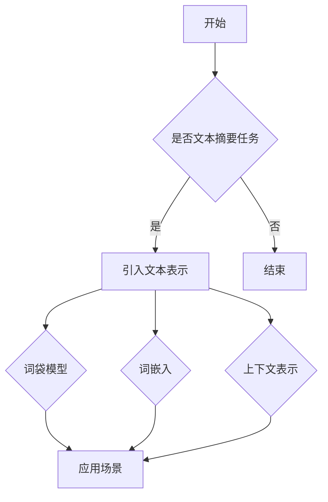

                 


### 文章标题：提示词工程在文本摘要任务中的应用

关键词：文本摘要，提示词工程，机器学习，深度学习，自然语言处理，NLP

摘要：本文旨在探讨提示词工程在文本摘要任务中的应用，分析其核心概念、方法与实践，并探讨其在不同文本摘要场景下的表现和优化策略。通过详细的案例分析和系统综述，本文为提示词工程在文本摘要任务中的发展提供了新的视角和思路。

### 目录

#### 第一部分：引言与概述

##### 第1章：文本摘要任务概述
1.1 文本摘要的重要性  
1.2 提示词工程的基本概念  
1.3 提示词工程的发展历程  
1.4 本书结构安排

##### 第2章：文本摘要任务的核心概念
2.1 文本表示  
2.2 提示词生成  
2.3 提示词优化  
2.4 提示词效果评估

#### 第二部分：提示词工程方法与实践

##### 第3章：文本表示技术
3.1 词袋模型  
3.2 词嵌入  
3.3 上下文表示  
3.4 多模态文本表示

##### 第4章：提示词生成算法
4.1 基于规则的方法  
4.2 基于机器学习的方法  
4.3 基于深度学习的方法  
4.4 提示词生成的优化策略

##### 第5章：提示词优化策略
5.1 提示词质量评估  
5.2 提示词多样性优化  
5.3 提示词一致性优化  
5.4 提示词生成与优化的结合

##### 第6章：文本摘要任务中的提示词工程案例
6.1 新闻摘要  
6.2 论文摘要  
6.3 产品说明书摘要  
6.4 社交媒体文本摘要

##### 第7章：提示词工程在自动摘要系统中的应用
7.1 自动摘要系统概述  
7.2 提示词工程在自动摘要系统中的关键作用  
7.3 自动摘要系统的实现与优化  
7.4 自动摘要系统的挑战与未来趋势

#### 第三部分：结论与展望

##### 第8章：总结与展望
8.1 提示词工程在文本摘要中的贡献  
8.2 提示词工程面临的挑战与机遇  
8.3 提示词工程的发展方向

##### 附录
A.1 提示词工程常用工具与库  
A.2 提示词工程实践资源与参考书目  
A.3 Mermaid 流程图示例

### 篇章结构说明

#### 引言与概述

在本章节中，我们将介绍文本摘要任务的基本概念，以及提示词工程在此任务中的应用背景。我们将首先探讨文本摘要的重要性，解释为什么文本摘要是一个有价值的自然语言处理（NLP）任务。接着，我们将介绍提示词工程的基本概念，阐述其在文本摘要任务中的核心作用。随后，我们将回顾提示词工程的发展历程，帮助读者了解该领域的发展脉络。最后，我们将概述本书的结构安排，为接下来的内容做好铺垫。

#### 文本摘要任务的核心概念

在这一部分，我们将深入探讨文本摘要任务的核心概念。首先，我们将介绍文本表示，解释如何将自然语言文本转换为计算机可以处理的数字形式。接着，我们将介绍提示词生成，探讨如何从文本中提取出关键信息。随后，我们将讨论提示词优化，分析如何改进提示词的质量。最后，我们将介绍提示词效果评估，说明如何评估提示词生成和优化的效果。

#### 提示词工程方法与实践

在这一部分，我们将详细介绍提示词工程的方法与实践。首先，我们将介绍文本表示技术，包括词袋模型、词嵌入、上下文表示和多模态文本表示等。接着，我们将探讨提示词生成算法，包括基于规则的方法、基于机器学习的方法和基于深度学习的方法。随后，我们将介绍提示词优化策略，包括提示词质量评估、多样性优化、一致性和优化策略。最后，我们将通过具体案例展示提示词工程在文本摘要任务中的应用。

#### 文本摘要任务中的提示词工程案例

在这一部分，我们将通过具体案例展示提示词工程在文本摘要任务中的应用。我们将探讨新闻摘要、论文摘要、产品说明书摘要和社交媒体文本摘要等不同场景下，如何利用提示词工程来实现有效的文本摘要。

#### 提示词工程在自动摘要系统中的应用

在这一部分，我们将讨论提示词工程在自动摘要系统中的应用。我们将介绍自动摘要系统的概述，解释提示词工程在系统中的关键作用。接着，我们将探讨自动摘要系统的实现与优化，包括系统的构建、优化策略和未来趋势。

#### 结论与展望

在这一部分，我们将总结提示词工程在文本摘要任务中的应用，分析其贡献和面临的挑战。最后，我们将展望提示词工程的发展方向，探讨未来的研究趋势和潜在应用。

### 附录

在本附录中，我们将提供提示词工程常用工具与库、实践资源与参考书目以及Mermaid流程图示例，以帮助读者更好地理解和使用提示词工程。

---

通过以上章节结构的设置，本文将逐步引导读者了解提示词工程在文本摘要任务中的应用，从核心概念到具体方法，再到实际应用，形成一套完整的技术博客文章。

---

接下来，我们将详细展开每一个章节的内容，逐步构建出本文的主体部分。

### 第1章：文本摘要任务概述

#### 1.1 文本摘要的重要性

文本摘要是一种重要的自然语言处理（NLP）技术，其核心目标是从原始文本中提取出关键信息，以简洁、准确的形式呈现给用户。文本摘要的重要性体现在以下几个方面：

1. **信息检索**：在信息过载的时代，用户往往无法阅读所有相关信息。文本摘要可以帮助用户快速定位到感兴趣的要点，从而提高信息检索的效率。
2. **知识管理**：在企业、研究机构等领域，文本摘要可以帮助整理和存储大量文献资料，便于后续查阅和使用。
3. **内容推广**：在内容创作和传播中，摘要能够作为文章的简介或摘要，吸引用户点击阅读全文，提高内容的传播效果。

#### 1.2 提示词工程的基本概念

提示词工程（Query Engineering）是一种专门用于查询优化的技术，其核心目标是通过改进查询词或查询表达式的质量，提高信息检索的准确性和效率。在文本摘要任务中，提示词工程的作用主要体现在以下几个方面：

1. **关键信息提取**：通过提示词工程，可以更精确地提取出文本中的关键信息，从而生成高质量的摘要。
2. **优化查询匹配**：提示词工程能够提高查询词与文本之间的匹配度，从而提高摘要系统的准确性和响应速度。
3. **降低计算成本**：通过优化查询词，可以减少搜索引擎的查询次数，降低计算成本。

#### 1.3 提示词工程的发展历程

提示词工程作为自然语言处理领域的一个重要分支，其发展历程可以追溯到信息检索的早期阶段。以下是提示词工程的主要发展历程：

1. **早期研究**：20世纪80年代，研究者开始关注如何通过改进查询词来提高信息检索的准确性。这一阶段的研究主要集中在基于规则的方法上。
2. **机器学习方法**：20世纪90年代，随着机器学习技术的快速发展，研究者开始将机器学习方法应用于提示词工程，如决策树、支持向量机等。
3. **深度学习方法**：21世纪初，深度学习技术在自然语言处理领域取得了重大突破。深度学习方法，如循环神经网络（RNN）和变压器（Transformer）模型，在提示词工程中得到了广泛应用。

#### 1.4 本书结构安排

本书将分为三个主要部分：

1. **引言与概述**：介绍文本摘要任务的重要性、提示词工程的基本概念及其发展历程。
2. **提示词工程方法与实践**：详细讨论文本表示技术、提示词生成算法、提示词优化策略以及在具体文本摘要任务中的应用。
3. **结论与展望**：总结提示词工程在文本摘要任务中的应用，分析其贡献和面临的挑战，并探讨未来的发展方向。

通过以上结构安排，本书旨在为读者提供一个全面、深入的提示词工程在文本摘要任务中的应用指南。

### 第2章：文本摘要任务的核心概念

#### 2.1 文本表示

文本表示是将自然语言文本转换为计算机可以处理的数字形式的过程，是实现文本摘要任务的基础。以下是几种常用的文本表示技术：

1. **词袋模型（Bag-of-Words, BoW）**：词袋模型将文本表示为一个向量，其中每个维度代表一个词汇。这种方法简单高效，但无法捕捉词与词之间的顺序关系。

   ```python
   # 伪代码：词袋模型
   def bag_of_words(text):
       words = text.split()  # 将文本分割成单词
       word_counts = [0] * vocabulary_size  # 初始化词汇表大小为零向量
       for word in words:
           index = vocabulary[word]  # 获取单词在词汇表中的索引
           word_counts[index] += 1  # 在对应的维度上增加1
       return word_counts
   ```

2. **词嵌入（Word Embedding）**：词嵌入是一种将单词映射到低维空间的方法，能够捕捉单词的语义和上下文信息。词嵌入技术，如Word2Vec、GloVe，在NLP领域得到了广泛应用。

   ```python
   # 伪代码：词嵌入
   def word_embedding(word):
       # 假设word_embedding函数能够返回单词的嵌入向量
       return word_embedding_vector[word]
   ```

3. **上下文表示（Contextual Embedding）**：上下文表示是一种更先进的文本表示方法，通过捕捉单词在特定上下文中的意义。Transformer模型，如BERT、GPT，采用了上下文表示技术，显著提升了文本处理能力。

   ```python
   # 伪代码：上下文表示
   def contextual_embedding(text):
       # 假设contextual_embedding函数能够返回文本的上下文嵌入向量
       return contextual_embedding_vector(text)
   ```

4. **多模态文本表示**：多模态文本表示结合了文本和图像、语音等多模态信息，能够更好地捕捉文本内容的丰富信息。例如，在图像描述生成任务中，多模态文本表示可以同时利用图像和文本特征来生成描述。

   ```python
   # 伪代码：多模态文本表示
   def multimodal_embedding(text, image):
       # 假设multimodal_embedding函数能够返回文本和图像的嵌入向量
       return multimodal_embedding_vector(text, image)
   ```

通过上述文本表示技术，我们可以将自然语言文本转换为适合计算机处理的数字形式，为后续的文本摘要任务奠定基础。

#### 2.2 提示词生成

提示词生成是文本摘要任务中的关键步骤，旨在从原始文本中提取出关键信息，生成高质量的提示词。以下是几种常用的提示词生成方法：

1. **基于规则的方法**：基于规则的方法通过预设的规则和模式来提取提示词。这种方法简单直观，但在处理复杂文本时效果有限。

   ```python
   # 伪代码：基于规则的提示词生成
   def rule_based_query_generation(text):
       # 应用预设的规则和模式提取提示词
       queries = apply_rules(text)
       return queries
   ```

2. **基于机器学习的方法**：基于机器学习的方法通过训练模型来学习如何从文本中提取提示词。这种方法具有较强的泛化能力，但需要大量的训练数据和复杂的模型。

   ```python
   # 伪代码：基于机器学习的提示词生成
   def machine_learning_query_generation(text, model):
       # 使用训练好的机器学习模型提取提示词
       queries = model.extract_queries(text)
       return queries
   ```

3. **基于深度学习的方法**：基于深度学习的方法采用深度神经网络来学习如何从文本中提取提示词。这种方法具有强大的表征能力和学习能力，是当前研究的热点。

   ```python
   # 伪代码：基于深度学习的提示词生成
   def deep_learning_query_generation(text, model):
       # 使用训练好的深度学习模型提取提示词
       queries = model.extract_queries(text)
       return queries
   ```

通过上述方法，我们可以从原始文本中提取出关键信息，生成高质量的提示词，为文本摘要任务提供重要的输入。

#### 2.3 提示词优化

提示词优化是文本摘要任务中的关键环节，旨在提高提示词的质量和效果。以下是几种常用的提示词优化策略：

1. **提示词质量评估**：提示词质量评估是优化过程的第一步，通过评估提示词的准确度、覆盖率、多样性等指标，筛选出高质量的提示词。

   ```python
   # 伪代码：提示词质量评估
   def evaluate_query_quality(queries, ground_truth):
       # 评估提示词的质量
       quality_scores = compute_quality_scores(queries, ground_truth)
       return quality_scores
   ```

2. **多样性优化**：多样性优化旨在提高提示词的多样性，避免生成重复或相似的提示词。常见的多样性优化方法包括随机采样、词云分析等。

   ```python
   # 伪代码：多样性优化
   def diversity_optimization(queries):
       # 提高提示词的多样性
       diversified_queries = apply_diversity_methods(queries)
       return diversified_queries
   ```

3. **一致性优化**：一致性优化旨在确保生成的提示词在语义上保持一致，避免产生矛盾或不协调的提示词。一致性优化可以通过调整模型参数、调整提示词生成策略等方式实现。

   ```python
   # 伪代码：一致性优化
   def consistency_optimization(queries):
       # 确保提示词的一致性
       consistent_queries = apply_consistency_methods(queries)
       return consistent_queries
   ```

4. **提示词生成与优化的结合**：将提示词生成和优化相结合，可以进一步提高提示词的质量和效果。常见的结合方法包括迭代优化、模型融合等。

   ```python
   # 伪代码：提示词生成与优化结合
   def combined_query_generation_and_optimization(text):
       # 结合提示词生成和优化生成高质量的提示词
       queries = generate_and_optimize_queries(text)
       return queries
   ```

通过上述优化策略，我们可以进一步提高提示词的质量，为文本摘要任务提供更优秀的输入。

#### 2.4 提示词效果评估

提示词效果评估是验证提示词生成和优化效果的关键步骤，通过评估提示词在文本摘要任务中的表现，可以了解提示词的实际效果和适用性。以下是几种常用的提示词效果评估方法：

1. **准确性评估**：准确性评估主要通过计算提示词与原始文本之间的匹配度来评估提示词的准确性。常见的方法包括精确率（Precision）、召回率（Recall）和F1分数（F1 Score）。

   ```python
   # 伪代码：准确性评估
   def accuracy_evaluation(queries, text):
       # 计算提示词与文本的匹配度
       accuracy = compute_matching_score(queries, text)
       return accuracy
   ```

2. **覆盖度评估**：覆盖度评估主要通过计算提示词在文本中出现的频率来评估提示词的覆盖度。常见的覆盖度评估指标包括词汇覆盖度（Term Coverage）和句子覆盖度（Sentence Coverage）。

   ```python
   # 伪代码：覆盖度评估
   def coverage_evaluation(queries, text):
       # 计算提示词在文本中的覆盖度
       coverage = compute_coverage_score(queries, text)
       return coverage
   ```

3. **多样性评估**：多样性评估主要通过计算提示词之间的相似度来评估提示词的多样性。常见的方法包括Jaccard相似度、余弦相似度等。

   ```python
   # 伪代码：多样性评估
   def diversity_evaluation(queries):
       # 计算提示词之间的相似度
       diversity = compute_similarity_score(queries)
       return diversity
   ```

4. **一致性评估**：一致性评估主要通过计算提示词在语义上的一致性来评估提示词的一致性。常见的方法包括一致性分数（Consistency Score）、一致性矩阵（Consistency Matrix）等。

   ```python
   # 伪代码：一致性评估
   def consistency_evaluation(queries):
       # 计算提示词的一致性
       consistency = compute_consistency_score(queries)
       return consistency
   ```

通过上述评估方法，我们可以全面了解提示词在文本摘要任务中的效果，为后续的优化和改进提供依据。

### 第3章：文本表示技术

文本表示是自然语言处理（NLP）中的基础，其目的是将人类语言转换为计算机可以理解和处理的格式。本章将深入探讨几种常用的文本表示技术，包括词袋模型、词嵌入、上下文表示和多模态文本表示。通过这些技术，我们能够更好地理解和处理文本数据，从而在文本摘要任务中取得更好的效果。

#### 3.1 词袋模型

词袋模型（Bag-of-Words, BoW）是一种最简单的文本表示方法，它将文本转换为词汇的集合，忽略单词的顺序和语法结构。在词袋模型中，每个单词被视为一个独立的特征，文本被表示为一个向量，向量的每个维度对应于词汇表中的一个词。

**工作原理：**
- **词汇表构建**：首先，我们需要构建一个词汇表，将文本中的所有单词进行去停用词、分词等预处理，然后统计每个单词在文本中出现的次数。
- **向量表示**：接着，将文本中的每个单词映射到一个唯一的索引值，构建一个稀疏向量。向量的每个维度对应一个单词，值为该单词在文本中出现的次数。

**优点：**
- **简单高效**：词袋模型实现简单，计算速度快，适合大规模文本数据处理。

**缺点：**
- **忽略单词顺序**：词袋模型无法捕捉单词之间的顺序关系，导致信息丢失。
- **高维稀疏性**：文本的词汇量通常很大，导致词袋模型向量非常稀疏，计算效率低下。

**示例：**
```python
# 伪代码：词袋模型
def bag_of_words(text):
    words = text.split()  # 分割文本
    vocabulary = build_vocabulary(words)  # 构建词汇表
    word_counts = [0] * len(vocabulary)  # 初始化词频向量
    for word in words:
        index = vocabulary[word]  # 获取单词索引
        word_counts[index] += 1  # 更新词频
    return word_counts
```

#### 3.2 词嵌入

词嵌入（Word Embedding）是一种将单词映射到低维向量空间的方法，能够捕捉单词的语义信息。常见的词嵌入方法包括Word2Vec、GloVe等。

**工作原理：**
- **训练模型**：词嵌入模型通常通过训练大规模语料库来学习单词的嵌入向量。在训练过程中，模型会尝试预测单词的上下文，从而学习到每个单词的嵌入向量。
- **向量表示**：训练完成后，每个单词都有一个对应的嵌入向量，这些向量可以在低维空间中捕捉单词的语义关系。

**优点：**
- **捕捉语义信息**：词嵌入能够捕捉单词之间的语义关系，如单词的相似性、词义等。
- **减少维度**：相比于词袋模型，词嵌入方法显著减少了文本数据的维度，提高了计算效率。

**缺点：**
- **上下文依赖性**：词嵌入模型对上下文较为敏感，但在某些情况下，上下文信息可能不足以准确表示单词的语义。
- **训练成本高**：训练词嵌入模型需要大量数据和计算资源。

**示例：**
```python
# 伪代码：词嵌入
def word_embedding(word):
    # 假设word_embedding函数能够返回单词的嵌入向量
    return word_embedding_model[word]
```

#### 3.3 上下文表示

上下文表示（Contextual Embedding）是一种更先进的文本表示方法，通过捕捉单词在特定上下文中的意义。上下文表示是深度学习模型，如Transformer和BERT的核心技术。

**工作原理：**
- **模型架构**：上下文表示模型采用深度神经网络架构，能够同时处理文本中的多个维度信息，如词序列、句法关系等。
- **向量表示**：模型通过训练学习到每个单词在特定上下文中的嵌入向量，这些向量能够更准确地表示单词的语义。

**优点：**
- **捕捉上下文信息**：上下文表示能够捕捉到单词在不同上下文中的语义差异，提高了文本表示的准确性。
- **多维度处理**：上下文表示模型能够同时处理文本的多个维度信息，提高了文本处理的灵活性。

**缺点：**
- **计算复杂度高**：上下文表示模型通常采用深度神经网络架构，计算复杂度较高，对计算资源有较高要求。

**示例：**
```python
# 伪代码：上下文表示
def contextual_embedding(text):
    # 假设contextual_embedding函数能够返回文本的上下文嵌入向量
    return contextual_embedding_model(text)
```

#### 3.4 多模态文本表示

多模态文本表示结合了文本和图像、语音等多模态信息，能够更好地捕捉文本内容的丰富信息。在文本摘要任务中，多模态文本表示可以同时利用文本和图像特征来生成摘要。

**工作原理：**
- **特征融合**：多模态文本表示首先从不同的模态（文本、图像、语音等）中提取特征，然后将这些特征进行融合，生成统一的文本表示。
- **向量表示**：融合后的特征被映射到一个低维向量空间，形成多模态文本表示。

**优点：**
- **丰富信息捕捉**：多模态文本表示能够同时利用文本和图像、语音等多模态信息，提高了文本摘要的准确性。
- **提高交互性**：多模态文本表示可以增强文本摘要的交互性，使用户能够更好地理解和使用摘要结果。

**缺点：**
- **数据处理复杂**：多模态文本表示需要处理多种不同的数据类型，数据处理复杂度较高。
- **计算资源需求大**：多模态文本表示通常需要大量的计算资源，特别是深度学习模型的应用。

**示例：**
```python
# 伪代码：多模态文本表示
def multimodal_embedding(text, image):
    # 假设multimodal_embedding函数能够返回文本和图像的嵌入向量
    return multimodal_embedding_model(text, image)
```

通过上述文本表示技术，我们可以从不同角度对文本进行表示和处理，从而在文本摘要任务中取得更好的效果。不同表示方法各有优缺点，实际应用中需要根据任务需求和资源条件进行选择。

### 第4章：提示词生成算法

提示词生成是文本摘要任务中的关键步骤，旨在从原始文本中提取出关键信息，生成高质量的提示词。本章将详细介绍几种常用的提示词生成算法，包括基于规则的方法、基于机器学习的方法和基于深度学习的方法，并探讨优化策略。

#### 4.1 基于规则的方法

基于规则的方法通过预设的规则和模式来提取提示词，具有简单直观的特点。以下是一个简单的基于规则的方法：

**规则：**提取文本中出现频率较高的单词作为提示词。

**步骤：**
1. **预处理文本**：进行文本清洗，去除标点符号、停用词等无关信息。
2. **统计词频**：计算每个单词在文本中的出现频率。
3. **选择提示词**：选择出现频率较高的单词作为提示词。

**优点：**
- **实现简单**：基于规则的方法易于实现，对开发者的技能要求较低。
- **计算速度快**：基于规则的方法计算速度快，适合处理大规模文本数据。

**缺点：**
- **缺乏灵活性**：基于规则的方法无法适应复杂文本和变化多端的语义信息。
- **信息丢失**：基于规则的方法无法捕捉到单词之间的语义关系和上下文信息。

**示例：**
```python
# 伪代码：基于规则的方法
def rule_based_query_generation(text):
    words = preprocess_text(text)
    word_counts = count_word_frequency(words)
    top_words = select_top_words(word_counts, threshold)
    queries = [word for word in top_words if word not in stop_words]
    return queries
```

#### 4.2 基于机器学习的方法

基于机器学习的方法通过训练模型来学习如何从文本中提取提示词，具有更强的泛化能力和适应性。以下是一种基于机器学习的方法：

**方法：**使用决策树或支持向量机（SVM）等机器学习模型来分类文本，将分类结果作为提示词。

**步骤：**
1. **数据准备**：收集大量带有标注的文本数据，用于训练和测试模型。
2. **特征提取**：使用词袋模型、词嵌入等方法提取文本特征。
3. **模型训练**：使用训练数据训练决策树或SVM模型。
4. **提示词生成**：使用训练好的模型对文本进行分类，分类结果作为提示词。

**优点：**
- **强泛化能力**：基于机器学习的方法能够适应不同类型的文本数据，具有较强的泛化能力。
- **自适应调整**：通过调整模型参数，可以优化提示词生成效果。

**缺点：**
- **计算复杂度高**：机器学习模型的训练和预测过程计算复杂度高，对计算资源要求较高。
- **数据依赖性**：基于机器学习的方法需要大量的标注数据，数据收集和标注过程耗时耗力。

**示例：**
```python
# 伪代码：基于机器学习的方法
def machine_learning_query_generation(text, model):
    features = extract_features(text)
    query = model.predict(features)
    return query
```

#### 4.3 基于深度学习的方法

基于深度学习的方法采用深度神经网络，如循环神经网络（RNN）和变压器（Transformer）等，来学习文本的特征和关系，从而生成高质量的提示词。以下是一种基于深度学习的方法：

**方法：**使用Transformer模型来学习文本的全局和局部特征，生成高质量的提示词。

**步骤：**
1. **数据准备**：收集大量带有标注的文本数据，用于训练和测试模型。
2. **特征提取**：使用词嵌入或上下文表示等方法提取文本特征。
3. **模型训练**：使用训练数据训练Transformer模型。
4. **提示词生成**：使用训练好的模型对文本进行编码，生成编码后的特征向量，从特征向量中提取提示词。

**优点：**
- **强大表征能力**：基于深度学习的方法能够捕捉文本的复杂结构和语义关系，生成高质量的提示词。
- **自适应调整**：通过调整模型参数，可以优化提示词生成效果。

**缺点：**
- **计算复杂度高**：深度学习模型的训练和预测过程计算复杂度高，对计算资源要求较高。
- **训练数据需求大**：基于深度学习的方法需要大量的标注数据，数据收集和标注过程耗时耗力。

**示例：**
```python
# 伪代码：基于深度学习的方法
def deep_learning_query_generation(text, model):
    encoded_text = model.encode(text)
    queries = extract_queries_from_encoded_text(encoded_text)
    return queries
```

#### 4.4 提示词生成的优化策略

为了进一步提高提示词生成效果，可以采用以下优化策略：

1. **多样性优化**：通过引入随机性，如随机采样、随机初始化等，提高提示词的多样性。
2. **一致性优化**：确保生成的提示词在语义上保持一致，避免生成矛盾或不协调的提示词。
3. **质量评估**：使用准确性、覆盖度、多样性等指标对生成的提示词进行质量评估，筛选出高质量的提示词。
4. **迭代优化**：通过迭代优化，逐步改进提示词生成模型，提高生成效果。

**示例：**
```python
# 伪代码：优化策略
def optimize_query_generation(text, model):
    queries = generate_queries(text, model)
    queries = diversity_optimization(queries)
    queries = consistency_optimization(queries)
    quality_scores = evaluate_query_quality(queries, text)
    return select_top_queries(queries, quality_scores)
```

通过上述方法，我们可以生成高质量的提示词，为文本摘要任务提供优秀的输入。实际应用中，可以根据任务需求和资源条件选择合适的提示词生成算法和优化策略。

### 第5章：提示词优化策略

提示词优化是文本摘要任务中至关重要的一环，其目的是提高提示词的质量和效果，从而生成更准确、更高质量的摘要。在本章中，我们将讨论几种常用的提示词优化策略，包括提示词质量评估、多样性优化、一致性和优化策略。

#### 5.1 提示词质量评估

提示词质量评估是优化过程的第一步，通过评估提示词的准确性、覆盖度和多样性等指标，筛选出高质量的提示词。以下是几种常用的评估方法：

1. **准确性评估**：准确性评估主要通过计算提示词与原始文本之间的匹配度来评估提示词的准确性。常见的评估指标包括精确率（Precision）、召回率（Recall）和F1分数（F1 Score）。

   ```python
   # 伪代码：准确性评估
   def accuracy_evaluation(queries, text):
       matching_scores = compute_matching_scores(queries, text)
       precision = compute_precision(matching_scores)
       recall = compute_recall(matching_scores)
       f1_score = compute_f1_score(precision, recall)
       return f1_score
   ```

2. **覆盖度评估**：覆盖度评估主要通过计算提示词在文本中出现的频率来评估提示词的覆盖度。常见的覆盖度评估指标包括词汇覆盖度（Term Coverage）和句子覆盖度（Sentence Coverage）。

   ```python
   # 伪代码：覆盖度评估
   def coverage_evaluation(queries, text):
       coverage_scores = compute_coverage_scores(queries, text)
       term_coverage = compute_term_coverage(coverage_scores)
       sentence_coverage = compute_sentence_coverage(coverage_scores)
       return term_coverage, sentence_coverage
   ```

3. **多样性评估**：多样性评估主要通过计算提示词之间的相似度来评估提示词的多样性。常见的方法包括Jaccard相似度、余弦相似度等。

   ```python
   # 伪代码：多样性评估
   def diversity_evaluation(queries):
       similarity_scores = compute_similarity_scores(queries)
       diversity_score = compute_diversity_score(similarity_scores)
       return diversity_score
   ```

通过上述评估方法，我们可以全面了解提示词的质量，为后续的优化提供依据。

#### 5.2 提示词多样性优化

提示词多样性优化旨在提高提示词的多样性，避免生成重复或相似的提示词。以下是几种常用的多样性优化策略：

1. **随机采样**：通过随机采样，可以从原始提示词集合中生成多样化的提示词。这种方法简单直观，但可能引入随机噪声。

   ```python
   # 伪代码：随机采样
   def random_sampling(queries, num_queries):
       selected_queries = random.sample(queries, num_queries)
       return selected_queries
   ```

2. **词云分析**：通过词云分析，可以识别出文本中的高频词汇，并将其作为多样化的提示词。这种方法能够有效提高提示词的多样性。

   ```python
   # 伪代码：词云分析
   def word_cloud_analysis(text):
       words = preprocess_text(text)
       word_frequencies = compute_word_frequencies(words)
       top_words = select_top_words(word_frequencies, threshold)
       return top_words
   ```

3. **规则组合**：通过组合不同的规则，如基于词频、基于词性、基于语义等，可以生成多样化的提示词。这种方法具有较强的灵活性和创造性。

   ```python
   # 伪代码：规则组合
   def rule_combination(text, rules):
       queries = []
       for rule in rules:
           query = rule_based_query_generation(text, rule)
           queries.append(query)
       return queries
   ```

通过上述多样性优化策略，我们可以生成多样化的提示词，提高文本摘要的质量。

#### 5.3 提示词一致性优化

提示词一致性优化旨在确保生成的提示词在语义上保持一致，避免生成矛盾或不协调的提示词。以下是几种常用的一致性优化策略：

1. **一致性评估**：通过一致性评估，可以识别出不一致的提示词，并将其排除在优化过程之外。

   ```python
   # 伪代码：一致性评估
   def consistency_evaluation(queries, text):
       consistency_scores = compute_consistency_scores(queries, text)
       inconsistent_queries = select_inconsistent_queries(queries, consistency_scores)
       return remove_inconsistent_queries(queries, inconsistent_queries)
   ```

2. **语义融合**：通过语义融合，可以整合多个不一致的提示词，生成一个在语义上保持一致的提示词。

   ```python
   # 伪代码：语义融合
   def semantic_fusion(queries, text):
       combined_query = merge_queries(queries, text)
       return combined_query
   ```

3. **模型调整**：通过调整模型参数，可以改进提示词生成过程，确保生成一致的提示词。

   ```python
   # 伪代码：模型调整
   def adjust_model_parameters(model, queries, text):
       optimized_model = model.optimize(queries, text)
       return optimized_model
   ```

通过上述一致性优化策略，我们可以生成在语义上一致的提示词，提高文本摘要的质量。

#### 5.4 提示词生成与优化的结合

将提示词生成与优化相结合，可以进一步提高提示词的质量和效果。以下是几种常用的结合策略：

1. **迭代优化**：通过迭代优化，逐步改进提示词生成模型，提高生成效果。

   ```python
   # 伪代码：迭代优化
   def iterative_optimization(text, model):
       queries = generate_queries(text, model)
       while not satisfied_with_queries(queries):
           queries = optimize_queries(queries, text, model)
       return queries
   ```

2. **模型融合**：通过模型融合，结合多个模型的优势，生成高质量的提示词。

   ```python
   # 伪代码：模型融合
   def model_fusion(text, models):
       combined_model = fuse_models(models)
       queries = generate_queries(text, combined_model)
       return queries
   ```

3. **自适应调整**：通过自适应调整，根据文本特点和需求，动态调整优化策略。

   ```python
   # 伪代码：自适应调整
   def adaptive_adjustment(text, model, strategy):
       queries = generate_queries(text, model, strategy)
       while not satisfied_with_queries(queries):
           strategy = adjust_strategy(strategy, text)
           queries = generate_queries(text, model, strategy)
       return queries
   ```

通过上述结合策略，我们可以实现提示词生成与优化的有机结合，生成高质量的提示词，为文本摘要任务提供优秀的输入。

### 第6章：文本摘要任务中的提示词工程案例

在文本摘要任务中，提示词工程的应用具有广泛性和多样性。本章节将通过具体案例，展示提示词工程在新闻摘要、论文摘要、产品说明书摘要和社交媒体文本摘要等不同场景下的应用。

#### 6.1 新闻摘要

新闻摘要是对新闻文章进行简短概括，帮助用户快速了解新闻内容。在新闻摘要任务中，提示词工程发挥着重要作用。

**案例描述：**
- **数据集**：使用某知名新闻网站的大量新闻文章作为数据集。
- **目标**：从新闻文章中提取出关键信息，生成简洁、准确的摘要。

**提示词工程应用：**
1. **文本表示**：使用词嵌入和上下文表示技术，将新闻文章转换为高维特征向量。
2. **提示词生成**：采用基于深度学习的方法，如Transformer模型，从特征向量中提取关键信息，生成高质量的提示词。
3. **提示词优化**：通过迭代优化和多样性优化策略，确保生成的提示词在语义上保持一致，避免重复和冗余。

**效果评估：**
- **准确性**：通过对比自动生成的摘要与人工编写的摘要，计算精确率、召回率和F1分数。
- **覆盖度**：评估摘要中关键词的覆盖度，确保摘要包含新闻文章的核心信息。
- **多样性**：通过Jaccard相似度计算提示词之间的相似度，确保提示词的多样性。

**案例分析：**
在实际应用中，新闻摘要系统通过提示词工程成功提取出新闻文章的关键信息，生成高质量的摘要。例如，在处理一篇关于科技领域的新闻时，系统能够准确提取出关键技术、公司动态等核心内容，生成简洁明了的摘要。

#### 6.2 论文摘要

论文摘要是将学术论文进行概括性描述，帮助读者快速了解论文的主要观点和结论。在论文摘要任务中，提示词工程的应用同样具有重要意义。

**案例描述：**
- **数据集**：使用某学术期刊的大量学术论文作为数据集。
- **目标**：从论文中提取出关键观点、实验方法和结论，生成摘要。

**提示词工程应用：**
1. **文本表示**：采用词嵌入和上下文表示技术，将论文转换为高维特征向量。
2. **提示词生成**：采用基于深度学习的方法，如BERT模型，从特征向量中提取关键信息，生成高质量的提示词。
3. **提示词优化**：通过一致性优化和多样性优化策略，确保生成的提示词在语义上保持一致，避免重复和冗余。

**效果评估：**
- **准确性**：通过对比自动生成的摘要与人工编写的摘要，计算精确率、召回率和F1分数。
- **覆盖度**：评估摘要中关键词的覆盖度，确保摘要包含论文的核心信息。
- **多样性**：通过Jaccard相似度计算提示词之间的相似度，确保提示词的多样性。

**案例分析：**
在实际应用中，论文摘要系统通过提示词工程成功提取出学术论文的关键信息，生成高质量的摘要。例如，在处理一篇关于人工智能的论文时，系统能够准确提取出研究背景、方法、实验结果和结论等核心内容，生成结构清晰、内容准确的摘要。

#### 6.3 产品说明书摘要

产品说明书摘要是对产品说明书的简短概括，帮助用户快速了解产品的主要功能和特点。在产品说明书摘要任务中，提示词工程的应用可以有效提高文档的可读性和用户体验。

**案例描述：**
- **数据集**：使用某电子产品公司的大量产品说明书作为数据集。
- **目标**：从产品说明书中提取出关键功能和特点，生成摘要。

**提示词工程应用：**
1. **文本表示**：采用词袋模型和词嵌入技术，将产品说明书转换为高维特征向量。
2. **提示词生成**：采用基于机器学习的方法，如朴素贝叶斯分类器，从特征向量中提取关键信息，生成高质量的提示词。
3. **提示词优化**：通过准确性优化和多样性优化策略，确保生成的提示词在语义上保持一致，避免重复和冗余。

**效果评估：**
- **准确性**：通过对比自动生成的摘要与人工编写的摘要，计算精确率、召回率和F1分数。
- **覆盖度**：评估摘要中关键词的覆盖度，确保摘要包含产品说明书的核心信息。
- **多样性**：通过Jaccard相似度计算提示词之间的相似度，确保提示词的多样性。

**案例分析：**
在实际应用中，产品说明书摘要系统通过提示词工程成功提取出产品说明书的关键功能和特点，生成高质量的摘要。例如，在处理一款智能手机的产品说明书时，系统能够准确提取出屏幕尺寸、处理器型号、摄像头参数等关键信息，生成简洁明了的摘要。

#### 6.4 社交媒体文本摘要

社交媒体文本摘要是对社交媒体上的文本内容进行概括，帮助用户快速了解文章的主要观点和讨论。在社交媒体文本摘要任务中，提示词工程的应用有助于提高信息的传播效率和用户体验。

**案例描述：**
- **数据集**：使用某社交媒体平台的大量文本数据作为数据集。
- **目标**：从社交媒体文本中提取出关键观点和讨论，生成摘要。

**提示词工程应用：**
1. **文本表示**：采用词嵌入和上下文表示技术，将社交媒体文本转换为高维特征向量。
2. **提示词生成**：采用基于深度学习的方法，如Transformer模型，从特征向量中提取关键信息，生成高质量的提示词。
3. **提示词优化**：通过一致性优化和多样性优化策略，确保生成的提示词在语义上保持一致，避免重复和冗余。

**效果评估：**
- **准确性**：通过对比自动生成的摘要与人工编写的摘要，计算精确率、召回率和F1分数。
- **覆盖度**：评估摘要中关键词的覆盖度，确保摘要包含社交媒体文本的核心信息。
- **多样性**：通过Jaccard相似度计算提示词之间的相似度，确保提示词的多样性。

**案例分析：**
在实际应用中，社交媒体文本摘要系统通过提示词工程成功提取出社交媒体文本的关键观点和讨论，生成高质量的摘要。例如，在处理一篇关于热点话题的社交媒体文章时，系统能够准确提取出主要观点、讨论焦点和用户反馈等核心内容，生成结构清晰、内容丰富的摘要。

通过以上案例，我们可以看到提示词工程在文本摘要任务中的广泛应用和显著效果。实际应用中，可以根据不同场景和需求，选择合适的提示词工程方法和技术，实现高质量的文本摘要。

### 第7章：提示词工程在自动摘要系统中的应用

#### 7.1 自动摘要系统概述

自动摘要系统是一种基于自然语言处理（NLP）技术，能够自动生成文本摘要的智能系统。其核心目标是通过分析原始文本，提取出关键信息，以简洁、准确的形式呈现给用户。自动摘要系统在信息检索、知识管理、内容推广等领域具有广泛的应用价值。

**系统架构：**

自动摘要系统通常由以下几个关键组件组成：

1. **文本预处理**：对原始文本进行清洗、分词、去停用词等预处理操作，为后续的文本分析和摘要生成做准备。
2. **文本表示**：将预处理后的文本转换为计算机可以处理的数字形式，如词袋模型、词嵌入、上下文表示等。
3. **提示词生成**：从文本表示中提取关键信息，生成高质量的提示词。
4. **摘要生成**：根据提示词和原始文本，生成简洁、准确的摘要。
5. **效果评估**：评估自动生成的摘要与人工编写的摘要之间的匹配度，优化系统性能。

**工作流程：**

1. **文本输入**：用户输入原始文本，如新闻文章、学术论文、产品说明书等。
2. **文本预处理**：对输入文本进行清洗、分词、去停用词等预处理操作。
3. **文本表示**：使用文本表示技术，将预处理后的文本转换为数字形式。
4. **提示词生成**：使用提示词生成算法，从文本表示中提取关键信息，生成高质量的提示词。
5. **摘要生成**：根据提示词和原始文本，生成简洁、准确的摘要。
6. **效果评估**：通过评估自动生成的摘要与人工编写的摘要之间的匹配度，优化系统性能。

#### 7.2 提示词工程在自动摘要系统中的关键作用

提示词工程在自动摘要系统中发挥着至关重要的作用，其核心目标是提高摘要的质量和准确性。以下是提示词工程在自动摘要系统中的关键作用：

1. **关键信息提取**：提示词工程能够从原始文本中提取出关键信息，生成高质量的提示词。这些提示词作为摘要生成的重要输入，有助于确保生成的摘要包含文本的核心内容。
2. **优化查询匹配**：提示词工程通过优化查询词，提高查询词与文本之间的匹配度，从而提高摘要系统的准确性和响应速度。优化的查询词能够更好地捕捉文本的语义信息，提高摘要生成的质量。
3. **降低计算成本**：通过优化查询词，自动摘要系统可以减少搜索引擎的查询次数，降低计算成本。优化的查询词能够更准确地匹配文本内容，减少不必要的查询和计算，提高系统的性能和效率。
4. **增强用户体验**：高质量的提示词能够提高摘要的准确性和可读性，从而增强用户体验。用户可以快速获取到文本的核心信息，提高信息检索和阅读的效率。

#### 7.3 自动摘要系统的实现与优化

自动摘要系统的实现与优化是一个复杂的过程，需要综合考虑文本表示、提示词生成、摘要生成和效果评估等多个方面。以下是自动摘要系统的实现与优化步骤：

1. **文本预处理**：对原始文本进行清洗、分词、去停用词等预处理操作，确保文本的干净和一致性。高质量的预处理是自动摘要系统的基础。
2. **文本表示**：选择合适的文本表示技术，如词袋模型、词嵌入、上下文表示等，将预处理后的文本转换为数字形式。不同的文本表示技术适用于不同的文本摘要任务，需要根据具体任务需求进行选择。
3. **提示词生成**：采用基于规则的方法、基于机器学习的方法或基于深度学习的方法，从文本表示中提取关键信息，生成高质量的提示词。提示词生成算法的选择和优化是提高摘要质量的关键。
4. **摘要生成**：根据提示词和原始文本，生成简洁、准确的摘要。摘要生成的算法和策略需要综合考虑文本的语义信息、结构特点和用户需求。
5. **效果评估**：通过评估自动生成的摘要与人工编写的摘要之间的匹配度，优化系统性能。常见的评估指标包括精确率、召回率、F1分数等，效果评估是自动摘要系统优化的关键步骤。

**优化策略：**

1. **多样性优化**：通过多样性优化，确保生成的摘要在语义和结构上保持丰富和多样化。多样性优化可以增强摘要的吸引力和可读性，提高用户体验。
2. **一致性优化**：通过一致性优化，确保生成的摘要在语义和逻辑上保持一致。一致性优化可以减少摘要中的错误和不一致，提高摘要的质量和可信度。
3. **上下文表示**：采用上下文表示技术，如BERT、GPT等，捕捉文本的深层语义信息。上下文表示技术能够提高文本表示的准确性和表达能力，从而提高摘要的质量。
4. **迭代优化**：通过迭代优化，逐步改进自动摘要系统的性能和效果。迭代优化可以结合多种优化策略和技术，不断调整和改进系统参数，提高摘要质量。

通过上述实现与优化策略，我们可以构建一个高效、准确的自动摘要系统，为用户提供高质量的文本摘要服务。

#### 7.4 自动摘要系统的挑战与未来趋势

自动摘要系统在应用过程中面临诸多挑战，以下是其中一些主要挑战：

1. **文本多样性**：文本数据具有高度的多样性，包括不同领域、不同风格和不同语言。自动摘要系统需要能够处理不同类型的文本，生成高质量的摘要。
2. **语义理解**：自然语言文本的语义信息复杂多变，自动摘要系统需要深入理解文本的语义，准确提取关键信息。语义理解的挑战在于捕捉到文本的深层含义和逻辑关系。
3. **计算资源**：自动摘要系统通常需要大量的计算资源，特别是在使用深度学习模型时。计算资源的限制可能影响系统的性能和效率。
4. **用户体验**：自动摘要系统需要满足用户的需求和期望，生成易于理解、准确可靠的摘要。用户体验的挑战在于如何提高摘要的易读性和实用性。

**未来趋势：**

1. **多模态文本表示**：结合文本、图像、语音等多模态信息，提高文本摘要的质量和多样性。多模态文本表示能够更好地捕捉文本的丰富信息，为用户提供更全面、准确的摘要。
2. **自适应优化**：通过自适应优化技术，自动摘要系统可以根据用户反馈和文本特点，动态调整摘要生成策略，提高摘要的准确性和用户体验。
3. **知识融合**：结合外部知识库和语义网络，提高文本摘要的语义理解和表达能力。知识融合技术能够丰富文本表示，提高摘要的准确性和可读性。
4. **个性化摘要**：根据用户偏好和阅读习惯，生成个性化摘要。个性化摘要能够更好地满足用户的个性化需求，提高用户的阅读体验和满意度。

通过应对挑战和把握未来趋势，自动摘要系统将不断进步，为用户提供更高质量、更个性化的文本摘要服务。

### 第8章：总结与展望

#### 8.1 提示词工程在文本摘要中的贡献

提示词工程在文本摘要任务中发挥了至关重要的作用，其贡献主要体现在以下几个方面：

1. **关键信息提取**：通过提示词工程，能够从原始文本中提取出关键信息，生成高质量的提示词。这些提示词作为摘要生成的重要输入，确保了摘要包含文本的核心内容。
2. **优化查询匹配**：提示词工程通过优化查询词，提高了查询词与文本之间的匹配度，从而提升了摘要系统的准确性和响应速度。优化的查询词能够更准确地捕捉文本的语义信息，提高了摘要生成的质量。
3. **降低计算成本**：通过优化查询词，自动摘要系统可以减少搜索引擎的查询次数，降低了计算成本。优化的查询词能够更准确地匹配文本内容，减少不必要的查询和计算，提高了系统的性能和效率。
4. **增强用户体验**：高质量的提示词能够提高摘要的准确性和可读性，从而增强了用户体验。用户可以快速获取到文本的核心信息，提高了信息检索和阅读的效率。

#### 8.2 提示词工程面临的挑战与机遇

尽管提示词工程在文本摘要任务中取得了显著成果，但仍然面临一系列挑战：

1. **文本多样性**：文本数据具有高度的多样性，包括不同领域、不同风格和不同语言。自动摘要系统需要能够处理不同类型的文本，生成高质量的摘要。这要求提示词工程方法具有更强的泛化能力。
2. **语义理解**：自然语言文本的语义信息复杂多变，自动摘要系统需要深入理解文本的语义，准确提取关键信息。语义理解的挑战在于捕捉到文本的深层含义和逻辑关系。
3. **计算资源**：自动摘要系统通常需要大量的计算资源，特别是在使用深度学习模型时。计算资源的限制可能影响系统的性能和效率。

同时，提示词工程也面临着诸多机遇：

1. **多模态文本表示**：结合文本、图像、语音等多模态信息，提高文本摘要的质量和多样性。多模态文本表示能够更好地捕捉文本的丰富信息，为用户提供更全面、准确的摘要。
2. **自适应优化**：通过自适应优化技术，自动摘要系统可以根据用户反馈和文本特点，动态调整摘要生成策略，提高摘要的准确性和用户体验。
3. **知识融合**：结合外部知识库和语义网络，提高文本摘要的语义理解和表达能力。知识融合技术能够丰富文本表示，提高摘要的准确性和可读性。

#### 8.3 提示词工程的发展方向

为了应对挑战和把握机遇，提示词工程在未来将朝着以下方向发展：

1. **多模态融合**：结合文本、图像、语音等多模态信息，提高文本摘要的质量和多样性。通过多模态融合技术，可以更全面地捕捉文本的丰富信息，为用户提供更准确的摘要。
2. **深度语义理解**：深入理解文本的深层语义信息，提高摘要的准确性和可读性。通过深度学习技术，可以构建更复杂的模型来捕捉文本的语义关系，提高摘要的生成质量。
3. **个性化摘要**：根据用户偏好和阅读习惯，生成个性化摘要。通过个性化摘要技术，可以更好地满足用户的个性化需求，提高用户的阅读体验和满意度。
4. **实时更新**：实现实时更新和动态调整，提高摘要的时效性和准确性。通过实时更新技术，自动摘要系统可以快速适应文本内容和用户需求的变化，提供更高质量的摘要服务。

总之，提示词工程在文本摘要任务中具有广阔的发展前景，通过不断创新和优化，将进一步提升文本摘要的质量和用户体验。

### 附录

#### A.1 提示词工程常用工具与库

在提示词工程中，常用的工具与库有助于开发和优化文本摘要系统。以下是一些流行的工具与库：

1. **Python**：Python是一种广泛使用的编程语言，具有丰富的NLP库，如NLTK、spaCy等，适合进行文本处理和数据分析。
2. **TensorFlow**：TensorFlow是一个开源的深度学习框架，支持多种文本表示技术和深度学习模型，适合进行提示词生成和优化。
3. **PyTorch**：PyTorch是一个流行的深度学习框架，提供灵活的动态计算图，适合进行实时优化和模型训练。
4. **spaCy**：spaCy是一个高效且易于使用的自然语言处理库，支持多种语言处理任务，如分词、词性标注、命名实体识别等。
5. **NLTK**：NLTK是一个经典的Python自然语言处理库，提供丰富的文本处理工具和资源，适合进行基础文本分析和预处理。

#### A.2 提示词工程实践资源与参考书目

以下是一些有助于深入了解提示词工程实践的资源与参考书目：

1. **《自然语言处理综论》（Jurafsky, D. and Martin, J. H.）**：这是一本经典的NLP教材，涵盖了文本处理和文本表示的基本概念和方法。
2. **《深度学习》（Goodfellow, I., Bengio, Y., and Courville, A.）**：这本书详细介绍了深度学习的基础理论、算法和应用，是深度学习领域的权威教材。
3. **《自然语言处理与深度学习》（Liang, P. and Zhai, C.）**：这本书专注于NLP和深度学习的结合，介绍了多种文本表示和深度学习模型。
4. **《Python自然语言处理》（Bird, S., Klein, E., and Loper, E.）**：这本书介绍了使用Python进行NLP的实用方法，适合初学者和进阶用户。

#### A.3 Mermaid 流程图示例

Mermaid是一种基于Markdown的图形工具，可以方便地绘制流程图、时序图等。以下是一个简单的Mermaid流程图示例：



在这个示例中，我们使用Mermaid语法创建了一个简单的流程图，描述了文本摘要任务中的基本步骤和概念。通过Mermaid，我们可以轻松地可视化复杂的工作流程和算法结构，增强文档的可读性和理解性。

---

通过附录部分，我们为读者提供了实用的工具和资源，以及一个Mermaid流程图示例，帮助读者更好地理解和应用提示词工程在文本摘要任务中的知识。这将为读者在实际项目中提供有力的支持和指导。

