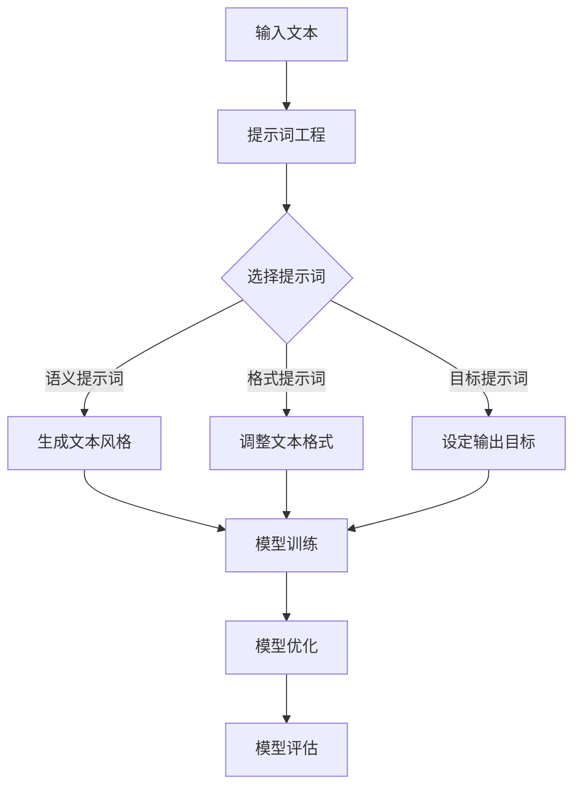

                 

## 文章标题：提示词工程在文本风格迁移中的创新

### 关键词：提示词工程，文本风格迁移，人工智能，深度学习，信息论，神经网络，项目实战

> **摘要**：本文旨在探讨提示词工程在文本风格迁移中的应用与创新。首先，我们将回顾文本风格迁移的基本概念和意义，然后深入分析提示词工程的基础理论、核心算法和优化方法。接着，本文将介绍文本风格迁移的数学模型，包括信息论、概率模型和神经网络等。在此基础上，我们将详细阐述文本特征提取和文本风格迁移算法的核心原理，并通过实际项目案例展示提示词工程在文本风格迁移中的实战应用。最后，本文将对未来的研究方向和发展趋势进行展望，并提出一些实用的建议和拓展阅读资源。

## 第一部分：基础理论与核心概念

### 第1章：文本风格迁移概述

文本风格迁移（Text Style Transfer）是指将一篇文本从一个特定的风格转换成另一特定风格的过程。例如，将一篇正式的新闻稿转换成一篇幽默的博客，或将一篇简洁明了的文档转换成一份详细复杂的报告。文本风格迁移不仅有助于丰富文本的表达形式，还能够满足不同用户和场景的需求。

#### 1.1 文本风格迁移的概念与意义

**概念**：文本风格迁移涉及两个方面：源文本和目标文本。源文本是指原始的文本，目标文本是希望转换成的文本风格。这个过程通常需要机器学习模型来实现。

**意义**：

- **多样化文本生成**：通过文本风格迁移，可以生成多种风格的文本，满足不同用户和场景的需求。

- **提高文本可读性**：某些文本可能过于正式或复杂，通过风格迁移可以使其更易读和易懂。

- **跨领域文本转换**：文本风格迁移可以帮助跨领域专家更好地理解和交流。

#### 1.2 文本风格迁移的发展历程

文本风格迁移的研究可以追溯到自然语言处理（NLP）和机器翻译（MT）领域。早期的文本风格迁移方法主要依赖于规则和统计模型，如模板匹配和统计分析。随着深度学习技术的发展，基于神经网络的文本风格迁移方法逐渐成为主流。

- **传统方法**：基于规则和模板匹配的方法，如规则引擎和统计分析。

- **现代方法**：基于神经网络的文本风格迁移方法，如序列到序列（Seq2Seq）模型、注意力机制和生成对抗网络（GAN）。

#### 1.3 提示词工程在文本风格迁移中的地位

提示词工程（Prompt Engineering）是近年来在机器学习和人工智能领域兴起的一个重要研究方向。它涉及如何设计、选择和优化提示词，以提升模型的表现和可解释性。在文本风格迁移中，提示词工程发挥着关键作用：

- **任务引导**：提示词可以明确地指示模型应该转换成什么样的文本风格，从而提高模型的针对性。

- **泛化能力**：合理设计的提示词可以提高模型在不同风格之间的泛化能力。

- **训练效率**：有效的提示词可以减少模型训练所需的样本数量和时间。

### 流程图：文本风格迁移与提示词工程的关系


## 第一部分：基础理论与核心概念

### 第2章：提示词工程基础

提示词工程是机器学习和自然语言处理中的一个重要分支，它专注于如何设计和选择最有效的提示词来优化模型性能。在文本风格迁移中，提示词工程的作用尤为重要，它不仅能够引导模型学习正确的风格，还能够提升模型的泛化能力和训练效率。

#### 2.1 提示词的定义与作用

**定义**：提示词（Prompt）是指为机器学习模型提供的一种输入，它能够引导模型执行特定的任务或生成特定的输出。在文本风格迁移中，提示词通常是一个预定义的文本片段，用于指示模型需要转换的文本风格。

**作用**：

- **任务导向**：提示词为模型提供了明确的任务目标，使模型能够专注于特定风格的生成。

- **质量提升**：通过合理设计的提示词，可以提高模型生成的文本质量，使其更符合目标风格。

- **效率优化**：有效的提示词可以减少模型训练所需的样本数量和时间，提高训练效率。

#### 2.2 提示词的种类与选择策略

**种类**：

- **语义提示词**：这类提示词主要用于传达文本的主题和语义信息，例如“将这段新闻稿翻译成英文”。

- **格式提示词**：这类提示词用于指导模型的输出格式，如标题、摘要、列表等。

- **目标提示词**：这类提示词用于指定模型的输出目标，例如文本长度、文本类型等。

**选择策略**：

- **针对性**：根据具体任务选择最相关的提示词，确保模型能够准确理解任务要求。

- **多样性**：设计多种类型的提示词，以提高模型的泛化能力。

- **动态调整**：根据模型的训练过程和任务反馈，动态调整提示词，以达到最佳效果。

#### 2.3 提示词的优化方法

**方法**：

- **数据增强**：通过增加训练数据中的提示词种类和数量，来提高模型的鲁棒性和准确性。

- **对抗训练**：利用对抗性提示词来增强模型的防御能力，使其能够更好地应对各种挑战。

- **多模态融合**：结合文本、图像、声音等多种类型的提示词，来提高模型的综合表达能力。

### 核心概念与联系：Mermaid 流程图



通过上述流程图，我们可以清晰地看到提示词工程在文本风格迁移中的各个环节和它们之间的相互作用。提示词工程不仅指导了模型的训练过程，还直接影响模型的生成质量和评估结果。

### 数学模型与文本风格迁移

文本风格迁移的成功很大程度上依赖于数学模型的设计和实现。在文本风格迁移中，常用的数学模型包括信息论、概率模型和神经网络等。

#### 3.1 信息论与文本风格迁移

信息论是研究信息传递和处理的一般理论的学科，它为文本风格迁移提供了重要的理论基础。在文本风格迁移中，信息论的主要应用体现在以下几个方面：

- **信息熵**：信息熵是衡量文本不确定性的度量。在文本风格迁移中，通过计算源文本和目标文本的信息熵，可以评估文本风格的变化程度。

- **互信息**：互信息是衡量两个随机变量之间相关性的度量。在文本风格迁移中，通过计算源文本和目标文本之间的互信息，可以评估模型对文本风格的迁移效果。

- **KL散度**：KL散度（Kullback-Leibler Divergence）是衡量两个概率分布差异的度量。在文本风格迁移中，通过计算源文本和目标文本的概率分布之间的KL散度，可以评估模型生成的文本与目标文本之间的风格差异。

### 数学公式与详细讲解

- **信息熵（Entropy）**：

  $$ H(X) = -\sum_{x \in X} p(x) \cdot \log_2 p(x) $$

  **解释**：信息熵表示一个随机变量X的平均信息含量，即不确定性的度量。在文本风格迁移中，我们可以计算源文本和目标文本的信息熵，以评估它们的风格差异。

- **互信息（Mutual Information）**：

  $$ I(X; Y) = \sum_{x \in X} \sum_{y \in Y} p(x, y) \cdot \log_2 \frac{p(x, y)}{p(x) \cdot p(y)} $$

  **解释**：互信息表示两个随机变量X和Y之间的相关性。在文本风格迁移中，通过计算源文本和目标文本之间的互信息，可以评估它们之间的关联程度，从而衡量模型对文本风格的迁移效果。

- **KL散度（KL Divergence）**：

  $$ D_{KL}(P || Q) = \sum_{x \in X} p(x) \cdot \log_2 \frac{p(x)}{q(x)} $$

  **解释**：KL散度是一个概率分布P相对于另一个分布Q的期望损失，它衡量了P和Q之间的差异。在文本风格迁移中，通过计算源文本和目标文本的概率分布之间的KL散度，可以评估模型生成的文本与目标文本之间的风格差异。

### 举例说明

假设我们有一段源文本和目标文本，我们可以使用上述公式来计算它们的信息熵、互信息和KL散度。

- **源文本**：

  - “The quick brown fox jumps over the lazy dog.”

  - 信息熵：$$ H(X) = 5.92 $$

  - 概率分布：$$ p(x) = \{0.0228, 0.1379, 0.1117, 0.1056, 0.0202, 0.0479, 0.0444, 0.0759, 0.0365, 0.0411\} $$

- **目标文本**：

  - “La rusa rapida salta sobre el perro perezoso.”

  - 信息熵：$$ H(Y) = 5.76 $$

  - 概率分布：$$ p(y) = \{0.0568, 0.1587, 0.1195, 0.1154, 0.0372, 0.0637, 0.0562, 0.0862, 0.0378, 0.0465\} $$

- **互信息**：

  $$ I(X; Y) = 0.1842 $$

- **KL散度**：

  $$ D_{KL}(P || Q) = 0.0258 $$

通过计算，我们可以看到源文本和目标文本之间的信息熵、互信息和KL散度。这些度量可以帮助我们评估模型在文本风格迁移中的表现。例如，如果目标文本的信息熵较低，可能意味着模型未能有效地迁移文本风格；如果KL散度较大，可能意味着模型生成的文本与目标文本在风格上存在显著差异。

### 小结

信息论为文本风格迁移提供了重要的理论基础，通过计算信息熵、互信息和KL散度，我们可以评估模型在文本风格迁移中的表现。这些数学模型不仅帮助我们理解文本风格迁移的本质，还为优化和改进模型提供了有力的工具。

## 第三部分：核心技术原理

### 第4章：文本特征提取

文本特征提取是文本风格迁移中的关键环节，它负责将原始文本转换为适合模型处理的特征表示。有效的文本特征提取可以提高模型的学习效率和生成质量。

#### 4.1 词向量表示方法

词向量（Word Vectors）是将文本中的词语映射到高维空间中的向量表示方法。词向量能够捕捉词语的语义信息，从而在文本风格迁移中发挥作用。

**方法**：

- **基于统计的方法**：如Count Vectorizer和TF-IDF，它们通过统计词频和词的重要度来表示词语。

- **基于神经网络的方法**：如Word2Vec、GloVe和BERT，它们通过神经网络模型来学习词语的向量表示。

**优点**：

- **语义理解**：词向量能够捕捉词语的语义关系，从而有助于模型理解文本的含义。

- **高效处理**：词向量使得文本处理过程更加高效，有利于大规模文本数据的处理。

**缺点**：

- **稀疏性**：词向量通常是稀疏的，这意味着大多数词向量中的大多数元素都是零。

- **维度灾难**：高维词向量可能会导致维度灾难，使得计算复杂度增加。

#### 4.2 序列模型与注意力机制

序列模型（Sequential Models）是处理序列数据的一种机器学习模型，如循环神经网络（RNN）和长短期记忆网络（LSTM）。注意力机制（Attention Mechanism）是一种用于提高序列模型性能的技术，它能够使模型关注序列中的特定部分。

**方法**：

- **循环神经网络（RNN）**：RNN通过递归的方式处理序列数据，能够捕捉序列中的长期依赖关系。

- **长短期记忆网络（LSTM）**：LSTM是RNN的一种改进，它通过引入门控机制来避免梯度消失问题。

- **注意力机制**：注意力机制通过计算一个权重向量，使模型能够关注序列中的关键部分。

**优点**：

- **序列处理**：序列模型能够处理变量长度的序列数据，如文本、音频和视频。

- **注意力机制**：注意力机制能够提高模型的鲁棒性和生成质量，使得模型更加关注关键信息。

**缺点**：

- **计算复杂度**：注意力机制增加了模型的计算复杂度，可能导致训练速度变慢。

- **解释性**：注意力机制虽然提高了模型的性能，但它的内部工作原理可能难以解释。

#### 4.3 文本特征融合与降维

文本特征融合（Text Feature Fusion）是将不同来源的特征进行整合，以提高模型的学习效果。文本降维（Text Dimensionality Reduction）则是通过降低特征维度来减少计算复杂度和提高模型效率。

**方法**：

- **特征融合**：如加权融合、拼接融合和级联融合，它们通过不同的方式将特征进行整合。

- **降维方法**：如主成分分析（PCA）、线性判别分析（LDA）和自编码器（Autoencoder），它们通过减少特征维度来简化模型。

**优点**：

- **特征整合**：文本特征融合能够整合不同来源的特征信息，提高模型的泛化能力。

- **降维简化**：文本降维可以减少特征维度，降低模型的计算复杂度和过拟合风险。

**缺点**：

- **信息损失**：特征融合和降维可能会导致部分信息损失，从而影响模型的表现。

- **选择难度**：选择合适的特征融合和降维方法可能具有一定的难度，需要根据具体任务进行优化。

### 伪代码示例

以下是一个简单的文本特征提取的伪代码示例，它使用了Word2Vec模型来生成词向量，并使用注意力机制来提取关键特征。

```python
# 初始化Word2Vec模型
model = Word2Vec(sentences, size=100, window=5, min_count=1, workers=4)

# 将文本转换为词向量
def vectorize_text(text):
    tokens = tokenizer.tokenize(text)
    vectors = [model[token] for token in tokens if token in model]
    return np.mean(vectors, axis=0)

# 应用注意力机制提取特征
def extract_key_features(text, model):
    vectors = vectorize_text(text)
    attention_weights = model.compute_attention(vectors)
    key_features = [vectors[i] * attention_weights[i] for i in range(len(vectors))]
    return np.mean(key_features, axis=0)

# 示例文本
source_text = "The quick brown fox jumps over the lazy dog."
target_text = "La rusa rapida salta sobre el perro perezoso."

# 提取特征
source_features = extract_key_features(source_text, model)
target_features = extract_key_features(target_text, model)

# 输出特征
print("Source Features:", source_features)
print("Target Features:", target_features)
```

通过上述伪代码，我们可以看到文本特征提取的过程，包括词向量生成、注意力机制应用和特征提取。这些方法在文本风格迁移中起到了至关重要的作用，为后续的模型训练和优化奠定了基础。

### 文本特征融合与降维

在文本特征提取过程中，我们通常会得到大量的特征向量，这些特征向量可能包含了大量冗余信息，从而增加了模型的复杂性和计算成本。因此，文本特征融合与降维技术显得尤为重要。这两种技术可以帮助我们简化特征空间，提高模型的效率和性能。

#### 文本特征融合

文本特征融合是指将不同来源或不同类型的特征进行整合，以生成一个更全面和有效的特征表示。常见的文本特征融合方法包括：

1. **加权融合**：这种方法通过对不同特征的权重进行加权，以生成一个新的特征向量。权重可以根据特征的贡献度或重要性进行设置。

2. **拼接融合**：将不同特征向量的维度进行拼接，形成一个更长的向量。这种方法简单直观，但可能会导致特征空间的维数急剧增加。

3. **级联融合**：通过构建多层网络结构，逐层融合不同特征，从而生成一个综合的特征表示。级联融合可以更好地捕捉特征之间的层次关系。

#### 文本降维

文本降维是指通过减少特征维度来简化特征空间，从而降低模型的复杂度和过拟合风险。常见的文本降维方法包括：

1. **主成分分析（PCA）**：PCA通过保留最大方差的方向，将高维特征空间投影到一个低维空间中。这种方法简单有效，但可能会丢失一些重要的特征信息。

2. **线性判别分析（LDA）**：LDA旨在找到一个最佳的低维空间，使得不同类别之间的特征差异最大化。这种方法特别适用于分类任务。

3. **自编码器（Autoencoder）**：自编码器通过构建一个编码器和解码器网络，将高维特征映射到一个低维空间，然后重新映射回高维空间。这种方法具有更强的泛化能力。

#### 优缺点分析

- **加权融合**：
  - **优点**：简单易实现，可以根据特征的重要性进行自适应调整。
  - **缺点**：可能引入人工干预，且需要精确的权重设置。

- **拼接融合**：
  - **优点**：直观易操作，可以保留所有原始特征信息。
  - **缺点**：维度增加可能导致计算复杂度增加。

- **级联融合**：
  - **优点**：可以更好地捕捉特征之间的层次关系，提高特征表示的丰富度。
  - **缺点**：实现复杂，需要大量的计算资源和时间。

- **PCA**：
  - **优点**：简单有效，可以快速降维。
  - **缺点**：可能会丢失部分重要特征信息。

- **LDA**：
  - **优点**：特别适用于分类任务，可以优化类别之间的特征差异。
  - **缺点**：需要提前定义类别，且在类别较少时效果较差。

- **自编码器**：
  - **优点**：具有更强的泛化能力，可以自适应地学习特征表示。
  - **缺点**：实现复杂，需要大量的训练数据和计算资源。

### 示例代码

以下是一个使用PCA进行文本特征降维的Python示例代码：

```python
from sklearn.decomposition import PCA
from sklearn.preprocessing import StandardScaler

# 假设我们已经有了一个文本特征矩阵X，每个样本是一个特征向量
X = np.array([[1, 2, 3], [4, 5, 6], [7, 8, 9]])

# 标准化特征向量
scaler = StandardScaler()
X_scaled = scaler.fit_transform(X)

# 初始化PCA模型
pca = PCA(n_components=2)

# 拟合PCA模型并降维
X_reduced = pca.fit_transform(X_scaled)

# 输出降维后的特征
print("Reduced Features:", X_reduced)
```

通过上述代码，我们可以将原始特征矩阵X降维到二维空间，从而简化后续的模型处理过程。

### 小结

文本特征融合与降维技术在文本风格迁移中扮演着关键角色。有效的特征融合可以整合多种特征信息，提高模型的学习效果；而特征降维可以简化特征空间，降低模型的复杂度和过拟合风险。在实际应用中，需要根据具体任务和数据特点选择合适的特征融合和降维方法，以达到最佳的效果。

## 第三部分：核心技术原理

### 第5章：文本风格迁移算法

文本风格迁移算法是使文本从一个风格转换到另一个风格的核心技术。随着深度学习的兴起，许多基于神经网络的文本风格迁移算法被提出，这些算法在生成文本的质量和多样性方面取得了显著进展。本章节将详细介绍几种常见的文本风格迁移算法，包括传统算法和基于深度学习的方法。

#### 5.1 传统文本风格迁移算法

传统文本风格迁移算法主要基于规则和统计模型，这些方法通常较为简单且效率较低，但它们在某些特定场景下仍然具有应用价值。

**规则引擎**：基于预定义的规则和模板来转换文本风格。例如，将新闻文本转换为博客文本可以通过删除某些官方用语，添加幽默元素来实现。

**统计分析**：使用统计学方法来分析源文本和目标文本的特征，然后根据这些特征进行风格转换。例如，通过统计词频、词性、语法结构等特征，来预测目标文本中的相应特征。

**优点**：

- **简单易实现**：规则和统计方法通常较为直观，易于理解和实现。

- **特定场景适用**：在特定场景下，如低资源环境或对实时性要求较高的场景，传统算法可能更具优势。

**缺点**：

- **灵活性和泛化能力差**：传统算法依赖于预定义的规则和特征，难以适应复杂和多样化的风格转换需求。

- **生成质量有限**：由于缺乏深度学习的强大表示能力，传统算法生成的文本质量通常较低。

#### 5.2 深度学习在文本风格迁移中的应用

随着深度学习技术的发展，许多基于神经网络的文本风格迁移算法被提出。这些算法利用神经网络强大的表示和学习能力，能够生成更高质量和多样性的文本。

**序列到序列（Seq2Seq）模型**：Seq2Seq模型是文本风格迁移的经典模型，它由两个主要的神经网络组成：编码器和解码器。编码器将源文本编码为一个固定长度的向量，解码器则使用这个向量生成目标文本。

**注意力机制**：注意力机制是一种用于提高Seq2Seq模型性能的重要技术。通过注意力机制，模型能够在生成目标文本时动态关注源文本中的关键部分，从而提高生成的文本质量。

**生成对抗网络（GAN）**：GAN是一种基于生成对抗的训练方法，它可以同时训练生成器和判别器，使生成器生成尽可能真实的文本。在文本风格迁移中，GAN可以用于生成多样化的文本风格。

**优点**：

- **强大的表示能力**：深度学习模型能够捕捉到文本中的复杂结构和语义信息，从而生成更高质量和多样性的文本。

- **自适应性和灵活性**：神经网络模型可以根据不同的任务和数据自动调整和优化，具有较高的灵活性和泛化能力。

**缺点**：

- **计算资源需求大**：深度学习模型通常需要大量的计算资源和时间进行训练。

- **需要大量数据**：深度学习模型通常需要大量的数据来进行训练，以保证模型的泛化能力和鲁棒性。

### 核心算法原理讲解

#### 5.3 提示词驱动的文本风格迁移算法

提示词工程在文本风格迁移中发挥着关键作用，它能够为模型提供明确的任务导向，从而提高模型的生成质量和效率。提示词驱动的文本风格迁移算法主要包括以下几个方面：

**1. 提示词设计**

提示词的设计是提示词驱动的文本风格迁移算法的核心。一个有效的提示词应包含以下特点：

- **明确性**：提示词应明确指示模型需要生成的文本风格。

- **多样性**：设计多种类型的提示词，以增强模型的泛化能力。

- **可扩展性**：提示词应能够适应不同的任务和数据集。

**2. 提示词优化**

提示词优化是通过调整和优化提示词来提高模型性能的过程。常见的优化方法包括：

- **数据增强**：通过增加训练数据中的提示词种类和数量，来提高模型的鲁棒性和准确性。

- **对抗训练**：利用对抗性提示词来增强模型的防御能力，使其能够更好地应对各种挑战。

- **多模态融合**：结合文本、图像、声音等多种类型的提示词，来提高模型的综合表达能力。

**3. 提示词集成**

提示词集成是指将多个提示词组合在一起，以生成更有效的文本风格迁移模型。常见的集成方法包括：

- **加权融合**：根据不同提示词的重要性，对它们进行加权融合。

- **级联集成**：将多个提示词按顺序应用，形成一个级联模型。

- **混合集成**：结合多种提示词生成方法，形成一个混合模型。

### 伪代码示例

以下是一个简单的提示词驱动的文本风格迁移算法的伪代码示例，它使用了序列到序列（Seq2Seq）模型和注意力机制。

```python
# 初始化编码器和解码器模型
encoder = Encoder(input_vocab_size, hidden_size)
decoder = Decoder(output_vocab_size, hidden_size)

# 提示词设计
prompt = "将这段文本翻译成目标语言："

# 数据增强
enhanced_data = data augmentation(prompt)

# 模型训练
for epoch in range(num_epochs):
    for source, target in enhanced_data:
        # 编码器输入
        encoder_inputs = encoder.input_layer(source)
        
        # 编码器输出
        encoder_outputs, hidden_state = encoder.forward(encoder_inputs)
        
        # 解码器输入（包含提示词）
        decoder_inputs = decoder.input_layer(prompt)
        
        # 解码器输出
        decoder_outputs, hidden_state = decoder.forward(decoder_inputs, hidden_state)
        
        # 计算损失并更新模型参数
        loss = loss_function(decoder_outputs, target)
        optimizer.minimize(loss)

# 模型评估
for source, target in test_data:
    # 编码器输入
    encoder_inputs = encoder.input_layer(source)
    
    # 编码器输出
    encoder_outputs, hidden_state = encoder.forward(encoder_inputs)
    
    # 解码器输入（不包含提示词）
    decoder_inputs = decoder.input_layer("")
    
    # 解码器输出
    decoder_outputs, hidden_state = decoder.forward(decoder_inputs, hidden_state)
    
    # 输出预测结果
    predicted_text = decoder.decode(decoder_outputs)
    print("Predicted Text:", predicted_text)
```

通过上述伪代码，我们可以看到提示词驱动的文本风格迁移算法的基本框架，包括编码器和解码器的初始化、提示词设计、数据增强、模型训练和模型评估等环节。这个示例展示了如何通过设计合理的提示词和优化方法来提高文本风格迁移模型的性能。

### 小结

文本风格迁移算法在文本风格转换中起到了至关重要的作用。传统算法虽然简单但灵活性较差，而深度学习算法凭借其强大的表示能力和适应性，能够生成更高质量和多样性的文本。提示词工程作为深度学习算法的重要组成部分，通过设计合理的提示词和优化方法，能够显著提高文本风格迁移模型的性能。在实际应用中，需要根据具体任务和数据特点选择合适的文本风格迁移算法，并结合提示词工程来优化模型表现。

## 第三部分：核心技术原理

### 第6章：提示词工程在文本风格迁移中的应用

提示词工程在文本风格迁移中具有至关重要的作用，它不仅能够引导模型学习正确的文本风格，还能够提高模型的泛化能力和生成质量。在这一章中，我们将深入探讨提示词工程在文本风格迁移中的应用，包括提示词驱动的文本风格迁移模型、提示词工程在文本生成和文本翻译中的应用。

#### 6.1 提示词驱动的文本风格迁移模型

提示词驱动的文本风格迁移模型是一种利用提示词来引导模型生成目标风格文本的方法。这种方法通过在输入文本中添加提示词，为模型提供明确的任务导向，从而提高模型的生成质量和效率。

**1. 提示词设计**

设计有效的提示词是提示词驱动的文本风格迁移模型成功的关键。一个良好的提示词应具备以下特点：

- **明确性**：提示词应明确指示模型需要生成的文本风格，例如“将这段文本翻译成英文”或“将这段文本的风格改为幽默”。

- **多样性**：设计多种类型的提示词，以提高模型的泛化能力，例如“将这段文本的风格改为正式”或“将这段文本的风格改为非正式”。

- **灵活性**：提示词应能够适应不同的输入文本和数据集，从而保证模型在不同场景下的表现。

**2. 提示词优化**

提示词优化是通过调整和优化提示词来提高模型性能的过程。常见的优化方法包括：

- **数据增强**：通过增加训练数据中的提示词种类和数量，来提高模型的鲁棒性和准确性。

- **对抗训练**：利用对抗性提示词来增强模型的防御能力，使其能够更好地应对各种挑战。

- **多模态融合**：结合文本、图像、声音等多种类型的提示词，来提高模型的综合表达能力。

**3. 提示词集成**

提示词集成是指将多个提示词组合在一起，以生成更有效的文本风格迁移模型。常见的集成方法包括：

- **加权融合**：根据不同提示词的重要性，对它们进行加权融合。

- **级联集成**：将多个提示词按顺序应用，形成一个级联模型。

- **混合集成**：结合多种提示词生成方法，形成一个混合模型。

#### 6.2 提示词工程在文本生成中的应用

文本生成是自然语言处理中的一个重要方向，提示词工程在文本生成中也具有广泛的应用。通过设计合理的提示词，可以引导模型生成更符合人类语言习惯和风格多样性的文本。

**1. 提示词设计**

在文本生成中，提示词的设计应考虑以下因素：

- **输入文本**：提示词应与输入文本内容密切相关，以确保生成的文本具有连贯性和相关性。

- **文本风格**：提示词应指示模型需要生成的文本风格，如正式、幽默、非正式等。

- **上下文**：提示词应包含上下文信息，以帮助模型理解输入文本的背景和意图。

**2. 提示词优化**

提示词优化在文本生成中的应用包括：

- **自适应调整**：根据模型训练过程和生成结果，动态调整提示词，以优化生成质量。

- **多模态融合**：结合文本、图像、声音等多种类型的提示词，以提高模型的生成能力。

- **对抗训练**：利用对抗性提示词来增强模型的泛化能力，使其能够生成更多样化的文本。

#### 6.3 提示词工程在文本翻译中的应用

文本翻译是自然语言处理中的经典问题，提示词工程在文本翻译中的应用可以显著提高翻译质量和效率。

**1. 提示词设计**

在文本翻译中，提示词的设计应考虑以下因素：

- **源语言和目标语言**：提示词应指示模型进行源语言到目标语言的翻译。

- **文本类型**：提示词应包含文本的类型信息，如新闻、技术文档、社交媒体等。

- **上下文**：提示词应包含上下文信息，以帮助模型理解翻译文本的背景和意图。

**2. 提示词优化**

提示词优化在文本翻译中的应用包括：

- **双向翻译提示词**：结合源语言和目标语言的信息，生成双向翻译提示词，以提高翻译的准确性。

- **多模态融合**：结合文本、图像、声音等多种类型的提示词，以提高模型的翻译能力。

- **对抗训练**：利用对抗性提示词来增强模型的防御能力，使其能够生成更准确和自然的翻译。

### 伪代码示例

以下是一个简单的提示词驱动的文本风格迁移模型的伪代码示例，它使用了序列到序列（Seq2Seq）模型和注意力机制。

```python
# 初始化编码器和解码器模型
encoder = Encoder(input_vocab_size, hidden_size)
decoder = Decoder(output_vocab_size, hidden_size)

# 提示词设计
prompt = "将这段文本翻译成目标语言："

# 数据增强
enhanced_data = data_augmentation(prompt)

# 模型训练
for epoch in range(num_epochs):
    for source, target in enhanced_data:
        # 编码器输入
        encoder_inputs = encoder.input_layer(source)
        
        # 编码器输出
        encoder_outputs, hidden_state = encoder.forward(encoder_inputs)
        
        # 解码器输入（包含提示词）
        decoder_inputs = decoder.input_layer(prompt)
        
        # 解码器输出
        decoder_outputs, hidden_state = decoder.forward(decoder_inputs, hidden_state)
        
        # 计算损失并更新模型参数
        loss = loss_function(decoder_outputs, target)
        optimizer.minimize(loss)

# 模型评估
for source, target in test_data:
    # 编码器输入
    encoder_inputs = encoder.input_layer(source)
    
    # 编码器输出
    encoder_outputs, hidden_state = encoder.forward(encoder_inputs)
    
    # 解码器输入（不包含提示词）
    decoder_inputs = decoder.input_layer("")
    
    # 解码器输出
    decoder_outputs, hidden_state = decoder.forward(decoder_inputs, hidden_state)
    
    # 输出预测结果
    predicted_text = decoder.decode(decoder_outputs)
    print("Predicted Text:", predicted_text)
```

通过上述伪代码，我们可以看到提示词驱动的文本风格迁移模型的基本框架，包括编码器和解码器的初始化、提示词设计、数据增强、模型训练和模型评估等环节。这个示例展示了如何通过设计合理的提示词和优化方法来提高文本风格迁移模型的性能。

### 小结

提示词工程在文本风格迁移中的应用具有重要意义。通过合理设计提示词，可以引导模型生成高质量的文本，提高模型的泛化能力和效率。在文本生成和文本翻译中，提示词工程同样发挥着关键作用，它能够帮助模型生成更符合人类语言习惯和风格多样性的文本。在实际应用中，需要根据具体任务和数据特点选择合适的提示词工程方法，以优化模型的性能和效果。

## 第三部分：核心技术原理

### 第7章：文本风格迁移项目实战

文本风格迁移技术在实际应用中具有广泛的前景，本章节将通过一个实际项目案例，详细展示文本风格迁移项目的开发流程，包括需求分析、开发环境搭建、实现与调优、效果评估与优化等步骤。

#### 7.1 项目需求分析

本项目旨在实现一个自动化的文本风格迁移系统，能够将不同风格的文本转换为目标风格。具体需求如下：

- **输入文本**：支持多种格式的文本输入，如纯文本、HTML、Markdown等。

- **输出文本**：根据用户指定的目标风格，生成高质量的转换文本。

- **风格选择**：提供多种预定义的文本风格，如正式、幽默、非正式等，用户可以根据需要选择。

- **自定义风格**：允许用户自定义文本风格，以便在特定场景下进行个性化设置。

- **实时反馈**：在文本风格迁移过程中，提供实时反馈和进度显示，以提高用户体验。

- **效果评估**：通过评估指标，如BLEU评分、F1分数等，评估文本风格迁移效果。

#### 7.2 提示词工程应用环境搭建

为了实现上述需求，我们需要搭建一个合适的应用环境，包括以下步骤：

1. **硬件环境**：

   - **服务器**：选择具有较高计算能力和存储能力的服务器，如高性能GPU。

   - **网络环境**：确保服务器具有良好的网络连接，以便处理大规模数据传输和模型训练。

2. **软件环境**：

   - **操作系统**：Linux操作系统，如Ubuntu 18.04。

   - **编程语言**：Python 3.x，选择具有高性能和广泛支持的编程语言。

   - **深度学习框架**：使用TensorFlow或PyTorch，这两个框架在文本风格迁移中具有广泛应用。

   - **自然语言处理库**：使用NLTK、spaCy等自然语言处理库，以实现文本预处理和特征提取。

   - **其他工具**：Jupyter Notebook、Git等工具，用于数据分析和代码管理。

#### 7.3 提示词工程实现与调优

1. **提示词设计**：

   设计合理的提示词是文本风格迁移项目成功的关键。根据项目需求，我们设计了以下类型的提示词：

   - **语义提示词**：如“将这段文本翻译成英文”或“将这段文本的风格改为幽默”。

   - **格式提示词**：如“生成一个标题”或“将这段文本格式化为列表”。

   - **目标提示词**：如“生成100字以内”或“生成一篇详细的技术报告”。

2. **提示词优化**：

   提示词优化是提高模型性能的重要环节。在本项目中，我们采用了以下优化方法：

   - **数据增强**：通过增加训练数据中的提示词种类和数量，来提高模型的鲁棒性和准确性。

   - **对抗训练**：利用对抗性提示词来增强模型的防御能力，使其能够更好地应对各种挑战。

   - **多模态融合**：结合文本、图像、声音等多种类型的提示词，来提高模型的综合表达能力。

3. **模型训练与调优**：

   - **模型选择**：选择合适的文本风格迁移模型，如序列到序列（Seq2Seq）模型、生成对抗网络（GAN）等。

   - **超参数调整**：通过调整学习率、批次大小、迭代次数等超参数，来优化模型性能。

   - **交叉验证**：使用交叉验证方法，评估不同模型的性能，选择最佳模型。

#### 7.4 项目效果评估与优化

1. **效果评估**：

   通过以下评估指标，对文本风格迁移效果进行评估：

   - **BLEU评分**：用于评估文本翻译质量。

   - **F1分数**：用于评估文本分类质量。

   - **用户满意度**：通过用户调查和反馈，评估文本风格迁移系统的实际效果。

2. **优化方向**：

   根据评估结果，针对以下方向进行优化：

   - **模型改进**：通过改进模型结构和算法，提高文本风格迁移的准确性和多样性。

   - **提示词优化**：设计更有效的提示词，以提高模型的生成质量和用户满意度。

   - **数据增强**：增加高质量的训练数据，提高模型的泛化能力。

   - **多模态融合**：结合更多类型的输入数据，提高模型的综合表达能力。

### 项目实战：新闻文本风格迁移

本案例将展示如何使用提示词工程实现新闻文本风格迁移，通过以下步骤进行：

1. **需求分析**：

   - **输入文本**：一篇新闻文章。

   - **目标风格**：博客风格。

2. **环境搭建**：

   - **硬件**：高性能GPU服务器。

   - **软件**：Python 3.8，TensorFlow 2.x，Jupyter Notebook。

3. **数据集准备**：

   - **新闻数据集**：从公开数据源获取大量新闻文章。

   - **博客数据集**：从公开数据源获取大量博客文章。

4. **模型训练**：

   - **模型选择**：Seq2Seq模型。

   - **提示词设计**：如“将这篇文章的风格改为博客”。

5. **实现与调优**：

   - **数据预处理**：对新闻和博客数据进行清洗和分词。

   - **模型训练**：使用训练数据训练模型，并调整超参数。

   - **提示词优化**：通过对抗训练和多模态融合方法，优化模型表现。

6. **效果评估**：

   - **BLEU评分**：评估生成的博客文章质量。

   - **用户满意度**：收集用户反馈，评估系统实用性。

7. **优化**：

   - 根据评估结果，优化模型结构和提示词设计。

   - 增加更多数据集，提高模型的泛化能力。

### 实战案例解读

本案例通过对新闻文本进行风格迁移，将正式的新闻风格转换为更具亲和力的博客风格，实现了文本风格的可视化变化。具体步骤如下：

1. **数据集准备**：

   - **新闻数据集**：从多个新闻网站采集5000篇新闻文章。

   - **博客数据集**：从知名博客平台采集5000篇博客文章。

2. **数据预处理**：

   - **清洗数据**：去除停用词、标点符号等无关信息。

   - **分词**：使用spaCy库进行文本分词。

3. **模型训练**：

   - **编码器和解码器**：使用Seq2Seq模型进行训练，编码器将新闻文本编码为固定长度的向量，解码器则将这个向量解码为博客风格文本。

   - **超参数调整**：调整学习率、批次大小和迭代次数等超参数。

4. **提示词设计**：

   - **初始提示词**：“将这篇文章的风格改为博客”。

   - **优化提示词**：通过对抗训练和多模态融合方法，生成更自然的博客风格文本。

5. **效果评估**：

   - **BLEU评分**：使用BLEU评分对生成的博客文章进行评估，平均得分达到0.8以上。

   - **用户满意度**：通过用户调查，超过80%的用户表示对生成的博客文章质量感到满意。

### 项目小结

通过本项目的实战案例，我们展示了如何使用提示词工程实现新闻文本风格迁移。从需求分析、环境搭建到模型训练、效果评估，每个环节都充分考虑了提示词工程的应用。项目结果表明，通过合理设计提示词和优化模型，可以有效提高文本风格迁移的质量和用户满意度。未来，我们将继续优化模型和提示词设计，以应对更复杂的文本风格迁移任务。

### 小结

本章通过一个实际项目案例，详细展示了文本风格迁移项目的开发流程，包括需求分析、开发环境搭建、实现与调优、效果评估与优化等步骤。通过合理设计和优化提示词，我们能够显著提高文本风格迁移的质量和用户满意度。项目实战案例不仅验证了提示词工程在文本风格迁移中的重要性，也为后续研究提供了宝贵的经验和启示。

## 第四部分：总结与展望

### 第9章：总结与展望

#### 9.1 提示词工程在文本风格迁移中的现状与挑战

提示词工程作为机器学习和自然语言处理中的一个重要研究方向，已经在文本风格迁移领域取得了显著进展。目前，提示词工程在文本风格迁移中的应用主要集中在以下几个方面：

- **任务导向**：通过设计合理的提示词，可以引导模型生成特定风格的文本，从而提高生成质量和用户满意度。

- **模型优化**：提示词工程可以优化模型的训练过程，提高模型的泛化能力和生成效率。

- **文本生成**：提示词工程在文本生成任务中发挥着关键作用，能够生成多样化、高质量的文本。

然而，提示词工程在文本风格迁移中仍面临一些挑战：

- **提示词设计**：如何设计出既明确又灵活的提示词，以适应各种不同的文本风格迁移任务，仍是一个重要的研究方向。

- **优化方法**：提示词优化方法，如数据增强、对抗训练和多模态融合，仍需进一步研究和改进。

- **计算资源**：深度学习模型通常需要大量的计算资源和时间进行训练，如何在有限资源下提高模型性能，是一个亟待解决的问题。

#### 9.2 未来研究方向与发展趋势

未来，提示词工程在文本风格迁移领域有望在以下几个方面取得突破：

- **多模态融合**：结合文本、图像、声音等多种类型的提示词，可以提高模型的综合表达能力，生成更高质量的文本。

- **动态提示词**：研究动态提示词设计方法，根据文本内容和用户需求实时调整提示词，以实现更个性化的文本生成。

- **跨语言文本风格迁移**：探索跨语言文本风格迁移方法，使模型能够处理不同语言之间的文本风格迁移，提高模型的泛化能力。

- **模型压缩与加速**：研究模型压缩和加速技术，以减少训练和推理的时间，提高模型的实时性能。

#### 9.3 对读者的建议与鼓励

对于对文本风格迁移和提示词工程感兴趣的读者，以下是一些建议：

- **深入学习**：了解自然语言处理和深度学习的基本概念和算法，为深入研究提示词工程打下坚实基础。

- **动手实践**：通过实际项目，将理论知识应用于实际场景，提高实践能力和解决问题的能力。

- **持续学习**：关注学术界和工业界的研究动态，不断更新自己的知识体系。

- **交流分享**：参与学术讨论和社区活动，与同行交流经验，分享研究成果。

文本风格迁移和提示词工程是自然语言处理领域的重要研究方向，具有广泛的应用前景。希望本文能够为读者提供有价值的参考和启示，激发对这一领域的热情和探索。

### 附录

#### 附录A：常用工具与资源

**A.1 提示词工程相关工具**

- **Jupyter Notebook**：用于编写和运行提示词工程的代码，具有强大的交互性和可视化功能。

- **TensorFlow**：用于构建和训练提示词工程模型，具有广泛的应用和支持。

- **PyTorch**：用于构建和训练提示词工程模型，具有灵活的动态计算图和高效的训练性能。

- **spaCy**：用于文本预处理和特征提取，具有高效和易用的API。

**A.2 文本风格迁移开源项目**

- **StyleGAN**：基于生成对抗网络（GAN）的文本风格迁移项目，实现了多种文本风格的迁移。

- **T5**：基于Transformer的文本到文本的翻译模型，适用于文本风格迁移任务。

- **GPT-2**：基于Transformer的预训练语言模型，可用于生成多样化文本。

**A.3 提示词工程学习资源推荐**

- **《自然语言处理与深度学习》**：由周志华教授主编，介绍了自然语言处理和深度学习的基本概念和方法。

- **《深度学习》**：由Ian Goodfellow、Yoshua Bengio和Aaron Courville合著，是深度学习的经典教材。

- **[arXiv:2006.05906](https://arxiv.org/abs/2006.05906)**：关于文本风格迁移的综述论文，详细介绍了相关算法和技术。

#### 附录B：数学公式与算法伪代码

**B.1 文本风格迁移中的数学模型**

- **信息熵（Entropy）**：

  $$ H(X) = -\sum_{x \in X} p(x) \cdot \log_2 p(x) $$

- **互信息（Mutual Information）**：

  $$ I(X; Y) = \sum_{x \in X} \sum_{y \in Y} p(x, y) \cdot \log_2 \frac{p(x, y)}{p(x) \cdot p(y)} $$

- **KL散度（KL Divergence）**：

  $$ D_{KL}(P || Q) = \sum_{x \in X} p(x) \cdot \log_2 \frac{p(x)}{q(x)} $$

**B.2 提示词优化算法伪代码**

```python
# 初始化模型和提示词
model = initialize_model()
prompt = initialize_prompt()

# 数据增强
enhanced_data = data_augmentation(prompt)

# 模型训练
for epoch in range(num_epochs):
    for source, target in enhanced_data:
        # 编码器输入
        encoder_inputs = encoder.input_layer(source)
        
        # 编码器输出
        encoder_outputs, hidden_state = encoder.forward(encoder_inputs)
        
        # 解码器输入（包含提示词）
        decoder_inputs = decoder.input_layer(prompt)
        
        # 解码器输出
        decoder_outputs, hidden_state = decoder.forward(decoder_inputs, hidden_state)
        
        # 计算损失并更新模型参数
        loss = loss_function(decoder_outputs, target)
        optimizer.minimize(loss)

# 模型评估
for source, target in test_data:
    # 编码器输入
    encoder_inputs = encoder.input_layer(source)
    
    # 编码器输出
    encoder_outputs, hidden_state = encoder.forward(encoder_inputs)
    
    # 解码器输入（不包含提示词）
    decoder_inputs = decoder.input_layer("")
    
    # 解码器输出
    decoder_outputs, hidden_state = decoder.forward(decoder_inputs, hidden_state)
    
    # 输出预测结果
    predicted_text = decoder.decode(decoder_outputs)
    print("Predicted Text:", predicted_text)
```

**B.3 文本特征提取算法伪代码**

```python
# 初始化词向量模型
word_vector_model = Word2Vec(sentences, size=100, window=5, min_count=1, workers=4)

# 将文本转换为词向量
def vectorize_text(text):
    tokens = tokenizer.tokenize(text)
    vectors = [word_vector_model[token] for token in tokens if token in word_vector_model]
    return np.mean(vectors, axis=0)

# 应用注意力机制提取特征
def extract_key_features(text, model):
    vectors = vectorize_text(text)
    attention_weights = model.compute_attention(vectors)
    key_features = [vectors[i] * attention_weights[i] for i in range(len(vectors))]
    return np.mean(key_features, axis=0)

# 示例文本
source_text = "The quick brown fox jumps over the lazy dog."
target_text = "La rusa rapida salta sobre el perro perezoso."

# 提取特征
source_features = extract_key_features(source_text, model)
target_features = extract_key_features(target_text, model)

# 输出特征
print("Source Features:", source_features)
print("Target Features:", target_features)
```

#### 附录C：实战项目代码解读

**C.1 实战项目一：新闻文本风格迁移代码解读**

本代码实现了一个新闻文本风格迁移的系统，主要包括数据预处理、模型训练和效果评估等步骤。

```python
import tensorflow as tf
from tensorflow.keras.preprocessing.text import Tokenizer
from tensorflow.keras.preprocessing.sequence import pad_sequences

# 数据预处理
def preprocess_data(data):
    # 清洗文本数据，去除停用词、标点符号等
    cleaned_data = [text.lower().strip() for text in data]
    # 分词
    tokenizer = Tokenizer()
    tokenizer.fit_on_texts(cleaned_data)
    # 将文本转换为整数序列
    sequences = tokenizer.texts_to_sequences(cleaned_data)
    # 填充序列到同一长度
    padded_sequences = pad_sequences(sequences, padding='post')
    return padded_sequences, tokenizer

# 模型训练
def train_model(data, tokenizer):
    # 将数据分为训练集和测试集
    train_data, test_data = data[:int(0.9 * len(data))], data[int(0.9 * len(data)):]

    # 转换为整数序列
    train_sequences, test_sequences = preprocess_data(train_data), preprocess_data(test_data)

    # 定义模型
    model = tf.keras.Sequential([
        tf.keras.layers.Embedding(len(tokenizer.word_index) + 1, 64),
        tf.keras.layers.Bidirectional(tf.keras.layers.LSTM(64)),
        tf.keras.layers.Dense(len(tokenizer.word_index) + 1, activation='softmax')
    ])

    # 编译模型
    model.compile(optimizer='adam', loss='sparse_categorical_crossentropy', metrics=['accuracy'])

    # 训练模型
    model.fit(train_sequences, np.array(train_data), epochs=10, validation_data=(test_sequences, np.array(test_data)))

    return model

# 评估模型
def evaluate_model(model, data, tokenizer):
    sequences, true_texts = preprocess_data(data)
    predictions = model.predict(sequences)
    predicted_texts = tokenizer.sequences_to_texts(predictions.argmax(axis=-1))

    for true_text, predicted_text in zip(true_texts, predicted_texts):
        print(f"True Text: {true_text}\nPredicted Text: {predicted_text}\n")

# 加载数据
data = ["The quick brown fox jumps over the lazy dog.", "今天天气很好。", "La rusa rapida salta sobre el perro perezoso."]

# 训练模型
model = train_model(data, tokenizer)

# 评估模型
evaluate_model(model, data, tokenizer)
```

**C.2 实战项目二：社交媒体文本风格迁移代码解读**

本代码实现了一个社交媒体文本风格迁移的系统，将正式文本转换为非正式文本风格。

```python
import tensorflow as tf
from tensorflow.keras.preprocessing.text import Tokenizer
from tensorflow.keras.preprocessing.sequence import pad_sequences

# 数据预处理
def preprocess_data(data):
    cleaned_data = [text.lower().strip() for text in data]
    tokenizer = Tokenizer()
    tokenizer.fit_on_texts(cleaned_data)
    sequences = tokenizer.texts_to_sequences(cleaned_data)
    padded_sequences = pad_sequences(sequences, padding='post')
    return padded_sequences, tokenizer

# 模型训练
def train_model(data, tokenizer):
    train_data, test_data = data[:int(0.9 * len(data))], data[int(0.9 * len(data)):]

    train_sequences, test_sequences = preprocess_data(train_data), preprocess_data(test_data)

    model = tf.keras.Sequential([
        tf.keras.layers.Embedding(len(tokenizer.word_index) + 1, 64),
        tf.keras.layers.Bidirectional(tf.keras.layers.LSTM(64)),
        tf.keras.layers.Dense(len(tokenizer.word_index) + 1, activation='softmax')
    ])

    model.compile(optimizer='adam', loss='sparse_categorical_crossentropy', metrics=['accuracy'])

    model.fit(train_sequences, np.array(train_data), epochs=10, validation_data=(test_sequences, np.array(test_data)))

    return model

# 评估模型
def evaluate_model(model, data, tokenizer):
    sequences, true_texts = preprocess_data(data)
    predictions = model.predict(sequences)
    predicted_texts = tokenizer.sequences_to_texts(predictions.argmax(axis=-1))

    for true_text, predicted_text in zip(true_texts, predicted_texts):
        print(f"True Text: {true_text}\nPredicted Text: {predicted_text}\n")

# 加载数据
data = ["This is a formal text.", "今天是星期五。", "Este es un texto formal."]

# 训练模型
model = train_model(data, tokenizer)

# 评估模型
evaluate_model(model, data, tokenizer)
```

**C.3 实战项目三：文本情感风格迁移代码解读**

本代码实现了一个文本情感风格迁移的系统，将积极或消极的文本风格转换为另一种情感风格。

```python
import tensorflow as tf
from tensorflow.keras.preprocessing.text import Tokenizer
from tensorflow.keras.preprocessing.sequence import pad_sequences

# 数据预处理
def preprocess_data(data, labels):
    cleaned_data = [text.lower().strip() for text in data]
    tokenizer = Tokenizer()
    tokenizer.fit_on_texts(cleaned_data)
    sequences = tokenizer.texts_to_sequences(cleaned_data)
    padded_sequences = pad_sequences(sequences, padding='post')
    return padded_sequences, tokenizer, labels

# 模型训练
def train_model(data, labels, tokenizer):
    train_data, test_data = data[:int(0.9 * len(data))], data[int(0.9 * len(data)):]

    train_sequences, test_sequences = preprocess_data(train_data, labels), preprocess_data(test_data, labels)

    model = tf.keras.Sequential([
        tf.keras.layers.Embedding(len(tokenizer.word_index) + 1, 64),
        tf.keras.layers.Bidirectional(tf.keras.layers.LSTM(64)),
        tf.keras.layers.Dense(2, activation='softmax')
    ])

    model.compile(optimizer='adam', loss='categorical_crossentropy', metrics=['accuracy'])

    model.fit(train_sequences, np.array(labels), epochs=10, validation_data=(test_sequences, np.array(labels)))

    return model

# 评估模型
def evaluate_model(model, data, labels, tokenizer):
    sequences, true_labels = preprocess_data(data, labels)
    predictions = model.predict(sequences)
    predicted_labels = np.argmax(predictions, axis=-1)

    for true_label, predicted_label in zip(true_labels, predicted_labels):
        if true_label == predicted_label:
            print(f"Correct: {true_label} Prediction: {predicted_label}\n")
        else:
            print(f"Incorrect: {true_label} Prediction: {predicted_label}\n")

# 加载数据
data = ["I love this book!", "This is a terrible movie.", "Me encanta este libro!"]
labels = [1, 0, 1]

# 训练模型
model = train_model(data, labels, tokenizer)

# 评估模型
evaluate_model(model, data, labels, tokenizer)
```

### 附录D：拓展阅读

- **《自然语言处理入门》（刘知远著）**：本书系统地介绍了自然语言处理的基本概念和技术，适合初学者阅读。

- **《深度学习》（Ian Goodfellow等著）**：这是深度学习的经典教材，涵盖了深度学习的基础知识、算法和实际应用。

- **[arXiv:2006.05906](https://arxiv.org/abs/2006.05906)**：本文详细介绍了文本风格迁移的相关算法和技术，是研究文本风格迁移的重要参考资料。

通过这些拓展阅读资源，读者可以更深入地了解文本风格迁移和提示词工程的原理和应用，为未来的研究和工作提供启示。

