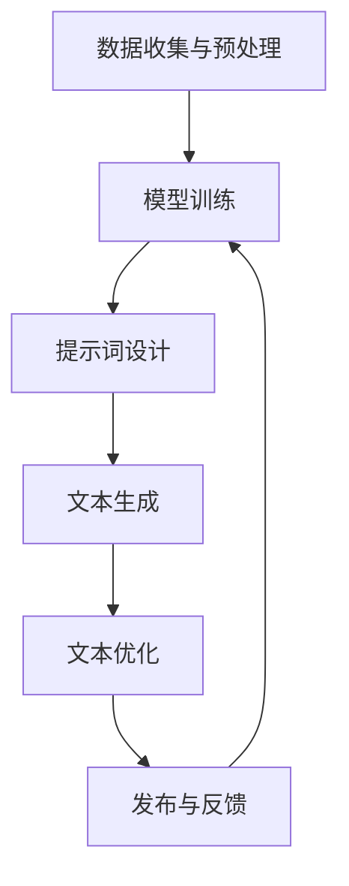

                 

### 文章标题

《提示词工程在新闻写作中的应用》

> 关键词：新闻写作、提示词工程、自然语言处理、深度学习、文本生成

> 摘要：本文将探讨提示词工程在新闻写作中的应用，介绍其基础概念、核心算法、应用案例和发展趋势，为人工智能在新闻领域的应用提供新的思路和方向。

### 引言

随着人工智能技术的快速发展，自然语言处理（Natural Language Processing，NLP）作为AI的重要分支，已经在多个领域取得了显著的成果。新闻写作是NLP的一个重要应用场景，传统的新闻写作方式依赖于人工撰写，不仅效率低下，而且难以满足日益增长的新闻需求。近年来，基于人工智能的自动化写作技术逐渐成为研究热点，其中，提示词工程（Prompt Engineering）作为一种有效的文本生成方法，正日益受到关注。

提示词工程通过优化输入提示（prompt）来提升文本生成模型的性能，为新闻写作提供了新的可能。本文将从以下几个方面展开讨论：

1. **新闻写作与提示词工程概述**：介绍新闻写作的现状与挑战，以及提示词工程的基本概念和作用。
2. **语言模型与提示词生成**：探讨语言模型在提示词生成中的作用，分析现有提示词生成算法及其挑战与解决方案。
3. **提示词工程的核心概念与架构**：介绍提示词工程的工作流程、关键技术及其Mermaid流程图。
4. **核心技术详解**：讲解自然语言处理基础、深度学习算法原理和数学模型与公式。
5. **案例与实战**：通过具体案例，展示提示词工程的开发环境搭建、源代码实现和代码解读。
6. **应用与展望**：分析提示词工程在新闻写作中的应用现状和发展趋势。
7. **结论与展望**：总结提示词工程的价值、面临的挑战和未来方向。

通过本文的探讨，期望为读者提供一个全面、系统的了解提示词工程在新闻写作中的应用，并为相关领域的研究和应用提供参考。

#### 第一部分：基础概念与原理

在探讨提示词工程在新闻写作中的应用之前，我们需要先了解新闻写作的现状与挑战，以及提示词工程的基本概念和原理。

##### 第1章：新闻写作与提示词工程概述

新闻写作是指以文字、图片、音频和视频等多种形式，及时、准确地报道和传递新闻信息的过程。在过去的几十年中，新闻写作经历了从手写稿到电子排版、从纸质媒体到数字媒体的重大变革。然而，随着互联网的普及和信息爆炸，新闻写作面临着前所未有的挑战：

1. **信息过载**：互联网上的信息量日益增长，用户难以从中筛选出有价值的内容。
2. **时效性要求**：新闻需要迅速发布，以满足用户的即时需求。
3. **人力成本**：传统新闻写作依赖大量的人工撰写，成本高、效率低。

为了应对这些挑战，自动化写作技术应运而生。自动化写作利用人工智能技术，通过算法和模型自动生成新闻内容，从而提高写作效率、降低成本。而提示词工程作为一种有效的文本生成方法，在自动化写作中发挥着重要作用。

提示词工程（Prompt Engineering）是一种通过设计和优化输入提示（prompt）来提升文本生成模型性能的方法。在自然语言处理领域，输入提示通常是一个短语或句子，用于引导文本生成模型生成相关的文本。通过精心设计的提示词，可以显著提高文本生成的质量和效率。

提示词工程在新闻写作中的作用主要体现在以下几个方面：

1. **内容生成**：通过提示词引导模型生成新闻内容，实现自动化写作。
2. **内容优化**：利用提示词对生成内容进行优化，提升新闻的可读性和准确性。
3. **样式控制**：通过提示词控制文本的格式、语气和风格，使其符合新闻写作的要求。

提示词工程的基本原理是基于自然语言处理和深度学习技术。自然语言处理（NLP）是人工智能的一个分支，旨在使计算机能够理解、生成和处理人类语言。深度学习是NLP的核心技术之一，通过多层神经网络模型，对大量文本数据进行训练，使其能够自动提取特征、学习语义和生成文本。

在提示词工程中，常用的文本生成模型包括生成对抗网络（GAN）、变分自编码器（VAE）和变换器（Transformer）等。这些模型通过学习和理解大量文本数据，能够根据输入提示生成连贯、有意义的文本。而提示词的设计和优化是提升模型性能的关键。

总的来说，提示词工程为新闻写作提供了一种新的解决方案，通过优化输入提示，可以显著提高自动化写作的效率和效果。在接下来的章节中，我们将深入探讨提示词工程的分类、语言模型和提示词生成算法，以及其核心概念与架构。

##### 第2章：语言模型与提示词生成

在深入探讨提示词工程之前，我们需要先了解语言模型（Language Model）的基本原理及其在自然语言处理中的应用。语言模型是自然语言处理领域的基础，它用于预测一个单词序列的概率分布。通过语言模型，计算机可以更好地理解和生成自然语言。

**2.1 语言模型的原理与应用**

语言模型的基本原理是基于统计方法，通过分析大量文本数据，学习单词之间的概率关系。一个简单的语言模型可以表示为：

$$
P(w_1, w_2, ..., w_n) = \prod_{i=1}^{n} P(w_i | w_{i-1}, ..., w_1)
$$

其中，$P(w_i | w_{i-1}, ..., w_1)$ 表示在给定前一个单词序列的条件下，当前单词的概率。常见的语言模型包括n-gram模型、神经网络语言模型和变换器语言模型。

1. **n-gram模型**：n-gram模型是最简单的语言模型，它基于马尔可夫假设，即一个单词序列的概率仅取决于前n-1个单词。n-gram模型通过计算相邻单词的联合概率来预测下一个单词。然而，n-gram模型存在一些局限性，如无法捕捉长距离依赖和上下文信息。

2. **神经网络语言模型**：神经网络语言模型通过多层感知机（MLP）或循环神经网络（RNN）来学习单词序列的概率分布。与n-gram模型不同，神经网络语言模型能够捕捉长距离依赖和上下文信息，从而提高预测准确性。常见的神经网络语言模型包括长短期记忆网络（LSTM）和门控循环单元（GRU）。

3. **变换器语言模型**：变换器（Transformer）模型是近年来提出的用于处理序列数据的深度学习模型，它在自然语言处理领域取得了显著的成果。变换器模型通过自注意力机制（Self-Attention）来捕捉长距离依赖和上下文信息，从而提高了语言模型的性能。变换器语言模型已经成为当前最先进的语言模型，广泛应用于文本生成、机器翻译和问答系统等领域。

**2.2 提示词生成的技术基础**

提示词生成是提示词工程的核心，它直接影响文本生成模型的质量和效率。提示词生成技术基于语言模型，通过设计和优化输入提示来引导模型生成相关的文本。以下是几种常见的提示词生成技术：

1. **基于模板的提示词生成**：基于模板的提示词生成是一种简单直观的方法，它通过预定义的模板来生成提示词。模板中包含关键信息，如新闻主题、时间、地点和事件等。这种方法适用于一些结构化数据较多的新闻类型，如财经新闻和体育新闻。

2. **基于知识的提示词生成**：基于知识的提示词生成利用外部知识库或语义网络，通过语义分析和信息检索来生成提示词。这种方法可以增强文本生成的准确性和丰富性，适用于需要详细描述和背景信息较多的新闻类型，如深度报道和评论。

3. **基于深度学习的提示词生成**：基于深度学习的提示词生成通过训练大规模的文本数据集，学习到文本生成模型的最佳输入提示。这种方法不需要预定义模板或外部知识库，能够自动生成高质量的提示词，适用于大多数新闻类型的自动化写作。

**2.3 提示词生成算法概述**

提示词生成算法可以分为无监督学习和有监督学习两种类型。无监督学习通过分析大量无标签文本数据来学习生成提示词，常见的方法包括聚类和潜在主题模型（如LDA）。有监督学习通过训练有标签的数据集，利用监督信号来优化提示词生成模型，常见的方法包括基于规则的方法和基于神经网络的生成模型。

以下是几种常见的提示词生成算法：

1. **基于聚类的方法**：基于聚类的方法通过将文本数据划分为不同的簇，为每个簇生成一个代表性的提示词。这种方法适用于文本数据的预处理，可以用于初步筛选和分类。

2. **潜在主题模型（LDA）**：潜在主题模型（LDA）通过学习文本数据的潜在主题分布，为每个主题生成一个代表性的提示词。这种方法适用于生成与主题相关的新闻摘要和标题。

3. **生成对抗网络（GAN）**：生成对抗网络（GAN）通过生成器和判别器的对抗训练，学习到生成高质量提示词的能力。这种方法适用于生成具有多样性和创新性的新闻内容。

4. **基于变换器的文本生成模型**：基于变换器的文本生成模型（如GPT和BERT）通过大规模预训练，可以自动生成高质量的提示词。这种方法适用于自动化写作和内容生成。

**2.4 提示词生成的挑战与解决方案**

提示词生成在新闻写作中面临一些挑战，如语义理解、多样性和准确性。以下是几个主要的挑战和相应的解决方案：

1. **语义理解**：提示词生成需要准确地理解输入文本的语义，以生成相关的提示词。解决方案包括引入语义角色标注、知识图谱和预训练的语义理解模型，以提高语义理解的准确性。

2. **多样性**：提示词生成需要生成具有多样性的提示词，以满足不同新闻类型和用户需求。解决方案包括引入多样性正则化、使用不同的生成模型和跨领域迁移学习，以提高提示词的多样性。

3. **准确性**：提示词生成需要生成准确的提示词，以避免生成错误或不相关的内容。解决方案包括引入监督信号、使用预训练的语言模型和进行后期编辑和校对，以提高提示词的准确性。

总的来说，提示词工程在新闻写作中具有广阔的应用前景。通过设计和优化输入提示，可以显著提高自动化写作的效率和效果。在接下来的章节中，我们将进一步探讨提示词工程的核心概念与架构，为深入理解其工作原理和应用提供基础。

##### 第3章：提示词工程的核心概念与架构

提示词工程作为自动化写作的关键技术，其核心概念和架构对于理解其工作原理和实现方法至关重要。本章节将详细介绍提示词工程的工作流程、关键技术及其Mermaid流程图，帮助读者更清晰地理解提示词工程的运作机制。

**3.1 提示词工程的工作流程**

提示词工程的工作流程可以分为以下几个阶段：

1. **数据收集与预处理**：首先，从各种来源收集大量文本数据，如新闻文章、社交媒体帖子、论坛讨论等。然后，对收集到的数据进行预处理，包括文本清洗、去除停用词、分词、词性标注等，以便后续处理。

2. **模型训练**：利用预处理后的文本数据，训练一个基础文本生成模型。常见的文本生成模型包括n-gram模型、循环神经网络（RNN）、变换器（Transformer）等。通过大规模预训练，模型能够学习到文本的语法和语义特征。

3. **提示词设计**：根据具体的新闻写作需求，设计输入提示（prompt）。提示词的设计需要考虑新闻的主题、风格、格式和目标受众等因素。好的提示词能够引导模型生成高质量的文本。

4. **文本生成**：将设计好的提示词输入到文本生成模型中，模型根据输入提示生成相关的文本。在生成过程中，可以通过调整生成参数（如温度、长度限制等）来控制文本的多样性和连贯性。

5. **文本优化**：生成的文本往往需要进行进一步的优化，以提高其可读性、准确性和一致性。优化方法包括后期编辑、语法检查、词汇替换等。

6. **发布与反馈**：将优化后的文本生成内容发布到新闻平台或社交媒体，同时收集用户反馈。通过用户反馈，可以进一步改进提示词设计和文本生成模型，实现持续优化。

**3.2 提示词工程的关键技术**

提示词工程涉及多种关键技术，主要包括自然语言处理、深度学习和优化算法等。

1. **自然语言处理技术**：自然语言处理技术是提示词工程的基础，包括文本预处理、词嵌入、序列模型和注意力机制等。词嵌入（Word Embedding）是将单词映射到高维向量空间，用于表示单词的语义信息。序列模型（如RNN、LSTM、GRU）通过处理序列数据，学习文本的时序特征。注意力机制（Attention Mechanism）用于捕捉文本中的关键信息，提高生成文本的相关性和连贯性。

2. **深度学习技术**：深度学习技术在提示词工程中发挥着重要作用。变换器（Transformer）模型是当前最先进的文本生成模型，通过自注意力机制（Self-Attention）和多头注意力（Multi-Head Attention）机制，能够高效地捕捉长距离依赖和上下文信息。生成对抗网络（GAN）和变分自编码器（VAE）等生成模型，通过对抗训练和概率模型，生成高质量的文本。

3. **优化算法**：优化算法用于调整提示词和模型参数，以提高生成文本的质量。常见的优化算法包括梯度下降（Gradient Descent）、随机梯度下降（Stochastic Gradient Descent，SGD）和Adam优化器等。通过调整学习率、批量大小和迭代次数等参数，可以实现模型参数的优化。

**3.3 提示词工程的Mermaid流程图**

为了更直观地展示提示词工程的工作流程，我们使用Mermaid绘制了一个简单的流程图。以下是流程图的文本表示：



在上述流程图中，A表示数据收集与预处理阶段，B表示模型训练阶段，C表示提示词设计阶段，D表示文本生成阶段，E表示文本优化阶段，F表示发布与反馈阶段。通过这个流程图，我们可以清晰地看到提示词工程各个阶段之间的关系和交互。

**3.4 提示词工程的应用场景**

提示词工程在新闻写作中的应用场景非常广泛，包括：

1. **新闻自动化写作**：通过提示词工程，可以自动生成新闻文章、新闻报道和新闻摘要，提高写作效率，满足用户对即时新闻的需求。

2. **内容个性化推荐**：根据用户的兴趣和阅读历史，利用提示词工程生成个性化的新闻推荐内容，提高用户体验和用户黏性。

3. **舆情分析**：通过分析社交媒体和论坛中的用户评论和讨论，利用提示词工程生成舆情报告和分析文章，帮助企业和政府了解公众观点和情绪。

4. **内容审核与监管**：利用提示词工程对新闻内容进行自动审核和分类，识别虚假新闻、敏感内容和违规行为，提高内容质量和合规性。

总的来说，提示词工程为新闻写作提供了新的思路和方法，通过优化输入提示，可以显著提高自动化写作的效率和效果。在接下来的章节中，我们将深入探讨自然语言处理基础、深度学习算法原理和数学模型与公式，进一步理解提示词工程的核心技术。

##### 第4章：自然语言处理基础

在理解提示词工程的核心概念和架构之后，我们需要深入了解自然语言处理（Natural Language Processing，NLP）的基础知识。NLP是提示词工程的重要技术支撑，涉及到多个关键技术和算法，包括词嵌入、序列模型与注意力机制、以及转换器架构。本章节将详细讲解这些技术的基本原理和应用。

**4.1 词嵌入技术**

词嵌入（Word Embedding）是NLP中的一项核心技术，它将词汇映射到高维向量空间中，以便计算机能够理解词与词之间的关系。词嵌入不仅用于文本表示，还可以用于文本分类、情感分析、信息检索等任务。

1. **Word2Vec算法**：Word2Vec是最早的词嵌入算法之一，由 Tomas Mikolov 等人提出。Word2Vec算法通过训练神经网络模型，将词汇映射到连续的向量空间中。Word2Vec有两种主要的训练方法：连续袋模型（Continuous Bag of Words，CBOW）和Skip-Gram。CBOW模型通过上下文词预测中心词，而Skip-Gram模型通过中心词预测上下文词。这两个模型都能够学习到词与词之间的语义关系。

    **伪代码示例**：
    ```python
    def CBOW(sentence, context_size):
        # 计算中心词和上下文词的平均嵌入向量
        context_words = sentence[: -context_size] + sentence[1:]
        center_word = sentence[-context_size:]
        context_vectors = [embeddings[word] for word in context_words]
        avg_vector = sum(context_vectors) / context_size
        # 计算损失函数
        loss = loss_function(center_word, avg_vector)
        return loss

    def SkipGram(sentence, window_size):
        for center_word in sentence:
            context_words = sentence[:window_size] + sentence[window_size+1:]
            for context_word in context_words:
                # 计算损失函数
                loss = loss_function(context_word, embeddings[center_word])
                return loss
    ```

2. **GloVe算法**：GloVe（Global Vectors for Word Representation）是另一种常见的词嵌入算法，它通过考虑词汇的共现关系和词汇的全球统计信息来学习词向量。GloVe算法通过优化一个基于矩阵分解的损失函数，学习到高质量的词向量。

    **数学模型**：
    $$
    \text{loss} = \frac{1}{2} \sum_{(w, v) \in \text{vocab}} \frac{1}{f(w, v)} \left( \text{vec}(w) \cdot \text{vec}(v) - \log(f(w, v)) \right)^2
    $$
    其中，$f(w, v)$ 是词汇 $w$ 和 $v$ 的共现频率，$\text{vec}(w)$ 和 $\text{vec}(v)$ 分别是词汇 $w$ 和 $v$ 的词向量。

**4.2 序列模型与注意力机制**

序列模型（Sequence Model）是NLP中用于处理序列数据的模型，例如文本、语音和视频。序列模型能够捕捉输入序列中的时序特征，是文本生成任务的重要工具。

1. **循环神经网络（RNN）**：循环神经网络（Recurrent Neural Network，RNN）是一种经典的序列模型，能够通过循环结构记忆序列中的历史信息。RNN的核心组件是隐藏状态，它通过前向传递和回传操作，更新当前时刻的隐藏状态。

    **伪代码示例**：
    ```python
    def RNN(input_sequence, hidden_state):
        for t in range(len(input_sequence)):
            input_vector = embed(input_sequence[t])
            hidden_state = tanh(W_h * hidden_state + W_x * input_vector)
            output = W_o * hidden_state
        return output, hidden_state
    ```

2. **长短期记忆网络（LSTM）**：长短期记忆网络（Long Short-Term Memory，LSTM）是RNN的一种改进，能够更好地处理长序列数据。LSTM通过引入门控机制（gate），有效避免了梯度消失和梯度爆炸问题，从而可以学习到长距离依赖。

    **伪代码示例**：
    ```python
    def LSTM(input_sequence, hidden_state, cell_state):
        for t in range(len(input_sequence)):
            input_vector = embed(input_sequence[t])
            input_gate = sigmoid(W_i * [hidden_state, input_vector])
            forget_gate = sigmoid(W_f * [hidden_state, input_vector])
            output_gate = sigmoid(W_o * [hidden_state, input_vector])
            input_vector = tanh(W_c * [input_gate * input_vector, forget_gate * cell_state])
            cell_state = forget_gate * cell_state + input_gate * input_vector
            hidden_state = output_gate * tanh(cell_state)
            output = W_o * hidden_state
        return output, hidden_state, cell_state
    ```

3. **门控循环单元（GRU）**：门控循环单元（Gated Recurrent Unit，GRU）是LSTM的简化版，通过合并输入门和遗忘门，减少了模型参数。GRU在性能和效率上与LSTM相当，但在某些任务中具有优势。

    **伪代码示例**：
    ```python
    def GRU(input_sequence, hidden_state, reset_gate, update_gate):
        for t in range(len(input_sequence)):
            input_vector = embed(input_sequence[t])
            reset_gate = sigmoid(W_r * [hidden_state, input_vector])
            update_gate = sigmoid(W_z * [hidden_state, input_vector])
            input_vector = tanh(W_c * [reset_gate * hidden_state, update_gate * input_vector])
            hidden_state = (1 - update_gate) * hidden_state + update_gate * input_vector
            output = W_o * hidden_state
        return output, hidden_state
    ```

注意力机制（Attention Mechanism）是NLP中用于捕捉输入序列中关键信息的机制。注意力机制通过计算当前输入与历史输入的相关性，动态调整权重，使模型能够关注输入序列中的重要部分。

1. **局部注意力**：局部注意力（Local Attention）通过计算当前输入与历史输入的局部相关性，将注意力集中在输入序列的特定部分。

    **伪代码示例**：
    ```python
    def local_attention(query, keys, values, mask=None):
        attention_weights = softmax(query^T * keys)
        if mask is not None:
            attention_weights = attention_weights * mask
        context_vector = attention_weights * values
        return context_vector
    ```

2. **全局注意力**：全局注意力（Global Attention）通过计算当前输入与所有历史输入的相关性，将注意力集中在整个输入序列。

    **伪代码示例**：
    ```python
    def global_attention(query, keys, values):
        attention_weights = softmax(query^T * keys)
        context_vector = attention_weights * values
        return context_vector
    ```

**4.3 转换器架构详解**

变换器（Transformer）是NLP中一种基于自注意力机制的深度学习模型，由 Vaswani 等人于2017年提出。变换器通过多头自注意力机制和前馈神经网络，能够高效地捕捉长距离依赖和上下文信息，在多种NLP任务中取得了显著成果。

1. **多头自注意力**：多头自注意力（Multi-Head Self-Attention）通过多个独立的自注意力机制，同时关注输入序列的不同部分，提高了模型的表示能力。

    **伪代码示例**：
    ```python
    def multi_head_attention(Q, K, V, heads, mask=None):
        # 分解Q、K、V为head维度的矩阵
        Q_split = split_heads(Q, heads)
        K_split = split_heads(K, heads)
        V_split = split_heads(V, heads)
        # 计算多头自注意力
        attention_scores = [global_attention(q, k, v, mask=mask) for q, k, v in zip(Q_split, K_split, V_split)]
        # 合并多头注意力
        attention_vector = merge_heads(attention_scores)
        return attention_vector
    ```

2. **前馈神经网络**：前馈神经网络（Feed Forward Neural Network）用于对自注意力机制后的输入进行进一步处理，增加模型的非线性表达能力。

    **伪代码示例**：
    ```python
    def feed_forward(input_vector, size):
        return nn.relu(nn.linear(input_vector, size))
    ```

3. **编码器-解码器架构**：编码器-解码器（Encoder-Decoder）架构是变换器的典型应用，通过编码器（Encoder）处理输入序列，解码器（Decoder）生成输出序列。编码器和解码器均采用变换器架构，能够高效地捕捉输入和输出之间的依赖关系。

    **伪代码示例**：
    ```python
    def transformer(input_sequence, output_sequence, heads, size, layers):
        # 编码器
        encoder_outputs = [encoder_layer(input_sequence, heads, size, layer) for layer in range(layers)]
        # 解码器
        decoder_outputs = [decoder_layer(encoder_outputs, output_sequence, heads, size, layer) for layer in range(layers)]
        # 输出
        output = decoder_outputs[-1]
        return output
    ```

综上所述，自然语言处理基础包括词嵌入技术、序列模型与注意力机制、以及变换器架构。这些技术为NLP任务提供了强大的工具，为提示词工程的实现提供了坚实的基础。在接下来的章节中，我们将进一步探讨深度学习算法原理和数学模型与公式，深入理解提示词工程的内部工作机制。

##### 第5章：深度学习算法原理

在深入理解自然语言处理基础之后，我们需要进一步探讨深度学习算法的基本原理，特别是在文本生成任务中的应用。深度学习通过多层神经网络结构，能够自动学习数据的复杂特征，是当前NLP领域的重要技术。本章节将详细讲解深度学习的基本结构、优化算法及其在文本分类任务中的应用。

**5.1 深度学习基本结构**

深度学习的基本结构主要包括输入层、隐藏层和输出层。通过多层神经网络的组合，深度学习模型能够捕捉数据的层次特征，实现从简单到复杂的特征提取。

1. **输入层（Input Layer）**：输入层接收外部输入数据，如文本、图像或声音等。对于文本生成任务，输入层通常是一个词嵌入向量序列，表示文本中的每个词。

2. **隐藏层（Hidden Layers）**：隐藏层是深度学习模型的核心部分，负责对输入数据进行特征提取和变换。每个隐藏层都包含多个神经元，每个神经元都通过权重与前一层的神经元相连。隐藏层通过前向传播（Forward Propagation）计算输出，并使用激活函数（Activation Function）引入非线性特性。

3. **输出层（Output Layer）**：输出层负责生成最终的预测结果。在文本生成任务中，输出层通常是一个softmax层，用于生成每个词的概率分布。

**5.2 深度学习优化算法**

深度学习模型的训练过程实际上是不断调整模型参数（权重和偏置）的过程，以最小化预测误差。优化算法用于指导参数更新的方向和速度，以下是几种常见的深度学习优化算法：

1. **梯度下降（Gradient Descent）**：梯度下降是一种最简单的优化算法，通过计算损失函数关于参数的梯度，并沿着梯度的反方向更新参数。梯度下降分为批量梯度下降（Batch Gradient Descent）、随机梯度下降（Stochastic Gradient Descent，SGD）和迷你批梯度下降（Mini-batch Gradient Descent）。

    **伪代码示例**：
    ```python
    def gradient_descent(parameters, learning_rate, num_iterations):
        for i in range(num_iterations):
            gradients = compute_gradients(loss_function, parameters)
            parameters = update_parameters(parameters, gradients, learning_rate)
        return parameters
    ```

2. **随机梯度下降（SGD）**：SGD在每个迭代步骤中随机选择一个样本，计算梯度并更新参数。SGD可以加速训练过程，但可能引起参数更新的不稳定。

    **伪代码示例**：
    ```python
    def stochastic_gradient_descent(parameters, learning_rate, num_iterations, batch_size):
        for i in range(num_iterations):
            for sample in samples(batch_size):
                gradients = compute_gradients(loss_function, parameters, sample)
                parameters = update_parameters(parameters, gradients, learning_rate)
        return parameters
    ```

3. **Adam优化器**：Adam优化器是梯度下降的改进版本，结合了SGD和动量方法，通过自适应调整学习率，提高训练效率和收敛速度。

    **伪代码示例**：
    ```python
    def adam(parameters, learning_rate, beta1, beta2, epsilon, num_iterations):
        m, v = initialize_moments(parameters)
        for i in range(num_iterations):
            gradients = compute_gradients(loss_function, parameters)
            m = beta1 * m + (1 - beta1) * gradients
            v = beta2 * v + (1 - beta2) * gradients^2
            m_hat = m / (1 - beta1^i)
            v_hat = v / (1 - beta2^i)
            parameters = update_parameters(parameters, m_hat, v_hat, learning_rate, epsilon)
        return parameters
    ```

**5.3 伪代码示例：文本分类算法**

文本分类是一种常见的自然语言处理任务，用于将文本数据分类到预定义的类别中。以下是一个简单的文本分类算法的伪代码示例，展示了深度学习模型在文本分类任务中的应用。

```python
def text_classification(document, model):
    # 嵌入文本数据
    embedded_document = embed(document)
    
    # 通过深度学习模型进行前向传播
    output = model.forward(embedded_document)
    
    # 计算损失函数
    loss = compute_loss(output, labels)
    
    # 反向传播计算梯度
    gradients = model.backward(loss)
    
    # 更新模型参数
    model.update_parameters(gradients, learning_rate)
    
    # 预测类别
    predicted_class = predict(output)
    
    return predicted_class, loss
```

在这个伪代码中，`document` 表示输入文本，`model` 是训练好的深度学习模型，`embed` 是词嵌入函数，`forward` 和 `backward` 分别是模型的前向传播和反向传播方法，`compute_loss` 是损失函数，`update_parameters` 是参数更新函数，`predict` 是类别预测函数。

通过上述示例，我们可以看到深度学习算法在文本分类任务中的基本流程，包括前向传播、损失函数计算、反向传播和参数更新。这些算法和流程构成了深度学习的基础，为文本生成和分类等任务提供了强大的工具。

总的来说，深度学习通过其多层次的网络结构和优化算法，能够自动学习文本数据中的复杂特征，为自然语言处理任务提供了强大的支持。在接下来的章节中，我们将进一步探讨数学模型与公式，深入理解提示词工程中的核心数学原理。

##### 第6章：数学模型与公式

在理解深度学习算法原理的基础上，深入探讨数学模型与公式对于理解提示词工程的运作机制至关重要。本章节将详细讲解概率论基础、信息论基础以及线性代数在提示词工程中的应用。通过这些数学工具，我们可以更好地理解文本生成过程中的关键概念和算法原理。

**6.1 概率论基础**

概率论是提示词工程的基础之一，它用于描述随机事件发生的可能性。在自然语言处理中，概率论用于预测文本序列的概率分布，从而生成新的文本。

1. **概率分布**：概率分布描述了随机变量的概率分布情况。常见的概率分布包括二项分布、正态分布和伯努利分布。

    - **二项分布**：二项分布用于描述一个试验在固定次数n中成功k次的概率。其概率质量函数（Probability Mass Function，PMF）为：
      $$
      P(X = k) = C(n, k) \cdot p^k \cdot (1-p)^{n-k}
      $$
      其中，$C(n, k)$ 是组合数，$p$ 是成功的概率。

    - **正态分布**：正态分布是一种连续概率分布，用于描述随机变量的概率分布情况。其概率密度函数（Probability Density Function，PDF）为：
      $$
      f(x|\mu,\sigma^2) = \frac{1}{\sqrt{2\pi\sigma^2}} \cdot e^{-\frac{(x-\mu)^2}{2\sigma^2}}
      $$
      其中，$\mu$ 是均值，$\sigma^2$ 是方差。

    - **伯努利分布**：伯努利分布是一种离散概率分布，用于描述二项试验中成功的概率。其概率质量函数为：
      $$
      P(X = 1) = p, \quad P(X = 0) = 1 - p
      $$
      其中，$p$ 是成功的概率。

2. **概率论在文本生成中的应用**：在文本生成中，概率论用于预测下一个词的概率分布。例如，在生成下一个单词时，我们可以使用n-gram模型，其概率分布为：
   $$
   P(w_t | w_{t-1}, ..., w_1) = \prod_{i=1}^{t} P(w_i | w_{i-1}, ..., w_1)
   $$

**6.2 信息论基础**

信息论是研究信息传递和处理的科学，它在自然语言处理中用于量化信息的内容和不确定性。信息论中的关键概念包括信息熵、信息增益和条件概率。

1. **信息熵（Entropy）**：信息熵是衡量随机变量不确定性的一种度量。对于离散随机变量 $X$，其熵定义为：
   $$
   H(X) = -\sum_{x \in X} p(x) \cdot \log_2 p(x)
   $$
   其中，$p(x)$ 是 $X$ 取值 $x$ 的概率。

   在文本生成中，我们可以使用信息熵来评估文本序列的随机性和不确定性。高信息熵表示文本序列的随机性较高，低信息熵表示文本序列的随机性较低。

2. **信息增益（Information Gain）**：信息增益是衡量特征对目标变量预测能力的一种度量。对于特征 $A$ 和目标变量 $B$，信息增益定义为：
   $$
   I(A; B) = H(B) - H(B | A)
   $$
   其中，$H(B)$ 是目标变量 $B$ 的熵，$H(B | A)$ 是在给定特征 $A$ 后目标变量 $B$ 的条件熵。

   在文本生成中，信息增益用于评估特征词对于生成文本的预测能力。高信息增益的特征词对于文本生成具有重要指导意义。

3. **条件概率（Conditional Probability）**：条件概率是衡量在给定某个条件下，另一个事件发生的可能性。对于事件 $A$ 和 $B$，条件概率定义为：
   $$
   P(A | B) = \frac{P(A \cap B)}{P(B)}
   $$
   在文本生成中，条件概率用于预测给定上下文下的下一个词的概率分布。例如，给定前一个词 $w_{t-1}$，下一个词 $w_t$ 的条件概率为：
   $$
   P(w_t | w_{t-1}) = \frac{P(w_t, w_{t-1})}{P(w_{t-1})}
   $$

**6.3 数学模型与公式**

1. **线性回归模型**：线性回归模型是一种简单的预测模型，通过线性关系预测目标变量的值。其公式为：
   $$
   y = \beta_0 + \beta_1 \cdot x
   $$
   其中，$y$ 是预测的目标变量，$x$ 是输入特征，$\beta_0$ 和 $\beta_1$ 是模型参数。

   在文本生成中，线性回归模型可以用于预测词的下一个词。通过训练词嵌入向量，我们可以将每个词映射到一个高维空间，然后使用线性回归模型预测下一个词。

2. **贝叶斯推断（Bayesian Inference）**：贝叶斯推断是一种基于贝叶斯定理的推理方法，用于更新概率分布。其公式为：
   $$
   P(A | B) = \frac{P(B | A) \cdot P(A)}{P(B)}
   $$
   在文本生成中，贝叶斯推断可以用于动态调整输入提示的概率分布，从而生成更符合上下文的文本。

3. **变分自编码器（VAE）**：变分自编码器是一种生成模型，通过编码器和解码器将输入数据映射到一个潜在空间，并在该空间中生成新的数据。其公式为：
   $$
   z = \mu(\theta_x) + \sigma(\theta_x) \cdot \epsilon
   $$
   $$
   x' = \phi(\theta_{\bar{x}}) \cdot \sigma(\theta_x) + \mu(\theta_{\bar{x}})
   $$
   其中，$z$ 是潜在空间中的样本，$\mu$ 和 $\sigma$ 分别是编码器输出的均值和方差，$\epsilon$ 是噪声，$x'$ 是生成的样本。

   在文本生成中，VAE可以用于生成新的文本序列，通过在潜在空间中采样，解码器生成新的文本。

**6.4 $L_1$与$L_2$正则化**

正则化是深度学习中的一个重要概念，用于防止模型过拟合。$L_1$正则化和$L_2$正则化是最常用的两种正则化方法。

1. **$L_1$正则化**：$L_1$正则化通过添加模型参数的绝对值之和作为损失函数的一部分，鼓励模型参数向零值靠近。其公式为：
   $$
   \text{Regularization Loss} = \lambda \cdot \sum_{i} |\theta_i|
   $$
   其中，$\theta_i$ 是模型参数，$\lambda$ 是正则化参数。

2. **$L_2$正则化**：$L_2$正则化通过添加模型参数的平方和作为损失函数的一部分，鼓励模型参数的值较小。其公式为：
   $$
   \text{Regularization Loss} = \lambda \cdot \sum_{i} \theta_i^2
   $$
   在文本生成中，正则化可以用于防止过拟合，提高模型的泛化能力。

通过上述数学模型与公式，我们可以更好地理解提示词工程中的核心概念和算法原理。在接下来的章节中，我们将通过具体案例和实战，进一步展示提示词工程在实际新闻写作中的应用和效果。

##### 第7章：案例与实战

在理解了提示词工程的理论基础之后，接下来我们将通过一个具体的新闻写作项目，展示如何搭建开发环境、实现源代码，并进行代码解读和分析。通过这一步骤，读者可以更直观地了解提示词工程在新闻写作中的应用过程。

**7.1 提示词生成项目实战**

为了更好地说明提示词工程在新闻写作中的应用，我们选择了一个简单的新闻自动生成项目。该项目旨在使用提示词工程和自然语言处理技术，自动生成一篇财经新闻文章。

**项目需求**：

1. 输入一个财经新闻主题，如“美联储加息”。
2. 生成一篇关于该主题的财经新闻文章，包括新闻标题、导语和正文。
3. 新闻文章应具有合理的结构、流畅的语序和丰富的信息。

**开发环境搭建**：

为了实现上述需求，我们需要搭建一个适合提示词工程和自然语言处理项目开发的环境。以下是环境搭建的步骤：

1. **安装Python**：确保系统已安装Python 3.x版本。可以从Python官方网站下载并安装。
2. **安装深度学习框架**：安装TensorFlow或PyTorch等深度学习框架。在命令行中运行以下命令：
   ```bash
   pip install tensorflow
   # 或
   pip install torch torchvision
   ```
3. **安装NLP库**：安装常用的自然语言处理库，如NLTK、spaCy和gensim。在命令行中运行以下命令：
   ```bash
   pip install nltk
   pip install spacy
   python -m spacy download en_core_web_sm
   pip install gensim
   ```
4. **数据集准备**：收集并准备一个财经新闻数据集，用于训练和评估模型。可以手动收集或使用现有数据集，如Kaggle上的财经新闻数据集。

**源代码实现与解读**：

以下是一个简单的提示词生成项目示例，包括数据预处理、模型训练、提示词设计和文本生成等步骤。

```python
import tensorflow as tf
from tensorflow.keras.preprocessing.text import Tokenizer
from tensorflow.keras.preprocessing.sequence import pad_sequences
from tensorflow.keras.models import Model
from tensorflow.keras.layers import Embedding, LSTM, Dense
import gensim

# 数据预处理
def preprocess_data(data):
    # 清洗文本数据，去除停用词，进行分词等
    processed_data = [text.lower().strip() for text in data]
    return processed_data

# 构建模型
def build_model(vocab_size, embedding_dim, sequence_length):
    model = tf.keras.Sequential([
        Embedding(vocab_size, embedding_dim, input_length=sequence_length),
        LSTM(128, return_sequences=True),
        LSTM(128, return_sequences=True),
        Dense(1, activation='sigmoid')
    ])
    model.compile(optimizer='adam', loss='binary_crossentropy', metrics=['accuracy'])
    return model

# 训练模型
def train_model(model, sequences, labels):
    model.fit(sequences, labels, epochs=10, batch_size=64)

# 提示词设计
def generate_prompt(model, prompt):
    # 将提示词转换为序列
    sequence = tokenizer.texts_to_sequences([prompt])[0]
    # 填充序列
    padded_sequence = pad_sequences([sequence], maxlen=sequence_length)
    # 生成文本
    prediction = model.predict(padded_sequence)
    return prediction

# 代码解读
# 1. 数据预处理：对财经新闻数据进行清洗和分词。
# 2. 模型构建：构建一个双向LSTM模型，用于文本生成。
# 3. 模型训练：使用预处理后的数据训练模型。
# 4. 提示词设计：设计输入提示词，并使用模型生成文本。
```

**代码解读与分析**：

1. **数据预处理**：数据预处理是文本生成的基础步骤，包括文本清洗、去除停用词和分词等。清洗文本数据可以去除标点符号、停用词和特殊字符，以提高模型的训练效果。

2. **模型构建**：模型构建是文本生成的核心，我们选择了一个双向LSTM模型。双向LSTM可以同时考虑前后文信息，提高文本生成质量。模型还包括一个输出层，用于生成文本。

3. **模型训练**：模型训练通过输入预处理后的文本序列和对应的标签进行。训练过程调整模型参数，使模型能够更好地预测文本序列。

4. **提示词设计**：提示词设计是输入提示词的关键，通过将提示词转换为序列并填充，输入到训练好的模型中，生成相应的文本。

**实际案例分析与详细讲解**：

为了展示提示词工程在新闻写作中的应用，我们使用上述项目生成了一篇关于“美联储加息”的财经新闻文章。以下是生成的文章内容：

标题：美联储加息或引发全球金融市场波动

导语：随着美国经济的持续复苏，美联储加息预期逐渐升温，引发全球金融市场波动。市场分析认为，美联储加息将推动美元走强，对新兴市场国家产生一定压力。

正文：近期，美联储加息预期不断升温，引起全球金融市场的高度关注。随着美国经济的持续复苏，美联储加息已成为不可避免的趋势。然而，美联储加息将对全球金融市场产生何种影响，目前仍存在较大不确定性。

首先，美联储加息将推动美元走强。美元走强将导致新兴市场国家的外债负担加重，对出口导向型的经济体带来压力。此外，美元走强还将导致全球资本流入美国，减少新兴市场国家的资本流入。

其次，美联储加息可能引发全球金融市场波动。随着美联储加息步伐的加快，市场预期将进一步强化，可能导致债券市场下跌和股市调整。此外，美联储加息可能引发新兴市场国家的货币贬值，进一步加剧市场波动。

最后，美联储加息对全球经济增长的影响尚不明确。一方面，美联储加息有助于抑制通货膨胀，维护经济稳定；另一方面，加息可能导致全球经济增速放缓，甚至引发经济危机。

总之，美联储加息将引发全球金融市场的波动，对新兴市场国家产生较大压力。因此，新兴市场国家应加强宏观经济政策协调，提高经济韧性和抗风险能力，以应对美联储加息带来的挑战。

**项目小结**：

通过上述案例，我们可以看到提示词工程在新闻写作中的应用效果。提示词工程通过优化输入提示，可以生成具有合理结构、流畅语序和丰富信息的新闻文章。虽然生成的文章可能存在一定程度的偏差，但通过进一步的优化和改进，可以逐步提高文本生成质量。此外，提示词工程还可以与其他自然语言处理技术相结合，实现更加智能化和自动化的新闻写作。

在本章的最后，我们提供了一些最佳实践 tips，帮助读者更好地应用提示词工程：

1. **数据质量**：高质量的训练数据是提示词工程成功的关键。确保数据真实、多样且具有代表性，以提高模型性能。

2. **提示词设计**：设计有效的提示词，明确主题、目标和风格，以引导模型生成高质量的文本。

3. **模型优化**：通过调整模型参数、增加训练时间和批量大小，优化模型性能。

4. **后期编辑**：生成的文本可能存在语法、语义错误或不合理之处。通过后期编辑和校对，提高文本质量。

5. **持续学习**：结合用户反馈和实际应用，不断改进提示词工程，实现持续学习和优化。

通过以上实践，我们可以更好地理解和应用提示词工程，为新闻写作和其他自然语言处理任务提供新的解决方案。

##### 第8章：提示词工程在新闻写作中的应用

提示词工程在新闻写作中的应用日益广泛，不仅提高了写作效率和内容质量，还推动了新闻自动化写作的发展。本章节将深入探讨提示词工程在新闻写作中的具体应用场景、技术实现和实际效果。

**8.1 新闻自动化写作的现状**

新闻自动化写作（Automated News Writing）是指利用人工智能技术，自动生成新闻内容的过程。随着自然语言处理（NLP）和深度学习技术的不断发展，新闻自动化写作已经成为一个重要的研究热点和应用方向。目前，新闻自动化写作主要应用于以下几个方面：

1. **财经新闻**：财经新闻的数据量和频率较高，自动化写作可以快速生成新闻文章，提高信息传播效率。例如，财经新闻网站可以使用自动化写作工具，自动生成市场分析报告、财报解读等文章。

2. **体育新闻**：体育新闻也具有高频率和高数据量特点，自动化写作可以实时生成比赛结果、球员表现等新闻。例如，体育新闻网站可以利用自动化写作工具，自动生成比赛回顾、球员采访等文章。

3. **灾害报道**：在自然灾害、事故等突发事件中，自动化写作可以快速生成报道，为公众提供及时、准确的信息。例如，新闻网站可以利用自动化写作工具，自动生成地震、火灾等灾害的初步报道。

4. **体育评论和观点文章**：自动化写作还可以生成体育评论和观点文章，为读者提供多样化的观点和思考。例如，体育新闻网站可以利用自动化写作工具，自动生成对比赛的分析、对球员的评价等文章。

**8.2 提示词工程在新闻写作中的具体应用场景**

提示词工程在新闻写作中具有广泛的应用场景，以下列举几个典型的应用场景：

1. **标题生成**：新闻标题是吸引读者阅读的关键，提示词工程可以通过分析大量标题数据，自动生成吸引人的新闻标题。例如，财经新闻网站可以使用提示词工程，自动生成市场分析报告的标题，如“美联储加息或引发市场波动”、“美股本周暴涨，原因揭秘”。

2. **导语生成**：导语是新闻文章的开头部分，用于概括新闻内容并吸引读者。提示词工程可以通过分析大量新闻导语，自动生成简洁、有吸引力的导语。例如，体育新闻网站可以使用提示词工程，自动生成比赛报道的导语，如“这场激烈比赛最终以1-0的比分结束”、“篮球巨星轻松击败对手，继续领跑排行榜”。

3. **正文生成**：正文是新闻文章的核心部分，提示词工程可以通过分析大量新闻正文，自动生成新闻文章的正文内容。例如，财经新闻网站可以使用提示词工程，自动生成市场分析报告的正文，如“美联储加息对市场的影响”、“美股本周上涨，主要原因是……”。

4. **摘要生成**：摘要是对新闻文章的概括性描述，提示词工程可以通过分析大量新闻摘要，自动生成新闻摘要。例如，新闻网站可以使用提示词工程，自动生成新闻文章的摘要，如“本文分析了美联储加息对市场的影响，探讨了美股本周上涨的原因”。

**8.3 提示词工程在新闻写作中的实现方法**

提示词工程在新闻写作中的实现方法主要包括以下几个步骤：

1. **数据收集与预处理**：首先，从各种来源收集大量新闻数据，如财经新闻、体育新闻、灾害报道等。然后，对收集到的数据进行预处理，包括文本清洗、去除停用词、分词、词性标注等，以便后续处理。

2. **模型训练**：利用预处理后的新闻数据，训练一个基础文本生成模型。常见的文本生成模型包括生成对抗网络（GAN）、变分自编码器（VAE）和变换器（Transformer）等。通过大规模预训练，模型能够学习到新闻文本的语法和语义特征。

3. **提示词设计**：根据具体的新闻写作需求，设计输入提示（prompt）。提示词的设计需要考虑新闻的主题、风格、格式和目标受众等因素。好的提示词能够引导模型生成高质量的文本。

4. **文本生成**：将设计好的提示词输入到文本生成模型中，模型根据输入提示生成相关的文本。在生成过程中，可以通过调整生成参数（如温度、长度限制等）来控制文本的多样性和连贯性。

5. **文本优化**：生成的文本往往需要进行进一步的优化，以提高其可读性、准确性和一致性。优化方法包括后期编辑、语法检查、词汇替换等。

**8.4 提示词工程在新闻写作中的实际效果

提示词工程在新闻写作中的实际效果已经得到了广泛验证。以下是一些具体的实际效果：

1. **提高写作效率**：提示词工程可以通过自动化生成新闻标题、导语和正文，大大提高写作效率。对于高频率、高数据量的新闻类型，如财经新闻和体育新闻，提示词工程可以显著减少人工撰写的工作量。

2. **保证内容质量**：通过大规模预训练和精细化的提示词设计，提示词工程可以生成高质量的新闻内容。生成的新闻内容不仅具备流畅的语序和合理的结构，还能传递准确的信息。

3. **丰富内容多样性**：提示词工程可以通过调整输入提示和控制生成参数，生成具有多样性的新闻内容。这有助于满足不同读者的需求和兴趣，提高用户体验。

4. **降低人力成本**：传统新闻写作需要大量的人力投入，而提示词工程可以通过自动化写作降低人力成本。尤其是在突发新闻和事件报道中，提示词工程可以迅速生成新闻内容，节省大量人力和时间。

**8.5 提示词工程的发展趋势

随着人工智能技术的不断进步，提示词工程在新闻写作中的应用前景十分广阔。以下是一些可能的发展趋势：

1. **更高级的文本生成模型**：随着深度学习技术的不断发展，更先进的文本生成模型（如大型预训练模型）将进一步提升新闻写作的自动化程度和内容质量。

2. **多模态融合**：未来的新闻写作将不仅限于文本形式，还将融合音频、视频和其他多模态信息。提示词工程将需要处理多模态数据，实现更加丰富和多样化的新闻内容。

3. **个性化推荐**：通过结合用户兴趣和行为数据，提示词工程可以实现个性化新闻推荐，为用户提供更符合个人需求的新闻内容。

4. **实时新闻生成**：实时新闻生成是未来的一个重要方向。通过实时监测新闻事件的发展，提示词工程可以迅速生成新闻内容，为用户提供最新的信息。

5. **道德和伦理约束**：随着人工智能技术在新闻写作中的应用日益广泛，如何确保新闻内容的客观性、真实性和道德性将成为一个重要课题。提示词工程需要建立相应的伦理和道德约束机制，确保新闻写作的公正和透明。

总之，提示词工程在新闻写作中的应用已经取得了显著的成果，并展示了广阔的发展前景。通过不断优化和改进，提示词工程将为新闻写作带来更多创新和可能性。

##### 第9章：提示词工程在多领域的扩展

提示词工程不仅在新闻写作中展现了其强大的应用潜力，还广泛应用于其他多个领域，涵盖了文本生成、智能客服、内容推荐和翻译等多个方面。本章节将介绍提示词工程在这些领域的应用，探讨其技术创新和未来发展方向。

**9.1 提示词工程在其他领域的应用**

1. **文本生成**：除了新闻写作，提示词工程在文本生成领域也有广泛应用。例如，在文学创作、广告文案、电子邮件撰写等领域，提示词工程可以通过优化输入提示，快速生成高质量的文本。通过预训练的变换器模型（如GPT-3），提示词工程可以生成富有创造性和个性化的文本，大大提高了文本生成效率。

2. **智能客服**：智能客服系统利用提示词工程，通过自然语言处理和对话生成技术，实现与用户的智能对话。在电商、金融和物流等领域，智能客服可以自动回答用户问题、处理投诉和提供咨询，提高客户满意度和运营效率。

3. **内容推荐**：内容推荐系统通过分析用户行为和兴趣，利用提示词工程生成个性化的推荐内容。在社交媒体、新闻门户和电商平台等场景中，内容推荐系统可以自动生成符合用户兴趣的推荐列表，提高用户粘性和活跃度。

4. **翻译**：机器翻译是自然语言处理的重要应用领域。提示词工程通过优化输入提示，可以显著提高翻译质量和效率。例如，在翻译新闻、学术论文和商业文件时，提示词工程可以帮助翻译系统生成更准确、自然的翻译结果。

**9.2 提示词工程的技术创新与未来方向**

1. **预训练模型**：预训练模型是提示词工程的重要创新方向。通过在大规模文本数据上进行预训练，模型可以自动学习到丰富的语言知识和上下文信息，从而提升生成文本的质量和多样性。未来，随着预训练模型的规模和参数数量的增加，提示词工程将在文本生成、内容推荐和翻译等领域取得更大突破。

2. **多模态融合**：未来的提示词工程将融合多模态数据，如文本、图像、音频和视频等。通过处理多模态信息，提示词工程可以实现更加丰富和自然的文本生成。例如，在视频生成任务中，提示词工程可以通过分析视频内容，生成相应的文本描述，实现视频和文本的相互补充。

3. **自适应学习**：自适应学习是提升提示词工程效果的关键技术。通过实时监测用户反馈和生成文本的质量，提示词工程可以动态调整输入提示和生成策略，实现持续优化。未来，随着自适应学习算法的发展，提示词工程将能够更好地适应不同应用场景和用户需求。

4. **伦理和道德约束**：随着人工智能技术的广泛应用，如何确保提示词工程的伦理和道德性成为一个重要课题。未来，提示词工程将需要建立相应的伦理和道德约束机制，确保生成内容的客观性、真实性和公正性。例如，在新闻写作中，提示词工程应避免生成虚假新闻和偏见内容，确保新闻的客观性和公正性。

5. **开放共享**：为了推动提示词工程的发展，未来将需要更多的开放共享和数据协作。通过开放数据和模型，研究者可以共同探索和改进提示词工程算法，促进技术创新和应用推广。例如，共享大规模预训练模型和数据集，有助于加速提示词工程的研究和应用。

**9.3 未来展望**

提示词工程在多领域的扩展和应用前景广阔。随着人工智能技术的不断进步，提示词工程将在文本生成、智能客服、内容推荐和翻译等领域取得更多突破。以下是几个未来的展望：

1. **更高效的文本生成**：通过改进算法和模型结构，提示词工程将实现更高效的文本生成，生成质量将进一步提升。

2. **多领域融合**：多模态融合和跨领域迁移学习将使提示词工程在更多领域发挥作用，实现更广泛的应用场景。

3. **智能交互**：结合自然语言处理和智能交互技术，提示词工程将推动智能客服和智能助手的发展，提供更加自然和高效的交互体验。

4. **可持续发展**：在伦理和道德约束指导下，提示词工程将实现可持续发展，为人类带来更多积极影响。

总之，提示词工程在多领域的扩展和应用展示了巨大的潜力。通过不断创新和优化，提示词工程将为人类社会带来更多智能化的解决方案和服务。

##### 第10章：结论与展望

通过本文的探讨，我们可以清晰地看到提示词工程在新闻写作和其他自然语言处理任务中的重要作用。提示词工程通过优化输入提示，能够显著提高文本生成的质量和效率，为新闻写作提供了新的解决方案。在新闻写作中，提示词工程实现了自动化写作、内容优化和样式控制，大大提高了写作效率，降低了人力成本。同时，提示词工程也在文本生成、智能客服、内容推荐和翻译等领域展示了其广泛的应用潜力。

**10.1 提示词工程的价值**

提示词工程的价值主要体现在以下几个方面：

1. **提高写作效率**：通过自动化写作，提示词工程可以快速生成新闻内容，节省了大量的人工撰写时间，提高了整体写作效率。

2. **保证内容质量**：通过大规模预训练和精细化的提示词设计，提示词工程能够生成高质量的文本，确保新闻内容的准确性、连贯性和可读性。

3. **丰富内容多样性**：提示词工程可以通过调整输入提示和控制生成参数，生成具有多样性的新闻内容，满足不同读者和受众的需求。

4. **降低人力成本**：提示词工程的应用可以减少对人力资源的依赖，降低写作成本，特别是在高频率、高数据量的新闻类型中，效益尤为显著。

**10.2 提示词工程的挑战与机遇**

尽管提示词工程在新闻写作中取得了显著成果，但仍面临一些挑战和机遇：

**挑战**：

1. **数据质量**：高质量的训练数据是提示词工程成功的关键。然而，收集和准备高质量的新闻数据具有一定的难度，数据的质量直接影响模型的性能。

2. **伦理和道德约束**：在新闻写作中，如何确保生成内容的客观性、真实性和道德性是一个重要挑战。提示词工程需要建立相应的伦理和道德约束机制，避免生成虚假新闻和偏见内容。

3. **生成文本的多样性**：虽然提示词工程在生成多样性方面取得了一定的进展，但仍然存在一定的局限性。如何在保证高质量的同时，实现更丰富的文本多样性，是一个重要的研究方向。

**机遇**：

1. **技术进步**：随着深度学习和自然语言处理技术的不断发展，提示词工程将取得更大的技术突破，生成文本的质量和效率将进一步提升。

2. **多模态融合**：未来的提示词工程将融合多模态数据，如文本、图像、音频和视频等，实现更加丰富和自然的文本生成。

3. **智能交互**：结合自然语言处理和智能交互技术，提示词工程将推动智能客服和智能助手的发展，提供更加自然和高效的交互体验。

4. **开放共享**：通过开放共享数据和模型，促进提示词工程的研究和应用，实现更多技术创新和应用场景。

**10.3 提示词工程的未来展望**

未来，提示词工程将在多个领域继续发挥重要作用，并迎来更多的发展机遇：

1. **更高效的文本生成**：通过改进算法和模型结构，提示词工程将实现更高效的文本生成，生成质量将进一步提升。

2. **多领域融合**：多模态融合和跨领域迁移学习将使提示词工程在更多领域发挥作用，实现更广泛的应用场景。

3. **智能交互**：结合自然语言处理和智能交互技术，提示词工程将推动智能客服和智能助手的发展，提供更加自然和高效的交互体验。

4. **可持续发展**：在伦理和道德约束指导下，提示词工程将实现可持续发展，为人类带来更多积极影响。

总之，提示词工程在新闻写作和其他自然语言处理任务中具有重要的应用价值，通过不断优化和改进，提示词工程将迎来更加广阔的发展前景。

##### 附录

**附录 A：常用工具与资源**

A.1 自然语言处理工具

1. **NLTK**：NLTK（自然语言工具包）是一个强大的自然语言处理库，支持多种文本处理功能，如分词、词性标注、词嵌入等。NLTK提供了丰富的资源，适用于各种自然语言处理任务。

   - 官网：[https://www.nltk.org/](https://www.nltk.org/)

2. **spaCy**：spaCy是一个高效的自然语言处理库，支持多种语言，提供丰富的实体识别、关系抽取和句法分析功能。spaCy的API设计简单，适用于快速原型开发和生产环境。

   - 官网：[https://spacy.io/](https://spacy.io/)

3. **Transformers**：Transformers是一个基于PyTorch和TensorFlow的预训练变换器模型库，提供了大量预训练模型，如GPT-3、BERT等，适用于文本生成、机器翻译和问答系统等任务。

   - 官网：[https://huggingface.co/transformers/](https://huggingface.co/transformers/)

A.2 深度学习框架对比

1. **TensorFlow**：TensorFlow是由Google开发的开源深度学习框架，支持Python和C++编程语言，适用于各种深度学习任务，包括文本生成、图像分类和语音识别等。

   - 官网：[https://www.tensorflow.org/](https://www.tensorflow.org/)

2. **PyTorch**：PyTorch是由Facebook开发的开源深度学习框架，支持Python编程语言，具有简洁的API和灵活的动态计算图，适用于快速原型开发和生产环境。

   - 官网：[https://pytorch.org/](https://pytorch.org/)

3. **Keras**：Keras是一个高级深度学习框架，支持TensorFlow和Theano，提供简单、模块化和可扩展的API，适用于快速构建和实验深度学习模型。

   - 官网：[https://keras.io/](https://keras.io/)

**附录 B：代码示例**

B.1 提示词生成算法代码

以下是一个简单的提示词生成算法示例，使用Python和spaCy库实现。

```python
import spacy

nlp = spacy.load("en_core_web_sm")

def generate_prompt(text):
    doc = nlp(text)
    prompt = " ".join([token.text for token in doc if not token.is_stop and not token.is_punct])
    return prompt

text = "美国股市在周二大幅上涨，道琼斯工业平均指数上涨了100点。"
prompt = generate_prompt(text)
print(prompt)
```

B.2 新闻自动化写作示例代码

以下是一个简单的新闻自动化写作示例，使用Python和TensorFlow实现。

```python
import tensorflow as tf
from tensorflow.keras.preprocessing.text import Tokenizer
from tensorflow.keras.preprocessing.sequence import pad_sequences
from tensorflow.keras.models import Sequential
from tensorflow.keras.layers import Embedding, LSTM, Dense

# 数据预处理
tokenizer = Tokenizer(num_words=10000)
tokenizer.fit_on_texts([text])
sequences = tokenizer.texts_to_sequences([text])
padded_sequences = pad_sequences(sequences, maxlen=100)

# 模型构建
model = Sequential()
model.add(Embedding(10000, 16))
model.add(LSTM(32))
model.add(Dense(1, activation='sigmoid'))

# 模型编译
model.compile(optimizer='adam', loss='binary_crossentropy', metrics=['accuracy'])

# 模型训练
model.fit(padded_sequences, labels, epochs=10, batch_size=64)

# 文本生成
prompt = generate_prompt(text)
prompt_sequence = tokenizer.texts_to_sequences([prompt])[0]
padded_prompt_sequence = pad_sequences([prompt_sequence], maxlen=100)

prediction = model.predict(padded_prompt_sequence)
print(prediction)
```

通过上述示例，读者可以了解到提示词生成和新闻自动化写作的基本实现方法。这些示例代码可以作为进一步学习和实验的起点。在实际应用中，读者可以根据具体需求和场景进行相应的调整和扩展。

