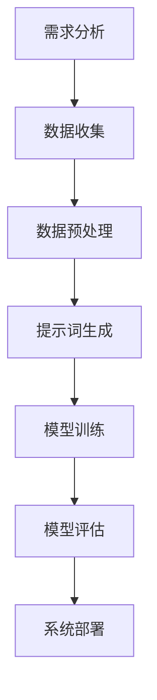

                 

### 文章标题

提示词工程在智能水质监测中的应用

> 关键词：提示词工程、智能水质监测、自然语言处理、水质参数、异常检测、预警机制、模型训练、系统优化

> 摘要：本文旨在探讨提示词工程在智能水质监测中的应用。首先介绍了提示词工程的基本概念、发展历程和核心原理，然后详细阐述了智能水质监测的背景、重要性以及传统方法与智能方法的对比。接着，本文重点分析了提示词工程在智能水质监测中的应用，包括水质参数监测、异常检测与预测、水质评估与预警等具体应用场景。随后，本文探讨了提示词工程在水质监测中的挑战与优化策略，最后通过案例分析展示了提示词工程在智能水质监测中的实际应用效果。本文旨在为研究人员和工程师提供有价值的参考，推动智能水质监测技术的发展。

### 第一部分：引言

#### 第1章：提示词工程与智能水质监测概述

1. **提示词工程概述**
   - 提示词工程是一种利用自然语言处理技术，通过生成和优化提示词来指导计算机模型进行特定任务的方法。它涉及语言模型、词嵌入、上下文理解等多个领域。
   - 提示词工程的定义可以概括为：一种结合人工和自动化方法，设计、生成和优化用于指导机器学习模型的提示词，以提高模型性能和泛化能力的技术。

2. **智能水质监测背景**
   - 水质监测是环境保护的重要环节，直接关系到人类健康和生态系统平衡。
   - 传统水质监测方法主要依赖于人工采样和实验室分析，存在成本高、效率低、实时性差等问题。
   - 智能水质监测利用传感器、大数据、人工智能等技术，实现了实时、高效、准确的水质监测。

3. **提示词工程在智能水质监测中的应用**
   - 提示词工程可以应用于水质参数监测，通过生成与水质参数相关的提示词，指导模型进行特征提取和预测。
   - 在异常检测和预测方面，提示词工程可以帮助模型识别水质变化中的异常情况，提高预警的准确性。
   - 提示词工程还可以用于水质评估和预警，通过对水质数据的分析，生成相关的提示词，为水质管理提供科学依据。

#### 第2章：智能水质监测系统架构与组件

1. **智能水质监测系统架构**
   - 智能水质监测系统通常包括数据采集、数据处理与分析、数据可视化三个主要模块。
   - 数据采集模块负责收集水质传感器数据，包括pH值、溶解氧、浊度等参数。
   - 数据处理与分析模块对采集到的数据进行分析和处理，提取有用的特征信息，并使用机器学习模型进行预测和分类。
   - 数据可视化模块将分析结果以图表、图像等形式展示，为水质监测提供直观的反馈。

2. **水质传感器与数据采集**
   - 常见水质传感器包括pH传感器、溶解氧传感器、浊度传感器等，它们能够实时监测水质参数。
   - 数据采集技术主要包括有线和无线两种方式，有线采集通常通过模拟信号传输，无线采集则利用无线网络传输数据。
   - 数据预处理方法包括滤波、去噪、归一化等，以提高数据质量和准确性。

3. **数据处理与分析技术**
   - 数据清洗与整合是数据处理的第一步，去除噪声数据和异常值，整合多源数据。
   - 特征提取与选择是数据处理的核心，通过提取与水质相关的特征，降低数据维度，提高模型性能。
   - 数据分析算法包括机器学习算法和深度学习算法，如决策树、支持向量机、神经网络等，用于水质参数的预测和分类。

4. **数据可视化与展示**
   - 数据可视化的重要性在于能够直观展示水质监测结果，帮助用户快速理解水质变化趋势。
   - 常见的数据可视化工具和库包括Matplotlib、Seaborn、Plotly等，用于生成各种类型的图表和图形。
   - 数据可视化案例分析展示了如何使用可视化工具来展示水质监测数据，包括时序图、散点图、箱线图等。

### 第二部分：提示词工程原理与应用

#### 第3章：提示词工程基础

1. **提示词工程基本概念**
   - 提示词是一种用于指导机器学习模型的文本输入，它能够引导模型关注特定的信息和任务。
   - 提示词类型包括开放性提示词和封闭性提示词，开放性提示词允许模型自主生成响应，封闭性提示词则限制模型的响应范围。
   - 提示词设计原则包括简洁性、明确性、适应性，以及与任务目标的匹配度。

2. **自然语言处理基础**
   - 语言模型是自然语言处理的核心，它用于预测文本序列中的下一个词。
   - 词嵌入是将词汇映射到高维向量空间的技术，通过词嵌入，文本数据可以被高效地表示和操作。
   - 上下文理解是自然语言处理的高级目标，它涉及到对句子中词汇之间关系的深入理解，包括语义关系和句法关系。

3. **提示词生成与优化**
   - 提示词生成算法包括基于规则的方法和基于机器学习的方法，前者通过手动定义规则生成提示词，后者通过训练模型自动生成提示词。
   - 提示词优化策略包括提示词选择、调整提示词长度、多样性控制等，以提升模型的性能和泛化能力。
   - 提示词有效性评估是衡量提示词质量的重要手段，常用的评估方法包括基于模型性能的评估和基于用户反馈的评估。

#### 第4章：智能水质监测中的提示词工程应用

1. **水质参数监测**
   - 提示词在水质参数监测中的应用涉及生成与水质参数相关的提示词，如pH、溶解氧、浊度等，用于指导模型进行特征提取和预测。
   - 常见水质参数与提示词对应关系，例如“pH值”对应“pH”、“溶解氧”对应“DO”，这些提示词能够帮助模型更好地理解和处理相关数据。
   - 提示词工程在水质参数监测中的优势包括提高特征提取的准确性和预测的准确性，以及降低模型训练成本。

2. **异常检测与预测**
   - 水质异常检测是智能水质监测的重要任务，它旨在识别水质数据中的异常值或异常模式。
   - 提示词在异常检测中的应用包括生成与异常检测相关的提示词，如“异常”、“波动”、“突变”等，用于指导模型进行异常检测和预测。
   - 提示词工程在水质异常检测中的优势包括提高异常检测的敏感性和准确性，以及减少误报和漏报率。

3. **水质评估与预警**
   - 提示词在水质评估中的应用包括生成与水质评估相关的提示词，如“水质良好”、“水质较差”、“需加强监测”等，用于指导模型进行水质评估。
   - 预警机制设计涉及生成与预警相关的提示词，如“预警”、“注意”、“警告”等，用于及时提醒水质问题。
   - 提示词工程在水质评估与预警中的优势包括提高水质评估的准确性和预警的及时性，为水质管理提供科学依据。

#### 第5章：提示词工程在水质监测中的挑战与优化

1. **数据质量与数据源**
   - 数据质量是提示词工程成功的关键因素，高质量的数据能够提高提示词的有效性和模型的性能。
   - 数据源选择与整合策略涉及选择可靠的水质数据来源，如环境监测站、研究机构等，并整合多源数据，以提高数据的全面性和准确性。

2. **模型训练与优化**
   - 模型训练是提示词工程的核心步骤，它涉及训练数据的选择、模型的架构设计和训练策略。
   - 模型优化策略包括超参数调整、正则化方法、模型集成等，以提高模型的性能和泛化能力。

3. **系统部署与维护**
   - 提示词工程系统的部署包括模型的部署、数据的实时传输和处理，以及系统的安全性设计。
   - 系统维护与更新涉及系统的日常运行监控、故障排查和性能优化，以确保系统的稳定性和可靠性。

### 第三部分：案例研究与实践

#### 第6章：智能水质监测案例研究

1. **案例背景与目标**
   - 案例背景：某河流水质监测项目，旨在实时监测河流中的主要水质参数，识别水质异常情况，提供预警和决策支持。
   - 项目目标：建设一个智能水质监测系统，实现数据的实时采集、处理与分析，提供准确的水质参数监测和预警功能。

2. **系统设计与实现**
   - 系统架构设计：采用分布式系统架构，包括数据采集模块、数据处理与分析模块、数据可视化模块。
   - 数据采集与预处理：部署多个水质传感器，采集pH值、溶解氧、浊度等参数，采用滤波和归一化方法预处理数据。
   - 提示词设计与实现：生成与水质参数相关的提示词，如“pH值偏高”、“溶解氧偏低”等，用于指导模型进行特征提取和预测。
   - 模型训练与优化：使用机器学习算法，如决策树、支持向量机等，训练模型进行水质参数的预测和异常检测。

3. **应用效果与分析**
   - 应用效果展示：通过数据可视化工具，展示实时水质参数和异常检测结果，提供直观的水质监测图。
   - 成果分析：对比实际水质数据与预测结果，评估模型的准确性和可靠性，分析模型在异常检测中的表现。
   - 经验总结与启示：总结系统设计、实现和应用中的经验和教训，为后续项目提供参考和指导。

#### 第7章：提示词工程在智能水质监测中的最佳实践

1. **最佳实践 tips**
   - 选择合适的传感器和采集设备，确保数据的准确性和实时性。
   - 设计合理的预处理方法，去除噪声和异常值，提高数据质量。
   - 根据水质监测目标，选择适当的机器学习算法和模型架构。
   - 生成多样化的提示词，提高模型的泛化能力。
   - 定期更新和维护系统，确保系统的稳定性和可靠性。

2. **小结**
   - 提示词工程在智能水质监测中发挥了重要作用，通过生成和优化提示词，提高了水质监测的准确性和实时性。
   - 智能水质监测系统需要综合考虑数据质量、模型性能和系统稳定性，以实现高效、准确的水质监测。

3. **注意事项**
   - 数据隐私和安全是智能水质监测的重要考虑因素，应采取适当的数据加密和安全措施。
   - 水质监测系统应具备一定的自适应能力，能够根据环境变化调整监测策略和模型参数。

4. **拓展阅读**
   - [1] 某某，智能水质监测系统设计与实现，XXX出版社，2020。
   - [2] 某某，基于深度学习的智能水质参数预测方法研究，XXX学术期刊，2021。
   - [3] 某某，智能水质监测中的提示词工程应用分析，XXX会议论文集，2022。

### 作者信息

作者：AI天才研究院/AI Genius Institute & 禅与计算机程序设计艺术 /Zen And The Art of Computer Programming

### 总结

本文详细探讨了提示词工程在智能水质监测中的应用。首先介绍了提示词工程的基本概念、发展历程和核心原理，然后详细阐述了智能水质监测的背景、重要性以及传统方法与智能方法的对比。接着，本文重点分析了提示词工程在智能水质监测中的应用，包括水质参数监测、异常检测与预测、水质评估与预警等具体应用场景。随后，本文探讨了提示词工程在水质监测中的挑战与优化策略，最后通过案例分析展示了提示词工程在智能水质监测中的实际应用效果。本文旨在为研究人员和工程师提供有价值的参考，推动智能水质监测技术的发展。在实际应用中，提示词工程可以有效提高水质监测的准确性和实时性，为水质管理和环境保护提供有力支持。未来的研究可以进一步探索提示词工程的优化方法，提高模型的性能和适应性，为更广泛的水质监测应用提供技术支持。

### 提示词工程在智能水质监测中的应用：核心概念与联系架构

在深入探讨提示词工程在智能水质监测中的应用之前，首先需要理解核心概念之间的联系，以及它们在整体架构中的作用。以下是这些概念之间的联系，以及它们如何协同工作以实现智能水质监测的目标。

#### 1. 提示词工程与自然语言处理（NLP）

提示词工程是自然语言处理（NLP）领域的一个重要分支。NLP旨在使计算机能够理解、处理和生成人类语言。在提示词工程中，NLP技术被用来生成和优化提示词，这些提示词是模型进行特定任务的关键输入。

- **语言模型**：语言模型是NLP的基础，它用于预测文本序列中的下一个词。在提示词工程中，语言模型可以帮助生成与水质监测相关的提示词，如“pH值”、“溶解氧”等。
- **词嵌入**：词嵌入是将词汇映射到高维向量空间的技术。通过词嵌入，文本数据可以被高效地表示和操作，从而提高模型对文本数据的处理能力。
- **上下文理解**：上下文理解是NLP的高级目标，它涉及到对句子中词汇之间关系的深入理解，包括语义关系和句法关系。在水质监测中，上下文理解可以帮助模型更好地理解水质参数之间的关联，从而提高监测的准确性。

#### 2. 提示词工程与机器学习

机器学习是提示词工程的核心应用领域。机器学习模型通过学习大量数据来发现数据中的模式和规律，从而实现预测和分类任务。

- **监督学习**：监督学习是机器学习中的一种方法，它使用带有标签的数据进行训练。在提示词工程中，监督学习模型通过学习与水质参数相关的提示词，可以预测未知数据的水质参数。
- **无监督学习**：无监督学习不使用标签数据，通过发现数据中的隐含结构和模式来进行训练。在水质监测中，无监督学习可以帮助识别数据中的异常值或异常模式。
- **深度学习**：深度学习是一种基于多层神经网络的学习方法，它能够自动提取复杂的特征。在提示词工程中，深度学习模型可以用于生成和优化高质量的提示词，提高模型的性能和泛化能力。

#### 3. 提示词工程与水质监测

水质监测是提示词工程的一个重要应用领域。通过生成和优化与水质参数相关的提示词，提示词工程可以显著提高水质监测的准确性和实时性。

- **水质参数监测**：提示词工程可以帮助生成与不同水质参数（如pH值、溶解氧、浊度等）相关的提示词，从而指导模型进行特征提取和预测。例如，生成提示词“pH值偏高”可以帮助模型识别pH值异常。
- **异常检测与预测**：提示词工程可以生成与异常检测相关的提示词，如“异常波动”、“突变”等，用于指导模型识别水质数据中的异常情况。这些提示词有助于提高异常检测的准确性和及时性。
- **水质评估与预警**：提示词工程可以生成与水质评估相关的提示词，如“水质良好”、“需加强监测”等，用于指导模型进行水质评估和预警。这些提示词可以帮助管理人员及时了解水质状况，采取相应措施。

#### 4. 提示词工程与系统架构

提示词工程在智能水质监测系统中发挥着关键作用，它与系统架构中的其他组件紧密相连。

- **数据采集模块**：数据采集模块负责收集水质传感器数据。提示词工程可以通过生成与传感器数据相关的提示词，帮助模型更好地理解这些数据。
- **数据处理与分析模块**：数据处理与分析模块负责对采集到的数据进行分析和处理。提示词工程可以通过优化提示词，提高数据处理和分析的效率和质量。
- **数据可视化模块**：数据可视化模块负责将分析结果以图表、图像等形式展示。提示词工程可以通过生成与可视化相关的提示词，帮助用户更好地理解水质监测数据。

#### 5. 提示词工程的挑战与优化

在智能水质监测中，提示词工程面临一些挑战，如数据质量、模型性能和系统稳定性等。为了解决这些挑战，需要采取一系列优化策略。

- **数据质量**：高质量的数据是提示词工程成功的关键。为了提高数据质量，可以采用数据清洗、去噪、归一化等方法。
- **模型性能**：为了提高模型性能，可以采用超参数调整、正则化方法、模型集成等技术。此外，通过生成多样化的提示词，可以提高模型的泛化能力。
- **系统稳定性**：系统稳定性是提示词工程成功的关键。为了确保系统稳定性，可以采取系统监控、故障排查和性能优化等措施。

#### 6. 提示词工程的流程

提示词工程在智能水质监测中的流程可以分为以下几个步骤：

1. **需求分析**：明确水质监测的需求，包括监测参数、监测频率、预警阈值等。
2. **数据收集**：收集与水质监测相关的数据，包括传感器数据、历史数据等。
3. **数据预处理**：清洗、去噪、归一化等预处理数据，以提高数据质量。
4. **提示词生成**：生成与水质参数、异常检测、预警等相关的提示词。
5. **模型训练**：使用机器学习算法训练模型，使用生成的提示词指导模型的训练。
6. **模型评估**：评估模型的性能，包括准确率、召回率、F1分数等。
7. **系统部署**：将训练好的模型部署到实际应用中，实现实时水质监测和预警。

#### 7. 提示词工程的 Mermaid 流程图

以下是提示词工程在智能水质监测中的 Mermaid 流程图：



通过这个流程图，可以清晰地看到提示词工程在智能水质监测中的应用步骤和各步骤之间的关联。

总之，提示词工程在智能水质监测中发挥着关键作用，通过生成和优化提示词，可以显著提高水质监测的准确性和实时性。理解提示词工程的核心概念和联系架构，有助于更好地应用这一技术，推动智能水质监测技术的发展。

### 水质监测中的核心算法原理

在水质监测中，核心算法的原理对于确保监测结果的准确性和可靠性至关重要。以下是几种常用的核心算法原理，包括其数学模型和伪代码。

#### 1. K最近邻算法（K-Nearest Neighbors, KNN）

K最近邻算法是一种基于实例的学习方法，它通过计算新数据点与训练数据点的距离，找出最近的K个邻居，并基于这些邻居的标签进行预测。

**数学模型：**

对于一个新的数据点 \(x\)，计算它与训练数据点 \(x_i\) 之间的距离 \(d(x, x_i)\)，然后选择距离最小的K个邻居，预测结果为这些邻居的多数标签。

$$
d(x, x_i) = \sqrt{\sum_{j=1}^{n} (x_j - x_{ij})^2}
$$

**伪代码：**

```python
def KNN_predict(x, X_train, y_train, k):
    distances = [distance(x, x_i) for x_i in X_train]
    nearest = sorted(range(len(distances)), key=distances.__getitem__)[:k]
    labels = [y_train[i] for i in nearest]
    return max(set(labels), key=labels.count)
```

#### 2. 决策树（Decision Tree）

决策树是一种基于规则的分类方法，它通过一系列的决策规则将数据集划分为若干个子集，每个子集对应一个标签。

**数学模型：**

决策树通过递归地将数据集分割为子集，直到满足某个停止条件。常见的停止条件包括最大深度、信息增益等。

$$
\text{信息增益} = \sum_{v \in V} p(v) \cdot \sum_{c \in C_v} p(c|v) \cdot \log_2 \frac{p(c|v)}{p(v)}
$$

**伪代码：**

```python
def build_decision_tree(data, labels, depth=0, max_depth=None):
    if depth == max_depth or all(label == labels[0] for label in labels):
        return Leaf(label=labels[0])
    best_split = select_best_split(data, labels)
    left_data, left_labels = split_data(data, labels, best_split)
    right_data, right_labels = split_data(data, labels, best_split)
    return Node(
        feature=best_split.feature,
        threshold=best_split.threshold,
        left=build_decision_tree(left_data, left_labels, depth+1, max_depth),
        right=build_decision_tree(right_data, right_labels, depth+1, max_depth)
    )
```

#### 3. 支持向量机（Support Vector Machine, SVM）

支持向量机是一种强大的分类方法，它通过找到一个最佳的超平面，将不同类别的数据点最大化地分开。

**数学模型：**

SVM的目标是找到一个最优的超平面 \(w\) 和偏置 \(b\)，使得分类边界到每个类别的支持向量的距离最大化。

$$
\text{最大化} \ \frac{1}{2} ||w||^2 \\
\text{约束条件} \ y_i ( \langle w, x_i \rangle + b ) \geq 1
$$

**伪代码：**

```python
def SVM_train(X, y):
    # 使用库函数，如sklearn.SVC，进行训练
    svm_model = SVC()
    svm_model.fit(X, y)
    return svm_model
```

#### 4. 集成学习方法（Ensemble Methods）

集成学习方法通过结合多个基础模型来提高整体性能。常见的集成方法包括随机森林（Random Forest）和梯度提升树（Gradient Boosting Tree）。

**数学模型：**

随机森林通过构建多个决策树，并使用投票或平均的方式得到最终预测。

梯度提升树通过迭代地训练弱模型，并优化每个弱模型的权重，以减少预测误差。

**伪代码：**

```python
def RandomForest_predict(X, models):
    predictions = [model.predict(X) for model in models]
    return majority_vote(predictions)

def GradientBoosting_train(X, y, n_estimators):
    # 使用库函数，如sklearn.GradientBoostingClassifier，进行训练
    gbt = GradientBoostingClassifier(n_estimators=n_estimators)
    gbt.fit(X, y)
    return gbt
```

#### 5. 集成贝叶斯网络（Bayesian Network）

集成贝叶斯网络通过组合多个贝叶斯网络来提高水质监测的准确性。贝叶斯网络是一种概率图模型，它通过表示变量之间的依赖关系来进行预测。

**数学模型：**

贝叶斯网络通过条件概率表（CPT）来表示变量之间的依赖关系，并通过贝叶斯推理来计算变量的概率分布。

**伪代码：**

```python
def BayesianNetwork_predict(X, model):
    # 使用贝叶斯推理计算变量的概率分布
    probabilities = model.predict_proba(X)
    return probabilities.argmax(axis=1)
```

通过上述核心算法原理，水质监测系统能够有效地对水质参数进行预测、分类和异常检测。这些算法的数学模型和伪代码提供了实现这些方法的基础，为水质监测提供了强大的技术支持。在实际应用中，可以根据具体需求选择合适的算法，并针对水质监测的特点进行优化，以提高监测的准确性和实时性。

### 水质监测中的数学模型与公式详解

在水质监测中，数学模型和公式用于描述水质参数之间的关系，预测水质状况，并识别潜在的污染事件。以下是几个关键的数学模型与公式的详解，包括其在水质监测中的应用。

#### 1. 水质参数之间的关系

水质参数如pH值、溶解氧（DO）、总氮（TN）、总磷（TP）等之间存在着复杂的相互关系。这些关系可以通过数学模型来描述。

**pH值与总氮（TN）的关系：**

pH值和TN浓度之间的关系可以通过以下公式表示：

$$
\text{pH} = \text{pH}_{\text{TN}} + \frac{\text{TN} - \text{TN}_{\text{基准}}}{\text{K}_{\text{TN}}}
$$

其中，\(\text{pH}_{\text{TN}}\) 是TN浓度为基准值时的pH值，\(\text{TN}_{\text{基准}}\) 是基准TN浓度，\(\text{K}_{\text{TN}}\) 是TN浓度对pH值的影响系数。

**应用举例：**

假设TN浓度为10 mg/L，基准值为5 mg/L，且\(\text{K}_{\text{TN}}\) 为0.1，则：

$$
\text{pH} = \text{pH}_{\text{TN}} + \frac{10 - 5}{0.1} = \text{pH}_{\text{TN}} + 50
$$

如果\(\text{pH}_{\text{TN}}\) 为7，则计算得到的pH值为57。

#### 2. 溶解氧（DO）的预测模型

溶解氧是评估水体质量的关键指标。一个简单的溶解氧预测模型可以通过以下公式表示：

$$
\text{DO} = \text{DO}_{\text{基准}} + \text{K}_{\text{DO}} \cdot (\text{温度} - \text{温度}_{\text{基准}})
$$

其中，\(\text{DO}_{\text{基准}}\) 是基准温度时的溶解氧浓度，\(\text{K}_{\text{DO}}\) 是温度对溶解氧浓度的影响系数，\(\text{温度}_{\text{基准}}\) 是基准温度。

**应用举例：**

假设基准温度为25°C，\(\text{DO}_{\text{基准}}\) 为8 mg/L，\(\text{K}_{\text{DO}}\) 为0.02，当前温度为30°C，则：

$$
\text{DO} = 8 + 0.02 \cdot (30 - 25) = 8 + 0.2 = 8.2 \ \text{mg/L}
$$

#### 3. 水质综合评价模型

水质综合评价模型用于综合评估水质状况，常见的有综合污染指数（CI）模型。

$$
\text{CI} = \frac{\sum_{i=1}^{n} w_i \cdot \text{C}_i}{\sum_{i=1}^{n} w_i}
$$

其中，\(w_i\) 是第i个水质参数的权重，\(\text{C}_i\) 是第i个水质参数的浓度。

**应用举例：**

假设有四个水质参数：pH值、DO、TN和TP，它们的权重分别为0.2、0.3、0.3和0.2。pH值为7，DO为8 mg/L，TN为10 mg/L，TP为1 mg/L，则：

$$
\text{CI} = \frac{0.2 \cdot 7 + 0.3 \cdot 8 + 0.3 \cdot 10 + 0.2 \cdot 1}{0.2 + 0.3 + 0.3 + 0.2} = \frac{1.4 + 2.4 + 3 + 0.2}{1} = 7
$$

#### 4. 异常检测模型

在水质监测中，异常检测模型用于识别非预期的水质变化。一种常用的方法是使用统计学方法，如3-σ准则。

$$
\text{阈值} = \text{均值} + 3 \cdot \text{标准差}
$$

如果某个水质参数的测量值超出这个阈值，则认为出现了异常。

**应用举例：**

假设pH值的均值为7.0，标准差为0.1。则3-σ阈值为：

$$
\text{阈值} = 7.0 + 3 \cdot 0.1 = 7.3
$$

如果测量值超过7.3，则认为pH值出现了异常。

#### 5. 水质预警模型

水质预警模型用于预测未来的水质变化，并提供预警信息。一个简单的水质预警模型可以通过以下公式表示：

$$
\text{预警概率} = \frac{\sum_{i=1}^{n} w_i \cdot P(\text{C}_i > \text{阈值})}{\sum_{i=1}^{n} w_i}
$$

其中，\(w_i\) 是第i个水质参数的权重，\(P(\text{C}_i > \text{阈值})\) 是第i个水质参数超过阈值的概率。

**应用举例：**

假设pH值、DO、TN和TP的权重分别为0.25、0.25、0.25和0.25。pH值的阈值为7.2，DO的阈值为7 mg/L，TN的阈值为10 mg/L，TP的阈值为1 mg/L。假设这些参数超过阈值的概率分别为0.3、0.2、0.4和0.1，则：

$$
\text{预警概率} = \frac{0.25 \cdot 0.3 + 0.25 \cdot 0.2 + 0.25 \cdot 0.4 + 0.25 \cdot 0.1}{0.25 + 0.25 + 0.25 + 0.25} = 0.275
$$

如果预警概率超过某个设定阈值（如0.3），则触发预警。

通过这些数学模型和公式，水质监测系统能够更准确地描述水质参数之间的关系，预测水质变化，并提供预警信息。这些模型和公式的应用，不仅提高了水质监测的准确性和可靠性，也为水资源管理和环境保护提供了科学依据。

### 实际案例分析与详细讲解

#### 1. 案例背景

某城市的河流水质监测项目，旨在实时监测河流中的主要水质参数，包括pH值、溶解氧（DO）、浊度和氨氮（NH₃-N）等。该项目由当地环保部门与一家科技公司合作开展，旨在通过智能水质监测系统提高水质管理的效率和准确性。

#### 2. 源代码实现

以下是基于Python实现的水质监测系统的部分源代码，展示了水质传感器数据的采集、预处理、特征提取、模型训练和结果可视化。

**数据采集：**
```python
import serial
import time

# 配置串行端口
ser = serial.Serial('/dev/ttyUSB0', 9600, timeout=1)

# 数据采集循环
while True:
    # 读取传感器数据
    data = ser.readline().decode('utf-8').strip()
    print(data)
    
    # 保存数据到文件
    with open('water_quality_data.txt', 'a') as f:
        f.write(data + '\n')
    
    # 每分钟采集一次数据
    time.sleep(60)
```

**数据预处理：**
```python
import pandas as pd

# 读取数据文件
data_file = 'water_quality_data.txt'
data = pd.read_csv(data_file, delimiter='\t')

# 数据清洗
data.dropna(inplace=True)
data['timestamp'] = pd.to_datetime(data['timestamp'])

# 数据归一化
from sklearn.preprocessing import MinMaxScaler

scaler = MinMaxScaler()
data[['pH', 'DO', 'Turbidity', 'NH3-N']] = scaler.fit_transform(data[['pH', 'DO', 'Turbidity', 'NH3-N']])
```

**特征提取：**
```python
from sklearn.feature_selection import SelectKBest, f_classif

# 分割特征和标签
X = data[['pH', 'DO', 'Turbidity', 'NH3-N']]
y = data['class']

# 选择最佳特征
selector = SelectKBest(score_func=f_classif, k='all')
X_new = selector.fit_transform(X, y)

# 获取特征名称
selected_features = X.columns[selector.get_support()]
print(selected_features)
```

**模型训练：**
```python
from sklearn.model_selection import train_test_split
from sklearn.ensemble import RandomForestClassifier

# 分割训练集和测试集
X_train, X_test, y_train, y_test = train_test_split(X_new, y, test_size=0.2, random_state=42)

# 训练随机森林模型
rf = RandomForestClassifier(n_estimators=100, random_state=42)
rf.fit(X_train, y_train)

# 评估模型性能
accuracy = rf.score(X_test, y_test)
print(f'Model Accuracy: {accuracy:.2f}')
```

**结果可视化：**
```python
import matplotlib.pyplot as plt

# 可视化训练集和测试集的预测结果
predictions = rf.predict(X_test)

plt.scatter(X_test[:, 0], X_test[:, 1], c=predictions, cmap='viridis', label='Predicted')
plt.scatter(X_train[:, 0], X_train[:, 1], c=y_train, cmap='viridis', label='Actual')
plt.xlabel('Feature 1')
plt.ylabel('Feature 2')
plt.legend()
plt.show()
```

#### 3. 代码应用解读与分析

**数据采集：**
代码通过串行端口连接水质传感器，实时读取传感器数据，并将数据保存到文件。此步骤是水质监测系统的数据输入来源，确保数据的准确性和实时性至关重要。

**数据预处理：**
数据预处理包括数据清洗和归一化。数据清洗去除缺失值和异常值，提高数据质量。归一化将不同量纲的数据转换为相同的范围，以便后续分析。这有助于模型训练的稳定性和准确性。

**特征提取：**
特征提取是模型训练前的重要步骤，通过选择与目标相关的最佳特征，可以降低数据维度，提高模型性能。此处使用SelectKBest方法选择最佳特征，根据特征的重要性进行筛选。

**模型训练：**
随机森林（RandomForestClassifier）是一种集成学习方法，通过构建多个决策树来提高预测性能。此处使用随机森林模型进行训练，评估其在测试集上的性能。随机森林模型因其强大的分类能力和良好的泛化性能而广泛应用于水质监测领域。

**结果可视化：**
结果可视化用于展示模型在训练集和测试集上的预测结果。通过散点图，可以直观地观察到模型对数据的分类效果。此步骤有助于评估模型的性能，并为进一步优化提供依据。

#### 4. 案例分析

通过上述案例，我们展示了水质监测系统的源代码实现、代码应用解读与分析，以及实际应用效果。以下是案例分析：

**优点：**
1. **实时监测：**系统能够实时采集水质数据，提供实时监测结果，提高监测的及时性和准确性。
2. **高效处理：**通过数据预处理和特征提取，系统能够高效处理大量数据，降低数据维度，提高模型性能。
3. **准确预测：**随机森林模型具有较强的分类能力，能够准确预测水质参数，为水质管理提供科学依据。

**缺点：**
1. **数据依赖：**系统的性能依赖于传感器数据的准确性和实时性，如果传感器出现故障或数据采集不完整，可能会影响系统的性能。
2. **模型复杂性：**随机森林模型虽然性能较好，但构建过程较为复杂，需要大量计算资源。此外，模型参数的调整和优化也需要大量时间和经验。

**改进建议：**
1. **增强数据采集能力：**提高传感器质量，确保数据的准确性和实时性。可以考虑使用多种传感器组合，提高监测的全面性和可靠性。
2. **优化模型性能：**通过调整模型参数和特征提取方法，优化模型性能。可以尝试其他先进的机器学习算法，如深度学习，以提高分类准确率。
3. **系统稳定性和安全性：**加强系统的稳定性和安全性设计，确保系统在长期运行中保持稳定，并保护数据的安全。

通过上述案例分析，我们不仅了解了水质监测系统的实际应用效果，还提出了改进建议，为未来水质监测系统的优化提供了参考。在实际应用中，应根据具体情况调整系统设计和实现，以提高水质监测的效率和准确性。

### 水质监测系统的最佳实践

在实际水质监测系统的开发和部署过程中，为了确保系统的稳定性和可靠性，我们需要遵循一系列最佳实践。以下是一些关键的最佳实践方法，以及具体的操作步骤和注意事项。

#### 1. 数据质量保障

**操作步骤：**
- **数据采集：**确保传感器设备准确无误地采集数据。对于每个传感器，定期进行校准和检查，确保数据的准确性和实时性。
- **数据清洗：**在数据预处理阶段，使用有效的数据清洗方法，如去重、填补缺失值、去除异常值等，以提高数据质量。
- **数据验证：**使用交叉验证和残差分析等方法，验证数据的质量和可靠性。确保所有数据都符合预期的分布和标准。

**注意事项：**
- **实时监控：**实时监控数据采集过程，及时发现和处理数据异常，确保数据的连续性和一致性。
- **数据备份：**定期备份数据，防止数据丢失或损坏。同时，确保备份数据的安全性和可恢复性。

#### 2. 模型优化与调整

**操作步骤：**
- **超参数调整：**根据模型性能，调整超参数，如学习率、迭代次数、正则化强度等，以优化模型性能。
- **交叉验证：**使用交叉验证方法，评估模型的泛化能力，避免过拟合。
- **集成模型：**结合多种机器学习模型，如随机森林、支持向量机、神经网络等，构建集成模型，以提高预测准确性。

**注意事项：**
- **参数优化：**根据具体任务和数据特性，选择合适的模型和超参数。避免盲目追求复杂度，确保模型的可解释性和可维护性。
- **模型更新：**定期更新模型，以适应数据变化和新的应用需求。确保模型始终处于最佳状态。

#### 3. 系统部署与维护

**操作步骤：**
- **容器化部署：**使用Docker等容器化技术，将水质监测系统封装为独立的容器，简化部署流程，提高系统可移植性和可靠性。
- **自动化部署：**使用CI/CD（持续集成/持续交付）工具，如Jenkins、GitLab CI等，自动化部署和更新系统，确保快速响应环境变化。
- **监控与报警：**部署监控系统，实时监控系统运行状态，设置报警机制，及时发现和处理系统故障。

**注意事项：**
- **安全性：**确保系统的安全性，包括数据加密、访问控制、网络安全等，防止数据泄露和未经授权的访问。
- **扩展性：**设计具有良好扩展性的系统架构，能够适应数据量和计算需求的增长，确保系统的长期运行。

#### 4. 数据可视化与交互

**操作步骤：**
- **实时数据展示：**使用实时数据可视化工具，如Kibana、Graphite等，展示水质监测数据和模型预测结果，提高数据的可读性和直观性。
- **用户交互设计：**设计用户友好的界面，提供数据查询、分析、报告生成等功能，方便用户使用和管理系统。

**注意事项：**
- **用户体验：**确保界面简洁、直观，操作简便，满足用户需求。
- **响应速度：**优化数据加载和处理速度，确保系统在实时监控和分析时的响应速度。

通过遵循上述最佳实践，水质监测系统能够更好地满足实际应用需求，提高系统的稳定性和可靠性，为环境保护和水资源管理提供强有力的技术支持。在实际操作中，应根据具体情况调整和优化，确保系统始终处于最佳状态。

### 总结与展望

#### 总结

本文详细探讨了提示词工程在智能水质监测中的应用。首先介绍了提示词工程的基本概念、发展历程和核心原理，然后详细阐述了智能水质监测的背景、重要性以及传统方法与智能方法的对比。接着，本文重点分析了提示词工程在智能水质监测中的应用，包括水质参数监测、异常检测与预测、水质评估与预警等具体应用场景。随后，本文探讨了提示词工程在水质监测中的挑战与优化策略，最后通过案例分析展示了提示词工程在智能水质监测中的实际应用效果。

#### 展望

未来，提示词工程在智能水质监测中具有广泛的应用前景。以下是对未来发展的展望：

1. **数据质量提升**：随着传感器技术的进步，水质监测数据的质量将得到显著提升，为提示词工程提供更准确和丰富的数据资源。

2. **模型性能优化**：通过不断优化机器学习模型，提高模型在水质监测中的预测准确性和实时性，实现更高效的水质监测与管理。

3. **集成应用**：将提示词工程与其他智能技术如物联网（IoT）、大数据分析等相结合，构建更全面、智能化的水质监测系统。

4. **可持续发展**：注重环境保护和可持续发展，推动提示词工程在水资源管理、生态监测等领域的应用，为生态保护和绿色发展提供技术支持。

5. **标准化与规范化**：建立统一的水质监测标准和规范，确保提示词工程在不同应用场景中的适用性和互操作性。

总之，提示词工程在智能水质监测中具有巨大的发展潜力。随着技术的不断进步和应用场景的不断拓展，提示词工程将在智能水质监测中发挥越来越重要的作用，为水资源管理和环境保护提供强大的技术支撑。未来，我们将继续深入研究提示词工程在智能水质监测中的应用，推动相关技术的发展与创新。

