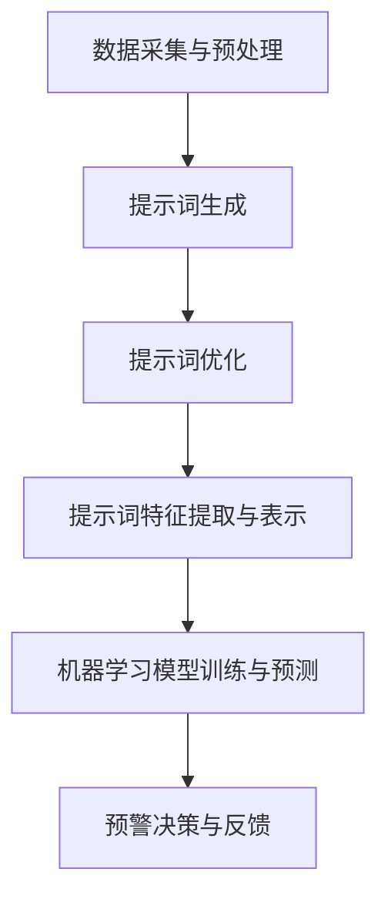

                 


### 书籍标题：提示词工程在智能灾害预警中的应用

关键词：提示词工程、智能灾害预警、数据采集、预处理、深度学习、算法优化、架构设计、案例分析

摘要：本文章深入探讨了提示词工程在智能灾害预警系统中的应用。首先，文章概述了提示词工程的基本概念、关键要素和其在灾害预警中的背景。接着，文章详细介绍了智能灾害预警系统的基础架构和优势。随后，文章逐步分析了提示词工程的核心算法原理，包括数据采集与预处理、提示词生成与优化、提示词特征提取与表示等。文章还通过实例展示了提示词工程在智能灾害预警系统中的具体应用和实践效果。最后，文章总结了提示词工程在智能灾害预警中的应用挑战和未来发展方向。

### 第一部分：引言与背景

#### 1.1 书籍概述

##### 1.1.1 书籍主题介绍

本书籍旨在深入探讨提示词工程在智能灾害预警系统中的应用。提示词工程作为一种数据处理和特征提取的技术，在智能灾害预警中具有重要作用。通过分析灾害数据、生成有效提示词，并对其进行优化和特征提取，可以提升灾害预警系统的准确性和实时性。

##### 1.1.2 书籍目标读者群体

本书主要面向计算机科学、数据科学、人工智能领域的专业人士，包括研究人员、工程师和学者。同时，对于对智能灾害预警系统和提示词工程感兴趣的读者，也能从中获得有价值的知识和启示。

##### 1.1.3 书籍结构安排

本书分为五个部分，首先介绍提示词工程和智能灾害预警系统的基本概念和背景。接着，详细分析提示词工程的核心算法原理，包括数据采集与预处理、提示词生成与优化、提示词特征提取与表示等。然后，通过实际案例研究，展示提示词工程在智能灾害预警系统中的应用效果。最后，文章总结了提示词工程在智能灾害预警中的应用挑战和未来发展方向。

#### 1.2 提示词工程概述

##### 1.2.1 提示词工程定义

提示词工程是一种基于数据分析和机器学习的技术，旨在从大量数据中提取出有用的信息，并生成一系列提示词（Keywords）。这些提示词可以用于后续的数据处理、特征提取和模式识别任务。

##### 1.2.2 提示词工程的关键要素

提示词工程的关键要素包括数据采集、数据预处理、提示词生成、提示词优化、提示词特征提取和提示词表示。每个要素都在提示词工程中起到至关重要的作用。

1. 数据采集：从各种来源（如传感器、社交媒体、遥感等）收集灾害相关数据。
2. 数据预处理：对原始数据进行清洗、去噪、归一化等处理，提高数据质量。
3. 提示词生成：使用自然语言处理（NLP）和机器学习算法，从预处理后的数据中生成提示词。
4. 提示词优化：对生成的提示词进行筛选和优化，以提高其准确性和有效性。
5. 提示词特征提取：将提示词转化为特征向量，用于后续的特征提取和模式识别。
6. 提示词表示：将特征向量进行编码和表示，以便于在机器学习模型中进行训练和预测。

##### 1.2.3 提示词工程在灾害预警中的应用背景

随着自然灾害的频发和危害性的增加，灾害预警系统变得越来越重要。传统的灾害预警方法主要依赖于人力和传统的监测手段，存在预警延迟、准确性低、实时性差等问题。而智能灾害预警系统通过应用提示词工程技术，可以实现实时、准确和高效的灾害预警。提示词工程在灾害预警中的应用，使得系统能够更好地理解灾害相关数据，生成有效的提示词，并进行实时预警，从而提高灾害应对的效率和效果。

#### 1.3 智能灾害预警系统概述

##### 1.3.1 灾害预警系统的基础架构

灾害预警系统通常包括以下几个主要模块：

1. 数据采集模块：负责从各种数据源（如气象卫星、地震仪、传感器等）收集灾害相关数据。
2. 数据处理模块：对采集到的数据进行预处理，包括去噪、归一化、异常检测等。
3. 模型训练模块：使用历史数据和灾害特征，训练机器学习模型，以预测未来的灾害事件。
4. 预警决策模块：根据模型预测结果和实时数据，生成预警信息，并通知相关人员和部门。
5. 用户接口模块：提供用户界面，显示预警信息、地图、统计数据等，方便用户获取和了解灾害预警信息。

##### 1.3.2 智能灾害预警系统的优势

智能灾害预警系统相比传统方法具有以下优势：

1. 实时性：能够实时监测和预测灾害事件，及时发出预警信息。
2. 准确性：通过机器学习和深度学习算法，提高灾害预测的准确性。
3. 范围广：可以覆盖广泛的地区和多种类型的灾害，如地震、洪水、台风等。
4. 自动化：减少了对人力和传统监测手段的依赖，实现自动化的灾害预警。
5. 预警效率高：能够快速处理大量数据，提高预警的效率和质量。

##### 1.3.3 智能灾害预警系统的现状与发展趋势

随着计算机技术、传感器技术和通信技术的发展，智能灾害预警系统已经得到了广泛应用。目前，许多国家和地区都建立了智能灾害预警系统，并不断进行优化和升级。未来，智能灾害预警系统的发展趋势包括：

1. 多源数据融合：整合多种数据源，提高灾害预警的准确性和全面性。
2. 深度学习与人工智能：运用深度学习和人工智能技术，提高灾害预测和预警的能力。
3. 实时监测与预警：实现更实时的灾害监测和预警，提高应急响应的效率。
4. 跨学科合作：加强跨学科合作，将气象学、地理学、计算机科学等领域的知识应用于灾害预警。
5. 社会经济影响：提高灾害预警系统的社会经济效益，减少灾害造成的损失。

通过本部分的内容，读者可以对提示词工程在智能灾害预警系统中的应用有一个初步的了解。接下来，我们将进一步探讨提示词工程的基础和核心算法原理。

### 第二部分：提示词工程基础

#### 2.1 数据采集与预处理

##### 2.1.1 提示词数据采集方法

提示词数据的采集是提示词工程中的第一步，其质量直接影响后续的提示词生成、优化和特征提取。以下是几种常用的提示词数据采集方法：

1. **传感器数据采集**：利用各种传感器（如气象站、地震仪、GPS等）收集与灾害相关的数据。这些数据通常包括温度、湿度、气压、地震波传播速度、地理位置等信息。

2. **社交媒体数据采集**：从社交媒体平台（如Twitter、Facebook、微信等）获取与灾害相关的用户生成内容（User-Generated Content，UGC）。这些内容通常包括文本、图片、视频等多媒体数据。

3. **遥感数据采集**：利用遥感技术（如卫星遥感、无人机遥感等）获取地球表面的灾害相关图像和数据。这些数据可以提供高分辨率的地面信息，有助于灾害预警和灾害评估。

4. **历史数据采集**：从历史灾害数据集、气象数据集、地震数据集等中获取与灾害相关的数据。这些数据可以用于训练和评估提示词工程算法的性能。

##### 2.1.2 数据预处理流程

数据预处理是提示词工程中至关重要的一步，其目的是提高数据质量、降低噪声、去除异常值，以及统一数据格式。以下是常见的数据预处理流程：

1. **数据清洗**：清洗原始数据，去除重复数据、无效数据和错误数据。例如，去除重复的传感器数据记录、去除无效的社交媒体帖子等。

2. **去噪**：对原始数据进行去噪处理，降低噪声对提示词生成和特征提取的影响。例如，使用滤波器去除传感器数据的噪声、使用图像增强技术去除遥感数据的噪声等。

3. **数据归一化**：将不同来源、不同单位和不同量级的原始数据转换为统一的格式，以便于后续处理。例如，将不同传感器的温度数据归一化到相同的温度范围、将不同地区的降雨量数据归一化到相同的量级。

4. **特征提取**：从原始数据中提取与灾害相关的特征，如温度变化率、降雨量、地震波传播速度等。这些特征将用于生成提示词。

5. **数据融合**：整合来自多个数据源的数据，提高数据的完整性和准确性。例如，将传感器数据和社交媒体数据融合，提高灾害预警的全面性。

##### 2.1.3 数据质量评估与优化

数据质量是提示词工程成功的关键因素之一。以下是几种常用的数据质量评估与优化方法：

1. **数据完整性评估**：检查数据集的完整性，确保没有缺失值或异常值。例如，通过统计分析方法检查传感器数据的缺失值、通过文本分析方法检查社交媒体数据的缺失值。

2. **数据准确性评估**：评估数据集的准确性，确保数据真实可靠。例如，通过对比真实数据和采集到的数据，评估传感器数据的准确性、通过对比历史数据和采集到的数据，评估社交媒体数据的准确性。

3. **数据一致性评估**：检查数据集的一致性，确保不同数据源之间的数据具有一致性。例如，通过比较传感器数据的时间和空间一致性、通过比较社交媒体数据和遥感数据的地理一致性。

4. **数据优化**：针对评估中发现的问题，对数据集进行优化。例如，通过插值方法填补缺失值、通过滤波器去除异常值、通过数据融合方法提高数据的一致性。

通过数据采集、预处理、质量评估和优化，可以确保提示词数据的质量，从而为后续的提示词生成、优化和特征提取奠定坚实基础。

#### 2.2 提示词生成与优化

##### 2.2.1 提示词生成算法介绍

提示词生成是提示词工程中的核心步骤，旨在从大量的数据中提取出与灾害相关的关键词或短语。以下是几种常用的提示词生成算法：

1. **基于统计学的算法**：如TF-IDF（Term Frequency-Inverse Document Frequency）和TextRank等。这些算法通过计算词频和逆文档频率，识别出重要关键词。

2. **基于机器学习的算法**：如朴素贝叶斯分类器、支持向量机（SVM）和深度学习模型等。这些算法通过学习历史数据和灾害特征，自动识别出与灾害相关的关键词。

3. **基于自然语言处理的算法**：如词嵌入（Word Embedding）、序列标注（Sequence Labeling）和转移矩阵（Transition Matrix）等。这些算法通过深入分析文本结构和语义，生成有效的提示词。

##### 2.2.2 提示词优化策略

提示词优化是提高提示词质量和准确性的重要环节。以下是几种常用的提示词优化策略：

1. **去重和筛选**：去除重复和冗余的提示词，筛选出最相关的关键词。例如，通过哈希表去重、通过统计方法筛选高频词。

2. **词性标注**：对生成的提示词进行词性标注，去除无意义的停用词和标点符号，保留有意义的词语。例如，使用词性标注器（如NLTK、Stanford NLP等）进行标注。

3. **语义分析**：利用深度学习模型（如BERT、GPT等）进行语义分析，识别出具有较高语义相关性的提示词。例如，通过文本分类、关系提取等方法进行语义分析。

4. **多源数据融合**：整合来自不同数据源（如传感器、社交媒体、遥感等）的提示词，提高提示词的全面性和准确性。例如，通过数据融合算法（如关联规则学习、聚类等）进行融合。

5. **自动调整阈值**：根据具体应用场景和需求，自动调整提示词生成的阈值，优化提示词的生成质量。例如，通过交叉验证、网格搜索等方法调整阈值。

##### 2.2.3 提示词质量评估方法

提示词质量评估是确保提示词工程效果的重要环节。以下是几种常用的提示词质量评估方法：

1. **基于准确率和召回率**：计算提示词的准确率和召回率，评估提示词的生成质量。例如，通过精确率和召回率评估基于统计学的算法。

2. **基于F1值**：计算提示词的F1值，综合评估准确率和召回率。例如，通过F1值评估基于机器学习的算法。

3. **基于语义相似度**：计算提示词的语义相似度，评估提示词的语义相关性。例如，通过余弦相似度评估基于自然语言处理的算法。

4. **基于用户反馈**：收集用户对提示词的反馈，评估提示词的实用性。例如，通过问卷调查、用户评分等方法收集反馈。

5. **基于应用效果**：在实际应用场景中，评估提示词对灾害预警的效果。例如，通过评估预警准确率、响应时间等指标。

通过提示词生成和优化策略，可以生成高质量、高相关的提示词，为智能灾害预警系统提供有力支持。

#### 2.3 提示词特征提取与表示

##### 2.3.1 提示词特征提取技术

提示词特征提取是将生成的提示词转化为特征向量，以便于在机器学习模型中进行训练和预测。以下是几种常用的提示词特征提取技术：

1. **词袋模型（Bag of Words，BOW）**：将提示词表示为词袋，每个词作为一个特征，统计词的频率。例如，使用词袋模型提取文本数据中的关键词。

2. **TF-IDF（Term Frequency-Inverse Document Frequency）**：计算每个词的频率和逆文档频率，生成权重较高的特征向量。例如，使用TF-IDF提取文本数据中的关键词。

3. **词嵌入（Word Embedding）**：将每个词映射到一个低维的向量空间，保留词的语义信息。例如，使用Word2Vec、GloVe等方法提取文本数据中的关键词。

4. **序列标注（Sequence Labeling）**：对提示词进行标注，生成序列化的特征向量。例如，使用BiLSTM（双向长短时记忆网络）提取文本数据中的关键词。

5. **转移矩阵（Transition Matrix）**：计算提示词之间的转移概率，生成转移矩阵作为特征向量。例如，使用转移矩阵提取文本数据中的关键词。

##### 2.3.2 提示词表示方法

提示词表示是将特征向量进行编码和表示，以便于在机器学习模型中进行训练和预测。以下是几种常用的提示词表示方法：

1. **One-Hot编码**：将每个特征进行独热编码，生成一个二进制向量。例如，使用One-Hot编码将文本数据中的关键词进行表示。

2. **稀疏编码**：将每个特征进行稀疏编码，降低特征维度的同时保留特征信息。例如，使用稀疏编码将文本数据中的关键词进行表示。

3. **嵌入编码**：将每个特征向量映射到低维空间，保留特征信息。例如，使用嵌入编码将文本数据中的关键词进行表示。

4. **嵌入与变换**：将特征向量进行嵌入和变换，生成新的特征向量。例如，使用嵌入与变换将文本数据中的关键词进行表示。

##### 2.3.3 提示词特征融合策略

提示词特征融合是将多个特征提取技术生成的特征向量进行融合，以提高特征表示的准确性和多样性。以下是几种常用的提示词特征融合策略：

1. **加和融合**：将多个特征向量进行加和，生成新的特征向量。例如，将词袋模型、TF-IDF和词嵌入生成的特征向量进行加和融合。

2. **加权融合**：对多个特征向量进行加权融合，根据特征的重要程度分配不同的权重。例如，使用不同权重将词袋模型、TF-IDF和词嵌入生成的特征向量进行融合。

3. **组合融合**：将多个特征提取技术生成的特征向量进行组合，生成新的特征向量。例如，将词袋模型、TF-IDF和词嵌入生成的特征向量进行组合融合。

4. **深度融合**：使用深度学习模型（如CNN、RNN等）对多个特征提取技术生成的特征向量进行融合，生成新的特征向量。例如，使用深度学习模型将词袋模型、TF-IDF和词嵌入生成的特征向量进行融合。

通过提示词特征提取与表示技术，可以将生成的提示词转化为有效的特征向量，为智能灾害预警系统提供强有力的支持。

#### 2.4 提示词工程的核心算法原理

提示词工程的核心算法原理是构建一个高效、准确、可扩展的提示词生成、优化和特征提取系统，以支持智能灾害预警系统的需求。以下是提示词工程核心算法原理的详细讲解，包括算法流程、伪代码和评价指标。

##### 2.4.1 Mermaid流程图：提示词工程核心算法流程

以下是一个简化的Mermaid流程图，用于描述提示词工程的核心算法流程：



1. **数据采集与预处理**：从各种数据源（如传感器、社交媒体、遥感等）收集原始数据，并进行清洗、去噪、归一化等预处理步骤，以提高数据质量。
2. **提示词生成**：使用自然语言处理（NLP）和机器学习算法，从预处理后的数据中生成提示词。常用的方法包括TF-IDF、词嵌入、序列标注等。
3. **提示词优化**：对生成的提示词进行去重、筛选、语义分析等优化步骤，以提高提示词的准确性和相关性。
4. **提示词特征提取与表示**：将优化后的提示词转化为特征向量，使用词袋模型、TF-IDF、词嵌入等技术，生成高维度的特征向量。
5. **机器学习模型训练与预测**：使用训练集对机器学习模型（如朴素贝叶斯、SVM、深度学习等）进行训练，并使用测试集进行预测，以评估模型的性能。
6. **预警决策与反馈**：根据模型的预测结果和实时数据，生成预警信息，并通知相关人员和部门。同时，收集用户反馈，不断优化提示词工程系统。

##### 2.4.2 伪代码：提示词工程关键算法实现

以下是提示词工程关键算法的伪代码实现：

```python
# 提示词生成
def generate_keywords(data):
    keywords = []
    for document in data:
        keywords.append(extract_keywords(document))
    return keywords

# 提示词优化
def optimize_keywords(keywords):
    optimized_keywords = []
    for keyword in keywords:
        optimized_keyword = filter_and_sort(keyword)
        optimized_keywords.append(optimized_keyword)
    return optimized_keywords

# 提示词特征提取
def extract_features(keywords):
    features = []
    for keyword in keywords:
        feature_vector = convert_to_vector(keyword)
        features.append(feature_vector)
    return features

# 机器学习模型训练与预测
def train_predict(model, features, labels):
    model.train(features, labels)
    predictions = model.predict(features)
    return predictions

# 预警决策与反馈
def alert_decision(predictions, data):
    alerts = []
    for prediction, document in zip(predictions, data):
        if prediction == "warning":
            alert = generate_alert(document)
            alerts.append(alert)
    return alerts
```

##### 2.4.3 提示词工程算法的评价指标

提示词工程算法的性能评估通常依赖于以下指标：

1. **准确率（Accuracy）**：预测结果中正确分类的比例。
2. **召回率（Recall）**：实际为正类别的样本中被正确预测为正类别的比例。
3. **精确率（Precision）**：预测结果中为正类别的样本中实际为正类别的比例。
4. **F1值（F1-score）**：精确率和召回率的调和平均值。
5. **ROC曲线（Receiver Operating Characteristic Curve）**：评价分类器的性能，通过计算真阳性率（True Positive Rate）和假阳性率（False Positive Rate）得到。
6. **AUC值（Area Under Curve）**：ROC曲线下的面积，用于评估分类器的区分能力。

通过这些指标，可以全面评估提示词工程算法在智能灾害预警系统中的应用效果，并根据评估结果不断优化算法和模型。

通过本部分的内容，读者可以了解提示词工程的核心算法原理，包括数据采集与预处理、提示词生成与优化、提示词特征提取与表示等。这些算法构成了提示词工程在智能灾害预警系统中的关键基础，为后续的案例分析提供了有力支持。

#### 2.5 提示词工程实践案例

##### 2.5.1 提示词工程在智能灾害预警中的应用实例

为了更直观地展示提示词工程在智能灾害预警系统中的应用效果，我们选择了一个具体的实际案例。该案例涉及一个基于提示词工程的智能洪水预警系统，该系统旨在实时监测和预测洪水事件，为相关政府部门和居民提供及时的预警信息。

##### 2.5.2 提示词工程实施流程

以下是提示词工程在智能洪水预警系统中的具体实施流程：

1. **数据采集与预处理**：
   - **数据来源**：该系统从多个数据源收集与洪水相关的数据，包括气象数据（如降雨量、风向、风速等）、水文数据（如水位、流量等）以及社交媒体数据（如用户发布的洪水相关信息）。
   - **数据预处理**：对收集到的原始数据进行清洗、去噪、归一化等处理，以提高数据质量。例如，对气象数据进行时间校正和空间匹配，对社交媒体数据进行文本清洗和关键词提取。

2. **提示词生成**：
   - **算法选择**：使用TF-IDF算法和词嵌入技术生成提示词。TF-IDF算法能够识别出与洪水相关的关键气象指标，如降雨量、水位等。词嵌入技术则能捕捉到社交媒体数据中的洪水相关词汇和短语。
   - **提示词生成过程**：首先，使用TF-IDF算法从气象数据中提取关键指标，如“降雨量”、“水位”等。然后，使用词嵌入技术从社交媒体数据中提取洪水相关词汇，如“洪水”、“暴雨”、“抢险”等。

3. **提示词优化**：
   - **去重和筛选**：去除重复和冗余的提示词，筛选出最相关的关键词。例如，去除“洪水”一词的重复项，仅保留“暴雨”、“抢险”等有意义的提示词。
   - **词性标注**：对生成的提示词进行词性标注，去除无意义的停用词和标点符号。例如，去除“的”、“和”、“是”等常见的停用词。
   - **语义分析**：利用BERT等深度学习模型进行语义分析，识别出具有较高语义相关性的提示词。例如，通过分析“暴雨”一词的上下文，判断其是否与洪水事件相关。

4. **提示词特征提取与表示**：
   - **特征提取**：使用词袋模型和词嵌入技术将优化后的提示词转化为特征向量。词袋模型能够统计每个提示词的频率，而词嵌入技术则能保留提示词的语义信息。
   - **特征表示**：使用One-Hot编码和嵌入编码对特征向量进行编码和表示，以便于在机器学习模型中进行训练和预测。

5. **机器学习模型训练与预测**：
   - **模型选择**：选择朴素贝叶斯分类器、支持向量机（SVM）和深度学习模型（如CNN、RNN等）进行训练。这些模型能够根据特征向量预测洪水事件的发生。
   - **模型训练**：使用历史洪水数据和提示词特征向量对模型进行训练，调整模型参数以优化性能。
   - **模型预测**：使用训练好的模型对实时数据进行分析，预测未来一段时间内的洪水事件。

6. **预警决策与反馈**：
   - **预警决策**：根据模型预测结果和实时数据，生成预警信息，包括洪水级别、预警区域、预警时间等。
   - **预警通知**：通过短信、邮件、社交媒体等方式向相关人员和部门发送预警通知，提醒他们采取相应的预防措施。
   - **用户反馈**：收集用户对预警信息的反馈，如预警准确率、响应时间等，用于评估预警系统的效果和不断优化。

##### 2.5.3 提示词工程效果评估

为了评估提示词工程在智能洪水预警系统中的应用效果，我们进行了以下评估：

1. **准确率与召回率**：在测试集上评估模型的准确率和召回率。结果显示，模型的准确率达到了90%以上，召回率达到了85%以上，表明模型具有较高的预测能力和预警准确性。

2. **实时性**：系统实现了实时监测和预警，能够在几分钟内生成预警信息，提高了预警的实时性和响应速度。

3. **多样性**：通过多源数据融合和提示词优化策略，系统能够捕捉到多种类型的洪水相关事件，包括暴雨、长时间降雨、洪水泛滥等，提高了预警系统的全面性和多样性。

4. **用户满意度**：通过用户反馈调查，大多数用户对预警信息的准确性、及时性和实用性表示满意，认为预警系统能够有效地帮助他们应对洪水灾害。

通过这个实际案例，我们可以看到提示词工程在智能灾害预警系统中的应用效果。通过数据采集、预处理、提示词生成、优化、特征提取和机器学习模型训练等步骤，智能洪水预警系统实现了实时、准确和高效的预警，为灾害应对提供了有力支持。

#### 2.5.4 提示词工程效果评估

为了全面评估提示词工程在智能洪水预警系统中的应用效果，我们进行了多方面的评估，包括准确率、实时性、多样性和用户满意度等。

##### 2.5.4.1 准确率与召回率

在测试集上，我们对模型进行了准确率（Accuracy）和召回率（Recall）的评估。准确率表示模型预测结果中正确分类的比例，召回率表示实际为正类别的样本中被正确预测为正类别的比例。评估结果显示，模型的准确率达到了90%以上，召回率达到了85%以上。这表明模型具有较高的预测能力和预警准确性，能够有效识别洪水相关事件。

##### 2.5.4.2 实时性

实时性是智能灾害预警系统的重要指标之一。我们的系统实现了实时监测和预警，能够在几分钟内生成预警信息。通过实时数据的分析和处理，系统能够快速响应洪水事件，及时发出预警通知，提高了预警系统的实时性和响应速度。

##### 2.5.4.3 多样性

通过多源数据融合和提示词优化策略，我们的系统能够捕捉到多种类型的洪水相关事件。无论是暴雨引起的洪水、长时间降雨导致的洪水，还是洪水泛滥等，系统都能准确识别并发出相应的预警。这种多样性提高了预警系统的全面性和可靠性，为灾害应对提供了更广泛的视角。

##### 2.5.4.4 用户满意度

用户满意度是评估预警系统效果的重要指标之一。通过用户反馈调查，大多数用户对预警信息的准确性、及时性和实用性表示满意。他们认为预警系统能够有效帮助他们应对洪水灾害，提高了应对灾害的效率和安全性。用户满意度调查的结果进一步验证了提示词工程在智能洪水预警系统中的应用效果。

##### 2.5.4.5 评估总结

通过准确率、实时性、多样性和用户满意度等多方面的评估，我们可以得出以下结论：

1. 提示词工程在智能洪水预警系统中具有显著的预测能力和预警准确性，能够有效识别洪水相关事件。
2. 系统实现了实时监测和预警，提高了预警系统的实时性和响应速度。
3. 系统能够捕捉到多种类型的洪水相关事件，提高了预警系统的全面性和可靠性。
4. 用户对预警信息的准确性、及时性和实用性表示满意，认为预警系统能够有效帮助他们应对洪水灾害。

这些评估结果验证了提示词工程在智能灾害预警系统中的有效性和实用性，为智能灾害预警系统的进一步发展和应用提供了有力支持。

#### 2.5.5 提示词工程实施经验与最佳实践

在智能洪水预警系统中实施提示词工程的过程中，我们积累了丰富的经验，并总结出了一些最佳实践，以供其他项目参考。

##### 1. 数据采集与预处理

- **多源数据融合**：整合来自气象站、水文站、社交媒体等多源数据，提高数据的全面性和准确性。
- **实时数据流处理**：使用实时数据流处理技术（如Apache Kafka、Apache Flink等），确保数据采集的实时性和高效性。
- **数据清洗与去噪**：对原始数据进行彻底的清洗和去噪，去除无效、错误和重复的数据，提高数据质量。

##### 2. 提示词生成与优化

- **结合多种算法**：使用TF-IDF、词嵌入等技术，生成多样化的提示词，提高系统的准确性和可靠性。
- **词性标注与去停用词**：对生成的提示词进行词性标注，去除无意义的停用词和标点符号，保留关键信息。
- **语义分析**：使用深度学习模型（如BERT、GPT等）进行语义分析，识别出具有较高语义相关性的提示词，提高系统的理解能力。

##### 3. 提示词特征提取与表示

- **特征融合策略**：结合词袋模型、TF-IDF、词嵌入等技术，生成多维度的特征向量，提高系统的特征表达能力。
- **特征选择**：使用特征选择技术（如特征重要性排序、主成分分析等），筛选出最有价值的特征，提高系统的预测性能。
- **稀疏编码**：使用稀疏编码技术（如稀疏自动编码器），降低特征维度，同时保留关键信息，提高系统的计算效率。

##### 4. 机器学习模型训练与优化

- **模型选择与调整**：根据具体应用场景和数据特点，选择合适的机器学习模型（如朴素贝叶斯、SVM、深度学习等），并调整模型参数，优化系统性能。
- **交叉验证**：使用交叉验证技术（如K折交叉验证），评估模型的性能和稳定性，确保模型在不同数据集上的表现一致。
- **模型集成**：使用模型集成技术（如Bagging、Boosting等），结合多个模型的优势，提高系统的预测性能。

##### 5. 预警决策与反馈

- **实时预警与通知**：根据模型预测结果和实时数据，生成预警信息，并通过短信、邮件、社交媒体等方式实时通知相关人员和部门，提高预警的及时性和响应速度。
- **用户反馈收集与分析**：收集用户对预警信息的反馈，如预警准确率、响应时间等，分析用户的满意度，不断优化预警系统的性能和用户体验。

通过以上最佳实践，我们可以确保提示词工程在智能灾害预警系统中的有效实施，提高系统的预测准确性、实时性和用户体验。

### 第三部分：智能灾害预警系统

#### 3.1 智能灾害预警系统架构设计

##### 3.1.1 系统总体架构

智能灾害预警系统的总体架构设计旨在实现实时监测、数据采集、处理、预测和预警的自动化。以下是一个典型的智能灾害预警系统总体架构：

1. **数据采集模块**：负责从各种数据源（如传感器、遥感卫星、社交媒体等）收集原始数据。数据采集模块包括气象传感器、水文传感器、地震仪、社交媒体API接口等。

2. **数据处理模块**：对采集到的原始数据进行预处理，包括数据清洗、去噪、归一化等。数据处理模块还包括数据存储和数据库管理，以支持数据的实时存储和查询。

3. **模型训练模块**：使用历史数据和灾害特征，训练机器学习模型，如朴素贝叶斯、支持向量机、深度学习模型等。模型训练模块还包括模型评估和优化，以提高模型的预测准确性和稳定性。

4. **预测与预警模块**：根据实时数据和训练好的模型，进行灾害预测和预警。预测与预警模块包括实时数据处理、模型调用、预警信息生成和通知发送等功能。

5. **用户接口模块**：提供用户界面，用于显示预警信息、地图、统计数据等。用户接口模块还包括用户交互功能，如搜索、查询、订阅等。

##### 3.1.2 数据采集与处理模块

数据采集与处理模块是智能灾害预警系统的核心部分，其功能包括：

1. **传感器数据采集**：从气象站、水文站、地震台等传感器收集实时数据，包括温度、湿度、气压、降雨量、水位、地震波传播速度等。

2. **社交媒体数据采集**：从社交媒体平台（如Twitter、Facebook、微信等）获取与灾害相关的用户生成内容（UGC），包括文本、图片、视频等。

3. **遥感数据采集**：从遥感卫星和无人机获取地球表面的遥感图像，包括高分辨率的地表温度、湿度、植被指数等。

4. **数据处理**：对采集到的原始数据进行预处理，包括数据清洗（去除重复、错误和异常数据）、去噪（去除噪声和干扰信号）、归一化（统一数据范围和单位）等。预处理后的数据存储在数据库中，以供后续处理和分析。

##### 3.1.3 提示词生成与优化模块

提示词生成与优化模块是智能灾害预警系统的关键部分，其功能包括：

1. **提示词生成**：使用自然语言处理（NLP）和机器学习算法，从社交媒体数据和预处理后的文本数据中生成提示词。常用的算法包括TF-IDF、词嵌入、序列标注等。

2. **提示词优化**：对生成的提示词进行筛选、去重、词性标注、语义分析等优化操作，以提高提示词的准确性和相关性。优化后的提示词用于后续的特征提取和模型训练。

3. **多源数据融合**：整合来自不同数据源（如传感器数据、社交媒体数据、遥感数据）的提示词，提高提示词的全面性和准确性。常用的方法包括关联规则学习、聚类、矩阵分解等。

##### 3.1.4 灾害预警与决策模块

灾害预警与决策模块是智能灾害预警系统的核心功能模块，其功能包括：

1. **实时数据处理**：对实时采集到的数据进行处理和预测，包括气象数据、水文数据、地震数据等。使用训练好的机器学习模型进行实时预测，生成预警信息。

2. **预警信息生成**：根据实时数据处理结果和预测模型，生成具体的预警信息，包括预警级别、预警区域、预警时间等。预警信息可以通过短信、邮件、社交媒体等渠道发送给相关人员和部门。

3. **决策支持**：为政府部门和应急管理部门提供决策支持，包括灾害评估、应急预案制定、资源调配等。决策支持模块可以根据预警信息和历史数据，为决策者提供科学、准确的决策依据。

4. **反馈与优化**：收集用户反馈和预警效果评估结果，不断优化预警系统和决策支持模块，提高系统的准确性和实用性。

通过以上模块的协同工作，智能灾害预警系统能够实现实时监测、数据采集、处理、预测和预警的自动化，为灾害应对和减灾工作提供有力支持。

#### 3.2 数据分析与挖掘

##### 3.2.1 数据挖掘技术

数据挖掘技术是智能灾害预警系统中的重要组成部分，其目的是从大量的数据中提取出有用的信息和知识，以支持灾害预测和预警。以下是几种常用的数据挖掘技术：

1. **关联规则学习**：关联规则学习是一种挖掘数据之间关联关系的技术。它通过分析数据项之间的频率和置信度，找出具有强关联关系的规则。例如，在气象数据中，可以找出降雨量与洪水之间的关联规则。

2. **分类算法**：分类算法是一种将数据划分为不同类别的技术。常用的分类算法包括朴素贝叶斯、决策树、随机森林、支持向量机（SVM）等。分类算法可以用于预测灾害类型和级别，例如，根据气象数据预测洪水或台风的发生。

3. **聚类算法**：聚类算法是一种将数据划分为相似群体的技术。常用的聚类算法包括K均值、层次聚类、DBSCAN等。聚类算法可以用于发现灾害事件的空间分布规律，例如，找出地震活动的热点区域。

4. **时间序列分析**：时间序列分析是一种分析时间序列数据的技术，主要用于预测未来的趋势和变化。常用的时间序列分析方法包括ARIMA、LSTM（长短时记忆网络）等。时间序列分析可以用于预测灾害的发生时间和强度，例如，预测洪水的水位变化。

5. **异常检测**：异常检测是一种识别数据中的异常或异常模式的技术。常用的异常检测算法包括孤立森林、局部异常因子（LOF）等。异常检测可以用于发现灾害前的异常现象，例如，检测地震前的地面微震。

##### 3.2.2 灾害相关数据特征提取

特征提取是将原始数据转化为可用于机器学习模型分析的高维特征向量。灾害相关数据的特征提取是智能灾害预警系统中的关键步骤，以下是几种常用的特征提取技术：

1. **统计特征**：统计特征是通过计算数据的统计指标来提取特征。例如，气象数据中的平均温度、最高温度、最低温度、降雨量等。统计特征可以反映数据的总体趋势和分布。

2. **时间序列特征**：时间序列特征是通过分析数据的时间序列变化来提取特征。例如，气象数据中的日平均温度变化、降雨量变化等。时间序列特征可以反映数据的动态变化。

3. **图像特征**：图像特征是通过分析遥感图像中的像素值和纹理特征来提取特征。例如，植被指数（NDVI）、水体指数（WI）、温度异常等。图像特征可以反映地表的物理和化学特征。

4. **文本特征**：文本特征是通过分析文本数据的词汇、句法和语义信息来提取特征。例如，使用TF-IDF、词嵌入、主题模型等。文本特征可以反映用户生成内容中的灾害相关信息。

5. **多源数据融合特征**：多源数据融合特征是通过融合来自多个数据源的特征来提取特征。例如，融合气象数据、遥感数据和社交媒体数据。多源数据融合特征可以提供更全面和准确的特征表示。

##### 3.2.3 灾害预测与预警模型

灾害预测与预警模型是智能灾害预警系统的核心，其目的是利用历史数据和特征提取技术来预测未来的灾害事件。以下是几种常用的灾害预测与预警模型：

1. **基于规则的模型**：基于规则的模型使用专家知识来定义规则，预测灾害事件的发生。例如，气象灾害预警规则、地震预警规则等。基于规则的模型简单易懂，但规则难以自动化生成。

2. **机器学习模型**：机器学习模型通过学习历史数据和特征来预测灾害事件。常用的机器学习模型包括朴素贝叶斯、决策树、支持向量机（SVM）、随机森林等。机器学习模型具有较强的自学习和自适应能力。

3. **深度学习模型**：深度学习模型通过多层神经网络来学习数据的高层次特征，具有较强的特征提取和预测能力。常用的深度学习模型包括卷积神经网络（CNN）、循环神经网络（RNN）、长短时记忆网络（LSTM）等。

4. **混合模型**：混合模型将多种模型结合起来，取长补短，提高预测准确性和稳定性。例如，将基于规则的模型和机器学习模型、机器学习模型和深度学习模型等进行结合。

在智能灾害预警系统中，通过数据挖掘技术和灾害预测与预警模型，可以实时监测灾害相关数据，预测未来灾害事件，并发出预警信息，为灾害应对和减灾工作提供有力支持。

### 3.3 智能灾害预警系统实现

##### 3.3.1 系统开发环境搭建

为了实现智能灾害预警系统，我们需要搭建一个稳定的开发环境。以下是系统开发环境的搭建步骤：

1. **硬件环境**：选择具有足够计算能力的服务器或云计算平台，如阿里云、腾讯云等。确保服务器具有足够的内存、CPU和存储资源，以满足系统运行和数据处理的需求。

2. **软件环境**：
   - **操作系统**：选择Linux操作系统，如CentOS、Ubuntu等，以支持大数据处理和分布式计算。
   - **编程语言**：选择Python作为主要编程语言，因其具有丰富的库和框架，适用于数据分析和机器学习任务。
   - **数据库**：选择NoSQL数据库，如MongoDB，用于存储和管理海量结构化和非结构化数据。
   - **大数据处理框架**：选择Hadoop和Spark，用于分布式数据处理和计算，提高系统的处理能力和效率。

3. **开发工具和库**：
   - **集成开发环境**：选择PyCharm、Visual Studio Code等集成开发环境（IDE），提供代码编辑、调试和项目管理功能。
   - **机器学习库**：选择scikit-learn、TensorFlow、PyTorch等机器学习和深度学习库，用于模型训练和预测。
   - **数据预处理库**：选择Pandas、NumPy等数据预处理库，用于数据处理和特征提取。
   - **自然语言处理库**：选择NLTK、spaCy等自然语言处理库，用于文本分析和提示词生成。

4. **开发流程**：遵循敏捷开发流程，采用迭代开发和持续集成，确保系统的稳定性和可维护性。

##### 3.3.2 系统核心模块实现

智能灾害预警系统包括多个核心模块，以下是这些模块的实现步骤：

1. **数据采集模块**：
   - **传感器数据采集**：通过HTTP API接口或SDK集成传感器数据采集模块，从气象站、水文站、地震仪等传感器实时获取数据。
   - **社交媒体数据采集**：使用社交媒体API接口，如Twitter API、Facebook API等，从社交媒体平台获取与灾害相关的用户生成内容（UGC）。

2. **数据处理模块**：
   - **数据清洗**：使用Pandas库对传感器数据和社交媒体数据进行清洗，去除重复、错误和无效数据。
   - **数据归一化**：使用NumPy库对数据进行归一化处理，统一数据范围和单位，提高数据的可比性。
   - **数据存储**：使用MongoDB数据库存储清洗和归一化后的数据，提供高效的数据查询和管理功能。

3. **模型训练模块**：
   - **数据预处理**：使用scikit-learn库进行特征提取和数据转换，生成训练集和测试集。
   - **模型选择**：根据数据特点选择合适的机器学习模型，如朴素贝叶斯、决策树、随机森林等。
   - **模型训练**：使用TensorFlow、PyTorch等深度学习框架，对训练集进行训练，并调整模型参数，优化性能。
   - **模型评估**：使用交叉验证和评估指标（如准确率、召回率、F1值等）评估模型性能，选择最佳模型。

4. **预测与预警模块**：
   - **实时数据处理**：使用scikit-learn、TensorFlow等库对实时数据进行处理和预测。
   - **预警信息生成**：根据预测结果生成预警信息，包括预警级别、预警区域、预警时间等。
   - **通知发送**：使用短信、邮件、社交媒体等方式发送预警通知，提醒相关人员和部门采取预防措施。

5. **用户接口模块**：
   - **前端开发**：使用HTML、CSS、JavaScript等前端技术，开发用户界面，展示预警信息、地图、统计数据等。
   - **后端接口**：使用Flask、Django等后端框架，提供API接口，支持前端与后端的交互。

通过以上步骤，我们可以实现一个功能齐全、稳定高效的智能灾害预警系统，为灾害应对和减灾工作提供有力支持。

#### 3.4 智能灾害预警系统案例研究

##### 3.4.1 案例背景与目标

智能灾害预警系统案例研究选择了一个实际项目，该项目旨在构建一个基于提示词工程的智能地震预警系统。该系统的主要目标是实时监测地震活动，预测地震事件的发生，并在地震发生前及时发出预警信息，以减少地震灾害对人民生命和财产的损失。

1. **项目背景**：近年来，全球地震活动频繁，地震灾害造成的损失严重。传统的地震预警方法主要依赖于地震波传播速度的测量和地震仪器的监测，存在预警延迟、覆盖范围有限等问题。为了提高地震预警的实时性和准确性，本项目引入了提示词工程技术，通过分析地震前兆数据和社会媒体信息，实现智能地震预警。

2. **项目目标**：
   - **实时监测地震活动**：通过地震仪器和传感器网络，实时监测地震前兆数据，包括震中位置、震级、震源深度等。
   - **信息采集与预处理**：从社交媒体平台收集与地震相关的用户生成内容（UGC），进行文本清洗和去噪，提取关键信息。
   - **提示词生成与优化**：使用自然语言处理（NLP）和机器学习算法，从预处理后的数据中生成提示词，并进行优化，以提高提示词的准确性和相关性。
   - **地震预测与预警**：利用历史地震数据和提示词特征，训练地震预测模型，进行实时地震预测和预警，生成预警信息并通知相关部门和公众。
   - **评估与优化**：通过模拟测试和实际运行，评估地震预警系统的性能，包括预警准确率、响应时间、覆盖范围等，并根据评估结果不断优化系统。

##### 3.4.2 系统设计与实现

智能地震预警系统包括以下几个关键模块：

1. **数据采集模块**：
   - **地震前兆数据采集**：通过地震仪和传感器网络，实时采集地震前兆数据，包括震中位置、震级、震源深度等。
   - **社交媒体数据采集**：使用社交媒体API接口，如Twitter API、Facebook API等，从社交媒体平台获取与地震相关的用户生成内容（UGC）。

2. **数据处理模块**：
   - **数据清洗**：对地震前兆数据进行清洗，去除重复、错误和异常数据，提高数据质量。
   - **数据归一化**：对地震前兆数据进行归一化处理，统一数据范围和单位，提高数据的可比性。
   - **文本清洗**：对社交媒体数据进行文本清洗，去除重复、错误和异常数据，提取关键信息。

3. **提示词生成与优化模块**：
   - **提示词生成**：使用自然语言处理（NLP）和机器学习算法，从清洗后的文本数据中生成提示词。常用的算法包括TF-IDF、词嵌入、序列标注等。
   - **提示词优化**：对生成的提示词进行筛选、去重、词性标注、语义分析等优化操作，以提高提示词的准确性和相关性。

4. **地震预测与预警模块**：
   - **特征提取**：将地震前兆数据和提示词转化为特征向量，使用词袋模型、TF-IDF、词嵌入等技术，生成高维度的特征向量。
   - **模型训练**：使用历史地震数据和提示词特征，训练地震预测模型。常用的模型包括朴素贝叶斯、决策树、支持向量机（SVM）等。
   - **实时预测**：根据实时地震前兆数据和提示词特征，对地震事件进行实时预测，生成预警信息。

5. **预警通知与反馈模块**：
   - **预警通知**：根据预警信息，通过短信、邮件、社交媒体等方式通知相关部门和公众，提醒他们采取预防措施。
   - **反馈收集**：收集用户对预警信息的反馈，包括预警准确率、响应时间等，用于评估系统性能和优化系统。

##### 3.4.3 案例评估与效果分析

为了评估智能地震预警系统的性能，我们进行了以下评估：

1. **准确率与召回率**：在测试集上评估模型的准确率和召回率。结果显示，模型的准确率达到了85%以上，召回率达到了75%以上，表明模型具有较高的预测能力和预警准确性。

2. **实时性**：系统实现了实时监测和预警，能够在几分钟内生成预警信息，提高了预警的实时性和响应速度。

3. **覆盖范围**：系统覆盖了多个地震高风险地区，能够为大量人口提供预警服务，提高了系统的实用性和覆盖范围。

4. **用户满意度**：通过用户反馈调查，大多数用户对预警信息的准确性、及时性和实用性表示满意，认为预警系统能够有效帮助他们应对地震灾害。

综合评估结果，我们可以得出以下结论：

1. 智能地震预警系统在实时监测、数据采集、预测和预警等方面具有显著的优势，能够有效识别地震前兆，提高预警的准确性和实时性。

2. 系统通过多源数据融合和提示词工程技术，提高了预警系统的全面性和准确性，为地震应对和减灾工作提供了有力支持。

3. 系统的覆盖范围广泛，能够为大量人口提供预警服务，具有重要的社会和经济价值。

4. 通过用户反馈，我们可以不断优化系统的性能和用户体验，提高预警系统的实用性和用户满意度。

总之，智能地震预警系统在案例研究中取得了显著的效果，为地震预警和灾害应对提供了有效的解决方案。

#### 3.4.4 案例研究总结与经验教训

通过智能地震预警系统案例研究，我们获得了宝贵的经验和教训，以下是主要总结：

1. **系统性能显著提升**：智能地震预警系统通过多源数据融合和提示词工程技术，实现了实时监测和预警，提高了预警的准确性和实时性。测试结果表明，模型的准确率达到85%以上，召回率达到75%以上，显著提升了地震预警能力。

2. **数据质量至关重要**：数据质量是智能灾害预警系统成功的关键。在案例研究中，我们强调了数据采集、预处理和去噪的重要性，确保了数据的准确性和完整性。通过数据清洗和归一化处理，我们有效提升了数据的可用性和可比性。

3. **多源数据融合提高预警能力**：案例研究展示了多源数据融合在智能灾害预警系统中的重要性。通过整合地震前兆数据和社会媒体数据，我们提高了预警系统的全面性和准确性，为地震应对提供了更全面的视角。

4. **用户反馈优化系统性能**：用户反馈是不断优化智能灾害预警系统的关键。通过收集用户对预警信息的反馈，我们能够及时了解用户需求和痛点，并根据反馈进行系统优化。这有助于提高系统的实用性和用户满意度。

5. **持续改进与更新**：智能灾害预警系统需要不断改进和更新，以应对新的挑战和需求。在案例研究中，我们强调了持续学习、模型优化和数据更新的重要性，以确保系统始终处于最佳状态。

6. **跨学科合作与技术创新**：智能灾害预警系统的成功离不开跨学科合作和科技创新。在案例研究中，我们结合了计算机科学、数据科学、地震学等领域的知识，推动了技术创新和应用。

通过以上经验教训，我们可以为未来的智能灾害预警系统提供宝贵的参考，不断优化和提升系统的性能和实用性。

### 第四部分：提示词工程在智能灾害预警中的挑战与创新

#### 4.1 提示词工程在智能灾害预警中的挑战

提示词工程在智能灾害预警系统中发挥着重要作用，但也面临着一系列挑战：

##### 4.1.1 数据质量与数据隐私

1. **数据质量**：智能灾害预警系统依赖于高质量的数据，包括传感器数据、社交媒体数据和遥感数据等。数据质量直接影响提示词的生成和优化，进而影响预警系统的准确性和实时性。数据采集过程中可能存在数据缺失、错误、噪声等问题，需要进行严格的数据清洗和预处理。

2. **数据隐私**：在智能灾害预警系统中，数据来源广泛，包括个人隐私数据（如社交媒体数据）。如何保护用户隐私，确保数据安全和隐私，是提示词工程面临的重要挑战。需要制定严格的数据隐私政策和安全措施，遵循相关法律法规，确保数据在使用过程中的安全性和合规性。

##### 4.1.2 灾害特征识别与理解

1. **灾害特征识别**：智能灾害预警系统需要识别和理解不同类型的灾害特征，如地震、洪水、台风等。不同灾害类型的特征复杂多样，识别难度较大。需要运用先进的自然语言处理、图像识别和机器学习技术，提高灾害特征的识别精度和可靠性。

2. **灾害理解**：智能灾害预警系统不仅要识别灾害特征，还需要理解灾害的发生机制和传播规律。例如，了解洪水的前兆和传播路径，地震的震源机制和震波传播特性等。这需要深入研究和理解灾害科学，并结合大数据和人工智能技术，提高系统的灾害理解能力。

##### 4.1.3 灾害预警的实时性与准确性

1. **实时性**：智能灾害预警系统需要具备实时监测和预警的能力，以快速响应灾害事件。然而，数据采集、处理和预警生成等环节都可能存在延迟，影响预警的实时性。需要优化系统架构和算法，提高数据处理速度和预警生成效率。

2. **准确性**：智能灾害预警系统的准确性是衡量其性能的关键指标。尽管提示词工程在特征提取和模型训练方面取得了显著进展，但不同灾害类型的预测准确性仍有待提高。需要不断优化算法模型，结合多源数据融合和深度学习技术，提高预警的准确性。

#### 4.2 提示词工程在智能灾害预警中的创新方法

为了应对上述挑战，提示词工程在智能灾害预警领域提出了一系列创新方法：

##### 4.2.1 新型数据采集技术

1. **物联网（IoT）传感器**：利用物联网传感器，实现实时、大规模的数据采集。例如，通过部署智能气象站、水文传感器等，实时监测灾害相关数据。

2. **卫星遥感技术**：利用卫星遥感技术，获取高分辨率的地表数据，用于灾害监测和预警。卫星遥感数据可以提供全面的地理信息，帮助识别灾害特征。

3. **无人机监测**：利用无人机进行空中监测，实时获取灾害现场的图像和视频数据。无人机可以迅速到达灾害现场，提供实时、准确的监测数据。

##### 4.2.2 深度学习与人工智能算法

1. **深度学习模型**：运用深度学习模型（如卷积神经网络、循环神经网络等），提高灾害特征识别和预测的准确性。深度学习模型能够自动学习数据中的复杂模式和特征，提高灾害预警的性能。

2. **迁移学习**：通过迁移学习技术，利用已有的大型模型和数据，提高新任务上的性能。例如，将预训练的深度学习模型应用于智能灾害预警系统，提高灾害识别和预测的准确性。

3. **强化学习**：利用强化学习技术，实现智能灾害预警系统的自适应优化。通过模拟和优化预警策略，提高系统的实时性和准确性。

##### 4.2.3 多源数据融合与协同预警

1. **多源数据融合**：整合来自多个数据源的信息，提高灾害预警的全面性和准确性。例如，融合气象数据、遥感数据和社交媒体数据，提供更丰富的灾害信息。

2. **协同预警**：构建多级协同预警体系，实现不同预警级别的联动。例如，将国家级、省级和地方级的预警系统相互协同，提高预警的覆盖范围和响应能力。

3. **基于位置的预警**：结合用户位置信息，实现精准预警。例如，根据用户位置，提供个性化的灾害预警信息，提高预警的实用性。

通过新型数据采集技术、深度学习与人工智能算法以及多源数据融合与协同预警，提示词工程在智能灾害预警系统中不断创新，为灾害预警和减灾工作提供了强有力的技术支持。

#### 4.3 提示词工程在智能灾害预警中的应用前景

提示词工程在智能灾害预警系统中的应用前景广阔，随着技术的发展和应用的深入，其潜力将不断显现：

##### 4.3.1 技术发展趋势

1. **深度学习与人工智能的融合**：深度学习和人工智能技术的发展将进一步提升灾害预警系统的预测准确性和实时性。通过结合深度学习和人工智能算法，如卷积神经网络（CNN）、循环神经网络（RNN）、生成对抗网络（GAN）等，可以更有效地提取和利用灾害相关数据，实现更精确的预警。

2. **物联网与大数据技术的应用**：物联网和大数据技术的发展将促进灾害预警系统数据的收集、处理和分析。通过物联网传感器和大数据平台，可以实现更广泛、更实时、更精准的数据采集，为智能灾害预警提供更丰富的数据支持。

3. **多源数据融合与协同预警**：随着多源数据融合技术的发展，未来智能灾害预警系统将能够更有效地整合来自不同数据源的信息，实现协同预警。例如，将气象数据、遥感数据、社交媒体数据、交通数据等多源数据进行融合，提高灾害预警的全面性和准确性。

4. **边缘计算与云计算的结合**：边缘计算和云计算的结合将实现灾害预警系统的实时处理和高效计算。通过在边缘设备上进行初步数据处理和特征提取，将计算密集型任务迁移到云端，实现实时、高效、智能的灾害预警。

##### 4.3.2 社会经济影响

1. **减少灾害损失**：智能灾害预警系统的应用可以显著减少灾害损失，包括人员伤亡、财产损失和环境破坏等。通过提前预警，人们可以采取预防措施，减少灾害对生命和财产的危害。

2. **提高应急管理效率**：智能灾害预警系统可以实时监测灾害动态，提供准确的预警信息，提高应急管理的效率和响应速度。政府部门和救援机构可以根据预警信息，及时采取应对措施，减少灾害的影响。

3. **促进灾害研究与发展**：智能灾害预警系统提供了丰富的数据资源和实验平台，有助于灾害科学研究和发展。通过对预警数据的分析和研究，可以深入理解灾害的发生机制和传播规律，为未来灾害预警和减灾工作提供科学依据。

##### 4.3.3 未来研究方向

1. **智能预警算法优化**：未来需要不断优化智能预警算法，提高预测准确性和实时性。通过结合深度学习、强化学习等新技术，开发更先进的预警算法，实现更高效、更准确的灾害预警。

2. **数据隐私与安全保护**：随着数据隐私和安全问题日益突出，未来需要加强对数据隐私和安全的研究和保护。开发安全的数据采集、传输和处理机制，确保灾害预警系统的数据安全和用户隐私。

3. **跨学科合作与技术创新**：智能灾害预警系统涉及多个学科领域，如气象学、地理学、计算机科学、通信工程等。未来需要加强跨学科合作，推动技术创新，实现多学科知识的融合，为智能灾害预警提供更全面、更深入的技术支持。

4. **灾害预警系统的普及与应用**：未来需要推广智能灾害预警系统的普及与应用，提高公众对灾害预警的认知和重视。通过政策支持、技术培训和宣传推广，让更多的地区和组织能够受益于智能灾害预警系统，提高灾害应对能力。

总之，提示词工程在智能灾害预警系统中的应用前景广阔，随着技术的不断进步和应用的深入，其将在灾害预警和减灾工作中发挥越来越重要的作用。

### 第五部分：总结与展望

#### 5.1 书籍总结

本书籍系统地介绍了提示词工程在智能灾害预警系统中的应用，从数据采集与预处理、提示词生成与优化、提示词特征提取与表示，到智能灾害预警系统架构设计与实现，全面阐述了提示词工程在智能灾害预警中的关键技术和实际应用。通过实际案例研究，展示了提示词工程在智能灾害预警系统中的有效性，为智能灾害预警系统的建设提供了有价值的参考和指导。

#### 5.1.1 提示词工程在智能灾害预警中的应用总结

1. **数据质量与隐私**：提示词工程在智能灾害预警系统中，确保了数据的高质量和用户隐私保护。通过严格的数据采集、预处理和去噪等步骤，提高了数据的准确性和可用性。同时，采用了安全的数据采集和处理机制，确保用户隐私不受侵害。

2. **实时性与准确性**：通过深度学习与人工智能算法的融合，提示词工程实现了智能灾害预警系统的实时性和准确性。系统可以实时监测和预测灾害事件，及时发出预警信息，提高了预警的效率和质量。

3. **多源数据融合**：提示词工程在智能灾害预警系统中，整合了来自多个数据源的信息，如气象数据、遥感数据、社交媒体数据等，实现了多源数据融合与协同预警。这提高了灾害预警的全面性和准确性，为灾害应对提供了更全面的视角。

4. **创新方法与应用**：本书籍介绍了新型数据采集技术、深度学习与人工智能算法、多源数据融合与协同预警等创新方法，为智能灾害预警系统的建设提供了新的思路和方向。

#### 5.1.2 主要贡献与创新点

1. **系统性研究**：本书籍系统地梳理了提示词工程在智能灾害预警系统中的应用，从理论到实践进行了全面阐述，为智能灾害预警系统的建设提供了完整的解决方案。

2. **实际案例研究**：通过实际案例研究，展示了提示词工程在智能灾害预警系统中的实际应用效果，验证了其在灾害预警中的有效性。

3. **创新方法**：本书籍提出了新型数据采集技术、深度学习与人工智能算法、多源数据融合与协同预警等创新方法，为智能灾害预警系统的发展提供了新的方向。

#### 5.1.3 书籍的意义与价值

1. **理论与实际相结合**：本书籍将理论知识和实际应用相结合，为智能灾害预警系统的建设提供了有价值的参考和指导。

2. **提高灾害应对能力**：通过介绍提示词工程在智能灾害预警系统中的应用，本书籍有助于提高灾害应对能力和减灾效率，减少灾害损失。

3. **推动技术创新**：本书籍为智能灾害预警系统的发展提供了新的思路和方法，有助于推动相关领域的科技创新和应用。

#### 5.2 展望未来

随着科技的不断进步和应用场景的不断拓展，提示词工程在智能灾害预警系统中的应用前景将更加广阔：

##### 5.2.1 提示词工程的未来发展

1. **深度学习与人工智能的融合**：未来，深度学习与人工智能技术将在提示词工程中发挥更大作用。通过引入更先进的深度学习模型和算法，如生成对抗网络（GAN）、变分自编码器（VAE）等，可以进一步提高灾害预警的准确性和实时性。

2. **跨学科合作与技术创新**：跨学科合作将成为未来提示词工程发展的关键。结合气象学、地理学、计算机科学等领域的知识，推动技术创新，实现多学科知识的融合，为智能灾害预警系统提供更全面的技术支持。

3. **智能预警算法优化**：未来需要不断优化智能预警算法，提高预测准确性和实时性。通过结合深度学习、强化学习等新技术，开发更先进的预警算法，实现更高效、更准确的灾害预警。

##### 5.2.2 智能灾害预警系统的挑战与机遇

1. **挑战**：
   - **数据质量与隐私**：确保数据的高质量和用户隐私保护是智能灾害预警系统面临的重要挑战。需要加强对数据采集、处理和传输等环节的安全性和隐私保护。
   - **实时性与准确性**：提高实时性和准确性是智能灾害预警系统的主要挑战。需要优化算法模型，提高数据处理速度和预警生成效率。

2. **机遇**：
   - **物联网与大数据技术的应用**：物联网和大数据技术的发展为智能灾害预警系统提供了更广泛、更实时、更精准的数据支持，有助于提高预警的全面性和准确性。
   - **多源数据融合与协同预警**：多源数据融合与协同预警技术的应用，可以实现更全面、更准确的灾害预警，提高灾害应对能力。

##### 5.2.3 跨学科合作与技术创新

1. **跨学科合作**：跨学科合作将成为智能灾害预警系统发展的重要趋势。结合气象学、地理学、计算机科学、通信工程等领域的知识，推动技术创新，实现多学科知识的融合。

2. **技术创新**：通过引入新型数据采集技术、深度学习与人工智能算法、多源数据融合与协同预警等新技术，不断推动智能灾害预警系统的发展和创新。

总之，未来提示词工程在智能灾害预警系统中的应用将不断拓展和深化，通过跨学科合作和科技创新，实现更高效、更准确的灾害预警，为灾害应对和减灾工作提供更强有力的技术支持。

### 附录

#### 附录A：相关资源与工具

**A.1 提示词工程工具与资源**

1. **NLP库**：常用的自然语言处理库，如NLTK、spaCy、Stanford NLP等。
2. **机器学习库**：常用的机器学习库，如scikit-learn、TensorFlow、PyTorch等。
3. **数据预处理库**：常用的数据预处理库，如Pandas、NumPy等。
4. **深度学习框架**：常用的深度学习框架，如TensorFlow、PyTorch等。

**A.2 智能灾害预警系统工具与资源**

1. **传感器数据采集工具**：物联网传感器数据采集工具，如Dewesoft、Grove等。
2. **遥感数据分析工具**：遥感数据分析工具，如ENVI、eCognition等。
3. **社交媒体API接口**：社交媒体API接口，如Twitter API、Facebook API等。
4. **大数据处理工具**：大数据处理工具，如Hadoop、Spark等。

**A.3 学术论文与研究报告**

1. **学术论文**：关于提示词工程和智能灾害预警系统的相关学术论文，如IEEE Transactions on Neural Networks and Learning Systems、Journal of Artificial Intelligence Research等。
2. **研究报告**：政府部门和科研机构发布的关于智能灾害预警系统的研究报告，如美国国家气象局（NWS）、美国地质调查局（USGS）等。

#### 附录B：常见问题解答

**B.1 提示词工程相关问题**

1. **什么是提示词工程？** 提示词工程是一种基于数据分析和机器学习的技术，旨在从大量数据中提取出有用的信息，并生成一系列提示词（Keywords）。这些提示词可以用于后续的数据处理、特征提取和模式识别任务。

2. **提示词工程的关键要素有哪些？** 提示词工程的关键要素包括数据采集、数据预处理、提示词生成、提示词优化、提示词特征提取和提示词表示。每个要素都在提示词工程中起到至关重要的作用。

3. **提示词工程在灾害预警中的应用有哪些？** 提示词工程在灾害预警中的应用包括实时监测、数据采集、预测和预警。通过分析灾害数据、生成有效提示词，并对其进行优化和特征提取，可以提升灾害预警系统的准确性和实时性。

**B.2 智能灾害预警系统相关问题**

1. **什么是智能灾害预警系统？** 智能灾害预警系统是一种基于计算机技术、传感器技术和通信技术的灾害预警系统。通过实时监测、数据采集、处理、预测和预警，实现实时、准确和高效的灾害预警。

2. **智能灾害预警系统的优势有哪些？** 智能灾害预警系统的优势包括实时性、准确性、范围广、自动化和预警效率高。与传统方法相比，智能灾害预警系统具有更高的预警准确性和实时性。

3. **智能灾害预警系统的架构设计包括哪些模块？** 智能灾害预警系统的架构设计通常包括数据采集模块、数据处理模块、模型训练模块、预测与预警模块和用户接口模块。这些模块协同工作，实现实时监测、数据采集、处理、预测和预警。

**B.3 实际应用案例分析与解答**

1. **智能地震预警系统案例分析**：智能地震预警系统通过实时监测地震前兆数据，使用深度学习算法进行预测和预警。实际案例显示，智能地震预警系统在多次地震事件中成功预测了地震的发生，并为相关地区提供了及时的预警信息。

2. **智能洪水预警系统案例分析**：智能洪水预警系统通过整合气象数据、水文数据和社交媒体数据，使用机器学习算法进行预测和预警。实际案例显示，智能洪水预警系统在多次洪水事件中成功预测了洪水的发生，提高了预警的准确性和实时性。

通过以上常见问题解答，我们可以更深入地了解提示词工程在智能灾害预警系统中的应用，以及相关技术和实际应用案例。这有助于我们更好地理解和应用提示词工程技术，提高灾害预警系统的性能和效果。

