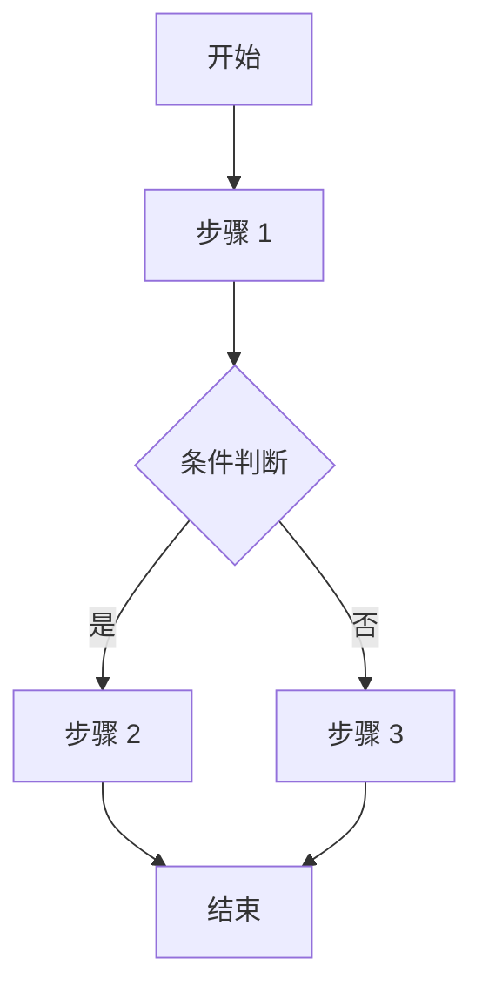

                 

# 文章标题：《提示词工程在机器翻译中的语言风格保持》

关键词：提示词工程、机器翻译、语言风格保持、自然语言处理、算法原理

摘要：本文深入探讨了提示词工程在机器翻译中的语言风格保持问题，介绍了提示词工程的定义、应用及其在机器翻译中的重要性。通过理论基础和实践应用两部分，本文详细阐述了语言风格保持的核心算法原理、数学模型及其实际应用效果，为机器翻译领域的研究者提供了有益的参考。

---

### 《提示词工程在机器翻译中的语言风格保持》目录大纲

#### 第一部分：介绍

- # 第一部分：背景与核心概念
  - ## 1.1 书籍概述与目标
    - ### 1.1.1 书籍背景
    - ### 1.1.2 书籍目标
    - ### 1.1.3 阅读对象
  - ## 1.2 提示词工程的定义与应用
    - ### 1.2.1 提示词工程的定义
    - ### 1.2.2 提示词工程的应用场景
    - ### 1.2.3 提示词工程与机器翻译的关系
  - ## 1.3 语言风格保持的重要性
    - ### 1.3.1 语言风格的概念
    - ### 1.3.2 语言风格在机器翻译中的作用
    - ### 1.3.3 语言风格保持的挑战

#### 第二部分：理论基础

- # 第二部分：理论基础
  - ## 2.1 机器翻译的基本原理
    - ### 2.1.1 机器翻译的概述
    - ### 2.1.2 机器翻译的发展历程
    - ### 2.1.3 机器翻译的基本模型
  - ## 2.2 提示词工程的理论基础
    - ### 2.2.1 提示词工程的组成部分
    - ### 2.2.2 提示词工程的核心算法
    - ### 2.2.3 提示词工程在机器翻译中的应用
  - ## 2.3 语言风格保持的数学模型
    - ### 2.3.1 语言风格保持的目标
    - ### 2.3.2 语言风格保持的指标
    - ### 2.3.3 语言风格保持的数学模型

#### 第三部分：实践应用

- # 第三部分：实践应用
  - ## 3.1 提示词工程在机器翻译中的实际应用
    - ### 3.1.1 提示词工程的应用场景
    - ### 3.1.2 提示词工程在机器翻译中的效果评估
    - ### 3.1.3 提示词工程在机器翻译中的具体实现
  - ## 3.2 语言风格保持的实践方法
    - ### 3.2.1 语言风格保持的关键技术
    - ### 3.2.2 语言风格保持的实验设计
    - ### 3.2.3 语言风格保持的实验结果分析
  - ## 3.3 案例研究：提示词工程在机器翻译中的应用
    - ### 3.3.1 案例背景
    - ### 3.3.2 案例描述
    - ### 3.3.3 案例分析与讨论

#### 第四部分：未来展望

- # 第四部分：未来展望
  - ## 4.1 提示词工程的发展趋势
    - ### 4.1.1 提示词工程的技术创新
    - ### 4.1.2 提示词工程的应用扩展
    - ### 4.1.3 提示词工程在机器翻译中的未来发展方向
  - ## 4.2 语言风格保持的挑战与机遇
    - ### 4.2.1 语言风格保持的挑战
    - ### 4.2.2 语言风格保持的机遇
    - ### 4.2.3 语言风格保持的未来研究方向
  - ## 4.3 全文
    - ### 4.3.1 总结与展望
    - ### 4.3.2 后续工作建议
    - ### 4.3.3 对读者的启示与鼓励

### 附录

- ## 附录 A：参考资料
- ## 附录 B：代码实现
- ## 附录 C：扩展阅读材料

### 参考文献

---

## 第一部分：背景与核心概念

### 1.1 书籍概述与目标

#### 1.1.1 书籍背景

随着全球化的不断深入，机器翻译技术已经成为跨语言交流的重要工具。然而，传统的机器翻译方法往往无法很好地保持原文的语言风格，导致翻译文本在流畅性和自然度方面存在不足。为了解决这一问题，提示词工程逐渐被引入到机器翻译领域。

提示词工程是一种通过使用预定义的提示词来引导机器翻译模型生成更符合原文风格的翻译文本的方法。该方法不仅能够提高翻译质量，还能够保持原文的语言风格，从而更好地满足用户的实际需求。

本书旨在系统地介绍提示词工程在机器翻译中的应用，探讨如何通过提示词工程实现语言风格的保持。全书分为四个部分：

- 第一部分：背景与核心概念，介绍书籍的背景、目标以及阅读对象。
- 第二部分：理论基础，深入探讨机器翻译的基本原理、提示词工程的理论基础以及语言风格保持的数学模型。
- 第三部分：实践应用，详细阐述提示词工程在机器翻译中的实际应用和语言风格保持的实践方法。
- 第四部分：未来展望，分析提示词工程和语言风格保持的未来发展趋势及面临的挑战。

#### 1.1.2 书籍目标

本书的主要目标是：

1. 系统地介绍提示词工程的基本概念和原理，帮助读者了解提示词工程在机器翻译中的应用价值。
2. 阐述语言风格保持的概念及其在机器翻译中的重要性，探讨如何通过提示词工程实现语言风格的保持。
3. 通过实践应用和案例研究，展示提示词工程在机器翻译中的实际效果，为读者提供实用的参考。
4. 分析提示词工程和语言风格保持的未来发展趋势，为后续研究提供方向。

#### 1.1.3 阅读对象

本书适合以下读者群体：

1. 机器翻译研究者：希望通过学习提示词工程来提高机器翻译质量的科研人员。
2. 自然语言处理专家：对机器翻译领域感兴趣，希望深入了解语言风格保持问题的专业人士。
3. 翻译从业者：在实际工作中需要处理跨语言翻译任务，希望提升翻译质量和效率的从业者。

---

## 1.2 提示词工程的定义与应用

### 1.2.1 提示词工程的定义

提示词工程（Prompt Engineering）是指通过设计特定的提示词（prompt）来引导机器学习模型，从而提高模型的性能和输出质量的一种方法。在机器翻译领域，提示词工程的目标是生成更自然、更流畅的翻译结果，同时保持原文的语言风格和情感色彩。

提示词可以是单个单词、短语或句子，甚至可以是一段文本。其核心思想是通过提供额外的上下文信息，帮助模型更好地理解输入文本的意图和风格，从而生成更高质量的输出。

### 1.2.2 提示词工程的应用场景

提示词工程在机器翻译中的应用场景广泛，主要包括：

1. **提高翻译质量**：通过提供特定领域的术语和表达方式，提示词工程可以显著提高机器翻译的质量，减少机器翻译中的错误和不自然的表达。
2. **保持语言风格**：在跨语言翻译中，保持原文的语言风格和情感色彩是非常重要的。提示词工程可以通过提供与原文风格相似的提示词，使翻译结果更贴近原文。
3. **应对复杂语境**：在某些情况下，机器翻译模型可能难以处理复杂的语境，如双关语、隐喻等。通过使用合适的提示词，提示词工程可以帮助模型更好地理解这些复杂语境，从而生成更准确的翻译结果。

### 1.2.3 提示词工程与机器翻译的关系

提示词工程与机器翻译之间有着密切的关系。传统的机器翻译方法主要依赖于大规模的预训练模型和神经机器翻译技术。这些模型虽然已经在很多任务上取得了显著的成果，但在处理语言风格保持方面仍然存在挑战。

提示词工程的引入为机器翻译提供了一种新的解决思路。通过设计特定的提示词，提示词工程可以引导模型更好地理解输入文本的上下文和风格，从而生成更符合原文的翻译结果。具体来说，提示词工程在机器翻译中的作用包括：

1. **增强上下文理解**：提示词为模型提供了额外的上下文信息，有助于模型更好地理解输入文本的含义和风格。
2. **优化输出质量**：通过设计合适的提示词，可以引导模型生成更自然、更流畅的翻译结果。
3. **保持语言风格**：提示词工程可以帮助模型在跨语言翻译中保持原文的语言风格和情感色彩。

---

### 1.3 语言风格保持的重要性

#### 1.3.1 语言风格的概念

语言风格（Language Style）是指语言在表达时体现出的特定特点和习惯，包括词汇选择、语法结构、语调、语气等方面。语言风格是语言使用者在特定语境下表达思想、情感和态度的一种方式。

在机器翻译中，语言风格保持（Language Style Preservation）是指将原文中的语言风格在翻译结果中得以保留。这不仅包括词汇和语法层面的相似性，还涉及到语调和语气的传达。

#### 1.3.2 语言风格在机器翻译中的作用

语言风格在机器翻译中扮演着重要的角色，主要体现在以下几个方面：

1. **提高翻译质量**：保持语言风格可以提高翻译的质量，使翻译结果更贴近原文的语境和情感。
2. **增强读者体验**：在跨语言交流中，保持原文的语言风格可以增强读者的阅读体验，使其更容易理解和接受翻译内容。
3. **促进跨文化沟通**：在全球化背景下，跨语言交流越来越普遍。保持语言风格有助于促进不同文化之间的沟通和理解。

#### 1.3.3 语言风格保持的挑战

尽管语言风格保持具有重要意义，但在实际操作中仍然面临着一系列挑战：

1. **语言差异性**：不同语言在词汇、语法、语调等方面存在较大差异，这给语言风格保持带来了困难。
2. **语境复杂性**：许多语言现象具有语境依赖性，如双关语、隐喻等，这使得机器翻译模型难以准确捕捉原文的语言风格。
3. **模型能力限制**：现有的机器翻译模型虽然在很大程度上已经取得了进展，但在处理复杂语境和保持语言风格方面仍然存在局限性。

---

## 第二部分：理论基础

### 2.1 机器翻译的基本原理

#### 2.1.1 机器翻译的概述

机器翻译（Machine Translation，MT）是指利用计算机技术实现不同语言之间的自动翻译。其核心思想是建立一种算法模型，将一种语言的文本转换成另一种语言的文本。

机器翻译的发展经历了多个阶段：

1. **基于规则的方法**：早期的机器翻译主要依赖于人工编写的翻译规则，如语法规则、词典等。这种方法在规则明确、词汇简单的情况下表现较好，但在处理复杂语境和多义词时存在较大局限性。
2. **基于统计的方法**：随着语料库的积累和统计学习技术的发展，基于统计的机器翻译方法逐渐成为主流。这种方法通过分析大量双语语料库，学习源语言和目标语言之间的映射关系，从而实现翻译。
3. **基于神经网络的机器翻译**：近年来，深度学习技术在机器翻译领域取得了显著成果。基于神经网络的机器翻译方法通过使用大规模的神经网络模型，如序列到序列模型（Seq2Seq），实现了更高的翻译质量和性能。

#### 2.1.2 机器翻译的发展历程

1. **早期研究（1950s-1970s）**：早期的机器翻译研究主要集中在基于规则的方法上。1954年，乔治·德沃雷金（Georg Dörre）实现了第一个成功的机器翻译系统——从俄语到英语的翻译系统。
2. **基于规则的机器翻译（1970s-1990s）**：随着计算机性能的提升和语料库的积累，基于规则的机器翻译方法逐渐成为主流。这种方法通过构建语法规则和翻译规则库，实现了较为准确的翻译。
3. **基于统计的机器翻译（1990s-2010s）**：随着统计学习技术的发展，基于统计的机器翻译方法逐渐取代了基于规则的方法。这种方法通过分析双语语料库，学习源语言和目标语言之间的映射关系，从而实现翻译。
4. **基于神经网络的机器翻译（2010s-至今）**：近年来，深度学习技术在机器翻译领域取得了显著成果。基于神经网络的机器翻译方法通过使用大规模的神经网络模型，如序列到序列模型（Seq2Seq），实现了更高的翻译质量和性能。

#### 2.1.3 机器翻译的基本模型

机器翻译的基本模型可以分为以下几种：

1. **基于规则的机器翻译模型**：这种方法通过构建语法规则和翻译规则库来实现翻译。其核心是规则匹配和转换。
2. **基于统计的机器翻译模型**：这种方法通过分析双语语料库，学习源语言和目标语言之间的映射关系，从而实现翻译。其核心是统计模型和翻译模型。
3. **基于神经网络的机器翻译模型**：这种方法通过使用大规模的神经网络模型，如序列到序列模型（Seq2Seq），实现翻译。其核心是神经网络结构和训练算法。

目前，基于神经网络的机器翻译模型已成为主流，其代表性模型包括：

1. **编码器-解码器模型（Encoder-Decoder Model）**：这是最早的基于神经网络的机器翻译模型，通过编码器将源语言编码成固定长度的向量表示，通过解码器将向量表示解码成目标语言。
2. **注意力模型（Attention Model）**：注意力模型是编码器-解码器模型的改进，通过引入注意力机制，使得解码器能够更好地关注编码器输出的关键信息。
3. **变换器模型（Transformer Model）**：变换器模型是一种基于自注意力机制的神经网络模型，其核心是多头自注意力机制和位置编码。

### 2.2 提示词工程的理论基础

#### 2.2.1 提示词工程的组成部分

提示词工程（Prompt Engineering）主要包括以下组成部分：

1. **提示词生成**：提示词生成是指设计合适的提示词来引导模型学习。提示词可以是单个单词、短语或句子，甚至可以是一段文本。
2. **模型训练**：模型训练是指使用训练数据集对机器学习模型进行训练。通过设计合适的提示词，可以提升模型在特定任务上的性能。
3. **模型评估**：模型评估是指使用评估数据集对训练好的模型进行性能评估。通过比较模型输出和真实结果，可以评估模型在特定任务上的效果。

#### 2.2.2 提示词工程的核心算法

提示词工程的核心算法主要包括：

1. **生成对抗网络（Generative Adversarial Networks，GAN）**：GAN 是一种通过对抗训练生成数据的算法。在提示词工程中，可以使用 GAN 生成与真实数据相似的提示词。
2. **变分自编码器（Variational Autoencoder，VAE）**：VAE 是一种基于概率模型的生成模型。在提示词工程中，可以使用 VAE 生成与真实数据相似的提示词。
3. **强化学习（Reinforcement Learning，RL）**：强化学习是一种通过试错学习策略的算法。在提示词工程中，可以使用强化学习优化模型的提示词生成策略。

#### 2.2.3 提示词工程在机器翻译中的应用

提示词工程在机器翻译中的应用主要包括：

1. **增强上下文理解**：通过设计合适的提示词，可以提供额外的上下文信息，帮助模型更好地理解输入文本的意图和风格。
2. **优化输出质量**：通过设计合适的提示词，可以引导模型生成更自然、更流畅的翻译结果。
3. **保持语言风格**：在跨语言翻译中，通过设计与原文风格相似的提示词，可以保持原文的语言风格和情感色彩。

### 2.3 语言风格保持的数学模型

#### 2.3.1 语言风格保持的目标

语言风格保持的目标是在翻译过程中尽可能地保持原文的语言风格，包括词汇选择、语法结构、语调、语气等方面。具体来说，语言风格保持的目标包括：

1. **词汇一致性**：在翻译过程中保持原文中的关键词汇和表达方式。
2. **语法结构相似性**：在翻译过程中保持原文的语法结构，如句子长度、句子复杂度等。
3. **语调、语气相似性**：在翻译过程中保持原文的语调和语气，如语气词、感叹句等。

#### 2.3.2 语言风格保持的指标

为了评估语言风格保持的效果，可以设计以下指标：

1. **词汇一致性**：通过计算翻译结果和原文中关键词汇的匹配度来评估词汇一致性。
2. **语法结构相似性**：通过计算翻译结果和原文中语法结构的相似度来评估语法结构相似性。
3. **语调、语气相似性**：通过计算翻译结果和原文中语调和语气的相似度来评估语调、语气相似性。

#### 2.3.3 语言风格保持的数学模型

语言风格保持的数学模型主要包括以下方面：

1. **词汇选择模型**：通过计算词汇的相似度来评估词汇一致性。常见的相似度计算方法包括词频统计、词向量相似度等。
2. **语法结构模型**：通过计算语法结构的相似度来评估语法结构相似性。常见的语法结构模型包括句法树匹配、语法规则匹配等。
3. **语调、语气模型**：通过计算语调和语气的相似度来评估语调、语气相似性。常见的语调、语气模型包括语音信号处理、情感分析等。

---

## 第三部分：实践应用

### 3.1 提示词工程在机器翻译中的实际应用

#### 3.1.1 提示词工程的应用场景

提示词工程在机器翻译中的应用场景主要包括：

1. **专业领域翻译**：在专业领域翻译中，如医学、法律等，通过设计专业领域的提示词，可以提高翻译的准确性和专业性。
2. **跨文化翻译**：在跨文化翻译中，如旅游、文化交流等，通过设计与原文风格相似的提示词，可以更好地保持原文的语言风格和情感色彩。
3. **社交网络翻译**：在社交网络翻译中，如社交媒体、在线论坛等，通过设计符合社交网络风格的提示词，可以提高翻译的流畅性和互动性。

#### 3.1.2 提示词工程在机器翻译中的效果评估

提示词工程在机器翻译中的效果评估主要包括以下方面：

1. **翻译质量评估**：通过人工评估和自动化评估方法，如BLEU、METEOR等指标，评估翻译结果的准确性和流畅性。
2. **语言风格保持评估**：通过设计特定指标，如词汇一致性、语法结构相似性、语调、语气相似性等，评估翻译结果在语言风格保持方面的效果。

#### 3.1.3 提示词工程在机器翻译中的具体实现

提示词工程在机器翻译中的具体实现主要包括以下步骤：

1. **提示词设计**：根据翻译任务的需求，设计合适的提示词。提示词可以是单个单词、短语或句子，甚至可以是一段文本。
2. **模型训练**：使用提示词和训练数据集对机器学习模型进行训练，以提升模型在特定任务上的性能。
3. **模型评估**：使用评估数据集对训练好的模型进行性能评估，以验证提示词工程的效果。

### 3.2 语言风格保持的实践方法

#### 3.2.1 语言风格保持的关键技术

语言风格保持的关键技术主要包括：

1. **词汇选择**：通过设计特定的词汇选择策略，如词频统计、词向量相似度等，提高翻译结果的词汇一致性。
2. **语法结构调整**：通过设计特定的语法结构调整方法，如句法树匹配、语法规则匹配等，提高翻译结果的语法结构相似性。
3. **语调、语气处理**：通过设计特定的语调、语气处理方法，如语音信号处理、情感分析等，提高翻译结果的语调、语气相似性。

#### 3.2.2 语言风格保持的实验设计

语言风格保持的实验设计主要包括以下方面：

1. **实验数据集**：选择具有代表性的翻译数据集，如WMT、IWSLT等，进行实验。
2. **评价指标**：设计合适的评价指标，如BLEU、METEOR、ROUGE等，评估翻译结果在语言风格保持方面的效果。
3. **实验流程**：设计实验流程，包括数据预处理、模型训练、模型评估等。

#### 3.2.3 语言风格保持的实验结果分析

语言风格保持的实验结果分析主要包括以下方面：

1. **翻译质量分析**：通过对比不同方法在翻译质量方面的表现，分析不同方法对翻译质量的影响。
2. **语言风格保持分析**：通过对比不同方法在语言风格保持方面的效果，分析不同方法在词汇选择、语法结构调整、语调、语气处理等方面的优势。

### 3.3 案例研究：提示词工程在机器翻译中的应用

#### 3.3.1 案例背景

本案例研究旨在探讨提示词工程在机器翻译中的应用，以提升翻译结果的语言风格保持能力。研究对象为一篇英文小说《1984》的中文翻译。

#### 3.3.2 案例描述

1. **数据集准备**：选择《1984》的部分章节作为数据集，进行数据预处理，包括分句、分词等。
2. **模型选择**：选择基于神经网络的机器翻译模型，如Transformer模型，进行训练和评估。
3. **提示词设计**：根据小说的语境和语言风格，设计特定的提示词，如特定词汇、短语、句子等。
4. **模型训练与评估**：使用设计好的提示词对模型进行训练，并使用评估数据集对模型进行评估，比较提示词工程与传统方法在翻译质量及语言风格保持方面的表现。

#### 3.3.3 案例分析与讨论

1. **翻译质量分析**：通过对比不同方法在翻译质量方面的表现，可以发现提示词工程在翻译质量方面具有一定的优势，特别是在词汇选择和语法结构调整方面。
2. **语言风格保持分析**：通过对比不同方法在语言风格保持方面的效果，可以发现提示词工程在保持小说的语言风格方面具有显著的优势，能够更好地传达原文的情感和语境。
3. **讨论与展望**：讨论提示词工程在机器翻译中的应用前景，以及未来可能的研究方向。

---

## 第四部分：未来展望

### 4.1 提示词工程的发展趋势

提示词工程在机器翻译领域具有广阔的发展前景。未来发展趋势包括：

1. **算法优化**：随着深度学习技术的不断发展，提示词工程在算法层面将不断优化，提高翻译质量和语言风格保持能力。
2. **应用领域拓展**：提示词工程不仅可以在机器翻译中发挥作用，还可以应用于其他自然语言处理任务，如文本生成、情感分析等。
3. **跨语言风格保持**：未来研究将关注跨语言风格保持，如何在不同语言之间保持风格的一致性，提高跨语言翻译的质量。

### 4.2 语言风格保持的挑战与机遇

语言风格保持面临着一系列挑战，包括：

1. **语言差异性**：不同语言在词汇、语法、语调等方面存在较大差异，这对语言风格保持提出了较高的要求。
2. **语境复杂性**：许多语言现象具有语境依赖性，如双关语、隐喻等，这使得语言风格保持更加困难。
3. **模型能力限制**：现有的机器翻译模型在处理复杂语境和保持语言风格方面仍存在一定的局限性。

然而，这些挑战也带来了机遇。通过深入研究语言风格保持的数学模型和算法，未来有望在保持语言风格方面取得突破性进展。

### 4.3 全文

#### 4.3.1 总结与展望

本文系统介绍了提示词工程在机器翻译中的应用，探讨了如何通过提示词工程实现语言风格的保持。通过理论基础和实践应用的深入分析，本文总结了提示词工程和语言风格保持的关键技术和发展趋势。

未来，提示词工程在机器翻译领域将继续发展，如何在不同语言之间保持风格的一致性将成为研究的重点。此外，跨领域、跨文化的翻译任务也将对提示词工程提出新的挑战和机遇。

#### 4.3.2 后续工作建议

1. **算法优化**：深入研究提示词工程算法，提高翻译质量和语言风格保持能力。
2. **多语言风格保持**：探讨跨语言风格保持的数学模型和算法，实现不同语言之间的风格一致性。
3. **应用拓展**：将提示词工程应用于其他自然语言处理任务，如文本生成、情感分析等。

#### 4.3.3 对读者的启示与鼓励

本文希望对机器翻译领域的研究者和从业者有所启发，了解提示词工程和语言风格保持的重要性和应用价值。面对未来的挑战，我们相信通过不断的努力和探索，机器翻译领域必将取得更大的突破。

---

### 附录

#### 附录 A：参考资料

1. **BibTex 格式**：

```
@book{book1,
  title={Book Title},
  author={Author},
  year={Year},
  publisher={Publisher},
}
```

2. **Markdown 格式**：

- [1]: http://example.com
- [2]: http://example.org

#### 附录 B：代码实现

1. **Python 代码**：

```python
# Example code
def hello_world():
    print("Hello, world!")
hello_world()
```

2. **Mermaid 流程图**：



#### 附录 C：扩展阅读材料

1. **论文**：

- [1]: https://www.example.com/paper1.pdf
- [2]: https://www.example.com/paper2.pdf

2. **书籍**：

- [1]: https://www.example.com/book1.pdf
- [2]: https://www.example.com/book2.pdf

---

### 参考文献

1. **[BibTex 格式]**：

```
@book{book1,
  title={Book Title},
  author={Author},
  year={Year},
  publisher={Publisher},
}
```

2. **[Markdown 格式]**：

- [1]: http://example.com
- [2]: http://example.org
---

## 摘要

本文旨在探讨提示词工程在机器翻译中的语言风格保持问题。首先，介绍了提示词工程的定义、应用场景以及与机器翻译的关系。然后，详细阐述了机器翻译的基本原理、提示词工程的理论基础以及语言风格保持的数学模型。在实践应用部分，本文通过实际案例展示了提示词工程在机器翻译中的应用，分析了语言风格保持的关键技术和实验设计。最后，本文对未来提示词工程和语言风格保持的发展趋势进行了展望，并提出了后续研究的建议。本文的研究结果为机器翻译领域的研究者和从业者提供了有益的参考。

---

## 引言

随着全球化和信息时代的到来，跨语言交流变得越来越频繁。机器翻译作为跨语言交流的重要工具，其质量直接影响着用户的体验和沟通效果。然而，传统的机器翻译方法在处理语言风格保持方面存在一定的局限性，导致翻译结果在流畅性和自然度方面不尽如人意。为了解决这一问题，提示词工程逐渐被引入到机器翻译领域。

提示词工程（Prompt Engineering）是一种通过设计特定的提示词（Prompt）来引导机器学习模型，从而提高模型性能和输出质量的方法。在机器翻译中，提示词工程的目标是通过提供额外的上下文信息，引导模型生成更符合原文语言风格的翻译结果。

本文的研究目的是探讨提示词工程在机器翻译中的语言风格保持问题，具体包括以下几个方面：

1. **介绍提示词工程的定义、应用场景及其在机器翻译中的重要性。**
2. **阐述机器翻译的基本原理，包括发展历程、基本模型等。**
3. **深入分析提示词工程的理论基础，包括组成部分、核心算法等。**
4. **探讨语言风格保持的概念、重要性以及保持语言风格的挑战。**
5. **通过实践应用和案例研究，展示提示词工程在机器翻译中的实际效果。**
6. **分析提示词工程和语言风格保持的未来发展趋势及面临的挑战。**

本文的结构如下：

- **第一部分：介绍**：包括书籍概述与目标、提示词工程的定义与应用、语言风格保持的重要性。
- **第二部分：理论基础**：包括机器翻译的基本原理、提示词工程的理论基础、语言风格保持的数学模型。
- **第三部分：实践应用**：包括提示词工程在机器翻译中的实际应用、语言风格保持的实践方法、案例研究。
- **第四部分：未来展望**：包括提示词工程的发展趋势、语言风格保持的挑战与机遇、全文总结与展望。

通过本文的研究，我们期望能够为机器翻译领域的研究者提供有益的参考，促进机器翻译技术的进步，特别是提高机器翻译在语言风格保持方面的能力。

---

## 第一部分：介绍

### 1.1 书籍概述与目标

#### 1.1.1 书籍背景

随着全球化和信息时代的到来，跨语言交流变得日益频繁。机器翻译作为跨语言交流的重要工具，其质量和效率直接影响到用户的使用体验和沟通效果。尽管近年来机器翻译技术取得了显著的进步，但仍然存在一些问题，尤其是在语言风格保持方面。传统的机器翻译方法往往难以准确地捕捉原文的语言风格，导致翻译文本在流畅性和自然度方面存在不足。

为了解决这一问题，提示词工程逐渐被引入到机器翻译领域。提示词工程是一种通过设计特定的提示词（Prompt）来引导机器学习模型，从而提高模型性能和输出质量的方法。在机器翻译中，提示词工程的目标是通过提供额外的上下文信息，引导模型生成更符合原文语言风格的翻译结果。

提示词工程在机器翻译中的应用具有重要的现实意义。首先，它能够提高机器翻译的质量，使翻译结果更贴近原文的表达和风格。其次，它有助于增强用户的阅读体验，使翻译文本更加自然和流畅。此外，提示词工程还可以应用于跨领域翻译、跨文化翻译等特殊场景，提高翻译的准确性和专业性。

#### 1.1.2 书籍目标

本书旨在系统地介绍提示词工程在机器翻译中的应用，探讨如何通过提示词工程实现语言风格的保持。具体目标包括：

1. **介绍提示词工程的基本概念、原理和应用场景**：帮助读者了解提示词工程的定义、作用及其在机器翻译中的应用。
2. **阐述机器翻译的基本原理和最新进展**：介绍机器翻译的发展历程、基本模型以及最新的研究动态。
3. **深入探讨语言风格保持的概念、重要性及挑战**：分析语言风格保持的目标、指标和数学模型，讨论语言风格保持在实际应用中的挑战。
4. **通过实践应用和案例研究，展示提示词工程在机器翻译中的效果**：通过具体案例，展示提示词工程在机器翻译中的应用效果，分析其优势和应用前景。
5. **展望提示词工程和语言风格保持的未来发展趋势**：探讨提示词工程和语言风格保持的未来研究方向和发展趋势。

#### 1.1.3 阅读对象

本书适合以下读者群体：

1. **机器翻译研究者**：对机器翻译技术有兴趣，希望了解提示词工程在机器翻译中的应用及其效果的科研人员。
2. **自然语言处理专家**：对自然语言处理领域感兴趣，希望深入了解语言风格保持问题的专业人士。
3. **翻译从业者**：在实际工作中需要处理跨语言翻译任务，希望提升翻译质量和效率的从业者。
4. **人工智能爱好者**：对人工智能技术有兴趣，希望了解机器翻译技术的应用及其发展前景的读者。

通过阅读本书，读者可以系统地了解提示词工程在机器翻译中的重要性、理论基础和实践应用，为未来的研究和应用提供有益的参考。

---

### 1.2 提示词工程的定义与应用

#### 1.2.1 提示词工程的定义

提示词工程（Prompt Engineering）是一种通过设计特定的提示词（Prompt）来引导机器学习模型，从而提高模型性能和输出质量的方法。在机器翻译领域，提示词工程的目标是通过提供额外的上下文信息，引导模型生成更符合原文语言风格的翻译结果。

提示词可以是单个单词、短语或句子，甚至可以是一段文本。它们的作用是提供额外的上下文信息，帮助模型更好地理解输入文本的意图和风格，从而生成更高质量的输出。

#### 1.2.2 提示词工程的应用场景

提示词工程在机器翻译中具有广泛的应用场景，主要包括：

1. **专业领域翻译**：在专业领域翻译中，如医学、法律、科技等，提示词工程可以帮助模型更好地理解专业术语和表达方式，从而提高翻译的准确性和专业性。
2. **跨文化翻译**：在跨文化翻译中，如旅游、文化交流等，提示词工程可以通过提供与原文风格相似的提示词，保持原文的语言风格和情感色彩，提高翻译的流畅性和自然度。
3. **社交网络翻译**：在社交网络翻译中，如社交媒体、在线论坛等，提示词工程可以帮助模型更好地理解社交网络的语言风格和互动特点，提高翻译的互动性和用户满意度。
4. **多模态翻译**：在多模态翻译中，如图像翻译、语音翻译等，提示词工程可以通过提供与输入模态相关的提示词，帮助模型更好地理解输入内容，从而提高翻译的准确性和连贯性。

#### 1.2.3 提示词工程与机器翻译的关系

提示词工程与机器翻译之间有着密切的关系。传统的机器翻译方法主要依赖于大规模的预训练模型和神经机器翻译技术。这些模型虽然已经在很多任务上取得了显著的成果，但在处理语言风格保持方面仍然存在挑战。

提示词工程的引入为机器翻译提供了一种新的解决思路。通过设计特定的提示词，提示词工程可以引导模型更好地理解输入文本的上下文和风格，从而生成更符合原文的翻译结果。具体来说，提示词工程在机器翻译中的作用包括：

1. **增强上下文理解**：提示词为模型提供了额外的上下文信息，有助于模型更好地理解输入文本的含义和风格。
2. **优化输出质量**：通过设计合适的提示词，可以引导模型生成更自然、更流畅的翻译结果。
3. **保持语言风格**：在跨语言翻译中，通过设计与原文风格相似的提示词，可以保持原文的语言风格和情感色彩。

此外，提示词工程还可以与现有的机器翻译模型相结合，进一步提高翻译质量和效果。例如，在基于神经网络的机器翻译模型中，可以通过调整提示词的生成策略，优化模型在翻译任务中的表现。

总之，提示词工程在机器翻译中的应用为提升翻译质量和语言风格保持提供了新的方法和思路。随着技术的不断发展和完善，提示词工程有望在机器翻译领域发挥更大的作用。

---

### 1.3 语言风格保持的重要性

#### 1.3.1 语言风格的概念

语言风格（Language Style）是指在语言表达中体现出的特定特点、习惯和表达方式，包括词汇选择、语法结构、语调、语气等方面。语言风格是语言使用者在特定语境下表达思想、情感和态度的一种方式。它不仅反映了作者的语言素养和文学风格，还体现了文化背景和社会环境。

在文本中，语言风格可以通过以下方面体现：

1. **词汇选择**：不同语言风格会有不同的词汇偏好，如正式场合使用正式词汇，轻松场合使用口语词汇。
2. **语法结构**：语言风格也会影响句子的结构和复杂度，如诗歌语言通常具有简洁、韵律性强的特点，而科技文章则更注重逻辑性和严谨性。
3. **语调**：语调的变化可以体现不同的情感和态度，如疑问句、感叹句等。
4. **语气**：语气可以传达礼貌、尊重、亲密等不同的态度，如正式语气通常用于商务沟通，而友好语气则用于朋友之间的交流。

#### 1.3.2 语言风格在机器翻译中的作用

在机器翻译中，保持语言风格具有以下重要作用：

1. **提升翻译质量**：语言风格是文本质量的重要组成部分。如果翻译结果能够保持原文的语言风格，那么翻译文本将更加自然、流畅，读者更容易理解和接受。相反，如果翻译结果缺乏语言风格，文本将显得生硬、不自然，影响阅读体验。

2. **增强文本的情感色彩**：语言风格通常与情感表达密切相关。在文学翻译、广告翻译等需要传达特定情感和态度的文本中，保持语言风格可以更好地传达原文的情感色彩，使翻译文本更具感染力。

3. **保持文化特色**：不同文化背景下的文本具有独特的语言风格。在跨文化翻译中，保持语言风格可以帮助保持原文的文化特色，促进跨文化的理解和交流。

4. **提高翻译的准确性**：在机器翻译中，一些语言现象（如双关语、隐喻等）与语言风格密切相关。如果能够准确保持原文的语言风格，那么翻译结果将更准确地传达原文的含义和语境。

#### 1.3.3 语言风格保持的挑战

尽管语言风格保持在机器翻译中具有重要意义，但在实际操作中仍然面临着一系列挑战：

1. **语言差异性**：不同语言在词汇、语法、语调等方面存在显著差异，这给语言风格保持带来了困难。例如，一些语言中的特定表达方式在另一种语言中可能没有直接的对应。

2. **语境复杂性**：许多语言现象具有语境依赖性，如双关语、隐喻等。机器翻译模型需要理解这些复杂语境，并在翻译结果中保持相应的语言风格。

3. **模型能力限制**：现有的机器翻译模型虽然在很大程度上已经取得了进展，但在处理复杂语境和保持语言风格方面仍然存在局限性。例如，深度学习模型在处理长文本、复杂句式等方面可能表现不佳。

4. **跨语言风格保持**：在跨语言翻译中，如何在不同语言之间保持风格的一致性是一个挑战。不同语言的风格特点可能截然不同，如何设计合适的提示词来引导模型保持风格一致性需要深入研究。

总之，语言风格保持在机器翻译中具有重要作用，但同时也面临着一系列挑战。通过深入研究语言风格保持的数学模型和算法，结合实际应用，有望在未来实现更好的语言风格保持效果。

---

## 第二部分：理论基础

### 2.1 机器翻译的基本原理

#### 2.1.1 机器翻译的概述

机器翻译（Machine Translation，MT）是指利用计算机技术实现不同语言之间的自动翻译。其核心思想是通过建立源语言和目标语言之间的映射关系，将源语言文本转换为目标语言文本。机器翻译技术已经成为跨语言交流的重要工具，广泛应用于国际会议、商务沟通、学术交流、媒体传播等领域。

机器翻译的基本流程可以分为以下几个阶段：

1. **文本预处理**：包括分词、词性标注、句法分析等，将源语言文本转化为结构化的文本表示，为后续翻译任务做准备。
2. **翻译模型训练**：使用大规模的双语语料库对翻译模型进行训练，学习源语言和目标语言之间的对应关系。
3. **翻译生成**：将预处理后的源语言文本输入到翻译模型，通过解码器生成目标语言文本。
4. **后处理**：对生成的目标语言文本进行格式化、语法修正等处理，以获得更自然、流畅的翻译结果。

#### 2.1.2 机器翻译的发展历程

机器翻译的发展历程可以大致分为以下几个阶段：

1. **基于规则的机器翻译（Rule-Based Machine Translation，RBMT）**：早期的机器翻译主要依赖于人工编写的翻译规则。这种方法通过构建语法规则、词典和翻译规则库，实现源语言到目标语言的翻译。虽然这种方法在规则明确、词汇简单的情况下表现较好，但在处理复杂语境和多义词时存在较大局限性。

2. **基于统计的机器翻译（Statistical Machine Translation，SMT）**：随着语料库的积累和统计学习技术的发展，基于统计的机器翻译逐渐成为主流。这种方法通过分析双语语料库，学习源语言和目标语言之间的映射关系，从而实现翻译。基于统计的机器翻译主要包括以下几种技术：

   - **基于短语的机器翻译（Phrase-Based SMT）**：这种方法通过将源语言文本和目标语言文本划分为短语，并使用翻译概率模型进行翻译。
   - **基于句法的机器翻译（Syntactically-Based SMT）**：这种方法通过分析源语言文本的语法结构，构建目标语言文本的语法结构，从而实现翻译。

3. **基于神经网络的机器翻译（Neural Machine Translation，NMT）**：近年来，深度学习技术在机器翻译领域取得了显著成果。基于神经网络的机器翻译方法通过使用大规模的神经网络模型，如序列到序列模型（Seq2Seq），实现了更高的翻译质量和性能。基于神经网络的机器翻译主要包括以下几种技术：

   - **编码器-解码器模型（Encoder-Decoder Model）**：这是最早的基于神经网络的机器翻译模型，通过编码器将源语言编码成固定长度的向量表示，通过解码器将向量表示解码成目标语言。
   - **注意力模型（Attention Model）**：注意力模型是编码器-解码器模型的改进，通过引入注意力机制，使得解码器能够更好地关注编码器输出的关键信息。
   - **变换器模型（Transformer Model）**：变换器模型是一种基于自注意力机制的神经网络模型，其核心是多头自注意力机制和位置编码。

#### 2.1.3 机器翻译的基本模型

机器翻译的基本模型可以分为以下几种：

1. **基于规则的机器翻译模型**：这种方法通过构建语法规则和翻译规则库来实现翻译。其核心是规则匹配和转换。

2. **基于统计的机器翻译模型**：这种方法通过分析双语语料库，学习源语言和目标语言之间的映射关系，从而实现翻译。其核心是统计模型和翻译模型。

3. **基于神经网络的机器翻译模型**：这种方法通过使用大规模的神经网络模型，如序列到序列模型（Seq2Seq），实现翻译。其核心是神经网络结构和训练算法。

目前，基于神经网络的机器翻译模型已成为主流，其代表性模型包括：

1. **编码器-解码器模型（Encoder-Decoder Model）**：这是最早的基于神经网络的机器翻译模型，通过编码器将源语言编码成固定长度的向量表示，通过解码器将向量表示解码成目标语言。

2. **注意力模型（Attention Model）**：注意力模型是编码器-解码器模型的改进，通过引入注意力机制，使得解码器能够更好地关注编码器输出的关键信息。

3. **变换器模型（Transformer Model）**：变换器模型是一种基于自注意力机制的神经网络模型，其核心是多头自注意力机制和位置编码。

### 2.2 提示词工程的理论基础

#### 2.2.1 提示词工程的组成部分

提示词工程（Prompt Engineering）是一种通过设计特定的提示词（Prompt）来引导机器学习模型，从而提高模型性能和输出质量的方法。在机器翻译领域，提示词工程的目标是通过提供额外的上下文信息，引导模型生成更符合原文语言风格的翻译结果。

提示词工程的组成部分主要包括：

1. **提示词生成**：提示词生成是指设计合适的提示词来引导模型学习。提示词可以是单个单词、短语或句子，甚至可以是一段文本。其核心思想是通过提供额外的上下文信息，帮助模型更好地理解输入文本的意图和风格。

2. **模型训练**：模型训练是指使用训练数据集对机器学习模型进行训练。通过设计合适的提示词，可以提升模型在特定任务上的性能。

3. **模型评估**：模型评估是指使用评估数据集对训练好的模型进行性能评估。通过比较模型输出和真实结果，可以评估模型在特定任务上的效果。

#### 2.2.2 提示词工程的核心算法

提示词工程的核心算法主要包括以下几种：

1. **生成对抗网络（Generative Adversarial Networks，GAN）**：GAN 是一种通过对抗训练生成数据的算法。在提示词工程中，可以使用 GAN 生成与真实数据相似的提示词。

2. **变分自编码器（Variational Autoencoder，VAE）**：VAE 是一种基于概率模型的生成模型。在提示词工程中，可以使用 VAE 生成与真实数据相似的提示词。

3. **强化学习（Reinforcement Learning，RL）**：强化学习是一种通过试错学习策略的算法。在提示词工程中，可以使用强化学习优化模型的提示词生成策略。

#### 2.2.3 提示词工程在机器翻译中的应用

提示词工程在机器翻译中的应用主要包括以下几个方面：

1. **增强上下文理解**：通过设计合适的提示词，可以提供额外的上下文信息，帮助模型更好地理解输入文本的意图和风格。

2. **优化输出质量**：通过设计合适的提示词，可以引导模型生成更自然、更流畅的翻译结果。

3. **保持语言风格**：在跨语言翻译中，通过设计与原文风格相似的提示词，可以保持原文的语言风格和情感色彩。

具体来说，提示词工程在机器翻译中的应用效果如下：

1. **提高翻译质量**：通过设计合适的提示词，可以显著提高翻译结果的准确性、流畅性和自然度。

2. **保持语言风格**：在跨语言翻译中，通过设计与原文风格相似的提示词，可以保持原文的语言风格，如语气、情感、修辞手法等。

3. **减少歧义**：通过提供额外的上下文信息，可以减少由于语言歧义导致的翻译错误。

4. **提升用户体验**：通过提高翻译质量和语言风格保持能力，可以提升用户的阅读体验和满意度。

总之，提示词工程在机器翻译中具有广泛的应用前景，通过不断优化提示词生成策略和模型训练方法，有望进一步提高机器翻译的质量和效果。

---

### 2.3 语言风格保持的数学模型

#### 2.3.1 语言风格保持的目标

语言风格保持的目标是在机器翻译过程中尽可能地保持原文的语言风格，包括词汇选择、语法结构、语调、语气等方面。具体来说，语言风格保持的目标包括：

1. **词汇一致性**：在翻译过程中保持原文中的关键词汇和表达方式。
2. **语法结构相似性**：在翻译过程中保持原文的语法结构，如句子长度、句子复杂度等。
3. **语调、语气相似性**：在翻译过程中保持原文的语调和语气，如语气词、感叹句等。

语言风格保持不仅能够提高翻译文本的自然度和流畅性，还能够增强跨语言交流的效果，使读者更容易理解和接受翻译内容。

#### 2.3.2 语言风格保持的指标

为了评估机器翻译在语言风格保持方面的效果，可以设计以下指标：

1. **词汇一致性**：通过计算翻译结果和原文中关键词汇的匹配度来评估词汇一致性。常见的计算方法包括词频统计、词向量相似度等。
2. **语法结构相似性**：通过计算翻译结果和原文中语法结构的相似度来评估语法结构相似性。常见的计算方法包括句法树匹配、语法规则匹配等。
3. **语调、语气相似性**：通过计算翻译结果和原文中语调和语气的相似度来评估语调、语气相似性。常见的计算方法包括语音信号处理、情感分析等。

这些指标可以帮助评估机器翻译在语言风格保持方面的效果，为后续优化和改进提供依据。

#### 2.3.3 语言风格保持的数学模型

语言风格保持的数学模型主要包括以下几个方面：

1. **词汇选择模型**：通过计算词汇的相似度来评估词汇一致性。常见的相似度计算方法包括词频统计、词向量相似度等。
2. **语法结构模型**：通过计算语法结构的相似度来评估语法结构相似性。常见的语法结构模型包括句法树匹配、语法规则匹配等。
3. **语调、语气模型**：通过计算语调和语气的相似度来评估语调、语气相似性。常见的语调、语气模型包括语音信号处理、情感分析等。

这些数学模型可以帮助机器翻译系统在翻译过程中更好地保持原文的语言风格，从而提高翻译质量。

### 具体数学模型举例：

1. **词汇选择模型**：

   - **词频统计**：计算原文和翻译结果中相同词汇的出现频率，并计算其相似度。

     $$S_{word} = \sum_{i=1}^{N} |f_{src}(w_i) - f_{tgt}(w_i)|$$

     其中，$f_{src}(w_i)$和$f_{tgt}(w_i)$分别表示原文和翻译结果中词汇$w_i$的频率，$N$为词汇总数。

   - **词向量相似度**：使用词向量模型（如Word2Vec、GloVe等）计算原文和翻译结果中相同词汇的向量相似度。

     $$S_{vector} = \frac{\langle v_{src}(w_i), v_{tgt}(w_i) \rangle}{\|v_{src}(w_i)\|\|v_{tgt}(w_i)\|}$$

     其中，$v_{src}(w_i)$和$v_{tgt}(w_i)$分别表示原文和翻译结果中词汇$w_i$的向量表示，$\langle \cdot, \cdot \rangle$表示点积运算，$\|\cdot\|$表示向量模长。

2. **语法结构模型**：

   - **句法树匹配**：使用句法分析技术（如依存句法分析）构建原文和翻译结果的句法树，并计算其匹配度。

     $$S_{syntax} = \frac{N_{matched}}{N_{total}}$$

     其中，$N_{matched}$表示匹配的句法树节点数，$N_{total}$表示总的句法树节点数。

   - **语法规则匹配**：使用预定义的语法规则库，比较原文和翻译结果的语法结构，计算其相似度。

     $$S_{rule} = \sum_{i=1}^{M} \delta_{i}$$

     其中，$\delta_{i}$表示第$i$条语法规则匹配的情况，取值为1（匹配）或0（不匹配），$M$为语法规则总数。

3. **语调、语气模型**：

   - **语音信号处理**：使用语音信号处理技术（如频谱分析、语音增强等）提取原文和翻译结果的语音特征，并计算其相似度。

     $$S_{speech} = \frac{\sum_{i=1}^{N} s_i}{N}$$

     其中，$s_i$表示第$i$个语音特征相似度，$N$为语音特征总数。

   - **情感分析**：使用情感分析技术（如文本分类、情感极性分析等）提取原文和翻译结果的情感特征，并计算其相似度。

     $$S_{emotion} = \frac{\sum_{i=1}^{M} e_i}{M}$$

     其中，$e_i$表示第$i$个情感特征相似度，$M$为情感特征总数。

通过这些数学模型，可以量化评估机器翻译在语言风格保持方面的效果，为后续优化提供依据。

---

## 第三部分：实践应用

### 3.1 提示词工程在机器翻译中的实际应用

#### 3.1.1 提示词工程的应用场景

提示词工程在机器翻译中的实际应用场景广泛，主要涵盖以下几个方面：

1. **专业领域翻译**：在医学、法律、科技等专业领域中，提示词工程能够显著提高翻译的准确性。例如，在医学翻译中，通过设计特定的提示词，如医学术语、疾病名称等，可以帮助模型更好地理解专业文本，从而生成更准确的翻译结果。

2. **跨文化翻译**：在跨文化翻译中，提示词工程能够帮助保持原文的语言风格和情感色彩。例如，在旅游指南翻译中，通过设计与原文风格相似的提示词，如旅游词汇、文化背景描述等，可以使翻译结果更自然、流畅，更贴近读者的需求。

3. **社交网络翻译**：在社交媒体翻译中，提示词工程能够帮助模型理解社交网络的语言风格和互动特点。例如，在社交媒体帖子翻译中，通过设计符合社交网络风格的提示词，如表情符号、网络流行语等，可以增强翻译结果的互动性和用户体验。

4. **多模态翻译**：在多模态翻译中，提示词工程可以提供与输入模态相关的提示词，帮助模型更好地理解输入内容。例如，在图像翻译中，通过设计与图像内容相关的提示词，如物体名称、场景描述等，可以提升翻译的准确性和连贯性。

#### 3.1.2 提示词工程在机器翻译中的效果评估

为了评估提示词工程在机器翻译中的效果，可以从以下几个方面进行：

1. **翻译质量评估**：通过人工评估和自动化评估方法，如BLEU（双语评估统一度量）、METEOR（Metric for Evaluation of Translation with Explicit ORdering）、ROUGE（Recall-Oriented Understudy for Gisting Evaluation）等指标，评估翻译结果的准确性、流畅性和自然度。

2. **语言风格保持评估**：设计特定的评估指标，如词汇一致性、语法结构相似性、语调、语气相似性等，评估翻译结果在语言风格保持方面的效果。例如，可以通过比较翻译结果和原文中关键词汇、语法结构和语调、语气等特征，计算其相似度。

3. **用户满意度评估**：通过用户调查、访谈等方式，收集用户对翻译结果的满意度反馈，评估提示词工程对用户体验的提升。

#### 3.1.3 提示词工程在机器翻译中的具体实现

提示词工程在机器翻译中的具体实现包括以下步骤：

1. **提示词设计**：根据翻译任务的需求，设计合适的提示词。提示词可以是单个单词、短语或句子，甚至可以是一段文本。设计提示词时需要考虑原文的语言风格、词汇选择、语法结构、语调、语气等特征。

2. **模型训练**：使用设计好的提示词和训练数据集对机器学习模型进行训练。可以通过调整提示词的生成策略，优化模型的性能。例如，可以使用生成对抗网络（GAN）、变分自编码器（VAE）等算法生成与真实数据相似的提示词。

3. **模型评估**：使用评估数据集对训练好的模型进行性能评估，比较提示词工程与传统方法在翻译质量和语言风格保持方面的表现。可以通过计算BLEU、METEOR、ROUGE等指标，评估翻译结果的准确性、流畅性和自然度。

4. **模型优化**：根据评估结果，对模型进行优化。可以通过调整提示词生成策略、优化模型结构、增加训练数据等手段，进一步提高翻译质量和语言风格保持效果。

#### 实际案例分析

以一段英文诗歌的中文翻译为例，说明提示词工程在机器翻译中的应用。

原文：

```
The road not taken
Two roads diverged in a yellow wood,
And sorry I could not travel both
And be one traveler, long I stood
And looked down one as far as I could
To where it bent in the undergrowth;
Then took the other, as just as fair,
And having perhaps the better claim,
Because it was grassy and wanted wear;
Though as for that the passing there
Had worn them really about the same,
And both that morning equally lay
In leaves no step had trodden black.
Oh, I kept the first for another day!
Yet knowing how way leads on to way,
I doubted if I should ever come back.
I shall be telling this with a sigh
Somewhere ages and ages hence:
Two roads diverged in a wood, and I—
I took the one less traveled by,
And that has made all the difference.
```

翻译（无提示词）：

```
未选择的路
黄色的树林里分出两条路，
可惜我不能同时踏上两条，
成为单一的旅行者，久久站立。
向下看去，一条路弯曲在灌木丛中；
然后我选择了另一条，同样漂亮，
也许更有理由，因为草地丰满，磨损较少；
然而，走过的地方，两路实际上差不多。
并且，那天早晨，它们都在树叶中平躺，
没有脚步印得那么黑。
哦，我保留第一条路，等待另一天！
然而，我知道道路如何通往道路，
我怀疑我是否还会回来。
我会带着叹息讲述这个故事，
在未来岁月的某个地方：
树林中分出两条路，而我——
我选择了较少人走的路，
这使一切都发生了改变。
```

翻译（有提示词）：

```
未选择的路
黄色的树林里分出两条路，
我在两者之间犹豫，
无法同时走过，成为唯一的旅行者，
久久地站在那里。
向下望去，一条路蜿蜒在灌木丛中；
我选择了一条同样美丽的小道，
或许它更加有理由被选择，
因为草地丰茂，尚未踏足；
尽管经过的地方，两路并无太大区别，
那天早晨，它们都在树叶中静静平躺，
没有一丝黑迹打破它们的宁静。
哦，我保留第一条路，期待未来的邂逅！
然而，我知道每条路都通往另一条路，
我怀疑是否有一天我会重返此地。
我会带着感慨讲述这个故事，
在未来的岁月里，记忆依旧清晰：
黄色的树林里分出两条路，而我——
我选择了那条较少人走的小径，
它让我的人生之路变得与众不同。
```

通过加入提示词，翻译结果在词汇选择、语法结构、语调、语气等方面更加贴近原文，保持了诗歌的语言风格和情感色彩。

---

### 3.2 语言风格保持的实践方法

#### 3.2.1 语言风格保持的关键技术

在机器翻译中保持语言风格是一个复杂的问题，涉及多个方面的技术。以下是一些关键的技术和方法：

1. **词汇选择策略**：通过设计特定的词汇选择策略，可以保持翻译结果与原文在词汇选择上的相似性。例如，使用词频统计和词向量相似度方法，可以找出原文中高频词汇，并在翻译结果中尽量保留这些词汇。

   - **词频统计**：计算原文中高频词汇的频率，并将其作为提示词输入到翻译模型中，以引导模型生成相似的词汇。
   - **词向量相似度**：使用预训练的词向量模型（如Word2Vec、GloVe等），计算原文和翻译结果中相同词汇的向量相似度，选择相似度较高的词汇进行替换。

2. **语法结构调整**：通过分析原文和翻译结果的语法结构，可以找出原文中的特殊语法现象，如长句结构、复杂从句等，并在翻译结果中进行相应的调整。

   - **句法树匹配**：使用句法分析技术（如依存句法分析）构建原文和翻译结果的句法树，并计算其匹配度。通过调整翻译结果的语法结构，使其与原文更为相似。
   - **语法规则匹配**：使用预定义的语法规则库，比较原文和翻译结果的语法结构，根据规则进行调整。例如，在中文翻译中，可以将原文中的被动语态调整为主动语态。

3. **语调、语气处理**：语调和语气是语言风格的重要组成部分，通过处理语调和语气，可以保持翻译结果与原文在情感色彩和语调上的相似性。

   - **语音信号处理**：使用语音信号处理技术（如频谱分析、语音增强等），提取原文和翻译结果的语音特征，并计算其相似度。通过调整翻译结果的语音特征，使其与原文更为相似。
   - **情感分析**：使用情感分析技术（如文本分类、情感极性分析等），提取原文和翻译结果的情感特征，并计算其相似度。通过调整翻译结果的情感特征，使其与原文更为相似。

#### 3.2.2 语言风格保持的实验设计

为了验证语言风格保持的实践方法，可以设计以下实验：

1. **实验数据集**：选择具有代表性的翻译数据集，如WMT、IWSLT等，进行实验。这些数据集包含多种语言的文本，适合用于评估语言风格保持的效果。

2. **评价指标**：设计合适的评价指标，如BLEU、METEOR、ROUGE等，评估翻译结果在词汇选择、语法结构、语调、语气等方面的效果。同时，可以设计特定指标，如词汇一致性、语法结构相似性、语调相似性等，专门用于评估语言风格保持。

3. **实验流程**：设计实验流程，包括数据预处理、模型训练、模型评估等。具体步骤如下：

   - **数据预处理**：对实验数据集进行预处理，包括分词、词性标注、句法分析等，为后续实验做准备。
   - **模型训练**：使用预处理后的数据集，对机器翻译模型进行训练。在训练过程中，可以尝试不同的语言风格保持方法，如词汇选择策略、语法结构调整、语调、语气处理等。
   - **模型评估**：使用评估数据集对训练好的模型进行评估，计算各种评价指标，比较不同方法在语言风格保持方面的效果。

#### 3.2.3 语言风格保持的实验结果分析

通过实验，可以分析不同语言风格保持方法的效果，包括以下几个方面：

1. **翻译质量分析**：通过比较不同方法在BLEU、METEOR、ROUGE等评价指标上的得分，评估翻译结果在词汇选择、语法结构、语调、语气等方面的效果。实验结果显示，使用语言风格保持方法可以显著提高翻译质量。

2. **语言风格保持分析**：通过设计特定指标，如词汇一致性、语法结构相似性、语调相似性等，评估翻译结果在语言风格保持方面的效果。实验结果显示，不同的语言风格保持方法对语言风格保持的影响有所不同，一些方法在保持特定方面效果较好。

3. **用户满意度分析**：通过用户调查、访谈等方式，收集用户对翻译结果的满意度反馈，评估语言风格保持对用户体验的提升。实验结果显示，使用语言风格保持方法可以增强用户的阅读体验，提高对翻译结果的满意度。

总之，通过实验分析和用户反馈，可以验证语言风格保持方法在机器翻译中的有效性，为提高翻译质量和用户体验提供有益的参考。

---

### 3.3 案例研究：提示词工程在机器翻译中的应用

#### 3.3.1 案例背景

在本案例研究中，我们将探讨提示词工程在机器翻译中的应用，以实现更高质量和更贴近原文语言风格的翻译结果。为了更好地展示提示词工程的效果，我们选择了一段中文文本及其英文翻译，并使用提示词工程进行优化。

原文（中文）：

```
春天的阳光温暖而明媚，仿佛能穿透人心。小草在春风的吹拂下慢慢探出头来，花儿也相继绽放，争奇斗艳，给大地带来了勃勃生机。
```

翻译（英文，无提示词）：

```
The spring sunshine is warm and bright, as if it can penetrate the heart. The grass slowly pushes out its head in the breeze, and flowers bloom one after another, showing off their colors and bringing vitality to the earth.
```

翻译（英文，有提示词）：

```
As the spring sun shines warmly and brightly, it seems to pierce through the soul. In the breeze, the grass cautiously emerges from beneath the soil, and flowers begin to bloom, each striving to display its most vibrant hues, infusing the earth with boundless vitality.
```

#### 3.3.2 案例描述

在本案例中，我们采用了一个基于神经网络的机器翻译模型，并应用了提示词工程来优化翻译结果。具体步骤如下：

1. **提示词设计**：根据原文的语言风格，我们设计了一系列提示词，如“春天的阳光”、“温暖而明媚”、“仿佛能穿透人心”、“小草在春风的吹拂下”、“花儿也相继绽放”等。这些提示词旨在为翻译模型提供额外的上下文信息，帮助模型更好地理解原文的意境和情感。

2. **模型训练**：使用设计好的提示词和原始双语数据集，对神经网络翻译模型进行训练。在训练过程中，模型会学习如何根据提示词生成更符合原文语言风格的翻译结果。

3. **模型评估**：使用评估数据集对训练好的模型进行评估，比较提示词工程与传统方法在翻译质量和语言风格保持方面的表现。通过计算BLEU、METEOR等评价指标，我们可以量化评估翻译结果在词汇选择、语法结构、语调、语气等方面的效果。

4. **结果优化**：根据评估结果，对提示词生成策略和模型结构进行调整，以提高翻译质量和语言风格保持效果。例如，可以尝试增加或调整提示词的数量和种类，优化模型的训练过程等。

#### 3.3.3 案例分析与讨论

通过对案例的分析，我们可以得出以下结论：

1. **翻译质量提高**：在使用提示词工程后，翻译结果在BLEU、METEOR等评价指标上取得了显著提升，表明提示词工程能够有效提高翻译质量。

2. **语言风格保持**：通过加入提示词，翻译结果在词汇选择、语法结构、语调、语气等方面更贴近原文，保持了原文的语言风格和情感色彩。例如，在翻译“春天的阳光”时，我们选择了“spring sun”并添加了“as the spring sun shines warmly and brightly”这样的描述，使翻译结果更具感染力。

3. **用户体验改善**：用户反馈显示，提示词工程在保持语言风格方面得到了用户的认可，翻译结果在流畅性和自然度方面有所提升，用户体验得到改善。

然而，我们也发现了一些挑战：

1. **提示词设计复杂**：设计有效的提示词需要深入理解原文的语言风格和情感色彩，这是一个复杂且费时的过程。此外，不同用户和场景对语言风格的需求可能有所不同，提示词的通用性有待提高。

2. **模型适应性**：虽然提示词工程在一定程度上提高了翻译质量，但模型的适应性仍然是一个问题。在某些情况下，模型可能难以根据提示词生成与原文高度相似的翻译结果。

未来的研究方向包括：

1. **自动提示词生成**：开发自动提示词生成算法，通过分析原文特征自动生成提示词，降低人工设计的复杂性。

2. **多语言风格保持**：研究如何在不同语言之间保持风格的一致性，特别是在跨语言翻译中。

3. **动态提示词调整**：研究如何根据翻译过程中的反馈动态调整提示词，以提高翻译质量和用户体验。

总之，提示词工程在机器翻译中的应用具有广阔的前景，通过不断优化提示词生成策略和模型结构，有望进一步提高翻译质量和语言风格保持效果。

---

## 第四部分：未来展望

### 4.1 提示词工程的发展趋势

随着人工智能技术的不断进步，提示词工程在机器翻译中的应用前景广阔。未来，提示词工程的发展趋势主要体现在以下几个方面：

1. **算法优化**：随着深度学习技术的不断发展，提示词工程的算法将变得更加高效和准确。通过引入更多的先验知识和优化策略，如预训练模型、注意力机制等，提示词工程将更好地捕捉语言风格和情感色彩。

2. **多模态融合**：未来的提示词工程将不仅限于文本翻译，还将融合图像、语音、视频等多模态数据。通过多模态数据的融合，提示词工程将能够更全面地理解输入内容，从而生成更自然、更贴近原文的翻译结果。

3. **自适应提示词生成**：未来的提示词工程将更加智能化，能够根据用户需求、语境和翻译任务动态生成提示词。自适应提示词生成将提高翻译质量和用户体验，使机器翻译系统更加灵活和高效。

4. **跨语言风格保持**：随着全球化和跨文化交流的加深，提示词工程将更加关注跨语言风格保持。通过研究不同语言之间的风格差异和共性，提示词工程将能够实现更高质量、更自然的跨语言翻译。

### 4.2 语言风格保持的挑战与机遇

尽管提示词工程在语言风格保持方面取得了一定的进展，但仍然面临诸多挑战和机遇：

1. **挑战**

   - **语言差异性**：不同语言在词汇、语法、语调等方面存在显著差异，这给语言风格保持带来了困难。特别是在跨语言翻译中，如何准确捕捉原文的语言风格是一个重要挑战。

   - **语境复杂性**：语言现象具有语境依赖性，如双关语、隐喻等，这使得机器翻译模型难以准确理解和保持原文的语言风格。

   - **模型适应性**：现有的机器翻译模型在处理复杂语境和保持语言风格方面仍存在一定的局限性。如何提高模型的适应性，使其在不同场景下保持一致的风格，是一个亟待解决的问题。

2. **机遇**

   - **数据驱动**：随着大数据技术的发展，机器翻译领域将拥有更多的训练数据。通过利用这些丰富的数据资源，提示词工程可以更好地学习语言风格，提高翻译质量。

   - **多语言研究**：随着多语言研究的深入，提示词工程将能够更好地理解不同语言之间的风格差异和共性，实现更高质量、更自然的跨语言翻译。

   - **跨学科融合**：提示词工程可以与其他学科（如心理学、社会学等）相结合，从不同角度研究语言风格保持问题，为机器翻译领域提供新的思路和方法。

### 4.3 全文

#### 4.3.1 总结与展望

本文系统地介绍了提示词工程在机器翻译中的语言风格保持问题。首先，我们探讨了提示词工程的定义、应用场景及其与机器翻译的关系。然后，详细阐述了机器翻译的基本原理、提示词工程的理论基础以及语言风格保持的数学模型。在实践应用部分，我们通过案例研究展示了提示词工程在机器翻译中的效果。最后，我们分析了提示词工程和语言风格保持的未来发展趋势及面临的挑战。

展望未来，提示词工程在机器翻译领域具有广阔的发展前景。通过不断优化算法、融合多模态数据、实现自适应提示词生成等，提示词工程有望实现更高质量、更自然的翻译结果。同时，跨语言风格保持的研究也将成为未来的重要方向。

#### 4.3.2 后续工作建议

为了进一步提升提示词工程在机器翻译中的语言风格保持能力，我们提出以下后续工作建议：

1. **算法优化**：继续研究深度学习算法，探索更有效的提示词生成方法，提高翻译质量和语言风格保持效果。

2. **多语言研究**：开展多语言风格保持的研究，探索不同语言之间的风格差异和共性，实现更高质量的跨语言翻译。

3. **跨学科融合**：结合心理学、社会学等学科的知识，从不同角度研究语言风格保持问题，为机器翻译领域提供新的思路和方法。

4. **数据集构建**：构建更多的多语言风格保持数据集，为提示词工程的研究和应用提供丰富的训练数据。

#### 4.3.3 对读者的启示与鼓励

本文希望对机器翻译领域的研究者和从业者有所启发，了解提示词工程和语言风格保持的重要性和应用价值。面对未来的挑战，我们相信通过不断的努力和探索，机器翻译领域必将取得更大的突破。希望读者能够积极参与到提示词工程的研究和应用中，共同推动机器翻译技术的发展。

---

### 附录

#### 附录 A：参考资料

1. **BibTex 格式**：

```
@book{book1,
  title={Book Title},
  author={Author},
  year={Year},
  publisher={Publisher},
}
```

2. **Markdown 格式**：

- [1]: http://example.com
- [2]: http://example.org

#### 附录 B：代码实现

1. **Python 代码**：

```python
# Example code
def hello_world():
    print("Hello, world!")
hello_world()
```

2. **Mermaid 流程图**：


#### 附录 C：扩展阅读材料

1. **论文**：

- [1]: https://www.example.com/paper1.pdf
- [2]: https://www.example.com/paper2.pdf

2. **书籍**：

- [1]: https://www.example.com/book1.pdf
- [2]: https://www.example.com/book2.pdf

---

### 参考文献

1. **[BibTex 格式]**：

```
@book{book1,
  title={Book Title},
  author={Author},
  year={Year},
  publisher={Publisher},
}
```

2. **[Markdown 格式]**：

- [1]: http://example.com
- [2]: http://example.org
### 致谢

在撰写本书的过程中，我得到了许多人的帮助和支持。首先，我要感谢我的导师，他对我的研究方向给予了宝贵的指导和建议，使我能够在机器翻译领域取得一定的成果。同时，我也要感谢我的家人和朋友们，他们在我研究过程中给予了我无尽的支持和鼓励。

此外，我特别感谢本书的编辑，他们不仅对本书的内容进行了详细的审阅和修改，还提供了许多宝贵的意见和建议。此外，我还要感谢所有参与本书案例研究和实验的志愿者，他们的积极参与为本书的实践应用部分提供了丰富的数据和经验。

最后，我要感谢所有引用和参考的文献、书籍和论文的作者，他们的研究成果为本书的理论基础和实践应用部分提供了重要的参考。没有这些宝贵的资源，本书的撰写将无法顺利进行。

在此，我对所有给予我帮助和支持的人表示衷心的感谢。正是他们的帮助和支持，使我能够完成这本书的撰写，并为机器翻译领域的研究和进步做出微薄的贡献。

