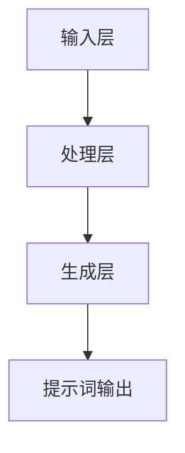
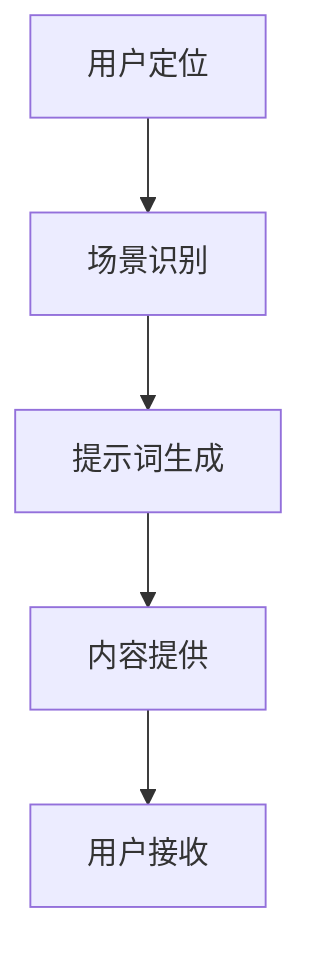
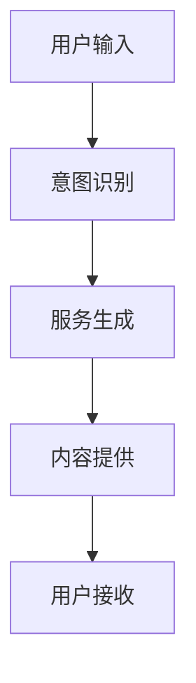

                 

### 文章标题

《提示词工程在混合现实中的创新应用》

### 关键词

混合现实（Mixed Reality，MR），增强现实（Augmented Reality，AR），虚拟现实（Virtual Reality，VR），提示词工程（Prompt Engineering），自然语言处理（Natural Language Processing，NLP），人工智能（Artificial Intelligence，AI）

### 摘要

本文旨在探讨提示词工程在混合现实（MR）中的创新应用，详细介绍混合现实技术基础、提示词工程原理与架构，以及在MR场景中的应用案例。文章首先概述了混合现实的定义与发展历程，分析了其核心技术——图像识别与跟踪技术和实时渲染技术。接着，我们深入探讨了提示词工程的核心概念、系统架构，以及其在MR中的具体需求与应用。随后，文章介绍了智能交互设计与用户体验提升的原则与技巧，以及提示词工程与人工智能的深度融合。最后，文章讨论了实时动态提示词生成的概念，并展示了如何通过自然语言处理与深度学习技术实现提示词的实时生成。本文旨在为读者提供全面的提示词工程在混合现实中的创新应用指南，促进这一领域的技术发展。

### 第一部分：混合现实与提示词工程基础

#### 第1章：混合现实技术基础

##### 1.1 混合现实的定义与发展历程

混合现实（Mixed Reality，MR）是一种将现实世界与数字世界相结合的技术，通过虚拟现实（VR）和增强现实（AR）的融合，创造出一种全新的交互体验。它不仅仅是将数字内容叠加在现实世界之上，还允许用户与数字内容进行互动，从而在物理和虚拟之间构建了一个无缝衔接的界面。

混合现实技术的发展可以追溯到20世纪60年代的虚拟现实概念提出。从最初的VR设备，如1970年代任天堂的红外控制器，到1990年代虚拟现实实验室的出现，再到2000年代增强现实技术的兴起，如谷歌的谷歌眼镜和2010年代微软的HoloLens，混合现实技术经历了漫长而曲折的发展历程。

在混合现实技术的发展历程中，几个关键的事件和里程碑值得注意：

- **虚拟现实（VR）**：1960年代，美国计算机科学家杰伦·拉尼尔（Jaron Lanier）提出了虚拟现实的观念，并开发了VR设备。这一时期的VR主要侧重于提供一个沉浸式的虚拟环境。

- **增强现实（AR）**：1990年代，波音公司和AR创始人密歇根大学的史蒂夫·曼（Steve Mann）等人开始研发增强现实技术。这一时期，增强现实设备主要用于工业和军事领域。

- **混合现实（MR）**：2010年代，随着计算机处理能力的提升和传感技术的进步，混合现实技术开始进入大众视野。微软的HoloLens、Magic Leap的Magic Leap One等设备的推出，标志着MR技术的商业化和普及。

##### 1.2 混合现实的核心技术

混合现实技术的实现依赖于多个关键技术的协同作用，其中主要包括图像识别与跟踪技术、实时渲染技术、自然语言处理技术等。

- **图像识别与跟踪技术**：图像识别与跟踪技术是混合现实中的核心技术之一。它利用计算机视觉算法对现实场景中的图像进行识别与跟踪，确保虚拟元素能够准确地叠加在现实世界之上。这一过程通常包括以下几个步骤：

  - **预处理**：对输入的图像进行预处理，如灰度化、滤波等。
  - **特征提取**：从预处理后的图像中提取特征，如边缘、角点等。
  - **匹配与跟踪**：将提取的特征与预先定义的模板进行匹配，跟踪图像中物体的运动轨迹。

  **伪代码示例**：

  ```python
  function imageTracking(imageInput):
      preprocessing(imageInput)
      detectedObjects = recognizeObjects(imageInput)
      trackingResults = trackObjects(detectedObjects)
      return trackingResults
  ```

- **实时渲染技术**：实时渲染是将数字场景与现实场景进行融合的关键技术。它涉及到如何高效地处理大量数据，并在保持实时性的前提下生成高质量的图像。实时渲染通常包括以下步骤：

  - **场景构建**：根据用户输入和实时跟踪结果，构建数字场景。
  - **光照与阴影处理**：模拟现实世界的光照效果，为虚拟元素添加阴影。
  - **图像合成**：将数字场景与现实场景融合，生成最终的图像输出。

  **伪代码示例**：

  ```python
  function realTimeRendering(realWorldScene, digitalScene):
      blendedScene = blendDigitalSceneWithRealWorldScene(realWorldScene, digitalScene)
      return blendedScene
  ```

##### 1.3 提示词工程概述

提示词工程（Prompt Engineering）是利用自然语言处理（NLP）技术，为用户提供交互提示信息的过程。它的目标是提高用户体验，降低用户的学习成本，提高交互效率。

提示词工程的基本流程通常包括以下几个步骤：

- **交互模型**：定义用户与系统之间的交互模式，如问答式交互、指令式交互等。
- **响应生成**：根据用户输入生成相应的提示词，包括上下文信息、指令说明等。
- **上下文感知**：根据当前场景和用户状态生成合适的提示词。

提示词工程的作用主要体现在以下几个方面：

- **提高用户效率**：通过提供清晰的提示词，用户可以更快地完成任务，减少操作错误。
- **降低学习成本**：对于初次使用混合现实系统的用户，提示词工程可以帮助他们快速上手，降低学习成本。
- **增强用户体验**：自然语言处理技术可以生成符合用户需求的、个性化的提示词，提升用户的沉浸感和满意度。

### 第2章：提示词工程原理与架构

#### 2.1 提示词工程的核心概念

提示词工程涉及多个核心概念，包括交互模型、响应生成和上下文感知等。

- **交互模型**：交互模型定义了用户与系统之间的交互模式。常见的交互模型有问答式交互、指令式交互、对话式交互等。问答式交互主要通过用户提问和系统回答的方式进行，适用于信息查询类任务。指令式交互则通过用户输入指令，系统执行相应操作的方式，适用于控制类任务。对话式交互通过模拟人类对话的方式，实现自然、流畅的交互体验。

- **响应生成**：响应生成是指根据用户输入生成相应的提示词。这一过程通常涉及自然语言处理技术，如文本分类、情感分析、命名实体识别等。响应生成不仅要准确理解用户输入，还要根据上下文和场景生成合适的提示词。例如，在一个智能导游系统中，用户询问某个景点的历史背景，系统可以生成包含景点历史、地理信息等的详细回答。

- **上下文感知**：上下文感知是指根据当前场景和用户状态生成合适的提示词。上下文感知能力是提示词工程的关键，它可以确保系统在任何场景下都能提供有用的提示。例如，在一个医疗场景中，系统需要根据患者的病情、医生的操作等实时生成相应的提示词，以提高诊断和治疗的准确性。

#### 2.2 提示词工程的系统架构

提示词工程的系统架构通常包括输入层、处理层和生成层。

- **输入层**：输入层是用户与系统交互的接口，接收用户输入。用户输入可以是文本、语音、手势等多种形式。输入层的关键在于如何高效地采集和解析用户输入，为后续处理提供基础数据。

- **处理层**：处理层是对用户输入进行处理的核心模块。它包括文本预处理、语义分析、关键词提取等功能。处理层的任务是理解用户输入的含义，提取关键信息，为生成层提供输入。具体过程如下：

  - **文本预处理**：对输入文本进行清洗、分词、词性标注等操作，去除无效信息，提取有效信息。
  - **语义分析**：利用自然语言处理技术，对预处理后的文本进行语义分析，理解文本的含义和情感。
  - **关键词提取**：从语义分析结果中提取关键信息，如名词、动词、形容词等，为生成层提供关键词和语义信息。

- **生成层**：生成层是根据处理层提取的关键词和语义信息生成提示词的模块。生成层的关键在于如何根据上下文和用户状态，生成符合用户需求的提示词。生成层通常采用模板匹配、语义模板匹配、生成式模型等方法。具体过程如下：

  - **模板匹配**：根据预设的提示词模板，将提取的关键词和语义信息填入模板，生成提示词。
  - **语义模板匹配**：根据语义信息，动态生成提示词。例如，根据用户的情感状态，生成鼓励性的提示词。
  - **生成式模型**：利用生成式模型，如序列到序列模型、变换器（Transformer）等，生成符合上下文和用户需求的提示词。

#### Mermaid 流程图



### 第3章：提示词工程在混合现实中的应用

#### 3.1 混合现实场景中的提示词需求

在混合现实（MR）场景中，提示词的需求具有多样性和复杂性。根据不同的应用场景，提示词可以分为导航场景、交互场景等。

- **导航场景**：在导航场景中，提示词主要用于帮助用户确定方向、查找目的地等。例如，用户在商场中寻找某个店铺时，系统可以提供详细的导航信息，包括店铺的位置、路线、步数等。此外，对于盲人或视力不佳的用户，提示词还可以以语音形式提供，确保他们能够顺利到达目的地。

- **交互场景**：在交互场景中，提示词主要用于指导用户如何与系统进行交互。例如，用户在操作一个虚拟设备时，系统可以提供操作说明和提示，帮助用户正确完成操作。此外，对于一些复杂的应用场景，如虚拟手术训练，系统可以提供实时反馈和指导，帮助用户掌握操作技巧。

#### 3.2 提示词工程在混合现实中的应用案例

提示词工程在混合现实中的应用已经取得了显著成果，下面我们将介绍几个典型的应用案例。

- **智能导游**：智能导游是一种利用混合现实技术提供景点介绍和历史背景的应用。系统可以通过摄像头捕捉现实场景，然后根据用户的位置和视线方向，生成相应的提示词。例如，当用户看向某个历史建筑时，系统可以自动生成该建筑的简介、历史背景等相关信息，并提供语音讲解。这种应用不仅可以提升用户的旅游体验，还可以帮助用户更深入地了解景点的历史和文化。

- **虚拟助手**：虚拟助手是一种在虚拟环境中为用户提供实时交互和个性化服务的应用。虚拟助手可以根据用户的偏好和需求，生成个性化的提示词。例如，用户在虚拟商场购物时，虚拟助手可以推荐符合用户兴趣的商品，并提供购物建议。此外，虚拟助手还可以根据用户的操作行为，提供实时反馈和指导，帮助用户更好地完成购物任务。

#### 智能导游：景点介绍与历史背景

智能导游系统通过混合现实技术，为用户提供沉浸式的景点介绍和历史背景服务。系统的工作流程如下：

1. **用户定位**：系统利用摄像头和传感器，捕捉用户的实时位置和视线方向。
2. **场景识别**：系统对捕捉到的场景进行分析，识别出当前用户所注视的景点或建筑。
3. **提示词生成**：系统根据识别结果，生成相应的提示词。提示词可以是文本、语音、图像等多种形式。
4. **内容提供**：系统将生成的提示词传递给用户，用户可以通过屏幕、耳机等设备接收到这些提示词。

以下是一个具体的智能导游系统示例：



- **示例代码**：

  ```python
  def userLocationTracking():
      cameraInput = captureCameraInput()
      currentPosition = locateUserInScene(cameraInput)
      return currentPosition
  
  def sceneRecognition(currentPosition):
      sceneImage = captureSceneImage(currentPosition)
      recognizedScene = identifyScene(sceneImage)
      return recognizedScene
  
  def promptGeneration(recognizedScene):
      sceneInformation = getSceneInformation(recognizedScene)
      promptText = generatePromptText(sceneInformation)
      return promptText
  
  def contentDelivery(promptText):
      speakPrompt(promptText)
      displayPromptTextOnScreen(promptText)
  ```

#### 虚拟助手：实时交互与个性化服务

虚拟助手通过混合现实技术，为用户提供实时交互和个性化服务。系统的工作流程如下：

1. **用户输入**：用户通过语音、手势等方式与系统进行交互，输入查询或指令。
2. **意图识别**：系统利用自然语言处理技术，识别用户的意图和需求。
3. **服务生成**：系统根据用户的意图和需求，生成相应的服务内容。
4. **内容提供**：系统将生成的服务内容传递给用户，用户可以通过屏幕、耳机等设备接收到这些内容。

以下是一个具体的虚拟助手系统示例：



- **示例代码**：

  ```python
  def userInputProcessing():
      userSpeech = captureUserSpeech()
      intent = recognizeUserIntent(userSpeech)
      return intent
  
  def serviceGeneration(intent):
      serviceContent = generateServiceContent(intent)
      return serviceContent
  
  def contentDelivery(serviceContent):
      speakServiceContent(serviceContent)
      displayServiceContentOnScreen(serviceContent)
  ```

### 第二部分：提示词工程的创新应用

#### 第4章：智能交互设计与用户体验提升

##### 4.1 智能交互设计原则

智能交互设计旨在通过提示词工程等手段，提升用户体验，使其在混合现实场景中更加自然、高效、愉悦。以下是一些智能交互设计的原则：

- **自然性**：智能交互设计应追求自然性，即让交互过程尽可能接近人类的日常交流。这包括使用自然的语言表达、符合用户习惯的交互方式等。通过自然性设计，用户可以更快地适应和使用混合现实系统。

- **个性化**：个性化设计是指根据用户的喜好、行为和需求，提供定制化的提示词和服务。个性化设计可以显著提升用户的满意度，使其感到系统更加贴心和人性化。

- **上下文感知**：上下文感知是指系统能够根据当前场景和用户状态，提供相关的提示词和服务。上下文感知设计能够确保系统在任何场景下都能提供有用的帮助，提升用户的体验。

- **快速响应**：快速响应是智能交互设计的关键。在混合现实场景中，用户往往需要在短时间内完成多项任务。系统应能够迅速响应用户的输入，提供及时的反馈，减少用户的等待时间。

- **易于操作**：智能交互设计应确保用户能够轻松地与系统进行交互。这包括设计直观的界面、提供清晰的操作指南和提示词等。易于操作的设计可以降低用户的学习成本，提高系统的易用性。

##### 4.2 提升用户体验的技巧

要提升用户体验，智能交互设计需要结合提示词工程等手段，采取一系列技巧。以下是一些实用的技巧：

- **上下文感知**：通过自然语言处理和上下文分析技术，系统可以实时捕捉用户的交互行为和场景信息，根据上下文生成合适的提示词。例如，在用户进行购物时，系统可以根据用户的浏览历史和购买偏好，推荐相关的商品和优惠信息。

- **快速响应**：为了提升用户体验，系统应尽可能减少响应时间。这可以通过优化算法、提高硬件性能和采用云计算等技术手段实现。快速响应不仅能够提高用户满意度，还可以提升系统的整体效率和性能。

- **个性化推荐**：基于用户的行为数据和偏好，系统可以生成个性化的推荐内容。例如，在虚拟购物环境中，系统可以根据用户的浏览记录和购买历史，推荐相关商品和优惠信息，提高用户的购买意愿。

- **自然语言交互**：通过自然语言处理技术，系统可以理解用户的自然语言输入，并提供相应的提示词和服务。自然语言交互能够使系统更加贴近用户的日常交流习惯，提升用户的体验。

- **实时反馈**：系统应能够实时响应用户的操作和输入，提供及时的反馈。例如，在用户进行虚拟手术训练时，系统可以实时监测用户的操作，提供实时反馈和指导，帮助用户掌握手术技巧。

- **可视化设计**：通过视觉化的设计，系统可以更好地展示信息和操作过程。例如，使用图表、图标和动画等元素，使系统界面更加直观和易于理解。

- **人性化交互**：系统应尽可能模拟人类的交流方式，使用友好的语言和表情，提供温馨的服务。人性化交互可以增强用户对系统的认同感和信任感，提升用户体验。

##### 4.3 提示词工程在智能交互设计中的应用

提示词工程在智能交互设计中扮演着关键角色，它能够根据用户的交互行为和场景，生成个性化的提示词，提高用户体验。以下是一些提示词工程在智能交互设计中的应用：

- **任务引导**：在用户进行复杂任务时，系统可以提供任务引导提示词，帮助用户顺利完成操作。例如，在虚拟商场购物时，系统可以提示用户如何添加商品到购物车、如何查看订单状态等。

- **操作指导**：系统可以根据用户的操作行为，提供实时操作指导提示词。例如，在虚拟手术训练中，系统可以实时提示用户如何操作手术工具、如何调整参数等。

- **情感反馈**：系统可以基于用户的情感状态，生成相应的情感反馈提示词。例如，当用户感到困惑或焦虑时，系统可以提供安慰性的提示词，帮助用户放松。

- **个性化推荐**：系统可以根据用户的行为数据和偏好，生成个性化的推荐提示词。例如，在虚拟旅游中，系统可以根据用户的兴趣和历史记录，推荐相关的景点和活动。

- **实时交互**：在实时交互场景中，系统可以生成实时交互提示词，引导用户参与互动。例如，在虚拟会议中，系统可以提示用户如何发言、如何提问等。

- **多模态交互**：系统可以结合多种交互模式，如语音、文本、手势等，生成多模态提示词。例如，在虚拟健身课程中，系统可以同时提供语音指导、文字说明和动作提示。

#### 第5章：提示词工程与人工智能的融合

##### 5.1 人工智能技术在提示词工程中的应用

人工智能（AI）技术的发展为提示词工程带来了新的机遇和挑战。通过结合自然语言处理（NLP）和深度学习等技术，人工智能能够显著提升提示词工程的智能化水平，实现更高效的交互体验。

- **自然语言处理**：NLP技术在提示词工程中的应用主要体现在文本理解、语义分析和语言生成等方面。通过NLP技术，系统可以理解用户的自然语言输入，提取关键信息，并生成符合上下文和用户需求的提示词。具体应用包括：

  - **文本分类**：将用户输入的文本分类到不同的类别，例如问题分类、意图分类等。这有助于系统快速理解用户的需求，生成相应的提示词。
  - **实体识别**：从用户输入的文本中识别出关键实体，如人名、地名、组织名等。实体识别对于生成精确的提示词至关重要。
  - **情感分析**：分析用户输入的文本的情感倾向，如积极、消极、中立等。情感分析可以用于生成情感化的提示词，提升用户体验。

- **深度学习**：深度学习技术在提示词工程中扮演着关键角色，通过训练大规模的神经网络模型，系统可以自动学习和生成高质量的提示词。具体应用包括：

  - **词嵌入**：将词汇映射到高维空间，使得相似词汇在空间中更接近。词嵌入技术有助于提高文本处理和提示词生成的效果。
  - **序列模型**：如循环神经网络（RNN）和变换器（Transformer）等，用于处理和时间序列相关的提示词。这些模型能够捕捉用户输入的上下文信息，生成更加连贯和自然的提示词。
  - **生成对抗网络（GAN）**：通过生成对抗网络，系统可以生成高质量的文本，用于生成个性化的提示词。

##### 5.2 深度学习与提示词工程的结合

深度学习与提示词工程的结合为智能交互带来了新的可能性。以下是一些深度学习在提示词工程中的应用场景和具体实现方法：

- **词嵌入与提示词生成**：

  词嵌入是将词汇映射到高维空间的过程，使得语义相似的词汇在空间中更接近。词嵌入技术能够显著提高文本处理和提示词生成的效果。在提示词工程中，词嵌入通常用于以下场景：

  - **用户输入处理**：将用户输入的文本转换为词嵌入表示，为后续的文本分析和提示词生成提供基础。
  - **提示词生成**：利用词嵌入表示，结合生成模型（如变换器）生成高质量的提示词。

  **示例伪代码**：

  ```python
  import tensorflow as tf

  # 加载预训练的词嵌入模型
  wordEmbeddingModel = tf.keras.Sequential([
      tf.keras.layers.Embedding(vocabularySize, embeddingDim),
      tf.keras.layers.Dense(outputSize, activation='softmax')
  ])

  # 将用户输入的文本转换为词嵌入表示
  userInputEmbedding = wordEmbeddingModel(userInput)

  # 使用变换器模型生成提示词
  prompt = transformerModel.generatePrompt(userInputEmbedding)
  ```

- **序列模型与提示词生成**：

  序列模型，如循环神经网络（RNN）和变换器（Transformer），能够处理和时间序列相关的提示词。这些模型能够捕捉用户输入的上下文信息，生成更加连贯和自然的提示词。在提示词工程中，序列模型通常用于以下场景：

  - **上下文信息处理**：将用户输入的文本和上下文信息转换为序列表示。
  - **提示词生成**：利用序列模型生成符合上下文和用户需求的提示词。

  **示例伪代码**：

  ```python
  import tensorflow as tf

  # 定义循环神经网络模型
  rnnModel = tf.keras.Sequential([
      tf.keras.layers.LSTM(units=128, activation='tanh', return_sequences=True),
      tf.keras.layers.Dense(units=outputSize, activation='softmax')
  ])

  # 定义变换器模型
  transformerModel = tf.keras.Sequential([
      tf.keras.layers.Embedding(vocabularySize, embeddingDim),
      tf.keras.layers.Dense(units=outputSize, activation='softmax')
  ])

  # 处理用户输入的文本
  userInputSequence = preprocessUserInput(userInput)

  # 使用循环神经网络生成提示词
  prompt = rnnModel.predict(userInputSequence)

  # 使用变换器模型生成提示词
  prompt = transformerModel.generatePrompt(userInputSequence)
  ```

##### 5.3 深度学习模型与提示词工程结合的优势

深度学习模型与提示词工程的结合带来了以下优势：

- **自动化特征提取**：深度学习模型能够自动从大量数据中提取有意义的特征，减少了人工特征工程的工作量。
- **上下文感知**：深度学习模型能够捕捉用户输入的上下文信息，生成更加连贯和自然的提示词。
- **个性化推荐**：通过分析用户行为数据和偏好，深度学习模型可以生成个性化的提示词，提高用户体验。
- **实时响应**：深度学习模型能够在短时间内处理大量数据，实现实时提示词生成，提高系统的响应速度。

### 第6章：实时动态提示词生成

#### 6.1 实时动态提示词的概念

实时动态提示词生成是指系统能够在用户交互的实时过程中，根据用户的输入和行为，动态生成合适的提示词。这种提示词生成方式具有以下几个特点：

- **实时性**：实时动态提示词生成能够在用户交互的瞬间完成，确保用户能够及时接收到有用的信息。
- **动态性**：提示词可以根据用户的输入和行为实时更新，适应不同的交互场景和用户需求。
- **上下文感知**：实时动态提示词生成能够捕捉用户的实时上下文信息，生成与当前场景和用户状态相关的提示词。

实时动态提示词生成的核心在于如何快速、准确地根据用户的输入和行为生成高质量的提示词。这需要结合自然语言处理、深度学习和实时数据处理等技术，实现高效的提示词生成机制。

#### 6.2 提示词生成过程

实时动态提示词生成过程通常包括以下几个步骤：

1. **用户输入处理**：系统首先接收用户的输入，如文本、语音或手势等。对于文本输入，需要进行预处理，如分词、词性标注等；对于语音输入，需要通过语音识别技术转换为文本；对于手势输入，需要通过手势识别技术转换为操作指令。

2. **上下文信息捕捉**：系统捕捉用户的实时上下文信息，如当前场景、用户位置、交互历史等。上下文信息的捕捉可以通过传感器、摄像头和数据库等多种途径实现。

3. **提示词模板匹配**：系统根据用户的输入和上下文信息，从预设的提示词模板中选取合适的模板。提示词模板通常包含关键词、短语和句子结构等。

4. **提示词生成**：系统根据提示词模板和上下文信息，动态生成提示词。生成过程可以采用自然语言生成技术，如序列模型、生成对抗网络等。

5. **提示词输出**：系统将生成的提示词输出给用户，通过屏幕、语音或手势等方式传递给用户。

#### 6.3 实时动态提示词生成技术

实时动态提示词生成技术主要包括自然语言处理、深度学习和实时数据处理等技术。以下是一些关键技术：

- **自然语言处理**：自然语言处理技术用于处理用户的输入文本，提取关键词和语义信息，为提示词生成提供基础。常用的自然语言处理技术包括分词、词性标注、命名实体识别、语义分析等。

- **深度学习**：深度学习技术用于生成高质量的提示词。深度学习模型，如循环神经网络（RNN）、变换器（Transformer）和生成对抗网络（GAN）等，能够自动从大量数据中学习语义信息，生成符合上下文和用户需求的提示词。

- **实时数据处理**：实时数据处理技术用于快速捕捉用户的实时输入和上下文信息，确保系统能够及时响应。实时数据处理技术包括流处理、时间序列分析和实时数据库等。

#### 6.4 实时动态提示词生成应用案例

实时动态提示词生成在多个领域得到了广泛应用，以下是一些应用案例：

- **智能客服**：在智能客服系统中，实时动态提示词生成可以用于生成与用户问题相关的解答和建议。系统可以根据用户的输入和历史记录，实时生成合适的回答，提高客服的响应速度和准确性。

- **智能导航**：在智能导航系统中，实时动态提示词生成可以用于生成与用户当前位置相关的导航信息。系统可以根据用户的输入和实时路况信息，动态生成最佳路线和注意事项，帮助用户顺利到达目的地。

- **虚拟助手**：在虚拟助手系统中，实时动态提示词生成可以用于生成与用户需求相关的操作指令和提示。系统可以根据用户的输入和上下文信息，实时生成个性化的服务内容，提供更加贴心的交互体验。

### 总结

本文系统地介绍了提示词工程在混合现实中的应用，从混合现实技术基础、提示词工程原理与架构，到提示词工程在混合现实中的具体需求和应用案例，再到提示词工程与人工智能的融合、实时动态提示词生成等，全面探讨了这一领域的前沿技术和发展趋势。通过本文的阐述，读者可以了解到提示词工程在提升混合现实用户体验、实现智能交互设计等方面的重要作用，以及如何通过人工智能技术实现实时动态提示词的高效生成。本文旨在为从事混合现实和人工智能领域的研究者和开发者提供有价值的参考和启示，推动这一领域的技术创新和应用实践。在未来的发展中，随着技术的不断进步和应用的深入，提示词工程在混合现实中的创新应用将更加广泛和成熟，为用户带来更加丰富和沉浸的交互体验。让我们共同期待这一激动人心的未来。作者：AI天才研究院/AI Genius Institute & 禅与计算机程序设计艺术 /Zen And The Art of Computer Programming

