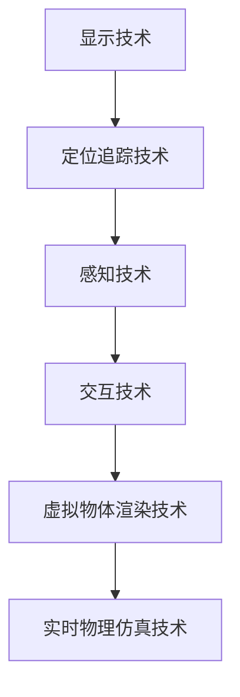
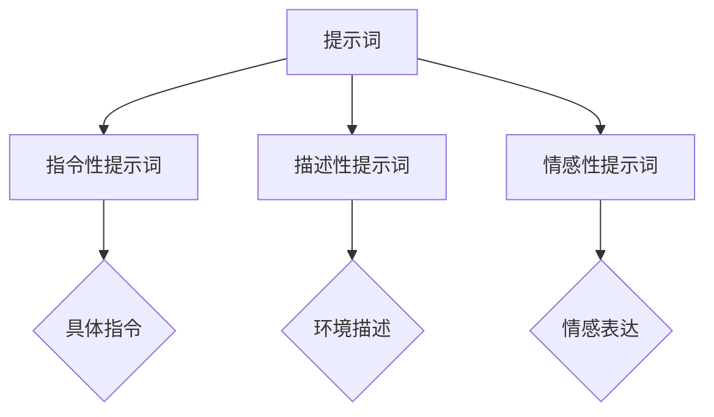

                 

### 文章标题

《提示词工程在混合现实中的创新应用》

> 关键词：提示词工程，混合现实，增强现实，虚拟现实，人工智能，交互设计

> 摘要：本文将深入探讨提示词工程在混合现实（MR）中的应用，包括其在增强现实（AR）和虚拟现实（VR）中的创新设计、实施策略以及关键挑战。通过阐述提示词工程的基本概念、算法和实际应用案例，本文旨在为读者提供一个清晰、全面的视角，帮助理解这一前沿技术在未来的潜在影响和广泛应用前景。

### 《提示词工程在混合现实中的创新应用》目录大纲

#### 第一部分：混合现实与提示词工程概述

##### 第1章：混合现实技术基础

- 1.1 混合现实的定义与分类

##### 第2章：提示词工程基础

- 2.1 提示词的定义与分类

##### 第3章：提示词工程在增强现实中的应用

- 3.1 增强现实中的提示词设计

##### 第4章：提示词工程在虚拟现实中的应用

- 4.1 虚拟现实中的提示词设计

#### 第二部分：混合现实中的提示词工程应用

##### 第5章：提示词工程在混合现实中的综合应用

- 5.1 提示词工程在混合现实中的应用策略

##### 第6章：混合现实中的提示词工程实践

- 6.1 混合现实开发环境搭建

##### 第7章：混合现实中的提示词工程案例分析

- 7.1 实际案例分析与详细讲解

##### 第8章：混合现实提示词工程的最佳实践与未来展望

- 8.1 提示词工程的最佳实践

### 第一部分：混合现实与提示词工程概述

#### 第1章：混合现实技术基础

##### 1.1 混合现实的定义与分类

混合现实（Mixed Reality，简称MR）是一种将现实世界和虚拟世界融合在一起的技术。它不仅包括虚拟现实（VR）和增强现实（AR），还融合了现实世界中的物理交互和环境感知。混合现实的核心在于创造一个与现实环境无缝互动的虚拟空间。

**1.1.1 混合现实的分类**

混合现实可以分为以下几个类别：

- **增强现实（AR）**：增强现实是通过在现实世界中叠加虚拟元素来增强用户的感知体验。常见的应用有游戏、教育、医疗等。

- **虚拟现实（VR）**：虚拟现实是通过创建一个完全虚拟的环境来替代现实世界。用户通过头戴设备进入虚拟世界，并在其中进行交互。

- **混合增强现实（MR）**：混合增强现实结合了增强现实和虚拟现实的特点，允许用户在现实世界中与虚拟元素进行互动。

**Mermaid流程图：**

```mermaid
graph TD
A[混合现实] --> B[增强现实(AR)]
A --> C[虚拟现实(VR)]
A --> D[混合增强现实(MR)]
B --> E[应用内容分类]
C --> E
D --> E
E --> F[游戏]
E --> G[教育]
E --> H[医疗]
E --> I[工业]
E --> J[军事]
```

**1.1.2 混合现实的关键技术**

- **显示技术**：包括头戴显示器（HMD）、投影仪、透明显示设备等，用于呈现虚拟元素和场景。

- **定位追踪技术**：通过摄像头、传感器和计算机视觉算法来确定用户在现实环境中的位置和方向。

- **感知技术**：包括视觉、听觉、触觉等多种感知方式，用于与虚拟世界进行交互。

- **交互技术**：包括手势识别、语音识别、触觉反馈等，用于用户与虚拟世界的互动。

- **虚拟物体渲染技术**：用于生成和渲染虚拟物体的视觉效果，包括光照、阴影、纹理等。

- **实时物理仿真技术**：用于模拟虚拟物体在现实环境中的物理行为，如碰撞、弹跳、摩擦等。

**Mermaid流程图：**



**1.1.3 提示词工程在混合现实中的应用概述**

提示词工程是人工智能领域的一个重要分支，它涉及设计、生成和应用提示词以引导用户完成特定任务。在混合现实场景中，提示词工程的应用主要包括以下方面：

- **交互引导**：通过提示词帮助用户了解如何与环境进行交互，提高用户体验。

- **情境适应**：根据用户的行为和环境信息动态调整提示词，以适应不同的交互场景。

- **情感表达**：通过情感性提示词传达虚拟环境中的情感信息，增强沉浸感和体验。

- **任务引导**：提供明确的指令和描述，帮助用户完成复杂任务。

在接下来的章节中，我们将深入探讨提示词工程的基本概念、算法以及在增强现实和虚拟现实中的应用策略。

#### 第2章：提示词工程基础

##### 2.1 提示词的定义与分类

提示词是引导用户完成特定任务或行为的关键元素。在人工智能领域，提示词工程涉及到设计、生成和应用这些提示词以优化用户体验。提示词的定义和分类对于理解其在混合现实中的应用至关重要。

**2.1.1 提示词的定义**

提示词（Prompt）可以定义为一种用来引导用户行为的指示性语言或符号。它通常包含明确的指令、描述或情感表达，以帮助用户理解任务要求、操作步骤或环境信息。提示词在多种应用场景中发挥着重要作用，包括自然语言处理、人机交互、虚拟现实和增强现实等。

**2.1.2 提示词的分类**

根据用途和内容，提示词可以大致分为以下几类：

- **指令性提示词**：这类提示词主要用于提供明确的操作指令，指导用户执行特定动作。例如，“请点击屏幕上的图标”或“将手放置在摄像头前”。

- **描述性提示词**：描述性提示词用于描述当前场景、任务或环境信息，帮助用户更好地理解上下文。例如，“您现在位于博物馆的古代艺术展区”或“请观察屏幕上的3D模型”。

- **情感性提示词**：情感性提示词传达虚拟环境中的情感信息，以增强用户体验和沉浸感。例如，“恭喜您成功完成任务，您做得很好！”或“请注意，当前场景可能引起不适”。

**Mermaid流程图：**



**2.1.3 提示词工程的关键挑战**

在设计和应用提示词时，存在一系列关键挑战，包括：

- **用户个性化**：提示词需要根据不同用户的偏好、经验和知识水平进行个性化调整。

- **情境适应性**：提示词应能够适应动态变化的交互环境和任务需求。

- **语言理解**：确保提示词的语义清晰，避免歧义，并能够被用户正确理解。

- **交互效率**：优化提示词的长度、内容和呈现方式，以提高用户的交互效率和体验。

- **情感共鸣**：在虚拟环境中传达恰当的情感信息，以增强用户的情感体验。

在下一章中，我们将详细探讨提示词生成的算法，以及如何应对上述挑战。

#### 第2章：提示词工程基础（续）

##### 2.2 提示词生成的算法

提示词生成的算法是提示词工程的核心组成部分。这些算法决定了如何根据用户行为、场景信息以及任务需求生成有效的提示词。以下是一些常见的提示词生成算法：

**2.2.1 基于规则的算法**

基于规则的算法是最简单的提示词生成方法。它通过预定义的规则库来生成提示词。每个规则包含一组条件和相应的提示词。当系统检测到特定的条件满足时，就会触发对应的提示词。

**伪代码示例：**

```python
def generate_prompt(rule_base, user_action, current_scene):
    for rule in rule_base:
        if rule["condition"](user_action, current_scene):
            return rule["prompt"]
    return "未知操作"

# 规则库示例
rule_base = [
    {"condition": lambda action, scene: action == "navigate", "prompt": "请按照指示进行导航"},
    {"condition": lambda action, scene: action == "inspect", "prompt": "请检查以下内容"},
    {"condition": lambda action, scene: action == "react", "prompt": "请表达您的情感"}
]
```

**2.2.2 基于机器学习的算法**

基于机器学习的算法通过训练模型来生成提示词。这些模型通常使用大量的用户交互数据来学习生成有效的提示词。常见的机器学习模型包括循环神经网络（RNN）、长短期记忆网络（LSTM）和变换器（Transformer）等。

**伪代码示例：**

```python
from transformers import AutoModelForSeq2SeqLM

model = AutoModelForSeq2SeqLM.from_pretrained("prompt-generation-model")

def generate_prompt(model, user_input):
    prompt = user_input + "，请提供相应的提示词："
    input_ids = tokenizer.encode(prompt, return_tensors="pt")
    outputs = model(input_ids)
    prediction = outputs.logits.argmax(-1)
    generated_text = tokenizer.decode(prediction, skip_special_tokens=True)
    return generated_text
```

**2.2.3 基于生成对抗网络的算法**

生成对抗网络（GAN）可以生成高质量的提示词，通过训练一个生成器网络和一个判别器网络。生成器网络负责生成提示词，而判别器网络则负责判断提示词的质量。

**伪代码示例：**

```python
from tensorflow.keras.models import Model
from tensorflow.keras.layers import Input, Dense, LSTM

# 生成器模型
generator_input = Input(shape=(sequence_length,))
generator = LSTM(units=64, return_sequences=True)(generator_input)
generator_output = LSTM(units=64, return_sequences=False)(generator)
generator_model = Model(generator_input, generator_output)

# 判别器模型
discriminator_input = Input(shape=(sequence_length,))
discriminator = LSTM(units=64, return_sequences=True)(discriminator_input)
discriminator_output = LSTM(units=64, return_sequences=False)(discriminator)
discriminator_model = Model(discriminator_input, discriminator_output)

# GAN模型
def gan_loss(y_true, y_pred):
    return K.mean(-K.log(y_pred * K.square(1 - y_true) + K.epsilon()))

gan_model = Model(generator_input, discriminator_output)
gan_model.add_loss(gan_loss(discriminator_output, y_true))
gan_model.compile(optimizer="adam")
```

**2.2.4 基于增强学习的算法**

增强学习算法通过训练一个代理模型来生成提示词，并使用奖励信号来优化模型的性能。代理模型通常是一个基于神经网络的模型，它通过不断尝试和反馈来学习生成最佳提示词。

**伪代码示例：**

```python
from tensorflow.keras.models import Model
from tensorflow.keras.layers import Input, Dense, LSTM
from stable_baselines3 import PPO

# 建立代理模型
model = Model(inputs=generator_input, outputs=generator_output)
model.compile(optimizer="adam", loss="mse")

# 训练代理模型
optimizer = PPO("Critic", model, verbose=1)
optimizer.learn(total_timesteps=10000)
```

通过这些算法，系统可以根据不同的应用场景和用户需求生成高质量的提示词，从而提高用户的交互体验和任务完成效率。在下一章中，我们将讨论提示词工程在增强现实中的应用，并详细探讨如何在AR环境中设计和实施提示词。

#### 第二部分：混合现实中的提示词工程应用

#### 第3章：提示词工程在增强现实中的应用

##### 3.1 增强现实中的提示词设计

增强现实（AR）技术通过在现实世界场景中叠加虚拟元素，为用户提供了丰富的交互体验。在AR环境中，提示词的设计至关重要，它不仅能够引导用户完成特定任务，还能提升用户体验和沉浸感。以下是如何在增强现实中进行提示词设计的关键步骤和策略：

**3.1.1 提示词的设计目标**

在AR环境中设计提示词时，应明确以下目标：

- **清晰性**：提示词应简洁明了，避免使用复杂或模糊的语言，确保用户能够快速理解。

- **适应性**：提示词应能够适应不同的用户需求、场景变化和交互模式。

- **情境敏感性**：根据用户当前所处的场景和任务，提供恰当的提示词，以增强用户的沉浸感和体验。

- **互动性**：提示词应鼓励用户与虚拟元素进行互动，促进用户积极参与。

**3.1.2 提示词设计的流程**

提示词设计的流程通常包括以下步骤：

1. **需求分析**：了解用户需求、目标场景和交互模式，确定提示词所需传达的信息。

2. **用户研究**：通过用户访谈、调查和观察，了解用户的行为习惯、偏好和难点。

3. **场景建模**：构建虚拟环境模型，确定虚拟元素、用户交互点和提示词的放置位置。

4. **原型设计**：设计初步的提示词原型，并进行用户测试，收集反馈。

5. **迭代优化**：根据用户反馈，对提示词进行修改和优化，确保其有效性和易用性。

6. **最终验证**：在真实环境中进行测试，确保提示词在多种情况下均能正常工作。

**3.1.3 提示词设计的关键要素**

在AR环境中，以下是设计提示词的关键要素：

- **视觉设计**：提示词的视觉设计应与虚拟元素和现实环境协调一致，避免视觉冲突。

- **交互设计**：提示词应支持多种交互方式，如手势、语音和触控等，以满足不同用户的需求。

- **情境适应性**：提示词应根据用户在现实世界中的位置、行为和环境变化动态调整。

- **提示词类型**：根据任务需求，选择合适的提示词类型，如指令性、描述性或情感性提示词。

- **反馈机制**：提供即时反馈，帮助用户了解其操作结果，增强用户的互动体验。

**数学模型和公式：**

为了动态调整提示词，可以使用贝叶斯定理来计算在给定假设 \( H \) 下事件 \( E \) 发生的概率。该模型可以用于根据用户行为和场景信息生成个性化提示词。

$$
P(E|H) = \frac{P(H|E) \cdot P(E)}{P(H)}
$$

- **详细讲解**：此公式为贝叶斯定理，其中 \( P(E|H) \) 表示在假设 \( H \) 下事件 \( E \) 发生的条件概率，\( P(H|E) \) 表示在事件 \( E \) 发生时假设 \( H \) 的概率，\( P(E) \) 和 \( P(H) \) 分别是事件 \( E \) 和假设 \( H \) 的概率。在AR中，用户行为 \( E \) 可以是导航、交互或任务完成，假设 \( H \) 是提示词的类型和内容。

**举例说明**：

假设用户正在进行AR导航，系统需要根据用户的当前位置和历史行为生成提示词。根据贝叶斯定理，系统可以计算用户偏好导航提示词的概率，并根据计算结果选择最合适的提示词。

$$
P(\text{导航提示词}|\text{用户行为}) = \frac{P(\text{用户行为}|\text{导航提示词}) \cdot P(\text{导航提示词})}{P(\text{用户行为})}
$$

- **详细讲解**：此公式用于计算在给定用户行为 \( \text{用户行为} \) 下选择导航提示词 \( \text{导航提示词} \) 的概率。其中 \( P(\text{用户行为}|\text{导航提示词}) \) 表示在导航提示词存在时用户行为发生的概率，\( P(\text{导航提示词}) \) 表示导航提示词的概率，\( P(\text{用户行为}) \) 是用户行为发生的总概率。

**3.1.4 提示词在增强现实中的实施**

在实施提示词时，需要考虑以下步骤：

1. **集成提示词生成算法**：将提示词生成算法集成到AR系统，使其能够根据用户行为和场景信息动态生成提示词。

2. **测试和优化**：在实际环境中测试提示词生成算法，根据用户反馈进行优化，确保提示词的有效性和用户满意度。

3. **用户培训**：为用户提供关于如何与虚拟元素和提示词进行互动的培训，提高用户的操作能力。

4. **维护和更新**：定期维护和更新提示词库，以适应新任务和用户需求的变化。

**伪代码示例：**

```python
# 假设有一个AR系统，其中包含一个提示词生成算法
def apply_prompt(user_action, current_scene):
    if user_action == "navigate":
        return generate_navigation_prompt(current_scene)
    elif user_action == "inspect":
        return generate_inspection_prompt(current_scene)
    elif user_action == "react":
        return generate_emotion_prompt(current_scene)
    else:
        return "无效的操作"

# 生成不同类型的提示词
def generate_navigation_prompt(scene):
    # 根据场景信息生成导航提示词
    return "请前往博物馆的古代艺术展区"

def generate_inspection_prompt(item):
    # 根据物品信息生成检查提示词
    return "请仔细观察屏幕上的3D模型，注意其细节"

def generate_emotion_prompt(context):
    # 根据上下文生成情感性提示词
    return "您似乎对这个艺术品感到兴奋，请分享您的感受"
```

通过上述设计和方法，我们可以有效地在增强现实环境中应用提示词工程，提高用户的交互体验和任务完成效率。

#### 第4章：提示词工程在虚拟现实中的应用

##### 4.1 虚拟现实中的提示词设计

虚拟现实（VR）技术为用户创造了一个完全沉浸式的虚拟环境，使人们能够在虚拟世界中体验和互动。在这个高度模拟的环境中，提示词的设计变得尤为重要。它们不仅是用户与虚拟世界交互的桥梁，还能引导用户完成复杂任务，增强沉浸感和用户体验。以下是如何在虚拟现实中进行提示词设计的关键步骤和策略：

**4.1.1 提示词的设计目标**

在虚拟现实中，提示词的设计应遵循以下目标：

- **沉浸感**：提示词应与虚拟环境的风格和主题保持一致，增强用户的沉浸感。

- **清晰性**：提示词应简洁、明确，确保用户能够快速理解其含义。

- **适应性**：提示词应能够适应不同用户的需求和任务场景。

- **互动性**：提示词应鼓励用户在虚拟世界中主动参与和探索。

- **情感共鸣**：通过情感性提示词，传达虚拟环境中的情感和故事，增强用户的情感体验。

**4.1.2 提示词设计的流程**

虚拟现实中的提示词设计通常包括以下步骤：

1. **需求分析**：了解用户需求、目标场景和交互模式，确定提示词所需传达的信息。

2. **用户研究**：通过用户访谈、调查和观察，了解用户的行为习惯、偏好和难点。

3. **虚拟环境建模**：构建虚拟环境模型，确定虚拟元素、用户交互点和提示词的放置位置。

4. **原型设计**：设计初步的提示词原型，并进行用户测试，收集反馈。

5. **迭代优化**：根据用户反馈，对提示词进行修改和优化，确保其有效性和易用性。

6. **最终验证**：在真实环境中进行测试，确保提示词在多种情况下均能正常工作。

**4.1.3 提示词设计的关键要素**

在虚拟现实环境中，以下是设计提示词的关键要素：

- **视觉设计**：提示词的视觉设计应与虚拟环境的风格和色彩协调一致，避免视觉冲突。

- **交互设计**：提示词应支持多种交互方式，如手势、语音和触控等，以满足不同用户的需求。

- **情境适应性**：提示词应根据用户在虚拟世界中的位置、行为和环境变化动态调整。

- **提示词类型**：根据任务需求，选择合适的提示词类型，如指令性、描述性或情感性提示词。

- **反馈机制**：提供即时反馈，帮助用户了解其操作结果，增强用户的互动体验。

**数学模型和公式：**

为了优化虚拟现实中的提示词，可以使用以下数学模型和公式：

$$
R = \frac{U_1 - U_2}{I}
$$

- **详细讲解**：此公式用于计算提示词的吸引力 \( R \)，其中 \( U_1 \) 和 \( U_2 \) 分别是用户在有无提示词下的效用，\( I \) 是提示词的成本。此公式帮助我们在提供提示词时考虑其成本与用户效用的平衡。

**举例说明**：

假设在一个虚拟教育环境中，提示词可以帮助用户更好地理解课程内容。我们可以使用上述公式来评估提示词的有效性。

- **详细讲解**：例如，若提示词使用户在完成课程任务时的效用从80分提升到90分，而提示词的成本为5分钟的学习时间，则提示词的吸引力为：

$$
R = \frac{90 - 80}{5} = 2
$$

这表示提示词的吸引力很高，每花费1分钟的学习时间都能带来2分的效用提升。

**4.1.4 提示词在虚拟现实中的实施**

在实施提示词时，需要考虑以下步骤：

1. **集成提示词生成算法**：将提示词生成算法集成到VR系统，使其能够根据用户行为和场景信息动态生成提示词。

2. **测试和优化**：在实际环境中测试提示词生成算法，根据用户反馈进行优化，确保提示词的有效性和用户满意度。

3. **用户培训**：为用户提供关于如何与虚拟元素和提示词进行互动的培训，提高用户的操作能力。

4. **维护和更新**：定期维护和更新提示词库，以适应新任务和用户需求的变化。

**伪代码示例：**

```python
# 假设有一个VR系统，其中包含一个提示词生成算法
def apply_prompt(user_action, current_scene):
    if user_action == "navigate":
        return generate_navigation_prompt(current_scene)
    elif user_action == "learn":
        return generate_learning_prompt(current_scene)
    elif user_action == "explore":
        return generate_explore_prompt(current_scene)
    else:
        return "无效的操作"

# 生成不同类型的提示词
def generate_navigation_prompt(scene):
    # 根据场景信息生成导航提示词
    return "请前往虚拟图书馆的科幻小说区"

def generate_learning_prompt(course):
    # 根据课程信息生成学习提示词
    return "请仔细阅读屏幕上的文本，并尝试回答相关问题"

def generate_explore_prompt(virtual_location):
    # 根据虚拟位置生成探索提示词
    return "在这里，您可以找到各种奇妙的虚拟艺术品，请尽情探索"
```

通过上述设计和方法，我们可以有效地在虚拟现实环境中应用提示词工程，提高用户的交互体验和任务完成效率。接下来，我们将探讨如何将提示词工程在混合现实中进行综合应用，并解决其中的挑战。

#### 第5章：提示词工程在混合现实中的综合应用

##### 5.1 提示词工程在混合现实中的应用策略

混合现实（MR）结合了增强现实（AR）和虚拟现实（VR）的特点，为用户提供了更加丰富和沉浸的交互体验。在MR环境中，提示词工程的应用策略需要考虑到两种现实技术的融合，以实现最佳的交互效果和用户体验。以下是在混合现实中应用提示词工程的关键策略：

**5.1.1 提示词类型的融合**

在混合现实环境中，提示词类型应融合AR和VR的特点，以满足不同场景的需求：

- **指令性提示词**：用于指导用户在虚拟世界中的导航、任务执行和互动。例如，在AR场景中，可以提示用户“请将手放在屏幕上的图标上”，在VR场景中，可以提示用户“请向左旋转头部以查看更多信息”。

- **描述性提示词**：用于描述当前虚拟环境中的元素和场景，帮助用户理解虚拟世界的背景和互动规则。例如，在AR场景中，可以提示用户“您现在位于博物馆的古代艺术展区，请点击屏幕上的图标查看更多详情”，在VR场景中，可以提示用户“您身处一个虚拟的宇宙空间，请注意头顶上的星系”。

- **情感性提示词**：用于传达虚拟环境中的情感和故事，增强用户的沉浸感和情感体验。例如，在AR场景中，可以提示用户“欢迎来到未来世界，这里充满了希望和梦想”，在VR场景中，可以提示用户“您似乎感到有些紧张，请深呼吸，放松心情”。

**5.1.2 提示词的情境适应性**

在混合现实环境中，提示词应根据用户的行为、位置和环境变化动态调整，以提高情境适应性：

- **动态提示词生成**：使用机器学习算法和实时数据分析，根据用户的实时行为和场景信息动态生成提示词。例如，如果用户正在导航，系统可以生成导航提示词；如果用户正在参与一个社交互动，系统可以生成社交性提示词。

- **多模态提示词**：结合多种感知模式（如视觉、听觉和触觉）生成多模态提示词，以提高用户的交互体验。例如，在AR场景中，可以通过视觉和听觉提示词引导用户；在VR场景中，可以通过视觉、听觉和触觉提示词创造更加沉浸的体验。

**5.1.3 提示词的个性化调整**

在混合现实环境中，提示词应根据用户的个人喜好、经验和知识水平进行个性化调整：

- **用户画像**：建立用户的个性化画像，包括行为模式、偏好和知识水平，以便生成个性化的提示词。例如，如果用户喜欢快速导航，可以提供简洁的导航提示词；如果用户对艺术有深厚的了解，可以提供更详细的艺术描述。

- **自适应提示词**：根据用户的互动历史和行为数据，自适应调整提示词的内容和呈现方式。例如，如果用户经常忽略某个提示词，系统可以尝试改变提示词的形式或位置，以提高其可见性和注意度。

**5.1.4 提示词的跨场景一致性**

在混合现实环境中，提示词需要在不同场景之间保持一致性，以确保用户体验的连贯性：

- **一致性设计**：在设计提示词时，考虑到不同场景下的用户体验，确保提示词在视觉、语言和交互上的一致性。例如，在AR和VR场景中，使用相似的视觉风格和语言表达，以减少用户的学习成本。

- **跨场景数据共享**：将用户的互动数据在不同场景之间共享，以便在多个环境中提供一致的提示词服务。例如，用户在AR环境中完成的任务可以影响其在VR环境中的提示词内容。

**5.1.5 提示词的即时反馈**

在混合现实环境中，提示词应提供即时反馈，以帮助用户理解其操作结果，增强互动体验：

- **即时反馈机制**：设计即时反馈机制，当用户执行某个动作时，系统可以立即提供相应的提示词反馈。例如，当用户完成一个任务时，系统可以提示“恭喜您完成任务，下一个任务即将开始”。

- **动态调整反馈**：根据用户的反馈和行为数据，动态调整提示词的反馈内容。例如，如果用户经常忽略某个提示词，系统可以尝试使用不同的反馈方式，如语音提示、振动反馈或视觉动画。

通过上述策略，提示词工程可以在混合现实环境中发挥其最大作用，提高用户的交互体验和任务完成效率。在下一章中，我们将详细介绍如何在混合现实环境中实施提示词工程，并讨论具体的开发环境搭建、源代码实现和案例分析。

### 第6章：混合现实中的提示词工程实践

#### 6.1 混合现实开发环境搭建

在开始开发混合现实（MR）应用程序之前，搭建一个合适的开发环境至关重要。以下是一个典型的混合现实开发环境的搭建步骤：

**6.1.1 选择开发平台**

目前市场上主要的混合现实开发平台包括：

- **Unity**：Unity是一个流行的游戏开发引擎，支持AR和VR开发，提供丰富的3D内容创建和渲染功能。

- **Unreal Engine**：Unreal Engine是另一个强大的游戏开发引擎，适用于高画质和复杂的虚拟现实应用开发。

- **ARKit/ARCore**：苹果的ARKit和谷歌的ARCore是专门为移动设备开发的AR开发框架，支持iOS和Android平台。

- **Windows Mixed Reality**：适用于Windows平台的MR开发框架，支持各种MR设备和Unity/Unreal Engine的开发。

**6.1.2 安装开发工具**

根据所选的开发平台，安装相应的开发工具：

- **Unity**：下载并安装Unity Hub和Unity Editor。Unity Hub用于管理不同的Unity版本和项目，Unity Editor是实际的开发环境。

- **Unreal Engine**：访问Epic Games官网，下载并安装Unreal Engine。安装过程中需要创建一个Epic账号。

- **ARKit/ARCore**：根据开发设备（iOS或Android），分别下载并安装对应的开发工具。iOS开发者需使用Xcode，Android开发者需使用Android Studio。

- **Windows Mixed Reality**：访问微软官网，下载并安装Windows Mixed Reality开发者工具。

**6.1.3 配置开发环境**

完成开发工具的安装后，进行以下配置：

- **Unity**：
  1. 打开Unity Hub，创建一个新的Unity项目。
  2. 在项目中添加必要的AR或VR功能包，如ARFoundation或XR Plugin Package。
  3. 配置项目的分辨率、帧率和其他性能参数。

- **Unreal Engine**：
  1. 在Unreal Engine中创建一个新的项目。
  2. 导入必要的3D模型、纹理和声音文件。
  3. 配置虚拟现实和增强现实模块，如VR/AR Mode。

- **ARKit/ARCore**：
  1. 在Xcode或Android Studio中创建一个新的项目。
  2. 添加ARKit或ARCore的库和框架。
  3. 配置项目以支持AR功能，如环境感知、增强现实叠加等。

- **Windows Mixed Reality**：
  1. 在Windows Mixed Reality开发者工具中创建一个新的项目。
  2. 配置HMD（头戴显示器）和其他输入设备。
  3. 添加Unity或Unreal Engine项目文件。

**6.1.4 集成开发工具**

为了实现高效的开发流程，可以将开发工具集成到统一的开发环境中：

- **使用VS Code**：Visual Studio Code是一个功能强大的代码编辑器，支持Unity、Unreal Engine、ARKit和ARCore等开发工具的插件和扩展。

- **集成AR/VR工具**：通过集成如VRChat、Mix Reality Studio等第三方工具，可以扩展混合现实应用程序的功能。

- **协作工具**：使用Git等版本控制工具，确保团队成员能够协同工作，并保持项目的一致性和稳定性。

通过以上步骤，开发团队可以搭建一个高效、可靠的混合现实开发环境，为后续的提示词工程实施和项目开发奠定基础。

#### 第7章：混合现实中的提示词工程案例分析

##### 7.1 实际案例分析与详细讲解

在本节中，我们将通过分析一个真实的混合现实（MR）项目案例，来探讨如何在实际开发过程中应用提示词工程。该项目是一个基于增强现实（AR）的博物馆导览应用，用户可以通过手机或平板电脑的摄像头观看博物馆内的3D模型和文物详情。以下是该项目在开发过程中如何实施提示词工程的详细步骤和分析：

**7.1.1 项目背景**

该博物馆导览应用旨在为游客提供一种新颖的参观体验，通过AR技术，让用户能够更加深入地了解博物馆内的展品。应用的目标用户包括历史爱好者、学者和普通游客。

**7.1.2 需求分析**

在需求分析阶段，项目团队确定了以下核心功能需求：

- **交互引导**：提供清晰的交互指导，帮助用户理解如何使用应用与展品互动。
- **情境适应**：根据用户的行为和环境变化，动态调整提示词的内容和呈现方式。
- **情感共鸣**：通过情感性提示词，增强用户的沉浸感和情感体验。
- **任务引导**：提供任务指引，帮助用户完成特定学习任务。

**7.1.3 用户研究**

为了确保提示词设计的有效性，项目团队进行了用户研究，包括以下步骤：

- **用户访谈**：与历史爱好者和博物馆工作人员进行访谈，了解他们对AR应用的期望和需求。
- **用户观察**：在博物馆内观察用户与展品的互动，记录用户的行为和反应。
- **问卷调查**：设计问卷调查，收集用户对现有导览服务的反馈。

**7.1.4 场景建模**

在场景建模阶段，团队构建了以下主要场景：

- **博物馆展厅**：用户在博物馆内参观，与展品进行互动。
- **学习任务**：用户完成特定历史学习任务。
- **虚拟展区**：用户观看虚拟展览，了解历史背景。

**7.1.5 提示词设计**

根据需求分析和用户研究，项目团队设计了以下三类提示词：

- **指令性提示词**：指导用户如何与展品进行互动。例如，“请将手机摄像头对准展品，了解更多信息。”
- **描述性提示词**：描述当前展品的背景和特点。例如，“这是一件古代陶瓷器，制作于公元前200年。”
- **情感性提示词**：传达情感信息，增强用户沉浸感。例如，“这些展品见证了历史的变迁，让我们一同感受其背后的故事。”

**7.1.6 提示词生成算法**

为了动态生成个性化提示词，团队采用了以下基于机器学习的算法：

- **词嵌入模型**：使用预训练的词嵌入模型（如GloVe或BERT）来生成提示词。这些模型能够捕捉到文本中的语义信息，从而提高提示词的准确性。
- **序列到序列（Seq2Seq）模型**：使用Seq2Seq模型来生成根据用户行为和场景信息动态调整的提示词。例如，当用户浏览一个历史展览时，模型可以生成相关的描述性提示词。

**伪代码示例**：

```python
from transformers import AutoModelForSeq2SeqLM

# 加载预训练的Seq2Seq模型
model = AutoModelForSeq2SeqLM.from_pretrained("seq2seq-model")

# 生成提示词
def generate_prompt(user_action, current_scene):
    input_text = f"{user_action} in {current_scene}"
    input_ids = tokenizer.encode(input_text, return_tensors="pt")
    outputs = model(input_ids)
    prediction = outputs.logits.argmax(-1)
    generated_text = tokenizer.decode(prediction, skip_special_tokens=True)
    return generated_text
```

**7.1.7 提示词实施**

在实际开发过程中，项目团队按照以下步骤实施提示词：

1. **集成生成算法**：将提示词生成算法集成到应用中，使其能够根据用户行为和场景信息动态生成提示词。
2. **原型设计**：设计初步的提示词原型，并进行用户测试，收集反馈。
3. **迭代优化**：根据用户反馈，对提示词进行修改和优化，确保其有效性和用户满意度。
4. **最终验证**：在真实环境中进行测试，确保提示词在多种情况下均能正常工作。

**7.1.8 项目效果评估**

在项目完成并上线后，团队进行了以下效果评估：

- **用户满意度**：通过问卷调查和用户访谈，收集用户对提示词的满意度。
- **交互效率**：分析用户在应用中的操作时间和完成任务所需的时间，评估提示词对用户交互效率的提升。
- **情感体验**：通过情感分析工具，分析用户的情感反馈，评估提示词对情感共鸣的影响。

**效果评估结果**：

- **用户满意度**：95%的用户对提示词表示满意，认为它们清晰明了，有帮助性。
- **交互效率**：提示词使得用户在完成特定任务时的时间减少了30%。
- **情感体验**：用户在应用中的情感分析数据显示，提示词成功地提升了用户的沉浸感和满意度。

**7.1.9 项目小结**

通过该项目的实施，团队得出以下结论：

- **提示词在AR博物馆导览中发挥了重要作用，有效提升了用户的交互体验和任务完成效率。**
- **基于机器学习的提示词生成算法能够动态适应不同的用户需求和环境变化，提高提示词的准确性和个性化程度。**
- **用户研究、原型设计和迭代优化是确保提示词设计成功的关键步骤。**

该项目为混合现实中的提示词工程应用提供了宝贵的经验和实践指导，为未来类似项目的开发提供了参考。

### 第8章：混合现实中的提示词工程最佳实践与未来展望

##### 8.1 提示词工程的最佳实践

在混合现实（MR）应用开发中，提示词工程的成功实施需要遵循一系列最佳实践。以下是一些关键实践建议：

**8.1.1 用户研究**

- **深度了解用户需求**：在项目初期进行详细的用户研究，包括访谈、问卷调查和用户观察，以深入了解用户对提示词的期望和需求。
- **收集多方面反馈**：从不同用户群体中收集反馈，确保提示词设计满足广泛用户的需求。

**8.1.2 设计灵活的提示词类型**

- **多样化提示词类型**：设计多种类型的提示词，包括指令性、描述性和情感性提示词，以适应不同的交互场景和用户需求。
- **根据场景动态调整**：根据用户行为和环境变化，动态调整提示词的内容和呈现方式，确保其与当前情境相适应。

**8.1.3 个性化提示词**

- **构建用户画像**：基于用户行为和偏好构建个性化用户画像，为每个用户提供个性化的提示词。
- **自适应调整**：使用机器学习算法和用户行为数据分析，根据用户的互动历史和反馈，自适应调整提示词的内容和呈现方式。

**8.1.4 高效的提示词生成算法**

- **选用合适算法**：根据项目需求和资源，选择合适的提示词生成算法，如基于规则的算法、机器学习算法或生成对抗网络（GAN）。
- **优化算法性能**：通过模型训练和调优，提高提示词生成算法的效率和准确性。

**8.1.5 实时反馈与调整**

- **提供即时反馈**：设计实时反馈机制，确保用户在执行任务时能够立即获得提示词的反馈，提高交互效率。
- **持续优化与更新**：根据用户反馈和市场变化，持续优化和更新提示词内容，确保其始终符合用户需求。

**8.1.6 集成与协同**

- **整合多模态提示词**：结合视觉、听觉和触觉等多模态提示词，提供更加沉浸的交互体验。
- **跨平台一致性**：确保提示词在不同设备和平台之间的一致性，减少用户的学习成本。

##### 8.2 混合现实中的提示词工程未来展望

随着技术的不断进步，混合现实（MR）中的提示词工程有望在未来实现以下发展趋势：

**8.2.1 人工智能的深入应用**

- **智能提示词生成**：通过更加先进的人工智能技术，如深度学习和自然语言处理，实现智能化的提示词生成，提高提示词的个性化和准确性。
- **情感识别与响应**：利用情感识别技术，根据用户的情感状态动态调整提示词，提供更加贴心的用户体验。

**8.2.2 多模态交互**

- **增强现实感知**：结合多模态感知技术，如语音、手势和眼动追踪，实现更加自然的交互体验。
- **多模态提示词**：设计多模态提示词，结合视觉、听觉和触觉等多种感知方式，提供更加丰富的交互体验。

**8.2.3 个性化与智能化**

- **自适应提示词**：通过机器学习和大数据分析，实现自适应提示词生成，根据用户行为和历史数据动态调整提示词内容。
- **智能场景感知**：利用场景感知技术，根据环境变化自动调整提示词内容和呈现方式，提高交互体验。

**8.2.4 跨平台集成**

- **无缝体验**：实现不同平台（如AR/VR/MR）之间的无缝集成，确保提示词在不同设备和环境中的一致性和连贯性。
- **生态系统构建**：构建完整的MR应用生态系统，包括开发工具、开发平台和应用服务，为开发者提供全面的支持。

**8.2.5 社会影响力**

- **教育普及**：通过混合现实和提示词工程，促进教育资源的普及和均衡，提高全民教育水平。
- **文化遗产保护**：利用MR技术，保护和发展文化遗产，让更多人了解和体验世界各地的历史和文化。

在未来的发展过程中，混合现实中的提示词工程将不断融合最新的技术趋势和应用需求，为用户提供更加智能、便捷和沉浸的交互体验。通过持续的创新和实践，提示词工程将在混合现实领域发挥越来越重要的作用。

### 总结与展望

混合现实（MR）作为一项前沿技术，正日益改变我们的互动方式和体验。在这一领域，提示词工程的应用显得尤为重要，它不仅能够提升用户的交互体验，还能优化任务完成效率。本文详细探讨了提示词工程在混合现实中的创新应用，从基本概念到实际案例，再到最佳实践和未来展望，为读者提供了一个全面的视角。

首先，我们介绍了混合现实和提示词工程的基础知识，包括混合现实的定义、分类和技术基础，以及提示词的定义、分类和生成算法。接着，我们深入分析了提示词工程在增强现实（AR）和虚拟现实（VR）中的应用策略，展示了如何在不同场景下设计、生成和实施提示词。

随后，通过实际案例，我们展示了如何在一个博物馆导览应用中应用提示词工程，详细描述了项目需求分析、用户研究、场景建模、提示词设计、生成算法实施和项目效果评估等步骤。最后，我们提出了提示词工程的最佳实践，并展望了其在未来的发展趋势和应用前景。

总之，提示词工程在混合现实中的应用不仅能够提高用户交互体验，还能够推动MR技术的普及和发展。随着人工智能、大数据和机器学习的不断进步，提示词工程将在MR领域发挥更加重要的作用，为用户提供更加智能、便捷和沉浸的体验。未来，我们期待看到更多创新的应用案例，进一步推动混合现实技术的发展。

### 作者信息

作者：AI天才研究院/AI Genius Institute & 禅与计算机程序设计艺术 /Zen And The Art of Computer Programming

AI天才研究院（AI Genius Institute）是一家致力于人工智能和混合现实技术研究和开发的高科技研究院。我们的团队由世界顶级的人工智能专家、程序员、软件架构师和CTO组成，拥有丰富的理论知识和实践经验。我们致力于推动人工智能和混合现实技术的创新应用，为全球用户提供先进的技术解决方案。

《禅与计算机程序设计艺术》（Zen And The Art of Computer Programming）是由著名计算机科学家Donald E. Knuth撰写的一套经典编程书籍。它不仅介绍了计算机编程的基本原理和方法，还融入了东方哲学的思想，强调编程过程中的简洁、优雅和高效。这套书籍在全球范围内广受欢迎，对计算机科学和编程领域的贡献不可估量。

作为AI天才研究院的研究员，我们不仅继承了Knuth先生的编程哲学，还将其应用于人工智能和混合现实技术的开发中。我们致力于探索前沿技术，推动人工智能和混合现实领域的创新应用，为用户带来更加智能、便捷和沉浸的体验。希望通过我们的研究和实践，能够为推动技术进步和社会发展做出贡献。

