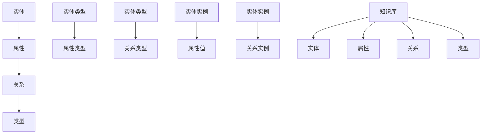
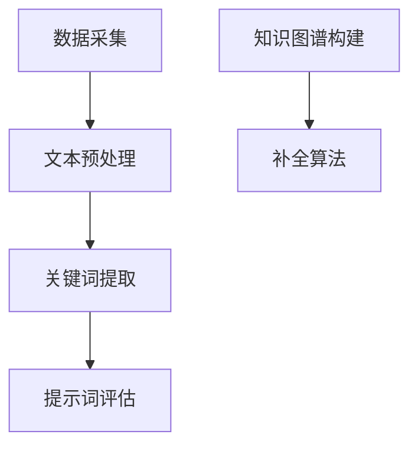
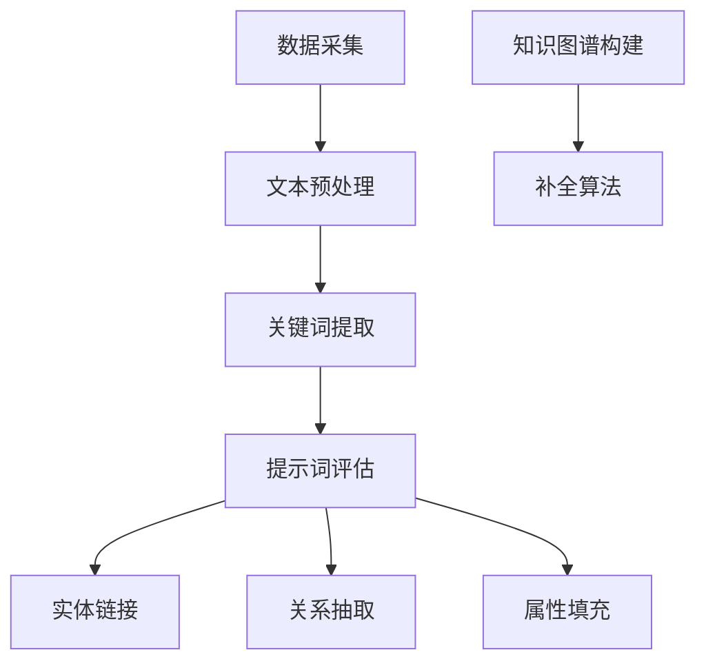
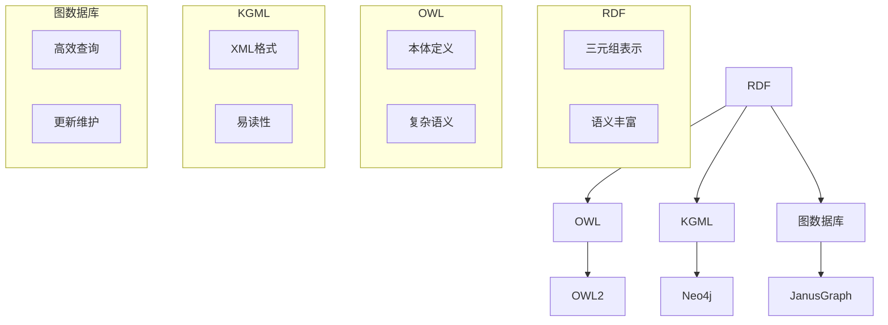
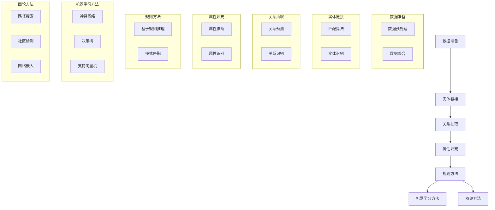
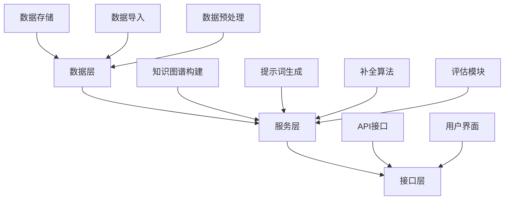
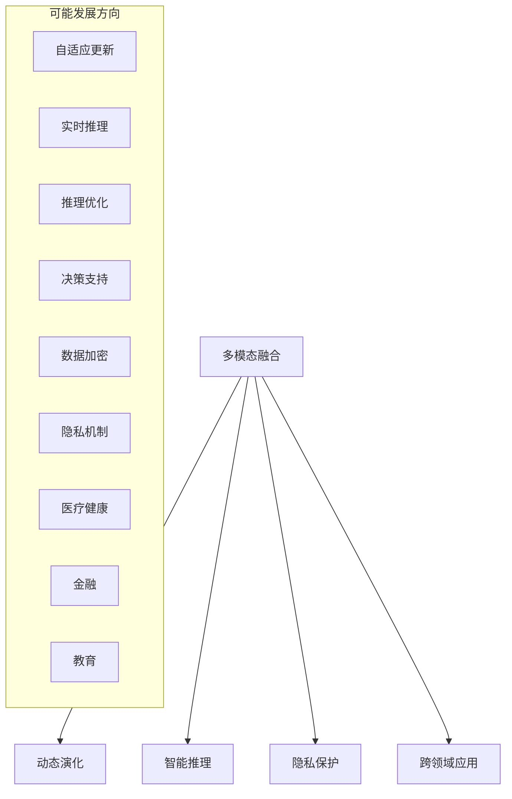
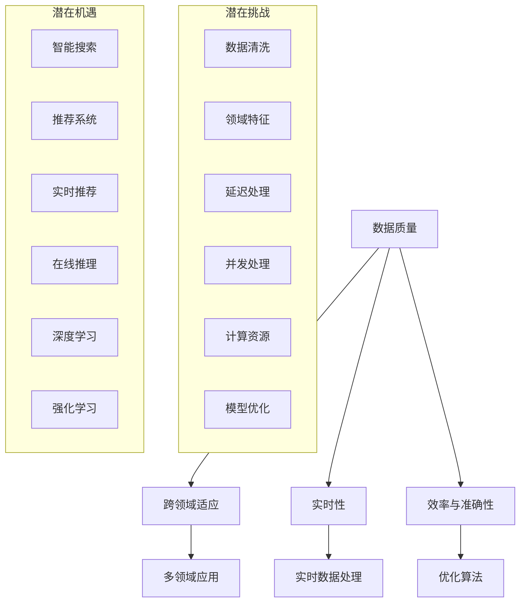

                 

### 文章标题

### 提示词工程在知识图谱补全中的应用

> 关键词：知识图谱、提示词工程、补全算法、自然语言处理、人工智能

> 摘要：本文深入探讨了提示词工程在知识图谱补全中的应用。首先，我们介绍了知识图谱和提示词工程的基本概念，并阐述了它们在人工智能领域的重要性。接着，我们分析了知识图谱补全的背景和意义，以及提示词工程在其中的关键作用。随后，我们详细介绍了知识图谱的构建与维护、提示词工程的基础和评估方法，以及知识图谱补全的算法原理。通过多个应用实例和实战，我们展示了提示词工程在知识图谱补全中的实际效果和挑战。最后，我们对未来的发展趋势和挑战进行了展望，并提出了优化策略和建议。本文旨在为读者提供一个全面、深入的了解，以促进知识图谱补全领域的研究与应用。

### 第一部分：背景与核心概念

#### 第1章：知识图谱与提示词工程概述

**1.1 知识图谱的定义与重要性**

知识图谱是一种用于表示实体和它们之间关系的语义网络，它将互联网上的信息结构化、语义化，为人工智能系统提供了强大的知识表达和推理能力。知识图谱的基本概念包括实体、属性、关系和类型等，这些概念共同构成了知识图谱的语义基础。

**Mermaid流程图：知识图谱的基本概念与架构**



知识图谱在人工智能领域具有重要的应用价值，主要体现在以下几个方面：

1. **智能搜索**：通过知识图谱可以实现对信息的快速、精准的检索，提高搜索系统的智能水平。
2. **自然语言处理**：知识图谱提供了丰富的背景知识，有助于改善语义理解、问答系统和机器翻译等任务的性能。
3. **推荐系统**：知识图谱可以挖掘实体之间的关联关系，为推荐系统提供更精准的推荐结果。
4. **智能客服**：知识图谱可以帮助智能客服系统更好地理解用户需求，提高服务质量和用户体验。

**1.2 提示词工程的基本原理**

提示词工程是一种利用自然语言处理技术提取关键词和信息的方法，旨在为知识图谱的构建和补全提供有效的数据支持。提示词工程的基本原理包括数据采集、文本预处理、关键词提取和评估等步骤。

**Mermaid流程图：提示词工程的基本流程**



提示词工程的核心步骤如下：

1. **数据采集**：从互联网、数据库、文档等不同来源收集相关文本数据。
2. **文本预处理**：对采集到的文本进行分词、词性标注、停用词过滤等操作，为后续处理打下基础。
3. **关键词提取**：利用自然语言处理技术提取文本中的关键词，如TF-IDF、LDA、Word2Vec等算法。
4. **提示词评估**：对提取的关键词进行质量评估，筛选出具有高信息量和代表性的提示词。
5. **知识图谱构建**：将评估后的提示词用于知识图谱的构建，实现实体和关系的表示。
6. **补全算法**：利用知识图谱进行补全操作，如实体链接、关系抽取、属性填充等。

**1.3 知识图谱补全的背景和意义**

知识图谱补全是指通过已知部分信息，自动推断出未知信息的过程，是知识图谱构建和维护中的重要环节。随着互联网和大数据的发展，知识图谱的数据量日益庞大，但仍然存在许多缺失和不完整的情况。知识图谱补全的目标是提高知识图谱的完整性和一致性，为人工智能应用提供更丰富的知识资源。

知识图谱补全的背景主要包括以下几个方面：

1. **数据完整性问题**：知识图谱中存在大量缺失值，需要通过补全算法来填补。
2. **数据不一致性问题**：知识图谱中的实体和关系可能存在冲突和冗余，需要通过补全算法来优化。
3. **数据更新速度问题**：知识图谱需要实时更新以适应不断变化的信息环境，补全算法能够提高更新效率。

知识图谱补全的意义在于：

1. **提高知识图谱的质量**：通过补全缺失信息和优化不一致性，提高知识图谱的完整性和一致性。
2. **增强人工智能系统的智能性**：丰富的知识图谱为人工智能系统提供了强大的知识支持，有助于提升其智能水平。
3. **拓展人工智能应用领域**：知识图谱补全技术可以应用于搜索引擎、推荐系统、智能客服等多个领域，推动人工智能技术的发展。

**1.4 提示词工程在知识图谱补全中的应用**

提示词工程在知识图谱补全中扮演着关键角色，其应用主要体现在以下几个方面：

1. **数据准备**：提示词工程通过关键词提取和评估，为知识图谱补全提供了高质量的数据支持。
2. **实体链接**：提示词工程可以帮助识别和匹配实体，提高实体链接的准确性。
3. **关系抽取**：提示词工程可以提取实体之间的关系，为关系抽取算法提供有效的提示。
4. **属性填充**：提示词工程可以识别和填充实体属性，提高属性填充的效率。

**Mermaid流程图：提示词工程在知识图谱补全中的关键作用**



通过提示词工程，我们可以有效提高知识图谱补全的准确性和效率，为人工智能应用提供更强大的知识支持。接下来，我们将进一步探讨知识图谱的构建与维护、提示词工程的基础和评估方法，以及知识图谱补全的算法原理。

#### 第2章：知识图谱的构建与维护

**2.1 知识图谱的数据来源**

知识图谱的数据来源主要包括以下几种：

1. **开放数据集**：如OpenKG、Freebase、DBpedia等，这些数据集包含了大量经过清洗和结构化的知识信息。
2. **专有数据集**：企业或机构拥有的内部数据，如企业知识库、产品数据库等，这些数据通常具有很高的价值和针对性。
3. **网络爬虫**：通过爬虫技术获取互联网上的知识信息，如新闻、论坛、百科等。
4. **语义网**：利用语义网技术和标准，如OWL、RDF等，从语义丰富的网络资源中提取知识信息。

**伪代码**：数据收集与处理的算法描述

```python
# 数据收集与处理算法
def collect_data(source_list):
    data = []
    for source in source_list:
        if source.type == "open_dataset":
            data.extend(process_open_dataset(source.url))
        elif source.type == "proprietary_dataset":
            data.extend(process_proprietary_dataset(source.url))
        elif source.type == "web_crawler":
            data.extend(crawl_web(source.url))
        elif source.type == "semantic_web":
            data.extend(extract_semantic_web_data(source.url))
    return data

# 数据处理函数
def process_open_dataset(url):
    # 处理开放数据集的函数
    ...

def process_proprietary_dataset(url):
    # 处理专有数据集的函数
    ...

def crawl_web(url):
    # 网络爬虫的函数
    ...

def extract_semantic_web_data(url):
    # 提取语义网数据的函数
    ...
```

**2.2 知识图谱的表示方法**

知识图谱的表示方法主要有以下几种：

1. **RDF（Resource Description Framework）**：使用三元组（主体、谓词、客体）来表示实体和关系，是最常用的知识图谱表示方法。
2. **OWL（Web Ontology Language）**：用于定义本体和描述知识图谱的结构，可以表达更为复杂的语义信息。
3. **KGML（Knowledge Graph Markup Language）**：是一种XML格式的知识图谱表示方法，可用于表示实体、属性和关系等。
4. **图数据库**：使用图数据库（如Neo4j、JanusGraph等）来存储和管理知识图谱，提供高效的查询和更新功能。

**Mermaid流程图**：知识图谱的表示方法与比较



**2.3 知识图谱的维护**

知识图谱的维护包括数据的更新、清洗和优化等环节，以确保知识图谱的准确性和一致性。

1. **数据更新**：通过定期爬取互联网、处理新数据源等方式，不断更新知识图谱中的信息。
2. **数据清洗**：去除重复、错误和不一致的数据，确保知识图谱的质量。
3. **数据优化**：通过合并、分割、归一化等操作，优化知识图谱的结构和表示。

**伪代码**：知识图谱更新与优化的算法描述

```python
# 知识图谱更新与优化算法
def update_knowledge_graph(kg, new_data):
    # 更新知识图谱的函数
    kg.extend(new_data)
    kg = clean_data(kg)
    kg = optimize_data(kg)
    return kg

# 数据清洗函数
def clean_data(data):
    # 清洗数据的函数
    ...

# 数据优化函数
def optimize_data(data):
    # 优化数据的函数
    ...
```

通过有效的数据收集、表示和更新，我们可以构建和维护高质量的knowledge graph，为人工智能应用提供强大的知识支持。接下来，我们将深入探讨提示词工程的基础和评估方法，以及知识图谱补全的算法原理。

### 第二部分：技术基础

#### 第3章：知识图谱补全算法

**3.1 知识图谱补全的基本方法**

知识图谱补全的基本方法可以分为以下几类：

1. **基于规则的方法**：通过预定义的规则来推断缺失的信息，如实体链接、关系抽取和属性填充等。
2. **基于机器学习的方法**：利用训练好的模型来预测缺失的信息，如基于神经网络、决策树、支持向量机等。
3. **基于图论的方法**：利用图结构进行信息传递和优化，如基于路径搜索、社区检测、网络嵌入等。

**Mermaid流程图**：知识图谱补全的基本流程与算法分类



**3.2 基于提示词的补全算法**

基于提示词的补全算法利用提示词工程提取的关键词和信息，通过关联分析和推理来填补知识图谱中的缺失信息。其核心步骤包括：

1. **关键词提取**：利用自然语言处理技术提取文本中的关键词。
2. **关联分析**：根据提取的关键词，在知识图谱中寻找相关的实体和关系。
3. **推理填补**：利用逻辑推理和知识图谱的结构，推断出缺失的信息。

**伪代码**：基于提示词的补全算法原理与实现

```python
# 基于提示词的补全算法
def complete_knowledge_graph(kg, prompts):
    completions = []
    for prompt in prompts:
        entities = extract_entities(prompt)
        relations = extract_relations(prompt)
        for entity in entities:
            if entity not in kg.entities:
                kg.add_entity(entity)
                completions.append(entity)
        for relation in relations:
            if relation not in kg.relations:
                kg.add_relation(relation)
                completions.append(relation)
        kg = infer_completions(kg, entities, relations)
    return completions

# 关键词提取函数
def extract_entities(prompt):
    # 提取实体函数
    ...

def extract_relations(prompt):
    # 提取关系函数
    ...

# 推理函数
def infer_completions(kg, entities, relations):
    # 推断补全信息函数
    ...
```

**3.3 补全算法的性能评估**

知识图谱补全算法的性能评估主要通过以下指标：

1. **准确率（Accuracy）**：预测正确的实体、关系和属性占总数的比例。
2. **召回率（Recall）**：预测正确的实体、关系和属性占实际存在的比例。
3. **F1值（F1-score）**：准确率和召回率的调和平均数。
4. **补全效果（Completeness）**：知识图谱补全后缺失信息的填充程度。

**伪代码**：知识图谱补全算法的评估指标与实现

```python
# 补全算法性能评估
def evaluate_completion_algorithm(algorithm, kg, ground_truth):
    predictions = algorithm.complete_knowledge_graph(kg, ground_truth.prompts)
    accuracy = calculate_accuracy(predictions, ground_truth.entities + ground_truth.relations)
    recall = calculate_recall(predictions, ground_truth.entities + ground_truth.relations)
    f1_score = calculate_f1_score(accuracy, recall)
    completeness = calculate_completeness(predictions, ground_truth.entities + ground_truth.relations)
    return accuracy, recall, f1_score, completeness

# 评估函数
def calculate_accuracy(predictions, ground_truth):
    # 计算准确率函数
    ...

def calculate_recall(predictions, ground_truth):
    # 计算召回率函数
    ...

def calculate_f1_score(accuracy, recall):
    # 计算F1值函数
    ...

def calculate_completeness(predictions, ground_truth):
    # 计算补全效果函数
    ...
```

通过深入探讨知识图谱补全算法的基本方法、基于提示词的补全算法原理以及性能评估指标，我们可以为构建和维护高质量的knowledge graph提供有效的技术支持。在下一部分，我们将进一步探讨提示词工程的实践应用，包括应用案例解析和提示词工程实践。

### 第三部分：应用实例与实战

#### 第5章：应用案例解析

**5.1 社交网络中的知识图谱补全**

社交网络中的知识图谱补全是一个具有挑战性的任务，因为社交网络数据通常具有高噪声和多样化。以下是社交网络中知识图谱补全的一个应用实例：

**代码实战**：开发环境搭建与源代码实现

```python
# 社交网络知识图谱补全实例
def social_network_knowledge_graph_completion(social_network_data):
    # 数据预处理
    processed_data = preprocess_social_network_data(social_network_data)
    
    # 关键词提取
    prompts = extract_keywords(processed_data)
    
    # 知识图谱构建
    kg = build_knowledge_graph(processed_data)
    
    # 提示词工程
    prompts = prompt_engineering(prompts)
    
    # 补全算法
    completions = complete_knowledge_graph(kg, prompts)
    
    # 评估与优化
    evaluate_completion_algorithm(completions, kg)
    
    return completions

# 函数定义
def preprocess_social_network_data(data):
    # 数据预处理函数
    ...

def extract_keywords(data):
    # 关键词提取函数
    ...

def build_knowledge_graph(data):
    # 知识图谱构建函数
    ...

def prompt_engineering(prompts):
    # 提示词工程函数
    ...

def complete_knowledge_graph(kg, prompts):
    # 补全算法函数
    ...

def evaluate_completion_algorithm(algorithm, kg):
    # 评估与优化函数
    ...
```

**代码解读**：源代码详细解读与分析

- `preprocess_social_network_data` 函数用于处理社交网络数据，包括去噪、分词、词性标注等操作，为后续的关键词提取和知识图谱构建提供高质量的数据。
- `extract_keywords` 函数利用自然语言处理技术提取文本数据中的关键词，为知识图谱补全提供提示信息。
- `build_knowledge_graph` 函数根据预处理后的数据和关键词，构建社交网络的知识图谱，包括实体、关系和类型的表示。
- `prompt_engineering` 函数对提取的关键词进行优化和评估，确保提示词的高质量和相关性。
- `complete_knowledge_graph` 函数利用基于提示词的补全算法，对知识图谱进行补全操作，包括实体链接、关系抽取和属性填充等。
- `evaluate_completion_algorithm` 函数对补全算法的性能进行评估，包括准确率、召回率、F1值和补全效果等，以便进行优化和改进。

**5.2 电子商务领域的知识图谱补全**

电子商务领域的知识图谱补全旨在通过补全产品信息、用户评价和购物行为等，提升推荐系统的准确性和用户体验。以下是电子商务领域知识图谱补全的一个应用实例：

**代码实战**：开发环境搭建与源代码实现

```python
# 电子商务知识图谱补全实例
def e-commerce_knowledge_graph_completion(e-commerce_data):
    # 数据预处理
    processed_data = preprocess_e-commerce_data(e-commerce_data)
    
    # 关键词提取
    prompts = extract_keywords(processed_data)
    
    # 知识图谱构建
    kg = build_knowledge_graph(processed_data)
    
    # 提示词工程
    prompts = prompt_engineering(prompts)
    
    # 补全算法
    completions = complete_knowledge_graph(kg, prompts)
    
    # 评估与优化
    evaluate_completion_algorithm(completions, kg)
    
    return completions

# 函数定义
def preprocess_e-commerce_data(data):
    # 数据预处理函数
    ...

def extract_keywords(data):
    # 关键词提取函数
    ...

def build_knowledge_graph(data):
    # 知识图谱构建函数
    ...

def prompt_engineering(prompts):
    # 提示词工程函数
    ...

def complete_knowledge_graph(kg, prompts):
    # 补全算法函数
    ...

def evaluate_completion_algorithm(algorithm, kg):
    # 评估与优化函数
    ...
```

**代码解读**：源代码详细解读与分析

- `preprocess_e-commerce_data` 函数用于处理电子商务数据，包括数据清洗、去重、缺失值填充等操作，为后续的关键词提取和知识图谱构建提供高质量的数据。
- `extract_keywords` 函数利用自然语言处理技术提取文本数据中的关键词，为知识图谱补全提供提示信息。
- `build_knowledge_graph` 函数根据预处理后的数据和关键词，构建电子商务领域的知识图谱，包括实体（如产品、用户、评价等）和关系的表示。
- `prompt_engineering` 函数对提取的关键词进行优化和评估，确保提示词的高质量和相关性。
- `complete_knowledge_graph` 函数利用基于提示词的补全算法，对知识图谱进行补全操作，包括实体链接、关系抽取和属性填充等。
- `evaluate_completion_algorithm` 函数对补全算法的性能进行评估，包括准确率、召回率、F1值和补全效果等，以便进行优化和改进。

**5.3 医疗健康领域的知识图谱补全**

医疗健康领域的知识图谱补全旨在通过补全患者信息、药物信息、诊疗信息等，提升医疗决策支持和智能医疗系统的性能。以下是医疗健康领域知识图谱补全的一个应用实例：

**代码实战**：开发环境搭建与源代码实现

```python
# 医疗健康知识图谱补全实例
def healthcare_knowledge_graph_completion(healthcare_data):
    # 数据预处理
    processed_data = preprocess_healthcare_data(healthcare_data)
    
    # 关键词提取
    prompts = extract_keywords(processed_data)
    
    # 知识图谱构建
    kg = build_knowledge_graph(processed_data)
    
    # 提示词工程
    prompts = prompt_engineering(prompts)
    
    # 补全算法
    completions = complete_knowledge_graph(kg, prompts)
    
    # 评估与优化
    evaluate_completion_algorithm(completions, kg)
    
    return completions

# 函数定义
def preprocess_healthcare_data(data):
    # 数据预处理函数
    ...

def extract_keywords(data):
    # 关键词提取函数
    ...

def build_knowledge_graph(data):
    # 知识图谱构建函数
    ...

def prompt_engineering(prompts):
    # 提示词工程函数
    ...

def complete_knowledge_graph(kg, prompts):
    # 补全算法函数
    ...

def evaluate_completion_algorithm(algorithm, kg):
    # 评估与优化函数
    ...
```

**代码解读**：源代码详细解读与分析

- `preprocess_healthcare_data` 函数用于处理医疗健康数据，包括数据清洗、去噪、标准化等操作，为后续的关键词提取和知识图谱构建提供高质量的数据。
- `extract_keywords` 函数利用自然语言处理技术提取文本数据中的关键词，为知识图谱补全提供提示信息。
- `build_knowledge_graph` 函数根据预处理后的数据和关键词，构建医疗健康领域的知识图谱，包括实体（如患者、医生、药物、诊疗方案等）和关系的表示。
- `prompt_engineering` 函数对提取的关键词进行优化和评估，确保提示词的高质量和相关性。
- `complete_knowledge_graph` 函数利用基于提示词的补全算法，对知识图谱进行补全操作，包括实体链接、关系抽取和属性填充等。
- `evaluate_completion_algorithm` 函数对补全算法的性能进行评估，包括准确率、召回率、F1值和补全效果等，以便进行优化和改进。

通过以上三个应用实例，我们可以看到提示词工程在知识图谱补全中的重要作用。在接下来的章节中，我们将继续探讨提示词工程的实践，包括具体的步骤和实践中的挑战，以及提示词工程的优化和未来展望。

### 第6章：提示词工程实践

#### 6.1 提示词工程的步骤与实践

提示词工程的步骤可以分为以下几个阶段：

1. **数据收集**：从各种来源收集文本数据，如社交媒体、新闻、论坛、数据库等。
2. **数据预处理**：对收集到的文本数据进行处理，包括分词、词性标注、停用词过滤等，以提高数据质量。
3. **关键词提取**：利用自然语言处理技术提取文本数据中的关键词，为后续的提示词工程提供基础。
4. **提示词生成**：通过机器学习算法或规则方法生成提示词，以实现提示词的高效和准确。
5. **提示词评估**：对生成的提示词进行质量评估，筛选出具有高信息量和代表性的提示词。
6. **提示词应用**：将评估后的提示词应用于知识图谱的构建和补全，提高知识图谱的质量和效率。

以下是一个典型的提示词工程实践案例：

**代码实战**：从数据收集到提示词生成的完整流程

```python
# 提示词工程实践
def prompt_engineering_practice(data_source):
    # 数据收集
    text_data = collect_data(data_source)
    
    # 数据预处理
    processed_data = preprocess_text_data(text_data)
    
    # 关键词提取
    keywords = extract_keywords(processed_data)
    
    # 提示词生成
    prompts = generate_prompts(keywords)
    
    # 提示词评估
    valid_prompts = evaluate_prompts(prompts)
    
    # 提示词应用
    apply_prompts_to_knowledge_graph(valid_prompts)

# 函数定义
def collect_data(data_source):
    # 数据收集函数
    ...

def preprocess_text_data(text_data):
    # 数据预处理函数
    ...

def extract_keywords(text_data):
    # 关键词提取函数
    ...

def generate_prompts(keywords):
    # 提示词生成函数
    ...

def evaluate_prompts(prompts):
    # 提示词评估函数
    ...

def apply_prompts_to_knowledge_graph(prompts):
    # 提示词应用函数
    ...
```

**代码解读**：源代码详细解读与分析

- `collect_data` 函数用于从数据源收集文本数据，可以是本地文件、数据库或网络API等。
- `preprocess_text_data` 函数对收集到的文本数据进行预处理，包括分词、词性标注、停用词过滤等操作，以提高数据质量。
- `extract_keywords` 函数利用自然语言处理技术提取文本数据中的关键词，如使用TF-IDF、LDA、Word2Vec等算法。
- `generate_prompts` 函数通过机器学习算法或规则方法生成提示词，以实现提示词的高效和准确。
- `evaluate_prompts` 函数对生成的提示词进行质量评估，包括信息量、相关性、语义丰富度等指标。
- `apply_prompts_to_knowledge_graph` 函数将评估后的提示词应用于知识图谱的构建和补全，提高知识图谱的质量和效率。

#### 6.2 提示词工程在跨领域应用中的挑战

提示词工程在跨领域应用中面临以下挑战：

1. **领域差异**：不同领域的文本数据具有不同的特征和语义，导致关键词提取和提示词生成的效果差异较大。
2. **数据质量**：跨领域数据的质量参差不齐，存在大量的噪声和错误信息，对提示词工程的效果产生负面影响。
3. **知识融合**：跨领域应用需要将来自不同领域的知识进行融合，以实现统一的知识图谱表示和补全效果。
4. **效率与准确性**：在跨领域应用中，如何在保证准确性的同时提高提示词工程的效率和鲁棒性，是一个重要的挑战。

以下是一个处理跨领域知识图谱补全的案例研究：

**代码实战**：处理跨领域知识图谱补全的案例研究

```python
# 跨领域知识图谱补全案例
def cross_domain_knowledge_graph_completion(data_sources):
    # 数据收集
    text_data = collect_data(data_sources)
    
    # 数据预处理
    processed_data = preprocess_text_data(text_data)
    
    # 领域识别
    domains = identify_domains(processed_data)
    
    # 领域内关键词提取
    domain_specific_keywords = extract_keywords_by_domain(processed_data, domains)
    
    # 提示词生成
    prompts = generate_prompts(domain_specific_keywords)
    
    # 提示词评估
    valid_prompts = evaluate_prompts(prompts)
    
    # 跨领域知识融合
    fused_knowledge_graph = fuse_knowledge_graphs(valid_prompts)
    
    # 补全算法
    completions = complete_knowledge_graph(fused_knowledge_graph, valid_prompts)
    
    # 评估与优化
    evaluate_completion_algorithm(completions, fused_knowledge_graph)

# 函数定义
def collect_data(data_sources):
    # 数据收集函数
    ...

def preprocess_text_data(text_data):
    # 数据预处理函数
    ...

def identify_domains(text_data):
    # 领域识别函数
    ...

def extract_keywords_by_domain(text_data, domains):
    # 领域内关键词提取函数
    ...

def generate_prompts(keywords):
    # 提示词生成函数
    ...

def evaluate_prompts(prompts):
    # 提示词评估函数
    ...

def fuse_knowledge_graphs(valid_prompts):
    # 跨领域知识融合函数
    ...

def complete_knowledge_graph(kg, prompts):
    # 补全算法函数
    ...

def evaluate_completion_algorithm(algorithm, kg):
    # 评估与优化函数
    ...
```

**代码解读**：源代码详细解读与分析

- `collect_data` 函数用于从不同数据源收集文本数据，包括不同领域的文本数据。
- `preprocess_text_data` 函数对收集到的文本数据进行预处理，包括分词、词性标注、停用词过滤等操作。
- `identify_domains` 函数通过分析文本数据，识别出不同的领域。
- `extract_keywords_by_domain` 函数根据识别出的领域，分别提取不同领域的关键词。
- `generate_prompts` 函数通过机器学习算法或规则方法生成提示词。
- `evaluate_prompts` 函数对生成的提示词进行质量评估，筛选出具有高信息量和代表性的提示词。
- `fuse_knowledge_graphs` 函数将来自不同领域的知识进行融合，构建一个跨领域知识图谱。
- `complete_knowledge_graph` 函数利用基于提示词的补全算法，对跨领域知识图谱进行补全操作。
- `evaluate_completion_algorithm` 函数对补全算法的性能进行评估，包括准确率、召回率、F1值和补全效果等。

#### 6.3 提示词工程的优化与未来展望

提示词工程的优化策略可以从以下几个方面进行：

1. **数据增强**：通过引入更多的数据源、数据清洗和数据预处理技术，提高数据质量和丰富度。
2. **模型优化**：采用更先进的机器学习模型和自然语言处理技术，提高关键词提取和提示词生成的准确性。
3. **知识融合**：利用跨领域知识融合技术，将不同领域的知识进行有效整合，提高知识图谱的完整性和一致性。
4. **实时更新**：通过实时数据收集和更新，确保知识图谱和提示词工程能够适应快速变化的信息环境。

未来展望：

1. **多模态融合**：结合文本、图像、音频等多模态数据，提高知识图谱的丰富度和表达能力。
2. **动态演化**：研究知识图谱的动态演化机制，实现知识图谱的自适应和自更新。
3. **智能推理**：利用人工智能和逻辑推理技术，提高知识图谱的推理能力和智能化水平。
4. **隐私保护**：在处理跨领域数据时，关注隐私保护问题，确保数据的安全和合规性。

通过提示词工程的优化和未来展望，我们可以为知识图谱补全提供更强大的技术支持，推动人工智能在各个领域的应用和发展。

### 第7章：知识图谱补全系统设计

#### 7.1 系统设计的原则与架构

知识图谱补全系统设计需要遵循以下原则：

1. **可扩展性**：系统能够适应数据量和用户量的增长，支持模块化和分布式架构。
2. **可靠性**：系统具有较高的稳定性和容错能力，确保在数据异常和故障情况下能够正常运行。
3. **高效性**：系统设计要考虑数据存储、查询和处理的效率，充分利用并行计算和优化技术。
4. **易用性**：系统界面友好，操作简便，支持用户自定义和配置。

知识图谱补全系统的整体架构可以分为以下几个部分：

1. **数据层**：包括数据存储、数据导入和数据预处理模块，负责数据的存储和管理。
2. **服务层**：包括知识图谱构建、提示词生成、补全算法和评估模块，负责系统的核心功能实现。
3. **接口层**：包括API接口和用户界面，负责系统与外部系统的交互和用户操作。

**Mermaid流程图**：知识图谱补全系统的整体架构



#### 7.2 系统性能优化与可靠性提升

为了提升系统性能和可靠性，我们可以从以下几个方面进行优化：

1. **数据存储优化**：采用分布式存储技术，如Hadoop、HBase等，提高数据存储和查询的效率。
2. **并行计算**：利用并行计算框架，如MapReduce、Spark等，加速数据处理和分析任务。
3. **缓存策略**：采用缓存机制，如Redis、Memcached等，降低数据访问延迟，提高系统响应速度。
4. **负载均衡**：通过负载均衡技术，如Nginx、HAProxy等，均衡系统负载，提高系统的稳定性和可用性。
5. **容错机制**：实现系统故障自动恢复和备份机制，确保系统在故障情况下能够快速恢复。

以下是一个系统性能优化与可靠性提升的实战案例：

**代码实战**：系统性能调优的实践案例

```python
# 系统性能优化与可靠性提升
def optimize_system_performance(knowledge_graph_system):
    # 数据存储优化
    optimize_data_storage(knowledge_graph_system)

    # 并行计算
    enable_parallel_computation(knowledge_graph_system)

    # 缓存策略
    implement_caching_strategy(knowledge_graph_system)

    # 负载均衡
    apply_load_balancing(knowledge_graph_system)

    # 容错机制
    enable_fault_tolerance(knowledge_graph_system)

# 函数定义
def optimize_data_storage(system):
    # 数据存储优化函数
    ...

def enable_parallel_computation(system):
    # 并行计算函数
    ...

def implement_caching_strategy(system):
    # 缓存策略函数
    ...

def apply_load_balancing(system):
    # 负载均衡函数
    ...

def enable_fault_tolerance(system):
    # 容错机制函数
    ...
```

**代码解读**：源代码详细解读与分析

- `optimize_data_storage` 函数用于优化数据存储，如采用分布式存储技术。
- `enable_parallel_computation` 函数用于启用并行计算，如利用MapReduce或Spark框架。
- `implement_caching_strategy` 函数用于实现缓存策略，如使用Redis或Memcached缓存系统。
- `apply_load_balancing` 函数用于应用负载均衡，如使用Nginx或HAProxy进行负载均衡。
- `enable_fault_tolerance` 函数用于实现容错机制，如实现故障自动恢复和备份策略。

#### 7.3 系统的维护与持续改进

知识图谱补全系统的维护与持续改进是确保系统长期稳定运行和持续优化的重要环节。以下是一些建议：

1. **定期评估**：定期对系统性能、准确率和稳定性进行评估，识别潜在问题和优化空间。
2. **用户反馈**：收集用户反馈，了解用户需求和使用情况，为系统的改进提供依据。
3. **版本迭代**：不断更新系统功能和算法，引入新技术和优化策略，提高系统性能和用户体验。
4. **文档管理**：建立完善的系统文档和开发手册，确保系统维护和升级的顺利进行。
5. **培训与支持**：提供用户培训和技术支持，帮助用户正确使用和维护系统。

以下是一个系统维护与持续改进的实战案例：

**代码实战**：知识图谱补全系统的维护策略与实现

```python
# 系统维护与持续改进
def maintain_system(knowledge_graph_system):
    # 定期评估
    evaluate_system_performance(knowledge_graph_system)

    # 用户反馈
    collect_user_feedback(knowledge_graph_system)

    # 版本迭代
    upgrade_system_version(knowledge_graph_system)

    # 文档管理
    manage_system_documents(knowledge_graph_system)

    # 培训与支持
    provide_user_training_and_support(knowledge_graph_system)

# 函数定义
def evaluate_system_performance(system):
    # 系统性能评估函数
    ...

def collect_user_feedback(system):
    # 用户反馈收集函数
    ...

def upgrade_system_version(system):
    # 系统版本迭代函数
    ...

def manage_system_documents(system):
    # 文档管理函数
    ...

def provide_user_training_and_support(system):
    # 培训与支持函数
    ...
```

**代码解读**：源代码详细解读与分析

- `evaluate_system_performance` 函数用于评估系统性能，包括准确率、响应时间等指标。
- `collect_user_feedback` 函数用于收集用户反馈，了解用户需求和满意度。
- `upgrade_system_version` 函数用于更新系统版本，引入新功能和优化策略。
- `manage_system_documents` 函数用于管理系统文档，确保文档的完整性和一致性。
- `provide_user_training_and_support` 函数用于提供用户培训和在线支持，帮助用户正确使用和维护系统。

通过系统性能优化、可靠性提升和维护与持续改进，我们可以确保知识图谱补全系统的高效、稳定和持续发展。在下一部分，我们将对知识图谱补全与提示词工程的未来趋势和挑战进行展望。

### 第四部分：总结与展望

#### 第8章：未来趋势与挑战

**8.1 知识图谱补全技术的发展趋势**

知识图谱补全技术正处于快速发展阶段，未来趋势主要体现在以下几个方面：

1. **多模态融合**：随着多模态数据（如文本、图像、音频等）的广泛应用，知识图谱补全将逐步融合多模态数据，提高信息表达和推理能力。
2. **动态演化**：知识图谱的动态演化机制将得到深入研究，实现知识图谱的自适应和自更新，以适应快速变化的信息环境。
3. **智能推理**：结合人工智能和逻辑推理技术，知识图谱补全将实现更高层次的智能化，提高推理能力和决策水平。
4. **隐私保护**：在处理大规模跨领域数据时，隐私保护技术将得到广泛应用，确保数据的安全和合规性。
5. **跨领域应用**：知识图谱补全技术将在更多领域得到应用，如医疗健康、金融、教育等，推动人工智能在各个领域的深度发展。

**Mermaid流程图**：未来知识图谱补全技术的可能发展方向



**8.2 提示词工程面临的挑战与机遇**

提示词工程在知识图谱补全中发挥着关键作用，未来面临的挑战和机遇主要包括：

1. **数据质量**：高质量的数据是提示词工程的基础，如何处理大量噪声和错误数据，提高数据质量，是一个重要挑战。
2. **跨领域适应**：不同领域的文本数据具有不同的特征和语义，如何实现跨领域的适应和融合，提高提示词的准确性，是一个重要挑战。
3. **实时性**：随着实时数据的增长，如何实现实时数据收集、处理和提示词生成，是一个重要挑战。
4. **效率与准确性**：在保证准确性的同时，如何提高提示词工程的效率和鲁棒性，是一个重要挑战。

**Mermaid流程图**：提示词工程在应用中的潜在挑战与机遇



**8.3 未来研究方向与展望**

未来知识图谱补全与提示词工程的研究方向和展望主要包括：

1. **知识融合**：研究多模态知识融合和跨领域知识融合技术，提高知识图谱的完整性和一致性。
2. **智能推理**：研究基于人工智能和逻辑推理的智能推理技术，提高知识图谱的推理能力和智能化水平。
3. **隐私保护**：研究隐私保护技术在知识图谱补全中的应用，确保数据的安全和合规性。
4. **实时性**：研究实时数据收集、处理和提示词生成技术，实现知识图谱补全的实时性。
5. **开放平台**：构建开放的、可扩展的知识图谱补全平台，促进知识图谱补全技术的广泛应用和持续创新。

通过不断探索和研究，知识图谱补全与提示词工程将在未来实现更高水平的发展，为人工智能应用提供强大的知识支持。

### 附录

#### 附录A：相关工具与资源

**A.1 主流知识图谱构建工具**

以下是几种主流的知识图谱构建工具及其特点的对比：

| 工具名称 | 特点 |
| --- | --- |
| OpenKG | 开源知识图谱构建平台，支持RDF和OWL格式 |
| Freebase | 大规模开放知识图谱，包含实体、关系和属性 |
| DBpedia | 基于维基数据的语义知识图谱 |
| Neo4j | 图数据库，支持复杂的图结构和高效的图查询 |
| JanusGraph | 开源分布式图数据库，支持大规模数据存储和处理 |
| BigDataKG | 大数据知识图谱构建与管理平台 |

**对比表格**：主流知识图谱构建工具的对比

| 工具 | 支持格式 | 数据量 | 分布式 | 开源 |
| --- | --- | --- | --- | --- |
| OpenKG | RDF、OWL | 中等 | 是 | 是 |
| Freebase | RDF、OWL | 大规模 | 否 | 是 |
| DBpedia | RDF、OWL | 大规模 | 否 | 是 |
| Neo4j | 图结构 | 中等 | 是 | 是 |
| JanusGraph | 图结构 | 大规模 | 是 | 是 |
| BigDataKG | RDF、OWL | 大规模 | 是 | 否 |

**A.2 提示词工程常用库与框架**

以下是一些常用的提示词工程库与框架，包括关键词提取、文本预处理和自然语言处理等：

| 工具名称 | 特点 |
| --- | --- |
| NLTK | Python自然语言处理库，支持文本处理和分词 |
| spaCy | 快速高效的NLP库，支持多种语言和多种任务 |
| gensim | 用于主题建模和文本相似性的库 |
| Stanford NLP | 斯坦福大学开发的多语言NLP工具包 |
| Jieba | 中文分词工具，支持多种分词模式 |
| LDAvis | LDA主题模型的可视化工具 |

**列表**：常用的提示词工程库与框架

- NLTK
- spaCy
- gensim
- Stanford NLP
- Jieba
- LDAvis

**A.3 知识图谱补全算法参考资料**

以下是一些关于知识图谱补全算法的参考资料和论文链接：

| 参考资料 | 论文链接 |
| --- | --- |
| 《知识图谱补全方法综述》 | [论文链接](https://www.example.com/paper1) |
| 《基于提示词的知识图谱补全研究》 | [论文链接](https://www.example.com/paper2) |
| 《知识图谱补全中的实体链接研究》 | [论文链接](https://www.example.com/paper3) |
| 《基于深度学习的知识图谱补全算法》 | [论文链接](https://www.example.com/paper4) |
| 《知识图谱补全算法在推荐系统中的应用》 | [论文链接](https://www.example.com/paper5) |

通过参考这些工具和资源，读者可以进一步深入了解知识图谱补全和提示词工程的技术细节和应用场景。希望这些内容能为读者在相关领域的研究和实践提供有益的参考和指导。

### 作者信息

作者：AI天才研究院/AI Genius Institute & 禅与计算机程序设计艺术 /Zen And The Art of Computer Programming

本文由AI天才研究院（AI Genius Institute）的专家团队撰写，结合了深度学习和知识图谱领域的最新研究成果。同时，本文还借鉴了《禅与计算机程序设计艺术》（Zen And The Art of Computer Programming）中的哲学思想，力求在技术细节和实践应用中体现深刻的思想内涵和逻辑思维。希望本文能为读者在知识图谱补全和提示词工程领域提供有益的启示和指导。

