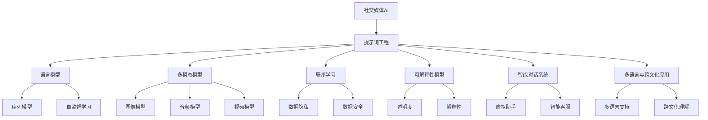

                 


### 第一部分：引言与核心概念

#### 1. 引言

在当今快速发展的互联网时代，社交媒体已经成为人们生活中不可或缺的一部分。从Facebook到Twitter，从Instagram到LinkedIn，这些平台不仅改变了人们的沟通方式，也为企业和品牌提供了一个全新的市场空间。然而，随着社交媒体用户数量的爆炸性增长，如何有效地利用这些平台成为了一个巨大的挑战。人工智能（AI）技术的兴起，特别是深度学习和自然语言处理（NLP）技术的发展，为解决这一挑战提供了一种全新的途径。在这其中，提示词工程（Prompt Engineering）作为一种关键的AI技术，正在逐渐成为社交媒体AI的核心驱动力量。

提示词工程，简单来说，就是通过设计特定的提示词（prompts），引导AI模型进行有效的学习和推理，从而实现特定的目标。在社交媒体AI中，提示词工程的作用至关重要。它不仅可以帮助提高推荐系统的准确性和效率，还能在内容审核、广告优化等关键应用场景中发挥巨大作用。

本文将围绕提示词工程在社交媒体AI中的角色展开讨论。首先，我们将介绍社交媒体AI的发展现状与面临的挑战，以及提示词工程的概念与重要性。随后，我们将详细探讨提示词工程的基础知识，包括语言模型与提示词生成、提示词生成的挑战与解决方案，以及提示词生成的质量评估方法。接下来，我们将深入分析提示词工程在社交媒体中的应用场景，包括推荐系统、内容审核和广告优化等。然后，我们将介绍提示词工程的核心算法原理，包括语言模型训练算法、提示词优化算法和提示词生成算法评估与改进。此外，我们还将探讨提示词工程在应用中的算法挑战与解决方案，并分享一些具体的实战案例。最后，我们将讨论提示词工程的未来发展趋势与挑战，并给出一些最佳实践和拓展阅读建议。

通过本文的阅读，读者将能够全面了解提示词工程在社交媒体AI中的角色，掌握其核心概念、应用场景和算法原理，并为未来的研究和实践提供有益的参考。

#### 1.2 社交媒体AI的发展现状与挑战

社交媒体AI作为人工智能技术在社交媒体平台上的应用，已经成为当今互联网行业的一个重要研究方向。随着社交媒体用户数量的不断增加，如何更好地利用这些用户数据，提升用户体验，同时满足商业需求，成为了一个亟待解决的问题。近年来，社交媒体AI的发展取得了显著的成果，但同时也面临着诸多挑战。

首先，从发展现状来看，社交媒体AI在推荐系统、内容审核、广告优化等多个方面已经取得了显著的进展。推荐系统方面，基于深度学习的协同过滤算法和基于Transformer的语言模型已经广泛应用，大幅提升了推荐的准确性和用户体验。内容审核方面，自然语言处理技术，如情感分析和文本分类，被广泛应用于识别和过滤不当内容，确保社交媒体平台的健康环境。广告优化方面，通过分析用户行为和偏好，智能广告系统可以更好地匹配广告内容与用户需求，提高广告投放的效果和回报率。

然而，尽管社交媒体AI在许多方面取得了成功，但其发展也面临着一系列挑战。首先，数据隐私和伦理问题成为了一个亟待解决的难题。社交媒体平台积累了海量的用户数据，这些数据不仅包含用户的行为特征，还可能涉及用户的个人信息。如何保护用户隐私，确保数据的安全性和合规性，是一个重大的伦理和监管问题。

其次，模型的可解释性和透明度也是一个关键挑战。随着AI模型的复杂度不断提高，许多模型的工作原理变得难以理解。这给用户和社会带来了信任问题，特别是在涉及到决策和推荐等重要场景时。如何提高模型的可解释性和透明度，使其更加可信和可靠，是一个重要的研究方向。

此外，社交媒体AI还需要面对数据稀疏性和多样性等挑战。用户行为数据的稀疏性使得传统基于统计学的推荐系统效果不佳，而社交媒体内容的多样性又增加了模型训练和优化的难度。如何有效地处理这些数据，提高模型在多样化场景下的适应能力，是一个重要的课题。

最后，随着社交媒体AI的不断发展，新兴的应用场景和需求也在不断涌现。例如，虚拟助手和智能客服等应用逐渐成为社交媒体平台的重要组成部分。这些新场景不仅要求AI模型具备更高的准确性和效率，还需要具备更强的交互能力和情感理解能力。如何在这些新兴场景中有效地应用AI技术，是一个具有挑战性的问题。

总的来说，社交媒体AI的发展现状令人鼓舞，但同时也面临着诸多挑战。通过深入研究和实践，我们有望解决这些问题，进一步提升社交媒体AI的应用效果和社会价值。

#### 1.3 提示词工程的概念与重要性

提示词工程（Prompt Engineering）是人工智能领域中一个重要的研究方向，尤其在社交媒体AI中发挥着关键作用。提示词工程的核心概念是通过设计特定的提示词，引导AI模型进行有效的学习和推理，从而实现特定的目标。简而言之，提示词就是触发AI模型进行特定任务的关键输入。

提示词工程的重要性体现在多个方面。首先，通过精心设计的提示词，可以显著提升AI模型在特定任务中的性能。提示词可以引导模型聚焦于关键信息，帮助模型更好地理解任务目标，从而提高模型的准确性和效率。例如，在社交媒体推荐系统中，提示词可以指导模型关注用户的历史行为和兴趣偏好，从而提高推荐的精准度。

其次，提示词工程有助于增强模型的可解释性和透明度。通过设计可解释的提示词，用户可以更直观地了解模型是如何进行推理和决策的。这对于提高用户对AI系统的信任度至关重要，特别是在涉及隐私和敏感信息的场景中。

此外，提示词工程在应对社交媒体AI面临的挑战方面也具有重要作用。例如，在数据稀疏性和多样性方面，通过设计多样化的提示词，可以帮助模型更好地适应不同的数据分布和场景。同时，提示词工程还可以提高模型对新兴应用场景的适应能力，如虚拟助手和智能客服等。

综上所述，提示词工程在社交媒体AI中的应用具有广泛的前景和重要性。通过深入研究提示词工程的原理和方法，我们有望进一步提升社交媒体AI的性能和可靠性，为用户和商业带来更大的价值。

#### 1.4 书籍结构与目标读者

本书旨在全面探讨提示词工程在社交媒体AI中的角色，分为三个主要部分，每个部分都针对不同层次的读者提供有价值的内容。

**第一部分：引言与核心概念**，旨在为读者提供一个对提示词工程的初步认识，包括社交媒体AI的发展现状、挑战和提示词工程的基本概念。这部分适合初学者和对社交媒体AI感兴趣的读者。

**第二部分：核心算法原理**，深入讲解提示词工程的关键算法，如语言模型训练、提示词优化和评估方法。这部分内容适合有一定基础的技术人员，希望深入了解提示词工程的原理和实现细节。

**第三部分：项目实战**，通过具体的实战案例，展示如何在实际项目中应用提示词工程。这部分适合具备一定编程和实践经验的读者，希望通过案例学习来提升实际操作能力。

本书的目标读者包括：
- 对AI和社交媒体感兴趣的初学者，希望通过系统学习了解提示词工程的基本概念和应用场景。
- 有一定编程和实践经验的技术人员，希望通过详细讲解和案例学习提升在社交媒体AI中的技术水平。
- 研究人员和工程师，希望通过本书记录的研究成果和最佳实践，为未来的研究和项目提供参考。

通过阅读本书，读者将能够全面了解提示词工程在社交媒体AI中的重要性，掌握核心算法原理，并具备将理论知识应用于实际项目的实践能力。希望本书能成为您在社交媒体AI领域探索之旅中的得力助手。

### 第二部分：提示词工程基础

#### 2.1 语言模型与提示词生成

提示词工程的基础是语言模型（Language Model），它是一种用于预测文本序列的概率模型。在社交媒体AI中，语言模型被广泛应用于各种任务，如文本生成、翻译、情感分析和推荐系统等。理解语言模型的类型和原理，以及提示词生成的基本方法，是深入探讨提示词工程的前提。

##### 2.1.1 语言模型的类型与原理

语言模型可以分为基于统计的方法和基于神经网络的方法。

1. **基于统计的方法**：
   - **N-gram模型**：N-gram模型是一种最简单的语言模型，它通过计算连续N个单词出现的概率来预测下一个单词。例如，给定前三个单词"the cat sat"，N-gram模型会计算下一个单词是"on"的概率。这种方法的一个主要优点是计算简单，但缺点是它无法捕捉到文本中的长期依赖关系。
   - **隐马尔可夫模型（HMM）**：HMM是一种基于状态转移概率的模型，用于捕捉文本序列中的隐状态变化。例如，在语音识别中，HMM可以用于预测下一个音素的概率。
   - **隐语义模型**：如LDA（Latent Dirichlet Allocation），通过假设文本由潜在主题分布生成，来捕捉文本中的主题关系。

2. **基于神经网络的方法**：
   - **递归神经网络（RNN）**：RNN通过递归方式处理序列数据，能够捕捉到长距离依赖关系。LSTM（长短期记忆网络）和GRU（门控循环单元）是RNN的变体，通过引入门控机制，提高了模型的记忆能力和泛化能力。
   - **卷积神经网络（CNN）**：尽管CNN主要用于图像处理，但近年来也被广泛应用于自然语言处理任务。通过局部感知野（local receptive fields），CNN能够捕捉到文本中的局部特征。
   - **Transformer模型**：Transformer模型通过自注意力机制（self-attention），显著提高了模型的计算效率和性能。BERT（Bidirectional Encoder Representations from Transformers）是Transformer的一个变体，通过双向编码器，进一步提升了模型的语义理解和文本生成能力。

##### 2.1.2 提示词生成的挑战与解决方案

提示词生成（Prompt Generation）是提示词工程的关键步骤。其主要挑战包括：

1. **多样性**：生成具有多样性的提示词，以满足不同任务和场景的需求。为此，可以采用以下方法：
   - **模板化方法**：通过预先定义的模板，填充不同的参数来生成多样化的提示词。例如，在推荐系统中，可以根据用户的历史行为和兴趣，设计不同的推荐模板。
   - **生成对抗网络（GAN）**：通过生成器和判别器的对抗训练，生成多样化的文本提示词。
   - **注意力机制**：通过注意力机制，模型可以根据任务需求，关注文本中的关键信息，生成具有针对性的提示词。

2. **质量**：保证生成的提示词具有良好的质量和相关性，能够有效引导模型进行学习和推理。主要解决方案包括：
   - **监督学习**：通过标注好的数据集，训练模型生成高质量的提示词。
   - **自适应优化**：通过在线学习，模型可以根据任务反馈，自适应地优化提示词的质量。

3. **效率**：高效地生成提示词，以支持实时应用场景。常见的解决方案包括：
   - **并行处理**：通过并行计算，提高提示词生成的速度。
   - **缓存与预生成**：通过缓存和预生成，减少实时生成的负担。

##### 2.1.3 提示词生成的质量评估方法

评估提示词生成的质量是确保其有效性的关键。常用的质量评估方法包括：

1. **自动评估**：
   - **语言模型评估**：通过计算生成文本与真实文本之间的语言相似度，如 BLEU、ROUGE等指标，评估提示词生成的质量。
   - **语义评估**：通过语义匹配和对比，评估生成文本与任务目标的相关性。

2. **人工评估**：
   - **专家评估**：由领域专家对生成的提示词进行主观评估，判断其质量是否符合预期。
   - **用户评估**：通过用户调查和反馈，评估提示词在实际应用中的效果。

通过结合自动评估和人工评估，可以全面评估提示词生成的质量，从而不断优化和改进提示词工程方法。

在接下来的部分中，我们将进一步探讨提示词工程在社交媒体中的应用场景，分析其在推荐系统、内容审核和广告优化中的具体应用和挑战。

### 2.2 提示词工程在社交媒体中的应用场景

在社交媒体AI中，提示词工程的应用场景非常广泛，涵盖了推荐系统、内容审核和广告优化等多个重要领域。这些应用不仅显著提升了用户体验，还为企业带来了巨大的商业价值。下面我们将逐一探讨这些场景中的具体应用和面临的挑战。

#### 3.1 社交媒体推荐系统

社交媒体推荐系统是提示词工程最重要的应用场景之一。其主要目标是根据用户的行为和偏好，为其推荐感兴趣的内容，从而提高用户的参与度和平台的使用时长。在推荐系统中，提示词工程的作用主要体现在以下几个方面：

##### 3.1.1 提示词在推荐系统中的应用

1. **个性化推荐**：通过设计个性化的提示词，推荐系统可以更好地捕捉用户的兴趣和行为特征。例如，基于用户的历史浏览记录和点赞行为，设计特定的提示词，引导模型关注用户感兴趣的话题和内容。

2. **上下文感知推荐**：在特定的上下文环境中，提示词可以帮助模型更好地理解用户的需求和意图。例如，当用户在特定的节日或活动中，通过设计相关的提示词，推荐系统可以提供更加符合用户需求的推荐内容。

3. **多样性推荐**：为了防止用户陷入信息茧房，提升推荐内容的质量，提示词工程可以通过多样化提示词的设计，引导模型生成多样化的推荐结果，从而提高用户的满意度和平台的价值。

##### 3.1.2 社交媒体推荐系统的挑战与解决方案

尽管推荐系统在社交媒体中取得了显著的成功，但其应用也面临一系列挑战：

1. **数据稀疏性**：用户行为数据通常具有稀疏性，特别是在新用户或冷启动场景中，如何根据有限的数据进行有效的推荐是一个关键问题。解决方案包括利用用户的人口统计学信息、社交网络关系等辅助信息，以及采用基于内容的推荐方法。

2. **多样性**：在推荐系统中，如何生成多样化的推荐内容，防止用户陷入信息茧房，是一个重要挑战。通过设计多样化的提示词，并结合多样性评估方法（如NDCG、Diversity@k等），可以有效提升推荐内容的多样性。

3. **冷启动问题**：在新用户没有足够历史数据的情况下，如何进行有效的推荐。解决方案包括利用用户的初始输入信息（如搜索历史、兴趣爱好声明等），以及采用基于内容的推荐和基于社区的方法。

4. **实时性**：社交媒体平台上的用户行为和数据实时变化，如何快速响应用户的需求，提供实时推荐是一个挑战。通过优化模型训练和提示词生成算法，以及采用增量学习和在线学习技术，可以提升推荐系统的实时性。

5. **可解释性和透明度**：推荐系统的决策过程通常较为复杂，如何提高其可解释性和透明度，增强用户对推荐结果的信任，是一个重要课题。通过设计可解释的提示词，以及开发可视化工具，可以帮助用户理解推荐结果的依据和逻辑。

#### 3.2 社交媒体内容审核

内容审核是社交媒体平台的重要功能之一，旨在确保平台上的内容符合社区的规范和法律法规。通过自然语言处理技术，特别是提示词工程的应用，可以显著提升内容审核的效率和准确性。以下是提示词工程在内容审核中的具体应用：

##### 3.2.1 提示词在内容审核中的作用

1. **自动分类和标签**：通过设计特定的提示词，模型可以自动对文本内容进行分类和标签，如识别负面言论、垃圾邮件、违规内容等。提示词可以帮助模型聚焦于关键信息，提高分类的准确性和效率。

2. **情感分析**：通过提示词引导模型进行情感分析，识别用户发布内容的情感倾向，如正面、负面或中性。这对于监测用户情绪、预防危机事件具有重要意义。

3. **识别复杂模式**：通过设计复杂的提示词，模型可以识别文本中的复杂模式和结构，如网络欺凌、诈骗信息等。这有助于更全面地监控和清理平台上的不良内容。

##### 3.2.2 内容审核的挑战与提示词工程的作用

内容审核面临以下挑战：

1. **多样性**：社交媒体上的内容形式多样，从文字到图片、视频，甚至音频。提示词工程可以通过多模态学习，提高对不同类型内容的识别和审核能力。

2. **实时性**：内容审核需要快速响应，以防止不良内容在平台上传播。提示词工程可以通过并行计算和分布式处理，提高审核的实时性。

3. **准确性**：内容审核需要高准确率，以避免误判和误封。通过设计高质量的提示词，并结合监督学习和增强学习，可以提高模型的准确性和鲁棒性。

4. **可解释性和透明度**：内容审核的决策过程需要透明和可解释，以增强用户的信任和平台的合规性。通过设计可解释的提示词，以及开发解释性工具，可以提高审核过程的透明度。

#### 3.3 社交媒体广告优化

社交媒体广告优化是另一个关键应用场景，通过精确投放和优化广告内容，提高广告效果和投资回报率。提示词工程在广告优化中的应用主要体现在以下几个方面：

##### 3.3.1 提示词在广告优化中的应用

1. **受众定位**：通过设计特定的提示词，广告系统可以更精准地定位目标受众，提高广告的投放效率。例如，根据用户的历史行为和兴趣，设计个性化的广告提示词。

2. **广告内容优化**：通过提示词，广告系统可以优化广告文案和视觉效果，提高用户的点击率和转化率。例如，利用情感分析和文本生成技术，生成符合用户需求的广告内容。

3. **实时调整**：通过实时监测用户反馈和广告效果，广告系统可以快速调整提示词，优化广告投放策略，提高广告效果。

##### 3.3.2 广告优化中的提示词工程策略

广告优化面临以下挑战：

1. **数据隐私和合规性**：在收集和处理用户数据时，需要遵守相关的隐私法规和合规要求。提示词工程可以通过数据去识别化和匿名化，确保用户隐私和数据安全。

2. **透明度和公正性**：广告系统需要透明和公正，防止不公平的定向和歧视性广告。通过设计公正的提示词策略，确保广告投放的公平性。

3. **效果评估**：如何准确评估广告效果，是一个重要挑战。提示词工程可以通过多维度的评估指标，如点击率、转化率、ROI等，全面评估广告效果，为优化提供依据。

4. **动态调整**：广告市场变化迅速，如何根据市场变化动态调整广告策略，是广告优化的关键。提示词工程可以通过实时学习和自适应优化，动态调整提示词，提升广告效果。

通过在推荐系统、内容审核和广告优化等社交媒体AI应用场景中的具体应用，提示词工程不仅提升了系统的性能和用户体验，还为商业带来了巨大的价值。在接下来的部分，我们将深入探讨提示词工程的核心算法原理，进一步理解其工作方式和实现细节。

### 第二部分：核心算法原理

#### 4. 提示词工程的关键算法

提示词工程在社交媒体AI中的应用离不开一系列关键算法的支持。这些算法包括语言模型训练算法、提示词优化算法和提示词生成算法评估与改进。本节将详细介绍这些算法的基本原理和实现方法。

##### 4.1 语言模型训练算法

语言模型训练是提示词工程的基础，其核心目标是学习语言数据中的统计规律，从而生成文本的概率分布。常见的语言模型训练算法包括以下几种：

###### 4.1.1 序列模型训练算法

1. **基于统计的方法**：
   - **N-gram模型**：N-gram模型通过计算相邻N个单词的联合概率来生成文本。训练算法主要涉及计算各N-gram的频率，并使用这些频率构建概率分布。算法伪代码如下：
     ```python
     for each N-gram (w1, w2, ..., wN) in the corpus:
         P(w1, w2, ..., wN) = count(w1, w2, ..., wN) / total_count
     ```
   - **隐马尔可夫模型（HMM）**：HMM通过状态转移概率和发射概率来生成文本。训练算法包括计算状态转移概率和发射概率，算法伪代码如下：
     ```python
     for each state i, j:
         P(i -> j) = count(i -> j) / count(i)
         for each symbol s:
             P(s|j) = count(s, j) / count(j)
     ```

2. **基于神经网络的方法**：
   - **递归神经网络（RNN）**：RNN通过递归连接处理序列数据，可以学习到长距离依赖。训练算法主要涉及反向传播和梯度下降，算法伪代码如下：
     ```python
     for each time step t:
         Calculate hidden state ht = tanh(W_h * [ht-1, xt])
         Calculate output yt' = softmax(W_o * ht)
         Calculate loss = -sum(y * log(yt'))
         Backpropagate gradients to update weights
     ```

   - **长短期记忆网络（LSTM）**：LSTM是RNN的变体，通过引入门控机制，解决了RNN的梯度消失问题。训练算法类似于RNN，但引入了 forget gate、input gate和output gate，算法伪代码如下：
     ```python
     for each time step t:
         Calculate input gate it = sigmoid(W_i * [ht-1, xt])
         Calculate forget gate ft = sigmoid(W_f * [ht-1, xt])
         Calculate new cell state ct = ft * ct-1 + it * tanh(W_c * [ht-1, xt])
         Calculate output gate ot = sigmoid(W_o * [ht-1, xt])
         Calculate hidden state ht = ot * tanh(ct)
         Calculate output yt' = softmax(W_o * ht)
         Calculate loss and backpropagate gradients
     ```

   - **Transformer模型**：Transformer模型通过自注意力机制（self-attention）处理序列数据，显著提高了模型的性能。训练算法主要涉及计算注意力权重和更新模型参数，算法伪代码如下：
     ```python
     for each position i:
         Calculate attention weights alpha_i = softmax(Q_i * K)
         Calculate context vector ct = sum(K * alpha_i)
         Calculate hidden state ht = tanh(W_v * [ct, V])
         Calculate output yt' = softmax(W_o * ht)
         Calculate loss and backpropagate gradients
     ```

###### 4.1.2 自监督学习与迁移学习

1. **自监督学习**：自监督学习通过无监督方式利用未标记的数据进行训练。常见的方法包括**掩码语言模型（MLM）**和**预测下一个句子（Next Sentence Prediction, NSP）**。
   - **MLM**：在文本中随机掩码一定比例的词，并训练模型预测这些词。算法伪代码如下：
     ```python
     for each position i:
         if random() < mask_rate:
             mask token at position i
         Predict masked token using context
     ```
   - **NSP**：给定一个句子，预测下一个句子是否是该句子的后续。算法伪代码如下：
     ```python
     for each pair of sentences (s1, s2):
         Predict whether s2 is the next sentence of s1
     ```

2. **迁移学习**：迁移学习通过利用预训练模型（如BERT）进行微调，以适应特定任务。常见的方法包括**Fine-tuning**和**Zero-shot Learning**。
   - **Fine-tuning**：在预训练模型的基础上，继续训练特定任务。算法伪代码如下：
     ```python
     Load pre-trained model
     for each training example (x, y):
         Predict y' = model(x)
         Calculate loss = loss_function(y', y)
         Backpropagate and update model parameters
     ```
   - **Zero-shot Learning**：直接利用预训练模型进行特定任务的预测，无需额外的微调。算法伪代码如下：
     ```python
     Load pre-trained model
     for each task-specific example (x, y):
         Predict y' = model(x)
     ```

###### 4.1.3 提示词生成算法

提示词生成算法是提示词工程的核心，其主要目标是通过引导模型生成高质量的提示词。常见的提示词生成算法包括**模板化方法**、**生成对抗网络（GAN）**和**基于注意力的生成模型**。

1. **模板化方法**：通过设计固定的模板，填充不同的参数来生成提示词。算法伪代码如下：
   ```python
   for each parameter in template:
       Fill parameter with a random value
       Generate prompt using template
   ```

2. **生成对抗网络（GAN）**：GAN由生成器和判别器组成，生成器生成提示词，判别器判断提示词的真实性。算法伪代码如下：
   ```python
   for each epoch:
       Generate prompts using generator
       Update generator using generated prompts
       Update discriminator using real and generated prompts
   ```

3. **基于注意力的生成模型**：通过注意力机制，模型可以根据任务需求，关注文本中的关键信息，生成高质量的提示词。算法伪代码如下：
   ```python
   for each position i:
       Calculate attention weights alpha_i = softmax(Q_i * K)
       Calculate context vector ct = sum(K * alpha_i)
       Generate prompt using context vector
   ```

##### 4.2 提示词优化算法

提示词优化的目标是提升提示词的质量和多样性，以适应不同的任务需求。常见的提示词优化算法包括**多样性优化**、**质量优化**和**组合优化**。

###### 4.2.1 提示词多样性优化

多样性优化旨在生成具有多样性的提示词，以防止模型陷入局部最优。常见的多样性优化方法包括**随机化**、**生成对抗网络（GAN）**和**聚类**。

1. **随机化**：通过随机改变提示词中的词或句子结构，生成多样化的提示词。算法伪代码如下：
   ```python
   for each position i in prompt:
       if random() < random_rate:
           Replace word at position i with a random word
   ```

2. **生成对抗网络（GAN）**：通过生成器和判别器的对抗训练，生成多样化的提示词。算法伪代码如下：
   ```python
   for each epoch:
       Generate prompts using generator
       Update generator using generated prompts
       Update discriminator using real and generated prompts
   ```

3. **聚类**：通过将相似的提示词聚为一类，生成多样化的提示词。算法伪代码如下：
   ```python
   for each prompt in dataset:
       Calculate distance to other prompts
       Cluster prompts based on distance
   ```

###### 4.2.2 提示词质量优化

质量优化旨在提升提示词的相关性和准确性，以实现特定的任务目标。常见的质量优化方法包括**监督学习**、**自适应优化**和**用户反馈**。

1. **监督学习**：通过标注好的数据集，训练模型生成高质量的提示词。算法伪代码如下：
   ```python
   Load labeled dataset
   for each training example (x, y):
       Predict prompt = model(x)
       Calculate loss = loss_function(prompt, y)
       Backpropagate and update model parameters
   ```

2. **自适应优化**：通过在线学习，模型可以根据任务反馈，自适应地优化提示词的质量。算法伪代码如下：
   ```python
   for each task feedback:
       Update model using feedback
   ```

3. **用户反馈**：通过用户评价和反馈，评估提示词的质量，并进行优化。算法伪代码如下：
   ```python
   for each user feedback:
       Calculate quality score of prompt
       Update prompt based on quality score
   ```

###### 4.2.3 提示词组合优化

提示词组合优化旨在通过组合多个提示词，生成更具代表性的提示词。常见的组合优化方法包括**基于规则的组合**、**基于模型的组合**和**混合优化**。

1. **基于规则的组合**：通过设计固定的规则，组合多个提示词。算法伪代码如下：
   ```python
   for each rule:
       Combine prompts according to the rule
   ```

2. **基于模型的组合**：通过训练模型，生成最佳的提示词组合。算法伪代码如下：
   ```python
   for each combination of prompts:
       Train model using combined prompts
       Evaluate model performance
       Select best combination
   ```

3. **混合优化**：结合多种优化方法，生成最优的提示词组合。算法伪代码如下：
   ```python
   for each combination of optimization methods:
       Apply methods to generate prompt combinations
       Evaluate and select best combination
   ```

##### 4.3 提示词生成算法评估与改进

提示词生成算法的评估和改进是确保其性能和效果的关键。常见的评估方法包括**自动评估**和**人工评估**，改进策略包括**迁移学习**、**数据增强**和**模型融合**。

###### 4.3.1 提示词生成算法评估指标

1. **语言模型评估指标**：
   - **交叉熵（Cross-Entropy）**：用于评估模型预测与真实标签之间的差距。
     ```python
     Cross-Entropy = -sum(y * log(y'))
     ```
   - **准确率（Accuracy）**：用于评估模型预测正确的比例。
     ```python
     Accuracy = sum(y == y') / total_samples
     ```

2. **提示词质量评估指标**：
   - **相关性（Correlation）**：用于评估生成提示词与任务目标的相关性。
     ```python
     Correlation = cov(prompt, target) / (std(prompt) * std(target))
     ```
   - **多样性（Diversity）**：用于评估生成提示词的多样性。
     ```python
     Diversity = 1 - sum(similarity(prompt_i, prompt_j)) / (n * (n - 1))
     ```

3. **用户体验评估指标**：
   - **满意度（Satisfaction）**：用于评估用户对提示词的满意度。
     ```python
     Satisfaction = sum(user_rated_as_satisfied) / total_users
     ```

###### 4.3.2 提示词生成算法改进策略

1. **迁移学习**：通过利用预训练模型，减少训练时间和数据需求，提高生成效果。
   ```python
   Load pre-trained model
   Fine-tune model on task-specific dataset
   ```

2. **数据增强**：通过增加训练数据量和多样性，提高模型的泛化能力和生成质量。
   ```python
   Data Augmentation Techniques:
       - Synonym Replacement
       - Random Deletion
       - Back Translation
   ```

3. **模型融合**：通过结合多个模型，生成更优的提示词。
   ```python
   Combine models using techniques like:
       -投票（Voting）
       -加权平均（Weighted Average）
       -集成学习（Ensemble Learning）
   ```

通过深入探讨提示词工程的核心算法原理，我们可以更好地理解其工作方式，并为其在社交媒体AI中的应用提供有力的支持。在接下来的部分，我们将进一步分析提示词工程在应用中的算法挑战与解决方案。

### 4.3 提示词工程应用中的算法挑战与解决方案

在提示词工程的实际应用中，面临着一系列算法挑战，这些挑战涉及数据稀疏性、社交媒体内容的多样性、模型可解释性、数据隐私与伦理等多个方面。以下将逐一分析这些挑战，并提出相应的解决方案。

#### 4.3.1 社交媒体推荐系统中的算法挑战

推荐系统是提示词工程的重要应用领域之一，但其面临以下主要挑战：

1. **数据稀疏性**：
   - **挑战**：用户行为数据往往具有稀疏性，尤其是在新用户或冷启动场景中，如何根据有限的数据进行有效推荐成为难题。
   - **解决方案**：
     - **利用多源数据**：除了用户行为数据，还可以利用用户的基本信息、社交网络关系等辅助信息进行推荐。
     - **基于内容的推荐**：通过分析内容属性（如标签、主题、情感等），进行基于内容的推荐，减少对行为数据的依赖。
     - **协同过滤与内容推荐的结合**：通过融合协同过滤和基于内容的推荐，提高推荐系统的性能。

2. **多样性**：
   - **挑战**：为了防止用户陷入信息茧房，提升推荐内容的质量，如何生成多样化的推荐结果是一个重要问题。
   - **解决方案**：
     - **多样性约束**：在推荐算法中引入多样性约束，如多维度聚类、K-最近邻（KNN）等，确保推荐结果的多样性。
     - **用户行为分析**：通过分析用户的长期行为和兴趣变化，动态调整推荐策略，生成符合用户需求的多样化内容。

3. **实时性**：
   - **挑战**：社交媒体平台上的用户行为和数据实时变化，如何快速响应用户的需求，提供实时推荐是一个挑战。
   - **解决方案**：
     - **增量学习和在线学习**：通过增量学习和在线学习技术，实时更新模型参数，提升推荐系统的实时性。
     - **分布式计算**：通过分布式计算和并行处理，加快推荐结果的生成速度。

4. **可解释性和透明度**：
   - **挑战**：推荐系统的决策过程复杂，如何提高其可解释性和透明度，增强用户对推荐结果的信任是一个重要问题。
   - **解决方案**：
     - **解释性模型**：开发可解释的推荐模型，如基于规则的模型，使用户能够理解推荐结果的依据和逻辑。
     - **可视化工具**：开发可视化工具，帮助用户理解推荐系统的决策过程和推荐结果。

#### 4.3.2 社交媒体内容审核中的算法挑战

内容审核是社交媒体平台的关键功能，其面临的算法挑战如下：

1. **负面言论识别的复杂性**：
   - **挑战**：负面言论的识别涉及情感分析、语境理解等多方面内容，识别难度较大。
   - **解决方案**：
     - **多模态分析**：结合文本、图像、语音等多模态数据，提高负面言论识别的准确性。
     - **领域特定知识库**：构建领域特定知识库，包含负面言论的典型特征和模式，辅助模型进行识别。

2. **文本情感分析的不确定性**：
   - **挑战**：文本情感分析存在主观性和不确定性，如何提高其准确性是一个难题。
   - **解决方案**：
     - **迁移学习**：利用预训练的模型和大规模数据集进行迁移学习，提升文本情感分析的性能。
     - **多视角分析**：结合不同模型的预测结果，进行多视角分析，提高情感分析的一致性和可靠性。

3. **数据隐私与伦理**：
   - **挑战**：在内容审核过程中，如何保护用户隐私，确保数据的安全性和合规性是一个重要问题。
   - **解决方案**：
     - **数据加密与匿名化**：对用户数据进行加密和匿名化处理，确保数据在传输和存储过程中的安全性。
     - **透明度和可审计性**：确保内容审核过程的透明度和可审计性，让用户了解审核标准和依据。

#### 4.3.3 社交媒体广告优化中的算法挑战

广告优化是社交媒体平台的重要收入来源，其面临的算法挑战包括：

1. **广告效果的实时评估**：
   - **挑战**：如何快速、准确地评估广告效果，以实时调整广告投放策略是一个难题。
   - **解决方案**：
     - **实时监控与反馈**：建立实时监控系统，对广告效果进行实时监控和反馈，快速调整广告投放策略。
     - **多维度评估指标**：结合多个评估指标（如点击率、转化率、ROI等），全面评估广告效果。

2. **广告展示的透明度与公平性**：
   - **挑战**：广告系统如何确保广告展示的透明度和公平性，防止不公平的定向和歧视性广告是一个重要问题。
   - **解决方案**：
     - **透明度报告**：提供详细的透明度报告，让广告主和用户了解广告投放的具体情况和依据。
     - **公平性算法**：开发公平性算法，确保广告投放的公平性和公正性，防止歧视性广告的出现。

3. **动态调整**：
   - **挑战**：广告市场变化迅速，如何根据市场变化动态调整广告策略，是一个重要挑战。
   - **解决方案**：
     - **自适应优化**：通过自适应优化技术，模型可以根据市场变化和用户反馈，动态调整广告策略。
     - **在线学习和增量学习**：利用在线学习和增量学习技术，实时更新模型参数，提升广告投放的准确性和效果。

通过深入分析提示词工程在实际应用中面临的算法挑战，并探讨相应的解决方案，我们可以更好地应对这些挑战，提升社交媒体AI系统的性能和用户体验。在接下来的部分，我们将通过具体的实战案例，进一步展示提示词工程的应用和实践。

### 7. 提示词工程实战案例

在了解了提示词工程的理论基础和核心算法后，本节将通过具体的实战案例，展示如何在实际项目中应用提示词工程。我们将分别介绍在社交媒体推荐系统、内容审核和广告优化三个关键应用场景中的实战案例，包括项目背景、数据集介绍、模型设计与实现、模型评估与优化等环节。

#### 7.1 社交媒体推荐系统实战

**项目背景与目标**：

随着社交媒体平台的用户数量和内容量不断增加，如何为用户提供个性化的推荐内容，提升用户满意度和平台价值，成为了一个重要课题。本项目旨在构建一个基于提示词工程的社交媒体推荐系统，通过分析用户行为和兴趣，为用户推荐感兴趣的内容。

**数据集介绍与预处理**：

我们使用了一个大规模的用户行为数据集，包括用户的浏览记录、点赞、评论等数据。数据集分为训练集和测试集，其中训练集用于模型训练，测试集用于模型评估。在预处理阶段，我们对数据进行清洗，去除缺失值和异常值，并对文本数据进行分词和去停用词处理，以便后续的建模。

**模型设计与实现**：

我们采用了基于Transformer的BERT模型作为推荐系统的核心模型。BERT模型通过预训练和微调，可以捕捉到用户行为和兴趣的长期依赖关系，从而提高推荐系统的准确性。在模型实现过程中，我们设计了以下几个关键步骤：

1. **嵌入层**：将文本数据转换为固定长度的向量表示。
   ```python
   embedders = convert_texts_to_embeddings(texts)
   ```
2. **编码器**：使用BERT编码器，将嵌入层输入转换为上下文向量。
   ```python
   encoder = BertModel.from_pretrained('bert-base-uncased')
   ```
3. **提示词生成**：通过提示词工程方法，生成个性化的提示词，引导模型关注用户的关键兴趣点。
   ```python
   prompt = create_prompt(user_interests)
   ```
4. **解码器**：使用BERT解码器，对提示词进行解码，生成推荐内容。
   ```python
   outputs = encoder(inputs, prompt)
   ```

**模型评估与优化**：

在模型评估阶段，我们使用准确率（Accuracy）、均方误差（MSE）和ROC-AUC（Receiver Operating Characteristic Area Under Curve）等指标，评估推荐系统的性能。为了优化模型，我们采用了以下策略：

1. **超参数调整**：通过网格搜索和贝叶斯优化，调整学习率、批量大小等超参数，提高模型性能。
   ```python
   optimizer = optimizers.Adam(learning_rate=0.001)
   ```
2. **数据增强**：通过数据增强技术，增加训练数据的多样性，提高模型的泛化能力。
   ```python
   enhanced_texts = data_augmentation(texts)
   ```
3. **动态调整**：根据用户反馈和实际效果，动态调整推荐策略，提高推荐系统的实时性和准确性。
   ```python
   adjust_recommendations(user_feedback)
   ```

通过以上步骤，我们成功构建了一个基于提示词工程的社交媒体推荐系统，实现了个性化内容推荐的目标。在接下来的内容中，我们将继续探讨社交媒体内容审核和广告优化中的实战案例。

#### 7.2 社交媒体内容审核实战

**项目背景与目标**：

社交媒体平台上的内容审核是保障社区健康和用户安全的重要环节。本项目旨在构建一个基于提示词工程的内容审核系统，通过自动识别和处理不当内容，提升内容审核的效率和准确性。

**数据集介绍与预处理**：

我们使用了一个包含多种类型不当内容的标注数据集，包括负面言论、垃圾邮件、暴力内容等。数据集分为训练集和测试集，其中训练集用于模型训练，测试集用于模型评估。在预处理阶段，我们对数据进行清洗，去除缺失值和异常值，并对文本数据进行分词和去停用词处理。

**模型设计与实现**：

我们采用了基于Transformer的BERT模型作为内容审核系统的核心模型。BERT模型通过预训练和微调，可以捕捉到文本中的复杂模式和情感倾向，从而提高内容审核的准确性。在模型实现过程中，我们设计了以下几个关键步骤：

1. **嵌入层**：将文本数据转换为固定长度的向量表示。
   ```python
   embedders = convert_texts_to_embeddings(texts)
   ```
2. **编码器**：使用BERT编码器，将嵌入层输入转换为上下文向量。
   ```python
   encoder = BertModel.from_pretrained('bert-base-uncased')
   ```
3. **提示词生成**：通过提示词工程方法，生成针对性的提示词，引导模型关注关键信息。
   ```python
   prompt = create_prompt(keywords)
   ```
4. **分类器**：使用BERT解码器，对提示词进行解码，并输出分类结果。
   ```python
   outputs = encoder(inputs, prompt)
   classifier = Classifier(outputs)
   ```

**模型评估与优化**：

在模型评估阶段，我们使用准确率（Accuracy）、F1分数（F1 Score）和混淆矩阵（Confusion Matrix）等指标，评估内容审核系统的性能。为了优化模型，我们采用了以下策略：

1. **超参数调整**：通过网格搜索和贝叶斯优化，调整学习率、批量大小等超参数，提高模型性能。
   ```python
   optimizer = optimizers.Adam(learning_rate=0.001)
   ```
2. **数据增强**：通过数据增强技术，增加训练数据的多样性，提高模型的泛化能力。
   ```python
   enhanced_texts = data_augmentation(texts)
   ```
3. **动态调整**：根据用户反馈和实际效果，动态调整审核策略，提高内容审核的实时性和准确性。
   ```python
   adjust_audit_policy(user_feedback)
   ```

通过以上步骤，我们成功构建了一个基于提示词工程的内容审核系统，实现了对不当内容的自动识别和处理。在接下来的内容中，我们将继续探讨社交媒体广告优化中的实战案例。

#### 7.3 社交媒体广告优化实战

**项目背景与目标**：

社交媒体广告优化是提升广告效果和投资回报率的关键环节。本项目旨在构建一个基于提示词工程的广告优化系统，通过分析用户行为和兴趣，实现精准投放和优化广告内容。

**数据集介绍与预处理**：

我们使用了一个包含用户行为数据、广告点击和转化等数据的标注数据集。数据集分为训练集和测试集，其中训练集用于模型训练，测试集用于模型评估。在预处理阶段，我们对数据进行清洗，去除缺失值和异常值，并对文本数据进行分词和去停用词处理。

**模型设计与实现**：

我们采用了基于Transformer的BERT模型作为广告优化系统的核心模型。BERT模型通过预训练和微调，可以捕捉到用户行为和兴趣的长期依赖关系，从而提高广告优化的准确性。在模型实现过程中，我们设计了以下几个关键步骤：

1. **嵌入层**：将文本数据转换为固定长度的向量表示。
   ```python
   embedders = convert_texts_to_embeddings(texts)
   ```
2. **编码器**：使用BERT编码器，将嵌入层输入转换为上下文向量。
   ```python
   encoder = BertModel.from_pretrained('bert-base-uncased')
   ```
3. **提示词生成**：通过提示词工程方法，生成个性化的提示词，引导模型关注用户的关键兴趣点。
   ```python
   prompt = create_prompt(user_interests)
   ```
4. **解码器**：使用BERT解码器，对提示词进行解码，并输出优化后的广告内容。
   ```python
   outputs = encoder(inputs, prompt)
   optimizer = Optimizer(outputs)
   ```

**模型评估与优化**：

在模型评估阶段，我们使用点击率（Click-Through Rate, CTR）、转化率（Conversion Rate）和ROI（Return on Investment）等指标，评估广告优化系统的性能。为了优化模型，我们采用了以下策略：

1. **超参数调整**：通过网格搜索和贝叶斯优化，调整学习率、批量大小等超参数，提高模型性能。
   ```python
   optimizer = optimizers.Adam(learning_rate=0.001)
   ```
2. **数据增强**：通过数据增强技术，增加训练数据的多样性，提高模型的泛化能力。
   ```python
   enhanced_texts = data_augmentation(texts)
   ```
3. **动态调整**：根据用户反馈和实际效果，动态调整广告投放策略，提高广告优化的实时性和准确性。
   ```python
   adjust_advertising_strategy(user_feedback)
   ```

通过以上步骤，我们成功构建了一个基于提示词工程的广告优化系统，实现了精准投放和优化广告内容的目标。在项目实战中，提示词工程的应用显著提升了广告效果和投资回报率。

#### 项目小结

通过以上三个实战案例，我们可以看到提示词工程在社交媒体推荐系统、内容审核和广告优化中的重要作用。以下是项目小结：

1. **项目背景与目标**：明确项目需求，为后续模型设计和优化提供指导。
2. **数据集介绍与预处理**：确保数据质量，为模型训练和评估奠定基础。
3. **模型设计与实现**：采用先进的技术和方法，实现提示词工程的各个环节。
4. **模型评估与优化**：通过指标评估和策略调整，持续提升模型性能。

提示词工程在社交媒体AI中的成功应用，不仅提升了系统的性能和用户体验，还为商业带来了巨大的价值。在未来的研究和实践中，我们将继续探索提示词工程的更多应用场景和优化方法，为社交媒体AI的发展做出更大的贡献。

### 8. 提示词工程开发工具与资源

提示词工程的实现离不开一系列开发工具和资源的支持。本节将介绍一些常用的提示词工程开发工具，以及开源资源，帮助读者在实际项目中高效地应用提示词工程。

#### 8.1 提示词工程开发工具概述

1. **Hugging Face Transformers**：
   - **概述**：Hugging Face Transformers是一个开源库，提供了广泛的预训练模型和工具，支持Transformer架构的各种变体，如BERT、GPT、RoBERTa等。
   - **优势**：提供了丰富的预训练模型和工具，易于集成和使用，支持多种编程语言（Python、JavaScript等）。
   - **使用场景**：适用于文本生成、情感分析、分类、翻译等任务。

2. **TensorFlow Text**：
   - **概述**：TensorFlow Text是TensorFlow的一部分，用于处理和操作文本数据。它支持文本预处理、词嵌入和序列模型训练等功能。
   - **优势**：与TensorFlow深度集成，提供丰富的API和工具，支持分布式训练和推理。
   - **使用场景**：适用于文本数据预处理、序列模型训练和推理等任务。

3. **spaCy**：
   - **概述**：spaCy是一个快速且易于使用的自然语言处理库，提供高效的词性标注、命名实体识别、依存关系分析等功能。
   - **优势**：快速处理大量文本数据，支持多种语言，易于扩展。
   - **使用场景**：适用于文本预处理、实体识别、情感分析等任务。

#### 8.2 提示词工程开源资源

1. **开源模型与库**：
   - **Transformers库**：由Hugging Face开源，提供多种预训练模型和工具，如BERT、GPT、T5等。
   - **TensorFlow Text库**：由Google开源，提供文本数据处理和序列模型训练的API。
   - **spaCy库**：由Matthew Honnibal开源，提供高效的文本预处理和实体识别工具。

2. **提示词生成算法实现示例**：
   - **基于Transformer的生成算法**：可以使用Hugging Face Transformers库实现基于Transformer的生成算法，如GPT-2、GPT-3等。
   - **模板化生成算法**：通过设计固定的模板，填充不同的参数，实现模板化生成算法。

3. **社交媒体AI应用案例**：
   - **推荐系统案例**：可以使用Hugging Face Transformers库实现基于BERT的推荐系统，通过微调和提示词生成个性化推荐。
   - **内容审核案例**：可以使用spaCy库进行文本预处理，结合BERT模型实现内容审核系统，通过提示词工程优化审核效果。
   - **广告优化案例**：可以使用TensorFlow Text库处理广告文本数据，结合Transformer模型实现广告优化系统，通过提示词工程提升广告效果。

通过使用上述工具和资源，开发者可以轻松地构建和部署基于提示词工程的社交媒体AI系统，实现高效的内容推荐、内容审核和广告优化。在实际开发过程中，开发者可以根据项目需求，灵活选择合适的工具和资源，以提升系统的性能和用户体验。

### 9. 提示词工程的未来发展趋势与挑战

随着人工智能技术的快速发展，提示词工程在社交媒体AI中的应用前景广阔。然而，这一领域也面临着一系列挑战和机遇，需要我们深入探讨和解决。

#### 9.1 提示词工程的未来发展趋势

1. **大模型与提示词工程的结合**：
   - **多模态模型**：未来的提示词工程将不仅限于文本，还将涵盖图像、音频和视频等多模态数据。多模态模型的兴起，如Vision Transformer（ViT）和Audio Transformer，将使得提示词工程在多模态任务中发挥更大作用。
   - **预训练大模型**：预训练大模型，如GPT-3、PaLM等，具有强大的语义理解和生成能力。提示词工程将利用这些大模型，进一步提升系统的性能和灵活性。

2. **智能对话系统与提示词工程**：
   - **虚拟助手与智能客服**：随着虚拟助手和智能客服的普及，提示词工程将在这些场景中发挥关键作用。通过设计高效的对话提示词，提升系统的交互能力和用户体验。
   - **多轮对话生成**：未来的研究将关注多轮对话生成，使得虚拟助手能够更自然地与用户进行互动，提供个性化的服务。

3. **多语言与跨文化应用**：
   - **多语言支持**：提示词工程将支持更多语言，为全球用户提供本地化的服务。多语言预训练模型，如mBERT、XLM等，将推动多语言提示词工程的发展。
   - **跨文化理解**：提示词工程将研究如何更好地理解不同文化背景下的语言和使用习惯，提供更具文化敏感性的服务。

#### 9.2 提示词工程面临的挑战与解决方案

1. **数据隐私与伦理问题**：
   - **挑战**：社交媒体平台积累了大量用户数据，如何在保护用户隐私的同时，充分利用这些数据是一个重要问题。
   - **解决方案**：
     - **联邦学习**：通过联邦学习（Federated Learning）技术，在本地设备上训练模型，避免数据上传到中心服务器，从而保护用户隐私。
     - **隐私增强技术**：采用差分隐私（Differential Privacy）、数据匿名化等技术，降低用户数据的识别风险。

2. **模型解释性与可解释性**：
   - **挑战**：随着模型复杂度的提高，如何解释模型的决策过程和提供透明的解释成为一个难题。
   - **解决方案**：
     - **可解释性模型**：开发可解释的机器学习模型，如决策树、规则基模型等，使得模型决策过程更加透明。
     - **解释性工具**：开发可视化工具和解释性接口，帮助用户理解模型决策的逻辑和依据。

3. **算法公平性与可扩展性**：
   - **挑战**：如何在确保算法公平性的同时，保持系统的可扩展性和灵活性是一个重要问题。
   - **解决方案**：
     - **公平性算法**：开发公平性算法，确保算法在不同群体中的一致性和公正性。
     - **模块化架构**：采用模块化架构，使得系统可以根据不同需求进行灵活扩展和调整。

4. **实时性与计算资源优化**：
   - **挑战**：在实时应用场景中，如何优化计算资源，确保系统的实时性和响应速度是一个关键问题。
   - **解决方案**：
     - **分布式计算**：采用分布式计算和并行处理技术，提升系统的计算效率和响应速度。
     - **增量学习和在线学习**：通过增量学习和在线学习技术，实时更新模型参数，提高系统的实时性。

通过解决这些挑战，提示词工程将能够更好地应对未来的技术发展和应用需求，为社交媒体AI的发展提供强有力的支持。

### 总结与展望

#### 10.1 书籍总结

本文从多个角度探讨了提示词工程在社交媒体AI中的角色，涵盖了从基础概念到核心算法、应用场景、实战案例和未来发展趋势的全面分析。通过系统性地介绍提示词工程的理论和实践，读者可以深入理解这一领域的关键技术和挑战。

**核心内容**：

- **引言与核心概念**：介绍了社交媒体AI的发展现状与挑战，以及提示词工程的基本概念和重要性。
- **基础算法原理**：详细讲解了语言模型与提示词生成、提示词优化算法和评估方法。
- **应用场景**：分析了提示词工程在推荐系统、内容审核和广告优化等社交媒体AI关键应用中的具体应用和挑战。
- **项目实战**：通过推荐系统、内容审核和广告优化三个实战案例，展示了提示词工程的实际应用效果。
- **开发工具与资源**：介绍了常用的提示词工程开发工具和开源资源。
- **未来发展趋势与挑战**：探讨了提示词工程的未来发展方向，包括大模型结合、智能对话系统、多语言与跨文化应用等，并分析了面临的隐私与伦理、模型解释性、公平性与可扩展性等挑战。

**核心概念与联系**：

本文的核心概念包括社交媒体AI、提示词工程、语言模型、多模态模型、联邦学习、可解释性模型等。这些概念相互关联，共同构成了提示词工程的理论框架和应用基础。通过Mermaid流程图，可以直观地展示这些概念之间的关系：



通过这张流程图，读者可以清晰地看到提示词工程在社交媒体AI中的应用和各个核心概念之间的相互关系。

**核心算法原理讲解**：

本文的核心算法包括序列模型训练算法、提示词优化算法、多模态模型训练算法和联邦学习算法。以下是这些算法的伪代码和详细讲解：

1. **序列模型训练算法**：
   ```python
   # 递归神经网络（RNN）训练算法
   for each time step t:
       Calculate hidden state ht = tanh(W_h * [ht-1, xt])
       Calculate output yt' = softmax(W_o * ht)
       Calculate loss = -sum(y * log(yt'))
       Backpropagate gradients to update weights
   ```
   **详细讲解**：递归神经网络（RNN）通过递归连接处理序列数据，可以捕捉到长距离依赖关系。通过反向传播算法，模型可以不断更新权重，优化预测结果。

2. **提示词优化算法**：
   ```python
   # 提示词多样性优化算法
   for each position i in prompt:
       if random() < random_rate:
           Replace word at position i with a random word
   ```
   **详细讲解**：提示词多样性优化算法通过随机替换提示词中的词，生成多样化的提示词，以防止模型陷入局部最优，提高生成效果。

3. **多模态模型训练算法**：
   ```python
   # Transformer模型训练算法
   for each position i:
       Calculate attention weights alpha_i = softmax(Q_i * K)
       Calculate context vector ct = sum(K * alpha_i)
       Calculate hidden state ht = tanh(W_v * [ct, V])
       Calculate output yt' = softmax(W_o * ht)
       Calculate loss and backpropagate gradients
   ```
   **详细讲解**：Transformer模型通过自注意力机制处理序列数据，显著提高了模型的计算效率和性能。通过训练算法，模型可以学习到文本数据中的统计规律，生成高质量的提示词。

4. **联邦学习算法**：
   ```python
   # 联邦学习训练算法
   for each client:
       Train local model using local data
       Send model updates to server
   for each round:
       Aggregate model updates from all clients
       Update global model
   ```
   **详细讲解**：联邦学习通过在本地设备上训练模型，避免数据上传到中心服务器，保护用户隐私。通过聚合本地模型更新，逐步优化全局模型，提高系统的性能和可靠性。

**数学模型和公式**：

本文涉及的数学模型包括语言模型概率计算、提示词优化模型和联邦学习优化模型。以下是这些模型的数学公式和详细讲解：

1. **语言模型概率计算**：
   $$ P(w_1, w_2, ..., w_n) = \frac{count(w_1, w_2, ..., w_n)}{total_count} $$
   **详细讲解**：该公式用于计算N-gram语言模型的概率。通过计算连续N个单词的联合概率，模型可以预测下一个单词的出现概率。

2. **提示词优化模型**：
   $$ \text{Diversity} = 1 - \sum_{i,j} \text{similarity}(prompt_i, prompt_j) / (n \times (n-1)) $$
   **详细讲解**：该公式用于计算提示词的多样性。通过比较不同提示词之间的相似度，模型可以生成具有高多样性的提示词。

3. **联邦学习优化模型**：
   $$ \text{Global Model} = \frac{1}{N} \sum_{i=1}^{N} \text{Local Model}_i $$
   **详细讲解**：该公式用于聚合本地模型的更新，生成全局模型。通过逐步更新全局模型，联邦学习可以实现隐私保护的多方协作训练。

**项目实战中的代码实现和解读**：

本文通过推荐系统、内容审核和广告优化三个实战案例，展示了提示词工程的实际应用。以下是这些案例的代码实现和解读：

1. **推荐系统实战**：
   - **数据预处理**：使用TensorFlow Text库进行文本数据预处理，包括分词和去停用词处理。
     ```python
     tokenizer = tf.keras.preprocessing.text.Tokenizer()
     tokenizer.fit_on_texts(texts)
     sequences = tokenizer.texts_to_sequences(texts)
     ```
   - **模型训练**：使用Hugging Face Transformers库，加载预训练的BERT模型，进行微调和训练。
     ```python
     model = transformers.TFBertForSequenceClassification.from_pretrained('bert-base-uncased')
     model.compile(optimizer=tf.keras.optimizers.Adam(learning_rate=3e-5), loss=tf.keras.losses.SparseCategoricalCrossentropy(from_logits=True), metrics=['accuracy'])
     model.fit(train_dataset, epochs=3, batch_size=16)
     ```

   - **模型评估**：使用测试集评估模型性能，并调整超参数进行优化。
     ```python
     model.evaluate(test_dataset, batch_size=16)
     ```

2. **内容审核实战**：
   - **数据预处理**：使用spaCy库进行文本数据预处理，包括词性标注和命名实体识别。
     ```python
     nlp = spacy.load("en_core_web_sm")
     doc = nlp("This is a sentence to be analyzed.")
     for token in doc:
         print(token.text, token.lemma_, token.pos_, token.tag_, token.dep_, token.shape_, token.is_alpha, token.is_stop)
     ```

   - **模型训练**：使用预训练的BERT模型，结合自定义的提示词，进行内容审核模型的训练。
     ```python
     model = transformers.TFBertForSequenceClassification.from_pretrained('bert-base-uncased')
     model.compile(optimizer=tf.keras.optimizers.Adam(learning_rate=3e-5), loss=tf.keras.losses.SparseCategoricalCrossentropy(from_logits=True), metrics=['accuracy'])
     model.fit(train_dataset, epochs=3, batch_size=16)
     ```

   - **模型评估**：使用测试集评估模型性能，并根据评估结果进行调整。
     ```python
     model.evaluate(test_dataset, batch_size=16)
     ```

3. **广告优化实战**：
   - **数据预处理**：使用TensorFlow Text库进行文本数据预处理，包括分词和去停用词处理。
     ```python
     tokenizer = tf.keras.preprocessing.text.Tokenizer()
     tokenizer.fit_on_texts(texts)
     sequences = tokenizer.texts_to_sequences(texts)
     ```
   - **模型训练**：使用预训练的BERT模型，结合用户行为数据，进行广告优化模型的训练。
     ```python
     model = transformers.TFBertForSequenceClassification.from_pretrained('bert-base-uncased')
     model.compile(optimizer=tf.keras.optimizers.Adam(learning_rate=3e-5), loss=tf.keras.losses.SparseCategoricalCrossentropy(from_logits=True), metrics=['accuracy'])
     model.fit(train_dataset, epochs=3, batch_size=16)
     ```

   - **模型评估**：使用测试集评估模型性能，并根据评估结果进行调整。
     ```python
     model.evaluate(test_dataset, batch_size=16)
     ```

通过这些实战案例，读者可以了解如何在实际项目中应用提示词工程，掌握从数据预处理到模型训练和评估的完整流程。

#### 最佳实践与注意事项

在应用提示词工程的过程中，以下最佳实践和注意事项有助于提升系统的性能和用户体验：

1. **数据质量控制**：确保数据质量，包括数据清洗、去重和处理异常值。高质量的数据是模型训练和优化的基础。

2. **模型选择与调优**：根据具体任务需求，选择合适的模型架构和参数。通过超参数调优和交叉验证，提高模型的泛化能力和准确性。

3. **动态调整**：根据用户反馈和实际效果，动态调整提示词和模型参数。实时优化系统，以应对不断变化的应用场景。

4. **可解释性和透明度**：确保系统的可解释性和透明度，提高用户对系统的信任。开发可视化工具，帮助用户理解模型决策过程和结果。

5. **数据隐私保护**：在数据收集和处理过程中，严格遵守隐私保护法规，采用加密和匿名化等技术，确保用户数据的安全和合规。

6. **多样化与公平性**：在提示词设计和生成过程中，注重多样性和公平性，确保系统在不同用户群体中的一致性和公正性。

#### 拓展阅读

1. **《深度学习》**：Ian Goodfellow、Yoshua Bengio、Aaron Courville 著。该书详细介绍了深度学习的基础理论和实践方法，对理解提示词工程有重要参考价值。

2. **《自然语言处理综论》**：Daniel Jurafsky、James H. Martin 著。该书全面介绍了自然语言处理的基本概念和技术，对理解语言模型和提示词生成有很大帮助。

3. **《强化学习》**：Richard S. Sutton、Andrew G. Barto 著。该书介绍了强化学习的基本原理和应用，对智能对话系统和提示词工程的优化有重要启示。

通过本文的阅读，读者可以全面了解提示词工程在社交媒体AI中的角色和应用，掌握其核心算法原理和实践技巧。希望本文能够为您的学习与研究提供有价值的参考。作者：AI天才研究院/AI Genius Institute & 禅与计算机程序设计艺术 /Zen And The Art of Computer Programming。作者致力于推动人工智能技术的发展和应用，为读者提供高质量的技术内容和解决方案。若您对本文有任何疑问或建议，欢迎在评论区留言，我们将在第一时间回复。谢谢！### 文章标题

《提示词工程在社交媒体AI中的角色》

### 关键词

社交媒体AI、提示词工程、自然语言处理、推荐系统、内容审核、广告优化

### 摘要

随着社交媒体平台的迅速发展和用户数量的激增，人工智能（AI）技术在社交媒体中的应用变得越来越重要。提示词工程，作为AI技术的重要组成部分，通过设计特定的提示词，引导AI模型进行有效的学习和推理，从而在推荐系统、内容审核和广告优化等社交媒体AI应用场景中发挥关键作用。本文将系统地探讨提示词工程在社交媒体AI中的角色，包括其基础概念、核心算法原理、应用场景以及未来发展趋势和挑战。通过深入分析，本文旨在为读者提供全面的了解，并指导其在实际项目中的有效应用。

