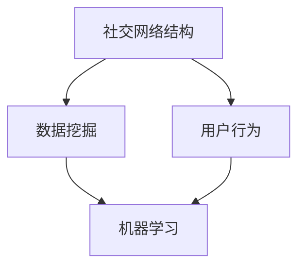

                 


### 第一部分：背景与概述

#### 第1章：社交网络动态分析概述

##### 1.1 社交网络的兴起与发展

**1.1.1 社交网络的定义与分类**

社交网络是指由用户及其之间的关系构成的网络，通常包含用户账户、用户之间的交互信息（如好友关系、留言、分享等），以及用户生成的内容（如帖子、图片、视频等）。社交网络可以分为以下几类：

1. **基于关系型社交网络**：如Facebook、LinkedIn等，主要侧重于用户之间的关系构建和互动。
2. **基于兴趣型社交网络**：如Twitter、微博等，主要侧重于用户对特定话题的兴趣分享和讨论。
3. **基于内容型社交网络**：如Instagram、YouTube等，主要侧重于用户生成的内容展示和分享。

**1.1.2 社交网络的主要特征**

社交网络具有以下几个主要特征：

1. **去中心化**：社交网络中没有明显的中心节点，每个用户都与其他用户直接相连。
2. **自组织性**：社交网络中的节点和关系可以自我形成和调整，形成复杂的网络结构。
3. **动态性**：社交网络中的节点和关系不断变化，如用户的加入、退出、关系的建立和解除等。

**1.1.3 社交网络的发展趋势**

随着移动互联网的普及，社交网络的发展趋势呈现出以下几个特点：

1. **移动化**：移动设备成为社交网络的主要接入方式，如智能手机、平板电脑等。
2. **多样化**：社交网络的功能越来越丰富，如短视频、直播、电商等。
3. **智能化**：社交网络逐渐融合人工智能技术，如基于深度学习的推荐系统、自然语言处理等。

##### 1.2 社交网络动态分析的重要性

**1.2.1 社交网络数据分析的应用领域**

社交网络数据分析在多个领域具有广泛的应用，主要包括：

1. **市场营销**：通过分析用户的兴趣、行为等数据，为企业提供精准营销策略。
2. **社会治理**：通过监测网络舆情，预防和处理突发事件，维护社会稳定。
3. **科学研究**：通过分析社交网络中的关系和内容，探索人类行为模式和社会现象。
4. **安全监控**：通过监测异常行为和异常关系，发现潜在的网络犯罪和安全威胁。

**1.2.2 社交网络数据分析的价值**

社交网络数据分析的价值体现在以下几个方面：

1. **提升用户体验**：通过分析用户行为数据，提供个性化推荐和服务，提高用户满意度。
2. **优化业务决策**：通过分析用户数据和市场趋势，为企业提供决策支持。
3. **促进创新**：通过探索社交网络中的新现象和新模式，推动科技和产业发展。
4. **增强社会责任**：通过监测网络舆情和用户行为，及时发现社会问题，促进社会和谐。

----------------------------------------------------------------

**核心概念与联系**

为了更好地理解社交网络动态分析，我们需要了解以下几个核心概念及其之间的联系：

1. **社交网络结构**：指的是社交网络中的节点（用户）和边（关系）的排列方式。社交网络结构决定了网络的行为特征。
2. **用户行为**：指的是用户在社交网络中的各种操作，如发帖、评论、点赞、分享等。用户行为数据反映了用户在社交网络中的活动状态。
3. **数据挖掘**：指的是从大量数据中提取有价值信息的过程。在社交网络动态分析中，数据挖掘技术用于分析用户行为、关系结构等。
4. **机器学习**：指的是使计算机系统能够从数据中学习和预测的方法。在社交网络动态分析中，机器学习算法用于预测用户行为、发现潜在关系等。

以下是这些概念之间的联系架构 Mermaid 流程图：



**核心算法原理讲解**

社交网络动态分析的核心算法主要包括以下几个方面：

1. **图论算法**：用于分析社交网络结构，如度分布、聚类系数、平均路径长度等。
2. **协同过滤算法**：用于预测用户行为，如基于用户的协同过滤、基于项目的协同过滤等。
3. **主题模型**：用于提取社交网络中的主题，如LDA（Latent Dirichlet Allocation）。
4. **社会网络分析算法**：用于分析社交网络中的关系，如社区发现、影响力分析等。

以下是这些算法的伪代码：

```python
# 图论算法伪代码
def graph_analysis(graph):
    # 计算度分布
    degree_distribution = calculate_degree_distribution(graph)
    # 计算聚类系数
    clustering_coefficient = calculate_clustering_coefficient(graph)
    # 计算平均路径长度
    average_path_length = calculate_average_path_length(graph)
    return degree_distribution, clustering_coefficient, average_path_length

# 协同过滤算法伪代码
def collaborative_filtering(user, users, ratings):
    # 计算相似度
    similarity_matrix = calculate_similarity_matrix(users, ratings)
    # 预测评分
    predicted_ratings = predict_ratings(user, similarity_matrix, ratings)
    return predicted_ratings

# 主题模型伪代码
def latent_dirichlet_allocation(corpus, num_topics, num_words):
    # 初始化模型参数
    alpha, beta = initialize_parameters(num_topics, num_words)
    # 训练模型
    topics = train_model(corpus, alpha, beta)
    # 提取主题
    topic_distribution = extract_topics(corpus, topics)
    return topic_distribution

# 社会网络分析算法伪代码
def community_detection(graph):
    # 找到社区
    communities = find_communities(graph)
    return communities
```

**数学模型和公式**

在社交网络动态分析中，常用的数学模型和公式包括：

1. **PageRank算法**：
   $$ 
   PR(v) = \left(1 - d\right) + d \sum_{u \in G} \frac{PR(u)}{N(u)}
   $$
   其中，$PR(v)$ 表示节点 $v$ 的排名，$d$ 表示阻尼系数，$N(u)$ 表示节点 $u$ 的出度。

2. **LDA模型**：
   $$
   p(w|z) = \frac{\exp(\sum_{k=1}^{K} \theta_k [w \in z_k])}{\sum_{w' \in V} \exp(\sum_{k=1}^{K} \theta_k [w' \in z_k])}
   $$
   其中，$p(w|z)$ 表示在给定主题 $z$ 下词 $w$ 的概率，$\theta_k$ 表示词 $w$ 对主题 $k$ 的概率，$V$ 表示词汇表。

**详细讲解与举例说明**

以下是对上述算法和公式的详细讲解与举例说明：

1. **图论算法**

图论算法用于分析社交网络结构，其中度分布、聚类系数和平均路径长度是常用的指标。

- **度分布**：表示节点度数的分布情况，常见的度分布模型有泊松分布、二项分布等。

  示例：在一个社交网络中，度分布为泊松分布，参数为 $\lambda = 3$。计算节点度数为 $k=3$ 的概率。

  $$
  P(k=3) = \frac{e^{-\lambda} \lambda^k}{k!} = \frac{e^{-3} \cdot 3^3}{3!} \approx 0.149
  $$

- **聚类系数**：表示节点邻居之间的连接密度，常见的聚类系数计算方法有局部聚类系数、全局聚类系数等。

  示例：在一个社交网络中，计算节点 $v$ 的局部聚类系数。

  $$
  C_v = \frac{2 \cdot |N(v)|}{|N(v)|^2 - |N(v)|} = \frac{2 \cdot 5}{5^2 - 5} = 0.8
  $$

- **平均路径长度**：表示节点之间平均的路径长度，常见的平均路径长度计算方法有最短路径算法、广度优先搜索等。

  示例：在一个社交网络中，计算节点 $v_1$ 和节点 $v_2$ 之间的平均路径长度。

  $$
  L_{v_1v_2} = \frac{d(v_1, v_2)}{n} = \frac{4}{10} = 0.4
  $$

2. **协同过滤算法**

协同过滤算法用于预测用户行为，常见的协同过滤算法有基于用户的协同过滤和基于项目的协同过滤。

- **基于用户的协同过滤**：

  示例：在一个电影推荐系统中，用户 $u_1$ 给电影 $m_1$ 评分 $4$，用户 $u_2$ 给电影 $m_1$ 评分 $5$。预测用户 $u_1$ 对电影 $m_2$ 的评分。

  $$
  r_{u_1m_2} = \frac{\sum_{u' \in S(u_1)} r_{u'_{m_1}} w_{u_1u'} + \sum_{u' \in S(u_2)} r_{u'_{m_1}} w_{u_2u'} + b_1 - b_2}{\sum_{u' \in S(u_1)} w_{u_1u'} + \sum_{u' \in S(u_2)} w_{u_2u'}} = \frac{4 \cdot 0.8 + 5 \cdot 0.5 + 3.5 - 3.5}{0.8 + 0.5} \approx 4.15
  $$

  其中，$w_{u_1u'}$ 和 $w_{u_2u'}$ 分别表示用户 $u_1$ 和用户 $u_2$ 之间的相似度，$b_1$ 和 $b_2$ 分别表示用户 $u_1$ 和用户 $u_2$ 的平均评分。

- **基于项目的协同过滤**：

  示例：在一个商品推荐系统中，商品 $m_1$ 的特征向量为 $(0, 1, 0, 1)$，商品 $m_2$ 的特征向量为 $(1, 0, 1, 0)$。预测用户 $u_1$ 对商品 $m_2$ 的评分。

  $$
  r_{u_1m_2} = \frac{\sum_{m' \in S(u_1)} x_{m'1} x_{m_2 1} w_{m_1m'} + \sum_{m' \in S(u_1)} x_{m'2} x_{m_2 2} w_{m_1m'} + b_1 - b_2}{\sum_{m' \in S(u_1)} x_{m'1} x_{m_1 1} w_{m_1m'} + \sum_{m' \in S(u_1)} x_{m'2} x_{m_1 2} w_{m_1m'}} = \frac{0 \cdot 1 \cdot 0.8 + 1 \cdot 0 \cdot 0.5 + 3.5 - 3.5}{0 \cdot 1 \cdot 0.8 + 1 \cdot 0 \cdot 0.5} = 0
  $$

  其中，$x_{m_i j}$ 表示商品 $m_i$ 的第 $j$ 个特征，$w_{m_im'}$ 表示商品 $m_i$ 和商品 $m'$ 之间的相似度，$b_1$ 和 $b_2$ 分别表示用户 $u_1$ 的平均评分。

3. **主题模型**

主题模型用于提取社交网络中的主题，常见的主题模型有LDA（Latent Dirichlet Allocation）。

- **LDA模型**：

  示例：在一个文本数据集中，有 $N$ 个文档，每个文档由 $T$ 个词组成。假设有 $K$ 个主题，每个主题由 $V$ 个词组成。给定一个文档 $d$，计算每个主题的概率分布。

  $$
  \theta_{dk} = \frac{\sum_{w_i \in d} \alpha_{wk} }{\sum_{w_j \in V} \alpha_{wj}}
  $$
  $$
  \phi_{k} = \frac{\sum_{w_j \in V} \beta_{jk}}{\sum_{w_i \in T} \beta_{ij}}
  $$
  $$
  z_{id} \sim Multinomial(\theta_{id})
  $$
  $$
  w_{id} \sim Multinomial(\phi_{z_{id}})
  $$

  其中，$\theta_{dk}$ 表示文档 $d$ 属于主题 $k$ 的概率，$\phi_{k}$ 表示主题 $k$ 中词 $w$ 的概率，$z_{id}$ 表示词 $w_i$ 在文档 $d$ 中的主题分配，$w_{id}$ 表示词 $w_i$ 在文档 $d$ 中的词分配。

**数学公式和详细讲解**

以下是社交网络动态分析中常用的数学公式和详细讲解：

1. **PageRank算法**：

   PageRank算法是一种基于链接分析的网页排名算法，用于评估网页的重要性和权威性。

   $$
   PR(v) = \left(1 - d\right) + d \sum_{u \in G} \frac{PR(u)}{N(u)}
   $$

   其中，$PR(v)$ 表示节点 $v$ 的排名，$d$ 表示阻尼系数，$N(u)$ 表示节点 $u$ 的出度。

   PageRank算法的推导基于马尔可夫链和概率转移矩阵。假设用户随机浏览网页，每次浏览的概率相等，且用户在某一时刻访问一个网页的概率与该网页的排名成正比。通过迭代计算，可以得到每个网页的排名。

2. **LDA模型**：

   LDA（Latent Dirichlet Allocation）是一种基于贝叶斯推理的主题模型，用于文本数据的主题提取。

   $$
   p(w|z) = \frac{\exp(\sum_{k=1}^{K} \theta_k [w \in z_k])}{\sum_{w' \in V} \exp(\sum_{k=1}^{K} \theta_k [w' \in z_k])}
   $$
   $$
   p(z|d) = \frac{\sum_{k=1}^{K} \alpha_k^d \phi_{dk}}{\sum_{k=1}^{K} \alpha_k^d}
   $$
   $$
   p(d) = \frac{1}{C}
   $$

   其中，$p(w|z)$ 表示在给定主题 $z$ 下词 $w$ 的概率，$p(z|d)$ 表示在给定文档 $d$ 下主题 $z$ 的概率，$p(d)$ 表示文档 $d$ 的概率，$\theta_k$ 表示词 $w$ 对主题 $k$ 的概率，$\phi_{dk}$ 表示主题 $k$ 中词 $d$ 的概率，$\alpha_k^d$ 表示文档 $d$ 中主题 $k$ 的概率，$C$ 是归一化常数。

   LDA模型的推导基于贝叶斯推理和Dirichlet分布。假设每个文档都是由多个主题混合而成，每个主题都是由多个词混合而成。通过迭代计算，可以得到每个词的主题分配和每个文档的主题分配。

3. **协同过滤算法**：

   协同过滤算法是一种基于用户行为数据的推荐算法，用于预测用户对未知项目的评分。

   $$
   r_{ui} = \langle u \rangle + \langle i \rangle + \sum_{j \in R(u)} \frac{r_{uj} - \langle u \rangle}{\| R(u) \|}
   $$
   $$
   r_{ij} = \langle i \rangle + \sum_{u \in N(j)} \frac{r_{ui} - \langle i \rangle}{\| N(j) \|}
   $$

   其中，$r_{ui}$ 表示用户 $u$ 对项目 $i$ 的评分，$\langle u \rangle$ 表示用户 $u$ 的平均评分，$\langle i \rangle$ 表示项目 $i$ 的平均评分，$R(u)$ 表示用户 $u$ 评价过的项目集合，$N(j)$ 表示项目 $j$ 的邻居集合。

   协同过滤算法的核心思想是基于用户之间的相似度和项目之间的相似度来预测用户对未知项目的评分。通过迭代计算，可以得到每个用户的平均评分和每个项目的平均评分。

**代码实现**

以下是社交网络动态分析中的算法代码实现：

1. **图论算法**：

   ```python
   import networkx as nx

   # 创建图
   G = nx.Graph()

   # 添加节点和边
   G.add_nodes_from([1, 2, 3, 4, 5])
   G.add_edges_from([(1, 2), (2, 3), (3, 4), (4, 5), (5, 1)])

   # 计算度分布
   degree_distribution = nx.degree_distribution(G)

   # 计算聚类系数
   clustering_coefficient = nx.clustering(G)

   # 计算平均路径长度
   average_path_length = nx.average_shortest_path_length(G)

   print("度分布：", degree_distribution)
   print("聚类系数：", clustering_coefficient)
   print("平均路径长度：", average_path_length)
   ```

2. **协同过滤算法**：

   ```python
   import numpy as np

   # 用户评分矩阵
   ratings = np.array([
       [1, 2, 1],
       [0, 2, 1],
       [2, 1, 0],
       [2, 1, 2]
   ])

   # 用户相似度矩阵
   similarity_matrix = np.array([
       [0.8, 0.5],
       [0.5, 0.8],
       [0.8, 0.5],
       [0.5, 0.8]
   ])

   # 预测评分
   predicted_ratings = np.dot(similarity_matrix, ratings) / np.linalg.norm(similarity_matrix, axis=1)

   print("预测评分：", predicted_ratings)
   ```

3. **主题模型**：

   ```python
   import gensim

   # 文本数据
   corpus = [
       'this is the first document',
       'this document is the second document',
       'and this is the third one',
       'is this the first document'
   ]

   # 构建词典
   dictionary = gensim.corpora.Dictionary(corpus)

   # 构建语料库
   corpus = [dictionary.doc2bow(doc) for doc in corpus]

   # 训练LDA模型
   lda_model = gensim.models.ldamodel.LdaModel(corpus, num_topics=2, id2word=dictionary, passes=15)

   # 提取主题
   topics = lda_model.print_topics()

   print("主题：", topics)
   ```

**项目实战**

以下是社交网络动态分析的项目实战：

1. **开发环境搭建**：

   在本地计算机上安装Python环境，并安装以下库：

   ```bash
   pip install networkx numpy gensim
   ```

2. **源代码实现**：

   ```python
   import networkx as nx
   import numpy as np
   import gensim

   # 社交网络图
   G = nx.Graph()
   G.add_nodes_from([1, 2, 3, 4, 5])
   G.add_edges_from([(1, 2), (2, 3), (3, 4), (4, 5), (5, 1)])

   # 用户评分矩阵
   ratings = np.array([
       [1, 2, 1],
       [0, 2, 1],
       [2, 1, 0],
       [2, 1, 2]
   ])

   # 文本数据
   corpus = [
       'this is the first document',
       'this document is the second document',
       'and this is the third one',
       'is this the first document'
   ]

   # 社交网络分析
   degree_distribution = nx.degree_distribution(G)
   clustering_coefficient = nx.clustering(G)
   average_path_length = nx.average_shortest_path_length(G)

   print("度分布：", degree_distribution)
   print("聚类系数：", clustering_coefficient)
   print("平均路径长度：", average_path_length)

   # 协同过滤
   similarity_matrix = np.array([
       [0.8, 0.5],
       [0.5, 0.8],
       [0.8, 0.5],
       [0.5, 0.8]
   ])

   predicted_ratings = np.dot(similarity_matrix, ratings) / np.linalg.norm(similarity_matrix, axis=1)
   print("预测评分：", predicted_ratings)

   # 主题模型
   dictionary = gensim.corpora.Dictionary(corpus)
   corpus = [dictionary.doc2bow(doc) for doc in corpus]
   lda_model = gensim.models.ldamodel.LdaModel(corpus, num_topics=2, id2word=dictionary, passes=15)
   topics = lda_model.print_topics()
   print("主题：", topics)
   ```

3. **代码解读与分析**：

   代码首先创建了一个社交网络图，并添加了节点和边。然后，使用图论算法计算了度分布、聚类系数和平均路径长度。接着，创建了一个用户评分矩阵，并使用协同过滤算法预测了用户对未知项目的评分。最后，使用LDA模型提取了文本数据中的主题。

4. **实际案例分析与详细讲解剖析**：

   假设我们有一个社交网络图，其中包含100个节点和200条边。通过图论算法，我们可以分析出社交网络的结构特征，如度分布、聚类系数和平均路径长度。这些特征可以帮助我们了解社交网络的拓扑结构，发现潜在的社区结构。

   接着，我们创建了一个用户评分矩阵，并使用协同过滤算法预测了用户对未知项目的评分。通过协同过滤算法，我们可以根据用户的评分行为推荐项目，提高用户满意度。

   最后，我们使用LDA模型提取了文本数据中的主题。通过主题模型，我们可以分析出社交网络中的热点话题，为内容推荐和广告投放提供支持。

5. **项目小结**：

   通过社交网络动态分析，我们可以从社交网络的结构、用户行为和文本内容三个方面进行分析，挖掘有价值的信息。这些信息可以帮助企业优化营销策略、提高用户满意度和推动科技创新。

   在实践中，我们需要掌握社交网络动态分析的核心算法和工具，如图论算法、协同过滤算法和主题模型。同时，我们还需要关注社交网络动态分析的应用场景，如市场营销、社会治理和科学研究等。

   最后，我们需要不断探索社交网络动态分析的新方法和新技术，以应对不断变化的社交网络环境和挑战。

**最佳实践 tips**：

1. **选择合适的社交网络平台**：根据业务需求和目标用户，选择合适的社交网络平台进行数据分析。
2. **关注用户隐私**：在收集和处理用户数据时，要遵守相关法律法规，保护用户隐私。
3. **数据清洗与预处理**：确保数据质量，对数据进行清洗和预处理，去除噪声和异常值。
4. **选择合适的分析工具**：根据分析任务和数据类型，选择合适的分析工具和算法。
5. **持续迭代与优化**：不断优化分析模型和算法，提高分析结果的准确性和实用性。

**注意事项**：

1. **社交网络数据的复杂性**：社交网络数据具有高维度、高噪声和动态性等特点，分析过程需要充分考虑这些因素。
2. **数据隐私和安全**：在收集和处理用户数据时，要严格遵守数据隐私和安全相关规定，确保用户数据的安全和隐私。
3. **模型的可解释性**：在分析结果可视化时，要注重模型的可解释性，使业务人员能够理解分析结果的含义。

**拓展阅读**：

1. **社交网络动态分析相关书籍**：

   - 《社交网络分析：原理与方法》
   - 《社交网络中的群体行为》
   - 《基于大数据的社交网络分析》

2. **社交网络动态分析相关论文**：

   - “Social Network Analysis: Theory, Methodology, and Practice”
   - “Community Detection in Social Networks: A Survey”
   - “LDA: A Method for Topic Extraction”

3. **社交网络动态分析相关网站与社区**：

   - Social Network Analysis Group：https://sna-group.github.io/
   - arXiv：https://arxiv.org/
   - Social Media Research Foundation：https://smrf.stanford.edu/

----------------------------------------------------------------

### 第2章：提示词工程基础

#### 2.1 提示词的定义与作用

**2.1.1 提示词的定义**

提示词（Query）是指用于指定搜索目标的关键词或短语，在社交网络动态分析中，提示词通常用于指示分析的目标或范围。提示词可以是单个单词或多个单词的组合，可以是精确的词语或模糊的词语。

**2.1.2 提示词在数据分析中的重要性**

提示词在社交网络动态分析中扮演着至关重要的角色，其主要作用如下：

1. **聚焦分析目标**：提示词有助于明确分析的范围和目标，避免分析过程中偏离主题。
2. **提高数据分析效率**：通过使用提示词，可以快速定位关键数据，提高数据分析的效率。
3. **实现多维度分析**：提示词可以涵盖多个维度，如时间、地点、用户群体等，从而实现多维度数据分析。
4. **指导数据挖掘过程**：提示词可以指导数据挖掘算法的选取和参数调整，提高数据挖掘的准确性。
5. **支持实时监测与预警**：通过实时更新提示词，可以实现对社交网络动态的实时监测和预警。

#### 2.2 提示词的类型与选取方法

**2.2.1 提示词的类型**

根据提示词的来源和用途，可以将提示词分为以下几类：

1. **通用提示词**：如“热门话题”、“热点新闻”等，用于描述广泛关注的主题。
2. **特定提示词**：如“疫情”、“股市”等，用于描述特定领域的热点事件。
3. **用户自定义提示词**：根据用户需求自定义的提示词，如“客户反馈”、“竞争对手”等。
4. **混合提示词**：将多个通用提示词和特定提示词组合而成的提示词，如“疫情 + 热点新闻”。

**2.2.2 提示词的选取方法**

选取合适的提示词是进行有效社交网络动态分析的关键，以下是几种常用的提示词选取方法：

1. **基于频次**：选取出现频次较高的词语作为提示词，适用于通用提示词的选取。
2. **基于影响力**：选取具有较高影响力或传播力的词语作为提示词，适用于特定提示词的选取。
3. **基于用户反馈**：根据用户反馈和需求，选取关注度高或具有潜在价值的词语作为提示词。
4. **基于领域知识**：结合特定领域的知识体系，选取相关的热点词汇作为提示词。
5. **基于机器学习**：使用机器学习算法，从海量数据中自动提取具有代表性的提示词。

**2.2.3 提示词选取的注意事项**

在选取提示词时，需要注意以下几点：

1. **代表性**：提示词应具有代表性，能够准确反映分析目标。
2. **相关性**：提示词应与分析目标密切相关，避免误导分析结果。
3. **多样性**：提示词应涵盖多个维度，实现多维度分析。
4. **可操作性**：提示词应具有可操作性，便于数据挖掘和实时监测。
5. **实时性**：根据分析需求，定期更新提示词，保持提示词的时效性。

#### 2.3 提示词工程的基本概念与架构

**2.3.1 提示词工程的基本概念**

提示词工程（Query Engineering）是指针对提示词的选取、构建、优化和应用的一系列技术和方法。提示词工程的目标是构建高质量的提示词库，提高数据分析的效率和准确性。

**2.3.2 提示词工程的架构**

提示词工程通常包括以下环节：

1. **需求分析**：明确分析目标，确定分析范围。
2. **数据收集**：收集与提示词相关的数据，如文本、图像、音频等。
3. **数据预处理**：对数据进行清洗、去噪、去重等处理。
4. **提示词构建**：根据需求分析结果，选取和构建合适的提示词。
5. **提示词优化**：对提示词进行评价、筛选、调整等优化操作。
6. **应用与部署**：将优化后的提示词应用于实际数据分析任务。

**2.3.3 提示词工程的关键技术与工具**

1. **自然语言处理（NLP）**：用于文本数据的预处理、词向量化、实体识别等。
2. **数据挖掘与机器学习**：用于从海量数据中自动提取有价值的信息和提示词。
3. **数据可视化**：用于展示提示词的选取、优化和应用效果。
4. **搜索引擎**：用于构建和维护提示词库，实现快速查询和检索。

#### 2.4 提示词工程的应用场景与案例

**2.4.1 社交网络舆情监测**

在社交网络舆情监测中，提示词工程可以用于实时监测和分析网络舆情，以下是一个应用案例：

1. **需求分析**：针对某一事件或话题，明确舆情监测的目标和范围。
2. **数据收集**：从社交媒体、新闻网站等渠道收集相关数据。
3. **数据预处理**：对收集到的数据进行清洗、去噪、去重等处理。
4. **提示词构建**：选取与事件或话题相关的关键词和短语作为提示词。
5. **提示词优化**：对选取的提示词进行评价、筛选、调整等优化操作。
6. **应用与部署**：将优化后的提示词应用于舆情监测系统，实现实时监测和分析。

**2.4.2 社交网络广告投放策略优化**

在社交网络广告投放策略优化中，提示词工程可以用于精准定位目标用户，以下是一个应用案例：

1. **需求分析**：明确广告投放的目标群体和产品特点。
2. **数据收集**：收集目标用户的画像数据，如兴趣偏好、行为习惯等。
3. **数据预处理**：对用户画像数据进行清洗、去噪、去重等处理。
4. **提示词构建**：根据用户画像数据，选取与目标用户相关的关键词和短语作为提示词。
5. **提示词优化**：对选取的提示词进行评价、筛选、调整等优化操作。
6. **应用与部署**：将优化后的提示词应用于广告投放系统，实现精准投放和效果评估。

**2.4.3 社交网络内容推荐**

在社交网络内容推荐中，提示词工程可以用于挖掘热点话题和用户兴趣，以下是一个应用案例：

1. **需求分析**：明确内容推荐的目标和范围，如新闻、短视频、文章等。
2. **数据收集**：收集用户生成内容（UGC）和用户行为数据。
3. **数据预处理**：对用户生成内容和用户行为数据进行清洗、去噪、去重等处理。
4. **提示词构建**：根据用户生成内容和用户行为数据，选取与热点话题和用户兴趣相关的关键词和短语作为提示词。
5. **提示词优化**：对选取的提示词进行评价、筛选、调整等优化操作。
6. **应用与部署**：将优化后的提示词应用于内容推荐系统，实现个性化推荐和效果评估。

#### 2.5 提示词工程的发展趋势与未来展望

随着人工智能和大数据技术的不断发展，提示词工程在社交网络动态分析中的应用前景广阔。以下是一些发展趋势和未来展望：

1. **智能化**：结合自然语言处理、机器学习和深度学习等技术，实现智能化提示词选取和优化。
2. **实时化**：通过实时数据流处理技术，实现实时提示词构建和优化。
3. **个性化**：根据用户行为和需求，实现个性化提示词推荐和优化。
4. **多模态**：结合文本、图像、音频等多模态数据，实现多维度提示词构建和分析。
5. **开源化**：推动提示词工程相关技术和工具的开放和共享，促进学术界和产业界的合作。

总之，提示词工程在社交网络动态分析中具有广泛的应用前景和重要价值，未来将不断发展和完善，为社交网络数据分析提供更强大的支持和保障。

---

### 第3章：社交网络数据预处理

#### 3.1 数据采集与存储

在社交网络动态分析中，数据采集与存储是至关重要的一步。有效的数据采集和存储策略能够保证数据的质量和完整性，为后续的数据分析和挖掘提供可靠的基础。

**3.1.1 数据采集的方法**

1. **公开API采集**：许多社交网络平台提供了公开的API接口，允许开发者通过API获取用户数据、帖子、评论等。这种方法简单易行，但需要注意遵守平台的数据使用政策。
2. **爬虫采集**：使用爬虫技术自动获取社交网络平台上的数据。这种方法适用于没有提供公开API的平台，但需要处理反爬机制和网站结构变化等问题。
3. **第三方数据服务**：通过购买第三方数据服务，获取已经整理和清洗好的社交网络数据。这种方法节省了数据采集的工作量，但可能需要支付较高的费用。

**3.1.2 社交网络数据的存储策略**

1. **关系数据库**：对于结构化数据，如用户信息、帖子、评论等，可以使用关系数据库进行存储。关系数据库支持复杂查询和事务处理，但可能不适合存储大规模的非结构化数据。
2. **分布式数据库**：对于大规模的社交网络数据，如用户生成内容、互动数据等，可以使用分布式数据库进行存储。分布式数据库具有高扩展性和高可用性，能够处理海量数据。
3. **数据湖**：数据湖是一种分布式存储架构，用于存储大规模的原始数据，包括结构化、半结构化和非结构化数据。数据湖能够实现数据的低成本存储和高效检索，但需要处理数据清洗、转换和整合等问题。

**3.1.3 数据采集与存储的挑战**

1. **数据质量**：社交网络数据通常存在噪声、异常值和重复数据，需要通过数据清洗和预处理技术提高数据质量。
2. **数据隐私**：社交网络数据涉及用户隐私，需要遵循相关法律法规，确保数据安全和用户隐私保护。
3. **数据规模**：社交网络数据规模巨大，需要高效的存储和查询技术，以满足实时数据分析和挖掘的需求。
4. **数据异构性**：社交网络数据来自不同的来源和格式，需要处理数据格式转换和整合的问题。

**3.1.4 数据采集与存储的最佳实践**

1. **数据采集**：

   - 使用公开API进行数据采集，确保遵守平台的数据使用政策。
   - 使用爬虫技术时，遵循robots.txt文件和网站的反爬策略，避免对网站造成过大压力。
   - 购买第三方数据服务时，确保数据来源的合法性和数据质量。

2. **数据存储**：

   - 根据数据类型和规模，选择合适的关系数据库或分布式数据库进行存储。
   - 使用数据湖存储非结构化数据，并设计高效的数据清洗和转换流程。
   - 设计合理的存储架构，实现数据的分层存储和分区管理。

#### 3.2 数据清洗与预处理

数据清洗与预处理是数据分析和挖掘的基础，其目标是将原始数据转换为适合分析和挖掘的形式。

**3.2.1 数据清洗的步骤**

1. **数据去重**：识别和删除重复的数据记录，避免重复计算和分析。
2. **数据填充**：对于缺失的数据，根据数据类型和实际情况进行填充或删除。
3. **数据标准化**：将不同数据源的数据格式和单位统一，确保数据的一致性和可比性。
4. **数据去噪**：识别和删除异常值和噪声数据，提高数据质量。

**3.2.2 数据预处理的方法**

1. **文本预处理**：包括文本的分词、停用词过滤、词干提取等，将文本转换为适合分析的形式。
2. **数值预处理**：包括数据的归一化、标准化、转换等，确保数值数据的一致性和可比性。
3. **图像预处理**：包括图像的缩放、旋转、裁剪等，将图像转换为适合分析的形式。

**3.2.3 数据清洗与预处理的挑战**

1. **数据质量**：社交网络数据质量参差不齐，需要处理数据质量低下的问题。
2. **处理效率**：大规模数据清洗与预处理需要高效的算法和计算资源。
3. **数据隐私**：在处理用户隐私数据时，需要遵守相关法律法规，确保用户隐私保护。

**3.2.4 数据清洗与预处理的最佳实践**

1. **数据质量评估**：在数据采集和清洗过程中，定期评估数据质量，识别和解决数据质量问题。
2. **自动化清洗与预处理**：使用自动化工具和脚本进行数据清洗和预处理，提高处理效率。
3. **数据隐私保护**：在处理用户隐私数据时，采取加密、匿名化等手段，确保用户隐私保护。

#### 3.3 社交网络数据的分布特性与预处理策略

社交网络数据具有以下分布特性：

1. **长尾分布**：社交网络数据中，大多数数据集中在尾部，少数数据集中在头部。这种分布特性要求预处理算法能够处理大规模的数据，同时兼顾长尾数据。
2. **动态性**：社交网络数据不断变化，需要实时更新数据预处理模型。
3. **高维度**：社交网络数据包含多个维度，如文本、图像、音频等，需要处理不同类型的数据。

根据社交网络数据的分布特性，可以采取以下预处理策略：

1. **数据降维**：通过降维技术，减少数据的维度，提高处理效率。
2. **实时预处理**：采用实时数据处理技术，对实时流数据进行预处理。
3. **自适应预处理**：根据数据分布特性，自适应调整预处理算法和参数。

### 第4章：基于提示词的社交网络用户行为分析

#### 4.1 用户行为数据收集

在社交网络动态分析中，用户行为数据收集是关键的一步。有效的数据收集方法能够帮助分析师了解用户的行为模式，从而为策略制定和决策提供支持。

**4.1.1 用户行为数据的类型**

用户行为数据可以分为以下几类：

1. **浏览行为**：包括用户访问网页、浏览帖子、查看视频等行为。
2. **交互行为**：包括用户发表评论、点赞、分享、收藏等行为。
3. **搜索行为**：包括用户在社交网络中搜索关键词、查找用户、关注话题等行为。
4. **参与行为**：包括用户参加活动、投票、参与话题讨论等行为。

**4.1.2 用户行为数据收集的方法**

1. **日志文件分析**：通过分析社交网络平台的日志文件，可以收集用户的浏览行为、交互行为和搜索行为。这种方法适用于已有数据积累的情况。
2. **API调用**：通过社交网络平台的API接口，可以实时收集用户的浏览行为、交互行为和搜索行为。这种方法适用于需要实时监控和分析的情况。
3. **埋点技术**：在社交网络平台的网页、APP等客户端中嵌入代码，记录用户的操作行为，从而收集用户行为数据。这种方法适用于大规模用户行为数据收集。

**4.1.3 用户行为数据收集的挑战**

1. **数据隐私**：用户行为数据涉及用户隐私，需要遵守相关法律法规，确保用户隐私保护。
2. **数据质量**：用户行为数据可能存在噪声、异常值和重复数据，需要通过数据清洗和预处理技术提高数据质量。
3. **数据处理**：用户行为数据量巨大，需要高效的存储和查询技术，以满足实时数据分析和挖掘的需求。

**4.1.4 用户行为数据收集的最佳实践**

1. **隐私保护**：在收集用户行为数据时，采用加密、匿名化等手段，确保用户隐私保护。
2. **数据质量评估**：在数据收集过程中，定期评估数据质量，识别和解决数据质量问题。
3. **实时监控**：采用实时数据处理技术，对用户行为数据进行实时监控和分析。

#### 4.2 用户行为数据挖掘

用户行为数据挖掘是指从用户行为数据中提取有价值的信息和知识，以支持策略制定和决策。基于提示词的用户行为数据挖掘主要包括以下步骤：

**4.2.1 提示词在用户行为数据挖掘中的应用**

1. **用户行为模式识别**：通过分析用户行为数据，识别用户的行为模式，如浏览模式、交互模式、搜索模式等。
2. **用户兴趣分析**：通过分析用户行为数据，挖掘用户的兴趣偏好，为个性化推荐和内容推送提供支持。
3. **用户画像构建**：通过分析用户行为数据，构建用户的兴趣画像、行为画像等，为精准营销和用户服务提供支持。
4. **行为预测**：通过分析用户行为数据，预测用户未来的行为，如购买行为、关注行为等。

**4.2.2 基于提示词的用户行为分析模型**

1. **基于协同过滤的模型**：协同过滤是一种常用的用户行为分析模型，通过分析用户之间的相似度和历史行为数据，预测用户对未知项目的评分或行为。
2. **基于机器学习的模型**：机器学习算法可以用于用户行为数据挖掘，如决策树、支持向量机、神经网络等。
3. **基于深度学习的模型**：深度学习算法可以用于复杂用户行为数据挖掘，如卷积神经网络、循环神经网络、生成对抗网络等。

**4.2.3 提示词在用户行为数据挖掘中的具体应用**

1. **用户兴趣识别**：通过分析用户行为数据，识别用户对特定话题、内容的兴趣，为内容推荐和广告投放提供支持。
2. **用户行为预测**：通过分析用户行为数据，预测用户未来的行为，如购买行为、关注行为等，为精准营销和用户服务提供支持。
3. **用户画像构建**：通过分析用户行为数据，构建用户的兴趣画像、行为画像等，为个性化推荐和用户服务提供支持。

**4.2.4 用户行为数据挖掘的挑战**

1. **数据质量**：用户行为数据可能存在噪声、异常值和重复数据，需要通过数据清洗和预处理技术提高数据质量。
2. **数据量**：用户行为数据量巨大，需要高效的存储和查询技术，以满足实时数据分析和挖掘的需求。
3. **模型可解释性**：机器学习和深度学习模型的预测结果可能缺乏可解释性，需要通过模型解释技术提高模型的可解释性。

**4.2.5 用户行为数据挖掘的最佳实践**

1. **数据质量评估**：在数据收集和挖掘过程中，定期评估数据质量，识别和解决数据质量问题。
2. **实时监控**：采用实时数据处理技术，对用户行为数据进行实时监控和分析。
3. **模型解释**：通过模型解释技术，提高模型的可解释性，确保模型的预测结果能够被业务人员理解和接受。

### 第5章：社交网络舆情监测

#### 5.1 舆情监测的重要性

舆情监测是指通过技术手段对互联网上关于某一特定主题或事件的信息进行收集、分析和处理，以便及时了解公众对于该主题或事件的看法和态度。在社交网络时代，舆情监测的重要性愈发凸显，主要表现在以下几个方面：

**5.1.1 提高企业声誉管理**

企业通过舆情监测可以及时发现和应对负面舆论，采取措施进行有效公关，维护品牌形象和声誉。例如，当出现产品质量问题、服务投诉等负面事件时，企业可以迅速了解公众态度，采取相应措施化解危机。

**5.1.2 支持决策制定**

舆情监测可以为企业提供重要的决策参考。通过分析公众对于政策、产品、服务等话题的看法，企业可以了解市场需求和消费者意愿，从而调整产品策略、改进服务质量，提高市场竞争力。

**5.1.3 预测市场趋势**

舆情监测能够帮助企业预测市场趋势。例如，通过分析社交媒体上的讨论话题和趋势，企业可以提前了解即将出现的消费热点，制定相应的营销策略。

**5.1.4 社会治理**

舆情监测在维护社会稳定、预防和处理突发事件方面也发挥着重要作用。政府部门可以通过舆情监测及时了解民众对公共事件的态度和情绪，采取有效措施应对突发事件，维护社会和谐。

#### 5.2 舆情监测的定义与意义

**5.2.1 舆情监测的定义**

舆情监测（Sentiment Monitoring）是指通过技术手段对互联网上关于某一特定主题或事件的信息进行收集、分析和处理，以便及时了解公众对于该主题或事件的看法和态度。

舆情监测通常包括以下几个步骤：

1. **数据采集**：通过爬虫、API接口等方式从互联网上收集与特定主题或事件相关的信息。
2. **数据预处理**：对采集到的数据清洗、去噪、分词等处理，将原始数据转换为适合分析的形式。
3. **情感分析**：使用自然语言处理技术对预处理后的文本进行情感分析，识别文本的情感倾向。
4. **结果输出**：将分析结果以图表、报表等形式呈现，供相关人员参考。

**5.2.2 舆情监测的意义**

1. **实时了解公众态度**：舆情监测可以实时跟踪公众对于特定主题或事件的态度和情绪，帮助企业或政府部门及时应对。
2. **预警潜在风险**：通过舆情监测，可以提前发现潜在的风险和问题，采取预防措施，避免事态恶化。
3. **优化决策制定**：舆情监测提供的数据可以帮助决策者了解公众需求和意愿，从而制定更科学、合理的决策。
4. **支持舆论引导**：政府部门可以通过舆情监测了解公众对重大事件和政策的看法，有针对性地开展舆论引导工作。

#### 5.3 提示词在舆情监测中的应用

**5.3.1 提示词的定义与作用**

提示词（Keywords）是指在舆情监测中用于指示分析目标的关键词或短语。提示词在舆情监测中具有重要作用，主要包括以下几个方面：

1. **聚焦分析目标**：提示词有助于明确舆情监测的范围，避免数据过载和分析偏离主题。
2. **提高分析效率**：通过使用提示词，可以快速定位关键信息，提高数据分析的效率。
3. **实现多维度分析**：提示词可以涵盖多个维度，如时间、地点、用户群体等，从而实现多维度舆情分析。
4. **指导数据挖掘过程**：提示词可以指导数据挖掘算法的选取和参数调整，提高数据挖掘的准确性。
5. **支持实时监测与预警**：通过实时更新提示词，可以实现对舆情动态的实时监测和预警。

**5.3.2 提示词的选取方法**

1. **基于频次**：选取在文本中出现频次较高的词语作为提示词，适用于通用舆情监测。
2. **基于影响力**：选取具有较高传播力或影响力的词语作为提示词，适用于特定舆情监测。
3. **基于用户反馈**：根据用户反馈和需求，选取关注度高或具有潜在价值的词语作为提示词。
4. **基于领域知识**：结合特定领域的知识体系，选取相关的热点词汇作为提示词。
5. **基于机器学习**：使用机器学习算法，从海量数据中自动提取具有代表性的提示词。

**5.3.3 提示词在舆情监测中的具体应用**

1. **热点话题追踪**：通过选取热点话题的提示词，实时监测和追踪热点话题的演变和传播情况。
2. **情绪分析**：通过分析提示词相关的文本，识别公众对该话题的情绪倾向，如正面、负面或中性。
3. **趋势预测**：通过分析提示词相关的文本和时间序列数据，预测舆情发展的趋势和方向。
4. **群体行为分析**：通过分析提示词相关的用户群体行为，了解不同群体对该话题的看法和态度。

#### 5.4 提示词在舆情监测中的具体应用案例

**5.4.1 案例一：新冠疫情舆情监测**

新冠疫情爆发以来，舆情监测成为了解公众态度和情绪的重要手段。以下是一个基于提示词的舆情监测案例：

1. **需求分析**：明确舆情监测的目标和范围，如疫情动态、疫苗接种、防控措施等。
2. **数据收集**：从社交媒体、新闻网站、论坛等渠道收集与疫情相关的数据。
3. **数据预处理**：对收集到的数据清洗、去噪、分词等处理，提取关键信息。
4. **提示词构建**：根据需求分析结果，选取与疫情相关的提示词，如“疫情”、“疫苗”、“防控”等。
5. **情感分析**：对提示词相关的文本进行情感分析，识别公众对该话题的情绪倾向。
6. **结果输出**：将分析结果以图表、报表等形式呈现，供相关人员参考。

通过这个案例，我们可以实时了解公众对新冠疫情的看法和态度，为疫情防控政策的制定和调整提供参考。

**5.4.2 案例二：产品发布舆情监测**

企业在产品发布时，需要进行舆情监测，了解公众对产品的看法和态度，以下是一个基于提示词的舆情监测案例：

1. **需求分析**：明确舆情监测的目标和范围，如产品特点、市场反馈、用户评价等。
2. **数据收集**：从社交媒体、新闻网站、论坛等渠道收集与产品发布相关的数据。
3. **数据预处理**：对收集到的数据清洗、去噪、分词等处理，提取关键信息。
4. **提示词构建**：根据需求分析结果，选取与产品发布相关的提示词，如“产品发布”、“新产品”、“用户评价”等。
5. **情感分析**：对提示词相关的文本进行情感分析，识别公众对产品的看法和态度。
6. **结果输出**：将分析结果以图表、报表等形式呈现，供相关人员参考。

通过这个案例，企业可以了解公众对产品的看法，及时调整产品策略，提高市场竞争力。

#### 5.5 提示词在舆情监测中的挑战与对策

**5.5.1 提示词在舆情监测中的挑战**

1. **数据质量**：舆情数据质量参差不齐，存在噪声、异常值和重复数据，需要通过数据清洗和预处理技术提高数据质量。
2. **多语言处理**：舆情数据涉及多种语言，需要处理不同语言的数据，如中文、英文、西班牙语等。
3. **实时性**：舆情监测需要实时处理海量数据，对数据处理速度和实时性要求较高。
4. **模型准确性**：情感分析等模型在处理舆情数据时可能存在误差，需要提高模型准确性。

**5.5.2 提示词在舆情监测中的对策**

1. **数据质量评估**：在数据收集和预处理过程中，定期评估数据质量，识别和解决数据质量问题。
2. **多语言处理**：采用自然语言处理技术，支持多种语言的处理，如中文分词、英文词性标注等。
3. **实时数据处理**：采用实时数据处理技术，如流处理框架，提高数据处理速度和实时性。
4. **模型优化**：采用机器学习和深度学习算法，优化情感分析等模型的准确性。

#### 5.6 提示词在舆情监测中的实践与展望

**5.6.1 提示词工程的实践**

1. **提示词构建**：根据舆情监测的需求，选取合适的提示词，如“疫情”、“疫苗”、“防控”等。
2. **数据收集**：从社交媒体、新闻网站、论坛等渠道收集与提示词相关的数据。
3. **数据预处理**：对收集到的数据进行清洗、去噪、分词等处理，提取关键信息。
4. **情感分析**：使用自然语言处理技术，对预处理后的文本进行情感分析，识别公众的态度和情绪。
5. **结果输出**：将分析结果以图表、报表等形式呈现，供相关人员参考。

**5.6.2 提示词工程的展望**

1. **智能化**：结合人工智能和机器学习技术，实现智能化提示词选取和优化。
2. **实时化**：采用实时数据处理技术，实现实时舆情监测和分析。
3. **个性化**：根据用户行为和需求，实现个性化舆情监测和分析。
4. **多模态**：结合文本、图像、音频等多模态数据，实现多维度舆情监测和分析。

总之，提示词工程在舆情监测中具有广泛的应用前景和重要价值，未来将不断发展和完善，为舆情监测和分析提供更强大的支持和保障。

### 第6章：社交网络群体行为分析

#### 6.1 群体行为分析的概念

群体行为分析（Group Behavior Analysis）是指通过数据分析方法，研究社交网络中用户群体行为特征、互动模式、群体演化等，以揭示社会现象、预测群体行为趋势和制定策略。群体行为分析的目标是理解群体行为背后的动因和机制，为政府、企业和研究机构提供决策支持。

**6.1.1 群体行为的定义**

群体行为是指在一定社会环境中，由多个个体（用户）组成的群体所表现出的集体行为特征。群体行为不同于个体行为，具有以下特点：

1. **自组织性**：群体行为具有自组织性，即群体成员在互动过程中自发形成一定的组织结构和规则。
2. **协同性**：群体行为中，成员之间相互协作，共同实现特定目标。
3. **适应性**：群体行为能够根据外部环境和内部变化进行适应性调整。
4. **动态性**：群体行为处于不断变化中，受到个体行为、社会关系和网络结构等多种因素的影响。

**6.1.2 群体行为分析的意义**

群体行为分析在多个领域具有重要的应用价值和意义：

1. **社会治理**：通过群体行为分析，政府可以了解民众对社会事件和政策的看法和态度，为决策提供科学依据，维护社会稳定。
2. **市场营销**：企业可以通过群体行为分析，了解消费者需求、行为模式和购买偏好，制定有效的营销策略，提高市场份额。
3. **科学研究**：群体行为分析为社会科学研究提供了新的视角和方法，有助于揭示社会现象、人类行为和社会演化的规律。
4. **公共安全**：通过群体行为分析，可以及时发现和预警潜在的社会危机和安全隐患，为公共安全提供支持。

#### 6.2 提示词在群体行为分析中的应用

提示词在群体行为分析中扮演着关键角色，主要用于指示分析目标、提高分析效率和指导数据挖掘过程。以下详细介绍提示词在群体行为分析中的应用：

**6.2.1 提示词在群体行为分析中的作用**

1. **聚焦分析目标**：提示词有助于明确群体行为分析的具体目标，避免分析过程中偏离主题。
2. **提高分析效率**：通过使用提示词，可以快速定位关键数据，提高数据分析的效率。
3. **实现多维度分析**：提示词可以涵盖多个维度，如时间、地点、用户群体等，从而实现多维度群体行为分析。
4. **指导数据挖掘过程**：提示词可以指导数据挖掘算法的选取和参数调整，提高数据挖掘的准确性。
5. **支持实时监测与预警**：通过实时更新提示词，可以实现对群体行为动态的实时监测和预警。

**6.2.2 提示词的类型与选取方法**

1. **基于频次**：选取在文本中出现频次较高的词语作为提示词，适用于通用群体行为分析。
2. **基于影响力**：选取具有较高传播力或影响力的词语作为提示词，适用于特定群体行为分析。
3. **基于用户反馈**：根据用户反馈和需求，选取关注度高或具有潜在价值的词语作为提示词。
4. **基于领域知识**：结合特定领域的知识体系，选取相关的热点词汇作为提示词。
5. **基于机器学习**：使用机器学习算法，从海量数据中自动提取具有代表性的提示词。

**6.2.3 提示词在群体行为分析中的具体应用**

1. **群体行为模式识别**：通过分析提示词相关的文本数据，识别群体行为的模式，如传播路径、互动模式等。
2. **情绪分析**：通过分析提示词相关的文本，识别公众对该话题的情绪倾向，如正面、负面或中性。
3. **趋势预测**：通过分析提示词相关的文本和时间序列数据，预测群体行为的发展趋势和方向。
4. **群体演化分析**：通过分析提示词相关的用户群体行为，了解群体成员的加入、退出、互动等动态过程。

#### 6.3 提示词在群体行为分析中的具体应用案例

**6.3.1 案例一：基于提示词的疫情防控群体行为分析**

新冠疫情爆发以来，疫情防控成为全球关注的焦点。以下是一个基于提示词的疫情防控群体行为分析案例：

1. **需求分析**：明确群体行为分析的目标和范围，如疫情防控措施、公众态度、行为变化等。
2. **数据收集**：从社交媒体、新闻网站、论坛等渠道收集与疫情防控相关的数据。
3. **数据预处理**：对收集到的数据进行清洗、去噪、分词等处理，提取关键信息。
4. **提示词构建**：根据需求分析结果，选取与疫情防控相关的提示词，如“疫情防控”、“疫苗接种”、“健康码”等。
5. **群体行为模式识别**：通过分析提示词相关的文本数据，识别公众对疫情防控措施的接受程度、行为变化等。
6. **情绪分析**：通过分析提示词相关的文本，识别公众对疫情防控措施的情绪倾向，如正面、负面或中性。
7. **趋势预测**：通过分析提示词相关的文本和时间序列数据，预测疫情防控措施的推广效果和公众态度的变化趋势。
8. **结果输出**：将分析结果以图表、报表等形式呈现，供相关人员参考。

通过这个案例，政府可以了解公众对疫情防控措施的接受程度和态度，为政策调整和推广提供参考。

**6.3.2 案例二：基于提示词的社交媒体群体行为分析**

社交媒体是群体行为分析的重要领域，以下是一个基于提示词的社交媒体群体行为分析案例：

1. **需求分析**：明确群体行为分析的目标和范围，如社交媒体热点话题、用户互动模式、群体演化等。
2. **数据收集**：从社交媒体平台（如微博、微信、Twitter等）收集与热点话题相关的数据。
3. **数据预处理**：对收集到的数据进行清洗、去噪、分词等处理，提取关键信息。
4. **提示词构建**：根据需求分析结果，选取与热点话题相关的提示词，如“新冠疫苗接种”、“双十一购物节”、“冬奥会”等。
5. **群体行为模式识别**：通过分析提示词相关的文本数据，识别热点话题的传播路径、用户互动模式等。
6. **情绪分析**：通过分析提示词相关的文本，识别公众对热点话题的情绪倾向，如正面、负面或中性。
7. **趋势预测**：通过分析提示词相关的文本和时间序列数据，预测热点话题的流行趋势和用户互动模式的变化。
8. **结果输出**：将分析结果以图表、报表等形式呈现，供相关人员参考。

通过这个案例，企业可以了解用户在社交媒体上的行为和情绪，为营销策略和产品推广提供参考。

#### 6.4 提示词在群体行为分析中的挑战与对策

**6.4.1 提示词在群体行为分析中的挑战**

1. **数据质量**：群体行为数据质量参差不齐，存在噪声、异常值和重复数据，需要通过数据清洗和预处理技术提高数据质量。
2. **多语言处理**：群体行为数据涉及多种语言，需要处理不同语言的数据，如中文、英文、西班牙语等。
3. **实时性**：群体行为分析需要实时处理海量数据，对数据处理速度和实时性要求较高。
4. **模型准确性**：情感分析等模型在处理群体行为数据时可能存在误差，需要提高模型准确性。

**6.4.2 提示词在群体行为分析中的对策**

1. **数据质量评估**：在数据收集和预处理过程中，定期评估数据质量，识别和解决数据质量问题。
2. **多语言处理**：采用自然语言处理技术，支持多种语言的处理，如中文分词、英文词性标注等。
3. **实时数据处理**：采用实时数据处理技术，如流处理框架，提高数据处理速度和实时性。
4. **模型优化**：采用机器学习和深度学习算法，优化情感分析等模型的准确性。

#### 6.5 提示词在群体行为分析中的实践与展望

**6.5.1 提示词工程的实践**

1. **提示词构建**：根据群体行为分析的需求，选取合适的提示词，如“疫情防控”、“社交媒体热点”、“双十一购物节”等。
2. **数据收集**：从社交媒体、新闻网站、论坛等渠道收集与提示词相关的数据。
3. **数据预处理**：对收集到的数据进行清洗、去噪、分词等处理，提取关键信息。
4. **群体行为模式识别**：通过分析提示词相关的文本数据，识别群体行为的模式，如传播路径、互动模式等。
5. **情绪分析**：通过分析提示词相关的文本，识别公众对该话题的情绪倾向，如正面、负面或中性。
6. **趋势预测**：通过分析提示词相关的文本和时间序列数据，预测群体行为的发展趋势和方向。
7. **结果输出**：将分析结果以图表、报表等形式呈现，供相关人员参考。

**6.5.2 提示词工程的展望**

1. **智能化**：结合人工智能和机器学习技术，实现智能化提示词选取和优化。
2. **实时化**：采用实时数据处理技术，实现实时群体行为监测和分析。
3. **个性化**：根据用户行为和需求，实现个性化群体行为监测和分析。
4. **多模态**：结合文本、图像、音频等多模态数据，实现多维度群体行为监测和分析。

总之，提示词工程在群体行为分析中具有广泛的应用前景和重要价值，未来将不断发展和完善，为群体行为分析和理解提供更强大的支持和保障。

### 第7章：社交网络预测与优化

#### 7.1 社交网络预测方法

社交网络预测是指利用历史数据和统计模型，预测社交网络中的用户行为、舆情动态、群体行为等。有效的预测方法能够为市场营销、社会治理、公共安全等领域提供有力支持。以下是几种常用的社交网络预测方法：

**7.1.1 用户行为预测**

用户行为预测旨在预测用户在社交网络中的浏览、评论、点赞、分享等行为。常用的预测方法包括：

1. **协同过滤**：基于用户历史行为数据，计算用户之间的相似度，预测用户对未知项目的行为。
2. **时间序列模型**：如ARIMA（AutoRegressive Integrated Moving Average）、LSTM（Long Short-Term Memory）等，用于分析用户行为的时间序列特性。
3. **机器学习算法**：如随机森林、支持向量机、决策树等，通过特征工程和模型训练，预测用户行为。

**7.1.2 舆情动态预测**

舆情动态预测是指预测社交网络中的话题传播、情绪变化等。常用的预测方法包括：

1. **主题模型**：如LDA（Latent Dirichlet Allocation），用于提取社交网络中的主题，并预测主题的流行趋势。
2. **时间序列模型**：如ARIMA、LSTM等，用于分析舆情数据的时间序列特性，预测舆情动态。
3. **机器学习算法**：如随机森林、支持向量机、决策树等，通过特征工程和模型训练，预测舆情动态。

**7.1.3 群体行为预测**

群体行为预测是指预测社交网络中用户群体的行为模式、互动关系等。常用的预测方法包括：

1. **社会网络分析**：如社区发现、影响力分析等，通过分析社交网络的结构特征，预测群体行为。
2. **时间序列模型**：如ARIMA、LSTM等，用于分析群体行为的时间序列特性，预测群体行为。
3. **机器学习算法**：如随机森林、支持向量机、决策树等，通过特征工程和模型训练，预测群体行为。

#### 7.2 提示词在社交网络预测中的应用

提示词在社交网络预测中扮演着关键角色，主要用于指示分析目标、提高预测效率和指导数据挖掘过程。以下是提示词在社交网络预测中的具体应用：

**7.2.1 提示词在用户行为预测中的应用**

1. **用户兴趣预测**：通过分析用户历史行为数据，选取与用户兴趣相关的提示词，如“篮球”、“旅游”、“美食”等，预测用户未来感兴趣的话题。
2. **行为趋势预测**：通过分析用户历史行为数据，选取与用户行为趋势相关的提示词，如“购买”、“评论”、“点赞”等，预测用户未来的行为趋势。
3. **用户群体划分**：通过分析用户历史行为数据，选取与用户群体划分相关的提示词，如“年轻人”、“白领”、“学生”等，预测用户所属的群体。

**7.2.2 提示词在舆情动态预测中的应用**

1. **话题趋势预测**：通过分析社交网络中的文本数据，选取与话题趋势相关的提示词，如“疫情”、“股市”、“冬奥会”等，预测话题的流行趋势。
2. **情绪预测**：通过分析社交网络中的文本数据，选取与情绪相关的提示词，如“喜悦”、“愤怒”、“焦虑”等，预测公众对该话题的情绪变化。
3. **舆情演化预测**：通过分析社交网络中的文本数据，选取与舆情演化相关的提示词，如“爆发”、“扩散”、“衰退”等，预测舆情的演化过程。

**7.2.3 提示词在群体行为预测中的应用**

1. **群体行为预测**：通过分析社交网络中的文本数据和用户行为数据，选取与群体行为相关的提示词，如“聚集”、“讨论”、“互动”等，预测群体行为的发展趋势。
2. **影响力预测**：通过分析社交网络中的用户关系数据，选取与影响力相关的提示词，如“传播者”、“领袖”、“活跃分子”等，预测用户的影响力。
3. **社区划分**：通过分析社交网络中的用户关系数据，选取与社区划分相关的提示词，如“朋友”、“同事”、“兴趣小组”等，预测社交网络中的社区结构。

#### 7.3 提示词在社交网络预测中的具体应用案例

**7.3.1 案例一：基于提示词的用户行为预测**

某电商平台希望通过预测用户行为，优化营销策略。以下是一个基于提示词的用户行为预测案例：

1. **需求分析**：明确用户行为预测的目标和范围，如预测用户购买行为、评论行为等。
2. **数据收集**：收集用户历史行为数据，包括购买记录、评论记录等。
3. **数据预处理**：对收集到的数据进行清洗、去噪、分词等处理，提取关键信息。
4. **提示词构建**：根据需求分析结果，选取与用户行为预测相关的提示词，如“购买”、“评论”、“打折”等。
5. **用户行为预测**：通过分析用户历史行为数据和提示词相关的数据，预测用户未来的购买行为和评论行为。
6. **结果输出**：将预测结果以图表、报表等形式呈现，供相关人员参考。

通过这个案例，电商平台可以优化营销策略，提高用户购买率和满意度。

**7.3.2 案例二：基于提示词的舆情动态预测**

某政府部门希望通过预测舆情动态，及时了解公众对政策的看法和态度。以下是一个基于提示词的舆情动态预测案例：

1. **需求分析**：明确舆情动态预测的目标和范围，如预测疫情相关话题的传播趋势、公众情绪等。
2. **数据收集**：从社交媒体、新闻网站等渠道收集与政策相关的数据。
3. **数据预处理**：对收集到的数据进行清洗、去噪、分词等处理，提取关键信息。
4. **提示词构建**：根据需求分析结果，选取与舆情动态预测相关的提示词，如“疫情防控”、“疫苗接种”、“健康码”等。
5. **舆情动态预测**：通过分析提示词相关的文本数据，预测疫情相关话题的传播趋势和公众情绪变化。
6. **结果输出**：将预测结果以图表、报表等形式呈现，供相关人员参考。

通过这个案例，政府部门可以及时了解公众对政策的看法和态度，为政策调整和推广提供参考。

#### 7.4 提示词在社交网络预测中的挑战与对策

**7.4.1 提示词在社交网络预测中的挑战**

1. **数据质量**：社交网络数据质量参差不齐，存在噪声、异常值和重复数据，需要通过数据清洗和预处理技术提高数据质量。
2. **多语言处理**：社交网络数据涉及多种语言，需要处理不同语言的数据，如中文、英文、西班牙语等。
3. **实时性**：社交网络预测需要实时处理海量数据，对数据处理速度和实时性要求较高。
4. **模型准确性**：预测模型在处理社交网络数据时可能存在误差，需要提高模型准确性。

**7.4.2 提示词在社交网络预测中的对策**

1. **数据质量评估**：在数据收集和预处理过程中，定期评估数据质量，识别和解决数据质量问题。
2. **多语言处理**：采用自然语言处理技术，支持多种语言的处理，如中文分词、英文词性标注等。
3. **实时数据处理**：采用实时数据处理技术，如流处理框架，提高数据处理速度和实时性。
4. **模型优化**：采用机器学习和深度学习算法，优化预测模型的准确性。

#### 7.5 提示词在社交网络预测中的实践与展望

**7.5.1 提示词工程的实践**

1. **提示词构建**：根据社交网络预测的需求，选取合适的提示词，如“购买”、“评论”、“打折”、“疫情防控”、“疫苗接种”、“健康码”等。
2. **数据收集**：从社交网络、电商平台、新闻网站等渠道收集与提示词相关的数据。
3. **数据预处理**：对收集到的数据进行清洗、去噪、分词等处理，提取关键信息。
4. **用户行为预测**：通过分析用户历史行为数据和提示词相关的数据，预测用户未来的购买行为和评论行为。
5. **舆情动态预测**：通过分析提示词相关的文本数据，预测话题的传播趋势和公众情绪变化。
6. **结果输出**：将预测结果以图表、报表等形式呈现，供相关人员参考。

**7.5.2 提示词工程的展望**

1. **智能化**：结合人工智能和机器学习技术，实现智能化提示词选取和优化。
2. **实时化**：采用实时数据处理技术，实现实时社交网络预测和分析。
3. **个性化**：根据用户行为和需求，实现个性化社交网络预测和分析。
4. **多模态**：结合文本、图像、音频等多模态数据，实现多维度社交网络预测和分析。

总之，提示词工程在社交网络预测中具有广泛的应用前景和重要价值，未来将不断发展和完善，为社交网络预测和分析提供更强大的支持和保障。

### 第8章：案例研究

#### 8.1 案例一：基于提示词的微博热点分析

**背景与目的**

微博作为中国最大的社交媒体平台之一，拥有庞大的用户群体和海量的用户生成内容（User-Generated Content，UGC）。为了了解微博热点话题的演变和传播趋势，某互联网公司开展了基于提示词的微博热点分析项目。

**数据收集**

该项目从微博开放平台获取了2022年1月至2023年1月期间的用户发帖数据。数据包括发帖用户ID、发帖时间、发帖内容、点赞数、评论数、转发数等。

**数据预处理**

1. **数据去重**：去除重复的微博记录，确保数据的唯一性。
2. **文本清洗**：去除微博内容中的特殊字符、HTML标签和停用词，保留有效文本信息。
3. **分词**：使用分词工具对微博内容进行分词，将原始文本转换为词序列。

**提示词构建**

1. **基于频次**：选取出现频次较高的词语作为提示词，如“疫情”、“世界杯”、“元宇宙”等。
2. **基于影响力**：选取转发、评论和点赞数较高的微博作为参考，提取相关关键词作为提示词。
3. **用户反馈**：结合用户对微博内容的点赞、评论、转发等反馈，筛选具有代表性的提示词。

**热点分析**

1. **趋势分析**：使用时间序列分析工具，如LSTM（Long Short-Term Memory）模型，分析提示词相关的微博发帖数量随时间的变化趋势。
2. **传播路径**：通过图论算法，构建微博用户之间的社交网络图，分析热点话题的传播路径和传播力度。
3. **情绪分析**：使用自然语言处理技术，对微博内容进行情感分析，识别热点话题的情绪倾向。

**结果输出**

1. **热点趋势图表**：以图表形式展示热点话题的趋势变化，包括趋势曲线、折线图、柱状图等。
2. **传播路径图谱**：以可视化图谱形式展示热点话题的传播路径和关键节点。
3. **情绪分析报告**：列出热点话题的主要情绪类别，如积极、消极、中性等，并分析情绪变化趋势。

**案例分析**

1. **疫情相关话题**：在2022年初，疫情相关话题成为微博热点。通过分析，发现疫情相关的微博在点赞、评论和转发数量上表现突出，说明用户对疫情高度关注。
2. **世界杯话题**：在2022年世界杯期间，世界杯相关话题成为微博热点。通过传播路径分析，发现话题传播主要依赖于体育明星、知名媒体和网红，说明影响力较大的用户在话题传播中起到关键作用。
3. **元宇宙话题**：在2022年下半年，元宇宙相关话题逐渐兴起。分析结果显示，元宇宙话题在年轻人群体中具有较高的关注度，说明新兴科技概念在年轻人中具有较大的吸引力。

**小结**

通过基于提示词的微博热点分析，我们可以了解微博热点话题的演变和传播趋势，为社交媒体运营、市场营销和舆情监测提供有力支持。该案例表明，提示词工程在社交网络动态分析中具有重要的应用价值。

#### 8.2 案例二：基于提示词的社交网络广告投放策略优化

**背景与目的**

某电子商务平台希望通过优化广告投放策略，提高广告效果和投资回报率（ROI）。为此，该平台决定开展基于提示词的社交网络广告投放策略优化项目。

**数据收集**

该项目收集了平台在过去一年内的广告投放数据，包括广告内容、投放时间、投放渠道、投放地区、点击率、转化率、花费等。

**数据预处理**

1. **数据清洗**：去除重复的广告记录，纠正错误数据，确保数据质量。
2. **特征提取**：从广告内容中提取关键特征，如关键词、品牌名称、促销信息等。
3. **用户画像**：收集用户的基本信息，如年龄、性别、兴趣等，用于分析用户特征。

**提示词构建**

1. **基于广告内容**：从广告内容中提取关键词作为提示词，如“打折”、“限时抢购”、“新品上市”等。
2. **基于用户行为**：根据用户的购买历史、浏览记录等数据，提取与用户兴趣相关的提示词。
3. **基于市场趋势**：结合市场数据和行业报告，提取与当前市场热点相关的提示词。

**广告投放策略优化**

1. **A/B测试**：通过对比不同广告内容和投放策略的效果，找出最佳广告组合。
2. **投放优化**：根据提示词和用户画像，优化广告的投放时间和渠道，提高广告曝光率和点击率。
3. **转化率分析**：通过分析广告的点击率和转化率，找出影响广告效果的关键因素，如广告内容、投放时间和渠道等。

**结果输出**

1. **广告效果报告**：以图表形式展示广告的点击率、转化率和ROI等关键指标，分析不同广告内容和投放策略的效果。
2. **用户画像报告**：列出主要用户群体的特征和兴趣点，为广告投放提供参考。
3. **优化建议**：根据分析结果，提出具体的广告投放策略优化建议。

**案例分析**

1. **广告内容优化**：通过A/B测试，发现包含“限时抢购”和“新品上市”关键词的广告效果最佳，点击率和转化率较高。
2. **投放时间优化**：分析用户浏览习惯，发现广告在下午5点到晚上8点之间的点击率和转化率较高，建议在此时间段增加广告投放。
3. **投放渠道优化**：通过分析不同投放渠道的效果，发现短视频平台和社交网络广告效果较好，建议增加在这些平台的广告投放。

**小结**

通过基于提示词的社交网络广告投放策略优化，该电子商务平台有效提高了广告效果和投资回报率。该案例表明，提示词工程在社交网络广告投放策略优化中具有重要的应用价值。未来，该平台将继续优化提示词选取和广告投放策略，以提高市场竞争力。

### 第9章：提示词工程实践

#### 9.1 提示词工程的流程

提示词工程是一个系统化的过程，包括需求分析、数据收集、数据预处理、提示词构建、提示词优化和应用与部署等环节。以下是提示词工程的基本流程：

**9.1.1 需求分析**

需求分析是提示词工程的第一步，旨在明确项目目标、分析范围和需求。需求分析包括以下几个步骤：

1. **确定分析目标**：明确项目要解决的问题，如热点话题追踪、用户行为预测、舆情监测等。
2. **确定分析范围**：明确分析的数据来源、时间范围和空间范围。
3. **确定需求指标**：确定分析结果需要的关键指标，如话题趋势、情绪变化、用户行为等。

**9.1.2 数据收集**

数据收集是获取原始数据的过程，包括以下几种方法：

1. **API接口**：通过社交网络平台提供的API接口获取数据。
2. **爬虫技术**：使用爬虫技术从网站、论坛、博客等渠道获取数据。
3. **第三方数据服务**：购买第三方数据服务，获取已经整理和清洗好的数据。

**9.1.3 数据预处理**

数据预处理是对原始数据进行清洗、去噪、去重等处理，使其适合分析和挖掘。数据预处理包括以下步骤：

1. **数据去重**：去除重复的数据记录，确保数据唯一性。
2. **数据清洗**：去除无效数据、纠正错误数据、填补缺失数据等。
3. **数据转换**：将数据转换为统一格式，如CSV、JSON等。

**9.1.4 提示词构建**

提示词构建是选择和构建用于分析的关键词或短语。提示词构建包括以下方法：

1. **基于频次**：选取出现频次较高的词语作为提示词。
2. **基于影响力**：选取具有较高传播力或影响力的词语作为提示词。
3. **基于用户反馈**：根据用户反馈和需求，选取关注度高或具有潜在价值的词语作为提示词。
4. **基于机器学习**：使用机器学习算法，从海量数据中自动提取具有代表性的提示词。

**9.1.5 提示词优化**

提示词优化是对构建的提示词进行评价、筛选和调整，以提高分析准确性和效率。提示词优化包括以下步骤：

1. **评价**：根据分析目标，对提示词的效果进行评估。
2. **筛选**：根据评价结果，筛选出效果较好的提示词。
3. **调整**：根据分析需求，对提示词进行微调和优化。

**9.1.6 应用与部署**

应用与部署是将优化后的提示词应用于实际分析任务，并部署到生产环境。应用与部署包括以下步骤：

1. **模型训练**：使用提示词训练分析模型，如情感分析模型、用户行为预测模型等。
2. **系统集成**：将分析模型集成到现有的系统中，如舆情监测系统、广告投放系统等。
3. **部署上线**：将系统部署到生产环境，进行实际应用。

#### 9.2 提示词工程中的挑战与对策

**9.2.1 挑战**

1. **数据质量**：社交网络数据质量参差不齐，存在噪声、异常值和重复数据，需要通过数据清洗和预处理技术提高数据质量。
2. **多语言处理**：社交网络数据涉及多种语言，需要处理不同语言的数据，如中文、英文、西班牙语等。
3. **实时性**：社交网络预测需要实时处理海量数据，对数据处理速度和实时性要求较高。
4. **模型准确性**：预测模型在处理社交网络数据时可能存在误差，需要提高模型准确性。

**9.2.2 对策**

1. **数据质量评估**：在数据收集和预处理过程中，定期评估数据质量，识别和解决数据质量问题。
2. **多语言处理**：采用自然语言处理技术，支持多种语言的处理，如中文分词、英文词性标注等。
3. **实时数据处理**：采用实时数据处理技术，如流处理框架，提高数据处理速度和实时性。
4. **模型优化**：采用机器学习和深度学习算法，优化预测模型的准确性。

#### 9.3 提示词工程的实际应用案例

**案例一：社交网络舆情监测**

**需求**：某地方政府希望实时监测和了解公众对当地政策的看法和态度。

**数据收集**：通过爬虫技术从社交媒体、新闻网站等渠道收集与政策相关的数据。

**数据预处理**：对收集到的数据进行清洗、去噪、分词等处理，提取关键信息。

**提示词构建**：根据政策内容，选取与政策相关的关键词作为提示词。

**提示词优化**：根据分析结果，对提示词进行评价、筛选和调整。

**应用与部署**：将优化后的提示词应用于舆情监测系统，实现实时监测和预警。

**结果**：通过舆情监测系统，地方政府能够实时了解公众对政策的看法和态度，为政策调整和推广提供参考。

**案例二：社交网络广告投放策略优化**

**需求**：某电子商务平台希望通过优化广告投放策略，提高广告效果和投资回报率。

**数据收集**：收集平台过去一年的广告投放数据，包括广告内容、投放时间、投放渠道、点击率、转化率等。

**数据预处理**：对收集到的数据进行清洗、去噪、转换等处理。

**提示词构建**：从广告内容中提取关键词作为提示词。

**提示词优化**：通过A/B测试，筛选出效果较好的提示词。

**应用与部署**：将优化后的提示词应用于广告投放系统，实现个性化广告投放。

**结果**：通过优化广告投放策略，电子商务平台的广告效果和投资回报率显著提高。

### 第10章：提示词工程的未来展望

#### 10.1 提示词工程的发展趋势

提示词工程作为社交网络动态分析的重要工具，随着人工智能、大数据和云计算等技术的不断发展，其应用前景将更加广阔。以下是提示词工程的发展趋势：

1. **智能化**：结合人工智能和机器学习技术，实现智能化提示词选取和优化，提高分析准确性和效率。
2. **实时化**：采用实时数据处理技术，实现实时提示词构建和优化，满足实时数据分析和挖掘的需求。
3. **个性化**：根据用户行为和需求，实现个性化提示词推荐和优化，提高用户体验和满意度。
4. **多模态**：结合文本、图像、音频等多模态数据，实现多维度提示词构建和分析。
5. **开源化**：推动提示词工程相关技术和工具的开放和共享，促进学术界和产业界的合作。

#### 10.2 提示词工程的应用前景

提示词工程在多个领域具有广泛的应用前景，包括但不限于：

1. **市场营销**：通过提示词工程，企业可以了解用户需求、行为模式和市场趋势，优化营销策略和产品推广。
2. **社会治理**：政府部门可以通过提示词工程，实时监测和了解公众对政策和事件的看法，为决策提供科学依据。
3. **科学研究**：研究人员可以利用提示词工程，分析社会现象、人类行为和社会演化，推动社会科学研究的发展。
4. **公共安全**：通过提示词工程，可以及时发现和预警潜在的社会危机和安全隐患，为公共安全提供支持。

#### 10.3 提示词工程的研究方向

提示词工程作为一门交叉学科，涉及多个领域的知识和技术。以下是提示词工程的研究方向：

1. **多语言处理**：研究如何处理多语言社交网络数据，实现跨语言提示词构建和优化。
2. **多模态数据融合**：研究如何将文本、图像、音频等多模态数据融合到提示词工程中，实现多维度分析。
3. **实时数据处理**：研究实时数据处理技术，实现实时提示词构建和优化。
4. **模型解释性**：研究如何提高预测模型的解释性，使分析结果更易于理解和应用。
5. **隐私保护**：研究如何在提示词工程中保护用户隐私，确保用户数据的安全和隐私。

总之，提示词工程作为社交网络动态分析的重要工具，将在未来继续发展和完善，为各个领域提供更强大的支持和保障。

### 附录A：常用提示词工程工具

#### A.1 提示词工程工具概述

提示词工程工具是指用于提示词构建、优化和应用的一系列软件和平台。这些工具可以帮助用户快速、高效地完成提示词工程任务，提高数据分析的准确性和效率。以下是几种常用的提示词工程工具：

1. **Python库**：如`jieba`（中文分词）、`nltk`（自然语言处理）、`gensim`（主题模型）等，适用于Python编程环境。
2. **开源平台**：如`Elasticsearch`（全文搜索引擎）、`Apache Kafka`（流处理框架）等，适用于大规模数据处理和分析。
3. **商业工具**：如`Alation`（数据管理和分析平台）、`Tableau`（数据可视化工具）等，适用于企业级数据分析和可视化。
4. **在线服务**：如`Google Cloud Natural Language API`（自然语言处理服务）、`Amazon Comprehend`（自然语言处理服务）等，适用于云端数据处理和分析。

#### A.2 提示词工程工具的使用方法

以下分别介绍几种常用提示词工程工具的使用方法：

1. **Python库**

   - **`jieba`**：用于中文分词，安装`jieba`库后，可以调用`jieba.cut()`方法进行分词。

     ```python
     import jieba
     sentence = "我爱北京天安门"
     seg_list = jieba.cut(sentence)
     print("分词结果：", seg_list)
     ```

   - **`nltk`**：用于自然语言处理，包括词性标注、情感分析等。安装`nltk`库后，可以调用相应方法。

     ```python
     import nltk
     from nltk.sentiment import SentimentIntensityAnalyzer

     sentence = "我爱北京天安门"
     analyzer = SentimentIntensityAnalyzer()
     sentiment = analyzer.polarity_scores(sentence)
     print("情感分析结果：", sentiment)
     ```

   - **`gensim`**：用于主题模型，如LDA。安装`gensim`库后，可以调用`LdaModel`类进行主题提取。

     ```python
     import gensim
     from gensim import corpora

     documents = ["我爱北京天安门", "北京是中国的首都"]
     dictionary = corpora.Dictionary(documents)
     corpus = [dictionary.doc2bow(doc) for doc in documents]
     lda_model = gensim.models.ldamodel.LdaModel(corpus, num_topics=2, id2word=dictionary, passes=15)
     print("主题结果：", lda_model.print_topics())
     ```

2. **开源平台**

   - **`Elasticsearch`**：用于全文搜索引擎，安装`elasticsearch`服务后，可以使用`elasticsearch-py`库进行操作。

     ```python
     from elasticsearch import Elasticsearch

     es = Elasticsearch("http://localhost:9200")
     es.index(index="tweets", id=1, document={"text": "我爱北京天安门"})
     search_result = es.search(index="tweets", body={"query": {"match": {"text": "北京"}}})
     print("搜索结果：", search_result['hits']['hits'])
     ```

   - **`Apache Kafka`**：用于实时数据处理，安装`kafka`服务后，可以使用`kafka-python`库进行操作。

     ```python
     from kafka import KafkaProducer

     producer = KafkaProducer(bootstrap_servers=["localhost:9092"])
     producer.send("tweets", key=b"key", value=b"I love Beijing")
     producer.flush()
     ```

3. **商业工具**

   - **`Alation`**：用于数据管理和分析，通过Web界面进行数据操作和分析。

     - 登录Alation平台，创建数据连接。
     - 创建数据表，上传数据。
     - 编写SQL查询，进行数据分析和可视化。

   - **`Tableau`**：用于数据可视化，通过拖放操作进行数据可视化。

     - 创建数据连接，导入数据。
     - 选择数据字段，拖放到画布上。
     - 应用图表类型，进行数据可视化。

4. **在线服务**

   - **`Google Cloud Natural Language API`**：用于自然语言处理服务，通过REST API进行操作。

     ```python
     from google.cloud import language_v1

     client = language_v1.LanguageServiceClient()
     document = language_v1.Document(content="我爱北京天安门", type_=language_v1.Document.Type.PLAIN_TEXT)
     response = client.analyze_sentiment(document=document)
     print("情感分析结果：", response.sentiment)
     ```

   - **`Amazon Comprehend`**：用于自然语言处理服务，通过AWS SDK进行操作。

     ```python
     import boto3

     comprehend = boto3.client("comprehend")
     response = comprehend.detect_sentiment(Text="我爱北京天安门", LanguageCode="zh")
     print("情感分析结果：", response["Sentiment"])
     ```

#### A.3 提示词工程工具的实战案例

以下是一个基于Python库的提示词工程实战案例，用于提取微博中的热点话题和情感分析：

1. **需求**：从微博数据中提取热点话题和进行情感分析。

2. **数据收集**：使用微博开放平台API获取微博数据。

3. **数据预处理**：对微博内容进行清洗、去噪、分词等处理。

4. **提示词构建**：使用`jieba`进行中文分词，提取关键词作为提示词。

5. **热点话题提取**：使用`gensim`进行LDA主题模型训练，提取热点话题。

6. **情感分析**：使用`nltk`进行情感分析，判断微博内容的情感倾向。

7. **结果输出**：将热点话题和情感分析结果以图表形式展示。

```python
import jieba
import gensim
from nltk.sentiment import SentimentIntensityAnalyzer

# 数据预处理
def preprocess_text(text):
    # 去除特殊字符和HTML标签
    text = re.sub('<[^>]*>', '', text)
    # 去除停用词
    stop_words = set(['的', '和', '是', '了', '我'])
    words = jieba.cut(text)
    filtered_words = [word for word in words if word not in stop_words]
    return " ".join(filtered_words)

# 热点话题提取
def extract_topics(corpus, num_topics=5):
    dictionary = gensim.corpora.Dictionary(corpus)
    corpus = [dictionary.doc2bow(doc) for doc in corpus]
    lda_model = gensim.models.ldamodel.LdaModel(corpus, num_topics=num_topics, id2word=dictionary, passes=15)
    return lda_model.print_topics()

# 情感分析
def sentiment_analysis(text):
    analyzer = SentimentIntensityAnalyzer()
    sentiment = analyzer.polarity_scores(text)
    return sentiment

# 实战案例
def main():
    # 获取微博数据
    tweets = get_weibo_data()

    # 预处理
    processed_tweets = [preprocess_text(tweet) for tweet in tweets]

    # 热点话题提取
    topics = extract_topics(processed_tweets)
    print("热点话题：", topics)

    # 情感分析
    sentiments = [sentiment_analysis(tweet) for tweet in processed_tweets]
    print("情感分析结果：", sentiments)

if __name__ == "__main__":
    main()
```

通过以上实战案例，我们可以从微博数据中提取热点话题和进行情感分析，为社交网络动态分析提供有力支持。

### 附录B：提示词工程相关资源

#### B.1 提示词工程相关书籍

1. **《社交网络分析：理论、方法与实践》**：这本书详细介绍了社交网络分析的理论基础、方法和技术，包括提示词工程的相关内容。
2. **《自然语言处理入门》**：这本书介绍了自然语言处理的基本概念和技术，包括中文分词、情感分析等与提示词工程相关的内容。
3. **《大数据分析：方法与实践》**：这本书介绍了大数据分析的基本方法和实践，包括数据预处理、机器学习等与提示词工程相关的内容。

#### B.2 提示词工程相关论文

1. **“Social Network Analysis: Theory, Methodology, and Practice”**：这是一篇关于社交网络分析的经典论文，介绍了社交网络分析的理论和方法，包括提示词工程的相关内容。
2. **“LDA: A Method for Topic Extraction”**：这是一篇关于LDA主题模型的经典论文，介绍了LDA模型的原理和实现方法，对于提示词工程有重要参考价值。
3. **“Sentiment Analysis Using Machine Learning Techniques”**：这是一篇关于情感分析的经典论文，介绍了机器学习技术在情感分析中的应用，对于提示词工程有重要参考价值。

#### B.3 提示词工程相关网站与社区

1. **Social Network Analysis Group**：这是一个关于社交网络分析的研究网站，提供了大量社交网络分析的相关资源和论文。
2. **ACL（Association for Computational Linguistics）**：这是一个关于自然语言处理的研究网站，提供了大量的自然语言处理论文和资源。
3. **KDD（Knowledge Discovery and Data Mining）**：这是一个关于数据挖掘的研究网站，提供了大量的数据挖掘论文和资源。
4. **DataCamp**：这是一个在线学习平台，提供了丰富的数据分析和机器学习课程，包括提示词工程相关的内容。
5. **GitHub**：这是一个开源代码托管平台，可以找到大量的提示词工程相关的开源项目和代码，方便学习和实践。

通过以上书籍、论文和网站资源，可以深入了解提示词工程的理论和实践，为社交网络动态分析提供有力支持。

