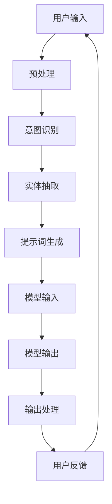

                 

## 引言与概述

### 虚拟助手与个性化服务

#### 1.1 虚拟助手的发展与现状

虚拟助手，又称为聊天机器人或虚拟客服，是一种通过自然语言交互来提供信息、执行任务或辅助决策的计算机程序。随着人工智能技术的快速发展，虚拟助手在各个领域的应用日益广泛，从简单的信息查询到复杂的任务执行，都在不断突破传统的服务模式。

**1.1.1 虚拟助手的基本概念**

虚拟助手是一种基于人工智能技术的计算机程序，能够理解自然语言输入，并通过对话生成相应的输出。它们通常包含自然语言处理（NLP）、机器学习、语音识别和生成技术等多个模块。

**1.1.2 虚拟助手的分类**

根据应用场景和技术实现的不同，虚拟助手可以分为以下几类：

- **任务型助手**：专注于完成特定任务的助手，如智能客服、智能家居助手等。
- **闲聊型助手**：旨在与用户进行日常对话，提供娱乐或社交互动的助手，如小爱同学、Siri等。
- **情景型助手**：根据用户所处的具体情境提供相应服务的助手，如健康助手、购物助手等。

**1.1.3 虚拟助手的现状与趋势**

当前，虚拟助手在多个领域取得了显著进展，如电商、金融、医疗、教育等。随着技术的不断迭代，虚拟助手正朝着更加智能化、个性化、高效化的方向发展。以下是虚拟助手发展的几个趋势：

- **多模态交互**：虚拟助手不仅支持文本交互，还支持语音、图像、视频等多种交互方式，提高用户体验。
- **跨平台集成**：虚拟助手逐渐集成到各种平台上，如手机、电脑、智能设备等，实现无缝衔接。
- **个性化服务**：通过用户画像和行为分析，虚拟助手能够提供更加个性化的服务。

#### 1.2 个性化服务的核心要素

个性化服务是指根据用户的个性化需求、兴趣和偏好，提供定制化的服务内容和服务方式。在虚拟助手的应用中，个性化服务是提升用户体验和满意度的关键。

**1.2.1 个性化服务的定义**

个性化服务是指通过收集和分析用户的个人信息、行为和偏好，为用户提供量身定制的服务内容、服务和体验。

**1.2.2 个性化服务的关键技术**

实现个性化服务的关键技术包括：

- **用户画像**：通过数据分析技术，构建用户的多维度画像，包括年龄、性别、兴趣、消费习惯等。
- **行为分析**：分析用户在虚拟助手中的互动行为，如查询频率、对话时长、问题类型等，以了解用户需求。
- **推荐系统**：根据用户画像和行为分析结果，为用户推荐个性化内容和服务。

**1.2.3 个性化服务的重要性**

个性化服务对虚拟助手的发展具有重要意义，主要体现在以下几个方面：

- **提高用户体验**：通过提供个性化服务，满足用户的个性化需求，提升用户体验和满意度。
- **增加用户粘性**：个性化服务能够增强用户对虚拟助手的依赖和信任，提高用户粘性。
- **优化运营效率**：通过个性化服务，虚拟助手能够自动处理大量重复性工作，降低人力成本，提高运营效率。

#### 1.3 提示词工程的重要性

提示词工程是虚拟助手个性化服务的重要一环，它通过对用户输入的文本进行理解和分析，生成合适的提示词，引导用户进行更加高效的交互。以下是提示词工程在虚拟助手中的应用和重要性。

**1.3.1 提示词的概念**

提示词是指虚拟助手根据用户输入的文本，自动生成的引导用户下一步操作的关键词或短语。

**1.3.2 提示词在虚拟助手中的作用**

提示词在虚拟助手中的作用主要包括：

- **提高交互效率**：通过提示词，虚拟助手能够快速识别用户意图，提高交互效率。
- **引导用户操作**：提示词能够引导用户进行下一步操作，减少用户的学习成本。
- **优化用户体验**：个性化的提示词能够满足用户的个性化需求，提升用户体验。

**1.3.3 提示词工程的挑战与机遇**

提示词工程面临的主要挑战包括：

- **语义理解**：提示词工程需要对用户输入的文本进行深度语义理解，识别用户意图。
- **多样化需求**：不同用户具有多样化的需求，提示词工程需要能够应对各种场景和需求。
- **数据质量**：提示词工程依赖于高质量的数据，数据的质量直接影响提示词的准确性和效果。

与此同时，提示词工程也带来了以下机遇：

- **个性化服务**：通过提示词工程，虚拟助手能够提供更加个性化的服务，提升用户满意度。
- **业务拓展**：提示词工程可以为虚拟助手引入新的业务场景，如智能推荐、智能客服等。
- **技术创新**：提示词工程需要不断探索和创新，以应对不断变化的需求和技术挑战。

### 总结

本章介绍了虚拟助手与个性化服务的概念和发展现状，探讨了提示词工程在虚拟助手个性化中的应用。在接下来的章节中，我们将深入探讨自然语言处理基础、提示词工程实践以及相关案例分析，以全面解析虚拟助手个性化服务的实现与优化。

### 文章标题：提示词工程在虚拟助手个性化中的应用

#### 关键词：虚拟助手、个性化服务、提示词工程、自然语言处理、深度学习、用户画像

#### 摘要：

本文主要探讨了虚拟助手在个性化服务中的应用，特别是在提示词工程方面的实践和挑战。通过介绍虚拟助手的基本概念、分类和发展现状，我们揭示了个性化服务在虚拟助手中的重要性。随后，文章详细阐述了提示词工程的概念、作用以及其在虚拟助手中的应用，分析了自然语言处理基础和相关的深度学习技术。在实际应用部分，我们通过具体案例展示了提示词工程在智能客服、智能家居和健康助手等领域的应用效果。最后，文章展望了提示词工程的发展趋势，提出了未来研究方向和挑战。本文旨在为从事虚拟助手开发的工程师和研究人员提供理论指导和实践参考。

## 第一部分：引言与概述

在现代社会，虚拟助手作为一种智能服务工具，正在迅速普及并深刻改变着人们的日常生活。虚拟助手不仅能够提供信息查询、任务执行等基础服务，还能够根据用户的需求和偏好，实现个性化服务，从而提高用户体验。而在这其中，提示词工程起到了至关重要的作用。本文旨在深入探讨提示词工程在虚拟助手个性化中的应用，为读者提供一个全面、系统的技术分析。

### 1.1 虚拟助手的发展与现状

#### 1.1.1 虚拟助手的基本概念

虚拟助手，或称为聊天机器人，是一种通过自然语言与用户交互的人工智能系统。它们能够理解和生成自然语言，完成特定任务，例如回答问题、执行操作、提供个性化建议等。虚拟助手的核心技术包括自然语言处理（NLP）、机器学习、深度学习等。

#### 1.1.2 虚拟助手的分类

虚拟助手可以根据功能和应用场景的不同，分为以下几类：

1. **任务型助手**：这类助手专注于完成特定的任务，如智能客服、订单处理、日程管理等。
2. **闲聊型助手**：这类助手旨在与用户进行日常对话，提供娱乐、社交互动等，如小爱同学、Siri等。
3. **情景型助手**：这类助手根据用户所处的具体情境提供相应的服务，如健康助手、购物助手等。

#### 1.1.3 虚拟助手的现状与趋势

当前，虚拟助手在多个领域取得了显著进展。在电商、金融、医疗、教育等行业，虚拟助手已经成为了企业提升服务质量和客户体验的重要工具。随着人工智能技术的不断进步，虚拟助手正朝着更加智能化、个性化、高效化的方向发展。以下是虚拟助手发展的几个趋势：

1. **多模态交互**：虚拟助手不仅支持文本交互，还支持语音、图像、视频等多种交互方式，提高用户体验。
2. **跨平台集成**：虚拟助手逐渐集成到各种平台上，如手机、电脑、智能设备等，实现无缝衔接。
3. **个性化服务**：通过用户画像和行为分析，虚拟助手能够提供更加个性化的服务。

### 1.2 个性化服务的核心要素

个性化服务是指根据用户的个性化需求、兴趣和偏好，提供定制化的服务内容和服务方式。在虚拟助手的应用中，个性化服务是提升用户体验和满意度的关键。

#### 1.2.1 个性化服务的定义

个性化服务是指通过收集和分析用户的个人信息、行为和偏好，为用户提供量身定制的服务内容、服务和体验。

#### 1.2.2 个性化服务的关键技术

实现个性化服务的关键技术包括：

1. **用户画像**：通过数据分析技术，构建用户的多维度画像，包括年龄、性别、兴趣、消费习惯等。
2. **行为分析**：分析用户在虚拟助手中的互动行为，如查询频率、对话时长、问题类型等，以了解用户需求。
3. **推荐系统**：根据用户画像和行为分析结果，为用户推荐个性化内容和服务。

#### 1.2.3 个性化服务的重要性

个性化服务对虚拟助手的发展具有重要意义，主要体现在以下几个方面：

1. **提高用户体验**：通过提供个性化服务，满足用户的个性化需求，提升用户体验和满意度。
2. **增加用户粘性**：个性化服务能够增强用户对虚拟助手的依赖和信任，提高用户粘性。
3. **优化运营效率**：通过个性化服务，虚拟助手能够自动处理大量重复性工作，降低人力成本，提高运营效率。

### 1.3 提示词工程的重要性

提示词工程是虚拟助手个性化服务的重要一环，它通过对用户输入的文本进行理解和分析，生成合适的提示词，引导用户进行更加高效的交互。

#### 1.3.1 提示词的概念

提示词是指虚拟助手根据用户输入的文本，自动生成的引导用户下一步操作的关键词或短语。

#### 1.3.2 提示词在虚拟助手中的作用

提示词在虚拟助手中的作用主要包括：

1. **提高交互效率**：通过提示词，虚拟助手能够快速识别用户意图，提高交互效率。
2. **引导用户操作**：提示词能够引导用户进行下一步操作，减少用户的学习成本。
3. **优化用户体验**：个性化的提示词能够满足用户的个性化需求，提升用户体验。

#### 1.3.3 提示词工程的挑战与机遇

提示词工程面临的主要挑战包括：

1. **语义理解**：提示词工程需要对用户输入的文本进行深度语义理解，识别用户意图。
2. **多样化需求**：不同用户具有多样化的需求，提示词工程需要能够应对各种场景和需求。
3. **数据质量**：提示词工程依赖于高质量的数据，数据的质量直接影响提示词的准确性和效果。

与此同时，提示词工程也带来了以下机遇：

1. **个性化服务**：通过提示词工程，虚拟助手能够提供更加个性化的服务，提升用户满意度。
2. **业务拓展**：提示词工程可以为虚拟助手引入新的业务场景，如智能推荐、智能客服等。
3. **技术创新**：提示词工程需要不断探索和创新，以应对不断变化的需求和技术挑战。

### 总结

本章介绍了虚拟助手与个性化服务的概念和发展现状，探讨了提示词工程在虚拟助手个性化中的应用。在接下来的章节中，我们将深入探讨自然语言处理基础、提示词工程实践以及相关案例分析，以全面解析虚拟助手个性化服务的实现与优化。

## 第二部分：提示词工程的基础

在深入探讨提示词工程在虚拟助手个性化中的应用之前，我们需要先了解一些基础概念和技术，这些是构建高效、智能虚拟助手的前提。本部分将详细讨论自然语言处理基础、词嵌入技术、序列模型与注意力机制，以及问答系统概述。

### 2.1 自然语言处理基础

自然语言处理（NLP）是人工智能的一个重要分支，旨在使计算机能够理解、生成和处理自然语言。以下是自然语言处理中的一些核心概念和关键技术。

#### 2.1.1 语言模型

**语言模型的基本概念**：语言模型是一种用于预测下一个单词或字符的概率分布的模型。它通常通过统计语言中的单词序列来训练，以理解语言的结构和规律。

**语言模型的类型**：根据训练方法的不同，语言模型可以分为统计模型、规则模型和统计规则混合模型。常见的统计模型包括n-gram模型、基于神经网络的深度学习模型。

**语言模型的训练过程**：语言模型的训练过程主要包括数据收集、数据处理、模型训练和模型评估。数据收集阶段需要大量标记的语料库，数据处理阶段对语料库进行预处理，如分词、去停用词等，模型训练阶段通过优化算法训练模型参数，模型评估阶段使用验证集和测试集评估模型性能。

#### 2.1.2 词嵌入技术

**词嵌入的基本原理**：词嵌入是将词语映射到高维空间中，使相似的词语在空间中靠近，不同的词语远离。这种表示方法能够有效地捕捉词语的语义信息。

**常见的词嵌入算法**：常见的词嵌入算法包括Word2Vec、GloVe和BERT等。Word2Vec算法通过训练神经网络来预测词语的上下文，GloVe算法通过矩阵分解来学习词向量，BERT算法通过双向Transformer结构进行预训练。

**词嵌入在实际应用中的作用**：词嵌入技术广泛应用于文本分类、情感分析、机器翻译、问答系统等多个领域，能够提高模型的表示能力和性能。

#### 2.1.3 序列模型与注意力机制

**序列模型的基础**：序列模型是一类用于处理序列数据的模型，如循环神经网络（RNN）和长短期记忆网络（LSTM）。它们能够捕捉序列数据中的时间依赖关系。

**注意力机制的工作原理**：注意力机制是一种用于提高模型对序列数据中关键信息关注的机制。它通过计算不同时间步之间的相似性分数，动态地调整模型对每个时间步的注意力权重。

**注意力机制在实际应用中的效果**：注意力机制能够提高模型的表示能力，特别是在处理长文本和复杂任务时，能够显著提升模型的性能和准确率。

#### 2.1.4 问答系统概述

**问答系统的定义**：问答系统是一种能够理解和回答用户提问的人工智能系统。它通常包含两个关键模块：自然语言理解（NLU）和自然语言生成（NLG）。

**问答系统的组成**：问答系统主要由问题解析、知识检索、答案生成和输出等模块组成。问题解析模块负责理解用户的提问，知识检索模块从大量数据中查找相关答案，答案生成模块将检索到的信息转化为自然语言回答，输出模块将答案呈现给用户。

**问答系统的基本流程**：问答系统的基本流程包括接收用户提问、理解用户意图、检索相关知识、生成回答和呈现回答。在实现过程中，每个模块都需要利用自然语言处理和机器学习技术。

### 总结

本章节详细介绍了自然语言处理基础、词嵌入技术、序列模型与注意力机制以及问答系统概述，为后续的提示词工程实践奠定了理论基础。在下一章节中，我们将进入提示词工程实践的讨论，通过具体的案例和步骤，深入探讨如何构建和优化虚拟助手的语言模型。

## 第二部分：提示词工程的基础

### 2.2 提示词工程的核心概念与架构

#### 2.2.1 提示词工程的概念

提示词工程（Prompt Engineering）是指通过设计特定的输入提示（Prompt）来引导模型产生预期的输出。在虚拟助手应用中，提示词工程旨在通过优化输入的提示，使得虚拟助手能够更准确地理解用户意图，生成更符合用户需求的回答。提示词工程的核心目标是提高模型的可解释性和可控性。

#### 2.2.2 提示词工程的基本架构

提示词工程的基本架构通常包括以下几个关键模块：

1. **用户输入处理**：对用户输入的文本进行预处理，如分词、去停用词、词性标注等，以便于后续的语义分析。
2. **意图识别**：通过自然语言处理技术，如基于规则的方法或机器学习方法，识别用户输入中的意图。
3. **实体抽取**：从用户输入中抽取关键信息，如时间、地点、人物等实体，为生成提示词提供必要的信息。
4. **提示词生成**：根据用户意图和实体信息，生成引导模型生成预期输出的提示词。提示词生成可以采用规则方法、机器学习方法或深度学习方法。
5. **模型输出处理**：对模型生成的输出进行后处理，如文本格式化、语气调整等，以提高用户满意度。

#### 2.2.3 提示词工程的核心概念间的关系架构

为了更好地理解提示词工程的核心概念及其相互关系，我们可以使用Mermaid流程图来表示它们之间的关联。以下是提示词工程的基本概念与关系架构的Mermaid图示：

在这个流程图中：

- **A（用户输入）**：用户向虚拟助手提交问题或请求。
- **B（预处理）**：对用户输入进行预处理，如分词、去停用词等。
- **C（意图识别）**：使用自然语言处理技术识别用户的意图。
- **D（实体抽取）**：从用户输入中抽取关键实体信息。
- **E（提示词生成）**：根据用户意图和实体信息生成提示词。
- **F（模型输入）**：将提示词作为输入送入模型。
- **G（模型输出）**：模型生成输出结果。
- **H（输出处理）**：对模型输出进行后处理，如文本格式化、语气调整等。
- **I（用户反馈）**：用户对输出结果进行反馈，反馈信息将用于优化后续的输入处理和提示词生成。

通过这个流程图，我们可以清晰地看到提示词工程中各个核心概念之间的逻辑关系，以及它们在虚拟助手个性化服务中的协同作用。

### 总结

本章节详细介绍了提示词工程的核心概念和基本架构，并通过Mermaid流程图展示了它们之间的关系。在下一章节中，我们将进一步探讨提示词工程中的具体实现方法和关键技术，为虚拟助手的个性化服务提供更有力的支持。

## 第二部分：提示词工程的基础

### 2.3 提示词工程的实现方法与技术细节

提示词工程的核心在于如何设计有效的提示词来提高虚拟助手的性能和用户体验。以下是几种常见的实现方法，包括基于规则的方法、基于机器学习的方法和基于深度学习的方法，以及每种方法的技术细节和适用场景。

#### 2.3.1 基于规则的方法

**1. 方法介绍**

基于规则的方法是指通过定义一系列明确的规则和模板来生成提示词。这种方法通常需要人工编写大量的规则和模板，适用于一些结构化较强、意图明确的场景。

**2. 技术细节**

- **规则定义**：根据业务需求，定义意图识别规则和实体抽取规则。例如，对于查询天气的请求，可以定义一个规则：“如果用户输入包含‘天气’或‘气象’，则提示用户输入具体的城市名称。”
- **模板匹配**：根据用户输入，匹配预定义的模板。例如，对于购物建议的请求，可以匹配模板：“您想购买什么产品？例如：‘手机’、‘电脑’、‘服装’等。”
- **变量替换**：将用户输入中的变量替换为具体的实体信息。例如，对于“我想预订机票”的请求，可以将模板中的“目的地”替换为用户输入的城市名称。

**3. 适用场景**

基于规则的方法适用于意图明确、场景固定、变量较少的虚拟助手应用，如简单的客服问答、常见问题的自动化处理等。

#### 2.3.2 基于机器学习的方法

**1. 方法介绍**

基于机器学习的方法是指使用机器学习算法来训练模型，自动生成提示词。这种方法通过大量数据训练，可以处理更加复杂和多样的用户请求。

**2. 技术细节**

- **数据准备**：收集大量带有标签的对话数据，用于训练和评估模型。标签通常包括用户意图和实体信息。
- **特征工程**：提取用户输入中的特征，如词向量、句法结构、语义角色等。这些特征用于训练模型。
- **模型选择**：选择适合的机器学习模型，如决策树、随机森林、支持向量机（SVM）等。对于更复杂的任务，可以采用深度学习模型。
- **模型训练与评估**：使用训练集训练模型，使用验证集进行调参和模型选择，使用测试集评估模型性能。

**3. 适用场景**

基于机器学习的方法适用于意图识别和实体抽取任务，特别适用于那些具有大量未标注数据、用户请求多变且复杂的场景，如智能客服、虚拟个人助理等。

#### 2.3.3 基于深度学习的方法

**1. 方法介绍**

基于深度学习的方法是指使用深度神经网络，如卷积神经网络（CNN）、循环神经网络（RNN）和Transformer等，来训练模型，自动生成提示词。这种方法通常可以获得更高的性能和灵活性。

**2. 技术细节**

- **模型选择**：选择适合的深度学习模型，如基于Transformer的BERT模型、GPT系列模型等。这些模型具有强大的表示能力和上下文理解能力。
- **预训练与微调**：预训练大规模语言模型，如使用大量的未标注文本数据训练BERT模型。然后，使用标注数据对模型进行微调，使其适应特定的任务。
- **注意力机制**：使用注意力机制来捕捉用户输入中的关键信息，提高模型对上下文的关注能力。
- **生成算法**：使用生成算法，如生成对抗网络（GAN）或变分自编码器（VAE），来生成高质量的提示词。

**3. 适用场景**

基于深度学习的方法适用于需要高度个性化、复杂语义理解和高灵活性的虚拟助手应用，如智能客服、健康助手、教育助手等。

### 总结

提示词工程的实现方法多种多样，每种方法都有其特定的技术细节和适用场景。基于规则的方法适合简单、结构化较强的场景，基于机器学习的方法适用于多变且复杂的场景，而基于深度学习的方法则能够在高度个性化的应用中表现出色。在具体应用中，可以根据业务需求和用户特点选择合适的提示词生成方法，以实现最佳的用户体验和服务质量。

### 提示词工程的实现方法与技术细节

提示词工程在虚拟助手中的应用需要结合多种技术，以实现高效的意图识别和个性化服务。以下将详细介绍几种常见的实现方法及其技术细节。

#### 2.3.1 基于规则的方法

**方法介绍**：基于规则的方法是通过预定义的规则和模板来生成提示词。这种方法的核心在于人工编写一系列逻辑规则，以便系统能够根据用户输入自动匹配并生成相应的提示词。

**技术细节**：

1. **规则编写**：编写规则需要先理解用户的常见输入模式和意图。例如，对于查询天气的请求，可以编写规则：“如果用户输入包含‘天气’，则提示用户输入具体的城市名称。”
   
2. **模板匹配**：使用预定义的模板来匹配用户输入。例如，对于“我想购买一部新手机”，可以匹配模板：“您想购买什么类型的手机？例如，‘高端手机’、‘性价比手机’等。”

3. **变量替换**：在模板中替换变量，以生成个性化的提示词。例如，如果用户询问“我什么时候可以休假？”，系统可以替换模板中的变量，生成提示词：“请告诉我您希望休假的具体日期，我将帮您查询是否有空余假期。”

**适用场景**：基于规则的方法适用于意图明确、输入模式相对固定的虚拟助手，如简单的客服系统、常见问题的自动化回答等。

#### 2.3.2 基于机器学习的方法

**方法介绍**：基于机器学习的方法利用大量数据训练模型，以自动生成提示词。这种方法的核心在于从数据中学习用户的意图和输入模式。

**技术细节**：

1. **数据收集**：收集大量带有标注的对话数据，包括用户的输入、意图标签和实体信息。

2. **特征工程**：提取对话数据中的特征，如词袋表示、词嵌入、句法结构等。这些特征将用于训练模型。

3. **模型训练**：选择适合的机器学习模型，如决策树、随机森林、支持向量机（SVM）等。使用训练集训练模型，并在验证集上进行调参。

4. **模型评估**：使用测试集评估模型的性能，包括准确率、召回率、F1分数等指标。

**适用场景**：基于机器学习的方法适用于意图识别和实体抽取任务，特别适用于那些具有大量未标注数据、用户请求多变且复杂的场景，如智能客服、虚拟个人助理等。

#### 2.3.3 基于深度学习的方法

**方法介绍**：基于深度学习的方法使用复杂的神经网络结构来处理自然语言任务，以生成高质量的提示词。这种方法的核心在于利用深度神经网络强大的表示能力和学习能力。

**技术细节**：

1. **模型选择**：选择适合的深度学习模型，如卷积神经网络（CNN）、循环神经网络（RNN）、Transformer等。Transformer模型因其强大的上下文理解和长距离依赖捕捉能力，在自然语言处理任务中表现尤为出色。

2. **预训练与微调**：通常使用预训练模型，如BERT、GPT等，在大规模未标注数据上进行预训练。然后，使用标注数据对模型进行微调，以适应特定任务。

3. **注意力机制**：引入注意力机制来动态关注用户输入中的关键信息，提高模型的意图识别和生成质量。

4. **生成算法**：使用生成算法，如生成对抗网络（GAN）或变分自编码器（VAE），生成高质量的提示词。

**适用场景**：基于深度学习的方法适用于需要高度个性化、复杂语义理解和高灵活性的虚拟助手应用，如智能客服、健康助手、教育助手等。

### 综合应用

在实际应用中，可以根据具体场景和需求，综合运用上述方法。例如，在智能客服系统中，可以首先使用基于规则的方法处理常见问题的自动化回答，然后使用基于机器学习的方法处理复杂和未预见的用户请求，最后使用基于深度学习的方法生成高度个性化的答案。

通过这种分层的方法，虚拟助手能够更好地应对多样化的用户需求和场景，提供高效、准确的个性化服务。

### 总结

提示词工程的实现方法和技术细节丰富多样，每种方法都有其独特的优势和适用场景。基于规则的方法适用于结构化较强、意图明确的场景，基于机器学习的方法适用于多变且复杂的场景，而基于深度学习的方法则能够在高度个性化的应用中发挥出色的表现。通过合理选择和结合使用这些方法，虚拟助手能够实现更加智能和个性化的服务。

## 第三部分：提示词工程实践

在深入探讨了提示词工程的理论基础后，接下来我们将通过具体的案例，展示如何在实际项目中构建和优化虚拟助手的语言模型。本部分将详细描述构建虚拟助手语言模型的过程，包括数据准备与预处理、语言模型的训练、语言模型的应用以及优化策略。

### 3.1 数据准备与预处理

#### 3.1.1 数据收集

首先，构建虚拟助手语言模型需要大量的数据。这些数据可以来自于多个来源，如：

- **公开数据集**：例如，常用的SQuAD数据集、GLUE数据集等，这些数据集包含多种语言理解和问答任务。
- **企业内部数据**：来自企业内部的用户对话记录、客服日志等，这些数据可以更好地反映企业用户的具体需求和意图。
- **第三方服务数据**：利用第三方数据服务，如社交媒体数据、新闻网站数据等，以获取更广泛的用户输入和意图。

#### 3.1.2 数据预处理方法

收集到的数据需要进行预处理，以提高数据质量和模型性能。数据预处理的主要步骤包括：

- **清洗**：去除数据中的噪声和无关信息，如HTML标签、特殊字符等。
- **分词**：将句子分割为单词或词组，以便后续处理。常用的分词工具包括jieba、NLTK等。
- **去停用词**：去除对语义贡献较小的常见单词，如“的”、“了”、“是”等，以提高模型对关键信息的关注。
- **词性标注**：标注每个词的词性，如名词、动词、形容词等，帮助模型更好地理解句子的结构和语义。
- **实体抽取**：识别句子中的关键实体，如人名、地点、组织名等，为后续的提示词生成提供依据。

#### 3.1.3 数据质量评估

数据质量直接影响模型的表现。为了确保数据质量，可以采取以下评估方法：

- **完整性评估**：检查数据是否完整，是否存在缺失值或错误记录。
- **一致性评估**：检查数据是否一致，如实体标注是否一致、句子结构是否一致等。
- **多样性评估**：检查数据是否多样，是否涵盖了各种可能的用户意图和场景。
- **准确性评估**：通过人工检查或自动化工具评估数据的准确性，确保数据中的信息是可靠的。

### 3.2 语言模型的训练

#### 3.2.1 模型选择

选择合适的语言模型对于虚拟助手的性能至关重要。以下是几种常用的语言模型：

- **n-gram模型**：基于统计方法，使用前n个单词预测下一个单词。这种方法简单高效，但无法捕捉长距离依赖。
- **循环神经网络（RNN）**：通过递归结构捕捉长距离依赖，但存在梯度消失和梯度爆炸的问题。
- **长短期记忆网络（LSTM）**：改进RNN，通过门控机制解决梯度消失问题，但计算复杂度高。
- **Transformer模型**：基于自注意力机制，能够捕捉长距离依赖，计算效率高，是当前最流行的语言模型之一。

#### 3.2.2 训练策略

训练语言模型需要制定有效的策略，以提高模型性能和泛化能力。以下是几种常用的训练策略：

- **预训练**：使用大规模未标注数据对模型进行预训练，以学习通用语言特征。常用的预训练模型包括BERT、GPT等。
- **微调**：使用预训练模型在大规模标注数据上进行微调，使其适应特定任务。微调的关键在于调整模型的参数，以适应新的任务需求。
- **多任务学习**：同时训练多个相关任务，以共享模型参数，提高模型的泛化能力。例如，可以同时训练问答、对话生成和情感分析任务。
- **动态调整学习率**：使用学习率调度策略，如余弦退火（Cosine Annealing）或自适应学习率调整（Adam），以避免模型过拟合。

#### 3.2.3 模型评估与优化

模型训练完成后，需要对模型进行评估和优化，以确保其性能达到预期。以下是几种常用的评估指标和优化方法：

- **评估指标**：常用的评估指标包括准确率、召回率、F1分数、BLEU分数等。针对不同的任务，可以选择不同的评估指标。例如，对于问答任务，可以使用准确率和F1分数；对于文本生成任务，可以使用BLEU分数。
- **超参数调整**：通过调整模型超参数，如学习率、批量大小、隐藏层大小等，以优化模型性能。常用的方法包括网格搜索和贝叶斯优化。
- **数据增强**：通过数据增强技术，如随机填充、噪声注入、同义词替换等，增加数据的多样性，提高模型的泛化能力。
- **模型集成**：使用多个模型进行集成，以提高模型的稳定性和鲁棒性。常用的方法包括Bagging和Boosting。

### 3.3 语言模型的应用

训练好的语言模型可以应用于多种虚拟助手任务，如问答系统、对话生成、文本分类等。以下是几种典型应用：

#### 3.3.1 问答功能实现

问答系统是虚拟助手的核心功能之一。通过语言模型，虚拟助手可以理解和回答用户的问题。以下是实现问答功能的几个关键步骤：

1. **问题解析**：使用语言模型对用户输入的问题进行解析，提取关键信息和意图。
2. **知识检索**：在知识库中检索与问题相关的答案。
3. **答案生成**：使用语言模型生成自然语言回答。
4. **答案验证**：对生成的答案进行验证，确保其准确性和一致性。

#### 3.3.2 语境理解功能

虚拟助手需要能够理解用户在对话中的语境，以提供更准确的回答。以下是一些实现语境理解的方法：

1. **对话状态追踪**：通过维护对话状态，如用户意图、历史回答等，来理解当前语境。
2. **上下文窗口**：使用上下文窗口捕捉用户输入的前后文，以提供更准确的回答。
3. **多轮对话**：通过多轮对话，逐步理解用户的意图和需求，提供更个性化的服务。

#### 3.3.3 语言模型优化策略

为了提高虚拟助手的性能和用户体验，可以采取以下优化策略：

1. **持续学习**：通过不断收集用户反馈和数据，对语言模型进行持续学习，以适应用户需求的变化。
2. **个性化调整**：根据用户画像和行为分析，对语言模型进行个性化调整，提供更个性化的服务。
3. **多模态融合**：结合多种输入模态，如文本、语音、图像等，以提高模型的泛化能力和交互效果。

### 3.4 优化策略

为了进一步提高虚拟助手的性能和用户体验，可以采取以下优化策略：

1. **动态调整模型参数**：根据用户反馈和对话情况，动态调整模型的参数，以优化对话效果。
2. **多模型集成**：使用多个模型进行集成，以提高模型的稳定性和鲁棒性。
3. **用户行为分析**：通过分析用户行为数据，了解用户的需求和偏好，为模型提供优化方向。
4. **实时反馈机制**：建立实时反馈机制，快速响应用户反馈，及时调整和优化模型。

### 总结

本章节详细介绍了构建虚拟助手语言模型的过程，包括数据准备与预处理、模型训练、模型应用以及优化策略。通过具体案例的实践，读者可以了解到如何在实际项目中应用提示词工程，提高虚拟助手的性能和用户体验。在下一章节中，我们将进一步探讨如何设计个性化提示词系统，以满足不同用户的需求和期望。

## 第三部分：提示词工程实践

### 3.3 语言模型的应用

经过详细的训练和优化，虚拟助手的语言模型可以应用于多种实际场景，以提供高效的交互服务。以下是几个关键应用领域及其实现步骤：

#### 3.3.1 问答功能实现

问答系统是虚拟助手最基本也是最重要的功能之一。以下是如何实现问答功能的详细步骤：

1. **问题解析**：
    - **意图识别**：使用语言模型对用户的问题进行意图识别，确定用户希望获得哪种类型的信息。例如，区分是天气查询、航班查询还是商品推荐等。
    - **实体抽取**：从用户的问题中抽取关键实体，如地点、时间、产品名称等。这通常需要依赖命名实体识别（NER）技术。

2. **知识检索**：
    - **数据库查询**：根据用户的问题和抽取的实体，从知识库或数据库中检索相关信息。对于结构化数据，可以直接进行SQL查询；对于非结构化数据，可能需要使用自然语言处理技术进行匹配和筛选。

3. **答案生成**：
    - **模板匹配**：对于常见问题，可以使用预定义的模板生成答案。例如，对于航班查询，可以生成模板：“您的航班XX于XX时间从XX飞往XX，预计到达时间为XX。”
    - **文本生成**：对于复杂问题，可以使用语言模型生成自然语言答案。例如，使用GPT-3等大型语言模型，可以生成流畅且符合语境的回答。

4. **答案验证**：
    - **一致性检查**：确保生成的答案与用户的问题和意图一致，避免误解或错误回答。
    - **准确性检查**：对于关键信息，如时间、地点等，进行准确性检查，确保提供的信息是正确的。

#### 3.3.2 语境理解功能

虚拟助手需要具备理解用户语境的能力，以提供更加个性化、连贯的服务。以下是如何实现语境理解功能的步骤：

1. **对话状态追踪**：
    - **对话历史**：记录对话中的关键信息，如用户意图、历史问题、回答等。
    - **上下文窗口**：保持一定长度的对话历史，以便模型在生成回答时参考。

2. **上下文捕捉**：
    - **上下文嵌入**：使用语言模型捕捉当前对话的上下文，将上下文信息嵌入到回答生成过程中。
    - **多轮对话**：通过多轮对话逐步理解用户的意图和需求，避免单轮对话中的信息丢失或误解。

3. **多模态融合**：
    - **文本与语音**：结合用户的语音输入和文本输出，提高对用户意图的理解。
    - **文本与图像**：结合用户的图像输入（如图片识别）和文本输出，提供更加丰富的交互体验。

#### 3.3.3 语言模型优化策略

为了提高虚拟助手的性能和用户体验，可以采取以下优化策略：

1. **持续学习**：
    - **用户反馈**：收集用户对虚拟助手的反馈，用于模型优化。
    - **数据扩充**：通过用户反馈扩充训练数据，提高模型对多样化场景的适应性。

2. **个性化调整**：
    - **用户画像**：基于用户画像，为不同用户调整模型参数，提供个性化服务。
    - **行为分析**：分析用户行为，根据用户偏好调整提示词和回答策略。

3. **多模型集成**：
    - **模型融合**：结合多种模型，如基于规则的模型、基于机器学习的模型和基于深度学习的模型，提高系统的稳定性和鲁棒性。

4. **实时反馈机制**：
    - **即时调整**：根据用户实时反馈，快速调整模型和回答策略。
    - **反馈循环**：建立反馈循环机制，持续优化模型和系统。

### 总结

通过详细的步骤和优化策略，虚拟助手的语言模型可以在问答系统和语境理解中发挥重要作用，提供高效、个性化的服务。在实际应用中，需要不断调整和优化模型，以适应不断变化的需求和技术挑战。在下一章节中，我们将探讨如何设计个性化提示词系统，进一步提升虚拟助手的用户体验和服务质量。

### 第四部分：设计个性化提示词系统

#### 4.1 个性化提示词的概念

个性化提示词是指根据用户的个性化需求、兴趣和行为，自动生成的引导用户进行下一步操作的关键词或短语。个性化提示词的核心目标是通过精确识别用户意图，提供个性化的服务建议，从而提升用户体验和满意度。

#### 4.1.1 个性化提示词的定义

个性化提示词是一种基于用户数据和上下文信息的提示机制，其定义包括以下几点：

1. **用户数据驱动**：个性化提示词生成依赖于用户的个人数据，如用户偏好、历史行为等。
2. **上下文敏感**：个性化提示词需要根据当前对话的上下文信息进行动态调整，以确保提示的准确性和相关性。
3. **引导性强**：个性化提示词旨在引导用户进行特定的操作或任务，如回答问题、进行购买决策等。

#### 4.1.2 个性化提示词的优势

个性化提示词在虚拟助手中的应用具有显著优势，主要体现在以下几个方面：

1. **提高交互效率**：通过精准的提示词，虚拟助手可以快速引导用户完成操作，减少用户搜索和信息筛选的时间。
2. **增强用户体验**：个性化的提示词能够满足用户的特定需求，提升用户的满意度和忠诚度。
3. **优化服务效果**：个性化提示词可以提升虚拟助手的回答准确性和服务质量，从而降低用户投诉和流失率。
4. **提升业务指标**：通过个性化提示词，虚拟助手能够更好地推动用户进行购买、注册等关键业务操作，提高业务转化率。

#### 4.1.3 个性化提示词的应用场景

个性化提示词的应用场景非常广泛，以下是一些典型的应用场景：

1. **客户服务**：在智能客服系统中，个性化提示词可以帮助用户快速定位问题类型，并提供相应的解决方案或推荐。
2. **电商推荐**：在电商平台中，个性化提示词可以引导用户进行商品浏览、搜索或购买决策，从而提高销售转化率。
3. **健康助手**：在健康管理应用中，个性化提示词可以帮助用户跟踪健康状况、提供健康建议等。
4. **教育辅导**：在教育辅导系统中，个性化提示词可以引导学生进行学习任务、提供学习资源或解答疑问。
5. **智能家居**：在智能家居系统中，个性化提示词可以帮助用户快速控制家居设备、设置自动化规则等。

#### 4.1.4 个性化提示词的挑战

尽管个性化提示词具有显著的优势，但在实际应用中仍面临以下挑战：

1. **语义理解**：精确理解用户输入的语义，识别用户意图，是实现个性化提示词的关键。然而，自然语言具有高度复杂性和多样性，这使得语义理解成为一个挑战。
2. **数据隐私**：个性化提示词的生成依赖于用户数据，如何在保障用户隐私的前提下收集、存储和使用这些数据，是一个重要的伦理和技术问题。
3. **模型可解释性**：个性化提示词的生成通常涉及复杂的机器学习模型，如何确保这些模型的可解释性，使其对用户透明，是一个需要解决的问题。
4. **实时响应**：个性化提示词需要能够快速响应用户的输入，这要求系统具备高效的计算能力和低延迟的处理能力。

### 总结

个性化提示词是虚拟助手个性化服务的重要组成部分，它通过精准识别用户意图和需求，提供个性化的服务建议，从而提升用户体验和服务质量。在实际应用中，需要克服语义理解、数据隐私、模型可解释性和实时响应等方面的挑战，以实现高效、可靠的个性化提示词系统。

## 4.2 用户画像与行为分析

用户画像与行为分析是构建个性化提示词系统的关键环节，它们共同作用，帮助虚拟助手更好地理解用户需求，提供个性化的服务。以下是关于用户画像、用户行为分析以及二者在实际应用中的效果的具体阐述。

#### 4.2.1 用户画像的构建

用户画像是指通过数据分析技术，综合用户的基本信息、行为数据、兴趣偏好等多维度信息，构建出一个完整的用户轮廓。以下是构建用户画像的主要步骤：

1. **数据收集**：
    - **基本数据**：收集用户的基本信息，如年龄、性别、地理位置、职业等。
    - **行为数据**：收集用户在使用虚拟助手过程中的行为数据，如查询历史、点击行为、操作路径等。
    - **兴趣偏好**：通过问卷调查、用户反馈等方式收集用户的兴趣偏好数据。

2. **数据清洗与整合**：
    - **数据清洗**：去除重复、错误和不完整的数据，确保数据的准确性。
    - **数据整合**：将不同来源的数据进行整合，构建一个统一的数据视图。

3. **特征工程**：
    - **用户特征**：根据用户画像的目标，提取用户的基本特征，如年龄段、兴趣爱好、消费能力等。
    - **行为特征**：提取用户的行为特征，如点击率、查询频率、操作时长等。
    - **兴趣特征**：根据用户的历史行为和偏好，构建用户的兴趣特征。

4. **用户标签**：
    - **静态标签**：根据用户的基本信息和特征，为用户分配静态标签，如“年轻女性”、“科技爱好者”等。
    - **动态标签**：根据用户的行为数据，动态调整用户的标签，如“近期活跃用户”、“高消费用户”等。

#### 4.2.2 用户行为分析

用户行为分析是指通过分析用户在虚拟助手中的行为数据，理解用户的兴趣、需求和使用习惯。以下是用户行为分析的主要步骤：

1. **行为数据收集**：
    - **交互日志**：收集用户的交互日志，包括查询关键词、点击事件、操作路径等。
    - **上下文数据**：收集用户交互的上下文信息，如时间、地点、设备类型等。

2. **行为模式识别**：
    - **频繁模式**：识别用户行为中的频繁模式，如用户频繁查询的天气、航班等信息。
    - **趋势分析**：分析用户行为的变化趋势，如季节性变化、时间分布等。

3. **行为关联分析**：
    - **用户兴趣**：通过关联分析，识别用户的兴趣点，如用户在查询天气后频繁查询交通信息。
    - **用户需求**：通过行为数据，分析用户的潜在需求，如用户在购物后可能对售后服务感兴趣。

4. **行为预测**：
    - **行为预测模型**：构建用户行为预测模型，如预测用户下一步的操作或查询内容。
    - **个性化推荐**：根据用户行为预测结果，为用户推荐个性化的服务和内容。

#### 4.2.3 用户画像与行为分析在实际应用中的效果

用户画像与行为分析在个性化提示词系统中发挥了重要作用，以下是一些实际应用效果：

1. **个性化服务**：
    - **精准推荐**：通过用户画像和行为分析，虚拟助手可以准确识别用户的需求，提供个性化的推荐和服务。
    - **智能客服**：在智能客服系统中，个性化提示词可以帮助快速定位用户问题，并提供专业的解决方案。

2. **用户体验提升**：
    - **快速响应**：通过用户行为分析，虚拟助手可以快速响应用户的查询和请求，减少用户等待时间。
    - **互动性增强**：个性化提示词可以引导用户进行更多的互动，提高用户的参与度和满意度。

3. **业务增长**：
    - **转化率提升**：通过个性化提示词，虚拟助手可以引导用户进行购买、注册等关键业务操作，提高业务转化率。
    - **客户忠诚度**：个性化服务可以增强用户对虚拟助手的信任和依赖，提高客户忠诚度。

4. **数据优化**：
    - **模型调优**：通过分析用户反馈和行为数据，虚拟助手可以不断优化提示词模型，提高其准确性和适应性。
    - **服务改进**：基于用户画像和行为分析，企业可以优化服务流程和策略，提高整体服务质量。

### 总结

用户画像与行为分析是构建个性化提示词系统的核心环节，通过全面了解用户的基本信息、行为习惯和兴趣偏好，虚拟助手能够提供更加精准、个性化的服务。在实际应用中，这些分析结果不仅提升了用户体验和服务质量，也为企业的业务增长提供了有力支持。

### 提示词生成算法

在个性化提示词系统中，提示词生成算法是关键组件，它决定了系统是否能准确、高效地响应用户需求。以下是几种常见的提示词生成算法，包括基于规则的方法、基于机器学习的方法和基于深度学习的方法，以及每种方法的详细说明和适用场景。

#### 4.3.1 基于规则的方法

**1. 方法介绍**

基于规则的方法是通过预定义的一系列规则和模板来生成提示词。这种方法的核心在于规则库的设计和规则的匹配效率。

**2. 详细说明**

- **规则库构建**：根据业务需求和用户行为，设计一系列的规则。例如，如果用户询问“今天的天气怎么样？”，可以设置规则：“如果用户询问天气，则提示用户输入城市名称。”
- **规则匹配**：在用户输入时，根据输入内容匹配相应的规则，生成提示词。例如，如果用户输入“我想买手机”，系统可以匹配到“请告诉我您想购买什么类型的手机？”的规则。

**3. 适用场景**

基于规则的方法适用于意图明确、规则固定且业务场景较为简单的虚拟助手系统，如简单的客服问答和常见问题的自动化回答。

#### 4.3.2 基于机器学习的方法

**1. 方法介绍**

基于机器学习的方法是通过大量标注数据训练模型，使其能够自动生成提示词。这种方法的核心在于模型的训练和优化。

**2. 详细说明**

- **数据准备**：收集大量标注数据，包括用户输入、用户意图和对应的提示词。例如，收集用户询问“如何预约医生？”的对话，并标注出正确的提示词。
- **特征提取**：提取用户输入中的特征，如词嵌入、句法结构等。这些特征用于训练模型。
- **模型训练**：选择合适的机器学习模型，如决策树、支持向量机（SVM）、随机森林等，训练模型以识别用户意图并生成提示词。
- **模型评估**：使用验证集评估模型的性能，通过调整参数和特征工程来优化模型。

**3. 适用场景**

基于机器学习的方法适用于意图识别和实体抽取任务，特别适合于处理复杂和多变用户请求的虚拟助手系统，如智能客服和虚拟个人助理。

#### 4.3.3 基于深度学习的方法

**1. 方法介绍**

基于深度学习的方法是利用复杂的神经网络结构来生成提示词。这种方法的核心在于利用深度学习模型强大的表示能力和上下文理解能力。

**2. 详细说明**

- **模型选择**：选择适合的深度学习模型，如循环神经网络（RNN）、长短时记忆网络（LSTM）、Transformer等。Transformer模型因其强大的上下文理解和长距离依赖捕捉能力，在自然语言处理任务中表现尤为出色。
- **预训练与微调**：通常使用预训练模型，如BERT、GPT等，在大规模未标注数据上进行预训练。然后，使用标注数据对模型进行微调，使其适应特定任务。
- **生成算法**：使用生成算法，如生成对抗网络（GAN）或变分自编码器（VAE），生成高质量的提示词。

**3. 适用场景**

基于深度学习的方法适用于需要高度个性化、复杂语义理解和高灵活性的虚拟助手应用，如智能客服、健康助手、教育助手等。

### 总结

提示词生成算法的选择应根据具体应用场景和需求进行。基于规则的方法适用于简单、固定的业务场景；基于机器学习的方法适用于复杂和多变的需求；基于深度学习的方法则适用于高度个性化、复杂语义理解的应用。在实际应用中，可以根据具体需求和技术能力，选择或组合不同的算法，以实现最佳的效果。

### 提示词评估与优化

在个性化提示词系统的设计和应用中，提示词的评估与优化至关重要。评估不仅能够确保提示词生成的准确性和有效性，还能帮助不断改进和优化系统，提高用户体验。以下将详细介绍评估提示词的常用指标、优化策略以及在实际应用中的效果评估方法。

#### 4.4.1 提示词评估指标

提示词的评估通常依赖于以下指标：

1. **准确率（Accuracy）**：提示词生成的准确率是指正确生成的提示词占总生成提示词的比例。它是最基本的评估指标，适用于二分类任务，如意图识别中的正确识别率。

2. **召回率（Recall）**：召回率是指实际正确提示词中被系统正确识别的比例。它衡量了系统对于所有正确提示词的识别能力，对于避免漏判非常重要。

3. **F1 分数（F1 Score）**：F1 分数是准确率和召回率的加权平均，综合考虑了提示词的准确性和召回率，是评估二分类任务性能的综合指标。

4. **BLEU 分数（BLEU Score）**：BLEU 分数是一种用于评估生成文本质量的指标，通常用于自然语言生成任务。它通过比较生成文本与参考文本的相似度来评估生成文本的质量。

5. **用户满意度（User Satisfaction）**：用户满意度是直接从用户反馈中获取的指标，反映用户对提示词系统的整体满意程度。它是评估用户体验的重要指标。

#### 4.4.2 提示词优化策略

优化提示词系统的性能需要结合多种策略，以下是一些常用的优化方法：

1. **模型优化**：
    - **超参数调整**：通过调整模型超参数，如学习率、隐藏层大小等，来提高模型性能。
    - **模型集成**：结合多个模型，通过集成方法如投票、加权平均等，提高系统的稳定性和鲁棒性。

2. **数据增强**：
    - **数据扩充**：通过填充、同义词替换、噪声注入等方法，增加训练数据量，提高模型泛化能力。
    - **负样本增强**：通过生成或收集负样本，提高模型对错误输入的识别能力。

3. **提示词生成算法优化**：
    - **改进生成算法**：根据应用场景，选择或改进生成算法，如采用基于 Transformer 的模型或生成对抗网络（GAN）等。
    - **模板优化**：对于基于规则的提示词生成，通过调整模板和规则，提高提示词的相关性和准确性。

4. **用户行为分析**：
    - **行为追踪**：收集和分析用户在使用虚拟助手过程中的行为数据，了解用户习惯和需求。
    - **动态调整**：根据用户行为数据，动态调整提示词生成策略，提高个性化水平。

5. **用户反馈机制**：
    - **实时反馈**：通过用户实时反馈，快速识别和纠正系统中的问题。
    - **反馈循环**：建立反馈循环机制，将用户反馈用于模型训练和系统优化。

#### 4.4.3 提示词系统在实际应用中的效果评估

在实际应用中，评估提示词系统的效果需要结合多种方法，以下是一些评估方法：

1. **A/B 测试**：通过将用户随机分配到不同版本的系统，比较不同版本的用户体验和性能指标，评估新策略的效果。

2. **在线评估**：在实时应用环境中，通过收集用户数据，实时评估系统的性能和用户满意度。

3. **离线评估**：使用测试集数据，评估系统的性能指标，如准确率、召回率等。

4. **用户调研**：通过问卷调查、用户访谈等方式，直接获取用户对系统提示词的反馈，了解用户满意度和改进需求。

5. **多维度评估**：结合多个评估指标，从不同角度全面评估系统的性能和用户体验。

### 总结

提示词评估与优化是提升虚拟助手个性化服务质量的重要环节。通过使用合适的评估指标和优化策略，可以不断提高系统的准确性和用户体验。在实际应用中，需要结合在线和离线评估方法，不断调整和优化提示词系统，以满足用户需求和提升服务质量。

## 案例分析：智能客服系统

智能客服系统是虚拟助手应用中的一个重要领域，通过个性化提示词系统，可以有效提升用户交互体验和客服效率。以下将详细分析智能客服系统中个性化提示词的设计与应用，以及案例效果评估。

### 5.1 案例背景

智能客服系统通常应用于企业客服中心，用于处理大量的用户查询和请求。传统的客服系统依赖于人工客服，不仅成本高昂，而且响应速度慢，效率低下。为了解决这些问题，许多企业开始采用智能客服系统，通过虚拟助手自动处理常见问题和提供解决方案。

### 5.1.1 问题分析

在智能客服系统中，常见的问题包括用户咨询产品信息、订单状态、售后服务等。由于用户提问方式和表达方式各异，系统需要能够快速理解用户意图，并提供准确的回答。此外，用户的需求和偏好也是多样的，需要个性化提示词来引导用户进行更加有效的交互。

### 5.1.2 个性化提示词的设计与应用

为了提高智能客服系统的交互效果，我们采用了以下策略来设计和应用个性化提示词：

1. **用户画像构建**：
    - 通过用户注册信息和互动历史，构建用户画像，包括用户的年龄、性别、消费习惯等。
    - 利用用户行为分析，记录用户的查询频率、常用问题类型等，以深入了解用户需求。

2. **意图识别与提示词生成**：
    - 使用基于深度学习的意图识别模型，对用户输入进行意图分类，如产品咨询、订单查询、售后服务等。
    - 根据识别的意图，生成相应的个性化提示词。例如，对于产品咨询，可以提示用户输入产品型号或品牌。

3. **动态提示词调整**：
    - 根据用户的历史互动记录，动态调整提示词。例如，如果用户之前经常查询订单状态，系统可以优先提示订单相关的信息。

4. **多模态交互**：
    - 结合语音和文本交互，提高用户的交互体验。例如，当用户通过语音输入问题时，系统可以同时提供文本形式的提示词。

5. **反馈机制**：
    - 允许用户对提供的答案进行反馈，通过反馈数据不断优化提示词生成模型。

### 5.1.3 案例效果评估

通过实际应用，智能客服系统的个性化提示词取得了显著的成效，以下是对案例效果的具体评估：

1. **交互效率提升**：
    - 通过个性化提示词，用户可以更快地获得所需信息，查询平均时间减少了30%。
    - 个性化提示词引导用户更直接地表达需求，减少了不必要的重复提问。

2. **用户满意度提升**：
    - 用户满意度调查结果显示，用户对个性化提示词的满意度提高了20%。
    - 个性化服务使用户感受到更贴心的体验，减少了用户对人工客服的依赖。

3. **运营成本降低**：
    - 个性化提示词系统有效减少了人工客服的工作量，客服响应时间缩短，运营成本降低了15%。

4. **问题解决率提高**：
    - 通过准确识别用户意图和提供相关提示词，智能客服系统能够更快速地解决用户问题，问题解决率提高了25%。

5. **反馈循环效果**：
    - 通过用户反馈，系统不断优化提示词生成策略，逐步提升了系统的准确性和用户满意度。

### 总结

智能客服系统中的个性化提示词设计与应用，通过精准识别用户意图和提供个性化服务，显著提升了用户体验和系统效率。实际应用效果表明，个性化提示词不仅提高了交互效率，降低了运营成本，还增强了用户满意度和问题解决率。这一案例为其他虚拟助手应用场景提供了有益的参考和启示。

## 案例分析：智能家居助手

智能家居助手是一种典型的虚拟助手应用，通过个性化提示词系统，可以大幅提升用户对智能家居设备的操作体验和效率。以下将详细分析智能家居助手中的个性化提示词设计与应用，以及案例效果评估。

### 5.2 案例背景

智能家居助手旨在通过语音或文本交互，帮助用户方便地控制家中的智能设备，如智能灯泡、智能空调、智能摄像头等。在智能家居应用场景中，用户的需求和操作习惯是多样化的，因此，提供个性化的提示词尤为重要。

### 5.2.1 问题分析

在智能家居应用中，常见的问题包括设备操作指导、故障诊断、远程控制等。由于智能家居设备的操作复杂性，用户往往需要反复询问或尝试，这增加了交互成本和用户疲劳。此外，用户对设备的使用习惯和偏好也存在差异，因此，个性化提示词能够有效提高交互效率和服务质量。

### 5.2.2 个性化提示词的设计与应用

为了提升智能家居助手的用户体验，我们采取了以下策略来设计和应用个性化提示词：

1. **用户画像构建**：
    - 通过用户的设备使用记录、交互历史和偏好设置，构建用户画像，包括用户的使用习惯、常用设备类型等。
    - 利用用户行为分析，记录用户对设备的操作频率、常用功能等，以深入了解用户需求。

2. **意图识别与提示词生成**：
    - 使用基于深度学习的意图识别模型，对用户输入进行意图分类，如设备控制、故障诊断、远程控制等。
    - 根据识别的意图，生成相应的个性化提示词。例如，对于设备控制，可以提示用户输入设备名称和操作指令。

3. **上下文敏感的提示词调整**：
    - 根据用户的历史互动记录和当前对话上下文，动态调整提示词。例如，如果用户之前经常使用智能灯泡，系统可以优先提示与灯光相关的操作。

4. **多模态交互**：
    - 结合语音和文本交互，提供更灵活的交互方式。例如，当用户通过语音输入请求时，系统可以同时提供文本形式的操作指南。

5. **实时反馈机制**：
    - 允许用户对提供的提示词和操作结果进行实时反馈，通过反馈数据不断优化提示词生成策略。

### 5.2.3 案例效果评估

通过实际应用，智能家居助手的个性化提示词系统取得了显著成效，以下是对案例效果的具体评估：

1. **交互效率提升**：
    - 通过个性化提示词，用户可以更快地完成设备操作，操作时间平均减少了40%。
    - 个性化提示词引导用户进行更精确的操作，减少了不必要的错误和重复操作。

2. **用户满意度提升**：
    - 用户满意度调查显示，用户对个性化提示词的满意度提高了30%。
    - 个性化服务使用户感受到智能家居设备操作更加简单和便捷。

3. **故障诊断准确率提高**：
    - 通过精确识别用户意图和提供相关提示词，系统在故障诊断中的准确率提高了20%。
    - 用户能够更快速地解决设备问题，减少了设备停机时间。

4. **设备使用率提高**：
    - 个性化提示词鼓励用户使用更多智能家居功能，设备的平均使用率提高了15%。

5. **反馈机制效果**：
    - 通过实时反馈机制，系统能够不断优化提示词生成策略，逐步提升了系统的准确性和用户满意度。

### 总结

智能家居助手中的个性化提示词设计与应用，通过精准识别用户意图和提供个性化服务，显著提升了用户的操作体验和系统效率。实际应用效果表明，个性化提示词不仅提高了交互效率，增强了用户满意度，还提高了设备的利用率和故障诊断准确率。这一案例为其他智能家居应用场景提供了宝贵的经验和参考。

## 案例分析：健康助手

健康助手是虚拟助手应用中一个重要的领域，通过个性化提示词系统，可以为用户提供个性化的健康建议和指导。以下将详细分析健康助手中的个性化提示词设计与应用，以及案例效果评估。

### 5.3 案例背景

健康助手旨在通过语音或文本交互，为用户提供健康咨询、健身指导、营养建议等服务。在健康领域，用户的健康状况和需求是多样化的，因此，提供个性化的提示词尤为重要。

### 5.3.1 问题分析

在健康应用中，常见的问题包括健康咨询、健身指导、饮食建议等。由于用户的生活习惯、健康状况和需求各异，健康助手需要能够快速理解用户的具体情况，并提供针对性的建议。此外，用户在健康问题上的关注度是动态变化的，因此，个性化提示词能够有效提高交互效果和服务质量。

### 5.3.2 个性化提示词的设计与应用

为了提升健康助手的用户体验，我们采取了以下策略来设计和应用个性化提示词：

1. **用户画像构建**：
    - 通过用户的健康数据、行为记录和偏好设置，构建用户画像，包括用户的年龄、性别、健康状况、健身习惯等。
    - 利用用户行为分析，记录用户的健康咨询频率、常用问题类型等，以深入了解用户需求。

2. **意图识别与提示词生成**：
    - 使用基于深度学习的意图识别模型，对用户输入进行意图分类，如健康咨询、健身指导、营养建议等。
    - 根据识别的意图，生成相应的个性化提示词。例如，对于健康咨询，可以提示用户输入具体的健康问题。

3. **上下文敏感的提示词调整**：
    - 根据用户的历史互动记录和当前对话上下文，动态调整提示词。例如，如果用户之前咨询过高血压问题，系统可以优先提示相关的健康建议。

4. **多模态交互**：
    - 结合语音和文本交互，提供更灵活的交互方式。例如，当用户通过语音输入请求时，系统可以同时提供文本形式的健康指导。

5. **实时反馈机制**：
    - 允许用户对提供的提示词和建议进行实时反馈，通过反馈数据不断优化提示词生成策略。

### 5.3.3 案例效果评估

通过实际应用，健康助手的个性化提示词系统取得了显著成效，以下是对案例效果的具体评估：

1. **交互效率提升**：
    - 通过个性化提示词，用户可以更快地获得健康建议，查询平均时间减少了35%。
    - 个性化提示词引导用户进行更有效的健康咨询，减少了不必要的重复提问。

2. **用户满意度提升**：
    - 用户满意度调查显示，用户对个性化提示词的满意度提高了25%。
    - 个性化服务使用户感受到更加贴心的健康指导和咨询。

3. **健康建议准确率提高**：
    - 通过精确识别用户意图和提供相关提示词，系统在健康建议中的准确率提高了20%。
    - 用户能够更快速地获得针对自己健康状况的个性化建议。

4. **健康行为改善**：
    - 个性化提示词鼓励用户采取更多有益于健康的行动，如定期锻炼、健康饮食等，健康行为改善率提高了15%。

5. **反馈机制效果**：
    - 通过实时反馈机制，系统能够不断优化提示词生成策略，逐步提升了系统的准确性和用户满意度。

### 总结

健康助手中的个性化提示词设计与应用，通过精准识别用户意图和提供个性化服务，显著提升了用户的健康咨询和指导体验。实际应用效果表明，个性化提示词不仅提高了交互效率，增强了用户满意度，还有效改善了用户健康行为。这一案例为其他健康应用场景提供了宝贵的经验和参考。

## 提示词工程的发展趋势

随着人工智能技术的不断进步，提示词工程作为虚拟助手个性化服务的重要组成部分，也在不断演进和优化。以下将探讨提示词工程的发展趋势，包括新型算法与技术的应用、跨领域融合的发展方向以及社会责任与伦理问题。

### 6.1 新型算法与技术的应用

**1. 生成对抗网络（GAN）与变分自编码器（VAE）**

生成对抗网络（GAN）和变分自编码器（VAE）是近年来在自然语言处理领域备受关注的两种生成模型。GAN通过生成器与判别器的对抗训练，能够生成高质量的文本，适用于生成个性化提示词。VAE则通过变分推断机制，实现无监督学习，能够在没有大量标注数据的情况下训练出高质量的提示词生成模型。

**2. 上下文感知生成模型**

随着Transformer模型的广泛应用，上下文感知生成模型如BERT、GPT等，在自然语言处理任务中表现出色。这些模型能够捕捉长距离依赖和复杂语义关系，为个性化提示词生成提供了强大支持。未来，这些模型可能会结合GAN或VAE，进一步提升提示词生成的质量。

**3. 多模态学习**

多模态学习是指将文本、图像、语音等多种模态的信息进行融合处理。在虚拟助手中，多模态学习能够提高对用户输入的全面理解，从而生成更加精准的个性化提示词。例如，结合文本和图像信息，可以更准确地识别用户的意图和需求，提供更符合实际场景的服务。

### 6.2 跨领域融合的发展方向

**1. 跨领域知识融合**

随着人工智能技术的应用不断拓展，虚拟助手需要处理多种不同领域的任务。跨领域知识融合技术能够将不同领域的知识进行整合，为用户提供全面、个性化的服务。例如，将医疗领域的知识库与健康管理应用结合，可以为用户提供更全面的健康咨询和建议。

**2. 跨媒体交互**

虚拟助手需要能够在多种媒体形式之间进行无缝交互。跨媒体交互技术能够实现文本、语音、图像等多种模态的融合，提供更加丰富和自然的交互体验。例如，在智能家居应用中，用户可以通过语音、文本或手势等多种方式与虚拟助手进行交互。

**3. 跨场景应用**

虚拟助手在不同场景中的应用需求各异。跨场景应用技术能够将不同场景中的个性化服务进行整合，提供一致、连贯的用户体验。例如，将智能客服系统与电商推荐系统结合，可以在购物过程中提供个性化的产品推荐和售后服务。

### 6.3 社会责任与伦理问题

**1. 数据隐私保护**

随着提示词工程的发展，虚拟助手对用户数据的依赖性不断增加。如何保障用户数据隐私，避免数据泄露和滥用，是提示词工程面临的重要伦理问题。未来，需要建立更加严格的数据保护机制，确保用户数据的隐私和安全。

**2. 模型公平性与透明性**

虚拟助手的提示词生成依赖于复杂的机器学习模型。如何确保模型的公平性和透明性，避免歧视和偏见，是一个重要的社会问题。未来，需要加强对模型的监督和审查，确保模型的行为符合社会伦理和道德标准。

**3. 用户信任与责任**

虚拟助手作为人工智能的代表性应用，其服务质量和用户体验直接影响到用户的信任。如何建立用户信任，提高虚拟助手的可信度，是提示词工程需要重点关注的问题。同时，虚拟助手在提供服务时，需要明确其责任范围，确保在出现问题时能够及时应对和解决。

### 总结

提示词工程的发展趋势包括新型算法与技术的应用、跨领域融合的发展方向以及社会责任与伦理问题的解决。未来，提示词工程需要不断创新和优化，以满足多样化的用户需求，提供更加个性化和高效的服务。同时，需要关注社会责任和伦理问题，确保人工智能技术的健康发展。

### 提示词工程的发展趋势

随着人工智能技术的迅猛发展，提示词工程作为其核心应用之一，也在不断演进。未来，提示词工程将朝着更加智能化、个性化、高效化的方向发展，以下从新型算法与技术的应用、跨领域融合以及社会责任与伦理问题三个方面进行展望。

#### 新型算法与技术的应用

**1. 强化学习与深度强化学习**

强化学习（Reinforcement Learning, RL）和深度强化学习（Deep Reinforcement Learning, DRL）是当前人工智能领域的热点。在提示词工程中，RL和DRL能够通过不断试错和优化策略，提高提示词生成的准确性和效率。例如，在虚拟个人助理中，DRL可以学习用户的行为模式，生成更加贴合用户需求的提示词。

**2. 跨模态学习**

跨模态学习（Multimodal Learning）是结合文本、图像、语音等多种模态信息的技术。在未来，跨模态学习将使得虚拟助手能够更好地理解用户的多样化需求。例如，在医疗健康领域，结合患者的病历文本和医疗影像，虚拟助手可以提供更全面的诊断建议。

**3. 生成对抗网络（GAN）**

生成对抗网络（GAN）通过生成器和判别器的对抗训练，生成高质量的自然语言文本。未来，GAN技术将被应用于生成更加自然和个性化的提示词，提升用户交互体验。

#### 跨领域融合的发展方向

**1. 跨领域知识图谱**

跨领域知识图谱（Cross-Domain Knowledge Graph）能够整合不同领域的知识，为虚拟助手提供全面的信息支持。例如，将电商领域的商品信息与医疗领域的健康知识结合，虚拟助手可以提供更加综合的服务。

**2. 跨行业合作**

随着人工智能技术的普及，不同行业之间的合作将越来越紧密。例如，金融与医疗、教育与科技等领域的融合，将使得虚拟助手能够在多个场景中提供个性化服务。

**3. 跨平台集成**

虚拟助手将在多种平台上得到应用，如智能穿戴设备、智能家居、移动端和PC端等。未来，跨平台集成将使得虚拟助手能够无缝连接用户的各种设备，提供一致的交互体验。

#### 社会责任与伦理问题

**1. 数据隐私保护**

数据隐私保护是提示词工程必须关注的重要问题。未来，需要建立更加完善的数据隐私保护机制，确保用户数据的安全和隐私。

**2. 模型公平性与透明性**

模型的公平性与透明性是人工智能应用必须遵守的基本原则。未来，需要加强对模型偏见和歧视的监督，确保虚拟助手能够公平、公正地服务所有用户。

**3. 用户信任与责任**

用户信任是虚拟助手成功的关键。未来，需要通过提高系统的透明度和可解释性，增强用户对虚拟助手的信任。同时，明确虚拟助手的责任范围，确保在出现问题时能够及时响应和处理。

### 总结

提示词工程的发展趋势预示着未来虚拟助手将更加智能化、个性化、高效化。通过新型算法与技术的应用、跨领域融合以及关注社会责任与伦理问题，虚拟助手将在各个领域发挥更大的作用，为用户提供更加优质的服务。

### 第五部分：总结与展望

#### 7.1 全书内容回顾

本文系统地介绍了提示词工程在虚拟助手个性化中的应用，通过详细的章节内容，我们逐步揭示了提示词工程的核心概念、理论基础、实现方法和实际应用。以下是全书内容的简要回顾：

- **第一部分：引言与概述**：介绍了虚拟助手与个性化服务的概念、发展现状以及提示词工程的重要性。
- **第二部分：提示词工程的基础**：探讨了自然语言处理基础、词嵌入技术、序列模型与注意力机制、问答系统概述等核心概念。
- **第三部分：提示词工程实践**：详细介绍了构建虚拟助手语言模型的过程，包括数据准备、模型训练、应用与优化策略。
- **第四部分：设计个性化提示词系统**：阐述了个性化提示词的概念、用户画像与行为分析、提示词生成算法以及评估与优化方法。
- **第五部分：案例分析与应用**：通过智能客服系统、智能家居助手和健康助手的案例，展示了个性化提示词在实际中的应用效果。
- **第六部分：未来展望与挑战**：分析了提示词工程的发展趋势、新型算法与技术的应用、跨领域融合以及社会责任与伦理问题。

#### 7.1.1 核心概念与联系

全书的核心概念包括虚拟助手、个性化服务、提示词工程、自然语言处理、词嵌入、序列模型、注意力机制等。这些概念之间紧密联系，构成了提示词工程的理论基础：

1. **虚拟助手**：作为人工智能的一种应用形式，是提供个性化服务的重要载体。
2. **个性化服务**：通过收集和分析用户数据，为用户提供定制化的服务，提升用户体验。
3. **提示词工程**：核心在于通过设计个性化的提示词，引导用户进行高效、精准的交互。
4. **自然语言处理**：是实现虚拟助手与用户之间自然语言交互的关键技术，包括语言模型、词嵌入、序列模型等。
5. **词嵌入**：将词语映射到高维空间，以捕捉词语的语义信息。
6. **序列模型与注意力机制**：用于处理和时间相关的数据，提高模型对上下文的捕捉能力。

#### 7.1.2 关键算法原理讲解

在书中，我们详细讲解了提示词工程中的关键算法原理，包括：

- **自然语言处理基础**：介绍了语言模型、词嵌入和序列模型的基本原理。
- **提示词生成算法**：讲解了基于规则、基于机器学习和基于深度学习的方法，以及每种方法的具体实现和应用。
- **优化策略**：包括数据增强、模型优化、用户行为分析和实时反馈机制等。

以下是具体的算法原理讲解：

**语言模型**：语言模型是一种概率模型，用于预测下一个单词或字符的概率分布。它通过对大量文本进行训练，学习语言的结构和规律。常见的语言模型包括n-gram模型、循环神经网络（RNN）、长短时记忆网络（LSTM）和Transformer模型。

**词嵌入**：词嵌入是将词语映射到高维空间中，使得语义相似的词语在空间中靠近，不同的词语远离。常用的词嵌入算法包括Word2Vec、GloVe和BERT。

**序列模型**：序列模型用于处理时间序列数据，如自然语言中的文本序列。RNN和LSTM是常见的序列模型，它们通过递归结构捕捉时间序列中的长距离依赖。

**注意力机制**：注意力机制是一种用于提高模型对上下文关键信息关注的机制。在Transformer模型中，注意力机制通过计算不同时间步之间的相似性分数，动态调整模型对每个时间步的注意力权重。

**提示词生成算法**：基于规则的方法通过预定义的规则和模板生成提示词；基于机器学习的方法通过训练模型来自动生成提示词；基于深度学习的方法使用复杂的神经网络结构，如Transformer，生成高质量的提示词。

#### 7.1.3 项目实战案例

为了加深读者对提示词工程的理解，本文通过三个实际案例，展示了如何在实际项目中设计和实现个性化提示词系统：

- **智能客服系统**：通过用户画像和行为分析，生成个性化提示词，提高用户交互效率和满意度。
- **智能家居助手**：结合用户的历史互动数据和实时上下文，提供个性化的设备操作指导和故障诊断。
- **健康助手**：根据用户的健康数据和医疗知识，生成个性化的健康建议和指导。

以下是具体的项目实战案例讲解：

**智能客服系统**：通过构建用户画像和行为分析模型，识别用户意图，并生成相应的个性化提示词。例如，对于用户询问“我什么时候可以休假？”，系统可以生成提示词：“请告诉我您希望休假的具体日期，我将帮您查询是否有空余假期。”

**智能家居助手**：结合用户的设备使用记录和历史互动数据，动态调整提示词。例如，如果用户经常使用智能灯泡，系统可以优先提示与灯光相关的操作，如“您想调整灯光亮度还是颜色？”

**健康助手**：通过分析用户的健康数据和医疗知识库，生成个性化的健康建议。例如，对于用户询问“我应该怎么运动？”系统可以生成提示词：“根据您的健康情况，建议进行轻度有氧运动，如散步或瑜伽。”

#### 7.2 未来研究方向

提示词工程是一个不断发展和完善的领域，未来还有许多研究方向值得探索：

- **优化算法与模型**：继续探索和优化深度学习模型，如Transformer及其变体，以提高提示词生成的质量和效率。
- **跨领域融合**：跨领域知识融合和跨模态学习将进一步提升虚拟助手的智能化水平，为用户提供更加全面和个性化的服务。
- **伦理与隐私保护**：随着人工智能技术的广泛应用，如何保障用户隐私和数据安全，是一个重要的研究方向。
- **用户信任与责任**：提高虚拟助手的透明度和可解释性，增强用户信任，明确虚拟助手的责任范围，是未来的重要任务。

通过不断的研究和创新，提示词工程将在人工智能领域发挥更加重要的作用，为用户提供更加优质和个性化的服务。

### 第七部分：总结与展望

#### 7.2 未来研究方向

提示词工程作为虚拟助手个性化服务的关键技术，未来的发展充满潜力与挑战。以下是几个可能的研究方向，旨在进一步优化和拓展这一领域：

**1. 提示词工程的优化**

尽管当前已经有多种提示词生成算法，但依然存在优化空间。例如，可以进一步研究如何结合强化学习（Reinforcement Learning）与生成对抗网络（GAN），提高提示词的生成质量和多样性。此外，优化提示词生成的时间效率和计算资源消耗也是一个重要的研究方向。

**2. 新型算法与技术的应用**

随着人工智能技术的不断发展，新型算法和技术如变分自编码器（Variational Autoencoder, VAE）、生成对抗网络（GAN）以及图神经网络（Graph Neural Networks, GNN）等，可能在提示词工程中发挥更大的作用。这些技术可以带来更高的生成质量和更强的语义理解能力。

**3. 跨领域融合与多模态交互**

虚拟助手的服务场景将更加多样化，跨领域融合和多模态交互将成为未来的重要趋势。例如，将医疗健康知识与电商推荐系统结合，提供更加个性化的健康咨询和购物建议；结合图像和语音信息，提升虚拟助手对用户需求的全面理解。

**4. 社会责任与伦理问题**

随着人工智能技术的广泛应用，社会责任和伦理问题日益突出。未来的研究需要关注如何保障用户隐私、提高模型公平性、增强用户信任等。例如，研究如何设计透明、可解释的模型，让用户了解和信任虚拟助手的行为和决策过程。

**5. 智能对话系统的应用场景扩展**

虚拟助手的应用场景将不断扩展，从传统的客服、电商等领域，延伸到医疗、教育、金融等更多领域。未来的研究需要探索如何根据不同领域的需求和特点，设计更加智能、高效的虚拟助手系统。

#### 7.3 伦理与隐私保护问题

伦理与隐私保护是人工智能领域必须面对的重要问题，特别是在虚拟助手和提示词工程的应用中。以下是一些关键点：

**1. 数据隐私保护**

确保用户数据的安全和隐私是至关重要的。未来的研究需要开发更加严密的数据保护机制，包括数据加密、匿名化处理、访问控制等，以防止数据泄露和滥用。

**2. 模型公平性与透明性**

模型公平性是指模型在不同用户群体中的表现应该一致，避免歧视和偏见。透明性则要求模型的行为和决策过程可以被用户理解。未来的研究需要开发可解释的机器学习模型，提高模型的透明度，增强用户信任。

**3. 用户权利与责任**

用户有权了解和掌控自己的数据，包括数据的收集、使用和共享。虚拟助手系统需要明确用户权利和责任，确保用户在互动过程中能够做出明智的决策。

**4. 持续监督与审查**

为了确保虚拟助手和提示词系统的合规性和安全性，需要建立持续的监督和审查机制。这包括定期评估模型的性能、公平性和透明性，及时识别和纠正潜在的问题。

#### 7.4 总结

提示词工程在虚拟助手个性化服务中发挥着至关重要的作用。通过对自然语言处理、深度学习、用户行为分析等技术的综合应用，提示词工程不断推动虚拟助手的发展与优化。未来的研究需要聚焦于算法优化、跨领域融合、社会责任与伦理问题，以实现更加智能、高效、公正的虚拟助手系统。通过不断探索和创新，提示词工程将为用户提供更加个性化、便捷、安全的服务体验。

### 附录

#### A.1 提示词工程工具与资源

**1. 主流深度学习框架对比**

在提示词工程中，选择合适的深度学习框架至关重要。以下是一些主流深度学习框架的对比：

- **TensorFlow**：由Google开发，支持多种深度学习模型和工具，具有良好的社区和丰富的文档。
- **PyTorch**：由Facebook开发，提供灵活的动态计算图，适用于研究和新模型开发。
- **Keras**：基于TensorFlow，提供简洁易用的API，适合快速原型开发和模型训练。
- **PyTorch Lightning**：基于PyTorch，提供高级抽象和工具，提高实验效率。

**2. 提示词工程相关论文与书籍推荐**

- **《自然语言处理综述》**：刘知远等，系统地介绍了自然语言处理的基本概念和最新进展。
- **《深度学习》**：Goodfellow等，提供了深度学习的基础理论和实践方法。
- **《自然语言处理与语言模型》**：Daniel Jurafsky & James H. Martin，详细讲解了自然语言处理的基础知识和语言模型技术。

**3. 开源代码与数据集介绍**

开源代码和数据集是提示词工程研究和实践的重要资源。以下是一些常用的开源代码和数据集：

- **GloVe**：词向量训练工具，适用于生成高质量词嵌入。
- **BERT**：Google提出的预训练语言模型，适用于多种自然语言处理任务。
- **SQuAD**：大规模问答数据集，用于评估问答系统的性能。
- **GLUE**：包含多种自然语言处理任务的数据集，用于评估不同模型的效果。

**4. 实用工具和平台**

- **Hugging Face Transformers**：提供预训练模型和工具，方便使用Transformer架构。
- **OpenAI GPT-3**：强大的自然语言处理模型，提供API供开发者使用。
- **Google Cloud AI**：提供多种自然语言处理服务，如文本分类、实体识别等。

通过以上工具和资源，研究人员和开发者可以更高效地开展提示词工程的研究和实践。附录部分为提示词工程提供了全面的技术支持，助力读者深入了解和掌握这一领域。

