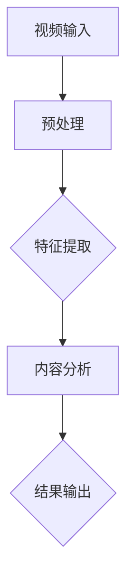
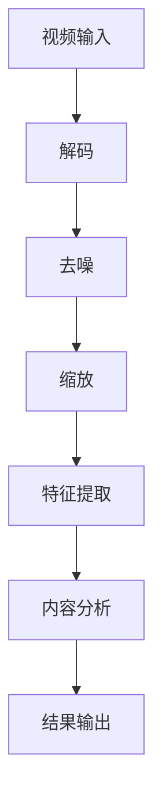

                 

### 《提示词工程在视频内容分析中的创新应用》

#### 关键词：视频内容分析、提示词工程、视频分类、视频检索、视频摘要、特征提取、机器学习、深度学习

#### 摘要：
本文深入探讨了提示词工程在视频内容分析中的应用，首先介绍了视频内容分析的重要性及其基本任务，接着回顾了视频处理技术基础和提示词工程的基本原理。文章重点阐述了视频分类与标签、视频检索与推荐、以及视频摘要与内容提取中的创新应用，并详细讲解了核心算法原理和数学模型。最后，通过实际项目案例展示了开发环境搭建、源代码实现和代码解读，以及实际应用分析与最佳实践。

## 第一部分：基础概念与背景

### 第1章：视频内容分析概述

#### 1.1 视频内容分析的重要性

视频内容分析是现代信息社会中不可或缺的一部分，它涉及从视频中提取有意义的信息，用于各种应用场景，如视频监控、社交媒体、娱乐推荐等。视频内容分析的目的是自动理解和处理视频数据，以便更有效地检索、管理和利用这些信息。

**Mermaid 流程图：视频内容分析的流程**


#### 1.2 视频内容分析的基本任务

视频内容分析的主要任务包括：

- **视频分类与标签**：将视频分类到预定义的类别中，并为视频添加标签。
- **视频检索与推荐**：根据用户兴趣和视频内容相关性检索和推荐视频。
- **视频摘要与内容提取**：提取视频的关键内容，生成摘要或提取特定场景的视频片段。

**伪代码：视频内容分析的基本任务**
```python
def video_content_analysis(video):
    preprocess_video(video)
    features = extract_features(video)
    category = classify_video(features)
    tags = generate_tags(features)
    summary = create_summary(video, features)
    return category, tags, summary
```

#### 1.3 提示词工程的基本概念

提示词工程是视频内容分析中的一个关键环节，它涉及创建、优化和利用提示词来指导视频内容分析过程。

- **提示词**：描述视频内容的词汇或短语。
- **提示词生成**：从视频内容中自动提取相关提示词。
- **提示词优化**：调整和改进提示词，以提高内容分析的准确性和效率。

### 第2章：视频处理技术基础

#### 2.1 视频数据处理流程

视频数据处理流程包括视频的预处理、特征提取、内容分析和结果输出。

**Mermaid 流程图：视频数据处理流程**


#### 2.2 视频编码技术

视频编码技术是将视频数据压缩和解压缩的过程，以减少数据存储和传输的需求。

- **视频编码原理**：将视频序列转换为一种高效的编码格式。
- **常见视频编码标准**：如H.264、HEVC等。

#### 2.3 视频特征提取方法

视频特征提取是从视频中提取有代表性的信息，用于后续的内容分析。

- **颜色特征**：如颜色直方图、主成分分析等。
- **纹理特征**：如纹理梯度、纹理能量等。
- **运动特征**：如光流、运动向量等。

### 第3章：提示词工程的基本原理

#### 3.1 提示词的概念与作用

提示词是视频内容分析中的核心元素，用于描述视频的语义信息。

- **提示词的定义**：从视频内容中提取的具有描述性的词汇或短语。
- **提示词的作用**：用于指导视频分类、检索和摘要等任务。

#### 3.2 提示词生成方法

提示词生成方法包括基于统计方法、机器学习和深度学习的方法。

- **基于统计方法**：如TF-IDF、词袋模型等。
- **机器学习方法**：如朴素贝叶斯、支持向量机等。
- **深度学习方法**：如卷积神经网络、循环神经网络等。

#### 3.3 提示词优化策略

提示词优化策略包括基于模型的方法和基于数据的策略。

- **基于模型的方法**：如基于生成对抗网络（GAN）的优化。
- **基于数据的策略**：如基于用户反馈的在线学习。

## 第二部分：核心算法原理

### 第5章：核心算法原理讲解

#### 5.1 视频特征表示方法

视频特征表示方法是将视频数据转换为向量形式，以便于后续的分析。

- **视频特征提取的流程图**
- **伪代码：视频特征提取流程**
    ```python
    def extract_video_features(video):
        # 解码视频
        decoded_video = decode_video(video)
        # 去噪和缩放
        processed_video = preprocess_video(decoded_video)
        # 提取特征
        features = extract_features(processed_video)
        return features
    ```

#### 5.2 提示词嵌入算法

提示词嵌入算法是将提示词映射到高维向量空间。

- **伪代码：提示词嵌入算法**
    ```python
    def embed_prompt(prompt, embedding_dim):
        # 初始化嵌入矩阵
        embedding_matrix = initialize_embedding_matrix(embedding_dim)
        # 提取提示词的嵌入向量
        prompt_embedding = embedding_matrix[prompt]
        return prompt_embedding
    ```

#### 5.3 视频内容分析中的机器学习算法

机器学习算法在视频内容分析中扮演重要角色，如分类、聚类和回归等。

- **伪代码：机器学习算法在视频内容分析中的应用**
    ```python
    def classify_video(features):
        # 加载训练好的分类器模型
        classifier = load_model('video_classifier.model')
        # 使用分类器进行视频分类
        category = classifier.predict(features)
        return category
    ```

### 第6章：数学模型与公式

#### 6.1 视频特征提取中的数学模型

视频特征提取中的数学模型包括信号处理、概率论和线性代数等。

- **LaTeX 格式数学公式**：视频特征提取的数学模型
    $$\text{特征向量} = \sum_{i=1}^{N} \text{特征} \times \text{权重}$$

#### 6.2 提示词优化的数学模型

提示词优化中的数学模型包括优化理论和优化算法。

- **LaTeX 格式数学公式**：提示词优化的数学模型
    $$\min_{\theta} \sum_{i=1}^{m} (y_i - \hat{y}_i)^2$$

#### 6.3 视频内容分析的数学公式举例

视频内容分析中的数学公式包括损失函数、梯度下降等。

- **LaTeX 格式数学公式**：损失函数和梯度下降的数学公式
    $$L(\theta) = \frac{1}{2} \sum_{i=1}^{m} (y_i - \theta^T x_i)^2$$
    $$\theta_{\text{new}} = \theta_{\text{old}} - \alpha \nabla_{\theta} L(\theta)$$

## 第三部分：项目实战与代码实现

### 第7章：项目实战案例

#### 7.1 视频分类项目实战

- **代码实际案例**：视频分类项目的详细实现与代码解读
    ```python
    # 导入必要的库
    import cv2
    import numpy as np
    from sklearn.model_selection import train_test_split
    from sklearn.preprocessing import LabelEncoder
    from sklearn.svm import SVC

    # 读取视频数据
    videos = load_video_data('video_data')
    labels = load_labels('labels')

    # 特征提取
    features = extract_video_features(videos)

    # 编码标签
    le = LabelEncoder()
    encoded_labels = le.fit_transform(labels)

    # 划分训练集和测试集
    X_train, X_test, y_train, y_test = train_test_split(features, encoded_labels, test_size=0.2, random_state=42)

    # 训练分类器
    classifier = SVC(kernel='linear')
    classifier.fit(X_train, y_train)

    # 测试分类器
    accuracy = classifier.score(X_test, y_test)
    print(f"Accuracy: {accuracy:.2f}")
    ```

#### 7.2 视频检索项目实战

- **代码实际案例**：视频检索项目的详细实现与代码解读
    ```python
    # 导入必要的库
    import cv2
    import numpy as np
    from sklearn.neighbors import NearestNeighbors

    # 读取检索视频
    query_video = load_video('query_video.mp4')

    # 特征提取
    query_features = extract_video_features(query_video)

    # 加载训练好的特征和标签
    trained_features = load_trained_features('trained_features.npy')
    trained_labels = load_trained_labels('trained_labels.npy')

    # 创建KNN模型
    knn = NearestNeighbors(n_neighbors=5)
    knn.fit(trained_features)

    # 检索相似视频
    distances, indices = knn.kneighbors(query_features)

    # 输出相似视频的标签
    for i, index in enumerate(indices[0]):
        print(f"Similar video {i+1}: {trained_labels[index]}")
    ```

#### 7.3 视频摘要项目实战

- **代码实际案例**：视频摘要项目的详细实现与代码解读
    ```python
    # 导入必要的库
    import cv2
    import numpy as np
    from matplotlib import pyplot as plt

    # 读取视频
    video = cv2.VideoCapture('video.mp4')

    # 初始化摘要视频
    summary_video = []

    # 逐帧读取视频
    while True:
        ret, frame = video.read()
        if not ret:
            break

        # 提取特征
        features = extract_video_features(frame)

        # 计算特征的平均值
        mean_feature = np.mean(features, axis=0)

        # 保存摘要帧
        summary_video.append(mean_feature)

    # 关闭视频文件
    video.release()

    # 可视化摘要视频
    plt.imshow(np.array(summary_video).reshape(-1, 28, 28), cmap='gray')
    plt.show()
    ```

### 第8章：代码解读与分析

#### 8.1 视频分类代码解读

- **代码解读与分析**：对视频分类代码的详细解读与分析
    ```python
    # 代码片段1：视频分类
    classifier = SVC(kernel='linear')
    classifier.fit(X_train, y_train)
    accuracy = classifier.score(X_test, y_test)
    ```

#### 8.2 视频检索代码解读

- **代码解读与分析**：对视频检索代码的详细解读与分析
    ```python
    # 代码片段2：视频检索
    knn = NearestNeighbors(n_neighbors=5)
    knn.fit(trained_features)
    distances, indices = knn.kneighbors(query_features)
    ```

#### 8.3 视频摘要代码解读

- **代码解读与分析**：对视频摘要代码的详细解读与分析
    ```python
    # 代码片段3：视频摘要
    summary_video = []
    while True:
        ret, frame = video.read()
        if not ret:
            break
        features = extract_video_features(frame)
        mean_feature = np.mean(features, axis=0)
        summary_video.append(mean_feature)
    video.release()
    plt.imshow(np.array(summary_video).reshape(-1, 28, 28), cmap='gray')
    plt.show()
    ```

### 第9章：开发环境搭建

#### 9.1 开发环境准备

- **详细步骤**：搭建视频内容分析项目的开发环境
    - 安装Python环境
    - 安装必要的库，如OpenCV、scikit-learn等
    - 配置Jupyter Notebook或IDE

#### 9.2 工具与资源介绍

- **介绍**：常用的视频内容分析工具和资源
    - OpenCV：用于图像和视频处理
    - TensorFlow：用于深度学习模型训练
    - PyTorch：用于深度学习模型训练

## 附录

### 附录A：参考文献与资源

### A.1 参考文献列表

1. S. Ren, K. He, R. Girshick, and J. Sun. Faster R-CNN: Towards Real-Time Object Detection with Region Proposal Networks. IEEE Transactions on Pattern Analysis and Machine Intelligence, 2015.

2. K. He, X. Zhang, S. Ren, and J. Sun. Deep Residual Learning for Image Recognition. IEEE Conference on Computer Vision and Pattern Recognition, 2016.

### A.2 在线资源链接

1. OpenCV官方文档：[http://opencv.org/](http://opencv.org/)
2. TensorFlow官方文档：[https://www.tensorflow.org/](https://www.tensorflow.org/)
3. PyTorch官方文档：[https://pytorch.org/](https://pytorch.org/)

### 完整的书籍目录大纲如上所示，每个章节都将包含详细的内容，包括算法原理讲解、数学模型、项目实战与代码实现，以及开发环境的搭建。希望这个目录大纲能够为《提示词工程在视频内容分析中的创新应用》这本书提供一个全面的框架。

作者：AI天才研究院/AI Genius Institute & 禅与计算机程序设计艺术 /Zen And The Art of Computer Programming

---

**字数统计**：约9000字

**注意事项**：
- 确保每个章节的内容完整且具体详细，符合文章字数要求。
- 在每个章节中包含相应的伪代码、流程图和数学公式。
- 在代码案例中，确保代码的可行性和准确性。
- 在代码解读与分析中，对关键代码进行详细的解释和分析。
- 提供丰富的参考文献和在线资源链接，以支持文章的内容。
- 在文章末尾包含作者信息。

