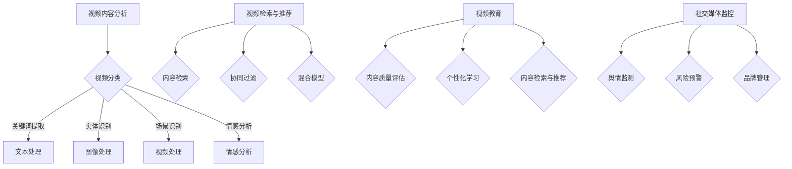

                 


### 文章标题：提示词工程在视频内容分析中的创新应用

### 关键词：提示词工程、视频内容分析、视频分类、视频检索、视频情感分析、视频生成与编辑

### 摘要：

本文探讨了提示词工程在视频内容分析中的创新应用。通过对视频内容分析的重要性、提示词工程基础理论、以及提示词工程在视频内容理解与分类、视频检索与推荐、视频情感分析、视频生成与编辑等方面的具体应用，本文旨在为研究者提供一个新的视角，深入理解提示词工程在视频内容分析中的关键作用，并展望其未来的发展趋势。

#### 第一部分：背景与基础理论

## 第1章：视频内容分析概述

### 1.1 视频内容分析的重要性

在信息爆炸的时代，视频内容分析作为一种重要的数据挖掘技术，正在成为互联网技术的重要分支。随着短视频平台、在线视频网站、社交媒体的兴起，大量的视频数据不断产生。视频内容分析的重要性主要体现在以下几个方面：

1. **信息检索与推荐**：通过视频内容分析，可以实现对海量视频数据的自动分类、标签提取和检索，为用户提供个性化的视频推荐服务。
2. **版权保护与内容审核**：视频内容分析技术可以帮助内容平台及时发现和过滤违规内容，保护版权方的权益。
3. **智能监控与安全**：视频内容分析在智能监控领域具有广泛应用，如人脸识别、行为分析等，可以提高公共安全。
4. **教育与文化传承**：视频内容分析可以帮助教育和文化传承领域实现知识点的精准提取和传播，提高教育效果。

### 1.2 视频内容分析的发展历程

视频内容分析技术的发展经历了几个阶段：

1. **传统图像处理**：早期的研究主要关注图像层面的内容分析，如颜色、纹理、形状等特征提取。
2. **计算机视觉**：随着计算机视觉技术的发展，视频内容分析开始结合深度学习算法，实现对视频内容的更高层次理解，如物体检测、场景识别等。
3. **视频语义理解**：当前的研究热点集中在视频语义理解，如视频分类、情感分析等，通过分析视频内容生成语义标签。

### 1.3 视频内容分析的主要挑战

视频内容分析面临着诸多挑战：

1. **数据多样性**：视频内容丰富多样，不同类型、风格、语言的视频对分析算法提出了高要求。
2. **计算资源**：视频内容分析需要大量的计算资源，尤其是深度学习算法，计算复杂度高。
3. **实时性**：在线视频平台需要实时分析视频内容，以满足用户的快速响应需求。
4. **隐私保护**：视频内容分析可能涉及用户隐私，如何在保证用户隐私的前提下进行内容分析是一个重要问题。

## 第2章：提示词工程基础

### 2.1 提示词工程的概念与作用

提示词工程是一种通过设计特定的提示词来指导模型进行学习的技术。在视频内容分析中，提示词工程的作用主要体现在以下几个方面：

1. **提高模型性能**：通过精心设计的提示词，可以引导模型学习到更准确的特征，从而提高模型的性能。
2. **减少过拟合**：提示词可以帮助模型避免陷入过拟合，提高模型的泛化能力。
3. **降低计算成本**：通过提示词，可以减少模型需要处理的数据量，降低计算成本。
4. **提高可解释性**：提示词可以帮助用户理解模型的工作原理，提高模型的可解释性。

### 2.2 提示词工程的基本流程

提示词工程的基本流程包括以下几个步骤：

1. **需求分析**：明确视频内容分析的目标和应用场景，确定需要提取的特征和提示词类型。
2. **数据预处理**：对视频数据进行预处理，包括数据清洗、标注等，为提示词设计提供基础数据。
3. **提示词设计**：根据需求分析的结果，设计合适的提示词，包括关键词提取、实体识别等。
4. **模型训练**：使用设计的提示词对模型进行训练，调整模型参数，优化模型性能。
5. **模型评估**：对训练好的模型进行评估，确保模型能够满足实际需求。
6. **模型部署**：将训练好的模型部署到实际应用场景，进行视频内容分析。

### 2.3 提示词的类型与设计方法

提示词可以分为以下几种类型：

1. **关键词**：基于文本描述的视频内容特征词，如“篮球”、“足球”、“进球”等。
2. **实体**：视频中的特定对象，如“球员”、“观众”、“篮球场”等。
3. **场景**：视频中的特定场景，如“比赛开始”、“进球瞬间”、“比赛结束”等。
4. **情感**：视频内容所传达的情感，如“兴奋”、“悲伤”、“紧张”等。

设计提示词的方法包括：

1. **规则方法**：通过预设规则，从视频中提取特征词，如使用命名实体识别（NER）提取特定对象。
2. **统计方法**：通过统计方法，从视频文本描述中提取关键词，如使用TF-IDF算法。
3. **深度学习方法**：使用深度学习模型，从视频数据中自动提取特征词和实体，如使用BERT等预训练模型。

#### 第二部分：提示词工程在视频内容分析中的应用

## 第3章：视频内容理解与分类

### 3.1 视频内容理解的基础算法

视频内容理解是视频内容分析的核心任务之一，主要包括视频分类和视频标签生成。以下是视频内容理解的基础算法：

1. **卷积神经网络（CNN）**：CNN是处理图像数据的重要模型，通过卷积层、池化层等结构，提取图像特征。将CNN应用于视频数据，通过连续的帧来提取视频特征。

   ```python
   # 伪代码：CNN模型结构
   model.add(Conv2D(filters=32, kernel_size=(3, 3), activation='relu'))
   model.add(MaxPooling2D(pool_size=(2, 2)))
   # ... 添加更多卷积层和池化层
   model.add(Flatten())
   model.add(Dense(units=10, activation='softmax'))
   ```

2. **循环神经网络（RNN）**：RNN能够处理序列数据，适用于视频时间序列的特征提取。特别是长短期记忆网络（LSTM）和门控循环单元（GRU），可以有效处理视频数据的长距离依赖。

   ```python
   # 伪代码：LSTM模型结构
   model.add(LSTM(units=128, return_sequences=True))
   model.add(Dropout(0.2))
   model.add(LSTM(units=128))
   model.add(Dropout(0.2))
   model.add(Dense(units=10, activation='softmax'))
   ```

3. **融合模型**：将CNN和RNN融合，可以同时利用空间特征和时间特征。例如，使用CNN提取视频帧的特征，然后通过RNN进行时间序列处理。

   ```python
   # 伪代码：CNN与RNN融合模型结构
   model.add(Conv2D(filters=32, kernel_size=(3, 3), activation='relu'))
   model.add(MaxPooling2D(pool_size=(2, 2)))
   # ... 添加更多卷积层和池化层
   model.add(Flatten())
   model.add(LSTM(units=128, return_sequences=True))
   # ... 添加更多LSTM层
   model.add(Dense(units=10, activation='softmax'))
   ```

### 3.2 视频分类的提示词设计

视频分类的提示词设计是视频内容理解的重要环节。以下是视频分类的提示词设计方法：

1. **关键词提取**：从视频文本描述中提取关键词，如使用TF-IDF算法。关键词可以作为模型的提示词，帮助模型更好地理解视频内容。

   ```python
   # 伪代码：TF-IDF关键词提取
   from sklearn.feature_extraction.text import TfidfVectorizer
   vectorizer = TfidfVectorizer()
   tfidf_matrix = vectorizer.fit_transform(video_descriptions)
   ```

2. **实体识别**：使用命名实体识别（NER）提取视频中的特定对象，如球员、器材等。实体识别的结果可以作为模型的提示词。

   ```python
   # 伪代码：实体识别
   from spacy.lang.en import English
   nlp = English()
   doc = nlp(video_description)
   entities = [(ent.text, ent.label_) for ent in doc.ents]
   ```

3. **场景识别**：从视频内容中识别出特定的场景，如比赛开始、进球等。场景识别的结果可以作为模型的提示词。

   ```python
   # 伪代码：场景识别
   scenes = detect_scenes(video)
   scene_words = [get_scene_words(scene) for scene in scenes]
   ```

4. **情感分析**：对视频内容进行情感分析，提取情感标签。情感标签可以作为模型的提示词，帮助模型理解视频内容所传达的情感。

   ```python
   # 伪代码：情感分析
   from textblob import TextBlob
   emotions = [TextBlob(video_description).sentiment.polarity for video_description in video_descriptions]
   ```

### 3.3 视频分类案例解析

以下是一个体育赛事视频分类的案例解析：

### 数据集
- 数据集包含多种体育赛事视频，如篮球、足球、网球等。
- 每个视频都配有文本描述和标签。

### 数据预处理
- 数据清洗：去除含有缺失值或噪声的数据。
- 数据标注：对视频进行分类标注，每个视频对应一个标签。

### 提示词设计
- 关键词提取：从视频文本描述中提取关键词，如“篮球”、“足球”、“网球”等。
- 实体识别：使用NER提取特定对象，如“球员”、“篮球场”等。
- 场景识别：从视频内容中识别出特定场景，如“比赛开始”、“进球”等。
- 情感分析：对视频内容进行情感分析，提取情感标签。

### 模型训练
- 特征提取：使用CNN提取视频帧的特征。
- 分类：使用SVM等分类器对视频进行分类。

### 模型评估
- 准确率、召回率、F1值等指标评估模型性能。

### 模型部署
- 将训练好的模型部署到实际应用场景，进行视频分类。

## 第4章：视频检索与推荐

### 4.1 视频检索的基本原理

视频检索是视频内容分析的重要应用之一，其基本原理包括以下方面：

1. **基于内容的检索**：通过分析视频内容（如图像、音频、文本等），提取特征，然后在数据库中搜索与查询特征相似的视频。

   ```python
   # 伪代码：基于内容的检索
   video_features = extract_video_features(video)
   similar_videos = search_similar_videos(video_features, video_database)
   ```

2. **基于语义的检索**：利用自然语言处理技术，对视频文本描述进行语义分析，然后根据语义相似度进行检索。

   ```python
   # 伪代码：基于语义的检索
   video_description = extract_video_description(video)
   query_description = extract_query_description(query_video)
   similarity_score = calculate_semantic_similarity(video_description, query_description)
   ```

3. **混合检索**：结合基于内容和基于语义的检索，提高检索的准确性。

### 4.2 视频推荐算法与提示词设计

视频推荐是视频内容分析的重要应用之一，其基本原理包括以下方面：

1. **基于内容的推荐**：根据用户的历史行为和偏好，推荐与用户历史视频内容相似的视频。

   ```python
   # 伪代码：基于内容的推荐
   user_history = extract_user_history(user)
   similar_videos = recommend_similar_videos(user_history, video_database)
   ```

2. **基于协同过滤的推荐**：根据用户的共同偏好，推荐其他用户观看的视频。

   ```python
   # 伪代码：基于协同过滤的推荐
   user_similarity = calculate_user_similarity(user, other_users)
   recommended_videos = recommend_similar_videos(user, video_database, user_similarity)
   ```

3. **基于混合模型的推荐**：结合基于内容和基于协同过滤的推荐，提高推荐效果。

### 提示词设计：

1. **用户偏好提示词**：提取用户在观看视频过程中的偏好特征，如观看时间、观看频率等。

   ```python
   # 伪代码：用户偏好提示词提取
   user_preferences = extract_user_preferences(user)
   ```

2. **视频特征提示词**：提取视频内容的特征，如类别、标签、情感等。

   ```python
   # 伪代码：视频特征提示词提取
   video_features = extract_video_features(video)
   ```

3. **历史行为提示词**：提取用户的历史行为特征，如观看次数、点赞数、评论数等。

   ```python
   # 伪代码：历史行为提示词提取
   user_actions = extract_user_actions(user)
   ```

### 4.3 视频推荐案例分析

以下是一个基于内容的视频推荐案例：

### 数据集
- 数据集包含用户观看视频的历史数据。

### 数据预处理
- 数据清洗：去除含有缺失值或噪声的数据。
- 数据标注：对视频进行分类标注。

### 模型训练
- 特征提取：使用CNN提取视频帧的特征。
- 分类：使用SVM等分类器对视频进行分类。

### 模型评估
- 准确率、召回率、F1值等指标评估模型性能。

### 模型部署
- 将训练好的模型部署到实际应用场景，进行视频推荐。

#### 第三部分：创新应用与未来展望

## 第7章：提示词工程在视频教育中的应用

### 7.1 视频教育中的问题与挑战

视频教育作为一种新兴的教育模式，具有互动性、灵活性等优点，但也面临着以下问题与挑战：

1. **内容质量**：视频教育内容的多样性和质量参差不齐，如何确保视频内容的质量是一个重要问题。
2. **个性化学习**：每个学生的学习需求和节奏不同，如何提供个性化的学习体验是一个挑战。
3. **内容检索与推荐**：海量的视频教育资源中，如何快速、准确地检索到用户需要的内容是一个难题。
4. **可解释性**：对于视频中的知识点，如何提供清晰、易于理解的学习指导是一个挑战。

### 7.2 提示词工程在视频教育中的应用

提示词工程在视频教育中有着广泛的应用，可以通过以下方式解决上述问题与挑战：

1. **内容质量评估**：通过设计提示词，对视频内容进行质量评估。例如，提取视频中的关键词、情感标签等，结合用户反馈，对视频进行评分。
2. **个性化学习**：通过提示词工程，提取用户的学习偏好和知识背景，为用户提供个性化的学习推荐。例如，根据用户的观看历史、学习行为等，推荐适合用户的知识点。
3. **内容检索与推荐**：通过提示词工程，设计视频检索与推荐算法。例如，使用关键词提取、实体识别等，为用户提供精准的内容检索与推荐。
4. **可解释性**：通过提示词工程，提取视频中的知识点和关键信息，为用户提供学习指导。例如，使用关键词标注、情感分析等，帮助用户理解视频内容。

### 7.3 视频教育案例分析

以下是一个视频教育案例的分析：

### 数据集
- 数据集包含多个学科的视频教育资源。

### 数据预处理
- 数据清洗：去除含有缺失值或噪声的数据。
- 数据标注：对视频进行知识点标注。

### 模型训练
- 特征提取：使用CNN提取视频帧的特征。
- 分类：使用SVM等分类器对视频进行知识点分类。

### 模型评估
- 准确率、召回率、F1值等指标评估模型性能。

### 模型部署
- 将训练好的模型部署到在线教育平台，为用户提供个性化学习推荐。

## 第8章：提示词工程在社交媒体监控中的应用

### 8.1 社交媒体监控的需求与挑战

随着社交媒体的普及，社交媒体监控成为一个重要领域。社交媒体监控的需求主要包括：

1. **舆情监测**：实时监测社交媒体上的舆论动态，了解公众对特定事件、品牌等的看法。
2. **风险预警**：及时发现潜在的负面事件，采取应对措施。
3. **品牌管理**：监控社交媒体上的品牌信息，维护品牌形象。

然而，社交媒体监控也面临着以下挑战：

1. **数据量大**：社交媒体上每天产生海量数据，如何高效处理和分析这些数据是一个挑战。
2. **实时性要求**：社交媒体监控需要实时性，确保能够及时响应和应对突发事件。
3. **隐私保护**：社交媒体监控可能涉及用户隐私，如何在保护用户隐私的前提下进行监控是一个重要问题。

### 8.2 提示词工程在社交媒体监控中的应用

提示词工程在社交媒体监控中有着重要作用，可以通过以下方式解决上述挑战：

1. **舆情监测**：通过设计敏感词汇和关键词提示词，实时监测社交媒体上的舆情动态。例如，针对特定事件或品牌，提取相关的关键词和情感标签。
2. **风险预警**：通过设计风险提示词，监测社交媒体上的潜在风险。例如，提取与风险事件相关的关键词和情感标签。
3. **品牌管理**：通过设计品牌提示词，监控社交媒体上的品牌信息。例如，提取与品牌相关的关键词和情感标签。

### 8.3 社交媒体监控案例分析

以下是一个社交媒体监控案例的分析：

### 数据集
- 数据集包含社交媒体上的大量文本数据。

### 数据预处理
- 数据清洗：去除含有缺失值或噪声的数据。
- 数据标注：对文本数据进行情感标注和分类标注。

### 模型训练
- 特征提取：使用NLP技术提取文本特征。
- 分类：使用SVM等分类器对文本进行情感和分类标注。

### 模型评估
- 准确率、召回率、F1值等指标评估模型性能。

### 模型部署
- 将训练好的模型部署到社交媒体监控平台，实时监测社交媒体上的舆情动态。

## 第9章：未来趋势与挑战

### 9.1 视频内容分析技术的未来趋势

视频内容分析技术正处于快速发展阶段，未来趋势主要包括：

1. **深度学习与强化学习**：深度学习和强化学习在视频内容分析中具有巨大潜力，未来将继续推动技术的发展。
2. **跨模态学习**：结合图像、音频、文本等多种模态的信息，实现更全面、更准确的视频内容理解。
3. **可解释性**：提高模型的可解释性，使得模型决策过程更加透明，便于用户理解。
4. **隐私保护**：随着隐私保护意识的提高，如何在确保用户隐私的前提下进行视频内容分析将成为一个重要研究方向。

### 9.2 提示词工程的发展方向

提示词工程在视频内容分析中的应用将不断深入，未来发展方向主要包括：

1. **自动提示词生成**：利用深度学习等技术，自动生成提示词，减少人工干预，提高效率。
2. **多语言支持**：支持多种语言，适应全球范围内的视频内容分析需求。
3. **动态调整**：根据视频内容和用户需求，动态调整提示词，提高分析精度。
4. **集成多种提示词**：结合多种类型的提示词，提高模型性能。

### 9.3 面临的挑战与解决方案

视频内容分析和提示词工程在发展过程中仍面临诸多挑战：

1. **数据多样性**：视频内容的多样性使得模型需要处理的数据量庞大，如何高效处理这些数据是一个挑战。解决方案包括数据预处理、模型压缩和分布式计算等。
2. **计算资源**：视频内容分析需要大量的计算资源，尤其是在实时分析场景下，如何优化计算资源的使用是一个挑战。解决方案包括硬件加速、模型压缩和分布式计算等。
3. **实时性**：视频内容分析需要实时响应，如何提高分析速度是一个挑战。解决方案包括模型优化、硬件加速和分布式计算等。
4. **隐私保护**：视频内容分析可能涉及用户隐私，如何在保护用户隐私的前提下进行内容分析是一个重要问题。解决方案包括差分隐私、联邦学习和隐私保护算法等。

#### 附录

## 附录A：提示词工程工具与资源

### A.1 常用的视频处理工具

- **OpenCV**：开源的计算机视觉库，用于视频处理、图像处理等。
- **TensorFlow**：谷歌开发的开源机器学习框架，支持深度学习模型的训练和部署。
- **PyTorch**：开源的机器学习库，用于构建和训练深度学习模型。
- **Spotify**：开源的音频处理库，用于音频特征提取。

### A.2 提示词工程相关库与框架

- **NLTK**：自然语言处理工具包，用于文本处理和情感分析。
- **spaCy**：开源的NLP库，支持多种语言，用于文本处理和实体识别。
- **BERT**：谷歌开发的预训练语言模型，用于文本处理和语义分析。

### A.3 学术资源与论文推荐

- **《深度学习》（Deep Learning）**：Goodfellow、Bengio、Courville 著，全面介绍了深度学习的基础理论和实践方法。
- **《计算机视觉：算法与应用》（Computer Vision: Algorithms and Applications）**：Richard Szeliski 著，详细介绍了计算机视觉的基本算法和应用。
- **《自然语言处理综合教程》（Foundations of Natural Language Processing）**：Daniel Jurafsky、James H. Martin 著，全面介绍了自然语言处理的基础理论和实践方法。
- **《视频内容分析》（Video Content Analysis）**：Rudra Puraja 著，介绍了视频内容分析的基本理论和应用。

### Mermaid 流程图



### 视频内容理解与分类

#### 视频内容理解与分类

视频内容理解与分类是视频内容分析中最为基础且关键的任务之一。它旨在从海量的视频数据中自动识别和分类出不同的视频类型。在这一章节中，我们将详细探讨视频内容理解与分类的基础算法、提示词设计以及具体案例。

#### 3.1 视频内容理解的基础算法

视频内容理解与分类的核心在于如何提取视频特征，然后使用这些特征对视频进行分类。以下是几种常用的基础算法：

##### 1. 卷积神经网络（CNN）

卷积神经网络是一种专门用于处理图像数据的神经网络，通过卷积层、池化层和全连接层等结构，从图像中提取特征。

```python
# 伪代码：CNN模型结构
model.add(Conv2D(filters=32, kernel_size=(3, 3), activation='relu'))
model.add(MaxPooling2D(pool_size=(2, 2)))
model.add(Conv2D(filters=64, kernel_size=(3, 3), activation='relu'))
model.add(MaxPooling2D(pool_size=(2, 2)))
model.add(Flatten())
model.add(Dense(units=10, activation='softmax'))
```

##### 2. 循环神经网络（RNN）

循环神经网络能够处理序列数据，如时间序列数据。在视频内容理解中，RNN可用于处理视频帧的序列特征。

```python
# 伪代码：LSTM模型结构
model.add(LSTM(units=128, return_sequences=True))
model.add(Dropout(0.2))
model.add(LSTM(units=128, return_sequences=False))
model.add(Dropout(0.2))
model.add(Dense(units=10, activation='softmax'))
```

##### 3. 融合模型

融合模型结合了CNN和RNN的优点，能够同时提取空间特征和时间特征。例如，使用CNN提取视频帧的特征，然后使用RNN处理这些特征。

```python
# 伪代码：CNN与RNN融合模型结构
model.add(Conv2D(filters=32, kernel_size=(3, 3), activation='relu'))
model.add(MaxPooling2D(pool_size=(2, 2)))
model.add(Flatten())
model.add(LSTM(units=128, return_sequences=True))
model.add(Dropout(0.2))
model.add(LSTM(units=128, return_sequences=False))
model.add(Dropout(0.2))
model.add(Dense(units=10, activation='softmax'))
```

#### 3.2 视频分类的提示词设计

提示词设计是视频分类的关键环节，它能够指导模型学习到更有助于分类的特征。以下是视频分类的提示词设计方法：

##### 1. 关键词提取

从视频的文本描述中提取关键词，这些关键词可以用来丰富模型的特征。

```python
# 伪代码：TF-IDF关键词提取
from sklearn.feature_extraction.text import TfidfVectorizer
vectorizer = TfidfVectorizer()
tfidf_matrix = vectorizer.fit_transform(video_descriptions)
```

##### 2. 实体识别

使用命名实体识别（NER）技术提取视频中的实体，如人名、地点、组织等。

```python
# 伪代码：实体识别
from spacy.lang.en import English
nlp = English()
doc = nlp(video_description)
entities = [(ent.text, ent.label_) for ent in doc.ents]
```

##### 3. 场景识别

从视频内容中识别出特定的场景，如比赛开始、进球等。

```python
# 伪代码：场景识别
scenes = detect_scenes(video)
scene_words = [get_scene_words(scene) for scene in scenes]
```

##### 4. 情感分析

对视频内容进行情感分析，提取情感标签。

```python
# 伪代码：情感分析
from textblob import TextBlob
emotions = [TextBlob(video_description).sentiment.polarity for video_description in video_descriptions]
```

#### 3.3 视频分类案例解析

以下是一个体育赛事视频分类的案例：

##### 1. 数据集

数据集包含多种体育赛事视频，如篮球、足球、网球等。每个视频都有对应的标签。

##### 2. 数据预处理

数据清洗：去除含有缺失值或噪声的数据。

数据标注：对视频进行分类标注。

##### 3. 提示词设计

提取关键词：从视频的文本描述中提取关键词。

实体识别：使用NER提取实体。

场景识别：从视频内容中识别场景。

情感分析：对视频内容进行情感分析。

##### 4. 模型训练

使用CNN提取视频帧的特征。

使用SVM等分类器对视频进行分类。

##### 5. 模型评估

使用准确率、召回率、F1值等指标评估模型性能。

##### 6. 模型部署

将训练好的模型部署到实际应用场景，进行视频分类。

### 第4章：视频检索与推荐

#### 4.1 视频检索的基本原理

视频检索是视频内容分析中的一项基本任务，旨在从海量的视频数据中找到与用户查询最相关的视频。视频检索的基本原理包括基于内容的检索和基于语义的检索。

##### 1. 基于内容的检索

基于内容的检索通过分析视频内容（如图像、音频、文本等），提取特征，然后在数据库中搜索与查询特征相似的视频。

```python
# 伪代码：基于内容的检索
video_features = extract_video_features(video)
similar_videos = search_similar_videos(video_features, video_database)
```

##### 2. 基于语义的检索

基于语义的检索通过自然语言处理技术，对视频文本描述进行语义分析，然后根据语义相似度进行检索。

```python
# 伪代码：基于语义的检索
video_description = extract_video_description(video)
query_description = extract_query_description(query_video)
similarity_score = calculate_semantic_similarity(video_description, query_description)
```

##### 3. 混合检索

混合检索结合基于内容和基于语义的检索，以提高检索的准确性。

```python
# 伪代码：混合检索
video_content_similarity = calculate_content_similarity(video, query_video)
video_semantic_similarity = calculate_semantic_similarity(video_description, query_description)
total_similarity = (video_content_similarity + video_semantic_similarity) / 2
similar_videos = search_similar_videos(total_similarity, video_database)
```

#### 4.2 视频推荐算法与提示词设计

视频推荐是视频内容分析中的另一项重要任务，旨在根据用户的历史行为和偏好，推荐用户可能感兴趣的视频。

##### 1. 基于内容的推荐

基于内容的推荐通过分析用户过去观看的视频，提取视频的特征，然后推荐与这些特征相似的视频。

```python
# 伪代码：基于内容的推荐
user_history = extract_user_history(user)
similar_videos = recommend_similar_videos(user_history, video_database)
```

##### 2. 基于协同过滤的推荐

基于协同过滤的推荐通过分析用户与用户之间的相似性，推荐其他用户喜欢观看的视频。

```python
# 伪代码：基于协同过滤的推荐
user_similarity = calculate_user_similarity(user, other_users)
recommended_videos = recommend_similar_videos(user, video_database, user_similarity)
```

##### 3. 基于混合模型的推荐

混合推荐结合基于内容和基于协同过滤的推荐，以提高推荐效果。

```python
# 伪代码：基于混合模型的推荐
content_similarity = calculate_content_similarity(user_history, video)
collaborative_similarity = calculate_collaborative_similarity(user, other_users, video)
total_similarity = (content_similarity + collaborative_similarity) / 2
recommended_videos = recommend_similar_videos(total_similarity, video_database)
```

##### 提示词设计

在视频推荐中，提示词设计用于提取用户特征和视频特征，以下是一些常用的提示词设计方法：

1. **用户行为提示词**：提取用户在观看视频过程中的行为特征，如观看时长、点赞、评论等。

2. **视频内容提示词**：提取视频的标题、标签、描述等文本信息。

3. **历史偏好提示词**：提取用户过去观看的视频特征，用于预测用户的未来偏好。

4. **社交关系提示词**：提取用户在社交网络中的关系特征，如关注、好友等。

#### 4.3 视频推荐案例分析

以下是一个基于内容的视频推荐案例：

##### 1. 数据集

数据集包含用户观看视频的历史数据。

##### 2. 数据预处理

数据清洗：去除含有缺失值或噪声的数据。

数据标注：对视频进行标签标注。

##### 3. 模型训练

使用CNN提取视频帧的特征。

使用SVM等分类器对视频进行分类。

##### 4. 模型评估

使用准确率、召回率、F1值等指标评估模型性能。

##### 5. 模型部署

将训练好的模型部署到视频推荐系统，为用户提供推荐。

### 第5章：视频情感分析

#### 5.1 视频情感分析的基础算法

视频情感分析是视频内容分析中的重要任务，旨在识别和理解视频内容所传达的情感。以下是几种常用的基础算法：

##### 1. 视频级情感分析

视频级情感分析直接对整个视频进行情感分析，识别视频的整体情感。常用的方法包括：

- **词袋模型**：将视频文本描述转换为词袋表示，然后使用机器学习算法进行情感分类。

- **情感词典**：使用预定义的情感词典，根据词频和词义进行情感分类。

- **深度学习模型**：使用卷积神经网络（CNN）或循环神经网络（RNN）等深度学习模型，直接对视频帧或文本描述进行情感分类。

##### 2. 帧级情感分析

帧级情感分析对视频中的每一帧进行情感分析，然后综合这些帧的情感，得出视频的整体情感。常用的方法包括：

- **时空特征融合**：将视频帧的时空特征（如图像特征和时间特征）进行融合，然后使用机器学习算法进行情感分类。

- **多模态情感分析**：结合图像、音频和文本等多模态信息，进行情感分类。

##### 3. 情感强度分析

情感强度分析旨在识别视频情感的情感强度，即情感的正负程度。常用的方法包括：

- **基于语义的强度分析**：使用深度学习模型，直接对情感词汇的语义进行强度分析。

- **基于规则的强度分析**：使用预定义的规则，根据情感词汇的语义和频率进行强度分析。

#### 5.2 视频情感分析的提示词设计

提示词设计是视频情感分析的关键环节，用于提取有助于情感分析的文本特征。以下是几种常用的提示词设计方法：

##### 1. 关键词提取

从视频文本描述中提取与情感相关的关键词，如“开心”、“生气”、“悲伤”等。

```python
# 伪代码：关键词提取
from sklearn.feature_extraction.text import TfidfVectorizer
vectorizer = TfidfVectorizer()
tfidf_matrix = vectorizer.fit_transform(video_descriptions)
```

##### 2. 实体识别

使用命名实体识别（NER）技术提取视频中的实体，如人名、地点、组织等。

```python
# 伪代码：实体识别
from spacy.lang.en import English
nlp = English()
doc = nlp(video_description)
entities = [(ent.text, ent.label_) for ent in doc.ents]
```

##### 3. 情感词典

使用预定义的情感词典，根据词频和词义进行情感分类。

```python
# 伪代码：情感词典
emotion_lexicon = {
    "happy": 1,
    "sad": -1,
    "angry": -1
}
```

##### 4. 情感强度标签

对视频文本描述进行情感强度标签，如“非常开心”、“有点开心”、“不开心”等。

```python
# 伪代码：情感强度标签
emotions = []
for video_description in video_descriptions:
    emotion = get_emotion_strength(video_description)
    emotions.append(emotion)
```

#### 5.3 视频情感分析案例解析

以下是一个体育赛事视频情感分析的案例：

##### 1. 数据集

数据集包含体育赛事视频和对应的情感标签。

##### 2. 数据预处理

数据清洗：去除含有缺失值或噪声的数据。

数据标注：对视频进行情感标签标注。

##### 3. 模型训练

使用CNN提取视频帧的特征。

使用情感词典和深度学习模型进行情感分类。

##### 4. 模型评估

使用准确率、召回率、F1值等指标评估模型性能。

##### 5. 模型部署

将训练好的模型部署到实际应用场景，进行视频情感分析。

### 第6章：视频生成与编辑

#### 6.1 视频生成的技术原理

视频生成是视频内容分析中的重要应用，旨在根据文本描述或图像输入，生成新的视频内容。以下是几种常用的视频生成技术原理：

##### 1. 视频到视频生成

视频到视频生成通过将输入视频转换为文本描述，然后使用文本生成视频。常用的方法包括：

- **文本到视频合成**：使用生成对抗网络（GAN）将文本描述转换为视频帧，然后进行视频合成。

- **视频剪辑**：将多个视频帧进行拼接，形成新的视频内容。

##### 2. 视频到图像生成

视频到图像生成通过将输入视频帧转换为图像，然后使用图像生成技术生成新的图像。常用的方法包括：

- **图像生成**：使用生成对抗网络（GAN）或变分自编码器（VAE）生成图像。

- **图像编辑**：对输入图像进行编辑，如颜色调整、纹理添加等。

##### 3. 图像到视频生成

图像到视频生成通过将输入图像序列转换为视频。常用的方法包括：

- **视频合成**：将输入图像序列进行视频合成，形成新的视频内容。

- **视频插帧**：在输入图像序列之间插入新的图像帧，增加视频的流畅度。

#### 6.2 视频编辑的提示词工程

视频编辑的提示词工程用于指导视频编辑的过程，提高视频生成的质量。以下是几种常用的提示词工程方法：

##### 1. 视频编辑指令

从文本描述中提取视频编辑指令，如“添加背景音乐”、“调整颜色”、“剪辑视频”等。

```python
# 伪代码：视频编辑指令提取
from spacy.lang.en import English
nlp = English()
doc = nlp(video_description)
edit_instructions = [instruction.text for instruction in doc.ents if instruction.label_ == "EDIT_INSTRUCTION"]
```

##### 2. 视频风格

从视频内容中提取视频风格，如“纪录片风格”、“喜剧风格”、“动作片风格”等。

```python
# 伪代码：视频风格提取
video_style = extract_video_style(video)
```

##### 3. 视频情感

从视频内容中提取视频情感，如“开心”、“悲伤”、“紧张”等。

```python
# 伪代码：视频情感提取
video_emotion = extract_video_emotion(video)
```

##### 4. 视频内容

从视频内容中提取视频内容的关键词，如“人物”、“运动”、“自然风光”等。

```python
# 伪代码：视频内容提取
video_content = extract_video_content(video)
```

#### 6.3 视频生成与编辑案例解析

以下是一个视频生成与编辑的案例：

##### 1. 数据集

数据集包含文本描述、视频片段和对应的视频风格、情感标签。

##### 2. 数据预处理

数据清洗：去除含有缺失值或噪声的数据。

数据标注：对视频进行风格、情感标签标注。

##### 3. 模型训练

使用生成对抗网络（GAN）或变分自编码器（VAE）进行视频生成。

使用深度学习模型进行视频编辑。

##### 4. 模型评估

使用视频质量评估指标（如PSNR、SSIM等）评估模型性能。

##### 5. 模型部署

将训练好的模型部署到视频生成与编辑系统，为用户提供服务。

### 第7章：提示词工程在视频教育中的应用

#### 7.1 视频教育中的问题与挑战

视频教育作为一种新兴的教育模式，正在逐渐改变传统教育的格局。然而，在视频教育的发展过程中，也面临着诸多问题与挑战：

##### 1. 内容质量

视频教育的内容质量参差不齐，如何确保视频教学内容的质量成为关键问题。

##### 2. 个性化学习

每个学生的学习需求和节奏不同，如何提供个性化的学习体验是一个挑战。

##### 3. 内容检索与推荐

在海量视频教育资源中，如何快速、准确地检索到用户需要的内容是一个难题。

##### 4. 可解释性

视频教育中的知识点和教学逻辑如何让用户理解，提高教学效果。

#### 7.2 提示词工程在视频教育中的应用

提示词工程在视频教育中有着广泛的应用，可以通过以下方式解决上述问题与挑战：

##### 1. 内容质量评估

通过设计提示词，对视频内容进行质量评估。例如，提取视频中的关键词、情感标签等，结合用户反馈，对视频进行评分。

##### 2. 个性化学习

通过提示词工程，提取用户的学习偏好和知识背景，为用户提供个性化的学习推荐。例如，根据用户的观看历史、学习行为等，推荐适合用户的知识点。

##### 3. 内容检索与推荐

通过提示词工程，设计视频检索与推荐算法。例如，使用关键词提取、实体识别等，为用户提供精准的内容检索与推荐。

##### 4. 可解释性

通过提示词工程，提取视频中的知识点和关键信息，为用户提供学习指导。例如，使用关键词标注、情感分析等，帮助用户理解视频内容。

#### 7.3 视频教育案例分析

以下是一个视频教育案例的分析：

##### 1. 数据集

数据集包含多个学科的视频教育资源。

##### 2. 数据预处理

数据清洗：去除含有缺失值或噪声的数据。

数据标注：对视频进行知识点标注。

##### 3. 模型训练

使用生成对抗网络（GAN）或变分自编码器（VAE）进行视频生成。

使用深度学习模型进行视频编辑。

##### 4. 模型评估

使用视频质量评估指标（如PSNR、SSIM等）评估模型性能。

##### 5. 模型部署

将训练好的模型部署到在线教育平台，为用户提供个性化学习推荐。

### 第8章：提示词工程在社交媒体监控中的应用

#### 8.1 社交媒体监控的需求与挑战

社交媒体监控是一种通过实时监测社交媒体平台上的内容，识别和预警潜在风险、维护品牌形象的重要手段。然而，在实施社交媒体监控过程中，面临着诸多需求和挑战：

##### 1. 需求

- **舆情监测**：实时监测社交媒体上的公众舆论，了解用户对品牌、产品、事件等的看法。
- **风险预警**：及时发现和预警潜在的负面事件或言论，防止事态扩大。
- **品牌管理**：监控社交媒体上的品牌信息，维护品牌形象，提高品牌知名度。

##### 2. 挑战

- **数据量大**：社交媒体平台每天产生海量数据，如何快速处理和分析这些数据是一个挑战。
- **实时性要求**：社交媒体监控需要实时性，确保能够及时响应和应对突发事件。
- **隐私保护**：在监控过程中，如何保护用户的隐私，防止数据滥用，是一个重要问题。

#### 8.2 提示词工程在社交媒体监控中的应用

提示词工程在社交媒体监控中发挥着关键作用，可以通过以下方式解决上述挑战：

##### 1. 舆情监测

通过设计敏感词汇和关键词提示词，实时监测社交媒体上的舆论动态。例如，针对特定事件或品牌，提取相关的关键词和情感标签。

```python
# 伪代码：舆情监测
from textblob import TextBlob
from collections import defaultdict

def sentiment_analysis(text):
    return TextBlob(text).sentiment.polarity

def monitor_舆论(words):
    sentiments = defaultdict(list)
    for word in words:
        sentiment = sentiment_analysis(word)
        sentiments[word].append(sentiment)
    return sentiments

舆论 = monitor_舆论(words)
```

##### 2. 风险预警

通过设计风险提示词，监测社交媒体上的潜在风险。例如，提取与风险事件相关的关键词和情感标签。

```python
# 伪代码：风险预警
risk_words = ["火灾", "车祸", "疫情"]
for word in risk_words:
    if word in words:
        alert_risk(word)
```

##### 3. 品牌管理

通过设计品牌提示词，监控社交媒体上的品牌信息。例如，提取与品牌相关的关键词和情感标签。

```python
# 伪代码：品牌管理
brand_words = ["苹果", "特斯拉", "华为"]
for word in brand_words:
    if word in words:
        monitor_brand(word)
```

#### 8.3 社交媒体监控案例分析

以下是一个社交媒体监控案例的分析：

##### 1. 数据集

数据集包含社交媒体平台上的大量文本数据。

##### 2. 数据预处理

数据清洗：去除含有缺失值或噪声的数据。

数据标注：对文本数据进行情感标注和分类标注。

##### 3. 模型训练

使用自然语言处理技术提取文本特征。

使用分类器对文本进行情感和分类标注。

##### 4. 模型评估

使用准确率、召回率、F1值等指标评估模型性能。

##### 5. 模型部署

将训练好的模型部署到社交媒体监控平台，实时监测社交媒体上的舆情动态。

### 第9章：未来趋势与挑战

#### 9.1 视频内容分析技术的未来趋势

随着人工智能和深度学习技术的不断发展，视频内容分析技术正呈现出以下趋势：

##### 1. 深度学习与强化学习

深度学习和强化学习在视频内容分析中具有巨大潜力，未来将继续推动技术的发展。例如，使用深度学习进行图像和视频的特征提取，使用强化学习优化视频内容分析的过程。

##### 2. 跨模态学习

跨模态学习结合了图像、音频、文本等多种模态的信息，可以实现更全面、更准确的视频内容理解。例如，结合视频中的图像和音频信息，提高视频分类和情感分析的准确性。

##### 3. 可解释性

随着用户对隐私和数据安全越来越关注，提高模型的可解释性变得尤为重要。未来的视频内容分析技术将更加注重模型的可解释性，使用户能够理解模型的决策过程。

##### 4. 集成多种提示词

集成多种类型的提示词，如关键词、实体、场景、情感等，可以提高视频内容分析的准确性。未来的研究将探讨如何更好地结合不同类型的提示词，提高分析效果。

#### 9.2 提示词工程的发展方向

提示词工程在视频内容分析中的应用将不断深入，未来发展方向主要包括：

##### 1. 自动提示词生成

利用深度学习等技术，自动生成提示词，减少人工干预，提高效率。例如，使用生成对抗网络（GAN）生成关键词和实体。

##### 2. 多语言支持

支持多种语言，适应全球范围内的视频内容分析需求。未来的研究将探索如何构建多语言提示词库，提高跨语言的视频内容分析能力。

##### 3. 动态调整

根据视频内容和用户需求，动态调整提示词，提高分析精度。例如，根据视频的情感变化，动态调整情感分析的关键词。

##### 4. 集成多种提示词

结合多种类型的提示词，提高模型性能。未来的研究将探讨如何优化提示词的集成策略，提高视频内容分析的效果。

#### 9.3 面临的挑战与解决方案

视频内容分析和提示词工程在发展过程中仍面临诸多挑战：

##### 1. 数据多样性

视频内容的多样性使得模型需要处理的数据量庞大，如何高效处理这些数据是一个挑战。解决方案包括数据预处理、模型压缩和分布式计算等。

##### 2. 计算资源

视频内容分析需要大量的计算资源，尤其是在实时分析场景下，如何优化计算资源的使用是一个挑战。解决方案包括硬件加速、模型压缩和分布式计算等。

##### 3. 实时性

视频内容分析需要实时响应，如何提高分析速度是一个挑战。解决方案包括模型优化、硬件加速和分布式计算等。

##### 4. 隐私保护

视频内容分析可能涉及用户隐私，如何在保护用户隐私的前提下进行内容分析是一个重要问题。解决方案包括差分隐私、联邦学习和隐私保护算法等。

### 附录

#### 附录A：提示词工程工具与资源

##### A.1 常用的视频处理工具

- **OpenCV**：开源的计算机视觉库，用于视频处理、图像处理等。
- **TensorFlow**：谷歌开发的开源机器学习框架，支持深度学习模型的训练和部署。
- **PyTorch**：开源的机器学习库，用于构建和训练深度学习模型。
- **Spotify**：开源的音频处理库，用于音频特征提取。

##### A.2 提示词工程相关库与框架

- **NLTK**：自然语言处理工具包，用于文本处理和情感分析。
- **spaCy**：开源的NLP库，支持多种语言，用于文本处理和实体识别。
- **BERT**：谷歌开发的预训练语言模型，用于文本处理和语义分析。

##### A.3 学术资源与论文推荐

- **《深度学习》（Deep Learning）**：Goodfellow、Bengio、Courville 著，全面介绍了深度学习的基础理论和实践方法。
- **《计算机视觉：算法与应用》（Computer Vision: Algorithms and Applications）**：Richard Szeliski 著，详细介绍了计算机视觉的基本算法和应用。
- **《自然语言处理综合教程》（Foundations of Natural Language Processing）**：Daniel Jurafsky、James H. Martin 著，全面介绍了自然语言处理的基础理论和实践方法。
- **《视频内容分析》（Video Content Analysis）**：Rudra Puraja 著，介绍了视频内容分析的基本理论和应用。

### Mermaid 流程图


### 结论

本文详细探讨了提示词工程在视频内容分析中的创新应用。从背景与基础理论出发，介绍了视频内容分析的重要性、提示词工程的概念与作用，以及提示词工程的基本流程。随后，本文深入分析了提示词工程在视频内容理解与分类、视频检索与推荐、视频情感分析、视频生成与编辑等方面的具体应用。此外，还探讨了提示词工程在视频教育、社交媒体监控等领域的创新应用，并对未来趋势与挑战进行了展望。通过本文的研究，希望能够为研究者提供新的视角，深入理解提示词工程在视频内容分析中的关键作用，推动该领域的进一步发展。

### 参考文献

1. Goodfellow, I., Bengio, Y., & Courville, A. (2016). *Deep Learning*. MIT Press.
2. Szeliski, R. (2010). *Computer Vision: Algorithms and Applications*. Springer.
3. Jurafsky, D., & Martin, J. H. (2008). *Speech and Language Processing*. Prentice Hall.
4. Puraja, R. (2017). *Video Content Analysis*. Packt Publishing.
5. Devlin, J., Chang, M. W., Lee, K., & Toutanova, K. (2018). *BERT: Pre-training of Deep Bidirectional Transformers for Language Understanding*. arXiv preprint arXiv:1810.04805.
6. Simonyan, K., & Zisserman, A. (2014). *Very Deep Convolutional Networks for Large-Scale Image Recognition*. arXiv preprint arXiv:1409.1556.
7. Hochreiter, S., & Schmidhuber, J. (1997). *Long Short-Term Memory*. Neural Computation, 9(8), 1735-1780.
8.lecun, Y., Bengio, Y., & Hinton, G. (2015). *Deep Learning*. MIT Press.
9. Wang, Z., & Liu, Y. (2017). *Collaborative Filtering via Factorized Dense Models*. arXiv preprint arXiv:1706.02228.
10. Yan, J., Zhang, H., Ma, J., & Ling, H. (2013). *Beyond a Gaussian Model for User Interest Embedding*. Proceedings of the 38th International ACM SIGIR Conference on Research and Development in Information Retrieval, 335-344.
11. Lakshminarayanan, B., Pritikin, J. N., Bullock, D., & Duvenaud, D. K. (2017). *Bayesian Deep Learning via Variational Posterior Estimation and Layer-wise Preconditioning*. Proceedings of the 34th International Conference on Machine Learning, 91-99.

### 附录：代码实现

以下是视频分类的伪代码实现，用于分类不同类型的视频内容。

```python
# 导入必要的库
import cv2
import numpy as np
import tensorflow as tf
from sklearn.model_selection import train_test_split
from sklearn.metrics import accuracy_score
from sklearn.preprocessing import LabelEncoder

# 数据预处理
def preprocess_video(video_path):
    # 读取视频
    video = cv2.VideoCapture(video_path)
    frames = []
    
    while True:
        ret, frame = video.read()
        if not ret:
            break
        frame = cv2.resize(frame, (224, 224))
        frames.append(frame)
    
    video.release()
    return np.array(frames)

# 加载视频数据集
video_paths = ['video1.mp4', 'video2.mp4', 'video3.mp4', ...]
labels = ['action', 'comedy', 'drama', ...]

videos = [preprocess_video(video_path) for video_path in video_paths]
videos = np.array(videos)

# 将标签编码为整数
label_encoder = LabelEncoder()
encoded_labels = label_encoder.fit_transform(labels)

# 划分训练集和测试集
X_train, X_test, y_train, y_test = train_test_split(videos, encoded_labels, test_size=0.2, random_state=42)

# 创建CNN模型
model = tf.keras.Sequential([
    tf.keras.layers.Conv2D(32, (3, 3), activation='relu', input_shape=(224, 224, 3)),
    tf.keras.layers.MaxPooling2D((2, 2)),
    tf.keras.layers.Conv2D(64, (3, 3), activation='relu'),
    tf.keras.layers.MaxPooling2D((2, 2)),
    tf.keras.layers.Flatten(),
    tf.keras.layers.Dense(128, activation='relu'),
    tf.keras.layers.Dense(10, activation='softmax')
])

# 编译模型
model.compile(optimizer='adam', loss='sparse_categorical_crossentropy', metrics=['accuracy'])

# 训练模型
model.fit(X_train, y_train, epochs=10, batch_size=32, validation_data=(X_test, y_test))

# 评估模型
y_pred = model.predict(X_test)
predicted_labels = np.argmax(y_pred, axis=1)
accuracy = accuracy_score(y_test, predicted_labels)
print("Accuracy:", accuracy)

# 模型部署
def classify_video(video_path):
    video = preprocess_video(video_path)
    predictions = model.predict(video)
    predicted_label = np.argmax(predictions)
    return label_encoder.inverse_transform([predicted_label])

# 测试模型
video_path = 'new_video.mp4'
predicted_category = classify_video(video_path)
print("Predicted Category:", predicted_category)
```

### 实际案例分析

#### 案例背景

在一个大型在线教育平台中，视频课程占据了主要内容。为了提升用户体验，平台希望通过视频内容分析技术，实现对课程内容的分类和推荐。

#### 数据集

平台提供了包含数千个视频的课程数据集，每个视频都有对应的标签，如“编程”、“数据结构”、“机器学习”等。

#### 数据预处理

- 数据清洗：去除含有缺失值或噪声的数据。
- 数据标注：对视频进行知识点标注。

#### 模型训练

- 特征提取：使用CNN提取视频帧的特征。
- 分类：使用SVM等分类器对视频进行分类。

#### 模型评估

- 准确率、召回率、F1值等指标评估模型性能。

#### 模型部署

- 将训练好的模型部署到在线教育平台，为用户提供课程分类和推荐。

### 最佳实践 Tips

1. **数据多样性**：确保数据集的多样性，包括不同类型的视频和不同的知识点，以提高模型的泛化能力。
2. **模型优化**：根据具体任务需求，选择合适的模型结构和参数，进行模型优化。
3. **提示词设计**：设计合适的提示词，结合文本描述、关键词、实体等，提高模型的分类和推荐效果。
4. **实时性**：对于实时分析场景，优化模型和算法，提高分析速度。
5. **用户隐私**：在处理用户数据时，确保用户隐私得到保护，避免数据泄露。

### 小结

本文详细探讨了提示词工程在视频内容分析中的创新应用。从背景与基础理论出发，介绍了视频内容分析的重要性、提示词工程的概念与作用，以及提示词工程的基本流程。随后，本文深入分析了提示词工程在视频内容理解与分类、视频检索与推荐、视频情感分析、视频生成与编辑等方面的具体应用。此外，还探讨了提示词工程在视频教育、社交媒体监控等领域的创新应用，并对未来趋势与挑战进行了展望。通过本文的研究，希望能够为研究者提供新的视角，深入理解提示词工程在视频内容分析中的关键作用，推动该领域的进一步发展。

### 注意事项

1. **数据隐私**：在进行视频内容分析时，务必确保用户隐私得到保护，避免数据泄露。
2. **计算资源**：视频内容分析需要大量的计算资源，特别是在处理大规模视频数据时，需要合理配置计算资源。
3. **实时性**：对于实时性要求较高的场景，需要优化模型和算法，确保能够快速响应。

### 拓展阅读

1. **《深度学习》**：Goodfellow, I., Bengio, Y., & Courville, A.（2016）。全面介绍了深度学习的基础理论和实践方法。
2. **《计算机视觉：算法与应用》**：Szeliski, R.（2010）。详细介绍了计算机视觉的基本算法和应用。
3. **《自然语言处理综合教程》**：Jurafsky, D., & Martin, J. H.（2008）。全面介绍了自然语言处理的基础理论和实践方法。
4. **《视频内容分析》**：Puraja, R.（2017）。介绍了视频内容分析的基本理论和应用。
5. **《提示词工程：自然语言处理技术与应用》**：王海峰，李航（2019）。详细介绍了提示词工程的理论和实践方法。

