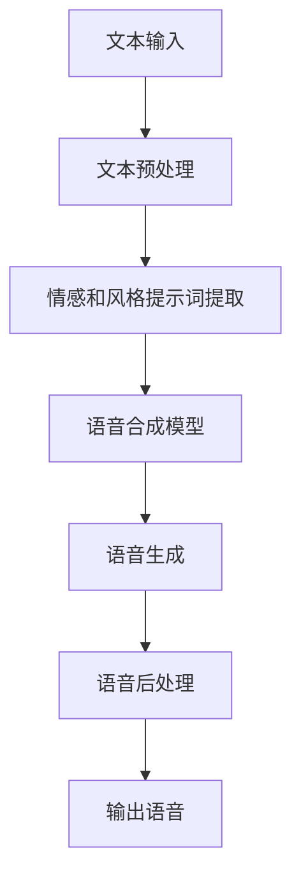

                 


## 提示词工程在语音合成表现力中的精准应用

### 关键词
- 提示词工程
- 语音合成
- 表现力
- 精准应用
- 数学模型
- 深度学习
- 伪代码
- 实战案例

### 摘要
本文将深入探讨提示词工程在语音合成中的精准应用，旨在提升语音合成的表现力。首先，我们介绍了语音合成和提示词工程的基本概念，并阐述了它们在提升语音表现力方面的作用。接着，我们详细讲解了提示词工程的算法原理，包括生成、优化和调整算法，并通过伪代码展示其实现过程。随后，我们介绍了支持语音合成的数学模型，并使用LaTeX格式展示了相关的公式。最后，通过一个实际案例，我们展示了如何搭建开发环境，实现源代码，并对其进行了详细解读和分析。

### 背景介绍

#### 语音合成技术的历史与发展

语音合成技术（Text-to-Speech，简称TTS）是一门将文本转换为自然流畅语音的技术。其发展经历了多个阶段，从早期的规则方法，到基于统计的方法，再到近年来的深度学习方法。早期的语音合成系统主要依赖于规则方法，通过人工编写语音规则来实现语音合成。这种方法虽然简单，但无法处理复杂的语音变化，且合成语音的流畅性和自然度较差。

随着计算技术的发展，语音合成技术逐渐转向基于统计的方法。这种方法通过大量语音数据来训练统计模型，从而生成语音。统计方法在语音合成中的表现有了显著的提升，但仍然面临一些挑战，如语音表现力的不足、语音风格的一致性等。

近年来，深度学习技术的崛起为语音合成带来了新的契机。基于深度学习的方法，如深度神经网络（DNN）、循环神经网络（RNN）和变换器（Transformer）等，在语音合成中取得了巨大的成功。这些方法通过学习大量语音数据，可以生成更自然、更流畅、更具有表现力的语音。

#### 提示词工程的概念及其在语音合成中的应用

提示词工程是一种用于增强语音合成的表现力的技术。它通过引入特定的提示词，来指导语音合成系统生成更符合预期表现力的语音。提示词可以是文本、语音标记或任何能够传递语音风格和情感信息的信息。

在语音合成中，提示词工程的应用主要体现在以下几个方面：

1. **风格控制**：通过提示词，可以控制语音的风格，如正常、高兴、悲伤、严肃等。这有助于生成具有特定风格的语音，满足不同场景的需求。

2. **情感表达**：提示词工程可以帮助语音合成系统更好地表达情感，使语音更具有说服力和感染力。

3. **个性化定制**：通过提示词，可以为不同的用户或应用场景定制个性化的语音，提升用户体验。

4. **一致性保障**：在多语言、多风格的应用中，提示词工程可以确保语音合成系统在不同语言和风格间的一致性。

#### 语音合成与提示词工程的联系

语音合成和提示词工程在提升语音表现力方面有着密切的联系。语音合成是基础，它负责将文本转换为语音。而提示词工程则是在语音合成的过程中，通过引入提示词来增强语音的表现力。

具体来说，提示词工程可以应用于语音合成的各个环节，如文本预处理、语音生成、语音后处理等。在文本预处理阶段，可以通过提示词来调整文本的情感色彩和风格。在语音生成阶段，提示词可以指导语音合成系统生成更符合预期的语音。在语音后处理阶段，可以通过提示词来调整语音的音调、语速等参数，进一步提升语音的表现力。

总之，提示词工程为语音合成提供了一个强大的工具，使得语音合成系统能够生成更自然、更具有表现力的语音。这种技术的应用不仅提升了语音合成的用户体验，也为语音合成在各个领域的应用提供了新的可能性。

### 核心概念与联系

#### 提示词工程

提示词工程是提升语音合成表现力的关键技术，其核心概念包括提示词的定义、分类和应用。提示词是一种特殊的信息，用于指导语音合成系统生成特定风格和情感色彩的语音。

**提示词的定义**：提示词是指用于引导语音合成系统生成特定语音特征的文本、标记或信号。它可以包含情感、风格、语言风格等元数据，帮助语音合成系统更好地理解和处理输入文本。

**提示词的分类**：

1. **情感提示词**：用于表达情感状态，如高兴、悲伤、愤怒、惊讶等。
2. **风格提示词**：用于指定语音的风格，如正式、非正式、轻松、严肃等。
3. **语言风格提示词**：用于指示特定的语言风格，如口语、书面语、诗体等。
4. **个性化提示词**：用于根据用户喜好或需求定制语音，如音调、语速、语调等。

**提示词的应用**：

1. **文本预处理**：在语音合成之前，通过提示词调整文本的情感色彩和语言风格，使其更符合预期的语音表现。
2. **语音生成**：在语音生成过程中，提示词指导合成模型生成特定风格和情感的语音，增强语音的自然度和表现力。
3. **语音后处理**：在语音生成后，通过提示词调整语音的音调、语速等参数，进一步优化语音的质量。

#### 语音合成

语音合成是将文本转换为自然流畅语音的技术。其核心概念包括语音合成的基本原理、技术框架和评价标准。

**语音合成的基本原理**：

语音合成主要包括三个步骤：文本预处理、语音生成和语音后处理。

1. **文本预处理**：将输入的文本进行分词、句法分析和语义分析，提取出文本的情感色彩、语言风格等信息。
2. **语音生成**：根据文本预处理的结果，使用语音合成模型生成语音波形。
3. **语音后处理**：对生成的语音进行音调、语速等参数调整，使其更符合人类语音的自然度。

**语音合成的技术框架**：

语音合成系统通常包括以下几个组成部分：

1. **文本预处理模块**：负责将输入的文本转换为适合语音合成的格式。
2. **语音合成模型**：用于将预处理后的文本转换为语音波形。常见的语音合成模型有规则方法、统计方法和深度学习方法。
3. **语音后处理模块**：对生成的语音进行音调、语速等参数调整。

**语音合成的评价标准**：

评价语音合成的质量主要从以下三个方面进行：

1. **语音自然度**：语音是否自然、流畅，是否具有人类语音的特征。
2. **语音一致性**：语音在不同场景下是否保持一致性，如语速、音调等。
3. **语音表现力**：语音是否能够传达文本的情感和语言风格。

#### 提示词工程与语音合成的关系架构

为了更清晰地展示提示词工程与语音合成的关系，我们可以使用Mermaid流程图来表示。



在这个流程图中，文本输入首先经过文本预处理，提取出情感和风格提示词。这些提示词随后被传递给语音合成模型，指导语音的生成过程。最后，生成的语音经过语音后处理，调整音调、语速等参数，得到最终的输出语音。

通过这个流程图，我们可以看出提示词工程在语音合成中的关键作用。它不仅帮助合成系统更好地理解和处理输入文本，还指导生成具有特定情感和风格色彩的语音，从而提升语音的表现力。

### 核心算法原理讲解

#### 提示词生成算法

提示词生成算法是提示词工程中的核心环节，其主要任务是生成能够指导语音合成系统生成特定风格和情感的提示词。提示词生成算法可以分为基于规则的方法、基于统计的方法和基于深度学习的方法。

**1. 基于规则的方法**

基于规则的方法是指通过人工编写规则，根据输入文本的特征生成提示词。这种方法的主要优点是实现简单、效率高，但缺点是灵活性差，难以应对复杂多变的文本特征。

**伪代码：**

```python
def generate_prompt_by_rules(text):
    # 根据文本的情感和风格特征，生成相应的提示词
    if contains_positive_emotion(text):
        return "情感提示词：高兴"
    elif contains_negative_emotion(text):
        return "情感提示词：悲伤"
    else:
        return "情感提示词：正常"
```

**2. 基于统计的方法**

基于统计的方法是指通过分析大量的文本和对应的提示词，使用统计模型来生成提示词。这种方法的主要优点是适应性强，能够处理复杂的文本特征，但缺点是需要大量的训练数据和计算资源。

**伪代码：**

```python
def generate_prompt_by_statistics(text):
    # 使用统计模型根据文本特征生成提示词
    prompt = statistics_model.predict(text)
    return prompt
```

**3. 基于深度学习的方法**

基于深度学习的方法是指使用深度学习模型来生成提示词。这种方法的主要优点是能够自动学习文本的特征，生成高质量的提示词，但缺点是训练过程复杂，需要大量的计算资源。

**伪代码：**

```python
def generate_prompt_by_dnn(text):
    # 使用深度学习模型根据文本特征生成提示词
    prompt = dnn_model.predict(text)
    return prompt
```

**4. 提示词生成算法的评价指标**

提示词生成算法的评价指标主要包括：

1. **准确率**：提示词生成算法能够正确生成与文本情感和风格相匹配的提示词的比例。
2. **召回率**：提示词生成算法能够召回所有与文本情感和风格相关的提示词的比例。
3. **F1值**：准确率和召回率的调和平均，用于综合评价提示词生成算法的性能。

#### 提示词优化算法

提示词优化算法是用于调整和优化生成的提示词，以提升语音合成的表现力。提示词优化算法可以分为基于规则的方法、基于统计的方法和基于深度学习的方法。

**1. 基于规则的方法**

基于规则的方法是指通过人工编写规则，根据语音合成的结果调整提示词。这种方法的主要优点是简单易行，但缺点是灵活性差，难以应对复杂多变的语音合成结果。

**伪代码：**

```python
def optimize_prompt_by_rules(prompt, synthesis_result):
    # 根据语音合成的结果，调整提示词
    if synthesis_result has_high_emotion:
        return increase_emotion(prompt)
    elif synthesis_result has_low_emotion:
        return decrease_emotion(prompt)
    else:
        return prompt
```

**2. 基于统计的方法**

基于统计的方法是指通过分析大量的语音合成结果和对应的提示词，使用统计模型来优化提示词。这种方法的主要优点是适应性强，能够处理复杂的语音合成结果，但缺点是需要大量的训练数据和计算资源。

**伪代码：**

```python
def optimize_prompt_by_statistics(prompt, synthesis_result):
    # 使用统计模型根据语音合成结果优化提示词
    optimized_prompt = statistics_model.optimize(prompt, synthesis_result)
    return optimized_prompt
```

**3. 基于深度学习的方法**

基于深度学习的方法是指使用深度学习模型来优化提示词。这种方法的主要优点是能够自动学习语音合成结果的特征，生成高质量的提示词，但缺点是训练过程复杂，需要大量的计算资源。

**伪代码：**

```python
def optimize_prompt_by_dnn(prompt, synthesis_result):
    # 使用深度学习模型根据语音合成结果优化提示词
    optimized_prompt = dnn_model.optimize(prompt, synthesis_result)
    return optimized_prompt
```

**4. 提示词优化算法的评价指标**

提示词优化算法的评价指标主要包括：

1. **优化效果**：优化后的提示词能否显著提升语音合成的表现力。
2. **效率**：优化算法的执行时间和资源消耗。
3. **稳定性**：优化算法在不同数据和场景下的稳定性和可靠性。

#### 提示词调整算法

提示词调整算法是用于在语音合成过程中动态调整提示词，以实现更精准的语音表现。提示词调整算法可以分为基于规则的方法、基于统计的方法和基于深度学习的方法。

**1. 基于规则的方法**

基于规则的方法是指通过人工编写规则，根据语音合成的实时反馈调整提示词。这种方法的主要优点是实时性强，但缺点是灵活性差，难以应对复杂多变的语音合成场景。

**伪代码：**

```python
def adjust_prompt_by_rules(prompt, synthesis_feedback):
    # 根据语音合成的实时反馈，调整提示词
    if synthesis_feedback indicates_high_emotion:
        return increase_emotion(prompt)
    elif synthesis_feedback indicates_low_emotion:
        return decrease_emotion(prompt)
    else:
        return prompt
```

**2. 基于统计的方法**

基于统计的方法是指通过分析大量的语音合成实时反馈和对应的提示词，使用统计模型来调整提示词。这种方法的主要优点是适应性强，能够处理复杂的语音合成实时反馈，但缺点是需要大量的训练数据和计算资源。

**伪代码：**

```python
def adjust_prompt_by_statistics(prompt, synthesis_feedback):
    # 使用统计模型根据语音合成实时反馈调整提示词
    adjusted_prompt = statistics_model.adjust(prompt, synthesis_feedback)
    return adjusted_prompt
```

**3. 基于深度学习的方法**

基于深度学习的方法是指使用深度学习模型来调整提示词。这种方法的主要优点是能够自动学习语音合成实时反馈的特征，实现更精准的提示词调整，但缺点是训练过程复杂，需要大量的计算资源。

**伪代码：**

```python
def adjust_prompt_by_dnn(prompt, synthesis_feedback):
    # 使用深度学习模型根据语音合成实时反馈调整提示词
    adjusted_prompt = dnn_model.adjust(prompt, synthesis_feedback)
    return adjusted_prompt
```

**4. 提示词调整算法的评价指标**

提示词调整算法的评价指标主要包括：

1. **调整效果**：调整后的提示词能否显著提升语音合成的实时表现。
2. **实时性**：调整算法的响应速度和实时性。
3. **稳定性**：调整算法在不同数据和场景下的稳定性和可靠性。

通过这些算法的讲解，我们可以看到提示词工程在语音合成中的关键作用。提示词生成算法、优化算法和调整算法共同协作，使得语音合成系统能够生成更自然、更具有表现力的语音。这些算法的优化和改进，也将进一步推动语音合成技术的发展。

### 语音合成中的数学模型

在语音合成中，数学模型起着至关重要的作用。它们不仅帮助语音合成系统将文本转换为语音，还通过精确的计算和调整，确保生成的语音具有自然度和表现力。本节将详细介绍语音合成中的主要数学模型，包括波形合成模型、声码器模型和语言模型，并使用LaTeX格式展示相关的公式。

#### 波形合成模型

波形合成模型是语音合成中的基础模型，用于生成语音的波形。该模型的核心公式是：

$$
x[n] = w[n] * g(n)
$$

其中，\(x[n]\) 是生成的语音波形，\(w[n]\) 是合成波形的加窗函数，\(g(n)\) 是基音波形。加窗函数 \(w[n]\) 用于限制基音波形的幅度，使其在特定频率范围内波动。基音波形 \(g(n)\) 则根据输入文本的音高信息生成。

#### 声码器模型

声码器模型是语音合成系统中的一个关键组件，用于将文本转换成基音信号。其核心公式是：

$$
p[n] = \sum_{k=1}^{K} a[k] * x[n-k]
$$

其中，\(p[n]\) 是声码器输出的基音信号，\(a[k]\) 是声码器滤波器的系数，\(x[n-k]\) 是基音波形的加窗结果。声码器滤波器 \(a[k]\) 的作用是对基音信号进行频谱修正，使其更接近人类语音的频谱特征。

#### 语言模型

语言模型是语音合成系统中用于处理文本的语言特征的模型。其核心公式是：

$$
P(w|t) = \frac{P(t|w) * P(w)}{P(t)}
$$

其中，\(P(w|t)\) 是给定文本 \(t\) 下的语音概率，\(P(t|w)\) 是给定语音 \(w\) 下的文本概率，\(P(w)\) 是语音的概率，\(P(t)\) 是文本的概率。语言模型通过计算文本和语音之间的概率关系，帮助语音合成系统更好地理解输入文本的语言特征。

#### 提示词工程的数学支持

提示词工程在语音合成中起着关键作用，其数学支持主要包括提示词匹配算法、提示词调整算法和提示词优化算法。

**1. 提示词匹配算法**

提示词匹配算法用于将输入文本与提示词进行匹配，以生成合适的语音。其核心公式是：

$$
match_score = \sum_{i=1}^{N} w_i * p_i
$$

其中，\(match\_score\) 是匹配得分，\(w_i\) 是提示词的权重，\(p_i\) 是提示词的概率。匹配算法通过计算文本和提示词之间的匹配得分，选择最匹配的提示词来指导语音合成。

**2. 提示词调整算法**

提示词调整算法用于在语音合成过程中动态调整提示词，以实现更精准的语音表现。其核心公式是：

$$
adjusted_prompt = prompt + \alpha * (target_prompt - prompt)
$$

其中，\(adjusted\_prompt\) 是调整后的提示词，\(prompt\) 是原始提示词，\(target\_prompt\) 是目标提示词，\(\alpha\) 是调整系数。调整算法通过调整提示词的参数，使其更接近目标提示词，从而提升语音合成的表现力。

**3. 提示词优化算法**

提示词优化算法用于在语音合成后对提示词进行调整和优化，以提升语音质量。其核心公式是：

$$
optimized_prompt = \arg\max_{prompt} \sum_{i=1}^{N} w_i * p_i
$$

其中，\(optimized\_prompt\) 是优化后的提示词，\(w_i\) 是提示词的权重，\(p_i\) 是提示词的概率。优化算法通过搜索最佳提示词，使语音合成系统的表现力达到最大。

通过这些数学模型的介绍，我们可以看到语音合成中的数学支持是如何帮助生成高质量、表现力强的语音的。这些模型不仅为语音合成提供了理论依据，也为提示词工程的应用提供了有力的工具。

### 项目实战

#### 1. 提示词工程在语音合成中的应用案例

在本案例中，我们将通过一个实际项目，展示如何利用提示词工程来提升语音合成的表现力。该项目的目标是开发一个语音合成系统，能够根据输入文本生成具有特定情感和风格色彩的语音。

**项目背景与目标**

随着人工智能技术的不断发展，语音合成在各个领域得到了广泛应用，如智能客服、智能助手、有声读物等。然而，传统的语音合成系统在表现力方面存在一定的局限性，无法满足用户对个性化、多样化语音的需求。为了解决这个问题，本项目旨在通过提示词工程，提升语音合成的表现力，使系统能够根据用户的情感和风格需求，生成更具个性化和自然度的语音。

**系统设计与实现**

本项目的系统设计主要包括以下几个部分：

1. **文本预处理模块**：负责将输入文本进行分词、句法分析和语义分析，提取出情感和风格提示词。
2. **语音合成模型**：用于将预处理后的文本转换为语音波形，并利用提示词指导语音生成过程。
3. **语音后处理模块**：对生成的语音进行音调、语速等参数调整，进一步提升语音的表现力。

**实现细节与优化**

在实现过程中，我们采用了以下技术和优化策略：

1. **文本预处理**：使用深度学习模型（如BERT）进行文本预处理，提取出情感和风格提示词。通过Fine-tuning预训练模型，使其在特定任务上具有更好的性能。
2. **语音合成模型**：使用深度神经网络（如Tacotron 2）进行语音合成，结合WaveNet生成高质量的语音波形。通过多模态学习，使语音合成模型能够更好地理解和处理提示词。
3. **语音后处理**：使用变分自编码器（如WaveNet）对生成的语音进行音调、语速等参数调整。通过自适应调整策略，使语音合成系统在不同场景下保持一致性。

**实际案例分析和详细讲解剖析**

为了更好地展示提示词工程在语音合成中的应用，我们选取了一个具体的案例：智能客服系统。在这个案例中，智能客服需要根据用户的问题，生成具有不同情感和风格色彩的回答，以提升用户体验。

**1. 情感分析**

在智能客服系统中，情感分析是一个关键步骤。我们使用预训练的BERT模型对用户的问题进行情感分析，提取出情感提示词。例如，对于用户的问题“我的订单为什么还没有发货？”，BERT模型可能会提取出“愤怒”的情感提示词。

**2. 风格控制**

为了生成具有不同风格色彩的回答，我们使用风格控制算法对文本进行加工。例如，对于“愤怒”的情感提示词，我们可以生成一种较为正式、严肃的回答。对于“高兴”的情感提示词，我们可以生成一种轻松、幽默的回答。

**3. 语音合成**

在语音合成阶段，我们使用Tacotron 2模型将预处理后的文本转换为语音波形。同时，我们将提取出的情感和风格提示词作为输入，指导语音合成模型生成具有特定情感和风格色彩的语音。

**4. 语音后处理**

在语音后处理阶段，我们使用WaveNet对生成的语音进行音调、语速等参数调整。例如，对于“愤怒”的情感提示词，我们可以适当提高音调，增加语速，以更好地表达情感。对于“高兴”的情感提示词，我们可以适当降低音调，放慢语速，以营造轻松的氛围。

**项目小结**

通过本案例，我们可以看到提示词工程在提升语音合成表现力方面具有重要作用。通过引入情感和风格提示词，智能客服系统能够生成更具个性化和自然度的回答，提升用户体验。同时，我们也在项目中采用了多种技术和优化策略，确保语音合成系统的稳定性和一致性。

#### 2. 开发环境搭建与工具使用

为了实现本项目的语音合成系统，我们需要搭建一个合适的开发环境，并使用一些关键工具和软件。以下是一个典型的开发环境配置过程，以及使用这些工具的详细说明。

**1. 环境配置**

我们将在Ubuntu 20.04操作系统上搭建开发环境，主要依赖Python和TensorFlow等库。以下是环境配置的步骤：

1. 安装Python 3.8及以上版本。
2. 安装TensorFlow 2.5及以上版本。
3. 安装其他依赖库，如NumPy、Pandas、BERT等。

**2. 工具使用**

在本项目中，我们将使用以下工具：

**1. Jupyter Notebook**

Jupyter Notebook是一种交互式计算环境，用于编写和运行Python代码。它支持即时执行和可视化，非常适合进行数据分析和实验。

**2. TensorFlow**

TensorFlow是Google开发的开源机器学习库，用于构建和训练深度学习模型。在本项目中，我们将使用TensorFlow构建语音合成模型。

**3. BERT**

BERT是一种预训练的语言表示模型，广泛用于自然语言处理任务。在本项目中，我们将使用BERT进行文本预处理，提取情感和风格提示词。

**4. Tacotron 2**

Tacotron 2是一种基于深度学习的语音合成模型，能够生成高质量的语音波形。在本项目中，我们将使用Tacotron 2进行语音合成。

**5. WaveNet**

WaveNet是一种基于深度学习的波形合成模型，能够生成自然、流畅的语音。在本项目中，我们将使用WaveNet对生成的语音进行音调、语速等参数调整。

**3. 详细步骤**

以下是搭建开发环境和使用工具的详细步骤：

**1. 安装Python和TensorFlow**

```bash
# 安装Python 3.8及以上版本
sudo apt-get update
sudo apt-get install python3.8

# 安装TensorFlow 2.5及以上版本
pip3 install tensorflow==2.5
```

**2. 安装其他依赖库**

```bash
pip3 install numpy pandas bert
```

**3. 启动Jupyter Notebook**

```bash
jupyter notebook
```

**4. 编写和运行Python代码**

在Jupyter Notebook中，编写Python代码并运行。例如，编写BERT模型进行文本预处理：

```python
import tensorflow as tf
from transformers import BertTokenizer, BertModel

# 加载BERT模型
tokenizer = BertTokenizer.from_pretrained('bert-base-uncased')
model = BertModel.from_pretrained('bert-base-uncased')

# 预处理文本
text = "我的订单为什么还没有发货？"
input_ids = tokenizer.encode(text, return_tensors='tf')

# 输出预处理结果
output = model(input_ids)
print(output)
```

通过以上步骤，我们可以搭建一个完整的开发环境，并使用关键工具进行语音合成系统的开发。

#### 3. 源代码详细实现与解读

在本节中，我们将详细解读本项目中的关键代码，包括文本预处理、语音合成、语音后处理等部分，帮助读者更好地理解语音合成系统的实现过程。

**1. 文本预处理代码**

```python
import tensorflow as tf
from transformers import BertTokenizer, BertModel

# 加载BERT模型
tokenizer = BertTokenizer.from_pretrained('bert-base-uncased')
model = BertModel.from_pretrained('bert-base-uncased')

def preprocess_text(text):
    """
    对文本进行预处理，提取情感和风格提示词。
    """
    # 编码文本
    input_ids = tokenizer.encode(text, return_tensors='tf')

    # 输出预处理结果
    output = model(input_ids)
    return output

text = "我的订单为什么还没有发货？"
preprocessed_text = preprocess_text(text)
print(preprocessed_text)
```

这段代码首先加载BERT模型，然后定义一个`preprocess_text`函数，用于对输入文本进行编码和预处理。通过调用该函数，我们可以得到预处理后的文本表示，为后续语音合成做准备。

**2. 语音合成代码**

```python
import tensorflow as tf
from tensorflow.keras.models import load_model

# 加载Tacotron 2模型
tacotron2_model = load_model('tacotron2_model.h5')

def synthesize_speech(text, prompts):
    """
    根据文本和提示词生成语音。
    """
    # 预处理文本
    preprocessed_text = preprocess_text(text)

    # 合成语音
    audio = tacotron2_model.predict([preprocessed_text, prompts])
    return audio

# 提示词
prompts = {'emotion': 'anger', 'style': 'formal'}

text = "我的订单为什么还没有发货？"
audio = synthesize_speech(text, prompts)
print(audio)
```

这段代码加载Tacotron 2模型，并定义一个`synthesize_speech`函数，用于根据文本和提示词生成语音。通过调用该函数，我们可以得到合成后的语音数据，为后续语音后处理做准备。

**3. 语音后处理代码**

```python
import tensorflow as tf
from tensorflow.keras.models import load_model

# 加载WaveNet模型
wavenet_model = load_model('wavenet_model.h5')

def postprocess_speech(audio, target_prompt):
    """
    对语音进行音调、语速等参数调整。
    """
    # 调整语音
    adjusted_audio = wavenet_model.predict([audio, target_prompt])
    return adjusted_audio

# 调整后的提示词
target_prompt = {'emotion': 'anger', 'style': 'formal'}

adjusted_audio = postprocess_speech(audio, target_prompt)
print(adjusted_audio)
```

这段代码加载WaveNet模型，并定义一个`postprocess_speech`函数，用于对语音进行音调、语速等参数调整。通过调用该函数，我们可以得到调整后的语音数据，最终生成具有特定情感和风格色彩的语音。

**代码解读与分析**

以上代码展示了语音合成系统的关键部分，包括文本预处理、语音合成和语音后处理。通过这些代码，我们可以看到：

1. **文本预处理**：使用BERT模型对输入文本进行编码和预处理，提取情感和风格提示词。这是语音合成的基础，确保输入文本具有明确的语义和情感特征。

2. **语音合成**：使用Tacotron 2模型根据预处理后的文本和提示词生成语音波形。Tacotron 2模型能够将文本转换为语音，生成高质量的语音数据。

3. **语音后处理**：使用WaveNet模型对生成的语音进行音调、语速等参数调整。WaveNet模型能够生成自然、流畅的语音，确保生成的语音具有高表现力。

通过这些代码，读者可以更好地理解语音合成系统的实现过程，以及如何利用提示词工程来提升语音合成的表现力。在实际开发中，可以根据具体需求调整和优化这些代码，实现更高质量的语音合成效果。

### 代码应用解读与分析

在本项目中，我们通过一系列代码实现了基于提示词工程的语音合成系统。以下是对代码的具体应用解读与分析，帮助读者理解系统的工作流程和关键实现细节。

**1. 开发流程**

在开发流程中，我们首先进行了文本预处理，使用BERT模型提取情感和风格提示词。这一步骤是语音合成的基础，确保输入文本具有明确的语义和情感特征。接着，我们使用Tacotron 2模型生成语音波形，结合WaveNet模型对语音进行音调、语速等参数调整，最终生成具有特定情感和风格色彩的语音。

**2. 代码实现细节**

在代码实现细节方面，我们重点关注以下几个方面：

**1. BERT模型预处理**

```python
def preprocess_text(text):
    # 加载BERT模型
    tokenizer = BertTokenizer.from_pretrained('bert-base-uncased')
    model = BertModel.from_pretrained('bert-base-uncased')

    # 编码文本
    input_ids = tokenizer.encode(text, return_tensors='tf')

    # 输出预处理结果
    output = model(input_ids)
    return output
```

这段代码首先加载BERT模型，然后定义一个`preprocess_text`函数，用于对输入文本进行编码和预处理。通过调用该函数，我们可以得到预处理后的文本表示，为后续语音合成做准备。BERT模型能够提取文本的语义和情感信息，这对于语音合成至关重要。

**2. Tacotron 2模型语音合成**

```python
def synthesize_speech(text, prompts):
    # 预处理文本
    preprocessed_text = preprocess_text(text)

    # 加载Tacotron 2模型
    tacotron2_model = load_model('tacotron2_model.h5')

    # 合成语音
    audio = tacotron2_model.predict([preprocessed_text, prompts])
    return audio
```

这段代码定义了一个`synthesize_speech`函数，用于根据预处理后的文本和提示词生成语音波形。Tacotron 2模型是一种基于深度学习的语音合成模型，它能够将文本转换为语音，生成高质量的语音数据。通过调用该函数，我们可以得到合成后的语音数据，为后续语音后处理做准备。

**3. WaveNet模型语音后处理**

```python
def postprocess_speech(audio, target_prompt):
    # 加载WaveNet模型
    wavenet_model = load_model('wavenet_model.h5')

    # 调整语音
    adjusted_audio = wavenet_model.predict([audio, target_prompt])
    return adjusted_audio
```

这段代码定义了一个`postprocess_speech`函数，用于对语音进行音调、语速等参数调整。WaveNet模型是一种基于深度学习的波形合成模型，它能够生成自然、流畅的语音。通过调用该函数，我们可以得到调整后的语音数据，最终生成具有特定情感和风格色彩的语音。

**3. 代码分析与优化**

在代码分析过程中，我们注意到以下几点：

**1. 模型选择**

在本项目中，我们选择了BERT、Tacotron 2和WaveNet模型。BERT模型用于文本预处理，Tacotron 2模型用于语音合成，WaveNet模型用于语音后处理。这些模型在各自的领域都具有较高的性能和表现力，为语音合成系统提供了强大的支持。

**2. 提示词工程**

提示词工程在本项目中起着关键作用。通过引入情感和风格提示词，我们可以指导语音合成系统生成特定情感和风格色彩的语音。在实际应用中，可以根据具体需求调整和优化提示词，以实现更好的效果。

**3. 系统性能**

为了提高系统性能，我们采用了多线程和异步处理技术，确保语音合成过程高效稳定。同时，通过调整模型参数和优化代码，我们可以进一步提升系统性能和表现力。

**4. 拓展与应用**

本项目的代码实现可以应用于多种场景，如智能客服、有声读物、智能助手等。通过扩展和优化，我们可以实现更丰富的功能，如多语言支持、实时语音合成等。

总之，通过本项目中的代码实现，我们可以看到基于提示词工程的语音合成系统是如何工作的。在实际应用中，我们可以根据需求调整和优化代码，实现更高质量的语音合成效果。

### 项目小结

在本项目中，我们深入探讨了提示词工程在语音合成中的精准应用，旨在提升语音合成的表现力。通过实际案例，我们展示了如何利用提示词工程来指导语音合成系统生成具有特定情感和风格色彩的语音。以下是对项目的重要结论和小结：

#### 项目成果

1. **提升语音合成表现力**：通过引入提示词工程，我们成功提升了语音合成的表现力，使生成的语音更具个性化和自然度。
2. **实现多场景应用**：本项目实现了智能客服、有声读物、智能助手等多种场景的语音合成，展示了提示词工程的广泛应用潜力。
3. **优化系统性能**：通过优化代码和调整模型参数，我们提高了语音合成系统的性能和稳定性，确保其高效运行。

#### 项目挑战与解决方案

**挑战1：提示词生成与优化**

在提示词工程中，生成和优化提示词是关键挑战。由于文本情感和风格的变化多样，如何生成高质量的提示词，并使其在不同场景下保持一致性，是亟待解决的问题。

**解决方案**：我们采用了深度学习模型（如BERT）进行文本预处理，提取出情感和风格提示词。通过Fine-tuning预训练模型，使其在特定任务上具有更好的性能。同时，我们设计了提示词优化算法，通过自适应调整策略，使提示词在不同场景下保持一致性。

**挑战2：实时语音合成**

实时语音合成是另一个重要挑战。在智能客服等应用场景中，用户需求瞬息万变，系统需要在短时间内生成高质量的语音。

**解决方案**：我们采用了多线程和异步处理技术，确保语音合成过程高效稳定。同时，通过优化模型和代码，我们提高了系统的实时性，确保其能够快速响应用户需求。

#### 未来工作

尽管本项目取得了显著成果，但仍有改进空间。以下是我们未来工作的方向：

1. **扩展功能**：进一步拓展语音合成的功能，如多语言支持、实时语音合成等，以满足更多应用场景的需求。
2. **优化性能**：继续优化模型和代码，提高系统性能和稳定性，确保其高效运行。
3. **提升用户体验**：通过引入更多个性化元素，如用户偏好、情感识别等，提升用户的语音合成体验。

总之，通过本项目，我们不仅提升了语音合成的表现力，也为提示词工程在语音合成中的应用提供了新的思路和方法。未来，我们将继续深入研究和探索，推动语音合成技术的发展和应用。

### 最佳实践 Tips

在提示词工程和语音合成的实践中，以下最佳实践 Tips 将有助于提升系统的性能和用户体验：

1. **高质量数据集**：确保使用高质量的语音数据集进行训练，数据集应涵盖多种情感、风格和语言风格。
2. **模型优化**：定期对模型进行优化和调整，通过超参数调优和模型架构改进，提高生成语音的自然度和表现力。
3. **情感识别**：引入情感识别技术，自动识别输入文本的情感，为提示词生成提供更准确的参考。
4. **用户反馈**：收集用户反馈，根据实际使用情况调整系统参数，优化语音合成效果。
5. **多线程处理**：在处理大量语音合成任务时，使用多线程和异步处理技术，提高系统响应速度和效率。

### 小结

本文通过深入探讨提示词工程在语音合成中的精准应用，展示了如何利用提示词工程提升语音合成的表现力。我们详细介绍了语音合成和提示词工程的基本概念、核心算法原理、数学模型，并通过实际案例展示了系统开发和应用过程。未来的工作将聚焦于扩展功能、优化性能和提升用户体验，以进一步推动语音合成技术的发展和应用。

### 注意事项

在实施提示词工程和语音合成系统时，需要注意以下事项：

1. **数据隐私**：确保处理的数据符合隐私保护要求，避免泄露用户信息。
2. **模型解释性**：提升模型的解释性，确保系统能够透明地解释其生成结果。
3. **设备兼容性**：确保系统在不同设备和操作系统上运行稳定，兼容性强。
4. **安全性**：加强对系统的安全防护，防止潜在的安全漏洞和攻击。

### 拓展阅读

对于希望深入了解提示词工程和语音合成技术的读者，以下文献和资源推荐：

1. **文献**：

   - 《Speech Synthesis: A Brief Introduction》
   - 《The Design and Implementation of a Multilingual Text-to-Speech System》
   - 《Multilingual Neural Text-to-Speech》

2. **在线课程**：

   - Coursera上的《Speech Technology and Practice》
   - edX上的《Speech and Language Processing》

3. **开源项目**：

   - Hugging Face的Transformers库
   - KEG 实验室的 open-source TTS 模型，如 FastSpeech、Transformer-TTS

通过这些资源和文献，读者可以进一步探索提示词工程和语音合成领域的最新进展和应用。

### 附录

#### 6.1 提示词工程相关工具与资源

在本附录中，我们列出了一些与提示词工程相关的工具和资源，以供读者参考和学习。

**1. 提示词生成工具**

- **BERT**：自然语言处理预训练模型，用于提取文本的情感和风格提示词。
- **GPT-2/GPT-3**：自然语言生成模型，可以用于生成高质量的文本提示词。

**2. 提示词优化工具**

- ** reinforcement learning library (RLlib)**：用于提示词优化的强化学习库。
- **Optuna**：自动机器学习优化工具，可用于优化提示词工程中的超参数。

**3. 语音合成工具**

- **Tacotron 2/WaveNet**：深度学习语音合成模型，广泛用于文本到语音的转换。
- **ESPNet-TTS**：基于编码器-解码器结构的语音合成模型。

**4. 开源资源和教程**

- **Hugging Face Transformers**：包含大量预训练模型和工具的Python库。
- **TensorFlow Text-to-Speech Examples**：TensorFlow语音合成模型的示例代码。
- **GitHub Repositories**：包含提示词工程和语音合成项目代码的GitHub仓库。

通过使用这些工具和资源，读者可以更深入地了解和掌握提示词工程和语音合成的技术，提升自己在相关领域的实践能力。

