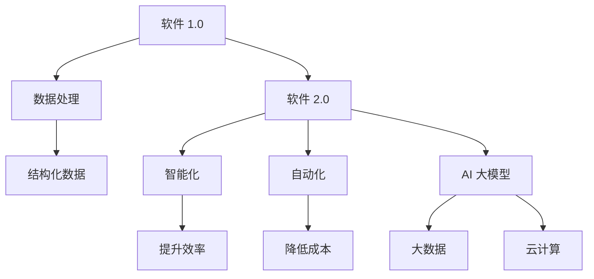
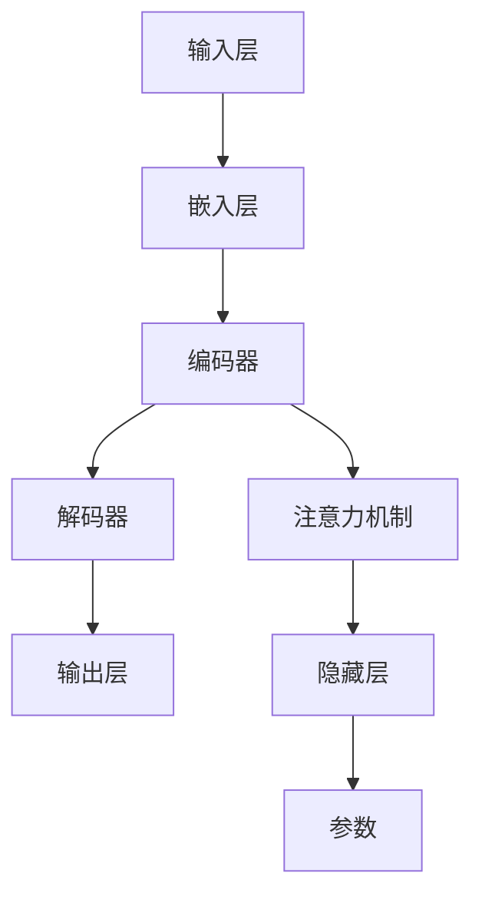
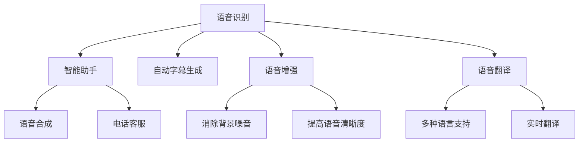
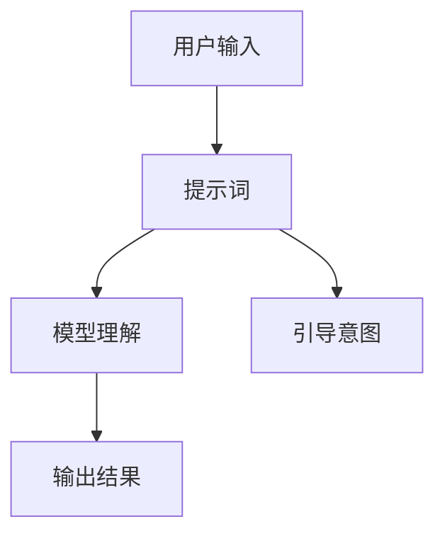
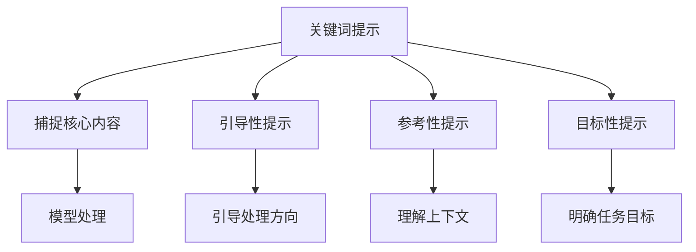
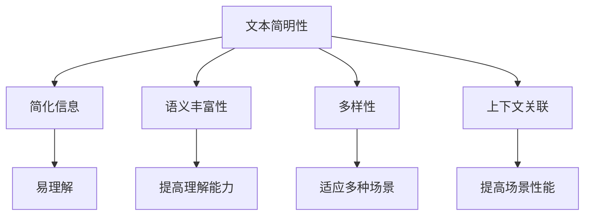
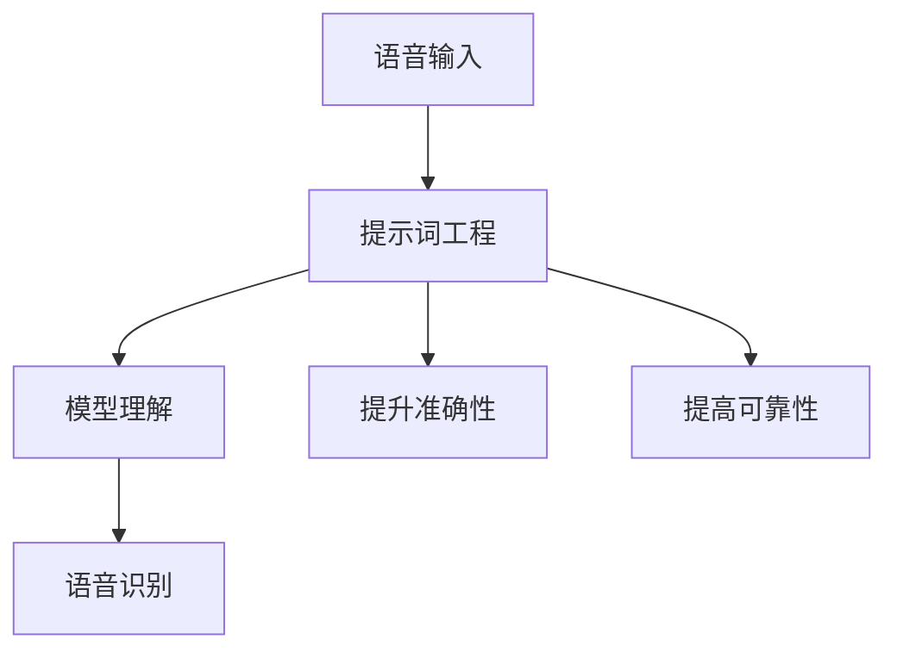
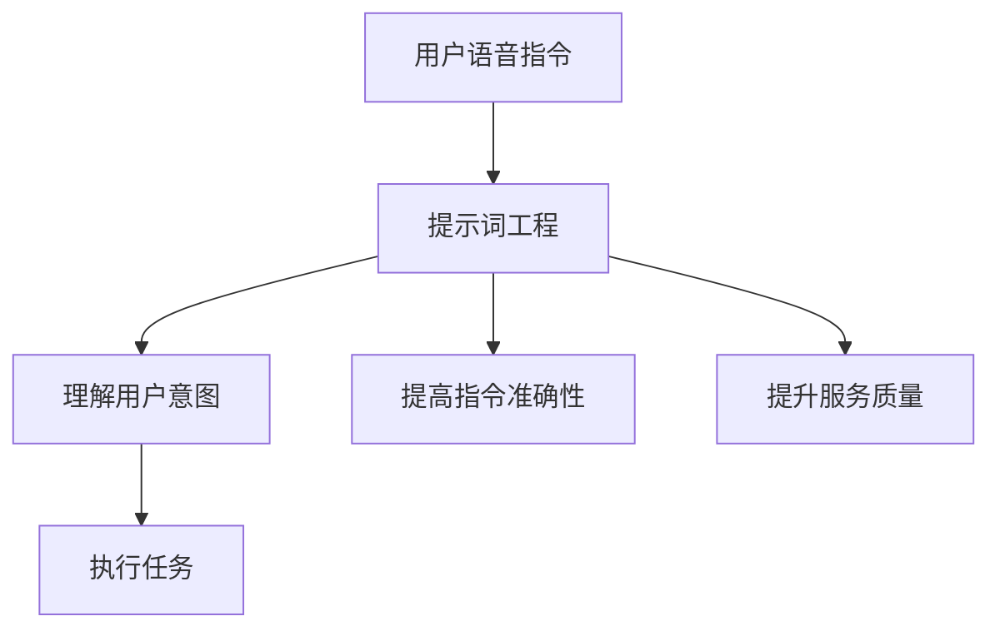
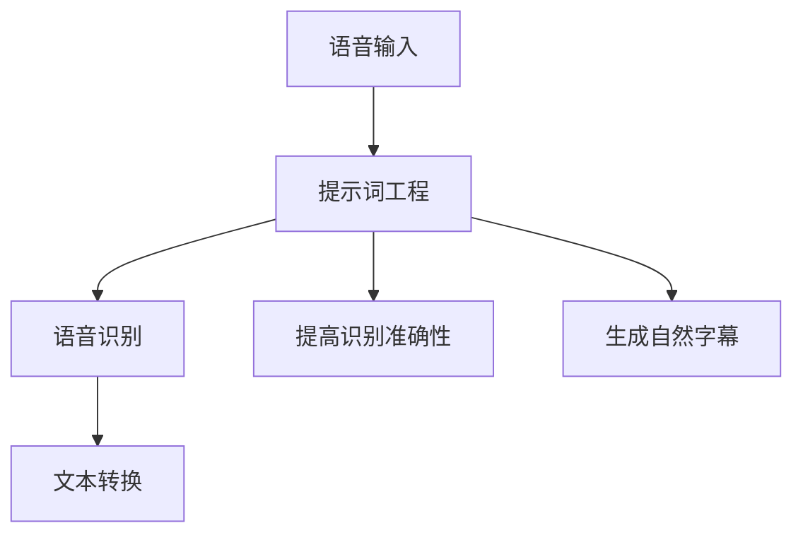
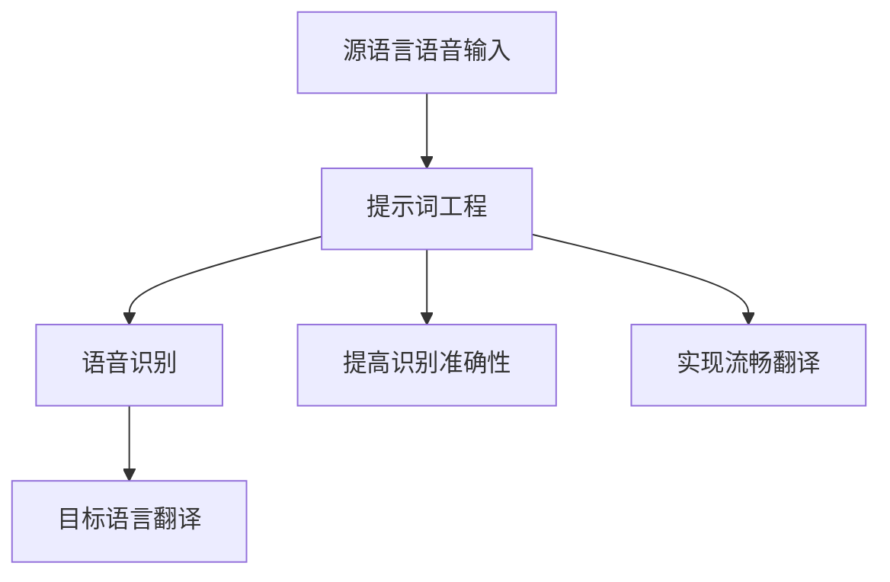

                 


## 文章标题：提示词工程在语音识别中的应用

### 关键词：提示词工程、语音识别、人工智能、大模型、自然语言处理、机器学习

### 摘要：

本文旨在探讨提示词工程在语音识别领域的应用。首先，我们将简要介绍语音识别的背景和发展历程，然后深入探讨提示词工程的概念、核心原理及其与语音识别的关系。接着，我们将分析提示词工程在语音识别中的具体应用场景，并通过实例来展示其优势和挑战。最后，本文将总结提示词工程在语音识别领域的重要性，并展望未来的发展趋势。

## 第一部分：核心概念与联系

### 1.1.1 软件 2.0 时代的到来

软件 2.0 是相对于软件 1.0 的概念，代表着软件产业的一次重大变革。软件 1.0 时代主要集中在结构化数据的处理，而软件 2.0 则强调人工智能、大数据和云计算的结合，使得软件更加智能化、自动化。

在软件 2.0 时代，人工智能（AI）大模型成为了核心驱动力。大模型，如深度神经网络（DNN）、卷积神经网络（CNN）和循环神经网络（RNN）等，具有海量参数和高度非线性结构，能够处理复杂的数据特征，并实现自动化和智能化的目标。

以下是软件 2.0 与 AI 大模型联系的一个 Mermaid 流程图：



在这个流程图中，我们可以看到软件 2.0 的主要特点在于智能化和自动化，这两大特点的实现离不开 AI 大模型，它们通过大数据和云计算的支持，提升了软件的效率和降低了成本。

### 1.1.2 AI大模型的定义与特点

AI大模型是一种具有海量参数、高度非线性、强大表达能力的人工智能模型。其定义和特点如下：

#### 定义

AI大模型通常指的是具有数十亿到数万亿参数的神经网络模型，如GPT、BERT等。这些模型能够处理大量数据，并通过学习获得强大的特征提取和表示能力。

#### 特点

1. **海量参数**：大模型通常包含数十亿甚至数万亿的参数，这使得它们能够捕捉到复杂的数据特征。
2. **高度非线性**：大模型的结构复杂，包含多个非线性变换层，使得它们能够进行复杂的特征学习和决策。
3. **强大表达能力**：大模型能够处理多样化的任务，如文本生成、图像识别、语音识别等。
4. **高效学习**：大模型通常通过大规模预训练和迁移学习技术，能够在少量数据上快速适应新任务。

以下是 AI 大模型的基本架构的 Mermaid 流程图：



在这个流程图中，我们可以看到大模型的基本架构包括输入层、嵌入层、编码器、解码器、输出层以及注意力机制和隐藏层。这些组件共同作用，使得大模型能够进行有效的特征学习和任务完成。

### 1.1.3 AI大模型与传统AI的区别

传统 AI 模型通常具有较少的参数，结构相对简单，主要应用于特定领域。而 AI 大模型则具有以下区别：

#### 参数规模

1. **传统 AI**：通常具有数百万到数千万的参数。
2. **AI 大模型**：具有数十亿到数万亿的参数。

#### 架构复杂度

1. **传统 AI**：结构相对简单，通常包含几个隐藏层。
2. **AI 大模型**：结构复杂，包含数十个甚至上百个隐藏层。

#### 表达能力

1. **传统 AI**：对于复杂任务的表示能力有限。
2. **AI 大模型**：具有强大的表示能力，能够处理多样化、复杂的数据和任务。

以下是传统 AI 与 AI 大模型在参数规模、架构复杂度和表达能力方面的比较 Mermaid 流程图：

```mermaid
graph TD
    A[参数规模] --> B[传统 AI(数百万~数千万)]
    B --> C[AI 大模型(数十亿~数万亿)]
    D[架构复杂度] --> E[传统 AI(几个隐藏层)]
    E --> F[AI 大模型(数十~上百个隐藏层)]
    G[表达能力] --> H[传统 AI(特定领域)]
    H --> I[AI 大模型(多样化、复杂任务)]
```

在这个流程图中，我们可以清晰地看到传统 AI 与 AI 大模型在参数规模、架构复杂度和表达能力方面的显著差异。这些差异使得 AI 大模型能够处理更加复杂、多样化的任务。

### 1.1.4 AI大模型在语音识别中的应用

AI大模型在语音识别中的应用取得了显著的进展。以下是AI大模型在语音识别中的主要应用场景和优势：

#### 应用场景

1. **语音识别**：AI大模型可以用于将语音转换为文本，广泛应用于智能助手、自动字幕生成等领域。
2. **语音合成**：AI大模型可以用于生成自然流畅的语音，应用于智能语音助手、电话客服等领域。
3. **语音增强**：AI大模型可以用于改善语音质量，消除背景噪音，提高语音清晰度。
4. **语音翻译**：AI大模型可以用于实时语音翻译，支持多种语言之间的转换。

#### 优势

1. **高准确率**：AI大模型通过学习海量数据，能够准确识别复杂的语音特征，提高识别准确率。
2. **自适应性强**：AI大模型能够通过迁移学习和在线学习技术，适应不同的语音环境和用户需求。
3. **实时处理能力**：AI大模型具有强大的计算能力，能够实时处理大量语音数据，满足实时应用需求。
4. **跨语言支持**：AI大模型能够支持多种语言的语音识别，实现跨语言的信息交流。

以下是 AI 大模型在语音识别中的主要应用场景和优势的 Mermaid 流程图：



在这个流程图中，我们可以看到 AI 大模型在语音识别领域的多样化应用场景和优势。这些应用场景和优势使得 AI 大模型在语音识别领域具有广泛的应用前景。

## 第二部分：提示词工程概述

### 2.1 提示词工程的定义

提示词工程（Prompt Engineering）是人工智能领域的一个新兴研究方向，旨在通过设计和优化提示词（prompts），提高人工智能模型在特定任务上的性能和表现。提示词工程的核心目标是通过有效的提示，引导人工智能模型理解用户的意图，从而提高模型的准确性和可靠性。

提示词工程可以看作是自然语言处理（NLP）领域中的一种特殊技巧，它结合了语言学、心理学和计算机科学的知识，通过设计合适的提示，帮助模型更好地理解和处理自然语言输入。

### 2.2 提示词工程的核心原理

#### 2.2.1 提示的作用

在人工智能模型中，提示词起到了引导和指导模型理解输入信息的作用。通过设计合适的提示词，可以使模型更准确地捕捉用户的意图，从而提高模型在特定任务上的性能。

以下是提示词工程中提示作用的 Mermaid 流程图：



在这个流程图中，我们可以看到提示词在用户输入和模型输出之间的桥梁作用。通过设计合适的提示词，可以引导模型更好地理解用户的意图，从而提高输出结果的准确性。

#### 2.2.2 提示词的类型

在提示词工程中，提示词可以根据不同的用途和形式分为多种类型，包括：

1. **关键词提示**：通过提供关键词，帮助模型捕捉到输入信息的核心内容。
2. **引导性提示**：通过提供引导性信息，引导模型按照特定的方向进行理解和处理。
3. **参考性提示**：通过提供参考信息，帮助模型更好地理解上下文和背景。
4. **目标性提示**：通过明确指定任务目标和要求，帮助模型更好地完成任务。

以下是不同类型提示词的 Mermaid 流程图：



在这个流程图中，我们可以看到不同类型提示词在模型处理过程中的作用。通过选择合适的提示词类型，可以更好地引导模型理解和完成任务。

#### 2.2.3 提示词的优化策略

在提示词工程中，优化提示词的设计和选择是提高模型性能的关键。以下是一些常用的提示词优化策略：

1. **文本简明性**：设计简明扼要的提示词，避免过多的冗余信息，使模型更容易理解。
2. **语义丰富性**：选择具有丰富语义的提示词，提高模型对输入信息的理解和处理能力。
3. **多样性**：通过设计多种类型的提示词，提供多样化的输入信息，帮助模型更好地适应不同的任务场景。
4. **上下文关联**：结合上下文信息，设计与上下文相关的提示词，提高模型在特定场景下的性能。

以下是提示词优化策略的 Mermaid 流程图：



在这个流程图中，我们可以看到不同提示词优化策略在模型性能提升方面的作用。通过优化提示词的设计和选择，可以显著提高模型在特定任务上的性能和表现。

## 第三部分：提示词工程在语音识别中的应用

### 3.1 提示词工程在语音识别中的作用

提示词工程在语音识别中的应用主要集中在提升语音识别的准确性和可靠性。通过设计合适的提示词，可以帮助语音识别模型更好地理解和处理复杂的语音输入，从而提高识别的准确率和效果。

以下是提示词工程在语音识别中作用的 Mermaid 流程图：



在这个流程图中，我们可以看到提示词工程在语音输入和语音识别之间的桥梁作用。通过设计合适的提示词，可以引导模型更好地理解语音输入，从而提高识别的准确性和可靠性。

### 3.2 提示词工程在语音识别中的具体应用场景

#### 3.2.1 智能助手

智能助手是语音识别应用中非常常见的一个场景。通过设计合适的提示词，可以帮助智能助手更好地理解和处理用户的语音指令，从而提供更准确、更实用的服务。

以下是一个智能助手的 Mermaid 流程图，展示了提示词工程在其中的应用：



在这个流程图中，我们可以看到提示词工程在用户语音指令和执行任务之间的桥梁作用。通过设计合适的提示词，可以引导模型更好地理解用户意图，从而提高指令的准确性和服务质量。

#### 3.2.2 自动字幕生成

自动字幕生成是另一个重要的语音识别应用场景。通过设计合适的提示词，可以帮助模型更好地识别语音内容，从而生成更准确、更自然的字幕。

以下是一个自动字幕生成的 Mermaid 流程图，展示了提示词工程在其中的应用：



在这个流程图中，我们可以看到提示词工程在语音输入和文本转换之间的桥梁作用。通过设计合适的提示词，可以引导模型更好地识别语音内容，从而生成更准确、更自然的字幕。

#### 3.2.3 语音翻译

语音翻译是跨语言信息交流的重要手段。通过设计合适的提示词，可以帮助模型更好地理解源语言的语音输入，从而实现准确、流畅的翻译。

以下是一个语音翻译的 Mermaid 流程图，展示了提示词工程在其中的应用：



在这个流程图中，我们可以看到提示词工程在源语言语音输入和目标语言翻译之间的桥梁作用。通过设计合适的提示词，可以引导模型更好地理解源语言语音输入，从而实现准确、流畅的翻译。

### 3.3 提示词工程在语音识别中的应用实例

#### 3.3.1 智能助手语音识别实例

以下是一个智能助手语音识别的实例，展示了如何通过提示词工程提高语音识别的准确性和可靠性：

```plaintext
用户语音指令：我想听一首周杰伦的《晴天》。
提示词：请识别并播放周杰伦的《晴天》。
模型输出：已为您找到并播放周杰伦的《晴天》。
```

在这个实例中，提示词“请识别并播放周杰伦的《晴天》”帮助模型明确了用户的意图，从而提高了识别的准确率和可靠性。

#### 3.3.2 自动字幕生成实例

以下是一个自动字幕生成的实例，展示了如何通过提示词工程提高字幕生成的准确性和自然度：

```plaintext
语音输入：今天天气真好，我们去公园散步吧。
提示词：请生成与语音输入对应的字幕。
模型输出：[字幕] 今天天气真好，我们去公园散步吧。
```

在这个实例中，提示词“请生成与语音输入对应的字幕”帮助模型准确识别语音内容，并生成自然流畅的字幕。

#### 3.3.3 语音翻译实例

以下是一个语音翻译的实例，展示了如何通过提示词工程提高翻译的准确性和流畅度：

```plaintext
源语言语音输入：Hola, ¿cómo estás?
提示词：请将源语言语音输入翻译为目标语言。
目标语言翻译：Hello, how are you?
```

在这个实例中，提示词“请将源语言语音输入翻译为目标语言”帮助模型准确识别源语言语音输入，并实现流畅的翻译。

### 3.4 提示词工程在语音识别中的应用挑战

#### 3.4.1 多样性

在语音识别中，用户可能会使用各种不同的表达方式来传达相同的意图。如何设计提示词来应对这种多样性，是一个重要的挑战。

#### 3.4.2 上下文理解

语音识别模型需要能够理解语音输入的上下文信息，以便正确地处理输入。如何设计提示词来帮助模型更好地理解上下文，也是一个挑战。

#### 3.4.3 语言差异

语音识别模型通常需要支持多种语言。如何设计提示词来适应不同的语言差异，是一个需要解决的问题。

## 第四部分：未来展望

### 4.1 提示词工程的发展趋势

随着人工智能技术的不断发展，提示词工程在语音识别中的应用前景广阔。以下是提示词工程的发展趋势：

#### 4.1.1 模型自适应能力提升

未来，提示词工程将更加注重模型的自主学习和自适应能力，以应对不同的语音输入和环境。

#### 4.1.2 提示词多样性增加

为了应对更加多样化的语音输入，提示词工程将引入更多的多样性策略，如多语言支持、跨领域应用等。

#### 4.1.3 上下文理解能力增强

未来，提示词工程将更加关注上下文理解，以提升语音识别的准确性和可靠性。

### 4.2 提示词工程在语音识别领域的挑战与机遇

#### 4.2.1 挑战

1. **多样性**：如何设计提示词来应对多样化的语音输入，是一个重要挑战。
2. **上下文理解**：如何提高模型对上下文信息的理解能力，是一个需要解决的问题。
3. **语言差异**：如何适应不同的语言差异，是一个重要的挑战。

#### 4.2.2 机遇

1. **跨领域应用**：随着人工智能技术的不断进步，提示词工程有望在更多领域得到应用。
2. **实时处理**：随着计算能力的提升，实时语音识别将成为可能，为更多应用场景提供支持。

### 4.3 提示词工程的最佳实践

为了充分发挥提示词工程在语音识别中的应用价值，以下是几个最佳实践：

#### 4.3.1 简明扼要

设计简明扼要的提示词，避免过多的冗余信息，使模型更容易理解。

#### 4.3.2 上下文关联

结合上下文信息，设计与上下文相关的提示词，提高模型在特定场景下的性能。

#### 4.3.3 多样性

通过设计多种类型的提示词，提供多样化的输入信息，帮助模型更好地适应不同的任务场景。

## 结语

本文探讨了提示词工程在语音识别中的应用，包括核心概念、原理、具体应用场景、实例以及未来展望。通过本文的分析，我们可以看到提示词工程在提升语音识别准确性和可靠性方面具有重要作用。未来，随着人工智能技术的不断发展，提示词工程将在更多领域得到应用，为人工智能的发展做出更大贡献。

### 作者：AI天才研究院/AI Genius Institute & 禅与计算机程序设计艺术 /Zen And The Art of Computer Programming

本文内容仅供参考，不代表任何具体产品或服务的推荐。在实际应用中，请结合具体需求和场景进行评估和决策。如需进一步了解相关技术和应用，请查阅相关文献和资料。如有疑问，欢迎指正和交流。

