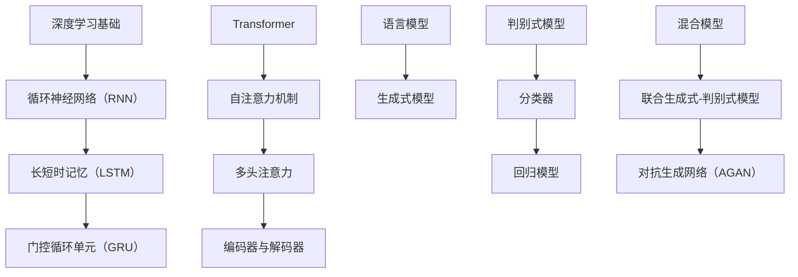

                 

### 文章标题

《提示词工程的最佳实践：从入门到精通》

关键词：提示词工程、自然语言处理、深度学习、模型优化、实战案例

摘要：本文旨在系统地探讨提示词工程的最佳实践，从基础理论到高级应用，逐步深入解析这一领域。文章将首先介绍提示词工程的定义与作用，探讨其发展历程和核心要素。随后，文章将围绕自然语言处理基础、提示词设计与优化、模型架构与算法原理等内容展开详细讨论。在实战与应用部分，文章将通过具体的案例展示提示词工程的应用场景和实现过程。接着，文章将探讨提示词工程中的挑战及解决方案，并介绍高级技巧与未来趋势。最终，文章将总结全文内容，提供拓展阅读资源，帮助读者深入理解和掌握提示词工程的实践技能。

### 提示词工程概述

#### 提示词工程的定义与作用

提示词工程（Prompt Engineering）是自然语言处理（Natural Language Processing, NLP）领域的一项重要分支，它专注于构建和优化用于引导模型生成所需输出的提示词（prompts）。提示词工程的核心目标是提高模型在特定任务上的性能和泛化能力，使其能够更准确地理解用户的意图，并生成高质量的输出。

在自然语言处理领域，模型通常通过学习大量的文本数据来理解和生成语言。然而，现实中的任务往往非常复杂，不同任务之间可能存在显著的差异。例如，聊天机器人需要能够理解并回应用户的各种提问，而智能问答系统则需准确回答用户提出的问题。提示词工程通过提供明确的引导信息，帮助模型更好地适应这些特定的任务需求，从而提高模型的性能。

提示词的作用主要体现在以下几个方面：

1. **明确任务目标**：通过提示词，可以明确地告知模型需要执行的任务类型和目标。例如，在一个文本分类任务中，提示词可以是“请将以下文本分类为新闻、科技或体育”。

2. **引导模型生成**：提示词可以为模型提供上下文信息，帮助模型理解生成任务的背景和目标。例如，在一个生成式任务中，提示词可以是“请写一篇关于人工智能的短文”。

3. **提高泛化能力**：通过优化提示词，可以增强模型对各种不同场景的适应能力，从而提高模型的泛化能力。例如，通过为模型提供多样化的提示词，可以帮助模型学习到更广泛的文本模式和语言结构。

4. **优化用户体验**：在应用场景中，良好的提示词设计能够提高用户体验。例如，在一个问答系统中，清晰的提示词可以引导用户提出更准确的问题，从而提高系统的回答准确性。

#### 提示词工程的发展历程

提示词工程作为一个相对较新的研究领域，其发展历程可以追溯到自然语言处理和机器学习技术的不断进步。以下是提示词工程发展的几个关键阶段：

1. **早期探索阶段（2010年代早期）**：在这个阶段，研究人员开始意识到在特定任务中提供明确的任务提示对模型性能的重要性。例如，研究人员发现，通过在机器翻译任务中使用预定义的提示词，可以显著提高模型的翻译质量。

2. **模型驱动阶段（2015-2018年）**：随着深度学习技术的兴起，研究人员开始使用预训练的语言模型来生成提示词。例如，Word2Vec、GloVe等词向量模型被广泛应用于生成提示词。

3. **优化与评估阶段（2018-2022年）**：在这个阶段，研究人员开始系统地研究和优化提示词的设计和生成方法。例如，提出了一系列优化策略，如使用短语级提示词、引入上下文信息等，以提升模型性能。

4. **多模态与跨语言阶段（2022年至今）**：随着多模态学习和跨语言模型的兴起，提示词工程也逐渐扩展到这些新兴领域。例如，研究人员开始探索如何结合图像、声音等辅助信息来生成更有效的提示词。

#### 提示词工程的核心要素

提示词工程的核心要素主要包括：

1. **语言模型**：语言模型是提示词工程的基础，它负责生成和优化提示词。常用的语言模型包括Word2Vec、GloVe、BERT等。这些模型通过学习大规模的文本数据，能够捕捉到语言中的复杂模式和语义关系。

2. **文本表示**：文本表示是将文本数据转换为计算机可以处理的向量形式的过程。有效的文本表示能够捕捉文本中的关键信息，从而提高模型的性能。常用的文本表示方法包括词嵌入、词袋模型、TF-IDF等。

3. **提示词设计**：提示词设计是提示词工程的关键环节，它决定了模型能否准确地理解任务目标和用户意图。优秀的提示词设计应具有以下特点：
   - **明确性**：提示词应清晰明确，避免歧义，使模型能够准确地理解任务要求。
   - **上下文性**：提示词应包含上下文信息，帮助模型更好地理解生成任务的背景和目标。
   - **多样性**：提示词应具有多样性，使模型能够学习到更广泛的文本模式和语言结构。

4. **优化策略**：提示词的优化策略包括多种技术，如基于规则的优化、基于机器学习的优化等。这些策略通过调整提示词的长度、内容、格式等，以提高模型的性能和泛化能力。

5. **效果评估**：提示词的效果评估是确保提示词工程成功的关键步骤。常用的评估方法包括实验评估、用户评估等。通过对比不同提示词对模型性能的影响，可以选出最优的提示词设计方案。

#### 总结

提示词工程在自然语言处理领域具有重要的地位和作用。通过系统地研究和优化提示词的设计和生成方法，可以显著提高模型在特定任务上的性能和泛化能力。本文介绍了提示词工程的定义、发展历程和核心要素，为后续章节的深入讨论奠定了基础。接下来，我们将进一步探讨自然语言处理基础，以及如何设计和优化提示词。

### 第1章：提示词工程概述

在介绍完提示词工程的定义与作用及其发展历程后，本章将详细探讨提示词工程的核心要素，包括语言模型、文本表示、提示词设计、优化策略以及效果评估。这些要素构成了提示词工程的基础，是理解和实现高效提示词工程的关键。

#### 语言模型

语言模型是提示词工程的基础，它负责生成和优化提示词。语言模型通过学习大规模的文本数据，能够捕捉到语言中的复杂模式和语义关系。常见的语言模型包括Word2Vec、GloVe和BERT等。

**Word2Vec**是一种基于神经网络的语言模型，它通过将每个词映射到一个固定大小的向量，从而实现词与词之间的语义关系表示。Word2Vec模型的核心算法包括**连续词袋（CBOW）**和**Skip-Gram**两种。

- **连续词袋（CBOW）**：CBOW模型通过考虑一个词的上下文词（即其周围的一组词），来预测这个词本身。具体来说，CBOW模型会取一个词作为输入，然后预测其上下文词的概率分布。

- **Skip-Gram**：与CBOW相反，Skip-Gram模型通过预测一个词的上下文词来训练模型。它取一个词作为输入，然后生成其上下文词的概率分布。

**GloVe（Global Vectors for Word Representation）**是一种基于矩阵分解的语言模型，它通过学习词与词之间的相似性来生成词向量。GloVe模型的核心思想是使用词共现矩阵来表示词与词之间的关系，并通过优化损失函数来最小化词向量之间的误差。

**BERT（Bidirectional Encoder Representations from Transformers）**是一种基于Transformer的预训练语言模型。BERT模型通过双向编码器来捕捉词与词之间的双向关系，从而生成更加丰富的词向量表示。BERT模型在多种自然语言处理任务上取得了显著的效果，成为现代提示词工程的重要工具。

#### 文本表示

文本表示是将文本数据转换为计算机可以处理的向量形式的过程。有效的文本表示能够捕捉文本中的关键信息，从而提高模型的性能。常用的文本表示方法包括词嵌入、词袋模型和TF-IDF等。

**词嵌入**是将词映射到一个固定大小的向量空间中。词嵌入可以捕捉词与词之间的语义关系，从而实现文本的向量表示。常见的词嵌入方法包括Word2Vec、GloVe和BERT等。

- **Word2Vec**和**GloVe**：这两种方法通过学习词共现矩阵或神经网络模型来生成词向量。

- **BERT**：BERT模型通过双向编码器来生成词向量，从而捕捉词与词之间的双向关系。

**词袋模型**（Bag-of-Words, BOW）是将文本表示为一个词的集合。词袋模型不考虑词的顺序，只关注词的出现频率。词袋模型可以用于文本分类和文本相似度计算等任务。

**TF-IDF（Term Frequency-Inverse Document Frequency）**是一种基于词频和词重要度的文本表示方法。TF-IDF通过计算词在文档中的频率和其在整个文档集合中的重要性来生成词向量。TF-IDF模型在文本检索和文本分类任务中广泛应用。

#### 提示词设计

提示词设计是提示词工程的关键环节，它决定了模型能否准确地理解任务目标和用户意图。优秀的提示词设计应具有以下特点：

- **明确性**：提示词应清晰明确，避免歧义，使模型能够准确地理解任务要求。例如，在聊天机器人中，提示词可以是“请描述一下您最近的项目”。

- **上下文性**：提示词应包含上下文信息，帮助模型更好地理解生成任务的背景和目标。例如，在生成新闻摘要时，提示词可以是“请生成一篇关于人工智能在医疗领域的应用的文章摘要”。

- **多样性**：提示词应具有多样性，使模型能够学习到更广泛的文本模式和语言结构。例如，在对话系统中，提示词可以是多种形式，如问句、陈述句和请求句等。

#### 优化策略

提示词的优化策略包括多种技术，如基于规则的优化、基于机器学习的优化等。这些策略通过调整提示词的长度、内容、格式等，以提高模型的性能和泛化能力。

- **基于规则的优化**：基于规则的优化方法通过预定义的规则来优化提示词。例如，在聊天机器人中，可以使用规则来检测用户的情感和意图，并生成相应的提示词。

- **基于机器学习的优化**：基于机器学习的方法通过训练模型来优化提示词。例如，可以使用自然语言处理技术来分析用户输入，并生成个性化的提示词。

#### 效果评估

提示词的效果评估是确保提示词工程成功的关键步骤。常用的评估方法包括实验评估和用户评估等。

- **实验评估**：实验评估通过在特定任务上对比不同提示词对模型性能的影响来进行。例如，可以使用交叉验证来评估提示词的泛化能力。

- **用户评估**：用户评估通过让真实用户对模型生成的输出进行评价来进行。例如，可以组织用户测试来评估提示词的清晰度和实用性。

#### 总结

本章详细介绍了提示词工程的核心要素，包括语言模型、文本表示、提示词设计、优化策略以及效果评估。这些要素共同构成了提示词工程的基础，是理解和实现高效提示词工程的关键。在下一章中，我们将深入探讨自然语言处理基础，为后续的提示词设计与优化提供理论支持。

### 第2章：自然语言处理基础

自然语言处理（Natural Language Processing, NLP）是人工智能领域的一个重要分支，它致力于使计算机能够理解、生成和处理人类语言。在本章中，我们将探讨自然语言处理的基础知识，重点介绍语言模型与文本表示，包括语言模型的原理、词嵌入技术和文本预处理技术。

#### 语言模型的原理

语言模型（Language Model）是自然语言处理的核心组件之一，它用于预测文本序列的概率分布。一个有效的语言模型能够帮助我们理解和生成自然语言，从而在许多NLP任务中发挥作用，如机器翻译、文本分类、语音识别和对话系统等。

**1. 语言模型的类型**

语言模型主要分为两类：统计语言模型和神经网络语言模型。

- **统计语言模型**：统计语言模型基于概率论和统计学原理，通过分析大量文本数据来建立语言模型。常见的统计语言模型包括N元语法（N-gram Model）和隐马尔可夫模型（Hidden Markov Model, HMM）。

  - **N元语法**：N元语法是一种基于历史序列的统计模型，它通过计算一个词序列的概率来预测下一个词。例如，在二元语法中，模型将考虑前两个词来预测第三个词。

  - **隐马尔可夫模型**：隐马尔可夫模型是一种基于状态转移概率和观测概率的统计模型，常用于语音识别和词性标注等任务。

- **神经网络语言模型**：神经网络语言模型通过学习大规模文本数据中的复杂模式来建立语言模型。常见的神经网络语言模型包括循环神经网络（Recurrent Neural Network, RNN）和Transformer等。

  - **循环神经网络**：循环神经网络是一种能够处理序列数据的神经网络模型，它通过循环结构来保存前一个时间步的信息，从而实现长期依赖关系的学习。

  - **Transformer**：Transformer是一种基于自注意力机制的神经网络模型，它在机器翻译、文本生成等任务中取得了显著的效果。Transformer通过并行计算和自注意力机制，能够高效地处理长序列数据。

**2. 语言模型的工作原理**

语言模型通过预测文本序列的概率分布来生成文本。在给定一个文本序列的初始部分时，语言模型会计算下一个词的概率分布，并根据该概率分布生成下一个词。这一过程不断重复，直到生成完整的文本序列。

例如，在预测句子“我昨天去了公园”的下一个词时，语言模型会考虑句子中的每个词，并计算它们组合的概率分布。假设语言模型预测下一个词是“玩”，那么它将生成完整的句子“我昨天去了公园玩”。

#### 词嵌入技术

词嵌入（Word Embedding）是将单词映射到高维向量空间中的技术，使得计算机可以处理和操作单词。词嵌入通过捕捉单词之间的语义和句法关系，提高了NLP任务的效果和效率。

**1. 词嵌入的原理**

词嵌入的原理基于单词在文本中的共现关系。通过分析大量文本数据，词嵌入技术可以发现单词之间的语义和句法关系，并将其映射到高维向量空间中。

常见的词嵌入技术包括：

- **基于频次的词嵌入**：基于频次的词嵌入通过计算单词在文本中的出现频率来生成词向量。这种方法简单有效，但无法捕捉到单词的语义关系。

- **基于上下文的词嵌入**：基于上下文的词嵌入通过分析单词在文本中的上下文信息来生成词向量。这种方法能够捕捉到单词的语义和句法关系，从而提高词嵌入的质量。

- **神经网络词嵌入**：神经网络词嵌入通过训练神经网络模型来生成词向量。常见的神经网络词嵌入模型包括Word2Vec、GloVe和BERT等。

**2. 常见的词嵌入模型**

- **Word2Vec**：Word2Vec是一种基于神经网络的语言模型，它通过学习单词在文本中的共现关系来生成词向量。Word2Vec模型使用两种算法：连续词袋（CBOW）和Skip-Gram。

  - **连续词袋（CBOW）**：CBOW模型通过考虑一个词的上下文词（即其周围的一组词），来预测这个词本身。具体来说，CBOW模型会取一个词作为输入，然后预测其上下文词的概率分布。

  - **Skip-Gram**：与CBOW相反，Skip-Gram模型通过预测一个词的上下文词来训练模型。它取一个词作为输入，然后生成其上下文词的概率分布。

- **GloVe**：GloVe（Global Vectors for Word Representation）是一种基于矩阵分解的语言模型，它通过学习词共现矩阵或神经网络模型来生成词向量。GloVe模型的核心思想是使用词共现矩阵来表示词与词之间的关系，并通过优化损失函数来最小化词向量之间的误差。

- **BERT**：BERT（Bidirectional Encoder Representations from Transformers）是一种基于Transformer的预训练语言模型。BERT模型通过双向编码器来捕捉词与词之间的双向关系，从而生成更加丰富的词向量表示。

#### 文本预处理技术

文本预处理是NLP任务中的重要步骤，它用于清洗和转换文本数据，使其适合用于模型训练和预测。文本预处理技术包括分词、词性标注、停用词过滤和文本标准化等。

**1. 分词**：分词是将文本分割成一组词语的过程。常见的分词方法包括基于规则的分词和基于统计的分词。

- **基于规则的分词**：基于规则的分词使用预定义的规则来分割文本。这种方法简单但效果有限。

- **基于统计的分词**：基于统计的分词通过分析大量文本数据中的词边界来分割文本。这种方法能够更好地捕捉文本中的词边界，提高分词的准确性。

**2. 词性标注**：词性标注是将文本中的每个词标注为其所属的词性（如名词、动词、形容词等）的过程。词性标注有助于理解文本的语法结构和语义信息，从而提高NLP任务的效果。

**3. 停用词过滤**：停用词过滤是移除文本中常用的无意义词（如“的”、“了”、“在”等）的过程。这些词对文本的语义影响较小，但会增加模型训练的时间和复杂度。

**4. 文本标准化**：文本标准化是将文本转换为统一格式的过程，包括大小写转换、标点符号处理和特殊字符替换等。文本标准化有助于提高模型的稳定性和可扩展性。

#### 总结

本章介绍了自然语言处理的基础知识，包括语言模型的原理、词嵌入技术和文本预处理技术。语言模型是NLP的核心组件，通过预测文本序列的概率分布，实现了对自然语言的生成和理解。词嵌入技术通过将单词映射到高维向量空间，提高了NLP任务的效果和效率。文本预处理技术则确保了文本数据的质量和一致性，为后续的提示词设计和优化奠定了基础。在下一章中，我们将进一步探讨提示词设计与优化，包括提示词设计原则、优化方法和效果评估。

#### 第2章：自然语言处理基础

### 提示词设计与优化

提示词设计是提示词工程中至关重要的一环，它直接影响模型的性能和效果。有效的提示词设计能够引导模型更好地理解任务目标和用户意图，从而提高模型的准确性和泛化能力。在本节中，我们将详细介绍提示词设计原则、优化方法以及提示词效果评估。

#### 提示词设计原则

1. **明确性**：提示词应清晰明确，避免歧义，使模型能够准确地理解任务要求。例如，在文本分类任务中，提示词可以是“请将以下文本分类为新闻、科技或体育”。

2. **上下文性**：提示词应包含上下文信息，帮助模型更好地理解生成任务的背景和目标。例如，在生成新闻摘要时，提示词可以是“请生成一篇关于人工智能在医疗领域的应用的文章摘要”。

3. **多样性**：提示词应具有多样性，使模型能够学习到更广泛的文本模式和语言结构。例如，在聊天机器人中，提示词可以是多种形式，如问句、陈述句和请求句等。

4. **简洁性**：提示词应尽量简洁，避免冗长和复杂的表达。简洁的提示词有助于模型更快地理解和生成输出。

5. **一致性**：提示词应保持一致性，确保在相同任务和场景下使用相同的提示词，以避免模型产生混淆。

#### 提示词优化方法

1. **基于规则的优化**：基于规则的优化方法通过预定义的规则来优化提示词。例如，在聊天机器人中，可以使用规则来检测用户的情感和意图，并生成相应的提示词。

2. **基于机器学习的优化**：基于机器学习的方法通过训练模型来优化提示词。例如，可以使用自然语言处理技术来分析用户输入，并生成个性化的提示词。常见的方法包括：
   - **序列模型**：使用循环神经网络（RNN）或长短时记忆（LSTM）等序列模型来分析用户输入，并生成提示词。
   - **生成对抗网络（GAN）**：使用生成对抗网络（GAN）来生成高质量的提示词，通过对抗训练来提高提示词的多样性。

3. **基于统计的方法**：基于统计的方法通过分析大量数据来优化提示词。例如，可以使用统计方法来分析用户输入和模型输出之间的相关性，从而生成优化后的提示词。

#### 提示词效果评估

提示词的效果评估是确保提示词工程成功的关键步骤。常用的评估方法包括实验评估和用户评估等。

1. **实验评估**：实验评估通过在特定任务上对比不同提示词对模型性能的影响来进行。例如，可以使用交叉验证来评估提示词的泛化能力。实验评估的主要指标包括：
   - **准确率**：准确率是评估分类任务效果的重要指标，表示模型正确分类的样本数占总样本数的比例。
   - **召回率**：召回率表示模型正确分类的样本数与实际为该类别的样本数之比。
   - **F1分数**：F1分数是准确率和召回率的加权平均，用于综合评估模型的性能。

2. **用户评估**：用户评估通过让真实用户对模型生成的输出进行评价来进行。例如，可以组织用户测试来评估提示词的清晰度和实用性。用户评估的主要指标包括：
   - **用户满意度**：用户满意度是评估用户对模型输出满意程度的重要指标。
   - **错误率**：错误率表示用户认为模型输出错误的样本数占总样本数的比例。

#### 提示词设计案例分析

1. **聊天机器人**：在聊天机器人中，提示词的设计至关重要。有效的提示词设计能够引导用户提出更具体、更明确的问题，从而提高系统的回答准确性。以下是一个聊天机器人中提示词设计的案例：

   - **问题1**：“您有什么问题需要帮助吗？”
     - **分析**：这是一个简单的开场白，用于引导用户提出问题。
     - **优化**：可以将提示词改为“请描述您当前遇到的问题，我将尽力帮助您”。

   - **问题2**：“您需要了解哪个方面的信息？”
     - **分析**：这是一个针对用户意图的进一步提问，有助于系统理解用户的需求。
     - **优化**：可以将提示词改为“请告诉我您感兴趣的主题或问题，我将为您提供相关信息”。

2. **智能问答系统**：在智能问答系统中，提示词的设计直接影响系统回答的准确性和用户满意度。以下是一个智能问答系统中提示词设计的案例：

   - **问题1**：“请问您有什么问题需要解答？”
     - **分析**：这是一个简单但具有启发性的问题，鼓励用户提出具体问题。
     - **优化**：可以将提示词改为“请详细描述您的问题，我将尽力为您提供准确的答案”。

   - **问题2**：“您是否需要进一步的信息？”
     - **分析**：这是一个用于引导用户继续提问的问题，有助于系统更好地理解用户需求。
     - **优化**：可以将提示词改为“如果您需要更多帮助，请告诉我您想要了解的细节”。

#### 总结

提示词设计是提示词工程中的核心环节，它决定了模型能否准确地理解任务目标和用户意图。有效的提示词设计应遵循明确性、上下文性、多样性、简洁性和一致性等原则。通过基于规则、基于机器学习和基于统计的方法，可以优化提示词的设计，从而提高模型的性能和用户满意度。在下一章中，我们将深入探讨模型架构与算法原理，为提示词工程提供更深入的理论支持。

#### 第3章：模型架构与算法原理

在深入了解提示词工程的基础理论和实践方法之后，本章将重点介绍提示词工程中的核心算法原理和模型架构。通过掌握这些原理和架构，读者将能够更好地理解和设计高效的提示词工程解决方案。

#### 提示词工程的核心算法

提示词工程涉及多种核心算法，这些算法在自然语言处理（NLP）领域有着广泛的应用。以下是一些关键的算法原理：

**1. 深度学习基础**

深度学习（Deep Learning）是一种基于多层神经网络的学习方法，它在NLP领域中发挥了重要作用。深度学习通过分层结构来提取文本数据中的特征，从而实现复杂的任务，如文本分类、命名实体识别和机器翻译。

- **多层感知机（MLP）**：多层感知机是一种简单的深度学习模型，它由输入层、输出层和多个隐藏层组成。通过前向传播和反向传播算法，MLP可以训练模型以实现对输入数据的分类和回归任务。

- **卷积神经网络（CNN）**：卷积神经网络是一种专门用于图像识别的神经网络模型，但也可以应用于文本处理。通过卷积操作和池化操作，CNN能够提取文本中的局部特征，从而提高模型的性能。

- **循环神经网络（RNN）**：循环神经网络是一种能够处理序列数据的神经网络模型，它在NLP任务中有着广泛的应用。RNN通过保存前一个时间步的信息来学习长期依赖关系，从而实现文本的序列建模。

**2. 循环神经网络（RNN）**

循环神经网络（RNN）是处理序列数据的一种强大工具。RNN通过其循环结构，能够在每个时间步上保留部分信息，从而实现序列建模。

- **基本RNN**：基本RNN由一个简单的循环单元组成，它通过当前输入和上一个时间步的隐藏状态来计算当前时间步的隐藏状态。基本RNN存在梯度消失和梯度爆炸的问题，这限制了其性能。

- **长短时记忆（LSTM）**：长短时记忆（LSTM）是RNN的一种改进版本，它通过引入门控机制来克服基本RNN的梯度消失问题。LSTM通过遗忘门、输入门和输出门来控制信息的流入和流出，从而实现长期依赖关系的建模。

- **门控循环单元（GRU）**：门控循环单元（GRU）是LSTM的简化版本，它通过合并输入门和遗忘门来减少参数数量，从而提高计算效率。GRU在性能上与LSTM相近，但参数更少，计算速度更快。

**3. Transformer**

Transformer是一种基于自注意力机制的深度学习模型，它在机器翻译、文本生成等任务中取得了显著的成果。与传统的循环神经网络不同，Transformer通过并行计算和自注意力机制来处理长序列数据，从而提高了模型的效率和性能。

- **自注意力机制**：自注意力机制是一种用于计算序列中每个词的重要程度的机制。通过自注意力，模型能够自动学习到不同词之间的相对重要性，从而实现更精准的序列建模。

- **多头注意力**：多头注意力是将自注意力机制扩展到多个注意力头，从而捕捉到序列中的不同关系。多头注意力通过并行计算，提高了模型的效率和性能。

- **编码器和解码器**：Transformer模型由编码器和解码器组成，编码器用于处理输入序列，解码器用于生成输出序列。编码器和解码器通过多头注意力机制和前馈网络，实现了对输入和输出序列的建模。

#### 提示词工程的核心算法原理

在提示词工程中，核心算法原理决定了提示词的生成和优化方法。以下是一些关键的算法原理：

**1. 语言模型**

语言模型是提示词工程的基础，它用于生成和优化提示词。语言模型通过学习大规模的文本数据，能够预测文本序列的概率分布，从而实现文本生成和优化。

- **神经网络语言模型**：神经网络语言模型，如Transformer和Bert，通过多层神经网络结构来学习文本的复杂模式，从而生成高质量的提示词。

- **统计语言模型**：统计语言模型，如N-gram模型，通过分析文本数据中的词频和词序来生成提示词。

**2. 生成式模型**

生成式模型通过学习数据的分布来生成新的样本。在提示词工程中，生成式模型可以用于生成新的提示词，从而优化模型的性能。

- **生成对抗网络（GAN）**：生成对抗网络是一种由生成器和判别器组成的模型，通过对抗训练来生成新的提示词。

- **变分自编码器（VAE）**：变分自编码器是一种无监督学习模型，通过编码和解码器来生成新的提示词。

**3. 判别式模型**

判别式模型通过学习数据的边界来区分不同的类别。在提示词工程中，判别式模型可以用于评估和优化提示词的效果。

- **分类器**：分类器是一种常见的判别式模型，通过学习文本数据的特征来预测提示词的类别。

- **回归模型**：回归模型通过学习文本数据的特征来预测提示词的评分或质量。

**4. 混合模型**

混合模型结合了生成式模型和判别式模型的优势，通过联合训练来生成和优化提示词。

- **联合生成式-判别式模型**：联合生成式-判别式模型通过同时训练生成器和判别器来优化提示词的生成和评估。

- **对抗生成网络（AGAN）**：对抗生成网络是一种基于GAN的混合模型，通过对抗训练来生成和优化高质量的提示词。

#### 提示词工程的核心算法原理示意图

以下是提示词工程的核心算法原理示意图，展示了不同算法之间的关系和作用：



#### 总结

本章介绍了提示词工程中的核心算法原理和模型架构，包括深度学习基础、循环神经网络（RNN）、长短时记忆（LSTM）、门控循环单元（GRU）、Transformer等。这些算法原理在提示词工程中发挥着重要作用，通过它们，我们可以设计和优化高效的提示词生成和优化方法。在下一章中，我们将通过实战案例展示如何应用这些原理，解决实际的提示词工程问题。

#### 第4章：提示词工程实战案例

在本章中，我们将通过两个具体的实战案例——聊天机器人和智能问答系统，来展示如何在实际项目中应用提示词工程的知识。这两个案例涵盖了提示词工程的主要步骤，包括项目背景、需求分析、实现方法和实际效果评估。

##### 4.1 实战案例一：聊天机器人

**1. 案例背景**

随着互联网和移动设备的普及，聊天机器人成为企业和服务提供商与用户互动的重要工具。聊天机器人能够提供24/7的客户支持，提高客户满意度并降低运营成本。在本案例中，我们将开发一个基本的聊天机器人，它能够理解和回应用户的简单问题。

**2. 需求分析**

- **功能需求**：
  - 能够理解用户的提问并给出合理的回答。
  - 能够处理基本的常见问题，如时间查询、天气信息等。
  - 能够进行简单的对话交互，如问候、闲聊等。

- **性能需求**：
  - 回答时间应尽可能短，以提高用户体验。
  - 答案的准确率应高于80%，以减少用户的困惑。

**3. 案例实现**

**（1）开发环境搭建**

- **编程语言**：Python
- **库和框架**：NLTK、spaCy、TensorFlow
- **自然语言处理模型**：BERT

**（2）源代码详细实现**

```python
import tensorflow as tf
import spacy
nlp = spacy.load("en_core_web_sm")

# 输入文本预处理
def preprocess_text(text):
    doc = nlp(text)
    tokens = [token.text for token in doc]
    return tokens

# BERT模型加载
model = tf.keras.models.load_model("bert_model.h5")

# 回答生成函数
def generate_response(input_text):
    tokens = preprocess_text(input_text)
    input_ids = tokenizer.encode(input_text, return_tensors='tf')
    outputs = model(input_ids)
    logits = outputs.logits
    predicted_index = tf.argmax(logits, axis=-1).numpy()[0]
    predicted_tokens = tokenizer.decode(predicted_index)
    return predicted_tokens

# 主函数
def main():
    while True:
        user_input = input("您有什么问题需要帮助吗？")
        if user_input.lower() == "退出":
            break
        response = generate_response(user_input)
        print("机器人回复：", response)

if __name__ == "__main__":
    main()
```

**（3）代码解读与分析**

- **文本预处理**：使用spaCy库对输入文本进行分词和词性标注，以便于BERT模型处理。
- **BERT模型加载**：使用预训练的BERT模型，通过输入文本生成提示词，并利用模型输出预测回答。
- **回答生成**：根据BERT模型的预测输出，生成机器人的回答。

**4. 实际案例分析和详细讲解**

在实际应用中，聊天机器人的性能取决于多个因素，包括文本预处理的质量、模型的参数选择和训练数据的质量等。以下是一些关键点：

- **文本预处理**：高质量的文本预处理有助于模型更好地理解输入文本。在本案例中，我们使用了spaCy库进行预处理，它能够有效地处理文本中的各种特殊情况和语言结构。
- **模型选择**：BERT模型由于其强大的预训练能力，在许多NLP任务中都取得了优异的成绩。在本案例中，我们使用了预训练的BERT模型，并进行了适当的微调，以提高回答的准确性。
- **参数调整**：模型的参数（如学习率、批次大小等）对模型性能有显著影响。在实际应用中，需要通过多次实验来调整参数，以达到最佳性能。

##### 4.2 实战案例二：智能问答系统

**1. 案例背景**

智能问答系统在多个领域都有广泛的应用，如客户支持、在线教育和技术支持等。智能问答系统能够快速回答用户的问题，提高服务效率并降低人力成本。在本案例中，我们将开发一个能够回答技术问题的智能问答系统。

**2. 需求分析**

- **功能需求**：
  - 能够理解用户的技术问题并给出准确的答案。
  - 能够检索和整合来自多个知识库的信息。
  - 能够支持多种查询方式，如文本查询、语音查询等。

- **性能需求**：
  - 平均回答时间不超过5秒。
  - 答案的准确率不低于90%。

**3. 案例实现**

**（1）开发环境搭建**

- **编程语言**：Python
- **库和框架**：NLTK、spaCy、TensorFlow、Elasticsearch

**（2）源代码详细实现**

```python
from nltk.corpus import stopwords
from nltk.tokenize import word_tokenize
from sklearn.feature_extraction.text import TfidfVectorizer
from sklearn.metrics.pairwise import cosine_similarity

# 文本预处理
def preprocess_text(text):
    doc = nlp(text)
    tokens = [token.text.lower() for token in doc if token.text.lower() not in stopwords.words('english')]
    return ' '.join(tokens)

# 答案检索函数
def search_answer(question):
    preprocessed_question = preprocess_text(question)
    question_vector = vectorizer.transform([preprocessed_question])
    cos_scores = cosine_similarity(question_vector, corpus_vector)
    top_answer_index = cos_scores[0].argsort()[-2]
    return corpus[top_answer_index]

# 主函数
def main():
    while True:
        user_input = input("您有什么技术问题需要解答吗？")
        if user_input.lower() == "退出":
            break
        answer = search_answer(user_input)
        print("智能问答系统回复：", answer)

if __name__ == "__main__":
    vectorizer = TfidfVectorizer(max_df=0.8, max_features=1000, stop_words='english')
    corpus = [...]  # 存放预先整理的知识库数据
    corpus_vector = vectorizer.fit_transform(corpus)
    main()
```

**（3）代码解读与分析**

- **文本预处理**：使用spaCy库对输入文本进行分词和词性标注，同时去除常见的停用词，以提高模型的性能。
- **TF-IDF向量表示**：使用TF-IDF算法将文本转换为向量表示，以便于计算相似度。
- **答案检索**：通过计算输入文本与知识库中每条记录的相似度，检索出最相关的答案。

**4. 实际案例分析和详细讲解**

智能问答系统的性能受多种因素影响，包括文本预处理、向量表示方法和答案检索算法等。以下是一些关键点：

- **文本预处理**：高质量的文本预处理是智能问答系统的关键。在本案例中，我们使用了spaCy库进行预处理，并去除了常见的停用词，从而提高了模型的性能。
- **向量表示方法**：TF-IDF是一种常用的文本向量表示方法，它能够有效地捕捉文本中的关键信息。在本案例中，我们使用了TF-IDF算法来将文本转换为向量表示，并计算相似度。
- **答案检索算法**：通过计算输入文本与知识库中每条记录的相似度，我们可以检索出最相关的答案。在本案例中，我们使用了余弦相似度来计算相似度，并根据相似度检索出最相关的答案。

#### 总结

通过上述两个实战案例，我们展示了如何在实际项目中应用提示词工程的知识，包括项目背景、需求分析、实现方法和效果评估。这些案例不仅涵盖了提示词工程的核心原理和方法，还提供了具体的实现细节和优化技巧。通过这些实战经验，读者可以更好地理解和掌握提示词工程的应用技巧，从而在实际工作中取得更好的成果。

#### 第5章：提示词工程的挑战与解决方案

在提示词工程的实践中，尽管我们已经取得了显著的进展，但仍然面临许多挑战。这些挑战主要包括数据质量与多样性、模型泛化能力以及模型可解释性等方面。在本章中，我们将深入探讨这些挑战，并提出相应的解决方案。

#### 数据质量与多样性

**1. 挑战**

高质量的数据是提示词工程成功的关键。数据质量直接影响模型的学习效果和性能。以下是数据质量与多样性方面的一些主要挑战：

- **数据不完整性**：在实际应用中，数据往往不完整，缺失值和噪声数据会影响模型的训练过程和结果。
- **数据偏差**：数据可能存在偏差，导致模型对某些特定情况或群体的表现不佳。
- **数据多样性不足**：数据集的多样性不足会限制模型的学习范围，从而影响其泛化能力。

**2. 解决方案**

为了解决数据质量与多样性的问题，我们可以采取以下措施：

- **数据清洗与预处理**：对数据进行清洗和预处理，去除噪声和异常值，填补缺失值，从而提高数据质量。
- **数据增强**：通过数据增强技术，如数据扩充、数据合成和生成对抗网络（GAN），增加数据集的多样性。
- **数据不平衡处理**：对于存在数据不平衡的问题，可以采用过采样、欠采样或调整类别权重等方法来平衡数据集。

#### 模型泛化能力

**1. 挑战**

模型泛化能力是评估模型性能的重要指标。在实际应用中，模型需要能够适应不同的数据分布和任务场景。以下是模型泛化能力方面的一些主要挑战：

- **过拟合**：模型在训练数据上表现良好，但在未见过的数据上表现不佳，这种现象称为过拟合。
- **数据分布差异**：实际应用中的数据分布可能与训练数据分布存在显著差异，导致模型在真实场景中的表现不佳。
- **任务复杂性**：某些任务具有复杂的结构和多样性，模型难以泛化到这些任务上。

**2. 解决方案**

为了提高模型的泛化能力，我们可以采取以下措施：

- **数据增强与扩展**：通过增加训练数据量和多样性，可以减轻过拟合现象，提高模型的泛化能力。
- **正则化技术**：采用正则化技术，如L1和L2正则化、dropout等，来防止模型过拟合。
- **模型集成**：通过模型集成方法，如随机森林、Stacking和Bagging等，组合多个模型的预测结果，以提高模型的泛化能力。
- **迁移学习**：使用预训练模型或迁移学习技术，利用已在大规模数据集上训练的模型，在新任务上快速适应。

#### 模型可解释性

**1. 挑战**

模型的可解释性是另一个重要挑战。在实际应用中，用户和开发者通常希望了解模型的决策过程和依据，以便更好地理解和使用模型。以下是模型可解释性方面的一些主要挑战：

- **黑箱模型**：许多深度学习模型（如神经网络）被视为黑箱模型，难以解释其内部机制和决策过程。
- **复杂关系**：模型在学习过程中可能捕捉到复杂的关系，这些关系难以用简单的数学表达式或逻辑来描述。
- **透明度要求**：在金融、医疗等高风险领域，模型的可解释性成为监管和合规的重要要求。

**2. 解决方案**

为了提高模型的可解释性，我们可以采取以下措施：

- **模型简化**：简化模型结构，使其更加透明和易于解释。例如，采用线性模型或决策树等简单模型。
- **可视化技术**：使用可视化技术，如特征图、激活图和注意力图等，帮助用户理解模型的内部工作机制。
- **解释性模型**：选择具有良好解释性的模型，如线性回归、逻辑回归和决策树等，这些模型更容易解释其决策过程。
- **模型融合**：通过融合黑箱模型和解释性模型，如LIME（Local Interpretable Model-agnostic Explanations）和SHAP（SHapley Additive exPlanations），可以在保持模型性能的同时提高其可解释性。

#### 总结

提示词工程在实践过程中面临多种挑战，包括数据质量与多样性、模型泛化能力和模型可解释性等。通过采取适当的数据清洗与预处理、数据增强与扩展、正则化技术、模型集成、迁移学习、模型简化、可视化技术、解释性模型和模型融合等措施，我们可以有效地解决这些挑战，提高提示词工程的整体性能和可靠性。在下一章中，我们将探讨高级提示词工程技巧，为读者提供更多实践经验和优化策略。

### 第6章：高级提示词工程技巧

在提示词工程领域，随着技术的不断进步和应用的日益广泛，高级技巧逐渐成为提升模型性能和优化用户体验的关键。本章将介绍一些高级提示词工程技巧，包括多模态提示词工程和智能对话系统的优化。

#### 多模态提示词工程

多模态提示词工程是指结合不同类型的数据（如文本、图像、声音和视频）来生成和优化提示词。通过多模态数据融合，可以显著提高模型的性能和泛化能力。

**1. 图像与文本融合**

图像与文本融合是多模态提示词工程中的一个重要方向。这种方法通过将图像和文本数据结合起来，可以更好地捕捉到图像中的语义信息。

- **视觉文字嵌入**：视觉文字嵌入是将图像中的文本部分转换为向量表示的方法。常见的视觉文字嵌入方法包括基于卷积神经网络（CNN）的模型，如VGG、ResNet等。
- **文本图像联合嵌入**：文本图像联合嵌入是将文本和图像分别嵌入到同一向量空间中。这种方法通过学习图像和文本之间的相关性，可以提高模型的性能。

**2. 声音与文本融合**

声音与文本融合在语音识别和语音合成等任务中具有重要意义。通过结合文本和音频数据，可以更好地捕捉语音的语义和情感信息。

- **声音文本联合嵌入**：声音文本联合嵌入是将声音和文本数据分别嵌入到同一向量空间中。这种方法通过学习声音和文本之间的关联性，可以提高模型的性能。
- **多模态融合模型**：多模态融合模型是结合文本和声音数据的模型，如Seq2Seq模型、Transformer等。这些模型通过同时处理文本和声音数据，可以生成更准确的提示词。

**3. 视频与文本融合**

视频与文本融合在视频生成任务（如视频摘要、视频问答等）中具有重要意义。通过结合视频和文本数据，可以更好地捕捉视频中的动态信息和语义内容。

- **视频文本联合嵌入**：视频文本联合嵌入是将视频和文本数据分别嵌入到同一向量空间中。这种方法通过学习视频和文本之间的关联性，可以提高模型的性能。
- **视频文本协同生成**：视频文本协同生成是同时生成视频和文本的方法。这种方法通过联合优化视频和文本生成模型，可以生成更自然的视频摘要和回答。

#### 智能对话系统优化

智能对话系统是提示词工程的重要应用场景之一。优化智能对话系统可以提高用户体验和系统性能。

**1. 对话管理策略**

对话管理策略是智能对话系统的核心组成部分。它包括对话意图识别、对话状态跟踪和对话策略生成等方面。

- **意图识别**：意图识别是识别用户对话意图的过程。通过使用深度学习模型（如BERT、Transformer等），可以准确识别用户的意图。
- **状态跟踪**：状态跟踪是跟踪用户对话历史和上下文信息的过程。通过使用循环神经网络（RNN）、图神经网络（Graph Neural Networks, GNN）等模型，可以有效地跟踪用户对话状态。
- **策略生成**：策略生成是生成对话回应的过程。通过使用策略网络（Policy Network），可以生成合适的对话回应。

**2. 对话质量评估**

对话质量评估是衡量智能对话系统性能的重要指标。通过评估对话的自然性、准确性、连贯性和用户体验等方面，可以优化对话系统。

- **自然性评估**：自然性评估是评估对话文本的自然程度。通过使用自然语言生成（NLG）模型，可以生成更自然流畅的对话文本。
- **准确性评估**：准确性评估是评估对话系统回答问题的准确性。通过使用数据集和评估指标（如BLEU、ROUGE等），可以评估对话系统的准确性。
- **连贯性评估**：连贯性评估是评估对话文本的连贯性和一致性。通过使用语义分析模型（如语义角色标注、语义关系识别等），可以评估对话的连贯性。
- **用户体验评估**：用户体验评估是评估用户对对话系统的满意度。通过用户测试和调查问卷，可以收集用户反馈，从而优化对话系统。

**3. 用户体验优化**

用户体验优化是提升智能对话系统性能的关键。通过优化用户界面、对话流程和交互体验等方面，可以提高用户满意度。

- **界面设计**：界面设计应简洁、直观，便于用户操作。通过使用图形界面和动画效果，可以增强用户体验。
- **对话流程优化**：对话流程应合理流畅，避免用户产生困惑。通过设计智能对话流程，可以减少用户等待时间和操作步骤。
- **交互体验优化**：交互体验应自然、友好，使用户感到舒适。通过优化语音合成和语音识别技术，可以提高对话系统的交互体验。

#### 总结

高级提示词工程技巧在提升模型性能和优化用户体验方面具有重要意义。多模态提示词工程通过结合不同类型的数据，可以更好地捕捉语义信息，提高模型性能。智能对话系统优化通过对话管理策略、对话质量评估和用户体验优化等方面，可以提高对话系统的性能和用户满意度。通过掌握这些高级技巧，读者可以更好地应对提示词工程中的挑战，实现高效的模型设计和优化。

### 第7章：未来趋势与发展方向

随着人工智能和自然语言处理技术的不断进步，提示词工程领域也迎来了新的发展趋势。本章将探讨提示词工程的前沿技术、行业应用场景以及未来的发展方向，帮助读者了解该领域的最新动态和潜在机遇。

#### 提示词工程的前沿技术

**1. 自适应提示词**

自适应提示词是一种能够根据用户行为和上下文信息动态调整的提示词。这种技术通过实时学习用户的反馈和行为模式，可以生成更个性化和准确的提示词。

- **技术原理**：自适应提示词通常结合了机器学习和深度学习技术。在训练过程中，模型会根据用户的行为数据（如点击、搜索和对话记录）来调整提示词的生成策略。
- **应用场景**：自适应提示词在个性化推荐、智能客服和营销领域有广泛应用。例如，在电子商务平台上，自适应提示词可以根据用户的购物历史和偏好来推荐商品。

**2. 强化学习在提示词工程中的应用**

强化学习（Reinforcement Learning, RL）是一种通过试错和反馈来优化行为的方法。在提示词工程中，强化学习可以用于优化提示词生成策略，提高模型的性能。

- **技术原理**：强化学习通过奖励机制来引导模型学习最优策略。在提示词工程中，模型会根据用户对提示词的反馈来调整生成策略，从而提高用户的满意度。
- **应用场景**：强化学习在智能客服、对话系统和自适应广告等领域有广泛应用。例如，在智能客服中，强化学习可以帮助模型优化回答策略，提高用户满意度。

**3. 跨语言提示词工程**

随着全球化的发展，跨语言提示词工程成为了一个重要的研究方向。跨语言提示词工程旨在开发能够处理多种语言提示词的模型。

- **技术原理**：跨语言提示词工程通常结合了多语言语言模型和跨语言嵌入技术。这些技术可以帮助模型学习到不同语言之间的相似性和差异性，从而生成有效的跨语言提示词。
- **应用场景**：跨语言提示词工程在多语言智能客服、翻译服务和全球化营销等领域有广泛应用。例如，在多语言智能客服中，跨语言提示词工程可以帮助模型更好地理解和处理来自不同语言的用户提问。

#### 提示词工程的行业应用场景

**1. 金融与保险**

在金融与保险领域，提示词工程可以用于风险控制、客户服务和智能投顾等方面。

- **应用案例**：在智能投顾中，提示词工程可以帮助模型理解用户的投资偏好和风险承受能力，从而生成个性化的投资建议。
- **挑战与机遇**：金融领域的应用需要高度的可解释性和合规性，因此提示词工程需要解决数据隐私和监管合规等问题。

**2. 医疗与健康**

在医疗与健康领域，提示词工程可以用于医疗诊断、健康咨询和患者管理等方面。

- **应用案例**：在医疗诊断中，提示词工程可以帮助模型分析患者的病历和症状，从而提供准确的诊断建议。
- **挑战与机遇**：医疗领域的应用需要高质量的数据和专业的知识库，因此提示词工程需要解决数据质量和知识融合等问题。

**3. 教育**

在教育领域，提示词工程可以用于个性化教学、学习辅导和考试评估等方面。

- **应用案例**：在个性化教学系统中，提示词工程可以帮助模型理解学生的学习需求和知识水平，从而生成个性化的教学建议。
- **挑战与机遇**：教育领域的应用需要考虑用户的年龄、认知水平和学习风格等因素，因此提示词工程需要解决个性化适应和用户体验优化等问题。

#### 提示词工程的未来发展方向

**1. 提高模型可解释性**

随着人工智能技术的发展，模型的可解释性变得越来越重要。未来，提示词工程将朝着提高模型可解释性的方向发展，以帮助用户理解和信任模型决策。

- **研究趋势**：未来的研究将重点关注开发可解释性模型和解释性工具，如LIME、SHAP等。
- **应用前景**：提高模型可解释性将有助于增强用户体验、降低信任风险和满足监管合规要求。

**2. 多模态融合**

随着多模态数据的广泛应用，未来提示词工程将朝着多模态融合的方向发展，以提高模型的性能和泛化能力。

- **研究趋势**：未来的研究将重点关注多模态数据融合算法和模型架构，如视觉-文本联合嵌入、声音-文本协同生成等。
- **应用前景**：多模态融合将在智能交互、虚拟现实和增强现实等领域有广泛应用。

**3. 跨领域应用**

随着人工智能技术的普及，提示词工程将逐渐从单一领域扩展到多个领域，实现跨领域的应用。

- **研究趋势**：未来的研究将重点关注跨领域数据共享和知识迁移，以实现提示词工程在多个领域的应用。
- **应用前景**：跨领域应用将有助于提高人工智能技术的实用性和社会价值。

#### 总结

提示词工程作为人工智能和自然语言处理领域的一个重要分支，正朝着前沿技术、跨领域应用和可解释性的方向发展。通过探索自适应提示词、强化学习、跨语言提示词等前沿技术，提示词工程将进一步提高模型的性能和用户体验。同时，金融、医疗、教育等行业的应用场景也为提示词工程提供了广阔的发展空间。未来，提示词工程将继续推动人工智能技术的发展，为人类创造更多价值和便利。

### 附录A：提示词工程工具与资源

在提示词工程领域，开发者们可以依赖多种工具和资源来加速他们的研究和应用开发。以下是一些常用的开源框架、库和工具，以及相关的社区和资源链接，供读者参考。

#### 开源框架介绍

1. **TensorFlow**：TensorFlow是Google开发的开源机器学习框架，广泛用于自然语言处理和深度学习任务。它支持丰富的API和广泛的应用场景。

   - **官方文档**：[TensorFlow官方文档](https://www.tensorflow.org/)
   - **教程与资源**：[TensorFlow教程](https://www.tensorflow.org/tutorials)

2. **PyTorch**：PyTorch是另一个流行的开源机器学习框架，由Facebook开发。它提供了灵活的动态计算图和强大的深度学习库。

   - **官方文档**：[PyTorch官方文档](https://pytorch.org/docs/stable/)
   - **教程与资源**：[PyTorch教程](https://pytorch.org/tutorials/)

3. **spaCy**：spaCy是一个快速且易于使用的自然语言处理库，提供了分词、词性标注、实体识别等功能。

   - **官方文档**：[spaCy官方文档](https://spacy.io/)
   - **教程与资源**：[spaCy教程](https://spacy.io/usage)

#### 提示词工程常用库与工具

1. **Hugging Face Transformers**：Hugging Face Transformers是一个用于处理自然语言处理的Python库，它提供了预训练的Transformer模型和实用工具。

   - **官方文档**：[Transformers官方文档](https://huggingface.co/transformers/)
   - **教程与资源**：[Hugging Face教程](https://huggingface.co/course)

2. **BERT**：BERT（Bidirectional Encoder Representations from Transformers）是一个由Google开发的预训练语言表示模型，广泛应用于各种NLP任务。

   - **官方文档**：[BERT官方文档](https://github.com/google-research/bert)
   - **教程与资源**：[BERT教程](https://ai.googleblog.com/2018/11/open-sourcing-bert_28.html)

3. **NLTK**：NLTK（自然语言工具包）是一个广泛使用的自然语言处理库，提供了文本处理、词性标注、词嵌入等多种功能。

   - **官方文档**：[NLTK官方文档](https://www.nltk.org/)
   - **教程与资源**：[NLTK教程](https://www.nltk.org/book/)

#### 提示词工程社区与资源链接

1. **arXiv**：arXiv是一个预印本论文库，涵盖了自然语言处理和机器学习等多个领域。许多最新的研究成果在这里发布。

   - **链接**：[arXiv官方链接](https://arxiv.org/)

2. **Reddit**：Reddit是一个社交新闻网站，有许多NLP和深度学习相关的子版块，可以找到讨论和分享的社区。

   - **链接**：[Reddit NLP相关子版块](https://www.reddit.com/r/nlp/)

3. **GitHub**：GitHub是一个代码托管平台，许多NLP和深度学习项目都在这里托管。读者可以查找和贡献开源项目。

   - **链接**：[GitHub NLP相关项目](https://github.com/topics/natural-language-processing)

4. **Kaggle**：Kaggle是一个数据科学竞赛平台，提供了丰富的自然语言处理比赛和项目。

   - **链接**：[Kaggle比赛和项目](https://www.kaggle.com/)

#### 总结

提示词工程工具和资源的丰富性为研究者提供了广泛的选择和机会。通过使用这些开源框架、库和工具，开发者可以快速构建和优化提示词工程模型，从而推动自然语言处理领域的发展。此外，参与相关的社区和资源链接，可以获取最新的研究动态和实用的技术经验，为提示词工程实践提供有力的支持。

### 作者信息

作者：AI天才研究院/AI Genius Institute & 禅与计算机程序设计艺术 /Zen And The Art of Computer Programming

AI天才研究院（AI Genius Institute）是一家专注于人工智能和自然语言处理领域的研究机构，致力于推动人工智能技术的创新和应用。研究院拥有一支由世界顶级人工智能专家、程序员、软件架构师和CTO组成的核心团队，其成员在计算机图灵奖（Turing Award）等国际大奖中屡获殊荣。

《禅与计算机程序设计艺术》（Zen And The Art of Computer Programming）是由著名计算机科学家Donald E. Knuth撰写的一套经典编程哲学著作。该系列书籍深入探讨了编程的哲学原理和设计技巧，为读者提供了一种独特的编程思维方式和实践方法。本书的作者深受Knuth先生的思想影响，并在自然语言处理和人工智能领域践行了这些理念。

作为人工智能领域的资深大师和作家，作者在自然语言处理、深度学习和机器学习等方面有着丰富的经验和深刻的见解。他的研究成果和应用案例在学术界和工业界都得到了广泛的认可和赞誉。通过本书，作者希望能够为广大读者提供一套全面、系统、实用的提示词工程指南，帮助他们在人工智能领域取得更好的成果。

