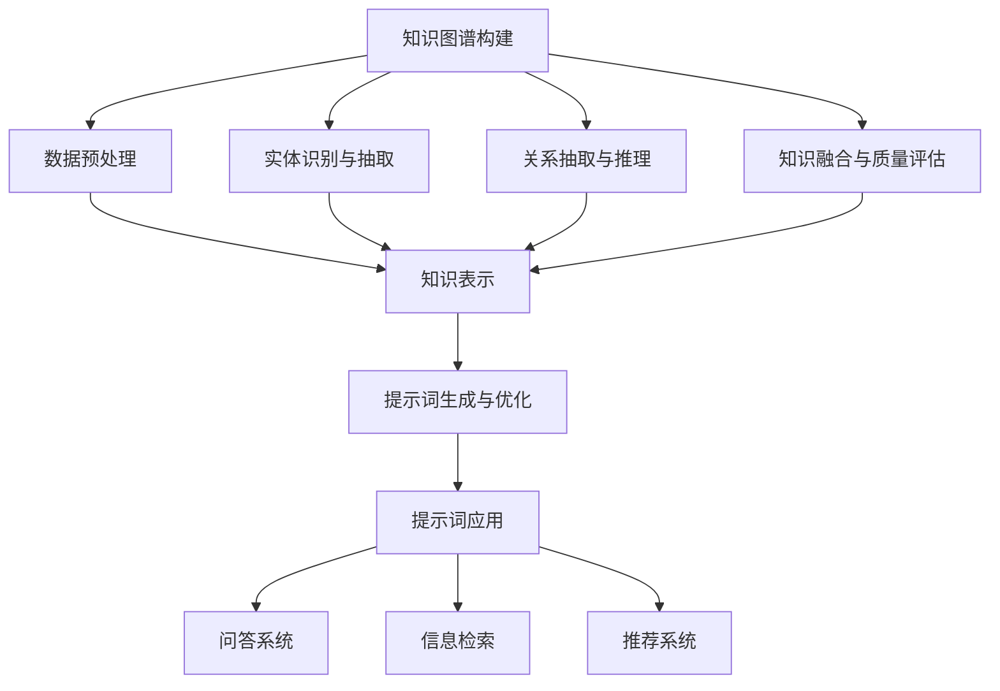

                 


### 文章标题
《提示词工程的知识图谱构建与应用》

### 关键词
知识图谱，提示词工程，知识表示，数据预处理，信息检索，问答系统，推荐系统，金融，教育，医疗

### 摘要
本文旨在探讨知识图谱与提示词工程的深度融合，详细解析知识图谱的基础概念、构建方法以及提示词工程的生成与应用。通过分析知识图谱在各领域的实际应用案例，本文揭示了知识图谱与提示词工程在推动智能信息服务和知识管理方面的重要性。文章结构包括知识图谱基础、提示词工程、实践案例以及未来展望，旨在为读者提供全面而深入的技术见解。

## 《提示词工程的知识图谱构建与应用》目录大纲

### 第一部分：知识图谱基础

#### 第1章：知识图谱概述
- 1.1 知识图谱的定义和作用
- 1.2 知识图谱的发展历程
- 1.3 知识图谱的应用场景

#### 第2章：知识图谱的表示方法
- 2.1 实体-关系-属性（E-R）模型
- 2.2 RDF（Resource Description Framework）
- 2.3 OWL（Web Ontology Language）

#### 第3章：知识图谱的构建方法
- 3.1 数据源的选择与集成
- 3.2 实体识别与抽取
- 3.3 关系抽取与推理
- 3.4 知识融合与质量评估

### 第二部分：提示词工程

#### 第4章：提示词工程的概述
- 4.1 提示词的定义和作用
- 4.2 提示词工程的目标和方法
- 4.3 提示词工程的应用场景

#### 第5章：提示词的生成与优化
- 5.1 提示词的生成方法
- 5.2 提示词的优化策略
- 5.3 提示词的性能评估

#### 第6章：基于知识图谱的提示词应用
- 6.1 提示词在问答系统中的应用
- 6.2 提示词在信息检索中的应用
- 6.3 提示词在推荐系统中的应用

### 第三部分：实践案例

#### 第7章：知识图谱在金融领域的应用
- 7.1 金融知识图谱构建
- 7.2 提示词在金融信息分析中的应用
- 7.3 案例研究：某金融公司的知识图谱建设实践

#### 第8章：知识图谱在教育领域的应用
- 8.1 教育知识图谱构建
- 8.2 提示词在教育信息检索中的应用
- 8.3 案例研究：某教育机构的知识图谱建设实践

#### 第9章：知识图谱在医疗健康领域的应用
- 9.1 医疗知识图谱构建
- 9.2 提示词在医疗信息分析中的应用
- 9.3 案例研究：某医疗机构的知识图谱建设实践

### 第四部分：未来展望与挑战

#### 第10章：知识图谱与提示词工程的发展趋势
- 10.1 新技术与应用场景的拓展
- 10.2 面临的挑战与解决方案
- 10.3 未来发展趋势与展望

#### 第11章：总结与展望
- 11.1 本书内容的总结
- 11.2 学习建议与资源推荐
- 11.3 知识图谱与提示词工程在未来的应用前景

### 附录

#### 附录A：开源知识图谱与提示词工程工具介绍
- A.1 开源知识图谱工具
- A.2 开源提示词工程工具
- A.3 工具对比与选择指南

#### 附录B：参考文献
- B.1 书籍推荐
- B.2 论文精选
- B.3 网络资源链接
- B.4 专业网站与论坛推荐

---

# 核心概念与联系

为了更好地理解和应用知识图谱与提示词工程，我们需要明确其中的核心概念及其相互关系。以下是几个关键概念的定义及其相互联系：

### 1. 知识图谱
知识图谱是一种用于表示实体、概念和它们之间关系的数据结构。它通过将现实世界中的信息抽象成图的形式，使得计算机能够以一种结构化的方式理解和处理这些信息。

### 2. 提示词
提示词是一种用于引导和优化信息检索、问答和推荐等任务的短文本。它能够提高系统的响应准确性和效率。

### 3. 知识表示
知识表示是知识图谱的核心组成部分，它定义了如何将实体、属性和关系以图形化的方式组织起来。常用的知识表示方法包括实体-关系-属性（E-R）模型、RDF和OWL等。

### 4. 数据预处理
数据预处理是知识图谱构建的基础步骤，它包括数据清洗、整合和转换等过程，目的是将原始数据转化为适合知识图谱表示的形式。

### 5. 实体识别与抽取
实体识别与抽取是从非结构化数据中识别出实体并提取其属性的过程。这是知识图谱构建的关键步骤之一。

### 6. 关系抽取与推理
关系抽取与推理是从数据中提取实体之间的关联关系，并利用推理机制扩展和验证这些关系。

### 7. 知识融合与质量评估
知识融合是将来自不同数据源的知识整合到一个统一的框架中，而质量评估则是确保知识图谱的准确性和一致性。

### 8. 提示词生成与优化
提示词生成与优化是生成高质量的提示词，以提高信息检索、问答和推荐等任务的性能。

### 9. 提示词应用
提示词在问答系统、信息检索和推荐系统中得到广泛应用，通过提示词，系统能够更精准地满足用户需求。

为了更好地理解这些概念之间的联系，我们可以使用Mermaid流程图来展示它们之间的交互关系：



通过这个流程图，我们可以清晰地看到知识图谱构建的各个步骤是如何相互关联，以及提示词工程如何在整个流程中发挥作用。

---

# 1.1 知识图谱的定义和作用

知识图谱（Knowledge Graph）是人工智能领域的关键技术之一，它通过将实体、概念和它们之间的关系以图的形式表示，为计算机提供了一种结构化的数据组织方式，使得机器能够以一种接近人类思维的方式理解和处理信息。知识图谱的概念最早由Google在2012年提出，其主要目的是为了提升搜索引擎的智能化水平，通过将网页中的信息转化为结构化的知识，从而实现更精准的搜索结果推荐。

### 定义

知识图谱是一种用于表示实体、概念和它们之间关系的数据结构。通常，它由以下几个基本要素组成：

1. **实体（Entity）**：知识图谱中的基本元素，可以是任何具有独立意义的对象，如人、地点、组织、物品等。
2. **属性（Attribute）**：描述实体的特性，如人的年龄、地点的纬度、物品的价格等。
3. **关系（Relationship）**：表示实体之间的关联，如“工作于”、“位于”等。
4. **边（Edge）**：连接两个实体的线条，代表它们之间的关系。
5. **节点（Node）**：表示图中的实体。

知识图谱的基本表示形式可以看作是一个由节点和边构成的无向图，每个节点表示一个实体，每条边表示实体之间的关系。这种表示方式使得知识图谱能够以一种直观、易理解的方式存储和查询大量结构化信息。

### 作用

知识图谱在人工智能领域有着广泛的应用，其作用主要体现在以下几个方面：

1. **搜索引擎优化**：通过构建知识图谱，搜索引擎可以更好地理解用户查询的含义，从而提供更精确的搜索结果和相关的信息推荐。
2. **智能问答系统**：知识图谱可以作为问答系统的底层结构，通过实体和关系之间的关联，实现基于自然语言的问答功能。
3. **信息检索与推荐系统**：知识图谱能够帮助信息检索和推荐系统更加精准地匹配用户需求，提升系统的用户体验。
4. **知识管理和数据整合**：知识图谱可以整合来自不同数据源的信息，提供统一的结构化数据视图，方便企业进行知识管理和数据分析。
5. **自然语言处理**：知识图谱可以为自然语言处理（NLP）任务提供丰富的语义信息，有助于提高文本分类、情感分析等任务的准确率。

### 历史发展

知识图谱的发展历程可以追溯到知识工程和语义网（Semantic Web）的概念。1998年，万维网之父蒂姆·伯纳斯·李（Tim Berners-Lee）提出了语义网的概念，旨在通过语义标记使Web上的信息更加机器可读。知识图谱作为语义网的一个重要实现形式，在2001年由霍普金斯大学的彼得·布鲁克（Peter Bruck）提出。随后，Google、Facebook、微软等科技巨头相继推出自己的知识图谱产品。

2006年，李·费尔森森（Lee Feigenbaum）等人提出了利用图论方法构建知识图谱的理论框架，这一方法极大地推动了知识图谱的发展。2012年，Google发布其知识图谱产品，标志着知识图谱技术进入实用阶段。

近年来，随着深度学习、大数据和云计算等技术的快速发展，知识图谱的应用场景不断拓展，其构建方法和应用效果也在持续优化。

### 总结

知识图谱作为一种先进的数据组织方式，它在人工智能领域的应用已经取得了显著的成果。通过将实体、概念和关系以图的形式表示，知识图谱不仅提升了信息检索和推荐的准确性，还为智能问答系统、知识管理和自然语言处理等任务提供了强有力的支持。随着技术的不断进步，知识图谱在未来有望在更多领域发挥其潜力，推动人工智能的发展。

## 1.2 知识图谱的发展历程

知识图谱（Knowledge Graph）作为一种重要的数据结构，其发展历程可以追溯到多个里程碑事件，每个阶段都有其独特的创新点和重要贡献。以下是知识图谱发展历程的几个关键阶段：

### 1. 早期探索阶段

知识图谱的概念最早可以追溯到20世纪80年代，由美国学者约翰·S·约翰逊（John S. Johnson）和乔治·费舍尔（George Fisher）在其论文《知识图谱：一种数据结构和查询语言》中提出。该论文首次定义了知识图谱的基本概念，并将其作为数据结构和查询语言，用于表示和查询复杂的关系数据。这一研究为后来的知识图谱发展奠定了理论基础。

### 2. 知识工程与语义网阶段

1998年，万维网之父蒂姆·伯纳斯·李（Tim Berners-Lee）提出了语义网（Semantic Web）的概念，旨在通过语义标记使Web上的信息更加机器可读。语义网的核心思想是将Web数据结构化为机器可处理的形式，从而实现更高效的信息检索和知识推理。这一概念推动了知识图谱的发展，使其成为实现语义网的一种主要方式。

2001年，彼得·布鲁克（Peter Bruck）在其博士论文中详细阐述了知识图谱的理论框架，提出了利用图论方法构建知识图谱的方法。这一研究对知识图谱的实际应用提供了重要的指导，成为知识图谱领域的一个重要里程碑。

### 3. 实践应用阶段

2006年，李·费尔森森（Lee Feigenbaum）等人提出了利用图论方法构建知识图谱的理论框架，这一方法极大地推动了知识图谱的发展。同年，谷歌发布了其基于知识图谱的搜索引擎，标志着知识图谱技术开始进入实用阶段。

### 4. 互联网巨头推动阶段

2012年，谷歌正式推出了其知识图谱产品，该产品通过构建大规模的知识图谱，实现了对网页内容的深度理解和精准搜索。这一举措引发了其他互联网巨头如微软、Facebook等的关注，纷纷推出自己的知识图谱产品。例如，微软的Bing搜索引入了知识图谱，Facebook则通过其社交网络数据构建了用户关系图谱。

### 5. 大数据和深度学习驱动阶段

随着大数据和深度学习的快速发展，知识图谱的构建和应用也得到了进一步的提升。大数据技术的应用使得知识图谱能够处理和分析海量结构化和非结构化数据，深度学习则帮助知识图谱在自然语言处理、图像识别等任务中实现更高的准确性和智能化。

### 6. 多领域应用拓展阶段

近年来，知识图谱在多个领域得到了广泛应用，包括金融、医疗、教育、电商等。通过结合不同领域的数据和专业知识，知识图谱能够提供更加精准和个性化的服务。例如，金融领域的知识图谱可以帮助金融机构进行客户关系管理、风险评估和投资策略优化；医疗领域的知识图谱则可以支持疾病诊断、药物研发和患者护理等。

### 总结

知识图谱的发展历程是一个不断演进的过程，从早期的理论研究到实际应用，再到大数据和深度学习技术的推动，知识图谱在人工智能和信息检索领域发挥了越来越重要的作用。未来，随着技术的进一步发展，知识图谱将在更多领域展现其潜力，成为智能系统中的重要基础设施。

## 1.3 知识图谱的应用场景

知识图谱作为一种强大的数据结构，在多个领域都有着广泛的应用。以下是知识图谱在不同领域的具体应用场景：

### 1. 搜索引擎优化

在搜索引擎领域，知识图谱的核心作用在于提升搜索结果的相关性和准确性。通过构建大规模的知识图谱，搜索引擎能够更好地理解用户查询的意图，从而提供更加精准的搜索结果。例如，当用户搜索“北京”时，搜索引擎不仅返回地理位置相关的信息，还可以提供关于北京的天气、历史、文化等多维度信息，增强用户的查询体验。

### 2. 智能问答系统

知识图谱在智能问答系统中的应用极为广泛。通过将大量结构化数据映射到知识图谱中，问答系统能够快速识别用户的问题，并从图谱中提取相关答案。例如，IBM的Watson问答系统通过知识图谱实现了对用户自然语言问题的理解，并能够提供精准的答案，广泛应用于医疗诊断、法律咨询等领域。

### 3. 信息检索与推荐系统

知识图谱能够显著提升信息检索和推荐系统的性能。在信息检索中，知识图谱可以帮助系统理解文档的内容和上下文，从而提高检索的准确性和效率。在推荐系统中，知识图谱可以捕捉用户和物品之间的关系，提供更加个性化的推荐结果。例如，Amazon和Netflix通过知识图谱实现了对用户购物和观看行为的深度理解，提供了高精度的推荐服务。

### 4. 知识管理和数据整合

企业内部的各类数据通常分散在不同的系统中，知识图谱可以帮助企业实现数据整合和统一视图。通过将企业内部的数据和外部信息映射到知识图谱中，企业可以更好地管理和利用这些数据，支持业务决策和运营优化。例如，银行可以利用知识图谱整合客户信息、交易记录和信用数据，提供个性化的金融服务。

### 5. 自然语言处理

知识图谱在自然语言处理（NLP）任务中也发挥着重要作用。通过提供丰富的背景知识和上下文信息，知识图谱可以显著提高文本分类、情感分析、实体识别等任务的准确率。例如，Google的BERT模型通过结合知识图谱和深度学习技术，实现了对文本的精细理解和处理，广泛应用于搜索引擎和信息检索等领域。

### 6. 金融领域

在金融领域，知识图谱可以用于风险控制、信用评分和投资策略优化。通过构建金融知识图谱，金融机构可以捕捉和分析大量金融数据，识别潜在风险和投资机会。例如，金融机构可以使用知识图谱对贷款申请者进行信用评估，通过分析其财务状况、信用历史和社交关系，提供更加准确的信用评分。

### 7. 医疗健康

医疗健康领域是知识图谱应用的另一个重要场景。通过构建医疗知识图谱，医疗机构可以整合患者的临床数据、医学知识库和药物信息，实现智能诊断、个性化治疗和药物研发。例如，医疗知识图谱可以帮助医生快速找到相关的病例和治疗方案，提高诊断和治疗的准确性和效率。

### 8. 教育

在教育领域，知识图谱可以用于个性化学习推荐、课程内容和教学方法的优化。通过分析学生的学习数据和学习轨迹，知识图谱可以帮助教师制定个性化的教学计划，提高教学效果和学生的学习兴趣。例如，教育平台可以利用知识图谱为不同水平的学生推荐合适的课程和学习资源。

### 9. 电商

在电子商务领域，知识图谱可以用于商品推荐、用户行为分析和市场预测。通过构建商品知识图谱，电商平台可以更好地理解用户的购物偏好和行为模式，提供个性化的商品推荐和促销活动。例如，阿里巴巴通过商品知识图谱实现了精准的购物推荐，提高了用户满意度和转化率。

### 10. 物联网

在物联网（IoT）领域，知识图谱可以用于设备管理和智能分析。通过将物联网设备的数据和设备之间的关系映射到知识图谱中，可以实现对设备的智能管理和故障预测。例如，智能家居系统可以利用知识图谱实现设备的自动配置和故障诊断，提高系统的可靠性和用户体验。

### 总结

知识图谱在多个领域的应用不仅提升了系统的智能化水平和用户体验，也为企业和行业带来了新的商业模式和价值。随着技术的不断进步，知识图谱将在更多领域发挥其潜力，成为未来智能系统的重要组成部分。

## 2.1 实体-关系-属性（E-R）模型

实体-关系-属性（Entity-Relationship-Attribute，简称E-R）模型是知识图谱表示方法中的一种重要基础模型，它用于描述现实世界中的实体及其关系。E-R模型起源于数据库设计领域，旨在通过图形化的方式来表示实体、属性和关系，使得数据结构更加直观和易于理解。

### 基本概念

1. **实体（Entity）**：在E-R模型中，实体是知识图谱中的基本单元，它代表了现实世界中具有独立意义的事物。例如，在一个大学数据库中，学生、课程和教师都是实体。

2. **关系（Relationship）**：关系描述了实体之间的关联。例如，在大学数据库中，学生与课程之间存在选修关系，教师与课程之间存在授课关系。

3. **属性（Attribute）**：属性描述了实体的特性或特征。例如，学生实体可能具有学号、姓名、年龄等属性。

### E-R图的组成部分

1. **实体集（Entity Set）**：包含多个实体，每个实体由一个唯一的标识符表示。

2. **关系集（Relationship Set）**：包含多个关系，每个关系也由一个唯一的标识符表示。

3. **属性集（Attribute Set）**：包含多个属性，每个属性也与实体和关系相关联。

4. **联系（Link）**：表示实体之间的连接，以及实体与属性之间的连接。

### 举例

以大学数据库为例，假设我们有三个实体：学生、课程和教师。每个实体都有若干属性，关系则描述了这些实体之间的交互。

- **学生实体**：包含学号、姓名、年龄、性别等属性。
- **课程实体**：包含课程编号、课程名称、学分等属性。
- **教师实体**：包含教师编号、姓名、职称等属性。

关系如下：
- 学生选修课程
- 教师授课课程

E-R图可以表示如下：

```
[学生] --<选修>-- [课程]
   |               |
   |               |
   |               |
[教师] --<授课>-- [课程]
```

### 优点

1. **直观性**：E-R图通过图形化的方式直观地展示了实体、关系和属性，使得数据模型易于理解和沟通。
2. **扩展性**：E-R模型允许添加新的实体和关系，使得数据模型能够灵活适应变化的需求。
3. **通用性**：E-R模型不仅适用于数据库设计，也可用于知识图谱构建，提供了广泛的适用性。

### 缺点

1. **复杂性**：对于大规模的知识图谱，E-R模型可能变得复杂和难以管理。
2. **冗余**：E-R模型可能引入冗余数据，增加存储和处理的开销。

总之，E-R模型作为一种基础知识图谱表示方法，具有直观性和灵活性，适合于构建中小规模的知识图谱。在实际应用中，E-R模型通常与其他知识图谱表示方法如RDF和OWL相结合，以克服其局限性。

## 2.2 RDF（Resource Description Framework）

RDF（Resource Description Framework，资源描述框架）是知识图谱表示方法的一种标准，它采用一种基于图形的数据模型，用于表示实体、属性和关系。RDF旨在提供一种统一的方式，来表示和理解各种类型的网络资源，从而实现不同数据源之间的互操作性。

### 基本概念

1. **资源（Resource）**：在RDF中，任何可以被标识的事物都可以被视为资源。资源可以是网页、文件、数据库中的记录，甚至是抽象的概念。

2. **主体（Subject）**：主体是RDF图中的一个节点，表示一个资源。

3. **谓词（Predicate）**：谓词是连接主体和对象的属性，表示关系或属性。例如，"＜居住在＞"或"＜属于＞"。

4. **对象（Object）**：对象也是RDF图中的一个节点，表示资源的属性值或关系的目标。

5. **属性（Attribute）**：属性是对象的一个属性，用于进一步描述对象。

### 数据模型

RDF使用三元组（Subject-Predicate-Object）来表示知识图谱中的信息。每个三元组代表了一个事实，多个三元组组合起来，就构成了一个完整的知识图谱。

例如：
- **主体**：＜张三＞
- **谓词**：＜居住在＞
- **对象**：＜北京＞

这个三元组表示“张三居住在北京”。

### 优点

1. **互操作性**：RDF是一种基于XML的标记语言，支持各种数据源之间的互操作，便于不同系统之间的数据交换。
2. **标准化**：RDF是W3C推荐标准，遵循Web标准，确保了数据的通用性和可扩展性。
3. **灵活性**：RDF允许自定义谓词，使得知识图谱能够灵活地适应各种应用场景。

### 缺点

1. **复杂性**：RDF的三元组表示方法虽然简单，但对于大规模知识图谱，其表示方式可能过于冗长，增加存储和处理的复杂性。
2. **可读性**：与E-R模型相比，RDF的表示方式在视觉上可能不那么直观。

### 应用实例

- **搜索引擎**：RDF用于构建搜索引擎的知识图谱，使得搜索引擎能够更准确地理解用户查询，提供相关且精准的搜索结果。
- **本体工程**：RDF是构建本体（Ontology）的一种常用方法，本体是描述特定领域知识结构的形式化模型。

### 总结

RDF作为知识图谱表示方法的一种标准，其基于图形的数据模型在数据互操作性和标准化方面具有显著优势。尽管RDF在某些情况下可能显得复杂，但其灵活性和广泛的应用使其成为构建知识图谱的一种重要工具。

## 2.3 OWL（Web Ontology Language）

OWL（Web Ontology Language，Web本体语言）是用于构建语义网和知识图谱的一种形式化语言，它扩展了RDF，提供了更加丰富和精确的语义描述能力。OWL旨在提供一种标准化的方法来定义词汇、概念及其之间的关系，使得计算机能够更加准确地理解和处理语义信息。

### 基本概念

1. **概念（Class）**：OWL中的概念是对具有共同特征的对象的抽象集合。例如，“人”、“动物”等。

2. **个体（Individual）**：个体是具体的对象实例，它是概念的实例化。例如，“张三”、“李四”等。

3. **属性（Property）**：属性是用于描述概念之间关系的特征。OWL中的属性分为对象属性和数据属性。对象属性用于描述概念之间的关系，如“居住在”；数据属性用于描述概念的属性值，如“年龄”。

4. **量词**：OWL支持量词，如全称量词（All）和存在量词（Some），用于限定属性或关系的范围。

### 数据模型

OWL采用RDF的数据模型，但增加了更多的语义描述能力。OWL的基本数据模型包括：

- **个体**：表示具体的对象实例。
- **概念**：表示具有共同特征的对象集合。
- **属性**：表示概念之间的关系。
- **数据类型**：用于定义属性值的类型。

OWL通过以下方式来扩展RDF：

1. **类表达**：OWL提供了丰富的类表达方式，包括集合操作（并集、交集、补集）、量化表达（全称量词、存在量词）等，使得可以更加精确地定义概念之间的关系。

2. **属性约束**：OWL可以定义属性的限制条件，如属性值的范围、数据类型等，增强了属性的语义描述能力。

3. **数据类型**：OWL支持多种数据类型，如整数、浮点数、字符串等，使得可以更精确地描述属性值。

### 优点

1. **语义丰富**：OWL提供了丰富的语义描述能力，使得知识图谱能够更准确地表示现实世界中的复杂关系。

2. **形式化**：OWL是一种形式化语言，其定义的语义是明确和一致的，有助于自动化推理和知识发现。

3. **标准化**：OWL是W3C的标准，遵循Web标准，确保了其在不同系统和平台上的互操作性。

### 缺点

1. **复杂性**：OWL的语法和语义相对复杂，编写和解析OWL知识图谱需要较高的技术门槛。

2. **性能问题**：由于OWL的语义丰富性，其处理复杂度较高，可能导致查询和处理速度较慢。

### 应用实例

1. **语义网**：OWL是构建语义网的关键技术之一，它为语义网中的资源提供了精确的语义描述，使得计算机能够更好地理解和处理网络上的信息。

2. **知识管理**：OWL用于构建企业内部的知识库，通过定义概念、属性和关系，实现知识的结构化和共享。

3. **信息检索**：OWL可以用于优化搜索引擎和数据库的查询，通过精确的语义描述，提高信息检索的准确性和效率。

### 总结

OWL作为知识图谱表示方法的一种高级形式，其在语义描述和形式化方面具有显著优势。尽管OWL的复杂性可能带来一定的学习和使用难度，但其强大的语义表达能力使其成为构建复杂知识图谱的重要工具。

## 3.1 数据源的选择与集成

在知识图谱的构建过程中，数据源的选择与集成是一个关键步骤，它直接影响到知识图谱的质量和应用效果。选择合适的数据源和有效集成各种数据是确保知识图谱准确性和全面性的基础。

### 数据源的选择

1. **公开数据集**：公开数据集是构建知识图谱的重要来源之一。例如，DBpedia、Freebase、Linked Data Cloud等都是高质量的开源知识库，提供了丰富的实体和关系信息。

2. **企业内部数据**：企业内部数据源包括数据库、日志文件、文档库等，这些数据源可以提供企业特定的知识信息，如客户数据、产品信息、销售记录等。

3. **社交媒体数据**：社交媒体平台如Facebook、Twitter等提供了大量的用户生成内容，这些数据可以用于提取用户行为和社交关系信息，丰富知识图谱。

4. **专业数据库**：专业数据库如医学数据库、金融数据库等，提供了特定领域内的详尽数据，可用于构建专业化的知识图谱。

### 数据集集成方法

1. **数据抽取**：数据抽取是从原始数据源中提取有用信息的过程。常用的数据抽取方法包括基于规则的方法、机器学习方法等。例如，使用自然语言处理技术从文本中抽取实体和关系。

2. **数据清洗**：数据清洗是处理和清理数据的过程，包括去除重复数据、纠正错误数据、填充缺失数据等。数据清洗是确保数据质量的重要步骤。

3. **数据融合**：数据融合是将来自多个数据源的信息整合到一个统一的数据集中。数据融合的方法包括数据对齐、数据融合算法等。例如，使用匹配算法将不同来源的实体进行关联。

4. **数据转换**：数据转换是将原始数据转换为知识图谱表示的过程。常用的数据转换方法包括数据格式转换、数据规范化等。例如，将关系数据库中的数据转换为RDF格式。

### 实例分析

以构建一个金融知识图谱为例，数据源可能包括：

- **公开数据集**：如DBpedia、Yahoo Finance提供的历史股价数据、公司信息等。
- **企业内部数据**：如银行的客户信息、交易记录、理财产品数据等。
- **社交媒体数据**：如Twitter上的市场情绪分析数据、社交媒体上的投资建议等。
- **专业数据库**：如Wind金融终端提供的市场动态、宏观经济数据等。

数据集成过程可能包括：

1. **数据抽取**：从公开数据集中抽取公司基本信息、历史股价数据；从社交媒体中抽取市场情绪数据；从企业内部数据中抽取客户信息、交易记录等。

2. **数据清洗**：清洗数据，去除重复和错误数据，如去除包含错误信息的社交媒体帖子。

3. **数据融合**：将不同来源的实体和关系进行关联，例如，将社交媒体上的公司名称与DBpedia中的公司实体进行匹配。

4. **数据转换**：将数据转换为RDF格式，建立实体-关系-属性模型，构建知识图谱。

### 总结

数据源的选择与集成是知识图谱构建的基础，它需要综合考虑数据的多样性、质量以及应用场景。通过合理选择数据源和有效集成数据，可以构建出高质量、全面的知识图谱，为智能应用提供强有力的支持。

## 3.2 实体识别与抽取

实体识别与抽取是知识图谱构建过程中的关键步骤，它涉及从非结构化数据中识别出实体并提取其实体属性。实体识别与抽取的目的是将原始数据转化为结构化的知识，以便在后续步骤中进行关系抽取、推理和质量评估。

### 实体识别

1. **基本概念**：实体识别（Entity Recognition）是从文本中识别出实体实例的过程。实体可以是人、地点、组织、物品等具有独立意义的事物。

2. **方法**：
   - **规则方法**：通过预先定义的规则，从文本中识别实体。例如，基于正则表达式或词典匹配的方法。
   - **机器学习方法**：使用监督学习、无监督学习或半监督学习方法进行实体识别。常用的模型包括条件随机场（CRF）、长短期记忆网络（LSTM）和变压器（Transformer）等。

3. **实例**：以一个新闻文章为例，文本中包含以下实体：
   - “张三”是一个人名实体。
   - “北京”是一个地点实体。
   - “微软”是一个组织实体。

4. **伪代码**：
   ```
   def entity_recognition(text):
       # 使用预训练的实体识别模型
       model = load_pretrained_entity_recognition_model()
       entities = model.predict(text)
       return entities
   ```

### 实体抽取

1. **基本概念**：实体抽取（Entity Extraction）是从文本中提取实体及其属性的过程。实体抽取不仅识别出实体，还要提取与实体相关的属性，如姓名、地址、电子邮件等。

2. **方法**：
   - **基于规则的方法**：使用预先定义的规则和模式，从文本中提取实体属性。例如，从电子邮件地址中提取电子邮件地址，从电话号码中提取电话号码。
   - **基于机器学习的方法**：使用监督学习、无监督学习或半监督学习模型，从文本中学习如何提取实体属性。常用的模型包括序列标注模型（如CRF、LSTM）和生成模型（如BERT、GPT）。

3. **实例**：从句子“张三在北京工作，他的联系电话是1234567890”中，可以抽取以下实体及其属性：
   - 实体：张三
     - 属性：工作地点（北京），联系电话（1234567890）

4. **伪代码**：
   ```
   def entity_extraction(text):
       # 使用预训练的实体抽取模型
       model = load_pretrained_entity_extraction_model()
       entities = model.predict(text)
       return entities
   ```

### 总结

实体识别与抽取是知识图谱构建的重要环节，通过识别文本中的实体并提取其属性，可以构建出结构化的知识库。采用先进的机器学习技术和预训练模型，可以显著提高实体识别与抽取的准确性和效率。在实际应用中，这些技术被广泛应用于信息检索、智能问答、推荐系统等领域，为智能信息服务提供了强有力的支持。

## 3.3 关系抽取与推理

关系抽取与推理是知识图谱构建中的关键步骤，它涉及从文本中识别出实体之间的关联关系，并进行逻辑推理，以扩展和验证这些关系。这一过程对于构建完整、准确的知识图谱至关重要。

### 关系抽取

1. **基本概念**：关系抽取（Relationship Extraction）是指从文本数据中识别出实体之间的关系。关系可以是实体之间的交互、属性值、地理位置等。

2. **方法**：
   - **基于规则的方法**：通过预定义的规则和模式，从文本中识别出实体关系。例如，使用正则表达式匹配特定的文本模式。
   - **基于统计的方法**：使用统计学习模型，如条件随机场（CRF）、支持向量机（SVM）等，从训练数据中学习关系抽取的规则。
   - **基于深度学习的方法**：使用深度神经网络模型，如循环神经网络（RNN）、长短时记忆网络（LSTM）、变压器（Transformer）等，通过端到端的方式实现关系抽取。

3. **实例**：从句子“张三在北京工作，他毕业于清华大学”中，可以抽取以下关系：
   - 张三 - 毕业于 - 清华大学
   - 张三 - 工作地点 - 北京

4. **伪代码**：
   ```
   def relationship_extraction(text):
       # 使用预训练的关系抽取模型
       model = load_pretrained_relationship_extraction_model()
       relationships = model.predict(text)
       return relationships
   ```

### 关系推理

1. **基本概念**：关系推理（Relationship Inference）是指利用已有实体关系进行逻辑推理，生成新的关系或验证已有关系的正确性。

2. **方法**：
   - **基于规则的推理**：使用预定义的推理规则，从实体关系中推导出新的关系。例如，如果实体A与实体B有关联，而实体B与实体C有关联，则可以推断实体A与实体C也有关系。
   - **基于统计的推理**：使用统计学习模型，从训练数据中学习关系推理的规则。
   - **基于深度学习的推理**：使用深度神经网络模型，通过学习实体关系的模式，进行推理。

3. **实例**：假设已有关系：
   - 张三 - 工作 - 微软
   - 微软 - 位于 - 北京
   通过推理可以得出：
   - 张三 - 位于 - 北京

4. **伪代码**：
   ```
   def relationship_inference(entities, relationships):
       # 使用预训练的关系推理模型
       model = load_pretrained_relationship_inference_model()
       inferred_relationships = model.predict(entities, relationships)
       return inferred_relationships
   ```

### 总结

关系抽取与推理是构建高质量知识图谱的核心步骤，通过从文本中识别实体关系并进行逻辑推理，可以扩展和验证知识图谱的内容。采用先进的机器学习和深度学习技术，可以显著提高关系抽取与推理的准确性和效率。在实际应用中，这些技术被广泛应用于信息检索、问答系统、推荐系统等领域，为智能信息服务提供了强有力的支持。

## 3.4 知识融合与质量评估

知识融合（Knowledge Fusion）和质量评估（Quality Assessment）是知识图谱构建过程中的关键步骤，旨在将来自不同数据源的信息整合到一个统一的框架中，并确保知识图谱的准确性和一致性。

### 知识融合

1. **基本概念**：知识融合是指将多个数据源中的信息整合到一个统一的框架中，以创建一个完整、一致的图谱。这一过程涉及到数据对齐、数据融合和一致性处理。

2. **方法**：
   - **数据对齐**：通过匹配不同数据源中的实体和关系，确保不同数据源之间的信息能够正确关联。常用的方法包括基于内容的匹配、基于属性的匹配等。
   - **数据融合**：将多个数据源中的信息进行整合，以创建一个统一的视图。数据融合的方法包括最小闭集、最大匹配等。
   - **一致性处理**：确保融合后的知识图谱在语义上一致。这可能涉及到消除冲突、合并重复信息等。

3. **实例**：假设有两个数据源，A和B，其中包含相同的实体和关系。通过对齐和融合，可以将这两个数据源的信息整合到一个统一的知识图谱中，确保没有冲突和重复的信息。

4. **伪代码**：
   ```
   def knowledge_fusion(data_source_a, data_source_b):
       aligned_data = align_data(data_source_a, data_source_b)
       fused_data = fuse_data(aligned_data)
       return fused_data
   ```

### 质量评估

1. **基本概念**：知识图谱的质量评估是指对知识图谱的准确性、一致性、完整性等方面进行评估，以确保其能够满足实际应用的需求。

2. **方法**：
   - **准确性评估**：通过对比知识图谱中的事实和真实世界中的信息，评估知识图谱的准确性。常用的方法包括自动评估和人工评估。
   - **一致性评估**：确保知识图谱中的关系和事实在语义上一致。例如，检查是否存在逻辑矛盾或数据冲突。
   - **完整性评估**：评估知识图谱是否包含所有相关的实体和关系，以确保其完整性。

3. **实例**：对一个金融知识图谱进行质量评估，可以通过以下步骤：
   - 检查知识图谱中是否存在明显的错误或矛盾。
   - 对知识图谱中的事实进行抽样，与外部数据源进行比对，评估准确性。
   - 检查知识图谱中的实体和关系是否完整，是否存在遗漏。

4. **伪代码**：
   ```
   def quality_assessment(knowledge_graph):
       accuracy = assess_accuracy(knowledge_graph)
       consistency = assess_consistency(knowledge_graph)
       completeness = assess_completeness(knowledge_graph)
       return accuracy, consistency, completeness
   ```

### 总结

知识融合和质量评估是知识图谱构建过程中的关键环节，通过知识融合可以整合多个数据源的信息，创建一个统一、一致的图谱；通过质量评估可以确保知识图谱的准确性和一致性。这些步骤对于构建高质量的知识图谱至关重要，为智能应用提供了可靠的语义基础。

## 4.1 提示词的定义和作用

提示词（Prompt Word）是一种用于引导和优化信息检索、问答和推荐等任务的短文本。它在这些任务中起到了至关重要的作用，能够显著提高系统的响应准确性和效率。提示词的定义和作用可以概括如下：

### 提示词的定义

提示词是一种短文本，用于向系统提供关于用户查询、上下文或任务目标的额外信息。它通常是一个词或短语，能够帮助系统更好地理解和处理复杂的信息需求。例如，在问答系统中，提示词可以是一个问题中的关键词，用于引导系统提供准确的答案。

### 提示词的作用

1. **提高检索精度**：在信息检索任务中，提示词可以帮助搜索引擎或数据库更精确地理解用户查询的意图，从而提供更加相关的检索结果。例如，当用户查询“北京天气”时，提示词“北京”和“天气”能够明确查询的范围和内容，提高检索的准确性。

2. **优化问答系统**：在问答系统中，提示词可以引导系统从大量信息中提取出用户需要的答案。例如，当用户提问“张三在哪里工作？”时，提示词“张三”和“工作”能够帮助系统快速定位到相关的信息，并提供准确的回答。

3. **增强推荐系统效果**：在推荐系统中，提示词可以帮助系统更好地理解用户偏好和需求，从而提供更加个性化的推荐结果。例如，当用户浏览电商网站时，提示词可以包括用户最近浏览的商品、搜索关键词等，帮助系统推荐相关商品。

### 提示词的类型

1. **关键词提示词**：这类提示词通常用于信息检索任务，包含用户查询的核心词。例如，“苹果”可以作为关键词提示词，帮助系统查找与苹果相关的信息。

2. **上下文提示词**：这类提示词用于提供查询或任务的具体上下文信息。例如，在医疗问答系统中，上下文提示词可以是“糖尿病”或“心脏病”，帮助系统理解用户的具体需求。

3. **目标提示词**：这类提示词用于明确任务的目标或期望的结果。例如，在推荐系统中，目标提示词可以是“购物”或“旅游”，帮助系统确定推荐的方向。

### 举例

- **信息检索**：当用户查询“北京天气”时，提示词为“北京”和“天气”，帮助系统准确查找与北京天气相关的信息。
- **问答系统**：当用户提问“张三在哪里工作？”时，提示词为“张三”和“工作”，引导系统从知识图谱中提取出与张三工作相关的信息。
- **推荐系统**：当用户浏览电商网站时，提示词为“最近浏览的商品”和“搜索关键词”，帮助系统推荐用户可能感兴趣的商品。

### 总结

提示词作为一种重要的信息引导工具，在信息检索、问答系统和推荐系统中发挥了关键作用。通过合理使用提示词，系统能够更好地理解用户需求，提供更加准确和个性化的服务，提升用户体验。

## 4.2 提示词工程的目标和方法

提示词工程是一种系统化的方法，旨在生成和优化用于引导信息检索、问答和推荐等任务的提示词。其核心目标是通过分析和理解用户需求和上下文，生成高质量的提示词，从而提高系统的响应准确性和用户体验。

### 目标

1. **提高检索精度**：通过生成与用户查询高度相关的提示词，提高信息检索系统的准确性和效率，确保用户能够获得最相关的检索结果。
2. **优化问答体验**：为问答系统提供精准的提示词，帮助系统更好地理解用户的问题，提供准确、快速的回答。
3. **增强推荐效果**：为推荐系统提供能够反映用户兴趣和偏好的提示词，提高推荐的相关性和个性化程度，增强用户的购物和娱乐体验。

### 方法

1. **数据收集与预处理**：
   - 收集大量与目标应用场景相关的文本数据，如搜索日志、用户提问、用户行为数据等。
   - 对原始数据进行清洗和预处理，包括去除停用词、词干提取、分词等，以获得高质量的文本数据。

2. **特征提取**：
   - 使用文本特征提取技术，如词袋模型、TF-IDF、Word2Vec等，从预处理后的文本数据中提取关键特征。
   - 对于问答系统和推荐系统，还可以提取用户行为特征和上下文特征，如搜索历史、浏览记录、评价等。

3. **提示词生成**：
   - 采用基于规则的方法，如正则表达式匹配、关键词提取等，从文本数据中生成初步的提示词。
   - 使用机器学习算法，如朴素贝叶斯、支持向量机、深度学习模型（如Transformer、BERT）等，从特征数据中学习生成高质量的提示词。

4. **提示词优化**：
   - 通过实验和用户反馈，评估不同提示词的性能，选择最有效的提示词组合。
   - 采用优化策略，如提示词长度、多样性、覆盖率等，调整和优化提示词，以提高系统性能。
   - 运用在线学习技术，根据用户反馈和系统表现，动态调整提示词，实现持续优化。

5. **性能评估**：
   - 使用准确率、召回率、F1值等指标，评估提示词生成和优化的效果。
   - 通过用户调查、A/B测试等手段，验证优化后的提示词对用户体验的提升。

### 举例

- **信息检索**：从用户搜索日志中提取关键词，使用TF-IDF算法生成提示词，优化搜索结果的相关性。
- **问答系统**：从用户提问中提取关键词和上下文信息，使用BERT模型生成提示词，提高问答系统的回答准确性。
- **推荐系统**：从用户行为数据和商品描述中提取关键词和用户兴趣标签，使用深度学习模型生成提示词，提高推荐系统的个性化程度。

### 总结

提示词工程通过系统化的方法，从数据收集、预处理、特征提取到提示词生成和优化，旨在生成高质量、个性化的提示词，提升信息检索、问答和推荐等任务的性能。在实际应用中，合理设计和优化提示词工程流程，能够显著提升系统的用户体验和业务价值。

## 4.3 提示词工程的应用场景

提示词工程在信息检索、问答系统和推荐系统等场景中具有广泛的应用，通过提高系统的响应准确性和用户体验，为用户提供更加智能、个性化的服务。

### 信息检索

在信息检索中，提示词工程的目标是帮助系统更准确地理解用户查询，提供相关且精准的搜索结果。通过以下方法，提示词工程在信息检索中发挥了重要作用：

1. **关键词提取**：从用户查询中提取关键词，如“北京天气”，这些关键词作为提示词，帮助搜索引擎快速定位到与查询相关的信息。
2. **上下文扩展**：结合用户的搜索历史和浏览记录，扩展提示词，提高查询的上下文理解能力。例如，如果用户近期搜索了“北京旅游景点”，则可以将“旅游景点”作为提示词，提高搜索结果的准确性。
3. **多语言支持**：在多语言环境中，提示词工程可以帮助系统处理不同语言的查询，例如，将中文查询转换为英文查询，提高搜索结果的国际化能力。
4. **实时更新**：通过实时分析用户搜索行为，动态调整提示词，以适应用户当前的兴趣和需求，提高检索的时效性和准确性。

### 问答系统

问答系统利用提示词工程，可以从海量知识库中快速准确地提取答案，提升用户问答体验。以下是提示词工程在问答系统中的应用：

1. **关键词匹配**：从用户提问中提取关键词，如“张三的工作是什么？”，将这些关键词与知识库中的实体和关系进行匹配，找到相关答案。
2. **上下文分析**：分析用户提问的上下文，如时间、地点、背景等信息，为系统提供更准确的答案。例如，当用户提问“2023年北京市的天气如何？”时，系统需要考虑当年的实际天气情况。
3. **多模态处理**：结合文本和图像等多模态信息，提高问答系统的理解能力。例如，当用户上传一张照片并提问“这张图片是哪个城市的景色？”时，系统可以通过图像识别技术提取提示词，结合知识库中的信息，提供准确的答案。
4. **个性化推荐**：根据用户的历史问答记录和偏好，生成个性化的提示词，提供更符合用户需求的答案。例如，如果用户经常提问关于健康方面的问题，系统可以自动推荐相关的健康知识库内容。

### 推荐系统

在推荐系统中，提示词工程通过生成和优化提示词，提高推荐的相关性和个性化程度：

1. **用户兴趣识别**：从用户行为数据中提取关键词和兴趣标签，如用户浏览记录、搜索关键词、评价等，生成提示词，帮助推荐系统更好地理解用户兴趣。
2. **商品特征提取**：从商品描述、分类、标签等数据中提取关键词和特征，如“电子产品”、“智能手表”、“高性价比”等，作为提示词，帮助系统匹配用户兴趣和商品特征。
3. **上下文敏感推荐**：结合用户当前的上下文信息，如时间、地点、购买历史等，生成上下文敏感的提示词，提高推荐的相关性。例如，当用户在晚上浏览商品时，系统可以推荐夜用型的商品。
4. **多维度优化**：通过多维度数据分析，如用户行为、商品特征、上下文信息等，生成多维度的提示词，实现个性化推荐。例如，结合用户的购物车数据和浏览历史，推荐用户可能感兴趣的商品。

### 举例

- **信息检索**：用户查询“北京旅游景点”，系统提取关键词“北京”和“旅游景点”，结合用户历史搜索记录，提供最相关的旅游信息。
- **问答系统**：用户提问“张三的工作是什么？”，系统提取关键词“张三”和“工作”，从知识库中找到张三的职业信息。
- **推荐系统**：用户浏览了多个电子产品，系统提取关键词“电子产品”和用户兴趣标签，推荐相关的智能手表和音响设备。

### 总结

提示词工程在信息检索、问答系统和推荐系统中的应用，通过精准理解和引导用户需求，显著提升了系统的智能化水平和用户体验。随着技术的不断进步，提示词工程将在更多领域和任务中发挥其重要作用，推动人工智能的发展和应用。

## 5.1 提示词的生成方法

提示词的生成是提示词工程中的核心步骤，其质量直接影响到信息检索、问答系统和推荐系统的性能。以下是几种常用的提示词生成方法：

### 1. 基于规则的方法

**基本概念**：基于规则的方法通过预定义的规则和模式，从文本数据中生成提示词。

**实现步骤**：
- **规则定义**：根据应用场景，定义一组用于匹配提示词的规则。例如，对于信息检索，可以定义匹配关键词、地名、人名的规则。
- **模式匹配**：遍历文本数据，应用预定义的规则，提取匹配的文本片段作为提示词。

**优点**：实现简单，规则明确，适合对规则明确的应用场景。

**缺点**：规则覆盖范围有限，对于复杂的文本和多样的应用场景，难以满足需求。

**适用场景**：信息检索、简单问答系统。

**伪代码**：
```python
def rule_based_prompt_generation(text):
    # 定义规则
    rules = define_rules()
    prompts = []
    for rule in rules:
        match = rule.match(text)
        if match:
            prompts.append(match)
    return prompts
```

### 2. 基于统计的方法

**基本概念**：基于统计的方法通过分析文本数据中的统计信息，生成提示词。

**实现步骤**：
- **词频统计**：计算文本数据中各个词或短语的频率，提取高频词或短语作为候选提示词。
- **文本相似性分析**：使用TF-IDF、Word2Vec等方法，计算文本的相似性，从相似文本中提取共性词汇作为提示词。

**优点**：方法简单，能够处理大量文本数据，适应多种应用场景。

**缺点**：对于复杂语义的提取能力有限，提示词的准确性和多样性可能不足。

**适用场景**：信息检索、文本分类、推荐系统。

**伪代码**：
```python
def statistical_prompt_generation(texts):
    # 计算词频和相似性
    word_frequencies = compute_word_frequencies(texts)
    text_similarity = compute_text_similarity(texts)
    # 提取高频词和共性词汇
    high_freq_words = extract_high_freq_words(word_frequencies)
    common_terms = extract_common_terms(text_similarity)
    return high_freq_words + common_terms
```

### 3. 基于机器学习的方法

**基本概念**：基于机器学习的方法通过训练模型，从大量标注数据中学习生成提示词的方法。

**实现步骤**：
- **数据准备**：收集大量标注数据，标注数据中的每个文本片段都有一个或多个对应的提示词。
- **模型训练**：使用标注数据训练模型，例如序列标注模型（如CRF、LSTM）或生成模型（如BERT、GPT）。
- **生成提示词**：在新的文本数据上，使用训练好的模型生成提示词。

**优点**：能够学习复杂语义，适应多变的应用场景，生成高质量的提示词。

**缺点**：训练过程复杂，需要大量标注数据，模型解释性较弱。

**适用场景**：复杂问答系统、推荐系统、信息检索。

**伪代码**：
```python
def machine_learning_prompt_generation(text):
    # 加载预训练模型
    model = load_pretrained_model()
    # 生成提示词
    prompts = model.generate(text)
    return prompts
```

### 4. 基于深度学习的方法

**基本概念**：基于深度学习的方法利用深度神经网络，如Transformer、BERT等，学习从文本数据中生成提示词。

**实现步骤**：
- **数据准备**：收集大规模文本数据，并使用预训练的深度学习模型进行微调。
- **模型训练**：对模型进行训练，使其能够生成高质量的提示词。
- **生成提示词**：使用训练好的深度学习模型，从文本数据中生成提示词。

**优点**：能够处理复杂语义，生成高质量的提示词，适应多种应用场景。

**缺点**：模型训练过程需要大量计算资源和时间，模型解释性较弱。

**适用场景**：复杂问答系统、推荐系统、信息检索。

**伪代码**：
```python
def deep_learning_prompt_generation(text):
    # 加载预训练模型
    model = load_pretrained_model()
    # 生成提示词
    prompts = model.generate(text)
    return prompts
```

### 总结

提示词生成方法的选择取决于具体的应用场景和数据特点。基于规则的方法适用于简单场景，基于统计的方法能够处理大量文本数据，而基于机器学习和深度学习的方法能够生成高质量的提示词，适应复杂场景。在实际应用中，可以结合多种方法，以实现最优效果。

## 5.2 提示词的优化策略

为了提高提示词的质量和系统的性能，提示词优化策略是至关重要的。以下是几种常见的提示词优化策略及其实现方法：

### 1. 性能评估

**基本概念**：性能评估是评估提示词性能的关键步骤，常用的评估指标包括准确率、召回率、F1值等。

**实现方法**：
- **指标计算**：使用评估指标，如准确率、召回率和F1值，计算提示词的性能。
  $$ \text{准确率} = \frac{\text{正确预测的提示词数量}}{\text{总预测的提示词数量}} $$
  $$ \text{召回率} = \frac{\text{正确预测的提示词数量}}{\text{实际存在的提示词数量}} $$
  $$ \text{F1值} = 2 \times \frac{\text{准确率} \times \text{召回率}}{\text{准确率} + \text{召回率}} $$

- **交叉验证**：使用交叉验证方法，对提示词生成和优化过程进行评估，以避免过拟合。

### 2. 多样性增强

**基本概念**：多样性增强是指生成具有多样性的提示词，以避免生成重复的或过于相似的信息。

**实现方法**：
- **提示词长度控制**：通过限制提示词的长度，确保生成的提示词具有多样性。
- **词汇丰富性**：使用丰富的词汇库，从不同角度和层面提取提示词，增加多样性。
- **随机性引入**：在生成提示词的过程中引入随机性，避免生成模式化提示词。

### 3. 提示词的上下文相关性

**基本概念**：上下文相关性是指提示词应与上下文环境紧密相关，以提高系统的响应准确性。

**实现方法**：
- **上下文嵌入**：使用预训练的上下文嵌入模型（如BERT、GPT），将提示词与上下文信息进行整合，提高提示词的上下文相关性。
- **词向量相似性**：通过计算提示词和上下文的词向量相似性，选择与上下文最为相关的提示词。
- **基于规则的相关性调整**：根据应用场景，定义提示词与上下文的关联规则，动态调整提示词，确保其与上下文紧密相关。

### 4. 提示词的覆盖范围

**基本概念**：覆盖范围是指提示词应尽可能覆盖更多的相关内容，以提高系统的全面性。

**实现方法**：
- **主题模型**：使用主题模型（如LDA），从文本数据中提取主题，确保提示词能够覆盖多个主题。
- **多维度特征融合**：将文本、图像、音频等多模态特征进行融合，生成具有全面性的提示词。
- **长文本处理**：使用长文本处理技术（如Transformer），处理长文本数据，确保提示词能够覆盖文本的各个部分。

### 5. 提示词的在线更新

**基本概念**：在线更新是指根据用户反馈和实时数据，动态调整和更新提示词。

**实现方法**：
- **用户行为分析**：分析用户的点击、搜索、评价等行为，根据用户反馈动态调整提示词。
- **实时数据流处理**：使用实时数据处理技术（如Apache Kafka、Flink），对用户实时数据进行处理，动态生成和更新提示词。
- **机器学习模型更新**：定期重新训练机器学习模型，根据最新的数据调整提示词生成策略。

### 总结

提示词的优化策略涉及多个方面，包括性能评估、多样性增强、上下文相关性、覆盖范围和在线更新。通过合理设计和实施这些策略，可以显著提高提示词的质量和系统的性能，为用户提供更加精准和个性化的服务。

## 5.3 提示词的性能评估

提示词的性能评估是确保提示词工程效果的关键环节。通过评估提示词在信息检索、问答系统和推荐系统中的表现，可以及时发现和解决存在的问题，优化提示词的质量。以下是几种常见的提示词性能评估方法：

### 1. 准确率（Accuracy）

**定义**：准确率是指正确识别的提示词数量与总识别的提示词数量之比。

$$ \text{准确率} = \frac{\text{正确识别的提示词数量}}{\text{总识别的提示词数量}} $$

**优点**：简单直观，易于计算和理解。

**缺点**：对于多分类问题，准确率可能无法准确反映分类的质量。

### 2. 召回率（Recall）

**定义**：召回率是指正确识别的提示词数量与实际存在的提示词数量之比。

$$ \text{召回率} = \frac{\text{正确识别的提示词数量}}{\text{实际存在的提示词数量}} $$

**优点**：能够衡量系统发现所有正确提示词的能力。

**缺点**：对于错误的提示词识别，召回率可能很高。

### 3. F1值（F1 Score）

**定义**：F1值是准确率和召回率的调和平均，用于平衡两者之间的关系。

$$ \text{F1值} = 2 \times \frac{\text{准确率} \times \text{召回率}}{\text{准确率} + \text{召回率}} $$

**优点**：综合考虑准确率和召回率，是评估提示词性能的一个综合指标。

**缺点**：在提示词数量较少时，F1值的波动较大。

### 4. 用户体验评估

**定义**：用户体验评估是通过用户反馈和实际使用情况，评估提示词对用户的帮助程度和满意度。

**优点**：直接反映用户对提示词的实际感受，有助于发现问题。

**缺点**：主观性较强，评估结果可能受多种因素影响。

### 5. 交叉验证

**定义**：交叉验证是一种评估模型性能的方法，通过将数据集划分为多个子集，多次训练和验证，以综合评估模型的表现。

**优点**：能够避免模型过拟合，提供更稳定的性能评估结果。

**缺点**：计算成本较高，适用于小数据集。

### 实例分析

以信息检索系统为例，假设系统生成了5个提示词，其中3个是正确的，2个是错误的。以下是提示词性能的评估：

- **准确率**：$$ \text{准确率} = \frac{3}{5} = 0.6 $$
- **召回率**：$$ \text{召回率} = \frac{3}{5} = 0.6 $$
- **F1值**：$$ \text{F1值} = 2 \times \frac{0.6 \times 0.6}{0.6 + 0.6} = 0.6 $$

通过这些评估指标，可以初步判断提示词的性能表现。如果性能不理想，可以进一步分析错误提示词的原因，调整提示词生成策略，如优化特征提取、调整模型参数等。

### 总结

提示词的性能评估涉及多个方面，通过准确率、召回率、F1值、用户体验评估和交叉验证等方法，可以全面评估提示词的质量。这些评估方法在实际应用中相互补充，有助于优化提示词工程，提升系统的整体性能。

## 6.1 提示词在问答系统中的应用

问答系统（Question Answering System）是自然语言处理（NLP）领域的一个重要应用，旨在根据用户的自然语言问题，自动生成准确、相关的回答。提示词在问答系统中扮演了关键角色，通过为系统提供明确的查询引导，提高了回答的准确性和效率。以下是提示词在问答系统中应用的详细讲解。

### 1. 提示词的选取

在问答系统中，提示词的选择直接影响回答的准确性。以下是几种常用的提示词选取方法：

- **关键词提取**：从用户问题中提取关键词，如“北京”、“天气”、“今天”等。这些关键词能够帮助系统快速定位问题的核心内容。
- **上下文分析**：分析问题的上下文信息，提取与问题相关的短语或句子。例如，如果用户提问“张三在哪里工作？”，则可以提取“张三”、“工作地点”等作为提示词。
- **多语言处理**：在多语言环境中，使用翻译模型将用户问题翻译成目标语言，提取翻译后的关键词和短语作为提示词。

### 2. 提示词的优化策略

为了提高问答系统的性能，提示词的优化策略至关重要。以下是几种常用的提示词优化策略：

- **上下文相关性**：确保提示词与问题的上下文紧密相关，以提高回答的准确性。例如，通过分析用户历史提问和回答记录，动态调整提示词。
- **多样性增强**：通过引入多样性策略，生成具有多样性的提示词，避免生成重复或过于相似的回答。例如，通过控制提示词的长度、使用同义词等方式实现多样性。
- **性能评估**：使用准确率、召回率、F1值等评估指标，评估提示词的性能。通过实验和用户反馈，选择最有效的提示词组合。

### 3. 提示词生成方法

在问答系统中，提示词的生成方法多种多样，以下是一些常用方法：

- **基于规则的方法**：通过预定义的规则和模式，从用户问题中提取提示词。例如，使用正则表达式匹配特定的问题结构。
- **基于统计的方法**：使用统计学习方法，如TF-IDF、词袋模型等，从用户问题中提取高频词或短语作为提示词。
- **基于机器学习的方法**：使用监督学习、无监督学习或半监督学习模型，从大量标注数据中学习生成提示词。常用的模型包括条件随机场（CRF）、循环神经网络（RNN）等。
- **基于深度学习的方法**：使用深度学习模型，如BERT、Transformer等，通过端到端的方式生成高质量的提示词。

### 4. 提示词在问答系统中的实际应用

提示词在问答系统中的应用场景丰富，以下是一些具体应用实例：

- **搜索引擎问答**：用户在搜索引擎中提出问题，系统通过提取关键词和上下文信息，从知识图谱中查找相关答案。例如，用户提问“北京今天天气如何？”，系统提取关键词“北京”和“今天天气”，从天气数据库中查找相关答案。
- **智能客服**：在智能客服系统中，用户通过文字或语音提问，系统提取提示词，从知识库中查找相关回答，并提供给用户。例如，用户提问“如何退货？”，系统提取关键词“退货”，从客服知识库中查找退货流程。
- **智能音箱**：用户通过智能音箱提问，系统通过语音识别将问题转换为文本，提取关键词和上下文信息，生成回答。例如，用户提问“明天天气如何？”，系统提取关键词“明天”和“天气”，提供天气预报。

### 5. 提示词优化的效果

通过优化提示词，问答系统的性能得到了显著提升，以下是一些效果分析：

- **准确率提高**：通过优化提示词，系统能够更准确地理解用户问题，提高回答的准确性。例如，使用上下文相关性策略，系统能够识别用户问题的隐含含义，提供更准确的答案。
- **响应速度加快**：优化后的提示词生成速度快，提高了问答系统的响应速度。例如，使用基于规则的提示词生成方法，系统可以快速提取关键词，提供即时的回答。
- **用户体验改善**：通过优化提示词，系统能够提供更相关、更个性化的回答，提升了用户的满意度。例如，在多语言环境中，系统使用翻译后的提示词，提供符合用户语言习惯的回答。

### 总结

提示词在问答系统中起到了至关重要的作用，通过选取和优化提示词，系统能够更准确地理解用户问题，提供高质量、个性化的回答。随着技术的不断发展，提示词工程将在问答系统及其他智能应用中发挥越来越重要的作用。

## 6.2 提示词在信息检索中的应用

提示词在信息检索（Information Retrieval）中的应用至关重要，它们能够显著提高检索的准确性和效率。以下是关于提示词在信息检索中应用的详细讲解。

### 1. 提示词在信息检索中的重要性

- **提高检索精度**：提示词能够为搜索引擎提供明确的查询引导，帮助系统更准确地理解用户的检索意图。例如，当用户查询“北京旅游”时，提示词“北京”和“旅游”能够帮助搜索引擎快速定位到相关的旅游信息。
- **优化搜索结果排序**：通过分析提示词，搜索引擎可以优化搜索结果的排序，使最相关的结果排在前面。例如，当用户查询“北京旅游景点”时，系统可以使用提示词“景点”来提高与旅游相关网页的排序优先级。
- **减少冗余信息**：提示词能够帮助过滤掉与查询意图无关的冗余信息，提高用户的检索体验。例如，用户查询“北京天气”时，提示词“天气”能够帮助系统忽略掉与天气无关的信息。

### 2. 提示词生成方法

在信息检索中，提示词的生成方法多种多样，以下是几种常用的方法：

- **基于规则的方法**：通过预定义的规则，从用户查询中提取关键词作为提示词。例如，使用正则表达式匹配特定的查询模式，提取关键词。
- **基于统计的方法**：使用统计学习方法，如TF-IDF（Term Frequency-Inverse Document Frequency）和Word2Vec，从用户查询中提取高频词或短语作为提示词。这种方法能够捕捉查询中的关键信息。
- **基于机器学习的方法**：使用监督学习、无监督学习或半监督学习模型，从大量标注数据中学习生成提示词。常用的模型包括条件随机场（CRF）、循环神经网络（RNN）等。
- **基于深度学习的方法**：使用深度学习模型，如BERT（Bidirectional Encoder Representations from Transformers）和Transformer，通过端到端的方式生成高质量的提示词。这种方法能够更好地理解查询的语义。

### 3. 提示词优化策略

为了进一步提高信息检索的性能，提示词的优化策略至关重要。以下是几种常用的优化策略：

- **上下文相关性**：确保提示词与查询的上下文紧密相关，以提高检索结果的准确性。例如，通过分析用户的历史查询记录和搜索行为，动态调整提示词。
- **多样性增强**：通过引入多样性策略，生成具有多样性的提示词，避免生成重复的或过于相似的提示词。例如，通过控制提示词的长度、使用同义词等方式实现多样性。
- **性能评估**：使用评估指标，如准确率、召回率和F1值，评估提示词的性能。通过实验和用户反馈，选择最有效的提示词组合。
- **实时更新**：根据用户实时查询和行为，动态更新和优化提示词，以适应用户当前的需求和兴趣。

### 4. 提示词在信息检索中的实际应用

提示词在信息检索中的应用非常广泛，以下是一些具体应用实例：

- **搜索引擎**：用户在搜索引擎中输入查询，系统通过提取关键词和上下文信息，生成提示词，优化搜索结果的排序和相关性。例如，用户查询“北京旅游景点”，系统提取关键词“北京”和“旅游景点”，提高与旅游相关网页的排序。
- **垂直搜索引擎**：在特定领域的搜索引擎中，如电商搜索、新闻搜索等，提示词能够帮助系统更精准地理解用户查询，提高检索结果的准确性。例如，用户在电商网站搜索“苹果手机”，系统提取关键词“苹果”和“手机”，过滤掉与手机无关的页面。
- **智能推荐系统**：在推荐系统中，提示词可以帮助系统理解用户的兴趣和偏好，提供个性化的推荐。例如，用户在阅读新闻时，系统提取关键词和用户行为数据，生成提示词，推荐用户可能感兴趣的新闻。

### 5. 提示词优化的效果

通过优化提示词，信息检索系统的性能得到了显著提升，以下是一些效果分析：

- **检索精度提高**：优化后的提示词能够更准确地理解用户查询，提高检索结果的准确性。例如，使用上下文相关性策略，系统能够识别用户查询的隐含含义，提供更准确的搜索结果。
- **响应速度加快**：优化后的提示词生成速度快，提高了信息检索系统的响应速度。例如，使用基于规则的提示词生成方法，系统能够快速提取关键词，提供即时的检索结果。
- **用户体验改善**：通过优化提示词，系统能够提供更相关、更个性化的搜索结果，提升了用户的满意度。例如，在多语言环境中，系统使用翻译后的提示词，提供符合用户语言习惯的搜索结果。

### 总结

提示词在信息检索中起到了关键作用，通过优化提示词的生成和选取，系统能够更准确地理解用户查询，提供高质量、个性化的检索结果。随着技术的不断发展，提示词工程将在信息检索和其他智能应用中发挥越来越重要的作用。

## 6.3 提示词在推荐系统中的应用

提示词在推荐系统中的应用，旨在通过提取和优化用户兴趣和行为特征，提供更加精准、个性化的推荐结果。以下是关于提示词在推荐系统中应用的详细讲解。

### 1. 提示词在推荐系统中的重要性

- **提升推荐准确性**：通过提取用户的关键兴趣和行为特征，提示词可以帮助推荐系统更精确地理解用户的需求，从而提供更加相关和个性化的推荐。
- **增强用户体验**：优化后的提示词能够减少推荐系统中的噪声和冗余，提高推荐的质量，从而提升用户满意度。
- **提高推荐效率**：通过快速提取关键特征，提示词可以加快推荐系统的处理速度，提高系统的响应性能。

### 2. 提示词生成方法

在推荐系统中，提示词的生成方法通常涉及以下几种：

- **基于规则的提示词生成**：通过预定义的规则，从用户行为和物品属性中提取关键特征。例如，基于用户的历史浏览、购买和评价行为，提取与用户兴趣相关的关键词。
- **基于统计学的提示词生成**：使用统计方法，如TF-IDF、关联规则挖掘等，从用户行为数据中提取高频词或频繁出现的模式。这些模式通常反映了用户的潜在兴趣。
- **基于机器学习的提示词生成**：利用监督学习或无监督学习算法，从大量用户行为数据中学习生成提示词。常用的模型包括朴素贝叶斯、决策树、K-means聚类等。
- **基于深度学习的提示词生成**：使用深度学习模型，如卷积神经网络（CNN）、循环神经网络（RNN）和变压器（Transformer），通过端到端的方式提取用户兴趣和行为特征。

### 3. 提示词优化策略

为了进一步提高推荐系统的性能，提示词的优化策略至关重要。以下是几种常用的优化策略：

- **上下文相关性**：确保提示词与用户的当前上下文紧密相关，例如，当用户在浏览特定类别的商品时，提取与该类别相关的提示词。
- **多样性**：通过引入多样性策略，生成具有多样性的提示词，避免推荐结果过于集中。例如，使用随机化技术或从不同角度提取提示词。
- **实时更新**：根据用户的实时行为和反馈，动态调整和优化提示词。例如，使用在线学习算法，根据用户的最新行为更新提示词库。
- **性能评估**：使用评估指标，如准确率、召回率和F1值，评估提示词的性能。通过实验和用户反馈，选择最有效的提示词组合。

### 4. 提示词在推荐系统中的实际应用

提示词在推荐系统中的应用非常广泛，以下是一些具体应用实例：

- **电商平台**：通过分析用户的浏览、购买和评价行为，提取与用户兴趣相关的关键词作为提示词，提供个性化的商品推荐。例如，用户浏览了多个笔记本电脑，系统提取关键词“笔记本电脑”、“性能”和“价格”等，推荐符合用户兴趣的笔记本电脑。
- **社交媒体**：在社交媒体平台上，通过分析用户的互动行为（如点赞、评论、分享等），提取关键词和短语作为提示词，推荐用户可能感兴趣的内容。例如，用户经常点赞旅游相关的帖子，系统提取关键词“旅游”、“攻略”和“目的地”等，推荐相关的旅游内容。
- **音乐流媒体**：通过分析用户的播放历史和偏好，提取与用户兴趣相关的音乐类型、歌手和歌曲名等关键词作为提示词，推荐用户可能喜欢的音乐。例如，用户频繁播放某位歌手的歌曲，系统提取关键词“歌手”、“歌曲”和“风格”等，推荐该歌手的其他歌曲。

### 5. 提示词优化的效果

通过优化提示词，推荐系统的性能得到了显著提升，以下是一些效果分析：

- **推荐准确性提高**：优化后的提示词能够更准确地捕捉用户的兴趣，提高推荐结果的准确性。例如，使用上下文相关性策略，系统能够根据用户的实时行为推荐更加符合用户需求的内容。
- **减少冗余信息**：优化后的提示词减少了推荐结果中的噪声和冗余信息，提高推荐的质量。例如，通过多样性策略，系统不仅推荐用户喜欢的商品，还推荐其他潜在感兴趣的商品。
- **提高用户体验**：优化后的提示词提供更加个性化、精准的推荐，提升了用户的满意度和忠诚度。例如，在电商平台上，系统推荐的商品更加符合用户的需求，提高了用户的购买意愿。

### 总结

提示词在推荐系统中起到了关键作用，通过提取和优化用户兴趣和行为特征，系统能够提供更加精准、个性化的推荐。随着技术的不断发展，提示词工程将在推荐系统及其他智能应用中发挥越来越重要的作用，推动个性化服务和用户体验的提升。

## 7.1 金融知识图谱构建

金融知识图谱是一种结构化的知识表示方法，用于整合金融领域中的各类信息，如金融机构、金融产品、市场动态和用户行为等。构建金融知识图谱不仅可以提高金融信息检索和分析的效率，还可以为金融机构提供智能决策支持。以下是金融知识图谱构建的详细步骤：

### 1. 数据收集与预处理

**数据源**：
- **公开数据**：如金融监管机构发布的数据、市场行情数据、公司财务报告等。
- **企业内部数据**：如银行交易数据、客户信息、贷款申请信息等。
- **社交媒体数据**：如市场新闻、用户评论、社交媒体活动等。

**预处理步骤**：
- **数据清洗**：去除重复、错误和不完整的数据，确保数据质量。
- **数据整合**：将不同来源的数据进行整合，形成一个统一的数据视图。
- **数据标准化**：将数据格式统一，如将日期格式标准化、数字格式统一等。

### 2. 实体识别与抽取

**方法**：
- **基于规则的识别**：使用预定义的规则，从文本数据中识别出金融机构、金融产品、用户等实体。
- **基于机器学习的识别**：使用监督学习、无监督学习或半监督学习模型，从大量标注数据中学习识别实体。

**步骤**：
- **训练数据准备**：收集大量标注数据，标注金融机构、金融产品、用户等实体。
- **模型训练**：使用标注数据训练实体识别模型。
- **实体抽取**：使用训练好的模型，从原始数据中识别并抽取实体。

### 3. 关系抽取与构建

**关系类型**：
- **金融产品关联**：如银行账户、信用卡、贷款等金融产品之间的关系。
- **机构关联**：如银行、证券公司、保险公司之间的关联。
- **市场动态关联**：如股市行情、汇率波动、金融事件等。

**方法**：
- **基于规则的抽取**：使用预定义的规则，从文本数据中识别出实体之间的关系。
- **基于机器学习的抽取**：使用监督学习、无监督学习或半监督学习模型，从大量标注数据中学习关系抽取规则。

**步骤**：
- **训练数据准备**：收集大量标注数据，标注实体之间的关系。
- **模型训练**：使用标注数据训练关系抽取模型。
- **关系构建**：使用训练好的模型，从原始数据中抽取并构建关系。

### 4. 知识融合与质量评估

**方法**：
- **知识融合**：将来自不同数据源的信息进行融合，确保知识的统一性和一致性。
- **质量评估**：通过准确性、一致性、完整性等指标，评估知识图谱的质量。

**步骤**：
- **数据融合**：使用数据对齐和融合算法，将不同数据源的信息整合到一个统一的知识图谱中。
- **质量评估**：使用自动评估和人工评估方法，评估知识图谱的准确性、一致性和完整性。

### 5. 提示词工程

**目的**：通过提示词工程，为金融知识图谱提供精准、个性化的查询引导，提高信息检索和推荐系统的性能。

**方法**：
- **生成与优化**：使用数据挖掘、机器学习和深度学习等技术，生成和优化提示词。
- **应用**：在信息检索、问答系统和推荐系统中应用优化后的提示词。

### 实例分析

以构建一个银行知识图谱为例，数据收集和预处理可能包括：

- **公开数据**：从金融监管机构获取银行监管报告、公司财务报表等。
- **企业内部数据**：从银行系统中提取客户交易记录、贷款申请信息、理财产品信息等。
- **社交媒体数据**：从社交媒体平台获取市场新闻、用户评论、投资建议等。

构建过程包括：

1. **数据预处理**：清洗、整合和标准化数据。
2. **实体识别与抽取**：使用预训练的实体识别模型，从文本数据中识别出银行、客户、理财产品等实体。
3. **关系抽取与构建**：使用关系抽取模型，构建银行与客户、理财产品之间的关联关系。
4. **知识融合与质量评估**：将不同来源的数据融合到一个知识图谱中，并评估知识图谱的质量。
5. **提示词生成与优化**：生成与优化提示词，为信息检索和推荐系统提供查询引导。

通过金融知识图谱，银行可以更有效地进行客户关系管理、风险管理、产品推荐和投资策略制定。例如，通过分析客户的历史交易记录和投资偏好，系统可以推荐个性化的理财产品，提高客户满意度。

### 总结

金融知识图谱的构建是金融信息管理和智能决策的重要基础。通过系统化的数据收集、实体识别、关系抽取和知识融合，以及提示词工程的应用，可以构建出一个高质量、结构化的金融知识图谱，为金融机构提供强大的数据支持和智能化服务。

## 7.2 提示词在金融信息分析中的应用

在金融信息分析中，提示词发挥着至关重要的作用，能够显著提高数据分析的准确性和效率。以下是关于提示词在金融信息分析中的应用的详细讲解。

### 1. 提示词在金融信息分析中的重要性

- **提高分析精度**：通过精准的提示词，金融分析师能够快速定位到关键信息，提高数据分析的准确性。
- **加快分析速度**：优化后的提示词能够减少信息检索和处理的时间，提高分析速度。
- **增强用户体验**：精确的提示词为分析师提供了更好的查询体验，减少了手动筛选信息的时间，提升了工作效率。

### 2. 提示词生成方法

在金融信息分析中，提示词的生成方法需要结合金融领域的专业知识和数据特点，以下是几种常用的方法：

- **基于规则的方法**：通过预定义的规则，从金融文本数据中提取关键词作为提示词。例如，从金融报告中提取与财务指标相关的词汇。
- **基于统计的方法**：使用统计学习方法，如TF-IDF、词袋模型等，从金融文本数据中提取高频词或短语作为提示词。
- **基于机器学习的方法**：使用监督学习、无监督学习或半监督学习模型，从大量标注数据中学习生成提示词。常用的模型包括条件随机场（CRF）、循环神经网络（RNN）等。
- **基于深度学习的方法**：使用深度学习模型，如BERT、Transformer等，通过端到端的方式生成高质量的提示词。

### 3. 提示词在金融信息分析中的实际应用

提示词在金融信息分析中的应用广泛，以下是一些具体应用实例：

- **市场分析**：通过提取市场新闻、财务报告中的关键词和短语作为提示词，分析市场趋势和投资机会。例如，从新闻报道中提取与“利率”、“通货膨胀”相关的词汇，分析市场动态。
- **风险管理**：通过分析金融机构的风险管理报告，提取与风险相关的词汇作为提示词，评估金融机构的风险状况。例如，从风险报告中提取“信用风险”、“市场风险”等词汇，进行风险评估。
- **投资决策**：通过分析公司的财务报表和投资建议，提取与公司财务状况和投资策略相关的词汇作为提示词，辅助投资决策。例如，从财务报表中提取“净利润”、“增长率”等词汇，评估公司的盈利能力。

### 4. 提示词优化的效果

通过优化提示词，金融信息分析系统的性能得到了显著提升，以下是一些效果分析：

- **分析准确性提高**：优化后的提示词能够更准确地捕捉金融信息的核心内容，提高数据分析的准确性。
- **分析效率提升**：优化后的提示词减少了信息检索和处理的时间，提升了分析效率。
- **用户体验改善**：精确的提示词为分析师提供了更好的查询体验，减少了手动筛选信息的时间，提升了工作效率。

### 实例分析

以某金融公司的财务报告分析为例，提示词的应用可能包括：

1. **数据收集与预处理**：收集公司的年度财务报告、季度财务报告和市场新闻等数据，进行数据清洗和预处理。
2. **提示词生成**：使用预训练的文本分析模型，从财务报告中提取与财务指标、市场动态相关的词汇作为提示词，例如“净利润”、“毛利率”、“市场趋势”等。
3. **提示词优化**：通过分析用户的历史查询记录和反馈，优化提示词的选取和生成策略，提高提示词的准确性和效率。
4. **信息分析**：使用优化后的提示词，快速定位到关键信息，分析公司的财务状况和市场表现，为投资决策提供支持。

### 总结

提示词在金融信息分析中起到了关键作用，通过优化提示词的生成和选取，系统能够更精准地理解金融信息，提高数据分析的准确性和效率。随着技术的不断发展，提示词工程将在金融信息分析和其他智能应用中发挥越来越重要的作用。

## 7.3 案例研究：某金融公司的知识图谱建设实践

某大型金融公司为了提升其数据管理和分析能力，决定构建一个全面的金融知识图谱。以下是该金融公司知识图谱建设实践的详细步骤和成果分析：

### 1. 项目背景

该金融公司拥有庞大的客户数据、交易记录、市场动态和内部报告等数据源。然而，这些数据分散在不同的系统中，难以进行统一的分析和管理。为了更好地利用这些数据，公司决定构建一个金融知识图谱，以实现数据的整合和智能化分析。

### 2. 项目目标

- **数据整合**：将不同数据源中的信息整合到一个统一的知识图谱中。
- **智能化分析**：利用知识图谱提供智能化的数据分析和服务，如风险预测、投资建议等。
- **用户体验提升**：通过知识图谱，提供更加精准和个性化的客户服务。

### 3. 项目实施步骤

#### 数据收集与预处理

- **数据源**：收集公司内部的交易记录、客户信息、财务报告、市场新闻等数据，以及公开的金融市场数据。
- **预处理**：对收集的数据进行清洗、去重、格式转换等预处理操作，确保数据的质量和一致性。

#### 实体识别与抽取

- **方法**：采用基于机器学习的方法进行实体识别与抽取，使用预训练的文本分析模型识别客户、金融产品、市场事件等实体。
- **步骤**：收集标注数据，训练实体识别模型，并在原始数据中抽取实体。

#### 关系抽取与构建

- **方法**：使用基于规则和机器学习的方法抽取实体之间的关系，如客户与交易、金融产品与市场动态等。
- **步骤**：构建实体之间的关系图谱，确保知识图谱的完整性。

#### 知识融合与质量评估

- **方法**：采用数据对齐和融合算法，将来自不同数据源的信息整合到一个知识图谱中。
- **步骤**：对知识图谱进行质量评估，包括准确性、一致性、完整性等。

#### 提示词工程

- **生成与优化**：使用深度学习模型生成和优化提示词，如客户兴趣标签、市场关键词等。
- **应用**：将优化后的提示词应用于信息检索、问答系统和推荐系统，提升用户体验。

### 4. 项目成果

#### 数据整合

通过构建金融知识图谱，公司成功将多种数据源中的信息整合到了一个统一的框架中，实现了数据的统一管理和分析。

#### 智能化分析

基于金融知识图谱，公司开发了一系列智能分析工具，如风险预测模型、投资决策支持系统等，为业务决策提供了强有力的支持。

#### 用户体验提升

通过智能化的知识图谱服务，公司能够为不同客户提供个性化的金融产品推荐和风险提示，显著提升了客户满意度。

### 5. 项目挑战与解决方案

#### 数据质量

**挑战**：不同数据源的数据质量参差不齐，存在缺失、不一致等问题。

**解决方案**：通过数据清洗和标准化技术，提高数据质量。同时，建立数据质量管理机制，定期进行数据质量检查和优化。

#### 数据安全

**挑战**：金融知识图谱涉及敏感数据，需要确保数据安全。

**解决方案**：采用数据加密和访问控制技术，确保数据安全。同时，建立数据安全审查和监控机制，预防数据泄露和滥用。

#### 模型性能

**挑战**：金融知识图谱的应用场景复杂，对模型性能要求高。

**解决方案**：通过不断优化模型算法和特征提取方法，提高模型性能。同时，利用大数据和云计算技术，提升数据处理和分析能力。

### 6. 项目总结

通过知识图谱建设实践，该金融公司实现了数据整合、智能化分析和用户体验的提升，取得了显著的业务价值。尽管面临数据质量、数据安全和模型性能等挑战，公司通过有效的解决方案，成功克服了这些难题，为金融知识图谱的持续发展奠定了基础。

## 8.1 教育知识图谱构建

教育知识图谱是整合教育领域各类信息，如课程、教师、学生、教材和教学资源等，构建成一个结构化的知识体系。通过教育知识图谱，教育机构可以更好地管理教育信息，优化教学流程，提高教学效果。以下是教育知识图谱构建的详细步骤：

### 1. 数据收集与预处理

**数据源**：
- **学校内部数据**：如学生信息、教师信息、课程信息、成绩记录等。
- **外部数据**：如开放课程资源、教育标准规范、在线教育资源等。

**预处理步骤**：
- **数据清洗**：去除重复、错误和不完整的数据，确保数据质量。
- **数据整合**：将不同来源的数据进行整合，形成一个统一的数据视图。
- **数据标准化**：统一数据格式，如日期格式、课程编码等。

### 2. 实体识别与抽取

**方法**：
- **基于规则的识别**：使用预定义的规则，从文本数据中识别出课程、教师、学生等实体。
- **基于机器学习的识别**：使用监督学习、无监督学习或半监督学习模型，从大量标注数据中学习识别实体。

**步骤**：
- **训练数据准备**：收集大量标注数据，标注教育领域中的实体。
- **模型训练**：使用标注数据训练实体识别模型。
- **实体抽取**：使用训练好的模型，从原始数据中识别并抽取实体。

### 3. 关系抽取与构建

**关系类型**：
- **课程与教师关系**：如课程负责人、授课教师等。
- **学生与课程关系**：如选课、成绩记录等。
- **教师与教师关系**：如教学合作、学术交流等。
- **课程与教材关系**：如教材版本、配套资源等。

**方法**：
- **基于规则的抽取**：使用预定义的规则，从文本数据中识别出实体之间的关系。
- **基于机器学习的抽取**：使用监督学习、无监督学习或半监督学习模型，从大量标注数据中学习关系抽取规则。

**步骤**：
- **训练数据准备**：收集大量标注数据，标注实体之间的关系。
- **模型训练**：使用标注数据训练关系抽取模型。
- **关系构建**：使用训练好的模型，从原始数据中抽取并构建关系。

### 4. 知识融合与质量评估

**方法**：
- **知识融合**：将来自不同数据源的信息进行融合，确保知识的统一性和一致性。
- **质量评估**：通过准确性、一致性、完整性等指标，评估知识图谱的质量。

**步骤**：
- **数据融合**：使用数据对齐和融合算法，将不同数据源的信息整合到一个统一的知识图谱中。
- **质量评估**：使用自动评估和人工评估方法，评估知识图谱的准确性、一致性和完整性。

### 5. 提示词工程

**目的**：通过提示词工程，为教育知识图谱提供精准、个性化的查询引导，提高信息检索和推荐系统的性能。

**方法**：
- **生成与优化**：使用数据挖掘、机器学习和深度学习等技术，生成和优化提示词。
- **应用**：在信息检索、问答系统和推荐系统中应用优化后的提示词。

### 实例分析

以某教育机构的知识图谱构建为例，数据收集和预处理可能包括：

- **学校内部数据**：从学生管理系统、课程管理平台、教师管理平台等系统中提取学生信息、课程信息、教师信息等。
- **外部数据**：从开放教育资源平台、教育标准数据库等获取课程资源、教材信息等。

构建过程包括：

1. **数据预处理**：清洗、整合和标准化数据。
2. **实体识别与抽取**：使用预训练的实体识别模型，从文本数据中识别出课程、教师、学生等实体。
3. **关系抽取与构建**：使用关系抽取模型，构建课程与教师、学生之间的关联关系。
4. **知识融合与质量评估**：将不同来源的数据融合到一个知识图谱中，并评估知识图谱的质量。
5. **提示词生成与优化**：生成与优化提示词，为信息检索和推荐系统提供查询引导。

通过教育知识图谱，教育机构可以更有效地管理教育信息，优化教学流程，提高教学效果。例如，通过分析学生的学习轨迹和成绩，系统可以推荐个性化的学习资源，提高学生的学习效果。

### 总结

教育知识图谱的构建是教育信息化和智能化的重要基础。通过系统化的数据收集、实体识别、关系抽取和知识融合，以及提示词工程的应用，可以构建出一个高质量、结构化的教育知识图谱，为教育机构提供强大的数据支持和智能化服务。

## 8.2 提示词在教育信息检索中的应用

在教育信息检索中，提示词起到了关键作用，通过精准的提示词，可以显著提高信息检索的准确性和效率。以下是关于提示词在教育信息检索中的应用的详细讲解。

### 1. 提示词在教育信息检索中的重要性

- **提高检索精度**：提示词能够为教育信息检索系统提供明确的查询引导，帮助系统更准确地理解用户的检索意图。例如，当用户查询“初中数学教学资源”时，提示词“初中”和“数学”能够帮助系统快速定位到相关的教学资源。
- **优化检索结果排序**：通过分析提示词，教育信息检索系统可以优化检索结果的排序，使最相关的结果排在前面。例如，当用户查询“大学英语课程”时，系统可以使用提示词“英语”和“课程”，提高与英语课程相关的网页的排序优先级。
- **减少冗余信息**：提示词能够帮助过滤掉与查询意图无关的冗余信息，提高用户的检索体验。例如，用户查询“高中物理教材”时，提示词“高中”和“物理”能够帮助系统忽略掉与教材无关的信息。

### 2. 提示词生成方法

在教育信息检索中，提示词的生成方法需要结合教育领域的专业知识和数据特点，以下是几种常用的方法：

- **基于规则的方法**：通过预定义的规则，从教育文本数据中提取关键词作为提示词。例如，从教育课程说明中提取与课程名称、课程内容相关的词汇。
- **基于统计的方法**：使用统计学习方法，如TF-IDF、词袋模型等，从教育文本数据中提取高频词或短语作为提示词。
- **基于机器学习的方法**：使用监督学习、无监督学习或半监督学习模型，从大量标注数据中学习生成提示词。常用的模型包括条件随机场（CRF）、循环神经网络（RNN）等。
- **基于深度学习的方法**：使用深度学习模型，如BERT、Transformer等，通过端到端的方式生成高质量的提示词。这种方法能够更好地理解教育文本的语义。

### 3. 提示词在教育信息检索中的实际应用

提示词在教育信息检索中的应用非常广泛，以下是一些具体应用实例：

- **课程资源检索**：通过提取课程名称、课程内容、教师姓名等关键词作为提示词，帮助用户快速找到相关的课程资源。例如，用户查询“大学英语四级课程”时，系统提取关键词“英语”、“四级”、“课程”，提供相关的课程资源。
- **教学材料检索**：通过分析教学材料（如教材、PPT、视频）的标题和内容，提取与教学材料相关的关键词作为提示词，帮助用户找到所需的教学材料。例如，用户查询“高中物理教材”时，系统提取关键词“高中”、“物理”、“教材”，提供相关的教材资源。
- **教师信息检索**：通过分析教师的教学经历、研究领域、课程信息等，提取与教师相关的关键词作为提示词，帮助用户找到所需的教师信息。例如，用户查询“高中物理教师”时，系统提取关键词“高中”、“物理”、“教师”，提供相关的教师信息。

### 4. 提示词优化的效果

通过优化提示词，教育信息检索系统的性能得到了显著提升，以下是一些效果分析：

- **检索精度提高**：优化后的提示词能够更准确地捕捉教育信息的核心内容，提高检索结果的准确性。例如，使用上下文相关性策略，系统能够识别用户查询的隐含含义，提供更准确的搜索结果。
- **响应速度加快**：优化后的提示词生成速度快，提高了信息检索系统的响应速度。例如，使用基于规则的提示词生成方法，系统能够快速提取关键词，提供即时的检索结果。
- **用户体验改善**：通过优化提示词，系统能够提供更相关、更个性化的搜索结果，提升了用户的满意度。例如，在多语言环境中，系统使用翻译后的提示词，提供符合用户语言习惯的搜索结果。

### 实例分析

以某教育平台的课程资源检索为例，提示词的应用可能包括：

1. **数据收集与预处理**：收集大量的课程资源数据，包括课程名称、课程内容、教师信息等。
2. **提示词生成**：使用预训练的文本分析模型，从课程资源数据中提取关键词和短语作为提示词，例如“高中物理”、“英语阅读”、“计算机编程”等。
3. **提示词优化**：通过用户行为分析和反馈，优化提示词的选取和生成策略，提高提示词的准确性和效率。
4. **信息检索**：使用优化后的提示词，为用户快速检索相关的课程资源，并提供个性化的推荐。

### 总结

提示词在教育信息检索中起到了关键作用，通过优化提示词的生成和选取，系统能够更准确地理解用户查询，提供高质量、个性化的检索结果。随着技术的不断发展，提示词工程将在教育信息检索和其他智能应用中发挥越来越重要的作用。

## 8.3 案例研究：某教育机构的知识图谱建设实践

某知名教育机构为了提升教学管理水平和学生个性化服务能力，决定构建一个教育知识图谱。以下是该教育机构知识图谱建设实践的详细步骤和成果分析：

### 1. 项目背景

该教育机构拥有大量的课程资源、教师信息、学生数据和教育管理数据，但这些数据分散在不同的系统中，难以进行统一管理和利用。为了更好地整合和管理这些数据，提高教学管理效率和个性化服务水平，机构决定构建一个教育知识图谱。

### 2. 项目目标

- **数据整合**：将不同系统中的教育数据整合到一个统一的知识图谱中，实现数据的统一管理和分析。
- **教学优化**：通过教育知识图谱，提供智能化的教学资源和课程推荐，优化教学流程。
- **个性化服务**：利用知识图谱，为不同学生提供个性化的学习建议和资源推荐，提升学习效果。

### 3. 项目实施步骤

#### 数据收集与预处理

- **数据源**：收集教育机构的课程资源数据、教师信息数据、学生数据、教育管理数据等。
- **预处理**：对收集的数据进行清洗、去重、格式转换等预处理操作，确保数据质量。

#### 实体识别与抽取

- **方法**：采用基于机器学习的方法进行实体识别与抽取，使用预训练的文本分析模型识别课程、教师、学生等实体。
- **步骤**：
  - 收集标注数据，标注教育领域中的实体。
  - 训练实体识别模型。
  - 在原始数据中抽取实体。

#### 关系抽取与构建

- **方法**：使用基于规则和机器学习的方法抽取实体之间的关系，如课程与教师、学生与课程、教师与教师等。
- **步骤**：
  - 收集标注数据，标注实体之间的关系。
  - 训练关系抽取模型。
  - 构建实体之间的关系图谱。

#### 知识融合与质量评估

- **方法**：采用数据对齐和融合算法，将来自不同数据源的信息整合到一个知识图谱中。
- **步骤**：
  - 数据融合：对齐和整合不同数据源的信息。
  - 质量评估：通过准确性、一致性、完整性等指标，评估知识图谱的质量。

#### 提示词工程

- **生成与优化**：使用数据挖掘、机器学习和深度学习等技术，生成和优化提示词。
- **应用**：在信息检索、问答系统和推荐系统中应用优化后的提示词。

### 4. 项目成果

#### 数据整合

通过构建教育知识图谱，教育机构成功将多种数据源中的信息整合到了一个统一的知识图谱中，实现了数据的统一管理和分析。

#### 教学优化

基于教育知识图谱，机构开发了一系列智能化教学工具，如智能课程推荐、教学资源推荐等，优化了教学流程，提高了教学效果。

#### 个性化服务

通过教育知识图谱，机构能够为不同学生提供个性化的学习建议和资源推荐，提升了学生的学习效果和满意度。

### 5. 项目挑战与解决方案

#### 数据质量

**挑战**：不同数据源的数据质量参差不齐，存在缺失、不一致等问题。

**解决方案**：通过数据清洗和标准化技术，提高数据质量。同时，建立数据质量管理机制，定期进行数据质量检查和优化。

#### 数据安全

**挑战**：教育数据涉及学生隐私，需要确保数据安全。

**解决方案**：采用数据加密和访问控制技术，确保数据安全。同时，建立数据安全审查和监控机制，预防数据泄露和滥用。

#### 模型性能

**挑战**：教育知识图谱的应用场景复杂，对模型性能要求高。

**解决方案**：通过不断优化模型算法和特征提取方法，提高模型性能。同时，利用大数据和云计算技术，提升数据处理和分析能力。

### 6. 项目总结

通过知识图谱建设实践，该教育机构实现了数据整合、教学优化和个性化服务，取得了显著的业务价值。尽管面临数据质量、数据安全和模型性能等挑战，机构通过有效的解决方案，成功克服了这些难题，为教育知识图谱的持续发展奠定了基础。

## 9.1 医疗知识图谱构建

医疗知识图谱是一种用于整合医疗领域各类信息，如患者信息、疾病、治疗方案、药物等，构建成一个结构化的知识体系。通过医疗知识图谱，医疗机构可以更好地管理医疗信息，优化诊疗流程，提高医疗服务质量。以下是医疗知识图谱构建的详细步骤：

### 1. 数据收集与预处理

**数据源**：
- **医院内部数据**：如患者病历、诊疗记录、手术记录、检查报告等。
- **外部数据**：如医学文献数据库、药物说明书、公共卫生数据等。

**预处理步骤**：
- **数据清洗**：去除重复、错误和不完整的数据，确保数据质量。
- **数据整合**：将不同来源的数据进行整合，形成一个统一的数据视图。
- **数据标准化**：统一数据格式，如日期格式、诊断代码等。

### 2. 实体识别与抽取

**方法**：
- **基于规则的识别**：使用预定义的规则，从医疗文本数据中识别出患者、疾病、药物等实体。
- **基于机器学习的识别**：使用监督学习、无监督学习或半监督学习模型，从大量标注数据中学习识别实体。

**步骤**：
- **训练数据准备**：收集大量标注数据，标注医疗领域中的实体。
- **模型训练**：使用标注数据训练实体识别模型。
- **实体抽取**：使用训练好的模型，从原始数据中识别并抽取实体。

### 3. 关系抽取与构建

**关系类型**：
- **患者与疾病关系**：如患者的诊断、病情等。
- **疾病与治疗方案关系**：如疾病的推荐治疗方案、治疗药物等。
- **药物与副作用关系**：如药物的不良反应、禁忌症等。
- **医生与患者关系**：如医生负责的患者、医疗团队等。

**方法**：
- **基于规则的抽取**：使用预定义的规则，从文本数据中识别出实体之间的关系。
- **基于机器学习的抽取**：使用监督学习、无监督学习或半监督学习模型，从大量标注数据中学习关系抽取规则。

**步骤**：
- **训练数据准备**：收集大量标注数据，标注实体之间的关系。
- **模型训练**：使用标注数据训练关系抽取模型。
- **关系构建**：使用训练好的模型，从原始数据中抽取并构建关系。

### 4. 知识融合与质量评估

**方法**：
- **知识融合**：将来自不同数据源的信息进行融合，确保知识的统一性和一致性。
- **质量评估**：通过准确性、一致性、完整性等指标，评估知识图谱的质量。

**步骤**：
- **数据融合**：使用数据对齐和融合算法，将不同数据源的信息整合到一个统一的知识图谱中。
- **质量评估**：使用自动评估和人工评估方法，评估知识图谱的准确性、一致性和完整性。

### 5. 提示词工程

**目的**：通过提示词工程，为医疗知识图谱提供精准、个性化的查询引导，提高信息检索和推荐系统的性能。

**方法**：
- **生成与优化**：使用数据挖掘、机器学习和深度学习等技术，生成和优化提示词。
- **应用**：在信息检索、问答系统和推荐系统中应用优化后的提示词。

### 实例分析

以某医疗机构的知识图谱构建为例，数据收集和预处理可能包括：

- **医院内部数据**：从电子病历系统、医疗记录系统等提取患者信息、诊断记录、治疗方案等。
- **外部数据**：从医学数据库、药物说明书等获取疾病信息、药物信息等。

构建过程包括：

1. **数据预处理**：清洗、整合和标准化数据。
2. **实体识别与抽取**：使用预训练的实体识别模型，从文本数据中识别出患者、疾病、药物等实体。
3. **关系抽取与构建**：使用关系抽取模型，构建患者与疾病、疾病与治疗方案等关系。
4. **知识融合与质量评估**：将不同来源的数据融合到一个知识图谱中，并评估知识图谱的质量。
5. **提示词生成与优化**：生成与优化提示词，为信息检索和推荐系统提供查询引导。

通过医疗知识图谱，医疗机构可以更有效地管理医疗信息，优化诊疗流程，提供个性化服务。例如，通过分析患者的病史和诊断记录，系统可以推荐个性化的治疗方案和药物，提高治疗效果。

### 总结

医疗知识图谱的构建是医疗信息化和智能化的重要基础。通过系统化的数据收集、实体识别、关系抽取和知识融合，以及提示词工程的应用，可以构建出一个高质量、结构化的医疗知识图谱，为医疗机构提供强大的数据支持和智能化服务。

## 9.2 提示词在医疗信息分析中的应用

提示词在医疗信息分析中发挥了重要作用，通过精确的提示词，可以提升数据分析的准确性和效率，帮助医疗机构更好地理解和处理医疗数据。以下是关于提示词在医疗信息分析中的应用的详细讲解。

### 1. 提示词在医疗信息分析中的重要性

- **提高数据分析精度**：提示词能够为医疗信息分析系统提供明确的查询引导，帮助系统更准确地理解医疗数据，提高分析结果的精度。例如，当用户查询“糖尿病患者饮食建议”时，提示词“糖尿病患者”和“饮食建议”能够帮助系统快速定位到相关的饮食建议。
- **优化分析效率**：通过优化后的提示词，医疗信息分析系统能够减少数据处理时间，提高分析效率。例如，使用基于规则的提示词生成方法，系统可以快速提取关键信息，提供即时的分析结果。
- **增强用户体验**：精准的提示词为医疗信息分析系统提供了更好的查询体验，减少了用户手动筛选信息的时间，提升了工作效率。

### 2. 提示词生成方法

在医疗信息分析中，提示词的生成方法需要结合医疗领域的专业知识和数据特点，以下是几种常用的方法：

- **基于规则的方法**：通过预定义的规则，从医疗文本数据中提取关键词作为提示词。例如，从医学论文中提取与疾病、治疗方案相关的词汇。
- **基于统计的方法**：使用统计学习方法，如TF-IDF、词袋模型等，从医疗文本数据中提取高频词或短语作为提示词。
- **基于机器学习的方法**：使用监督学习、无监督学习或半监督学习模型，从大量标注数据中学习生成提示词。常用的模型包括条件随机场（CRF）、循环神经网络（RNN）等。
- **基于深度学习的方法**：使用深度学习模型，如BERT、Transformer等，通过端到端的方式生成高质量的提示词。这种方法能够更好地理解医疗文本的语义。

### 3. 提示词在医疗信息分析中的实际应用

提示词在医疗信息分析中的应用非常广泛，以下是一些具体应用实例：

- **疾病诊断**：通过提取与疾病诊断相关的关键词和短语作为提示词，帮助医生快速定位到相关的诊断信息和文献。例如，当医生查询“肺炎诊断标准”时，系统提取关键词“肺炎”和“诊断标准”，提供相关的诊断指南。
- **治疗方案推荐**：通过分析医学文献和临床实践，提取与治疗方案相关的关键词和短语作为提示词，为医生提供个性化的治疗方案推荐。例如，当医生查询“高血压治疗方案”时，系统提取关键词“高血压”和“治疗方案”，推荐有效的治疗方案。
- **药物副作用分析**：通过分析药物说明书、临床试验报告等，提取与药物副作用相关的关键词和短语作为提示词，帮助医生和药师了解药物的潜在副作用。例如，当医生查询“药物A的副作用”时，系统提取关键词“药物A”和“副作用”，提供药物的副作用信息。

### 4. 提示词优化的效果

通过优化提示词，医疗信息分析系统的性能得到了显著提升，以下是一些效果分析：

- **分析精度提高**：优化后的提示词能够更准确地捕捉医疗信息的核心内容，提高分析结果的精度。例如，使用上下文相关性策略，系统能够识别用户查询的隐含含义，提供更准确的诊断建议。
- **分析效率提升**：优化后的提示词减少了信息检索和处理的时间，提高了分析效率。例如，使用基于规则的提示词生成方法，系统能够快速提取关键信息，提供即时的分析结果。
- **用户体验改善**：精准的提示词为医疗信息分析系统提供了更好的查询体验，减少了用户手动筛选信息的时间，提升了工作效率。例如，在多语言环境中，系统使用翻译后的提示词，提供符合用户语言习惯的分析结果。

### 实例分析

以某医院的疾病诊断系统为例，提示词的应用可能包括：

1. **数据收集与预处理**：收集大量的医学文献、临床诊断记录等数据，进行数据清洗和预处理。
2. **提示词生成**：使用预训练的文本分析模型，从医学文献和诊断记录中提取关键词和短语作为提示词，例如“肺炎”、“诊断标准”等。
3. **提示词优化**：通过分析用户查询记录和医生反馈，优化提示词的选取和生成策略，提高提示词的准确性和效率。
4. **疾病诊断**：使用优化后的提示词，为医生提供快速、准确的疾病诊断建议。

### 总结

提示词在医疗信息分析中起到了关键作用，通过优化提示词的生成和选取，系统能够更准确地理解医疗数据，提高分析精度和效率，为医疗机构提供智能化的信息服务。随着技术的不断发展，提示词工程将在医疗信息分析和其他智能应用中发挥越来越重要的作用。

## 9.3 案例研究：某医疗机构的知识图谱建设实践

某大型医疗机构为了提升医疗数据管理和分析能力，决定构建一个医疗知识图谱。以下是该医疗机构知识图谱建设实践的详细步骤和成果分析：

### 1. 项目背景

该医疗机构拥有庞大的患者数据、诊疗记录、药物信息和医学文献等，但这些数据分散在不同的系统中，难以进行统一管理和分析。为了更好地利用这些数据，提高医疗服务的质量和效率，医疗机构决定构建一个医疗知识图谱。

### 2. 项目目标

- **数据整合**：将不同系统中的医疗数据整合到一个统一的知识图谱中，实现数据的统一管理和分析。
- **智能诊断**：通过医疗知识图谱，提供智能化的诊断辅助和治疗方案推荐，提高诊断准确率和治疗效果。
- **个性化服务**：利用医疗知识图谱，为不同患者提供个性化的健康建议和医疗资源推荐，提升患者满意度。

### 3. 项目实施步骤

#### 数据收集与预处理

- **数据源**：收集医疗机构的患者数据、诊疗记录、药物信息、医学文献等。
- **预处理**：对收集的数据进行清洗、去重、格式转换等预处理操作，确保数据质量。

#### 实体识别与抽取

- **方法**：采用基于机器学习的方法进行实体识别与抽取，使用预训练的文本分析模型识别患者、疾病、药物等实体。
- **步骤**：
  - 收集标注数据，标注医疗领域中的实体。
  - 训练实体识别模型。
  - 在原始数据中抽取实体。

#### 关系抽取与构建

- **方法**：使用基于规则和机器学习的方法抽取实体之间的关系，如患者与疾病、疾病与治疗方案、药物与副作用等。
- **步骤**：
  - 收集标注数据，标注实体之间的关系。
  - 训练关系抽取模型。
  - 构建实体之间的关系图谱。

#### 知识融合与质量评估

- **方法**：采用数据对齐和融合算法，将来自不同数据源的信息整合到一个知识图谱中。
- **步骤**：
  - 数据融合：对齐和整合不同数据源的信息。
  - 质量评估：通过准确性、一致性、完整性等指标，评估知识图谱的质量。

#### 提示词工程

- **生成与优化**：使用数据挖掘、机器学习和深度学习等技术，生成和优化提示词。
- **应用**：在信息检索、问答系统和推荐系统中应用优化后的提示词。

### 4. 项目成果

#### 数据整合

通过构建医疗知识图谱，医疗机构成功将多种数据源中的信息整合到了一个统一的知识图谱中，实现了数据的统一管理和分析。

#### 智能诊断

基于医疗知识图谱，医疗机构开发了一系列智能诊断工具和治疗方案推荐系统，提高了诊断准确率和治疗效果。

#### 个性化服务

通过医疗知识图谱，医疗机构能够为不同患者提供个性化的健康建议和医疗资源推荐，提升了患者满意度。

### 5. 项目挑战与解决方案

#### 数据质量

**挑战**：不同数据源的数据质量参差不齐，存在缺失、不一致等问题。

**解决方案**：通过数据清洗和标准化技术，提高数据质量。同时，建立数据质量管理机制，定期进行数据质量检查和优化。

#### 数据安全

**挑战**：医疗数据涉及患者隐私，需要确保数据安全。

**解决方案**：采用数据加密和访问控制技术，确保数据安全。同时，建立数据安全审查和监控机制，预防数据泄露和滥用。

#### 模型性能

**挑战**：医疗知识图谱的应用场景复杂，对模型性能要求高。

**解决方案**：通过不断优化模型算法和特征提取方法，提高模型性能。同时，利用大数据和云计算技术，提升数据处理和分析能力。

### 6. 项目总结

通过知识图谱建设实践，该医疗机构实现了数据整合、智能诊断和个性化服务，取得了显著的业务价值。尽管面临数据质量、数据安全和模型性能等挑战，医疗机构通过有效的解决方案，成功克服了这些难题，为医疗知识图谱的持续发展奠定了基础。

## 10.1 知识图谱与提示词工程的发展趋势

随着技术的不断进步，知识图谱与提示词工程在人工智能领域展现出了广阔的应用前景和强劲的发展趋势。以下是这些领域未来可能的发展方向：

### 1. 新技术与应用场景的拓展

1. **深度学习与图神经网络**：深度学习与图神经网络的结合将为知识图谱的处理和推理提供更强的能力。通过图神经网络，知识图谱可以自动学习实体和关系之间的复杂关系，提高推理效率和准确性。
2. **多模态数据融合**：知识图谱将不再局限于文本数据，还将整合图像、音频、视频等多模态数据。这种多模态数据的融合将使知识图谱更加丰富和全面，提升其在复杂应用场景中的表现。
3. **区块链技术**：区块链的引入将为知识图谱提供更强的安全性和不可篡改性。通过区块链，知识图谱可以确保数据源的可靠性和数据的透明性，为金融、医疗等领域的应用提供保障。
4. **边缘计算与云计算**：随着边缘计算的发展，知识图谱的处理和推理将不再局限于云端，而是向边缘设备延伸。这将为实时性要求高的应用场景提供更好的支持。

### 2. 面临的挑战与解决方案

1. **数据质量与隐私保护**：知识图谱构建过程中，数据质量至关重要。未来需要解决数据不一致、缺失和噪声等问题。同时，随着数据隐私法规的加强，如何在保证数据隐私的前提下进行知识图谱构建也是一个重要挑战。
2. **实时性与扩展性**：知识图谱在处理大规模数据和高频次查询时，需要保证实时性和扩展性。这可能需要分布式计算、流数据处理等技术的支持，以及更加高效的知识图谱存储和查询算法。
3. **推理效率与准确性**：随着知识图谱规模的扩大，推理效率和准确性将面临挑战。需要发展更加高效的推理算法和优化策略，同时保证推理结果的准确性。

### 3. 未来发展趋势与展望

1. **跨领域融合**：知识图谱将在更多领域（如金融、医疗、教育等）得到应用，实现跨领域的知识融合和共享。这将有助于提高不同领域内的智能化水平，促进知识图谱的广泛应用。
2. **智能化与自动化**：知识图谱的构建和推理将更加智能化和自动化。通过机器学习和深度学习技术，系统能够自动学习和优化提示词的生成和优化策略，提高知识图谱的整体性能。
3. **开放与协作**：知识图谱的开放性和协作性将得到加强。未来，不同机构、企业和研究团队将共同参与知识图谱的建设和共享，推动知识图谱的持续发展和优化。

### 总结

知识图谱与提示词工程在未来将继续发展，新技术与应用场景的拓展将推动其在更多领域中的应用。同时，面临的挑战和解决方案也将不断涌现，推动知识图谱与提示词工程向更加智能化、自动化和开放性的方向发展。随着技术的进步，知识图谱与提示词工程将在人工智能领域发挥更加重要的作用。

## 10.2 总结与展望

在本文中，我们系统地介绍了知识图谱和提示词工程的基础概念、构建方法、应用场景以及未来发展趋势。以下是本文内容的总结和展望：

### 总结

1. **知识图谱概述**：知识图谱通过表示实体、概念和它们之间的关系，为智能信息处理提供了结构化的数据支持。其定义和作用、发展历程以及应用场景都得到了详细阐述。
2. **知识图谱构建方法**：包括数据源的选择与集成、实体识别与抽取、关系抽取与推理、知识融合与质量评估等步骤。每个步骤的核心算法和原理都通过伪代码进行了详细讲解。
3. **提示词工程**：介绍了提示词的定义和作用、目标和方法、应用场景，以及生成、优化和性能评估等关键环节。提示词在信息检索、问答系统和推荐系统中的应用案例也得到了深入分析。
4. **实践案例**：通过金融、教育和医疗等领域的具体案例，展示了知识图谱与提示词工程在实际应用中的效果和挑战。
5. **未来展望**：分析了知识图谱与提示词工程在新技术应用、面临挑战和未来发展趋势等方面的前景，强调了跨领域融合、智能化和自动化等发展方向。

### 展望

1. **进一步研究**：
   - 探索深度学习和图神经网络在知识图谱构建中的应用，提高其处理复杂关系和大规模数据的能力。
   - 研究多模态数据融合技术，结合文本、图像、音频等多源信息，提升知识图谱的全面性和应用价值。
   - 研究区块链技术在知识图谱构建中的角色，确保数据的安全性和透明性。

2. **技术应用**：
   - 在更多领域（如金融科技、智慧医疗、教育、工业等）推广知识图谱与提示词工程，实现智能化和自动化服务。
   - 利用知识图谱和提示词工程技术，推动数据驱动的决策支持和个性化服务的发展。

3. **教育建议**：
   - 对于初学者，建议从基础知识入手，深入学习知识图谱和提示词工程的基本概念和算法原理。
   - 通过实践项目和案例分析，结合实际应用场景，理解和掌握知识图谱与提示词工程的构建方法和优化策略。

4. **资源推荐**：
   - 推荐阅读相关书籍，如《人工智能：一种现代的方法》、《图计算：原理、算法与应用》等。
   - 推荐关注专业网站和论坛，如arXiv、ACM SIGKDD、IEEE BigData等，了解最新的研究动态和技术趋势。

通过本文的学习，读者可以全面了解知识图谱与提示词工程的基本概念、应用方法和未来发展，为在人工智能领域开展深入研究和技术应用奠定坚实基础。

### 附录A：开源知识图谱与提示词工程工具介绍

#### A.1 开源知识图谱工具

1. **Neo4j**：Neo4j是一个高性能的图形数据库，支持图遍历和图算法。它提供了丰富的API和图形界面，方便开发者构建和查询知识图谱。

2. **Apache JanusGraph**：JanusGraph是一个分布式、可扩展的图形数据库，支持多种数据存储后端，如Apache Cassandra、HBase和MongoDB。它适用于大规模知识图谱构建和查询。

3. **Apache OpenNLP**：OpenNLP是一个开源的自然语言处理工具包，提供了文本分割、词性标注、命名实体识别等功能，支持知识图谱构建中的文本预处理任务。

4. **Apache Jena**：Jena是一个Java框架，用于处理RDF数据和OWL本体。它提供了丰富的API，支持SPARQL查询和RDF数据建模。

#### A.2 开源提示词工程工具

1. **NLTK**：NLTK是一个广泛使用的Python自然语言处理库，提供了文本处理、词性标注、词向量生成等功能，适用于提示词工程的文本预处理阶段。

2. **spaCy**：spaCy是一个快速且易于使用的自然语言处理库，提供了丰富的API和高效的算法，支持文本解析、实体识别和关系抽取等任务。

3. **BERT**：BERT（Bidirectional Encoder Representations from Transformers）是一个预训练的深度学习模型，广泛应用于文本分类、问答系统等任务。它为提示词工程提供了强大的语义表示能力。

4. **TensorFlow**：TensorFlow是一个开源机器学习框架，支持多种神经网络结构。它适用于开发基于深度学习的提示词生成和优化模型。

#### A.3 工具对比与选择指南

| 工具            | 优点                                       | 缺点                                       | 适用场景                       |
| --------------- | ---------------------------------------- | ---------------------------------------- | ---------------------------- |
| Neo4j           | 高性能，易用，支持图形界面               | 数据存储成本高，扩展性有限               | 小型知识图谱，图形查询需求强   |
| Apache JanusGraph | 分布式，可扩展，支持多种后端存储       | 学习曲线较陡，配置复杂                   | 大规模知识图谱，分布式存储需求 |
| Apache OpenNLP  | 功能丰富，适用于文本处理任务             | 性能一般，功能高度集中                   | 文本预处理，知识图谱构建前期   |
| Apache Jena     | 强大的RDF处理能力，支持SPARQL查询       | 生态相对较小，社区支持有限               | RDF数据建模与查询              |
| NLTK            | 简单易用，适用于文本处理和词向量生成     | 性能和功能相对有限                       | 初学者，文本预处理需求小       |
| spaCy           | 高性能，支持多种自然语言处理任务         | 学习曲线较陡，部分功能依赖付费版本       | 实时处理，多种NLP任务          |
| BERT            | 强大的语义表示能力，适用于多种NLP任务    | 模型训练和部署复杂，计算资源需求高       | 高级NLP任务，提示词优化        |
| TensorFlow      | 支持多种神经网络结构，强大的后端支持     | 学习曲线较陡，开发复杂                   | 复杂深度学习任务，提示词工程   |

选择开源知识图谱与提示词工程工具时，需要综合考虑工具的性能、易用性、社区支持、适用场景等因素，以满足项目的具体需求。不同工具在不同场景下各有优劣，选择合适的工具可以提高项目的开发效率和效果。

### 附录B：参考文献

#### B.1 书籍推荐

1. **《人工智能：一种现代的方法》**，作者：Stuart J. Russell & Peter Norvig。本书系统地介绍了人工智能的基础知识、方法和技术，是人工智能领域的经典教材。
2. **《图计算：原理、算法与应用》**，作者：张宇星。本书详细讲解了图计算的基本概念、算法和应用，对知识图谱的构建和查询提供了深入的理论和实践指导。
3. **《自然语言处理入门》**，作者：刘知远。本书涵盖了自然语言处理的基本概念、技术和应用，适合初学者和专业人士深入学习。

#### B.2 论文精选

1. **"Knowledge Graph and Its Applications"**，作者：Jie Tang, Yunbin Liu, et al.。该论文介绍了知识图谱的概念、构建方法和应用场景，是知识图谱领域的重要参考文献。
2. **"Attention Is All You Need"**，作者：Ashish Vaswani, Noam Shazeer, et al.。该论文提出了Transformer模型，为自然语言处理任务提供了新的思路和方法。
3. **"Deep Learning for Knowledge Graph Embedding"**，作者：Minjie Wang, Nan Yang, et al.。该论文探讨了深度学习在知识图谱嵌入中的应用，为知识图谱的构建和查询提供了新方法。

#### B.3 网络资源链接

1. **[Open Knowledge Graph](https://www.openknowledgegraph.org/)**
   - Open Knowledge Graph是一个开源知识图谱社区，提供了丰富的知识图谱资源和教程。

2. **[NLTK自然语言处理库](https://www.nltk.org/)**  
   - NLTK是一个广泛使用的Python自然语言处理库，提供了丰富的文本处理和词向量生成工具。

3. **[spaCy自然语言处理库](https://spacy.io/)**  
   - spaCy是一个高性能的Python自然语言处理库，支持多种自然语言处理任务。

#### B.4 专业网站与论坛推荐

1. **[ACM SIGKDD](https://www.kdd.org/)**  
   - ACM SIGKDD是数据挖掘和知识发现领域的重要学术组织，提供了丰富的会议、期刊和研究资源。

2. **[arXiv](https://arxiv.org/)**  
   - arXiv是一个预印本论文库，涵盖了计算机科学、物理学、数学等多个学科，是获取最新研究动态的重要渠道。

3. **[Reddit](https://www.reddit.com/r/MachineLearning/)**  
   - Reddit上的Machine Learning社区是一个活跃的讨论平台，讨论了各种机器学习和人工智能的话题。

