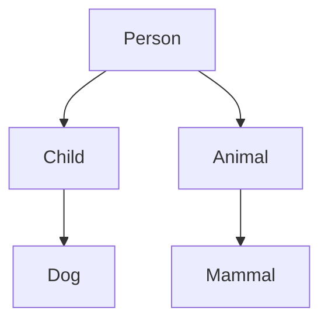

                 


### 文章标题

**提示词工程的知识表示与推理**

### 关键词

- 知识表示
- 推理
- 提示词工程
- 自然语言处理
- 智能信息检索

### 摘要

本文旨在深入探讨提示词工程中的知识表示与推理技术。首先，我们概述知识表示的背景和重要性，介绍基于规则、语义网络和本体论的知识表示方法。接着，讨论知识库的构建与维护策略，并探讨知识表示的评估与优化方法。随后，我们介绍推理的基本概念，重点讨论基于规则、语义网络和本体论的推理方法。最后，结合实际应用与案例分析，探讨知识表示与推理在自然语言处理和智能信息检索中的应用，为读者提供实用的最佳实践建议。

### 目录大纲

#### 第一部分：知识表示

##### 第1章：知识表示概述
- **1.1 知识表示的背景和重要性**
- **1.2 知识表示的基本概念**
- **1.3 知识表示的方法和模型**

##### 第2章：基于知识的表示方法
- **2.1 基于规则的表示方法**
  - **2.1.1 规则的定义和特点**
  - **2.1.2 基于规则的表示方法**
  - **2.1.3 常见的规则表示语言**
- **2.2 基于语义网络的表示方法**
  - **2.2.1 语义网络的基本概念**
  - **2.2.2 语义网络的结构和表示**
  - **2.2.3 语义网络的构建和应用**
- **2.3 基于本体论的表示方法**
  - **2.3.1 本体论的基本概念**
  - **2.3.2 本体的构建方法**
  - **2.3.3 本体的应用**

##### 第3章：知识库的构建与维护
- **3.1 知识库的基本概念和结构**
- **3.2 知识库的构建方法**
  - **3.2.1 数据收集**
  - **3.2.2 数据清洗**
  - **3.2.3 数据建模**
  - **3.2.4 数据存储**
- **3.3 知识库的维护和管理**
  - **3.3.1 知识库的更新策略**
  - **3.3.2 知识库的一致性维护**
  - **3.3.3 知识库的安全性管理**

##### 第4章：知识表示的评估与优化
- **4.1 知识表示的评价指标**
  - **4.1.1 准确性**
  - **4.1.2 完整性**
  - **4.1.3 可扩展性**
- **4.2 知识表示的优化方法**
  - **4.2.1 基于规则的优化**
  - **4.2.2 基于语义网络的优化**
  - **4.2.3 基于本体论的优化**

#### 第二部分：推理

##### 第5章：推理的基本概念
- **5.1 推理的定义和类型**
- **5.2 推理机的工作原理**
- **5.3 推理的应用领域**

##### 第6章：基于规则的推理
- **6.1 基于规则的推理模型**
  - **6.1.1 前提-结论模型**
  - **6.1.2 产生式系统**
  - **6.1.3 规则库的设计**
- **6.2 基于规则的推理算法**
  - **6.2.1 前向推理**
  - **6.2.2 反向推理**
  - **6.2.3 前向和反向混合推理**

##### 第7章：基于语义网络的推理
- **7.1 语义网络推理的基本概念**
- **7.2 语义网络推理算法**
  - **7.2.1 局部推理**
  - **7.2.2 全局推理**
- **7.3 语义网络推理的应用实例**
  - **7.3.1 问答系统**
  - **7.3.2 实体识别**
  - **7.3.3 事件抽取**

##### 第8章：基于本体论的推理
- **8.1 本体论推理的基本概念**
- **8.2 本体论推理算法**
  - **8.2.1 类别层次推理**
  - **8.2.2 属性值推理**
  - **8.2.3 实体关系推理**
- **8.3 本体论推理的应用实例**
  - **8.3.1 智能搜索引擎**
  - **8.3.2 知识图谱构建**
  - **8.3.3 自动化推理系统**

##### 第9章：混合推理方法
- **9.1 混合推理的基本概念**
- **9.2 混合推理的策略**
  - **9.2.1 规则-语义网络混合推理**
  - **9.2.2 规则-本体论混合推理**
  - **9.2.3 语义网络-本体论混合推理**
- **9.3 混合推理的应用实例**
  - **9.3.1 智能决策支持系统**
  - **9.3.2 智能推荐系统**
  - **9.3.3 智能问答系统**

#### 第三部分：实际应用与案例分析

##### 第10章：知识表示与推理在自然语言处理中的应用
- **10.1 基于知识表示的问答系统**
  - **10.1.1 知识表示在问答系统中的作用**
  - **10.1.2 常见的问答系统架构**
  - **10.1.3 案例分析**
- **10.2 基于推理的自然语言处理任务**
  - **10.2.1 名词实体识别**
  - **10.2.2 事件抽取**
  - **10.2.3 情感分析**

##### 第11章：知识表示与推理在智能信息检索中的应用
- **11.1 知识表示在信息检索中的作用**
- **11.2 基于推理的检索算法**
  - **11.2.1 基于规则的检索算法**
  - **11.2.2 基于语义网络的检索算法**
  - **11.2.3 基于本体论的检索算法**
- **11.3 案例分析**
  - **11.3.1 智能搜索引擎**

### 第一部分：知识表示

#### 第1章：知识表示概述

##### 1.1 知识表示的背景和重要性

知识表示是人工智能领域的一个重要研究方向，旨在将人类知识以计算机可以处理和利用的形式进行编码和存储。在人工智能的发展过程中，知识表示技术经历了多个阶段，从早期的基于规则的系统，到基于框架、语义网络和本体论的系统，逐渐发展成为一个综合性的研究领域。

知识表示的重要性在于它为人工智能系统提供了对领域知识的抽象和表示，使得系统能够更好地理解和处理复杂的问题。通过知识表示，人工智能系统能够获取、存储、检索和应用知识，从而实现智能推理、决策和问题求解。

知识表示的背景可以追溯到20世纪50年代，当时人工智能的早期研究者开始探索如何将人类知识转化为计算机可以理解的形式。早期的知识表示方法主要基于符号逻辑和产生式规则，这些方法在一定程度上能够模拟人类的推理过程，但由于其表达能力的局限性，难以处理复杂的问题。

随着语义网络和本体论的发展，知识表示技术得到了进一步的提升。语义网络和本体论提供了一种更加灵活和抽象的表示方法，能够更好地表示知识的结构和语义关系。这些方法使得知识表示能够应用于更广泛的领域，如自然语言处理、智能信息检索、知识图谱构建等。

##### 1.2 知识表示的基本概念

知识表示的基本概念包括知识、知识表示、知识库和知识模型。

- **知识**：知识是人们对客观世界的认知和理解，通常包括事实、规则、原理、概念等。
- **知识表示**：知识表示是将知识以计算机可以处理和利用的形式进行编码和存储的方法和技术。
- **知识库**：知识库是存储知识的数据库，它包含了领域内的各种知识，如事实、规则、模型等。
- **知识模型**：知识模型是知识表示的方法和框架，它定义了如何组织和表示知识，以及如何进行知识检索和推理。

在知识表示中，常见的表示方法包括基于规则、语义网络和本体论的方法。基于规则的方法使用一组规则来表示知识和推理过程，适用于简单和明确的领域问题。语义网络和本体论提供了一种更加灵活和抽象的表示方法，能够表示复杂的语义关系和知识结构。

##### 1.3 知识表示的方法和模型

知识表示的方法和模型可以分为以下几类：

1. **基于规则的表示方法**：基于规则的方法使用一组规则来表示知识和推理过程。这些规则通常由前提和结论组成，表示了“如果...那么...”的关系。这种表示方法简单直观，适用于简单和明确的领域问题。

2. **基于语义网络的表示方法**：语义网络是一种图结构，用于表示概念、实体和它们之间的关系。在语义网络中，节点表示概念或实体，边表示它们之间的关系。这种表示方法能够表示复杂的语义关系和知识结构，适用于自然语言处理和知识图谱构建。

3. **基于本体论的表示方法**：本体论是一种概念化的方法，用于描述领域内的概念、实体和它们之间的关系。本体论提供了一种高层次的抽象，能够用于知识表示、知识共享和跨领域集成。

4. **基于框架的表示方法**：框架是一种层次化的结构，用于表示知识和推理过程。框架由一组槽和值组成，每个槽表示一个属性或特征，每个值表示属性的具体实例。这种表示方法适用于描述复杂的问题和推理过程。

5. **基于模型的表示方法**：模型是一种抽象的表示方法，用于表示领域内的知识和关系。模型可以是数学模型、计算模型或仿真模型等。这种表示方法能够用于模拟和预测领域内的现象和过程。

以上是知识表示的基本概念和方法，接下来我们将详细介绍基于规则、语义网络和本体论的知识表示方法。

---

#### 第2章：基于知识的表示方法

##### 2.1 基于规则的表示方法

基于规则的表示方法是一种常见的知识表示方法，它使用一组规则来表示知识和推理过程。规则通常由前提和结论组成，表示了“如果...那么...”的关系。这种表示方法具有简单直观、易于理解和实现的特点，适用于处理简单和明确的领域问题。

##### 2.1.1 规则的定义和特点

规则是一种条件语句，通常表示为“如果...那么...”的形式。在计算机科学中，规则可以用一种形式化的语言来表示，如谓词逻辑、产生式系统等。

一个规则通常由以下部分组成：

- **前提**：前提是规则中的条件部分，它定义了规则的适用范围。如果前提为真，则规则成立。
- **结论**：结论是规则中的结果部分，它定义了规则成立时应该执行的操作或生成的结果。

例如，一个简单的规则可以表示为：“如果天气晴朗，那么应该穿短袖。”

这个规则的逻辑形式可以表示为：

- 前提：天气晴朗
- 结论：应该穿短袖

这个规则的特点是简单、明确，并且具有明确的条件-结果关系。在基于规则的系统中，这类规则被用来表示知识和进行推理。

##### 2.1.2 基于规则的表示方法

基于规则的表示方法通常包括以下几个步骤：

1. **规则的定义**：首先，我们需要定义一组规则，这些规则将用于表示知识和进行推理。每个规则都由前提和结论组成，表示了“如果...那么...”的关系。

2. **规则的输入和输出**：在规则的基础上，我们需要定义输入和输出。输入是规则的前提，输出是规则的结论。输入和输出可以是事实、数据或条件等。

3. **规则的匹配**：在基于规则的系统中，我们需要根据输入数据来匹配相应的规则。如果输入数据与规则的前提匹配，则执行该规则的结论。

4. **规则的执行**：一旦规则被匹配并执行，系统会根据规则的定义产生相应的输出。这个输出可以是新的数据、操作或决策等。

基于规则的表示方法具有以下几个特点：

- **简单直观**：规则表示方法简单直观，易于理解和实现。
- **灵活性**：基于规则的表示方法具有很高的灵活性，可以适应不同的领域和应用。
- **可扩展性**：通过添加新的规则，可以扩展基于规则的系统的功能。

##### 2.1.3 常见的规则表示语言

常见的规则表示语言包括产生式系统、谓词逻辑和决策树等。

1. **产生式系统**：产生式系统是一种基于规则的表示方法，它使用产生式来表示规则。每个产生式由一个前提和一个结论组成，表示了“如果...那么...”的关系。

   一个简单的产生式可以表示为：

   ```
   如果 A，则 B。
   ```

   其中，A 是前提，B 是结论。

   产生式系统的优点是简单直观，易于理解和实现。但它也存在一些局限性，如表达能力的局限性、规则之间的冲突等。

2. **谓词逻辑**：谓词逻辑是一种形式化的逻辑语言，用于表示知识和推理。在谓词逻辑中，知识被表示为一组谓词公式，每个谓词公式表示一个事实或规则。

   一个简单的谓词逻辑公式可以表示为：

   ```
   A ∧ B → C
   ```

   其中，A、B 和 C 是谓词。

   谓词逻辑的优点是具有强大的表达能力和逻辑推理能力。但它的语法和语义相对复杂，需要较高的专业知识和技能。

3. **决策树**：决策树是一种基于规则的表示方法，它使用树形结构来表示规则。每个节点表示一个条件，每个分支表示一个结果。

   一个简单的决策树可以表示为：

   ```
   [天气晴朗] → [穿短袖]
      |
      v
   [天气寒冷] → [穿棉衣]
   ```

   决策树的优点是简单直观，易于理解和实现。但它也具有表达能力的局限性，无法表示复杂的推理过程。

以上是关于基于规则的表示方法的介绍，接下来我们将介绍基于语义网络的表示方法。

---

##### 2.2 基于语义网络的表示方法

基于语义网络的表示方法是一种图结构化的知识表示方法，它通过节点和边来表示概念、实体和它们之间的关系。语义网络能够表示复杂的语义关系和知识结构，因此在自然语言处理、知识图谱构建等领域得到了广泛的应用。

##### 2.2.1 语义网络的基本概念

语义网络是由节点和边组成的有向图，用于表示概念、实体和它们之间的关系。在语义网络中，节点表示概念或实体，边表示它们之间的关系。

以下是一些重要的基本概念：

1. **节点**：节点是语义网络中的基本元素，表示概念或实体。例如，在语义网络中表示“人”这个概念，或者表示“苹果”这个实体。

2. **边**：边是连接节点的线，表示概念或实体之间的关系。边的方向性表示关系的方向，如“父亲”关系是从父亲指向子女。

3. **属性**：属性是节点的附加信息，用于描述节点的特征或属性。例如，在表示“苹果”这个实体时，可以添加属性如“颜色”、“大小”等。

4. **关系**：关系是节点之间的连接，用于表示它们之间的语义联系。例如，“人类”与“动物”之间的关系可以表示为“属于”。

5. **层次结构**：语义网络通常具有层次结构，表示概念之间的分类关系。例如，在动物分类中，可以有“动物”作为根节点，下级节点包括“哺乳动物”、“鸟类”等。

##### 2.2.2 语义网络的结构和表示

语义网络的结构由节点、边和属性组成，可以表示为以下形式：

- **节点**：节点表示概念或实体，可以用符号或字符串来表示。例如，用“Person”表示人，用“Apple”表示苹果。

- **边**：边表示节点之间的关系，可以用箭头表示方向。例如，“Person”与“Child”之间可以有边表示“父亲”关系。

- **属性**：属性是节点的附加信息，可以用键值对表示。例如，用“Color”作为键，用“Red”作为值，表示苹果的颜色为红色。

语义网络的表示可以采用图形化的方式，例如使用 Mermaid 图表示如下：



在这个示例中，A 表示“Person”（人），B 表示“Child”（儿童），C 表示“Animal”（动物），D 表示“Dog”（狗），E 表示“Mammal”（哺乳动物）。边表示节点之间的关系，如“Person”与“Child”之间存在“父亲”关系，而“Animal”与“Mammal”之间存在“属于”关系。

##### 2.2.3 语义网络的构建和应用

构建语义网络通常包括以下步骤：

1. **确定概念和实体**：首先需要确定要表示的概念和实体，并定义它们的基本属性。例如，在表示“动物”领域时，可以确定“动物”、“哺乳动物”、“鸟类”等概念。

2. **定义关系**：接下来需要定义概念和实体之间的关系。例如，可以定义“属于”、“分类”等关系，表示概念之间的层次结构。

3. **构建图结构**：使用图结构来表示概念、实体和它们之间的关系。可以使用图形化工具（如 Mermaid）或编程语言（如 Python 的 Graph-tool 库）来构建语义网络。

4. **添加属性**：为节点和边添加属性，用于描述它们的特点和特征。例如，可以为“苹果”节点添加“颜色”、“大小”属性。

5. **验证和优化**：构建完成后，需要对语义网络进行验证和优化。验证包括检查图结构的正确性和一致性，优化包括去除冗余节点和边、调整层次结构等。

语义网络的应用领域广泛，以下是一些常见的应用：

1. **自然语言处理**：语义网络可以用于文本分析、语义角色标注、问答系统等任务，帮助计算机理解和处理自然语言。

2. **知识图谱构建**：语义网络可以用于构建知识图谱，表示领域内的概念、实体和关系，为智能搜索、推荐系统等提供支持。

3. **智能问答系统**：语义网络可以帮助问答系统理解用户的问题，并从知识库中检索相关的答案。

4. **信息检索**：语义网络可以用于信息检索系统，通过分析用户查询和文档之间的语义关系，提高检索的准确性和效率。

在下一节中，我们将介绍基于本体论的表示方法。

---

##### 2.3 基于本体论的表示方法

基于本体论的表示方法是一种高级的知识表示方法，它通过概念、属性和关系来描述领域内的知识和语义。本体论为知识表示提供了一个形式化的框架，使得不同系统之间的知识共享和互操作性成为可能。

##### 2.3.1 本体论的基本概念

本体论（Ontology）是一种哲学研究，旨在理解和描述存在的事物及其之间的关系。在计算机科学领域，本体论被用来表示领域知识，提供一个结构化的知识框架。

以下是一些关键的概念：

1. **本体**（Ontology）：本体是一个概念模型，用于描述领域内的概念、属性和关系。本体是一种高层次的知识抽象，能够帮助计算机理解和处理复杂的问题。

2. **概念**（Concept）：概念是本体中的基本元素，表示领域内的抽象实体。例如，“人”、“动物”、“苹果”等都是概念。

3. **属性**（Attribute）：属性是概念的附加特征，用于描述概念的属性。例如，“苹果”的属性可以是“颜色”、“大小”、“重量”等。

4. **关系**（Relationship）：关系是概念之间的语义联系，用于表示概念之间的分类、归属等关系。例如，“动物”与“哺乳动物”之间存在“属于”关系。

5. **实例**（Instance）：实例是具体存在的实体，是概念的具体实现。例如，“我”、“一只猫”、“一个红色的苹果”等都是实例。

6. **类别**（Class）：类别是具有相同属性和关系的概念集合。例如，“哺乳动物”是一个类别，包括“人”、“猫”、“狗”等实例。

##### 2.3.2 本体的构建方法

构建本体是一个复杂的过程，通常包括以下几个步骤：

1. **确定领域**：首先，需要明确要构建的本体的应用领域。领域可以是“动物分类”、“医学”、“法律”等。

2. **识别概念和关系**：接下来，需要识别领域内的关键概念和它们之间的关系。例如，在动物分类领域中，可以识别出“动物”、“哺乳动物”、“鸟类”等概念，以及“属于”、“分类”等关系。

3. **定义属性和约束**：为每个概念和关系定义属性和约束，以描述它们的特点和限制。例如，可以定义“动物”的属性如“物种”、“生命周期”等，以及“属于”关系的约束如“只能有一个父类别”。

4. **构建本体模型**：使用本体建模语言（如OWL、OWL 2）将识别的概念、属性和关系表示为一个形式化的模型。OWL 是一种广泛使用的本体建模语言，它提供了丰富的表达能力和推理功能。

5. **验证和优化**：构建完成后，需要对本体进行验证和优化。验证包括检查本体的语法和语义错误，优化包括去除冗余元素、调整层次结构等。

##### 2.3.3 本体的应用

本体论在多个领域得到了广泛的应用，以下是一些常见的应用场景：

1. **知识管理**：本体论可以帮助组织和管理知识，使得知识更容易被检索和使用。例如，在企业和组织中，可以使用本体来描述业务流程、产品信息等。

2. **智能搜索**：本体论可以用于构建智能搜索引擎，通过分析查询和文档之间的本体关系，提高搜索的准确性和相关性。

3. **自然语言处理**：本体论可以帮助自然语言处理系统理解和处理语言中的复杂结构。例如，本体可以用于文本分类、实体识别、语义角色标注等任务。

4. **智能问答系统**：本体论可以帮助问答系统理解用户的问题，并从本体中检索相关的答案。

5. **知识图谱构建**：本体论可以用于构建知识图谱，表示领域内的概念、实体和关系，为智能推荐、决策支持等提供支持。

在本体的构建和应用过程中，需要注意以下几点：

- **领域特定性**：本体的构建应该基于具体的领域，确保其能够准确地描述领域内的知识。
- **一致性**：本体中的概念和关系应该保持一致，避免冲突和冗余。
- **可扩展性**：本体应该具有可扩展性，能够适应领域的变化和新知识的加入。
- **推理能力**：本体应该具备推理能力，能够从已知的事实中推导出新的结论。

在下一节中，我们将讨论知识库的构建与维护。

---

#### 第3章：知识库的构建与维护

##### 3.1 知识库的基本概念和结构

知识库（Knowledge Base，KB）是存储和管理知识的数据库，它是知识表示和推理的基础。知识库通常包含以下基本元素：

1. **概念**：概念是知识库中的基本抽象实体，表示领域内的关键概念。例如，在医疗领域，可以有“疾病”、“药物”、“症状”等概念。

2. **事实**：事实是关于概念的具体信息，用于描述概念之间的关系。例如，“张三患有肺炎”、“某药物能治疗高血压”等都是事实。

3. **规则**：规则是知识库中的逻辑表达，用于表示因果关系和推理规则。例如，“如果某人的体温高于38℃，则可能是发烧”。

4. **关系**：关系是概念之间的语义联系，用于表示它们之间的分类、归属等关系。例如，“人类属于哺乳动物”。

5. **属性**：属性是概念的附加特征，用于描述概念的具体属性。例如，“苹果的颜色是红色”。

知识库的结构通常可以分为以下几层：

- **底层**：底层通常包括数据存储和索引机制，用于高效地存储和检索知识库中的数据。

- **中层**：中层通常包括知识表示和推理引擎，用于对知识库中的数据进行表示和处理。

- **高层**：高层通常包括用户接口和应用程序，用于向用户展示知识库中的知识，并提供相应的功能。

##### 3.2 知识库的构建方法

构建知识库是一个复杂的过程，通常包括以下几个步骤：

1. **需求分析**：首先，需要明确知识库的应用领域和需求。了解领域专家和用户的需求，确定知识库所需包含的概念、事实、规则等。

2. **数据收集**：接下来，需要收集相关的领域数据，包括文本、图像、音频等多媒体数据。可以通过网络爬虫、数据库查询、人工标注等方式获取数据。

3. **数据清洗**：收集到的数据通常存在噪声和不一致性。需要通过数据清洗过程去除噪声，修复不一致性。例如，去除重复数据、纠正错别字、统一单位等。

4. **数据建模**：在数据清洗后，需要对数据进行建模。数据建模是将数据转换为知识库中的概念、事实、规则等表示。可以采用基于规则的方法、语义网络的方法或本体论的方法进行数据建模。

5. **数据存储**：构建好数据模型后，需要将数据存储在知识库中。数据存储可以采用关系数据库、图数据库、文档数据库等不同的数据存储技术。

6. **数据验证**：构建完成后，需要对知识库进行验证。验证包括检查数据的一致性、完整性、准确性等。可以通过自动化测试工具或人工审核进行数据验证。

##### 3.2.1 数据收集

数据收集是知识库构建的第一步，也是至关重要的一步。以下是一些常见的数据收集方法：

1. **网络爬虫**：通过网络爬虫可以自动收集互联网上的大量数据。这些数据可以包括网页、新闻、博客等。

2. **数据库查询**：可以通过数据库查询获取结构化的数据。例如，从数据库中查询客户信息、产品信息等。

3. **人工标注**：对于一些非结构化或半结构化的数据，如文本、图像、音频等，可以通过人工标注的方式进行数据收集。

4. **传感器数据**：通过传感器可以收集环境数据，如气象数据、交通数据等。

5. **社交媒体**：通过社交媒体平台，如微博、微信等，可以收集用户生成的内容，如评论、日志等。

在数据收集过程中，需要注意以下几点：

- **数据来源的可靠性**：选择可靠的数据来源，确保收集到的数据具有较高的可信度。

- **数据覆盖的广度**：尽量覆盖不同的数据来源，确保收集到的数据具有广泛的代表性。

- **数据质量的控制**：对收集到的数据进行质量控制和筛选，确保数据的一致性、完整性和准确性。

##### 3.2.2 数据清洗

数据清洗是知识库构建过程中必不可少的一步，其目的是去除数据中的噪声、修复不一致性，确保数据的质量。以下是一些常见的数据清洗方法：

1. **去除重复数据**：通过比较数据的唯一标识，如ID、名称等，可以去除重复的数据。

2. **纠错**：通过自然语言处理技术，可以识别和纠正文本中的错别字、语法错误等。

3. **统一单位**：对于不同单位的数据，如长度、重量等，需要统一转换为相同的单位。

4. **缺失值处理**：对于缺失的数据，可以通过填充默认值、插值等方法进行处理。

5. **异常值检测和修正**：通过统计分析和可视化方法，可以识别和修正数据中的异常值。

在数据清洗过程中，需要注意以下几点：

- **数据清洗的标准**：制定数据清洗的标准和规则，确保清洗过程的一致性和准确性。

- **数据清洗的工具**：使用合适的数据清洗工具，如Python的Pandas库、R语言的dplyr包等。

- **数据清洗的验证**：对清洗后的数据进行验证，确保清洗效果和数据的完整性。

##### 3.2.3 数据建模

数据建模是将收集到的数据转换为知识库中的概念、事实、规则等表示。以下是一些常见的数据建模方法：

1. **基于规则的建模**：通过定义一组规则，将数据映射到知识库中的概念、事实和规则。例如，可以将数据中的“疾病名称”映射到知识库中的“疾病”概念。

2. **基于语义网络的建模**：通过构建语义网络，将数据中的实体、属性和关系映射到知识库中。例如，可以将数据中的“苹果”映射到知识库中的“水果”类别。

3. **基于本体论的建模**：通过构建本体，将数据中的概念、属性和关系映射到知识库中。例如，可以构建一个医疗领域的本体，将数据中的“病人”映射到本体的“人”概念。

在数据建模过程中，需要注意以下几点：

- **模型的可扩展性**：确保数据建模方法具有可扩展性，能够适应领域的变化和新数据的加入。

- **模型的准确性**：确保数据建模方法的准确性，能够正确地将数据映射到知识库中的概念、事实和规则。

- **模型的简洁性**：确保数据建模方法的简洁性，避免过多的冗余和复杂的模型。

##### 3.2.4 数据存储

数据存储是将构建好的知识库数据存储到数据库中，以便于检索和使用。以下是一些常见的数据存储技术：

1. **关系数据库**：关系数据库是一种常用的数据存储技术，它使用表结构来存储数据，并使用SQL语言进行查询。例如，MySQL、PostgreSQL等。

2. **图数据库**：图数据库是一种基于图形结构的数据存储技术，它使用节点和边来存储数据，并使用图查询语言进行查询。例如，Neo4j、ArangoDB等。

3. **文档数据库**：文档数据库是一种基于文档结构的数据存储技术，它使用JSON、XML等格式来存储数据，并使用文档查询语言进行查询。例如，MongoDB、CouchDB等。

在数据存储过程中，需要注意以下几点：

- **数据的一致性**：确保数据的一致性，避免数据冲突和重复。

- **数据的可扩展性**：确保数据存储技术具有可扩展性，能够适应数据量的增长。

- **数据的访问性能**：优化数据存储结构，提高数据的访问性能。

##### 3.3 知识库的维护和管理

知识库的维护和管理是确保知识库数据质量和有效性的关键。以下是一些常见的知识库维护和管理方法：

1. **数据更新策略**：制定数据更新策略，确保知识库中的数据能够及时更新。例如，可以采用定期更新、实时更新等方法。

2. **数据一致性维护**：通过数据一致性检查和修复，确保知识库中的数据一致性。例如，可以采用数据校验、数据修复等技术。

3. **数据安全性管理**：确保知识库的数据安全性，防止数据泄露和损坏。例如，可以采用数据加密、访问控制等技术。

4. **用户权限管理**：制定用户权限管理策略，确保只有授权用户可以访问和修改知识库。例如，可以采用身份验证、权限控制等技术。

5. **知识库性能优化**：通过优化知识库的查询性能和数据存储结构，提高知识库的性能。例如，可以采用索引优化、缓存技术等。

在知识库的维护和管理过程中，需要注意以下几点：

- **定期备份**：定期备份知识库，确保在数据丢失或损坏时能够恢复。

- **版本控制**：实施版本控制，记录知识库的变更历史，便于追踪和管理。

- **用户培训**：对用户进行培训，确保他们能够正确地使用和维护知识库。

---

#### 第4章：知识表示的评估与优化

##### 4.1 知识表示的评价指标

在知识表示的过程中，评估知识表示的质量和性能是非常重要的。以下是一些常用的评价指标：

1. **准确性**：准确性是指知识表示正确识别出真实知识的能力。通常使用精确度（Precision）和召回率（Recall）来衡量。精确度表示正确识别的知识占总识别出的知识的比例，而召回率表示正确识别的知识占总真实知识的比例。

2. **完整性**：完整性是指知识表示能够涵盖领域内的所有知识。可以使用覆盖率（Coverage）来衡量，即知识表示覆盖到的知识占总领域知识的比例。

3. **可扩展性**：可扩展性是指知识表示能够适应领域变化和新知识的加入。可以使用动态扩展性（Dynamic Scalability）来衡量，即在知识库增加新知识时，知识表示系统所需的时间和资源。

4. **推理效率**：推理效率是指知识表示系统能够快速地进行推理和问题求解的能力。可以使用推理速度（Inference Speed）和推理准确性（Inference Accuracy）来衡量。

5. **用户友好性**：用户友好性是指知识表示系统对用户的友好程度。可以使用用户满意度（User Satisfaction）和用户操作简便性（User Ease of Use）来衡量。

##### 4.2 知识表示的优化方法

为了提高知识表示的质量和性能，可以采用以下优化方法：

1. **基于规则的优化**：
   - **规则简化**：通过去除冗余规则、合并相似规则等方法，简化规则库，减少规则的数量和复杂性。
   - **规则合并**：将多个规则合并为一个更复杂的规则，以减少规则库的大小和推理时间。
   - **规则优先级调整**：根据规则的适用场景和重要性，调整规则之间的优先级，以提高推理效率和准确性。

2. **基于语义网络的优化**：
   - **节点和边的合并**：通过合并具有相似语义的节点和边，简化语义网络的结构，减少冗余信息。
   - **语义网络压缩**：通过压缩语义网络中的节点和边，减少存储空间和推理时间。
   - **语义网络分层**：将语义网络分层，提高语义的抽象级别，简化推理过程。

3. **基于本体论的优化**：
   - **本体简化**：通过去除冗余本体、合并相似本体等方法，简化本体结构，减少本体的复杂度。
   - **本体压缩**：通过压缩本体中的概念、属性和关系，减少存储空间和推理时间。
   - **本体层次化**：将本体层次化，提高本体的抽象级别，简化推理过程。

4. **数据预处理**：
   - **数据清洗**：通过数据清洗，去除数据中的噪声和错误，提高数据的准确性。
   - **数据规范化**：通过数据规范化，统一数据格式和单位，提高数据的一致性。
   - **数据压缩**：通过数据压缩，减少数据的存储空间和传输带宽。

5. **推理算法优化**：
   - **并行推理**：通过并行计算技术，提高推理速度。
   - **分布式推理**：通过分布式计算技术，提高推理的扩展性。
   - **启发式推理**：通过启发式方法，提高推理的效率和准确性。

通过上述优化方法，可以显著提高知识表示的质量和性能，从而更好地支持知识推理和应用。

---

#### 第5章：推理的基本概念

推理（Reasoning）是人工智能的核心任务之一，它涉及从已知的事实或规则中推导出新的结论或知识。推理技术在各个领域都有广泛的应用，如自然语言处理、智能信息检索、自动化推理系统等。在本章中，我们将探讨推理的基本概念、推理机的工作原理以及推理的应用领域。

##### 5.1 推理的定义和类型

推理是指根据已知的事实或规则，通过逻辑思维和推理规则，得出新的结论或知识的过程。推理可以分为以下几种类型：

1. **演绎推理**（Deductive Reasoning）：演绎推理是从一般到个别的推理过程，即从一般原理或规则出发，推导出特定的结论。演绎推理的特点是结论的必然性，即如果前提为真，则结论必然为真。例如，如果所有哺乳动物都有脊椎，而猫是哺乳动物，那么可以得出结论：猫有脊椎。

2. **归纳推理**（Inductive Reasoning）：归纳推理是从个别到一般的推理过程，即从一系列特定的观察或事实出发，归纳出一般性的结论。归纳推理的特点是结论的可能性，即如果前提为真，则结论可能为真，但不一定必然为真。例如，通过观察多次下雨后天气变凉，可以归纳出“下雨会使天气变凉”的结论。

3. **类比推理**（Analogical Reasoning）：类比推理是通过比较两个相似的情况，从一个已知情况推导出另一个未知情况的推理过程。类比推理的特点是利用已知情况的经验来推测未知情况。例如，如果知道恐龙是已灭绝的动物，那么可以推测外星生物也有可能灭绝。

4. **反思推理**（Abductive Reasoning）：反思推理是基于证据和假设，寻找最合理的解释或假设的推理过程。反思推理的特点是寻找最佳解释，而非确定性的结论。例如，如果发现房间里有湿漉漉的地毯，可以反思推理出可能是由于下雨导致房间进水。

##### 5.2 推理机的工作原理

推理机（Reasoning Machine）是用于执行推理任务的计算机系统，它可以根据给定的知识库和推理规则，推导出新的结论。推理机的工作原理可以分为以下几个步骤：

1. **知识库加载**：推理机首先需要加载知识库，知识库包含了领域内的所有事实、规则和概念。知识库可以存储在数据库、文件或内存中。

2. **推理规则应用**：推理机使用给定的推理规则，对知识库中的数据进行推理。推理规则通常包括前提和结论，表示了“如果...那么...”的关系。

3. **事实匹配**：推理机检查当前的事实库，寻找与推理规则前提匹配的事实。如果找到匹配的事实，则继续下一步。

4. **结论推导**：一旦找到匹配的事实，推理机根据推理规则的结论部分，推导出新的结论。新的结论会被添加到事实库中，以供后续推理使用。

5. **循环迭代**：推理机重复上述步骤，直到没有新的结论可以推导出来，或者达到了预定的推理深度。

推理机的工作原理可以类比为人的逻辑思维过程。人们通过观察事实、应用规则和推理，从已知的知识中推导出新的结论。

##### 5.3 推理的应用领域

推理技术在多个领域都有广泛的应用，以下是一些典型的应用领域：

1. **自然语言处理**：推理技术在自然语言处理（NLP）中起着核心作用，如语义角色标注、问答系统、情感分析等。通过推理，NLP系统可以更好地理解和处理自然语言。

2. **智能信息检索**：推理技术可以用于提高信息检索的准确性和效率，如基于规则的检索算法、基于语义网络的检索算法、本体论检索等。

3. **自动化推理系统**：自动化推理系统用于在计算机系统中实现推理任务，如自动驾驶系统、智能客服系统、医疗诊断系统等。通过推理，这些系统能够自主地解决问题和做出决策。

4. **知识图谱构建**：推理技术可以用于构建和优化知识图谱，通过推理，知识图谱能够更准确地表示领域知识，提高知识共享和互操作性。

5. **智能决策支持系统**：推理技术可以用于智能决策支持系统，通过推理，系统能够根据用户需求、数据和规则，提供最优的决策建议。

在下一章中，我们将深入探讨基于规则的推理方法。

---

#### 第6章：基于规则的推理

基于规则的推理（Rule-Based Reasoning）是人工智能领域中一种常见的方法，它使用一组规则来表示知识和推理过程。这种方法具有简单、直观和易于实现的特点，适用于许多应用场景，如自动问答系统、诊断系统、专家系统等。在本章中，我们将详细探讨基于规则的推理模型、算法和实际应用。

##### 6.1 基于规则的推理模型

基于规则的推理模型通常包括以下三个主要组件：规则库、事实库和推理引擎。

1. **规则库**（Rule Base）：规则库是存储规则的地方，这些规则由一组条件（前提）和结论组成。条件部分表示规则适用的条件，结论部分表示当条件满足时应该执行的操作或产生的结果。规则通常以产生式（Production）的形式表示，例如：“如果天气晴朗，则建议穿短袖。”

2. **事实库**（Fact Base）：事实库是存储当前领域内事实的地方，事实是对现实世界的陈述，如“今天天气晴朗”、“某人患有流感”等。事实库为规则提供了数据来源，使得规则能够应用在具体场景中。

3. **推理引擎**（Inference Engine）：推理引擎是执行推理过程的组件，它根据规则库和事实库中的信息，使用推理算法来推导出新的结论。推理引擎可以采用前向推理（Forward Chaining）或反向推理（Backward Chaining）等方法。

##### 6.1.1 前提-结论模型

前提-结论模型（Premise-Conclusion Model）是规则表示的基础，它使用一组前提-结论规则来表示知识和推理过程。每个规则由一组前提和一个结论组成，表示了“如果...那么...”的关系。例如：

```
如果 A 且 B，则 C。
```

其中，A 和 B 是前提，C 是结论。当前提为真时，结论也必须为真。前提-结论模型可以形式化地表示为：

```
前提: P1, P2, ..., Pn
结论: C
```

其中，P1, P2, ..., Pn 是前提，C 是结论。

##### 6.1.2 产生式系统

产生式系统（Production System）是一种常见的规则表示方法，它使用产生式（Production）来表示规则。产生式由条件和操作组成，表示了当条件满足时应该执行的操作。产生式的形式可以表示为：

```
条件 → 操作
```

例如，一个简单的产生式可以表示为：

```
如果 患有流感，则 建议 休息。
```

产生式系统通常包括以下步骤：

1. **条件匹配**：检查当前事实库，寻找与产生式条件匹配的事实。

2. **执行操作**：当条件匹配时，执行产生式的操作部分，生成新的结论或执行相应的操作。

3. **更新事实库**：将新的结论或操作结果添加到事实库中，以便后续推理使用。

4. **循环迭代**：重复执行条件匹配和操作步骤，直到没有新的结论可以生成。

##### 6.1.3 规则库的设计

设计一个有效的规则库是成功实现基于规则推理系统的关键。以下是一些设计规则库时需要考虑的要点：

1. **规则表达清晰**：规则的表达应该简洁、明确，避免使用复杂的逻辑表达式。

2. **规则优先级**：为规则设置优先级，确保在条件匹配时，系统能够优先执行重要的规则。

3. **规则复用**：尽量复用规则，避免重复定义相同的规则。

4. **规则一致性**：确保规则之间的一致性，避免冲突和冗余。

5. **规则可维护性**：设计易于维护和扩展的规则库，便于后续修改和更新。

在下一节中，我们将探讨基于规则的推理算法，包括前向推理、反向推理和混合推理。

---

##### 6.2 基于规则的推理算法

基于规则的推理算法是人工智能中一种常用的推理方法，它使用一组规则来表示知识和推理过程。根据推理的方向，基于规则的推理算法可以分为前向推理（Forward Chaining）和反向推理（Backward Chaining），以及前向和反向混合推理（Forward-Backward Chaining）。以下是对这些算法的详细探讨。

##### 6.2.1 前向推理

前向推理（Forward Chaining）是从已知的事实出发，逐步推导出新的结论。这种方法的特点是推理过程从已知的事实开始，通过应用规则，逐步推导出更复杂的结论。前向推理的基本步骤如下：

1. **初始化**：初始化事实库，将初始事实添加到事实库中。

2. **匹配规则**：检查事实库中的事实，寻找与规则条件匹配的事实。

3. **执行规则**：当找到匹配的事实时，执行规则的结论部分，生成新的结论。

4. **更新事实库**：将新生成的结论添加到事实库中。

5. **循环迭代**：重复执行步骤2到步骤4，直到没有新的结论可以生成。

前向推理的优点是简单直观，易于理解和实现。它的缺点是可能导致冗余推理，即多次推导出相同的事实。此外，前向推理适用于从已知事实推导出结论的场景。

前向推理算法的伪代码可以表示为：

```
ForwardChaining(factBase, ruleBase):
    while true:
        find matching facts in factBase
        if no matching facts:
            break
        apply matching rules in ruleBase
        update factBase with new conclusions
```

##### 6.2.2 反向推理

反向推理（Backward Chaining）是从目标出发，逆向推导出已知的事实。这种方法的特点是推理过程从目标开始，逐步逆向推导出满足目标的前提条件。反向推理的基本步骤如下：

1. **初始化**：初始化目标，将目标添加到事实库中。

2. **匹配规则**：检查事实库中的事实，寻找与规则结论匹配的事实。

3. **执行规则**：当找到匹配的事实时，执行规则的逆操作，逆向推导出前提条件。

4. **更新事实库**：将新生成的前提条件添加到事实库中。

5. **循环迭代**：重复执行步骤2到步骤4，直到没有新的前提条件可以生成，或者找到了满足目标的前提条件。

反向推理的优点是能够找到满足目标的最佳路径，避免了冗余推理。它的缺点是计算复杂度较高，尤其是在规则库较大时，可能导致推理时间过长。

反向推理算法的伪代码可以表示为：

```
BackwardChaining(factBase, goal, ruleBase):
    while true:
        find matching conclusions in factBase
        if no matching conclusions:
            break
        apply inverse rules in ruleBase
        update factBase with new premises
```

##### 6.2.3 前向和反向混合推理

前向和反向混合推理（Forward-Backward Chaining）结合了前向推理和反向推理的优点，它先从已知的事实出发，推导出新的结论，再从目标逆向推导出已知的事实。混合推理的基本步骤如下：

1. **初始化**：初始化事实库和目标。

2. **前向推理**：使用前向推理推导出新的结论，更新事实库。

3. **反向推理**：使用反向推理推导出已知的事实，更新事实库。

4. **循环迭代**：重复执行步骤2和步骤3，直到没有新的结论或已知的事实可以生成，或者找到了满足目标的前提条件。

混合推理的优点是能够充分利用前向推理和反向推理的优点，提高推理效率和准确性。它的缺点是算法较为复杂，需要仔细设计。

混合推理算法的伪代码可以表示为：

```
ForwardBackwardChaining(factBase, goal, ruleBase):
    while true:
        ForwardChaining(factBase, ruleBase)
        if goal is satisfied:
            break
        BackwardChaining(factBase, goal, ruleBase)
```

通过以上对前向推理、反向推理和混合推理的探讨，我们可以根据具体应用场景选择合适的推理算法，以提高推理系统的性能。

---

#### 第7章：基于语义网络的推理

基于语义网络的推理是一种利用语义网络中的概念、关系和属性进行推理的方法。语义网络是一种表示知识结构的图形化模型，它通过节点（表示概念或实体）和边（表示关系）来组织知识。基于语义网络的推理技术广泛应用于自然语言处理、知识图谱构建、信息检索等领域。本章将详细介绍语义网络推理的基本概念、算法和应用实例。

##### 7.1 语义网络推理的基本概念

语义网络（Semantic Network）是一种用于表示知识结构的有向图，其中的节点代表概念或实体，边代表它们之间的关系。在语义网络中，概念和关系都可以具有属性，用于描述概念或关系的特征。

以下是一些关键概念：

1. **节点**（Node）：节点是语义网络中的基本元素，代表概念或实体。例如，“人”、“动物”、“苹果”等都是节点。

2. **边**（Edge）：边是连接节点的线，表示节点之间的关系。边可以有方向，表示关系的方向性。例如，“父亲”关系是从父亲指向子女。

3. **属性**（Attribute）：属性是节点或边的附加信息，用于描述节点或边的特征。例如，“苹果”的颜色属性可以表示为“红色”，“人类”的属性可以包括“身高”、“体重”等。

4. **层次结构**（Hierarchy）：语义网络通常具有层次结构，表示概念之间的分类关系。例如，在动物分类中，可以有“动物”、“哺乳动物”、“猫科动物”等层次结构。

5. **路径**（Path）：路径是节点之间的一系列边，表示节点之间的语义关系。例如，从“猫”到“动物”的路径可以是“猫”->“哺乳动物”->“动物”。

##### 7.2 语义网络推理算法

基于语义网络的推理算法可以通过分析节点和边之间的关系，从已知信息推导出新的结论。以下介绍几种常见的语义网络推理算法：

1. **基于路径的推理**：基于路径的推理算法通过分析节点之间的路径，推导出新的结论。例如，如果已知“猫”是“哺乳动物”的后代，而“哺乳动物”是“动物”的后代，那么可以推理出“猫”是“动物”的后代。

2. **基于属性的推理**：基于属性的推理算法通过分析节点的属性，推导出新的结论。例如，如果已知“红色”是“苹果”的颜色属性，那么可以推理出“红色的东西”可能是“苹果”。

3. **基于关系的推理**：基于关系的推理算法通过分析节点之间的关系，推导出新的结论。例如，如果已知“父亲”关系是“男性”，而“男性”是“人类”的后代，那么可以推理出“父亲”是“人类”的后代。

4. **基于模式匹配的推理**：基于模式匹配的推理算法通过将输入模式与语义网络中的模式进行匹配，推导出新的结论。例如，如果输入模式是“红色的苹果”，而语义网络中有“苹果”节点和“红色”属性，那么可以匹配出“红色的苹果”。

以下是一个简单的基于路径的推理算法：

```
function PathBasedReasoning(semanticNetwork, startNode, endNode):
    queue = empty queue
    visitedNodes = empty set
    
    queue.enqueue((startNode, []))
    
    while queue is not empty:
        currentNode, currentPath = queue.dequeue()
        
        if currentNode == endNode:
            return currentPath
        
        for neighborNode in semanticNetwork.getNeighbors(currentNode):
            if neighborNode not in visitedNodes:
                newPath = currentPath + [neighborNode]
                queue.enqueue((neighborNode, newPath))
                
                visitedNodes.add(neighborNode)
                
    return None
```

该算法使用广度优先搜索（BFS）来查找从起始节点到目标节点的路径。如果找到路径，则返回路径；否则，返回空。

##### 7.3 语义网络推理的应用实例

语义网络推理在多个领域都有应用，以下是一些典型的应用实例：

1. **问答系统**：语义网络可以用于构建问答系统，通过分析用户问题中的语义信息，从语义网络中检索相关的答案。例如，一个基于语义网络的问答系统可以回答关于动物分类的问题，如“狮子是哪种动物的后代？”。

2. **实体识别**：语义网络可以用于实体识别任务，通过分析文本中的实体和它们之间的关系，识别出文本中的关键实体。例如，在新闻文本中，语义网络可以识别出人名、地名、组织名等实体。

3. **事件抽取**：语义网络可以用于事件抽取任务，通过分析文本中的事件和它们之间的关系，识别出文本中的关键事件。例如，在新闻报道中，语义网络可以识别出事件类型、事件参与者、事件结果等。

以下是一个基于语义网络的问答系统示例：

```
Question: "什么是猫的亲属？"
Semantic Network:
    Node: 猫
    Node: 哺乳动物
    Edge: 猫 -> 哺乳动物 (关系: 后代)

Answer: "猫的亲属是哺乳动物。"
```

在这个示例中，用户提问“什么是猫的亲属？”，基于语义网络的问答系统通过分析语义网络中的信息，回答了问题。

通过以上探讨，我们可以看到语义网络推理技术在知识表示和推理中的应用潜力。在下一节中，我们将进一步讨论本体论推理方法。

---

#### 第8章：基于本体论的推理

基于本体论的推理（Ontological Reasoning）是一种利用本体（Ontology）来表示知识结构并从中推导出新结论的方法。本体是一种形式化的知识模型，它定义了一个领域内的概念、属性和关系，并提供了对这些概念的语义描述。基于本体论的推理技术在知识图谱构建、智能信息检索、自然语言处理等领域得到了广泛应用。本章将详细介绍本体论推理的基本概念、算法和应用实例。

##### 8.1 本体论推理的基本概念

本体论（Ontology）是一种哲学研究，旨在理解和描述现实世界的概念和关系。在计算机科学领域，本体论被用来形式化地表示领域知识，为知识表示和推理提供基础。以下是一些关键概念：

1. **本体**（Ontology）：本体是一个形式化的知识模型，用于描述领域内的概念、属性和关系。本体通常用本体语言（如OWL、OWL 2）来表示。

2. **概念**（Concept）：概念是本体中的基本元素，表示领域内的抽象实体。例如，“人”、“动物”、“苹果”等都是概念。

3. **属性**（Attribute）：属性是概念的附加特征，用于描述概念的具体属性。例如，“苹果的颜色”、“人的年龄”等都是属性。

4. **关系**（Relationship）：关系是概念之间的语义联系，用于表示它们之间的分类、归属等关系。例如，“属于”、“分类”等都是关系。

5. **实例**（Instance）：实例是具体存在的实体，是概念的具体实现。例如，“张三”、“一只猫”、“一个红色的苹果”等都是实例。

6. **类别**（Class）：类别是具有相同属性和关系的概念集合。例如，“哺乳动物”是一个类别，包括“人”、“猫”、“狗”等实例。

7. **个体**（Individual）：个体是具体存在的实体，如“张三”、“一只猫”等。

8. **公理**（Axiom）：公理是本体中的基本事实或规则，用于描述概念、属性和关系之间的语义关系。例如，“所有的哺乳动物都有脊椎”。

##### 8.2 本体论推理算法

基于本体论的推理算法通过分析本体中的概念、属性和关系，从已知的事实中推导出新结论。以下介绍几种常见的本体论推理算法：

1. **类别层次推理**：类别层次推理是基于本体中的类别层次结构进行推理的方法。它可以从上位类别推导出下位类别，或者从下位类别推导出上位类别。例如，从“动物”推导出“哺乳动物”，或者从“猫”推导出“动物”。

2. **属性值推理**：属性值推理是基于本体中的属性值进行推理的方法。它可以从已知的事实中推导出属性的值，或者从属性的值推导出事实。例如，如果已知“苹果的颜色是红色”，可以推理出“红色的东西是苹果”。

3. **实体关系推理**：实体关系推理是基于本体中的实体关系进行推理的方法。它可以从已知的事实中推导出实体之间的关系，或者从实体之间的关系推导出事实。例如，如果已知“张三是李明的父亲”，可以推理出“李明是张三的儿子”。

以下是一个简单的类别层次推理算法：

```
function CategoryHierarchyReasoning(ontology, concept, relation):
    instances = ontology.getClassInstances(concept)
    subclasses = ontology.getClassSubclasses(concept)
    
    for instance in instances:
        for subclass in subclasses:
            if instance in ontology.getClassInstances(subclass):
                return True
    
    return False
```

该算法检查给定概念的所有实例是否属于其子类，如果是，则返回真；否则，返回假。

##### 8.3 本体论推理的应用实例

本体论推理在多个领域都有应用，以下是一些典型的应用实例：

1. **智能搜索引擎**：本体论可以用于构建智能搜索引擎，通过分析用户查询和文档之间的本体关系，提高搜索的准确性和效率。例如，一个基于本体论的搜索引擎可以回答关于领域知识的查询，如“哺乳动物有哪些特征？”。

2. **知识图谱构建**：本体论可以用于构建知识图谱，表示领域内的概念、实体和关系。本体论推理可以帮助优化知识图谱的结构，提高知识图谱的可扩展性和鲁棒性。

3. **自动化推理系统**：本体论可以用于构建自动化推理系统，通过分析本体中的概念、属性和关系，自动推导出新结论。例如，一个基于本体论的推理系统可以自动推导出医疗诊断的结论。

以下是一个基于本体论的智能搜索引擎示例：

```
User Query: "什么是哺乳动物的特征？"
Ontology:
    Concept: 哺乳动物
    Attribute: 有脊椎
    Attribute: 有毛发
    Relation: 后代 -> 哺乳动物

Search Results:
    哺乳动物是有脊椎的动物。
    哺乳动物有毛发。
```

在这个示例中，用户查询“什么是哺乳动物的特征？”，基于本体论的搜索引擎通过分析本体中的信息，返回了关于哺乳动物特征的搜索结果。

通过以上探讨，我们可以看到本体论推理技术在知识表示和推理中的应用潜力。在下一节中，我们将进一步讨论混合推理方法。

---

#### 第9章：混合推理方法

混合推理方法是将不同类型的推理方法结合在一起，以利用各自的优势，提高推理系统的性能和鲁棒性。混合推理方法在人工智能领域得到了广泛的应用，如自然语言处理、知识图谱构建、智能决策支持系统等。本章将详细介绍混合推理的基本概念、策略和应用实例。

##### 9.1 混合推理的基本概念

混合推理（Hybrid Reasoning）是指将不同类型的推理方法结合起来，共同进行推理的过程。常见的推理方法包括基于规则的推理、基于语义网络的推理和基于本体论的推理。混合推理的基本概念包括以下几方面：

1. **推理方法的结合**：混合推理方法将不同类型的推理方法（如基于规则、语义网络和本体论）结合在一起，以利用各自的优势。例如，可以将基于规则的推理用于处理结构化数据，将基于语义网络的推理用于处理非结构化数据。

2. **多源数据的融合**：混合推理方法可以从多个数据源（如文本、图像、知识库等）中获取信息，并将这些信息融合在一起，以获得更全面和准确的推理结果。

3. **推理过程的协同**：混合推理方法在推理过程中，可以协同使用不同的推理方法，以处理不同类型的问题。例如，在自然语言处理中，可以先使用基于规则的语法分析，再使用基于语义网络的语义解析，以提高理解准确性。

4. **推理结果的验证和修正**：混合推理方法可以对推理结果进行验证和修正，以提高推理的鲁棒性和准确性。例如，可以通过对比基于规则和基于语义网络的推理结果，修正不一致的地方。

##### 9.2 混合推理的策略

混合推理的策略是指如何结合不同的推理方法，以实现高效的推理过程。以下是一些常见的混合推理策略：

1. **规则-语义网络混合推理**：这种策略将基于规则的推理与基于语义网络的推理结合在一起。在处理结构化数据时，可以使用基于规则的推理，而在处理非结构化数据时，可以使用基于语义网络的推理。例如，在自然语言处理中，可以先使用基于规则的语法分析，再使用基于语义网络的语义解析，以提高理解准确性。

2. **规则-本体论混合推理**：这种策略将基于规则的推理与基于本体论的推理结合在一起。本体论提供了高层次的知识抽象，而规则提供了具体的推理过程。例如，在智能信息检索中，可以使用本体论来描述领域知识，再使用基于规则的检索算法，以提高检索准确性。

3. **语义网络-本体论混合推理**：这种策略将基于语义网络的推理与基于本体论的推理结合在一起。语义网络提供了详细的语义关系，而本体论提供了高层次的抽象。例如，在知识图谱构建中，可以使用本体论来描述概念和关系，再使用语义网络来表示具体的实体和属性。

##### 9.2.1 规则-语义网络混合推理

规则-语义网络混合推理是将基于规则的推理与基于语义网络的推理结合起来，以利用两者的优势。以下是一种简单的规则-语义网络混合推理策略：

1. **基于规则的推理**：首先使用基于规则的推理方法，对结构化数据进行分析和推理。这可以用于处理已知规则和条件的问题。

2. **基于语义网络的推理**：接下来使用基于语义网络的推理方法，对非结构化数据进行分析和推理。这可以用于处理复杂的语义关系和未知规则的问题。

3. **结合推理结果**：将基于规则和基于语义网络的推理结果结合在一起，以获得更全面和准确的推理结果。

以下是一个简单的规则-语义网络混合推理示例：

```
规则: 如果天气晴朗，则建议穿短袖。
语义网络: 天气(晴朗) -> 建议(穿短袖)

推理过程:
1. 根据规则，判断天气是否晴朗。
2. 如果天气晴朗，则根据语义网络，建议穿短袖。
3. 如果天气不晴朗，则根据语义网络，建议穿长袖。
```

在这个示例中，首先使用基于规则的推理方法判断天气是否晴朗，然后根据语义网络的建议，穿相应的衣服。

##### 9.2.2 规则-本体论混合推理

规则-本体论混合推理是将基于规则的推理与基于本体论的推理结合起来，以利用两者的优势。以下是一种简单的规则-本体论混合推理策略：

1. **基于规则的推理**：首先使用基于规则的推理方法，对结构化数据进行分析和推理。这可以用于处理已知规则和条件的问题。

2. **基于本体论的推理**：接下来使用基于本体论的推理方法，对非结构化数据进行分析和推理。本体论提供了高层次的知识抽象，可以用于描述复杂的语义关系。

3. **结合推理结果**：将基于规则和基于本体论的推理结果结合在一起，以获得更全面和准确的推理结果。

以下是一个简单的规则-本体论混合推理示例：

```
规则: 如果某人是医生，则该人拥有医学学位。
本体论: 医生(医学学位)

推理过程:
1. 根据规则，判断某人的职业是否为医生。
2. 如果该人是医生，则根据本体论，判断该人是否拥有医学学位。
3. 如果该人拥有医学学位，则返回真；否则，返回假。
```

在这个示例中，首先使用基于规则的推理方法判断某人的职业是否为医生，然后根据本体论，判断该人是否拥有医学学位，以获得最终的推理结果。

##### 9.2.3 语义网络-本体论混合推理

语义网络-本体论混合推理是将基于语义网络的推理与基于本体论的推理结合起来，以利用两者的优势。以下是一种简单的语义网络-本体论混合推理策略：

1. **基于语义网络的推理**：首先使用基于语义网络的推理方法，对非结构化数据进行分析和推理。语义网络提供了详细的语义关系，可以用于处理复杂的语义问题。

2. **基于本体论的推理**：接下来使用基于本体论的推理方法，对结构化数据进行分析和推理。本体论提供了高层次的知识抽象，可以用于描述复杂的语义关系。

3. **结合推理结果**：将基于语义网络和基于本体论的推理结果结合在一起，以获得更全面和准确的推理结果。

以下是一个简单的语义网络-本体论混合推理示例：

```
语义网络: 人(具有属性: 年龄)
本体论: 年龄(类别: 数值)

推理过程:
1. 根据语义网络，获取某人的年龄。
2. 根据本体论，判断某人的年龄是否属于类别“数值”。
3. 如果年龄属于“数值”，则返回真；否则，返回假。
```

在这个示例中，首先使用基于语义网络的推理方法获取某人的年龄，然后根据本体论，判断年龄是否属于类别“数值”，以获得最终的推理结果。

##### 9.3 混合推理的应用实例

混合推理在多个领域都有应用，以下是一些典型的应用实例：

1. **智能决策支持系统**：混合推理可以用于构建智能决策支持系统，通过结合不同类型的推理方法，为决策者提供更全面和准确的决策建议。例如，在金融风险管理中，可以结合基于规则的推理方法和基于语义网络的推理方法，对市场风险进行综合评估。

2. **智能推荐系统**：混合推理可以用于构建智能推荐系统，通过结合不同类型的推理方法，为用户提供更个性化和准确的推荐结果。例如，在电子商务平台中，可以结合基于规则的推荐方法和基于语义网络的推荐方法，为用户提供商品推荐。

3. **智能问答系统**：混合推理可以用于构建智能问答系统，通过结合不同类型的推理方法，为用户提供更准确和详细的回答。例如，在医疗健康领域，可以结合基于规则的推理方法和基于语义网络的推理方法，为用户提供医疗咨询和诊断建议。

以下是一个基于混合推理的智能问答系统示例：

```
User Question: "哪些食物有助于减肥？"

混合推理过程:
1. 使用基于规则的推理方法，根据用户问题中的关键词（如“食物”、“减肥”），检索相关的知识库信息。
2. 使用基于语义网络的推理方法，根据知识库中的信息，推导出与“食物”和“减肥”相关的概念和关系。
3. 结合基于规则和基于语义网络的推理结果，为用户提供详细的回答。

Answer: "有助于减肥的食物包括蔬菜、水果、瘦肉、鸡蛋白等。建议在饮食中增加这些食物的摄入量，同时减少高热量、高脂肪的食物摄入。"
```

在这个示例中，首先使用基于规则的推理方法检索与“食物”和“减肥”相关的知识库信息，然后使用基于语义网络的推理方法推导出相关的概念和关系，最后结合两种推理方法的结果，为用户提供详细的回答。

通过以上探讨，我们可以看到混合推理技术在知识表示和推理中的应用潜力。在下一节中，我们将进一步讨论知识表示与推理在自然语言处理中的应用。

---

#### 第10章：知识表示与推理在自然语言处理中的应用

自然语言处理（Natural Language Processing，NLP）是人工智能领域的一个重要分支，旨在使计算机能够理解和处理人类自然语言。知识表示与推理在NLP中起着关键作用，为文本分析、语义理解、语言生成等任务提供了有效的支持。本章将探讨知识表示与推理在NLP中的应用，包括基于知识表示的问答系统、基于推理的自然语言处理任务以及相关案例分析。

##### 10.1 基于知识表示的问答系统

问答系统（Question Answering System）是NLP的一个重要应用，旨在根据用户的问题，从大量文本数据中检索并返回相关的答案。基于知识表示的问答系统利用知识表示技术，如基于规则的表示方法、语义网络和本体论，来提高问答系统的性能和准确性。

**10.1.1 知识表示在问答系统中的作用**

1. **知识库构建**：问答系统需要一个知识库来存储预定义的答案和相关信息。知识库通常由领域专家构建，包含事实、规则、概念和关系。知识表示技术可以用于构建和表示知识库，使得问答系统能够更有效地检索和利用知识。

2. **语义理解**：问答系统需要理解用户的问题，并将其与知识库中的信息进行匹配。知识表示技术，如语义网络和本体论，可以帮助问答系统理解问题的语义，从而更准确地检索相关的答案。

3. **推理能力**：问答系统不仅需要理解问题，还需要根据问题进行推理，以生成合适的答案。基于知识表示的推理技术，如基于规则的推理、语义网络推理和本体论推理，可以为问答系统提供推理能力，使其能够处理复杂的问题。

**10.1.2 常见的问答系统架构**

常见的问答系统架构通常包括以下几个模块：

1. **输入处理模块**：负责接收用户的输入问题，对其进行预处理，如分词、词性标注等。

2. **语义理解模块**：使用知识表示技术，如基于规则的表示方法、语义网络和本体论，理解用户问题的语义。

3. **检索模块**：从知识库中检索与用户问题相关的信息。

4. **推理模块**：根据检索到的信息，使用推理技术生成答案。

5. **输出生成模块**：将生成的答案格式化并返回给用户。

以下是一个简单的问答系统架构示例：

```
输入处理模块 --> 语义理解模块 --> 检索模块 --> 推理模块 --> 输出生成模块
```

**10.1.3 案例分析**

以下是一个基于知识表示的问答系统案例分析：

**案例：基于语义网络的问答系统**

场景：用户输入问题：“中国的首都是哪个城市？”

步骤：

1. **输入处理模块**：将用户问题进行分词和词性标注，得到词汇列表和词性标注。

2. **语义理解模块**：使用基于语义网络的表示方法，将用户问题转换为语义表示。例如，将“中国的首都是哪个城市？”表示为“首都”、“中国”、“城市”等概念和它们之间的关系。

3. **检索模块**：从知识库中检索与“首都”、“中国”、“城市”相关的信息。例如，找到“中国的首都是北京”这一事实。

4. **推理模块**：使用基于语义网络的推理方法，验证检索到的信息是否与用户问题的语义一致。例如，确认“北京”是“中国”的“首都”。

5. **输出生成模块**：将答案“北京”返回给用户。

通过以上步骤，问答系统能够准确地回答用户的问题。

##### 10.2 基于推理的自然语言处理任务

知识表示与推理技术在自然语言处理中有着广泛的应用，包括名词实体识别、事件抽取和情感分析等任务。以下分别介绍这些任务及其在知识表示与推理中的应用。

**10.2.1 名词实体识别**

名词实体识别（Named Entity Recognition，NER）是NLP中的一个基本任务，旨在从文本中识别出具有特定意义的名词实体，如人名、地名、组织名、产品名等。名词实体识别在信息抽取、文本挖掘和问答系统中有着重要的应用。

1. **知识库构建**：名词实体识别需要一个包含大量名词实体及其上下文的训练数据集。知识库可以包含预定义的实体列表和它们的定义、分类等信息。

2. **基于规则的表示方法**：可以使用基于规则的表示方法，定义一系列规则来识别特定的实体。例如，使用正则表达式来匹配特定的命名实体。

3. **基于统计模型的方法**：可以使用统计模型，如条件随机场（CRF）、递归神经网络（RNN）等，来识别名词实体。这些模型可以从大量的训练数据中学习到命名实体的模式。

4. **基于语义网络的表示方法**：可以使用语义网络来表示名词实体及其关系。例如，使用实体和属性之间的关系来识别名词实体。

**10.2.2 事件抽取**

事件抽取（Event Extraction）是NLP中的另一个重要任务，旨在从文本中识别出事件和事件相关的实体。事件抽取可以帮助自动化信息抽取、文本挖掘和问答系统。

1. **知识库构建**：事件抽取需要一个包含事件类型、事件实体及其关系的知识库。

2. **基于规则的表示方法**：可以使用基于规则的表示方法，定义一系列规则来识别事件及其相关的实体。

3. **基于统计模型的方法**：可以使用统计模型，如条件随机场（CRF）、递归神经网络（RNN）等，来识别事件和事件实体。

4. **基于语义网络的表示方法**：可以使用语义网络来表示事件和事件实体及其关系。例如，使用“发生”关系来表示事件。

**10.2.3 情感分析**

情感分析（Sentiment Analysis）是NLP中的一种任务，旨在分析文本中的情感倾向，如正面、负面或中性。情感分析在社交媒体分析、市场调研和客户服务等领域有着重要的应用。

1. **知识库构建**：情感分析需要一个包含情感词汇及其情感倾向的知识库。

2. **基于规则的表示方法**：可以使用基于规则的表示方法，定义一系列规则来识别文本中的情感词汇。

3. **基于统计模型的方法**：可以使用统计模型，如朴素贝叶斯、支持向量机（SVM）等，来识别文本的情感倾向。

4. **基于语义网络的表示方法**：可以使用语义网络来表示情感词汇及其情感倾向。例如，使用“正面情感”和“负面情感”关系来表示文本的情感倾向。

**10.2.4 案例分析**

以下是一个基于知识表示与推理的自然语言处理任务案例分析：

**案例：基于本体论的名词实体识别系统**

场景：从文本中识别出人名、地名和组织名等名词实体。

步骤：

1. **知识库构建**：构建一个包含人名、地名和组织名的本体库，包括实体及其分类、属性和关系。

2. **本体论表示**：使用本体论来表示文本中的名词实体。例如，使用OWL语言定义人名、地名和组织名的本体结构。

3. **本体匹配**：将文本中的名词实体与本体库中的实体进行匹配，识别出名词实体。

4. **推理**：使用本体论推理技术，验证和确认识别出的名词实体是否正确。

5. **输出**：将识别出的名词实体返回给用户。

通过以上步骤，基于本体论的名词实体识别系统能够准确地识别文本中的名词实体。

通过以上探讨，我们可以看到知识表示与推理在自然语言处理中的应用潜力。在下一节中，我们将进一步讨论知识表示与推理在智能信息检索中的应用。

---

#### 第11章：知识表示与推理在智能信息检索中的应用

智能信息检索（Intelligent Information Retrieval）是利用人工智能技术来提高信息检索系统的性能和用户体验的一门学科。知识表示与推理技术在智能信息检索中发挥着关键作用，通过将知识库与检索算法相结合，可以提高检索的准确性、相关性和效率。本章将探讨知识表示与推理在智能信息检索中的应用，包括知识表示在信息检索中的作用、基于推理的检索算法及其应用实例。

##### 11.1 知识表示在信息检索中的作用

知识表示在信息检索中的应用主要体现在以下几个方面：

1. **增强查询处理**：知识表示可以帮助信息检索系统更好地理解用户的查询意图。例如，通过本体论或语义网络，可以将查询语句转换为结构化的知识表示，从而更准确地匹配检索结果。

2. **提高检索准确性**：知识表示可以用于分析文本中的语义关系，从而提高检索的准确性。例如，通过识别文本中的名词实体和它们之间的关系，可以更精确地匹配用户的查询。

3. **优化检索算法**：知识表示可以为检索算法提供额外的信息，从而优化检索过程。例如，基于规则或语义网络的检索算法可以结合知识表示，提高检索的效率和准确性。

4. **支持上下文感知检索**：知识表示可以用于理解用户的上下文信息，从而提供更个性化的检索结果。例如，通过分析用户的历史查询和行为，可以构建个性化的知识表示，从而为用户提供更相关的检索结果。

##### 11.2 基于推理的检索算法

基于推理的检索算法是信息检索系统中的重要组成部分，它们通过推理技术来提高检索的准确性。以下介绍几种常见的基于推理的检索算法：

1. **基于规则的检索算法**：基于规则的检索算法使用一组规则来表示查询和文档之间的关系。这些规则可以是简单的关键字匹配规则，也可以是更复杂的语义规则。例如，可以使用规则“如果文档中包含‘计算机科学’，则与查询‘计算机’相关”。

2. **基于语义网络的检索算法**：基于语义网络的检索算法使用语义网络来表示查询和文档之间的关系。语义网络可以表示概念、实体和它们之间的关系，从而更准确地匹配查询和文档。例如，可以使用语义网络中的“同类关系”来识别查询和文档中的相似概念。

3. **基于本体论的检索算法**：基于本体论的检索算法使用本体来表示查询和文档之间的关系。本体提供了一种高层次的知识表示，可以用于描述领域内的概念、实体和关系。例如，可以使用本体中的“分类关系”来识别查询和文档中的相似实体。

##### 11.2.1 基于规则的检索算法

基于规则的检索算法是信息检索中最常见的算法之一，以下是一个简单的基于规则的检索算法示例：

```
算法：基于规则的检索算法

输入：查询Q、规则库R、文档库D
输出：检索结果R

步骤：
1. 对查询Q进行预处理，提取关键词。
2. 对于规则库R中的每个规则r：
   a. 将查询Q与规则r的前提条件进行匹配。
   b. 如果匹配成功，执行规则r的操作，生成候选文档。
3. 对候选文档进行排序，选择最相关的文档作为检索结果。

示例：
查询Q：“计算机科学”
规则库R：
r1：如果查询包含‘计算机’，则候选文档为包含‘计算机’的文档。
r2：如果查询包含‘科学’，则候选文档为包含‘科学’的文档。

输入：查询Q：“计算机科学”
规则库R：
r1：如果查询包含‘计算机’，则候选文档为包含‘计算机’的文档。
r2：如果查询包含‘科学’，则候选文档为包含‘科学’的文档。

输出：检索结果R：
- 文档1：“计算机科学导论”
- 文档2：“人工智能基础”
- 文档3：“计算机组成原理”

通过以上步骤，基于规则的检索算法可以提取查询的关键词，并根据规则库中的规则生成候选文档，最终返回最相关的文档。

##### 11.2.2 基于语义网络的检索算法

基于语义网络的检索算法利用语义网络中的概念、实体和关系来提高检索的准确性。以下是一个简单的基于语义网络的检索算法示例：

```
算法：基于语义网络的检索算法

输入：查询Q、语义网络N、文档库D
输出：检索结果R

步骤：
1. 对查询Q进行预处理，提取关键词。
2. 对于语义网络N中的每个概念c：
   a. 如果c是查询Q中的一个关键词，则查找与c相关的实体e。
   b. 对于每个实体e，查找与e相关的文档d。
   c. 将与e相关的文档d添加到检索结果R中。
3. 对检索结果R进行排序，选择最相关的文档作为检索结果。

示例：
查询Q：“计算机科学”
语义网络N：
- 概念：“计算机科学”
- 实体：“计算机科学导论”、“人工智能基础”、“计算机组成原理”

输入：查询Q：“计算机科学”
语义网络N：
- 概念：“计算机科学”
- 实体：“计算机科学导论”、“人工智能基础”、“计算机组成原理”

输出：检索结果R：
- 文档1：“计算机科学导论”
- 文档2：“人工智能基础”
- 文档3：“计算机组成原理”

通过以上步骤，基于语义网络的检索算法可以提取查询中的关键词，并根据语义网络中的概念、实体和关系，找到相关的文档，从而提高检索的准确性。

##### 11.2.3 基于本体论的检索算法

基于本体论的检索算法利用本体中的概念、属性和关系来提高检索的准确性。以下是一个简单的基于本体论的检索算法示例：

```
算法：基于本体论的检索算法

输入：查询Q、本体O、文档库D
输出：检索结果R

步骤：
1. 对查询Q进行预处理，提取关键词。
2. 对于本体O中的每个概念c：
   a. 如果c是查询Q中的一个关键词，则查找与c相关的实体e。
   b. 对于每个实体e，查找与e相关的文档d。
   c. 将与e相关的文档d添加到检索结果R中。
3. 对检索结果R进行排序，选择最相关的文档作为检索结果。

示例：
查询Q：“计算机科学”
本体O：
- 概念：“计算机科学”
- 属性：“领域”、“研究方向”
- 实体：“计算机科学导论”、“人工智能基础”、“计算机组成原理”

输入：查询Q：“计算机科学”
本体O：
- 概念：“计算机科学”
- 属性：“领域”、“研究方向”
- 实体：“计算机科学导论”、“人工智能基础”、“计算机组成原理”

输出：检索结果R：
- 文档1：“计算机科学导论”
- 文档2：“人工智能基础”
- 文档3：“计算机组成原理”

通过以上步骤，基于本体论的检索算法可以提取查询中的关键词，并根据本体中的概念、属性和关系，找到相关的文档，从而提高检索的准确性。

##### 11.3 案例分析

以下是一个基于知识表示与推理的智能信息检索案例分析：

**案例：基于语义网络的智能搜索引擎**

场景：构建一个基于语义网络的智能搜索引擎，用于搜索与“计算机科学”相关的文档。

步骤：

1. **知识库构建**：构建一个包含“计算机科学”领域相关概念、实体和关系的知识库。例如，包括“计算机科学”、“人工智能”、“算法”等概念及其关系。

2. **查询处理**：对用户查询进行预处理，提取关键词并构建查询的语义表示。例如，将查询“计算机科学”表示为“计算机科学”这一概念。

3. **检索**：利用基于语义网络的检索算法，从知识库中检索与查询相关的文档。例如，通过分析语义网络中的概念和关系，找到与“计算机科学”相关的文档。

4. **排序**：对检索到的文档进行排序，选择最相关的文档作为检索结果。

5. **反馈**：将检索结果返回给用户，并根据用户的反馈进一步优化搜索结果。

通过以上步骤，基于语义网络的智能搜索引擎可以提供更准确和相关的搜索结果，从而提高用户的检索体验。

通过以上案例分析，我们可以看到知识表示与推理在智能信息检索中的应用潜力。在下一节中，我们将总结本文的主要内容和未来研究方向。

---

### 总结

本文围绕“提示词工程的知识表示与推理”这一主题，系统地探讨了知识表示与推理在人工智能领域中的应用。首先，我们介绍了知识表示的背景和重要性，详细阐述了基于规则、语义网络和本体论的知识表示方法。接着，我们讨论了知识库的构建与维护策略，以及知识表示的评估与优化方法。随后，我们深入探讨了推理的基本概念，重点介绍了基于规则、语义网络和本体论的推理方法，并探讨了混合推理策略。最后，我们结合实际应用与案例分析，展示了知识表示与推理在自然语言处理和智能信息检索中的具体应用。

知识表示与推理在人工智能领域具有广泛的应用价值。通过有效的知识表示，我们可以将人类知识转化为计算机可以处理的形式，从而提高人工智能系统的理解能力和决策能力。推理技术则使得人工智能系统能够基于已知知识推导出新的结论，从而实现更加智能化和自适应的行为。

未来的研究方向可以从以下几个方面展开：

1. **知识表示的自动化**：探索更加自动化的知识表示方法，如利用机器学习和深度学习技术，自动从大规模数据中提取和表示知识。

2. **推理算法的优化**：研究更加高效和鲁棒的推理算法，如利用并行计算和分布式计算技术，提高推理的效率和扩展性。

3. **多模态知识表示与推理**：探索多模态知识表示与推理技术，如结合文本、图像、音频等多种数据类型，实现更加丰富和精准的知识表示与推理。

4. **知识融合与互操作性**：研究知识融合与互操作技术，如利用本体论和语义网络，实现不同知识系统之间的有效融合和互操作。

5. **跨领域应用**：探索知识表示与推理技术在跨领域应用中的潜力，如医疗、金融、教育等领域的知识表示与推理应用。

通过不断研究和探索，知识表示与推理技术将为人工智能的发展提供更加坚实的基础，推动人工智能技术在各个领域的深入应用。

### 作者信息

**作者：AI天才研究院/AI Genius Institute & 禅与计算机程序设计艺术 /Zen And The Art of Computer Programming**

AI天才研究院（AI Genius Institute）致力于推动人工智能技术的创新和应用，以解决现实世界中的复杂问题。我们的研究团队由世界顶级的人工智能专家、程序员和软件架构师组成，致力于研究前沿的人工智能理论和技术，为人工智能领域的进步贡献力量。

《禅与计算机程序设计艺术》（Zen And The Art of Computer Programming）是由著名计算机科学家唐纳·E·克努特（Donald E. Knuth）所著的计算机编程经典之作。这本书以其深刻的见解和独特的风格，影响了无数程序员和计算机科学家，被誉为计算机编程领域的“圣经”。作者在本书中提出的编程哲学和设计原则，至今仍然具有很高的指导意义。

在此，我们希望通过本文的撰写，能够为读者提供有价值的知识和启示，共同推动人工智能技术的发展与应用。感谢您的阅读，期待与您在未来的学术交流中继续探讨人工智能领域的更多前沿话题。

