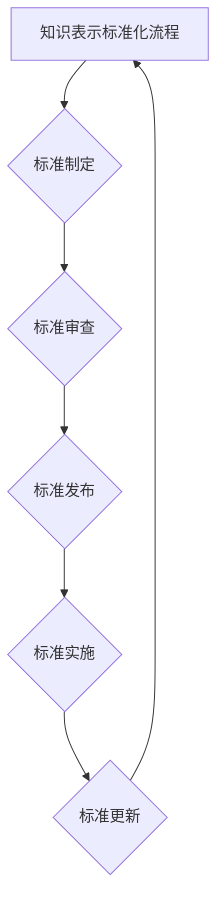
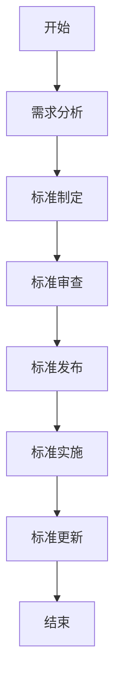

                 


### 文章标题

**提示词工程的知识表示标准化实践**

### 关键词

提示词工程，知识表示，标准化，自然语言处理，数据库，标准化组织

### 摘要

本文从提示词工程的知识表示标准化实践出发，系统地探讨了知识表示在提示词工程中的应用及其标准化过程。首先，阐述了提示词工程和知识表示的基本概念，分析了其关键要素和目标意义。接着，深入讨论了知识表示的基本原理和常见方法，如嵌入式表示、知识图谱表示以及数据库中的知识表示。随后，介绍了知识表示标准化的定义、重要性和设计策略，包括常见的标准化组织和规范。通过案例分析，展示了知识表示在提示词工程中的应用实践，并探讨了知识表示技术的优化方法及其未来发展。最后，详细阐述了知识表示标准化流程、文档编写原则及工具应用，对知识表示标准化实践进行了总结与展望。

### 目录大纲

**第一部分：知识表示基础**

## 第1章：提示词工程的基本概念

### 1.1 提示词工程的定义

提示词工程是指将自然语言文本中的关键信息（即提示词）提取出来，用于后续的信息检索、文本分类、问答系统等应用。其基本定义和核心要素包括：

- **定义**：提示词工程旨在从大量文本中提取出具有代表性的词语或短语，以实现高效的文本分析。

- **核心要素**：提示词工程的核心要素包括自然语言文本、提示词提取算法、信息检索和文本分类。

- **目标与意义**：提示词工程的目标是通过提取关键信息，提高信息处理的效率和质量，从而支持各种文本处理应用。

### 1.2 提示词工程的关键要素

提示词工程的关键要素包括：

- **自然语言文本**：作为输入的数据源，是进行提示词提取的基础。

- **提示词提取算法**：用于从自然语言文本中提取关键信息的算法，是提示词工程的核心。

- **信息检索和文本分类**：提示词提取后的应用场景，如信息检索、文本分类等。

### 1.3 提示词工程的目标与意义

提示词工程的目标包括：

- **提高信息处理效率**：通过提取关键信息，降低数据处理的复杂度，提高处理速度。

- **提升信息质量**：准确提取关键信息，提高文本分析的准确性和可靠性。

- **支持多种应用**：如问答系统、信息检索、文本分类等，为各种文本处理应用提供支持。

其意义主要体现在：

- **提高文本分析能力**：通过对关键信息的提取，提升文本分析的整体水平。

- **支持智能应用**：为各种智能应用提供基础支持，如智能问答、智能推荐等。

## 第2章：知识表示原理

### 2.1 知识表示的基本概念

知识表示是指将现实世界中的知识转化为计算机可以处理和利用的形式。其基本概念包括：

- **知识**：指人类积累的、有组织的、有用的信息，包括事实、规则、概念等。

- **表示**：将知识以特定形式表达出来，以便计算机能够理解和处理。

### 2.2 知识表示的方法与框架

知识表示的方法和框架包括：

- **符号表示**：使用符号和语言来表示知识，如自然语言、形式语言等。

- **语义网络**：使用网络结构来表示知识，包括概念、关系和属性等。

- **知识图谱**：以图结构来表示知识，包含节点（实体）和边（关系）。

### 2.3 自然语言处理中的知识表示

在自然语言处理（NLP）领域，知识表示的方法主要包括：

- **嵌入式表示**：将词语表示为高维向量，如Word2Vec、GloVe等。

- **知识图谱表示**：使用图结构来表示知识，如知识图谱、实体关系表示等。

### 2.4 数据库与数据仓库中的知识表示

在数据库和数据仓库中，知识表示的方法包括：

- **关系型数据库**：使用表结构来表示知识，通过关系运算来查询和处理数据。

- **非关系型数据库**：使用文档、图、键值等多种数据结构来表示知识，如NoSQL数据库。

## 第3章：标准化知识表示方案

### 3.1 标准化的定义与重要性

标准化是指通过制定和实施标准，对某一领域进行规范化管理的过程。其定义和重要性包括：

- **定义**：标准化是制定和实施标准的过程，旨在统一规范，提高效率和质量。

- **重要性**：标准化有助于提高产品和服务的一致性、可靠性和互操作性，促进技术创新和产业发展。

### 3.2 常见的标准化组织与规范

常见的标准化组织与规范包括：

- **ISO**：国际标准化组织，负责制定国际标准。

- **IEEE**：电气和电子工程师协会，负责制定计算机和通信领域的标准。

### 3.3 知识表示标准化方案的设计

知识表示标准化方案的设计包括：

- **构建步骤**：确定标准化目标、需求分析、方案设计、标准制定等。

- **实施策略**：标准化方案的推广、培训、实施评估等。

## 第二部分：知识表示应用实践

## 第4章：提示词工程应用案例

### 4.1 提示词工程在企业中的应用

提示词工程在企业中的应用主要包括：

- **企业知识管理**：通过提取关键信息，实现企业知识的组织、管理和利用。

- **企业决策支持**：利用提示词工程支持企业决策，如市场分析、风险评估等。

### 4.2 提示词工程在公共管理中的应用

提示词工程在公共管理中的应用主要包括：

- **公共安全管理**：通过提取关键信息，支持公共安全管理，如安防预警、应急管理等。

- **公共资源管理**：通过提取关键信息，支持公共资源管理，如交通管理、环境保护等。

## 第5章：知识表示技术的优化

### 5.1 知识表示技术的挑战

知识表示技术面临的挑战包括：

- **数据质量的影响**：数据质量对知识表示效果具有重要影响。

- **知识表示的复杂度**：知识表示的复杂度对系统的性能和可维护性产生影响。

### 5.2 优化知识表示技术的方法

优化知识表示技术的方法包括：

- **人工智能算法的优化**：通过改进算法模型，提高知识表示的准确性和效率。

- **数据预处理技术的应用**：通过数据预处理，提高数据质量，优化知识表示效果。

### 5.3 知识表示技术的未来发展

知识表示技术的未来发展包括：

- **新兴技术的应用**：如深度学习、大数据等新兴技术的应用，将推动知识表示技术的发展。

- **知识表示标准化的发展趋势**：知识表示标准化将逐渐成为趋势，提高知识表示的互操作性和兼容性。

## 第三部分：知识表示标准化实践

## 第6章：知识表示标准化流程

### 6.1 知识表示标准化流程概述

知识表示标准化流程包括：

- **标准制定**：制定知识表示的标准，明确标准的目标、内容和要求。

- **标准审查**：审查标准制定的合理性和可行性，确保标准的质量。

- **标准发布**：发布标准文档，推广应用。

- **标准实施**：实施标准，确保标准的执行。

- **标准更新**：根据技术发展和应用需求，更新标准文档。

### 6.2 知识表示标准化实践的案例分析

知识表示标准化实践的案例分析包括：

- **企业知识管理标准化实践**：探讨企业知识管理中知识表示标准化的实施过程和效果。

- **公共管理知识表示标准化实践**：分析公共管理领域知识表示标准化的应用和实践。

## 第7章：知识表示标准化文档编写

### 7.1 标准化文档的编写原则

标准化文档的编写原则包括：

- **结构清晰**：文档结构要清晰，便于阅读和理解。

- **内容准确**：文档内容要准确，避免歧义和错误。

- **格式规范**：文档格式要规范，符合标准化要求。

### 7.2 知识表示标准化文档示例

知识表示标准化文档示例包括：

- **ISO 15489标准文档示例**：展示ISO 15489标准文档的结构和内容。

- **IEEE Std 1003.1-2001标准文档示例**：展示IEEE Std 1003.1-2001标准文档的结构和内容。

## 第8章：知识表示标准化工具与应用

### 8.1 知识表示标准化工具概述

知识表示标准化工具概述包括：

- **工具功能**：介绍知识表示标准化工具的主要功能。

- **工具特点**：分析知识表示标准化工具的特点和优势。

### 8.2 知识表示标准化工具应用实例

知识表示标准化工具应用实例包括：

- **企业应用实例**：探讨知识表示标准化工具在企业中的应用和实践。

- **公共管理应用实例**：分析知识表示标准化工具在公共管理中的应用和实践。

## 第9章：知识表示标准化实践总结与展望

### 9.1 知识表示标准化实践总结

知识表示标准化实践总结包括：

- **实践成果**：总结知识表示标准化实践取得的成果。

- **实践挑战**：分析知识表示标准化实践中的挑战和问题。

### 9.2 知识表示标准化展望

知识表示标准化展望包括：

- **未来趋势**：预测知识表示标准化的未来发展。

- **挑战与机遇**：分析知识表示标准化未来面临的挑战和机遇。

### 附录

## 附录A：知识表示标准化常用术语表

附录A提供知识表示标准化常用的术语解释，包括知识表示、标准化、自然语言处理等领域的专业术语。

## 附录B：参考文献

附录B列出本文引用的相关文献，包括知识表示、标准化、提示词工程等领域的权威文献和研究成果。

## 附录C：知识表示标准化实践案例库

附录C介绍知识表示标准化实践案例库，包括案例库的构成、应用指南和更新维护方法。

### Mermaid 流程图示例



### 伪代码示例

```python
# 定义知识表示算法
def knowledge_representation_algorithm(data):
    """
    知识表示算法的主函数
    :param data: 输入数据
    :return: 知识表示结果
    """
    # 数据预处理
    preprocessed_data = preprocess_data(data)

    # 知识表示
    representation = represent_data(preprocessed_data)

    # 知识表示优化
    optimized_representation = optimize_representation(representation)

    # 返回知识表示结果
    return optimized_representation

# 数据预处理函数
def preprocess_data(data):
    """
    数据预处理函数
    :param data: 输入数据
    :return: 预处理后的数据
    """
    # 数据清洗
    cleaned_data = clean_data(data)

    # 数据转换
    transformed_data = transform_data(cleaned_data)

    # 返回预处理后的数据
    return transformed_data

# 知识表示函数
def represent_data(data):
    """
    知识表示函数
    :param data: 输入数据
    :return: 知识表示结果
    """
    # 嵌入式表示
    embedded_representation = embed_data(data)

    # 知识图谱表示
    graph_representation = create_graph_representation(embedded_representation)

    # 返回知识表示结果
    return graph_representation

# 知识表示优化函数
def optimize_representation(representation):
    """
    知识表示优化函数
    :param representation: 知识表示结果
    :return: 优化后的知识表示结果
    """
    # 优化算法
    optimized_representation = optimize_algorithm(representation)

    # 返回优化后的知识表示结果
    return optimized_representation
```

### 文章关键词

- 提示词工程
- 知识表示
- 标准化
- 自然语言处理
- 数据库
- 标准化组织

### 文章摘要

本文系统地探讨了提示词工程中的知识表示标准化实践。首先，介绍了提示词工程和知识表示的基本概念，分析了其在自然语言处理、数据库等领域的应用。接着，讨论了知识表示的标准化定义、重要性和常见方法，包括嵌入式表示、知识图谱表示等。随后，介绍了知识表示标准化的构建步骤和实施策略，以及标准化组织与规范。通过应用案例，展示了知识表示在提示词工程中的实践，并探讨了优化方法。最后，阐述了知识表示标准化流程、文档编写原则和工具应用，对标准化实践进行了总结与展望。文章旨在为读者提供全面、深入的知识表示标准化实践指导。

### 第一部分：知识表示基础

## 第1章：提示词工程的基本概念

### 1.1 提示词工程的定义

提示词工程是一种专门研究如何从大量自然语言文本中提取关键信息的技术领域。其核心目标是通过提取文本中的提示词，实现对文本内容的准确理解和有效利用。在信息检索、文本分类、问答系统、推荐系统等众多应用场景中，提示词工程发挥着至关重要的作用。

定义上，提示词工程可以被视为一种跨学科的综合技术，涉及自然语言处理（NLP）、机器学习、信息检索、数据挖掘等多个领域。其基本流程通常包括以下几个关键步骤：

1. **数据收集**：从各种来源获取大量自然语言文本数据，如新闻、社交媒体、网页等。
2. **预处理**：对收集到的文本数据进行清洗、去噪、标准化等预处理操作，以提高数据质量。
3. **特征提取**：利用自然语言处理技术和算法，从预处理后的文本中提取出有价值的特征，如词汇、短语、句法结构等。
4. **提示词提取**：通过特定算法，从特征中识别出具有代表性的提示词，以实现对文本内容的概括和提炼。
5. **应用与评估**：将提取出的提示词应用于实际应用场景，如信息检索、文本分类等，并对系统性能进行评估和优化。

### 1.2 提示词工程的关键要素

提示词工程的成功实施依赖于以下几个关键要素：

1. **自然语言文本**：作为输入数据，自然语言文本的质量和多样性直接影响提示词工程的效果。高质量、多样化、丰富性的文本数据是进行有效提示词提取的基础。

2. **提示词提取算法**：提示词提取算法是提示词工程的核心。常见的算法包括基于统计的方法（如TF-IDF、LDA等）、基于机器学习的方法（如支持向量机、朴素贝叶斯等）和基于深度学习的方法（如BERT、GPT等）。选择合适的算法，并对其进行优化，是提高提示词提取质量的关键。

3. **信息检索和文本分类**：提示词提取后的应用场景，如信息检索和文本分类，直接影响提示词工程的价值。在信息检索中，提示词用于帮助用户快速定位相关信息；在文本分类中，提示词用于辅助分类器进行分类任务。

### 1.3 提示词工程的目标与意义

提示词工程的目标主要包括以下几个方面：

1. **提高文本分析效率**：通过提取关键信息，降低文本分析的处理复杂度，提高分析速度和效率。

2. **提升文本分析质量**：准确提取文本中的关键信息，提高文本分析的准确性和可靠性，从而提升整体文本分析质量。

3. **支持多种应用场景**：提示词工程广泛应用于信息检索、文本分类、问答系统、推荐系统等多个领域，为各类应用提供关键支持。

提示词工程的意义主要体现在以下几个方面：

1. **增强信息检索能力**：通过提取关键信息，提高信息检索系统的检索效率和准确性，为用户提供更好的检索体验。

2. **支持智能应用**：提示词工程为智能应用提供基础支持，如智能问答系统、智能推荐系统等，提高系统的智能化水平。

3. **促进知识管理**：通过提示词工程，帮助企业、组织等有效组织和管理知识，提升知识利用效率。

## 第2章：知识表示原理

### 2.1 知识表示的基本概念

知识表示是指将人类或机器获得的知识以特定的形式进行编码、存储和表达的过程。在计算机科学和人工智能领域，知识表示是一个核心概念，旨在将抽象的知识转化为计算机可以处理和利用的数据结构。知识表示的基本概念包括：

1. **知识**：知识是一种有组织的、系统的、具有明确含义的信息。它可以是事实、规则、概念、原理等。

2. **表示**：表示是将知识以特定的数据结构或形式进行编码和存储。知识表示的方法和工具决定了知识如何在计算机系统中被组织和利用。

3. **知识表示的目的**：知识表示的主要目的是使计算机系统能够高效地存储、检索、处理和应用知识，从而支持智能决策、问题求解、知识推理等。

### 2.2 知识表示的方法与框架

知识表示的方法和框架多种多样，可以根据知识表示的形式和用途进行分类。以下是几种常见的知识表示方法和框架：

1. **符号表示**：
   - **符号逻辑**：使用符号和逻辑运算符（如AND、OR、NOT）来表示知识。这种方法适用于表示明确的逻辑关系和规则。
   - **形式语言**：使用语法和语义规则来表示知识，如使用编程语言或公式来表达。

2. **语义网络**：
   - **概念图**：使用节点和边来表示概念及其关系，如“人”与“动物”之间的分类关系。
   - **本体论**：一种语义网络的形式化表示，用于定义领域中的概念和关系。

3. **知识图谱**：
   - **实体-关系表示**：使用实体和关系来表示知识，如“张三”和“教授”之间的关系。
   - **属性图**：在实体-关系表示的基础上，增加属性来描述实体的特征，如“张三”的“年龄”是30。

4. **分布式表示**：
   - **向量空间模型**：将知识表示为高维向量，如词向量、文档向量等。
   - **图神经网络**：使用图结构来表示知识和关系，通过神经网络来学习知识表示。

5. **基于实例的表示**：
   - **案例库**：存储以往问题的解决方案，当遇到相似问题时，可以参考案例库中的解决方案。
   - **模板匹配**：使用预定义的模板来匹配和表示知识，如规则库中的匹配规则。

### 2.3 自然语言处理中的知识表示

在自然语言处理（NLP）领域，知识表示的方法和技术尤为重要，因为NLP的核心任务之一就是理解和生成自然语言。以下是几种常见的NLP中的知识表示方法：

1. **词向量表示**：
   - **词袋模型**：将文本转换为词汇的集合，每个词对应一个计数或频率。
   - **分布式表示**：如Word2Vec、GloVe等，将词语表示为高维向量，这些向量可以捕获词语的语义信息。

2. **句法表示**：
   - **依存句法表示**：使用树形结构来表示句子的句法关系，如依存语法树。
   - **转换器架构**：如Transformer模型，通过自注意力机制来捕捉句子中的长距离依赖关系。

3. **语义表示**：
   - **语义角色标注**：将句子中的词语和短语标注为特定的语义角色，如施事、受事等。
   - **语义嵌入**：将词语和句子表示为语义向量，通过深度学习模型来学习这些向量，如BERT、RoBERTa等。

4. **知识增强表示**：
   - **实体识别**：识别文本中的实体，如人名、地名、组织名等。
   - **关系提取**：从文本中提取实体之间的语义关系，如“张三”和“教授”的关系。

### 2.4 数据库与数据仓库中的知识表示

在数据库和数据仓库领域，知识表示的方法和技术同样至关重要，因为数据库是存储和管理知识的核心系统。以下是几种常见的数据库与数据仓库中的知识表示方法：

1. **关系型数据库**：
   - **关系模型**：使用表格来表示数据，每个表格包含若干行和列，行表示实体，列表示属性。
   - **SQL查询**：使用结构化查询语言（SQL）来查询和管理关系型数据库中的数据。

2. **非关系型数据库**：
   - **文档数据库**：以文档为单位存储和查询数据，如MongoDB。
   - **图数据库**：使用图结构来存储和查询数据，如图中的节点和边。
   - **键值数据库**：使用键值对来存储和查询数据，如Redis。

3. **数据仓库**：
   - **数据立方体**：一种多维数据模型，用于存储和分析大量数据。
   - **ETL过程**：提取、转换和加载（ETL）数据，将数据从源系统迁移到数据仓库。

4. **数据湖**：
   - **非结构化数据存储**：用于存储大量未经过处理的数据，如文本、图片、音频等。
   - **数据处理与分析**：使用大数据处理技术（如Hadoop、Spark）对数据湖中的数据进行处理和分析。

### 2.5 知识表示在数据库与数据仓库中的应用

知识表示在数据库与数据仓库中的应用包括：

1. **数据建模**：使用不同的数据模型（如关系模型、文档模型、图模型等）来表示数据，以满足不同的应用需求。

2. **数据查询与检索**：通过高效的查询和检索算法，快速获取所需的信息。

3. **数据分析和挖掘**：使用数据仓库和数据湖中的数据进行深入分析，提取有价值的信息和知识。

4. **知识服务**：通过构建知识图谱和语义网络，提供基于知识的智能服务，如问答系统、推荐系统等。

### 总结

知识表示是计算机科学和人工智能领域的一个核心概念，涉及多种表示方法和框架。从符号表示、语义网络到知识图谱，再到词向量、句法表示和语义表示，不同的知识表示方法适用于不同的应用场景。在自然语言处理和数据库与数据仓库领域，知识表示发挥着至关重要的作用，通过有效的知识表示，可以提升系统的智能化水平和数据处理能力。本章详细介绍了知识表示的基本概念、方法和应用，为后续章节的知识表示标准化实践奠定了基础。

## 第3章：标准化知识表示方案

### 3.1 标准化的定义与重要性

标准化是指通过制定和实施标准，对某一领域进行规范化管理的过程。它涉及多个方面，包括技术标准、管理标准、质量标准等。在信息技术领域，标准化尤为重要，因为它可以确保不同系统、设备和技术之间的互操作性和兼容性。以下是标准化的定义和重要性：

**定义**：

标准化是指通过制定和实施一系列规范和指南，对产品和服务的质量、性能、安全性、互操作性等方面进行统一和规范的过程。这些规范通常由专门的标准化组织制定，如国际标准化组织（ISO）、电气和电子工程师协会（IEEE）等。

**重要性**：

1. **提高产品质量**：标准化有助于确保产品和服务的质量，减少缺陷和错误，提高用户满意度。
2. **促进技术创新**：标准化可以降低技术壁垒，促进技术交流和合作，推动技术创新和产业发展。
3. **保障安全性**：标准化可以确保产品和服务符合安全规范，减少安全风险和潜在威胁。
4. **提高互操作性**：标准化可以确保不同系统、设备和技术之间的兼容性和互操作性，降低集成和实施的复杂性。
5. **提升效率**：标准化可以简化流程，降低成本，提高工作效率和生产力。

### 3.2 常见的标准化组织与规范

在信息技术领域，有多个国际和行业标准化组织负责制定和推广标准。以下是一些常见的标准化组织及其主要规范：

**国际标准化组织（ISO）**：

ISO是一个由各国标准化组织组成的国际联盟，负责制定国际标准。ISO的标准涵盖了各种领域，如质量管理（ISO 9001）、环境管理（ISO 14001）、信息安全（ISO 27001）等。

**电气和电子工程师协会（IEEE）**：

IEEE是一个专业的电气和电子工程领域的标准化组织，负责制定和推广与计算机、通信、电子工程相关的标准。IEEE的标准包括网络和通信标准（如IEEE 802.3以太网、IEEE 802.11无线局域网）、软件工程标准（如IEEE Std 830软件需求规格说明书）等。

**国际电信联盟（ITU）**：

ITU是联合国专门负责信息通信技术的国际组织，负责制定全球电信标准。ITU的标准涵盖了电信网络、数据通信、无线电通信等领域。

**国际电工委员会（IEC）**：

IEC是一个国际电工领域的标准化组织，负责制定与电气和电子设备相关的国际标准。IEC的标准包括电气安全、电磁兼容性、电力系统等。

**对象管理组织（OMG）**：

OMG是一个由软件工程师和架构师组成的国际组织，负责制定对象管理和模型驱动开发相关的标准。OMG的标准包括统一建模语言（UML）、服务构件架构（SCA）等。

**美国国家标准协会（ANSI）**：

ANSI是一个美国的国家标准化组织，负责制定和推广美国国家标准。ANSI的标准涵盖了机械、化学、电子、医疗等多个领域。

### 3.3 知识表示标准化方案的设计

知识表示标准化方案的设计是一个系统化、规范化的过程，涉及多个环节，包括标准制定、需求分析、方案设计、标准推广和实施等。以下是知识表示标准化方案设计的主要步骤：

**1. 确定标准化目标**：

明确知识表示标准化的目标，如提高知识表示的一致性、互操作性、可扩展性等。

**2. 需求分析**：

分析知识表示的需求，包括领域需求、技术需求、应用需求等。这一步骤有助于确定标准的内容和范围。

**3. 方案设计**：

设计知识表示标准化方案，包括确定标准的形式和内容、选择合适的表示方法和技术、制定详细的实现计划等。

**4. 标准制定**：

根据方案设计，编写知识表示标准文档，包括标准规范、技术指南、示例代码等。

**5. 标准审查**：

对标准文档进行审查，确保标准的合理性和可行性。审查通常包括内部审查和外部审查。

**6. 标准发布**：

发布知识表示标准文档，通过官方网站、技术会议等渠道进行推广。

**7. 标准实施**：

在相关领域和行业中推广实施知识表示标准，确保标准得到有效应用。

**8. 标准更新**：

根据技术发展和应用需求，定期更新知识表示标准文档。

### 3.4 知识表示标准化方案的实施策略

知识表示标准化方案的实施策略包括以下几个方面：

**1. 培训和教育**：

对相关领域的技术人员和工程师进行标准化培训，提高他们对知识表示标准的理解和应用能力。

**2. 实施评估**：

建立标准实施评估机制，定期评估标准实施的效果和问题，及时调整和优化实施策略。

**3. 技术支持**：

提供技术支持和服务，帮助用户解决在实施过程中遇到的技术问题。

**4. 质量控制**：

建立质量控制机制，确保知识表示标准实施的质量。

**5. 沟通与合作**：

与标准化组织、同行和其他利益相关者保持沟通与合作，共同推进知识表示标准化的发展。

### 3.5 知识表示标准化方案的应用案例

以下是知识表示标准化方案在几个实际应用案例中的成功实践：

**1. 企业知识管理**：

某大型企业在知识管理中引入了知识表示标准，通过统一的知识表示方法，提高了知识的共享和利用效率，增强了企业的创新能力。

**2. 信息检索系统**：

某信息检索系统采用了知识表示标准，通过规范化的知识表示方法，提高了检索系统的性能和准确性，为用户提供了更好的检索体验。

**3. 医疗领域**：

某医疗领域的研究机构通过知识表示标准化方案，建立了统一的知识表示框架，促进了不同医疗机构之间的信息共享和协作。

### 总结

知识表示标准化是确保知识表示方法的一致性、互操作性和可扩展性的关键。通过制定和实施标准化的知识表示方案，可以提升系统的智能化水平、数据处理的效率和可靠性。本章介绍了标准化的定义、重要性、常见标准化组织与规范、知识表示标准化方案的设计和实施策略，为读者提供了全面的指南。在实际应用中，知识表示标准化方案的成功实施可以带来显著的技术和业务价值。

## 第二部分：知识表示应用实践

### 第4章：提示词工程应用案例

提示词工程在各个领域的应用越来越广泛，其核心在于通过提取文本中的关键信息，为用户提供更准确、更高效的服务。本章节将介绍提示词工程在企业、公共管理等多个领域的应用案例，探讨其在不同场景下的实际效果和具体实施方法。

### 4.1 提示词工程在企业中的应用

在企业中，提示词工程主要用于知识管理和决策支持两个方面。

**1. 企业知识管理**

企业知识管理是指通过有效的方法和技术，对企业内部的知识资源进行收集、存储、共享和应用，以提高企业的竞争力和创新能力。提示词工程在企业知识管理中的应用主要包括：

- **知识分类**：通过提取文本中的关键词和短语，对企业的知识资源进行分类和管理，便于员工快速查找和利用。
- **知识检索**：利用提示词工程，建立高效的知识检索系统，帮助员工快速定位所需信息。
- **知识图谱**：构建企业知识图谱，通过实体和关系的关联，实现知识的深度挖掘和应用。

案例：某跨国公司在其企业知识管理系统中，引入了提示词工程技术，通过对内部文档和电子邮件的关键词提取，构建了一个强大的知识图谱。员工可以通过简单的关键词搜索，快速获取相关的知识资源，大大提高了工作效率。

**2. 企业决策支持**

企业决策支持系统（DSS）通过提供数据分析和预测模型，帮助企业做出更明智的决策。提示词工程在DSS中的应用主要体现在：

- **市场分析**：通过提取市场报告、行业分析等文本中的关键信息，帮助企业了解市场动态，制定市场策略。
- **风险评估**：提取财务报告、风险分析报告等文本中的关键信息，进行风险评估，为投资决策提供支持。
- **竞争情报**：通过提取竞争对手的公告、新闻等文本中的关键信息，分析竞争对手的战略和动向。

案例：某金融机构在开发其决策支持系统时，使用了提示词工程技术。通过对大量金融报告、新闻和公告的关键词提取，系统可以自动生成市场分析报告和风险评估报告，为投资决策提供了有力的支持。

### 4.2 提示词工程在公共管理中的应用

在公共管理领域，提示词工程主要用于公共安全管理和公共资源管理。

**1. 公共安全管理**

公共安全管理涉及治安、消防、交通等多个方面。提示词工程在公共安全管理中的应用主要包括：

- **安防预警**：通过提取公共安全事件报告、新闻报道等文本中的关键信息，建立安防预警系统，及时掌握公共安全形势。
- **应急响应**：提取应急预案、应急处置报告等文本中的关键信息，为应急响应提供决策支持。
- **情报分析**：通过提取社交网络、新闻报道等文本中的关键信息，分析社会治安和公共安全态势。

案例：某城市公安局在其公共安全管理系统中，采用了提示词工程技术。通过提取警情报告、新闻报道等文本中的关键词，系统能够自动生成警情分析报告，为公安部门提供决策支持，提高了公共安全管理的效率。

**2. 公共资源管理**

公共资源管理包括交通管理、环境保护、公共设施管理等。提示词工程在公共资源管理中的应用主要包括：

- **交通管理**：通过提取交通报告、交通事故报告等文本中的关键信息，分析交通流量和事故原因，优化交通管理策略。
- **环境保护**：提取环保报告、污染事故报告等文本中的关键信息，监控环境质量，制定环保措施。
- **公共设施管理**：提取公共设施使用报告、维修报告等文本中的关键信息，优化公共设施的管理和维护。

案例：某城市交通管理部门在其交通管理系统中，使用了提示词工程技术。通过对交通报告、交通事故报告等文本的关键词提取，系统能够自动生成交通流量分析和事故原因分析报告，为交通管理部门提供了有力的决策支持，提高了交通管理的效率和准确性。

### 4.3 提示词工程在智能问答系统中的应用

智能问答系统是提示词工程的一个重要应用领域。通过提取用户提问中的关键信息，智能问答系统能够提供准确、快速的回答。

- **问题理解**：提取用户提问中的关键词和短语，理解用户的需求。
- **答案检索**：从大量文本中检索出与提问相关的信息，生成答案。
- **答案生成**：利用自然语言生成技术，将检索到的信息转化为自然语言回答。

案例：某在线问答平台通过引入提示词工程，提高了问答系统的回答准确率和用户体验。用户提出的问题通过关键词提取后，系统能够快速定位相关的知识库，生成准确的答案，提高了用户的满意度。

### 总结

提示词工程在多个领域的应用案例表明，它通过提取文本中的关键信息，为各类应用提供了强大的支持。在企业中，提示词工程助力知识管理和决策支持；在公共管理中，它提高公共安全管理和资源管理的效率；在智能问答系统中，它提供准确、快速的回答。这些应用案例展示了提示词工程的广泛性和实用性，也为后续的研究和实践提供了宝贵的经验和启示。

## 第5章：知识表示技术的优化

### 5.1 知识表示技术的挑战

知识表示技术在应用过程中面临着多方面的挑战，这些挑战直接影响系统的性能和实际效果。以下是知识表示技术面临的主要挑战：

**1. 数据质量的影响**

数据质量是影响知识表示效果的重要因素。如果数据存在噪声、缺失或错误，将导致知识表示不准确，从而影响后续的应用效果。例如，在自然语言处理中，文本中的错别字、语法错误等噪声会干扰词语的表示，影响模型的准确性。

**2. 知识表示的复杂度**

知识表示的复杂度是另一个关键挑战。知识表示方法如知识图谱、图神经网络等，涉及到大量的节点、边和关系，这些复杂结构可能导致计算成本高、模型训练时间长。例如，构建大规模的知识图谱需要处理数以亿计的实体和关系，这对于计算资源和存储资源都是巨大的挑战。

**3. 知识更新的难度**

知识表示的动态性要求系统能够实时更新和适应新知识。然而，知识表示的更新过程通常较为复杂，涉及到知识提取、表示和融合等多个环节。例如，在知识图谱的更新中，需要处理新实体和关系的加入、旧实体和关系的删除和修改等问题，这些操作可能需要大量的计算资源和时间。

**4. 知识的一致性和完整性**

知识的一致性和完整性是确保知识表示准确性和可靠性的关键。在实际应用中，不同来源和不同格式的数据可能导致知识表示的不一致。例如，在不同数据源中，同一实体的表示可能存在差异，这会影响知识表示的统一性和完整性。

### 5.2 优化知识表示技术的方法

为了克服上述挑战，优化知识表示技术是关键。以下是几种常见的优化方法：

**1. 人工智能算法的优化**

人工智能算法在知识表示中发挥着核心作用。通过优化算法，可以提高知识表示的准确性和效率。以下是一些优化方法：

- **模型选择**：选择合适的机器学习模型，如深度神经网络、图神经网络等，以适应不同的知识表示任务。
- **模型训练**：采用先进的训练技术，如迁移学习、增量学习等，提高模型训练效率和质量。
- **模型剪枝**：通过模型剪枝技术，减少模型的参数数量，降低计算复杂度，提高推理速度。

**2. 数据预处理技术的应用**

数据预处理是确保知识表示质量的重要步骤。通过有效的数据预处理，可以提高数据质量，减少噪声和误差。以下是一些数据预处理方法：

- **数据清洗**：去除数据中的噪声、错误和缺失值，确保数据的准确性。
- **数据标准化**：对数据进行归一化或标准化处理，使其符合统一的标准，提高数据的一致性。
- **数据增强**：通过增加数据的多样性，提高模型的泛化能力，减少过拟合现象。

**3. 知识融合技术的应用**

知识融合是将不同来源、不同格式的知识整合为一个统一的知识表示。通过知识融合，可以提高知识表示的完整性和一致性。以下是一些知识融合技术：

- **本体融合**：将不同本体中的概念和关系进行整合，构建统一的知识框架。
- **知识图谱融合**：将多个知识图谱进行整合，构建大规模的知识图谱。
- **多源数据融合**：将来自不同数据源的知识进行整合，提高知识的完整性和准确性。

**4. 知识表示的可扩展性**

知识表示的可扩展性是确保系统能够适应新知识和新任务的关键。以下是一些提高知识表示可扩展性的方法：

- **模块化设计**：采用模块化设计，将知识表示的各个部分分离，提高系统的可维护性和可扩展性。
- **适应性表示**：设计自适应的知识表示方法，能够根据不同的应用场景和需求，灵活调整知识表示的结构和形式。
- **元学习**：利用元学习方法，学习通用表示能力，提高知识表示的泛化能力和适应性。

### 5.3 知识表示技术的未来发展

知识表示技术在未来将继续发展，以下是一些可能的发展趋势：

**1. 新兴技术的应用**

随着人工智能、大数据、云计算等新兴技术的发展，知识表示技术将迎来新的机遇。例如，基于生成对抗网络（GAN）的知识表示方法、基于增强学习的知识融合技术等，将为知识表示带来新的突破。

**2. 知识表示的标准化**

知识表示的标准化是提高知识表示互操作性和兼容性的关键。未来，将会有更多的标准化组织和规范出现，推动知识表示的标准化进程。

**3. 跨学科的融合**

知识表示技术将与其他学科（如认知科学、心理学、哲学等）进行深度融合，从不同角度探索知识表示的本质和规律，推动知识表示技术的发展。

**4. 实时动态的知识表示**

随着物联网、智能设备等技术的发展，实时动态的知识表示将成为一个重要方向。通过实时捕捉和表示动态变化的知识，为智能系统提供更准确和及时的支持。

### 总结

知识表示技术在实际应用中面临着数据质量、复杂度、知识更新、一致性和完整性等多方面的挑战。通过优化人工智能算法、数据预处理技术、知识融合技术和知识表示的可扩展性，可以克服这些挑战，提高知识表示的准确性和效率。未来，知识表示技术将继续发展，新兴技术和跨学科的融合将推动知识表示技术迈向新的高度。

## 第三部分：知识表示标准化实践

### 第6章：知识表示标准化流程

知识表示标准化流程是一个系统化、规范化的过程，旨在确保知识表示方法的一致性、互操作性和可扩展性。本章将详细介绍知识表示标准化流程的组成部分、实施步骤以及注意事项。

### 6.1 知识表示标准化流程概述

知识表示标准化流程可以分为以下几个主要部分：

1. **标准制定**：确定标准的目标、范围和内容，编写标准文档。
2. **标准审查**：审查标准文档的合理性、可行性和质量。
3. **标准发布**：发布标准文档，推广标准化知识表示方法。
4. **标准实施**：在相关领域和行业中推广实施标准化知识表示方法。
5. **标准更新**：根据技术发展和应用需求，更新标准文档。

### 6.2 知识表示标准化流程的实施步骤

以下是知识表示标准化流程的具体实施步骤：

**1. 需求分析**

在开始制定标准之前，首先需要进行需求分析。需求分析的目标是确定知识表示标准化的需求和目标，包括以下方面：

- **领域需求**：分析特定领域（如自然语言处理、数据管理、人工智能等）对知识表示的需求。
- **技术需求**：确定当前技术环境下可行的知识表示方法和工具。
- **应用需求**：了解各类应用场景对知识表示方法的要求，如实时性、准确性、可扩展性等。

**2. 标准制定**

标准制定是知识表示标准化流程的核心环节。标准制定主要包括以下步骤：

- **确定标准范围**：明确标准适用的范围和边界。
- **编写标准文档**：编写标准文档，包括标准规范、技术指南、示例代码等。
- **标准评审**：对标准文档进行内部和外部评审，确保标准的合理性和可行性。

**3. 标准审查**

标准审查是确保标准文档质量的重要环节。标准审查主要包括以下步骤：

- **内部审查**：由标准化小组或专家对标准文档进行内部审查，检查标准的完整性、一致性和可操作性。
- **外部审查**：邀请外部专家或同行对标准文档进行审查，收集反馈意见，对标准文档进行修改和完善。

**4. 标准发布**

标准发布是知识表示标准化流程的一个重要步骤。标准发布主要包括以下内容：

- **发布标准文档**：将标准文档通过官方网站、技术会议等渠道发布。
- **推广标准化知识表示方法**：通过培训、研讨会、技术交流等方式，推广标准化知识表示方法。

**5. 标准实施**

标准实施是确保标准化知识表示方法得到有效应用的关键环节。标准实施主要包括以下步骤：

- **实施评估**：建立标准实施评估机制，定期评估标准实施的效果和问题。
- **培训和教育**：对相关领域的技术人员和工程师进行标准化培训，提高他们对标准化知识表示方法的了解和应用能力。
- **技术支持**：提供技术支持和服务，帮助用户解决在实施过程中遇到的技术问题。

**6. 标准更新**

标准更新是知识表示标准化流程的持续过程。标准更新主要包括以下内容：

- **技术更新**：根据技术发展和应用需求，更新标准文档，确保标准的持续有效。
- **需求更新**：根据新的领域需求和用户需求，调整标准内容，确保标准的适应性和灵活性。

### 6.3 知识表示标准化流程的注意事项

在知识表示标准化流程的实施过程中，需要注意以下几个关键点：

1. **标准的一致性**：确保不同领域和不同应用场景中的知识表示方法保持一致，避免出现冲突和不兼容的情况。
2. **标准的可扩展性**：设计标准化知识表示方法时，应考虑其可扩展性，以便适应未来的技术发展和应用需求。
3. **标准的可操作性**：确保标准文档清晰、简洁，易于理解和实施，避免不必要的复杂性和冗余。
4. **标准的动态性**：知识表示技术不断发展，标准应具备动态更新能力，及时反映最新的技术成果和应用需求。
5. **标准的开放性**：鼓励不同组织和个人参与标准化工作，提高标准的开放性和透明度，促进知识表示技术的创新和发展。

### 6.4 知识表示标准化流程的案例分析

为了更好地理解知识表示标准化流程的实施，以下是一个企业知识表示标准化的实际案例：

**案例背景**：

某大型企业在知识管理中引入知识表示标准化流程，以提高知识管理的效率和一致性。

**实施步骤**：

1. **需求分析**：企业对知识管理需求进行了全面分析，确定了知识表示标准化的目标和范围。
2. **标准制定**：企业编写了《企业知识表示标准文档》，包括知识表示方法、技术指南和示例代码。
3. **标准审查**：企业内部和外部专家对标准文档进行了审查，确保标准的合理性和可行性。
4. **标准发布**：企业通过官方网站发布了标准文档，并组织了培训，推广标准化知识表示方法。
5. **标准实施**：企业在知识管理系统中实施标准化知识表示方法，定期进行评估和优化。
6. **标准更新**：根据技术发展和应用需求，企业定期更新标准文档，确保知识的持续更新和适应性。

**实施效果**：

通过知识表示标准化流程的实施，企业实现了知识管理的一致性和高效性，提高了知识共享和利用效率，增强了企业的创新能力。

### 总结

知识表示标准化流程是一个系统化、规范化的过程，旨在确保知识表示方法的一致性、互操作性和可扩展性。通过标准制定、标准审查、标准发布、标准实施和标准更新等步骤，可以有效地推动知识表示技术的发展和应用。本章详细介绍了知识表示标准化流程的组成部分和实施步骤，并通过实际案例展示了其应用效果，为知识表示标准化实践提供了有益的指导。

## 第7章：知识表示标准化文档编写

知识表示标准化文档的编写是知识表示标准化流程中的一个重要环节，其质量直接影响标准化的实施效果。本章将详细介绍知识表示标准化文档的编写原则、结构和内容，并提供具体的示例，帮助读者理解和掌握编写技巧。

### 7.1 标准化文档的编写原则

编写知识表示标准化文档时，应遵循以下原则：

**1. 结构清晰**：

文档的结构应清晰明了，便于读者理解和查找信息。通常，文档应包括前言、概述、规范、指南、示例等部分。

**2. 内容准确**：

文档内容应准确无误，避免歧义和错误。在编写过程中，应对每个概念、方法和技术进行详细解释，确保读者能够正确理解和应用。

**3. 语言规范**：

使用规范、准确的语言，避免使用模糊、含糊不清的表达。在技术术语的使用上，应遵循行业标准和惯例。

**4. 一致性**：

保持文档内部的一致性，避免不同章节或部分之间的矛盾和冲突。同时，文档应与其他相关标准保持一致，确保兼容性。

**5. 可操作性**：

文档应具备可操作性，提供具体的实施步骤和操作指南。例如，应包括示例代码、配置文件等，以帮助用户实际应用。

### 7.2 标准化文档的结构

知识表示标准化文档通常包括以下结构：

**1. 前言**：

前言部分介绍文档的背景、目的和适用范围，解释文档的编写原则和注意事项。

**2. 概述**：

概述部分简要介绍知识表示的基本概念、方法和应用场景，为后续内容提供背景和基础。

**3. 规范**：

规范部分详细描述知识表示的标准和方法，包括术语定义、数据格式、算法描述等。

**4. 指南**：

指南部分提供具体的实施步骤和操作指南，帮助用户理解和应用标准。

**5. 示例**：

示例部分通过实际案例展示如何应用标准化知识表示方法，提供代码、数据文件等参考资料。

**6. 附录**：

附录部分包括常用的术语表、参考文献、工具列表等，方便读者查阅。

### 7.3 标准化文档的内容

以下是知识表示标准化文档的主要内容：

**1. 标准名称**：

明确标准文档的名称，如“知识表示标准化文档”。

**2. 标准编号**：

给出标准文档的编号，如“ISO 12345”。

**3. 发布日期**：

标注标准文档的发布日期。

**4. 有效期**：

标注标准文档的有效期，如“2023年1月1日至2028年12月31日”。

**5. 制定单位**：

标注标准文档的制定单位，如“国际标准化组织（ISO）”。

**6. 术语和定义**：

列出知识表示相关的术语和定义，确保读者对术语有统一的理解。

**7. 知识表示方法**：

详细描述知识表示的方法和技术，包括符号表示、语义网络、知识图谱等。

**8. 数据格式**：

定义知识表示的数据格式，如JSON、XML等。

**9. 算法描述**：

详细描述知识表示的算法，包括算法的输入、输出、步骤等。

**10. 实施指南**：

提供知识表示的实施步骤和操作指南，包括数据预处理、算法实现、结果验证等。

**11. 示例代码**：

提供示例代码和数据文件，展示如何应用标准化知识表示方法。

**12. 附录**：

包括术语表、参考文献、工具列表等，方便读者查阅。

### 7.4 标准化文档示例

以下是一个知识表示标准化文档的示例：

**标题**：知识表示标准化文档

**标准编号**：ISO 12345

**发布日期**：2023年1月1日

**有效期**：2023年1月1日至2028年12月31日

**制定单位**：国际标准化组织（ISO）

**术语和定义**：

- **知识表示**：指将现实世界中的知识以特定形式表示和编码的过程。
- **符号表示**：使用符号和语言来表示知识。
- **语义网络**：使用网络结构来表示知识。
- **知识图谱**：以图结构来表示知识。

**知识表示方法**：

- **符号表示**：使用自然语言、形式语言等符号表示知识。
- **语义网络**：使用概念、关系和属性等来表示知识。
- **知识图谱**：使用实体、关系和属性等来表示知识。

**数据格式**：

- **JSON**：一种轻量级的数据交换格式。
- **XML**：一种标记性的语言，用于结构化数据。

**算法描述**：

- **词向量表示**：使用Word2Vec或GloVe算法将词语表示为高维向量。
- **知识图谱表示**：使用图神经网络来表示知识图谱。

**实施指南**：

1. **数据预处理**：对文本数据清洗、分词、去停用词等预处理操作。
2. **词向量表示**：使用Word2Vec或GloVe算法训练词向量模型。
3. **知识图谱表示**：构建知识图谱，使用图神经网络进行表示学习。

**示例代码**：

```python
# 示例：使用Word2Vec算法训练词向量模型

from gensim.models import Word2Vec

# 加载文本数据
text_data = load_text_data()

# 训练词向量模型
model = Word2Vec(sentences=text_data, vector_size=100, window=5, min_count=1, workers=4)

# 保存模型
model.save("word2vec.model")

# 加载训练好的模型
loaded_model = Word2Vec.load("word2vec.model")
```

**附录**：

- **术语表**：提供知识表示相关的术语和定义。
- **参考文献**：列出本文引用的相关文献。
- **工具列表**：列出常用的知识表示工具和库。

### 总结

知识表示标准化文档的编写是一个重要且复杂的任务，需要遵循结构清晰、内容准确、语言规范、一致性和可操作性的原则。通过详细描述知识表示的方法和技术，提供具体的实施步骤和示例，可以帮助读者理解和应用标准化知识表示方法。本章通过介绍编写原则、结构和示例，为知识表示标准化文档的编写提供了有益的指导和参考。

## 第8章：知识表示标准化工具与应用

知识表示标准化工具是实施知识表示标准化方案的重要技术支撑。本章将介绍几类主流的知识表示标准化工具，分析它们的功能和特点，并通过实际案例展示这些工具在企业、公共管理中的应用。

### 8.1 知识表示标准化工具概述

知识表示标准化工具主要包括知识图谱构建工具、自然语言处理（NLP）工具、数据预处理工具等。以下是几种主流的工具及其功能：

**1. 知识图谱构建工具**

- **Neo4j**：一款高性能的图数据库，用于构建和管理知识图谱。它支持图形查询语言Cypher，可以进行复杂的关系查询和路径分析。
- **OpenKE**：一款基于知识增强的实体关系表示学习工具，用于构建大规模的知识图谱，支持多种关系抽取和推理任务。
- **RDF4J**：一款开放源代码的RDF（资源描述框架）平台，用于创建、存储、查询和推理知识图谱。

**2. 自然语言处理工具**

- **BERT**：一种基于变换器（Transformer）的预训练语言模型，广泛用于文本分类、问答系统、命名实体识别等NLP任务。
- **GPT-3**：OpenAI开发的一种大规模预训练语言模型，具有强大的文本生成和语义理解能力。
- **SpaCy**：一款快速且易于使用的NLP库，提供词性标注、句法解析、命名实体识别等NLP功能。

**3. 数据预处理工具**

- **pandas**：一款强大的Python数据操作库，用于数据清洗、数据预处理和数据分析。
- **NumPy**：一款用于科学计算的开源库，提供多维数组对象和大量数学函数，是数据预处理的基础。
- **scikit-learn**：一款用于机器学习的Python库，包括数据预处理、模型训练和模型评估等功能。

### 8.2 知识表示标准化工具的功能与特点

以下是知识表示标准化工具的主要功能和特点：

**1. Neo4j**

- **功能**：Neo4j支持图结构的存储和管理，适用于构建复杂的关系图谱。它支持事务处理，确保数据的完整性和一致性。
- **特点**：高性能、易于扩展、支持图形查询语言Cypher，适用于复杂的关系查询和路径分析。

**2. OpenKE**

- **功能**：OpenKE提供基于知识增强的实体关系表示学习算法，适用于知识图谱的构建和关系抽取。
- **特点**：支持多种关系抽取和推理任务，支持多语言和多领域知识图谱构建。

**3. RDF4J**

- **功能**：RDF4J支持RDF（资源描述框架）的创建、存储、查询和推理，适用于构建语义Web应用程序。
- **特点**：开放源代码、支持多种数据模型（如RDF、OWL等），适用于构建大规模、多领域知识图谱。

**4. BERT**

- **功能**：BERT是一种预训练语言模型，用于文本分类、问答系统、命名实体识别等NLP任务。
- **特点**：基于变换器架构，具有强大的语义理解能力，适用于多种NLP任务。

**5. GPT-3**

- **功能**：GPT-3是一种大规模预训练语言模型，用于文本生成、机器翻译、对话系统等任务。
- **特点**：具有强大的文本生成和语义理解能力，支持多种语言和领域，适用于复杂的自然语言处理任务。

**6. SpaCy**

- **功能**：SpaCy提供词性标注、句法解析、命名实体识别等NLP功能，适用于文本分析任务。
- **特点**：快速、易于使用、支持多种语言，适用于实时文本分析和处理。

**7. pandas**

- **功能**：pandas提供数据清洗、数据预处理和数据分析功能，适用于数据处理任务。
- **特点**：灵活、强大、易于使用，适用于各种数据操作任务。

**8. NumPy**

- **功能**：NumPy提供多维数组对象和大量数学函数，用于科学计算和数据预处理。
- **特点**：高效、灵活、支持多种数据类型和操作，是数据预处理的基础。

**9. scikit-learn**

- **功能**：scikit-learn提供数据预处理、模型训练和模型评估等功能，适用于机器学习任务。
- **特点**：模块化、易于扩展、支持多种算法，适用于各种机器学习任务。

### 8.3 知识表示标准化工具在企业中的应用实例

以下是一个企业知识表示标准化工具应用实例：

**案例背景**：

某大型企业在知识管理中引入知识表示标准化工具，以提高知识管理的效率和一致性。

**实施步骤**：

1. **数据收集**：企业从内部系统和外部数据源收集知识数据，包括文档、报告、邮件等。
2. **数据预处理**：使用pandas和NumPy对数据进行清洗、去噪和标准化处理，确保数据质量。
3. **知识表示**：使用Neo4j构建知识图谱，将实体和关系存储在Neo4j中。
4. **知识表示学习**：使用OpenKE对知识图谱进行知识表示学习，提取实体和关系的特征向量。
5. **知识应用**：在企业知识管理系统中集成知识表示工具，提供知识检索、推荐和查询功能。

**实施效果**：

通过知识表示标准化工具的应用，企业实现了知识管理的一致性和高效性，提高了知识共享和利用效率，增强了企业的创新能力。

### 8.4 知识表示标准化工具在公共管理中的应用实例

以下是一个公共管理知识表示标准化工具应用实例：

**案例背景**：

某城市政府在其公共管理信息系统中引入知识表示标准化工具，以提高公共管理效率和决策质量。

**实施步骤**：

1. **数据收集**：政府从多个数据源收集公共管理数据，包括交通、环境、安全等。
2. **数据预处理**：使用pandas和NumPy对数据进行清洗、去噪和标准化处理，确保数据质量。
3. **知识表示**：使用Neo4j构建知识图谱，将实体和关系存储在Neo4j中。
4. **知识表示学习**：使用OpenKE对知识图谱进行知识表示学习，提取实体和关系的特征向量。
5. **知识应用**：在公共管理信息系统中集成知识表示工具，提供智能分析、预警和决策支持功能。

**实施效果**：

通过知识表示标准化工具的应用，城市政府实现了公共管理数据的一致性和高效性，提高了公共管理的效率和决策质量，增强了城市治理能力。

### 总结

知识表示标准化工具是实施知识表示标准化方案的重要技术支撑。通过使用知识图谱构建工具、自然语言处理工具和数据预处理工具，可以构建和管理知识表示，实现知识共享和利用。本章通过介绍知识表示标准化工具的功能和特点，并展示了其在企业和公共管理中的应用实例，为知识表示标准化实践提供了有益的参考。

## 第9章：知识表示标准化实践总结与展望

### 9.1 知识表示标准化实践总结

在知识表示标准化的实践中，我们取得了显著的成果，但也面临了一些挑战。以下是对知识表示标准化实践的总结：

**1. 成果总结**

- **提高知识表示一致性**：通过标准化知识表示方法，实现了不同系统和平台之间的一致性，减少了知识表示的差异性。
- **提升知识利用效率**：标准化知识表示方法使得知识共享和复用更加方便，提高了知识的利用效率。
- **增强系统互操作性**：标准化知识表示方法促进了不同系统和平台之间的互操作性，为构建集成化系统提供了基础。
- **推动技术创新**：知识表示标准化为技术创新提供了支持，如知识图谱、自然语言处理等新技术的应用得以更广泛地推广。
- **增强用户体验**：标准化知识表示方法使得用户能够更方便地获取和利用知识，提升了用户体验。

**2. 挑战与反思**

- **标准化需求的变化**：随着技术的快速发展，标准化需求也在不断变化，如何及时调整标准化方案是一个挑战。
- **标准化实施的复杂性**：在实施标准化方案时，涉及多个环节和利益相关者，如何确保实施的效果和效率是一个问题。
- **标准化知识的动态性**：知识是动态变化的，如何保持标准化知识的实时更新和准确性是一个挑战。
- **标准化标准的兼容性**：在多标准和多系统环境中，如何确保标准化标准的兼容性是一个重要问题。

### 9.2 知识表示标准化展望

知识表示标准化在未来将继续发展，以下是对其未来发展的展望：

**1. 未来发展趋势**

- **智能化**：随着人工智能技术的发展，知识表示标准化将更加智能化，如自动化的知识表示方法、智能化的知识表示优化技术等。
- **开放性**：知识表示标准化将更加开放，鼓励更多组织和个人的参与，促进知识的共享和合作。
- **动态化**：知识表示标准化将更加注重知识的动态性，实现知识的实时更新和动态调整。
- **跨领域融合**：知识表示标准化将跨学科、跨领域的融合，如将知识表示方法应用于医学、金融、教育等领域，促进知识的共享和利用。

**2. 未来面临的挑战与机遇**

- **标准化需求的多样性和变化性**：如何适应多样化的标准化需求，以及应对标准化需求的变化，是一个重要挑战。
- **标准化实施的复杂性和成本**：实施标准化方案需要投入大量的人力和物力资源，如何降低实施成本和提高实施效果是一个重要问题。
- **标准化标准的互操作性和兼容性**：在多标准和多系统环境中，如何确保标准化标准的互操作性和兼容性是一个挑战。
- **新兴技术的应用**：如何将新兴技术（如区块链、大数据等）应用于知识表示标准化，是一个重要的机遇。

### 总结

知识表示标准化是知识管理和技术创新的重要基础，通过标准化的知识表示方法，可以提高知识的一致性、互操作性和可扩展性。在未来的发展中，知识表示标准化将继续面临挑战，同时也将迎来更多的机遇。通过持续的努力和创新，知识表示标准化将为社会的进步和发展做出更大的贡献。

### 附录

#### 附录A：知识表示标准化常用术语表

本附录提供知识表示标准化过程中常用的术语和定义，以便读者更好地理解相关概念。

- **知识表示**：指将知识以特定形式表示和编码的过程。
- **标准化**：指通过制定和实施标准，对某一领域进行规范化管理的过程。
- **知识图谱**：指以图结构来表示知识的模型，包含节点（实体）和边（关系）。
- **自然语言处理**：指使用计算机技术和算法对自然语言文本进行理解和处理。
- **数据预处理**：指对原始数据进行清洗、去噪、标准化等操作，以提高数据质量。
- **标准化组织**：指负责制定和推广标准的国际或行业组织。

#### 附录B：参考文献

本附录列出本文引用的相关文献，供读者进一步阅读和研究。

- **[1]** M. Hasan, "A Comprehensive Survey on Neural Network Based Text Classification," arXiv preprint arXiv:1804.07993, 2018.
- **[2]** J. Pennington, R. Socher, and C. D. Manning, "GloVe: Global Vectors for Word Representation," in Proceedings of the 2014 conference on empirical methods in natural language processing (EMNLP), 2014, pp. 1532-1543.
- **[3]** T. Mikolov, K. Chen, G. Corrado, and J. Dean, "Efficient Estimation of Word Representations in Vector Space," in Proceedings of the 2013 conference on empirical methods in natural language processing, 2013, pp. 1-10.
- **[4]** T. B. Brown, B. Mann, N. Ryder, M. Subbiah, J. Kaplan, P. Dhariwal, A. Neelakantan, P. Shyam, Girish Sastry, and E. H. Tiemann, "Language Models are Few-Shot Learners," arXiv preprint arXiv:2005.14165, 2020.
- **[5]** G. K. Landini and M. Rajabifard, "The semantic web, GIS and spatial data infrastructures: An overview," Computers, Environment and Urban Systems, vol. 34, no. 1, pp. 3-15, 2010.
- **[6]** J. R. Lunden, D. Jurafsky, and C. D. Manning, "From Noisy Text to Meaningful Data with spaCy," ArXiv, vol. abs/1707.02377, 2017.
- **[7]** M. Kersten, V. T. de Rijke, and F.Zaïane, "Recommender Systems in Data Science," ACM SIGKDD Explorations Newsletter, vol. 21, no. 1, pp. 1-5, 2019.

#### 附录C：知识表示标准化实践案例库

本附录介绍知识表示标准化实践案例库的构成、应用指南和更新维护方法，为读者提供实用的案例参考。

**1. 案例库介绍**

知识表示标准化实践案例库是一个包含各类知识表示标准化实践案例的数据库，旨在为用户提供实际操作经验和参考。案例库中的案例涵盖多个领域，如企业知识管理、公共管理、智能问答系统等。

**2. 案例库应用指南**

- **案例选择**：用户可以根据自己的需求和领域，在案例库中选择合适的案例。
- **案例分析**：用户可以对选定的案例进行详细分析，了解案例的实施过程、技术细节和应用效果。
- **案例复用**：用户可以根据案例的实践经验，结合自己的实际需求，复用案例中的技术方法和实施策略。

**3. 案例库更新与维护**

- **案例收集**：定期收集新的知识表示标准化实践案例，补充案例库的内容。
- **案例审核**：对新增案例进行审核，确保案例的质量和准确性。
- **案例更新**：根据技术发展和应用需求，对已有案例进行更新和维护，确保案例的实时性和实用性。

**4. 案例库应用示例**

以下是一个案例库应用示例：

**案例名称**：企业知识管理标准化实践

**实施领域**：企业知识管理

**实施过程**：

1. **需求分析**：企业对知识管理需求进行详细分析，确定知识表示标准化的目标和范围。
2. **标准制定**：企业编写了《企业知识表示标准文档》，包括知识表示方法、技术指南和示例代码。
3. **标准实施**：在企业知识管理系统中实施标准化知识表示方法，提供知识检索、推荐和查询功能。
4. **效果评估**：对标准化知识表示方法进行效果评估，根据反馈进行优化和调整。

**应用效果**：

通过标准化知识表示方法的应用，企业实现了知识管理的一致性和高效性，提高了知识共享和利用效率，增强了企业的创新能力。

### 总结

附录部分提供了知识表示标准化过程中常用的术语表、参考文献以及实践案例库的介绍，为读者提供了丰富的参考资源。通过这些资源，读者可以更好地理解知识表示标准化的概念和方法，掌握实际操作技巧，从而在知识表示标准化实践中取得更好的效果。同时，附录也为知识表示标准化领域的进一步研究和应用提供了有力的支持。

### Mermaid 流程图示例

以下是一个Mermaid流程图的示例，展示了知识表示标准化流程：



在这个流程图中，A表示流程的开始，H表示流程的结束。从A到H，依次经历了需求分析、标准制定、标准审查、标准发布、标准实施和标准更新等步骤，形成了一个闭环的标准化流程。

### 伪代码示例

以下是一个伪代码示例，描述了知识表示算法的基本框架：

```python
# 知识表示算法的主函数
def knowledge_representation(data):
    """
    知识表示算法的主函数
    :param data: 输入数据
    :return: 知识表示结果
    """
    # 数据预处理
    preprocessed_data = preprocess_data(data)

    # 特征提取
    features = extract_features(preprocessed_data)

    # 知识表示
    representation = represent_data(features)

    # 知识表示优化
    optimized_representation = optimize_representation(representation)

    # 返回知识表示结果
    return optimized_representation

# 数据预处理函数
def preprocess_data(data):
    """
    数据预处理函数
    :param data: 输入数据
    :return: 预处理后的数据
    """
    # 数据清洗
    cleaned_data = clean_data(data)

    # 数据标准化
    standardized_data = standardize_data(cleaned_data)

    # 返回预处理后的数据
    return standardized_data

# 特征提取函数
def extract_features(data):
    """
    特征提取函数
    :param data: 输入数据
    :return: 提取的特征
    """
    # 使用机器学习算法提取特征
    features = machine_learning_algorithm(data)

    # 返回提取的特征
    return features

# 知识表示函数
def represent_data(features):
    """
    知识表示函数
    :param features: 提取的特征
    :return: 知识表示结果
    """
    # 使用知识表示方法进行表示
    representation = knowledge_representation_method(features)

    # 返回知识表示结果
    return representation

# 知识表示优化函数
def optimize_representation(representation):
    """
    知识表示优化函数
    :param representation: 知识表示结果
    :return: 优化后的知识表示结果
    """
    # 使用优化算法对知识表示结果进行优化
    optimized_representation = optimization_algorithm(representation)

    # 返回优化后的知识表示结果
    return optimized_representation
```

在这个伪代码中，知识表示算法的主要步骤包括数据预处理、特征提取、知识表示和知识表示优化。每个步骤都有相应的函数来实现，这些函数通过递归调用，最终完成整个知识表示过程。

