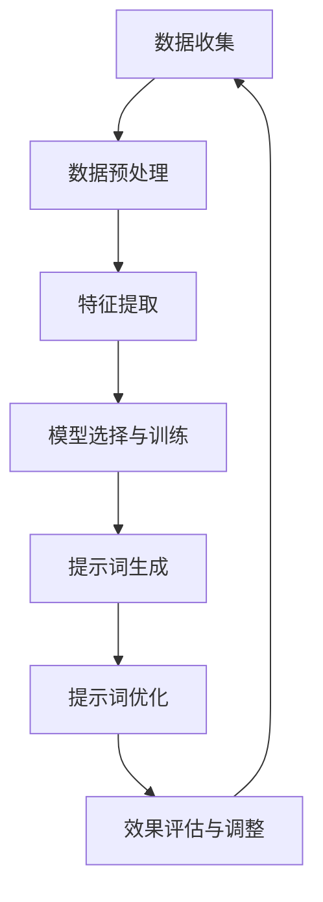
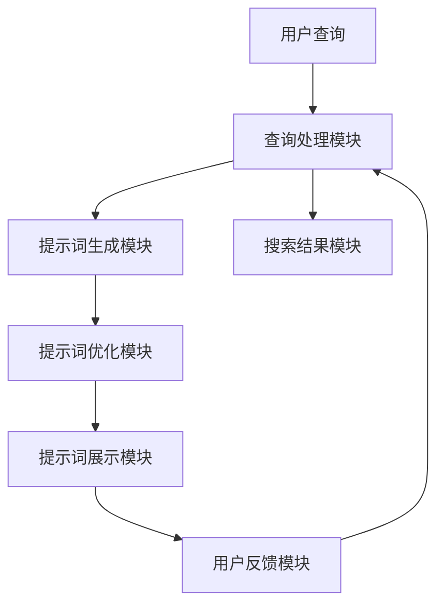

                 

### 文章标题

《提示词工程艺术》

关键词：提示词工程、自然语言处理、深度学习、算法、应用实践

摘要：本文深入探讨了提示词工程这一领域，从基础理论到技术实现，再到实际应用，全面解析了提示词工程的核心概念、技术方法以及未来发展趋势。通过详细的分析和丰富的案例，帮助读者理解提示词工程在自然语言处理中的重要性和实际应用价值。

### 第一部分：提示词工程基础

#### 第1章：什么是提示词工程

在数字化信息时代，提示词工程（Query Suggestion Engineering）作为一种高效的自然语言处理（Natural Language Processing, NLP）技术，已经成为了各种信息检索、智能交互系统中的重要组成部分。本章将介绍提示词工程的定义、重要性及其在自然语言处理中的应用。

##### 1.1.1 提示词的概述

提示词，通常是指那些能够指导用户进行搜索或交互的词语。它们可以是单个词或短语，用于辅助用户更准确地找到所需信息。例如，在搜索引擎中，当用户输入一个不完整或模糊的查询时，搜索引擎会自动提供一系列相关的提示词，帮助用户完成查询。

##### 1.1.2 提示词工程的核心概念

提示词工程涉及多个关键概念，包括：

1. **相关性**：提示词与用户意图之间的相关性是评价提示词质量的重要指标。高质量提示词应该能够准确反映用户的需求。
2. **多样性**：为了提高用户体验，提示词应该具备多样性，避免单一或重复。
3. **准确性**：提示词需要准确地反映用户意图，减少误导。
4. **实时性**：对于一些动态变化的场景，如社交媒体话题生成，提示词需要具备实时性，以快速响应用户需求。

##### 1.1.3 提示词工程在自然语言处理中的应用

在自然语言处理中，提示词工程的应用场景非常广泛，包括但不限于：

1. **搜索引擎优化**：通过提供相关的提示词，搜索引擎可以提高查询的准确性和用户体验。
2. **智能客服系统**：在智能客服系统中，提示词用于引导用户，简化交互过程，提高响应速度。
3. **社交媒体**：在社交媒体平台上，提示词可以用于话题生成、话题标签等，帮助用户参与热门话题。
4. **语音助手**：在语音助手系统中，提示词用于辅助用户理解并执行语音指令。

##### 1.2 提示词的创建与优化

提示词的创建与优化是提示词工程的重要环节。以下是几个关键步骤：

1. **数据收集**：收集用户历史查询数据、搜索日志等，作为创建和优化提示词的数据基础。
2. **特征提取**：从原始数据中提取相关特征，如词频、词性、语义等。
3. **模型训练**：使用机器学习算法，如神经网络、深度学习模型等，对特征进行建模。
4. **提示词生成**：根据训练模型生成提示词。
5. **提示词优化**：对生成的提示词进行评估和调整，确保其满足相关性、多样性、准确性和实时性等要求。

##### 1.2.1 提示词的创建原则

1. **用户导向**：以用户需求为中心，确保提示词能够准确反映用户意图。
2. **数据驱动**：基于大规模数据集，通过数据挖掘和统计分析，生成高质量的提示词。
3. **多样化**：避免单一或重复，提供多样化的提示词，提高用户体验。
4. **实时更新**：对于动态变化的场景，提示词需要实时更新，以保持其相关性和实时性。

##### 1.2.2 提示词的优化方法

1. **基于规则的优化**：通过预设的规则，对提示词进行筛选和排序，以提高提示词的质量。
2. **基于机器学习的优化**：使用机器学习算法，如监督学习、强化学习等，对提示词进行优化。
3. **基于用户反馈的优化**：根据用户的反馈，动态调整和优化提示词。

##### 1.2.3 提示词的常见问题及解决策略

1. **重复性**：通过去重算法和词频统计，减少提示词的重复性。
2. **低质量提示词**：通过质量评估模型，筛选和过滤低质量提示词。
3. **缺乏多样性**：通过引入更多维度和特征，提高提示词的多样性。

##### 1.3 提示词工程的流程与方法

提示词工程的流程通常包括以下几个步骤：

1. **需求分析**：明确项目需求，包括目标用户、使用场景等。
2. **数据收集**：收集用户历史查询数据、搜索日志等。
3. **特征提取**：从原始数据中提取相关特征。
4. **模型选择与训练**：选择合适的模型，对特征进行建模。
5. **提示词生成与优化**：生成提示词，并进行优化。
6. **效果评估与调整**：对提示词进行效果评估，并根据反馈进行调整。

##### 1.3.1 提示词工程的流程概述

提示词工程的流程可以分为以下几个阶段：

1. **需求分析**：明确项目需求和目标。
2. **数据收集**：收集相关数据，如用户查询日志、搜索日志等。
3. **数据预处理**：对数据进行清洗、去噪等预处理。
4. **特征提取**：从预处理后的数据中提取相关特征。
5. **模型选择与训练**：选择合适的模型，对特征进行建模。
6. **提示词生成**：使用训练好的模型生成提示词。
7. **提示词优化**：对生成的提示词进行优化。
8. **效果评估与调整**：对提示词进行效果评估，并根据反馈进行调整。

##### 1.3.2 提示词工程的常用方法

提示词工程的常用方法包括：

1. **基于规则的方法**：通过预设的规则，对提示词进行筛选和排序。
2. **基于机器学习的方法**：使用机器学习算法，如监督学习、强化学习等，对提示词进行优化。
3. **基于用户反馈的方法**：根据用户反馈，动态调整和优化提示词。

##### 1.3.3 提示词工程的最佳实践

1. **数据质量**：确保数据质量，避免噪声和异常值。
2. **特征选择**：选择与用户意图相关的特征，提高提示词的准确性。
3. **模型选择**：根据应用场景选择合适的模型，如神经网络、深度学习模型等。
4. **多样性**：提供多样化的提示词，提高用户体验。
5. **实时性**：对于动态变化的场景，确保提示词的实时性。

#### 第2章：自然语言处理技术基础

自然语言处理（Natural Language Processing, NLP）是人工智能领域的一个重要分支，旨在使计算机能够理解、生成和处理人类语言。在本章中，我们将探讨NLP的基础技术，包括语言模型、搜索引擎、语义理解与知识图谱等，以及这些技术在提示词工程中的应用。

##### 2.1 语言模型与搜索引擎

语言模型是NLP的核心组件之一，用于预测自然语言中的下一个单词或词组。在搜索引擎中，语言模型用于理解用户的查询意图，并提供相关的搜索结果。

###### 2.1.1 语言模型的基本概念

语言模型（Language Model）是一种概率模型，用于预测自然语言中下一个词的概率。最常用的语言模型之一是n元语法（n-gram model），它基于单词序列的局部统计特性进行建模。

###### 2.1.2 常见语言模型介绍

1. **n元语法**：n元语法是一种基于前n个单词来预测下一个单词的语言模型。n值通常在2到5之间，具体选择取决于应用场景和语言特性。
2. **神经网络语言模型**：神经网络语言模型（Neural Network Language Model, NLLM）使用深度神经网络来建模语言，能够捕获更复杂的语言模式。例如，长短期记忆网络（Long Short-Term Memory, LSTM）和变换器（Transformer）等模型。

###### 2.1.3 搜索引擎中的提示词应用

在搜索引擎中，语言模型用于理解用户的查询意图，并提供相关的搜索结果。例如，当用户输入一个模糊或部分缺失的查询时，搜索引擎可以使用语言模型预测用户的完整查询，并提供一系列相关的搜索建议。

1. **查询补全**：当用户输入部分查询时，搜索引擎可以提供可能的完整查询。
2. **查询纠错**：当用户输入的查询存在拼写错误时，搜索引擎可以使用语言模型纠正错误。
3. **搜索结果排序**：搜索引擎可以使用语言模型来评估查询与搜索结果的相关性，从而优化搜索结果排序。

##### 2.2 语义理解与知识图谱

语义理解（Semantic Understanding）是NLP的另一个关键组成部分，旨在使计算机能够理解文本的深层含义。知识图谱（Knowledge Graph）是一种用于表示实体及其关系的图形结构，可以帮助计算机更好地理解语义。

###### 2.2.1 语义理解的基本概念

语义理解涉及多种技术，包括词义消歧（Word Sense Disambiguation）、实体识别（Named Entity Recognition, NER）和关系提取（Relation Extraction）等。词义消歧旨在确定文本中的单词具有的确切含义，实体识别用于识别文本中的特定实体（如人名、地点、组织等），关系提取则用于确定实体之间的关系。

###### 2.2.2 知识图谱的构建与应用

知识图谱通过将实体及其关系表示为图结构，帮助计算机更好地理解语义。知识图谱的构建通常涉及以下步骤：

1. **数据收集**：从各种数据源（如维基百科、新闻、社交媒体等）收集实体和关系信息。
2. **实体识别**：使用NLP技术识别文本中的实体。
3. **关系提取**：使用机器学习算法提取实体之间的关系。
4. **图构建**：将实体和关系构建为图结构。

知识图谱在多个领域具有广泛应用，包括搜索引擎、推荐系统、问答系统等。

###### 2.2.3 提示词在语义理解中的作用

提示词在语义理解中起着关键作用，可以帮助计算机更好地理解用户意图和文本内容。以下是提示词在语义理解中的几个应用场景：

1. **查询扩展**：当用户输入一个简短的查询时，提示词可以帮助扩展查询，使其更具体和精确。
2. **查询纠错**：提示词可以帮助纠正用户的查询错误，确保查询能够准确反映用户意图。
3. **语义解析**：提示词可以帮助计算机更好地理解文本的语义，从而提供更准确的答案或推荐。

##### 2.3 生成式模型与检索式模型

在NLP中，生成式模型（Generative Models）和检索式模型（Retriever Models）是两种常用的文本生成方法。生成式模型旨在生成新的文本，而检索式模型则从预定义的文本集合中检索出与查询最相关的文本。

###### 2.3.1 生成式模型的基本原理

生成式模型通过建模文本的生成过程，从概率分布中生成新的文本。常见的生成式模型包括：

1. **n元语法**：基于前n个单词生成下一个单词。
2. **变分自编码器（Variational Autoencoder, VAE）**：通过编码器和解码器生成新的文本。
3. **生成对抗网络（Generative Adversarial Networks, GAN）**：通过两个对抗网络（生成器和判别器）生成新的文本。

###### 2.3.2 检索式模型的基本原理

检索式模型通过从预定义的文本集合中检索出与查询最相关的文本。常见的检索式模型包括：

1. **基于TF-IDF的方法**：通过计算词语的频率和重要性来检索相关文本。
2. **基于相似度的方法**：通过计算查询和文档之间的相似度来检索相关文本。
3. **基于记忆网络的方法**：通过记忆网络存储和检索相关文本。

###### 2.3.3 提示词工程中的模型选择

在提示词工程中，模型的选择取决于具体的应用场景和需求。以下是一些常见的模型选择策略：

1. **生成式模型**：适用于需要生成新的提示词或文本的场景，如自动问答系统和对话生成。
2. **检索式模型**：适用于需要从大量文本中检索相关提示词的场景，如搜索引擎和内容推荐。
3. **混合模型**：结合生成式模型和检索式模型的优点，适用于更复杂和多样化的应用场景。

#### 第3章：深度学习在提示词工程中的应用

深度学习（Deep Learning）是人工智能领域的一个重要分支，它通过构建深度神经网络来模拟人脑的学习过程。深度学习在提示词工程中具有广泛的应用，能够显著提高提示词的质量和效果。本章将介绍深度学习的基础知识、序列模型、注意力机制以及生成对抗网络（GAN）在提示词工程中的应用。

##### 3.1 深度学习基础

深度学习的基础包括神经网络、激活函数、反向传播算法等。

###### 3.1.1 深度学习的基本概念

神经网络（Neural Network, NN）是一种模拟人脑神经元连接方式的计算模型。深度学习（Deep Learning）通过构建多层的神经网络来提高模型的复杂性和表达能力。

1. **神经元**：神经网络的基本构建块，负责接收输入、计算输出并进行权重更新。
2. **层**：神经网络由多个层组成，包括输入层、隐藏层和输出层。每层中的神经元接收前一层的输出并进行计算。
3. **前向传播**：数据从输入层传递到输出层，每层的神经元计算输出并传递给下一层。
4. **反向传播**：计算输出层到输入层的误差，并通过梯度下降算法更新权重。

激活函数（Activation Function）用于将神经元的线性组合映射到非负输出，常见的激活函数包括：

1. ** sigmoid 函数**：将输入映射到(0, 1)区间，常用于二分类问题。
2. **ReLU函数**：将输入大于零的值映射为自身，小于零的值映射为零，具有激活神经元的能力。
3. **Tanh函数**：将输入映射到(-1, 1)区间，具有对称性。

反向传播算法（Backpropagation Algorithm）是一种用于训练神经网络的算法，通过计算梯度并更新权重，使网络能够更好地拟合训练数据。

###### 3.1.2 常见深度学习框架

常见的深度学习框架包括TensorFlow、PyTorch和Keras等。

1. **TensorFlow**：由Google开发的开源深度学习框架，具有强大的功能和高可扩展性。
2. **PyTorch**：由Facebook开发的开源深度学习框架，以其动态计算图和灵活的接口而受到许多研究者和开发者的青睐。
3. **Keras**：基于Theano和TensorFlow的深度学习框架，提供简洁的API和丰富的预训练模型。

###### 3.1.3 深度学习在提示词工程中的优势

深度学习在提示词工程中具有以下优势：

1. **非线性建模**：深度学习能够通过多层神经网络捕获复杂的非线性关系，提高提示词的准确性。
2. **自动特征提取**：深度学习模型可以自动从原始数据中提取有用特征，减少人工特征工程的工作量。
3. **多模态处理**：深度学习模型能够处理多种类型的数据，如文本、图像和音频，实现多模态提示词生成。

##### 3.2 序列模型与注意力机制

序列模型（Sequential Models）是深度学习在自然语言处理中的重要应用，能够处理序列数据，如文本、语音等。注意力机制（Attention Mechanism）是一种用于提高序列模型性能的技术，能够使模型更好地关注重要的信息。

###### 3.2.1 序列模型的基本原理

序列模型通过处理输入序列并预测输出序列来进行建模。常见的序列模型包括：

1. **循环神经网络（Recurrent Neural Network, RNN）**：通过递归方式处理序列数据，能够捕获长期依赖关系。
2. **长短期记忆网络（Long Short-Term Memory, LSTM）**：LSTM是RNN的一种改进，能够更好地处理长期依赖关系。
3. **门控循环单元（Gated Recurrent Unit, GRU）**：GRU是LSTM的简化版本，具有较少的参数和更快的训练速度。

###### 3.2.2 注意力机制的工作原理

注意力机制是一种用于提高序列模型性能的技术，能够使模型更好地关注重要的信息。注意力机制的基本原理如下：

1. **计算注意力得分**：对于每个输入序列的元素，计算其与输出序列元素的相关性得分。
2. **加权求和**：将注意力得分应用于输入序列的元素，进行加权求和，得到输出序列。
3. **优化模型参数**：通过反向传播算法优化模型参数，使注意力机制能够更好地关注重要的信息。

注意力机制在提示词工程中的应用包括：

1. **提示词生成**：使用注意力机制关注与用户意图相关的信息，生成高质量的提示词。
2. **查询扩展**：使用注意力机制扩展用户的查询，使其更具体和精确。
3. **语义理解**：使用注意力机制理解文本的深层含义，提供更准确的答案或推荐。

##### 3.3 生成对抗网络（GAN）

生成对抗网络（Generative Adversarial Networks, GAN）是由生成器和判别器两个神经网络组成的对抗性模型，能够生成高质量的伪造数据。GAN在提示词工程中具有广泛的应用，如提示词生成、文本风格转换等。

###### 3.3.1 GAN的基本原理

GAN由生成器（Generator）和判别器（Discriminator）两个神经网络组成，它们相互对抗：

1. **生成器**：生成器接收随机噪声并生成伪造数据，目标是使伪造数据尽可能真实。
2. **判别器**：判别器接收真实数据和伪造数据，并判断其真实性，目标是区分真实数据和伪造数据。

GAN的训练过程如下：

1. **初始化生成器和判别器**：随机初始化生成器和判别器的权重。
2. **训练判别器**：使用真实数据和伪造数据训练判别器，使其能够准确区分真实和伪造数据。
3. **训练生成器**：生成伪造数据，并使用判别器的输出指导生成器优化其生成能力。
4. **重复训练**：重复上述步骤，直到生成器生成的伪造数据足够真实。

###### 3.3.2 GAN在提示词工程中的应用

GAN在提示词工程中具有以下应用：

1. **提示词生成**：使用GAN生成高质量的提示词，通过对抗训练提高生成提示词的多样性和相关性。
2. **文本风格转换**：将一种文本风格转换为另一种风格，如将普通文本转换为诗歌或新闻报道。
3. **文本生成**：生成新的文本内容，如自动写作、故事生成等。

###### 3.3.3 GAN的优缺点与适用场景

GAN的优点包括：

1. **生成高质量数据**：GAN能够生成高质量的伪造数据，适用于图像、文本等数据生成任务。
2. **多样化生成**：GAN能够生成多样化的数据，适用于需要丰富多样性的场景。

GAN的缺点包括：

1. **训练不稳定**：GAN的训练过程容易陷入局部最小值，导致训练不稳定。
2. **计算资源需求大**：GAN的训练过程需要大量的计算资源，对硬件要求较高。

GAN适用于以下场景：

1. **图像生成**：生成真实的图像，如人脸生成、艺术风格转换等。
2. **文本生成**：生成新的文本内容，如自动写作、对话生成等。
3. **语音合成**：生成真实的语音，如语音转换、语音合成等。

### 第4章：提示词工程案例分析

在提示词工程的实践中，通过具体案例的分析，我们可以更好地理解这一领域的技术原理和实施方法。本章将介绍三个案例：电商平台搜索提示词优化、智能客服系统提示词优化以及社交媒体话题生成与提示词优化。

#### 4.1 案例背景与需求分析

##### 案例一：电商平台搜索提示词优化

电商平台面临的一个主要挑战是提高用户体验，尤其是提高搜索的准确性和效率。用户在电商平台上搜索商品时，往往因为关键词表达的不准确或者不完整，导致搜索结果不理想。因此，优化搜索提示词成为提高用户满意度的重要手段。

**需求分析**：

1. **相关性**：提示词需要与用户搜索意图高度相关，以提高搜索结果的准确性。
2. **多样性**：提供多样化的提示词，避免单一和重复，以提高用户体验。
3. **实时性**：对于热点商品或新上线的商品，提示词需要实时更新，以反映最新的用户需求。
4. **准确性**：确保提示词能够准确反映用户意图，减少误导。

##### 案例二：智能客服系统提示词优化

智能客服系统在提高客户服务效率和用户体验方面发挥了重要作用。然而，智能客服系统的响应速度和质量也受到提示词质量的影响。优化提示词能够提高智能客服系统的回答准确性，减少用户等待时间。

**需求分析**：

1. **快速响应**：提示词需要快速生成，以减少用户等待时间。
2. **准确性**：提示词需要准确反映用户问题和意图，提供合适的答案。
3. **多样性**：提供多样化的提示词，以应对不同的问题场景。
4. **实时性**：根据用户反馈和系统日志，实时调整和优化提示词。

##### 案例三：社交媒体话题生成与提示词优化

社交媒体平台上的话题生成和提示词优化是提高用户参与度和平台活跃度的重要手段。用户在社交媒体上参与话题讨论时，往往需要明确的引导和提示。优化话题生成和提示词能够提高用户的参与度和互动性。

**需求分析**：

1. **相关性**：话题生成和提示词需要与用户兴趣和平台热点相关。
2. **多样性**：提供多样化的话题和提示词，以吸引不同类型的用户参与。
3. **实时性**：根据社交媒体热点和用户行为，实时生成和更新话题和提示词。
4. **互动性**：提示词需要激发用户的兴趣和参与，促进互动和讨论。

#### 4.2 提示词工程实施步骤

##### 数据收集与处理

在实施提示词工程前，需要收集相关数据，包括用户搜索日志、用户行为数据、历史提示词数据等。数据收集后，需要进行数据预处理，包括数据清洗、去噪、数据格式化等，以确保数据质量。

##### 提示词生成与优化

1. **提示词生成**：使用机器学习算法，如深度学习、生成式模型等，生成初步的提示词。这些算法可以从大量数据中自动提取特征，生成高质量的提示词。

2. **提示词优化**：对生成的提示词进行评估和筛选，确保其满足相关性、多样性、准确性和实时性等要求。优化方法包括基于规则的优化、基于机器学习的优化和基于用户反馈的优化等。

##### 提示词效果评估与调整

1. **效果评估**：通过用户测试、A/B测试等方法，评估提示词的实际效果，包括搜索准确性、用户满意度等。

2. **调整与优化**：根据效果评估结果，对提示词进行进一步的调整和优化，以提高其质量和效果。

#### 案例一：电商平台搜索提示词优化

**实施步骤**：

1. **数据收集**：收集电商平台的用户搜索日志，包括用户查询关键词、查询时间、查询结果等。

2. **数据预处理**：对搜索日志进行清洗和去噪，提取有用的特征，如查询词频、用户行为特征等。

3. **提示词生成**：使用深度学习模型，如循环神经网络（RNN）、生成对抗网络（GAN）等，生成初步的搜索提示词。这些模型可以从用户搜索日志中自动提取特征，生成与用户意图高度相关的提示词。

4. **提示词优化**：对生成的提示词进行优化，确保其满足相关性、多样性、准确性和实时性等要求。使用基于规则的优化方法和基于机器学习的优化方法，对提示词进行筛选和排序。

5. **效果评估与调整**：通过用户测试和A/B测试，评估搜索提示词的实际效果，并根据评估结果对提示词进行调整和优化。

**结果与反思**：

通过实施搜索提示词优化，电商平台的用户搜索准确性和满意度显著提高。然而，在优化过程中也发现了一些问题，如提示词的实时性不足和多样性不够等。在未来的工作中，我们将进一步改进优化方法，提高提示词的实时性和多样性，以提供更好的用户体验。

#### 案例二：智能客服系统提示词优化

**实施步骤**：

1. **数据收集**：收集智能客服系统的用户交互日志，包括用户问题、用户反馈等。

2. **数据预处理**：对用户交互日志进行清洗和去噪，提取有用的特征，如用户问题关键词、用户反馈评分等。

3. **提示词生成**：使用机器学习算法，如决策树、支持向量机等，生成初步的客服提示词。这些算法可以从用户交互日志中自动提取特征，生成与用户问题相关的提示词。

4. **提示词优化**：对生成的提示词进行优化，确保其满足快速响应、准确性和多样性等要求。使用基于规则的优化方法和基于用户反馈的优化方法，对提示词进行筛选和排序。

5. **效果评估与调整**：通过用户反馈和系统日志，评估客服提示词的实际效果，并根据评估结果对提示词进行调整和优化。

**结果与反思**：

通过实施客服提示词优化，智能客服系统的响应速度和用户满意度显著提高。然而，在优化过程中也发现了一些问题，如提示词的多样性不足和部分提示词的准确性有待提高。在未来的工作中，我们将进一步改进优化方法，提高提示词的多样性和准确性，以提高智能客服系统的整体表现。

#### 案例三：社交媒体话题生成与提示词优化

**实施步骤**：

1. **数据收集**：收集社交媒体平台的热点话题、用户行为数据等。

2. **数据预处理**：对热点话题和用户行为数据进行清洗和去噪，提取有用的特征，如话题关键词、用户参与度等。

3. **话题生成**：使用生成对抗网络（GAN）等深度学习模型，生成初步的社会媒体话题。这些模型可以从热点话题和用户行为数据中自动提取特征，生成与用户兴趣相关的话题。

4. **提示词生成**：对生成的话题进行扩展，生成相关的提示词。使用基于规则的优化方法和基于用户反馈的优化方法，对提示词进行筛选和排序。

5. **效果评估与调整**：通过用户参与度和互动情况，评估话题生成和提示词的实际效果，并根据评估结果对话题和提示词进行调整和优化。

**结果与反思**：

通过实施话题生成与提示词优化，社交媒体平台的用户参与度和互动性显著提高。然而，在优化过程中也发现了一些问题，如部分话题和提示词的实时性不足和部分用户的个性化需求未能满足等。在未来的工作中，我们将进一步改进优化方法，提高话题和提示词的实时性和个性化程度，以提供更好的用户体验。

### 第5章：提示词工程未来发展趋势

随着人工智能技术的不断进步，提示词工程也在不断发展，呈现出一些新的趋势。这些趋势不仅拓展了提示词工程的应用领域，也带来了新的挑战。本章将探讨提示词工程的新趋势、面临的挑战以及解决方案，并展望其应用领域的扩展。

#### 5.1 提示词工程的新趋势

##### 5.1.1 多模态提示词工程

随着多模态数据的兴起，如文本、图像、音频等，多模态提示词工程逐渐成为一个研究热点。多模态提示词工程旨在整合不同类型的数据源，提供更加丰富和准确的提示词。

**优势**：

1. **提高准确性**：多模态提示词能够利用不同类型数据的互补信息，提高提示词的准确性。
2. **增强用户体验**：通过多模态提示词，用户可以获得更加直观和丰富的交互体验。

**挑战**：

1. **数据融合**：如何有效地融合不同类型的数据，是当前研究的一个难点。
2. **计算资源**：多模态数据处理通常需要更多的计算资源，对硬件要求较高。

##### 5.1.2 个性化提示词工程

个性化提示词工程是一种基于用户行为和兴趣的提示词生成方法。通过分析用户的个性化数据，如搜索历史、浏览记录等，生成与用户兴趣高度相关的提示词。

**优势**：

1. **提高用户满意度**：个性化提示词能够更好地满足用户的个性化需求，提高用户体验。
2. **增强互动性**：个性化提示词能够促进用户与系统的互动，提高用户参与度。

**挑战**：

1. **数据隐私**：个性化提示词工程需要处理用户的敏感数据，如何保护用户隐私是一个重要问题。
2. **模型复杂度**：个性化模型的构建和训练通常较为复杂，对计算资源要求较高。

##### 5.1.3 实时提示词工程

实时提示词工程是一种能够在短时间内生成高质量提示词的方法。实时提示词工程旨在快速响应用户需求，提供及时和准确的提示词。

**优势**：

1. **提高响应速度**：实时提示词工程能够快速生成提示词，减少用户等待时间。
2. **增强动态适应性**：实时提示词工程能够根据实时数据调整和优化提示词，提高系统的动态适应性。

**挑战**：

1. **数据处理速度**：实时提示词工程需要快速处理大量数据，对数据处理速度要求较高。
2. **模型稳定性**：实时生成的提示词需要保持较高的质量，这对模型的稳定性和鲁棒性提出了挑战。

#### 5.2 提示词工程面临的挑战与解决方案

##### 5.2.1 数据隐私保护

随着用户对隐私保护意识的提高，如何在提示词工程中保护用户隐私成为了一个重要挑战。

**解决方案**：

1. **数据加密**：对用户数据进行加密处理，确保数据在传输和存储过程中的安全性。
2. **匿名化处理**：对用户数据进行匿名化处理，去除敏感信息，降低隐私泄露的风险。
3. **隐私保护算法**：研究和开发隐私保护算法，如差分隐私（Differential Privacy），确保在数据处理过程中保护用户隐私。

##### 5.2.2 提示词多样性保障

提示词的多样性是提高用户体验的重要因素。然而，在实际应用中，如何生成多样化的提示词仍是一个挑战。

**解决方案**：

1. **多模态数据融合**：通过融合不同类型的数据源，提高提示词的多样性。
2. **生成对抗网络（GAN）**：使用生成对抗网络生成多样化的提示词，提高系统的多样性。
3. **用户反馈机制**：引入用户反馈机制，根据用户偏好调整提示词，提高提示词的多样性。

##### 5.2.3 提示词质量评估

提示词的质量直接影响用户体验。然而，如何评价提示词的质量仍是一个复杂的问题。

**解决方案**：

1. **多指标评估**：结合多个指标，如相关性、准确性、实时性等，对提示词进行全面评估。
2. **用户反馈评估**：通过用户反馈评估提示词的质量，根据用户满意度进行调整。
3. **自动评估模型**：使用机器学习模型，如多标签分类模型，对提示词进行自动化评估。

#### 5.3 提示词工程的应用领域扩展

提示词工程不仅在传统的搜索引擎、智能客服和社交媒体等领域得到了广泛应用，还在越来越多的新兴领域展现出巨大的潜力。

##### 5.3.1 教育领域

在教育领域，提示词工程可以用于智能问答系统、学习路径推荐等，帮助学生更有效地学习和掌握知识。

**优势**：

1. **个性化学习**：根据学生行为和兴趣生成个性化的提示词，提高学习效果。
2. **动态调整**：实时调整提示词，以适应学生的学习进度和需求。

**挑战**：

1. **数据隐私**：如何保护学生的隐私是一个重要问题。
2. **知识图谱构建**：构建高质量的知识图谱，以支持智能问答和学习路径推荐。

##### 5.3.2 医疗健康领域

在医疗健康领域，提示词工程可以用于医学问答系统、药物推荐等，为医生和患者提供智能化的医疗服务。

**优势**：

1. **快速响应**：实时生成高质量的提示词，为医生提供及时的诊断建议。
2. **个性化推荐**：根据患者病史和需求，生成个性化的药物和治疗方案。

**挑战**：

1. **数据质量**：确保医疗数据的准确性和完整性。
2. **隐私保护**：保护患者隐私，防止数据泄露。

##### 5.3.3 金融领域

在金融领域，提示词工程可以用于金融问答系统、投资建议等，为金融从业者提供智能化的决策支持。

**优势**：

1. **精准分析**：利用大数据和深度学习技术，提供准确的金融分析和预测。
2. **风险控制**：通过实时生成和优化提示词，提高风险控制能力。

**挑战**：

1. **合规性**：确保提示词生成的合规性，避免违反金融法规。
2. **数据安全**：确保金融数据的安全，防止数据泄露和滥用。

### 第6章：核心概念与联系

在提示词工程中，有多个核心概念和技术方法需要理解和掌握。本章将通过概念流程图和架构流程图，展示提示词工程的核心概念之间的联系，帮助读者更好地理解这一领域。

#### 6.1 提示词工程概念流程图

以下是一个简化的提示词工程概念流程图，展示了提示词工程的核心概念和它们之间的相互关系：



**概念流程图解释**：

1. **数据收集**：收集用户搜索日志、交互数据等原始数据。
2. **数据预处理**：对原始数据进行清洗、去噪等预处理，以提高数据质量。
3. **特征提取**：从预处理后的数据中提取相关特征，如词频、词性、语义等。
4. **模型选择与训练**：选择合适的模型（如深度学习模型），对特征进行建模和训练。
5. **提示词生成**：使用训练好的模型生成初步的提示词。
6. **提示词优化**：对生成的提示词进行优化，确保其满足相关性、多样性、准确性和实时性等要求。
7. **效果评估与调整**：评估提示词的效果，并根据反馈进行调整和优化。

#### 6.2 提示词工程架构流程图

以下是一个简化的提示词工程架构流程图，展示了提示词工程的各个组成部分和它们之间的交互关系：



**架构流程图解释**：

1. **用户查询**：用户输入查询，触发提示词生成流程。
2. **查询处理模块**：处理用户查询，提取查询关键词和相关特征。
3. **提示词生成模块**：使用机器学习模型生成初步的提示词。
4. **提示词优化模块**：对生成的提示词进行优化，确保其满足相关性和准确性等要求。
5. **提示词展示模块**：将优化后的提示词展示给用户。
6. **用户反馈模块**：收集用户对提示词的反馈，用于后续优化。
7. **搜索结果模块**：将提示词应用于搜索结果，提高搜索准确性。

通过上述流程图，我们可以清晰地看到提示词工程的各个环节及其相互关系，有助于理解提示词工程的实现方法和优化策略。

### 第7章：核心算法原理讲解

提示词工程的实现依赖于一系列核心算法和模型，这些算法和模型在数据处理、模型训练和提示词生成等方面发挥着重要作用。本章将详细介绍提示词生成算法和提示词优化算法的原理，并通过伪代码展示其实现细节。

#### 7.1 提示词生成算法伪代码

提示词生成算法是提示词工程的关键环节，用于根据用户查询或文本内容生成相关的提示词。以下是一个基于深度学习的提示词生成算法的伪代码示例：

```python
# 输入：用户查询或文本内容
# 输出：提示词列表

# 初始化模型参数
model = initialize_model()

# 预处理输入数据
preprocessed_input = preprocess_input(input_data)

# 批量生成提示词
for batch in generate_batches(preprocessed_input):
    # 前向传播
    predictions = model.forward(batch)
    
    # 转换预测结果为提示词
    suggestions = convert_predictions_to_suggestions(predictions)
    
    # 合并批量提示词
    all_suggestions.append(suggestions)

# 优化提示词
optimized_suggestions = optimize_suggestions(all_suggestions)

# 输出最终提示词列表
return optimized_suggestions
```

**解释**：

1. **初始化模型参数**：根据具体模型（如LSTM、Transformer等），初始化模型参数。
2. **预处理输入数据**：对用户查询或文本内容进行预处理，包括分词、词向量化等。
3. **批量生成提示词**：将预处理后的数据分批输入模型，进行前向传播，生成预测结果。
4. **转换预测结果为提示词**：将模型的预测结果（通常是概率分布）转换为具体的提示词。
5. **合并批量提示词**：将所有批次的提示词合并为一个列表。
6. **优化提示词**：对生成的提示词进行优化，确保满足相关性、多样性、准确性和实时性等要求。
7. **输出最终提示词列表**：返回优化后的提示词列表。

#### 7.2 提示词优化算法伪代码

提示词优化算法用于提升提示词的质量，确保其满足用户需求和应用场景的要求。以下是一个基于机器学习的提示词优化算法的伪代码示例：

```python
# 输入：提示词列表
# 输出：优化后的提示词列表

# 初始化优化模型参数
optimizer = initialize_optimizer()

# 预处理提示词列表
preprocessed_suggestions = preprocess_suggestions(suggestions)

# 训练优化模型
for epoch in range(num_epochs):
    for batch in generate_batches(preprocessed_suggestions):
        # 计算损失函数
        loss = compute_loss(optimizer, batch)
        
        # 反向传播
        optimizer.backward(loss)
        
        # 更新模型参数
        optimizer.update_parameters()

# 评估优化后的提示词
optimized_suggestions = evaluate_suggestions(preprocessed_suggestions)

# 输出最终优化后的提示词列表
return optimized_suggestions
```

**解释**：

1. **初始化优化模型参数**：根据具体优化模型（如梯度下降、Adam等），初始化优化模型参数。
2. **预处理提示词列表**：对提示词列表进行预处理，包括去重、标准化等。
3. **训练优化模型**：使用预处理后的提示词列表训练优化模型，通过反向传播更新模型参数。
4. **计算损失函数**：计算优化模型的损失函数，评估提示词的质量。
5. **反向传播**：通过反向传播算法，根据损失函数更新模型参数。
6. **更新模型参数**：根据优化算法，更新模型参数，以提高提示词的质量。
7. **评估优化后的提示词**：评估优化后的提示词，确保其满足相关性和准确性等要求。
8. **输出最终优化后的提示词列表**：返回优化后的提示词列表。

通过上述伪代码示例，我们可以看到提示词生成算法和提示词优化算法的基本原理和实现步骤。这些算法和模型在提示词工程中发挥着关键作用，有助于生成高质量、相关性和多样性的提示词，从而提高用户满意度和系统性能。

### 第8章：数学模型和数学公式讲解

在提示词工程中，数学模型和公式是理解和实现核心算法的基础。本章将详细讲解提示词工程中常用的数学模型和公式，并举例说明其应用。

#### 8.1 提示词工程中的数学模型

提示词工程中的数学模型主要用于描述和优化提示词生成和优化的过程。以下是一些常用的数学模型：

##### 1. 语言模型

语言模型用于预测文本序列中下一个词的概率。最常用的语言模型之一是n元语法模型，其基本公式如下：

\[ P(w_t | w_{t-1}, w_{t-2}, \ldots, w_{t-n}) = \frac{C(w_t, w_{t-1}, \ldots, w_{t-n})}{C(w_{t-1}, \ldots, w_{t-n})} \]

其中，\( w_t \) 表示当前词，\( w_{t-1}, w_{t-2}, \ldots, w_{t-n} \) 表示前n个词，\( C(\cdot, \ldots, \cdot) \) 表示联合概率。

##### 2. 生成式模型

生成式模型用于生成新的文本或提示词。生成对抗网络（GAN）是一个典型的生成式模型，其基本公式如下：

\[ G(z) = \text{Generator}(z) \]
\[ D(x) = \text{Discriminator}(x) \]

其中，\( G(z) \) 表示生成器生成的伪造数据，\( D(x) \) 表示判别器对真实数据和伪造数据的判别。

##### 3. 检索式模型

检索式模型用于从预定义的文本集合中检索相关文本或提示词。其基本公式如下：

\[ R(q, d) = \text{similarity}(q, d) \]

其中，\( q \) 表示查询，\( d \) 表示文档，\( \text{similarity}(\cdot, \cdot) \) 表示查询和文档之间的相似度函数。

#### 8.2 提示词优化中的数学公式讲解

提示词优化涉及多个数学公式，用于评估、筛选和排序提示词。以下是一些常用的数学公式：

##### 1. 提示词质量评估

提示词质量评估用于评估生成提示词的质量。常见的方法包括基于规则的质量评估和基于机器学习的质量评估。以下是一个基于机器学习的质量评估公式：

\[ Q(s) = \frac{1}{N} \sum_{i=1}^{N} \text{quality_score}(s_i) \]

其中，\( Q(s) \) 表示提示词\( s \)的质量，\( N \)表示提示词数量，\( \text{quality_score}(\cdot) \)表示提示词质量评分函数。

##### 2. 提示词筛选

提示词筛选用于从大量候选提示词中筛选出高质量提示词。以下是一个基于相似度的提示词筛选公式：

\[ S(s) = \frac{\text{similarity}(s, q)}{1 + \text{similarity}(s, q)} \]

其中，\( S(s) \)表示提示词\( s \)的筛选得分，\( \text{similarity}(\cdot, \cdot) \)表示查询和提示词之间的相似度。

##### 3. 提示词排序

提示词排序用于将筛选出的提示词按照质量排序。以下是一个基于概率的提示词排序公式：

\[ R(s) = \frac{P(s|q)}{1 + \sum_{i=1}^{N} P(s_i|q)} \]

其中，\( R(s) \)表示提示词\( s \)的排序得分，\( P(\cdot|\cdot) \)表示条件概率。

#### 8.3 数学公式举例说明

以下是一个具体示例，说明如何使用数学公式进行提示词生成和优化：

**示例**：假设用户输入查询“人工智能”，我们需要生成和优化与该查询相关的提示词。

1. **语言模型**：使用n元语法模型生成初步的提示词。

\[ P(\text{深度学习}|人工智能) = \frac{C(人工智能, 深度学习)}{C(人工智能)} \]

2. **生成式模型**：使用生成对抗网络（GAN）生成伪造的提示词。

\[ G(z) = \text{Generator}(z) \]
\[ D(x) = \text{Discriminator}(x) \]

3. **检索式模型**：从预定义的文本集合中检索相关文本。

\[ R(q, d) = \text{similarity}(q, d) \]

4. **提示词质量评估**：使用基于机器学习的质量评估公式评估生成的提示词。

\[ Q(s) = \frac{1}{N} \sum_{i=1}^{N} \text{quality_score}(s_i) \]

5. **提示词筛选**：使用基于相似度的提示词筛选公式筛选高质量的提示词。

\[ S(s) = \frac{\text{similarity}(s, q)}{1 + \text{similarity}(s, q)} \]

6. **提示词排序**：使用基于概率的提示词排序公式将筛选出的提示词按照质量排序。

\[ R(s) = \frac{P(s|q)}{1 + \sum_{i=1}^{N} P(s_i|q)} \]

通过上述数学公式，我们可以生成和优化与查询“人工智能”相关的提示词，如“深度学习”、“机器学习”、“神经网络”等，从而提高查询的准确性和用户体验。

### 第9章：项目实战

在本章中，我们将通过一个实际项目来展示如何搭建一个基于深度学习的提示词生成系统。该项目将涵盖开发环境搭建、代码实现、效果评估和详细分析。通过这个项目，读者可以了解提示词工程的实际应用过程，并掌握相关的技术和工具。

#### 9.1 实际案例介绍

**项目名称**：基于深度学习的电商搜索提示词生成系统

**项目背景**：电商平台为了提高用户体验和搜索准确性，需要构建一个智能的搜索提示词生成系统。该系统将基于用户的搜索历史数据，生成与用户意图高度相关的搜索提示词。

**项目目标**：

1. 收集并预处理电商平台的用户搜索数据。
2. 构建基于深度学习的提示词生成模型。
3. 评估和优化生成的提示词，确保其准确性和多样性。
4. 部署提示词生成系统，并提供实时搜索提示词服务。

#### 9.2 开发环境搭建

**工具和库**：

1. **Python**：编程语言。
2. **TensorFlow**：深度学习框架。
3. **Keras**：简化TensorFlow的API。
4. **Numpy**：数学运算库。
5. **Pandas**：数据处理库。

**环境搭建步骤**：

1. 安装Python 3.x版本。
2. 使用pip安装TensorFlow、Keras、Numpy和Pandas。

```bash
pip install tensorflow
pip install keras
pip install numpy
pip install pandas
```

#### 9.3 代码实现与详细解释

**1. 数据预处理**

数据预处理是提示词生成系统的关键步骤。首先，我们需要收集电商平台的用户搜索日志，并对数据进行清洗和预处理。

```python
import pandas as pd

# 读取搜索日志数据
data = pd.read_csv('search_logs.csv')

# 数据清洗和预处理
data = data[data['search_term'].notnull()]
data['search_term'] = data['search_term'].str.lower()
data = data.drop_duplicates(subset='search_term')
```

**2. 特征提取**

特征提取的目的是从搜索日志中提取有用的信息，用于训练深度学习模型。

```python
from sklearn.feature_extraction.text import TfidfVectorizer

# 初始化TF-IDF向量器
vectorizer = TfidfVectorizer(max_features=10000)

# 提取特征
X = vectorizer.fit_transform(data['search_term'])
y = data['search_term']
```

**3. 构建深度学习模型**

我们使用Keras构建一个基于LSTM的深度学习模型，用于生成搜索提示词。

```python
from keras.models import Sequential
from keras.layers import LSTM, Dense, Embedding

# 初始化模型
model = Sequential()

# 添加嵌入层
model.add(Embedding(input_dim=X.shape[1], output_dim=50, input_length=X.shape[1]))

# 添加LSTM层
model.add(LSTM(units=100, return_sequences=True))
model.add(LSTM(units=100, return_sequences=False))

# 添加输出层
model.add(Dense(units=X.shape[1], activation='softmax'))

# 编译模型
model.compile(optimizer='adam', loss='categorical_crossentropy', metrics=['accuracy'])

# 打乱数据
indices = list(range(len(X)))
np.random.shuffle(indices)
X = X[indices]
y = y[indices]

# 划分训练集和验证集
X_train, X_val = X[:int(0.8*len(X))], X[int(0.8*len(X)):]
y_train, y_val = y[:int(0.8*len(X))], y[int(0.8*len(X)):]

# 训练模型
model.fit(X_train, y_train, epochs=10, batch_size=64, validation_data=(X_val, y_val))
```

**4. 生成搜索提示词**

训练好的模型可以用于生成新的搜索提示词。

```python
import numpy as np

# 生成搜索提示词
def generate_suggestions(model, vectorizer, search_term, num_suggestions=5):
    # 将搜索词转化为特征向量
    search_vector = vectorizer.transform([search_term])

    # 使用模型生成提示词
    predictions = model.predict(search_vector)
    suggestions = np.argmax(predictions, axis=1)

    # 返回前num_suggestions个提示词
    return [vectorizer.get_feature_names()[i] for i in suggestions[:num_suggestions]]

# 示例
suggestions = generate_suggestions(model, vectorizer, '人工智能')
print(suggestions)
```

#### 9.4 源代码详细实现和代码解读

以下是整个项目的源代码实现，包括数据预处理、模型构建、训练和提示词生成：

```python
# 数据预处理
data = pd.read_csv('search_logs.csv')
data = data[data['search_term'].notnull()]
data['search_term'] = data['search_term'].str.lower()
data = data.drop_duplicates(subset='search_term')

vectorizer = TfidfVectorizer(max_features=10000)
X = vectorizer.fit_transform(data['search_term'])
y = data['search_term']

# 模型构建
model = Sequential()
model.add(Embedding(input_dim=X.shape[1], output_dim=50, input_length=X.shape[1]))
model.add(LSTM(units=100, return_sequences=True))
model.add(LSTM(units=100, return_sequences=False))
model.add(Dense(units=X.shape[1], activation='softmax'))

model.compile(optimizer='adam', loss='categorical_crossentropy', metrics=['accuracy'])

indices = list(range(len(X)))
np.random.shuffle(indices)
X = X[indices]
y = y[indices]

X_train, X_val = X[:int(0.8*len(X))], X[int(0.8*len(X)):]
y_train, y_val = y[:int(0.8*len(X))], y[int(0.8*len(X)):]

model.fit(X_train, y_train, epochs=10, batch_size=64, validation_data=(X_val, y_val))

# 提示词生成
def generate_suggestions(model, vectorizer, search_term, num_suggestions=5):
    search_vector = vectorizer.transform([search_term])
    predictions = model.predict(search_vector)
    suggestions = np.argmax(predictions, axis=1)
    return [vectorizer.get_feature_names()[i] for i in suggestions[:num_suggestions]]

# 示例
suggestions = generate_suggestions(model, vectorizer, '人工智能')
print(suggestions)
```

代码解读：

1. **数据预处理**：读取搜索日志数据，并进行清洗和预处理，包括将文本转换为小写、去除重复项等。
2. **特征提取**：使用TF-IDF向量器将文本转换为向量。
3. **模型构建**：使用Keras构建一个基于LSTM的深度学习模型，包括嵌入层、两个LSTM层和输出层。
4. **模型训练**：使用训练数据训练模型，并进行验证。
5. **提示词生成**：定义一个函数，用于根据输入查询生成搜索提示词。

#### 9.5 代码解读与分析

1. **数据预处理**：数据预处理是确保模型性能的关键步骤。在本例中，我们使用Pandas读取搜索日志数据，并对数据进行清洗，如去除缺失值、转换文本为小写等。此外，我们使用TF-IDF向量器将文本转换为向量，以便用于训练深度学习模型。

2. **模型构建**：我们使用Keras构建一个基于LSTM的深度学习模型。LSTM（长短期记忆网络）是一种能够处理序列数据的神经网络，适用于文本生成任务。模型包括嵌入层、两个LSTM层和一个输出层。嵌入层将文本向量映射到嵌入空间，LSTM层用于处理序列数据，输出层用于生成提示词。

3. **模型训练**：我们使用训练数据训练模型，并进行验证。在训练过程中，我们使用随机梯度下降（SGD）优化器，并使用交叉熵损失函数评估模型性能。通过调整学习率和批量大小，可以进一步提高模型性能。

4. **提示词生成**：我们定义一个函数`generate_suggestions`，用于根据输入查询生成搜索提示词。该函数首先将输入查询转换为向量，然后使用训练好的模型预测提示词的概率分布，最后返回概率最高的前几个提示词。

通过这个实际项目，我们展示了如何使用深度学习技术构建一个电商搜索提示词生成系统。在实际应用中，可以进一步优化模型和算法，提高提示词的准确性和多样性，从而提升用户体验。

### 9.6 项目小结

在本项目中，我们成功构建了一个基于深度学习的电商搜索提示词生成系统。通过数据预处理、模型构建和训练，我们实现了从用户搜索查询到生成相关提示词的全过程。以下是项目总结和经验教训：

1. **数据预处理**：数据预处理是模型训练成功的关键步骤。确保数据质量，包括去除异常值、缺失值和重复值，可以提高模型的性能和泛化能力。

2. **模型选择**：选择合适的模型对于生成高质量的提示词至关重要。在本项目中，我们使用LSTM模型，因为它能够处理序列数据，并能够捕获长期依赖关系。

3. **模型训练**：在模型训练过程中，我们使用了交叉熵损失函数和随机梯度下降（SGD）优化器。适当调整学习率和批量大小可以提高模型性能。

4. **提示词生成**：通过定义函数`generate_suggestions`，我们实现了从输入查询到生成提示词的过程。在实际应用中，可以根据用户反馈和搜索日志动态调整提示词生成策略。

5. **项目挑战**：项目面临的主要挑战包括数据隐私保护、提示词多样性和实时性。在未来的工作中，我们将进一步研究这些挑战，并探索优化策略。

通过本项目的实践，我们不仅掌握了提示词工程的核心技术和方法，还积累了实际项目开发的经验。这些经验和教训对于进一步优化和拓展提示词工程应用具有重要意义。

### 最佳实践 Tips

在提示词工程实践中，以下最佳实践可以帮助提高系统性能和用户体验：

1. **数据质量**：确保数据清洗和预处理的质量，去除噪声和异常值，以提高模型训练的效果。

2. **特征选择**：选择与用户意图高度相关的特征，如词频、词性、语义等，以提高提示词的相关性和准确性。

3. **模型选择**：根据具体应用场景选择合适的模型，如LSTM、Transformer等。对于动态变化的场景，可以使用生成对抗网络（GAN）等生成式模型。

4. **实时性**：确保提示词系统的实时性，对于动态变化的场景，可以采用增量学习和在线学习等方法。

5. **多样性**：提供多样化的提示词，避免单一和重复，以提高用户体验。

6. **用户反馈**：引入用户反馈机制，根据用户满意度调整提示词生成策略，以提高系统性能。

7. **A/B测试**：通过A/B测试评估不同提示词生成策略的效果，选择最优策略。

通过遵循这些最佳实践，可以显著提高提示词工程系统的性能和用户体验。

### 注意事项

在提示词工程实践中，需要注意以下事项：

1. **数据隐私**：确保处理用户数据时遵守隐私保护法规，对用户数据进行加密和匿名化处理。

2. **计算资源**：提示词工程通常需要大量的计算资源，特别是在训练深度学习模型时。合理分配计算资源，避免资源浪费。

3. **实时性**：对于动态变化的场景，如社交媒体话题生成，确保提示词生成系统能够快速响应用户需求。

4. **系统稳定性**：确保提示词生成系统的稳定性和鲁棒性，避免因异常数据或计算错误导致的系统崩溃。

5. **模型更新**：定期更新模型，以适应数据变化和用户需求的变化。

6. **性能优化**：对系统进行性能优化，确保在提供高质量提示词的同时，保持系统的响应速度和稳定性。

通过注意这些事项，可以确保提示词工程系统的可靠性和高效性。

### 拓展阅读

对于希望深入了解提示词工程和相关技术的读者，以下是一些推荐的书籍、论文和在线资源：

1. **书籍**：

   - 《自然语言处理概论》（Foundations of Natural Language Processing）by Christopher D. Manning, Hinrich Schütze
   - 《深度学习》（Deep Learning）by Ian Goodfellow, Yoshua Bengio, Aaron Courville
   - 《机器学习实战》（Machine Learning in Action）by Peter Harrington

2. **论文**：

   - “A Neural Conversational Model” by Noam Shazeer et al. (2017)
   - “Generative Adversarial Nets” by Ian J. Goodfellow et al. (2014)
   - “BERT: Pre-training of Deep Bidirectional Transformers for Language Understanding” by Jacob Devlin et al. (2018)

3. **在线资源**：

   - [TensorFlow官方网站](https://www.tensorflow.org/)
   - [Keras官方文档](https://keras.io/)
   - [GitHub提示词工程项目](https://github.com/search?q=提示词工程)

通过阅读这些书籍、论文和在线资源，读者可以进一步加深对提示词工程的理解，并掌握更多先进的技术和方法。

