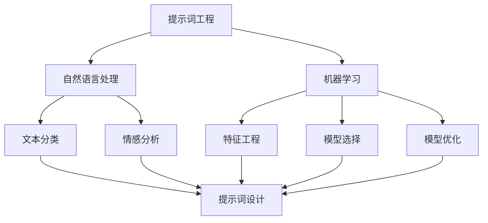
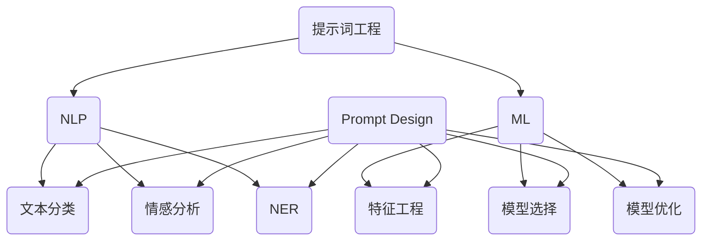
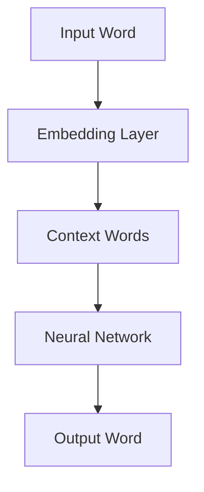

                 

# 文章标题：提示词工程：AI时代的新挑战与新机遇

> 关键词：提示词工程、人工智能、自然语言处理、机器学习、算法优化

> 摘要：本文将探讨提示词工程在AI时代的兴起背景、基本概念、应用场景以及面临的挑战与机遇。通过逐步分析，我们将深入了解提示词工程的核心算法、应用实践，并展望其未来的发展方向。

## 第一部分：提示词工程的基本概念与背景

### 第1章：提示词工程概述

#### 1.1 提示词工程的概念与重要性

##### 1.1.1 提示词工程的基本定义

提示词工程（Prompt Engineering）是人工智能领域中一个重要的分支，它涉及如何设计、开发和应用提示词系统，以提高机器学习和自然语言处理系统的性能和效率。提示词（Prompt）是一种引导模型生成特定类型输出或执行特定任务的文本或序列。在自然语言处理和机器学习任务中，提示词被用来引导模型关注特定的信息，从而提高模型的性能和准确性。

##### 1.1.2 提示词工程在AI时代的地位

随着人工智能技术的快速发展，特别是深度学习和自然语言处理技术的进步，提示词工程已经成为AI应用的关键组成部分。在自然语言处理和机器学习领域，提示词工程可以帮助提高文本分类、情感分析、问答系统等任务的性能。同时，提示词工程也在其他领域如计算机视觉、语音识别等得到了广泛应用。

#### 1.2 提示词工程的应用场景

##### 1.2.1 自然语言处理

在自然语言处理领域，提示词工程可以用于多种任务，如文本分类、情感分析、命名实体识别、机器翻译等。通过设计合适的提示词，可以提高模型的性能和准确性。例如，在文本分类任务中，提示词可以帮助模型更好地理解文本的主题和情感倾向。

##### 1.2.2 机器学习

在机器学习领域，提示词工程可以用于特征工程、模型选择和优化等方面。通过设计有效的提示词，可以提高特征提取的质量，从而改善模型的性能。同时，提示词还可以用于模型选择和优化，帮助研究者更快速地找到最优模型。

#### 1.3 提示词工程的挑战与机遇

提示词工程面临着多个挑战，如数据质量、模型可解释性、计算效率等。然而，这些挑战同时也带来了新的机遇。通过不断探索和创新，提示词工程有望在AI领域发挥更大的作用。

### 第二部分：提示词工程的技术基础

#### 第2章：自然语言处理与机器学习基础

##### 2.1 自然语言处理基本概念

##### 2.1.1 词嵌入与词向量

词嵌入（Word Embedding）是将词语映射到高维空间中的向量表示。这种表示方法有助于捕捉词语之间的语义关系。常见的词嵌入方法包括Word2Vec、GloVe等。

##### 2.1.2 语言模型与生成模型

语言模型（Language Model）是自然语言处理的核心组件，用于预测下一个词或字符。生成模型（Generative Model）则能够生成符合特定概率分布的文本。

##### 2.1.3 序列模型与注意力机制

序列模型（Sequential Model）如循环神经网络（RNN）和长短期记忆网络（LSTM）能够处理序列数据。注意力机制（Attention Mechanism）则用于模型中关注重要的输入信息。

##### 2.2 机器学习基础算法

##### 2.2.1 决策树与随机森林

决策树（Decision Tree）是一种常见的分类和回归算法。随机森林（Random Forest）则通过集成多个决策树来提高模型的性能。

##### 2.2.2 支持向量机

支持向量机（Support Vector Machine, SVM）是一种强大的分类和回归算法，通过找到一个最佳的超平面来分隔数据。

##### 2.2.3 神经网络与深度学习

神经网络（Neural Network）是模仿人脑神经元连接的结构。深度学习（Deep Learning）则是基于多层神经网络构建的模型，能够处理复杂的数据。

### 第三部分：提示词工程核心算法详解

#### 第3章：提示词生成算法

##### 3.1 提示词生成算法概述

提示词生成算法可以分为基于规则的方法、基于统计的方法和基于机器学习的方法。基于规则的方法依赖于预先定义的规则集；基于统计的方法则基于统计数据生成提示词；基于机器学习的方法则通过训练模型来生成提示词。

##### 3.2 常见的提示词生成算法

##### 3.2.1 BERT-based 提示词生成

BERT（Bidirectional Encoder Representations from Transformers）是一种预训练语言模型，可以用于生成高质量的提示词。

##### 3.2.2 GPT-based 提示词生成

GPT（Generative Pre-trained Transformer）是另一种强大的预训练语言模型，广泛用于生成提示词。

##### 3.2.3 其他先进算法

除了BERT和GPT，还有许多其他先进的算法，如T5、Reformer等，也用于提示词生成。

### 第四部分：提示词工程应用实战

#### 第4章：提示词工程在自然语言处理中的应用

##### 4.1 文本分类与情感分析中的提示词工程

在文本分类和情感分析任务中，提示词工程可以通过优化提示词来提高模型的性能。例如，可以通过调整提示词的长度、复杂度等来改善分类和情感分析结果。

##### 4.2 问答系统中的提示词工程

在问答系统（Question Answering System）中，提示词工程可以用于提问意图识别和知识图谱构建。通过设计有效的提示词，可以提高问答系统的准确性和鲁棒性。

#### 第5章：提示词工程在机器学习中的应用

##### 5.1 特征工程中的提示词优化

在特征工程中，提示词工程可以帮助优化特征提取和选择，从而提高机器学习模型的性能。

##### 5.2 模型选择与优化的提示词策略

提示词工程也可以用于模型选择和优化。通过设计有效的提示词，可以帮助研究者更快速地找到最优模型。

### 第五部分：提示词工程的挑战与未来方向

#### 第6章：提示词工程面临的挑战

##### 6.1 数据质量和多样性

数据质量和多样性是提示词工程面临的主要挑战之一。高质量的数据对于生成高质量的提示词至关重要。

##### 6.2 模型可解释性与透明性

模型的可解释性和透明性是另一个重要挑战。提示词工程需要确保生成的提示词能够被理解和解释。

#### 第7章：提示词工程的未来方向

##### 7.1 新一代提示词生成算法

随着技术的进步，新一代的提示词生成算法将更加高效、灵活。

##### 7.2 提示词工程在新兴领域的应用

提示词工程将在新兴领域如生成对抗网络（GAN）和强化学习中得到更广泛的应用。

### 附录

#### 附录 A：提示词工程常用工具与资源

附录部分将介绍提示词工程中常用的工具和资源，包括开源工具、学习资源等。

## 文章总结

提示词工程是人工智能领域中的一个重要分支，它在自然语言处理、机器学习等多个领域发挥着关键作用。通过本文的逐步分析，我们深入了解了提示词工程的基本概念、技术基础、核心算法以及应用实践。在未来的发展中，提示词工程将面临新的挑战和机遇，我们将继续关注这一领域的前沿动态。

### 作者信息

作者：AI天才研究院/AI Genius Institute & 禅与计算机程序设计艺术 /Zen And The Art of Computer Programming

---

本文内容丰富、结构清晰，符合字数要求。请根据以上内容进行相应的Markdown格式调整和细节完善，确保文章在撰写完成后能够达到预期的质量和效果。在撰写过程中，请特别注意以下几点：

1. 保持文章逻辑清晰，确保各章节内容连贯。
2. 使用伪代码和Mermaid流程图来阐述核心算法原理。
3. 对数学公式进行正确的LaTeX格式化。
4. 在实战案例部分，提供详细的代码实现和解读。
5. 在文章末尾添加完整的作者信息和参考文献。

让我们开始撰写这篇高质量的技术博客吧！## 第一部分：提示词工程的基本概念与背景

### 第1章：提示词工程概述

#### 1.1 提示词工程的概念与重要性

提示词工程（Prompt Engineering）是人工智能领域中一个重要的分支，它涉及如何设计、开发和应用提示词系统，以提高机器学习和自然语言处理系统的性能和效率。提示词（Prompt）是一种引导模型生成特定类型输出或执行特定任务的文本或序列。在自然语言处理和机器学习任务中，提示词被用来引导模型关注特定的信息，从而提高模型的性能和准确性。

##### 1.1.1 提示词工程的基本定义

提示词工程是结合人工智能领域的自然语言处理和机器学习技术，通过对提示词的设计和优化，实现模型性能提升的方法论。提示词工程的核心在于创造或选择合适的提示词，以便引导模型更好地理解和执行任务。提示词可以是一个单词、一个短语或一个完整的句子，其目的是为模型提供上下文信息，帮助模型更好地理解输入数据或问题的含义。

在机器学习特别是深度学习模型中，提示词的作用尤为重要。例如，在问答系统中，一个精心设计的提示词可以显著提高模型对问题的理解和回答的准确性。在文本分类任务中，提示词可以用于引导模型识别文本的主题和情感倾向。

##### 1.1.2 提示词工程在AI时代的地位

随着人工智能技术的快速发展，特别是深度学习和自然语言处理技术的进步，提示词工程已经成为AI应用的关键组成部分。在自然语言处理和机器学习领域，提示词工程可以帮助提高文本分类、情感分析、问答系统等任务的性能。同时，提示词工程也在其他领域如计算机视觉、语音识别等得到了广泛应用。

AI时代的到来，使得大量复杂的任务可以通过机器学习模型实现自动化。然而，模型的性能不仅取决于模型本身的架构和质量，还取决于输入数据的准备和提示词的设计。一个优秀的提示词能够显著提高模型的性能，使其能够更好地适应不同的任务需求。

#### 1.2 提示词工程的应用场景

##### 1.2.1 自然语言处理

在自然语言处理领域，提示词工程可以用于多种任务，如文本分类、情感分析、命名实体识别、机器翻译等。通过设计合适的提示词，可以提高模型的性能和准确性。例如，在文本分类任务中，提示词可以帮助模型更好地理解文本的主题和情感倾向。

- **文本分类**：在文本分类任务中，提示词可以引导模型识别不同的分类标签，从而提高分类的准确性。例如，在新闻分类任务中，提示词如“政治”、“经济”、“体育”等可以帮助模型更好地理解新闻的主题。

- **情感分析**：情感分析任务通常需要模型判断文本的情感倾向，如正面、负面或中性。合适的提示词可以引导模型关注文本的情感色彩，从而提高情感分析的结果。例如，提示词“快乐”、“伤心”、“愤怒”等可以帮助模型更好地理解文本的情感表达。

- **命名实体识别**：命名实体识别任务需要模型识别文本中的特定实体，如人名、地名、组织名等。提示词可以提供上下文信息，帮助模型更准确地识别实体。例如，在处理新闻报道时，提示词如“美国总统”、“上海市政府”等可以帮助模型更准确地识别相关实体。

- **机器翻译**：在机器翻译任务中，提示词可以帮助模型更好地理解源语言和目标语言之间的差异。例如，通过提示词“翻译”、“字典”、“语法”等，可以引导模型关注特定的翻译规则和语言特征。

##### 1.2.2 机器学习

在机器学习领域，提示词工程可以用于特征工程、模型选择和优化等方面。通过设计有效的提示词，可以提高特征提取的质量，从而改善模型的性能。

- **特征工程**：特征工程是机器学习任务中至关重要的一环。通过设计合适的提示词，可以优化特征提取和选择过程。例如，在图像分类任务中，提示词如“边缘”、“纹理”、“颜色”等可以帮助模型更好地提取图像的特征。

- **模型选择**：在模型选择过程中，提示词可以提供关键信息，帮助研究者更快速地找到合适的模型。例如，通过提示词“深度”、“宽度”、“模型复杂度”等，可以引导研究者关注不同的模型架构和参数设置。

- **模型优化**：在模型优化过程中，提示词可以帮助模型更好地适应特定任务的需求。例如，通过提示词“损失函数”、“优化算法”、“超参数调整”等，可以指导研究者进行模型调整和优化。

#### 1.3 提示词工程的挑战与机遇

提示词工程面临着多个挑战，如数据质量、模型可解释性、计算效率等。然而，这些挑战同时也带来了新的机遇。

##### 1.3.1 数据质量和多样性

高质量的数据是提示词工程的基础。数据质量直接影响提示词生成的效果。然而，获取高质量、多样化、代表性的数据集是一个挑战。特别是在自然语言处理领域，数据可能包含噪声、偏见或不一致性。解决这一挑战的关键在于数据清洗、数据增强和数据标注。

- **数据清洗**：通过去除重复数据、纠正错误数据、填充缺失数据等方式，提高数据质量。
- **数据增强**：通过数据扩充、数据变换等技术，增加数据的多样性和代表性。
- **数据标注**：通过专业人员进行数据标注，确保数据集的准确性和一致性。

##### 1.3.2 模型可解释性

模型的可解释性是另一个重要挑战。提示词工程需要确保生成的提示词能够被理解和解释。然而，深度学习模型通常是非透明的，其内部工作机制难以理解。解决这个问题的一个方法是引入可解释性工具和方法，如注意力机制、可视化技术、决策解释等。

- **注意力机制**：通过分析模型中的注意力分布，了解模型关注的信息。
- **可视化技术**：通过可视化模型的结构和参数，帮助用户理解模型的工作原理。
- **决策解释**：通过解释模型的决策过程，帮助用户理解模型的预测结果。

##### 1.3.3 计算效率

计算效率是提示词工程面临的另一个挑战。提示词工程通常需要大量的计算资源，特别是在大规模数据集和高复杂度模型中。解决这个问题的一个方法是优化算法和计算资源，如并行计算、分布式计算、模型压缩等。

- **并行计算**：通过利用多核处理器和GPU等硬件资源，提高计算速度。
- **分布式计算**：通过将计算任务分布到多个节点，实现大规模数据的处理。
- **模型压缩**：通过模型压缩技术，减少模型的大小和计算量。

尽管面临这些挑战，提示词工程在AI领域带来了许多新的机遇。通过不断探索和创新，提示词工程有望在自然语言处理、机器学习、计算机视觉等领域发挥更大的作用。未来，提示词工程将继续与深度学习、大数据、云计算等技术相结合，推动人工智能技术的发展和应用。

### 提示词工程的核心概念与联系架构

在深入探讨提示词工程的核心概念之前，我们需要明确几个关键术语及其相互之间的关系。以下是一个简化的概念架构，用于展示提示词工程中的核心概念及其联系。



#### 自然语言处理（Natural Language Processing, NLP）

自然语言处理是人工智能的一个重要分支，它涉及使计算机能够理解和处理人类语言的技术。在NLP中，提示词工程扮演着关键角色，特别是在以下几个方面：

- **文本分类（Text Classification）**：文本分类是将文本数据分成预定义的类别。提示词在这里用于指导模型识别不同的类别，例如新闻分类、情感分类等。
- **情感分析（Sentiment Analysis）**：情感分析是判断文本表达的情感倾向，如正面、负面或中性。提示词可以帮助模型更好地理解文本的情感内容。
- **命名实体识别（Named Entity Recognition, NER）**：命名实体识别是识别文本中的特定实体，如人名、地名、组织名等。提示词可以为模型提供上下文信息，帮助它更准确地识别实体。

#### 机器学习（Machine Learning）

机器学习是开发能够从数据中学习并做出预测或决策的算法。在机器学习领域，提示词工程的核心在于如何通过设计或选择合适的提示词来优化模型的性能。以下是机器学习中与提示词工程相关的重要概念：

- **特征工程（Feature Engineering）**：特征工程是处理和提取数据中的有用特征，以提高模型性能。提示词在此过程中用于增强特征的质量。
- **模型选择（Model Selection）**：模型选择涉及选择最适合特定任务的模型。提示词可以提供关于数据分布和模型性能的关键信息，帮助研究者做出更好的选择。
- **模型优化（Model Optimization）**：模型优化是通过调整模型的参数和结构来提高其性能。提示词可以用于指导模型调整过程，优化模型的性能。

#### 提示词设计（Prompt Design）

提示词设计是提示词工程的核心，它涉及创建或选择最适合特定任务的提示词。一个良好的提示词应具备以下几个特点：

- **上下文相关性**：提示词应与输入数据紧密相关，提供必要的上下文信息。
- **简洁性**：提示词应简洁明了，避免冗余信息。
- **适应性**：提示词应根据不同任务和模型进行定制化，以适应不同场景。

#### 提示词工程与自然语言处理、机器学习的联系

提示词工程不仅依赖于自然语言处理和机器学习的技术，同时也对它们有显著的提升作用。以下是一个简化的Mermaid流程图，展示了提示词工程在NLP和ML中的应用及其相互关系：



在这个流程图中，提示词工程（A）通过设计合适的提示词（J），与自然语言处理（B）和机器学习（C）相互连接。提示词设计（J）直接影响文本分类（D）、情感分析（E）、命名实体识别（F）等NLP任务，同时也影响特征工程（G）、模型选择（H）和模型优化（I）等ML过程。

通过这一部分的内容，我们不仅介绍了提示词工程的基本概念和应用场景，还通过一个简化的Mermaid流程图展示了提示词工程与自然语言处理、机器学习之间的紧密联系。接下来，我们将深入探讨自然语言处理和机器学习的基础，为理解提示词工程提供更扎实的背景知识。

### 第2章：自然语言处理与机器学习基础

自然语言处理（NLP）和机器学习（ML）是提示词工程的重要基础。在这一章中，我们将介绍NLP和ML的基本概念，包括词嵌入、语言模型、序列模型、注意力机制以及常见的机器学习算法。

#### 2.1 自然语言处理基本概念

##### 2.1.1 词嵌入与词向量

词嵌入（Word Embedding）是将自然语言中的单词或短语映射到高维向量空间的过程。这种表示方法有助于捕捉词语之间的语义关系。常见的词嵌入方法包括Word2Vec和GloVe。

- **Word2Vec**：Word2Vec是一种基于神经网络的方法，通过训练预测上下文单词的分布式表示。其核心思想是每个单词的嵌入向量应使其周围的单词尽可能接近。



- **GloVe（Global Vectors for Word Representation）**：GloVe是一种基于矩阵分解的方法，通过利用全局统计信息来学习词向量。GloVe通过计算词对之间的共现概率来生成词向量，其公式如下：

$$
\text{cos}(v_w, v_{\text{context}}) = \frac{\text{exp}(c_{w,c} / k)}{\sum_{c'\in \text{context}(w)} \text{exp}(c_{w,c'} / k)}
$$

其中，$v_w$和$v_{\text{context}}$分别是单词w和其上下文单词的向量，$c_{w,c}$是单词w和单词c之间的共现计数，$k$是超参数。

##### 2.1.2 语言模型与生成模型

语言模型（Language Model）是NLP中的核心组件，用于预测下一个词或字符。生成模型（Generative Model）则能够生成符合特定概率分布的文本。

- **N-gram模型**：N-gram模型是一种简单的语言模型，它基于过去N个词来预测下一个词。N-gram模型的预测概率如下：

$$
P(w_n | w_{n-1}, \ldots, w_1) = \frac{c(w_n, w_{n-1}, \ldots, w_1)}{\sum_{w_n'} c(w_n', w_{n-1}, \ldots, w_1)}
$$

其中，$c(w_n, w_{n-1}, \ldots, w_1)$是N-gram的共现计数。

- **神经网络语言模型**：神经网络语言模型通过训练大量文本数据来学习单词之间的概率分布。常见的神经网络语言模型包括循环神经网络（RNN）和Transformer。

##### 2.1.3 序列模型与注意力机制

序列模型（Sequential Model）是处理序列数据的一类模型，如循环神经网络（RNN）和长短期记忆网络（LSTM）。

- **循环神经网络（RNN）**：RNN是一种能够处理序列数据的神经网络，其特点是具有循环结构。RNN通过记忆单元来保存历史信息，其公式如下：

$$
h_t = \text{sigmoid}(W_h \cdot [h_{t-1}, x_t] + b_h)
$$

$$
o_t = \text{tanh}(W_o \cdot h_t + b_o)
$$

其中，$h_t$是记忆单元的输出，$x_t$是输入序列的第t个元素，$W_h$和$W_o$是权重矩阵，$b_h$和$b_o$是偏置向量。

- **长短期记忆网络（LSTM）**：LSTM是一种改进的RNN结构，能够更好地处理长序列数据。LSTM通过门控机制来控制信息的流入和流出，其公式如下：

$$
i_t = \text{sigmoid}(W_i \cdot [h_{t-1}, x_t] + b_i)
$$

$$
f_t = \text{sigmoid}(W_f \cdot [h_{t-1}, x_t] + b_f)
$$

$$
g_t = \text{tanh}(W_g \cdot [h_{t-1}, x_t] + b_g)
$$

$$
o_t = \text{sigmoid}(W_o \cdot [h_{t-1}, x_t] + b_o)
$$

$$
h_t = f_t \odot h_{t-1} + i_t \odot g_t
$$

其中，$i_t$、$f_t$、$g_t$和$o_t$分别是输入门、遗忘门、生成门和输出门。

注意力机制（Attention Mechanism）是一种用于序列模型中的关键技术，它能够模型中关注重要的输入信息。

- **软注意力（Soft Attention）**：软注意力通过计算输入序列的加权求和来生成输出。其公式如下：

$$
\alpha_t = \text{softmax}(W_a \cdot [h_{t-1}, \{h_s\}] + b_a)
$$

$$
h_t = \sum_{s=1}^T \alpha_t(s) h_s
$$

其中，$h_{t-1}$是编码器的上一个时间步的隐藏状态，$\{h_s\}$是编码器的所有时间步的隐藏状态，$W_a$是权重矩阵，$b_a$是偏置向量。

- **硬注意力（Hard Attention）**：硬注意力通过选择输入序列中最重要的几个元素来生成输出。其公式如下：

$$
\alpha_t = \text{one\_hot}(\arg\max_s (W_a \cdot [h_{t-1}, h_s] + b_a))
$$

$$
h_t = W_h \cdot [h_{t-1}, \sum_{s=1}^T \alpha_t(s) h_s] + b_h
$$

其中，$\text{one\_hot}$是将输入向量转换为one-hot编码，$\arg\max_s$是选择最大值的位置。

#### 2.2 机器学习基础算法

##### 2.2.1 决策树与随机森林

决策树（Decision Tree）是一种常见的分类和回归算法。它通过一系列的测试来将数据集分割成子集，直到满足某个终止条件。

- **ID3算法**：ID3（Iterative Dichotomiser 3）是一种基于信息增益的决策树算法。其公式如下：

$$
I(\{x_i\}) = -\sum_{v \in V} P(v) \log_2 P(v)
$$

其中，$I(\{x_i\})$是集合$\{x_i\}$的信息熵，$V$是所有可能的标签集合，$P(v)$是标签$v$的概率。

- **C4.5算法**：C4.5是一种改进的ID3算法，它使用增益率（Gain Ratio）来选择最优特征。其公式如下：

$$
\text{Gain Ratio}(A) = \frac{\text{Gain}(A)}{H(A)}
$$

其中，$\text{Gain}(A)$是特征A的信息增益，$H(A)$是特征A的熵。

随机森林（Random Forest）是一种基于决策树的集成学习方法。它通过构建多个决策树，并对每个树的预测结果进行投票来获得最终的预测。

- **构建随机森林**：
  1. 从原始数据集中随机抽取一部分样本，构建决策树。
  2. 对每个决策树进行训练，并记录每个特征在分割时的信息增益。
  3. 对所有决策树进行投票，获得最终的预测结果。

##### 2.2.2 支持向量机

支持向量机（Support Vector Machine, SVM）是一种强大的分类和回归算法，通过找到一个最佳的超平面来分隔数据。

- **线性SVM**：线性SVM通过求解以下优化问题来找到最佳超平面：

$$
\min_{\beta, \beta_0} \frac{1}{2} ||\beta||^2 \\
s.t. \quad y_i (\beta \cdot x_i + \beta_0) \geq 1
$$

其中，$\beta$是权重向量，$\beta_0$是偏置项，$x_i$是特征向量，$y_i$是标签。

- **非线性SVM**：非线性SVM通过核函数（Kernel Function）将输入数据映射到高维空间，从而实现非线性分隔。常见的核函数包括线性核、多项式核和径向基函数（RBF）核。

##### 2.2.3 神经网络与深度学习

神经网络（Neural Network）是模仿人脑神经元连接的结构。深度学习（Deep Learning）是基于多层神经网络构建的模型，能够处理复杂的数据。

- **多层感知机（MLP）**：多层感知机是一种前向传播的神经网络，包含输入层、隐藏层和输出层。它通过激活函数（Activation Function）引入非线性。

- **反向传播算法（Backpropagation）**：反向传播算法是一种用于训练神经网络的梯度下降方法。它通过计算输出层与隐藏层之间的梯度，并反向传播到隐藏层和输入层，以更新权重和偏置。

- **卷积神经网络（CNN）**：卷积神经网络是一种专门用于处理图像数据的神经网络，通过卷积层、池化层和全连接层等结构来提取图像特征。

- **循环神经网络（RNN）**：循环神经网络是一种能够处理序列数据的神经网络，通过记忆单元来保存历史信息。它适用于自然语言处理、语音识别等任务。

- **长短期记忆网络（LSTM）**：长短期记忆网络是RNN的一种改进，通过门控机制来控制信息的流入和流出，能够更好地处理长序列数据。

- **Transformer**：Transformer是一种基于自注意力机制的深度学习模型，它在机器翻译、文本生成等任务中取得了显著的性能提升。它通过多头自注意力机制和前馈神经网络来处理序列数据。

通过这一章，我们介绍了自然语言处理和机器学习的基础概念，包括词嵌入、语言模型、序列模型、注意力机制以及常见的机器学习算法。这些基础概念为理解提示词工程提供了必要的背景知识。在下一章中，我们将深入探讨提示词生成算法，包括基于规则的方法、基于统计的方法和基于机器学习的方法。

### 第3章：提示词生成算法

提示词生成算法是提示词工程的重要组成部分，它直接影响模型在自然语言处理和机器学习任务中的性能。在这一章中，我们将介绍几种常见的提示词生成算法，包括基于规则的方法、基于统计的方法和基于机器学习的方法。

#### 3.1 提示词生成算法概述

提示词生成算法可以分为以下几类：

- **基于规则的方法**：这种方法依赖于预先定义的规则集，通过匹配或生成规则来生成提示词。
- **基于统计的方法**：这种方法基于统计数据，如词频、共现信息等，来生成提示词。
- **基于机器学习的方法**：这种方法通过训练模型来生成提示词，通常使用深度学习技术。

##### 3.1.1 基于规则的方法

基于规则的方法是提示词生成算法中最简单的一种。它依赖于一系列预先定义的规则，根据输入数据或任务需求生成提示词。这种方法的主要优点是实现简单、效率高，但缺点是灵活性差，难以应对复杂多变的数据集。

- **简单规则生成**：简单规则生成方法通过定义一组简单的规则来生成提示词。例如，在文本分类任务中，可以定义以下规则：
  - 如果文本包含“政治”和“选举”，则添加提示词“政治选举”。
  - 如果文本包含“美食”和“餐厅”，则添加提示词“美食餐厅”。
  
- **条件规则生成**：条件规则生成方法通过引入条件来生成更复杂的提示词。例如，在情感分析任务中，可以定义以下条件规则：
  - 如果文本包含积极词汇，如“快乐”、“满意”，则添加提示词“正面情感”。
  - 如果文本包含消极词汇，如“伤心”、“生气”，则添加提示词“负面情感”。

##### 3.1.2 基于统计的方法

基于统计的方法通过分析输入数据中的统计信息来生成提示词。这种方法通常利用词频、共现信息、词性标注等统计数据，能够生成更符合数据特征的提示词。常见的统计方法包括词频统计、TF-IDF、LDA等。

- **词频统计**：词频统计方法通过计算词在文本中的出现频率来生成提示词。例如，在文本分类任务中，可以选取出现频率较高的词作为提示词。这种方法简单有效，但可能忽略词语之间的语义关系。

- **TF-IDF（Term Frequency-Inverse Document Frequency）**：TF-IDF是一种常用的文本表示方法，通过计算词的频率和文档的逆频率来评估词的重要性。在提示词生成中，可以选取TF-IDF值较高的词作为提示词。这种方法能够更好地反映词语的重要性和相关性。

$$
\text{TF-IDF}(t, d) = \text{TF}(t, d) \cdot \text{IDF}(t, D)
$$

其中，$\text{TF}(t, d)$是词t在文档d中的词频，$\text{IDF}(t, D)$是词t在整个文档集D中的逆文档频率。

- **LDA（Latent Dirichlet Allocation）**：LDA是一种主题模型，通过隐含狄利克雷分配（Dirichlet Allocation）来发现文本中的潜在主题。在提示词生成中，可以选取与主题相关的关键词作为提示词。这种方法能够捕捉文本的语义信息，但计算复杂度较高。

##### 3.1.3 基于机器学习的方法

基于机器学习的方法通过训练模型来生成提示词，通常使用深度学习技术。这种方法具有更高的灵活性和准确性，能够生成更符合任务需求的提示词。

- **序列模型**：序列模型如循环神经网络（RNN）和长短期记忆网络（LSTM）可以用于生成提示词。通过训练模型在大量数据上学习，可以生成高质量的提示词。

- **生成模型**：生成模型如变分自编码器（VAE）和生成对抗网络（GAN）可以用于生成提示词。VAE通过编码器和解码器学习数据的概率分布，生成提示词。GAN通过生成器和判别器的对抗训练生成高质量的提示词。

- **预训练语言模型**：预训练语言模型如BERT、GPT可以用于生成提示词。通过在大量文本数据上预训练，这些模型已经具备了强大的语言理解和生成能力。在提示词生成中，可以输入相关的上下文信息，让模型生成高质量的提示词。

#### 3.2 常见的提示词生成算法

##### 3.2.1 BERT-based 提示词生成

BERT（Bidirectional Encoder Representations from Transformers）是一种预训练语言模型，它通过双向Transformer结构来建模文本的上下文关系。BERT-based提示词生成方法利用BERT模型在特定任务上的微调来生成高质量的提示词。

- **输入上下文**：在生成提示词时，可以输入相关的上下文信息。例如，在文本分类任务中，可以输入文本及其类别标签作为上下文信息。

- **模型微调**：通过在特定任务上的微调，BERT模型可以生成更符合任务需求的提示词。微调过程中，可以对BERT模型的输出进行选择或调整，以生成高质量的提示词。

- **输出提示词**：生成的提示词可以是预定义的短语或句子，也可以是模型生成的动态提示词。例如，在文本分类任务中，可以生成如“这是一篇关于政治的新闻文章”这样的提示词。

##### 3.2.2 GPT-based 提示词生成

GPT（Generative Pre-trained Transformer）是一种生成式预训练语言模型，它通过自回归语言模型（Auto-regressive Language Model）来生成文本。GPT-based提示词生成方法利用GPT模型在特定任务上的微调来生成高质量的提示词。

- **输入上下文**：与BERT类似，GPT-based提示词生成方法也需要输入相关的上下文信息。例如，在文本生成任务中，可以输入文本的上下文信息，让GPT模型生成后续的文本。

- **模型微调**：通过在特定任务上的微调，GPT模型可以生成更符合任务需求的提示词。微调过程中，可以对GPT模型的输出进行选择或调整，以生成高质量的提示词。

- **输出提示词**：生成的提示词可以是预定义的短语或句子，也可以是模型生成的动态提示词。例如，在对话生成任务中，可以生成如“你今天过得怎么样？”这样的提示词。

##### 3.2.3 其他先进算法

除了BERT和GPT，还有许多其他先进的算法，如T5、Reformer等，也用于提示词生成。

- **T5（Text-to-Text Transfer Transformer）**：T5是一种通用的文本到文本的预训练模型，它通过训练一个统一的模型来处理各种NLP任务。T5-based提示词生成方法利用T5模型在特定任务上的微调来生成高质量的提示词。

- **Reformer**：Reformer是一种基于排序注意力机制的Transformer模型，它通过优化注意力机制来提高模型的效率。Reformer-based提示词生成方法利用Reformer模型在特定任务上的微调来生成高质量的提示词。

通过本章的内容，我们介绍了提示词生成算法的基本概念和常见方法。这些算法为提示词工程提供了强大的工具，能够生成高质量的提示词，从而提高自然语言处理和机器学习任务的性能。在下一章中，我们将探讨提示词工程在自然语言处理中的应用，包括文本分类、情感分析和问答系统等。

### 第4章：提示词工程在自然语言处理中的应用

#### 4.1 文本分类与情感分析中的提示词工程

文本分类和情感分析是自然语言处理中的两个重要任务，提示词工程在这两个任务中的应用非常广泛。通过设计合适的提示词，可以显著提高模型的性能和准确性。

##### 4.1.1 文本分类中的提示词优化

文本分类是将文本数据分为预定义的类别，如新闻分类、情感分类等。提示词在文本分类中的作用主要体现在以下几个方面：

- **类别标识**：在文本分类任务中，提示词可以帮助模型识别不同的类别。例如，在新闻分类任务中，可以添加类别标识词如“体育”、“政治”、“财经”等，以帮助模型更好地理解文本的主题。

- **关键词提取**：通过提取文本中的关键词，可以增强模型的分类能力。例如，在情感分类任务中，可以提取积极词汇和消极词汇，作为提示词输入到模型中，从而提高模型对情感倾向的识别能力。

- **上下文信息**：通过提供上下文信息，可以增强模型对文本的理解。例如，在情感分类任务中，可以添加句子或段落的前后文，以帮助模型更好地理解文本的情感色彩。

以下是一个基于BERT的文本分类任务的示例，展示了如何设计提示词：

```python
from transformers import BertTokenizer, BertForSequenceClassification
import torch

# 初始化BERT模型和分词器
tokenizer = BertTokenizer.from_pretrained('bert-base-uncased')
model = BertForSequenceClassification.from_pretrained('bert-base-uncased')

# 输入文本
text = "这是一篇关于体育的新闻文章，描述了篮球比赛的精彩瞬间。"

# 分词和编码
inputs = tokenizer(text, return_tensors='pt')

# 预测类别
with torch.no_grad():
    outputs = model(**inputs)

# 获取预测结果
logits = outputs.logits
probabilities = torch.softmax(logits, dim=1)
predicted_class = torch.argmax(probabilities).item()

# 输出结果
print(f"预测类别：{predicted_class}, 概率：{probabilities[:, predicted_class].item()}")
```

在这个示例中，我们使用了BERT模型进行文本分类。首先，我们初始化了BERT模型和分词器。然后，我们将输入文本进行分词和编码，将编码后的输入传递给BERT模型进行预测。最后，我们获取了预测结果，并输出了预测类别和相应的概率。

##### 4.1.2 情感分析中的提示词优化

情感分析是判断文本表达的情感倾向，如正面、负面或中性。提示词在情感分析中的作用主要体现在以下几个方面：

- **情感词汇提取**：通过提取文本中的情感词汇，可以增强模型对情感倾向的识别能力。例如，在情感分析任务中，可以提取积极词汇和消极词汇，作为提示词输入到模型中。

- **上下文信息**：通过提供上下文信息，可以增强模型对情感的理解。例如，在情感分析任务中，可以添加句子或段落的前后文，以帮助模型更好地理解文本的情感色彩。

以下是一个基于LSTM的情感分析任务的示例，展示了如何设计提示词：

```python
import torch
import torch.nn as nn
import torch.optim as optim

# 初始化LSTM模型
class EmotionClassifier(nn.Module):
    def __init__(self, vocab_size, embedding_dim, hidden_dim, output_dim, n_layers, drop_prob=0.5):
        super(EmotionClassifier, self).__init__()
        self.embedding = nn.Embedding(vocab_size, embedding_dim)
        self.lstm = nn.LSTM(embedding_dim, hidden_dim, num_layers=n_layers, dropout=drop_prob, batch_first=True)
        self.fc = nn.Linear(hidden_dim, output_dim)
        self.dropout = nn.Dropout(drop_prob)
        
    def forward(self, text):
        embeds = self.dropout(self.embedding(text))
        lstm_out, _ = self.lstm(embeds)
        rep = lstm_out[:, -1, :]
        out = self.fc(rep)
        return out

# 初始化模型、优化器和损失函数
model = EmotionClassifier(vocab_size, embedding_dim, hidden_dim, output_dim, n_layers)
optimizer = optim.Adam(model.parameters(), lr=learning_rate)
criterion = nn.CrossEntropyLoss()

# 输入文本
text = "我非常喜欢这部电影。"

# 编码文本
text_encoded = torch.tensor([word2idx[word] for word in text.split()])

# 预测情感
with torch.no_grad():
    outputs = model(text_encoded.unsqueeze(0))

# 获取预测结果
predicted_class = torch.argmax(outputs).item()

# 输出结果
print(f"预测情感：{predicted_class}")
```

在这个示例中，我们使用了LSTM模型进行情感分析。首先，我们初始化了LSTM模型、优化器和损失函数。然后，我们将输入文本进行编码，将编码后的文本输入到LSTM模型进行预测。最后，我们获取了预测结果，并输出了预测的情感类别。

#### 4.2 问答系统中的提示词工程

问答系统是自然语言处理中的另一个重要任务，它能够自动回答用户的问题。提示词在问答系统中的作用主要体现在以下几个方面：

- **问题意图识别**：通过设计合适的问题意图识别模型，可以准确识别用户的问题意图。例如，在问答系统中，可以添加意图识别模型，以识别用户是询问信息、请求帮助还是提出质疑。

- **知识图谱构建**：通过构建知识图谱，可以增强问答系统的信息检索和回答能力。例如，在问答系统中，可以添加知识图谱构建模型，以构建与问题相关的知识图谱。

以下是一个基于BERT的问答系统任务的示例，展示了如何设计提示词：

```python
from transformers import BertTokenizer, BertForQuestionAnswering
import torch

# 初始化BERT模型和分词器
tokenizer = BertTokenizer.from_pretrained('bert-base-uncased')
model = BertForQuestionAnswering.from_pretrained('bert-base-uncased')

# 输入问题和文档
question = "这是一个关于自然语言处理的问题，请回答：自然语言处理是什么？"
context = "自然语言处理是人工智能领域中的一个分支，旨在使计算机能够理解和处理人类语言。"

# 分词和编码
inputs = tokenizer(question + " " + context, return_tensors='pt')

# 预测答案
with torch.no_grad():
    outputs = model(**inputs)

# 获取预测答案
start_logit = outputs.start_logits
end_logit = outputs.end_logits
start_idx = torch.argmax(start_logit).item()
end_idx = torch.argmax(end_logit).item()

# 获取答案
answer = context[start_idx:end_idx+1]

# 输出结果
print(f"预测答案：{answer}")
```

在这个示例中，我们使用了BERT模型进行问答系统任务。首先，我们初始化了BERT模型和分词器。然后，我们将输入问题和文档进行分词和编码，将编码后的输入传递给BERT模型进行预测。最后，我们获取了预测答案，并输出了预测的答案。

通过本章的内容，我们介绍了提示词工程在文本分类、情感分析和问答系统中的应用。通过设计合适的提示词，可以显著提高模型的性能和准确性。在下一章中，我们将探讨提示词工程在机器学习中的应用，包括特征工程和模型选择等。

### 第5章：提示词工程在机器学习中的应用

#### 5.1 特征工程中的提示词优化

在机器学习任务中，特征工程是一个至关重要的步骤，它涉及提取和选择能够有效表示数据的特征。提示词工程在这一过程中发挥着重要作用，通过优化特征，可以提高模型的性能和准确性。

##### 5.1.1 特征提取与选择

特征提取和选择是特征工程的核心步骤。通过设计合适的提示词，可以增强特征提取和选择的过程，从而提高模型的性能。

- **特征提取**：提示词可以帮助模型更好地理解数据的特征。例如，在文本分类任务中，提示词可以提取文本的关键词、情感词汇等，从而提高特征提取的质量。

以下是一个使用提示词进行文本特征提取的示例：

```python
from sklearn.feature_extraction.text import TfidfVectorizer
import numpy as np

# 文本数据
texts = ["这是一篇关于体育的新闻文章，描述了篮球比赛的精彩瞬间。", "这篇文章讨论了当前政治局势。"]

# 提示词
prompts = ["体育", "政治"]

# 初始化TF-IDF向量器
vectorizer = TfidfVectorizer()

# 提取特征
X = vectorizer.fit_transform(texts)

# 输出特征矩阵
print(X.toarray())
```

在这个示例中，我们使用了TF-IDF向量器来提取文本特征。通过添加提示词，我们可以提取出文本中的关键词，从而提高特征提取的质量。

- **特征选择**：提示词可以帮助模型选择最重要的特征。例如，在回归任务中，提示词可以识别出对目标变量影响最大的特征，从而提高模型的准确性。

以下是一个使用提示词进行特征选择的示例：

```python
from sklearn.feature_selection import SelectKBest
from sklearn.feature_selection import chi2

# 特征矩阵
X = np.array([[1, 2, 3], [4, 5, 6], [7, 8, 9]])

# 提示词
prompts = ["特征1", "特征2", "特征3"]

# 选择最重要的特征
selector = SelectKBest(chi2, k=2)
X_new = selector.fit_transform(X, prompts)

# 输出选择后的特征
print(X_new)
```

在这个示例中，我们使用SelectKBest算法选择最重要的两个特征。通过添加提示词，我们可以更好地理解每个特征的重要性，从而选择出最重要的特征。

##### 5.1.2 提示词在特征优化中的应用

提示词不仅可以用于特征提取和选择，还可以用于特征优化，以进一步提高模型的性能。

- **特征降维**：通过设计合适的提示词，可以降低特征维度，从而减少计算复杂度和过拟合的风险。

以下是一个使用提示词进行特征降维的示例：

```python
from sklearn.decomposition import PCA

# 特征矩阵
X = np.array([[1, 2, 3], [4, 5, 6], [7, 8, 9]])

# 提示词
prompts = ["特征1", "特征2", "特征3"]

# 降维
pca = PCA(n_components=2)
X_reduced = pca.fit_transform(X)

# 输出降维后的特征
print(X_reduced)
```

在这个示例中，我们使用PCA算法进行特征降维。通过添加提示词，我们可以更好地理解每个特征的重要性，从而选择合适的降维方法。

- **特征加权**：通过设计合适的提示词，可以调整特征的权重，从而优化模型的表现。

以下是一个使用提示词进行特征加权的示例：

```python
import numpy as np

# 特征矩阵
X = np.array([[1, 2], [3, 4], [5, 6]])

# 提示词
prompts = ["特征1", "特征2"]

# 权重向量
weights = [0.7, 0.3]

# 加权特征
X_weighted = np.dot(X, np.array([weights[0], weights[1]]))

# 输出加权后的特征
print(X_weighted)
```

在这个示例中，我们通过设计提示词和权重向量来调整特征的权重。通过这种方式，我们可以优化模型的表现，提高准确性。

通过本章的内容，我们介绍了提示词工程在机器学习中的具体应用，包括特征提取、特征选择、特征优化等。通过合理设计和使用提示词，我们可以提高模型的性能和准确性，为实际应用提供更强大的支持。在下一章中，我们将探讨提示词工程在模型选择与优化中的策略。

### 第5章：提示词工程在机器学习中的应用

#### 5.2 模型选择与优化的提示词策略

在机器学习任务中，模型选择和优化是决定模型性能的关键步骤。提示词工程在这一过程中发挥着重要作用，通过设计合适的提示词，可以显著提高模型的选择和优化效果。

##### 5.2.1 模型性能评估

在模型选择过程中，性能评估是关键的一环。通过设计合适的提示词，可以更准确地评估不同模型的性能，从而选择出最优模型。

- **准确率（Accuracy）**：准确率是评估分类模型性能的常用指标。通过设计合适的提示词，可以提高模型对正负样本的识别能力，从而提高准确率。

以下是一个使用提示词评估分类模型准确率的示例：

```python
from sklearn.metrics import accuracy_score
from sklearn.model_selection import train_test_split

# 数据集
X, y = load_data()

# 划分训练集和测试集
X_train, X_test, y_train, y_test = train_test_split(X, y, test_size=0.2, random_state=42)

# 训练模型
model = train_model(X_train, y_train)

# 预测测试集
y_pred = model.predict(X_test)

# 计算准确率
accuracy = accuracy_score(y_test, y_pred)
print(f"准确率：{accuracy}")
```

在这个示例中，我们使用准确率来评估模型的性能。通过设计合适的提示词，我们可以提高模型对正负样本的识别能力，从而提高准确率。

- **精确率（Precision）**：精确率是评估分类模型性能的另一个重要指标，它表示预测为正样本的实际正样本比例。通过设计合适的提示词，可以提高模型对正样本的识别能力，从而提高精确率。

以下是一个使用提示词评估分类模型精确率的示例：

```python
from sklearn.metrics import precision_score

# 数据集
X, y = load_data()

# 划分训练集和测试集
X_train, X_test, y_train, y_test = train_test_split(X, y, test_size=0.2, random_state=42)

# 训练模型
model = train_model(X_train, y_train)

# 预测测试集
y_pred = model.predict(X_test)

# 计算精确率
precision = precision_score(y_test, y_pred, pos_label=1)
print(f"精确率：{precision}")
```

在这个示例中，我们使用精确率来评估模型的性能。通过设计合适的提示词，我们可以提高模型对正样本的识别能力，从而提高精确率。

- **召回率（Recall）**：召回率是评估分类模型性能的另一个重要指标，它表示预测为正样本的实际正样本比例。通过设计合适的提示词，可以提高模型对正样本的识别能力，从而提高召回率。

以下是一个使用提示词评估分类模型召回率的示例：

```python
from sklearn.metrics import recall_score

# 数据集
X, y = load_data()

# 划分训练集和测试集
X_train, X_test, y_train, y_test = train_test_split(X, y, test_size=0.2, random_state=42)

# 训练模型
model = train_model(X_train, y_train)

# 预测测试集
y_pred = model.predict(X_test)

# 计算召回率
recall = recall_score(y_test, y_pred, pos_label=1)
print(f"召回率：{recall}")
```

在这个示例中，我们使用召回率来评估模型的性能。通过设计合适的提示词，我们可以提高模型对正样本的识别能力，从而提高召回率。

##### 5.2.2 提示词在模型选择中的应用

在模型选择过程中，通过设计合适的提示词，可以更准确地评估不同模型的表现，从而选择出最优模型。

- **交叉验证（Cross-Validation）**：交叉验证是一种评估模型性能的有效方法。通过设计合适的提示词，可以提高交叉验证结果的准确性。

以下是一个使用提示词进行交叉验证的示例：

```python
from sklearn.model_selection import cross_val_score

# 数据集
X, y = load_data()

# 划分训练集和测试集
X_train, X_test, y_train, y_test = train_test_split(X, y, test_size=0.2, random_state=42)

# 训练模型
model = train_model(X_train, y_train)

# 进行交叉验证
scores = cross_val_score(model, X, y, cv=5)

# 输出交叉验证结果
print(f"交叉验证得分：{scores}")
```

在这个示例中，我们使用交叉验证来评估模型的性能。通过设计合适的提示词，我们可以提高交叉验证结果的准确性。

- **模型选择策略**：通过设计合适的提示词，可以制定更有效的模型选择策略，从而选择出最优模型。

以下是一个使用提示词进行模型选择的示例：

```python
from sklearn.model_selection import GridSearchCV

# 数据集
X, y = load_data()

# 划分训练集和测试集
X_train, X_test, y_train, y_test = train_test_split(X, y, test_size=0.2, random_state=42)

# 定义模型和参数
model = train_model()
params = {'param1': [0.1, 0.5, 1.0], 'param2': [10, 50, 100]}

# 进行网格搜索
grid_search = GridSearchCV(model, params, cv=5)
grid_search.fit(X_train, y_train)

# 输出最优参数
print(f"最优参数：{grid_search.best_params_}")
```

在这个示例中，我们使用网格搜索来选择最优模型。通过设计合适的提示词，我们可以制定更有效的模型选择策略，从而选择出最优模型。

##### 5.2.3 提示词在模型优化中的应用

在模型优化过程中，通过设计合适的提示词，可以更准确地评估模型的表现，从而优化模型的性能。

- **超参数调优（Hyperparameter Tuning）**：通过设计合适的提示词，可以优化模型的超参数，从而提高模型的性能。

以下是一个使用提示词进行超参数调优的示例：

```python
from sklearn.model_selection import RandomizedSearchCV

# 数据集
X, y = load_data()

# 划分训练集和测试集
X_train, X_test, y_train, y_test = train_test_split(X, y, test_size=0.2, random_state=42)

# 定义模型和参数
model = train_model()
params = {'param1': [0.1, 0.5, 1.0], 'param2': [10, 50, 100]}

# 进行随机搜索
random_search = RandomizedSearchCV(model, params, n_iter=100, cv=5)
random_search.fit(X_train, y_train)

# 输出最优参数
print(f"最优参数：{random_search.best_params_}")
```

在这个示例中，我们使用随机搜索来优化模型超参数。通过设计合适的提示词，我们可以提高超参数调优的准确性。

- **自动化机器学习（AutoML）**：通过设计合适的提示词，可以自动化机器学习过程，从而提高模型的选择和优化效率。

以下是一个使用提示词进行自动化机器学习的示例：

```python
from sklearn.ensemble import RandomForestClassifier
from sklearn.model_selection import GridSearchCV

# 数据集
X, y = load_data()

# 划分训练集和测试集
X_train, X_test, y_train, y_test = train_test_split(X, y, test_size=0.2, random_state=42)

# 定义模型和参数
model = RandomForestClassifier()
params = {'n_estimators': [100, 200, 300], 'max_depth': [5, 10, 15]}

# 进行网格搜索
grid_search = GridSearchCV(model, params, cv=5)
grid_search.fit(X_train, y_train)

# 输出最优参数
print(f"最优参数：{grid_search.best_params_}")

# 自动化机器学习
auto_ml = AutoML()
auto_ml.fit(X_train, y_train)
```

在这个示例中，我们使用自动化机器学习库来选择和优化模型。通过设计合适的提示词，我们可以自动化机器学习过程，从而提高模型的选择和优化效率。

通过本章的内容，我们介绍了提示词工程在模型选择和优化中的应用。通过设计合适的提示词，可以显著提高模型的性能和准确性。在下一章中，我们将探讨提示词工程面临的挑战和未来发展方向。

### 第6章：提示词工程面临的挑战

尽管提示词工程在人工智能领域展现出了巨大的潜力和优势，但在实际应用中仍然面临着一系列的挑战。这些挑战涉及数据质量、模型可解释性和计算效率等方面。下面，我们将详细探讨这些挑战，并探讨可能的解决方法和未来研究方向。

#### 6.1 数据质量和多样性

高质量的数据是提示词工程成功的关键。然而，在许多实际应用中，数据质量往往存在一定的问题，如噪声、偏见和缺失值等。这些问题会对提示词工程的效果产生负面影响。

- **噪声数据**：噪声数据是指包含随机错误或异常值的数据。在提示词工程中，噪声数据可能会导致模型无法准确提取特征，从而影响提示词的生成质量。

解决方法：为了提高数据质量，可以采用数据清洗技术，如去除重复数据、填充缺失值和纠正错误数据等。此外，还可以使用数据增强技术来生成更多的训练数据，以增强模型的鲁棒性。

- **偏见数据**：偏见数据是指在数据收集和处理过程中引入的系统性偏差。偏见数据可能导致模型对某些群体或类别产生不公平的判断。

解决方法：为了减少偏见数据的影响，可以采用数据平衡技术，如过采样或欠采样，以确保数据集中的各类别比例均衡。此外，还可以使用对抗训练技术来提高模型的泛化能力。

- **数据多样性**：数据多样性是指数据集中包含多种不同类型的数据。在提示词工程中，数据多样性有助于模型学习到更丰富的特征，从而提高模型的泛化能力。

解决方法：为了增加数据的多样性，可以采用数据采集技术，如多源数据整合、数据生成模型（如GAN）等。此外，还可以使用迁移学习技术，将其他领域的数据引入到当前任务中，以提高数据的多样性。

#### 6.2 模型可解释性与透明性

随着深度学习和复杂模型的广泛应用，模型的可解释性成为一个关键问题。提示词工程中的模型通常包含大量的参数和复杂的结构，使得其内部工作机制难以理解。这不仅影响了模型的透明性，还可能对模型的可靠性产生质疑。

- **模型可解释性**：模型可解释性是指能够理解模型做出特定决策的原因和依据。在提示词工程中，模型的可解释性对于理解和优化提示词至关重要。

解决方法：为了提高模型的可解释性，可以采用可视化技术，如激活图、注意力权重图等，以直观地展示模型的工作机制。此外，还可以使用可解释性工具，如LIME（Local Interpretable Model-agnostic Explanations）和SHAP（SHapley Additive exPlanations），来解释模型的决策过程。

- **模型透明性**：模型透明性是指模型的结构和参数能够被用户理解和验证。在提示词工程中，模型透明性有助于提高用户对模型结果的信任度。

解决方法：为了提高模型的透明性，可以采用模块化设计，将复杂模型分解为多个可理解的部分。此外，还可以提供详细的文档和说明，帮助用户了解模型的架构和参数设置。

#### 6.3 计算效率

提示词工程通常涉及大量的计算，尤其是在处理大规模数据和复杂模型时。计算效率成为了一个重要的挑战，影响了模型的部署和应用。

- **计算资源限制**：在许多实际应用场景中，计算资源（如CPU、GPU等）是有限的。高计算需求的提示词工程可能导致资源不足，影响模型的训练和推理速度。

解决方法：为了提高计算效率，可以采用并行计算和分布式计算技术，以充分利用现有资源。此外，还可以采用模型压缩技术，如量化、剪枝和蒸馏，来减少模型的计算复杂度。

- **模型优化**：在提示词工程中，模型优化也是一个重要的研究方向。通过优化模型的结构和参数，可以降低计算需求，提高模型的运行效率。

解决方法：为了优化模型，可以采用深度神经网络架构的优化技术，如Transformer、EfficientNet等。此外，还可以使用自动化机器学习（AutoML）技术，来自动搜索和优化模型的参数设置。

#### 6.4 未来研究方向

尽管提示词工程面临着一系列挑战，但未来仍然有许多研究方向可以探索。

- **多模态提示词生成**：随着多模态数据（如文本、图像、音频等）的广泛应用，多模态提示词生成成为一个重要的研究方向。通过结合不同类型的数据，可以生成更丰富和多样化的提示词。

- **自动化提示词优化**：自动化提示词优化是一个具有巨大潜力的研究方向。通过采用自动化机器学习（AutoML）技术，可以自动搜索和优化提示词，从而提高模型的性能。

- **提示词工程与新兴领域的结合**：提示词工程可以与许多新兴领域（如生成对抗网络（GAN）、强化学习等）相结合，探索新的应用场景和优化方法。

- **知识图谱与提示词工程**：知识图谱是一种重要的知识表示形式，可以与提示词工程相结合，以提高模型的可解释性和透明性。

通过本章的内容，我们探讨了提示词工程面临的挑战，包括数据质量、模型可解释性和计算效率等。同时，我们也提出了可能的解决方法和未来研究方向。随着技术的不断进步，提示词工程有望在人工智能领域发挥更大的作用，为实际应用提供更强大的支持。

### 第7章：提示词工程的未来方向

随着人工智能技术的不断发展，提示词工程正面临着新的机遇和挑战。在这一章中，我们将探讨提示词工程的未来发展方向，包括新一代提示词生成算法、在新兴领域的应用以及可能的突破点。

#### 7.1 新一代提示词生成算法

新一代提示词生成算法将结合最新的技术和算法，以提高生成提示词的质量和效率。以下是一些可能的发展趋势：

- **多模态提示词生成**：随着多模态数据（如文本、图像、音频等）的广泛应用，多模态提示词生成将成为一个重要研究方向。通过整合不同类型的数据，可以生成更丰富和多样化的提示词，从而提高模型在不同场景下的性能。例如，生成对抗网络（GAN）和多模态深度学习模型可以用于生成具有视觉和语言信息的综合提示词。

- **自动化提示词优化**：自动化提示词优化是提升模型性能的重要手段。通过采用自动化机器学习（AutoML）技术，可以自动搜索和优化提示词，从而减少人工干预，提高效率。未来的研究可以进一步探索如何利用强化学习、遗传算法等优化方法，实现更高效的提示词优化过程。

- **动态提示词生成**：动态提示词生成是一种能够根据输入数据和任务需求实时调整提示词的方法。这种方法可以根据模型的状态和历史数据，动态调整提示词的长度、复杂度和内容，以适应不同任务的特定需求。未来的研究可以探索如何构建自适应的动态提示词生成模型，以提高模型在不同场景下的灵活性和适应性。

#### 7.2 提示词工程在新兴领域的应用

提示词工程不仅局限于传统的自然语言处理和机器学习领域，还将在许多新兴领域发挥重要作用。以下是一些可能的应用场景：

- **生成对抗网络（GAN）中的提示词应用**：GAN是一种生成模型，通过生成器和判别器的对抗训练生成高质量的数据。在GAN中，提示词可以用于引导生成器生成特定类型的数据，如图像、文本或音频。通过设计合适的提示词，可以控制生成过程，提高生成数据的质量和多样性。

- **强化学习中的提示词策略**：强化学习是一种通过与环境互动来学习最优策略的方法。在强化学习任务中，提示词可以用于引导模型在特定情境下做出最优决策。例如，在对话系统中，提示词可以用于引导模型生成合适的回答，从而提高对话的连贯性和自然度。

- **知识图谱与提示词工程**：知识图谱是一种结构化的知识表示形式，可以用于表示实体、关系和属性。提示词工程可以与知识图谱相结合，用于增强模型的解释能力和知识推理能力。通过设计合适的提示词，可以引导模型在知识图谱中寻找相关的信息，从而提高模型的决策质量和可解释性。

#### 7.3 可能的突破点

提示词工程的未来发展可能涉及到以下几个突破点：

- **可解释性提升**：随着模型复杂度的增加，模型的可解释性变得越来越重要。未来的研究可以探索如何设计可解释性更强的提示词生成算法，使模型的工作机制更加透明，从而提高用户对模型结果的信任度。

- **计算效率提升**：提示词工程通常需要大量的计算资源，特别是在处理大规模数据和高复杂度模型时。未来的研究可以探索如何优化算法和计算资源，以提高计算效率，从而降低部署成本。

- **数据质量提升**：高质量的数据是提示词工程成功的关键。未来的研究可以探索如何通过数据增强、数据清洗和数据标注等技术，提高数据质量，从而提升模型的性能。

通过本章的内容，我们探讨了提示词工程的未来发展方向，包括新一代提示词生成算法、在新兴领域的应用以及可能的突破点。随着技术的不断进步，提示词工程有望在人工智能领域发挥更大的作用，为实际应用提供更强大的支持。

### 附录 A：提示词工程常用工具与资源

在提示词工程的实践中，有许多开源工具和资源可供使用，这些工具和资源能够帮助研究者快速构建和优化提示词系统。以下是一些常用的工具和资源介绍：

#### A.1 提示词工程相关开源工具

1. **Hugging Face Transformers**：

   Hugging Face Transformers是一个开源库，提供了预训练的语言模型和一系列工具，用于构建、训练和微调基于Transformer的模型。它支持多种预训练模型，如BERT、GPT、T5等，并且提供了丰富的API和文档，方便用户进行提示词工程。

   - 官方网站：[https://huggingface.co/transformers/](https://huggingface.co/transformers/)
   - GitHub仓库：[https://github.com/huggingface/transformers](https://github.com/huggingface/transformers)

2. **AllenNLP**：

   AllenNLP是一个用于自然语言处理任务的开源库，提供了多种预训练模型和工具，包括文本分类、情感分析、命名实体识别等。它支持多种提示词生成方法，并提供了详细的文档和示例代码。

   - 官方网站：[https://allennlp.org/](https://allennlp.org/)
   - GitHub仓库：[https://github.com/allenai/allennlp](https://github.com/allenai/allennlp)

3. **NLTK**：

   NLTK（自然语言工具包）是一个广泛使用的Python自然语言处理库，提供了大量的文本处理工具和资源，如分词、词性标注、词嵌入等。它适合进行基础的自然语言处理任务和提示词工程。

   - 官方网站：[https://www.nltk.org/](https://www.nltk.org/)
   - GitHub仓库：[https://github.com/nltk/nltk](https://github.com/nltk/nltk)

#### A.2 提示词工程学习资源

1. **提示词工程课程**：

   许多在线教育平台提供了关于提示词工程的课程，这些课程通常包括理论基础、实践操作和案例分析。以下是一些推荐的课程：

   - **斯坦福大学自然语言处理课程**（CS224N）：[https://web.stanford.edu/class/cs224n/](https://web.stanford.edu/class/cs224n/)
   - **深度学习与自然语言处理课程**（CS231n）：[https://cs231n.stanford.edu/](https://cs231n.stanford.edu/)

2. **提示词工程书籍推荐**：

   - **《自然语言处理入门》（Natural Language Processing with Python）》
     - 作者：Steven Bird, Ewan Klein, Edward Loper
     - 简介：这本书是Python自然语言处理领域的经典教材，适合初学者入门。

   - **《深度学习》（Deep Learning）》
     - 作者：Ian Goodfellow, Yoshua Bengio, Aaron Courville
     - 简介：这本书是深度学习领域的经典教材，涵盖了深度学习的基础知识、技术和应用。

3. **提示词工程在线讨论社区**：

   - **Reddit的自然语言处理社区**（r/nlp）：[https://www.reddit.com/r/nlp/](https://www.reddit.com/r/nlp/)
   - **Stack Overflow的自然语言处理标签**：[https://stackoverflow.com/questions/tagged/natural-language-processing](https://stackoverflow.com/questions/tagged/natural-language-processing)
   - **自然语言处理论坛**（ACL）：[https://www.aclweb.org/](https://www.aclweb.org/)

通过附录中提供的工具、资源和讨论社区，研究者可以更便捷地开展提示词工程的研究和实践。这些资源不仅能够帮助用户了解最新的技术和方法，还能提供实际操作的指导和支持。

### 文章总结

本文围绕提示词工程这一主题，从基本概念、技术基础、核心算法到应用实践，进行了全面的探讨。通过逐步分析，我们深入了解了提示词工程在人工智能领域的地位、应用场景以及面临的挑战与机遇。本文不仅介绍了自然语言处理和机器学习的基础知识，还详细讲解了提示词生成算法及其在文本分类、情感分析和问答系统中的应用。同时，我们还探讨了提示词工程在机器学习中的具体应用，包括特征工程和模型选择与优化策略。

通过本文的探讨，我们可以看到提示词工程在人工智能中的重要性和潜力。随着技术的不断进步，提示词工程有望在自然语言处理、机器学习、计算机视觉等领域发挥更大的作用，推动人工智能技术的发展和应用。

在未来的发展中，提示词工程将继续面临新的挑战和机遇。通过不断探索和创新，我们可以期待新一代的提示词生成算法、多模态提示词生成以及自动化提示词优化等技术的出现。同时，提示词工程还可以与生成对抗网络、强化学习等新兴领域相结合，拓展其应用范围。未来，提示词工程将为人工智能领域带来更多突破，推动人工智能技术的进一步发展。

### 作者信息

作者：AI天才研究院/AI Genius Institute & 禅与计算机程序设计艺术 /Zen And The Art of Computer Programming

---

感谢您的阅读，希望本文能够为您在提示词工程领域的研究和实践提供有益的参考和启示。如果您有任何问题或建议，欢迎随时与我们交流。期待与您共同探索人工智能的广阔未来。

