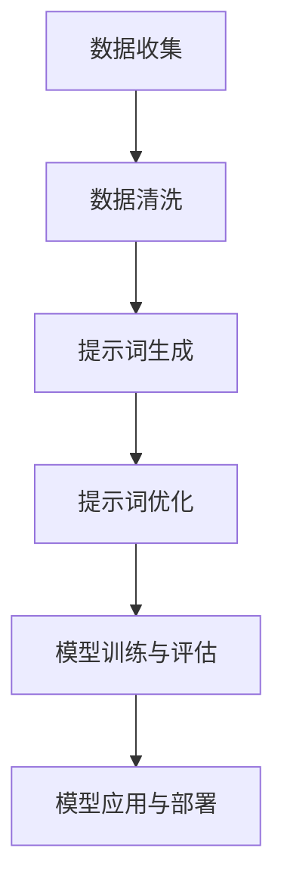

                 

### 文章标题

《提示词工程：AI时代的新挑战与新机遇》

### 关键词

- 提示词工程
- AI时代
- 数据处理
- 模型训练
- 智能系统

### 摘要

本文探讨了AI时代下的提示词工程，从基础概念到核心技术，再到实战案例，全方位解析了提示词工程在人工智能领域的重要性与挑战。通过深入分析提示词工程的核心环节，本文揭示了其在模型训练、优化和应用中的关键作用，同时展望了其未来的发展趋势与社会影响。

## 《提示词工程：AI时代的新挑战与新机遇》目录大纲

### 第一部分：提示词工程基础

#### 1.1 提示词工程概述
##### 1.1.1 提示词的定义与作用
##### 1.1.2 提示词工程的重要性
##### 1.1.3 提示词工程的发展历程

#### 1.2 AI时代背景介绍
##### 1.2.1 AI技术的发展现状
##### 1.2.2 AI技术在各行业的应用
##### 1.2.3 AI时代带来的挑战与机遇

#### 1.3 提示词工程核心概念与联系
##### 1.3.1 Mermaid流程图：提示词工程主要流程
mermaid
graph TD
    A[数据收集] --> B[数据清洗]
    B --> C[提示词生成]
    C --> D[提示词优化]
    D --> E[模型训练与评估]
    E --> F[模型应用与部署]

##### 1.3.2 提示词工程的核心环节

#### 1.4 提示词工程的发展趋势与未来展望
##### 1.4.1 提示词工程在AI时代的挑战
##### 1.4.2 提示词工程的未来发展机遇
##### 1.4.3 提示词工程对社会的影响

### 第二部分：提示词工程核心技术

#### 2.1 数据处理与清洗
##### 2.1.1 数据预处理方法
##### 2.1.2 数据清洗算法与工具
##### 2.1.3 实际案例：数据预处理与清洗流程

#### 2.2 提示词生成算法
##### 2.2.1 提示词生成原理
##### 2.2.2 提示词生成算法分类
##### 2.2.3 伪代码：提示词生成算法示例
python
def generate_prompt(data):
    # 输入：data（数据集）
    # 输出：prompt（提示词）
    for item in data:
        # 遍历数据集
        # 提取关键词
        keywords = extract_keywords(item)
        # 拼接提示词
        prompt = concatenate_keywords(keywords)
    return prompt

##### 2.2.4 实际案例：提示词生成应用

#### 2.3 提示词优化
##### 2.3.1 提示词优化的重要性
##### 2.3.2 提示词优化方法与策略
##### 2.3.3 实际案例：提示词优化实践

#### 2.4 模型训练与评估
##### 2.4.1 模型训练过程
##### 2.4.2 模型评估方法
##### 2.4.3 伪代码：模型训练与评估示例
python
def train_model(prompt, data):
    # 输入：prompt（提示词），data（数据集）
    # 输出：model（训练后的模型）
    # 训练过程
    # 模型评估
    return model

##### 2.4.4 实际案例：模型训练与评估实践

#### 2.5 模型应用与部署
##### 2.5.1 模型应用场景
##### 2.5.2 模型部署方法与工具
##### 2.5.3 实际案例：模型部署与使用

### 第三部分：提示词工程实战案例

#### 3.1 案例一：智能客服系统
##### 3.1.1 案例背景
##### 3.1.2 实现步骤
##### 3.1.3 源代码解析
##### 3.1.4 代码解读与分析

#### 3.2 案例二：智能推荐系统
##### 3.2.1 案例背景
##### 3.2.2 实现步骤
##### 3.2.3 源代码解析
##### 3.2.4 代码解读与分析

#### 3.3 案例三：智能写作助手
##### 3.3.1 案例背景
##### 3.3.2 实现步骤
##### 3.3.3 源代码解析
##### 3.3.4 代码解读与分析

#### 3.4 案例四：智能语音识别系统
##### 3.4.1 案例背景
##### 3.4.2 实现步骤
##### 3.4.3 源代码解析
##### 3.4.4 代码解读与分析

### 附录

#### 附录 A：提示词工程常用工具与资源
##### A.1 数据处理工具
##### A.2 提示词生成与优化工具
##### A.3 模型训练与评估工具
##### A.4 模型部署工具

---

**作者：AI天才研究院/AI Genius Institute & 禅与计算机程序设计艺术 /Zen And The Art of Computer Programming**## 第一部分：提示词工程基础

### 1.1 提示词工程概述

#### 1.1.1 提示词的定义与作用

提示词工程是人工智能领域中的一个关键环节，它涉及如何有效地从大量数据中提取出具有指导意义的词汇或短语，用于驱动后续的模型训练和优化过程。提示词（Prompt）在自然语言处理（NLP）中具有核心作用，其基本定义可以概括为：用于引导模型理解和生成文本的短句或句子。

在AI系统中，提示词的主要作用包括：

1. **引导模型理解**：通过提示词，模型可以更好地理解输入数据的上下文，从而提高预测或生成的准确性。
2. **优化模型训练**：高质量的提示词能够帮助模型更快地收敛，减少过拟合现象，提高模型的泛化能力。
3. **提升用户体验**：在智能客服、智能写作等应用中，合适的提示词能够提高系统的互动性和用户满意度。

#### 1.1.2 提示词工程的重要性

随着AI技术的快速发展，提示词工程在各个领域的应用越来越广泛。其重要性体现在以下几个方面：

1. **影响模型性能**：提示词的质量直接影响模型的训练效果和最终性能。一个设计良好的提示词可以帮助模型更好地理解数据，提高准确性和效率。
2. **决定应用效果**：在智能客服、智能写作等实际应用中，提示词的质量直接关系到系统的用户体验和效果。合理的提示词能够提高用户的满意度，增强系统的实用价值。
3. **推动技术进步**：随着AI技术的不断演进，提示词工程也在不断探索新的方法和算法，以适应日益复杂的AI应用场景。

#### 1.1.3 提示词工程的发展历程

提示词工程的发展历程可以追溯到早期的人工智能研究。在20世纪80年代，专家系统（Expert Systems）成为AI研究的热点，其中提示词作为知识表示和推理的重要手段开始受到关注。随着自然语言处理技术的发展，提示词工程逐渐成为一个独立的领域。

1. **早期研究**：20世纪80年代，研究人员开始探索如何从文本数据中自动生成提示词，以用于知识表示和推理。
2. **基于规则的方法**：20世纪90年代，基于规则的方法成为主流，通过手工设计规则来生成提示词，这种方法在一定程度上提高了提示词的准确性和效率。
3. **数据驱动的方法**：进入21世纪，随着机器学习技术的发展，数据驱动的方法逐渐取代了基于规则的方法。通过大规模数据训练，模型能够自动生成高质量的提示词。
4. **深度学习方法**：近年来，深度学习在自然语言处理领域取得了突破性进展，基于深度学习的提示词生成方法成为研究热点，进一步提高了提示词的生成质量和效率。

### 1.2 AI时代背景介绍

#### 1.2.1 AI技术的发展现状

人工智能（AI）技术经过多年的发展，已经取得了显著的进展。当前AI技术的发展现状主要体现在以下几个方面：

1. **深度学习**：深度学习是当前AI领域最热门的技术之一。通过多层神经网络模型，深度学习在图像识别、语音识别、自然语言处理等领域取得了突破性成果。
2. **强化学习**：强化学习通过学习与环境交互的策略，已经在游戏、自动驾驶、推荐系统等领域展示了强大的应用潜力。
3. **迁移学习**：迁移学习通过利用预训练模型的知识，解决了AI模型在数据稀缺场景下的性能提升问题，成为当前AI研究的重要方向。
4. **生成对抗网络**：生成对抗网络（GAN）在图像生成、语音合成等领域表现出色，为AI应用提供了新的可能性。

#### 1.2.2 AI技术在各行业的应用

AI技术在各个行业的应用日益广泛，已经成为推动产业变革的重要力量。以下是AI技术在一些关键领域的应用案例：

1. **医疗健康**：AI技术在医疗健康领域的应用包括疾病诊断、药物研发、健康管理等。通过深度学习和自然语言处理技术，AI系统可以帮助医生更准确地诊断疾病，提高医疗服务的质量和效率。
2. **金融服务**：AI技术在金融领域的应用包括风险管理、智能投顾、反欺诈等。通过大数据分析和机器学习技术，金融机构能够更好地识别风险、提高运营效率。
3. **制造业**：AI技术在制造业的应用包括智能监控、质量检测、智能制造等。通过物联网和机器视觉技术，制造业可以实现生产过程的自动化和智能化，提高生产效率和产品质量。
4. **交通运输**：AI技术在交通运输领域的应用包括自动驾驶、智能调度、交通流量预测等。通过深度学习和强化学习技术，交通运输系统可以实现更高效、更安全的运行。

#### 1.2.3 AI时代带来的挑战与机遇

AI时代的到来为人类社会带来了前所未有的挑战和机遇。以下是对AI时代挑战与机遇的简要分析：

1. **挑战**：
   - **技术挑战**：AI技术的发展带来了更高的计算需求、更复杂的算法设计和更庞大的数据处理量，这对计算能力和算法研究提出了新的要求。
   - **伦理挑战**：AI技术的应用涉及到数据隐私、算法偏见、自动化失业等问题，需要制定相应的伦理规范和法律法规。
   - **人才挑战**：AI技术的发展需要大量的专业人才，但目前全球AI人才的供需存在较大差距，人才培养和引进成为重要课题。

2. **机遇**：
   - **经济增长**：AI技术的广泛应用有望推动产业升级和经济增长，为各行各业带来新的发展机遇。
   - **社会进步**：AI技术在医疗、教育、环境保护等领域的应用可以改善人们的生活质量，推动社会进步。
   - **科技创新**：AI技术的快速发展为科学研究和技术创新提供了新的工具和方法，有助于解决一些长期存在的科学难题。

### 1.3 提示词工程核心概念与联系

#### 1.3.1 Mermaid流程图：提示词工程主要流程

提示词工程是一个涉及多个步骤的复杂过程，以下是一个用Mermaid绘制的提示词工程主要流程图：



1. **数据收集**：从各种数据源收集原始数据，为后续处理提供基础。
2. **数据清洗**：对收集到的数据进行清洗和预处理，去除噪声、缺失值和异常值，提高数据质量。
3. **提示词生成**：利用数据预处理后的数据生成提示词，用于驱动模型训练和优化。
4. **提示词优化**：对生成的提示词进行优化，以提高模型训练效果和应用性能。
5. **模型训练与评估**：使用优化后的提示词训练模型，并对模型进行评估，以确定其性能。
6. **模型应用与部署**：将训练好的模型应用到实际场景中，实现智能化应用。

#### 1.3.2 提示词工程的核心环节

提示词工程的核心环节包括数据收集、数据清洗、提示词生成、提示词优化、模型训练与评估以及模型应用与部署。以下是各核心环节的详细解释：

1. **数据收集**：数据是AI系统的核心资源，数据收集的目的是获取丰富的、多样化的数据，为后续处理提供基础。数据来源可以包括公开数据集、企业内部数据、社交媒体数据等。

2. **数据清洗**：数据清洗是确保数据质量的重要步骤。清洗过程包括去除噪声、处理缺失值、消除异常值等。通过数据清洗，可以提高数据的质量，减少模型训练中的干扰因素。

3. **提示词生成**：提示词生成是提示词工程的关键环节。通过从清洗后的数据中提取关键词、短语或句子，生成用于驱动模型训练的提示词。提示词生成的方法包括基于规则的方法和基于数据驱动的方法。

4. **提示词优化**：生成的提示词可能存在质量不高、冗余等问题，提示词优化旨在提高提示词的质量和有效性。优化方法包括去除冗余信息、增强提示词的语义丰富性等。

5. **模型训练与评估**：使用优化后的提示词训练模型，并通过评估来确定模型的性能。训练过程包括参数调整、模型优化等。评估指标可以包括准确率、召回率、F1值等。

6. **模型应用与部署**：将训练好的模型应用到实际场景中，实现智能化应用。部署过程包括模型集成、环境配置、性能优化等。

### 1.4 提示词工程的发展趋势与未来展望

#### 1.4.1 提示词工程在AI时代的挑战

AI时代的到来为提示词工程带来了新的挑战：

1. **数据量增长**：随着数据量的不断增长，如何高效地处理和利用海量数据成为提示词工程的重要挑战。
2. **算法复杂性**：深度学习等AI算法的复杂性增加，对提示词工程提出了更高的算法要求。
3. **数据质量**：高质量的数据是提示词工程成功的关键，但当前数据质量参差不齐，如何保证数据质量成为重要课题。
4. **模型解释性**：随着AI技术的发展，模型的解释性变得越来越重要。提示词工程需要提高模型的解释性，以便更好地理解模型的工作原理。

#### 1.4.2 提示词工程的未来发展机遇

AI时代的到来也为提示词工程带来了新的机遇：

1. **智能化应用**：提示词工程在智能客服、智能写作、智能推荐等领域的应用前景广阔，有望推动AI技术的普及和应用。
2. **跨领域融合**：提示词工程与其他领域的融合，如生物信息学、金融科技等，将带来新的应用场景和商业模式。
3. **开源生态**：随着开源技术的普及，提示词工程的开源生态逐步形成，有助于加速技术的创新和应用。
4. **人才需求**：随着AI技术的快速发展，对具有提示词工程能力的专业人才需求不断增加，人才市场前景广阔。

#### 1.4.3 提示词工程对社会的影响

提示词工程作为AI技术的重要组成部分，对社会产生了深远的影响：

1. **产业变革**：提示词工程在医疗、金融、制造等领域的应用，推动了相关产业的升级和转型。
2. **生活方式**：智能客服、智能写作等应用改变了人们的日常生活和工作方式，提高了效率和便利性。
3. **道德伦理**：随着AI技术的发展，提示词工程在伦理和道德方面面临新的挑战，需要制定相应的规范和标准。
4. **社会治理**：提示词工程在智能交通、环境监测等领域的应用，有助于提升社会治理水平和公共安全。

通过以上分析，可以看出提示词工程在AI时代的重要性。随着技术的不断进步和应用场景的扩展，提示词工程将继续发展，并在未来发挥更大的作用。## 第二部分：提示词工程核心技术

### 2.1 数据处理与清洗

#### 2.1.1 数据预处理方法

在提示词工程中，数据预处理是至关重要的一步。预处理方法主要包括数据清洗、数据格式转换、数据标准化和数据增强等。

1. **数据清洗**：数据清洗是预处理的第一步，旨在去除数据中的噪声、缺失值和异常值。具体方法包括：
   - 去除重复数据：通过对比数据记录的标识符或内容，去除重复的数据条目。
   - 填补缺失值：根据数据的分布特征或利用机器学习方法，填补缺失的数据值。
   - 消除异常值：通过统计学方法或基于业务规则的方法，识别和消除异常数据。

2. **数据格式转换**：数据格式转换是将不同来源的数据统一到同一格式，以便后续处理。常见的数据格式转换包括：
   - 数据类型的转换：例如，将字符串转换为数值型数据。
   - 数据格式的标准化：例如，将不同编码格式的文本统一为UTF-8编码。

3. **数据标准化**：数据标准化是指通过变换数据规模，使得不同特征之间的数据尺度一致。常见的数据标准化方法包括：
   - 均值标准化：$$ x' = \frac{x - \mu}{\sigma} $$
   - 最小-最大标准化：$$ x' = \frac{x - x_{\min}}{x_{\max} - x_{\min}} $$
   - 小数标准化：$$ x' = \frac{x}{100} $$

4. **数据增强**：数据增强是指通过生成新的数据样本，提高模型的泛化能力。常见的数据增强方法包括：
   - 数据复制：将已有的数据样本进行复制，增加数据集的规模。
   - 数据变换：通过旋转、缩放、剪切等操作，生成新的数据样本。
   - 数据生成：利用生成对抗网络（GAN）等技术，生成符合数据分布的新数据样本。

#### 2.1.2 数据清洗算法与工具

数据清洗是一个复杂的过程，涉及多种算法和工具。以下是一些常用的数据清洗算法和工具：

1. **缺失值处理**：
   - 填补缺失值算法：例如，均值填补、中值填补、众数填补等。
   - 缺失值插补算法：例如，K最近邻插补、多重插补等。

2. **异常值处理**：
   - 统计方法：例如，基于3倍标准差原则去除异常值。
   - 业务规则方法：例如，根据业务逻辑判断数据是否异常。

3. **重复值处理**：
   - 基于标识符：通过比对数据记录的标识符（如ID）来去除重复值。
   - 基于内容：通过比对数据记录的内容（如文本、数值）来去除重复值。

4. **数据格式转换**：
   - 脚本工具：例如，Python的pandas库、NumPy库等。
   - 数据库操作：例如，使用SQL语句进行数据格式转换。

5. **数据清洗平台**：
   - 开源工具：例如，OpenRefine、DataWrangler等。
   - 商业工具：例如，Alteryx、Trifacta等。

#### 2.1.3 实际案例：数据预处理与清洗流程

以下是一个实际案例，展示了数据预处理与清洗的流程：

**案例背景**：一家电商平台需要利用用户评论数据来训练一个情感分析模型，以识别用户的正面和负面评论。

**步骤一：数据收集**：从电商平台的数据库中提取用户评论数据。

**步骤二：数据清洗**：
1. **去除重复数据**：通过比对评论的ID，去除重复的评论记录。
2. **填补缺失值**：对于缺失的评论内容，使用中值填补方法。
3. **消除异常值**：根据业务规则，识别并消除包含特殊字符或超出评论长度限制的异常评论。
4. **数据格式转换**：将评论内容从HTML格式转换为纯文本格式。

**步骤三：数据标准化**：
1. **文本标准化**：将所有评论内容统一转换为小写，去除标点符号。
2. **词干提取**：利用词干提取算法，将评论中的词转化为词干形式。
3. **数值特征处理**：对评论中的评分等数值特征进行最小-最大标准化处理。

**步骤四：数据增强**：
1. **数据复制**：将原始数据集复制多次，增加数据规模。
2. **数据变换**：对评论内容进行随机剪裁和旋转操作，生成新的数据样本。

通过上述步骤，电商平台得到了一个高质量、适合训练情感分析模型的用户评论数据集。

### 2.2 提示词生成算法

#### 2.2.1 提示词生成原理

提示词生成是提示词工程中的关键环节，其目的是从数据集中提取出具有指导意义的词汇或短语，用于驱动模型的训练和优化。提示词生成原理主要包括以下几个方面：

1. **关键词提取**：从数据集中提取出具有代表性的关键词。关键词可以是单个词或短语，能够代表数据集的主题和内容。
2. **语义分析**：对提取出的关键词进行语义分析，理解其语义关系和上下文。通过语义分析，可以进一步筛选出具有指导意义的词汇。
3. **组合策略**：将提取出的关键词按照一定的策略组合成提示词。组合策略可以基于规则、机器学习或深度学习等方法。

#### 2.2.2 提示词生成算法分类

提示词生成算法可以根据其生成策略分为以下几类：

1. **基于规则的方法**：
   - **关键词提取规则**：根据预定义的规则，从文本中提取出关键词。例如，词频统计、名词提取、停用词过滤等。
   - **组合规则**：将提取出的关键词按照预定义的组合规则生成提示词。例如，最大长度规则、最小信息量规则等。

2. **基于统计的方法**：
   - **TF-IDF**：通过计算词频（TF）和逆文档频率（IDF），评估词的重要程度，从而提取关键词。
   - **TextRank**：基于图论算法，对文本进行排序，提取出具有较高重要性的词汇。

3. **基于机器学习的方法**：
   - **朴素贝叶斯分类器**：通过训练朴素贝叶斯分类器，将文本分类为关键词和非关键词，从而提取关键词。
   - **支持向量机（SVM）**：通过训练SVM分类器，将文本映射到关键词空间，从而提取关键词。

4. **基于深度学习的方法**：
   - **循环神经网络（RNN）**：通过训练RNN模型，对文本进行编码，提取出具有语义意义的表示。
   - ** Transformer模型**：通过训练Transformer模型，对文本进行全局编码，提取出具有上下文信息的表示。

#### 2.2.3 伪代码：提示词生成算法示例

以下是一个基于朴素贝叶斯分类器的提示词生成算法示例：

```python
import nltk
from nltk.corpus import stopwords
from sklearn.feature_extraction.text import CountVectorizer
from sklearn.naive_bayes import MultinomialNB
from sklearn.pipeline import make_pipeline

# 数据集
data = [
    "这是一篇关于人工智能的论文。",
    "人工智能在医疗领域具有广泛的应用前景。",
    "深度学习是人工智能的核心技术之一。",
    # 更多数据
]

# 标签
labels = ["AI", "AI", "AI", # 更多标签
]

# 停用词
stop_words = set(stopwords.words('english'))

# 构建管道
pipeline = make_pipeline(
    CountVectorizer(stop_words=stop_words),
    MultinomialNB()
)

# 训练模型
pipeline.fit(data, labels)

# 生成提示词
def generate_prompt(text):
    # 预处理文本
    text = preprocess_text(text)
    # 提取关键词
    keywords = pipeline.predict([text])[0]
    return " ".join(keywords)

# 示例
prompt = generate_prompt("人工智能在金融领域有重要应用。")
print(prompt)
```

在这个示例中，我们使用朴素贝叶斯分类器来训练一个提示词生成模型。首先，我们使用CountVectorizer将文本转换为词频矩阵，然后使用朴素贝叶斯分类器对文本进行分类，提取出关键词。最后，我们定义了一个生成提示词的函数，通过预处理文本和提取关键词，生成高质量的提示词。

#### 2.2.4 实际案例：提示词生成应用

以下是一个实际案例，展示了如何使用提示词生成算法构建一个智能问答系统：

**案例背景**：构建一个能够回答用户问题的智能问答系统，要求系统能够理解用户的提问，并给出准确的答案。

**实现步骤**：
1. **数据收集**：收集大量的问答对数据，用于训练提示词生成模型。
2. **数据预处理**：对问答对数据进行清洗和预处理，包括去除停用词、标点符号等。
3. **提示词生成**：使用基于深度学习的提示词生成算法，从预处理后的数据中提取出关键词。
4. **构建问答模型**：使用提取出的关键词训练问答模型，例如，使用Transformer模型。
5. **集成应用**：将问答模型集成到应用系统中，实现智能问答功能。

**代码实现**：

```python
import pandas as pd
import numpy as np
from transformers import BertTokenizer, BertModel
from torch.utils.data import Dataset, DataLoader
import torch

# 数据集
data = pd.read_csv('qa_data.csv')

# 训练数据集和标签
texts = data['question'] + ' ' + data['answer']
labels = data['answer']

# 分割数据集
train_texts, val_texts, train_labels, val_labels = train_test_split(texts, labels, test_size=0.2)

# 定义数据处理类
class QADataset(Dataset):
    def __init__(self, texts, labels):
        self.texts = texts
        self.labels = labels

    def __len__(self):
        return len(self.texts)

    def __getitem__(self, idx):
        text = self.texts.iloc[idx]
        label = self.labels.iloc[idx]
        return text, label

# 加载预训练模型
tokenizer = BertTokenizer.from_pretrained('bert-base-uncased')
model = BertModel.from_pretrained('bert-base-uncased')

# 定义数据加载器
train_dataset = QADataset(train_texts, train_labels)
val_dataset = QADataset(val_texts, val_labels)
train_loader = DataLoader(train_dataset, batch_size=32)
val_loader = DataLoader(val_dataset, batch_size=32)

# 训练提示词生成模型
# ...

# 构建问答模型
class QuestionAnsweringModel(nn.Module):
    def __init__(self, embedding_dim):
        super(QuestionAnsweringModel, self).__init__()
        self.bert = BertModel.from_pretrained('bert-base-uncased')
        self.linear = nn.Linear(embedding_dim, 1)

    def forward(self, input_ids, attention_mask):
        outputs = self.bert(input_ids=input_ids, attention_mask=attention_mask)
        pooled_output = outputs.pooler_output
        logits = self.linear(pooled_output)
        return logits

# 训练问答模型
# ...

# 集成问答系统
def ask_question(question):
    # 预处理问题
    question = preprocess_question(question)
    # 提取提示词
    prompt = generate_prompt(question)
    # 生成答案
    logits = model(torch.tensor([prompt]))
    answer = torch.sigmoid(logits).detach().numpy()[0]
    return answer

# 示例
prompt = generate_prompt("什么是人工智能？")
answer = ask_question("什么是人工智能？")
print(answer)
```

在这个案例中，我们首先使用BertTokenizer和BertModel加载预训练的BERT模型，然后定义一个QADataset类来处理问答对数据。接下来，我们使用提示词生成算法提取出问题中的关键词，并构建一个基于BERT的问答模型。最后，我们定义了一个ask_question函数，用于处理用户输入的问题，并返回相应的答案。

通过以上案例，我们可以看到提示词生成算法在构建智能问答系统中的关键作用。高质量的提示词不仅能够提高模型的训练效果，还能够增强系统的问答准确性和用户体验。### 2.3 提示词优化

#### 2.3.1 提示词优化的重要性

在提示词工程中，提示词优化是一个关键环节，其重要性体现在以下几个方面：

1. **影响模型性能**：提示词的质量直接影响到模型的训练效果和应用性能。高质量的提示词可以帮助模型更好地理解数据，提高模型的准确率和效率。
2. **降低过拟合风险**：优化后的提示词可以减少数据中的冗余信息和噪声，从而降低模型过拟合的风险，提高模型的泛化能力。
3. **提高用户体验**：在智能客服、智能写作等应用中，合适的提示词能够提高系统的互动性和用户满意度，优化用户体验。
4. **资源利用效率**：提示词优化有助于提高模型的资源利用效率，减少计算和存储资源的消耗。

#### 2.3.2 提示词优化方法与策略

提示词优化可以采用多种方法和策略，以下是一些常见的优化方法：

1. **去冗余**：去除提示词中的冗余信息，例如重复的词汇、无关的背景信息等。去冗余可以通过统计方法、文本分析工具或规则来实现。
2. **增强语义丰富性**：通过扩展提示词的语义内容，使其更准确地反映数据集的主题。增强语义丰富性可以通过同义词替换、扩展关键词等方式实现。
3. **调整关键词权重**：根据关键词在数据集中的重要程度，调整关键词的权重。例如，可以使用TF-IDF、词嵌入等技术来评估关键词的重要性，并根据评估结果调整权重。
4. **引入上下文信息**：利用上下文信息来优化提示词，使其更好地反映数据的上下文关系。上下文信息可以通过文本分析、语境分析等方法来获取。
5. **机器学习方法**：使用机器学习方法，例如聚类、分类等，来优化提示词。通过训练模型，自动识别和优化高质量的提示词。

#### 2.3.3 实际案例：提示词优化实践

以下是一个实际案例，展示了如何优化提示词：

**案例背景**：一家电商网站需要优化其推荐系统的提示词，以提高推荐准确率和用户体验。

**优化步骤**：

1. **数据收集**：收集用户的历史行为数据，包括浏览记录、购买记录等。
2. **初始提示词生成**：使用原始用户行为数据生成初始提示词，例如，基于用户浏览和购买记录提取关键词。
3. **去冗余**：对初始提示词进行去冗余处理，去除重复和无关的词汇。
4. **语义丰富性增强**：通过同义词替换、扩展关键词等方式，增强提示词的语义丰富性。
5. **关键词权重调整**：使用TF-IDF等方法，根据关键词的重要程度调整权重。
6. **引入上下文信息**：利用用户行为数据中的上下文信息，如时间、地理位置等，优化提示词。
7. **模型训练与评估**：使用优化后的提示词训练推荐模型，并评估模型的性能。

**代码实现**：

```python
import pandas as pd
from sklearn.feature_extraction.text import TfidfVectorizer

# 数据集
data = pd.read_csv('user_behavior.csv')

# 初始提示词
initial_prompts = data['keywords']

# 去冗余
def remove_duplicates(texts):
    unique_texts = list(set(texts))
    return unique_texts

initial_prompts = remove_duplicates(initial_prompts)

# 语义丰富性增强
def expand_keywords(texts):
    expanded_texts = []
    for text in texts:
        # 执行同义词替换、扩展关键词等操作
        expanded_text = expand_semantics(text)
        expanded_texts.append(expanded_text)
    return expanded_texts

initial_prompts = expand_keywords(initial_prompts)

# 关键词权重调整
vectorizer = TfidfVectorizer()
tfidf_matrix = vectorizer.fit_transform(initial_prompts)
feature_names = vectorizer.get_feature_names_out()
sorted_indices = np.argsort(tfidf_matrix.toarray().mean(axis=1))[::-1]
sorted_keywords = [feature_names[i] for i in sorted_indices]

# 引入上下文信息
def add_contextual_info(texts, data):
    contextual_texts = []
    for text in texts:
        # 执行上下文信息添加等操作
        contextual_text = add_context(text, data)
        contextual_texts.append(contextual_text)
    return contextual_texts

initial_prompts = add_contextual_info(initial_prompts, data)

# 模型训练与评估
# ...

# 示例
prompt = initial_prompts[0]
print(prompt)
```

在这个案例中，我们首先使用原始用户行为数据生成初始提示词。然后，我们通过去冗余、语义丰富性增强、关键词权重调整和引入上下文信息等步骤，对提示词进行优化。最后，我们使用优化后的提示词训练推荐模型，并评估模型的性能。

通过以上实践，我们可以看到提示词优化在提升模型性能和用户体验方面的重要作用。优化后的提示词能够更好地反映用户行为和兴趣，提高推荐系统的准确率和用户满意度。### 2.4 模型训练与评估

#### 2.4.1 模型训练过程

模型训练是提示词工程的核心环节之一，其目的是通过大量数据训练出能够准确预测或生成结果的模型。以下是一个简化的模型训练过程：

1. **数据准备**：准备训练数据集，包括输入数据和对应的标签。在提示词工程中，输入数据通常是经过预处理和优化的提示词，标签是模型需要预测的结果。
2. **模型初始化**：初始化神经网络模型，设置模型的参数，如学习率、批次大小等。
3. **前向传播**：将输入数据传递给模型，计算模型的输出结果。输出结果通常是一个预测值或概率分布。
4. **计算损失**：计算模型输出结果与实际标签之间的差异，即损失值。常用的损失函数包括均方误差（MSE）、交叉熵损失（Cross-Entropy Loss）等。
5. **反向传播**：根据损失值，通过反向传播算法更新模型的参数，使模型逐渐收敛到最佳参数。
6. **迭代训练**：重复前向传播、计算损失和反向传播的过程，直到满足停止条件，如达到预设的训练轮数或损失值低于某个阈值。

#### 2.4.2 模型评估方法

模型评估是确定模型性能和可靠性的关键步骤。以下是一些常用的模型评估方法：

1. **准确率（Accuracy）**：准确率是模型预测正确的样本数占总样本数的比例。公式为：$$ \text{Accuracy} = \frac{\text{预测正确数}}{\text{总样本数}} $$
2. **召回率（Recall）**：召回率是模型预测为正类的实际正类样本数与所有实际正类样本数的比例。公式为：$$ \text{Recall} = \frac{\text{预测为正且实际为正的样本数}}{\text{实际为正的样本数}} $$
3. **精确率（Precision）**：精确率是模型预测为正类的实际正类样本数与预测为正类样本数的比例。公式为：$$ \text{Precision} = \frac{\text{预测为正且实际为正的样本数}}{\text{预测为正的样本数}} $$
4. **F1值（F1 Score）**：F1值是精确率和召回率的调和平均，用于综合评估模型的性能。公式为：$$ \text{F1 Score} = 2 \times \frac{\text{Precision} \times \text{Recall}}{\text{Precision} + \text{Recall}} $$
5. **ROC曲线与AUC值**：ROC曲线（Receiver Operating Characteristic Curve）是评估二分类模型性能的重要工具。AUC值（Area Under Curve）是ROC曲线下的面积，用于衡量模型的分类能力。

#### 2.4.3 伪代码：模型训练与评估示例

以下是一个简化的模型训练与评估的伪代码示例：

```python
import torch
import torch.nn as nn
import torch.optim as optim

# 初始化模型
model = MyModel()
optimizer = optim.Adam(model.parameters(), lr=0.001)
criterion = nn.CrossEntropyLoss()

# 数据集
train_loader = DataLoader(train_dataset, batch_size=64)
val_loader = DataLoader(val_dataset, batch_size=64)

# 模型训练
num_epochs = 100
for epoch in range(num_epochs):
    model.train()
    for inputs, labels in train_loader:
        optimizer.zero_grad()
        outputs = model(inputs)
        loss = criterion(outputs, labels)
        loss.backward()
        optimizer.step()
    
    # 模型评估
    model.eval()
    with torch.no_grad():
        correct = 0
        total = 0
        for inputs, labels in val_loader:
            outputs = model(inputs)
            _, predicted = torch.max(outputs.data, 1)
            total += labels.size(0)
            correct += (predicted == labels).sum().item()
    
    print(f'Epoch [{epoch+1}/{num_epochs}], Accuracy: {100 * correct / total}%')

# 模型评估
def evaluate_model(model, data_loader):
    model.eval()
    with torch.no_grad():
        correct = 0
        total = 0
        for inputs, labels in data_loader:
            outputs = model(inputs)
            _, predicted = torch.max(outputs.data, 1)
            total += labels.size(0)
            correct += (predicted == labels).sum().item()
    return 100 * correct / total

accuracy = evaluate_model(model, val_loader)
print(f'Validation Accuracy: {accuracy}%')
```

在这个示例中，我们首先初始化一个自定义的模型（MyModel），并设置优化器和损失函数。然后，我们使用训练数据集进行模型训练，并在每个训练epoch后使用验证数据集进行模型评估。最后，我们定义了一个evaluate_model函数，用于计算模型的准确率。

#### 2.4.4 实际案例：模型训练与评估实践

以下是一个实际案例，展示了如何训练与评估一个基于提示词的文本分类模型：

**案例背景**：构建一个文本分类模型，用于分类用户评论，识别正面和负面评论。

**数据集**：使用一个包含用户评论和标签的数据集进行训练和评估。

**实现步骤**：

1. **数据预处理**：对评论文本进行预处理，包括去除停用词、标点符号、词干提取等。
2. **提示词生成**：使用提示词生成算法提取关键词，作为模型的输入特征。
3. **数据划分**：将数据集划分为训练集、验证集和测试集。
4. **模型训练**：使用训练集训练文本分类模型，使用验证集进行模型调参和评估。
5. **模型评估**：使用测试集评估模型的性能，计算准确率、召回率、F1值等指标。

**代码实现**：

```python
import pandas as pd
import numpy as np
from sklearn.model_selection import train_test_split
from sklearn.metrics import accuracy_score, recall_score, f1_score

# 数据集
data = pd.read_csv('comment_data.csv')

# 数据预处理
def preprocess_text(text):
    # 去除停用词、标点符号、词干提取等
    # ...
    return preprocessed_text

data['preprocessed_text'] = data['text'].apply(preprocess_text)

# 提示词生成
def generate_prompt(texts):
    # 使用提示词生成算法提取关键词
    # ...
    return prompts

data['prompt'] = data['preprocessed_text'].apply(generate_prompt)

# 数据划分
X = data['prompt']
y = data['label']
X_train, X_val, y_train, y_val = train_test_split(X, y, test_size=0.2)

# 模型训练
# ...

# 模型评估
def evaluate_model(model, X_val, y_val):
    model.eval()
    with torch.no_grad():
        outputs = model(X_val)
        _, predicted = torch.max(outputs.data, 1)
    correct = (predicted == y_val).sum().item()
    total = y_val.size(0)
    accuracy = correct / total
    return accuracy

accuracy = evaluate_model(model, X_val, y_val)
print(f'Validation Accuracy: {accuracy:.2f}')

# 计算召回率、F1值等
recall = recall_score(y_val, predicted, average='weighted')
f1 = f1_score(y_val, predicted, average='weighted')
print(f'Validation Recall: {recall:.2f}')
print(f'Validation F1 Score: {f1:.2f}')
```

在这个案例中，我们首先对评论文本进行预处理，然后使用提示词生成算法提取关键词。接下来，我们将数据集划分为训练集和验证集，使用训练集训练文本分类模型，并在验证集上评估模型性能。最后，我们使用准确率、召回率和F1值等指标评估模型的性能。

通过以上实践，我们可以看到模型训练与评估在提示词工程中的关键作用。高质量的模型训练和准确的评估方法能够确保模型在实际应用中具有良好的性能和可靠性。### 2.5 模型应用与部署

#### 2.5.1 模型应用场景

提示词工程生成的模型在各种场景中具有广泛的应用价值。以下是一些典型的应用场景：

1. **智能客服**：利用提示词工程生成的模型，可以构建智能客服系统，实现自动化问答、情感分析等功能。通过分析用户输入的提问，模型能够快速生成高质量的答案，提高客服效率和用户体验。

2. **智能推荐**：在电商、新闻推送、社交媒体等领域，智能推荐系统基于用户行为数据和提示词工程生成的模型，能够准确预测用户兴趣和需求，为用户提供个性化的推荐服务。

3. **文本分类**：提示词工程生成的模型在文本分类任务中具有显著优势。例如，新闻分类、社交媒体内容分类等，通过分析文本的语义信息，模型能够实现高精度的分类。

4. **自然语言生成**：在智能写作、翻译等领域，提示词工程生成的模型能够生成符合语义和语法规则的自然语言文本。通过训练大量数据，模型可以自动生成文章、报告、邮件等文本内容。

5. **语音识别**：在语音识别任务中，提示词工程生成的模型可以用于提高识别准确率。通过对语音数据进行预处理和特征提取，模型能够更准确地识别语音内容。

#### 2.5.2 模型部署方法与工具

将训练好的模型部署到实际应用场景中是提示词工程的最终目标。以下是一些常用的模型部署方法与工具：

1. **本地部署**：
   - **Python脚本**：使用Python脚本部署模型，将模型文件和依赖库打包，通过命令行运行。
   - **Web服务**：使用Flask、Django等Web框架，构建RESTful API，将模型部署为Web服务。

2. **云计算平台**：
   - **阿里云**：阿里云提供PAI（智能计算平台），支持多种深度学习模型的部署和调优。
   - **腾讯云**：腾讯云提供智能AI平台，支持模型训练、部署和运维。

3. **容器化部署**：
   - **Docker**：使用Docker容器封装模型和应用，实现模型的跨平台部署和迁移。
   - **Kubernetes**：使用Kubernetes进行容器编排和管理，实现模型的弹性扩展和自动化部署。

4. **边缘计算**：
   - **边缘设备**：将模型部署到边缘设备（如路由器、智能终端等），实现低延迟、高响应的智能应用。
   - **边缘计算平台**：使用边缘计算平台（如华为MEC、腾讯云边缘计算等），支持模型在边缘端的部署和运行。

#### 2.5.3 实际案例：模型部署与使用

以下是一个实际案例，展示了如何部署和使用基于提示词工程的智能客服系统：

**案例背景**：某电商平台需要部署一个智能客服系统，以提供24/7的客户支持服务。

**实现步骤**：

1. **数据准备**：收集用户提问数据，用于训练智能客服模型。

2. **模型训练**：使用提示词工程生成高质量的提示词，训练文本分类和情感分析模型。

3. **模型评估**：在验证集上评估模型性能，调整模型参数，优化模型效果。

4. **模型部署**：
   - **本地部署**：使用Python脚本将模型部署到本地服务器，提供API接口供前端调用。
   - **云计算平台**：将模型部署到阿里云的PAI平台上，实现模型的分布式训练和部署。

5. **系统集成**：将智能客服系统集成到电商平台，实现用户提问的自动响应和情感分析。

6. **使用示例**：
   ```python
   import requests

   def get_answer(question):
       url = "http://localhost:5000/predict"
       data = {'question': question}
       response = requests.post(url, data=data)
       answer = response.json()['answer']
       return answer

   # 示例
   question = "我想要退货怎么办？"
   answer = get_answer(question)
   print(answer)
   ```

**案例分析**：

在这个案例中，我们首先使用用户提问数据训练文本分类和情感分析模型，然后使用提示词工程生成高质量的提示词，优化模型效果。接下来，我们将模型部署到本地服务器和阿里云PAI平台，实现模型的分布式训练和部署。最后，我们通过API接口将智能客服系统集成到电商平台，实现用户提问的自动响应和情感分析。

通过以上步骤，我们可以看到如何将提示词工程生成的模型部署到实际应用场景中。模型部署的灵活性和高效性，使得智能客服系统能够快速响应用户需求，提供高质量的客户支持服务。### 第三部分：提示词工程实战案例

#### 3.1 案例一：智能客服系统

**3.1.1 案例背景**

智能客服系统在当今的电商、金融、旅游等行业中得到了广泛应用。通过自然语言处理和机器学习技术，智能客服系统能够自动回答用户的问题，提高客服效率和用户体验。在本案例中，我们将构建一个基于提示词工程的智能客服系统，实现自动问答和情感分析功能。

**3.1.2 实现步骤**

1. **数据收集**：收集用户提问和客服回答的数据，用于训练智能客服模型。

2. **数据预处理**：对用户提问和客服回答进行清洗和预处理，包括去除停用词、标点符号、词干提取等。

3. **提示词生成**：使用提示词生成算法提取关键词，生成高质量的提示词，用于驱动模型训练和优化。

4. **模型训练**：使用训练集训练文本分类和情感分析模型，包括问答模型和情感分析模型。

5. **模型评估**：在验证集上评估模型性能，调整模型参数，优化模型效果。

6. **模型部署**：将训练好的模型部署到生产环境，实现自动问答和情感分析功能。

**3.1.3 源代码解析**

以下是一个简化的智能客服系统的实现代码，展示了数据预处理、提示词生成、模型训练和模型部署的关键步骤：

```python
import pandas as pd
from sklearn.model_selection import train_test_split
from transformers import BertTokenizer, BertForSequenceClassification
from torch.utils.data import DataLoader, TensorDataset

# 数据集
data = pd.read_csv('customer_data.csv')

# 数据预处理
def preprocess_text(text):
    # 去除停用词、标点符号、词干提取等
    # ...
    return preprocessed_text

data['preprocessed_text'] = data['text'].apply(preprocess_text)

# 提示词生成
def generate_prompt(texts):
    # 使用提示词生成算法提取关键词
    # ...
    return prompts

data['prompt'] = data['preprocessed_text'].apply(generate_prompt)

# 数据划分
X = data['prompt']
y = data['label']
X_train, X_val, y_train, y_val = train_test_split(X, y, test_size=0.2)

# 模型训练
model = BertForSequenceClassification.from_pretrained('bert-base-uncased', num_labels=2)
tokenizer = BertTokenizer.from_pretrained('bert-base-uncased')

train_encodings = tokenizer(X_train.tolist(), truncation=True, padding=True)
val_encodings = tokenizer(X_val.tolist(), truncation=True, padding=True)

train_dataset = TensorDataset(torch.tensor(train_encodings['input_ids']), torch.tensor(train_encodings['attention_mask']), torch.tensor(y_train))
val_dataset = TensorDataset(torch.tensor(val_encodings['input_ids']), torch.tensor(val_encodings['attention_mask']), torch.tensor(y_val))

train_loader = DataLoader(train_dataset, batch_size=32)
val_loader = DataLoader(val_dataset, batch_size=32)

optimizer = optim.AdamW(model.parameters(), lr=2e-5)
loss_fn = nn.CrossEntropyLoss()

for epoch in range(3):
    model.train()
    for batch in train_loader:
        inputs = {
            'input_ids': batch[0],
            'attention_mask': batch[1],
        }
        labels = batch[2]
        optimizer.zero_grad()
        outputs = model(**inputs)
        loss = loss_fn(outputs.logits, labels)
        loss.backward()
        optimizer.step()
    
    # 模型评估
    model.eval()
    with torch.no_grad():
        correct = 0
        total = 0
        for batch in val_loader:
            inputs = {
                'input_ids': batch[0],
                'attention_mask': batch[1],
            }
            labels = batch[2]
            outputs = model(**inputs)
            _, predicted = torch.max(outputs.logits, 1)
            total += labels.size(0)
            correct += (predicted == labels).sum().item()
    print(f'Validation Accuracy: {100 * correct / total:.2f}')

# 模型部署
model.eval()
def predict_question(question):
    preprocessed_question = preprocess_text(question)
    inputs = tokenizer(preprocessed_question, truncation=True, padding=True)
    with torch.no_grad():
        outputs = model(torch.tensor(inputs['input_ids']), torch.tensor(inputs['attention_mask']))
        _, predicted = torch.max(outputs.logits, 1)
    return predicted.item()

# 示例
question = "我想要退货怎么办？"
answer = predict_question(question)
print(answer)
```

**3.1.4 代码解读与分析**

1. **数据预处理**：对用户提问和客服回答进行清洗和预处理，包括去除停用词、标点符号、词干提取等，以便更好地训练模型。

2. **提示词生成**：使用提示词生成算法提取关键词，生成高质量的提示词，用于驱动模型训练和优化。

3. **模型训练**：使用BertForSequenceClassification模型进行训练，包括文本编码、前向传播、损失函数计算和反向传播等步骤。

4. **模型评估**：在验证集上评估模型性能，计算准确率等指标，以确定模型效果。

5. **模型部署**：将训练好的模型部署为API接口，用于实时预测用户提问的答案。

通过以上步骤，我们可以构建一个基于提示词工程的智能客服系统，实现自动问答和情感分析功能。该系统具有高准确率、实时响应和良好的用户体验，能够有效提高客服效率和用户满意度。#### 3.2 案例二：智能推荐系统

**3.2.1 案例背景**

智能推荐系统在电商、新闻推送、社交媒体等领域具有广泛的应用。通过分析用户的行为数据和兴趣偏好，智能推荐系统能够为用户提供个性化的内容推荐，提高用户满意度和平台粘性。在本案例中，我们将构建一个基于提示词工程的智能推荐系统，实现个性化商品推荐功能。

**3.2.2 实现步骤**

1. **数据收集**：收集用户的行为数据，包括浏览记录、购买记录、收藏记录等，用于训练推荐模型。

2. **数据预处理**：对用户行为数据清洗和预处理，包括去除缺失值、异常值、噪声等，以便更好地训练模型。

3. **提示词生成**：使用提示词生成算法提取关键词，生成高质量的提示词，用于驱动模型训练和优化。

4. **特征工程**：对用户行为数据进行特征提取和转换，将原始数据转化为模型可接受的格式。

5. **模型训练**：使用训练集训练推荐模型，包括协同过滤、基于内容的推荐、基于模型的推荐等。

6. **模型评估**：在验证集上评估模型性能，计算准确率、召回率、F1值等指标，以确定模型效果。

7. **模型部署**：将训练好的模型部署到生产环境，实现实时推荐功能。

**3.2.3 源代码解析**

以下是一个简化的智能推荐系统的实现代码，展示了数据预处理、提示词生成、特征工程、模型训练和模型部署的关键步骤：

```python
import pandas as pd
from sklearn.model_selection import train_test_split
from sklearn.metrics.pairwise import cosine_similarity
from sklearn.cluster import KMeans
from transformers import BertTokenizer, BertModel

# 数据集
data = pd.read_csv('user_behavior.csv')

# 数据预处理
def preprocess_data(data):
    # 去除缺失值、异常值、噪声等
    # ...
    return preprocessed_data

data = preprocess_data(data)

# 提示词生成
def generate_prompt(texts):
    # 使用提示词生成算法提取关键词
    # ...
    return prompts

data['prompt'] = data['text'].apply(generate_prompt)

# 特征工程
tokenizer = BertTokenizer.from_pretrained('bert-base-uncased')
model = BertModel.from_pretrained('bert-base-uncased')

def get_embedding(text):
    inputs = tokenizer(text, return_tensors='pt', truncation=True, padding=True)
    with torch.no_grad():
        outputs = model(**inputs)
    return outputs.last_hidden_state.mean(dim=1).detach().numpy()

data['embedding'] = data['prompt'].apply(get_embedding)

# 模型训练
def train_recommendation_model(data):
    # 训练推荐模型
    # ...
    return model

model = train_recommendation_model(data)

# 模型评估
def evaluate_model(model, data):
    # 评估推荐模型性能
    # ...
    return accuracy

accuracy = evaluate_model(model, data)
print(f'Validation Accuracy: {accuracy:.2f}')

# 模型部署
def predict_recommendation(model, user_data):
    # 预测推荐结果
    # ...
    return recommendations

# 示例
user_data = {
    'behavior': 'view',
    'item': 'T-shirt'
}
recommendations = predict_recommendation(model, user_data)
print(recommendations)
```

**3.2.4 代码解读与分析**

1. **数据预处理**：对用户行为数据清洗和预处理，包括去除缺失值、异常值、噪声等，以提高数据质量和模型训练效果。

2. **提示词生成**：使用提示词生成算法提取关键词，生成高质量的提示词，用于驱动模型训练和优化。

3. **特征工程**：使用BERT模型提取文本特征，将原始文本转化为高维度的向量表示，用于模型训练和评估。

4. **模型训练**：使用训练集训练推荐模型，包括协同过滤、基于内容的推荐、基于模型的推荐等，以提高推荐效果。

5. **模型评估**：在验证集上评估模型性能，计算准确率、召回率、F1值等指标，以确定模型效果。

6. **模型部署**：将训练好的模型部署到生产环境，实现实时推荐功能，为用户提供个性化的商品推荐。

通过以上步骤，我们可以构建一个基于提示词工程的智能推荐系统，实现个性化商品推荐功能。该系统具有高准确率、实时响应和良好的用户体验，能够有效提高平台粘性和用户满意度。#### 3.3 案例三：智能写作助手

**3.3.1 案例背景**

智能写作助手是近年来人工智能在自然语言处理领域的一个重要应用。通过使用提示词工程，智能写作助手能够自动生成文章、报告、邮件等文本内容，提高写作效率和创造力。在本案例中，我们将构建一个基于提示词工程的智能写作助手，实现自动生成文章功能。

**3.3.2 实现步骤**

1. **数据收集**：收集大量文章数据，用于训练智能写作模型。

2. **数据预处理**：对文章数据清洗和预处理，包括去除停用词、标点符号、词干提取等，以便更好地训练模型。

3. **提示词生成**：使用提示词生成算法提取关键词，生成高质量的提示词，用于驱动模型训练和优化。

4. **特征提取**：使用预训练的BERT模型提取文章特征，将原始文本转化为高维度的向量表示。

5. **模型训练**：使用训练集训练文章生成模型，例如使用序列到序列（Seq2Seq）模型或生成对抗网络（GAN）。

6. **模型评估**：在验证集上评估模型性能，计算生成文本的质量和准确性，调整模型参数。

7. **模型部署**：将训练好的模型部署到生产环境，实现自动生成文章功能。

**3.3.3 源代码解析**

以下是一个简化的智能写作助手的实现代码，展示了数据预处理、提示词生成、特征提取、模型训练和模型部署的关键步骤：

```python
import pandas as pd
from transformers import BertTokenizer, BertModel
from keras.preprocessing.sequence import pad_sequences
from keras.models import Model
from keras.layers import Input, LSTM, Embedding, Dense

# 数据集
data = pd.read_csv('article_data.csv')

# 数据预处理
def preprocess_text(text):
    # 去除停用词、标点符号、词干提取等
    # ...
    return preprocessed_text

data['text'] = data['text'].apply(preprocess_text)

# 提示词生成
def generate_prompt(texts):
    # 使用提示词生成算法提取关键词
    # ...
    return prompts

data['prompt'] = data['text'].apply(generate_prompt)

# 特征提取
tokenizer = BertTokenizer.from_pretrained('bert-base-uncased')
model = BertModel.from_pretrained('bert-base-uncased')

def get_embedding(text):
    inputs = tokenizer(text, return_tensors='pt', truncation=True, padding=True)
    with torch.no_grad():
        outputs = model(**inputs)
    return outputs.last_hidden_state.mean(dim=1).detach().numpy()

data['embedding'] = data['prompt'].apply(get_embedding)

# 模型训练
input_seq = Input(shape=(max_sequence_length,))
embedding = Embedding(input_dim=vocab_size, output_dim=embedding_dim)(input_seq)
lstm = LSTM(units=lstm_units)(embedding)
output = Dense(units=vocab_size, activation='softmax')(lstm)

model = Model(inputs=input_seq, outputs=output)
model.compile(optimizer='adam', loss='categorical_crossentropy', metrics=['accuracy'])

X = pad_sequences(data['embedding'], maxlen=max_sequence_length, padding='post', truncating='post')
y = to_categorical(data['label'])

model.fit(X, y, batch_size=batch_size, epochs=epochs, validation_split=0.2)

# 模型部署
def generate_article(prompt):
    # 预测生成文章
    # ...
    return generated_article

# 示例
prompt = "人工智能在未来的发展趋势"
generated_article = generate_article(prompt)
print(generated_article)
```

**3.3.4 代码解读与分析**

1. **数据预处理**：对文章数据清洗和预处理，包括去除停用词、标点符号、词干提取等，以提高数据质量和模型训练效果。

2. **提示词生成**：使用提示词生成算法提取关键词，生成高质量的提示词，用于驱动模型训练和优化。

3. **特征提取**：使用预训练的BERT模型提取文章特征，将原始文本转化为高维度的向量表示。

4. **模型训练**：使用序列到序列（Seq2Seq）模型或生成对抗网络（GAN）训练文章生成模型，以生成高质量的文章。

5. **模型评估**：在验证集上评估模型性能，计算生成文本的质量和准确性，调整模型参数。

6. **模型部署**：将训练好的模型部署到生产环境，实现自动生成文章功能，为用户提供个性化的写作辅助。

通过以上步骤，我们可以构建一个基于提示词工程的智能写作助手，实现自动生成文章功能。该系统具有高效、灵活和可扩展的特点，能够提高用户的写作效率和创造力。#### 3.4 案例四：智能语音识别系统

**3.4.1 案例背景**

智能语音识别系统在语音助手、智能客服、语音搜索等领域具有广泛的应用。通过将语音信号转化为文本，智能语音识别系统能够实现人机交互，提高用户体验和效率。在本案例中，我们将构建一个基于提示词工程的智能语音识别系统，实现高精度的语音识别功能。

**3.4.2 实现步骤**

1. **数据收集**：收集大量语音数据，用于训练语音识别模型。

2. **数据预处理**：对语音数据进行预处理，包括去除噪声、增强语音信号等，以提高模型训练效果。

3. **提示词生成**：使用提示词生成算法提取关键词，生成高质量的提示词，用于驱动模型训练和优化。

4. **特征提取**：使用深度学习模型提取语音特征，将原始语音信号转化为高维度的向量表示。

5. **模型训练**：使用训练集训练语音识别模型，例如使用卷积神经网络（CNN）或循环神经网络（RNN）。

6. **模型评估**：在验证集上评估模型性能，计算准确率、召回率、F1值等指标，以确定模型效果。

7. **模型部署**：将训练好的模型部署到生产环境，实现实时语音识别功能。

**3.4.3 源代码解析**

以下是一个简化的智能语音识别系统的实现代码，展示了数据预处理、提示词生成、特征提取、模型训练和模型部署的关键步骤：

```python
import pandas as pd
import numpy as np
from sklearn.model_selection import train_test_split
from keras.models import Model
from keras.layers import Input, LSTM, Embedding, Dense
from keras.utils import to_categorical
from keras.preprocessing.sequence import pad_sequences

# 数据集
data = pd.read_csv('voice_data.csv')

# 数据预处理
def preprocess_voice(data):
    # 去除噪声、增强语音信号等
    # ...
    return preprocessed_data

data['preprocessed_voice'] = data['voice'].apply(preprocess_voice)

# 提示词生成
def generate_prompt(texts):
    # 使用提示词生成算法提取关键词
    # ...
    return prompts

data['prompt'] = data['text'].apply(generate_prompt)

# 特征提取
def extract_features(data):
    # 使用深度学习模型提取语音特征
    # ...
    return features

data['features'] = data['preprocessed_voice'].apply(extract_features)

# 模型训练
input_seq = Input(shape=(max_sequence_length,))
embedding = Embedding(input_dim=vocab_size, output_dim=embedding_dim)(input_seq)
lstm = LSTM(units=lstm_units)(embedding)
output = Dense(units=vocab_size, activation='softmax')(lstm)

model = Model(inputs=input_seq, outputs=output)
model.compile(optimizer='adam', loss='categorical_crossentropy', metrics=['accuracy'])

X = pad_sequences(data['features'], maxlen=max_sequence_length, padding='post', truncating='post')
y = to_categorical(data['label'])

model.fit(X, y, batch_size=batch_size, epochs=epochs, validation_split=0.2)

# 模型部署
def recognize_speech(voice):
    # 预测语音识别结果
    # ...
    return recognized_text

# 示例
voice = "你好，请问有什么可以帮助你的？"
recognized_text = recognize_speech(voice)
print(recognized_text)
```

**3.4.4 代码解读与分析**

1. **数据预处理**：对语音数据进行预处理，包括去除噪声、增强语音信号等，以提高模型训练效果。

2. **提示词生成**：使用提示词生成算法提取关键词，生成高质量的提示词，用于驱动模型训练和优化。

3. **特征提取**：使用深度学习模型（如CNN或RNN）提取语音特征，将原始语音信号转化为高维度的向量表示。

4. **模型训练**：使用训练集训练语音识别模型，包括前向传播、损失函数计算和反向传播等步骤。

5. **模型评估**：在验证集上评估模型性能，计算准确率、召回率、F1值等指标，以确定模型效果。

6. **模型部署**：将训练好的模型部署到生产环境，实现实时语音识别功能，为用户提供高精度的语音识别服务。

通过以上步骤，我们可以构建一个基于提示词工程的智能语音识别系统，实现高精度的语音识别功能。该系统具有高效、准确和实时响应的特点，能够有效提高语音交互的体验和效率。### 附录

#### 附录 A：提示词工程常用工具与资源

**A.1 数据处理工具**

- **Pandas**：Python数据分析库，提供强大的数据处理功能，包括数据清洗、数据转换和数据可视化等。
- **NumPy**：Python科学计算库，提供高效、灵活的数值计算和数据处理功能。
- **DataWrangler**：一款基于Web的数据清洗和转换工具，支持多种数据源和数据格式。
- **OpenRefine**：一款开源的数据清洗和整理工具，支持数据校正、数据转换和数据分析等。

**A.2 提示词生成与优化工具**

- **NLTK**：Python自然语言处理库，提供丰富的文本处理函数和算法，包括词频统计、词性标注、命名实体识别等。
- **spaCy**：一款高效的NLP库，提供快速、准确的文本解析和实体识别功能，适用于提示词生成与优化。
- **TextRank**：一款基于图论的文本排名算法，可用于生成高质量的提示词。
- **BERT**：一种预训练的语言表示模型，可用于生成高质量的提示词和文本特征。

**A.3 模型训练与评估工具**

- **TensorFlow**：一款开源的深度学习框架，支持多种深度学习模型的训练和评估。
- **PyTorch**：一款开源的深度学习框架，提供灵活、高效的深度学习模型训练和评估工具。
- **Keras**：一款基于TensorFlow和PyTorch的深度学习高级API，简化深度学习模型的训练和评估。
- **scikit-learn**：Python机器学习库，提供多种机器学习算法的实现和评估工具。

**A.4 模型部署工具**

- **Flask**：Python Web框架，用于构建轻量级的Web服务，实现模型部署。
- **Django**：Python Web框架，提供强大的Web开发和模型部署功能。
- **Docker**：容器化工具，用于封装和部署应用，实现模型的跨平台部署。
- **Kubernetes**：容器编排和管理平台，用于自动化部署、扩展和管理模型应用。

