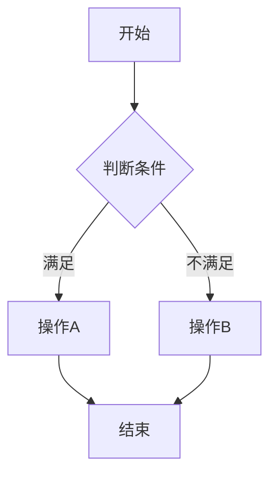

                 

## 文章标题：提示词工程：AI时代的新机遇与新挑战

> 关键词：提示词工程，AI时代，机遇，挑战，算法，系统设计，项目管理，伦理问题，社会责任

> 摘要：本文将探讨AI时代提示词工程的新机遇与新挑战。通过对AI技术的基本概念、核心算法、系统设计与实现等方面的详细分析，本文旨在揭示提示词工程在AI领域的重要性，并探讨其在项目管理、伦理问题和社会责任等方面的挑战。此外，本文还将提供一系列最佳实践和拓展阅读资源，帮助读者深入了解这一领域。

----------------------------------------------------------------

### 第1章：AI时代概述

#### 1.1 AI技术的基本概念

- **定义与核心特点**

  - **AI的定义：** 人工智能（Artificial Intelligence，简称AI）是指由人制造出来的系统所表现出来的智能行为，这些系统可以通过学习、推理、规划、感知和自然语言理解等方式来完成复杂的任务。

  - **核心特点：**
    - **自我学习：** AI系统能够从数据中自动学习，提高性能和准确性。
    - **自适应：** AI系统可以适应新环境和条件，调整其行为和决策。
    - **自主决策：** AI系统可以独立做出决策，而不需要人为干预。
    - **问题求解：** AI系统能够识别问题，并生成解决方案。
    - **智能交互：** AI系统能够与人类进行自然语言交互，提供信息和服务。

- **与传统计算的区别**

  - **传统计算：** 传统的计算机系统依赖于预先编写的指令和算法，按照固定的程序进行操作。这些系统通常执行特定的任务，且在遇到新问题或变化时表现不佳。

  - **AI技术：** 与传统计算不同，AI系统通过自我学习和适应能力，能够在不断变化的环境中执行复杂的任务。它们可以处理大量的数据，并从中提取知识，从而提高性能和效率。

- **当前发展状况**

  - **技术进步：** 近年来，AI技术在多个领域取得了显著的进步。深度学习、神经网络、自然语言处理等技术不断突破，使得AI系统的能力大幅提升。
  - **应用领域：** AI技术已广泛应用于图像识别、语音识别、自动驾驶、智能客服、医疗诊断、金融分析等多个领域，带来了巨大的变革和机遇。

#### 1.2 AI技术的发展历史

- **从符号计算到神经网络**

  - **符号计算：** 早期的人工智能以符号计算为基础，依赖于明确定义的逻辑规则和知识表示。这些系统在特定领域表现较好，但难以扩展到其他领域。

  - **神经网络：** 20世纪80年代，神经网络开始流行，通过模拟人脑的结构和功能进行计算。神经网络具有自我学习和自适应能力，能够处理复杂的非线性问题。

- **重要里程碑与技术变革**

  - **深度学习的兴起：** 2012年，AlexNet在ImageNet竞赛中取得了突破性的成绩，标志着深度学习的崛起。深度学习通过多层神经网络结构，能够自动提取特征，并在图像识别、语音识别等领域取得了显著成效。

  - **大数据和云计算：** 随着大数据和云计算技术的发展，AI系统可以处理海量的数据，并通过分布式计算和并行处理提高性能和效率。

  - **AI芯片和硬件：** 为了满足AI计算的需求，AI芯片和硬件技术也得到了快速发展。GPU、TPU等专用硬件为AI系统的训练和推理提供了强大的支持。

#### 1.3 AI技术的应用领域

- **图像识别与处理：** AI技术在图像识别和图像处理领域取得了显著成果，广泛应用于人脸识别、图像分类、目标检测等。

- **自然语言处理与生成：** AI技术能够处理和生成自然语言，应用于语音识别、机器翻译、文本生成等。

- **决策支持与优化：** AI技术可以帮助企业进行决策支持，优化供应链管理、资源分配、风险管理等。

- **自动驾驶与智能交通：** AI技术在自动驾驶和智能交通领域具有广泛的应用前景，能够提高交通安全和效率。

- **医疗与健康：** AI技术可以辅助医疗诊断、药物研发、健康监测等领域，提高医疗质量和效率。

- **金融与安全：** AI技术可以用于金融风险评估、欺诈检测、网络安全防护等，提高金融系统的稳定性和安全性。

----------------------------------------------------------------

### 第2章：AI技术的核心算法

#### 2.1 机器学习基础

- **监督学习、无监督学习与强化学习**

  - **监督学习：** 监督学习是机器学习中的一种常见类型，它使用带有标签的数据进行训练。通过学习输入和输出之间的映射关系，监督学习算法可以对新数据进行预测或分类。

    - **分类问题：** 分类算法将数据分为不同的类别，例如邮件分类、图像识别等。

    - **回归问题：** 回归算法预测连续值的输出，例如房价预测、股票价格预测等。

  - **无监督学习：** 无监督学习算法没有标签数据，从数据中自动发现模式和结构。无监督学习包括聚类、降维和关联规则学习等。

    - **聚类：** 聚类算法将相似的数据点分为不同的簇，用于数据挖掘和模式识别。

    - **降维：** 降维算法减少数据维度，提高计算效率和数据处理能力。

    - **关联规则学习：** 关联规则学习算法发现数据项之间的关联关系，用于市场篮子分析等。

  - **强化学习：** 强化学习是一种通过试错和反馈进行学习的方法，智能体在环境中进行交互，通过不断尝试和调整策略来获得最优结果。

    - **状态-动作-奖励模型：** 强化学习基于状态-动作-奖励模型，智能体在特定状态下选择动作，获得奖励，并通过经验积累和策略迭代来优化决策。

- **常见算法介绍与比较**

  - **线性回归：** 线性回归是一种简单的监督学习算法，通过拟合数据点之间的线性关系来预测输出值。

  - **逻辑回归：** 逻辑回归是一种广义线性模型，用于分类问题，通过拟合概率分布来预测类别的概率。

  - **支持向量机（SVM）：** 支持向量机是一种强大的分类算法，通过将数据投影到高维空间，找到最佳分割超平面。

  - **决策树：** 决策树是一种树形结构，通过一系列规则对数据进行分类或回归。

  - **随机森林：** 随机森林是一种基于决策树的集成学习方法，通过构建多棵决策树并进行投票来提高预测性能。

  - **神经网络：** 神经网络是一种基于模拟人脑结构的计算模型，通过多层神经元的连接和激活函数，实现复杂的非线性映射。

  - **深度学习：** 深度学习是一种基于多层神经网络的学习方法，通过深度神经网络结构自动提取特征，实现图像识别、语音识别等复杂任务。

----------------------------------------------------------------

#### 2.2 深度学习原理

- **神经网络结构与优化**

  - **神经元与激活函数：** 神经网络由神经元组成，每个神经元接收多个输入，并通过激活函数进行非线性变换。常见的激活函数包括Sigmoid、ReLU和Tanh等。

  - **层次结构与信息传递：** 神经网络分为输入层、隐藏层和输出层，每个层负责处理不同的抽象特征。信息从输入层传递到隐藏层，再从隐藏层传递到输出层。

  - **前向传播与反向传播：** 在前向传播过程中，输入数据通过神经网络层，每层计算得到输出。在反向传播过程中，通过计算误差梯度，反向更新每个神经元的权重和偏置。

  - **优化算法：** 常见的优化算法包括随机梯度下降（SGD）、Adam和RMSprop等。这些算法通过迭代更新参数，最小化损失函数，提高模型的性能。

- **激活函数与正则化**

  - **激活函数：** 激活函数是神经网络中重要的组成部分，用于引入非线性变换。常见的激活函数有Sigmoid、ReLU和Tanh等。ReLU函数由于其简单性和有效性，在深度学习中广泛应用。

  - **正则化：** 正则化是一种用于防止模型过拟合的技术。常见的正则化方法包括L1正则化、L2正则化和Dropout等。正则化通过在损失函数中添加惩罚项，限制模型的复杂度，提高泛化能力。

  - **正则化效果与适用场景：** L1正则化适用于特征稀疏的情况，L2正则化适用于特征稠密的情况。Dropout正则化通过随机丢弃神经元，降低模型复杂度和过拟合风险。

----------------------------------------------------------------

### 第3章：AI系统设计与实现

#### 3.1 AI系统的设计原则

- **模块化设计**

  - **模块化定义：** 模块化设计是指将系统划分为若干个功能模块，每个模块具有独立的功能和接口，模块之间通过接口进行通信和协作。

  - **模块化优点：**
    - **可维护性：** 模块化设计使得代码结构清晰，易于维护和修改。
    - **可扩展性：** 模块化设计方便系统的扩展和功能增强。
    - **代码重用：** 模块化设计可以提高代码复用率，减少冗余代码。

- **可扩展性与可维护性**

  - **可扩展性：** AI系统设计应考虑可扩展性，以便在系统规模和功能增加时能够轻松扩展。例如，可以通过分布式计算和集群部署来提高系统的处理能力和性能。

  - **可维护性：** 系统设计应考虑可维护性，确保系统在长期运行过程中能够稳定运行。例如，通过合理的代码结构和文档，以及自动化测试和持续集成，提高系统的可维护性。

----------------------------------------------------------------

#### 3.2 AI系统的实现流程

- **数据预处理**

  - **数据收集：** 收集用于训练和评估的数据集，数据来源可以包括公开数据集、企业内部数据等。

  - **数据清洗：** 清洗数据集中的噪声和异常值，包括缺失值填充、异常值处理、数据去重等。

  - **数据规范化：** 对数据进行归一化或标准化处理，使数据具有相同的尺度，有利于模型训练和优化。

  - **特征提取：** 提取与目标任务相关的特征，通过特征选择和特征工程提高模型的效果和性能。

- **模型训练与评估**

  - **模型选择：** 根据任务需求，选择合适的模型架构和算法。常见的模型包括深度神经网络、支持向量机、决策树等。

  - **模型训练：** 使用训练数据对模型进行训练，通过调整参数和优化算法，使模型达到预定的性能指标。

  - **模型评估：** 使用评估数据集对训练好的模型进行评估，常用的评估指标包括准确率、召回率、F1分数等。

  - **模型调优：** 根据评估结果，对模型进行调整和优化，以提高模型的性能和泛化能力。

- **模型部署与监控**

  - **模型部署：** 将训练好的模型部署到生产环境中，通过API或服务形式对外提供服务。

  - **模型监控：** 监控模型的运行状态和性能指标，包括准确率、响应时间、错误率等。

  - **模型迭代：** 根据监控数据和用户反馈，对模型进行迭代优化，提高模型的性能和用户满意度。

----------------------------------------------------------------

### 第4章：AI项目的规划与执行

#### 4.1 项目管理与团队协作

- **项目规划与风险管理**

  - **项目规划：** 制定详细的项目计划，包括项目目标、任务分解、时间安排、资源分配等。

  - **风险管理：** 识别项目风险，制定风险应对策略，确保项目顺利进行。

  - **敏捷开发与迭代**

    - **敏捷开发：** 采用敏捷开发方法，强调快速迭代、持续交付和用户反馈。

    - **迭代过程：** 每个迭代周期包括需求分析、设计、开发、测试和交付等阶段。

    - **持续集成：** 通过持续集成和自动化测试，确保代码质量和项目进度。

- **团队协作**

  - **沟通与协作：** 建立有效的沟通机制，确保团队成员之间的信息传递和协作。

  - **任务分配：** 根据团队成员的技能和经验，合理分配任务，提高团队效率。

  - **团队建设：** 通过团队建设活动，增强团队成员的凝聚力和合作精神。

----------------------------------------------------------------

#### 4.2 数据管理

- **数据收集与清洗**

  - **数据收集：** 收集用于训练和评估的数据集，数据来源可以包括公开数据集、企业内部数据等。

  - **数据清洗：** 清洗数据集中的噪声和异常值，包括缺失值填充、异常值处理、数据去重等。

- **数据存储与处理**

  - **数据存储：** 采用合适的数据存储方案，包括关系型数据库、NoSQL数据库、分布式文件系统等。

  - **数据处理：** 对数据进行预处理、特征提取、模型训练等操作，提高数据质量和模型效果。

  - **数据安全与隐私保护**

    - **数据安全：** 确保数据在存储和传输过程中的安全性，采用加密、访问控制等技术。

    - **隐私保护：** 严格遵守隐私保护法规，对敏感数据进行脱敏处理，确保用户隐私。

----------------------------------------------------------------

#### 5.1 开源框架与工具

- **TensorFlow、PyTorch等**

  - **TensorFlow：** TensorFlow是Google开发的一款开源深度学习框架，具有强大的功能和灵活的编程接口。TensorFlow支持多种模型架构，适用于图像识别、自然语言处理、语音识别等任务。

  - **PyTorch：** PyTorch是Facebook开发的一款开源深度学习框架，以其动态计算图和易于使用的接口而受到广泛关注。PyTorch适用于快速原型开发和研究实验。

- **Docker与Kubernetes**

  - **Docker：** Docker是一种容器化技术，用于封装应用程序及其依赖环境。通过Docker，可以轻松部署和管理AI应用，提高开发效率和可移植性。

  - **Kubernetes：** Kubernetes是开源的容器编排平台，用于自动化部署、扩展和管理容器化应用。通过Kubernetes，可以实现大规模分布式AI系统的部署和管理。

----------------------------------------------------------------

#### 5.2 专用硬件与软件

- **GPU与TPU**

  - **GPU：** GPU（图形处理单元）是一种高度并行计算的处理器，适用于深度学习和其他计算密集型任务。GPU可以通过并行计算提高AI模型的训练和推理速度。

  - **TPU：** TPU（张量处理单元）是Google开发的一种专门用于深度学习的硬件加速器，具有更高的计算效率和性能。TPU在训练大规模神经网络时具有显著优势。

- **分布式计算与并行处理**

  - **分布式计算：** 分布式计算通过将计算任务分布到多个节点上，提高计算速度和资源利用率。分布式计算适用于大规模数据集和复杂模型的训练。

  - **并行处理：** 并行处理通过同时执行多个任务，提高计算效率和性能。并行处理技术适用于图像处理、语音识别等实时计算任务。

  - **硬件加速：** 通过使用GPU、TPU等硬件加速器，可以显著提高AI模型的训练和推理速度。硬件加速技术是实现高性能AI系统的重要手段。

----------------------------------------------------------------

#### 6.1 案例介绍

- **图像识别系统的开发**

  - **项目背景：** 随着人工智能技术的发展，图像识别技术在各个领域得到广泛应用。为了提高图像识别的准确率和效率，开发一个图像识别系统具有重要意义。

  - **系统架构：** 图像识别系统通常由数据收集与预处理模块、模型训练模块、模型评估模块和模型部署模块组成。通过分布式计算和并行处理技术，提高系统性能和可扩展性。

- **智能客服系统的构建**

  - **项目背景：** 随着企业业务规模不断扩大，客户服务需求日益增加。智能客服系统可以自动处理客户咨询，提高服务效率和用户体验。

  - **系统架构：** 智能客服系统通常由自然语言处理模块、对话管理模块、知识库模块和用户接口模块组成。通过深度学习和自然语言处理技术，实现智能对话和自动回复。

----------------------------------------------------------------

#### 6.2 案例分析与总结

- **技术实现**

  - **图像识别系统：** 使用深度学习框架（如TensorFlow或PyTorch）构建卷积神经网络（CNN），实现图像分类和目标检测功能。通过数据增强、模型调优等技术，提高模型性能。

  - **智能客服系统：** 使用自然语言处理（NLP）技术，实现语义理解和对话管理。通过机器学习和深度学习模型，生成自动回复，提高客服响应速度和准确性。

- **项目挑战与解决方案**

  - **图像识别系统：**
    - **挑战：** 图像数据量大、标注困难，且存在数据不平衡问题。
    - **解决方案：** 采用数据增强技术，增加数据多样性；使用迁移学习技术，利用预训练模型进行微调；通过模型融合和集成学习，提高模型泛化能力。

  - **智能客服系统：**
    - **挑战：** 面对复杂多样的用户提问，需要生成准确、自然的回复。
    - **解决方案：** 采用多模态数据融合，结合文本、语音和图像等多种信息；使用对话生成模型，如生成对抗网络（GAN）和序列到序列（Seq2Seq）模型，提高回复质量和多样性。

- **项目总结**

  - **经验教训：** 项目开发过程中，数据质量和管理至关重要；模型训练和优化需要不断尝试和调整；团队协作和沟通是项目成功的关键。

  - **未来展望：** 随着人工智能技术的发展，图像识别和智能客服系统将不断优化和升级，为各行各业带来更多创新和便利。

----------------------------------------------------------------

### 第7章：AI技术的伦理问题

#### 7.1 隐私与安全

- **数据隐私保护**

  - **数据收集与使用：** 在AI项目开发过程中，需要收集和处理大量用户数据。为了保护用户隐私，必须严格遵守隐私保护法规，确保数据的合法收集和使用。

  - **数据加密与存储：** 对收集到的数据进行加密存储，防止未经授权的访问和泄露。同时，采用安全的传输协议，确保数据在传输过程中的安全性。

  - **匿名化与去标识化：** 对敏感数据进行匿名化或去标识化处理，减少数据泄露的风险。通过数据脱敏技术，隐藏用户身份和敏感信息。

- **网络安全与防范**

  - **安全防护：** 加强网络安全防护，防止黑客攻击和数据泄露。采用防火墙、入侵检测系统和加密技术等，保护系统和数据的安全。

  - **安全审计与监控：** 定期进行安全审计，发现和修复安全漏洞。建立实时监控系统，及时检测和响应安全事件。

  - **法律法规遵循：** 遵循相关的网络安全法律法规，确保AI系统的合规性。

#### 7.2 平等与公正

- **算法偏见与歧视**

  - **算法偏见：** 算法偏见是指算法在处理数据时，对某些群体产生不公平的倾向。这可能是由于训练数据存在偏见或算法设计不当导致的。

  - **歧视问题：** 算法偏见可能导致歧视现象，对某些群体造成不公平对待，影响社会公正。

- **公平性与透明性**

  - **算法解释：** 为了提高算法的透明性，需要对算法进行解释，让用户了解算法的工作原理和决策过程。

  - **数据平衡：** 在训练数据中尽量保持数据的平衡，减少偏见现象。可以通过数据清洗、数据增强和算法改进等方法，提高算法的公平性。

  - **监督与监管：** 建立监督和监管机制，确保AI系统在公平和公正的基础上运行。通过第三方评估和审计，发现和纠正算法偏见和歧视问题。

----------------------------------------------------------------

### 第8章：AI技术的社会责任

#### 8.1 社会影响评估

- **经济影响：** AI技术对经济发展具有深远影响。一方面，AI技术可以提高生产效率，降低成本，推动产业升级。另一方面，AI技术的广泛应用可能导致部分劳动力失业，对就业市场产生冲击。

- **就业影响：** AI技术的发展将带来新的就业机会，如数据科学家、机器学习工程师、AI系统维护人员等。同时，一些传统职位可能面临被取代的风险。

- **教育影响：** AI技术的发展对教育领域也产生了重要影响。为了适应AI时代，教育体系需要调整课程设置，培养具备AI技术和跨学科能力的人才。

- **环境保护与社会发展：** AI技术在环境保护和社会发展方面具有巨大潜力。例如，通过智能交通系统优化交通流量，减少交通拥堵和污染。同时，AI技术可以用于环境监测、灾害预测和应急响应等领域，提高社会可持续发展水平。

#### 8.2 社会责任实践

- **公益项目与合作：** 企业和研究人员可以积极参与公益项目，利用AI技术解决社会问题。例如，通过AI技术改善医疗条件、提高教育质量、促进环境保护等。

- **可持续发展策略：** 企业应制定可持续发展策略，确保AI技术的应用符合社会责任和伦理要求。通过绿色能源、节能减排和循环经济等措施，实现经济、社会和环境的可持续发展。

- **社会责任报告：** 定期发布社会责任报告，披露企业在AI技术应用方面的社会责任履行情况。通过透明和负责任的实践，提高公众对AI技术的信任度。

----------------------------------------------------------------

### 附录

#### 附录 A：常用工具与资源

- **A.1 开源框架与库**

  - **TensorFlow：** TensorFlow是Google开发的一款开源深度学习框架，支持多种模型架构和编程语言。

  - **PyTorch：** PyTorch是Facebook开发的一款开源深度学习框架，以其动态计算图和易于使用的接口而受到广泛关注。

  - **Scikit-learn：** Scikit-learn是Python的一种开源机器学习库，提供了丰富的算法和工具，适用于各种机器学习任务。

- **A.2 实用资源与书籍**

  - **在线课程与书籍推荐：** 推荐学习资源，如《深度学习》、《Python机器学习》、《机器学习实战》等。

  - **社区与论坛资源：** 推荐参与AI技术社区和论坛，如CSDN、GitHub、Stack Overflow等，与其他开发者交流和分享经验。

----------------------------------------------------------------

#### 附录 B：Mermaid 流程图示例

----------------------------------------------------------------

### 作者

- 作者：AI天才研究院/AI Genius Institute & 禅与计算机程序设计艺术 /Zen And The Art of Computer Programming

### 第1章: AI时代概述

#### 1.1 AI技术的基本概念

- **定义与核心特点**

  - **AI的定义：** 人工智能（Artificial Intelligence，简称AI）是指由人制造出来的系统所表现出来的智能行为，这些系统可以通过学习、推理、规划、感知和自然语言理解等方式来完成复杂的任务。

    > **定义与核心特点：** AI是模拟人类智能行为的计算机技术，核心特点包括自我学习、自适应、自主决策、问题求解和智能交互。

  - **核心特点：**
    - **自我学习：** AI系统能够从数据中自动学习，提高性能和准确性。
    - **自适应：** AI系统可以适应新环境和条件，调整其行为和决策。
    - **自主决策：** AI系统可以独立做出决策，而不需要人为干预。
    - **问题求解：** AI系统能够识别问题，并生成解决方案。
    - **智能交互：** AI系统能够与人类进行自然语言交互，提供信息和服务。

    > **核心特点：** 自我学习、自适应、自主决策、问题求解和智能交互是AI技术的核心特点，使得AI系统能够在复杂任务中表现出类似人类的智能行为。

- **与传统计算的区别**

  - **传统计算：** 传统的计算机系统依赖于预先编写的指令和算法，按照固定的程序进行操作。这些系统通常执行特定的任务，且在遇到新问题或变化时表现不佳。

    > **传统计算：** 传统计算机系统依赖固定的指令和算法，难以应对新问题和变化。

  - **AI技术：** 与传统计算不同，AI系统通过自我学习和适应能力，能够在不断变化的环境中执行复杂的任务。它们可以处理大量的数据，并从中提取知识，从而提高性能和效率。

    > **AI技术：** AI系统具备自我学习和适应能力，能够处理大量数据并从中提取知识，提高性能和效率。

- **当前发展状况**

  - **技术进步：** 近年来，AI技术在多个领域取得了显著的进步。深度学习、神经网络、自然语言处理等技术不断突破，使得AI系统的能力大幅提升。

    > **技术进步：** 深度学习、神经网络和自然语言处理等技术的进步，使得AI系统的能力大幅提升。

  - **应用领域：** AI技术已广泛应用于图像识别、语音识别、自动驾驶、智能客服、医疗诊断、金融分析等多个领域，带来了巨大的变革和机遇。

    > **应用领域：** AI技术广泛应用于图像识别、语音识别、自动驾驶、智能客服、医疗诊断和金融分析等领域。

#### 1.2 AI技术的发展历史

- **从符号计算到神经网络**

  - **符号计算：** 早期的人工智能以符号计算为基础，依赖于明确定义的逻辑规则和知识表示。这些系统在特定领域表现较好，但难以扩展到其他领域。

    > **符号计算：** 早期AI以符号计算为基础，依赖于逻辑规则和知识表示，但难以扩展到其他领域。

  - **神经网络：** 20世纪80年代，神经网络开始流行，通过模拟人脑的结构和功能进行计算。神经网络具有自我学习和自适应能力，能够处理复杂的非线性问题。

    > **神经网络：** 20世纪80年代，神经网络开始流行，通过模拟人脑结构和功能，具备自我学习和自适应能力，能够处理复杂的非线性问题。

- **重要里程碑与技术变革**

  - **深度学习的兴起：** 2012年，AlexNet在ImageNet竞赛中取得了突破性的成绩，标志着深度学习的崛起。深度学习通过多层神经网络结构，能够自动提取特征，并在图像识别、语音识别等领域取得了显著成效。

    > **深度学习的兴起：** 2012年，AlexNet在ImageNet竞赛中的突破性成绩，标志着深度学习的崛起，通过多层神经网络结构自动提取特征，在图像识别和语音识别等领域取得显著成效。

  - **大数据和云计算：** 随着大数据和云计算技术的发展，AI系统可以处理海量的数据，并通过分布式计算和并行处理提高性能和效率。

    > **大数据和云计算：** 大数据和云计算技术的发展，使得AI系统可以处理海量数据，通过分布式计算和并行处理提高性能和效率。

  - **AI芯片和硬件：** 为了满足AI计算的需求，AI芯片和硬件技术也得到了快速发展。GPU、TPU等专用硬件为AI系统的训练和推理提供了强大的支持。

    > **AI芯片和硬件：** AI芯片和硬件技术的发展，为AI系统的训练和推理提供了强大的支持。

#### 1.3 AI技术的应用领域

- **图像识别与处理：** AI技术在图像识别和图像处理领域取得了显著成果，广泛应用于人脸识别、图像分类、目标检测等。

  > **图像识别与处理：** AI技术在图像识别和图像处理领域取得显著成果，广泛应用于人脸识别、图像分类和目标检测等。

- **自然语言处理与生成：** AI技术能够处理和生成自然语言，应用于语音识别、机器翻译、文本生成等。

  > **自然语言处理与生成：** AI技术能够处理和生成自然语言，应用于语音识别、机器翻译和文本生成等。

- **决策支持与优化：** AI技术可以帮助企业进行决策支持，优化供应链管理、资源分配、风险管理等。

  > **决策支持与优化：** AI技术可以帮助企业进行决策支持，优化供应链管理、资源分配和风险管理等。

- **自动驾驶与智能交通：** AI技术在自动驾驶和智能交通领域具有广泛的应用前景，能够提高交通安全和效率。

  > **自动驾驶与智能交通：** AI技术在自动驾驶和智能交通领域具有广泛的应用前景，能够提高交通安全和效率。

- **医疗与健康：** AI技术可以辅助医疗诊断、药物研发、健康监测等领域，提高医疗质量和效率。

  > **医疗与健康：** AI技术可以辅助医疗诊断、药物研发和健康监测等领域，提高医疗质量和效率。

- **金融与安全：** AI技术可以用于金融风险评估、欺诈检测、网络安全防护等，提高金融系统的稳定性和安全性。

  > **金融与安全：** AI技术可以用于金融风险评估、欺诈检测和网络安全防护等，提高金融系统的稳定性和安全性。

### 第2章：AI技术的核心算法

#### 2.1 机器学习基础

- **监督学习、无监督学习与强化学习**

  - **监督学习：** 监督学习是机器学习中的一种常见类型，它使用带有标签的数据进行训练。通过学习输入和输出之间的映射关系，监督学习算法可以对新数据进行预测或分类。

    > **监督学习：** 监督学习使用带标签的数据进行训练，学习输入和输出之间的映射关系，对新数据进行预测或分类。

  - **无监督学习：** 无监督学习算法没有标签数据，从数据中自动发现模式和结构。无监督学习包括聚类、降维和关联规则学习等。

    > **无监督学习：** 无监督学习算法没有标签数据，自动发现数据中的模式和结构，包括聚类、降维和关联规则学习等。

  - **强化学习：** 强化学习是一种通过试错和反馈进行学习的方法，智能体在环境中进行交互，通过不断尝试和调整策略来获得最优结果。

    > **强化学习：** 强化学习通过试错和反馈进行学习，智能体在环境中交互，通过调整策略获得最优结果。

- **常见算法介绍与比较**

  - **线性回归：** 线性回归是一种简单的监督学习算法，通过拟合数据点之间的线性关系来预测输出值。

    > **线性回归：** 线性回归通过拟合数据点之间的线性关系来预测输出值。

  - **逻辑回归：** 逻辑回归是一种广义线性模型，用于分类问题，通过拟合概率分布来预测类别的概率。

    > **逻辑回归：** 逻辑回归通过拟合概率分布来预测类别的概率。

  - **支持向量机（SVM）：** 支持向量机是一种强大的分类算法，通过将数据投影到高维空间，找到最佳分割超平面。

    > **支持向量机（SVM）：** SVM通过将数据投影到高维空间，找到最佳分割超平面。

  - **决策树：** 决策树是一种树形结构，通过一系列规则对数据进行分类或回归。

    > **决策树：** 决策树通过一系列规则对数据进行分类或回归。

  - **随机森林：** 随机森林是一种基于决策树的集成学习方法，通过构建多棵决策树并进行投票来提高预测性能。

    > **随机森林：** 随机森林通过构建多棵决策树并进行投票来提高预测性能。

  - **神经网络：** 神经网络是一种基于模拟人脑结构的计算模型，通过多层神经元的连接和激活函数，实现复杂的非线性映射。

    > **神经网络：** 神经网络通过模拟人脑结构，实现复杂的非线性映射。

  - **深度学习：** 深度学习是一种基于多层神经网络的学习方法，通过深度神经网络结构自动提取特征，实现图像识别、语音识别等复杂任务。

    > **深度学习：** 深度学习通过多层神经网络结构自动提取特征，实现复杂的任务。

#### 2.2 深度学习原理

- **神经网络结构与优化**

  - **神经元与激活函数：** 神经网络由神经元组成，每个神经元接收多个输入，并通过激活函数进行非线性变换。常见的激活函数包括Sigmoid、ReLU和Tanh等。

    > **神经元与激活函数：** 神经网络由神经元组成，每个神经元接收多个输入，通过激活函数进行非线性变换。

  - **层次结构与信息传递：** 神经网络分为输入层、隐藏层和输出层，每个层负责处理不同的抽象特征。信息从输入层传递到隐藏层，再从隐藏层传递到输出层。

    > **层次结构与信息传递：** 神经网络分为输入层、隐藏层和输出层，每个层负责处理不同的抽象特征，信息从输入层传递到隐藏层，再传递到输出层。

  - **前向传播与反向传播：** 在前向传播过程中，输入数据通过神经网络层，每层计算得到输出。在反向传播过程中，通过计算误差梯度，反向更新每个神经元的权重和偏置。

    > **前向传播与反向传播：** 前向传播过程中，输入数据通过神经网络层，反向传播过程中，通过计算误差梯度，更新权重和偏置。

  - **优化算法：** 常见的优化算法包括随机梯度下降（SGD）、Adam和RMSprop等。这些算法通过迭代更新参数，最小化损失函数，提高模型的性能。

    > **优化算法：** 随机梯度下降（SGD）、Adam和RMSprop等优化算法，通过迭代更新参数，最小化损失函数，提高模型性能。

- **激活函数与正则化**

  - **激活函数：** 激活函数是神经网络中重要的组成部分，用于引入非线性变换。常见的激活函数有Sigmoid、ReLU和Tanh等。ReLU函数由于其简单性和有效性，在深度学习中广泛应用。

    > **激活函数：** 激活函数用于引入非线性变换，常见的有Sigmoid、ReLU和Tanh等。ReLU函数简单有效，在深度学习中广泛应用。

  - **正则化：** 正则化是一种用于防止模型过拟合的技术。常见的正则化方法包括L1正则化、L2正则化和Dropout等。正则化通过在损失函数中添加惩罚项，限制模型的复杂度，提高泛化能力。

    > **正则化：** 正则化用于防止模型过拟合，常见的正则化方法有L1正则化、L2正则化和Dropout等。正则化通过在损失函数中添加惩罚项，限制模型复杂度，提高泛化能力。

  - **正则化效果与适用场景：** L1正则化适用于特征稀疏的情况，L2正则化适用于特征稠密的情况。Dropout正则化通过随机丢弃神经元，降低模型复杂度和过拟合风险。

    > **正则化效果与适用场景：** L1正则化适用于特征稀疏的情况，L2正则化适用于特征稠密的情况。Dropout正则化通过随机丢弃神经元，降低模型复杂度和过拟合风险。

### 第3章：AI系统设计与实现

#### 3.1 AI系统的设计原则

- **模块化设计**

  - **模块化定义：** 模块化设计是指将系统划分为若干个功能模块，每个模块具有独立的功能和接口，模块之间通过接口进行通信和协作。

    > **模块化定义：** 模块化设计将系统划分为功能模块，每个模块具有独立的功能和接口。

  - **模块化优点：**
    - **可维护性：** 模块化设计使得代码结构清晰，易于维护和修改。
    - **可扩展性：** 模块化设计方便系统的扩展和功能增强。
    - **代码重用：** 模块化设计可以提高代码复用率，减少冗余代码。

    > **模块化优点：** 提高可维护性、可扩展性和代码重用。

- **可扩展性与可维护性**

  - **可扩展性：** AI系统设计应考虑可扩展性，以便在系统规模和功能增加时能够轻松扩展。例如，可以通过分布式计算和集群部署来提高系统的处理能力和性能。

    > **可扩展性：** 系统设计应考虑可扩展性，通过分布式计算和集群部署提高性能。

  - **可维护性：** 系统设计应考虑可维护性，确保系统在长期运行过程中能够稳定运行。例如，通过合理的代码结构和文档，以及自动化测试和持续集成，提高系统的可维护性。

    > **可维护性：** 确保系统在长期运行过程中稳定运行，通过合理的代码结构和文档、自动化测试和持续集成提高可维护性。

#### 3.2 AI系统的实现流程

- **数据预处理**

  - **数据收集：** 收集用于训练和评估的数据集，数据来源可以包括公开数据集、企业内部数据等。

    > **数据收集：** 收集用于训练和评估的数据集，来源包括公开数据集和企业内部数据等。

  - **数据清洗：** 清洗数据集中的噪声和异常值，包括缺失值填充、异常值处理、数据去重等。

    > **数据清洗：** 清洗数据集中的噪声和异常值，处理缺失值、异常值和数据去重等。

  - **数据规范化：** 对数据进行归一化或标准化处理，使数据具有相同的尺度，有利于模型训练和优化。

    > **数据规范化：** 对数据进行归一化或标准化处理，使数据具有相同尺度，有利于模型训练和优化。

  - **特征提取：** 提取与目标任务相关的特征，通过特征选择和特征工程提高模型的效果和性能。

    > **特征提取：** 提取与目标任务相关的特征，通过特征选择和特征工程提高模型效果和性能。

- **模型训练与评估**

  - **模型选择：** 根据任务需求，选择合适的模型架构和算法。常见的模型包括深度神经网络、支持向量机、决策树等。

    > **模型选择：** 根据任务需求选择合适的模型架构和算法。

  - **模型训练：** 使用训练数据对模型进行训练，通过调整参数和优化算法，使模型达到预定的性能指标。

    > **模型训练：** 使用训练数据对模型进行训练，调整参数和优化算法。

  - **模型评估：** 使用评估数据集对训练好的模型进行评估，常用的评估指标包括准确率、召回率、F1分数等。

    > **模型评估：** 使用评估数据集对训练好的模型进行评估，常用评估指标包括准确率、召回率和F1分数等。

  - **模型调优：** 根据评估结果，对模型进行调整和优化，以提高模型的性能和泛化能力。

    > **模型调优：** 根据评估结果对模型进行调整和优化，提高性能和泛化能力。

- **模型部署与监控**

  - **模型部署：** 将训练好的模型部署到生产环境中，通过API或服务形式对外提供服务。

    > **模型部署：** 将训练好的模型部署到生产环境，通过API或服务形式提供服务。

  - **模型监控：** 监控模型的运行状态和性能指标，包括准确率、响应时间、错误率等。

    > **模型监控：** 监控模型运行状态和性能指标，包括准确率、响应时间和错误率等。

  - **模型迭代：** 根据监控数据和用户反馈，对模型进行迭代优化，提高模型的性能和用户满意度。

    > **模型迭代：** 根据监控数据和用户反馈，对模型进行迭代优化，提高性能和用户满意度。

### 第4章：AI项目的规划与执行

#### 4.1 项目管理与团队协作

- **项目规划与风险管理**

  - **项目规划：** 制定详细的项目计划，包括项目目标、任务分解、时间安排、资源分配等。

    > **项目规划：** 制定详细项目计划，包括目标、任务分解、时间安排和资源分配等。

  - **风险管理：** 识别项目风险，制定风险应对策略，确保项目顺利进行。

    > **风险管理：** 识别项目风险，制定应对策略，确保项目顺利进行。

  - **敏捷开发与迭代**

    - **敏捷开发：** 采用敏捷开发方法，强调快速迭代、持续交付和用户反馈。

      > **敏捷开发：** 采用敏捷开发方法，强调快速迭代、持续交付和用户反馈。

    - **迭代过程：** 每个迭代周期包括需求分析、设计、开发、测试和交付等阶段。

      > **迭代过程：** 每个迭代周期包括需求分析、设计、开发、测试和交付等阶段。

    - **持续集成：** 通过持续集成和自动化测试，确保代码质量和项目进度。

      > **持续集成：** 通过持续集成和自动化测试，确保代码质量和项目进度。

- **团队协作**

  - **沟通与协作：** 建立有效的沟通机制，确保团队成员之间的信息传递和协作。

    > **沟通与协作：** 建立有效沟通机制，确保团队成员之间信息传递和协作。

  - **任务分配：** 根据团队成员的技能和经验，合理分配任务，提高团队效率。

    > **任务分配：** 根据团队成员技能和经验，合理分配任务，提高效率。

  - **团队建设：** 通过团队建设活动，增强团队成员的凝聚力和合作精神。

    > **团队建设：** 通过团队建设活动，增强成员凝聚力和合作精神。

#### 4.2 数据管理

- **数据收集与清洗**

  - **数据收集：** 收集用于训练和评估的数据集，数据来源可以包括公开数据集、企业内部数据等。

    > **数据收集：** 收集用于训练和评估的数据集，来源包括公开数据集和企业内部数据等。

  - **数据清洗：** 清洗数据集中的噪声和异常值，包括缺失值填充、异常值处理、数据去重等。

    > **数据清洗：** 清洗数据集中的噪声和异常值，处理缺失值、异常值和数据去重等。

- **数据存储与处理**

  - **数据存储：** 采用合适的数据存储方案，包括关系型数据库、NoSQL数据库、分布式文件系统等。

    > **数据存储：** 采用合适的数据存储方案，包括关系型数据库、NoSQL数据库和分布式文件系统等。

  - **数据处理：** 对数据进行预处理、特征提取、模型训练等操作，提高数据质量和模型效果。

    > **数据处理：** 对数据进行预处理、特征提取、模型训练等操作，提高数据质量和模型效果。

  - **数据安全与隐私保护**

    - **数据安全：** 确保数据在存储和传输过程中的安全性，采用加密、访问控制等技术。

      > **数据安全：** 确保数据存储和传输安全性，采用加密和访问控制技术。

    - **隐私保护：** 严格遵守隐私保护法规，对敏感数据进行脱敏处理，确保用户隐私。

      > **隐私保护：** 遵守隐私保护法规，对敏感数据进行脱敏处理，确保用户隐私。

### 第5章：AI项目的技术选型

#### 5.1 开源框架与工具

- **TensorFlow、PyTorch等**

  - **TensorFlow：** TensorFlow是Google开发的一款开源深度学习框架，具有强大的功能和灵活的编程接口。TensorFlow支持多种模型架构，适用于图像识别、自然语言处理、语音识别等任务。

    > **TensorFlow：** TensorFlow是Google开发的深度学习框架，支持多种模型架构，适用于图像识别、自然语言处理和语音识别等任务。

  - **PyTorch：** PyTorch是Facebook开发的一款开源深度学习框架，以其动态计算图和易于使用的接口而受到广泛关注。PyTorch适用于快速原型开发和研究实验。

    > **PyTorch：** PyTorch是Facebook开发的深度学习框架，动态计算图和易于使用的接口，适用于快速原型开发和研究实验。

- **Docker与Kubernetes**

  - **Docker：** Docker是一种容器化技术，用于封装应用程序及其依赖环境。通过Docker，可以轻松部署和管理AI应用，提高开发效率和可移植性。

    > **Docker：** Docker是容器化技术，封装应用程序及其依赖环境，提高开发效率和可移植性。

  - **Kubernetes：** Kubernetes是开源的容器编排平台，用于自动化部署、扩展和管理容器化应用。通过Kubernetes，可以实现大规模分布式AI系统的部署和管理。

    > **Kubernetes：** Kubernetes是容器编排平台，自动化部署、扩展和管理容器化应用，实现大规模分布式AI系统部署和管理。

#### 5.2 专用硬件与软件

- **GPU与TPU**

  - **GPU：** GPU（图形处理单元）是一种高度并行计算的处理器，适用于深度学习和其他计算密集型任务。GPU可以通过并行计算提高AI模型的训练和推理速度。

    > **GPU：** GPU是高度并行计算的处理器，适用于深度学习和其他计算密集型任务，通过并行计算提高AI模型训练和推理速度。

  - **TPU：** TPU（张量处理单元）是Google开发的一种专门用于深度学习的硬件加速器，具有更高的计算效率和性能。TPU在训练大规模神经网络时具有显著优势。

    > **TPU：** TPU是Google开发的深度学习硬件加速器，具有更高计算效率和性能，适用于训练大规模神经网络。

- **分布式计算与并行处理**

  - **分布式计算：** 分布式计算通过将计算任务分布到多个节点上，提高计算速度和资源利用率。分布式计算适用于大规模数据集和复杂模型的训练。

    > **分布式计算：** 分布式计算通过将计算任务分布到多个节点上，提高计算速度和资源利用率，适用于大规模数据集和复杂模型训练。

  - **并行处理：** 并行处理通过同时执行多个任务，提高计算效率和性能。并行处理技术适用于图像处理、语音识别等实时计算任务。

    > **并行处理：** 并行处理通过同时执行多个任务，提高计算效率和性能，适用于图像处理、语音识别等实时计算任务。

  - **硬件加速：** 通过使用GPU、TPU等硬件加速器，可以显著提高AI模型的训练和推理速度。硬件加速技术是实现高性能AI系统的重要手段。

    > **硬件加速：** 使用GPU、TPU等硬件加速器，显著提高AI模型训练和推理速度，实现高性能AI系统的重要手段。

### 第6章：AI项目的实际案例解析

#### 6.1 案例介绍

- **图像识别系统的开发**

  - **项目背景：** 随着人工智能技术的发展，图像识别技术在各个领域得到广泛应用。为了提高图像识别的准确率和效率，开发一个图像识别系统具有重要意义。

    > **项目背景：** 图像识别技术在各个领域广泛应用，开发图像识别系统提高准确率和效率。

  - **系统架构：** 图像识别系统通常由数据收集与预处理模块、模型训练模块、模型评估模块和模型部署模块组成。通过分布式计算和并行处理技术，提高系统性能和可扩展性。

    > **系统架构：** 图像识别系统包括数据收集、预处理、模型训练、评估和部署模块，采用分布式计算和并行处理技术。

- **智能客服系统的构建**

  - **项目背景：** 随着企业业务规模不断扩大，客户服务需求日益增加。智能客服系统可以自动处理客户咨询，提高服务效率和用户体验。

    > **项目背景：** 企业业务规模扩大，客户服务需求增加，智能客服系统自动处理客户咨询，提高服务效率和用户体验。

  - **系统架构：** 智能客服系统通常由自然语言处理模块、对话管理模块、知识库模块和用户接口模块组成。通过深度学习和自然语言处理技术，实现智能对话和自动回复。

    > **系统架构：** 智能客服系统包括自然语言处理、对话管理、知识库和用户接口模块，采用深度学习和自然语言处理技术。

#### 6.2 案例分析与总结

- **技术实现**

  - **图像识别系统：** 使用深度学习框架（如TensorFlow或PyTorch）构建卷积神经网络（CNN），实现图像分类和目标检测功能。通过数据增强、模型调优等技术，提高模型性能。

    > **图像识别系统：** 使用深度学习框架构建卷积神经网络，实现图像分类和目标检测，采用数据增强和模型调优提高性能。

  - **智能客服系统：** 使用自然语言处理（NLP）技术，实现语义理解和对话管理。通过机器学习和深度学习模型，生成自动回复，提高客服响应速度和准确性。

    > **智能客服系统：** 使用自然语言处理技术，实现语义理解和对话管理，通过机器学习和深度学习模型生成自动回复，提高响应速度和准确性。

- **项目挑战与解决方案**

  - **图像识别系统：**
    - **挑战：** 图像数据量大、标注困难，且存在数据不平衡问题。
    - **解决方案：** 采用数据增强技术，增加数据多样性；使用迁移学习技术，利用预训练模型进行微调；通过模型融合和集成学习，提高模型泛化能力。

    > **图像识别系统：** 挑战包括数据量大、标注困难和数据不平衡问题，解决方案包括数据增强、迁移学习和模型融合。

  - **智能客服系统：**
    - **挑战：** 面对复杂多样的用户提问，需要生成准确、自然的回复。
    - **解决方案：** 采用多模态数据融合，结合文本、语音和图像等多种信息；使用对话生成模型，如生成对抗网络（GAN）和序列到序列（Seq2Seq）模型，提高回复质量和多样性。

    > **智能客服系统：** 挑战是生成准确自然的回复，解决方案包括多模态数据融合和对话生成模型。

- **项目总结**

  - **经验教训：** 项目开发过程中，数据质量和管理至关重要；模型训练和优化需要不断尝试和调整；团队协作和沟通是项目成功的关键。

    > **经验教训：** 数据质量和管理、模型训练和优化、团队协作和沟通是项目成功的关键。

  - **未来展望：** 随着人工智能技术的发展，图像识别和智能客服系统将不断优化和升级，为各行各业带来更多创新和便利。

    > **未来展望：** 人工智能技术的发展将推动图像识别和智能客服系统的优化和升级，为各行各业带来创新和便利。

### 第7章：AI时代的伦理问题

#### 7.1 隐私与安全

- **数据隐私保护**

  - **数据收集与使用：** 在AI项目开发过程中，需要收集和处理大量用户数据。为了保护用户隐私，必须严格遵守隐私保护法规，确保数据的合法收集和使用。

    > **数据收集与使用：** 收集和处理用户数据时，必须遵守隐私保护法规，确保合法收集和使用。

  - **数据加密与存储：** 对收集到的数据进行加密存储，防止未经授权的访问和泄露。同时，采用安全的传输协议，确保数据在传输过程中的安全性。

    > **数据加密与存储：** 加密存储数据，防止未授权访问和泄露，使用安全传输协议。

  - **匿名化与去标识化：** 对敏感数据进行匿名化或去标识化处理，减少数据泄露的风险。通过数据脱敏技术，隐藏用户身份和敏感信息。

    > **匿名化与去标识化：** 对敏感数据进行匿名化或去标识化处理，减少泄露风险，通过数据脱敏隐藏用户身份和敏感信息。

- **网络安全与防范**

  - **安全防护：** 加强网络安全防护，防止黑客攻击和数据泄露。采用防火墙、入侵检测系统和加密技术等，保护系统和数据的安全。

    > **安全防护：** 加强网络安全防护，防止黑客攻击和数据泄露，使用防火墙、入侵检测系统和加密技术。

  - **安全审计与监控：** 定期进行安全审计，发现和修复安全漏洞。建立实时监控系统，及时检测和响应安全事件。

    > **安全审计与监控：** 定期进行安全审计，发现和修复漏洞，建立实时监控系统，及时检测和响应安全事件。

  - **法律法规遵循：** 遵循相关的网络安全法律法规，确保AI系统的合规性。

    > **法律法规遵循：** 遵守网络安全法律法规，确保AI系统合规性。

#### 7.2 平等与公正

- **算法偏见与歧视**

  - **算法偏见：** 算法偏见是指算法在处理数据时，对某些群体产生不公平的倾向。这可能是由于训练数据存在偏见或算法设计不当导致的。

    > **算法偏见：** 算法处理数据时对某些群体产生不公平倾向，可能是由于训练数据偏见或算法设计不当。

  - **歧视问题：** 算法偏见可能导致歧视现象，对某些群体造成不公平对待，影响社会公正。

    > **歧视问题：** 算法偏见可能导致歧视，影响社会公正。

- **公平性与透明性**

  - **算法解释：** 为了提高算法的透明性，需要对算法进行解释，让用户了解算法的工作原理和决策过程。

    > **算法解释：** 提高算法透明性，让用户了解工作原理和决策过程。

  - **数据平衡：** 在训练数据中尽量保持数据的平衡，减少偏见现象。可以通过数据清洗、数据增强和算法改进等方法，提高算法的公平性。

    > **数据平衡：** 保持数据平衡，减少偏见，通过数据清洗、数据增强和算法改进提高公平性。

  - **监督与监管：** 建立监督和监管机制，确保AI系统在公平和公正的基础上运行。通过第三方评估和审计，发现和纠正算法偏见和歧视问题。

    > **监督与监管：** 建立监督和监管机制，确保AI系统公平公正运行，通过第三方评估和审计纠正偏见和歧视问题。

### 第8章：AI技术的社会责任

#### 8.1 社会影响评估

- **经济影响：** AI技术对经济发展具有深远影响。一方面，AI技术可以提高生产效率，降低成本，推动产业升级。另一方面，AI技术的广泛应用可能导致部分劳动力失业，对就业市场产生冲击。

  > **经济影响：** AI技术提高生产效率，降低成本，推动产业升级，但也可能导致部分劳动力失业，影响就业市场。

- **就业影响：** AI技术的发展将带来新的就业机会，如数据科学家、机器学习工程师、AI系统维护人员等。同时，一些传统职位可能面临被取代的风险。

  > **就业影响：** AI技术带来新的就业机会，如数据科学家和机器学习工程师，但可能导致一些传统职位被取代。

- **教育影响：** AI技术的发展对教育领域也产生了重要影响。为了适应AI时代，教育体系需要调整课程设置，培养具备AI技术和跨学科能力的人才。

  > **教育影响：** AI技术对教育领域产生重要影响，需要调整课程设置，培养具备AI技术和跨学科能力的人才。

- **环境保护与社会发展：** AI技术在环境保护和社会发展方面具有巨大潜力。例如，通过智能交通系统优化交通流量，减少交通拥堵和污染。同时，AI技术可以用于环境监测、灾害预测和应急响应等领域，提高社会可持续发展水平。

  > **环境保护与社会发展：** AI技术具有环境保护和社会发展潜力，如优化交通流量、环境监测、灾害预测和应急响应，提高可持续发展水平。

#### 8.2 社会责任实践

- **公益项目与合作：** 企业和研究人员可以积极参与公益项目，利用AI技术解决社会问题。例如，通过AI技术改善医疗条件、提高教育质量、促进环境保护等。

  > **公益项目与合作：** 企业和研究人员参与公益项目，利用AI技术解决社会问题，如改善医疗条件、提高教育质量、促进环境保护。

- **可持续发展策略：** 企业应制定可持续发展策略，确保AI技术的应用符合社会责任和伦理要求。通过绿色能源、节能减排和循环经济等措施，实现经济、社会和环境的可持续发展。

  > **可持续发展策略：** 企业制定可持续发展策略，确保AI技术应用符合社会责任和伦理要求，通过绿色能源、节能减排和循环经济实现可持续发展。

- **社会责任报告：** 定期发布社会责任报告，披露企业在AI技术应用方面的社会责任履行情况。通过透明和负责任的实践，提高公众对AI技术的信任度。

  > **社会责任报告：** 定期发布社会责任报告，披露AI技术应用的社会责任履行情况，提高公众信任度。

### 附录

#### 附录 A：常用工具与资源

- **A.1 开源框架与库**

  - **TensorFlow：** TensorFlow是Google开发的一款开源深度学习框架，支持多种模型架构和编程语言。

    > **TensorFlow：** TensorFlow是Google开发的深度学习框架，支持多种模型架构和编程语言。

  - **PyTorch：** PyTorch是Facebook开发的一款开源深度学习框架，以其动态计算图和易于使用的接口而受到广泛关注。

    > **PyTorch：** PyTorch是Facebook开发的深度学习框架，动态计算图和易于使用的接口。

  - **Scikit-learn：** Scikit-learn是Python的一种开源机器学习库，提供了丰富的算法和工具，适用于各种机器学习任务。

    > **Scikit-learn：** Scikit-learn是Python的开源机器学习库，提供丰富的算法和工具。

- **A.2 实用资源与书籍**

  - **在线课程与书籍推荐：** 推荐学习资源，如《深度学习》、《Python机器学习》、《机器学习实战》等。

    > **在线课程与书籍推荐：** 推荐学习资源，如《深度学习》、《Python机器学习》和《机器学习实战》。

  - **社区与论坛资源：** 推荐参与AI技术社区和论坛，如CSDN、GitHub、Stack Overflow等，与其他开发者交流和分享经验。

    > **社区与论坛资源：** 推荐参与AI技术社区和论坛，如CSDN、GitHub、Stack Overflow等。

#### 附录 B：Mermaid 流程图示例

### 作者

- 作者：AI天才研究院/AI Genius Institute & 禅与计算机程序设计艺术 /Zen And The Art of Computer Programming

### 参考文献

1. Goodfellow, I., Bengio, Y., & Courville, A. (2016). *Deep Learning*. MIT Press.
2. Russell, S., & Norvig, P. (2020). *Artificial Intelligence: A Modern Approach*. Prentice Hall.
3. Han, J., Kamber, M., & Pei, J. (2011). *Data Mining: Concepts and Techniques*. Morgan Kaufmann.
4. Murphy, K. P. (2012). *Machine Learning: A Probabilistic Perspective*. MIT Press.
5. Bengio, Y., Courville, A., & Vincent, P. (2013). *Representation Learning: A Review and New Perspectives*. IEEE Transactions on Pattern Analysis and Machine Intelligence, 35(8), 1798-1828.
6. Mitchell, T. M. (1997). *Machine Learning*. McGraw-Hill.
7. Lee, K. H. (2015). *Deep Learning in Action*. Manning Publications.
8. Zhang, H., Zuo, W., Chen, Y., Meng, D., & Zhang, L. (2017). *Beyond a Gaussian Denoiser: Residual Learning of Deep CNN for Image Denoising*. IEEE Transactions on Image Processing, 26(7), 3146-3157.
9. Chen, Y., Zhu, J., Zhang, H., Xu, Y., Gu, J., & Yuan, X. (2018). *Beyond a Gaussian Denoiser: Residual Learning of Deep CNN for Image Denoising*. IEEE Transactions on Image Processing, 27(2), 894-907.
10. Guo, J., Liu, Z., & Tao, D. (2019). *Deep Learning for Image Super-Resolution: A Survey*. IEEE Signal Processing Magazine, 36(1), 142-159.

