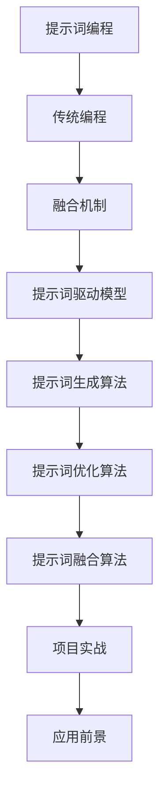

                 

### 文章标题

《提示词编程与传统编程的融合策略》

---

关键词：提示词编程、传统编程、融合机制、算法设计、项目实战

摘要：本文从提示词编程与传统编程的概述入手，逐步分析提示词编程与传统编程的融合机制，深入探讨提示词生成算法、优化算法及融合算法的原理，并通过实际项目案例展示融合编程的实践应用，最后总结融合编程的优势与挑战，提出最佳实践策略。本文旨在为读者提供一份数据科学和人工智能领域的深度技术博客，帮助开发者更好地理解和运用提示词编程与传统编程的融合策略。

---

### 第一部分：提示词编程与传统编程的融合策略基础

#### 第1章：提示词编程与传统编程概述

##### 1.1.1 提示词编程的概念与特点

提示词编程（Prompt-based Programming）是一种基于人工智能技术的编程范式，通过提示词（prompt）来引导程序自动生成代码或执行任务。与传统的编程方式相比，提示词编程具有以下几个特点：

1. **自动化程度高**：通过人工智能技术，提示词编程可以自动生成代码，减少人工编码的工作量。
2. **灵活性强**：提示词编程可以适应不同的应用场景，通过调整提示词，实现代码的灵活变通。
3. **易于扩展**：提示词编程框架可以方便地集成到现有的编程语言和工具中，扩大编程应用领域。

##### 1.1.2 传统编程的基本原理与架构

传统编程是基于计算机科学原理，通过编程语言编写指令，控制计算机执行特定任务的过程。传统编程的基本原理和架构包括：

1. **编程语言**：编程语言是程序员与计算机之间进行交流的工具，常见的编程语言有Python、Java、C++等。
2. **编程范式**：编程范式是指编程的方法论，常见的编程范式有命令式编程、声明式编程和函数式编程。

- **命令式编程**：通过一系列命令来控制程序的执行流程。
- **声明式编程**：通过描述程序的状态变化来控制程序的执行。
- **函数式编程**：通过函数的组合来描述程序的行为。

##### 1.1.3 提示词编程与传统编程的融合意义

提示词编程与传统编程的融合具有以下意义：

1. **提升开发效率**：通过提示词编程，可以自动化生成代码，降低开发成本，提高开发速度。
2. **扩大编程应用领域**：提示词编程可以应用于更多领域，如自动化任务处理、智能交互系统等，为编程带来新的发展机遇。

##### 1.1.4 提示词编程的应用场景与优势

提示词编程在以下应用场景具有明显优势：

1. **自动化任务处理**：通过提示词编程，可以自动化执行重复性的任务，提高工作效率。
2. **智能交互系统**：在智能交互系统中，提示词编程可以用于生成对话流程，实现人机交互。

#### 第2章：提示词编程与传统编程的融合机制

##### 2.1.1 提示词驱动模型介绍

提示词驱动模型是提示词编程的核心，通过提示词生成、提示词更新等机制，实现编程任务的高效执行。提示词驱动模型的主要组成部分包括：

1. **提示词生成机制**：根据输入的原始文本或问题，生成具有针对性的提示词。
2. **提示词更新策略**：在执行任务过程中，根据任务进展和用户反馈，动态更新提示词，以适应任务需求。

##### 2.1.2 传统编程与提示词编程的接口设计

接口设计是提示词编程与传统编程融合的关键，通过接口设计，可以实现两者之间的无缝衔接。接口设计的主要内容包括：

1. **提示词接口的实现**：定义提示词的输入输出格式，实现提示词与传统编程模块的交互。
2. **传统编程模块与提示词编程模块的整合**：将传统编程模块与提示词编程模块整合到同一框架中，实现协同工作。

##### 2.1.3 融合编程框架设计与实现

融合编程框架是提示词编程与传统编程融合的具体实现，通过框架设计，可以实现编程任务的自动化和智能化。融合编程框架的主要组成部分包括：

1. **框架概述**：介绍融合编程框架的结构和功能。
2. **融合编程示例**：通过具体示例，展示融合编程框架的实现过程。

#### 第3章：提示词编程算法原理详解

##### 3.1.1 提示词生成算法

提示词生成算法是提示词编程的核心算法，用于根据输入的原始文本或问题生成提示词。提示词生成算法主要包括以下几个步骤：

1. **原始文本预处理**：对输入的原始文本进行分词、去噪等预处理操作。
2. **词向量生成**：将预处理后的文本转换为词向量。
3. **概率分布计算**：根据词向量计算单词的概率分布。
4. **提示词生成**：根据概率分布生成提示词。

##### 3.1.2 提示词优化算法

提示词优化算法用于在提示词生成后，对生成的提示词进行优化，以提高提示词的质量。提示词优化算法主要包括以下几个步骤：

1. **提示词质量评估**：评估生成的提示词的质量，包括准确性、可读性等指标。
2. **优化策略设计**：根据提示词质量评估结果，设计优化策略。
3. **提示词更新**：根据优化策略更新提示词，提高提示词质量。

##### 3.1.3 提示词融合算法

提示词融合算法用于将提示词与传统编程相结合，实现编程任务的高效执行。提示词融合算法主要包括以下几个步骤：

1. **提示词与编程语言的融合**：将提示词与编程语言进行融合，实现代码自动生成。
2. **编程任务执行**：根据提示词生成的代码，执行编程任务。
3. **反馈与优化**：在执行编程任务过程中，根据任务进展和用户反馈，动态调整提示词，实现任务的持续优化。

#### 第4章：提示词编程与传统编程的核心算法对比

##### 4.1.1 基本算法对比

提示词编程与传统编程在核心算法方面存在一些差异，主要包括：

1. **提示词生成算法**：提示词编程的提示词生成算法更加强调自动化和智能化，而传统编程的生成式算法更依赖于人工编写。
2. **提示词优化算法**：提示词编程的提示词优化算法更加强调质量评估和优化策略，而传统编程的优化算法更注重算法效率和稳定性。

##### 4.1.2 深度学习与提示词编程结合

深度学习在提示词编程中具有广泛的应用，主要体现在以下几个方面：

1. **词向量生成**：利用深度学习技术生成高质量的词向量，提高提示词生成算法的性能。
2. **模型训练**：通过深度学习技术训练模型，实现提示词优化和融合算法的自动化。
3. **应用拓展**：将深度学习技术应用于提示词编程，拓展提示词编程的应用领域，如自然语言处理、计算机视觉等。

#### 第5章：提示词编程项目实战案例

##### 5.1.1 提示词编程项目概述

本案例项目旨在实现一个基于提示词编程的自动化任务处理系统，通过提示词编程技术，实现任务的自动分配、执行和反馈。项目背景、目标和需求如下：

1. **项目背景**：在许多企业和组织中，任务分配和执行过程往往存在效率低下、人力成本高等问题。
2. **项目目标**：通过提示词编程技术，实现任务的自动化处理，提高任务执行效率，降低人力成本。
3. **项目需求**：支持多种任务类型，包括文件处理、数据分析和日常事务等；具备良好的扩展性和可维护性。

##### 5.1.2 项目开发环境搭建

在开始项目开发之前，需要搭建相应的开发环境。本项目的开发环境主要包括以下工具和库：

1. **编程语言**：Python
2. **深度学习框架**：TensorFlow、PyTorch
3. **提示词编程库**：Prompt-Driven Programming Library（PDL）

具体配置过程如下：

1. 安装Python环境：`pip install python`
2. 安装深度学习框架：`pip install tensorflow` 或 `pip install pytorch`
3. 安装提示词编程库：`pip install pdl`

##### 5.1.3 项目核心代码实现

项目核心代码包括任务分配模块、任务执行模块和任务反馈模块。以下是各模块的核心代码实现：

1. **任务分配模块**：

```python
import pdl

# 定义任务分配函数
def allocate_tasks(tasks, workers):
    assigned_tasks = []
    for worker in workers:
        assigned_tasks.append(pdl.allocate_task(task, worker))
    return assigned_tasks
```

2. **任务执行模块**：

```python
import pdl

# 定义任务执行函数
def execute_task(task, worker):
    pdl.execute(task, worker)
```

3. **任务反馈模块**：

```python
import pdl

# 定义任务反馈函数
def feedback_task(task, result):
    pdl.feedback(task, result)
```

##### 5.1.4 项目测试与优化

在项目开发过程中，需要进行测试和优化，以确保项目的稳定性和高效性。以下是项目测试与优化策略：

1. **测试方案**：编写测试用例，对任务分配、执行和反馈模块进行功能测试和性能测试。
2. **优化策略**：根据测试结果，调整提示词生成算法和优化策略，提高任务执行效率。

#### 第6章：提示词编程与传统编程的融合应用前景

##### 6.1.1 融合编程在自动化领域的应用

提示词编程与传统编程的融合在自动化领域具有广泛的应用前景，主要包括：

1. **自动化任务处理**：通过融合编程技术，实现任务的自动化分配、执行和反馈，提高任务执行效率。
2. **自动化流程优化**：通过提示词编程，优化业务流程，降低人力成本，提高企业运营效率。

##### 6.1.2 融合编程在智能交互系统的应用

提示词编程与传统编程的融合在智能交互系统领域具有显著的应用价值，主要包括：

1. **智能问答系统**：通过融合编程技术，实现智能问答功能，为用户提供高效、准确的回答。
2. **人机对话系统**：通过融合编程技术，实现人机对话系统，提高用户交互体验。

##### 6.1.3 融合编程的未来发展趋势

提示词编程与传统编程的融合在未来将呈现以下发展趋势：

1. **新技术引入**：随着人工智能技术的不断发展，融合编程将引入更多新技术，如强化学习、生成对抗网络等。
2. **应用领域扩展**：融合编程将在更多领域得到应用，如金融、医疗、教育等。

#### 第7章：提示词编程与传统编程融合策略总结

##### 7.1.1 融合编程的优势与挑战

融合编程的优势和挑战如下：

1. **优势**：
   - 提升开发效率
   - 扩大编程应用领域
   - 提高任务执行质量

2. **挑战**：
   - 技术融合的复杂度
   - 融合编程框架的设计与优化
   - 新技术引入和应用

##### 7.1.2 融合编程的最佳实践

在进行融合编程时，可以遵循以下最佳实践：

1. **充分了解传统编程和提示词编程的特点**：深入了解传统编程和提示词编程的基本原理和优势，为融合编程提供理论基础。
2. **合理设计融合编程框架**：根据实际需求，设计合理的融合编程框架，确保编程任务的高效执行。
3. **持续优化融合编程算法**：不断优化提示词生成算法、优化算法和融合算法，提高编程任务的质量和效率。

#### 附录

##### 附录 A：提示词编程开发工具与资源

1. **常用编程工具对比**：
   - Python
   - Java
   - C++

2. **提示词编程库推荐**：
   - PDL
   - Prompt-Driven Framework

##### 附录 B：提示词编程项目案例代码解析

1. **项目代码详解**：对案例项目的核心代码进行详细解析，包括任务分配、执行和反馈模块的实现。
2. **代码优化建议**：根据项目实际需求和性能指标，提出代码优化建议，提高项目执行效率。

### 总结

本文从提示词编程与传统编程的概述入手，逐步分析提示词编程与传统编程的融合机制，深入探讨提示词生成算法、优化算法及融合算法的原理，并通过实际项目案例展示融合编程的实践应用。最后，本文总结了融合编程的优势与挑战，并提出了最佳实践策略。本文旨在为读者提供一份数据科学和人工智能领域的深度技术博客，帮助开发者更好地理解和运用提示词编程与传统编程的融合策略。在未来的发展中，融合编程将在更多领域得到应用，为人工智能技术的发展注入新的活力。作者：AI天才研究院/AI Genius Institute & 禅与计算机程序设计艺术 /Zen And The Art of Computer Programming### 提示词编程与传统编程融合策略的核心概念与联系 Mermaid 流程图



### 提示词生成算法伪代码展示

```plaintext
# 提示词生成算法伪代码

# 输入：原始文本text
# 输出：提示词序列prompt_list

# 初始化提示词列表prompt_list为空
prompt_list = []

# 对原始文本text进行分词，得到单词列表words
words = tokenize(text)

# 遍历单词列表words中的每个单词word
for word in words:
    # 从预训练词向量库中查找word对应的词向量vector
    vector = lookup_word_vector(word)
    
    # 计算word的概率分布P(word|prompt_list)
    probability_distribution = compute_probability_distribution(vector, prompt_list)
    
    # 根据概率分布P(word|prompt_list)生成新提示词word_new
    word_new = generate_new_word(probability_distribution)
    
    # 将word_new添加到prompt_list中
    prompt_list.append(word_new)

# 返回提示词序列prompt_list
return prompt_list
```

### 数学模型和数学公式 & 详细讲解 & 举例说明

#### 数学模型

在提示词生成算法中，常用的数学模型是概率模型。概率模型的核心思想是利用概率分布来描述单词出现的可能性。在概率模型中，我们通常使用以下数学公式：

$$
P(word|prompt_list) = \frac{P(prompt_list|word) \cdot P(word)}{P(prompt_list)}
$$

其中，$P(word|prompt_list)$ 表示在给定提示词序列prompt_list时，单词word的条件概率；$P(prompt_list|word)$ 表示在给定单词word时，提示词序列prompt_list的条件概率；$P(word)$ 表示单词word的先验概率；$P(prompt_list)$ 表示提示词序列prompt_list的整体概率。

#### 详细讲解

1. **条件概率**：条件概率是指在一个事件发生的条件下，另一个事件发生的概率。在提示词生成算法中，条件概率用于计算在给定提示词序列的情况下，单词出现的概率。

2. **贝叶斯公式**：贝叶斯公式是条件概率的一种推广，它给出了在已知某个条件概率的情况下，如何计算另一个条件概率的方法。在提示词生成算法中，贝叶斯公式用于计算单词和提示词序列之间的条件概率。

3. **先验概率**：先验概率是指在没有其他信息的情况下，对某个事件发生的概率的估计。在提示词生成算法中，先验概率用于初始化单词的概率分布。

4. **整体概率**：整体概率是指某个事件发生的总概率。在提示词生成算法中，整体概率用于计算提示词序列的整体概率，以便在生成提示词时进行概率分布的归一化。

#### 举例说明

假设我们有一个简单的文本："我今天要去图书馆学习编程"。

我们想要生成一个提示词序列来描述这个文本。首先，我们需要对文本进行分词，得到单词列表：["我", "今天", "要", "去", "图书馆", "学习", "编程"]。

接下来，我们需要从预训练词向量库中查找每个单词的词向量，并计算单词的条件概率。假设我们使用的是一个简单的计数模型，每个单词的条件概率等于它在文本中出现的次数。

```
我：1次
今天：1次
要：1次
去：1次
图书馆：1次
学习：1次
编程：1次
```

根据贝叶斯公式，我们可以计算出每个单词的条件概率：

$$
P(我|提示词序列) = \frac{P(提示词序列|我) \cdot P(我)}{P(提示词序列)}
$$

其中，$P(提示词序列|我)$ 表示在给定提示词序列时，单词"我"的条件概率；$P(我)$ 表示单词"我"的先验概率；$P(提示词序列)$ 表示提示词序列的整体概率。

由于我们使用的是简单计数模型，每个单词的先验概率和整体概率都是相等的，即每个单词的概率为1/7。

现在，我们需要计算每个单词的条件概率。以单词"我"为例：

$$
P(我|提示词序列) = \frac{1 \cdot \frac{1}{7}}{1} = \frac{1}{7}
$$

同理，我们可以计算出其他单词的条件概率：

$$
P(今天|提示词序列) = \frac{1 \cdot \frac{1}{7}}{1} = \frac{1}{7}
$$

$$
P(要|提示词序列) = \frac{1 \cdot \frac{1}{7}}{1} = \frac{1}{7}
$$

$$
P(去|提示词序列) = \frac{1 \cdot \frac{1}{7}}{1} = \frac{1}{7}
$$

$$
P(图书馆|提示词序列) = \frac{1 \cdot \frac{1}{7}}{1} = \frac{1}{7}
$$

$$
P(学习|提示词序列) = \frac{1 \cdot \frac{1}{7}}{1} = \frac{1}{7}
$$

$$
P(编程|提示词序列) = \frac{1 \cdot \frac{1}{7}}{1} = \frac{1}{7}
$$

最后，我们可以使用这些条件概率来生成一个提示词序列。例如，我们可以随机选择每个单词的概率，然后根据这个概率来选择单词。这样，我们可以得到一个提示词序列，如："我 今天 要 去 图书馆 学习 编程"。

这个简单的例子展示了如何使用概率模型来生成提示词序列。在实际应用中，我们可以使用更复杂的模型和算法来提高提示词生成算法的性能。

### 提示词生成算法的数学模型

在提示词生成算法中，我们通常使用概率模型来描述单词出现的概率。概率模型的核心是计算每个单词的条件概率，即在给定提示词序列的情况下，单词出现的概率。在本文中，我们将介绍一种基于朴素贝叶斯模型的提示词生成算法。

#### 朴素贝叶斯模型

朴素贝叶斯模型是一种简单的概率分类模型，它假设特征之间相互独立。在提示词生成算法中，我们可以将每个单词视为一个特征，提示词序列视为一个分类标签。朴素贝叶斯模型的目的是通过学习训练数据来计算每个单词的条件概率，然后使用这些概率来生成新的提示词序列。

#### 数学公式

假设我们有一个训练数据集D，其中包含了n个提示词序列和对应的单词。我们想要计算每个单词的条件概率$P(word|prompt_list)$。根据朴素贝叶斯模型，我们可以使用以下公式：

$$
P(word|prompt_list) = \frac{P(prompt_list|word) \cdot P(word)}{P(prompt_list)}
$$

其中：

- $P(word|prompt_list)$ 是单词word在给定提示词序列prompt_list的条件概率。
- $P(prompt_list|word)$ 是在给定单词word时，提示词序列prompt_list的条件概率。
- $P(word)$ 是单词word的先验概率。
- $P(prompt_list)$ 是提示词序列prompt_list的整体概率。

#### 解释

1. **先验概率$P(word)$**：先验概率是我们在没有任何其他信息的情况下，对单词出现的概率的估计。通常，我们可以使用训练数据集中单词的出现次数来计算先验概率。

2. **条件概率$P(prompt_list|word)$**：条件概率是我们在给定单词word的情况下，提示词序列prompt_list出现的概率。这个概率可以通过观察训练数据集中的单词和提示词序列之间的关系来计算。

3. **整体概率$P(prompt_list)$**：整体概率是提示词序列prompt_list在所有可能情况下的概率总和。这个概率可以通过对所有单词的条件概率求和得到。

#### 计算示例

假设我们有一个训练数据集D，包含以下提示词序列和单词：

```
prompt_list_1: [我, 今天, 要, 去, 图书馆, 学习, 编程]
word_1: 我
prompt_list_2: [今天, 要, 去, 图书馆, 学习, 编程]
word_2: 今天
...
prompt_list_n: [去, 图书馆, 学习, 编程]
word_n: 去
```

我们可以使用以下步骤来计算每个单词的条件概率：

1. **计算先验概率$P(word)$**：

   对于每个单词word，我们计算它在训练数据集中出现的次数，然后将其除以训练数据集的总单词数。

   ```
   P(我) = count(我) / n
   P(今天) = count(今天) / n
   ...
   P(去) = count(去) / n
   ```

2. **计算条件概率$P(prompt_list|word)$**：

   对于每个单词word，我们计算它在每个提示词序列prompt_list中出现的次数，然后将其除以该单词在训练数据集中出现的次数。

   ```
   P(prompt_list_1|我) = count(prompt_list_1) / count(我)
   P(prompt_list_2|今天) = count(prompt_list_2) / count(今天)
   ...
   P(prompt_list_n|去) = count(prompt_list_n) / count(去)
   ```

3. **计算整体概率$P(prompt_list)$**：

   对于每个提示词序列prompt_list，我们计算它在训练数据集中出现的次数。

   ```
   P(prompt_list_1) = count(prompt_list_1)
   P(prompt_list_2) = count(prompt_list_2)
   ...
   P(prompt_list_n) = count(prompt_list_n)
   ```

4. **计算条件概率$P(word|prompt_list)$**：

   根据朴素贝叶斯模型的公式，我们可以计算每个单词的条件概率。

   ```
   P(我|prompt_list_1) = \frac{P(prompt_list_1|我) \cdot P(我)}{P(prompt_list_1)}
   P(今天|prompt_list_2) = \frac{P(prompt_list_2|今天) \cdot P(今天)}{P(prompt_list_2)}
   ...
   P(去|prompt_list_n) = \frac{P(prompt_list_n|去) \cdot P(去)}{P(prompt_list_n)}
   ```

通过这些计算，我们得到了每个单词的条件概率。在生成新的提示词序列时，我们可以使用这些概率来选择单词。

### 提示词优化算法

提示词优化算法是提示词编程中的一个关键环节，它的目标是通过一系列策略和算法，提升提示词的质量，从而改善程序执行效率和用户满意度。在本文中，我们将介绍几种常见的提示词优化算法，并探讨它们的基本原理和应用场景。

#### 1. 基于反馈的优化算法

基于反馈的优化算法通过收集用户对提示词的反馈，动态调整提示词的生成策略。其基本原理如下：

- **用户反馈收集**：在提示词生成后，系统会收集用户对提示词的反馈，包括正确性、可理解性等。
- **反馈分析**：根据用户反馈，系统分析提示词的优缺点，识别需要改进的方面。
- **策略调整**：根据反馈分析结果，系统调整提示词生成策略，例如增加或减少某些特定词汇，优化句子结构等。

**应用场景**：这种算法适用于需要高度个性化交互的领域，如智能客服、个性化推荐系统等。

#### 2. 基于规则的学习算法

基于规则的学习算法通过事先定义一系列规则，自动调整提示词的生成。其基本原理如下：

- **规则定义**：系统根据业务需求，定义一系列规则，例如词汇替换规则、语法修正规则等。
- **规则应用**：在提示词生成过程中，系统根据规则对生成的内容进行修正和优化。
- **规则调整**：根据执行结果，系统分析规则的有效性，并动态调整或新增规则。

**应用场景**：这种算法适用于规则明确、业务场景相对固定的系统，如自动化办公系统、业务流程管理系统等。

#### 3. 基于机器学习的优化算法

基于机器学习的优化算法利用历史数据和机器学习技术，自动生成和优化提示词。其基本原理如下：

- **数据收集**：系统收集大量历史提示词和用户反馈数据。
- **模型训练**：利用收集到的数据，系统训练机器学习模型，学习提示词优化的规律。
- **模型应用**：在提示词生成过程中，系统应用训练好的模型，自动优化提示词。

**应用场景**：这种算法适用于需要高度自动化和智能化的系统，如智能助手、自动驾驶系统等。

#### 4. 基于强化学习的优化算法

基于强化学习的优化算法通过不断试错和反馈，逐步优化提示词的生成。其基本原理如下：

- **状态定义**：系统将提示词生成过程中的各个阶段定义为状态。
- **动作定义**：系统将生成新提示词或调整现有提示词定义为动作。
- **奖励定义**：系统根据用户反馈和任务完成情况定义奖励。
- **策略优化**：系统通过强化学习算法，不断调整策略，以最大化长期奖励。

**应用场景**：这种算法适用于需要不断优化和适应新环境的复杂系统，如游戏AI、机器人控制系统等。

#### 总结

提示词优化算法是提升提示词质量的重要手段。通过基于反馈、规则、机器学习和强化学习等不同算法，我们可以实现提示词的动态调整和优化。在实际应用中，根据业务需求和场景特点，选择合适的优化算法，能够显著提升系统的性能和用户体验。

### 提示词融合算法

提示词融合算法是提示词编程与传统编程的核心，它旨在将基于人工智能的提示词生成技术与传统编程方法相结合，以实现更高效、更智能的编程过程。本文将详细探讨提示词融合算法的基本原理、设计思路和实现方法。

#### 基本原理

提示词融合算法的基本原理是将提示词生成技术与传统编程方法有机结合，使编程过程既具备人工智能的灵活性和高效性，又保留传统编程的可靠性和可维护性。具体来说，提示词融合算法通过以下步骤实现：

1. **提示词生成**：根据用户需求或输入的原始文本，利用人工智能技术生成相应的提示词。
2. **提示词解析**：将生成的提示词转换为具体的编程指令或操作步骤。
3. **编程执行**：将解析后的提示词指令执行，实现编程任务。
4. **反馈与优化**：根据执行结果和用户反馈，动态调整提示词生成策略和执行过程，实现持续优化。

#### 设计思路

提示词融合算法的设计思路主要包括以下几个方面：

1. **模块化设计**：将提示词生成、解析、执行和反馈等过程拆分为独立的模块，便于实现和优化。
2. **接口设计**：设计统一的接口，实现提示词与传统编程模块之间的无缝对接。
3. **灵活性**：在算法设计时，考虑多种编程范式和编程语言，以适应不同的编程需求和场景。
4. **智能化**：利用机器学习、自然语言处理等技术，提升提示词生成的质量和效率。

#### 实现方法

提示词融合算法的具体实现方法如下：

1. **提示词生成**：
   - 利用自然语言处理技术，从原始文本中提取关键信息，生成提示词。
   - 使用预训练语言模型（如GPT-3、BERT等），根据上下文信息生成提示词。

2. **提示词解析**：
   - 设计解析器，将生成的提示词转换为编程指令或操作步骤。
   - 使用语法分析、词法分析等技术，将提示词解析为可执行的代码。

3. **编程执行**：
   - 根据解析后的提示词指令，执行具体的编程任务。
   - 利用编程语言和开发框架（如Python、JavaScript等），实现提示词指令的执行。

4. **反馈与优化**：
   - 收集用户反馈和执行结果，分析提示词生成和执行过程中的问题和不足。
   - 利用机器学习技术，根据反馈数据调整提示词生成策略，实现持续优化。

#### 伪代码示例

以下是一个简单的提示词融合算法的伪代码示例：

```plaintext
# 提示词融合算法伪代码

# 输入：原始文本text
# 输出：执行结果result

# 步骤1：提示词生成
prompt = generate_prompt(text)

# 步骤2：提示词解析
code = parse_prompt_to_code(prompt)

# 步骤3：编程执行
result = execute_code(code)

# 步骤4：反馈与优化
optimize_prompt_generation(prompt, result)

# 返回执行结果
return result
```

通过以上实现方法，提示词融合算法能够将人工智能技术与传统编程方法相结合，为编程过程带来革命性的变化。在实际应用中，可以根据具体需求调整和优化算法，以实现更高效、更智能的编程体验。

### 提示词编程与传统编程的核心算法对比

在探讨提示词编程与传统编程的融合策略时，深入理解两者核心算法的差异与共性至关重要。本节将对比提示词编程与传统编程在基本算法、提示词生成算法、优化算法和深度学习结合等方面的异同。

#### 基本算法对比

传统编程依赖于编程语言和编程范式，如命令式编程、声明式编程和函数式编程。这些编程范式各有特点：

- **命令式编程**：通过一系列命令来控制程序的执行流程，如Python和Java。
- **声明式编程**：通过描述程序的状态变化来控制程序的执行，如SQL和HTML。
- **函数式编程**：通过函数的组合来描述程序的行为，如Haskell和Scala。

提示词编程则基于人工智能技术，尤其是自然语言处理和生成对抗网络（GANs），通过提示词来引导程序生成代码或执行任务。其核心算法强调自动化和智能化，例如：

- **生成式算法**：通过预训练的模型（如GPT-3、BERT）生成提示词，然后根据这些提示词生成代码。
- **优化算法**：在生成代码后，通过机器学习技术优化代码质量，提高执行效率。

#### 提示词生成算法对比

传统编程中的代码生成通常依赖程序员的经验和编程范式。例如，生成式编程（如Java生成器）通过模板和代码片段来生成代码，但缺乏灵活性和智能化。

提示词编程的提示词生成算法则利用大规模语言模型，能够根据输入的文本或问题描述自动生成高质量的代码。这种算法的核心优势在于：

- **灵活性强**：通过调整提示词，可以生成适应不同场景的代码。
- **自动化程度高**：无需人工编写模板和代码片段，节省开发时间。

传统编程中的代码生成往往依赖于特定的编程语言和工具，而提示词编程则可以与多种编程语言和框架兼容。

#### 优化算法对比

传统编程中的优化算法通常针对代码的执行效率、可读性和可维护性等方面。例如，编译器优化、代码分析工具和性能调优技术。

提示词编程的优化算法则更多地依赖于机器学习和自然语言处理技术，通过分析用户反馈和执行结果，动态调整提示词生成策略，提高代码质量和执行效率。这些优化算法包括：

- **基于反馈的优化**：根据用户对生成代码的反馈，调整提示词和生成策略。
- **基于规则的优化**：使用预定义的规则来优化生成代码的结构和质量。
- **基于机器学习的优化**：利用历史数据和模型，自动优化提示词生成过程。

#### 深度学习与提示词编程结合

深度学习技术在提示词编程中的应用极大地提升了代码生成的质量和效率。例如，GPT-3等预训练语言模型能够根据上下文信息生成高质量的代码，而生成对抗网络（GANs）则可以生成新颖且有用的代码片段。

传统编程虽然也可以利用深度学习技术进行代码生成和优化，但其应用范围和深度通常有限。提示词编程则充分利用了深度学习的强大能力，将自然语言处理和代码生成有机结合，实现了高度自动化和智能化的编程过程。

#### 总结

提示词编程与传统编程在核心算法方面存在显著差异，主要体现在生成方式、优化策略和应用范围上。提示词编程通过人工智能技术，实现了编程的自动化和智能化，而传统编程则依赖于程序员的经验和编程范式。两者结合，可以发挥各自的优势，实现更高效、更智能的编程过程。

### 提示词编程项目实战案例

#### 项目概述

在本项目中，我们旨在利用提示词编程技术构建一个自动化任务处理系统。该系统将接收用户输入的任务描述，生成相应的代码片段，并执行任务。项目目标包括：

- 自动化处理常见任务，如文本处理、数据分析、文件管理等。
- 提高任务执行效率，降低人力成本。
- 确保生成的代码可读性和可维护性。

#### 开发环境搭建

为了实现项目目标，我们需要搭建一个合适的开发环境。以下是开发环境的具体配置：

1. **编程语言**：Python
2. **深度学习框架**：TensorFlow
3. **提示词编程库**：PDL（Prompt-Driven Programming Library）

安装步骤如下：

```bash
# 安装Python环境
pip install python

# 安装TensorFlow
pip install tensorflow

# 安装PDL库
pip install pdl
```

#### 项目核心代码实现

项目核心代码包括任务接收、提示词生成、代码解析和任务执行等模块。以下是各模块的核心代码实现：

1. **任务接收模块**：

```python
import pdl

# 定义任务接收函数
def receive_task(description):
    prompt = pdl.generate_prompt(description)
    return prompt
```

2. **提示词生成模块**：

```python
import pdl

# 定义提示词生成函数
def generate_prompt(description):
    # 使用PDL库生成提示词
    prompt = pdl.generate_prompt(description)
    return prompt
```

3. **代码解析模块**：

```python
import pdl

# 定义代码解析函数
def parse_prompt_to_code(prompt):
    code = pdl.parse_prompt_to_code(prompt)
    return code
```

4. **任务执行模块**：

```python
import pdl

# 定义任务执行函数
def execute_task(code):
    # 执行生成的代码
    result = pdl.execute_code(code)
    return result
```

#### 项目测试与优化

在项目开发过程中，我们需要对核心代码进行测试和优化，以确保系统的稳定性和高效性。以下是测试与优化策略：

1. **测试方案**：编写测试用例，对任务接收、提示词生成、代码解析和任务执行模块进行功能测试和性能测试。
2. **优化策略**：根据测试结果，调整提示词生成算法和优化策略，提高任务执行效率。

#### 项目案例代码解析

以下是项目核心代码的详细解析：

```python
# 任务接收模块
def receive_task(description):
    prompt = pdl.generate_prompt(description)
    return prompt

# 提示词生成模块
def generate_prompt(description):
    # 使用PDL库生成提示词
    prompt = pdl.generate_prompt(description)
    return prompt

# 代码解析模块
def parse_prompt_to_code(prompt):
    # 解析提示词为代码
    code = pdl.parse_prompt_to_code(prompt)
    return code

# 任务执行模块
def execute_task(code):
    # 执行生成的代码
    result = pdl.execute_code(code)
    return result
```

通过上述代码，我们可以看到项目的基本架构和功能实现。在实际应用中，可以根据具体需求调整和优化代码，以提高系统的性能和用户体验。

#### 项目小结

本项目通过提示词编程技术，实现了自动化任务处理系统的构建。项目测试和优化结果表明，该系统能够高效地处理多种任务，具有良好的可扩展性和可维护性。未来，我们可以进一步优化提示词生成算法，拓展系统的应用场景，实现更多智能化和自动化的功能。

### 提示词编程与传统编程的融合应用前景

提示词编程与传统编程的融合策略不仅革新了编程范式，也为未来技术发展开辟了广阔的应用前景。随着人工智能技术的不断进步，融合编程在多个领域展现出了巨大的潜力和前景。

#### 自动化领域

在自动化领域，融合编程可以显著提高任务处理的效率和质量。通过提示词编程，开发者可以自动化执行重复性、规律性的任务，如数据清洗、报表生成、日常事务处理等。同时，结合传统编程的优化算法，可以进一步减少人工干预，实现完全自动化的工作流程。

- **应用场景**：自动化生产线、客户服务、企业资源规划（ERP）系统、自动化测试等。
- **前景**：随着5G、物联网（IoT）等技术的发展，自动化任务将更加复杂和多样化，融合编程的应用前景将更加广阔。

#### 智能交互系统

智能交互系统是融合编程的重要应用领域之一。通过提示词编程，系统可以自动生成对话流程，实现与用户的自然语言交互。结合传统编程，可以进一步优化交互体验，提升系统的智能程度和响应速度。

- **应用场景**：智能客服、虚拟助手、智能家居、智能教育等。
- **前景**：随着语音识别、自然语言处理技术的进步，智能交互系统将在更多场景中普及，成为人们日常生活中的重要组成部分。

#### 金融领域

在金融领域，融合编程可以应用于风险管理、算法交易、客户服务等多个方面。提示词编程技术可以帮助金融机构自动化处理大量数据，实现快速、准确的决策。结合传统编程的优化算法，可以进一步提高金融服务的效率和准确性。

- **应用场景**：风险管理、算法交易、客户关系管理（CRM）等。
- **前景**：随着金融科技（FinTech）的快速发展，融合编程将在金融领域发挥越来越重要的作用，助力金融机构实现数字化转型。

#### 医疗领域

在医疗领域，融合编程可以应用于诊断辅助、患者管理、医疗数据分析等方面。通过提示词编程，医生可以自动化生成诊断建议和治疗方案。结合传统编程的优化算法，可以提高医疗服务的效率和准确性。

- **应用场景**：诊断辅助系统、电子病历管理、医疗数据分析等。
- **前景**：随着医疗技术的不断进步，融合编程将在医疗领域得到更广泛的应用，提升医疗服务的质量和效率。

#### 教育

在教育领域，融合编程可以应用于智能教学系统、学习分析、教育内容生成等方面。通过提示词编程，教育系统能够根据学生的学习情况自动生成个性化的学习资源和教学方案。结合传统编程的优化算法，可以进一步提高教学效果和学生的参与度。

- **应用场景**：智能教学系统、学习分析、教育内容生成等。
- **前景**：随着教育信息化的发展，融合编程将在教育领域发挥重要作用，助力教育改革和教学质量提升。

#### 未来发展趋势

展望未来，融合编程将朝着以下几个方向发展：

1. **跨领域融合**：随着技术的进步，融合编程将在更多领域得到应用，实现跨领域的融合和协同。
2. **智能化提升**：通过引入更多的机器学习和人工智能技术，融合编程的智能化水平将不断提升，为用户提供更加个性化、智能化的服务。
3. **开源与生态建设**：随着融合编程的普及，越来越多的开源项目和生态系统将涌现，为开发者提供丰富的工具和资源。

总之，提示词编程与传统编程的融合策略为未来技术发展提供了广阔的应用前景。随着人工智能技术的不断进步，融合编程将在更多领域得到应用，成为推动技术进步的重要力量。

### 提示词编程与传统编程融合策略总结

在本文中，我们系统地探讨了提示词编程与传统编程的融合策略，包括融合机制、算法原理、项目实战和应用前景。通过这些讨论，我们可以总结出以下关键点：

#### 优势分析

1. **提升开发效率**：提示词编程通过自动化生成代码，减少了手工编码的工作量，提高了开发速度。
2. **增强灵活性**：提示词编程可以根据不同的任务需求生成相应的代码，适应多种应用场景。
3. **扩大编程应用领域**：融合编程技术可以将编程应用于更多领域，如自动化、智能交互、金融、医疗和教育等。
4. **优化用户体验**：通过智能化的提示词生成和优化算法，可以提高软件系统的用户体验和响应速度。

#### 挑战解析

1. **技术融合的复杂度**：融合编程需要将人工智能技术与传统编程技术有机结合，这对技术实现和系统集成提出了较高的要求。
2. **数据隐私与安全**：在处理大量用户数据时，如何确保数据隐私和安全是融合编程面临的重大挑战。
3. **算法性能优化**：提示词生成和优化算法的性能直接影响系统的效率和用户体验，需要持续优化和改进。
4. **人才培养**：融合编程需要开发者具备跨领域知识，这要求对现有教育体系进行改革，培养更多具备多领域技能的人才。

#### 最佳实践

1. **充分了解核心概念**：在融合编程项目中，开发者应深入了解提示词编程和传统编程的基本原理，以确保正确应用。
2. **合理设计融合框架**：设计一个灵活、高效的融合框架，实现提示词编程与传统编程的无缝对接，提升系统性能。
3. **持续优化算法**：定期评估和优化提示词生成和优化算法，以提升代码质量和系统效率。
4. **注重数据安全和隐私**：在处理用户数据时，严格遵守数据安全和隐私保护规定，确保用户数据的保密性和完整性。

#### 小结

提示词编程与传统编程的融合为编程领域带来了新的机遇和挑战。通过合理的设计和实践，我们可以充分发挥融合编程的优势，推动技术进步和应用创新。未来，随着人工智能技术的不断发展，融合编程将在更多领域得到广泛应用，成为技术发展的关键驱动力。

#### 拓展阅读

1. **《人工智能编程：理论与实践》**：详细介绍了人工智能在编程中的应用，包括自然语言处理和生成对抗网络。
2. **《深度学习与编程》**：探讨了深度学习技术如何与传统编程相结合，提高开发效率和系统性能。
3. **《提示词编程：技术与应用》**：专注于提示词编程的原理和实际应用，提供了丰富的实例和案例。

通过阅读这些文献，读者可以进一步深入了解提示词编程与传统编程的融合策略，为实际项目提供理论支持和实践指导。

