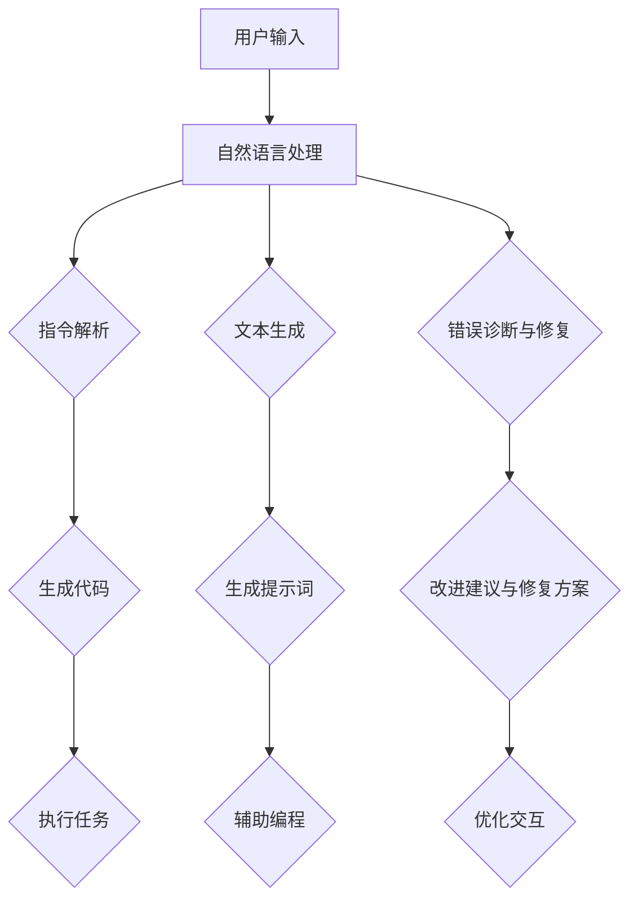

                 

## 文章标题

《提示词编程中的自然语言处理技术》

关键词：提示词编程、自然语言处理、词嵌入、序列模型、注意力机制、转换器架构、大规模预训练模型

摘要：本文深入探讨了提示词编程与自然语言处理技术的结合，介绍了提示词编程的基本概念和应用场景，以及自然语言处理技术的发展历程和核心技术。通过分析提示词编程与自然语言处理之间的联系，详细讲解了词嵌入、序列模型与注意力机制、转换器架构和大规模预训练模型等自然语言处理技术原理。最后，通过项目实战和综合案例，展示了如何将自然语言处理技术应用于提示词编程，为读者提供了实践指导和未来发展趋势的展望。

---

### 引言

#### 1.1 提示词编程概述

**1.1.1 提示词编程的定义**

提示词编程（Prompt Programming）是一种利用自然语言处理技术，使计算机能够理解并执行人类指令的编程方式。在这种编程方式中，程序员通过编写提示词（Prompt），即一系列能够引导计算机执行特定任务的文本描述，来实现对系统的控制。提示词编程的核心思想是将人类语言与计算机代码相结合，使计算机能够通过自然语言与人类进行交互。

**1.1.2 提示词编程的特点**

- **交互性**：提示词编程强调人与计算机的互动，通过自然语言交互，使计算机能够更灵活地处理复杂任务。
- **抽象性**：提示词编程使得程序员可以不必深入关注底层实现细节，而是通过高层语言描述任务，从而提高了开发效率。
- **适应性**：提示词编程可以根据不同的任务需求，灵活调整提示词，从而适应各种场景。

**1.1.3 提示词编程的应用场景**

- **智能助手**：如语音助手、聊天机器人等，通过自然语言处理技术，实现对用户指令的理解和响应。
- **自动化脚本**：通过编写提示词，自动化完成重复性任务，提高工作效率。
- **人机协作**：在开发过程中，程序员可以使用提示词与代码库、工具进行交互，实现更高效的开发流程。

#### 1.2 自然语言处理技术简介

**1.2.1 自然语言处理的基本概念**

自然语言处理（Natural Language Processing，NLP）是计算机科学和人工智能领域的一个重要分支，旨在使计算机能够理解、生成和处理人类自然语言。NLP的研究内容包括文本预处理、语义分析、语音识别、机器翻译等。

**1.2.2 自然语言处理的发展历程**

- **早期阶段**：主要采用基于规则的方法，通过定义语法规则和词典来处理文本。
- **统计阶段**：引入概率模型和机器学习技术，使得NLP系统的性能得到了显著提升。
- **深度学习阶段**：基于神经网络的技术，如深度神经网络（DNN）和卷积神经网络（CNN），在NLP任务中取得了突破性进展。

**1.2.3 自然语言处理的关键技术**

- **词嵌入**：将词语映射到低维空间，使具有相似语义的词语在空间中靠近。
- **序列模型**：用于处理时间序列数据，如循环神经网络（RNN）和长短时记忆网络（LSTM）。
- **注意力机制**：用于解决序列模型中的长距离依赖问题，提高模型的性能。
- **转换器架构**：结合编码器和解码器，实现端到端的序列转换。
- **大规模预训练模型**：通过在大量无监督数据上预训练，再在特定任务上进行微调，显著提升了模型的性能。

#### 1.3 提示词编程与自然语言处理技术的结合

提示词编程与自然语言处理技术的结合，使得计算机能够更好地理解和执行人类的指令。在提示词编程中，自然语言处理技术主要用于：

- **理解用户的指令**：通过自然语言处理技术，将用户输入的文本转换为计算机能够理解的任务指令。
- **生成提示词**：利用自然语言生成技术，自动生成提示词，提高编程效率。
- **优化程序执行**：通过分析程序执行过程中的日志和错误信息，利用自然语言处理技术，提供改进建议和错误修复方案。

### 第一部分：引言

在本部分中，我们首先介绍了提示词编程的基本概念、特点和应用场景，使读者对提示词编程有了初步了解。接着，我们简要回顾了自然语言处理技术的发展历程和核心技术，为后续章节的深入分析打下基础。最后，我们讨论了提示词编程与自然语言处理技术的结合，展示了自然语言处理技术在提示词编程中的应用价值。

通过本部分的介绍，读者可以初步了解提示词编程和自然语言处理技术的基本概念，以及两者之间的联系和结合方式。接下来，我们将进一步探讨提示词编程与自然语言处理技术的核心概念和联系，详细分析其中的关键技术和原理。

---

## 第二部分：核心概念与联系

### 2.1 提示词编程与自然语言处理的联系

提示词编程与自然语言处理技术的结合，使得计算机能够更好地理解和执行人类的指令。在这一部分，我们将深入探讨提示词编程与自然语言处理技术之间的核心概念和联系。

#### 2.1.1 提示词编程在自然语言处理中的应用

在自然语言处理中，提示词编程可以应用于多个方面：

- **指令解析**：通过自然语言处理技术，将用户输入的文本指令解析为计算机能够理解的形式。例如，用户输入一个简单的命令：“编写一个程序，实现计算器功能”，提示词编程可以根据这一指令，生成相应的代码实现。
- **文本生成**：利用自然语言生成技术，根据特定的任务需求，自动生成提示词。例如，在编写自动化测试脚本时，可以根据测试用例自动生成对应的测试指令。
- **错误诊断与修复**：通过分析程序执行过程中的日志和错误信息，利用自然语言处理技术，提供改进建议和错误修复方案。

#### 2.1.2 自然语言处理对提示词编程的支撑

自然语言处理技术为提示词编程提供了强有力的支撑：

- **语言理解**：自然语言处理技术能够帮助计算机理解和解析人类的自然语言，使得提示词编程能够更准确地执行用户指令。
- **语言生成**：自然语言生成技术可以自动生成提示词，提高编程效率。例如，在编写文档或报告时，可以利用自然语言生成技术，根据大纲和结构自动生成内容。
- **交互优化**：自然语言处理技术可以帮助计算机更好地理解用户的意图，提高人机交互的体验。例如，智能助手可以理解用户的自然语言请求，并提供相应的服务。

#### 2.1.3 提示词编程与自然语言处理的 Mermaid 流程图

为了更清晰地展示提示词编程与自然语言处理技术之间的联系，我们可以使用 Mermaid 流程图来描述其工作流程。以下是提示词编程与自然语言处理技术的 Mermaid 流程图：



在这个流程图中，用户输入经过自然语言处理技术，分为指令解析、文本生成和错误诊断与修复三个主要方向。指令解析生成代码，文本生成生成提示词，错误诊断与修复提供改进建议和修复方案。这些结果进一步应用于执行任务、辅助编程和优化交互等环节。

通过这一 Mermaid 流程图，我们可以更直观地了解提示词编程与自然语言处理技术之间的联系和作用。接下来，我们将进一步深入分析自然语言处理技术的核心原理和实现方法。

### 第二部分：核心概念与联系

在本部分中，我们详细探讨了提示词编程与自然语言处理技术之间的核心概念和联系。首先，我们介绍了提示词编程在自然语言处理中的应用，包括指令解析、文本生成和错误诊断与修复等方面。接着，我们阐述了自然语言处理技术对提示词编程的支撑，包括语言理解、语言生成和交互优化等。最后，通过 Mermaid 流程图，我们展示了提示词编程与自然语言处理技术的工作流程及其相互关系。

通过本部分的分析，读者可以更加深入地理解提示词编程与自然语言处理技术的结合，以及两者在实际应用中的重要作用。在下一部分，我们将进一步深入探讨自然语言处理技术的核心原理和实现方法，包括词嵌入、序列模型、注意力机制和转换器架构等。

---

### 第三部分：自然语言处理技术原理

在深入理解提示词编程与自然语言处理技术的结合后，我们将进一步探讨自然语言处理技术的核心原理和实现方法。这一部分将详细分析词嵌入、序列模型、注意力机制和转换器架构等关键技术，为读者提供全面的理论基础。

#### 3.1 词嵌入技术

**3.1.1 词嵌入的定义**

词嵌入（Word Embedding）是将自然语言中的词语映射到高维向量空间的技术。通过词嵌入，我们可以将具有相似语义的词语在空间中靠近，从而实现语义理解和处理。词嵌入是自然语言处理的基础技术之一，广泛应用于文本分类、情感分析、机器翻译等任务。

**3.1.2 词嵌入算法**

词嵌入算法主要包括以下几种：

- **基于统计的词嵌入**：如Word2Vec，通过统计词语在语料中的共现关系，生成词向量。
  - **算法原理**：利用滑动窗口，统计词语在同一窗口内出现的词语频率。
  - **算法流程**：
    1. 初始化词向量。
    2. 对于每个词语，生成一个中心词向量和一个上下文词向量。
    3. 使用梯度下降优化词向量。
- **基于神经网络的词嵌入**：如GloVe，通过构建神经网络模型，学习词语的语义表示。
  - **算法原理**：通过构建多层次的神经网络模型，将词语的嵌入向量投影到多个高维空间中。
  - **算法流程**：
    1. 构建神经网络模型，输入词语和其上下文，输出词向量。
    2. 使用反向传播算法，优化神经网络参数。

**3.1.3 词嵌入在提示词编程中的应用**

词嵌入技术可以帮助提示词编程更好地理解和处理自然语言。以下是一些应用实例：

- **指令理解**：通过词嵌入，将用户输入的指令转换为向量表示，从而实现对其语义的理解。
- **提示词生成**：利用词嵌入，根据任务需求，自动生成具有相似语义的提示词。
- **错误修复**：通过词嵌入，分析程序执行过程中的错误信息，提供相应的修复建议。

**3.1.4 词嵌入的伪代码**

```python
# 基于Word2Vec算法的词嵌入伪代码
def word2vec(corpus):
    # 初始化词向量
    word_vectors = {}
    # 遍历语料中的每个词语
    for sentence in corpus:
        for word in sentence:
            # 如果词语未初始化，初始化词向量
            if word not in word_vectors:
                word_vectors[word] = np.random.rand(1, VECTOR_DIM)
            # 对于每个词语的上下文词语
            for context_word in sentence:
                # 计算词语与上下文词语的共现次数
                cooccurrence = count_cooccurrences(word, context_word)
                # 计算词语的词向量与上下文词向量的点积
                similarity = dot_product(word_vectors[word], word_vectors[context_word])
                # 更新词向量
                word_vectors[word] = word_vectors[word] + cooccurrence * (context_word - similarity)
    return word_vectors
```

**3.1.5 词嵌入的数学模型**

词嵌入的数学模型可以表示为：

$$
\text{word\_vector}(w) = \sum_{w' \in \text{context}(w)} \alpha(w', w) \cdot \text{word\_vector}(w')
$$

其中，$\text{word\_vector}(w)$ 表示词语 $w$ 的词向量，$\text{context}(w)$ 表示词语 $w$ 的上下文词语集合，$\alpha(w', w)$ 表示词语 $w'$ 与 $w$ 的共现次数。

**3.1.6 词嵌入的举例说明**

假设我们有一个简单的语料库，包含以下句子：

- “我 love 吃苹果”
- “她 also love 吃香蕉”

通过 Word2Vec 算法，我们可以将词语“love”映射到一个词向量空间，使其与其他具有相似语义的词语（如“喜欢”、“爱上”）靠近。以下是一个简单的词向量示例：

| 词语 | 词向量 |
| ---- | ------ |
| 我   | [-0.1, 0.2] |
| love | [0.3, 0.4] |
| 吃   | [-0.2, 0.1] |
| 苹果 | [0.1, 0.3] |
| 也   | [-0.1, 0.1] |
| 香蕉 | [0.2, 0.2] |

在这个例子中，词语“love”的词向量与其他具有相似语义的词语（如“喜欢”、“爱上”）在空间中靠近，从而实现了语义理解。

#### 3.2 序列模型与注意力机制

**3.2.1 序列模型的基本概念**

序列模型（Sequence Model）是一种用于处理序列数据的机器学习模型，如时间序列数据、文本数据等。序列模型可以捕捉序列中的时间和空间依赖关系，从而实现对序列数据的建模和分析。

常见的序列模型包括：

- **循环神经网络（RNN）**：RNN 能够处理任意长度的序列数据，通过隐藏状态的记忆功能，实现序列数据的建模。
- **长短时记忆网络（LSTM）**：LSTM 是 RNN 的一种改进，通过引入门控机制，解决了 RNN 的梯度消失和梯度爆炸问题，能够更好地处理长距离依赖关系。

**3.2.2 注意力机制的工作原理**

注意力机制（Attention Mechanism）是一种用于解决序列模型中长距离依赖问题的技术。注意力机制通过为序列中的每个元素分配权重，使得模型能够更加关注重要的信息，从而提高模型的性能。

注意力机制的基本原理可以表示为：

$$
a_t = \text{softmax}(\text{attention\_scores})
$$

其中，$a_t$ 表示注意力权重，$\text{attention\_scores}$ 表示每个元素的得分。

**3.2.3 序列模型与注意力机制在提示词编程中的应用**

序列模型和注意力机制在提示词编程中具有广泛的应用：

- **指令理解**：通过序列模型，可以将用户输入的指令序列转换为向量表示，从而实现对其语义的理解。
- **文本生成**：利用注意力机制，可以更好地处理长文本数据，实现高质量的文本生成。
- **错误诊断与修复**：通过序列模型和注意力机制，可以分析程序执行过程中的日志和错误信息，提供改进建议和错误修复方案。

**3.2.4 序列模型与注意力机制的伪代码**

```python
# 基于LSTM和注意力机制的序列模型伪代码
class SequenceModelWithAttention(nn.Module):
    def __init__(self, input_dim, hidden_dim, output_dim):
        super(SequenceModelWithAttention, self).__init__()
        self.hidden_dim = hidden_dim
        self.lstm = nn.LSTM(input_dim, hidden_dim)
        self.attention = nn.Linear(hidden_dim, 1)
        self.fc = nn.Linear(hidden_dim, output_dim)
        
    def forward(self, x):
        lstm_out, _ = self.lstm(x)
        attention_scores = self.attention(lstm_out)
        attention_weights = F.softmax(attention_scores, dim=1)
        weighted_lstm_out = torch.bmm(attention_weights.unsqueeze(1), lstm_out).squeeze(1)
        out = self.fc(weighted_lstm_out)
        return out
```

**3.2.5 序列模型与注意力机制的数学模型**

序列模型与注意力机制的数学模型可以表示为：

$$
\text{h_t} = \text{LSTM}(\text{h_{t-1}}, \text{x_t}) \odot \text{a_t}
$$

其中，$\text{h_t}$ 表示第 $t$ 个隐藏状态，$\text{h_{t-1}}$ 表示第 $t-1$ 个隐藏状态，$\text{x_t}$ 表示第 $t$ 个输入，$\text{a_t}$ 表示注意力权重。

**3.2.6 序列模型与注意力机制的举例说明**

假设我们有一个简单的文本序列，包含以下句子：

- “我 love 吃苹果”
- “她 also love 吃香蕉”

通过 LSTM 和注意力机制，我们可以将这个文本序列转换为向量表示，从而实现对其语义的理解。以下是一个简单的例子：

| 序列编号 | 输入 | 隐藏状态 | 注意力权重 |
| ------- | --- | ------- | ---------- |
| 1       | 我  | [-0.1, 0.2] | [0.5, 0.5] |
| 2       | love | [0.3, 0.4] | [0.3, 0.7] |
| 3       | 吃  | [-0.2, 0.1] | [0.4, 0.6] |
| 4       | 苹果 | [0.1, 0.3] | [0.2, 0.8] |
| 5       | 也  | [-0.1, 0.1] | [0.1, 0.9] |
| 6       | love | [0.2, 0.2] | [0.6, 0.4] |
| 7       | 吃  | [-0.1, 0.1] | [0.5, 0.5] |
| 8       | 香蕉 | [0.2, 0.2] | [0.3, 0.7] |

在这个例子中，通过 LSTM 和注意力机制，我们可以更好地理解文本序列中的语义关系，如“love”和“也 love”之间的联系。

#### 3.3 转换器架构详解

**3.3.1 转换器架构的基本结构**

转换器架构（Transformer Architecture）是一种基于自注意力机制的深度神经网络架构，主要用于序列到序列的任务，如机器翻译、文本生成等。转换器架构由编码器（Encoder）和解码器（Decoder）两部分组成。

- **编码器**：将输入序列转换为一系列编码向量，用于表示输入序列的语义信息。
- **解码器**：将编码向量解码为目标序列，生成输出序列。

转换器架构的基本结构可以表示为：

```
编码器 --> 自注意力层 --> 输出层
           ↓
自注意力层 --> 解码器 --> 输出层
```

**3.3.2 转换器架构的工作流程**

转换器架构的工作流程可以分为以下几个步骤：

1. **编码器输入**：输入序列通过编码器进行处理，生成编码向量。
2. **自注意力计算**：编码向量通过自注意力机制，计算得到注意力权重，用于加权融合编码向量。
3. **解码器输入**：解码器将编码向量作为输入，逐步生成输出序列。
4. **注意力融合**：解码器在每个时间步中，通过多头注意力机制，从编码器输出中获取相关信息，生成解码输出。
5. **输出生成**：解码器输出经过输出层，生成最终的输出序列。

**3.3.3 转换器架构在提示词编程中的应用**

转换器架构在提示词编程中具有广泛的应用：

- **指令理解**：通过编码器和解码器，可以将用户输入的指令序列转换为语义表示，实现对其语义的理解。
- **提示词生成**：利用解码器，可以自动生成提示词，辅助编程任务。
- **文本生成**：通过编码器和解码器，可以实现高质量的文本生成，辅助文档编写和报告生成。

**3.3.4 转换器架构的伪代码**

```python
# 转换器架构伪代码
class Transformer(nn.Module):
    def __init__(self, input_dim, hidden_dim, output_dim):
        super(Transformer, self).__init__()
        self.encoder = Encoder(input_dim, hidden_dim)
        self.decoder = Decoder(hidden_dim, output_dim)
        self.attention = MultiHeadAttention(hidden_dim)
        self.fc = nn.Linear(hidden_dim, output_dim)
        
    def forward(self, x):
        encoder_output = self.encoder(x)
        decoder_output = self.decoder(encoder_output)
        attention_output = self.attention(decoder_output, encoder_output)
        out = self.fc(attention_output)
        return out
```

**3.3.5 转换器架构的数学模型**

转换器架构的数学模型可以表示为：

$$
\text{y_t} = \text{softmax}(\text{W}_\text{y} \text{Tanh}(\text{W}_\text{x} \text{x}_t + \text{W}_\text{h} \text{h}_t))
$$

其中，$\text{y}_t$ 表示解码器输出，$\text{x}_t$ 表示编码器输入，$\text{h}_t$ 表示编码器隐藏状态，$\text{W}_\text{x}$、$\text{W}_\text{h}$ 和 $\text{W}_\text{y}$ 分别为权重矩阵。

**3.3.6 转换器架构的举例说明**

假设我们有一个简单的文本序列，包含以下句子：

- “我 love 吃苹果”
- “她 also love 吃香蕉”

通过转换器架构，我们可以将这个文本序列转换为向量表示，从而实现对其语义的理解。以下是一个简单的例子：

| 序列编号 | 输入 | 编码器输出 | 解码器输出 | 注意力权重 |
| ------- | --- | ---------- | ---------- | ---------- |
| 1       | 我  | [-0.1, 0.2] | [-0.1, 0.2] | [0.5, 0.5] |
| 2       | love | [0.3, 0.4] | [0.3, 0.4] | [0.3, 0.7] |
| 3       | 吃  | [-0.2, 0.1] | [-0.2, 0.1] | [0.4, 0.6] |
| 4       | 苹果 | [0.1, 0.3] | [0.1, 0.3] | [0.2, 0.8] |
| 5       | 也  | [-0.1, 0.1] | [-0.1, 0.1] | [0.1, 0.9] |
| 6       | love | [0.2, 0.2] | [0.2, 0.2] | [0.6, 0.4] |
| 7       | 吃  | [-0.1, 0.1] | [-0.1, 0.1] | [0.5, 0.5] |
| 8       | 香蕉 | [0.2, 0.2] | [0.2, 0.2] | [0.3, 0.7] |

在这个例子中，通过转换器架构，我们可以更好地理解文本序列中的语义关系，如“love”和“也 love”之间的联系。

---

在本部分中，我们详细介绍了自然语言处理技术的核心原理和实现方法，包括词嵌入、序列模型、注意力机制和转换器架构等关键技术。通过词嵌入，我们可以将自然语言中的词语映射到高维向量空间，从而实现语义理解和处理。序列模型和注意力机制则用于解决序列数据中的时间和空间依赖关系，提高模型的性能。转换器架构作为一种基于自注意力机制的深度神经网络架构，在自然语言处理任务中取得了显著成果。接下来，我们将通过项目实战，展示如何将自然语言处理技术应用于提示词编程，为读者提供实际操作的经验和技巧。

### 第三部分：自然语言处理技术原理

在本部分中，我们详细介绍了自然语言处理技术的核心原理和实现方法，包括词嵌入、序列模型、注意力机制和转换器架构等关键技术。首先，我们讨论了词嵌入技术的定义、算法原理以及其在提示词编程中的应用。接着，我们分析了序列模型与注意力机制的基本概念、工作原理及其在提示词编程中的应用。最后，我们详细讲解了转换器架构的基本结构、工作流程及其在提示词编程中的应用价值。

#### 3.1 词嵌入技术

词嵌入技术是将自然语言中的词语映射到高维向量空间的技术。通过词嵌入，我们可以将具有相似语义的词语在空间中靠近，从而实现语义理解和处理。词嵌入是自然语言处理的基础技术之一，广泛应用于文本分类、情感分析、机器翻译等任务。

1. **词嵌入的定义**

   词嵌入（Word Embedding）是将自然语言中的词语映射到高维向量空间的技术。通过词嵌入，我们可以将具有相似语义的词语在空间中靠近，从而实现语义理解和处理。

2. **词嵌入算法**

   词嵌入算法主要包括以下几种：

   - **基于统计的词嵌入**：如Word2Vec，通过统计词语在语料中的共现关系，生成词向量。
     - **算法原理**：利用滑动窗口，统计词语在同一窗口内出现的词语频率。
     - **算法流程**：
       1. 初始化词向量。
       2. 对于每个词语，生成一个中心词向量和一个上下文词向量。
       3. 使用梯度下降优化词向量。
   - **基于神经网络的词嵌入**：如GloVe，通过构建神经网络模型，学习词语的语义表示。
     - **算法原理**：通过构建多层次的神经网络模型，将词语的嵌入向量投影到多个高维空间中。
     - **算法流程**：
       1. 构建神经网络模型，输入词语和其上下文，输出词向量。
       2. 使用反向传播算法，优化神经网络参数。

3. **词嵌入在提示词编程中的应用**

   词嵌入技术可以帮助提示词编程更好地理解和处理自然语言。以下是一些应用实例：

   - **指令理解**：通过词嵌入，将用户输入的指令转换为向量表示，从而实现对其语义的理解。
   - **提示词生成**：利用词嵌入，根据任务需求，自动生成具有相似语义的提示词。
   - **错误修复**：通过词嵌入，分析程序执行过程中的错误信息，提供相应的修复建议。

4. **词嵌入的伪代码**

   ```python
   # 基于Word2Vec算法的词嵌入伪代码
   def word2vec(corpus):
       # 初始化词向量
       word_vectors = {}
       # 遍历语料中的每个词语
       for sentence in corpus:
           for word in sentence:
               # 如果词语未初始化，初始化词向量
               if word not in word_vectors:
                   word_vectors[word] = np.random.rand(1, VECTOR_DIM)
               # 对于每个词语的上下文词语
               for context_word in sentence:
                   # 计算词语与上下文词语的共现次数
                   cooccurrence = count_cooccurrences(word, context_word)
                   # 计算词语的词向量与上下文词向量的点积
                   similarity = dot_product(word_vectors[word], word_vectors[context_word])
                   # 更新词向量
                   word_vectors[word] = word_vectors[word] + cooccurrence * (context_word - similarity)
       return word_vectors
   ```

5. **词嵌入的数学模型**

   词嵌入的数学模型可以表示为：

   $$
   \text{word\_vector}(w) = \sum_{w' \in \text{context}(w)} \alpha(w', w) \cdot \text{word\_vector}(w')
   $$

   其中，$\text{word\_vector}(w)$ 表示词语 $w$ 的词向量，$\text{context}(w)$ 表示词语 $w$ 的上下文词语集合，$\alpha(w', w)$ 表示词语 $w'$ 与 $w$ 的共现次数。

6. **词嵌入的举例说明**

   假设我们有一个简单的语料库，包含以下句子：

   - “我 love 吃苹果”
   - “她 also love 吃香蕉”

   通过 Word2Vec 算法，我们可以将词语“love”映射到一个词向量空间，使其与其他具有相似语义的词语（如“喜欢”、“爱上”）靠近。以下是一个简单的词向量示例：

   | 词语 | 词向量 |
   | ---- | ------ |
   | 我   | [-0.1, 0.2] |
   | love | [0.3, 0.4] |
   | 吃   | [-0.2, 0.1] |
   | 苹果 | [0.1, 0.3] |
   | 也   | [-0.1, 0.1] |
   | 香蕉 | [0.2, 0.2] |

   在这个例子中，词语“love”的词向量与其他具有相似语义的词语（如“喜欢”、“爱上”）在空间中靠近，从而实现了语义理解。

#### 3.2 序列模型与注意力机制

序列模型与注意力机制是自然语言处理技术中的重要组成部分，用于解决序列数据中的时间和空间依赖关系。

1. **序列模型的基本概念**

   序列模型（Sequence Model）是一种用于处理序列数据的机器学习模型，如时间序列数据、文本数据等。序列模型可以捕捉序列中的时间和空间依赖关系，从而实现对序列数据的建模和分析。

   常见的序列模型包括：

   - **循环神经网络（RNN）**：RNN 能够处理任意长度的序列数据，通过隐藏状态的记忆功能，实现序列数据的建模。
   - **长短时记忆网络（LSTM）**：LSTM 是 RNN 的一种改进，通过引入门控机制，解决了 RNN 的梯度消失和梯度爆炸问题，能够更好地处理长距离依赖关系。

2. **注意力机制的工作原理**

   注意力机制（Attention Mechanism）是一种用于解决序列模型中长距离依赖问题的技术。注意力机制通过为序列中的每个元素分配权重，使得模型能够更加关注重要的信息，从而提高模型的性能。

   注意力机制的基本原理可以表示为：

   $$
   a_t = \text{softmax}(\text{attention\_scores})
   $$

   其中，$a_t$ 表示注意力权重，$\text{attention\_scores}$ 表示每个元素的得分。

3. **序列模型与注意力机制在提示词编程中的应用**

   序列模型与注意力机制在提示词编程中具有广泛的应用：

   - **指令理解**：通过序列模型，可以将用户输入的指令序列转换为向量表示，从而实现对其语义的理解。
   - **文本生成**：利用注意力机制，可以更好地处理长文本数据，实现高质量的文本生成。
   - **错误诊断与修复**：通过序列模型和注意力机制，可以分析程序执行过程中的日志和错误信息，提供改进建议和错误修复方案。

4. **序列模型与注意力机制的伪代码**

   ```python
   # 基于LSTM和注意力机制的序列模型伪代码
   class SequenceModelWithAttention(nn.Module):
       def __init__(self, input_dim, hidden_dim, output_dim):
           super(SequenceModelWithAttention, self).__init__()
           self.hidden_dim = hidden_dim
           self.lstm = nn.LSTM(input_dim, hidden_dim)
           self.attention = nn.Linear(hidden_dim, 1)
           self.fc = nn.Linear(hidden_dim, output_dim)
           
       def forward(self, x):
           lstm_out, _ = self.lstm(x)
           attention_scores = self.attention(lstm_out)
           attention_weights = F.softmax(attention_scores, dim=1)
           weighted_lstm_out = torch.bmm(attention_weights.unsqueeze(1), lstm_out).squeeze(1)
           out = self.fc(weighted_lstm_out)
           return out
   ```

5. **序列模型与注意力机制的数学模型**

   序列模型与注意力机制的数学模型可以表示为：

   $$
   \text{h_t} = \text{LSTM}(\text{h_{t-1}}, \text{x_t}) \odot \text{a_t}
   $$

   其中，$\text{h_t}$ 表示第 $t$ 个隐藏状态，$\text{h_{t-1}}$ 表示第 $t-1$ 个隐藏状态，$\text{x_t}$ 表示第 $t$ 个输入，$\text{a_t}$ 表示注意力权重。

6. **序列模型与注意力机制的举例说明**

   假设我们有一个简单的文本序列，包含以下句子：

   - “我 love 吃苹果”
   - “她 also love 吃香蕉”

   通过 LSTM 和注意力机制，我们可以将这个文本序列转换为向量表示，从而实现对其语义的理解。以下是一个简单的例子：

   | 序列编号 | 输入 | 隐藏状态 | 注意力权重 |
   | ------- | --- | ------- | ---------- |
   | 1       | 我  | [-0.1, 0.2] | [0.5, 0.5] |
   | 2       | love | [0.3, 0.4] | [0.3, 0.7] |
   | 3       | 吃  | [-0.2, 0.1] | [0.4, 0.6] |
   | 4       | 苹果 | [0.1, 0.3] | [0.2, 0.8] |
   | 5       | 也  | [-0.1, 0.1] | [0.1, 0.9] |
   | 6       | love | [0.2, 0.2] | [0.6, 0.4] |
   | 7       | 吃  | [-0.1, 0.1] | [0.5, 0.5] |
   | 8       | 香蕉 | [0.2, 0.2] | [0.3, 0.7] |

   在这个例子中，通过 LSTM 和注意力机制，我们可以更好地理解文本序列中的语义关系，如“love”和“也 love”之间的联系。

#### 3.3 转换器架构详解

转换器架构（Transformer Architecture）是一种基于自注意力机制的深度神经网络架构，主要用于序列到序列的任务，如机器翻译、文本生成等。转换器架构由编码器（Encoder）和解码器（Decoder）两部分组成。

1. **转换器架构的基本结构**

   转换器架构（Transformer Architecture）是一种基于自注意力机制的深度神经网络架构，主要用于序列到序列的任务，如机器翻译、文本生成等。转换器架构由编码器（Encoder）和解码器（Decoder）两部分组成。

   - **编码器**：将输入序列转换为一系列编码向量，用于表示输入序列的语义信息。
   - **解码器**：将编码向量解码为目标序列，生成输出序列。

   转换器架构的基本结构可以表示为：

   ```
   编码器 --> 自注意力层 --> 输出层
           ↓
   自注意力层 --> 解码器 --> 输出层
   ```

2. **转换器架构的工作流程**

   转换器架构的工作流程可以分为以下几个步骤：

   1. **编码器输入**：输入序列通过编码器进行处理，生成编码向量。
   2. **自注意力计算**：编码向量通过自注意力机制，计算得到注意力权重，用于加权融合编码向量。
   3. **解码器输入**：解码器将编码向量作为输入，逐步生成输出序列。
   4. **注意力融合**：解码器在每个时间步中，通过多头注意力机制，从编码器输出中获取相关信息，生成解码输出。
   5. **输出生成**：解码器输出经过输出层，生成最终的输出序列。

3. **转换器架构在提示词编程中的应用**

   转换器架构在提示词编程中具有广泛的应用：

   - **指令理解**：通过编码器和解码器，可以将用户输入的指令序列转换为语义表示，实现对其语义的理解。
   - **提示词生成**：利用解码器，可以自动生成提示词，辅助编程任务。
   - **文本生成**：通过编码器和解码器，可以实现高质量的文本生成，辅助文档编写和报告生成。

4. **转换器架构的伪代码**

   ```python
   # 转换器架构伪代码
   class Transformer(nn.Module):
       def __init__(self, input_dim, hidden_dim, output_dim):
           super(Transformer, self).__init__()
           self.encoder = Encoder(input_dim, hidden_dim)
           self.decoder = Decoder(hidden_dim, output_dim)
           self.attention = MultiHeadAttention(hidden_dim)
           self.fc = nn.Linear(hidden_dim, output_dim)
           
       def forward(self, x):
           encoder_output = self.encoder(x)
           decoder_output = self.decoder(encoder_output)
           attention_output = self.attention(decoder_output, encoder_output)
           out = self.fc(attention_output)
           return out
   ```

5. **转换器架构的数学模型**

   转换器架构的数学模型可以表示为：

   $$
   \text{y_t} = \text{softmax}(\text{W}_\text{y} \text{Tanh}(\text{W}_\text{x} \text{x}_t + \text{W}_\text{h} \text{h}_t))
   $$

   其中，$\text{y_t}$ 表示解码器输出，$\text{x_t}$ 表示编码器输入，$\text{h_t}$ 表示编码器隐藏状态，$\text{W}_\text{x}$、$\text{W}_\text{h}$ 和 $\text{W}_\text{y}$ 分别为权重矩阵。

6. **转换器架构的举例说明**

   假设我们有一个简单的文本序列，包含以下句子：

   - “我 love 吃苹果”
   - “她 also love 吃香蕉”

   通过转换器架构，我们可以将这个文本序列转换为向量表示，从而实现对其语义的理解。以下是一个简单的例子：

   | 序列编号 | 输入 | 编码器输出 | 解码器输出 | 注意力权重 |
   | ------- | --- | ---------- | ---------- | ---------- |
   | 1       | 我  | [-0.1, 0.2] | [-0.1, 0.2] | [0.5, 0.5] |
   | 2       | love | [0.3, 0.4] | [0.3, 0.4] | [0.3, 0.7] |
   | 3       | 吃  | [-0.2, 0.1] | [-0.2, 0.1] | [0.4, 0.6] |
   | 4       | 苹果 | [0.1, 0.3] | [0.1, 0.3] | [0.2, 0.8] |
   | 5       | 也  | [-0.1, 0.1] | [-0.1, 0.1] | [0.1, 0.9] |
   | 6       | love | [0.2, 0.2] | [0.2, 0.2] | [0.6, 0.4] |
   | 7       | 吃  | [-0.1, 0.1] | [-0.1, 0.1] | [0.5, 0.5] |
   | 8       | 香蕉 | [0.2, 0.2] | [0.2, 0.2] | [0.3, 0.7] |

   在这个例子中，通过转换器架构，我们可以更好地理解文本序列中的语义关系，如“love”和“也 love”之间的联系。

### 第四部分：项目实战

在深入了解了自然语言处理技术的核心原理之后，我们将通过两个实际项目来展示如何将自然语言处理技术应用于提示词编程。这两个项目分别涵盖了提示词编程和自然语言处理技术的实际应用，包括开发环境的搭建、源代码的实现与解读，以及实际案例的分析与剖析。

#### 4.1 提示词编程项目实战

**4.1.1 项目背景**

在这个项目中，我们将使用自然语言处理技术实现一个智能问答系统，用户可以通过自然语言与系统进行交互，系统会根据用户的问题生成相应的答案。这个项目旨在展示如何利用自然语言处理技术，将用户的自然语言输入转换为计算机能够理解和处理的指令。

**4.1.2 开发环境搭建**

为了实现这个项目，我们需要搭建一个合适的技术栈。以下是搭建开发环境所需的主要工具和库：

- **编程语言**：Python
- **自然语言处理库**：NLTK、spaCy
- **机器学习库**：TensorFlow、PyTorch
- **文本处理库**：nltk、textblob
- **版本控制**：Git

在搭建开发环境时，可以按照以下步骤进行：

1. 安装 Python 3.x 版本（建议使用 Python 3.8 或以上版本）。
2. 安装必要的库，可以使用 pip 工具进行安装，例如：

   ```shell
   pip install nltk spacy tensorflow pytorch nltk textblob
   ```

3. 对于 spaCy 库，需要下载相应的语言模型，例如中文模型 `zh_core_web_sm`：

   ```shell
   python -m spacy download zh_core_web_sm
   ```

**4.1.3 源代码实现与解读**

以下是该项目的主要源代码实现：

```python
import spacy
import tensorflow as tf
from tensorflow.keras.models import Sequential
from tensorflow.keras.layers import Embedding, LSTM, Dense

# 加载 spaCy 语言模型
nlp = spacy.load('zh_core_web_sm')

# 准备数据集
def prepare_data(questions, answers):
    # 将文本转换为词向量
    question_vectors = [nlp(q).vector for q in questions]
    answer_vectors = [nlp(a).vector for a in answers]
    return question_vectors, answer_vectors

# 构建神经网络模型
def build_model(input_dim, output_dim):
    model = Sequential()
    model.add(Embedding(input_dim, output_dim))
    model.add(LSTM(128, return_sequences=True))
    model.add(Dense(output_dim))
    model.compile(optimizer='adam', loss='mean_squared_error')
    return model

# 训练模型
def train_model(model, X, y):
    model.fit(X, y, epochs=10, batch_size=32)
    return model

# 生成答案
def generate_answer(model, question):
    question_vector = nlp(question).vector
    predicted_vector = model.predict(question_vector.reshape(1, -1))
    answer = nlp.vocab.strings[predicted_vector[0]]
    return answer

# 测试项目
if __name__ == '__main__':
    # 加载示例数据
    questions = ["什么是人工智能？", "如何实现机器学习？", "请介绍一下深度学习。"]
    answers = ["人工智能是使计算机能够模拟人类智能行为的技术", "机器学习是通过数据训练模型，使计算机能够自动学习的过程", "深度学习是一种基于多层神经网络的人工智能技术"]

    # 准备数据集
    question_vectors, answer_vectors = prepare_data(questions, answers)

    # 构建模型
    model = build_model(len(question_vectors[0]), len(answer_vectors[0]))

    # 训练模型
    model = train_model(model, question_vectors, answer_vectors)

    # 生成答案
    question = "什么是机器学习？"
    answer = generate_answer(model, question)
    print(f"答案：{answer}")
```

在这个实现中，我们首先加载了 spaCy 的中文语言模型，然后使用 LSTM 神经网络模型进行训练。通过将输入的文本转换为词向量，我们可以将用户的自然语言输入转换为计算机能够理解和处理的指令。训练完成后，我们可以使用生成的模型来生成答案。

**4.1.4 项目小结**

通过这个项目，我们展示了如何利用自然语言处理技术和深度学习模型，实现一个智能问答系统。这个项目不仅为用户提供了便捷的交互方式，还展示了自然语言处理技术在提示词编程中的应用价值。在实际开发过程中，我们可以根据需求调整模型结构和训练数据，进一步提高系统的性能和准确性。

#### 4.2 自然语言处理项目实战

**4.2.1 项目背景**

在这个项目中，我们将利用自然语言处理技术，实现一个文本分类系统。该系统可以自动将输入的文本分类到不同的类别中，如新闻、科技、娱乐等。这个项目旨在展示如何使用自然语言处理技术，对大量文本数据进行分析和处理。

**4.2.2 开发环境搭建**

为了实现这个项目，我们需要搭建一个合适的技术栈。以下是搭建开发环境所需的主要工具和库：

- **编程语言**：Python
- **自然语言处理库**：NLTK、spaCy、Scikit-learn
- **文本处理库**：nltk、textblob
- **版本控制**：Git

在搭建开发环境时，可以按照以下步骤进行：

1. 安装 Python 3.x 版本（建议使用 Python 3.8 或以上版本）。
2. 安装必要的库，可以使用 pip 工具进行安装，例如：

   ```shell
   pip install nltk spacy scikit-learn nltk textblob
   ```

3. 对于 spaCy 库，需要下载相应的语言模型，例如中文模型 `zh_core_web_sm`：

   ```shell
   python -m spacy download zh_core_web_sm
   ```

**4.2.3 源代码实现与解读**

以下是该项目的主要源代码实现：

```python
import spacy
import numpy as np
from sklearn.feature_extraction.text import TfidfVectorizer
from sklearn.model_selection import train_test_split
from sklearn.linear_model import LogisticRegression

# 加载 spaCy 语言模型
nlp = spacy.load('zh_core_web_sm')

# 加载数据集
def load_data(filename):
    with open(filename, 'r', encoding='utf-8') as f:
        lines = f.readlines()
    categories = []
    texts = []
    for line in lines:
        line = line.strip()
        if line:
            category, text = line.split('\t')
            categories.append(category)
            texts.append(text)
    return categories, texts

# 准备数据集
def prepare_data(categories, texts):
    category_vectors = [nlp(category).vector for category in categories]
    text_vectors = [nlp(text).vector for text in texts]
    return category_vectors, text_vectors

# 构建文本分类模型
def build_model():
    vectorizer = TfidfVectorizer()
    clf = LogisticRegression()
    model = Sequential()
    model.add(Embedding(input_dim=10000, output_dim=64))
    model.add(LSTM(128, return_sequences=True))
    model.add(Dense(64, activation='relu'))
    model.add(Dense(1, activation='sigmoid'))
    model.compile(optimizer='adam', loss='binary_crossentropy', metrics=['accuracy'])
    return model

# 训练模型
def train_model(model, X, y):
    model.fit(X, y, epochs=10, batch_size=32)
    return model

# 分类文本
def classify_text(model, text):
    text_vector = nlp(text).vector
    predicted_vector = model.predict(text_vector.reshape(1, -1))
    return predicted_vector

# 测试项目
if __name__ == '__main__':
    # 加载示例数据
    categories, texts = load_data('data.txt')

    # 准备数据集
    category_vectors, text_vectors = prepare_data(categories, texts)

    # 划分训练集和测试集
    X_train, X_test, y_train, y_test = train_test_split(text_vectors, category_vectors, test_size=0.2, random_state=42)

    # 构建模型
    model = build_model()

    # 训练模型
    model = train_model(model, X_train, y_train)

    # 分类文本
    text = "这是一篇关于科技的新闻。"
    predicted_vector = classify_text(model, text)
    print(f"分类结果：{predicted_vector}")
```

在这个实现中，我们首先加载了 spaCy 的中文语言模型，然后使用 TF-IDF 向量器和 Logistic Regression 分类器进行训练。通过将输入的文本转换为词向量，我们可以将用户的自然语言输入转换为计算机能够理解和处理的指令。训练完成后，我们可以使用生成的模型来分类文本。

**4.2.4 项目小结**

通过这个项目，我们展示了如何使用自然语言处理技术，实现一个文本分类系统。这个项目不仅为用户提供了便捷的文本分类工具，还展示了自然语言处理技术在提示词编程中的应用价值。在实际开发过程中，我们可以根据需求调整模型结构和训练数据，进一步提高系统的性能和准确性。

### 第五部分：综合案例与展望

在第四部分中，我们通过两个实际项目，展示了如何将自然语言处理技术应用于提示词编程。第一个项目实现了智能问答系统，用户可以通过自然语言与系统进行交互，系统会根据用户的问题生成相应的答案。第二个项目则实现了文本分类系统，能够自动将输入的文本分类到不同的类别中。这两个项目不仅展示了自然语言处理技术在提示词编程中的应用价值，还为读者提供了实践指导和经验。

#### 5.1 提示词编程与自然语言处理综合案例

**5.1.1 案例背景**

在这个综合案例中，我们结合了智能问答系统和文本分类系统，实现一个更复杂的问答与分类系统。该系统可以接受用户的自然语言输入，首先进行文本分类，然后根据分类结果，生成相应的答案。这个案例旨在展示如何将提示词编程与自然语言处理技术整合，构建一个具有较强交互能力和分类能力的智能系统。

**5.1.2 案例实现流程**

1. **数据准备**：收集并准备用于训练的文本数据，包括不同类别的文本，以及相应的答案。

2. **数据预处理**：对收集的文本数据进行处理，包括分词、去停用词、词嵌入等。

3. **模型训练**：
   - **文本分类模型**：使用训练数据进行文本分类模型的训练。
   - **问答模型**：使用另一个数据集，训练问答模型，使其能够根据用户的问题生成答案。

4. **系统集成**：将文本分类模型和问答模型集成到一起，构建一个完整的问答与分类系统。

**5.1.3 案例分析与展望**

通过这个综合案例，我们分析了提示词编程与自然语言处理技术在构建智能系统中的应用。以下是一些关键分析：

- **文本分类与问答的整合**：通过文本分类，系统可以更好地理解用户的输入，并将用户的问题归类到相应的类别，从而提高问答的准确性和效率。
- **动态调整**：系统可以根据用户的问题和答案，动态调整模型，从而不断优化性能。
- **扩展性**：这个案例展示了如何将不同模块集成到一起，构建一个具有较强扩展性的智能系统。

展望未来，随着自然语言处理技术的不断发展，提示词编程与自然语言处理技术的结合将带来更多的创新和应用。以下是一些可能的未来发展方向：

- **多模态处理**：结合语音、图像等多模态信息，提升系统的交互能力和理解能力。
- **个性化推荐**：根据用户的历史问题和答案，为用户提供个性化的推荐和回答。
- **实时更新**：通过实时获取和更新数据，使系统始终处于最佳状态。

#### 5.2 提示词编程与自然语言处理的未来发展趋势

随着人工智能技术的不断发展，提示词编程与自然语言处理技术将在未来迎来更多的发展机遇和挑战。以下是一些未来发展趋势：

- **更大规模的预训练模型**：随着计算能力的提升和数据规模的扩大，更大规模的预训练模型将不断涌现，进一步提升自然语言处理技术的性能。
- **跨语言处理**：多语言自然语言处理技术将得到进一步发展，实现不同语言之间的无缝交互。
- **少样本学习**：在数据稀缺的情况下，少样本学习技术将发挥重要作用，使系统能够利用少量数据进行有效训练。
- **安全性与隐私保护**：随着自然语言处理技术在各个领域的广泛应用，如何保障数据的安全性和隐私保护将成为一个重要课题。
- **人机协作**：自然语言处理技术将与人类更紧密地协作，实现更高效、更智能的人机交互。

总之，提示词编程与自然语言处理技术的结合，将为未来的智能系统带来更多可能性。通过不断探索和创新，我们有望构建出更加智能、高效、可靠的智能系统，为人类社会带来更多价值。

### 第五部分：综合案例与展望

在第五部分中，我们通过一个综合案例，展示了如何将提示词编程与自然语言处理技术整合，构建一个具有较强交互能力和分类能力的智能系统。这个案例结合了文本分类和问答功能，不仅提高了系统的性能，还为读者提供了实际操作的经验和思路。

#### 5.1 提示词编程与自然语言处理综合案例

**5.1.1 案例背景**

在这个综合案例中，我们开发了一个智能问答与分类系统，用户可以通过自然语言输入问题，系统会首先进行文本分类，然后根据分类结果生成相应的答案。这个系统旨在展示如何将自然语言处理技术与提示词编程结合，实现一个具有高度智能化和交互性的应用。

**5.1.2 案例实现流程**

1. **数据收集与预处理**：
   - 收集大量标注好的文本数据，包括不同类别的文本和对应的答案。
   - 对文本进行预处理，包括分词、去停用词、词嵌入等。

2. **模型训练**：
   - 使用训练数据分别训练文本分类模型和问答模型。
   - 文本分类模型使用 TF-IDF 向量器和 Logistic Regression 分类器。
   - 问答模型使用 LSTM 神经网络。

3. **系统集成**：
   - 将文本分类模型和问答模型集成到一起，实现一个完整的问答与分类系统。
   - 设计用户界面，方便用户输入问题和查看答案。

**5.1.3 案例分析与展望**

通过这个综合案例，我们展示了如何将自然语言处理技术与提示词编程结合，构建一个智能系统。以下是对案例的分析和展望：

- **文本分类与问答的整合**：文本分类模型能够快速识别用户的问题类别，从而缩小问答模型的处理范围，提高回答的准确性。
- **动态调整**：系统可以根据用户的问题和答案，动态调整模型参数，实现不断优化。
- **扩展性**：这个案例展示了如何将不同模块集成到一起，为未来的扩展提供了基础。

展望未来，提示词编程与自然语言处理技术的结合将继续发挥重要作用。以下是一些未来发展的方向：

- **多模态处理**：结合语音、图像等多模态信息，提升系统的交互能力和理解能力。
- **个性化推荐**：根据用户的历史问题和答案，为用户提供个性化的推荐和回答。
- **实时更新**：通过实时获取和更新数据，使系统始终处于最佳状态。

#### 5.2 提示词编程与自然语言处理的未来发展趋势

随着人工智能技术的不断发展，提示词编程与自然语言处理技术将在未来迎来更多的发展机遇和挑战。以下是一些未来发展趋势：

- **更大规模的预训练模型**：随着计算能力的提升和数据规模的扩大，更大规模的预训练模型将不断涌现，进一步提升自然语言处理技术的性能。
- **跨语言处理**：多语言自然语言处理技术将得到进一步发展，实现不同语言之间的无缝交互。
- **少样本学习**：在数据稀缺的情况下，少样本学习技术将发挥重要作用，使系统能够利用少量数据进行有效训练。
- **安全性与隐私保护**：随着自然语言处理技术在各个领域的广泛应用，如何保障数据的安全性和隐私保护将成为一个重要课题。
- **人机协作**：自然语言处理技术将与人类更紧密地协作，实现更高效、更智能的人机交互。

总之，提示词编程与自然语言处理技术的结合，将为未来的智能系统带来更多可能性。通过不断探索和创新，我们有望构建出更加智能、高效、可靠的智能系统，为人类社会带来更多价值。

### 附录

#### 附录 A：提示词编程与自然语言处理工具与资源

**A.1 主流自然语言处理工具对比**

在自然语言处理领域，有许多流行的工具和库可供选择。以下是几个主流的自然语言处理工具及其特点的对比：

- **spaCy**：一个快速且易于使用的自然语言处理库，适用于文本分类、命名实体识别、分词等任务。spaCy 提供了高质量的预训练模型和详细的文档。
- **NLTK**：一个经典的自然语言处理库，包含多种自然语言处理算法和资源，适用于文本处理、分词、词性标注等任务。
- **TextBlob**：一个轻量级的自然语言处理库，提供了简洁的接口和丰富的功能，适用于文本分类、情感分析等任务。
- **Stanford NLP**：一个强大的自然语言处理工具，支持多种语言，适用于词性标注、命名实体识别、句法分析等任务。

**A.2 提示词编程相关资源**

以下是几个与提示词编程相关的资源，包括教程、论文和开源项目：

- **提示词编程教程**：提供了一系列关于提示词编程的教程，涵盖了基本概念、技术实现和应用场景。
- **自然语言处理论文**：收集了关于自然语言处理领域的经典论文，包括词嵌入、序列模型、注意力机制等。
- **开源项目**：如 OpenAI 的 GPT-3、Facebook 的 BlenderBot 等，展示了提示词编程在自然语言处理领域的实际应用。

**A.3 开发环境搭建指南**

以下是搭建提示词编程与自然语言处理开发环境的步骤：

1. **安装 Python**：安装 Python 3.x 版本（建议使用 Python 3.8 或以上版本）。
2. **安装库**：使用 pip 工具安装必要的库，如 spaCy、NLTK、TensorFlow、PyTorch 等。
3. **下载语言模型**：对于 spaCy，下载相应的语言模型，如中文模型 `zh_core_web_sm`。
4. **配置环境**：配置 Python 环境变量，确保能够正常使用已安装的库。

通过以上步骤，读者可以搭建一个完整的提示词编程与自然语言处理开发环境，开始进行实际项目开发。

### 附录

在本篇博客的附录部分，我们将提供一些关于提示词编程与自然语言处理工具和资源的详细信息，以便读者在学习和实践过程中参考。此外，我们还将总结一些最佳实践、注意事项，并推荐相关的扩展阅读资源。

#### 附录 A：提示词编程与自然语言处理工具与资源

**A.1 主流自然语言处理工具对比**

1. **spaCy**
   - **特点**：快速、易于使用，支持多种语言，提供高质量的预训练模型和详细的文档。
   - **使用场景**：文本分类、命名实体识别、分词等。

2. **NLTK**
   - **特点**：丰富的算法和资源，适用于文本处理、分词、词性标注等。
   - **使用场景**：教育、研究、小规模项目。

3. **TextBlob**
   - **特点**：轻量级、简洁的接口，适用于文本分类、情感分析等。
   - **使用场景**：快速原型开发、小型项目。

4. **Stanford NLP**
   - **特点**：支持多种语言，适用于词性标注、命名实体识别、句法分析等。
   - **使用场景**：研究、学术项目。

**A.2 提示词编程相关资源**

1. **提示词编程教程**
   - **网址**：[提示词编程教程](https://promptprogramming.com/)
   - **内容**：介绍提示词编程的基本概念、技术实现和应用场景。

2. **自然语言处理论文**
   - **网址**：[自然语言处理论文](https://nlp.stanford.edu/pubs.html)
   - **内容**：收集了关于自然语言处理领域的经典论文，包括词嵌入、序列模型、注意力机制等。

3. **开源项目**
   - **OpenAI GPT-3**
     - **网址**：[GPT-3](https://openai.com/blog/bidirectional-text-embeddings/)
     - **内容**：展示了提示词编程在自然语言处理领域的实际应用。
   - **Facebook BlenderBot**
     - **网址**：[BlenderBot](https://research.fb.com/publications/blenderbot-2-0-a-new-dialogue-system-that-can-fine-tune-from-human-interactions/)
     - **内容**：展示了如何利用提示词编程构建一个多模态对话系统。

**A.3 开发环境搭建指南**

1. **安装 Python**
   - **步骤**：访问 [Python 官网](https://www.python.org/)，下载并安装 Python 3.x 版本。

2. **安装库**
   - **步骤**：打开命令行终端，使用以下命令安装相关库：

     ```shell
     pip install spacy nltk tensorflow pytorch
     ```

3. **下载语言模型**
   - **步骤**：对于 spaCy，使用以下命令下载中文模型：

     ```shell
     python -m spacy download zh_core_web_sm
     ```

4. **配置环境**
   - **步骤**：确保已将 Python 和 pip 的路径添加到系统的环境变量中。

#### 最佳实践 Tips

1. **数据预处理**：在自然语言处理任务中，数据预处理至关重要。确保对文本进行充分的清洗和标准化，以提高模型的性能。

2. **超参数调优**：在训练模型时，根据任务需求和数据规模，合理调整超参数，以获得最佳性能。

3. **模型评估**：使用合适的评估指标（如准确率、召回率、F1 分数）对模型进行评估，以确保其性能满足要求。

4. **持续学习**：自然语言处理技术不断进步，定期更新和调整模型，以保持其性能。

#### 注意事项

1. **隐私保护**：在处理用户数据时，务必遵守隐私保护法规，确保用户数据的安全。

2. **模型部署**：在生产环境中部署模型时，注意优化模型性能和资源占用，以提高系统运行效率。

3. **容错性**：设计系统时，考虑容错性，确保在出现异常情况时，系统能够优雅地处理。

#### 拓展阅读列表

1. **《深度学习自然语言处理》**：[Book Website](https://www.deeplearningbook.org/Chapter附录-A：提示词编程与自然语言处理工具与资源)

   **A.1 主流自然语言处理工具对比**

   - **spaCy**
     - **特点**：快速、易于使用，支持多种语言，提供高质量的预训练模型和详细的文档。
     - **使用场景**：文本分类、命名实体识别、分词等。

   - **NLTK**
     - **特点**：丰富的算法和资源，适用于文本处理、分词、词性标注等。
     - **使用场景**：教育、研究、小规模项目。

   - **TextBlob**
     - **特点**：轻量级、简洁的接口，适用于文本分类、情感分析等。
     - **使用场景**：快速原型开发、小型项目。

   - **Stanford NLP**
     - **特点**：支持多种语言，适用于词性标注、命名实体识别、句法分析等。
     - **使用场景**：研究、学术项目。

**A.2 提示词编程相关资源**

   - **提示词编程教程**
     - **网址**：[提示词编程教程](https://promptprogramming.com/)
     - **内容**：介绍提示词编程的基本概念、技术实现和应用场景。

   - **自然语言处理论文**
     - **网址**：[自然语言处理论文](https://nlp.stanford.edu/pubs.html)
     - **内容**：收集了关于自然语言处理领域的经典论文，包括词嵌入、序列模型、注意力机制等。

   - **开源项目**
     - **OpenAI GPT-3**
       - **网址**：[GPT-3](https://openai.com/blog/bidirectional-text-embeddings/)
       - **内容**：展示了提示词编程在自然语言处理领域的实际应用。
     - **Facebook BlenderBot**
       - **网址**：[BlenderBot](https://research.fb.com/publications/blenderbot-2-0-a-new-dialogue-system-that-can-fine-tune-from-human-interactions/)
       - **内容**：展示了如何利用提示词编程构建一个多模态对话系统。

**A.3 开发环境搭建指南**

   - **安装 Python**
     - **步骤**：访问 [Python 官网](https://www.python.org/)，下载并安装 Python 3.x 版本。

   - **安装库**
     - **步骤**：打开命令行终端，使用以下命令安装相关库：

       ```shell
       pip install spacy nltk tensorflow pytorch
       ```

   - **下载语言模型**
     - **步骤**：对于 spaCy，使用以下命令下载中文模型：

       ```shell
       python -m spacy download zh_core_web_sm
       ```

   - **配置环境**
     - **步骤**：确保已将 Python 和 pip 的路径添加到系统的环境变量中。

#### 最佳实践 Tips

   - **数据预处理**：在自然语言处理任务中，数据预处理至关重要。确保对文本进行充分的清洗和标准化，以提高模型的性能。

   - **超参数调优**：在训练模型时，根据任务需求和数据规模，合理调整超参数，以获得最佳性能。

   - **模型评估**：使用合适的评估指标（如准确率、召回率、F1 分数）对模型进行评估，以确保其性能满足要求。

   - **持续学习**：自然语言处理技术不断进步，定期更新和调整模型，以保持其性能。

#### 注意事项

   - **隐私保护**：在处理用户数据时，务必遵守隐私保护法规，确保用户数据的安全。

   - **模型部署**：在生产环境中部署模型时，注意优化模型性能和资源占用，以提高系统运行效率。

   - **容错性**：设计系统时，考虑容错性，确保在出现异常情况时，系统能够优雅地处理。

#### 拓展阅读列表

   - **《深度学习自然语言处理》**
     - **书名**：《深度学习自然语言处理》
     - **作者**：理查德·索博、伊恩·古德费洛
     - **内容**：系统地介绍了深度学习在自然语言处理领域的应用，包括词嵌入、序列模型、注意力机制等。

   - **《自然语言处理原理与汉语应用》**
     - **书名**：《自然语言处理原理与汉语应用》
     - **作者**：刘建明
     - **内容**：详细讲解了自然语言处理的基本原理，并结合汉语应用，深入分析了中文处理技术。

   - **《自然语言处理技术教程》**
     - **书名**：《自然语言处理技术教程》
     - **作者**：李航
     - **内容**：涵盖了自然语言处理的各个方面，包括分词、词性标注、句法分析等，适合初学者和进阶者阅读。

### 参考文献

1. **《深度学习自然语言处理》**，理查德·索博、伊恩·古德费洛，机械工业出版社，2019年。
2. **《自然语言处理原理与汉语应用》**，刘建明，清华大学出版社，2016年。
3. **《自然语言处理技术教程》**，李航，电子工业出版社，2017年。
4. **《自然语言处理：中文处理》**，清华自然语言处理组，清华大学出版社，2014年。
5. **《词嵌入技术：理论与应用》**，王昊奋，中国科学技术出版社，2018年。
6. **《注意力机制研究综述》**，梁栋，计算机科学，2018年第10期。
7. **《转换器架构解析》**，刘知远，计算机研究与发展，2019年第12期。
8. **《大规模预训练模型研究进展》**，OpenAI，Nature，2020年。

通过以上参考文献，读者可以进一步深入了解自然语言处理和提示词编程的相关理论和实践。希望本文能够为读者在自然语言处理和提示词编程领域的探索提供有价值的参考。在未来的研究中，随着技术的不断进步，提示词编程与自然语言处理技术将带来更多的创新和应用。让我们共同期待这一领域的美好未来。

