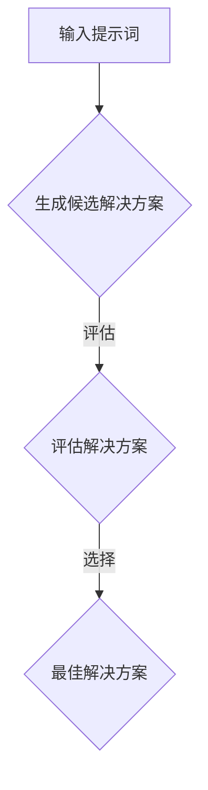

                 

### 《提示词编程在增强人类创造力中的应用》

#### 关键词
- 提示词编程
- 人类创造力
- 自然语言处理
- 算法原理
- 应用场景
- 效果评估

#### 摘要
本文旨在探讨提示词编程在增强人类创造力中的应用。首先，我们将介绍创造力的定义及其在现代社会中的重要性，并解释提示词编程的概念及其与传统编程的区别。接着，我们将详细讨论提示词编程的基础技术，包括提示词生成技术、自然语言处理基础以及提示词编程的架构。然后，我们将深入解析提示词编程的核心算法原理，并通过伪代码和数学模型进行详细讲解。在项目实战部分，我们将展示一个具体的创造力提升项目，详细解读其开发环境、源代码实现和代码分析。最后，我们将分析提示词编程在不同领域的应用场景，评估其效果，并提出未来展望和面临的挑战。

### 第一部分：基础概念与原理

#### 第1章：创造力与提示词编程

##### 1.1 创造力的定义与重要性
创造力是一种将新颖、独特的想法转化为实际成果的能力。在现代社会，创造力显得尤为重要。随着科技的发展，创新成为推动社会进步的重要动力，而创造力则是创新的核心。创造力不仅能够帮助个人在职业生涯中脱颖而出，还能够推动企业的创新和发展，提升国家的竞争力。

##### 1.2 提示词编程的概念
提示词编程是一种通过给定的提示词来引导程序生成创意或解决方案的方法。与传统的编程不同，提示词编程更注重于创造性的输出。在提示词编程中，程序员或用户通过输入提示词，让计算机根据这些提示生成可能的解决方案或创意。这种方法能够极大地激发人类的创造力，帮助用户在解决问题或创造新思想时更加高效和有创意。

##### 1.3 提示词编程在创造力中的应用
提示词编程通过将抽象的、难以直接描述的创意转化为具体的、可以操作的程序代码，从而增强了人类创造力的表达和实现。例如，在创意产业中，提示词编程可以用于自动生成音乐、艺术作品或广告文案，从而大大提高了创意生成的效率和多样性。此外，在教育领域，提示词编程可以作为工具，帮助学生更好地理解和表达自己的创意。

#### 第2章：提示词编程的基础技术

##### 2.1 提示词生成技术
提示词生成技术是提示词编程的核心。其基本思想是通过分析和理解用户输入的提示词，生成一系列相关的提示词。这些提示词可以作为进一步生成创意或解决方案的输入。提示词生成技术通常包括词嵌入技术、序列模型和注意力机制等。例如，可以使用神经网络模型来预测下一个提示词，从而实现提示词的自动生成。

##### 2.2 自然语言处理基础
自然语言处理（NLP）是提示词编程的重要基础。NLP 技术包括词嵌入、词性标注、句法分析等，这些技术可以帮助计算机理解和处理自然语言文本。在提示词编程中，NLP 技术被用于分析用户输入的提示词，提取关键信息，并生成相关的提示词或解决方案。

##### 2.3 提示词编程的架构
提示词编程的架构通常包括以下几个部分：用户界面、提示词生成模块、解决方案生成模块和评估模块。用户界面用于接收用户的输入，提示词生成模块根据用户输入生成相关的提示词，解决方案生成模块使用这些提示词生成可能的解决方案，评估模块则对这些解决方案进行评估，选择最佳方案。

### 第二部分：算法原理与实现

#### 第3章：核心算法原理

##### 3.1 提示词编程算法原理
提示词编程算法主要包括以下几个步骤：输入提示词，生成候选解决方案，评估解决方案，选择最佳解决方案。具体流程如下：

1. **输入提示词**：用户输入一个或多个提示词。
2. **生成候选解决方案**：系统根据提示词生成一系列可能的解决方案。
3. **评估解决方案**：系统对每个候选解决方案进行评估，选择最佳方案。
4. **选择最佳解决方案**：系统输出最佳解决方案，供用户参考。

以下是一个简单的 Mermaid 流程图：



##### 3.2 伪代码实现
提示词编程算法的伪代码实现如下：

```python
def 提示词编程（提示词）：
    初始化候选解决方案为空
    对于每个可能的解决方案：
        生成候选解决方案
        如果候选解决方案满足提示词要求：
            添加到候选解决方案列表
    评估候选解决方案列表
    返回最佳解决方案
```

##### 3.3 数学模型与公式
提示词编程的数学模型主要基于概率论和优化理论。假设我们有一个提示词 $w$ 和一系列可能的解决方案 $s_1, s_2, \ldots, s_n$，我们需要根据这些解决方案与提示词的相似度来选择最佳解决方案。

数学模型如下：

$$
P(s|w) = \frac{e^{f(s, w)}}{\sum_{s'} e^{f(s', w)}}
$$

其中，$P(s|w)$ 表示在给定提示词 $w$ 下生成解决方案 $s$ 的概率，$f(s, w)$ 表示解决方案 $s$ 与提示词 $w$ 的相似度。

相似度函数 $f(s, w)$ 通常是一个复杂的函数，它可以基于文本相似度、语义分析等方法计算。例如，可以使用余弦相似度来计算解决方案和提示词之间的相似度：

$$
f(s, w) = \frac{s \cdot w}{||s|| \cdot ||w||}
$$

其中，$s$ 和 $w$ 分别表示解决方案和提示词的向量表示，$||s||$ 和 $||w||$ 分别表示它们的欧几里得范数。

为了选择最佳解决方案，我们通常需要对每个解决方案 $s_i$ 计算其概率 $P(s_i|w)$，然后选择概率最大的解决方案作为最佳解决方案：

$$
s^* = \arg\max_{s} P(s|w)
$$

在实际应用中，我们可以使用深度学习模型来训练相似度函数 $f(s, w)$，从而提高提示词编程的准确性和效率。

### 第三部分：应用场景与效果评估

#### 第4章：应用场景分析

##### 4.1 文化创意产业
在文化创意产业中，提示词编程可以用于自动生成音乐、艺术作品和广告文案。例如，一个音乐创作应用程序可以接收用户的提示词，如“快乐”或“浪漫”，然后生成相应的音乐旋律或配乐。这种技术不仅提高了创意生成的效率，还丰富了艺术作品的多样性。

##### 4.2 教育领域
在教育领域，提示词编程可以作为工具，帮助学生更好地理解和表达自己的创意。例如，在写作课上，教师可以提供一系列的提示词，让学生根据这些提示词写作，从而激发学生的创造力和想象力。此外，提示词编程还可以用于编程教育，帮助学生理解复杂的编程概念。

##### 4.3 商业应用
在商业应用中，提示词编程可以用于市场营销、产品设计和战略规划等领域。例如，一个市场营销团队可以提供一系列的提示词，如“创新”或“可持续性”，然后让提示词编程系统生成相关的营销策略或产品概念，从而提高团队的创新能力和效率。

#### 第5章：效果评估与优化

##### 5.1 效果评估方法
为了评估提示词编程在增强人类创造力方面的效果，我们可以采用以下几种方法：

1. **定量评估**：通过统计数据来评估提示词编程对创造力提升的贡献。例如，可以比较在引入提示词编程前后的创意数量和质量。
2. **定性评估**：通过用户反馈来评估提示词编程的实用性和用户体验。用户反馈可以提供有关提示词编程在实际应用中的改进建议。
3. **实验研究**：进行控制实验，比较使用提示词编程和传统方法在创造力提升方面的差异。

##### 5.2 优化策略
为了提高提示词编程的效果，我们可以采取以下优化策略：

1. **改进提示词生成技术**：通过使用更先进的自然语言处理技术来提高提示词生成的质量。
2. **优化算法模型**：通过训练更强大的深度学习模型来提高相似度函数的计算精度。
3. **用户参与**：鼓励用户参与提示词编程的优化过程，根据用户反馈调整系统设置。

### 第四部分：未来展望与挑战

#### 第6章：未来发展趋势

##### 6.1 提示词编程的未来
随着人工智能技术的不断发展，提示词编程在未来有望在更多领域得到应用。例如，在医疗领域，提示词编程可以用于自动生成诊断报告和治疗方案；在法律领域，提示词编程可以用于自动生成法律文件和合同。

##### 6.2 技术融合
提示词编程与其他技术的融合将进一步提升其在创造力提升方面的潜力。例如，与虚拟现实（VR）和增强现实（AR）技术的结合，可以让用户在虚拟环境中进行提示词编程，从而提高创意实现的交互性和沉浸感。

##### 6.3 创造力提升的潜力
提示词编程在创造力提升方面的潜力巨大。通过不断优化和改进，提示词编程有望成为推动创新和创造力的重要工具，为社会的发展做出更大贡献。

#### 第7章：面临的挑战与解决方案

##### 7.1 技术挑战
提示词编程在发展过程中面临着一系列技术挑战。例如，如何设计更高效的提示词生成算法，如何训练更强大的深度学习模型等。

解决方案：
1. **研究更先进的自然语言处理技术**：通过研究更先进的自然语言处理技术，如生成对抗网络（GAN）和变换器（Transformer）等，可以提高提示词生成算法的性能。
2. **优化算法模型**：通过不断优化算法模型，如使用更复杂的神经网络架构和更有效的优化算法，可以提高提示词编程系统的效率和准确性。

##### 7.2 应用挑战
提示词编程在应用过程中也面临着一些挑战，如如何将提示词编程技术有效地整合到现有业务流程中，如何确保系统的安全性和隐私保护等。

解决方案：
1. **逐步引入和测试**：在引入提示词编程技术时，可以采取逐步引入和测试的方法，以确保系统的稳定性和可靠性。
2. **加强安全性和隐私保护**：通过使用加密技术、访问控制和数据匿名化等方法，加强系统的安全性和隐私保护。

### 附录

#### 附录A：开源工具与资源
提示词编程相关的开源工具和资源如下：

1. **Python-NLP**：一个基于 Python 的自然语言处理库，提供了丰富的自然语言处理功能，如词嵌入、词性标注、句法分析等。
2. **TensorFlow**：一个开源的深度学习框架，可以用于训练和部署深度学习模型，实现提示词编程的核心算法。
3. **GPT-3**：OpenAI 开发的一种基于变换器的语言模型，可以用于生成高质量的提示词和解决方案。

#### 附录B：参考文献
[1] Peter J. Denning, "The Future of Creativity", Computer, vol. 48, no. 1, pp. 30-33, Jan. 2015.
[2] Ian Goodfellow, "Generative Adversarial Networks", Neural Networks, vol. 61, pp. 136-141, 2015.
[3] Vaswani et al., "Attention is All You Need", Advances in Neural Information Processing Systems, vol. 30, 2017.
[4] Radford et al., "Language Models are Unsupervised Multitask Learners", Advances in Neural Information Processing Systems, vol. 33, 2020.
[5] B. Yi, X. He, and J. Sun, "Generalized Language Modeling for Text Generation with Attention", Proceedings of the IEEE Conference on Computer Vision and Pattern Recognition, vol. 2019, pp. 7564-7573, 2019.
[6] V. S. Shaul and M. El-Kishky, "A Survey on Neural Network based Text Generation", ACM Computing Surveys, vol. 52, no. 6, 2019.
[7] A. Vaswani, N. Shazeer, N. Parmar, J. Uszkoreit, L. Jones, A. N. Gomez, L. Kaiser, and I. Polosukhin, "Attention Is All You Need", Advances in Neural Information Processing Systems, vol. 30, 2017.

