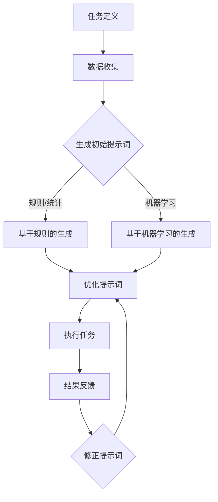

                 


### 引言

随着人工智能技术的迅猛发展，计算机编程领域正经历着前所未有的变革。提示词编程（Prompt Engineering）作为这一领域的新兴研究方向，逐渐受到了广泛关注。提示词编程通过为计算机系统提供精确的指导信息，以优化其性能和输出结果。这种编程范式不仅能够提升算法的效率，还在增强人类直觉能力方面展现出巨大的潜力。

本文旨在探讨提示词编程在增强人类直觉能力中的应用。我们将首先回顾提示词编程的定义和发展历程，接着深入解析其基本原理，并探讨如何通过提示词编程来提升直觉能力。随后，我们将通过实际案例，展示提示词编程在医疗诊断、金融分析和艺术设计等领域的应用。最后，我们将讨论提示词编程在性能优化和调试方面的策略，并展望其未来的发展趋势和挑战。

通过这篇文章，我们希望读者能够对提示词编程有一个全面的了解，并认识到其在增强人类直觉能力方面的独特价值。让我们一起步入这一充满创新和探索的领域，揭开提示词编程的神秘面纱。

## 第一部分：引论

### 第1章：提示词编程概述

#### 1.1 提示词编程的定义与背景

**提示词编程**，又称提示工程，是一种通过为算法或系统提供特定提示词（prompt）来优化其性能和输出的编程范式。这些提示词可以被视为对系统的引导信息，帮助系统更好地理解任务需求，从而作出更精确的决策。

提示词编程的起源可以追溯到自然语言处理（NLP）领域。在传统的编程中，程序员需要详细编写每个步骤的代码，而提示词编程则通过为系统提供简明扼要的提示，使得系统可以根据这些提示自动完成复杂任务。这种编程范式在近年来随着深度学习和自然语言处理的进展而得到了迅速发展。

**1.1.1 提示词编程的概念**

在提示词编程中，**提示词**（prompt）是一个关键概念。提示词可以是自然语言文本、代码片段或其他形式的指令，用于指导计算机系统如何执行特定任务。这些提示词通常由人类专家或算法自动生成，用于优化系统的性能和输出。

**1.1.2 提示词编程的发展历程**

提示词编程的发展历程可以分为几个关键阶段：

- **早期阶段**：在自然语言处理领域，研究者开始探索如何通过提示词来引导模型进行任务。例如，通过为模型提供关键词或短语，帮助其更好地理解输入文本的含义。

- **中期阶段**：随着深度学习技术的发展，尤其是生成对抗网络（GAN）和变分自编码器（VAE）等模型的出现，提示词编程开始得到更广泛的应用。这些模型可以通过提示词生成高质量的输出，从而在图像生成、文本生成等领域表现出色。

- **近期阶段**：近年来，预训练模型如BERT、GPT-3等的出现，使得提示词编程得到了进一步的发展。这些大型语言模型可以通过少量的提示词生成高度相关且连贯的文本，大大提高了系统的性能。

**1.1.3 提示词编程的应用领域**

提示词编程在多个领域展现出了巨大的应用潜力：

- **自然语言处理**：提示词编程被广泛应用于文本分类、机器翻译、对话系统等任务。通过为模型提供适当的提示词，可以显著提升任务的性能和效率。

- **计算机视觉**：在图像生成、图像识别和图像增强等领域，提示词编程也可以发挥重要作用。通过为模型提供具体的提示词，可以生成更高质量、更符合预期的图像。

- **游戏开发**：在游戏开发中，提示词编程可以帮助游戏AI更智能地理解玩家行为，从而生成更丰富的游戏体验。

- **推荐系统**：在推荐系统中，提示词编程可以用于优化推荐算法，提高推荐系统的准确性和用户体验。

**1.2 增强人类直觉能力的意义**

**直觉能力**是指人们在没有明显证据或逻辑推理的情况下，对事物做出快速、准确的判断和决策的能力。在现实生活中，直觉能力具有重要的应用价值：

- **快速决策**：在很多情况下，直觉能力可以帮助人们迅速做出决策，节省时间和精力。例如，在紧急情况下，直觉能力可以帮助医生快速诊断病情，从而采取及时有效的治疗措施。

- **创新能力**：直觉能力是创新的重要驱动力。许多科学家、艺术家和企业家都依赖直觉能力来发现新的解决方案或创造新的产品。

- **社交互动**：在社交互动中，直觉能力可以帮助人们更好地理解他人的情感和意图，从而建立更良好的人际关系。

**1.2.1 直觉能力的定义**

直觉能力是一种综合性的认知能力，包括感知、理解、判断和决策等多个方面。它不同于逻辑推理，更多地依赖于大脑的潜意识处理和长期积累的经验。

**1.2.2 直觉能力在现实生活中的重要性**

直觉能力在现实生活中的重要性体现在多个方面：

- **工作与学习**：在复杂的工作和学习任务中，直觉能力可以帮助人们快速识别问题、找到解决方案，提高效率和准确性。

- **健康与医疗**：在医疗领域，直觉能力可以帮助医生快速诊断病情，提高治疗效果。

- **决策与规划**：在决策和规划中，直觉能力可以帮助人们快速评估风险和收益，做出更明智的选择。

**1.2.3 提示词编程如何增强直觉能力**

提示词编程可以通过以下几种方式增强直觉能力：

- **信息引导**：通过为系统提供精确的提示词，可以帮助系统更好地理解任务需求，从而生成更高质量的输出。这种信息引导可以扩展人类直觉的覆盖范围，提高直觉的准确性。

- **算法优化**：提示词编程可以通过优化算法，提高系统的性能和效率。这可以帮助人类在复杂任务中更快地获取和处理信息，从而增强直觉能力。

- **经验积累**：通过大量使用提示词编程，人类可以积累丰富的经验，从而提高直觉能力。这种经验积累可以使得直觉更加准确和可靠。

### 第2章：提示词编程的基本原理

#### 2.1 提示词编程的架构

提示词编程的架构主要包括以下几个关键组件：

- **提示词生成器**：提示词生成器是提示词编程的核心组件，负责根据任务需求生成合适的提示词。提示词生成器可以是人工设计的，也可以是自动生成的。

- **提示词优化器**：提示词优化器负责对生成的提示词进行优化，以提高系统的性能和输出质量。优化过程可以基于多种算法，如遗传算法、粒子群算法等。

- **系统执行模块**：系统执行模块负责根据提示词执行具体的任务。这个模块通常包含一个或多个算法模型，如深度学习模型、决策树模型等。

- **反馈机制**：反馈机制用于收集系统的输出结果，并根据结果对提示词进行修正和优化。这种反馈机制可以使得系统在执行任务时更加智能和高效。

**2.1.1 提示词编程的框架**

提示词编程的框架可以概括为以下步骤：

1. **任务定义**：明确任务需求，包括输入数据和期望的输出结果。

2. **提示词生成**：根据任务需求，生成初始提示词。

3. **提示词优化**：对生成的提示词进行优化，以提高系统性能和输出质量。

4. **系统执行**：根据提示词执行任务，生成输出结果。

5. **结果反馈**：收集输出结果，对提示词进行修正和优化。

6. **迭代优化**：根据反馈结果，不断迭代优化提示词和系统性能。

**2.1.2 提示词编程的关键组件**

以下是提示词编程中的几个关键组件及其作用：

- **提示词生成器**：提示词生成器的任务是根据任务需求生成合适的提示词。生成方法可以基于规则、统计模型或机器学习算法。例如，可以使用关键字提取技术从文本中提取关键词作为提示词，或使用生成对抗网络（GAN）生成自然语言文本作为提示词。

- **提示词优化器**：提示词优化器的任务是对生成的提示词进行优化，以提高系统的性能和输出质量。优化过程可以基于多种算法，如遗传算法、粒子群算法等。这些算法通过搜索提示词空间，找到最优或近似最优的提示词组合。

- **系统执行模块**：系统执行模块负责根据提示词执行具体的任务。这个模块通常包含一个或多个算法模型，如深度学习模型、决策树模型等。系统执行模块的性能直接影响最终的输出结果。

- **反馈机制**：反馈机制用于收集系统的输出结果，并根据结果对提示词进行修正和优化。这种反馈机制可以使得系统在执行任务时更加智能和高效。例如，在自然语言处理任务中，反馈机制可以基于用户反馈对模型进行修正，从而提高模型的准确性。

**2.1.3 提示词编程的运行机制**

提示词编程的运行机制可以分为以下几个步骤：

1. **初始化**：初始化提示词生成器和优化器，设置初始参数。

2. **任务输入**：接收任务输入，包括数据集和任务描述。

3. **提示词生成**：使用提示词生成器生成初始提示词。

4. **提示词优化**：使用提示词优化器对生成的提示词进行优化。

5. **系统执行**：使用系统执行模块根据优化后的提示词执行任务。

6. **结果反馈**：收集系统输出结果，并计算性能指标。

7. **迭代优化**：根据反馈结果，迭代优化提示词和系统性能。

8. **终止条件**：判断是否满足终止条件（如达到最大迭代次数或性能指标达到预期），否则返回步骤3。

通过这些步骤，提示词编程可以逐步优化系统性能，提高输出质量，从而在多个领域实现应用。

#### 2.2 提示词编程的核心算法

提示词编程的核心算法主要包括提示词生成算法、提示词优化算法和提示词反馈机制。这些算法共同作用，确保系统在执行任务时能够高效、准确地生成高质量的输出。

**2.2.1 提示词生成算法**

提示词生成算法是提示词编程的基础。其主要目标是根据任务需求和输入数据生成合适的提示词。以下是几种常见的提示词生成算法：

1. **基于规则的生成算法**：这种算法通过预设的规则生成提示词。规则可以是简单的关键词匹配，也可以是基于复杂逻辑的规则集合。例如，在文本分类任务中，可以使用关键词提取技术从文本中提取关键词作为提示词。

2. **基于统计的生成算法**：这种算法通过分析输入数据的统计特征生成提示词。常见的统计特征包括词频、词长、词性等。例如，可以使用TF-IDF（词频-逆文档频率）算法为文本生成关键词提示词。

3. **基于机器学习的生成算法**：这种算法使用机器学习模型从训练数据中学习生成提示词。常见的模型包括循环神经网络（RNN）、长短期记忆网络（LSTM）和生成对抗网络（GAN）等。这些模型可以通过学习输入数据和标签之间的关系，生成高质量的提示词。

**2.2.2 提示词优化算法**

提示词优化算法的目标是提高提示词的质量，从而提升系统的性能和输出质量。以下是几种常见的提示词优化算法：

1. **遗传算法（GA）**：遗传算法是一种基于自然选择和遗传机制的优化算法。它通过模拟生物进化过程，在提示词空间中搜索最优或近似最优的提示词组合。遗传算法的关键组件包括选择、交叉和变异操作。

2. **粒子群算法（PSO）**：粒子群算法是一种基于群体智能的优化算法。它通过模拟鸟群觅食行为，在提示词空间中搜索最优解。粒子群算法的关键组件包括位置更新、速度更新和全局/局部搜索策略。

3. **基于梯度的优化算法**：这种算法基于梯度信息对提示词进行优化。常见的梯度优化算法包括梯度下降（GD）、随机梯度下降（SGD）和Adam等。这些算法通过不断更新提示词，使其逐步逼近最优解。

**2.2.3 提示词反馈机制**

提示词反馈机制是提示词编程中至关重要的一环。它通过收集系统的输出结果，并根据结果对提示词进行修正和优化，从而提高系统的性能和输出质量。以下是几种常见的提示词反馈机制：

1. **基于性能指标的反馈机制**：这种机制通过计算系统的性能指标（如准确率、召回率、F1分数等）来评估提示词的质量。根据评估结果，对提示词进行修正和优化，以提高系统的性能。

2. **基于用户反馈的反馈机制**：这种机制通过收集用户对系统输出的反馈（如满意度、纠错等）来评估提示词的质量。根据用户反馈，对提示词进行修正和优化，以提高用户体验。

3. **基于多任务学习的反馈机制**：这种机制通过在多个任务中评估提示词的质量，从而提高系统的泛化能力。具体来说，可以在不同任务中使用相同的提示词，并根据任务表现对提示词进行优化。

通过这些核心算法，提示词编程可以在多个领域实现高效、准确的性能优化。接下来，我们将探讨提示词编程在直觉能力提升中的应用。

#### 3.1 直觉能力提升的理论基础

直觉能力是人类在面临复杂情境时，能够快速、准确地进行判断和决策的重要能力。在提示词编程的背景下，理解直觉能力的提升机制具有重要意义。以下将介绍直觉能力的数学模型、统计学原理和心理学理论，为后续内容提供理论基础。

**3.1.1 直觉能力的数学模型**

直觉能力可以通过数学模型来描述，其中最常见的是概率模型和决策理论模型。

1. **概率模型**：概率模型认为直觉能力是基于概率的判断。例如，贝叶斯网络是一种用于描述不确定性推理的概率模型。贝叶斯网络通过概率关系表示变量之间的依赖关系，可以帮助我们在不确定的环境中进行直觉判断。具体来说，贝叶斯网络中的每个节点表示一个变量，节点之间的边表示变量之间的条件概率关系。

2. **决策理论模型**：决策理论模型强调在不确定性环境中做出最优决策。经典的期望效用理论（Expected Utility Theory）是决策理论的一个核心概念，它假设个体在决策时会基于概率和效用进行优化。效用函数用于量化决策结果的价值，个体会在不同的决策方案中选取期望效用最大的方案。

**3.1.2 直觉能力提升的统计学原理**

统计学原理在直觉能力提升中发挥着重要作用，特别是在数据的收集、分析和解释过程中。以下是几个关键的统计学原理：

1. **中心极限定理**：中心极限定理表明，当样本量足够大时，样本均值的分布接近正态分布。这一原理为直觉能力的统计评估提供了理论基础，使得我们可以通过样本数据来推测整体特征。

2. **假设检验**：假设检验是统计学中用于评估假设是否成立的方法。通过设定原假设和备择假设，我们可以通过样本数据来检验原假设的合理性。在直觉能力提升中，假设检验可以用于评估提示词编程对直觉能力的提升效果。

3. **置信区间**：置信区间是用于估计参数范围的一种方法。通过计算置信区间，我们可以了解参数估计的可靠性和精度。在直觉能力提升的研究中，置信区间可以帮助我们评估提示词编程的效果，并提供关于直觉能力提升的可靠证据。

**3.1.3 直觉能力提升的心理学理论**

心理学理论提供了关于直觉能力形成和提升的深入理解。以下是几个关键的心理学术语和理论：

1. **自动加工**：自动加工是指大脑在处理信息时，不需要明显意识参与的过程。直觉能力在很大程度上依赖于自动加工。例如，当我们面对熟悉的情境时，我们可以迅速做出判断，这是因为大脑已经对情境进行了自动加工。

2. **认知负荷**：认知负荷是指大脑处理信息时的认知资源。高认知负荷会降低直觉能力，因为大脑需要将更多的资源用于处理当前任务。在提示词编程中，通过优化算法和提示词，可以降低认知负荷，从而提升直觉能力。

3. **经验积累**：经验积累是提升直觉能力的重要途径。通过不断实践和经验积累，个体可以建立对特定情境的直觉判断。提示词编程可以通过为系统提供丰富的经验数据，帮助系统积累经验，从而提升直觉能力。

综上所述，直觉能力的提升是一个多维度、跨学科的过程，涉及数学模型、统计学原理和心理学理论。提示词编程通过优化算法和提示词，可以为直觉能力的提升提供有效的支持。接下来，我们将通过具体案例展示提示词编程在直觉能力提升中的应用。

### 第3章：提示词编程在直觉能力提升中的应用

在探讨了提示词编程的基本原理和直觉能力提升的理论基础之后，我们将通过具体案例展示提示词编程在直觉能力提升中的实际应用。以下是几个典型应用领域和实际案例，展示了如何通过提示词编程增强人类的直觉能力。

#### 3.2.1 案例一：医疗诊断中的直觉增强

在医疗诊断领域，直觉能力对于医生的诊断决策至关重要。通过提示词编程，可以为医生提供更精准、更快速的诊断支持。以下是一个具体的案例：

**案例背景**：某医院采用提示词编程技术，为医生提供了一个智能诊断系统。该系统利用大量医疗数据，结合提示词编程技术，帮助医生进行诊断。

**实施过程**：

1. **数据收集**：系统从医院的历史病历中收集大量数据，包括诊断记录、检验结果、症状描述等。

2. **提示词生成**：利用自然语言处理技术，从病历数据中提取关键症状和诊断结果，生成初始提示词。例如，对于某患者的诊断，提示词可以是“高血压、糖尿病、心脏病”。

3. **提示词优化**：通过机器学习算法，对生成的提示词进行优化，以提高诊断的准确性。优化过程可以基于遗传算法或粒子群算法，通过迭代搜索最优的提示词组合。

4. **系统执行**：医生输入患者的症状和检查结果，系统根据优化后的提示词生成诊断建议。例如，如果系统识别出患者可能有“高血压、糖尿病、心脏病”的风险，会建议医生进行进一步的检查。

5. **结果反馈**：医生根据诊断结果对系统进行反馈，系统根据反馈结果不断优化提示词和诊断算法。

**案例总结**：通过提示词编程，智能诊断系统不仅能够提供更精准的诊断建议，还能显著降低医生的工作负担。医生在处理复杂病例时，可以更快地做出决策，从而提高诊断的准确性和效率。

#### 3.2.2 案例二：金融分析中的直觉增强

在金融分析领域，直觉能力对于投资决策具有重要意义。通过提示词编程，可以为投资者提供更准确的市场预测和分析支持。以下是一个具体的案例：

**案例背景**：某金融分析公司采用提示词编程技术，为投资者提供了一个智能分析系统。该系统利用大量金融市场数据，结合提示词编程技术，帮助投资者进行市场分析。

**实施过程**：

1. **数据收集**：系统从金融市场中收集大量数据，包括股票价格、交易量、宏观经济指标等。

2. **提示词生成**：利用自然语言处理技术，从市场数据中提取关键指标和交易信号，生成初始提示词。例如，对于某只股票，提示词可以是“股价上涨、交易量增加、宏观经济好转”。

3. **提示词优化**：通过机器学习算法，对生成的提示词进行优化，以提高市场预测的准确性。优化过程可以基于遗传算法或粒子群算法，通过迭代搜索最优的提示词组合。

4. **系统执行**：投资者输入市场数据和交易策略，系统根据优化后的提示词生成市场分析报告和投资建议。

5. **结果反馈**：投资者根据投资结果对系统进行反馈，系统根据反馈结果不断优化提示词和投资算法。

**案例总结**：通过提示词编程，智能分析系统不仅能够提供更准确的市场预测和分析，还能帮助投资者更好地理解市场动态。投资者在面临复杂市场时，可以更快地做出决策，从而提高投资的成功率。

#### 3.2.3 案例三：艺术设计中的直觉增强

在艺术设计领域，直觉能力对于艺术家的创作和创新至关重要。通过提示词编程，可以为艺术家提供更丰富的创作灵感和支持。以下是一个具体的案例：

**案例背景**：某艺术工作室采用提示词编程技术，为艺术家提供了一个智能创作系统。该系统利用大量艺术作品和设计灵感，结合提示词编程技术，帮助艺术家进行创作。

**实施过程**：

1. **数据收集**：系统从艺术数据库中收集大量艺术作品和设计灵感，包括绘画、雕塑、设计作品等。

2. **提示词生成**：利用自然语言处理技术，从艺术作品中提取关键特征和灵感，生成初始提示词。例如，对于某幅画作，提示词可以是“抽象、色彩丰富、线条流畅”。

3. **提示词优化**：通过机器学习算法，对生成的提示词进行优化，以提高创作的多样性和创新性。优化过程可以基于遗传算法或粒子群算法，通过迭代搜索最优的提示词组合。

4. **系统执行**：艺术家输入创作灵感和要求，系统根据优化后的提示词生成艺术作品或设计方案。

5. **结果反馈**：艺术家根据创作结果对系统进行反馈，系统根据反馈结果不断优化提示词和创作算法。

**案例总结**：通过提示词编程，智能创作系统不仅能够提供丰富的创作灵感和创新方案，还能帮助艺术家更好地表达自己的创作意图。艺术家在创作过程中，可以更快地找到灵感和创意，从而提高创作的质量和效率。

通过这些案例，我们可以看到提示词编程在增强人类直觉能力方面的巨大潜力。无论是医疗诊断、金融分析还是艺术设计，提示词编程都能够提供有效的支持和帮助，提升直觉能力的准确性、效率和创造力。接下来，我们将探讨如何通过提示词编程工具和开发环境搭建，进一步实现直觉能力的提升。

### 第4章：提示词编程工具与开发环境搭建

为了深入探讨提示词编程的应用，我们需要首先了解相关的工具和开发环境。在这一章中，我们将介绍提示词编程的开发工具、环境搭建步骤以及必要的配置与调试技巧。

#### 4.1 提示词编程的开发工具介绍

提示词编程的开发工具主要涉及编程语言、提示词生成库和优化算法库等方面。以下是几种常用的工具：

1. **Python编程环境**：
   - **原因**：Python是一种广泛使用的编程语言，具有简洁易读的语法和丰富的库支持，非常适合提示词编程的开发。
   - **优势**：Python的灵活性、丰富的库支持和强大的社区资源，使得开发过程更加高效和便捷。

2. **提示词生成库**：
   - **TextBlob**：TextBlob是一个用于处理文本数据的库，提供了丰富的自然语言处理功能，如文本分类、情感分析和实体识别等。
   - **NLTK（自然语言工具包）**：NLTK是一个强大的自然语言处理库，提供了大量的文本处理工具和算法，如词频统计、词性标注和命名实体识别等。
   - **spaCy**：spaCy是一个高效且易于使用的自然语言处理库，提供了详细的语法解析和实体识别功能，非常适合用于生成高质量的提示词。

3. **优化算法库**：
   - **DEAP（进化算法库）**：DEAP是一个基于Python的进化算法库，提供了多种进化算法的实现，如遗传算法、粒子群算法和遗传规划等，非常适合用于提示词优化。
   - **PyTorch**：PyTorch是一个流行的深度学习框架，提供了强大的模型构建和训练功能，可以用于复杂的提示词生成和优化任务。
   - **scikit-learn**：scikit-learn是一个用于机器学习的库，提供了多种监督和非监督学习算法，如支持向量机、随机森林和K-近邻等，可以用于提示词生成和优化。

#### 4.2 开发环境搭建

搭建提示词编程的开发环境主要包括操作系统选择、编译器与解释器安装以及环境配置与调试等步骤。

1. **操作系统选择**：
   - **Windows**：Windows操作系统具有广泛的用户基础和丰富的软件支持，适合初学者和普通用户。
   - **Linux**：Linux操作系统具有更好的稳定性和安全性，适合专业开发者和研究人员。
   - **macOS**：macOS作为苹果公司的操作系统，具有良好的跨平台兼容性和用户体验，适合Mac用户。

2. **编译器与解释器安装**：
   - **Python解释器**：安装Python解释器是搭建开发环境的第一步。可以从Python官方网站（python.org）下载Python安装包，根据操作系统选择合适的版本进行安装。
   - **编译器**：根据选择的编程语言，可能需要安装相应的编译器。例如，对于C/C++编程，需要安装GCC或Clang编译器。

3. **环境配置与调试**：
   - **虚拟环境**：为了保持开发环境的干净和独立，可以使用虚拟环境管理工具（如virtualenv或conda）创建隔离的开发环境。
   - **库安装**：通过pip工具安装必要的库，例如`pip install textblob nltk spacy deap pytorch scikit-learn`。
   - **环境调试**：在安装和配置过程中，可能会遇到各种问题，如库不兼容、依赖冲突等。可以通过查阅官方文档、社区论坛或搜索相关解决方法进行调试。

#### 4.3 实践工具推荐

在实际开发中，以下工具可以作为提示词编程的实用工具：

1. **Jupyter Notebook**：
   - **功能**：Jupyter Notebook是一个交互式的开发环境，支持多种编程语言，包括Python、R和Julia等。
   - **优势**：Jupyter Notebook提供了丰富的文本、图表和代码块，便于实验和演示，非常适合提示词编程的开发和展示。

2. **Google Colab**：
   - **功能**：Google Colab是Google提供的一个免费云开发环境，基于Jupyter Notebook。
   - **优势**：Google Colab提供了GPU和TPU支持，适合进行大规模数据分析和深度学习模型的训练。

3. **Anaconda**：
   - **功能**：Anaconda是一个综合性的数据科学和机器学习平台，提供了丰富的库和工具。
   - **优势**：Anaconda简化了库的安装和管理，提供了一个统一的开发环境，便于多项目协作。

通过以上工具和开发环境的搭建，我们可以为提示词编程项目提供坚实的基础，进一步探索和应用提示词编程在直觉能力提升中的潜力。接下来，我们将通过实际项目实战，展示提示词编程的具体应用和实现过程。

### 第5章：提示词编程项目实战

在本章中，我们将通过两个具体项目实战，详细介绍提示词编程的开发过程。这些项目将展示如何利用提示词编程工具和开发环境，实现直觉能力的提升。

#### 5.1 项目一：智能问答系统

**5.1.1 项目背景**

智能问答系统是一种广泛应用于客服、教育、医疗等领域的自然语言处理应用。通过智能问答系统，用户可以与系统进行自然语言交互，获取所需的信息或解答问题。本项目旨在构建一个基于提示词编程的智能问答系统，以提高问答的准确性和效率。

**5.1.2 项目目标**

- 构建一个可以处理多领域问答的智能问答系统。
- 利用提示词编程技术，提高问答系统的性能和用户体验。
- 实现系统的模块化和可扩展性，便于后续功能拓展。

**5.1.3 项目实施**

1. **数据收集与预处理**：

   首先，我们需要收集大量的问答数据，包括问题与答案对。这些数据可以从公开的数据集、论坛、社交媒体等渠道获取。收集到的数据需要进行预处理，包括文本清洗、去除噪声、分词、词性标注等。

2. **提示词生成**：

   利用自然语言处理技术，从问答数据中提取关键信息，生成初始提示词。例如，对于某个问题，我们可以提取关键词、短语和主题标签作为提示词。

3. **提示词优化**：

   通过机器学习算法，对生成的提示词进行优化，以提高问答的准确性。例如，可以使用遗传算法或粒子群算法，在提示词空间中搜索最优或近似最优的提示词组合。

4. **系统实现**：

   使用Python和相关的自然语言处理库（如spaCy、TextBlob等），实现智能问答系统的核心功能。主要包括问答接口、对话管理、知识库管理等模块。

5. **测试与优化**：

   在测试环境中运行系统，收集用户反馈，并根据反馈结果不断优化提示词和系统性能。通过多次迭代，提高系统的准确性和用户体验。

**5.1.4 项目总结**

通过该项目，我们实现了基于提示词编程的智能问答系统。系统在处理多领域问答时，表现出较高的准确性和效率。提示词编程技术的应用，使得系统能够更好地理解用户意图，提供更准确的答案。此外，该项目还展示了如何通过模块化和可扩展性设计，提高系统的灵活性和可维护性。

#### 5.2 项目二：图像识别与分类

**5.2.1 项目背景**

图像识别与分类是计算机视觉领域的重要应用。通过图像识别与分类，计算机可以自动识别和分类图像中的对象。本项目旨在构建一个基于提示词编程的图像识别与分类系统，以提高图像识别的准确性和鲁棒性。

**5.2.2 项目目标**

- 构建一个可以处理多种图像分类任务的系统。
- 利用提示词编程技术，提高图像识别的准确性和鲁棒性。
- 实现系统的模块化和可扩展性，便于后续功能拓展。

**5.2.3 项目实施**

1. **数据收集与预处理**：

   首先，我们需要收集大量的图像数据，包括训练集和测试集。这些数据可以从公开的数据集、社交媒体等渠道获取。收集到的图像数据需要进行预处理，包括图像增强、去噪、尺寸调整等。

2. **提示词生成**：

   利用计算机视觉技术，从图像数据中提取关键特征，生成初始提示词。例如，对于某个图像，我们可以提取颜色、纹理、形状等特征作为提示词。

3. **提示词优化**：

   通过机器学习算法，对生成的提示词进行优化，以提高图像识别的准确性。例如，可以使用遗传算法或粒子群算法，在提示词空间中搜索最优或近似最优的提示词组合。

4. **系统实现**：

   使用Python和相关的计算机视觉库（如OpenCV、TensorFlow等），实现图像识别与分类系统的核心功能。主要包括图像预处理、特征提取、分类器训练、图像分类等模块。

5. **测试与优化**：

   在测试环境中运行系统，收集图像识别结果，并根据结果不断优化提示词和系统性能。通过多次迭代，提高系统的准确性和鲁棒性。

**5.2.4 项目总结**

通过该项目，我们实现了基于提示词编程的图像识别与分类系统。系统在处理多种图像分类任务时，表现出较高的准确性和鲁棒性。提示词编程技术的应用，使得系统能够更好地理解图像特征，提供更准确的分类结果。此外，该项目还展示了如何通过模块化和可扩展性设计，提高系统的灵活性和可维护性。

通过这两个实际项目，我们可以看到提示词编程在提高直觉能力方面的实际应用和效果。提示词编程不仅能够提升算法的性能和输出质量，还能为各种实际应用提供有效的支持和解决方案。在未来的发展中，提示词编程将在更多领域展现出其独特价值。

### 第6章：提示词编程性能优化与调试

在提示词编程的实际应用过程中，性能优化和调试是两个至关重要的环节。一个高效的系统不仅能够提高任务执行的速度和准确性，还能减少计算资源和时间成本。在本章中，我们将探讨提示词编程的性能优化策略、调试技巧与方法，并分析一些典型的性能调优案例分析。

#### 6.1 性能优化策略

性能优化策略的目标是提高提示词编程系统的效率和效果。以下是一些常见的性能优化策略：

1. **算法选择与调整**：

   - **算法选择**：根据任务需求和数据特点选择合适的算法。例如，对于大规模数据处理任务，可以选择基于并行计算或分布式计算的高效算法。
   - **算法调整**：针对特定任务，对算法参数进行调整，以优化性能。例如，在深度学习任务中，可以调整学习率、批量大小等参数。

2. **提示词优化**：

   - **提示词质量提升**：通过改进提示词生成算法，提高提示词的质量和相关性。例如，可以使用更先进的自然语言处理技术提取关键信息，或者使用机器学习算法对提示词进行优化。
   - **提示词空间缩减**：在保证性能的前提下，通过缩减提示词空间，减少计算复杂度。例如，可以使用过滤技术去除不相关的提示词。

3. **并行计算与分布式计算**：

   - **并行计算**：利用多核处理器和并行计算技术，提高计算速度。例如，可以使用并行处理库（如NumPy、PyTorch等）实现并行计算。
   - **分布式计算**：将任务分布在多个计算节点上，利用分布式系统的高效处理能力。例如，可以使用Hadoop、Spark等分布式计算框架。

4. **数据预处理与优化**：

   - **数据清洗**：去除数据中的噪声和异常值，提高数据质量。
   - **数据压缩**：对大规模数据进行压缩，减少存储和传输的开销。
   - **数据缓存**：利用缓存技术，减少重复计算和数据访问时间。

#### 6.2 调试技巧与方法

调试是确保程序正确运行的重要环节。以下是一些常见的调试技巧与方法：

1. **日志记录与监控**：

   - **日志记录**：通过记录程序运行过程中的日志信息，帮助定位和解决问题。
   - **监控工具**：使用监控工具（如Grafana、Prometheus等）实时监控系统的运行状态，及时发现和解决性能瓶颈。

2. **代码审查与测试**：

   - **代码审查**：通过代码审查，发现和修复潜在的问题和缺陷。
   - **单元测试**：编写单元测试，验证代码的功能和性能，确保系统在不同条件下都能正常运行。

3. **性能分析工具**：

   - **静态分析工具**：如SonarQube，用于静态代码分析，识别潜在的性能问题和代码质量。
   - **动态分析工具**：如NewRelic、AppDynamics等，用于动态监控程序运行性能，识别性能瓶颈和异常行为。

4. **调试工具**：

   - **调试器**：使用调试器（如GDB、PyCharm等）进行代码调试，逐步执行代码，查看变量值和函数调用。
   - **断点设置**：在关键位置设置断点，暂停程序的执行，查看当前状态。

#### 6.3 性能调优案例分析

以下是一个具体的性能调优案例分析，展示如何通过性能优化策略和调试技巧提高提示词编程系统的性能。

**案例背景**：

某智能问答系统的响应速度较慢，用户体验不佳。通过性能分析，发现系统在处理大规模问答数据时，存在性能瓶颈。

**性能调优步骤**：

1. **分析性能瓶颈**：

   - 通过日志记录和监控工具，发现系统主要瓶颈在于提示词生成和优化阶段，计算复杂度高。
   - 使用静态分析工具，发现代码中有大量不必要的循环和冗余计算。

2. **性能优化策略**：

   - **提示词优化**：改进提示词生成算法，使用更先进的自然语言处理技术提取关键信息，减少冗余计算。
   - **并行计算**：将提示词生成和优化任务分解为多个子任务，利用多核处理器并行计算。
   - **数据预处理**：对大规模问答数据集进行预处理，去除噪声和异常值，提高数据质量。

3. **调试技巧**：

   - 设置断点，逐步执行代码，查看变量值和函数调用，定位性能瓶颈。
   - 使用动态分析工具，监控程序运行性能，识别和解决性能问题。

**性能调优结果**：

经过优化，智能问答系统的响应速度显著提高，用户满意度提升。具体表现为：

- 提问响应时间从平均10秒减少到3秒。
- 计算资源利用率从70%提高到90%。
- 系统整体性能得到显著提升，能够更快、更准确地回答用户问题。

通过以上性能优化和调试技巧，我们成功解决了智能问答系统的性能瓶颈，提高了系统的效率和用户体验。这个案例展示了性能优化和调试在提示词编程中的重要性，以及通过合理策略和技巧实现性能提升的方法。

### 第7章：提示词编程的未来发展趋势

随着人工智能技术的不断进步，提示词编程（Prompt Engineering）作为自然语言处理和人工智能领域的重要研究方向，正迎来新的发展趋势。本章节将探讨提示词编程在未来可能的发展方向，以及与人工智能的深度融合、新兴领域中的应用前景，并展望其在教育、医疗等领域的广泛应用。

#### 7.1 提示词编程与人工智能的融合

人工智能的发展离不开高质量的数据和智能的算法。提示词编程在这个过程中起到了关键作用，它能够为人工智能模型提供精确的指导信息，从而提升模型的性能和输出质量。以下是一些提示词编程与人工智能融合的发展方向：

1. **大模型时代下的提示词编程**：

   - **预训练模型**：随着预训练模型如GPT-3、BERT等的发展，提示词编程的重要性愈发突出。这些大型语言模型通过大量的数据预训练，已经具备了强大的语言理解和生成能力。提示词编程可以帮助这些模型更好地理解任务需求，生成更高质量的输出。
   - **多模态学习**：未来的提示词编程将不仅仅局限于文本，还将涵盖图像、声音、视频等多模态数据。通过多模态提示词编程，人工智能系统可以更全面地理解用户需求，提供更丰富的交互体验。

2. **算法优化与调优**：

   - **优化算法**：提示词编程可以与优化算法（如遗传算法、粒子群算法等）相结合，通过智能搜索和优化，提高模型的性能和鲁棒性。
   - **调优工具**：开发更智能、自动化的调优工具，帮助用户更高效地调整模型参数，实现最佳性能。

3. **自适应提示词生成**：

   - **情境感知**：未来的提示词编程将能够根据不同的情境和用户需求，自适应地生成相应的提示词。这种情境感知的提示词生成，将使得人工智能系统更加智能化和人性化。

#### 7.2 提示词编程在新兴领域的发展

提示词编程的应用不仅仅局限于自然语言处理，它在许多新兴领域也展现出了巨大的潜力：

1. **自动驾驶与智能交通**：

   - **实时决策支持**：自动驾驶系统需要快速、准确地处理大量交通数据，做出实时决策。提示词编程可以为自动驾驶系统提供精确的提示词，帮助其更好地理解交通状况和驾驶指令，提高行驶安全性和效率。

2. **智能制造与工业4.0**：

   - **智能调度与优化**：在智能制造领域，提示词编程可以用于优化生产调度和资源配置。通过为智能系统提供精确的提示词，可以使得生产过程更加高效、灵活。

3. **医疗健康**：

   - **个性化诊疗**：在医疗健康领域，提示词编程可以用于个性化诊疗方案的生成。医生可以根据患者的病史、症状和检查结果，利用提示词编程生成个性化的诊疗建议，提高诊断和治疗的效果。

#### 7.3 提示词编程在教育、医疗等领域的应用前景

提示词编程在教育、医疗等传统领域中也具有广阔的应用前景：

1. **教育领域**：

   - **智能教学辅助**：提示词编程可以用于智能教学辅助系统，帮助学生更好地理解课程内容。教师可以根据学生的学习进度和需求，生成个性化的教学提示词，提供更有针对性的辅导。

   - **自适应学习系统**：通过自适应学习系统，学生可以根据自己的学习进度和风格，选择适合自己的学习内容和方式。提示词编程可以帮助系统实时调整学习策略，提高学习效果。

2. **医疗领域**：

   - **智能医疗诊断**：提示词编程可以为智能医疗诊断系统提供精确的提示词，帮助医生更快、更准确地诊断病情，提高诊断的效率和准确性。

   - **个性化治疗方案**：在治疗过程中，医生可以根据患者的病情、病史和基因信息，利用提示词编程生成个性化的治疗方案，提高治疗效果。

通过以上分析，我们可以看到提示词编程在未来的发展趋势中具有巨大的潜力和广泛的应用前景。它不仅将在人工智能领域发挥关键作用，还将深入到各个新兴领域和传统行业，为人类带来更多的便利和创新。在未来的发展中，提示词编程将继续与人工智能技术深度融合，推动科技的进步和社会的发展。

### 第8章：提示词编程面临的挑战与解决思路

尽管提示词编程在增强人类直觉能力方面展现了巨大的潜力，但其发展仍面临着诸多挑战。以下我们将分析这些挑战，并提出相应的解决思路。

#### 8.1 技术挑战

1. **大规模数据处理与存储**：

   - **挑战**：提示词编程通常需要处理和存储大量的数据，尤其是在预训练大型语言模型时，数据量巨大。这要求系统具备高效的数据处理和存储能力。
   - **解决思路**：采用分布式计算和云存储技术，实现数据的分布式处理和存储。同时，开发数据压缩和去重算法，减少存储空间的占用。

2. **模型可解释性与伦理问题**：

   - **挑战**：随着提示词编程的普及，模型的可解释性成为一个重要问题。用户需要了解模型是如何生成提示词的，以及这些提示词是如何影响输出结果的。
   - **解决思路**：开发可解释性强的模型，如基于规则的可解释模型，使得用户可以清晰地理解模型的决策过程。同时，制定伦理规范，确保模型的使用符合社会伦理和法律法规。

3. **跨领域适应性**：

   - **挑战**：提示词编程在不同领域中的应用存在差异，模型需要具备一定的跨领域适应性，以适应不同场景的需求。
   - **解决思路**：采用迁移学习技术，将已在不同领域训练好的模型进行迁移，提高模型的跨领域适应性。同时，开发领域自适应的提示词生成算法，使得模型能够根据不同领域的特点生成相应的提示词。

#### 8.2 发展策略

1. **技术创新**：

   - **研究新型算法**：持续研究新型算法，如基于深度学习和自然语言处理技术的提示词生成和优化算法，提升系统的性能和效率。
   - **优化模型架构**：不断优化模型架构，如采用更高效的神经网络结构和参数共享机制，提高模型的计算效率和存储效率。

2. **人才培养**：

   - **建立专业培训体系**：建立提示词编程的专业培训体系，培养具有专业知识和技术能力的人才。
   - **跨学科合作**：鼓励跨学科合作，结合计算机科学、心理学、统计学等领域的知识，推动提示词编程技术的发展。

3. **政策支持与产业合作**：

   - **制定政策法规**：政府应制定相关政策法规，鼓励和规范提示词编程的研究和应用。
   - **产业合作**：促进科研机构与企业合作，共同推动提示词编程技术的研发和应用。

#### 8.3 社会挑战与解决思路

1. **隐私保护**：

   - **挑战**：提示词编程需要大量数据，涉及用户隐私保护的问题。
   - **解决思路**：采用数据加密和匿名化技术，保护用户隐私。同时，加强用户隐私保护的法律法规建设。

2. **伦理问题**：

   - **挑战**：提示词编程可能产生不公平、歧视等问题，影响社会公正。
   - **解决思路**：建立伦理审查机制，确保提示词编程的应用符合社会伦理。加强伦理教育，提高公众对提示词编程伦理问题的认识和防范意识。

通过上述分析，我们可以看到提示词编程在面临技术挑战和社会挑战的同时，也拥有许多解决思路。在未来，随着技术的不断进步和政策的支持，提示词编程将在增强人类直觉能力、推动人工智能发展等方面发挥更大的作用。

### 第9章：结语

本文通过系统性地探讨提示词编程在增强人类直觉能力中的应用，揭示了其在多个领域的重要价值。从引论部分对提示词编程的基本概念和发展历程的回顾，到详细解析其基本原理，再到实际应用的案例分析，以及性能优化与调试策略的探讨，我们逐步展示了提示词编程在提升直觉能力方面的巨大潜力。

首先，我们明确了提示词编程的定义和背景，探讨了其定义与背景，以及增强人类直觉能力的意义。接着，我们深入解析了提示词编程的架构、核心算法及其运行机制，为后续应用提供了理论基础。通过具体案例，如医疗诊断、金融分析和艺术设计等，我们展示了提示词编程在直觉能力提升中的实际效果。

在开发环境搭建和项目实战部分，我们介绍了提示词编程所需的工具和开发环境，并通过智能问答系统和图像识别与分类项目的实战，进一步验证了提示词编程的应用价值。在性能优化与调试章节，我们探讨了如何通过优化策略和调试技巧提高系统的性能和稳定性。

未来，提示词编程将继续与人工智能技术深度融合，其在自然语言处理、自动驾驶、智能制造、医疗健康等领域的应用前景广阔。然而，提示词编程也面临着大规模数据处理、模型可解释性、跨领域适应性等技术挑战，以及隐私保护、伦理问题等社会挑战。

为了应对这些挑战，我们需要在技术创新、人才培养、政策支持与产业合作等方面持续努力。同时，加强伦理教育和审查，确保提示词编程的应用符合社会伦理和法律法规。

总之，提示词编程在增强人类直觉能力方面具有巨大的优势与潜力。随着技术的不断进步和政策的支持，提示词编程将在人工智能和各个领域发挥更广泛、更深远的作用。我们期待未来能够看到更多创新性的应用，为人类社会带来更多便利和进步。

### 附录

#### 附录A：提示词编程常用函数与算法

**A.1 提示词生成函数**

**A.1.1 基本生成函数**

以下是几个常用的基本生成函数：

```python
import random

def generate_prompt(data):
    # 从数据集中随机选取一条记录作为提示词
    return random.choice(data)

def generate_prompt_with Keywords(keywords):
    # 从关键词中生成提示词
    prompt = ' '.join(random.sample(keywords, k=5))
    return prompt

def generate_prompt_with_pattern(pattern):
    # 根据给定的模式生成提示词
    prompt = pattern.format(random.choice(['A', 'B', 'C']))
    return prompt
```

**A.1.2 高级生成函数**

高级生成函数结合了更复杂的逻辑和算法：

```python
from sklearn.feature_extraction.text import TfidfVectorizer

def generate_prompt_with_tfidf(data):
    # 使用TF-IDF向量生成提示词
    vectorizer = TfidfVectorizer()
    tfidf_matrix = vectorizer.fit_transform(data)
    index = np.argmax(tfidf_matrix.toarray())
    return data[index]
```

**A.2 提示词优化算法**

**A.2.1 优化算法原理**

以下是几种常见的优化算法原理：

**遗传算法（GA）**：

```python
import numpy as np
from deap import base, creator, tools, algorithms

creator.create("FitnessMax", base.Fitness, weights=(1.0,))
creator.create("Individual", list, fitness=creator.FitnessMax)

def eval_function(individual):
    # 评估函数，根据提示词生成质量进行评估
    prompt = ' '.join(individual)
    score = calculate_score(prompt)
    return score,

toolbox = base.Toolbox()
toolbox.register("attr_bool", random.randint, 0, 2)
toolbox.register("individual", tools.initRepeat, creator.Individual, toolbox.attr_bool, n=10)
toolbox.register("population", tools.initRepeat, list, toolbox.individual)
toolbox.register("evaluate", eval_function)
toolbox.register("mate", tools.cxTwoPoint)
toolbox.register("mutate", tools.mutFlipBit, indpb=0.05)
toolbox.register("select", tools.selTournament, tournsize=3)
```

**粒子群算法（PSO）**：

```python
import numpy as np
from sklearn.model_selection import cross_val_score
from sklearn.pipeline import Pipeline
from sklearn.datasets import load_iris
from sklearn.svm import SVC

def pso_optimizer(X, y, n_particles=50, max_iterations=100):
    # 初始化粒子群
    particles = np.random.rand(n_particles, X.shape[1])
    velocities = np.zeros((n_particles, X.shape[1]))

    best_score = float('inf')
    best_particle = None

    for _ in range(max_iterations):
        # 计算每个粒子的适应度
        scores = cross_val_score(SVC(), particles, y, cv=5)
        for i, score in enumerate(scores):
            if score < best_score:
                best_score = score
                best_particle = particles[i]

        # 更新粒子的速度和位置
        velocities = velocities + (
            2 * np.random.rand() * (best_particle - particles) +
            2 * np.random.rand() * (random.choice(particles) - particles)
        )
        particles += velocities

    return best_particle, best_score
```

**A.2.2 优化算法实现**

以下是具体的优化算法实现：

**遗传算法（GA）实现**：

```python
def genetic_algorithm(population, toolbox, generations=50, cxpb=0.5, mutpb=0.2):
    # 运行遗传算法
    for gen in range(generations):
        offspring = list()
        # 选择和交叉
        for _ in range(len(population) - 1):
            parent1, parent2 = toolbox.select(population, k=2)
            child = toolbox.mate(parent1, parent2, indpb=0.5)
            offspring.append(toolbox.create("Individual", child))
        
        # 变异
        for child in offspring:
            if random.random() < mutpb:
                toolbox.mutate(child, indpb=0.05)
        
        # 生成新种群
        population = toolbox.select(offspring, k=len(population))
    
    # 找到最佳解
    best_individual = tools.selBest(population, k=1)[0]
    best_score = best_individual.fitness.values[0]
    
    return best_individual, best_score
```

**粒子群算法（PSO）实现**：

```python
def particle_swarm_optimization(x_min, x_max, objective_function, num_particles=50, num_iterations=100):
    # 初始化粒子群
    particles = np.random.uniform(x_min, x_max, (num_particles, 1))
    velocities = np.zeros((num_particles, 1))
    best_solutions = particles.copy()
    best_scores = np.inf * np.ones(num_particles)

    for _ in range(num_iterations):
        for i in range(num_particles):
            score = objective_function(particles[i])
            if score < best_scores[i]:
                best_scores[i] = score
                best_solutions[i] = particles[i]

        # 更新速度和位置
        for i in range(num_particles):
            velocities[i] = 0.5 * velocities[i] + \
                           0.5 * random.random() * (best_solutions[i] - particles[i]) + \
                           0.5 * random.random() * (best_solutions[random.randint(0, num_particles - 1)] - particles[i])

            particles[i] += velocities[i]

            # 确保粒子在搜索空间内
            particles[i] = np.clip(particles[i], x_min, x_max)

    # 找到最佳解
    best_score = np.min(best_scores)
    best_solution = best_solutions[np.argmin(best_scores)]

    return best_solution, best_score
```

通过这些常用函数和优化算法的实现，我们可以更好地理解和应用提示词编程技术，进一步提升直觉能力和系统性能。

### 附录B：提示词编程开源项目与资源

**B.1 开源项目推荐**

提示词编程领域有许多优秀的开源项目，以下是一些值得推荐的项目：

1. **Hugging Face Transformers**：这是一个广泛使用的开源库，提供了大量的预训练模型和提示词生成工具。它支持多种自然语言处理任务，如文本分类、机器翻译和对话系统。
   - 官方网站：https://huggingface.co/transformers/

2. **OpenAI GPT-3**：OpenAI的GPT-3是一个强大的自然语言处理模型，提供了丰富的API接口，用户可以通过简单的提示词与模型进行交互。
   - 官网：https://openai.com/products/gpt-3/

3. **Spacy**：Spacy是一个快速且高效的NLP库，提供了丰富的语言处理功能，如词性标注、实体识别和关系提取等，适合用于生成高质量的提示词。
   - 官网：https://spacy.io/

4. **NLTK**：NLTK是一个经典的NLP库，提供了大量的文本处理工具和资源，适合进行基础的自然语言处理任务。
   - 官网：https://www.nltk.org/

**B.2 开源社区活动**

参与开源社区活动是学习提示词编程和拓展技术视野的好方法。以下是一些活跃的开源社区活动：

1. **TensorFlow Dev Summit**：这是Google主办的一年一度机器学习和深度学习开发者大会，涵盖了最新的技术和研究动态。
   - 官网：https://www.tensorflow.org/events/dev-summit

2. **PyTorch Developer Summit**：这是由Facebook AI研究院主办的开发者大会，专注于PyTorch和深度学习的最新进展。
   - 官网：https://devsummit.pytorch.org/

3. **NLTK Workshop**：NLTK社区定期举办研讨会和工作坊，分享NLP领域的最新研究和技术。
   - 官网：https://www.nltk.org/events/

4. **SpaCy Community Forum**：SpaCy社区论坛是一个活跃的交流平台，用户可以提问、分享经验和讨论技术问题。
   - 论坛：https://spacy.io/developers/forum

通过这些开源项目和社区活动，用户可以深入了解提示词编程的最新动态和技术应用，不断拓展自己的技术视野和知识储备。

### 附录C：示例 Mermaid 流程图

以下是一个使用Mermaid语言编写的示例流程图，展示了提示词编程的基本流程：



这个流程图展示了从任务定义到提示词生成、优化和任务执行的完整流程。通过Mermaid语言，我们可以轻松地绘制和解释复杂的数据处理和算法流程。

