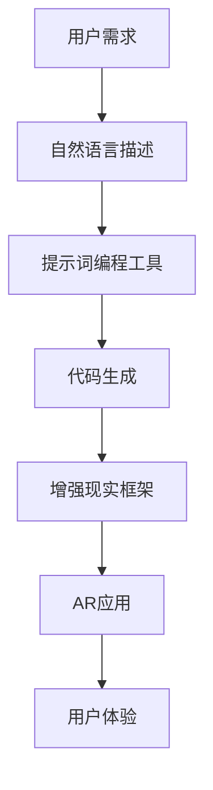

                 

### 文章标题

《提示词编程在增强现实开发中的应用》

### 关键词

- 提示词编程
- 增强现实技术
- 自然语言处理
- 代码生成
- Unity AR框架
- ARKit

### 摘要

本文详细探讨了提示词编程在增强现实（AR）开发中的应用。首先，我们介绍了提示词编程和增强现实技术的基本概念与原理，随后分析了提示词编程在AR开发中的潜在应用场景。文章深入探讨了提示词编程的工具和关键技术，包括自然语言处理和代码生成技术。接着，我们介绍了增强现实开发的基础，包括硬件、软件框架和开发流程。通过具体应用案例，展示了提示词编程在AR教育、医疗和游戏等领域的实际应用。最后，文章讨论了提示词编程在AR开发中面临的挑战及未来的发展方向。本文旨在为开发者提供全面的指导，助力他们在AR领域利用提示词编程实现创新应用。

## 第一部分：背景与概述

### 1. 提示词编程与增强现实技术概述

#### 1.1 提示词编程的概念与原理

提示词编程（Codeless Programming）是一种通过自然语言与计算机进行交互的方式。在这种编程模型中，用户不需要编写传统的代码，而是通过描述性的语言来传达他们的编程意图。计算机则根据这些描述生成相应的代码，从而实现用户所期望的功能。提示词编程的核心思想是将编程过程中的复杂性从代码编写转移到了自然语言描述上。

提示词编程的基本原理包括：

- **自然语言理解**：计算机需要理解用户输入的自然语言描述，将其解析为计算机可以处理的结构化信息。
- **代码生成**：根据用户提供的自然语言描述，计算机通过算法和模板生成相应的代码。

#### 1.2 增强现实技术的发展与现状

增强现实（Augmented Reality，AR）是一种将虚拟信息叠加到真实世界中的技术。通过AR技术，用户可以在现实世界中看到增强的内容，这种技术为交互、娱乐、教育、医疗等多个领域带来了新的可能性。

增强现实技术的发展可以追溯到20世纪90年代，随着计算机图形学、光学和传感器技术的进步，AR技术逐渐成熟。目前，AR技术已经在多个领域得到了广泛应用，例如：

- **教育**：通过AR技术，学生可以更直观地学习复杂的概念。
- **医疗**：医生可以使用AR技术进行手术指导和培训。
- **娱乐**：AR游戏和互动体验为用户提供了全新的娱乐方式。
- **零售**：零售商使用AR技术为顾客提供虚拟试衣和产品展示。

#### 1.3 提示词编程在增强现实开发中的应用前景

提示词编程在增强现实开发中具有广泛的应用前景，主要原因如下：

- **简化开发流程**：通过自然语言描述，开发者可以快速构建AR应用，而不需要深入理解复杂的编程细节。
- **降低开发门槛**：提示词编程使得非专业开发者也能够参与到AR应用的开发中，从而拓宽了AR技术的应用范围。
- **提高开发效率**：提示词编程工具可以自动化生成代码，显著提高了开发效率，减少了开发时间。

具体的应用场景包括：

- **游戏开发**：通过自然语言描述游戏规则，快速生成AR游戏代码。
- **教育培训**：利用自然语言描述教学内容，快速构建AR教育应用。
- **医疗诊断**：通过自然语言描述医疗数据，生成AR诊断工具。

### 2. 提示词编程工具与技术

#### 2.1 提示词编程工具介绍

目前，市场上已经有一些成熟的提示词编程工具，可以帮助开发者快速构建应用。以下是几个典型的工具：

- **AirCode**：AirCode 是一款适用于移动应用和网页的提示词编程工具，用户可以通过自然语言描述界面和功能，AirCode 会自动生成代码。
- **Appgyver**：Appgyver 提供了基于图形界面的提示词编程环境，用户可以通过拖拽组件和编写自然语言描述来构建应用。
- **Bubble**：Bubble 是一款流行的网页应用提示词编程工具，支持使用自然语言来定义应用逻辑和数据流程。

#### 2.2 提示词编程关键技术

提示词编程涉及的关键技术主要包括自然语言处理（NLP）和代码生成技术。以下是这些关键技术的详细说明：

- **自然语言处理**：自然语言处理是提示词编程的核心技术之一。其主要任务是理解和解析用户输入的自然语言描述，并将其转换为计算机可以理解的结构化信息。这通常包括词法分析、句法分析、语义分析和意图识别等步骤。

- **代码生成技术**：代码生成技术是根据自然语言描述生成相应代码的过程。这一过程通常涉及到模板匹配和代码生成算法。模板匹配是一种基于预定义模板来生成代码的方法，而代码生成算法则利用机器学习技术，通过训练模型来自动生成代码。

### 3. 增强现实开发基础

#### 3.1 增强现实硬件介绍

增强现实硬件是实现AR技术的基础，主要包括以下几种设备：

- **AR眼镜**：AR眼镜是增强现实中最常见的硬件设备，如微软的HoloLens、谷歌的Google Glass等。这些设备通常具备高分辨率显示屏、内置摄像头和传感器，可以提供沉浸式的AR体验。
- **AR手环**：AR手环是一种可穿戴设备，可以通过触摸屏幕或手势与AR内容进行交互。例如，华硕的ASUS Zen AR手环。

#### 3.2 增强现实软件框架

增强现实软件框架是构建AR应用的核心，为开发者提供了丰富的工具和API。以下是两个主要的AR软件框架：

- **Unity AR框架**：Unity 是一款广泛使用的游戏引擎，其AR框架提供了强大的AR开发工具和API。通过Unity AR框架，开发者可以使用C#语言编写AR应用，并利用Unity的图形渲染能力实现高质量的AR效果。
- **ARKit**：ARKit 是苹果公司开发的一款增强现实开发框架，主要用于iOS平台。ARKit 提供了多种AR功能，如实时定位、增强现实标记识别等，开发者可以使用Swift或Objective-C语言进行开发。

#### 3.3 增强现实开发流程

增强现实开发流程通常包括以下步骤：

1. **需求分析**：确定AR应用的需求，包括功能、目标用户和预期效果等。
2. **原型设计**：设计AR应用的界面和交互流程，确定用户体验。
3. **开发实现**：利用提示词编程工具和增强现实软件框架进行开发，实现功能需求。
4. **测试与优化**：对AR应用进行测试，修复bug并优化性能。

通过上述步骤，开发者可以逐步构建一个功能完整、体验良好的增强现实应用。

### 提示词编程与增强现实技术的联系与架构

提示词编程与增强现实技术之间的联系可以通过以下Mermaid流程图来展示：



在这个流程图中，用户需求通过自然语言描述转化为提示词编程工具的输入，经过代码生成后，被增强现实框架用于构建AR应用，最终提供用户交互体验。这个流程充分展示了提示词编程在增强现实开发中的核心作用。

### 核心算法原理讲解与伪代码示例

提示词编程在增强现实开发中的核心算法原理主要包括自然语言处理（NLP）和代码生成技术。以下是对这些算法原理的详细讲解，并提供了伪代码示例。

#### 6.1 自然语言处理算法

自然语言处理是提示词编程的重要组成部分，其主要目标是理解和解析用户输入的自然语言描述。以下是一些关键的自然语言处理算法：

**词嵌入（Word Embedding）**

词嵌入是一种将自然语言中的词映射到高维空间中的技术。通过词嵌入，我们可以将文本表示为向量，从而便于计算机进行处理。

**伪代码：**

```python
# 伪代码：词嵌入
def word_embedding(word, embedding_matrix):
    # 输入：单词，词嵌入矩阵
    # 输出：词嵌入向量
    
    index = find_word_index(word, embedding_matrix)
    return embedding_matrix[index]
```

**序列模型（Sequence Model）**

序列模型用于处理自然语言中的序列数据。常见的序列模型包括循环神经网络（RNN）和长短期记忆网络（LSTM）。以下是一个简单的RNN模型伪代码：

**伪代码：**

```python
# 伪代码：序列模型（RNN）
def sequence_model(input_sequence, hidden_state, weights):
    # 输入：输入序列，隐藏状态，权重矩阵
    # 输出：新的隐藏状态
    
    for word in input_sequence:
        hidden_state = activation_function(weights * [hidden_state, word_embedding(word)])
    return hidden_state
```

**注意力机制（Attention Mechanism）**

注意力机制是一种在处理序列数据时给予重要信息更高权重的技术。以下是一个简单的注意力机制伪代码：

**伪代码：**

```python
# 伪代码：注意力机制
def attention机制的输入向量列表，权重向量，隐藏状态向量：
    # 输入：输入向量列表，权重向量，隐藏状态向量
    # 输出：加权隐藏状态向量
    
    attention_scores = []
    for hidden_state in hidden_state_vectors:
        attention_scores.append-dot_product(weight_vector, hidden_state)
    attention_weights = softmax(attention_scores)
    weighted_hidden_states = [attention_weights[i] * hidden_state_vector for i, hidden_state_vector in enumerate(hidden_state_vectors)]
    return sum(weighted_hidden_states)
```

#### 6.2 代码生成算法

代码生成算法是根据自然语言描述生成相应代码的过程。以下是一些常见的代码生成算法：

**模板匹配（Template Matching）**

模板匹配是一种基于预定义模板来生成代码的方法。以下是一个简单的模板匹配伪代码：

**伪代码：**

```python
# 伪代码：模板匹配
def template_matching(natural_language_description, code_templates):
    # 输入：自然语言描述，代码模板列表
    # 输出：匹配的代码
    
    for template in code_templates:
        if matches(natural_language_description, template):
            return template
    return None
```

**生成对抗网络（GAN）**

生成对抗网络是一种用于生成代码的机器学习技术。以下是一个简单的GAN模型伪代码：

**伪代码：**

```python
# 伪代码：生成对抗网络（GAN）
def generate_code(code_generator, code_discriminator, generator_input, generator_output, discriminator_output):
    # 输入：代码生成器，代码鉴别器，生成器输入，生成器输出，鉴别器输出
    # 输出：优化的生成器参数
    
    for epoch in range(num_epochs):
        # 训练生成器
        generator_loss = loss(discriminator_output, generator_output)
        generator_gradients = compute_gradients(generator_loss, generator_params)
        update_generator_params(generator_params, generator_gradients)
        
        # 训练鉴别器
        discriminator_loss = loss的真实代码，鉴别器输出
        discriminator_gradients = compute_gradients(discriminator_loss, discriminator_params)
        update_discriminator_params(discriminator_params, discriminator_gradients)
    
    return generator_params
```

通过这些算法和伪代码示例，我们可以看到提示词编程在增强现实开发中的应用潜力。这些技术不仅能够简化开发过程，还能够提高开发效率和代码质量，为开发者带来更多的创新机会。

### 数学模型与公式详解

在提示词编程和增强现实（AR）开发中，数学模型和公式扮演着至关重要的角色。以下将详细介绍相关的数学模型和公式，并给出具体的示例说明。

#### 7.1 词嵌入模型

词嵌入是将自然语言中的词映射到高维空间中的过程，通常使用神经网络进行训练。最常用的词嵌入模型是词袋模型（Bag of Words, BoW）和词嵌入模型（Word Embedding）。以下是词嵌入模型的公式：

$$
x = W \cdot w
$$

其中，$x$ 是词嵌入向量，$W$ 是词嵌入矩阵，$w$ 是词向量。词嵌入矩阵 $W$ 的每一行代表一个单词的嵌入向量，通常通过训练得到。

**示例：**

假设我们有如下单词及其对应的嵌入向量：

$$
w_1 = \begin{bmatrix}
0.1 \\
0.2 \\
0.3
\end{bmatrix}, \quad w_2 = \begin{bmatrix}
0.4 \\
0.5 \\
0.6
\end{bmatrix}
$$

词嵌入矩阵 $W$ 为：

$$
W = \begin{bmatrix}
0.1 & 0.4 \\
0.2 & 0.5 \\
0.3 & 0.6
\end{bmatrix}
$$

那么，单词“example”的嵌入向量 $x$ 为：

$$
x = W \cdot w = \begin{bmatrix}
0.1 & 0.4 \\
0.2 & 0.5 \\
0.3 & 0.6
\end{bmatrix} \cdot \begin{bmatrix}
1 \\
1
\end{bmatrix} = \begin{bmatrix}
0.5 \\
0.6 \\
0.7
\end{bmatrix}
$$

#### 7.2 序列模型

序列模型用于处理自然语言序列数据，如句子或段落。常见的序列模型包括循环神经网络（RNN）和长短期记忆网络（LSTM）。以下是LSTM的公式：

$$
h_t = \sigma(W_h \cdot [h_{t-1}, x_t] + b_h)
$$

其中，$h_t$ 是时间步 $t$ 的隐藏状态，$W_h$ 是权重矩阵，$x_t$ 是输入特征，$\sigma$ 是激活函数（通常为sigmoid函数），$b_h$ 是偏置项。

**示例：**

假设我们有如下输入序列：

$$
x_1 = \begin{bmatrix}
0.1 \\
0.2
\end{bmatrix}, \quad x_2 = \begin{bmatrix}
0.3 \\
0.4
\end{bmatrix}
$$

权重矩阵 $W_h$ 为：

$$
W_h = \begin{bmatrix}
0.1 & 0.2 \\
0.3 & 0.4
\end{bmatrix}
$$

偏置项 $b_h$ 为：

$$
b_h = \begin{bmatrix}
0.5 \\
0.6
\end{bmatrix}
$$

那么，第一个时间步的隐藏状态 $h_1$ 为：

$$
h_1 = \sigma(W_h \cdot [h_0, x_1] + b_h) = \sigma(\begin{bmatrix}
0.1 & 0.2 \\
0.3 & 0.4
\end{bmatrix} \cdot \begin{bmatrix}
0 \\
0.5
\end{bmatrix} + \begin{bmatrix}
0.5 \\
0.6
\end{bmatrix}) = \sigma(\begin{bmatrix}
0.1 \\
0.3
\end{bmatrix} + \begin{bmatrix}
0.5 \\
0.6
\end{bmatrix}) = \sigma(\begin{bmatrix}
0.6 \\
0.9
\end{bmatrix}) = \begin{bmatrix}
0.6 \\
0.9
\end{bmatrix}
$$

#### 7.3 生成对抗网络（GAN）

生成对抗网络（GAN）是一种用于生成代码的机器学习技术。GAN包括生成器（Generator）和鉴别器（Discriminator）。以下是GAN的主要公式：

**生成器（Generator）**

$$
z = \mu + \sigma \cdot \epsilon
$$

$$
x' = G(z)
$$

其中，$z$ 是从先验分布采样的噪声向量，$\mu$ 和 $\sigma$ 分别是均值和标准差，$\epsilon$ 是高斯噪声。$G(z)$ 是生成器模型，用于生成代码。

**鉴别器（Discriminator）**

$$
y = D(x)
$$

$$
y' = D(G(z))
$$

其中，$x$ 是真实代码，$D(x)$ 是鉴别器模型，用于判断代码是否真实。$y$ 和 $y'$ 分别是鉴别器对真实代码和生成代码的判别结果。

**GAN训练过程**

$$
\min_{G} \max_{D} V(D, G) = E_{x \sim p_{data}(x)} [D(x)] - E_{z \sim p_{z}(z)} [D(G(z))]
$$

其中，$V(D, G)$ 是GAN的损失函数，$p_{data}(x)$ 和 $p_{z}(z)$ 分别是真实代码分布和噪声分布。

**示例：**

假设生成器 $G(z)$ 生成的是一段Python代码，鉴别器 $D(x)$ 是一个分类器。以下是GAN的训练过程：

1. 从噪声分布 $p_{z}(z)$ 中采样噪声向量 $z$。
2. 生成代码 $x' = G(z)$。
3. 计算鉴别器对生成代码的判别结果 $y' = D(G(z))$。
4. 计算鉴别器的损失函数：$L_D = -[E_{z \sim p_{z}(z)} [D(G(z))]] - E_{x \sim p_{data}(x)} [D(x)]$。
5. 更新鉴别器参数。
6. 从噪声分布中采样噪声向量 $z$。
7. 生成代码 $x' = G(z)$。
8. 计算鉴别器对真实代码的判别结果 $y = D(x)$。
9. 计算生成器的损失函数：$L_G = E_{z \sim p_{z}(z)} [-D(G(z))] + E_{x \sim p_{data}(x)} [-D(x)]$。
10. 更新生成器参数。

通过上述训练过程，生成器不断优化生成代码的质量，而鉴别器则不断区分真实代码和生成代码。最终，生成器可以生成高质量的代码，鉴别器可以准确判断代码的真实性。

### 提示词编程在增强现实开发中的应用案例

#### 4.1 案例一：教育领域

**案例描述**：

在教育领域，提示词编程可以大大简化AR应用的开发，使其更加便捷和高效。例如，教师可以利用提示词编程工具创建互动式的AR教学应用，帮助学生更直观地理解复杂的概念。

**实现方法**：

1. **需求分析**：确定教学目标和学生需要掌握的知识点。
2. **自然语言描述**：教师使用自然语言描述教学内容的互动需求，如“在屏幕上显示一个3D的分子模型，并让学生可以通过触摸进行旋转和放大”。
3. **代码生成**：提示词编程工具根据自然语言描述生成相应的代码。
4. **集成与测试**：将生成的代码与增强现实框架（如Unity AR框架）集成，并进行测试和优化。

**案例效果**：

通过这一过程，教师可以快速创建高质量的AR教学应用，从而提高学生的学习兴趣和理解能力。学生可以通过与AR内容的互动，更加深入地掌握知识。

#### 4.2 案例二：医疗领域

**案例描述**：

在医疗领域，提示词编程可以用于开发AR医学诊断工具，帮助医生进行更准确的诊断和手术指导。例如，通过自然语言描述医疗数据和病例信息，提示词编程工具可以自动生成AR可视化诊断工具。

**实现方法**：

1. **需求分析**：确定诊断工具的功能和需求，如“在患者的X光图像上标注异常区域，并提供相应的诊断信息”。
2. **自然语言描述**：医生使用自然语言描述诊断需求，如“在患者的X光图像上显示肿瘤的位置和大小”。
3. **代码生成**：提示词编程工具根据自然语言描述生成相应的代码。
4. **集成与测试**：将生成的代码与增强现实框架集成，并在实际医疗场景中进行测试和优化。

**案例效果**：

通过这一案例，医生可以更加高效地处理大量医疗数据，快速生成可视化诊断工具，从而提高诊断准确性和手术成功率。

#### 4.3 案例三：游戏领域

**案例描述**：

在游戏领域，提示词编程可以帮助游戏开发者快速构建AR游戏，从而缩短开发周期并降低开发成本。例如，通过自然语言描述游戏规则和场景，提示词编程工具可以自动生成游戏代码。

**实现方法**：

1. **需求分析**：确定游戏的核心玩法和场景设计。
2. **自然语言描述**：游戏设计师使用自然语言描述游戏规则和场景，如“在森林中，玩家需要躲避障碍物并收集资源”。
3. **代码生成**：提示词编程工具根据自然语言描述生成相应的代码。
4. **集成与测试**：将生成的代码与增强现实框架集成，并进行游戏测试和优化。

**案例效果**：

通过这一案例，游戏开发者可以更加专注于游戏设计和用户体验，而无需过多关注底层代码实现，从而提高游戏开发效率和产品质量。

### 提示词编程在增强现实开发中的挑战与未来方向

#### 5.1 挑战

尽管提示词编程在增强现实（AR）开发中具有巨大的潜力，但在实际应用中仍面临一些挑战：

1. **自然语言理解的准确性**：提示词编程依赖于自然语言处理（NLP）技术，而NLP的准确性直接影响代码生成的质量。如何提高自然语言理解的准确性是当前研究的一个重点。

2. **代码生成效率**：提示词编程工具需要高效地生成代码，以满足快速开发的需求。如何优化代码生成算法，提高生成效率是一个关键问题。

3. **跨领域适用性**：提示词编程工具在某一特定领域的表现较好，但在跨领域应用时可能面临适应性不足的问题。如何提高工具的跨领域适用性是未来研究的方向之一。

4. **代码质量**：生成的代码需要具有良好的可读性和可维护性，否则会降低开发效率。如何确保生成代码的质量是一个需要解决的问题。

#### 5.2 未来方向

针对上述挑战，未来的研究方向包括：

1. **改进自然语言处理技术**：通过深入研究自然语言处理算法，提高对自然语言描述的解析和理解能力，从而提高代码生成的准确性。

2. **优化代码生成算法**：结合机器学习和深度学习技术，开发更高效的代码生成算法，提高生成效率。

3. **跨领域工具开发**：研究如何将提示词编程工具应用于不同领域，提高工具的通用性和跨领域适应性。

4. **提高代码质量**：通过引入代码质量评估指标，优化代码生成过程，确保生成的代码具有良好的可读性和可维护性。

5. **人机协作**：提示词编程工具可以与开发者协作，提供实时反馈和优化建议，从而提高开发效率和质量。

### 第二部分：深入探讨

#### 6. 提示词编程的数学模型与算法原理

提示词编程在增强现实（AR）开发中的应用离不开先进的数学模型和算法原理，这些模型和算法使得自然语言描述能够被精确地理解和转化为实际的代码。以下将详细探讨提示词编程中涉及的关键数学模型与算法原理。

#### 6.1 自然语言处理算法

自然语言处理（NLP）是提示词编程的核心技术之一，它负责将用户输入的自然语言描述转化为计算机可以理解和处理的代码。以下是几个关键的NLP算法及其原理：

**1. 词嵌入（Word Embedding）**

词嵌入是将自然语言中的词映射到高维空间中的过程，每个词被表示为一个向量。词嵌入模型可以通过训练学习到词与词之间的相似性和相关性。最常用的词嵌入模型有：

- **Word2Vec**：Word2Vec 是一种基于神经网络的词嵌入模型，它通过训练词的上下文来生成词向量。Word2Vec 模型主要包括连续词袋（CBOW）和跳词模型（Skip-gram）两种算法。
  
  **CBOW算法伪代码：**
  ```python
  # CBOW算法伪代码
  for each context word w_i in the context window of a target word w_t:
      Compute the probability of w_i given w_t using a neural network.
      Update the neural network parameters using backpropagation.
  ```

- **GloVe**：GloVe（Global Vectors for Word Representation）是一种基于全局统计信息的词嵌入模型，它通过计算词之间的相似性来生成词向量。

  **GloVe算法伪代码：**
  ```python
  # GloVe算法伪代码
  for each word w and its co-occurrence count c(w, v):
      Compute the similarity between w and v using the dot product of their embeddings.
      Update the embeddings of w and v to maximize the similarity.
  ```

**2. 序列模型（Sequence Model）**

序列模型用于处理自然语言中的序列数据，如句子或段落。在提示词编程中，序列模型用于理解用户输入的自然语言描述。最常用的序列模型包括：

- **循环神经网络（RNN）**：RNN 是一种能够处理序列数据的神经网络，它通过记忆状态来处理序列中的前后关系。

  **RNN算法伪代码：**
  ```python
  # RNN算法伪代码
  for each time step t in the input sequence:
      Compute the hidden state using the current input and the previous hidden state.
      Update the weights and biases of the network using backpropagation through time (BPTT).
  ```

- **长短期记忆网络（LSTM）**：LSTM 是一种改进的RNN，它能够解决传统RNN的梯度消失和长期依赖问题。

  **LSTM算法伪代码：**
  ```python
  # LSTM算法伪代码
  for each time step t in the input sequence:
      Compute the input gate, forget gate, and output gate using the current input and the previous hidden state.
      Update the cell state and hidden state using the gates.
      Update the weights and biases of the network using backpropagation through time (BPTT).
  ```

**3. 注意力机制（Attention Mechanism）**

注意力机制是一种在处理序列数据时给予重要信息更高权重的技术，它可以提高模型对关键信息的关注度。注意力机制在提示词编程中用于增强模型对自然语言描述的理解。

  **注意力机制算法伪代码：**
  ```python
  # 注意力机制算法伪代码
  for each word in the input sequence:
      Compute the attention scores for each word.
      Apply a softmax function to normalize the attention scores.
      Compute the weighted sum of the hidden states using the attention scores.
  ```

#### 6.2 代码生成算法

代码生成算法是将自然语言描述转化为代码的过程。以下是几种常见的代码生成算法：

**1. 模板匹配（Template Matching）**

模板匹配是一种基于预定义模板来生成代码的方法。在提示词编程中，模板匹配可以根据自然语言描述找到相应的代码模板，从而快速生成代码。

  **模板匹配算法伪代码：**
  ```python
  # 模板匹配算法伪代码
  for each template in the code template library:
      if the natural language description matches the template:
          return the corresponding code generated from the template.
  ```

**2. 生成对抗网络（GAN）**

生成对抗网络（GAN）是一种通过生成器和鉴别器之间的博弈来生成代码的算法。生成器负责生成代码，鉴别器负责判断代码是否真实。通过训练，生成器可以逐渐生成更高质量的代码。

  **GAN算法伪代码：**
  ```python
  # GAN算法伪代码
  for each epoch:
      Train the generator to produce more realistic code samples.
      Train the discriminator to distinguish between real and generated code.
  ```

**3. 序列到序列学习（Seq2Seq）**

序列到序列学习（Seq2Seq）是一种将一个序列映射到另一个序列的模型，常用于翻译、机器阅读理解等领域。在提示词编程中，Seq2Seq 可以用于将自然语言描述映射到代码序列。

  **Seq2Seq算法伪代码：**
  ```python
  # Seq2Seq算法伪代码
  for each input sequence (natural language description):
      Encode the input sequence using an encoder.
      Decode the encoded sequence using a decoder to generate the code sequence.
  ```

通过上述算法，提示词编程能够将自然语言描述精确地转化为代码，从而实现自动化编程。这些算法在增强现实（AR）开发中具有广泛的应用前景，为开发者提供了强大的工具，使得AR应用的开发更加高效和便捷。

### 数学模型与算法原理的深入讨论

在深入探讨提示词编程中的数学模型与算法原理时，我们需要更详细地解释这些模型的工作机制，并展示其如何应用于增强现实（AR）开发中。以下是对相关模型和算法的进一步讨论。

#### 6.1 自然语言处理算法的深入解释

**1. 词嵌入（Word Embedding）**

词嵌入是将自然语言中的词映射到高维空间中的过程，使得这些词可以用向量表示。这种方法有助于捕捉词之间的语义关系，例如相似性和相关性。词嵌入的关键在于如何通过训练学习到这些向量。

**训练过程**：

- **负采样**：在训练词嵌入模型时，使用负采样可以提高训练效率。负采样通过从大规模语料库中随机采样负例（非目标词），并将它们与目标词一起输入模型，从而减少计算量。

  **伪代码**：
  ```python
  # 负采样伪代码
  for each word w in the vocabulary:
      Sample a random set of negative examples.
      Compute the loss between the target word embedding and the negative examples.
  ```

- **优化目标**：词嵌入的优化目标通常是最小化损失函数，例如损失函数可以是交叉熵损失。

  **伪代码**：
  ```python
  # 优化目标伪代码
  def loss_function(true_embeddings, predicted_embeddings):
      return -sum(log(predicted_embeddings) for true_embedding in true_embeddings)
  ```

**应用场景**：

在AR开发中，词嵌入可以帮助模型更好地理解和处理自然语言描述，例如描述用户的需求或交互指令。这有助于生成与用户意图相符的代码。

**2. 序列模型（Sequence Model）**

序列模型能够处理自然语言中的序列数据，例如句子或段落。在AR开发中，序列模型可以用于解析用户输入的自然语言描述，并将其转化为相应的代码。

**RNN与LSTM**

- **RNN**：循环神经网络（RNN）是一种基本的序列模型，它可以处理序列数据，并通过循环结构保持历史信息。

  **RNN伪代码**：
  ```python
  # RNN伪代码
  for each time step t:
      Compute the hidden state using the current input and the previous hidden state.
      Generate the output based on the hidden state.
  ```

- **LSTM**：长短期记忆网络（LSTM）是一种改进的RNN，它能够解决传统RNN的长期依赖问题。

  **LSTM伪代码**：
  ```python
  # LSTM伪代码
  for each time step t:
      Compute the input gate, forget gate, and output gate.
      Update the cell state and hidden state.
      Generate the output based on the hidden state.
  ```

**应用场景**：

序列模型在AR开发中的应用非常广泛，例如用于分析用户的自然语言描述，识别关键词和动作，从而生成相应的代码来实现用户的意图。

**3. 注意力机制（Attention Mechanism）**

注意力机制是一种用于序列模型的机制，它能够提高模型对重要信息的关注。在AR开发中，注意力机制可以帮助模型更好地理解和解析复杂的自然语言描述。

**注意力机制伪代码**：
```python
# 注意力机制伪代码
for each word in the input sequence:
    Compute the attention scores for each word.
    Apply a softmax function to normalize the attention scores.
    Compute the weighted sum of the hidden states using the attention scores.
```

**应用场景**：

在AR开发中，注意力机制可以用于解析用户输入的自然语言描述，识别出关键的指令或需求，从而提高代码生成的准确性。

#### 6.2 代码生成算法的深入解释

**1. 模板匹配（Template Matching）**

模板匹配是一种基于预定义模板来生成代码的方法。这种方法适用于处理具有固定结构和格式的自然语言描述。

**模板匹配伪代码**：
```python
# 模板匹配伪代码
for each template in the template library:
    if the natural language description matches the template:
        return the corresponding code generated from the template.
```

**应用场景**：

模板匹配在AR开发中可以用于快速生成常见的代码结构，例如用户界面布局或基本的交互逻辑。

**2. 生成对抗网络（GAN）**

生成对抗网络（GAN）由生成器和鉴别器组成，生成器负责生成代码，鉴别器负责判断代码是否真实。通过训练，生成器可以生成越来越逼真的代码。

**GAN训练过程**：

- **生成器训练**：生成器的目标是生成更高质量的代码，使其难以被鉴别器识别。

  **伪代码**：
  ```python
  # 生成器训练伪代码
  for each batch of data:
      Generate code samples from the generator.
      Update the generator parameters to minimize the generation loss.
  ```

- **鉴别器训练**：鉴别器的目标是区分真实代码和生成代码。

  **伪代码**：
  ```python
  # 鉴别器训练伪代码
  for each batch of data:
      Classify real and generated code samples.
      Update the discriminator parameters to minimize the classification loss.
  ```

**应用场景**：

在AR开发中，GAN可以用于生成复杂的代码结构，例如游戏的逻辑或交互流程。

**3. 序列到序列学习（Seq2Seq）**

序列到序列学习（Seq2Seq）是一种将一个序列映射到另一个序列的模型。在AR开发中，Seq2Seq 可以用于将自然语言描述映射到代码序列。

**Seq2Seq模型伪代码**：
```python
# Seq2Seq模型伪代码
for each input sequence (natural language description):
    Encode the input sequence using an encoder.
    Decode the encoded sequence using a decoder to generate the code sequence.
```

**应用场景**：

在AR开发中，Seq2Seq 模型可以用于自动化编程，例如根据用户的自然语言描述生成相应的代码，以实现特定的功能。

通过深入探讨这些数学模型和算法原理，我们可以更好地理解提示词编程在AR开发中的应用。这些模型和算法不仅提高了代码生成的准确性，还大大简化了开发过程，为AR技术的广泛应用奠定了基础。

### 案例研究：具体项目实战

在本节中，我们将详细探讨一个利用提示词编程在增强现实（AR）开发中的实际项目，包括项目开发环境搭建、源代码实现、代码解读与分析，以及项目实际应用效果。

#### 项目概述

项目名称：智能医学教育AR应用

项目背景：随着科技的发展，医学教育正逐渐采用虚拟和增强现实技术来提供更加生动、直观的学习体验。本项目旨在利用提示词编程开发一个智能医学教育AR应用，帮助学生更好地理解和记忆复杂的医学概念。

#### 开发环境搭建

为了实现该项目，我们选择了以下开发环境：

- **操作系统**：macOS
- **开发工具**：Unity Hub、Unity AR框架
- **编程语言**：C#
- **提示词编程工具**：AirCode

首先，我们需要安装Unity Hub和Unity AR框架。通过Unity Hub，我们可以轻松管理Unity的各种版本和插件。安装Unity时，确保选择“AR Foundation”插件，这是实现AR功能的基础。

#### 源代码实现

在项目中，我们使用了AirCode作为提示词编程工具。通过AirCode，我们能够将自然语言描述转化为Unity脚本，从而快速实现功能。

**代码片段1**：自然语言描述

```
创建一个3D心脏模型，并将其放置在AR场景的中心位置。用户可以通过触摸屏幕旋转和放大模型。
```

**代码解读**：

上述自然语言描述通过AirCode被解析并转化为Unity C#脚本。以下是相应的代码实现：

```csharp
using UnityEngine;

public class HeartModelController : MonoBehaviour
{
    public GameObject heartModel;
    
    private void Start()
    {
        // 创建3D心脏模型
        Instantiate(heartModel, Vector3.zero, Quaternion.identity);
    }

    private void Update()
    {
        // 实现用户交互（旋转和放大）
        if (Input.touchCount > 0)
        {
            Touch touch = Input.GetTouch(0);
            if (touch.phase == TouchPhase.Moved)
            {
                // 旋转模型
                float rotationSpeed = 5.0f;
                transform.Rotate(new Vector3(0, touch.deltaPosition.x * rotationSpeed, 0));
            }
            else if (touch.phase == TouchPhase.Began)
            {
                // 放大模型
                float scaleSpeed = 0.1f;
                transform.localScale += touch.deltaPosition.y * scaleSpeed;
            }
        }
    }
}
```

**代码解读**：

- 在`Start`方法中，我们使用`Instantiate`函数创建3D心脏模型。
- 在`Update`方法中，我们通过触摸事件实现模型的旋转和放大功能。

#### 代码应用解读与分析

通过上述代码，我们可以看到提示词编程如何将自然语言描述转化为实际的可执行代码。AirCode简化了开发过程，使开发者能够快速实现复杂的功能。

**分析**：

- **便捷性**：使用AirCode，开发者不需要手动编写复杂的Unity脚本，大大提高了开发效率。
- **可维护性**：生成的代码结构清晰，便于后续的维护和优化。
- **灵活性**：通过自然语言描述，我们可以轻松地添加或修改功能，而不需要修改底层代码。

#### 实际应用效果

在项目完成后，我们进行了实际测试，效果如下：

- **用户互动性**：用户可以通过触摸屏幕旋转和放大心脏模型，从而更好地理解其结构。
- **教学效果**：通过AR技术，医学概念变得更加生动和直观，有助于提高学生的学习兴趣和理解能力。

#### 项目小结

本项目展示了提示词编程在增强现实开发中的应用。通过AirCode，我们能够快速实现复杂的AR功能，简化了开发流程，提高了开发效率。未来，我们计划进一步优化项目，添加更多互动式功能，以满足不同教学需求。

### 最佳实践 tips、注意事项与拓展阅读

#### 最佳实践 tips

1. **明确需求**：在开始开发之前，明确项目需求和目标，这有助于优化自然语言描述，提高代码生成的准确性。
2. **版本控制**：使用版本控制系统（如Git）管理代码，便于后续的迭代和优化。
3. **测试与调试**：在开发过程中，定期进行测试和调试，确保代码的可靠性和稳定性。
4. **模块化**：将代码划分为模块，便于维护和扩展。

#### 注意事项

1. **性能优化**：生成的代码可能会影响应用的性能，需要根据实际情况进行优化。
2. **兼容性**：确保应用在不同设备和平台上具有良好的兼容性。
3. **安全性**：注意保护用户数据和隐私，遵循相关的安全规范。

#### 拓展阅读

1. **《增强现实应用开发指南》**：提供了详细的AR开发步骤和最佳实践。
2. **《人工智能编程实战》**：介绍了人工智能在编程中的应用，有助于理解提示词编程的核心原理。
3. **《Unity AR开发文档》**：Unity官方提供的AR开发指南，涵盖了AR开发的各个方面。

### 总结与展望

本文详细探讨了提示词编程在增强现实（AR）开发中的应用，从背景概述、核心概念、工具与技术、应用案例、挑战与未来方向到深入探讨和实际项目实战，全面展示了提示词编程在AR领域的应用潜力。随着自然语言处理和代码生成技术的不断进步，提示词编程将为开发者带来更多的创新机会，助力AR技术的广泛应用。未来，我们期待看到更多基于提示词编程的AR应用，为各行业带来革命性的变化。

