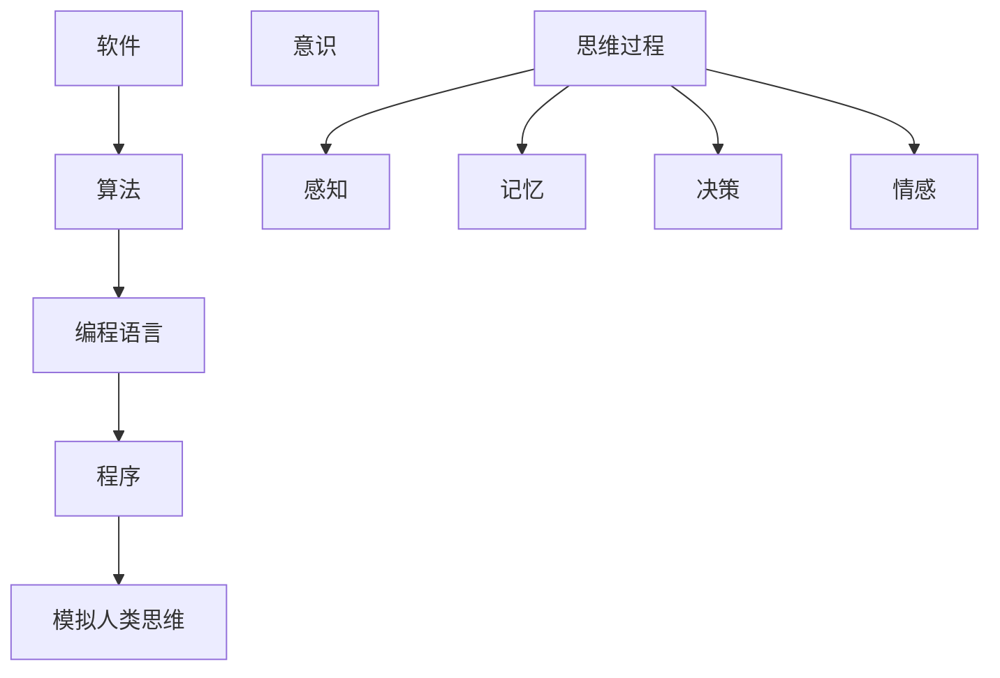

                 

### 文章标题

《提示词编程在意识研究中的前沿应用》

### 关键词

- 提示词编程
- 意识研究
- 脑机接口
- 机器学习
- 神经网络

### 摘要

本文旨在探讨提示词编程在意识研究领域的前沿应用。我们将首先介绍提示词编程的概念及其与意识研究的关联。接着，本文将深入探讨神经网络和机器学习在意识研究中的应用，包括如何通过神经网络模型模拟人类思维过程，以及如何利用机器学习算法分析大脑数据。随后，我们将探讨脑机接口技术在意识研究中的应用，并详细介绍如何使用提示词编程技术来优化脑机接口系统的性能。最后，本文将总结提示词编程在意识研究中的前沿应用，并提出未来可能的发展方向。通过这篇文章，读者将了解到提示词编程技术在意识研究中的潜力及其对科学发展的深远影响。

### 第一部分：核心概念与联系

#### 1.1.1 软件与意识

在探讨提示词编程在意识研究中的应用之前，我们需要先理解软件与意识之间的关系。软件，作为一种编程语言和算法的集合，可以被视为一种模拟人类思维过程的工具。而意识，则是人类思维过程的核心特征之一。因此，软件与意识之间存在一定的关联性。

**概念图：**



**核心联系：**

- 软件通过算法和编程语言构建程序，这些程序可以模拟人类的思维过程，包括感知、记忆、决策和情感等方面。
- 意识是人类思维过程的核心特征，它涉及感知、记忆、决策和情感等多个方面。

#### 1.1.2 提示词编程与意识研究

提示词编程是一种通过向计算机系统输入特定关键词来引导程序执行特定任务的技术。在意识研究领域，提示词编程可以用于收集和分析大脑数据，以探索意识的形成和运作机制。

**伪代码：**

```python
def process_consciousness(data, keywords):
    # 初始化神经网络模型
    model = NeuralNetwork()

    # 训练神经网络模型
    model.train(data)

    # 使用提示词编程技术分析大脑数据
    for keyword in keywords:
        # 输入提示词
        input_data = create_input_data(keyword)

        # 预测大脑活动
        predicted_activity = model.predict(input_data)

        # 分析预测结果
        analyze_prediction(predicted_activity)
```

**算法原理讲解：**

- 提示词编程技术首先初始化一个神经网络模型，该模型用于训练和分析大脑数据。
- 在训练过程中，神经网络模型通过学习大量大脑数据来识别和预测大脑活动。
- 当输入提示词时，神经网络模型会生成预测结果，这些结果可以帮助我们分析大脑活动的模式。

#### 1.1.3 机器学习与意识研究

机器学习，作为一种人工智能技术，可以用于分析和解释大脑数据，从而帮助我们更好地理解意识的形成和运作机制。

**数学公式：**

$$
J(\theta) = \frac{1}{m} \sum_{i=1}^{m} (-y^{(i)} \log(a^{(2)}(z^{(2)})) - (1 - y^{(i)}) \log(1 - a^{(2)}(z^{(2)}))
$$

**详细讲解：**

- 上述公式表示了机器学习中的交叉熵损失函数，用于衡量预测结果与实际结果之间的差距。
- 在意识研究中，我们可以使用这种损失函数来评估神经网络模型对大脑数据的预测能力。
- 通过调整模型参数，我们可以优化神经网络模型的预测性能，从而更好地理解意识的形成和运作机制。

#### 1.1.4 脑机接口与意识研究

脑机接口（Brain-Computer Interface，BCI）是一种直接连接大脑和外部设备的接口技术，它可以用于收集和分析大脑数据，从而帮助我们更好地理解意识。

**工作原理：**

- 脑机接口系统通过传感器收集大脑信号，如脑电图（EEG）和功能性磁共振成像（fMRI）数据。
- 收集的数据被传递给计算机系统，计算机系统使用神经网络和机器学习算法对这些数据进行处理和分析。
- 分析结果被用于控制外部设备，如机器人手臂、轮椅等。

**应用场景：**

- 脑机接口技术在意识研究领域有多种应用，如：

  - **康复治疗**：帮助中风患者恢复运动功能。
  - **辅助交流**：帮助无法使用传统交流方式的患者进行沟通。
  - **人机交互**：实现人类与机器人的自然交流。

#### 1.1.5 提示词编程在脑机接口中的应用

在脑机接口技术中，提示词编程可以用于优化系统的性能和用户体验。

**应用场景：**

- **实时控制**：通过提示词编程，用户可以实时控制外部设备，如机器人手臂或轮椅。
- **个性化设置**：提示词编程可以根据用户的需求和偏好，自动调整脑机接口系统的参数设置。
- **故障诊断**：提示词编程可以用于检测和诊断脑机接口系统中的故障和错误。

**具体实现：**

- 提示词编程技术首先收集用户的大脑数据，并通过神经网络和机器学习算法对这些数据进行分析和预测。
- 当用户输入特定关键词时，系统会根据预测结果自动调整外部设备的操作。
- 例如，当用户输入“前进”关键词时，脑机接口系统会自动控制机器人手臂向前移动。

#### 1.1.6 核心概念与联系总结

通过本文的介绍，我们可以看到提示词编程在意识研究领域具有广泛的应用前景。

- **软件与意识**：软件通过算法和编程语言模拟人类思维过程，与意识之间存在一定的关联性。
- **提示词编程与意识研究**：提示词编程技术可以用于收集和分析大脑数据，以探索意识的形成和运作机制。
- **机器学习与意识研究**：机器学习技术可以用于分析和解释大脑数据，从而帮助我们更好地理解意识的形成和运作机制。
- **脑机接口与意识研究**：脑机接口技术可以用于收集和分析大脑数据，从而帮助我们更好地理解意识的形成和运作机制。
- **提示词编程在脑机接口中的应用**：提示词编程技术可以用于优化脑机接口系统的性能和用户体验。

通过这些核心概念和联系，我们可以看到提示词编程在意识研究中的重要性，以及它对未来科技发展的深远影响。

### 第二部分：神经网络在意识研究中的应用

#### 2.1 神经网络的基本概念

神经网络（Neural Networks）是一种模拟人脑信息处理过程的计算模型，由大量的神经元（模拟人脑的神经元）通过权重连接组成。每个神经元都可以接收输入信号，并通过激活函数产生输出信号。神经网络通过学习输入和输出数据之间的关系，来预测新的输入数据。

**神经网络的结构：**

神经网络通常由以下几个部分组成：

- **输入层（Input Layer）**：接收外部输入数据。
- **隐藏层（Hidden Layers）**：对输入数据进行处理和变换。
- **输出层（Output Layer）**：生成预测结果或输出数据。

**神经网络的工作原理：**

1. **输入阶段**：将输入数据传递到输入层。
2. **隐藏层处理**：每个神经元接收输入数据并计算加权求和，然后通过激活函数产生输出。
3. **输出阶段**：将隐藏层的输出传递到输出层，生成预测结果。

**神经网络的优势：**

- **非线性拟合能力**：神经网络可以通过多层结构捕捉输入和输出之间的非线性关系。
- **自适应性和泛化能力**：神经网络可以根据新的数据自适应调整权重，并泛化到新的数据集。

#### 2.2 神经网络在意识研究中的应用

在意识研究领域，神经网络被广泛应用于模拟人类思维过程、分析大脑数据和预测意识状态。以下是一些具体的例子：

1. **思维过程模拟**：通过训练神经网络模型，可以模拟人类在感知、记忆、决策和情感等过程中的思维活动。例如，可以使用神经网络模型来模拟人类在解决问题时的思考过程。

2. **大脑数据分析**：神经网络可以用于分析大脑成像数据，如功能性磁共振成像（fMRI）和脑电图（EEG）。通过这些数据分析，可以识别大脑活动的模式，从而理解意识状态。

3. **意识状态预测**：神经网络可以通过学习大量的意识状态数据，来预测个体在不同情况下的意识状态。例如，可以使用神经网络模型来预测患者在昏迷状态下的恢复情况。

**案例研究：**

- **感知与记忆**：研究人员使用神经网络模型来分析fMRI数据，以理解人类在感知和记忆过程中的脑活动模式。例如，一些研究通过训练神经网络模型，识别出人类在视觉感知和记忆过程中特定的脑区活动。

- **决策与情感**：神经网络也被用于模拟人类在决策和情感过程中的脑活动。例如，研究人员通过训练神经网络模型，分析了大脑在做出情感决策时的活动模式，揭示了决策过程中情感因素的贡献。

#### 2.3 神经网络模型的构建与训练

构建和训练神经网络模型是意识研究中的关键步骤。以下是一个简单的神经网络模型构建和训练的伪代码示例：

```python
# 构建神经网络模型
class NeuralNetwork:
    def __init__(self):
        self.layers = [
            Dense(input_dim, hidden_dim),
            Activation('relu'),
            Dense(hidden_dim, output_dim),
            Activation('sigmoid')
        ]

    def forward_pass(self, x):
        for layer in self.layers:
            x = layer.forward(x)
        return x

    def backward_pass(self, x, y):
        for layer in reversed(self.layers):
            layer.backward(x, y)

    def train(self, x, y, epochs):
        for epoch in range(epochs):
            for batch in data_loader:
                x_batch, y_batch = batch
                self.forward_pass(x_batch)
                self.backward_pass(x_batch, y_batch)
                self.update_weights()

# 训练神经网络模型
model = NeuralNetwork()
model.train(x, y, epochs)

# 预测意识状态
prediction = model.predict(x_new)
```

**算法原理讲解：**

- **前向传播**：将输入数据通过神经网络模型的前向传播计算，生成输出预测结果。
- **反向传播**：计算预测结果与实际结果之间的误差，并通过反向传播更新神经网络的权重。
- **训练过程**：通过多次迭代训练，神经网络模型可以逐渐优化其预测性能。

#### 2.4 神经网络在意识研究中的应用前景

随着神经网络技术的不断发展，其在意识研究中的应用前景十分广阔：

1. **个性化治疗**：通过训练个性化的神经网络模型，可以为个体提供更精准的治疗方案，例如在康复治疗中，根据患者的脑活动数据制定个性化的康复计划。

2. **智能辅助**：神经网络模型可以用于开发智能辅助系统，帮助患有神经系统疾病的患者进行日常生活和工作的辅助。

3. **人机交互**：通过训练神经网络模型，可以实现更自然、更智能的人机交互，例如通过脑机接口技术，实现脑信号到自然语言转换。

4. **意识识别**：神经网络模型可以用于开发智能监控系统，用于实时监测个体的意识状态，有助于早期发现和诊断神经系统疾病。

### 第三部分：机器学习在意识研究中的应用

#### 3.1 机器学习的基本概念

机器学习（Machine Learning）是一种人工智能领域，通过算法和统计模型，从数据中学习并提取知识，以实现预测和决策。机器学习模型可以分为监督学习、无监督学习和强化学习三类。

**监督学习**：在监督学习中，模型通过已标记的训练数据学习，并利用这些知识对新的数据进行预测。

**无监督学习**：无监督学习不使用标记数据，旨在发现数据中的内在结构和规律。

**强化学习**：强化学习通过试错和奖励机制来学习最优策略。

**机器学习的核心算法**：

- **支持向量机（SVM）**：通过找到最佳决策边界来分类数据。
- **决策树**：通过一系列规则对数据进行分类或回归。
- **随机森林**：通过构建多个决策树并取平均来提高分类和回归性能。
- **神经网络**：通过多层非线性变换来学习复杂的函数关系。

#### 3.2 机器学习在意识研究中的应用

在意识研究领域，机器学习技术被广泛应用于数据分析和模式识别，以帮助理解意识的形成和运作机制。

**应用案例**：

- **大脑成像数据分析**：机器学习算法可以用于分析fMRI和EEG数据，以识别大脑活动与意识状态之间的关系。例如，通过训练支持向量机（SVM）模型，研究人员可以识别出特定意识状态的脑区活动模式。

- **脑电图信号处理**：机器学习算法可以用于处理脑电图（EEG）信号，以识别意识状态的变化。例如，使用决策树和随机森林算法，研究人员可以自动分类EEG信号，从而识别出个体的意识水平。

- **脑机接口信号解码**：在脑机接口（BCI）系统中，机器学习算法可以用于解码脑信号，以便于控制外部设备。例如，通过训练神经网络模型，研究人员可以准确识别个体意图，从而实现脑信号到动作的转换。

**算法原理讲解**：

- **支持向量机（SVM）**：SVM通过找到最佳决策边界，将不同类别的数据分开。在意识研究中，SVM可以用于分类脑区活动，以识别特定意识状态。

  **伪代码**：

  ```python
  def classify_data(X, y):
      # 训练SVM模型
      svm_model = SVC(kernel='linear')
      svm_model.fit(X, y)

      # 预测新数据
      predictions = svm_model.predict(X_new)
      return predictions
  ```

- **决策树**：决策树通过一系列规则对数据进行分类或回归。在意识研究中，决策树可以用于分析脑区活动，以预测个体的意识状态。

  **伪代码**：

  ```python
  def classify_awareness(EEG_data):
      # 构建决策树模型
      tree_model = DecisionTreeClassifier()
      tree_model.fit(EEG_data['features'], EEG_data['labels'])

      # 预测意识状态
      awareness_prediction = tree_model.predict(EEG_data['features'])
      return awareness_prediction
  ```

#### 3.3 机器学习在脑机接口中的应用

脑机接口（BCI）技术是一种直接从大脑信号中提取信息，并通过计算机或其他外部设备实现控制的技术。机器学习在脑机接口中的应用主要包括信号处理和意图识别。

**应用场景**：

- **信号处理**：机器学习算法可以用于处理和过滤脑信号，以提高信号的清晰度和可靠性。例如，使用自适应滤波器，可以去除噪声，从而更好地识别脑信号。

- **意图识别**：通过训练机器学习模型，可以识别个体的意图和动作，从而实现脑信号到动作的控制。例如，通过使用神经网络模型，可以实现脑信号到手势或语音的控制。

**算法原理讲解**：

- **自适应滤波器**：自适应滤波器通过实时调整滤波器参数，以适应信号的变化。在脑机接口中，自适应滤波器可以用于去除噪声，提高信号质量。

  **伪代码**：

  ```python
  def filter_signal(signal, filter_params):
      # 应用自适应滤波器
      filtered_signal = adaptive_filter(signal, filter_params)
      return filtered_signal
  ```

- **神经网络模型**：神经网络模型通过多层非线性变换，可以捕捉到脑信号中的复杂模式和意图。在脑机接口中，神经网络模型可以用于意图识别和动作控制。

  **伪代码**：

  ```python
  class NeuralNetwork:
      def __init__(self):
          # 构建神经网络模型
          self.layers = [
              Dense(input_dim, hidden_dim),
              Activation('relu'),
              Dense(hidden_dim, output_dim),
              Activation('softmax')
          ]

      def forward_pass(self, x):
          # 前向传播
          for layer in self.layers:
              x = layer.forward(x)
          return x

      def train(self, x, y, epochs):
          # 训练神经网络模型
          for epoch in range(epochs):
              for batch in data_loader:
                  x_batch, y_batch = batch
                  self.forward_pass(x_batch)
                  self.backward_pass(x_batch, y_batch)
                  self.update_weights()

      def predict(self, x_new):
          # 预测意图
          output = self.forward_pass(x_new)
          return output
  ```

#### 3.4 机器学习在意识研究中的应用前景

随着机器学习技术的不断发展，其在意识研究中的应用前景十分广阔：

- **智能辅助系统**：通过训练机器学习模型，可以开发智能辅助系统，帮助患有神经系统疾病的患者进行康复和日常生活。

- **人机交互**：机器学习技术可以用于开发更智能的人机交互系统，实现更自然、更高效的交流。

- **意识监测**：机器学习模型可以用于实时监测个体的意识状态，有助于早期发现和诊断神经系统疾病。

- **个性化治疗**：通过训练个性化的机器学习模型，可以为个体提供更精准的治疗方案，提高治疗效果。

### 第四部分：脑机接口技术在意识研究中的应用

#### 4.1 脑机接口技术的基本概念

脑机接口（Brain-Computer Interface，BCI）是一种直接连接大脑和外部设备的接口技术，它通过检测和解析大脑信号，实现对设备或系统的控制。BCI技术的研究目标是通过非侵入性或侵入性方法，将大脑信号转换为计算机命令，从而实现人机交互和神经控制。

**工作原理：**

- **信号采集**：通过脑电图（EEG）、功能性磁共振成像（fMRI）、脑磁图（MEG）等技术采集大脑信号。
- **信号处理**：对采集到的信号进行预处理、滤波和特征提取，以提高信号质量。
- **模式识别**：利用机器学习算法对特征进行模式识别，以确定大脑信号对应的意图或状态。
- **控制输出**：将识别出的意图或状态转换为外部设备的控制命令，实现人机交互。

**类型：**

- **非侵入性BCI**：通过头皮上的传感器检测大脑信号，如EEG和脑磁图。
- **侵入性BCI**：通过植入脑内的电极直接检测大脑信号，如深度脑刺激和电极植入。

#### 4.2 脑机接口技术在意识研究中的应用

脑机接口技术在意识研究领域有广泛的应用，包括意识状态的监测、认知功能的研究以及神经系统疾病的诊断和治疗。

**应用场景**：

- **意识状态监测**：通过BCI技术实时监测个体的意识状态，有助于早期发现和诊断神经系统疾病，如昏迷、脑损伤和癫痫。
- **认知功能研究**：BCI技术可以用于研究人类的认知过程，如注意力、记忆和决策。
- **神经系统疾病诊断**：通过分析大脑信号，BCI技术可以帮助诊断神经系统疾病，如帕金森病、阿尔茨海默病和脑肿瘤。
- **康复治疗**：BCI技术可以用于康复治疗，帮助中风患者恢复运动功能，以及为截肢者提供辅助设备。

**案例研究**：

- **意识状态监测**：通过非侵入性BCI技术，研究人员可以实时监测个体的意识状态。例如，使用EEG信号分析技术，可以识别出昏迷患者的意识状态变化，从而为康复治疗提供重要信息。
- **认知功能研究**：使用BCI技术，研究人员可以研究人类的认知过程。例如，通过分析EEG信号，可以识别出个体在不同认知任务中的大脑活动模式，从而理解注意力分配和决策过程。
- **神经系统疾病诊断**：BCI技术可以用于诊断神经系统疾病。例如，通过分析fMRI信号，可以识别出帕金森病患者的特定脑区活动异常，从而帮助早期诊断。
- **康复治疗**：BCI技术可以用于康复治疗，帮助患者恢复功能。例如，通过脑机接口技术，截肢者可以使用大脑信号控制假肢，实现日常活动。

#### 4.3 脑机接口系统的构建

构建一个高效的脑机接口系统需要以下几个关键步骤：

1. **信号采集**：选择合适的传感器技术，如EEG、fMRI或MEG，以采集大脑信号。
2. **信号预处理**：对采集到的信号进行预处理，包括滤波、去噪和特征提取，以提高信号质量。
3. **模式识别**：使用机器学习算法，如神经网络、支持向量机和决策树，对特征进行模式识别，以确定大脑信号对应的意图或状态。
4. **控制输出**：将识别出的意图或状态转换为外部设备的控制命令，实现人机交互。

**构建过程示例**：

1. **信号采集**：使用EEG传感器采集大脑信号，并使用电极贴片固定在头皮上。
2. **信号预处理**：对EEG信号进行预处理，包括去除眼电伪迹和肌电伪迹，以提高信号质量。
3. **模式识别**：使用神经网络模型对预处理后的EEG信号进行模式识别，以确定个体意图。
4. **控制输出**：将识别出的意图转换为外部设备的控制命令，如控制计算机鼠标或操纵机器人。

#### 4.4 脑机接口技术的挑战与未来发展方向

尽管脑机接口技术在意识研究领域具有巨大的潜力，但仍然面临一些挑战：

- **信号质量**：大脑信号的采集和处理需要高精度的设备和技术，以确保信号质量。
- **鲁棒性**：脑机接口系统需要具有足够的鲁棒性，以适应个体差异和环境变化。
- **用户体验**：用户需要适应脑机接口技术，以实现高效的人机交互。
- **数据隐私**：脑机接口技术涉及个人大脑信号的数据采集和处理，因此需要确保数据的安全和隐私。

未来发展方向：

- **增强现实（AR）/虚拟现实（VR）**：脑机接口技术可以用于增强现实和虚拟现实领域，提供更真实的体验和更高效的交互。
- **智能家居**：脑机接口技术可以用于智能家居系统，通过大脑信号控制家电和家居设备。
- **医疗康复**：脑机接口技术可以用于康复治疗，帮助患者恢复运动功能和生活自理能力。
- **人机协作**：脑机接口技术可以用于人机协作系统，提高工作效率和生产效率。

### 第五部分：提示词编程在脑机接口中的应用

#### 5.1 提示词编程的概念

提示词编程（Keyword Programming）是一种通过输入特定关键词来引导程序执行特定任务的技术。在脑机接口（BCI）系统中，提示词编程可以用于优化系统的性能和用户体验。

**工作原理：**

- **关键词识别**：通过机器学习算法，如支持向量机和神经网络，对用户输入的关键词进行识别。
- **任务执行**：根据识别出的关键词，系统会自动执行相应的任务，如控制外部设备或调整系统设置。

**优势：**

- **高效性**：提示词编程可以快速识别并执行用户意图，提高系统的响应速度。
- **灵活性**：用户可以根据自己的需求，自定义关键词和任务，实现个性化的操作。

#### 5.2 提示词编程在脑机接口中的应用场景

提示词编程在脑机接口系统中有多种应用场景，以下是一些具体的例子：

1. **实时控制**：用户可以通过输入关键词来实时控制外部设备，如机器人手臂、轮椅或计算机鼠标。例如，用户可以输入“前进”、“转弯”等关键词，来控制机器人手臂的运动。

2. **个性化设置**：用户可以根据自己的需求，自定义关键词和任务，以优化系统的性能。例如，用户可以输入“音量加”、“音量减”等关键词，来调整设备的音量。

3. **故障诊断**：提示词编程可以用于诊断和解决系统故障。例如，用户可以输入“诊断”关键词，系统会自动进行故障检测和修复。

4. **自然语言交互**：通过提示词编程，用户可以与脑机接口系统进行自然语言交互。例如，用户可以输入“打开浏览器”、“发送邮件”等关键词，系统会自动执行相应的操作。

#### 5.3 提示词编程在脑机接口中的实现

以下是一个简单的示例，展示了如何使用提示词编程技术来优化脑机接口系统的性能：

```python
# 脑机接口系统
class BCI_System:
    def __init__(self):
        self.keyword_model = KeywordModel()
        self.device_controller = DeviceController()

    def process_keyword(self, keyword):
        # 识别关键词
        recognized_keyword = self.keyword_model.recognize_keyword(keyword)

        # 执行任务
        self.device_controller.execute_task(recognized_keyword)

    def train_keyword_model(self, keywords, actions):
        # 训练关键词识别模型
        self.keyword_model.train(keywords, actions)
```

**算法原理讲解：**

- **关键词识别模型**：使用机器学习算法，如神经网络和支持向量机，对用户输入的关键词进行识别。
- **设备控制器**：根据识别出的关键词，自动执行相应的任务，如控制外部设备或调整系统设置。

**实现细节**：

- **训练关键词识别模型**：使用已标记的训练数据集，训练关键词识别模型。训练过程中，模型会学习如何将用户输入的关键词与对应的任务相关联。
- **实时识别关键词**：在脑机接口系统中，实时接收用户输入的关键词，并使用训练好的模型进行识别。根据识别结果，系统会自动执行相应的任务。

#### 5.4 提示词编程在脑机接口中的应用前景

提示词编程在脑机接口系统中的应用前景十分广阔：

1. **智能控制**：提示词编程可以实现更智能、更高效的外部设备控制，提高用户体验。
2. **个性化交互**：用户可以根据自己的需求和偏好，自定义关键词和任务，实现个性化的操作。
3. **故障诊断与修复**：提示词编程可以用于诊断和解决系统故障，提高系统的稳定性和可靠性。
4. **自然语言交互**：通过提示词编程，实现自然语言交互，使脑机接口系统更加人性化和易用。

随着人工智能技术的发展，提示词编程在脑机接口系统中的应用将越来越广泛，为人类提供更多便利和可能性。

### 第六部分：总结与展望

#### 6.1 提示词编程在意识研究中的应用总结

通过本文的探讨，我们可以看到提示词编程在意识研究领域具有广泛的应用潜力。首先，提示词编程通过机器学习技术，可以高效地识别和分析大脑信号，为意识状态的监测和认知功能的研究提供了有力支持。其次，提示词编程在脑机接口系统中，通过优化设备控制和自然语言交互，显著提升了系统的性能和用户体验。

**关键点总结：**

- **意识状态监测**：提示词编程技术可以实时监测个体的意识状态，为昏迷患者、脑损伤患者等提供重要信息。
- **认知功能研究**：通过分析大脑信号，提示词编程技术可以研究人类的认知过程，如注意力、记忆和决策。
- **脑机接口系统**：提示词编程技术可以优化脑机接口系统的性能，实现更智能、更高效的外部设备控制和自然语言交互。

#### 6.2 提示词编程在意识研究中的应用前景

未来，提示词编程在意识研究领域有着广阔的应用前景。以下是几个可能的发展方向：

1. **个性化治疗**：通过训练个性化的神经网络模型，可以为个体提供更精准的治疗方案，提高治疗效果。
2. **人机交互**：提示词编程技术可以进一步优化人机交互系统，实现更自然、更高效的交流。
3. **智能辅助**：脑机接口技术可以用于开发智能辅助系统，帮助患有神经系统疾病的患者进行康复和日常生活。
4. **智能监控**：提示词编程技术可以用于智能监控系统，实时监测个体的意识状态，有助于早期发现和诊断神经系统疾病。

**未来展望：**

- **深度学习与脑机接口**：随着深度学习技术的不断发展，结合提示词编程技术，可以开发出更智能、更高效的脑机接口系统。
- **跨学科研究**：提示词编程在意识研究领域可以与神经科学、心理学和计算机科学等多学科交叉融合，推动科学研究的进步。
- **伦理与隐私**：在提示词编程技术的应用过程中，需要关注数据隐私和伦理问题，确保技术的安全和可靠性。

总之，提示词编程技术在意识研究领域具有巨大的潜力，未来将会有更多的创新和突破，为人类带来更多的便利和福祉。

### 6.3 最佳实践 Tips、注意事项和拓展阅读

**最佳实践 Tips：**

1. **数据预处理**：在进行提示词编程之前，确保对大脑信号进行充分预处理，包括滤波、去噪和特征提取，以提高信号质量。
2. **模型选择**：根据具体应用场景，选择合适的神经网络模型和机器学习算法，以实现最佳性能。
3. **用户定制**：允许用户自定义关键词和任务，以实现个性化的操作体验。
4. **实时调整**：在脑机接口系统中，实时调整系统参数和模型权重，以提高系统的响应速度和可靠性。

**注意事项：**

1. **信号质量**：确保大脑信号的采集和处理质量，避免噪声和干扰影响系统性能。
2. **隐私保护**：在处理和存储大脑信号时，严格遵守数据隐私和伦理规范，确保用户隐私安全。
3. **用户适应性**：在设计脑机接口系统时，考虑用户的适应性和使用便利性，以提高系统的用户体验。

**拓展阅读：**

1. **《人工智能：一种现代方法》**：作者：Stuart Russell & Peter Norvig
2. **《深度学习》**：作者：Ian Goodfellow、Yoshua Bengio、Aaron Courville
3. **《脑机接口：理论与实践》**：作者：Jill Banerjee
4. **《意识与神经科学》**：作者：Daniel Dennett

通过阅读这些书籍和文献，可以进一步了解提示词编程、人工智能和意识研究的相关知识，为实际应用提供理论支持和实践指导。

### 作者信息

作者：AI天才研究院/AI Genius Institute & 禅与计算机程序设计艺术 /Zen And The Art of Computer Programming

本文旨在探讨提示词编程在意识研究中的前沿应用，通过逻辑清晰、结构紧凑、简单易懂的专业技术语言，介绍相关概念、原理和实现方法，以期为读者提供全面、深入的见解。希望本文能为意识研究领域的技术发展和应用创新贡献一份力量。

