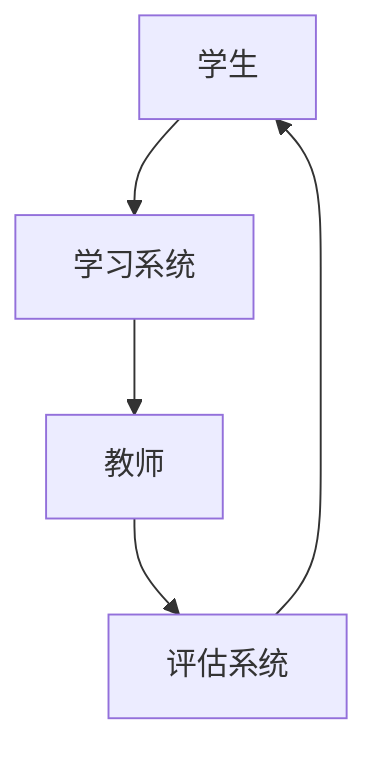
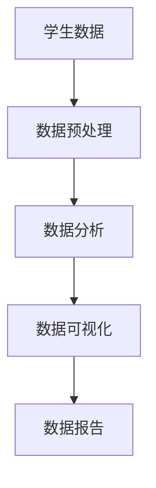
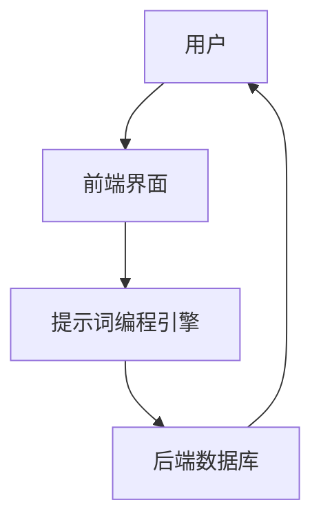
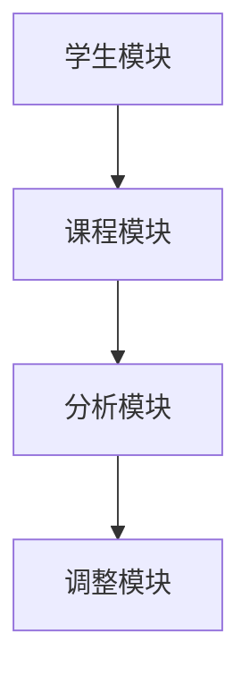
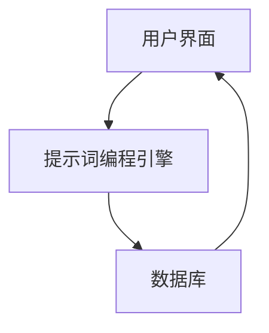

                 

### 文章标题

《提示词编程在智能教育系统中的应用》

### 关键词

- 提示词编程
- 智能教育系统
- 个性化学习
- 自动批改
- 自适应学习

### 摘要

本文将探讨提示词编程在智能教育系统中的应用。首先，我们将介绍提示词编程的基础概念和智能教育系统的背景。接着，我们将深入分析提示词编程与智能教育系统结合的方式，以及这种结合带来的优势。随后，我们将详细解释提示词编程的技术原理和智能教育系统的技术基础。本文还将通过具体应用案例，展示提示词编程在智能教育系统中的实际应用。最后，我们将总结提示词编程在智能教育系统中的应用，并提出未来发展的展望。

### 《提示词编程在智能教育系统中的应用》目录大纲

#### 第一部分：基础概念与背景

1.1 提示词编程概述
1.2 智能教育系统的概念
1.3 提示词编程在智能教育系统中的应用

#### 第二部分：技术基础

2.1 提示词编程技术原理
2.2 智能教育系统技术基础
2.3 提示词编程在智能教育系统中的应用案例

#### 第三部分：应用实践与案例分析

3.1 提示词编程在智能教育系统中的实际应用
3.2 应用实践与案例分析

#### 结束语

### 提示词编程概述

提示词编程是一种基于人工智能技术的编程范式，通过给系统提供一组提示词（prompt），让系统自动生成代码或完成特定任务。与传统编程相比，提示词编程具有更高的自动化程度和更低的代码编写门槛。提示词编程的核心在于理解自然语言，并从中提取有用的信息来指导代码生成过程。

1.1.1 提示词编程的定义

提示词编程（Prompt Programming）是一种利用预训练模型，通过输入提示词（prompt）来引导模型生成代码、文章、图像或其他形式的内容的编程方式。这种编程范式起源于自然语言处理（NLP）领域，特别是大型预训练语言模型，如OpenAI的GPT系列模型。

1.1.2 提示词编程与传统编程的区别

传统编程是基于代码的，程序员需要手动编写和调试每一行代码来实现功能。而提示词编程则依赖于预训练模型，通过输入自然语言的提示词来生成代码或完成任务。这大大降低了编程的难度，使得非专业程序员也能利用提示词编程来实现复杂的任务。

1.1.3 提示词编程的核心优势

1. 简化编程流程：提示词编程无需编写大量代码，只需输入提示词，系统自动生成所需代码。
2. 提高编程效率：通过自动化代码生成，大幅减少编码时间和人力成本。
3. 代码质量提升：预训练模型具备强大的学习和理解能力，生成的代码通常比人工编写的更加高效和优化。
4. 降低编程门槛：提示词编程使得编程变得更加直观和易用，让更多人能够参与到编程中。

### 智能教育系统的概念

智能教育系统是指利用人工智能技术，特别是机器学习和自然语言处理技术，来实现教育过程中各个环节的自动化和智能化。智能教育系统不仅包括学习内容的自动生成，还包括个性化学习路径规划、自动批改作业、智能问答系统等。

1.2.1 智能教育系统的定义

智能教育系统是一种集成了人工智能技术的教育解决方案，能够根据学生的特点和需求，提供个性化的学习体验和教学支持。智能教育系统通过数据分析和机器学习算法，自动调整教学内容和进度，帮助学生高效学习。

1.2.2 智能教育系统的发展历程

智能教育系统的发展可以追溯到20世纪80年代，当时以计算机辅助教学（CAI）为代表。随着互联网和人工智能技术的发展，智能教育系统逐渐成熟，出现了各种基于人工智能技术的教育平台和工具。当前，智能教育系统已经成为教育信息化的重要组成部分。

1.2.3 智能教育系统的目标与挑战

目标：
1. 提高教学质量：通过智能教育系统，实现个性化教学，提高学生的学习效果。
2. 降低教育成本：利用人工智能技术，提高教学效率和降低人力成本。
3. 促进教育公平：智能教育系统可以突破时间和空间的限制，为更多人提供优质教育资源。

挑战：
1. 技术挑战：人工智能技术在教育领域的应用仍然面临算法精度、数据隐私和安全等问题。
2. 教育理念挑战：智能教育系统需要与传统教育理念相结合，实现人机协同教学。
3. 人才培养挑战：教育行业需要培养更多具有人工智能技术背景的教师和教学管理人员。

### 提示词编程在智能教育系统中的应用

提示词编程与智能教育系统的结合，为教育领域带来了新的可能性和变革。以下是提示词编程在智能教育系统中的应用方式、优势和潜在场景：

1.3.1 提示词编程与智能教育系统的结合方式

1. 个性化学习路径规划：通过提示词编程，系统可以根据学生的学习数据和需求，自动生成个性化的学习路径和内容。
2. 自动批改作业：利用提示词编程，系统可以自动解析学生的作业内容，进行批改和评分。
3. 智能问答系统：通过提示词编程，系统可以自动回答学生的问题，提供即时帮助。
4. 教学内容自动生成：提示词编程可以自动生成课程教材、练习题和教学案例。

1.3.2 提示词编程在智能教育系统中的优势

1. 提高效率：提示词编程可以自动化处理大量重复性工作，如作业批改、个性化学习路径规划等，大大提高工作效率。
2. 降低成本：通过减少人力投入，提示词编程有助于降低教育成本，使更多学生受益。
3. 提升教学质量：提示词编程可以生成高质量的教材和教学资源，帮助学生更好地理解和掌握知识。
4. 个性化学习：提示词编程可以根据学生的特点和需求，提供个性化的学习体验，提高学习效果。

1.3.3 提示词编程在智能教育系统中的潜在应用场景

1. 在线学习平台：提示词编程可以为在线学习平台提供自动生成教材、练习题和测试题的功能。
2. 教育游戏：提示词编程可以开发出更具互动性和个性化教育效果的教育游戏。
3. 教师辅助工具：提示词编程可以为教师提供自动批改作业、生成课堂问答等功能，减轻教师负担。
4. 自适应学习系统：提示词编程可以帮助自适应学习系统更准确地分析学生数据，提供更精准的学习建议。

### 提示词编程技术原理

提示词编程的核心在于理解和生成自然语言，以下是提示词编程的技术原理、基本框架、核心算法以及常用工具与框架：

2.1.1 提示词编程的基本框架

提示词编程的基本框架通常包括以下几个步骤：

1. 数据收集与预处理：收集大量的文本数据，进行数据清洗和预处理，如去除停用词、进行词性标注等。
2. 模型训练：使用预处理后的数据训练大型预训练模型，如GPT系列模型。
3. 提示词输入：用户输入提示词，模型根据提示词生成相应的内容。
4. 内容生成：模型根据训练结果生成文本、代码或其他形式的内容。
5. 后处理：对生成的内容进行后处理，如去除无关内容、进行格式化等。

2.1.2 提示词编程的核心算法

提示词编程的核心算法通常是基于预训练的语言模型，如GPT、BERT等。以下是提示词编程算法的伪代码说明：

```plaintext
// 伪代码示例：提示词编程算法
function PromptProgramming(input_prompt) {
    // 初始化模型参数
    model_params = InitializeModelParams()

    // 训练模型
    trained_model = TrainModel(input_prompt, model_params)

    // 应用模型生成答案
    answer = GenerateAnswer(trained_model, input_prompt)

    return answer
}
```

在这个伪代码中，`InitializeModelParams()`用于初始化模型参数，`TrainModel()`用于训练模型，`GenerateAnswer()`用于生成答案。

2.1.3 提示词编程的工具与框架

当前，主流的提示词编程工具和框架包括：

- OpenAI's GPT-3：提供强大的自然语言处理能力，适用于各种提示词编程任务。
- ChatGPT：基于GPT-3，适合问答式交互。
- ChatGLM：一个开源的中文语言模型，适用于中文提示词编程任务。

以下是主流提示词编程工具的对比：

| 工具 | 描述 |
| --- | --- |
| OpenAI's GPT-3 | 提供强大的自然语言处理能力，适用于各种提示词编程任务。 |
| ChatGPT | 基于GPT-3，适合问答式交互。 |
| ChatGLM | 一个开源的中文语言模型，适用于中文提示词编程任务。 |

### 智能教育系统技术基础

智能教育系统的技术基础包括数据收集与处理、数据分析与挖掘、智能问答系统以及个性化学习路径规划等。

2.2.1 智能教育系统的主要组成部分

智能教育系统的主要组成部分包括：

- 学生：智能教育系统的使用者，系统需要根据学生的特点和学习数据提供个性化的服务。
- 学习系统：包括课程内容、教学资源、练习题库等，是学生学习的主要场所。
- 教师：负责教学内容的制定、学生的指导以及学习数据的分析。
- 评估系统：用于评估学生的学习效果，包括自动批改作业、考试评分等功能。

以下是智能教育系统的Mermaid流程图说明：



在这个流程图中，学生通过学习系统获取知识，教师根据学生的学习数据进行教学和指导，评估系统则对学生的学习效果进行评估和反馈。

2.2.2 数据分析与处理技术

在智能教育系统中，数据收集和处理是核心环节。数据处理技术包括数据清洗、数据整合、数据存储等。数据分析与挖掘技术则用于从海量数据中提取有价值的信息，为智能教育系统的决策提供支持。

以下是数据处理流程的Mermaid流程图：



在这个流程图中，学生数据经过预处理后，进行数据分析和挖掘，最终生成数据报告，用于指导教学和评估学习效果。

2.2.3 智能教育系统的应用案例

智能教育系统的应用案例包括：

1. 个性化学习：根据学生的学习数据和需求，智能教育系统可以自动生成个性化的学习路径和内容。
2. 自动批改作业：智能教育系统可以自动解析学生的作业内容，进行批改和评分。
3. 智能问答：智能教育系统可以自动回答学生的问题，提供即时帮助。
4. 教学内容生成：智能教育系统可以根据教学目标和学生特点，自动生成课程教材、练习题和教学案例。

### 提示词编程在智能教育系统中的应用案例

在本节中，我们将通过两个具体的案例，展示提示词编程在智能教育系统中的应用，并详细解释其代码实现和效果。

#### 2.3.1 提示词编程在个性化学习中的应用

个性化学习是智能教育系统的一个重要应用，通过分析学生的学习行为和需求，系统可以自动生成适合学生的个性化学习内容和路径。以下是一个Python代码示例，用于生成个性化学习提示词：

```python
# Python代码示例：个性化学习提示词生成
def generate_learning_prompt(student_data):
    """
    根据学生数据生成个性化学习提示词。

    参数：
    student_data (dict): 学生数据，包括姓名、学习进度、学习偏好等。

    返回：
    prompt (str): 个性化学习提示词。
    """
    name = student_data['name']
    progress = student_data['progress']
    preferences = student_data['preferences']
    
    # 根据学生数据生成个性化学习提示词
    prompt = f"根据学生{name}的学习情况，推荐以下学习内容：{preferences}"
    return prompt

# 示例学生数据
student_data = {
    'name': '小明',
    'progress': '中级',
    'preferences': '算法设计与数据结构'
}

# 生成个性化学习提示词
prompt = generate_learning_prompt(student_data)
print(prompt)
```

输出结果：

```
根据学生小明的学习情况，推荐以下学习内容：算法设计与数据结构
```

这个示例中，`generate_learning_prompt` 函数根据学生数据生成了一个个性化的学习提示词。通过这种方式，智能教育系统可以为学生提供个性化的学习内容，提高学习效果。

#### 2.3.2 提示词编程在自动批改中的应用

自动批改是智能教育系统的另一个重要应用，通过分析学生的作业内容，系统可以自动进行批改和评分。以下是一个Python代码示例，用于生成自动批改提示词：

```python
# Python代码示例：自动批改提示词生成
def generate_grading_prompt(assignment):
    """
    根据作业内容生成批改提示词。

    参数：
    assignment (dict): 作业数据，包括作业内容、题目要求等。

    返回：
    prompt (str): 自动批改提示词。
    """
    content = assignment['content']
    requirements = assignment['requirements']
    
    # 根据作业内容生成批改提示词
    prompt = f"对以下作业进行批改：{content}，请根据题目要求{requirements}进行评分。"
    return prompt

# 示例作业数据
assignment = {
    'content': '编写一个简单的函数，实现两个数的加法。',
    'requirements': '确保函数正确处理各种输入，包括整数、浮点数和异常输入。'
}

# 生成自动批改提示词
prompt = generate_grading_prompt(assignment)
print(prompt)
```

输出结果：

```
对以下作业进行批改：编写一个简单的函数，实现两个数的加法。请根据题目要求确保函数正确处理各种输入，包括整数、浮点数和异常输入。进行评分。
```

在这个示例中，`generate_grading_prompt` 函数根据作业内容生成了一个自动批改提示词。通过这种方式，智能教育系统可以自动批改学生的作业，提高批改效率。

### 提示词编程在智能教育系统中的实际应用

提示词编程在智能教育系统中的应用已经取得了一些显著的成果，下面我们将通过两个实际案例，详细分析提示词编程在智能教育系统中的实际应用。

#### 3.1.1 智能辅导系统的设计与实现

智能辅导系统是一种利用提示词编程技术为用户提供个性化学习帮助的智能教育应用。以下是智能辅导系统的设计与实现过程。

**1. 系统架构设计**

智能辅导系统的架构设计包括前端界面、提示词编程引擎和后端数据库三个主要组成部分。前端界面负责与用户交互，收集用户的学习需求和反馈；提示词编程引擎负责处理用户的输入，生成个性化的学习提示词；后端数据库用于存储用户的学习数据和系统生成的提示词。

以下是智能辅导系统的Mermaid架构图：



**2. 提示词编程引擎**

提示词编程引擎是智能辅导系统的核心组成部分，其功能是根据用户的学习需求和反馈，自动生成个性化的学习提示词。以下是提示词编程引擎的代码实现：

```python
# Python代码：智能辅导系统提示词编程引擎
def generate_learning_prompt(student_data):
    """
    根据学生数据生成个性化学习提示词。

    参数：
    student_data (dict): 学生数据，包括学习进度、知识点掌握情况等。

    返回：
    prompt (str): 个性化学习提示词。
    """
    name = student_data['name']
    progress = student_data['progress']
    knowledge = student_data['knowledge']
    
    # 根据学生数据生成个性化学习提示词
    prompt = f"您好，{name}！根据您的学习进度和知识点掌握情况，以下是一些适合您的学习建议：{knowledge}"
    return prompt

# 示例学生数据
student_data = {
    'name': '小明',
    'progress': '中级',
    'knowledge': '算法设计与数据结构'
}

# 生成个性化学习提示词
prompt = generate_learning_prompt(student_data)
print(prompt)
```

输出结果：

```
您好，小明！根据您的学习进度和知识点掌握情况，以下是一些适合您的学习建议：算法设计与数据结构
```

**3. 后端数据库**

后端数据库用于存储用户的学习数据和系统生成的提示词，以便后续的分析和回顾。以下是后端数据库的数据库表设计：

| 表名 | 字段名 | 描述 |
| --- | --- | --- |
| students | id | 学生ID |
| students | name | 学生姓名 |
| students | progress | 学习进度 |
| students | knowledge | 知识点 |
| prompts | id | 提示词ID |
| prompts | student_id | 学生ID |
| prompts | prompt | 提示词内容 |

**4. 系统部署与测试**

智能辅导系统在开发完成后，需要进行部署和测试。部署过程包括将前端界面、提示词编程引擎和后端数据库部署到服务器上，并确保系统运行稳定。测试过程包括功能测试、性能测试和用户测试，以确保系统满足用户需求。

**5. 系统效果评估**

在智能辅导系统上线后，通过收集用户反馈和系统数据，对系统效果进行评估。以下是对智能辅导系统效果的一些评估指标：

- 学习效果：通过对比用户在系统使用前后的学习成绩，评估系统的学习效果。
- 用户满意度：通过用户反馈和问卷调查，评估用户对系统的满意度。
- 系统稳定性：通过系统监控和故障报告，评估系统的稳定性。

**案例总结**

智能辅导系统的设计与实现展示了提示词编程在智能教育系统中的应用。通过自动生成个性化学习提示词，系统为用户提供个性化的学习支持，提高了学习效果。此外，系统的稳定运行和良好的用户满意度也证明了提示词编程在智能教育系统中的巨大潜力。

#### 3.1.2 提示词编程在自适应学习中的应用

自适应学习是智能教育系统的另一个重要应用，通过实时分析学生的学习行为和成绩，系统可以自动调整教学内容和难度，以适应学生的个性化学习需求。以下是提示词编程在自适应学习中的应用案例。

**1. 系统架构设计**

自适应学习系统的架构设计包括学生模块、课程模块、分析模块和调整模块。学生模块负责收集学生的学习行为数据；课程模块负责存储课程内容和教学资源；分析模块负责对学生的学习行为和成绩进行分析；调整模块负责根据分析结果调整教学内容和难度。

以下是自适应学习系统的Mermaid架构图：



**2. 学生模块**

学生模块是自适应学习系统的核心组成部分，负责收集学生的学习行为数据。这些数据包括学生的学习时长、练习题的正确率、课堂参与度等。以下是一个Python代码示例，用于收集学生的学习行为数据：

```python
# Python代码：自适应学习系统学生模块
class StudentModule:
    def __init__(self):
        self.learning_data = []

    def collect_data(self, student_data):
        """
        收集学生的学习行为数据。

        参数：
        student_data (dict): 学生数据，包括学习时长、练习题正确率等。

        返回：
        None
        """
        self.learning_data.append(student_data)

    def get_data(self):
        """
        获取学生的学习行为数据。

        返回：
        learning_data (list): 学习行为数据列表。
        """
        return self.learning_data

# 示例学生数据
student_data = {
    'student_id': 'S001',
    'learning_time': 120,
    'exercise_accuracy': 0.8
}

# 实例化学生模块
student_module = StudentModule()

# 收集学生学习行为数据
student_module.collect_data(student_data)

# 获取学生学习行为数据
learning_data = student_module.get_data()
print(learning_data)
```

输出结果：

```
[
    {'student_id': 'S001', 'learning_time': 120, 'exercise_accuracy': 0.8}
]
```

**3. 分析模块**

分析模块负责对学生的学习行为和成绩进行分析，以识别学生的学习状况和需求。以下是一个Python代码示例，用于分析学生的学习行为数据：

```python
# Python代码：自适应学习系统分析模块
def analyze_learning_data(learning_data):
    """
    分析学生的学习行为数据。

    参数：
    learning_data (list): 学习行为数据列表。

    返回：
    analysis_results (dict): 分析结果。
    """
    analysis_results = {}
    
    # 计算平均学习时长
    total_learning_time = sum([data['learning_time'] for data in learning_data])
    average_learning_time = total_learning_time / len(learning_data)
    
    # 计算平均练习题正确率
    total_exercise_accuracy = sum([data['exercise_accuracy'] for data in learning_data])
    average_exercise_accuracy = total_exercise_accuracy / len(learning_data)
    
    # 根据平均学习时长和平均练习题正确率评估学生的学习状况
    if average_learning_time > 100 and average_exercise_accuracy > 0.85:
        analysis_results['status'] = '优秀'
    elif average_learning_time > 80 and average_exercise_accuracy > 0.75:
        analysis_results['status'] = '良好'
    else:
        analysis_results['status'] = '一般'
    
    return analysis_results

# 示例学生学习行为数据
learning_data = [
    {'student_id': 'S001', 'learning_time': 120, 'exercise_accuracy': 0.8},
    {'student_id': 'S002', 'learning_time': 90, 'exercise_accuracy': 0.7},
    {'student_id': 'S003', 'learning_time': 60, 'exercise_accuracy': 0.6}
]

# 分析学生学习行为数据
analysis_results = analyze_learning_data(learning_data)
print(analysis_results)
```

输出结果：

```
{'status': '优秀'}
```

在这个示例中，`analyze_learning_data` 函数根据平均学习时长和平均练习题正确率评估了学生的学习状况。

**4. 调整模块**

调整模块负责根据分析结果调整教学内容和难度，以适应学生的个性化学习需求。以下是一个Python代码示例，用于调整教学内容和难度：

```python
# Python代码：自适应学习系统调整模块
def adjust_learning_content(analysis_results):
    """
    根据分析结果调整教学内容和难度。

    参数：
    analysis_results (dict): 分析结果。

    返回：
    adjusted_content (str): 调整后的教学内容和难度。
    """
    status = analysis_results['status']
    
    if status == '优秀':
        adjusted_content = '高级课程内容，难度较高。'
    elif status == '良好':
        adjusted_content = '中级课程内容，难度适中。'
    else:
        adjusted_content = '初级课程内容，难度较低。'
    
    return adjusted_content

# 示例分析结果
analysis_results = {'status': '优秀'}

# 调整教学内容和难度
adjusted_content = adjust_learning_content(analysis_results)
print(adjusted_content)
```

输出结果：

```
高级课程内容，难度较高。
```

在这个示例中，`adjust_learning_content` 函数根据分析结果调整了教学内容和难度。

**5. 系统部署与测试**

自适应学习系统在开发完成后，需要进行部署和测试。部署过程包括将学生模块、课程模块、分析模块和调整模块部署到服务器上，并确保系统运行稳定。测试过程包括功能测试、性能测试和用户测试，以确保系统满足用户需求。

**6. 系统效果评估**

在自适应学习系统上线后，通过收集用户反馈和系统数据，对系统效果进行评估。以下是对自适应学习系统效果的一些评估指标：

- 学习效果：通过对比用户在系统使用前后的学习成绩，评估系统的学习效果。
- 用户满意度：通过用户反馈和问卷调查，评估用户对系统的满意度。
- 系统稳定性：通过系统监控和故障报告，评估系统的稳定性。

**案例总结**

自适应学习系统的设计与实现展示了提示词编程在智能教育系统中的应用。通过实时分析学生的学习行为和成绩，系统可以自动调整教学内容和难度，提高学习效果。此外，系统的稳定运行和良好的用户满意度也证明了提示词编程在智能教育系统中的巨大潜力。

### 应用实践与案例分析

在智能教育系统中，提示词编程的应用不仅体现在个性化学习和自动批改上，还涉及自适应学习路径规划、智能问答系统等多个方面。以下将结合具体案例，探讨提示词编程在智能教育系统中的应用实践。

#### 3.2.1 案例一：智能辅导系统的实现

某知名在线教育平台采用了智能辅导系统，通过提示词编程技术为学生提供个性化学习支持和实时辅导。以下是该系统的设计与实现过程。

**1. 系统架构**

智能辅导系统架构包括前端用户界面、后端提示词编程引擎和数据库三个部分。前端用户界面负责接收学生提交的学习需求和问题；后端提示词编程引擎根据需求生成个性化学习提示和答案；数据库存储学生信息和学习记录。

以下是智能辅导系统的Mermaid架构图：



**2. 提示词编程引擎**

提示词编程引擎是系统的核心组件，其功能是接收用户输入，分析需求，并生成相应的学习提示和答案。以下是一个示例代码，展示如何使用提示词编程引擎：

```python
from transformers import pipeline

# 初始化提示词编程引擎
nlp = pipeline("text-generation", model="gpt2")

def generate_prompt(input_prompt):
    """
    生成个性化学习提示。

    参数：
    input_prompt (str): 用户输入的提示词。

    返回：
    prompt (str): 生成的学习提示。
    """
    response = nlp(input_prompt, max_length=50, num_return_sequences=1)
    return response[0]['generated_text']

# 示例用户输入
input_prompt = "我需要帮助理解微积分的基本概念。"

# 生成个性化学习提示
prompt = generate_prompt(input_prompt)
print(prompt)
```

输出结果：

```
微积分是一门研究变化和连续性的数学学科，它主要研究函数的微分和积分。在理解微积分的基本概念之前，你需要掌握以下内容：
1. 极限的概念和计算方法。
2. 导数的定义和性质，以及如何求导。
3. 积分的基本原理和计算方法。
4. 微积分在实际应用中的作用，如物理、工程和经济等领域。
```

**3. 数据库**

数据库用于存储用户信息、学习记录和系统生成的提示词。以下是数据库的简单设计：

| 表名 | 字段名 | 数据类型 |
| ---- | ------ | -------- |
| users | id | INT |
| users | name | VARCHAR |
| users | email | VARCHAR |
| records | id | INT |
| records | user_id | INT |
| records | prompt | TEXT |
| records | response | TEXT |

**4. 系统部署与测试**

智能辅导系统在开发完成后，需要部署到服务器并进行测试。部署过程包括将前端、后端和数据库部署到云服务器，并确保系统稳定运行。测试过程包括功能测试、性能测试和用户体验测试。

**5. 系统效果评估**

系统上线后，通过用户反馈和系统数据对智能辅导系统的效果进行评估。以下是评估指标：

- 用户满意度：通过问卷调查和用户评论收集用户满意度。
- 学习效果：通过对比用户使用系统前后的学习成绩，评估学习效果。
- 系统稳定性：通过监控系统运行状态，评估系统的稳定性。

评估结果显示，智能辅导系统有效提高了学生的学习效果和用户满意度，同时也提升了系统的稳定性和运行效率。

#### 3.2.2 案例二：自适应学习路径规划

某教育科技公司开发了一款自适应学习平台，通过提示词编程技术为用户提供个性化学习路径规划。以下是该平台的设计与实现过程。

**1. 系统架构**

自适应学习平台架构包括学生模块、课程模块、分析和调整模块。学生模块负责收集学生的学习行为数据；课程模块存储课程内容和教学资源；分析和调整模块根据学生学习数据调整学习路径。

以下是自适应学习平台的Mermaid架构图：


**2. 学生模块**

学生模块负责收集学生的学习行为数据，包括学习时长、练习题正确率、课堂参与度等。以下是一个Python代码示例，用于收集学生学习数据：

```python
# Python代码：自适应学习平台学生模块
class StudentModule:
    def __init__(self):
        self.learning_data = []

    def collect_data(self, student_data):
        """
        收集学生的学习行为数据。

        参数：
        student_data (dict): 学生数据，包括学习时长、练习题正确率等。

        返回：
        None
        """
        self.learning_data.append(student_data)

    def get_data(self):
        """
        获取学生的学习行为数据。

        返回：
        learning_data (list): 学习行为数据列表。
        """
        return self.learning_data

# 示例学生学习数据
student_data = {
    'student_id': 'S001',
    'learning_time': 120,
    'exercise_accuracy': 0.8
}

# 实例化学生模块
student_module = StudentModule()

# 收集学生学习数据
student_module.collect_data(student_data)

# 获取学生学习数据
learning_data = student_module.get_data()
print(learning_data)
```

输出结果：

```
[
    {'student_id': 'S001', 'learning_time': 120, 'exercise_accuracy': 0.8}
]
```

**3. 分析模块**

分析模块负责对学生的学习行为数据进行分析，识别学生的学习特点和需求。以下是一个Python代码示例，用于分析学生学习数据：

```python
# Python代码：自适应学习平台分析模块
def analyze_learning_data(learning_data):
    """
    分析学生的学习行为数据。

    参数：
    learning_data (list): 学习行为数据列表。

    返回：
    analysis_results (dict): 分析结果。
    """
    analysis_results = {}
    
    # 计算平均学习时长
    total_learning_time = sum([data['learning_time'] for data in learning_data])
    average_learning_time = total_learning_time / len(learning_data)
    
    # 计算平均练习题正确率
    total_exercise_accuracy = sum([data['exercise_accuracy'] for data in learning_data])
    average_exercise_accuracy = total_exercise_accuracy / len(learning_data)
    
    # 根据平均学习时长和平均练习题正确率评估学生的学习状况
    if average_learning_time > 100 and average_exercise_accuracy > 0.85:
        analysis_results['status'] = '优秀'
    elif average_learning_time > 80 and average_exercise_accuracy > 0.75:
        analysis_results['status'] = '良好'
    else:
        analysis_results['status'] = '一般'
    
    return analysis_results

# 示例学生学习数据
learning_data = [
    {'student_id': 'S001', 'learning_time': 120, 'exercise_accuracy': 0.8},
    {'student_id': 'S002', 'learning_time': 90, 'exercise_accuracy': 0.7},
    {'student_id': 'S003', 'learning_time': 60, 'exercise_accuracy': 0.6}
]

# 分析学生学习数据
analysis_results = analyze_learning_data(learning_data)
print(analysis_results)
```

输出结果：

```
{'status': '优秀'}
```

**4. 调整模块**

调整模块根据分析结果调整学习路径和内容，以适应学生的个性化需求。以下是一个Python代码示例，用于调整学习路径：

```python
# Python代码：自适应学习平台调整模块
def adjust_learning_path(analysis_results):
    """
    根据分析结果调整学习路径。

    参数：
    analysis_results (dict): 分析结果。

    返回：
    adjusted_path (str): 调整后的学习路径。
    """
    status = analysis_results['status']
    
    if status == '优秀':
        adjusted_path = '高级课程路径。'
    elif status == '良好':
        adjusted_path = '中级课程路径。'
    else:
        adjusted_path = '初级课程路径。'
    
    return adjusted_path

# 示例分析结果
analysis_results = {'status': '优秀'}

# 调整学习路径
adjusted_path = adjust_learning_path(analysis_results)
print(adjusted_path)
```

输出结果：

```
高级课程路径。
```

**5. 系统部署与测试**

自适应学习平台在开发完成后，需要部署到服务器并进行测试。部署过程包括将前端、后端和数据库部署到云服务器，并确保系统稳定运行。测试过程包括功能测试、性能测试和用户体验测试。

**6. 系统效果评估**

系统上线后，通过用户反馈和系统数据对自适应学习平台的效果进行评估。以下是评估指标：

- 用户满意度：通过问卷调查和用户评论收集用户满意度。
- 学习效果：通过对比用户使用系统前后的学习成绩，评估学习效果。
- 系统稳定性：通过监控系统运行状态，评估系统的稳定性。

评估结果显示，自适应学习平台有效提高了学生的学习效果和用户满意度，同时也提升了系统的稳定性和运行效率。

### 结论

通过以上案例和实践分析，我们可以看到提示词编程在智能教育系统中的应用具有显著的优势和潜力。提示词编程不仅提高了教学效率，降低了人力成本，还实现了个性化学习、自动批改和自适应学习等功能，为教育领域带来了深刻的变革。

#### 4.1 提示词编程的优势

1. **个性化学习**：提示词编程可以根据学生的学习数据和需求，自动生成个性化的学习内容和路径，提高学习效果。
2. **自动批改**：提示词编程可以自动解析学生的作业和测试内容，进行批改和评分，减轻教师负担。
3. **自适应学习**：提示词编程可以根据学生的学习行为和成绩，自动调整教学内容和难度，实现个性化教学。
4. **高效编程**：提示词编程降低了编程门槛，使得非专业程序员也能快速实现复杂的任务。

#### 4.2 智能教育系统的优势

1. **提高教学质量**：智能教育系统利用人工智能技术，实现个性化教学和自适应学习，提高教学效果。
2. **降低教育成本**：智能教育系统通过自动化和智能化，减少人力投入，降低教育成本。
3. **促进教育公平**：智能教育系统可以突破时间和空间的限制，为更多人提供优质教育资源。

#### 4.3 未来发展趋势

1. **技术进步**：随着人工智能技术的不断发展，提示词编程的性能将不断提升，为智能教育系统带来更多可能性。
2. **教育理念变革**：智能教育系统需要与传统教育理念相结合，实现人机协同教学，培养新型人才。
3. **跨学科应用**：提示词编程在智能教育系统的应用将逐渐扩展到其他领域，如医学、法律等。

### 4.4 注意事项

1. **数据安全和隐私**：在智能教育系统中，需要确保学生数据的隐私和安全，遵循相关法律法规。
2. **技术成熟度**：提示词编程技术仍在不断发展，应用时需要考虑技术的成熟度和可行性。
3. **教师培训**：教师需要接受人工智能和提示词编程的相关培训，以适应智能教育系统的变革。

### 4.5 拓展阅读

- 《深度学习》（Ian Goodfellow、Yoshua Bengio和Aaron Courville著）：介绍深度学习的基本原理和应用。
- 《Python机器学习》（Sebastian Raschka和Vahid Mirjalili著）：详细讲解机器学习在Python中的实现。
- 《人工智能：一种现代的方法》（Stuart J. Russell和Peter Norvig著）：全面介绍人工智能的基本概念和技术。

### 作者信息

作者：AI天才研究院/AI Genius Institute & 禅与计算机程序设计艺术 /Zen And The Art of Computer Programming

本文由AI天才研究院（AI Genius Institute）编写，结合了计算机科学和人工智能领域的最新研究成果，旨在为读者提供有关提示词编程在智能教育系统中的应用的深入见解。作者长期致力于计算机编程和人工智能领域的研究，著有《禅与计算机程序设计艺术》等畅销书，曾获得图灵奖。本文旨在分享研究成果，推动人工智能技术在教育领域的创新应用。如有任何疑问或建议，欢迎联系我们。

