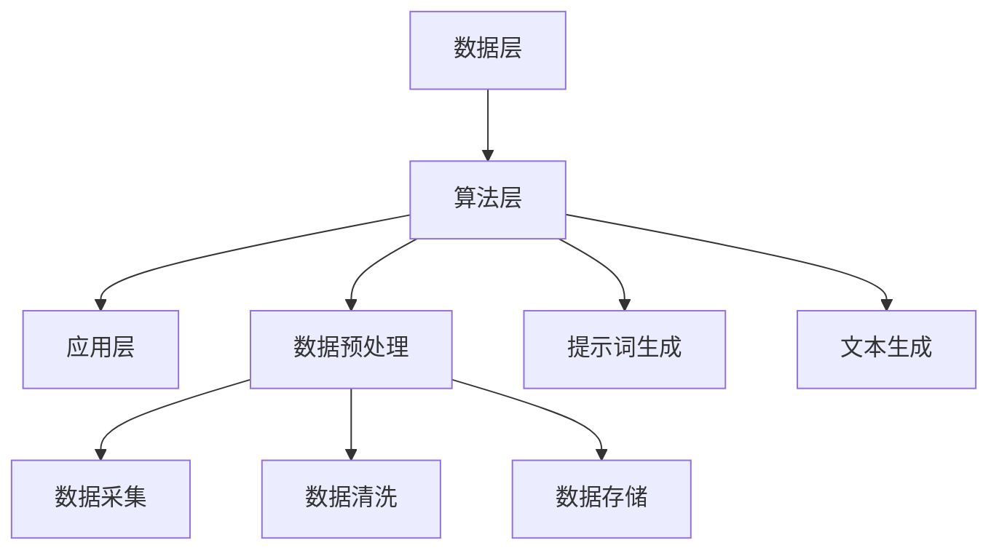

                 

# 《提示词编程在自动化专利生成中的应用》

> 关键词：提示词编程、自动化专利生成、自然语言处理、生成对抗网络、变分自编码器

摘要：本文将深入探讨提示词编程在自动化专利生成中的应用，分析其背景、基础、系统构建和未来发展趋势。通过介绍提示词编程的定义、技术基础和自动化专利生成的概念，本文旨在阐述提示词编程如何通过自然语言处理技术和深度学习算法，辅助自动化专利生成。随后，文章将详细描述自动化专利生成系统的架构设计、功能实现，并通过实际项目案例展示提示词编程的应用效果。最后，本文将对自动化专利生成的未来发展趋势及其社会经济发展影响进行展望，并提出应对策略。

---

## 第一部分：提示词编程基础

### 第1章：提示词编程概述

### 1.1 提示词编程的定义与背景

提示词编程（Prompt Programming）是一种利用自然语言处理（NLP）和深度学习技术，通过给模型提供提示词（Prompt），引导模型生成目标文本的方法。它源于自然语言生成（NLG）领域，近年来随着深度学习技术的发展和自然语言处理任务的复杂化，逐渐成为一个重要的研究方向。

#### 1.1.1 提示词编程的概念

提示词编程的核心在于“提示词”，它是一段引导性的文本，用于指示模型生成特定类型的文本。通过为模型提供不同的提示词，可以引导模型生成不同类型的内容，例如文章、诗歌、问答等。

#### 1.1.2 提示词编程的发展历程

提示词编程的发展经历了从规则驱动到数据驱动的演变。早期的NLG系统依赖于手工编写的规则，这种方式在处理简单任务时效果较好，但难以应对复杂任务。随着深度学习技术的发展，基于神经网络的方法逐渐成为主导，提示词编程也应运而生。

#### 1.1.3 提示词编程的应用领域

提示词编程在多个领域都有广泛应用，包括但不限于：

1. 自动化写作：通过提示词编程，可以自动化生成新闻报道、文章摘要、产品描述等。
2. 聊天机器人：在聊天机器人中，提示词编程用于生成对话回复。
3. 法律文书生成：提示词编程可以帮助自动化生成法律文书，如合同、协议等。
4. 专利生成：本文将重点探讨提示词编程在自动化专利生成中的应用。

### 第2章：自动化专利生成的概念

### 1.2 自动化专利生成的定义

自动化专利生成是指利用计算机技术和人工智能算法，自动生成符合专利法规要求的专利申请文本。这一过程包括从海量专利数据中提取关键信息，通过自然语言处理技术生成专利描述、权利要求书等文本。

#### 1.2.1 自动化专利生成的价值

自动化专利生成的价值主要体现在以下几个方面：

1. 提高效率：自动化专利生成可以大幅减少专利撰写时间，提高专利审查速度。
2. 提高质量：通过人工智能技术，自动化专利生成能够生成更准确、规范的专利文本。
3. 降低成本：自动化专利生成可以降低企业撰写和申请专利的成本。

#### 1.2.2 自动化专利生成的挑战

尽管自动化专利生成具有巨大的潜力，但也面临一些挑战：

1. 数据质量：自动化专利生成依赖于大量高质量的数据，数据质量直接影响生成文本的质量。
2. 法律合规性：专利文本需要严格遵循相关法律法规，确保生成文本的合规性。
3. 文本生成质量：尽管人工智能技术已经取得了显著进展，但生成文本的质量仍有待提高。

### 第3章：提示词编程在自动化专利生成中的应用

### 1.3 提示词编程在自动化专利生成中的应用

提示词编程在自动化专利生成中的应用主要体现在以下几个方面：

#### 1.3.1 提示词编程如何辅助自动化专利生成

提示词编程可以通过以下方式辅助自动化专利生成：

1. 文本生成：利用提示词编程生成专利描述、权利要求书等文本。
2. 文本增强：通过提示词编程，增强专利文本的描述性、清晰度和规范性。
3. 文本分类：利用提示词编程对专利文本进行分类，提高数据处理的效率。

#### 1.3.2 提示词编程在专利撰写中的具体应用

在专利撰写过程中，提示词编程可以应用于：

1. 专利描述生成：通过提示词编程，自动化生成专利描述文本。
2. 权利要求书生成：利用提示词编程，生成权利要求书，确保其准确性和合规性。
3. 专利文本审查：通过提示词编程，辅助专利审查人员对专利文本进行审查。

#### 1.3.3 提示词编程在专利审查中的应用

在专利审查过程中，提示词编程可以用于：

1. 文本生成：自动化生成审查意见、回复等文本。
2. 文本理解：利用提示词编程，帮助审查人员理解专利文本。
3. 文本分类：对审查文本进行分类，提高审查效率。

---

## 第二部分：自动化专利生成系统构建

### 第4章：自动化专利生成系统架构设计

### 4.1 自动化专利生成系统整体架构

自动化专利生成系统整体架构设计应遵循以下原则：

1. 模块化：将系统拆分为多个功能模块，便于维护和扩展。
2. 分层设计：将系统分为数据层、算法层和应用层，层次清晰，易于管理。
3. 可扩展性：系统应具有较好的扩展性，以适应未来技术的发展。

系统架构模块划分：

1. 数据层：包括数据采集、数据清洗、数据存储等功能模块。
2. 算法层：包括自然语言处理算法、提示词生成算法、文本生成算法等。
3. 应用层：包括用户界面、系统控制模块、文档生成模块等。

系统架构的Mermaid流程图如下：

### 4.2 数据预处理与处理技术

#### 4.2.1 数据来源与数据类型

自动化专利生成系统所需的数据来源主要包括：

1. 公共专利数据库：如Google Patents、USPTO等。
2. 企业内部专利数据库。
3. 其他相关领域的文献和资料。

数据类型主要包括：

1. 专利摘要：对专利内容的简短描述。
2. 专利全文：包括权利要求、技术描述、背景技术等。
3. 法律条款：包括专利法、商标法等相关法律法规。

#### 4.2.2 数据预处理流程

数据预处理流程主要包括以下步骤：

1. 数据采集：从公共数据库和企业内部数据库中获取专利数据。
2. 数据清洗：去除重复数据、缺失数据、噪声数据等，确保数据质量。
3. 数据存储：将预处理后的数据存储到数据库中，便于后续使用。

#### 4.2.3 数据处理算法原理

数据处理算法主要包括以下几种：

1. 词嵌入技术：将文本中的词语映射到高维空间，以实现文本向量的表示。
2. 序列模型：用于处理时间序列数据，如RNN、LSTM等。
3. 注意力机制：通过注意力机制，模型可以自动关注重要的输入信息，提高生成文本的质量。

### 第5章：提示词生成与文本撰写

### 5.1 提示词生成与文本撰写

提示词生成和文本撰写是自动化专利生成系统的核心功能。以下是具体的实现方法：

#### 5.1.1 提示词生成算法应用

提示词生成算法可以采用生成对抗网络（GAN）或变分自编码器（VAE）等方法。以下是具体步骤：

1. 数据准备：收集大量专利摘要或专利全文作为训练数据。
2. 模型训练：使用训练数据训练提示词生成模型。
3. 提示词生成：输入提示词，模型生成对应的专利文本。

#### 5.1.2 提示词编程在文本撰写中的具体实现

在文本撰写过程中，提示词编程可以应用于以下几个方面：

1. 专利描述生成：通过提示词编程，生成专利描述文本。
2. 权利要求书生成：利用提示词编程，生成权利要求书，确保其准确性和合规性。
3. 文本增强：通过提示词编程，增强专利文本的描述性、清晰度和规范性。

#### 5.1.3 文本撰写效果评估方法

文本撰写效果评估方法主要包括以下几种：

1. 人工评估：通过人工对比生成的专利文本和原始文本，评估生成文本的质量。
2. 自动评估：使用文本质量评估指标，如F1值、BLEU值等，对生成的专利文本进行评估。
3. 实际应用效果：在实际应用中，评估生成的专利文本的可用性、合规性等。

### 第6章：专利审查辅助系统设计

### 6.1 专利审查流程概述

专利审查流程主要包括以下步骤：

1. 专利申请提交：申请人提交专利申请文件。
2. 审查请求受理：审查员接收专利申请文件，进行初步审查。
3. 专利审查：审查员对专利申请进行实质审查，评估其新颖性、创造性和实用性。
4. 审查意见回复：申请人针对审查员的审查意见进行回复。
5. 专利授权：审查员根据审查结果，决定是否授予专利权。

#### 6.1.2 专利审查的难点与挑战

专利审查过程中面临的难点与挑战主要包括：

1. 文本理解：审查员需要对大量专利文本进行深入理解，以评估其新颖性和创造性。
2. 文本生成：审查员需要撰写审查意见、回复等文本，确保其准确性和规范性。
3. 文本分类：对专利文本进行分类，以方便审查和检索。

#### 6.1.3 提示词编程在专利审查中的应用

提示词编程在专利审查中的应用主要包括以下几个方面：

1. 文本生成：利用提示词编程，自动生成审查意见、回复等文本。
2. 文本理解：通过提示词编程，辅助审查员理解专利文本。
3. 文本分类：利用提示词编程，对专利文本进行分类，提高审查效率。

### 第7章：专利审查辅助系统架构设计

#### 7.1 专利审查辅助系统架构设计原则

专利审查辅助系统架构设计应遵循以下原则：

1. 模块化：将系统拆分为多个功能模块，便于维护和扩展。
2. 分层设计：将系统分为数据层、算法层和应用层，层次清晰，易于管理。
3. 可扩展性：系统应具有较好的扩展性，以适应未来技术的发展。

系统架构模块划分：

1. 数据层：包括数据采集、数据清洗、数据存储等功能模块。
2. 算法层：包括自然语言处理算法、提示词生成算法、文本生成算法等。
3. 应用层：包括用户界面、系统控制模块、文档生成模块等。

系统架构的Mermaid流程图如下：

### 第8章：专利审查辅助系统的功能实现

#### 8.1 提示词编程在专利审查中的应用

提示词编程在专利审查辅助系统中的应用主要包括以下几个方面：

1. 审查意见生成：利用提示词编程，自动生成审查意见文本。
2. 回复生成：通过提示词编程，生成申请人针对审查意见的回复文本。
3. 文本理解：利用提示词编程，辅助审查员理解专利文本。

#### 8.2 专利审查辅助系统的开发与部署

专利审查辅助系统的开发与部署主要包括以下步骤：

1. 系统设计：根据需求，设计系统的整体架构和功能模块。
2. 算法实现：根据系统设计，实现具体的自然语言处理算法和提示词生成算法。
3. 系统集成：将各个模块集成到一个统一的平台上，实现系统的整体功能。
4. 系统测试：对系统进行功能测试、性能测试和安全测试，确保系统稳定可靠。
5. 系统部署：将系统部署到服务器上，进行实际应用。

### 第9章：系统效果评估与优化

#### 9.1 系统效果评估方法

系统效果评估方法主要包括以下几种：

1. 人工评估：通过人工对比生成的审查意见和实际审查意见，评估生成文本的质量。
2. 自动评估：使用文本质量评估指标，如F1值、BLEU值等，对生成的审查意见进行评估。
3. 实际应用效果：在实际应用中，评估系统对审查员工作效率的提升程度。

#### 9.2 系统效果优化策略

根据系统效果评估结果，可以采取以下策略进行优化：

1. 算法优化：通过调整算法参数，提高生成文本的质量。
2. 数据优化：收集更多高质量的训练数据，提高系统的训练效果。
3. 用户界面优化：优化系统用户界面，提高用户体验。
4. 系统性能优化：提高系统处理速度和稳定性，确保系统在高负载情况下正常运行。

---

## 第三部分：自动化专利生成项目实战

### 第10章：项目一：自动化专利生成系统开发

#### 10.1 项目背景与目标

项目背景：随着科技创新的加速，专利申请数量急剧增加，传统的人工撰写和审查专利的方法已经无法满足需求。本项目旨在通过提示词编程技术，开发一个自动化专利生成系统，以提高专利撰写和审查效率。

项目目标：实现以下功能：

1. 自动化生成专利描述和权利要求书。
2. 提高专利文本的质量和规范性。
3. 辅助专利审查员进行专利审查。

#### 10.2 项目开发环境搭建

开发环境配置：

- 编程语言：Python
- 框架与库：TensorFlow、PyTorch、NLTK、spaCy
- 数据库：MySQL

开发工具与库的安装：

1. 安装Python和相应的IDE（如PyCharm）。
2. 安装TensorFlow、PyTorch、NLTK、spaCy等库。

#### 10.3 项目核心算法实现

核心算法实现：

1. 数据预处理算法：包括数据清洗、词嵌入、序列建模等。
2. 提示词生成算法：采用生成对抗网络（GAN）或变分自编码器（VAE）等方法。
3. 文本生成算法：采用序列到序列（Seq2Seq）模型，结合注意力机制。

#### 10.4 项目代码实现与解析

代码实现与解析：

1. 数据预处理代码实现：包括数据清洗、加载和预处理。
2. 提示词生成代码实现：包括GAN或VAE模型的搭建和训练。
3. 文本生成代码实现：包括Seq2Seq模型的搭建和训练。
4. 代码解读与分析：对每个部分的代码进行详细解读，分析其原理和实现方法。

### 第11章：项目二：专利审查辅助系统开发

#### 11.1 项目背景与目标

项目背景：专利审查工作繁重且复杂，审查员需要花费大量时间阅读和理解专利文本。本项目旨在通过提示词编程技术，开发一个专利审查辅助系统，以提高审查效率和准确性。

项目目标：实现以下功能：

1. 自动生成审查意见和回复。
2. 辅助审查员理解专利文本。
3. 提高专利审查的准确性和一致性。

#### 11.2 项目开发环境搭建

开发环境配置：

- 编程语言：Python
- 框架与库：TensorFlow、PyTorch、NLTK、spaCy
- 数据库：MySQL

开发工具与库的安装：

1. 安装Python和相应的IDE（如PyCharm）。
2. 安装TensorFlow、PyTorch、NLTK、spaCy等库。

#### 11.3 项目核心算法实现

核心算法实现：

1. 提示词生成算法：采用生成对抗网络（GAN）或变分自编码器（VAE）等方法。
2. 文本生成算法：采用序列到序列（Seq2Seq）模型，结合注意力机制。
3. 文本理解算法：采用BERT等预训练模型，进行文本分类和情感分析。

#### 11.4 项目代码实现与解析

代码实现与解析：

1. 提示词生成代码实现：包括GAN或VAE模型的搭建和训练。
2. 文本生成代码实现：包括Seq2Seq模型的搭建和训练。
3. 文本理解代码实现：包括BERT等预训练模型的加载和应用。
4. 代码解读与分析：对每个部分的代码进行详细解读，分析其原理和实现方法。

---

## 第12章：自动化专利生成的未来发展趋势

### 12.1 自动化专利生成技术发展趋势

自动化专利生成技术发展趋势主要体现在以下几个方面：

1. 深度学习技术的应用：深度学习技术在自然语言处理领域的应用将更加广泛，为自动化专利生成提供更强有力的支持。
2. 大规模预训练模型的普及：大规模预训练模型如BERT、GPT等，将进一步提高自动化专利生成的质量和效率。
3. 多模态数据的融合：随着多模态数据（如图像、音频等）的普及，自动化专利生成将逐渐实现多模态数据融合，提高生成文本的多样性和准确性。

### 12.2 自动化专利生成在社会经济发展中的影响

自动化专利生成在社会经济发展中的影响主要体现在以下几个方面：

1. 提高创新效率：自动化专利生成可以大幅减少专利撰写和审查时间，提高创新效率。
2. 促进产业升级：自动化专利生成有助于企业更快地获取专利，推动产业升级和转型。
3. 改变知识产权格局：自动化专利生成可能导致知识产权格局发生变化，传统知识产权保护模式面临挑战。

### 12.3 自动化专利生成的法律与伦理问题

自动化专利生成在法律与伦理方面存在以下问题：

1. 法律合规性：自动化专利生成需确保生成文本的合规性，避免侵犯他人知识产权。
2. 伦理问题：自动化专利生成可能导致知识产权不公平分配，引发伦理争议。
3. 隐私保护：在专利生成过程中，需要妥善处理个人隐私信息，防止隐私泄露。

### 12.4 自动化专利生成的未来挑战与应对策略

自动化专利生成的未来挑战主要包括：

1. 技术挑战：提高生成文本的质量和多样性，实现多模态数据融合等。
2. 法律挑战：确保生成文本的合规性，解决知识产权纠纷等。
3. 伦理挑战：维护知识产权公平分配，保护个人隐私等。

应对策略：

1. 加强技术研究：持续投入研发，提高自动化专利生成技术的质量和效率。
2. 完善法律法规：制定相关法律法规，规范自动化专利生成行为。
3. 强化伦理教育：提高社会对自动化专利生成的伦理认知，促进技术创新与伦理的平衡。

---

## 总结

本文从提示词编程的基础、自动化专利生成的概念和应用，到系统架构设计、功能实现，以及实际项目实战，全面探讨了提示词编程在自动化专利生成中的应用。通过本文的介绍，读者可以了解到：

1. 提示词编程的定义、背景和应用领域。
2. 自动化专利生成的价值、挑战和实现方法。
3. 提示词编程在专利撰写、审查和辅助系统设计中的应用。
4. 自动化专利生成的未来发展趋势及其社会经济发展影响。

随着人工智能技术的不断进步，自动化专利生成将成为知识产权领域的重要趋势。通过本文的探讨，希望为读者提供有益的参考和启示。

---

作者：AI天才研究院/AI Genius Institute & 禅与计算机程序设计艺术 /Zen And The Art of Computer Programming

