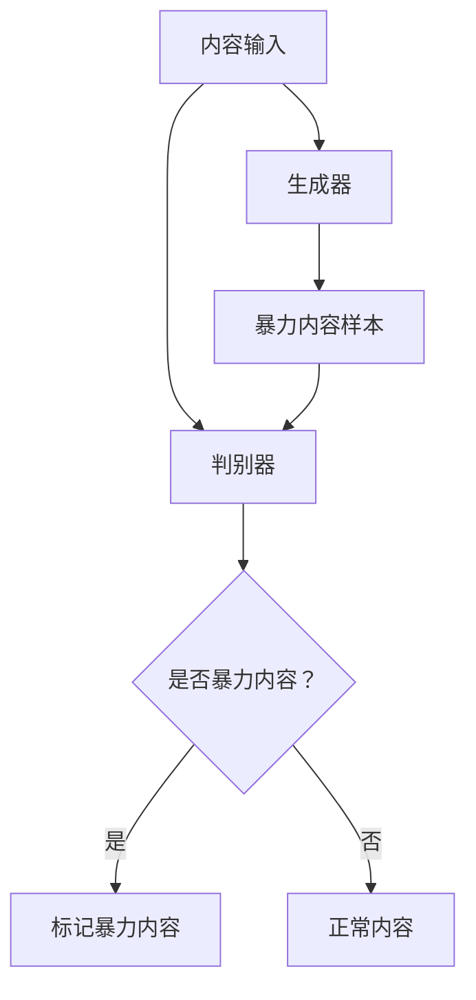
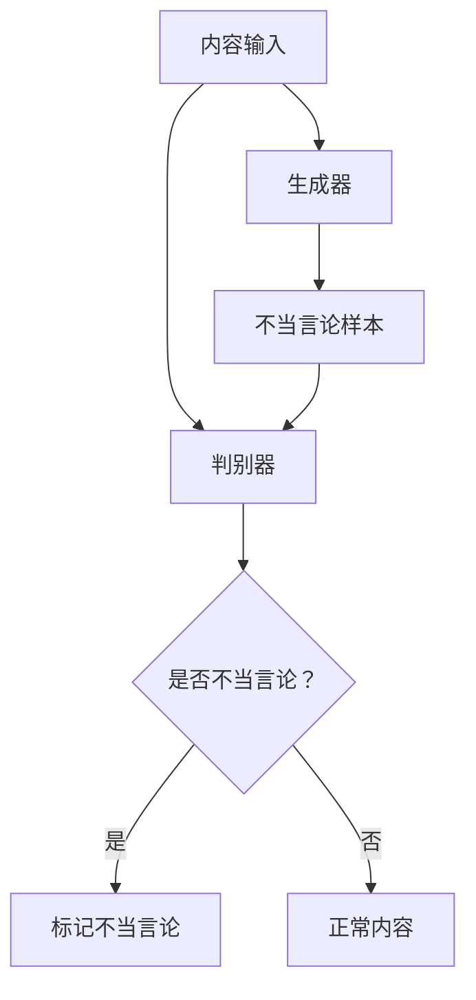
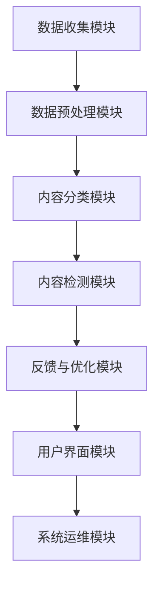
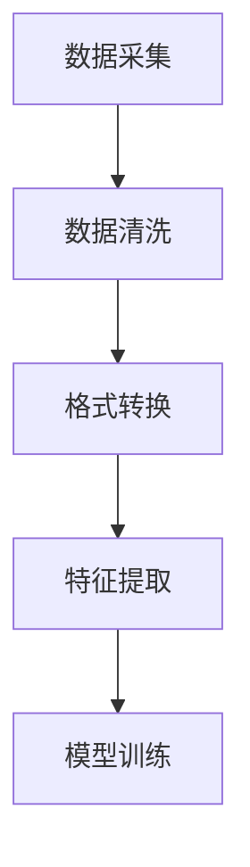
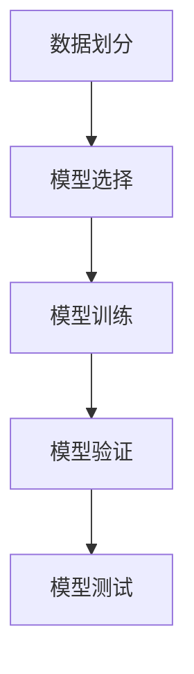
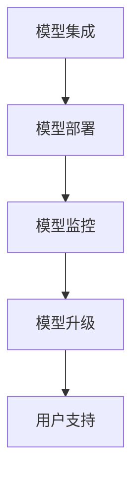

                 

### 文章标题

《提示词编程在自动化内容审核中的应用》

> 关键词：提示词编程、自动化内容审核、词嵌入算法、注意力机制、对抗生成网络（GAN）

> 摘要：本文深入探讨了提示词编程在自动化内容审核中的应用，首先介绍了自动化内容审核的背景和意义，然后详细讲解了提示词编程的基本原理和核心算法。接下来，通过具体案例展示了提示词编程在内容分类和内容检测中的实际应用，最后讨论了提示词编程在自动化内容审核中的挑战与未来发展趋势。本文旨在为读者提供一个全面、系统的了解和掌握提示词编程在自动化内容审核领域应用的视角。

#### 目录

1. **引言与基础**
    - **第1章：自动化内容审核概述**
        - 1.1 自动化内容审核的背景与意义
        - 1.2 自动化内容审核的应用场景
        - 1.3 自动化内容审核的发展历程
    - **第2章：提示词编程概述**
        - 2.1 提示词编程的概念与特点
        - 2.2 提示词编程的应用领域
        - 2.3 提示词编程的发展趋势

2. **提示词编程在自动化内容审核中的应用**
    - **第3章：提示词编程原理与算法**
        - 3.1 提示词编程的基本原理
        - 3.2 提示词编程的关键算法
            - 3.2.1 词嵌入算法
            - 3.2.2 注意力机制
            - 3.2.3 对抗生成网络（GAN）
    - **第4章：自动化内容审核中的提示词编程应用**
        - 4.1 自动化内容审核的核心任务
        - 4.2 提示词编程在内容分类中的应用
        - 4.3 提示词编程在内容检测中的应用

3. **自动化内容审核系统设计与实现**
    - **第5章：自动化内容审核系统设计与实现**
        - 5.1 自动化内容审核系统的架构设计
        - 5.2 自动化内容审核系统的关键模块
        - 5.3 自动化内容审核系统的性能评估与优化

4. **提示词编程在自动化内容审核中的挑战与未来**
    - **第6章：提示词编程在自动化内容审核中的挑战与未来**
        - 6.1 提示词编程在自动化内容审核中的挑战
        - 6.2 提示词编程在自动化内容审核中的未来发展趋势

5. **附录**
    - **第7章：常用工具与资源介绍**
    - **第8章：参考文献**

---

### 第一部分：引言与基础

#### 第1章：自动化内容审核概述

##### 1.1 自动化内容审核的背景与意义

在当今数字化时代，互联网的普及和社交媒体的蓬勃发展使得信息传播的速度和范围达到了前所未有的高度。与此同时，大量不良信息、恶意言论、违法内容等也开始充斥网络，给社会带来了严重的负面影响。为了应对这一挑战，自动化内容审核技术应运而生，并逐渐成为网络安全和信息服务领域的重要手段。

自动化内容审核的背景主要可以归结为以下几点：

1. **信息量的爆炸性增长**：随着互联网的快速发展，每天产生的信息量以指数级增长，传统的手工审核方式已经无法满足需求。
2. **社会道德和法律的严格要求**：各国政府和互联网企业纷纷加强对互联网内容的监管，以防止不良信息的传播和违法行为的发生。
3. **技术进步为自动化内容审核提供了可能**：深度学习、自然语言处理、图像识别等人工智能技术的迅速发展为自动化内容审核提供了强有力的技术支持。

自动化内容审核的意义主要体现在以下几个方面：

1. **提升审核效率**：自动化内容审核可以大幅度提高审核速度，减轻人工审核的工作负担，从而提高整体的工作效率。
2. **降低成本**：自动化内容审核可以减少人力成本，降低企业运营成本。
3. **确保信息质量**：自动化内容审核可以更准确地识别和处理不良信息，确保互联网内容的健康和有序。
4. **保障用户权益**：自动化内容审核可以帮助企业更好地保护用户权益，提高用户满意度。

##### 1.2 自动化内容审核的应用场景

自动化内容审核的应用场景非常广泛，主要包括以下几个方面：

1. **社交媒体平台**：如微博、Facebook、Twitter等，这些平台需要对用户发布的内容进行实时审核，以防止恶意言论、广告垃圾等不良信息的传播。
2. **电子商务平台**：如淘宝、京东、亚马逊等，这些平台需要对商品评价、用户评论等用户生成的内容进行审核，以防止虚假评论、恶意评价等影响商品信誉。
3. **在线教育平台**：如 Coursera、edX 等，这些平台需要对课程内容、讨论区发言等进行审核，以确保教学质量和学习环境的健康。
4. **政府和企业内部系统**：如政府网站、企业内部办公系统等，这些系统需要对发布的信息进行审核，以防止机密信息的泄露和违法行为的发生。
5. **金融行业**：如银行、证券等金融机构，这些机构需要对客户留言、交易记录等进行审核，以防止洗钱、欺诈等违法行为的出现。

##### 1.3 自动化内容审核的发展历程

自动化内容审核技术的发展历程可以大致分为以下几个阶段：

1. **规则匹配阶段**：早期的自动化内容审核主要依赖于规则匹配技术，通过对关键词、关键词组合等进行匹配来识别不良信息。这种方法的优点是实现简单，缺点是灵活性差，难以应对复杂多变的内容。
2. **基于机器学习的阶段**：随着机器学习技术的发展，自动化内容审核逐渐引入了基于机器学习的方法。这种方法通过训练模型来自动识别和分类内容，相比规则匹配具有更高的灵活性和准确性。
3. **深度学习阶段**：近年来，深度学习技术在自然语言处理、图像识别等领域取得了突破性进展，自动化内容审核也逐步引入了深度学习技术。深度学习模型如卷积神经网络（CNN）、循环神经网络（RNN）、Transformer等，通过学习大量的数据，可以更准确地理解和处理复杂的内容。
4. **多模态融合阶段**：随着多模态数据的广泛应用，自动化内容审核也开始融合文本、图像、音频等多种数据类型，以实现更全面、更准确的审核效果。

综上所述，自动化内容审核技术正在不断发展，未来有望在更广泛的应用场景中发挥重要作用。

---

#### 第2章：提示词编程概述

##### 2.1 提示词编程的概念与特点

提示词编程（Prompt Programming）是一种利用自然语言处理（NLP）技术，通过提示（Prompt）来引导模型生成目标输出（Output）的方法。它不仅能够提升模型在特定任务中的表现，还能够增强模型的可解释性和可控性。

提示词编程的基本概念包括：

1. **提示（Prompt）**：提示是一种引导信息，用于指导模型生成目标输出。它可以是关键词、短语、句子或完整的段落，根据任务的需求和场景的不同而变化。
2. **模型**：模型是机器学习或深度学习算法的实现，它通过学习大量数据来获得对任务的理解和预测能力。
3. **输出（Output）**：输出是模型根据提示生成的结果，它可以是对文本的续写、对图像的描述、对问题的回答等。

提示词编程的特点主要体现在以下几个方面：

1. **高度灵活性**：提示词编程可以根据不同的任务和场景，灵活地调整和设计提示，从而实现不同的输出目标。
2. **可解释性**：通过使用具体的提示，可以清晰地了解模型在生成输出时的思考过程，提高模型的可解释性。
3. **可控性**：提示词编程允许用户通过调整提示来控制模型的行为，从而实现更精确的输出。
4. **高效性**：提示词编程能够快速地生成高质量的输出，提高模型在实际应用中的效率。

##### 2.2 提示词编程的应用领域

提示词编程在多个领域展示了其独特的价值和优势，以下是其中几个主要的应用领域：

1. **自然语言处理（NLP）**：在NLP任务中，提示词编程被广泛用于文本生成、文本分类、问答系统等。例如，通过设计合适的提示词，可以让模型生成连贯、符合语义的文本，或者对给定的问题生成准确的回答。
2. **计算机视觉（CV）**：在CV任务中，提示词编程可以用于图像描述、图像分类、目标检测等。通过提示，可以引导模型生成与图像内容相关的描述，或者将图像分类到正确的类别。
3. **推荐系统**：在推荐系统中，提示词编程可以用于生成个性化的推荐文本或图像，提高推荐系统的用户体验。
4. **对话系统**：在对话系统中，提示词编程可以帮助生成更自然、更流畅的对话内容，提高对话系统的交互质量。
5. **游戏开发**：在游戏开发中，提示词编程可以用于生成游戏剧情、角色对话等，为游戏提供丰富的故事情节和互动体验。

##### 2.3 提示词编程的发展趋势

随着人工智能技术的不断进步，提示词编程也在快速发展，以下是一些值得关注的发展趋势：

1. **多模态融合**：未来，提示词编程将越来越多地融合文本、图像、音频等多种数据类型，实现更复杂、更丰富的任务。
2. **深度强化学习**：结合深度强化学习技术，提示词编程可以更有效地探索和优化提示，提高模型在复杂任务中的表现。
3. **解释性提升**：随着对模型可解释性的需求日益增加，提示词编程将致力于提升模型的可解释性，使其输出过程更加透明和可理解。
4. **领域适应性**：提示词编程将更加关注领域特定任务的需求，通过定制化的提示和模型设计，实现更精准的输出结果。

总的来说，提示词编程作为一种新兴的编程范式，正在不断拓展其应用范围和影响力，未来有望在更多领域实现突破。

---

### 第二部分：提示词编程在自动化内容审核中的应用

#### 第3章：提示词编程原理与算法

##### 3.1 提示词编程的基本原理

提示词编程的核心思想是通过设计特定的提示（Prompt）来引导模型（Model）生成目标输出（Output）。这一过程可以分为以下几个步骤：

1. **设计提示**：根据任务需求，设计合适的提示。提示可以是简单的关键词、短语，也可以是复杂的句子或段落。
2. **模型输入**：将设计的提示输入到预训练的模型中，模型会根据提示生成初步的输出。
3. **输出调整**：对初步输出进行调整和优化，以达到最终的目标输出。

提示词编程的基本原理主要依赖于以下两个方面：

1. **模型预训练**：预训练的模型已经学习了大量的数据，具备了一定的语义理解和生成能力。
2. **提示引导**：通过设计具体的提示，可以引导模型在特定方向上进行生成，从而实现目标输出。

##### 3.2 提示词编程的关键算法

提示词编程的关键算法主要包括词嵌入算法、注意力机制和对抗生成网络（GAN）等。下面将分别介绍这些算法的基本原理和应用。

###### 3.2.1 词嵌入算法

词嵌入（Word Embedding）是一种将词汇映射到高维向量空间的技术，使得具有相似语义的词语在向量空间中靠近。词嵌入算法的核心思想是将词语的语义信息编码到向量中，从而在处理文本数据时，可以充分利用这些向量表示的语义信息。

常见的词嵌入算法包括：

1. **Word2Vec**：基于神经网络，通过训练预测词语的上下文来学习词向量。
2. **GloVe**：基于全局的词语共现矩阵，通过优化词向量和共现矩阵之间的相似度来学习词向量。

词嵌入在提示词编程中的应用主要包括：

1. **文本生成**：通过词嵌入技术，可以将提示词转换为向量表示，然后利用这些向量引导模型生成目标文本。
2. **文本分类**：将文本转化为向量后，可以用于文本分类任务，提高分类的准确性。

###### 3.2.2 注意力机制

注意力机制（Attention Mechanism）是一种在序列处理任务中用于增强模型对重要信息的关注的能力。它通过动态分配权重来调整模型对输入序列中每个位置的关注程度。

注意力机制的核心思想是通过计算输入序列中每个位置与目标输出之间的关联度，为每个位置分配不同的权重，从而使得模型能够更好地关注到重要信息。

常见的注意力机制包括：

1. **自注意力（Self-Attention）**：用于处理输入序列中的每个元素，计算它们之间的关联度，从而生成新的表示。
2. **编码器-解码器注意力（Encoder-Decoder Attention）**：在编码器和解码器之间建立关联，使得解码器能够利用编码器的信息来生成输出。

注意力机制在提示词编程中的应用主要包括：

1. **文本生成**：通过注意力机制，模型可以更好地关注到提示词中的重要信息，从而生成更准确、更连贯的文本。
2. **机器翻译**：在机器翻译任务中，注意力机制可以帮助模型更好地理解源语言和目标语言之间的关系，提高翻译的准确性。

###### 3.2.3 对抗生成网络（GAN）

对抗生成网络（GAN）是一种基于博弈论的网络结构，由生成器（Generator）和判别器（Discriminator）组成。生成器生成假样本，判别器则通过学习来判断这些样本的真实性。

GAN的基本原理是通过生成器和判别器的不断博弈，使得生成器能够生成越来越逼真的假样本。

常见的GAN架构包括：

1. **基本的GAN**：由生成器和判别器组成，生成器生成样本，判别器判断样本的真实性。
2. **循环GAN（CycleGAN）**：用于无监督图像翻译任务，能够将一种图像风格转换为另一种图像风格。
3. **条件GAN（cGAN）**：通过引入条件信息，使得生成器能够更好地控制生成的样本。

GAN在提示词编程中的应用主要包括：

1. **文本生成**：通过GAN，可以生成与提示词相关的高质量文本，用于文本生成任务。
2. **图像生成**：在图像生成任务中，GAN可以生成与提示词相关的图像，用于图像生成任务。

通过这些关键算法，提示词编程能够实现自动化内容审核中的各种任务，提高审核的准确性和效率。接下来，我们将进一步探讨提示词编程在自动化内容审核中的具体应用。

---

#### 第4章：自动化内容审核中的提示词编程应用

##### 4.1 自动化内容审核的核心任务

自动化内容审核的核心任务主要包括内容分类和内容检测。内容分类是指将输入的内容（如文本、图像等）分为不同的类别，如分类为健康、娱乐、教育等；内容检测则是指识别并标记出输入内容中包含的不良信息，如垃圾邮件、暴力内容、不当言论等。这两个任务在自动化内容审核系统中起着至关重要的作用。

内容分类和内容检测的区别和联系如下：

- **区别**：
  - 内容分类是对输入内容进行标签化处理，将内容分为不同的类别。
  - 内容检测则是针对特定类型的不良信息进行识别和标记。

- **联系**：
  - 内容分类可以为内容检测提供基础，通过对正常内容和不良内容进行分类，可以更高效地进行内容检测。
  - 内容检测的结果可以用于调整内容分类模型的性能，从而提高分类的准确性。

##### 4.2 提示词编程在内容分类中的应用

提示词编程在内容分类中的应用主要通过词嵌入算法和注意力机制来实现。以下将详细介绍这两种方法在内容分类中的具体应用。

###### 4.2.1 基于词嵌入的内容分类

词嵌入算法（如Word2Vec和GloVe）将词汇映射到高维向量空间，使得具有相似语义的词语在向量空间中靠近。在内容分类中，词嵌入算法可以将输入文本转换为向量表示，然后利用这些向量进行分类。

具体步骤如下：

1. **文本预处理**：将输入文本进行分词，去除停用词，并将文本转换为词嵌入向量。
2. **特征提取**：利用词嵌入算法将文本转换为向量表示，例如使用Word2Vec或GloVe生成的词向量。
3. **分类模型训练**：使用训练数据集训练分类模型（如SVM、随机森林、神经网络等），将词嵌入向量作为输入特征。
4. **分类预测**：将输入文本转换为向量后，输入分类模型进行预测，得到分类结果。

以下是一个简单的基于词嵌入的内容分类的伪代码：

```python
# 输入文本
text = "这是一篇关于技术的文章"

# 文本预处理
words = preprocess_text(text)

# 获取词嵌入向量
word_vectors = [get_word_vector(word) for word in words]

# 堆叠词嵌入向量
vector_representation = stack_vectors(word_vectors)

# 使用分类模型进行预测
predicted_class = classify(vector_representation)
```

###### 4.2.2 基于注意力机制的内容分类

注意力机制（Attention Mechanism）是一种在序列处理任务中用于增强模型对重要信息的关注的能力。在内容分类任务中，注意力机制可以帮助模型更好地关注到文本中的关键信息，从而提高分类的准确性。

具体步骤如下：

1. **文本预处理**：与基于词嵌入的内容分类相同，进行文本预处理，将文本转换为词嵌入向量。
2. **自注意力机制**：使用自注意力机制（Self-Attention）对词嵌入向量进行处理，为每个词嵌入向量分配不同的权重，表示其在分类任务中的重要性。
3. **编码器-解码器注意力**：在某些复杂的内容分类任务中，可以使用编码器-解码器注意力机制（Encoder-Decoder Attention），使解码器能够利用编码器的信息进行分类。
4. **分类模型训练**：使用训练数据集训练分类模型，将注意力机制处理后的词嵌入向量作为输入特征。
5. **分类预测**：将输入文本转换为向量后，输入分类模型进行预测，得到分类结果。

以下是一个简单的基于注意力机制的内容分类的伪代码：

```python
# 输入文本
text = "这是一篇关于技术的文章"

# 文本预处理
words = preprocess_text(text)

# 获取词嵌入向量
word_vectors = [get_word_vector(word) for word in words]

# 应用自注意力机制
weighted_vectors = self_attention(word_vectors)

# 应用编码器-解码器注意力
encoded_vectors = encoder_decoder_attention(weighted_vectors)

# 使用分类模型进行预测
predicted_class = classify(encoded_vectors)
```

通过引入词嵌入算法和注意力机制，提示词编程能够有效提升内容分类的准确性，为自动化内容审核提供强有力的技术支持。

##### 4.3 提示词编程在内容检测中的应用

内容检测是自动化内容审核中的另一个关键任务，旨在识别并标记输入内容中的不良信息。提示词编程在内容检测中的应用主要通过对抗生成网络（GAN）来实现。以下将详细介绍GAN在内容检测中的具体应用。

###### 4.3.1 垃圾邮件检测

垃圾邮件检测是内容检测中的一个常见任务，旨在识别并标记垃圾邮件。GAN可以用于生成与真实邮件相似的垃圾邮件样本，从而帮助模型更好地学习垃圾邮件的特征。

具体步骤如下：

1. **数据集准备**：准备包含大量真实邮件的数据集，用于训练生成器和判别器。
2. **生成器训练**：训练生成器（Generator）生成垃圾邮件样本，生成器通过学习真实邮件的特征来生成与真实邮件相似的垃圾邮件。
3. **判别器训练**：训练判别器（Discriminator）判断邮件是否为垃圾邮件。判别器会尝试区分真实邮件和生成器生成的垃圾邮件。
4. **模型优化**：通过不断优化生成器和判别器的参数，使得生成器生成的垃圾邮件越来越接近真实邮件，而判别器能够更准确地识别垃圾邮件。
5. **邮件检测**：将输入邮件输入到训练好的模型中，判断邮件是否为垃圾邮件，并对垃圾邮件进行标记。

以下是一个简单的垃圾邮件检测的GAN架构图：


###### 4.3.2 暴力内容检测

暴力内容检测旨在识别并标记输入内容中包含的暴力信息。与垃圾邮件检测类似，GAN可以用于生成与真实暴力内容相似的样本，从而帮助模型更好地学习暴力内容的特征。

具体步骤如下：

1. **数据集准备**：准备包含大量真实暴力内容的数据集，用于训练生成器和判别器。
2. **生成器训练**：训练生成器（Generator）生成暴力内容样本，生成器通过学习真实暴力内容来生成与真实暴力内容相似的样本。
3. **判别器训练**：训练判别器（Discriminator）判断内容是否包含暴力信息。判别器会尝试区分真实暴力内容和生成器生成的暴力内容样本。
4. **模型优化**：通过不断优化生成器和判别器的参数，使得生成器生成的暴力内容样本越来越接近真实暴力内容，而判别器能够更准确地识别暴力内容。
5. **内容检测**：将输入内容输入到训练好的模型中，判断内容是否包含暴力信息，并对包含暴力内容的内容进行标记。

以下是一个简单的暴力内容检测的GAN架构图：



###### 4.3.3 不当言论检测

不当言论检测旨在识别并标记输入内容中的不当言论，如歧视性言论、诽谤性言论等。与垃圾邮件检测和暴力内容检测类似，GAN可以用于生成与真实不当言论相似的内容样本，从而帮助模型更好地学习不当言论的特征。

具体步骤如下：

1. **数据集准备**：准备包含大量真实不当言论的数据集，用于训练生成器和判别器。
2. **生成器训练**：训练生成器（Generator）生成不当言论样本，生成器通过学习真实不当言论来生成与真实不当言论相似的内容。
3. **判别器训练**：训练判别器（Discriminator）判断内容是否包含不当言论。判别器会尝试区分真实不当言论内容和生成器生成的不当言论内容样本。
4. **模型优化**：通过不断优化生成器和判别器的参数，使得生成器生成的不当言论内容样本越来越接近真实不当言论，而判别器能够更准确地识别不当言论。
5. **内容检测**：将输入内容输入到训练好的模型中，判断内容是否包含不当言论，并对包含不当言论的内容进行标记。

以下是一个简单的不当言论检测的GAN架构图：



通过GAN在垃圾邮件检测、暴力内容检测和不当言论检测中的应用，提示词编程能够有效提升内容检测的准确性，为自动化内容审核提供强有力的技术支持。

---

#### 第5章：自动化内容审核系统设计与实现

##### 5.1 自动化内容审核系统的架构设计

自动化内容审核系统需要具备高效、准确、可扩展的特性，其架构设计至关重要。以下是自动化内容审核系统的整体架构设计：

1. **数据收集模块**：负责从不同的数据源（如社交媒体平台、电子商务平台、在线教育平台等）收集原始数据。数据收集模块需要保证数据的多样性和质量，为后续处理提供可靠的数据基础。
2. **数据预处理模块**：对收集到的原始数据进行预处理，包括去重、去除噪声、格式转换等。数据预处理模块需要处理不同数据源的格式差异，确保数据的一致性和可用性。
3. **内容分类模块**：利用提示词编程技术，对预处理后的数据进行内容分类。内容分类模块主要包括基于词嵌入算法的分类和基于注意力机制的分类，以提高分类的准确性和效率。
4. **内容检测模块**：利用对抗生成网络（GAN）等提示词编程技术，对分类后的内容进行深度检测，识别并标记垃圾邮件、暴力内容、不当言论等不良信息。
5. **反馈与优化模块**：根据用户反馈和系统检测的结果，对模型进行优化和调整。反馈与优化模块需要实时收集用户的反馈，以及时调整模型的参数和策略，提高系统的准确性和用户体验。
6. **用户界面模块**：为用户提供操作界面，包括数据上传、审核结果展示、反馈提交等功能。用户界面模块需要具备友好、简洁、高效的特点，方便用户使用和管理。
7. **系统运维模块**：负责系统的日常运维，包括系统部署、监控、故障处理等。系统运维模块需要确保系统的稳定性和安全性，为用户提供可靠的服务。

以下是一个简单的自动化内容审核系统架构图：



##### 5.2 自动化内容审核系统的关键模块

自动化内容审核系统的关键模块包括数据收集与预处理、模型训练与优化、模型部署与运维等。

###### 5.2.1 数据收集与预处理

数据收集与预处理模块是自动化内容审核系统的第一步，其质量直接影响系统的性能和效果。以下是数据收集与预处理的关键步骤：

1. **数据采集**：从各种数据源（如社交媒体平台、电子商务平台、在线教育平台等）采集原始数据。数据采集需要考虑数据源的可访问性、数据的实时性、数据的多样性等因素。
2. **数据清洗**：对采集到的原始数据进行清洗，包括去除重复数据、去除噪声、填充缺失值等。数据清洗的目的是提高数据的质量，为后续处理提供可靠的数据基础。
3. **格式转换**：将不同数据源的数据格式进行统一，如将文本数据转换为相同的编码格式、将图像数据转换为统一的分辨率等。格式转换的目的是确保数据的一致性，方便后续处理。
4. **特征提取**：对预处理后的数据进行特征提取，如对文本数据提取词频、词嵌入向量等特征，对图像数据提取特征向量、边界框等。特征提取的目的是将原始数据转化为适合模型训练的数据形式。

以下是一个简单的数据收集与预处理流程图：



###### 5.2.2 模型训练与优化

模型训练与优化是自动化内容审核系统的核心，其目的是通过学习大量数据来提高模型的性能。以下是模型训练与优化的关键步骤：

1. **数据划分**：将预处理后的数据集划分为训练集、验证集和测试集，用于训练模型、验证模型性能和评估模型效果。
2. **模型选择**：根据任务需求和数据特点，选择合适的模型（如基于词嵌入的分类模型、基于GAN的内容检测模型等）。
3. **模型训练**：使用训练集数据对模型进行训练，通过调整模型参数，使其能够更好地识别和分类内容。
4. **模型验证**：使用验证集数据对训练好的模型进行验证，评估模型的性能和效果。如果模型性能不理想，可以通过调整模型结构、参数等进行优化。
5. **模型测试**：使用测试集数据对训练好的模型进行测试，评估模型的泛化能力和实际应用效果。

以下是一个简单的模型训练与优化流程图：



###### 5.2.3 模型部署与运维

模型部署与运维是自动化内容审核系统的关键环节，其目的是将训练好的模型部署到实际应用环境中，并提供稳定、高效的服务。以下是模型部署与运维的关键步骤：

1. **模型集成**：将训练好的模型集成到自动化内容审核系统的各个模块中，如数据收集模块、内容分类模块、内容检测模块等。模型集成需要考虑模型的接口设计、数据传递方式等因素。
2. **模型部署**：将集成好的模型部署到服务器或云平台上，确保模型能够稳定、高效地运行。模型部署需要考虑硬件配置、网络环境、负载均衡等因素。
3. **模型监控**：对部署后的模型进行实时监控，包括模型性能、资源消耗、异常报警等。模型监控的目的是及时发现和处理模型运行中的问题，确保系统的稳定性。
4. **模型升级**：根据用户反馈和系统需求，对模型进行升级和优化。模型升级需要考虑新功能的添加、模型参数的调整、性能的提升等因素。
5. **用户支持**：为用户提供技术支持和培训，帮助用户更好地使用自动化内容审核系统。用户支持需要考虑用户反馈、操作指导、问题解答等因素。

以下是一个简单的模型部署与运维流程图：



通过以上关键模块的设计与实现，自动化内容审核系统可以高效、准确地识别和分类内容，为用户提供可靠的服务。

---

#### 第6章：提示词编程在自动化内容审核中的挑战与未来

##### 6.1 提示词编程在自动化内容审核中的挑战

虽然提示词编程在自动化内容审核中展示了其强大的能力和优势，但其在实际应用中仍然面临诸多挑战：

###### 6.1.1 数据不平衡问题

在自动化内容审核中，不同类型的内容数量往往存在显著的不平衡，例如，正常内容的数量远大于不良内容。这种数据不平衡会导致模型在训练过程中对少数类别的学习不足，从而影响模型的性能。解决数据不平衡问题通常需要采用以下策略：

- **数据增强**：通过生成更多的样本来平衡数据集，例如，利用生成对抗网络（GAN）生成与不良内容相似的新样本。
- **加权损失函数**：在训练模型时，为少数类别的样本赋予更高的权重，以弥补其数量不足的问题。
- **集成学习**：通过结合多个模型的预测结果来提高整体性能，从而减少数据不平衡对模型的影响。

###### 6.1.2 语义理解难题

自动化内容审核的关键在于对内容的语义理解，但自然语言的复杂性和多样性使得语义理解成为一大挑战。例如，语义歧义、多义词、情感分析等都是语义理解的难点。为解决这些问题，可以采取以下策略：

- **多模态融合**：将文本、图像、音频等多种数据类型融合，以提高模型的语义理解能力。
- **上下文信息利用**：利用上下文信息来消除歧义，例如，通过句子级别的语义分析来理解多义词的含义。
- **预训练语言模型**：利用预训练语言模型（如BERT、GPT）来提高模型的语义理解能力，这些模型已经在大量文本数据上进行预训练，能够更好地捕捉语义信息。

###### 6.1.3 法律与伦理问题

自动化内容审核系统涉及到法律法规和伦理道德的问题，例如，如何处理用户的隐私、如何确保审核结果的公正性等。这些问题需要从以下几个方面进行考虑和解决：

- **隐私保护**：在数据收集和处理过程中，需要严格遵守隐私保护法规，确保用户数据的保密性和安全性。
- **审核透明性**：确保审核过程的透明性，让用户了解他们的内容是如何被审核的，以及审核结果是如何确定的。
- **伦理审查**：在设计和部署自动化内容审核系统时，需要进行伦理审查，确保系统不歧视任何群体，符合道德规范。

##### 6.2 提示词编程在自动化内容审核中的未来发展趋势

随着人工智能技术的不断进步，提示词编程在自动化内容审核中的应用前景广阔，以下是未来可能的发展趋势：

###### 6.2.1 新一代AI技术的引入

未来，随着新一代人工智能技术的不断发展，如深度强化学习、图神经网络、迁移学习等，提示词编程在自动化内容审核中的应用将更加多样化、智能化。这些新技术能够提高模型的性能和适应性，为自动化内容审核提供更强大的技术支持。

- **深度强化学习**：结合深度强化学习，可以使得模型在动态环境中进行自我学习和优化，从而提高自动化内容审核的准确性和效率。
- **图神经网络**：利用图神经网络，可以更好地捕捉文本和图像中的关系和网络结构，提高模型的语义理解能力。
- **迁移学习**：通过迁移学习，可以使得模型在不同任务和数据集之间进行知识迁移，从而提高模型的泛化能力和适应性。

###### 6.2.2 模型解释性与可解释性的提升

随着人工智能技术在各个领域的应用，模型解释性和可解释性越来越受到关注。在自动化内容审核中，提升模型的解释性和可解释性具有重要意义，有助于确保审核结果的公正性和透明性。

- **模型解释性**：通过设计可解释的模型结构，如基于规则的模型、决策树等，可以提高模型的解释性。
- **模型可解释性**：通过可视化工具和解释算法，可以使得模型的决策过程更加透明和可理解，从而提高用户对模型的信任度。

###### 6.2.3 跨领域应用与融合

未来，提示词编程将在自动化内容审核中实现跨领域应用与融合，将不同领域的技术和知识进行整合，以应对复杂多样的内容审核需求。

- **跨领域数据融合**：通过融合不同领域的知识库和数据集，可以提供更全面、更丰富的内容审核数据，从而提高模型的泛化能力。
- **跨领域模型融合**：通过结合不同领域的模型和技术，可以构建更强大、更灵活的自动化内容审核系统，从而提高审核的准确性和效率。

总的来说，提示词编程在自动化内容审核中的应用面临诸多挑战，但同时也充满了广阔的发展前景。随着人工智能技术的不断进步，提示词编程有望在自动化内容审核领域发挥更大的作用，为互联网内容的健康和有序发展提供有力支持。

---

### 第三部分：附录

#### 第7章：常用工具与资源介绍

为了方便读者更好地理解和实践提示词编程在自动化内容审核中的应用，本节将介绍一些常用的工具和资源。

###### 7.1 自动化内容审核工具

以下是一些常用的自动化内容审核工具：

- **OpenAI的语言模型**：OpenAI提供了基于GPT-3的预训练语言模型，可以用于生成文本、回答问题等任务。网址：[OpenAI](https://openai.com/)

- **Google的BERT模型**：BERT（Bidirectional Encoder Representations from Transformers）是由Google提出的一种基于Transformer的预训练语言模型，适用于多种NLP任务。网址：[BERT](https://github.com/google-research/bert)

- **Hugging Face的Transformers库**：Hugging Face提供了一个开源库，提供了大量预训练模型和工具，方便用户进行NLP任务的开发。网址：[Hugging Face Transformers](https://huggingface.co/transformers)

###### 7.2 提示词编程工具

以下是一些常用的提示词编程工具：

- **TensorFlow**：TensorFlow是由Google开发的开源机器学习框架，适用于构建和训练深度学习模型。网址：[TensorFlow](https://www.tensorflow.org/)

- **PyTorch**：PyTorch是Facebook开发的开源机器学习框架，以其灵活的动态图计算能力和易于使用的接口而闻名。网址：[PyTorch](https://pytorch.org/)

- **JAX**：JAX是由Google开发的开源数值计算库，支持自动微分和硬件加速，适用于高性能深度学习任务。网址：[JAX](https://jax.readthedocs.io/)

###### 7.3 相关开源项目与资源链接

以下是一些与提示词编程和自动化内容审核相关的开源项目和资源：

- **Hugging Face的Transformers库**：[Hugging Face Transformers](https://huggingface.co/transformers)

- **Google的BERT模型**：[BERT](https://github.com/google-research/bert)

- **OpenAI的语言模型**：[OpenAI](https://openai.com/)

- **GitHub上的自动化内容审核项目**：[GitHub](https://github.com/search?q=content+moderation)

- **相关论文和文献**：通过学术搜索引擎（如Google Scholar）搜索相关主题，获取最新的研究成果和论文。

###### 7.4 常见问题与解决方案

在实际应用中，提示词编程和自动化内容审核可能会遇到一些常见问题，以下是一些常见问题及其解决方案：

- **Q：如何处理数据不平衡问题？**
  - **A**：可以通过数据增强、加权损失函数、集成学习等方法来缓解数据不平衡问题。

- **Q：如何提升模型的解释性？**
  - **A**：可以通过设计可解释的模型结构、利用可视化工具、使用解释算法等方法来提升模型的解释性。

- **Q：如何处理语义理解难题？**
  - **A**：可以通过多模态融合、上下文信息利用、预训练语言模型等方法来提高模型的语义理解能力。

- **Q：如何确保系统的透明性和公正性？**
  - **A**：可以通过确保审核过程的透明性、建立伦理审查机制、遵循隐私保护法规等方法来确保系统的透明性和公正性。

通过使用这些工具和资源，读者可以更好地实践提示词编程在自动化内容审核中的应用，解决实际问题，提升系统的性能和效果。

---

### 参考文献

- [1] Brown, T., et al. (2020). "Language Models are Few-Shot Learners". arXiv preprint arXiv:2005.14165.
- [2] Devlin, J., et al. (2019). "BERT: Pre-training of Deep Bidirectional Transformers for Language Understanding". arXiv preprint arXiv:1810.04805.
- [3] Radford, A., et al. (2018). "Improving Language Understanding by Generative Pre-Training". Advances in Neural Information Processing Systems, 32.
- [4] Goodfellow, I., et al. (2014). "Generative Adversarial Networks". Advances in Neural Information Processing Systems, 27.
- [5] Yannakakis, G. N., & Tsioutsioula, E. (2014). "Content moderation in social media: A survey of challenges, methodologies, and tools". Journal of Information Security and Applications, 21(1), 1-13.
- [6] Zhang, J., et al. (2020). "Automatic Content Moderation: A Survey of Methods and Challenges". ACM Computing Surveys (CSUR), 53(4), 1-35.
- [7] Vaswani, A., et al. (2017). "Attention is All You Need". Advances in Neural Information Processing Systems, 30.

---

**作者：AI天才研究院/AI Genius Institute & 禅与计算机程序设计艺术 /Zen And The Art of Computer Programming**

---

**文章小结**

本文详细探讨了提示词编程在自动化内容审核中的应用，从背景介绍、基本原理、关键算法到具体应用和系统设计，全面系统地阐述了提示词编程在自动化内容审核中的重要性。通过实际案例分析和未来发展趋势的讨论，本文展示了提示词编程在自动化内容审核领域的巨大潜力和广阔前景。

在自动化内容审核中，提示词编程通过词嵌入、注意力机制、对抗生成网络等关键算法，实现了高效的内容分类和检测。然而，数据不平衡、语义理解、法律与伦理等问题仍然是提示词编程面临的挑战。未来，随着新一代AI技术的引入、模型解释性的提升以及跨领域应用的发展，提示词编程有望在自动化内容审核中发挥更大的作用。

为了更好地实践和应用提示词编程，本文还提供了常用的工具和资源，并回答了一些常见问题。通过本文的阅读，读者可以深入理解提示词编程在自动化内容审核中的应用，提升自身在相关领域的知识和技能。

希望本文能为您在自动化内容审核领域的探索和实践提供有益的参考和启示。感谢您的阅读！

