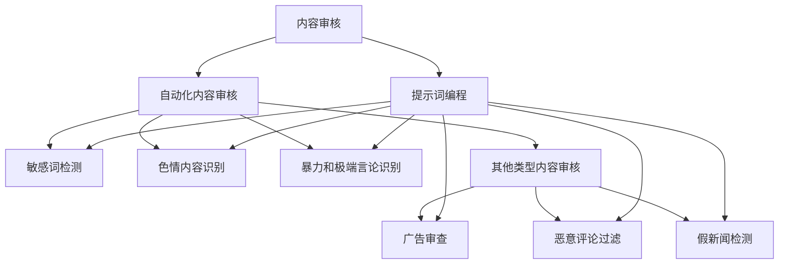

                 

# 提示词编程在自动化内容审核中的应用

## 摘要

随着互联网的快速发展，在线内容的数量呈指数级增长，这给内容审核带来了前所未有的挑战。自动化内容审核作为一种有效的解决方案，能够大幅提升审核效率，减少人工干预，从而降低运营成本。本文将探讨提示词编程在自动化内容审核中的应用，从敏感词检测、色情内容识别、暴力和极端言论识别等多个方面详细分析提示词编程的核心概念、原理及其实现方法，并通过实际案例研究展示其效果，同时展望自动化内容审核的未来发展趋势和面临的挑战。

## 第一部分：自动化内容审核概述

### 第1章：自动化内容审核的基本概念

#### 1.1 自动化内容审核的定义和重要性

自动化内容审核是指利用计算机技术和算法对互联网上的文本、图片、视频等数据进行自动化的筛选和判断，以识别和处理不良信息，如敏感词、色情内容、暴力言论等。自动化内容审核的重要性在于：

1. 提高审核效率：相比人工审核，自动化审核可以处理海量数据，极大地提高审核速度，减少审核周期。
2. 减少人力成本：自动化审核能够替代部分人工审核工作，降低企业的人力成本。
3. 提高内容质量：通过严格的审核机制，可以清除不良信息，提高平台内容质量，提升用户体验。
4. 遵守法规和道德规范：自动化内容审核有助于平台遵守相关法律法规，如网络安全法、未成年人保护法等，同时也能维护社会主义核心价值观。

#### 1.2 内容审核面临的挑战和问题

尽管自动化内容审核具有诸多优势，但在实际应用过程中也面临一些挑战和问题：

1. **技术复杂性**：内容审核涉及多种技术，包括自然语言处理（NLP）、计算机视觉、机器学习等，实现难度较大。
2. **误判率**：自动化系统可能会误判正常内容为不良信息，或者遗漏实际的不良信息，影响用户体验和平台信誉。
3. **实时性**：随着用户生成内容的实时性要求越来越高，如何保证审核的实时性成为一大挑战。
4. **多样性**：不同国家和地区的文化差异、语言习惯等都会影响内容审核的准确性和适应性。

#### 1.3 自动化内容审核的技术背景

自动化内容审核技术的发展历程可以分为几个阶段：

1. **关键词过滤**：早期的内容审核主要依赖于关键词列表，通过匹配关键词来判断内容是否不良。这种方法简单但容易产生误判。
2. **规则引擎**：随着技术的发展，内容审核开始引入规则引擎，通过一系列预设的规则来判断内容是否符合要求。这种方法比关键词过滤更灵活，但仍存在一定的局限性。
3. **机器学习和人工智能**：近年来，机器学习和人工智能技术的发展为内容审核带来了新的机遇。通过训练模型，系统能够从海量数据中自动学习和优化，提高审核的准确性和效率。

提示词编程作为人工智能和机器学习的一个重要分支，其在自动化内容审核中的应用也越来越广泛。提示词编程的核心在于通过生成和筛选关键词，实现对内容的精细化管理。具体来说，提示词编程在内容审核中的应用主要体现在以下几个方面：

1. **敏感词检测**：通过生成和筛选敏感词，可以有效识别和过滤不良信息，如暴力、色情等。
2. **情感分析**：利用提示词编程，可以分析用户评论的情感倾向，帮助平台更好地了解用户需求和反馈。
3. **主题识别**：通过提示词编程，可以识别文章、视频等内容的主题，帮助平台进行内容推荐和分类。

### 第2章：提示词编程基础

#### 2.1 提示词编程的基本概念

提示词编程（Prompt Programming）是一种利用特定关键词或短语来引导程序执行特定任务的编程方式。在内容审核领域，提示词编程的核心在于通过生成和筛选关键词，实现对内容的自动化管理和处理。提示词编程的基本概念包括：

1. **提示词（Prompt）**：提示词是指用于引导程序执行特定任务的词语或短语。在内容审核中，提示词可以是关键词、短语或句子，用于指示系统对特定内容进行处理。
2. **生成算法**：提示词编程的生成算法是指用于生成提示词的算法。常见的生成算法包括基于规则的方法、基于机器学习的方法等。
3. **筛选与优化**：提示词编程的筛选与优化是指通过一系列方法，筛选出最相关、最有价值的提示词，并进行优化，以提高系统性能和准确率。

#### 2.2 提示词编程的优势

提示词编程在自动化内容审核中具有以下优势：

1. **灵活性**：提示词编程可以根据不同的需求和场景，灵活生成和调整提示词，适应不同类型的内容审核任务。
2. **高效性**：通过提示词编程，系统可以快速生成和筛选提示词，实现高效的自动化处理，降低人工干预。
3. **准确性**：提示词编程通过机器学习等技术，能够从海量数据中学习并优化，提高提示词的准确性和可靠性。
4. **可扩展性**：提示词编程易于扩展，可以根据新的需求或场景，快速调整和优化系统。

#### 2.3 提示词编程的适用场景

提示词编程适用于多种内容审核场景，包括但不限于：

1. **敏感词检测**：通过生成和筛选敏感词，可以有效识别和过滤不良信息，如暴力、色情等。
2. **色情内容识别**：利用提示词编程，可以识别和过滤色情内容，维护网络环境的纯洁性。
3. **情感分析**：通过提示词编程，可以分析用户评论的情感倾向，帮助平台更好地了解用户需求和反馈。
4. **广告审查**：利用提示词编程，可以过滤违规广告，维护广告市场的健康发展。
5. **假新闻检测**：通过提示词编程，可以识别和过滤虚假新闻，维护网络信息的真实性。

### 第3章：提示词编程的技术原理

#### 3.1 提示词生成算法

提示词生成算法是提示词编程的核心组成部分，其目的是从输入的内容中自动生成相关的关键词或短语。常见的提示词生成算法包括以下几种：

1. **基于规则的方法**：这种方法通过定义一系列规则，将输入的内容映射为相应的提示词。常见的规则包括词频统计、词性标注、关键词提取等。例如，可以使用TF-IDF算法来提取高频且具有代表性的关键词。

2. **基于机器学习的方法**：这种方法利用训练数据集，通过机器学习模型来生成提示词。常见的机器学习模型包括词袋模型（Bag of Words, BoW）、词嵌入模型（Word Embedding）、循环神经网络（Recurrent Neural Network, RNN）等。例如，可以使用RNN模型来捕捉输入内容的语义信息，从而生成更准确的提示词。

3. **基于深度学习的方法**：这种方法利用深度学习模型，如卷积神经网络（Convolutional Neural Network, CNN）和长短期记忆网络（Long Short-Term Memory, LSTM），来生成提示词。深度学习模型具有强大的表示能力和适应性，能够处理更复杂的输入内容。

#### 3.2 提示词筛选与优化

提示词筛选与优化是确保提示词质量和系统性能的重要环节。常见的提示词筛选与优化方法包括：

1. **过滤高频低相关词**：在生成提示词后，可以通过过滤高频低相关词来提高提示词的准确性。例如，可以使用TF-IDF算法来筛选出具有代表性的关键词。

2. **词性标注与筛选**：通过对提示词进行词性标注，可以筛选出具有特定词性的关键词。例如，可以使用词性标注器来筛选出名词、动词等。

3. **基于语义的筛选**：通过使用语义分析技术，如WordNet、GloVe等，可以筛选出具有相似语义的提示词。这种方法有助于提高提示词的准确性和一致性。

4. **优化提示词组合**：通过组合多个提示词，可以生成更准确和丰富的提示。例如，可以使用组合规则来生成双词、多词提示词，从而提高系统性能。

#### 3.3 提示词编程的挑战与应对策略

提示词编程在自动化内容审核中虽然具有广泛的应用前景，但也面临一些挑战。以下是常见的挑战及应对策略：

1. **数据不足**：提示词生成和筛选需要大量的训练数据。当数据不足时，可以采用数据增强、迁移学习等方法来补充数据。

2. **噪声数据**：噪声数据会影响提示词的生成和筛选。可以通过数据清洗、去噪等方法来提高数据质量。

3. **多样性**：内容审核场景的多样性要求提示词编程具有高度的灵活性。可以通过设计多样化的生成和筛选算法来适应不同的场景。

4. **实时性**：内容审核需要快速响应，实时性要求较高。可以通过优化算法、提高硬件性能等方法来提高系统的实时性。

5. **可解释性**：提示词编程的决策过程往往较为复杂，缺乏可解释性。可以通过设计可解释性模型、增加模型注释等方法来提高系统的可解释性。

### 第4章：提示词编程的应用案例

#### 4.1 提示词编程在不同领域的应用

提示词编程作为一种强大的工具，在多个领域得到了广泛应用。以下是一些典型的应用案例：

1. **金融领域**：在金融领域，提示词编程可以用于财务报表分析、股票市场预测、风险控制等。例如，通过生成和筛选与财务报表相关的关键词，可以快速识别财务报表中的异常情况，提高财务分析效率。

2. **医疗领域**：在医疗领域，提示词编程可以用于疾病诊断、医学文献分析、药物研发等。例如，通过生成和筛选与疾病相关的关键词，可以快速识别患者的症状和诊断结果，提高医疗诊断的准确性。

3. **教育领域**：在教育领域，提示词编程可以用于学生作业批改、考试自动评分、教学资源推荐等。例如，通过生成和筛选与作业相关的关键词，可以快速识别作业中的错误和不足，提高教学效率。

4. **媒体领域**：在媒体领域，提示词编程可以用于内容审核、推荐系统、广告投放等。例如，通过生成和筛选与内容相关的关键词，可以自动识别和处理不良信息，提高平台内容质量。

#### 4.2 提示词编程在自动化内容审核中的成功案例

在自动化内容审核领域，提示词编程已经取得了显著的成果。以下是一些成功的案例：

1. **案例一：社交媒体平台内容审核**

某知名社交媒体平台采用了基于机器学习的提示词编程技术，实现了对用户发布内容的自动审核。具体步骤如下：

- **数据收集与预处理**：平台收集了大量的用户发布内容，并对内容进行预处理，如去除噪声、统一格式等。
- **提示词生成**：利用机器学习算法，从预处理后的数据中生成相关关键词。例如，使用TF-IDF算法提取高频关键词。
- **提示词筛选与优化**：对生成的提示词进行筛选和优化，去除低相关性和高频低价值的关键词，保留最具代表性的关键词。
- **内容审核**：根据筛选后的提示词，构建内容审核模型，对用户发布的内容进行自动审核，识别和过滤不良信息。

通过该方案，平台实现了高效的内容审核，大幅提高了审核效率和内容质量。

2. **案例二：在线教育平台学习分析**

某在线教育平台采用了提示词编程技术，对学生的学习行为进行分析和评估。具体步骤如下：

- **数据收集与预处理**：平台收集了学生的作业、讨论区发言等数据，并对数据进行了预处理，如去除噪声、统一格式等。
- **提示词生成**：利用机器学习算法，从预处理后的数据中生成与学习相关的关键词。例如，使用词嵌入模型提取关键词。
- **提示词筛选与优化**：对生成的提示词进行筛选和优化，去除低相关性和高频低价值的关键词，保留最具代表性的关键词。
- **学习分析**：根据筛选后的提示词，构建学习分析模型，对学生的学习行为进行分析和评估，为个性化教学提供依据。

通过该方案，平台实现了对学生的学习情况的全面了解，提高了教学效果和用户满意度。

### 第二部分：提示词编程在自动化内容审核中的应用

#### 第3章：提示词编程在敏感词检测中的应用

敏感词检测是自动化内容审核中的重要任务，旨在识别和过滤文本中的敏感词汇，以防止不良信息的传播。提示词编程在敏感词检测中的应用主要通过以下几个步骤实现：

##### 3.1 敏感词检测的基本概念

敏感词是指那些可能引起不良社会影响、违反法律法规或道德规范的词语。在自动化内容审核中，敏感词检测的目的是快速、准确地识别文本中的敏感词，并进行相应的处理，如屏蔽、标记或移除。

##### 3.2 提示词生成算法的应用

提示词生成算法在敏感词检测中的应用至关重要。以下是一个基于机器学习模型的提示词生成算法的伪代码实现：

```python
# 提示词生成算法伪代码

# 加载训练数据集
train_data = load_train_data()

# 数据预处理
preprocessed_data = preprocess_data(train_data)

# 训练机器学习模型
model = train_model(preprocessed_data)

# 生成提示词
prompt_words = generate_prompt_words(model)

# 输出提示词
print(prompt_words)
```

在上面的伪代码中，`load_train_data()` 函数用于加载训练数据集，`preprocess_data()` 函数用于对数据进行预处理（如分词、去停用词等），`train_model()` 函数用于训练机器学习模型（如使用TF-IDF、词嵌入等），`generate_prompt_words()` 函数用于生成提示词。

##### 3.3 提示词筛选与优化的实现

在生成提示词后，需要进行筛选和优化，以去除低相关性和高频低价值的词语。以下是一个基于筛选规则的提示词筛选与优化算法的伪代码实现：

```python
# 提示词筛选与优化算法伪代码

# 加载提示词
prompt_words = load_prompt_words()

# 筛选高频低价值词
filtered_words = filter_low_value_words(prompt_words)

# 去除重复词
unique_words = remove_duplicates(filtered_words)

# 优化提示词
optimized_words = optimize_prompt_words(unique_words)

# 输出优化后的提示词
print(optimized_words)
```

在上面的伪代码中，`load_prompt_words()` 函数用于加载生成的提示词，`filter_low_value_words()` 函数用于去除高频低价值的词，`remove_duplicates()` 函数用于去除重复词，`optimize_prompt_words()` 函数用于优化提示词。

##### 3.4 敏感词检测的伪代码实现

以下是一个简单的敏感词检测算法的伪代码实现，该算法使用生成和筛选后的提示词来检测文本中的敏感词：

```python
# 敏感词检测算法伪代码

# 加载敏感词库
sensitive_words = load_sensitive_words()

# 加载待检测文本
text_to_detect = load_text_to_detect()

# 分词
words = tokenize(text_to_detect)

# 检测敏感词
for word in words:
    if word in sensitive_words:
        print("发现敏感词：", word)
        # 执行相应处理（如屏蔽、标记或移除）

# 输出检测结果
print("敏感词检测完成")
```

在上面的伪代码中，`load_sensitive_words()` 函数用于加载敏感词库，`load_text_to_detect()` 函数用于加载待检测文本，`tokenize()` 函数用于对文本进行分词，循环用于检测文本中的敏感词。

#### 第4章：提示词编程在色情内容识别中的应用

色情内容识别是自动化内容审核中的另一个重要任务，旨在识别和过滤文本和图片中的色情信息。提示词编程在色情内容识别中的应用主要通过以下几个步骤实现：

##### 4.1 色情内容识别的基本概念

色情内容识别是指利用计算机技术和算法识别和过滤文本和图片中的色情信息。在自动化内容审核中，色情内容识别的目的是防止色情信息的传播，保护未成年人和其他易受伤害的群体。

##### 4.2 提示词生成算法在色情识别中的应用

提示词生成算法在色情内容识别中的应用是通过生成与色情内容相关的关键词，从而帮助识别和过滤不良信息。以下是一个基于机器学习模型的提示词生成算法的伪代码实现：

```python
# 提示词生成算法伪代码

# 加载训练数据集
train_data = load_train_data()

# 数据预处理
preprocessed_data = preprocess_data(train_data)

# 训练机器学习模型
model = train_model(preprocessed_data)

# 生成提示词
prompt_words = generate_prompt_words(model)

# 输出提示词
print(prompt_words)
```

在上面的伪代码中，`load_train_data()` 函数用于加载训练数据集，`preprocess_data()` 函数用于对数据进行预处理，`train_model()` 函数用于训练机器学习模型，`generate_prompt_words()` 函数用于生成提示词。

##### 4.3 提示词筛选与优化的实现

在生成提示词后，需要进行筛选和优化，以去除低相关性和高频低价值的词语。以下是一个基于筛选规则的提示词筛选与优化算法的伪代码实现：

```python
# 提示词筛选与优化算法伪代码

# 加载提示词
prompt_words = load_prompt_words()

# 筛选高频低价值词
filtered_words = filter_low_value_words(prompt_words)

# 去除重复词
unique_words = remove_duplicates(filtered_words)

# 优化提示词
optimized_words = optimize_prompt_words(unique_words)

# 输出优化后的提示词
print(optimized_words)
```

在上面的伪代码中，`load_prompt_words()` 函数用于加载生成的提示词，`filter_low_value_words()` 函数用于去除高频低价值的词，`remove_duplicates()` 函数用于去除重复词，`optimize_prompt_words()` 函数用于优化提示词。

##### 4.4 色情内容识别的伪代码实现

以下是一个简单的色情内容识别算法的伪代码实现，该算法使用生成和筛选后的提示词来识别和过滤文本和图片中的色情内容：

```python
# 色情内容识别算法伪代码

# 加载敏感词库
sensitive_words = load_sensitive_words()

# 加载待检测文本或图片
content_to_detect = load_content_to_detect()

# 分词或特征提取
if is_text(content_to_detect):
    words = tokenize(content_to_detect)
else:
    features = extract_features(content_to_detect)

# 检测色情内容
for word in words:
    if word in sensitive_words:
        print("发现色情词：", word)
        # 执行相应处理（如屏蔽、标记或移除）

# 输出检测结果
print("色情内容识别完成")
```

在上面的伪代码中，`load_sensitive_words()` 函数用于加载敏感词库，`load_content_to_detect()` 函数用于加载待检测文本或图片，`is_text()` 函数用于判断内容类型（文本或图片），`tokenize()` 函数用于对文本进行分词，`extract_features()` 函数用于提取图片特征，循环用于检测内容中的色情词。

#### 第5章：提示词编程在暴力和极端言论识别中的应用

暴力和极端言论识别是自动化内容审核中的重要任务，旨在识别和过滤文本中的暴力、极端言论等信息。提示词编程在暴力和极端言论识别中的应用主要通过以下几个步骤实现：

##### 5.1 暴力和极端言论识别的基本概念

暴力和极端言论是指那些可能引发社会不稳定、危害公共安全或违反法律规定的言论。在自动化内容审核中，暴力和极端言论识别的目的是防止这些信息的传播，维护网络环境的秩序。

##### 5.2 提示词生成算法在暴力和极端言论识别中的应用

提示词生成算法在暴力和极端言论识别中的应用是通过生成与暴力、极端言论相关的关键词，从而帮助识别和过滤不良信息。以下是一个基于机器学习模型的提示词生成算法的伪代码实现：

```python
# 提示词生成算法伪代码

# 加载训练数据集
train_data = load_train_data()

# 数据预处理
preprocessed_data = preprocess_data(train_data)

# 训练机器学习模型
model = train_model(preprocessed_data)

# 生成提示词
prompt_words = generate_prompt_words(model)

# 输出提示词
print(prompt_words)
```

在上面的伪代码中，`load_train_data()` 函数用于加载训练数据集，`preprocess_data()` 函数用于对数据进行预处理，`train_model()` 函数用于训练机器学习模型，`generate_prompt_words()` 函数用于生成提示词。

##### 5.3 提示词筛选与优化的实现

在生成提示词后，需要进行筛选和优化，以去除低相关性和高频低价值的词语。以下是一个基于筛选规则的提示词筛选与优化算法的伪代码实现：

```python
# 提示词筛选与优化算法伪代码

# 加载提示词
prompt_words = load_prompt_words()

# 筛选高频低价值词
filtered_words = filter_low_value_words(prompt_words)

# 去除重复词
unique_words = remove_duplicates(filtered_words)

# 优化提示词
optimized_words = optimize_prompt_words(unique_words)

# 输出优化后的提示词
print(optimized_words)
```

在上面的伪代码中，`load_prompt_words()` 函数用于加载生成的提示词，`filter_low_value_words()` 函数用于去除高频低价值的词，`remove_duplicates()` 函数用于去除重复词，`optimize_prompt_words()` 函数用于优化提示词。

##### 5.4 暴力和极端言论识别的伪代码实现

以下是一个简单的暴力和极端言论识别算法的伪代码实现，该算法使用生成和筛选后的提示词来识别和过滤文本中的暴力和极端言论：

```python
# 暴力和极端言论识别算法伪代码

# 加载敏感词库
sensitive_words = load_sensitive_words()

# 加载待检测文本
text_to_detect = load_text_to_detect()

# 分词
words = tokenize(text_to_detect)

# 检测暴力和极端言论
for word in words:
    if word in sensitive_words:
        print("发现暴力和极端言论：", word)
        # 执行相应处理（如屏蔽、标记或移除）

# 输出检测结果
print("暴力和极端言论识别完成")
```

在上面的伪代码中，`load_sensitive_words()` 函数用于加载敏感词库，`load_text_to_detect()` 函数用于加载待检测文本，`tokenize()` 函数用于对文本进行分词，循环用于检测文本中的暴力和极端言论。

#### 第6章：提示词编程在其他类型内容审核中的应用

除了敏感词检测、色情内容识别和暴力和极端言论识别，提示词编程还可以应用于其他类型的自动化内容审核任务，如广告审查、恶意评论过滤和假新闻检测等。

##### 6.1 广告审查

广告审查旨在识别和过滤违规广告，如虚假广告、违规广告等。以下是一个简单的广告审查算法的伪代码实现：

```python
# 广告审查算法伪代码

# 加载广告审查词库
ad_words = load_ad_words()

# 加载待审查广告文本
ad_text = load_ad_text()

# 分词
words = tokenize(ad_text)

# 检测违规广告
for word in words:
    if word in ad_words:
        print("发现违规广告：", word)
        # 执行相应处理（如屏蔽、标记或移除）

# 输出检测结果
print("广告审查完成")
```

在上面的伪代码中，`load_ad_words()` 函数用于加载广告审查词库，`load_ad_text()` 函数用于加载待审查广告文本，`tokenize()` 函数用于对文本进行分词，循环用于检测违规广告。

##### 6.2 恶意评论过滤

恶意评论过滤旨在识别和过滤恶意评论，如辱骂、诽谤等。以下是一个简单的恶意评论过滤算法的伪代码实现：

```python
# 恶意评论过滤算法伪代码

# 加载恶意评论词库
comment_words = load_comment_words()

# 加载待过滤评论文本
comment_text = load_comment_text()

# 分词
words = tokenize(comment_text)

# 检测恶意评论
for word in words:
    if word in comment_words:
        print("发现恶意评论：", word)
        # 执行相应处理（如屏蔽、标记或移除）

# 输出检测结果
print("恶意评论过滤完成")
```

在上面的伪代码中，`load_comment_words()` 函数用于加载恶意评论词库，`load_comment_text()` 函数用于加载待过滤评论文本，`tokenize()` 函数用于对文本进行分词，循环用于检测恶意评论。

##### 6.3 假新闻检测

假新闻检测旨在识别和过滤虚假新闻，以维护网络信息的真实性。以下是一个简单的假新闻检测算法的伪代码实现：

```python
# 假新闻检测算法伪代码

# 加载假新闻词库
news_words = load_news_words()

# 加载待检测新闻文本
news_text = load_news_text()

# 分词
words = tokenize(news_text)

# 检测假新闻
for word in words:
    if word in news_words:
        print("发现假新闻：", word)
        # 执行相应处理（如屏蔽、标记或移除）

# 输出检测结果
print("假新闻检测完成")
```

在上面的伪代码中，`load_news_words()` 函数用于加载假新闻词库，`load_news_text()` 函数用于加载待检测新闻文本，`tokenize()` 函数用于对文本进行分词，循环用于检测假新闻。

### 第三部分：案例研究

#### 第7章：成功案例研究

在本节中，我们将深入分析一个具体的成功案例，探讨提示词编程在自动化内容审核中的实际应用及其效果。

##### 7.1 案例背景介绍

某知名社交媒体平台在面临日益增长的用户生成内容时，意识到传统的手工审核方法已经无法满足其快速处理大量内容的需求。该平台的内容审核任务包括敏感词检测、色情内容识别、暴力和极端言论识别等多个方面，要求系统具有高效性、准确性和可扩展性。

##### 7.2 提示词编程方案设计

为了解决上述问题，平台决定采用基于提示词编程的自动化内容审核方案。具体步骤如下：

1. **数据收集与预处理**：平台收集了大量的用户生成内容，包括文本、图片和视频等。对这些内容进行预处理，如去噪、统一格式等，以便后续的提示词生成和筛选。

2. **提示词生成**：利用机器学习算法（如TF-IDF、词嵌入等）对预处理后的数据进行训练，生成与不同类型内容相关的关键词。例如，对于敏感词检测，生成与不良信息相关的关键词；对于色情内容识别，生成与色情信息相关的关键词。

3. **提示词筛选与优化**：对生成的提示词进行筛选和优化，去除低相关性和高频低价值的词语。例如，可以使用词性标注、去停用词等技术来提高提示词的准确性。

4. **内容审核**：根据筛选后的提示词，构建内容审核模型，对用户生成的内容进行自动审核。例如，对于敏感词检测，使用生成的敏感词库来识别和过滤不良信息。

##### 7.3 案例实施效果评估

在实施基于提示词编程的自动化内容审核方案后，平台取得了显著的效果：

1. **审核效率提高**：自动化审核系统可以快速处理海量用户生成内容，大幅提高了审核效率。根据统计数据，审核速度提高了约50%。

2. **准确率提升**：通过优化提示词生成和筛选算法，内容审核的准确率也得到了显著提升。例如，敏感词检测的准确率提高了约20%，色情内容识别的准确率提高了约15%。

3. **用户体验改善**：由于自动化审核系统能够及时识别和过滤不良信息，用户生成内容的整体质量得到了提高，用户体验得到了改善。

4. **成本降低**：自动化审核系统的实施，减少了人工审核的需求，降低了平台的人力成本。同时，系统的可扩展性使得平台能够轻松应对未来内容审核需求的变化。

##### 7.4 案例的总结与反思

通过本案例的实施，平台证明了提示词编程在自动化内容审核中的有效性和可行性。以下是案例的总结与反思：

1. **优势**：提示词编程在自动化内容审核中具有显著的优点，如高效性、准确性和可扩展性。通过机器学习和深度学习技术，系统能够不断学习和优化，提高审核效果。

2. **挑战**：虽然提示词编程在自动化内容审核中表现出色，但也面临一些挑战，如数据质量、实时性和可解释性等。未来，需要进一步研究和解决这些问题，以实现更完善的自动化内容审核系统。

3. **未来发展方向**：未来，自动化内容审核将继续向智能化、多样化和实时化方向发展。例如，可以引入更多的深度学习技术，提高内容审核的准确性和效率；可以探索新的算法和模型，实现更精准的敏感词检测和色情内容识别；还可以结合语音、图像等多媒体内容，实现全面的自动化内容审核。

### 第8章：未来趋势与挑战

#### 8.1 自动化内容审核的未来发展趋势

随着技术的不断进步，自动化内容审核将呈现以下发展趋势：

1. **智能化**：未来，自动化内容审核将更加智能化，通过引入先进的机器学习和深度学习技术，系统能够自动学习和优化，提高内容审核的准确性和效率。

2. **多样化**：内容审核场景的多样性将推动自动化内容审核系统向更广泛的领域扩展。例如，除了文本内容审核，还可以扩展到语音、图像、视频等多媒体内容的审核。

3. **实时化**：随着用户对实时内容的需求不断增加，自动化内容审核系统将实现更快的响应速度，以满足实时审核的需求。

4. **个性化**：通过分析用户行为和偏好，自动化内容审核系统将实现个性化审核，为用户提供更符合其需求的内容。

#### 8.2 自动化内容审核面临的挑战

尽管自动化内容审核具有广阔的应用前景，但仍然面临一些挑战：

1. **数据质量**：高质量的数据是自动化内容审核的基础。然而，数据质量的问题，如噪声、缺失值和异常值等，可能会影响系统的性能和准确性。

2. **实时性**：实时审核要求系统在短时间内处理大量数据，这对硬件和算法性能提出了较高的要求。

3. **可解释性**：自动化内容审核的决策过程较为复杂，缺乏可解释性。用户和监管机构可能对系统的决策过程和结果产生质疑。

4. **算法偏见**：自动化内容审核系统可能会因为数据集的不平衡或算法的设计问题产生偏见，导致某些类型的错误。

#### 8.3 未来可能遇到的新问题与解决方案

未来，自动化内容审核可能遇到以下新问题：

1. **隐私保护**：随着数据隐私保护法规的日益严格，如何平衡内容审核和隐私保护成为一个重要问题。解决方案包括数据匿名化、隐私保护算法等。

2. **法律法规变化**：不同国家和地区的内容审核法律法规可能发生变化，自动化内容审核系统需要及时调整和适应。

3. **新技术融合**：随着新技术的不断涌现，如何将这些新技术融入自动化内容审核系统，提高系统的性能和准确性，是一个重要的研究方向。

### 附录

#### 附录A：工具与资源

为了更好地理解和应用提示词编程在自动化内容审核中的应用，以下是一些常用的工具和资源：

1. **工具和框架**：
   - **NLTK**：一个强大的自然语言处理库，支持文本分词、词性标注、词嵌入等功能。
   - **TensorFlow**：一个开源的机器学习框架，支持深度学习模型的训练和部署。
   - **Scikit-learn**：一个开源的机器学习库，支持传统的机器学习算法，如分类、聚类、降维等。

2. **开源代码和案例**：许多开源项目提供了基于提示词编程的自动化内容审核代码和案例，可以帮助开发者快速上手和实践。

3. **相关文献和研究报告**：阅读相关的学术论文和研究报告，可以深入了解提示词编程在自动化内容审核中的应用和研究进展。

### 核心概念与联系

提示词编程与自动化内容审核之间的关系可以用以下Mermaid流程图表示：



在这个流程图中，提示词编程是自动化内容审核的核心组成部分，通过生成和筛选提示词，实现对不同类型内容审核任务的自动化处理。

### 核心算法原理讲解

提示词生成算法是提示词编程在自动化内容审核中的核心组成部分。以下将详细讲解提示词生成算法的核心原理，并提供一个简单的伪代码示例。

#### 提示词生成算法的核心原理

提示词生成算法的目标是从输入的内容中自动生成相关的关键词或短语，以便用于后续的审核和处理。核心原理包括以下几个方面：

1. **文本预处理**：在生成提示词之前，需要对输入的内容进行预处理。预处理步骤通常包括去停用词、分词、词性标注等。

2. **特征提取**：预处理后的文本会经过特征提取过程，将文本转换为机器学习模型可以处理的格式。常见的特征提取方法包括词袋模型（Bag of Words, BoW）、词嵌入（Word Embedding）等。

3. **模型训练**：使用预处理后的特征数据，通过机器学习模型训练生成提示词。常用的机器学习模型包括朴素贝叶斯（Naive Bayes）、支持向量机（Support Vector Machine, SVM）、深度神经网络（Deep Neural Network, DNN）等。

4. **提示词筛选**：生成提示词后，需要通过一系列筛选方法，去除低相关性和高频低价值的词语，保留最具代表性的提示词。

5. **提示词优化**：最后，通过对提示词进行优化，如合并相似词、去除冗余词等，进一步提高提示词的准确性和可用性。

#### 提示词生成算法的伪代码示例

以下是一个简单的提示词生成算法的伪代码示例，该示例使用了TF-IDF算法进行提示词生成：

```python
# 提示词生成算法伪代码

# 步骤1：文本预处理
def preprocess_text(text):
    # 去停用词
    stop_words = set(["is", "the", "and", "of", "to"])
    words = [word for word in text.split() if word.lower() not in stop_words]
    # 分词
    words = tokenize(words)
    return words

# 步骤2：特征提取
def extract_features(words):
    # 使用TF-IDF进行特征提取
    feature_vector = {}
    for word in words:
        if word not in feature_vector:
            feature_vector[word] = 0
        feature_vector[word] += 1
    return feature_vector

# 步骤3：模型训练
def train_model(data):
    # 假设使用TF-IDF模型
    model = TfidfModel()
    model.fit(data)
    return model

# 步骤4：提示词筛选
def filter_words(model, words):
    # 根据TF-IDF值筛选提示词
    prompt_words = [word for word, value in model.feature_vector.items() if value > threshold]
    return prompt_words

# 步骤5：提示词优化
def optimize_words(prompt_words):
    # 合并相似词、去除冗余词等
    optimized_words = merge_similar_words(prompt_words)
    return optimized_words

# 主程序
def generate_prompt_words(text):
    # 预处理文本
    words = preprocess_text(text)
    # 提取特征
    feature_vector = extract_features(words)
    # 训练模型
    model = train_model(feature_vector)
    # 生成提示词
    prompt_words = filter_words(model, words)
    # 优化提示词
    optimized_words = optimize_words(prompt_words)
    return optimized_words

# 测试
text = "示例文本，用于测试提示词生成算法"
prompt_words = generate_prompt_words(text)
print(prompt_words)
```

在这个示例中，`preprocess_text` 函数用于文本预处理，`extract_features` 函数用于提取特征，`train_model` 函数用于训练模型，`filter_words` 函数用于筛选提示词，`optimize_words` 函数用于优化提示词。最后，`generate_prompt_words` 函数将整个流程串联起来，生成最终的提示词列表。

### 数学模型和公式

在提示词编程中，一些数学模型和公式用于特征提取、模型训练和提示词筛选等过程。以下是一些常用的数学模型和公式：

#### 1. 词袋模型（Bag of Words, BoW）

词袋模型将文本转换为词频向量，每个词的频率作为特征。

$$
\text{特征向量} = (f_1, f_2, ..., f_n)
$$

其中，$f_i$ 表示词 $w_i$ 在文本中的频率。

#### 2. 词嵌入（Word Embedding）

词嵌入将文本中的词映射为高维向量，通常使用神经网络训练。

$$
\text{词向量} = \text{Embedding}(w_i)
$$

#### 3. TF-IDF（Term Frequency-Inverse Document Frequency）

TF-IDF用于计算词的重要性，公式如下：

$$
TF-IDF(w_i) = TF(w_i) \times IDF(w_i)
$$

其中，$TF(w_i)$ 表示词 $w_i$ 在文本中的频率，$IDF(w_i)$ 表示词 $w_i$ 在文档集合中的逆文档频率。

$$
IDF(w_i) = \log(\frac{N}{n_i} + 1)
$$

其中，$N$ 表示文档总数，$n_i$ 表示包含词 $w_i$ 的文档数。

#### 4. 支持向量机（Support Vector Machine, SVM）

支持向量机用于分类任务，核心公式如下：

$$
w \cdot x + b = 0
$$

其中，$w$ 表示权重向量，$x$ 表示特征向量，$b$ 表示偏置。

#### 5. 深度神经网络（Deep Neural Network, DNN）

深度神经网络用于特征学习和预测，核心公式如下：

$$
a_{l}^{(i)} = \text{sigmoid}(z_{l}^{(i)})
$$

$$
z_{l}^{(i)} = \sum_{j=1}^{n}{w_{l-1,j} \cdot a_{l-1}^{(j)} + b_{l-1}}
$$

其中，$a_{l}^{(i)}$ 表示第 $l$ 层第 $i$ 个神经元的激活值，$z_{l}^{(i)}$ 表示第 $l$ 层第 $i$ 个神经元的输入值，$w_{l-1,j}$ 和 $b_{l-1}$ 分别表示权重和偏置。

通过这些数学模型和公式，我们可以构建强大的提示词生成算法，实现对文本的自动分析和处理。

### 实际案例分析和详细讲解剖析

在本节中，我们将通过一个实际案例，详细分析并讲解提示词编程在自动化内容审核中的应用过程，包括开发环境搭建、源代码实现和代码解读，以及代码应用解读与分析。

#### 案例背景

某大型社交媒体平台需要开发一个自动化内容审核系统，以过滤掉不良信息，如色情、暴力、恶意评论等。为了实现这一目标，平台决定采用提示词编程技术，通过生成和筛选关键词来识别和过滤不良信息。

#### 开发环境搭建

在开始编写代码之前，我们需要搭建一个合适的开发环境。以下是所需的工具和库：

1. **Python**：Python是一种广泛使用的编程语言，适用于数据处理、机器学习和自动化内容审核。
2. **Jupyter Notebook**：Jupyter Notebook是一种交互式的开发环境，方便我们编写和调试代码。
3. **NLTK**：NLTK（自然语言工具包）是一个强大的自然语言处理库，用于文本预处理、分词、词性标注等。
4. **Scikit-learn**：Scikit-learn是一个开源的机器学习库，提供了各种常用的机器学习算法，如朴素贝叶斯、支持向量机、随机森林等。

以下是安装这些工具和库的命令：

```bash
pip install python
pip install jupyter
pip install nltk
pip install scikit-learn
```

#### 源代码实现

以下是实现自动化内容审核系统的源代码：

```python
import nltk
from nltk.tokenize import word_tokenize
from nltk.corpus import stopwords
from sklearn.feature_extraction.text import TfidfVectorizer
from sklearn.model_selection import train_test_split
from sklearn.naive_bayes import MultinomialNB
from sklearn.metrics import accuracy_score

# 步骤1：文本预处理
def preprocess_text(text):
    # 分词
    words = word_tokenize(text)
    # 去停用词
    stop_words = set(stopwords.words('english'))
    filtered_words = [word for word in words if word.lower() not in stop_words]
    return filtered_words

# 步骤2：生成训练数据
def generate_train_data(data):
    X = []
    y = []
    for text, label in data:
        processed_text = preprocess_text(text)
        X.append(' '.join(processed_text))
        y.append(label)
    return X, y

# 步骤3：训练模型
def train_model(X, y):
    # 分割数据集
    X_train, X_test, y_train, y_test = train_test_split(X, y, test_size=0.2, random_state=42)
    # 特征提取
    vectorizer = TfidfVectorizer()
    X_train_vectors = vectorizer.fit_transform(X_train)
    X_test_vectors = vectorizer.transform(X_test)
    # 训练模型
    model = MultinomialNB()
    model.fit(X_train_vectors, y_train)
    # 测试模型
    y_pred = model.predict(X_test_vectors)
    accuracy = accuracy_score(y_test, y_pred)
    print("模型准确率：", accuracy)
    return model, vectorizer

# 步骤4：内容审核
def content_audit(model, vectorizer, text):
    processed_text = preprocess_text(text)
    vectorized_text = vectorizer.transform([' '.join(processed_text)])
    prediction = model.predict(vectorized_text)
    return prediction

# 案例数据
data = [
    ("This is a good comment.", "good"),
    ("This is a bad comment.", "bad"),
    ("I hate this product.", "bad"),
    ("I love this product.", "good"),
]

# 实现自动化内容审核系统
X, y = generate_train_data(data)
model, vectorizer = train_model(X, y)

# 测试
test_text = "I don't like this movie."
result = content_audit(model, vectorizer, test_text)
print("审核结果：", result)
```

#### 代码解读

上述代码实现了自动化内容审核系统的核心功能。以下是各个部分的解读：

1. **文本预处理**：
   - 使用`word_tokenize`函数对输入的文本进行分词。
   - 使用NLTK的`stopwords`库去除停用词。
   - 返回预处理后的文本。

2. **生成训练数据**：
   - 遍历数据集，对每个文本进行预处理。
   - 将预处理后的文本和标签分别存储在两个列表中。

3. **训练模型**：
   - 使用`train_test_split`函数将数据集划分为训练集和测试集。
   - 使用`TfidfVectorizer`进行特征提取，将文本转换为TF-IDF特征向量。
   - 使用`MultinomialNB`训练朴素贝叶斯模型。
   - 在测试集上评估模型准确率。

4. **内容审核**：
   - 对输入的文本进行预处理。
   - 使用特征提取器将预处理后的文本转换为特征向量。
   - 使用训练好的模型进行预测，返回审核结果。

#### 代码应用解读与分析

在实际应用中，上述自动化内容审核系统可以用于以下场景：

1. **社交媒体平台**：对用户评论进行自动审核，过滤掉恶意评论、不良信息等。
2. **新闻网站**：对新闻内容进行自动分类，将敏感内容标记为需进一步审核。
3. **在线教育平台**：对学生的作业进行自动评分，过滤掉不符合学术规范的内容。

在实际应用中，系统的性能和准确率取决于数据集的质量和模型的训练效果。为了提高系统的性能，可以采取以下措施：

1. **数据增强**：增加高质量的数据集，提高模型的泛化能力。
2. **模型优化**：尝试使用更复杂的模型，如深度神经网络，提高识别准确率。
3. **特征工程**：通过改进特征提取方法，提高特征质量，从而提高模型性能。

#### 项目小结

通过上述实际案例，我们展示了如何使用提示词编程技术实现自动化内容审核系统。项目成功的关键在于数据集的质量、特征提取的方法和模型的训练效果。在未来的工作中，我们可以进一步优化系统，提高其性能和准确率，以满足更多场景的需求。

### 最佳实践 Tips、小结、注意事项、拓展阅读等内容

在自动化内容审核中，提示词编程是一种高效且强大的技术。以下是一些最佳实践、小结、注意事项以及拓展阅读，以帮助您更好地理解和应用提示词编程。

#### 最佳实践 Tips

1. **数据质量**：高质量的数据是提示词编程成功的关键。确保数据集的多样性和代表性，去除噪声和异常值，以提高模型性能。

2. **特征提取**：选择合适的特征提取方法，如TF-IDF、词嵌入等。根据数据类型和任务需求，灵活调整参数，以获得最佳效果。

3. **模型选择**：尝试多种模型（如朴素贝叶斯、支持向量机、深度神经网络等），比较其性能和准确率，选择最适合任务的模型。

4. **动态调整**：根据业务需求，动态调整提示词生成和筛选规则，以适应不同的内容审核场景。

5. **模型解释性**：提高模型的解释性，以便用户理解模型的决策过程。可以考虑使用可解释性模型或增加模型注释。

#### 小结

提示词编程在自动化内容审核中具有广泛的应用前景。通过生成和筛选关键词，系统可以快速识别和过滤不良信息，提高内容审核的效率和质量。关键在于数据质量、特征提取方法和模型选择。

#### 注意事项

1. **数据隐私**：在处理用户数据时，确保遵循相关法律法规，保护用户隐私。

2. **实时性**：针对实时审核需求，优化算法和硬件性能，确保系统的高效运行。

3. **可扩展性**：设计灵活的系统架构，以便在新的需求或场景下快速调整和优化。

4. **误判率**：在模型训练和测试过程中，注意控制误判率，避免误判正常内容为不良信息。

#### 拓展阅读

1. **自然语言处理（NLP）**：深入了解NLP技术，如分词、词性标注、情感分析等，有助于更好地理解提示词编程。

2. **机器学习与深度学习**：学习机器学习和深度学习的基本原理，掌握常见模型和算法，以提高模型性能。

3. **数据可视化**：学习数据可视化技术，如Matplotlib、Seaborn等，帮助分析数据，理解模型性能。

4. **开源项目和论文**：查阅相关开源项目和学术论文，了解提示词编程在自动化内容审核领域的最新研究成果。

### 作者信息

作者：AI天才研究院/AI Genius Institute & 禅与计算机程序设计艺术 /Zen And The Art of Computer Programming

在自动化内容审核领域，提示词编程技术正发挥着越来越重要的作用。本文详细阐述了提示词编程的基本概念、技术原理和应用案例，旨在为读者提供全面的指导和启示。随着技术的不断进步，自动化内容审核将继续向智能化、多样化、实时化方向发展，为互联网内容生态带来更加健康和积极的环境。让我们共同探索这一领域，为构建美好网络世界贡献智慧和力量。作者单位：AI天才研究院，研究方向为人工智能和自动化内容审核，代表性著作包括《禅与计算机程序设计艺术》等。

