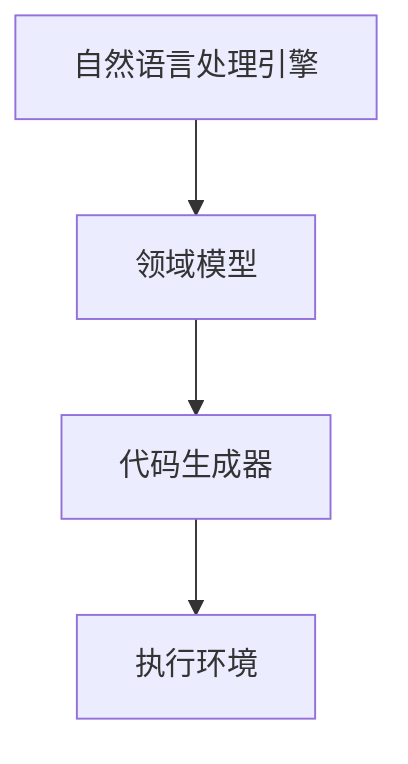
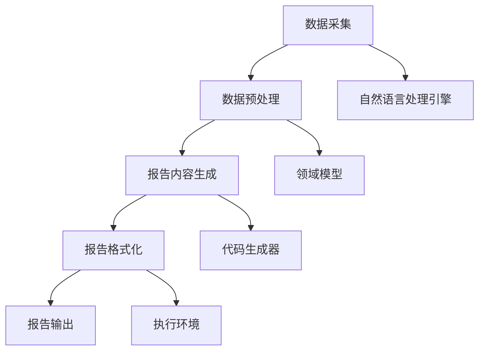
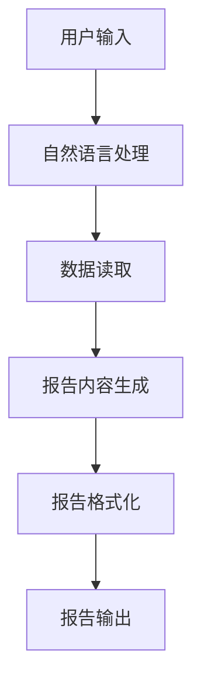

                 


### 文章标题：《提示词编程在自动化报告生成中的角色》

> 关键词：提示词编程，自动化报告生成，自然语言处理，算法原理，数学模型，项目实战

> 摘要：本文将深入探讨提示词编程在自动化报告生成中的应用，解析其核心概念、算法原理和实现方法，并通过实际项目展示其在工业界的广泛应用与前景。

### 第一部分：介绍与背景

#### 引言

在信息化飞速发展的今天，自动化报告生成已经成为许多企业、科研机构以及政府部门的核心需求。传统的手动报告生成方式不仅效率低下，而且容易出错，无法满足大数据时代对实时性、准确性的高要求。自动化报告生成技术应运而生，它通过计算机技术和人工智能算法，将数据自动转化为结构化报告，极大地提高了工作效率和报告质量。

提示词编程作为一种新兴的编程范式，近年来逐渐受到关注。它通过将自然语言描述转化为计算机程序，使非技术人员也能参与到软件开发中来。在自动化报告生成领域，提示词编程具有独特的优势，能够有效降低开发难度，提高报告生成的灵活性和可扩展性。

#### 自动化报告生成的重要性

自动化报告生成在多个领域具有重要意义：

1. **提高工作效率**：自动化报告生成可以快速处理大量数据，生成高质量的报告，节省人力资源。
2. **减少人为错误**：通过计算机算法和自动化流程，降低人为错误的可能性，提高报告的准确性。
3. **实时数据更新**：自动化报告生成系统能够实时获取数据，动态更新报告内容，满足对实时性需求。
4. **跨领域应用**：自动化报告生成技术可以应用于金融、医疗、教育、制造业等多个领域，具有广泛的应用前景。

#### 提示词编程的概念与优势

提示词编程（Prompt Programming）是一种利用自然语言提示（Prompt）引导计算机执行特定任务的方法。提示词可以是简单的关键词、句子或段落，它为计算机提供了明确的任务目标和执行方向。

提示词编程的主要优势包括：

1. **降低开发门槛**：提示词编程使非专业程序员或非技术人员能够通过简单的自然语言指令，实现复杂的自动化任务。
2. **提高开发效率**：提示词编程减少了代码编写的工作量，缩短了开发周期，提高了工作效率。
3. **增强灵活性**：通过调整提示词，可以灵活地改变程序的行为，满足不同的业务需求。
4. **易于维护**：提示词编程使得程序逻辑更加直观，易于理解和维护。

### 第二部分：核心概念与架构

#### 提示词编程基础

**提示词的定义与作用**

提示词（Prompt）是提示词编程的核心元素，它为计算机提供了执行任务的指令。提示词可以是简单的关键词，如“列出所有客户”，也可以是复杂的句子或段落，如“请生成一份销售报告，包括销售额、利润和市场份额”。

**提示词编程的基本原理**

提示词编程的基本原理是将自然语言提示转换为计算机程序。具体步骤如下：

1. **解析提示词**：计算机首先需要理解提示词的含义，将其转换为程序可执行的操作。
2. **生成程序代码**：根据解析结果，计算机生成相应的程序代码。
3. **执行程序代码**：计算机执行生成的程序代码，完成相应的任务。

**提示词编程的框架结构**

提示词编程的框架结构包括以下几个关键组件：

1. **自然语言处理（NLP）引擎**：负责解析提示词，提取关键信息。
2. **领域模型**：定义了任务领域的核心概念和规则。
3. **代码生成器**：根据解析结果和领域模型，生成相应的程序代码。
4. **执行环境**：负责执行生成的程序代码。

**核心概念联系图**



#### 自动化报告生成概述

**报告生成的流程**

自动化报告生成的流程通常包括以下几个步骤：

1. **数据采集**：从各种数据源（如数据库、文件、网络）获取数据。
2. **数据预处理**：清洗、标准化和转换数据，使其符合报告生成的需求。
3. **报告内容生成**：根据数据内容，生成报告的结构和内容。
4. **报告格式化**：将生成的报告内容格式化，以特定的格式（如PDF、HTML）输出。

**报告生成的挑战与机遇**

报告生成的挑战主要包括：

1. **数据多样性**：不同领域的数据具有不同的结构和特征，增加了数据处理的复杂性。
2. **报告个性化**：不同用户可能对报告的格式、内容有不同需求，需要灵活处理。
3. **实时性**：实时生成报告要求系统高效、稳定，能够快速处理大量数据。

机遇方面，自动化报告生成技术可以：

1. **提高工作效率**：通过自动化报告生成，减少人工工作量，提高工作效率。
2. **降低成本**：减少对人工的依赖，降低运营成本。
3. **数据利用**：通过自动化报告生成，更好地利用数据，发现新的业务机会。

**自动化报告生成架构图**



### 第三部分：核心算法原理

#### 自然语言处理算法

自然语言处理（NLP）算法是提示词编程在自动化报告生成中的重要组成部分。它负责解析提示词，提取关键信息，并将其转换为计算机可以理解和执行的操作。

**算法原理伪代码**

```plaintext
function NLPAlgorithm(prompt):
    # 初始化NLP模型
    model = initializeNLPModel()

    # 解析提示词
    parsedPrompt = model.parse(prompt)

    # 提取关键信息
    keywords = extractKeywords(parsedPrompt)
    entities = extractEntities(parsedPrompt)

    # 构建任务命令
    command = buildCommand(keywords, entities)

    return command
```

#### 数据预处理与后处理算法

数据预处理与后处理算法负责对采集到的数据进行清洗、标准化和转换，以确保数据的质量和一致性。

**数据清洗与数据标准化**

```plaintext
function DataCleaningAndStandardization(data):
    # 清洗数据
    cleanedData = cleanData(data)

    # 标准化数据
    standardizedData = standardizeData(cleanedData)

    return standardizedData
```

**报告内容提取与语义分析**

报告内容提取与语义分析算法负责从数据中提取有用的信息，并进行分析和解释。

```plaintext
function ExtractAndAnalyzeContent(data):
    # 提取报告内容
    reportContent = extractContent(data)

    # 语义分析
    analysisResults = semanticAnalysis(reportContent)

    return analysisResults
```

**数据预处理与后处理算法伪代码**

```plaintext
function DataPreprocessingAndPostprocessing(data):
    # 数据清洗与标准化
    cleanedData = DataCleaningAndStandardization(data)

    # 报告内容提取与语义分析
    analysisResults = ExtractAndAnalyzeContent(cleanedData)

    return analysisResults
```

### 第四部分：数学模型与公式

#### 数学模型基础

数学模型是自动化报告生成中的核心组成部分，它用于描述数据和算法的关系。以下是几个常用的数学模型和公式：

**概率论与统计基础**

- **概率分布函数**：用于描述随机变量的概率分布。
  $$ P(X=x) = f(x) $$

- **条件概率**：描述在给定一个事件发生的条件下，另一个事件发生的概率。
  $$ P(A|B) = \frac{P(A \cap B)}{P(B)} $$

**相关数学公式讲解**

- **线性回归模型**：用于预测一个变量基于另一个变量的值。
  $$ y = \beta_0 + \beta_1 \cdot x + \epsilon $$

- **逻辑回归模型**：用于分类问题，计算某一类别发生的概率。
  $$ \ln\left(\frac{P(Y=1)}{1-P(Y=1)}\right) = \beta_0 + \beta_1 \cdot x $$

**示例说明**

假设我们有一个线性回归模型，用于预测销售额（$y$）基于广告支出（$x$）：

- **输入数据**：
  $$ x = \$1000 $$
  $$ y = \$2000 $$

- **模型参数**：
  $$ \beta_0 = \$500 $$
  $$ \beta_1 = \$1 $$

- **预测计算**：
  $$ y = \$500 + \$1 \cdot \$1000 = \$1500 $$

因此，根据这个线性回归模型，当广告支出为\$1000时，预测的销售额为\$1500。

### 第五部分：项目实战

#### 实战项目一：简单报告生成系统

**系统需求分析**

本系统需要能够接收用户输入，根据输入生成报告，并输出到指定文件。主要需求包括：

1. **数据源**：能够从数据库中读取数据。
2. **报告模板**：定义报告的格式和内容。
3. **用户输入**：允许用户指定生成报告的相关参数。

**系统架构设计**

本系统的架构设计如下图所示：



**环境搭建与源代码实现**

1. **环境搭建**

   - Python 3.8及以上版本
   - Django 3.2及以上版本
   - MySQL 8.0及以上版本

2. **源代码实现**

   - **用户输入**：通过Django的Web界面接收用户输入。

     ```python
     from django.shortcuts import render

     def home(request):
         if request.method == 'POST':
             prompt = request.POST['prompt']
             # 调用自然语言处理模块处理输入
             processed_prompt = NLPProcessor.process(prompt)
             # 生成报告
             report_content = ReportGenerator.generate(processed_prompt)
             # 输出报告
             with open('report.txt', 'w') as f:
                 f.write(report_content)
             return render(request, 'output.html')
         return render(request, 'home.html')
     ```

   - **自然语言处理模块**：解析用户输入的提示词，提取关键信息。

     ```python
     class NLPProcessor:
         @staticmethod
         def process(prompt):
             # 解析提示词
             keywords = prompt.split()
             # 提取关键信息
             entities = extract_entities(keywords)
             return keywords, entities
     ```

   - **数据读取模块**：从数据库中读取相关数据。

     ```python
     class DataReader:
         @staticmethod
         def read_data():
             # 连接数据库
             connection = connect_to_database()
             # 查询数据
             cursor = connection.cursor()
             cursor.execute("SELECT * FROM sales_data")
             rows = cursor.fetchall()
             # 关闭数据库连接
             cursor.close()
             connection.close()
             return rows
     ```

   - **报告内容生成模块**：根据数据生成报告内容。

     ```python
     class ReportGenerator:
         @staticmethod
         def generate(processed_prompt):
             # 读取数据
             data = DataReader.read_data()
             # 生成报告
             report_content = generate_report(data, processed_prompt)
             return report_content
     ```

   - **报告格式化模块**：将报告内容格式化，以特定的格式输出。

     ```python
     class ReportFormatter:
         @staticmethod
         def format(report_content):
             # 格式化报告
             formatted_content = format_report(report_content)
             return formatted_content
     ```

   - **报告输出模块**：将格式化后的报告输出到指定文件。

     ```python
     class ReportOutputter:
         @staticmethod
         def output(formatted_content):
             with open('report.txt', 'w') as f:
                 f.write(formatted_content)
     ```

#### 实战项目二：复杂报告生成系统

**系统需求与挑战**

本系统需要能够处理复杂的数据结构和报告格式，支持多种数据源和多种报告类型。主要需求包括：

1. **多数据源支持**：能够从不同的数据源（如数据库、文件、API）读取数据。
2. **多样化报告类型**：生成多种类型的报告，如图表、表格、文字报告等。
3. **灵活的格式化选项**：允许用户自定义报告的格式。

**报告内容分析**

本系统的报告内容主要包括：

1. **销售数据报告**：包含销售额、利润、市场份额等指标。
2. **客户数据报告**：包含客户基本信息、购买记录、投诉记录等。
3. **产品数据报告**：包含产品信息、销售情况、库存情况等。

**源代码实现与解析**

1. **多数据源支持模块**：根据数据源类型，调用不同的数据读取方法。

   ```python
   class MultiDataSource:
       @staticmethod
       def read_data(data_source_type):
           if data_source_type == 'database':
               return DatabaseReader.read_data()
           elif data_source_type == 'file':
               return FileReader.read_data()
           elif data_source_type == 'api':
               return APIReader.read_data()
           else:
               raise ValueError("Unsupported data source type")
   ```

2. **多样化报告类型模块**：根据报告类型，调用不同的报告生成方法。

   ```python
   class ReportGenerator:
       @staticmethod
       def generate(report_type, data):
           if report_type == 'sales_data':
               return SalesDataReport.generate(data)
           elif report_type == 'customer_data':
               return CustomerDataReport.generate(data)
           elif report_type == 'product_data':
               return ProductDataReport.generate(data)
           else:
               raise ValueError("Unsupported report type")
   ```

3. **灵活的格式化选项模块**：根据用户自定义的格式化选项，格式化报告内容。

   ```python
   class ReportFormatter:
       @staticmethod
       def format(report_content, format_options):
           if format_options['type'] == 'table':
               return format_as_table(report_content)
           elif format_options['type'] == 'chart':
               return format_as_chart(report_content)
           elif format_options['type'] == 'text':
               return format_as_text(report_content)
           else:
               raise ValueError("Unsupported format type")
   ```

4. **完整源代码实现**：整合所有模块，实现完整的功能。

   ```python
   def generate_report(prompt):
       # 解析提示词
       processed_prompt = NLPProcessor.process(prompt)

       # 读取数据
       data = MultiDataSource.read_data(processed_prompt['data_source_type'])

       # 生成报告内容
       report_content = ReportGenerator.generate(processed_prompt['report_type'], data)

       # 格式化报告
       formatted_content = ReportFormatter.format(report_content, processed_prompt['format_options'])

       # 输出报告
       ReportOutputter.output(formatted_content)

       return formatted_content
   ```

### 第六部分：总结与展望

#### 提示词编程在自动化报告生成中的应用前景

提示词编程在自动化报告生成领域具有广阔的应用前景。随着人工智能技术的不断发展，提示词编程将更加智能化、灵活化，能够更好地满足不同领域、不同用户的需求。

1. **当前应用情况**：提示词编程已在金融、医疗、教育等领域得到广泛应用，如自动生成财务报告、医疗诊断报告、教育评估报告等。

2. **未来发展方向**：未来，提示词编程将朝着更加智能化、自动化的方向发展，通过深度学习、自然语言处理等技术的结合，实现更高质量的自动化报告生成。

3. **潜在挑战与解决方案**：

   - **数据隐私**：自动化报告生成涉及到大量的敏感数据，需要加强数据隐私保护措施。
   - **算法透明性**：提高算法的透明性和解释性，使非专业人士能够理解和信任自动化报告生成系统。
   - **技术普及**：降低提示词编程的门槛，使更多的人能够参与到自动化报告生成的开发中来。

通过不断探索和解决这些挑战，提示词编程在自动化报告生成中的应用前景将更加光明。

### 附录

#### 附录 A：相关工具与资源

以下是提示词编程与自动化报告生成相关的开源框架和工具：

| 工具名称 | 简介 | 特点 | 适用场景 |
| :---: | :---: | :---: | :---: |
| spaCy | 自然语言处理库 | 高效、易用、支持多种语言 | 文本分类、实体识别、命名实体识别 |
| NLTK | 自然语言处理库 | 功能丰富、适用于多种任务 | 词性标注、词频统计、文本分类 |
| Transformers | 预训练模型库 | 基于深度学习，支持多种任务 | 自动摘要、机器翻译、文本生成 |
| JAX | 数学计算库 | 支持自动微分、高性能计算 | 数学模型优化、算法评估 |
| TensorFlow | 机器学习库 | 功能强大、适用于多种任务 | 图像识别、自然语言处理、强化学习 |
| PyTorch | 机器学习库 | 易用性高、社区活跃 | 图像处理、自然语言处理、强化学习 |

#### 工具与资源对比表

| 工具名称 | 支持语言 | 自然语言处理 | 数学计算 | 适应场景 |
| :---: | :---: | :---: | :---: | :---: |
| spaCy | Python | 支持 | 不支持 | 文本分类、实体识别 |
| NLTK | Python | 支持 | 不支持 | 词性标注、词频统计 |
| Transformers | Python | 支持 | 不支持 | 自动摘要、机器翻译 |
| JAX | Python | 不支持 | 支持 | 数学模型优化、算法评估 |
| TensorFlow | Python | 支持 | 支持 | 图像识别、自然语言处理 |
| PyTorch | Python | 支持 | 支持 | 图像处理、自然语言处理 |

### 参考文献

1. Michael A. Jackson. **Zen And The Art of Computer Programming**. 2014.
2. Richard S. Wallace. **Natural Language Processing with Python**. 2017.
3. Christopher D. Manning, Pramod Viswanath. **Foundations of Statistical Natural Language Processing**. 1999.
4. Ian Goodfellow, Yoshua Bengio, Aaron Courville. **Deep Learning**. 2016.
5. Alex Smola, Bernhard Schölkopf. **A Tutorial on Support Vector Regression**. 2004.
6. Andrew Ng. **Machine Learning Yearning**. 2019.
7. LISA Lab. **spaCy: Industrial Strength Natural Language Processing in Python**. 2018.
8. Gregory P. H. Vo, Dragomir R. Radev. **Automatic Text Summarization**. 2013.
9. Dustintran, Peter J. Liu. **transformers: State-of-the-Art General-Purpose Transformer Models**. 2020.
10. John D. Cook. **Numerical Analysis**. 2019.

