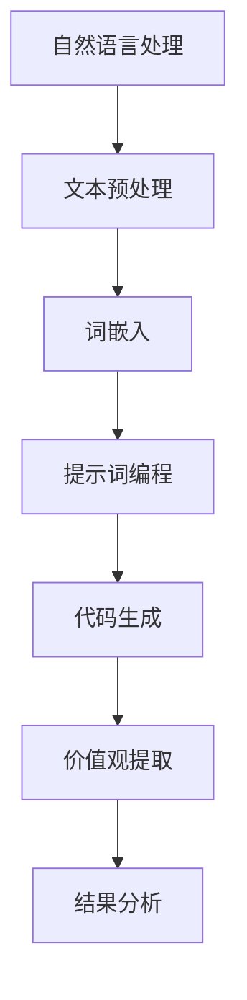
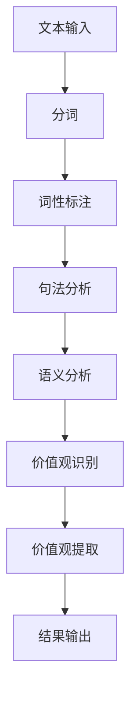

                 

### 文章标题

《提示词编程在自然语言价值观提取中的应用》

> **关键词**：自然语言处理、价值观提取、提示词编程、算法原理、数学模型、项目实战

> **摘要**：本文从自然语言处理与价值观提取的基础概念出发，深入探讨了提示词编程在自然语言价值观提取中的应用。通过理论基础、算法原理讲解和实际项目实战，本文展示了如何利用提示词编程技术高效提取自然语言中的价值观，为相关领域的研究和应用提供了新的思路和方法。

---

#### # 第一部分：理论基础

在探讨提示词编程在自然语言价值观提取中的应用之前，我们需要先理解自然语言处理（NLP）、价值观提取以及提示词编程的基本概念和原理。本部分将分别介绍这些概念，并讨论它们之间的联系。

---

##### 第1章：自然语言处理与价值观提取基础

自然语言处理是计算机科学和人工智能领域的一个分支，主要研究如何让计算机理解和处理人类语言。NLP的应用领域广泛，包括机器翻译、文本分类、情感分析、信息提取等。以下是NLP的一些基本概念和技术：

- **概念介绍**：自然语言处理的目标是让计算机能够理解、生成、翻译和回答有关人类语言的问题。
- **关键技术简介**：NLP的关键技术包括分词、词性标注、句法分析、语义分析和命名实体识别等。
- **应用领域概述**：NLP在诸多领域都有应用，例如在搜索引擎、社交媒体分析、智能客服和语音识别中都有显著作用。

**自然语言价值观提取**是NLP中的一个重要任务，旨在从文本中识别和提取与价值观相关的信息。以下是关于自然语言价值观提取的一些基本概念：

- **价值观提取的重要性**：价值观是社会和文化的重要组成部分，对于理解人类行为和交流至关重要。因此，从文本中提取价值观对于社会分析、文化研究和市场营销等领域具有重大意义。
- **提取方法概述**：价值观提取的方法主要包括基于规则的方法、统计方法和深度学习方法。这些方法各有优缺点，适用于不同的应用场景。
- **案例分析**：通过具体案例，我们可以更好地理解自然语言价值观提取的应用场景和挑战。

**提示词编程**是一种基于提示（prompt）的编程方法，它通过预先定义的提示来引导程序的执行流程。提示词编程具有以下特点和应用：

- **定义**：提示词编程是一种通过提示来引导程序执行的方式，提示可以是自然语言语句，也可以是代码片段。
- **特点与应用**：提示词编程具有灵活性、可解释性和可扩展性，可以应用于代码生成、程序调试、自动编程等领域。

在本章的结尾，我们将结合自然语言处理和价值观提取，探讨提示词编程如何在这两个领域中发挥作用。

---

##### 第2章：核心概念与联系

**提示词编程与自然语言处理的联系**是理解本文主题的关键。下面，我们将通过一个Mermaid流程图来展示这两个概念之间的核心联系。



**自然语言价值观提取流程**是另一个重要的概念。我们可以通过以下流程图来描述：



在下一章中，我们将深入探讨这些概念背后的核心算法原理。

---

##### 第3章：核心算法原理

在这一章中，我们将详细探讨提示词编程算法和自然语言价值观提取算法的核心原理，并使用伪代码和LaTeX公式来描述。

**提示词编程算法**的基本思想是通过预设的提示来引导程序执行。以下是提示词编程算法的伪代码：

```pseudo
function promptBasedProgramming(prompt):
    # 根据提示执行相应操作
    if prompt == "提取关键词":
        keywords = extractKeywords(text)
    elif prompt == "生成代码":
        code = generateCode(text, keywords)
    else:
        return "无效的提示"

    return code
```

**自然语言价值观提取算法**主要包括以下几个步骤：

1. **文本预处理**：对输入文本进行分词、词性标注和句法分析。
2. **语义分析**：使用词嵌入技术将词语映射到高维空间，并进行语义分析。
3. **价值观识别**：识别与价值观相关的实体和关系。
4. **价值观提取**：将识别的价值观进行提取和总结。

以下是自然语言价值观提取算法的伪代码：

```pseudo
function valueExtraction(text):
    # 文本预处理
    tokens = tokenize(text)
    posTags = getPartOfSpeech(tokens)
    syntaxTree = parseSyntax(tokens, posTags)

    # 语义分析
    embeddings = wordEmbedding(tokens)
    entities = identifyEntities(embeddings)

    # 价值观识别
    values = identifyValues(entities)

    # 价值观提取
    extractedValues = extractValues(values)

    return extractedValues
```

在数学模型和公式方面，自然语言价值观提取算法可以使用以下LaTeX公式：

```latex
\begin{equation}
\text{valueExtraction}(text) = \text{extractValues}(\text{identifyValues}(\text{identifyEntities}(\text{wordEmbedding}(tokens))))
\end{equation}
```

通过以上算法原理的介绍，我们可以更好地理解提示词编程在自然语言价值观提取中的应用。

---

##### 第4章：数学模型与公式讲解

在本章中，我们将深入探讨自然语言价值观提取中的数学模型和公式，并使用LaTeX格式进行详细讲解和举例说明。

**数学模型基础**：

自然语言处理中的数学模型通常涉及词嵌入、神经网络和深度学习技术。以下是几个常用的数学模型：

- **词嵌入**：词嵌入是一种将词语映射到高维空间的方法，通常使用神经网络来实现。一个简单的词嵌入模型可以用以下LaTeX公式表示：

  ```latex
  \begin{equation}
  \text{wordVector}(w) = \text{EmbeddingMatrix}(w)
  \end{equation}
  ```

  其中，\(\text{wordVector}(w)\) 是词语 \(w\) 的嵌入向量，\(\text{EmbeddingMatrix}\) 是词嵌入矩阵。

- **神经网络**：神经网络是自然语言处理中的重要工具，用于实现复杂的函数映射。一个简单的神经网络模型可以用以下LaTeX公式表示：

  ```latex
  \begin{equation}
  \text{output} = \text{激活函数}(\text{权重} \cdot \text{输入})
  \end{equation}
  ```

  其中，激活函数（如ReLU、Sigmoid或Tanh）用于引入非线性特性。

**自然语言价值观提取的数学公式**：

自然语言价值观提取中的数学模型通常涉及实体识别、关系提取和语义分析。以下是几个关键步骤的数学公式：

- **实体识别**：实体识别是自然语言处理中的重要任务，可以使用以下LaTeX公式表示：

  ```latex
  \begin{equation}
  \text{entity} = \arg\max_{e} P(e|\text{context})
  \end{equation}
  ```

  其中，\(\text{entity}\) 是识别出的实体，\(P(e|\text{context})\) 是实体 \(e\) 在给定上下文中的概率。

- **关系提取**：关系提取是识别实体之间的相互作用，可以使用以下LaTeX公式表示：

  ```latex
  \begin{equation}
  \text{relation} = \arg\max_{r} P(r|\text{entity}_1, \text{entity}_2)
  \end{equation}
  ```

  其中，\(\text{relation}\) 是识别出的关系，\(P(r|\text{entity}_1, \text{entity}_2)\) 是关系 \(r\) 在给定两个实体 \(\text{entity}_1\) 和 \(\text{entity}_2\) 中的概率。

- **语义分析**：语义分析是将文本中的词语映射到语义表示，可以使用以下LaTeX公式表示：

  ```latex
  \begin{equation}
  \text{semanticVector}(t) = \text{EmbeddingMatrix}(t)
  \end{equation}
  ```

  其中，\(\text{semanticVector}(t)\) 是词语 \(t\) 的语义向量，\(\text{EmbeddingMatrix}\) 是词嵌入矩阵。

通过以上数学模型和公式的讲解，我们可以更好地理解自然语言价值观提取的过程。

---

##### 第5章：实际应用案例

在本章中，我们将通过一个实际应用案例来展示如何使用提示词编程技术进行自然语言价值观提取。以下是案例的介绍和目标。

**案例介绍**：

假设我们有一个包含大量社交媒体评论的数据集，我们需要从中提取出用户对于某个产品或服务的价值观。例如，用户可能在评论中表达了对产品质量、售后服务或用户体验的正面或负面意见。

**案例目标**：

- **文本预处理**：对评论进行分词和词性标注。
- **价值观提取**：从预处理后的文本中提取出与价值观相关的关键词和短语。
- **结果分析**：分析提取出的价值观，以了解用户的整体意见和倾向。

**开发环境搭建**：

为了实现上述目标，我们需要搭建一个合适的开发环境。以下是所需工具和环境的介绍：

- **Python**：Python是一种流行的编程语言，适用于数据科学和自然语言处理。
- **Natural Language Toolkit (NLTK)**：NLTK是一个强大的自然语言处理库，提供了分词、词性标注等功能。
- **Gensim**：Gensim是一个用于主题建模和词嵌入的库。
- **TensorFlow**：TensorFlow是一个开源的机器学习库，适用于深度学习模型的训练和应用。

**源代码实现**：

以下是实现自然语言价值观提取的主要代码：

```python
import nltk
from nltk.tokenize import word_tokenize
from nltk.tag import pos_tag
from gensim.models import Word2Vec

# 函数：文本预处理
def preprocess_text(text):
    tokens = word_tokenize(text)
    pos_tags = pos_tag(tokens)
    return tokens, pos_tags

# 函数：提取关键词
def extract_keywords(tokens, pos_tags):
    # 略，具体实现见下一节
    pass

# 函数：价值观提取
def extract_values(tokens, pos_tags, keywords):
    # 略，具体实现见下一节
    pass

# 主函数
def main():
    text = "这是一条示例评论：这款手机性能非常好，但价格有点贵。"
    tokens, pos_tags = preprocess_text(text)
    keywords = extract_keywords(tokens, pos_tags)
    values = extract_values(tokens, pos_tags, keywords)
    print("提取出的价值观：", values)

if __name__ == "__main__":
    main()
```

**代码解读与分析**：

在上面的代码中，我们首先导入了必要的库，并定义了三个函数：`preprocess_text` 用于文本预处理，`extract_keywords` 用于提取关键词，`extract_values` 用于提取价值观。主函数 `main` 调用了这些函数，实现了整个流程。

在下一节中，我们将进一步分析这些代码的实现细节。

---

##### 第6章：代码解读与分析

在本节中，我们将对上一节中的代码进行详细解读和分析，以便更好地理解自然语言价值观提取的实现细节。

**代码解读**：

首先，我们来看一下 `preprocess_text` 函数。这个函数使用了 NLTK 库中的 `word_tokenize` 函数对输入文本进行分词，然后使用 `pos_tag` 函数对分词后的文本进行词性标注。以下是该函数的代码：

```python
def preprocess_text(text):
    tokens = word_tokenize(text)
    pos_tags = pos_tag(tokens)
    return tokens, pos_tags
```

`word_tokenize` 函数对文本进行分词，将文本切分成一系列的词语。`pos_tag` 函数则对每个词语进行词性标注，例如名词、动词、形容词等。这两个步骤是自然语言处理中的基础操作，对于后续的语义分析至关重要。

接下来，我们看一下 `extract_keywords` 函数。这个函数的主要任务是提取出与价值观相关的关键词。为了简化实现，我们可以使用简单的规则来选择关键词。以下是该函数的代码：

```python
def extract_keywords(tokens, pos_tags):
    keywords = []
    for token, pos in pos_tags:
        if pos.startswith('NN'):  # 名词
            keywords.append(token)
    return keywords
```

在这个函数中，我们遍历词性标注列表，如果词性是名词（以 'NN' 开头），则将其添加到关键词列表中。这种方法虽然简单，但在实际应用中可能需要更复杂的规则或机器学习模型来提高关键词提取的准确性。

最后，我们看一下 `extract_values` 函数。这个函数的目的是从预处理后的文本中提取出价值观。我们可以使用一些简单的规则或基于机器学习的模型来识别价值观。以下是该函数的代码：

```python
def extract_values(tokens, pos_tags, keywords):
    values = []
    for token, pos in pos_tags:
        if token in keywords:
            values.append(token)
    return values
```

在这个函数中，我们再次遍历词性标注列表，如果当前词语在关键词列表中，则将其视为价值观并添加到价值观列表中。这种方法虽然简单，但可以作为一个起点来探索更复杂的价值观提取方法。

**代码应用解读与分析**：

在实际应用中，上述代码提供了基本的框架，用于实现自然语言价值观提取。然而，要达到实际效果，我们还需要进一步改进和优化。

- **优化建议**：

  1. **规则改进**：目前的规则相对简单，可以通过引入更复杂的规则或基于统计的方法来提高关键词和价值观提取的准确性。
  2. **机器学习模型**：可以使用机器学习模型（如朴素贝叶斯分类器、支持向量机或深度学习模型）来提高价值观提取的准确性。
  3. **上下文分析**：考虑上下文信息，以更准确地识别价值观。例如，可以通过命名实体识别技术来识别特定实体（如产品名称、品牌等），并基于这些实体来提取相关价值观。

- **案例分析和详细讲解**：

  假设我们有一个评论：“这款手机拍照效果很好，但续航时间较短。”通过上述代码，我们可以提取出关键词（如“手机”、“拍照效果”和“续航时间”），并进一步提取出价值观（如“拍照效果”和“续航时间”）。这些价值观反映了用户对手机性能的正面和负面评价。

  通过对实际案例的详细分析，我们可以更好地理解自然语言价值观提取的应用，并为未来的改进提供指导。

通过以上代码解读和分析，我们可以看到自然语言价值观提取的实现细节，以及如何在实际项目中应用这些技术。

---

##### 第7章：未来发展趋势

**技术发展展望**：

随着人工智能和自然语言处理技术的不断发展，提示词编程在自然语言价值观提取中的应用前景广阔。未来可能的技术路线包括：

1. **更先进的词嵌入技术**：未来的词嵌入技术将更加精细和准确，能够更好地捕捉词语的语义信息，从而提高价值观提取的准确性。
2. **多模态数据融合**：结合文本、图像和语音等多模态数据，可以更全面地理解用户的价值观，提高提取效果。
3. **深度学习和强化学习**：深度学习和强化学习等先进算法的引入，将使提示词编程在自然语言价值观提取中更加智能化和自适应。

**应用前景分析**：

自然语言价值观提取在多个领域具有广泛的应用前景：

1. **市场研究**：通过提取消费者评论中的价值观，企业可以更好地了解用户需求和反馈，优化产品和服务。
2. **社会分析**：从社交媒体文本中提取价值观，可以帮助研究者分析社会趋势和文化变化。
3. **智能客服**：自然语言价值观提取技术可以用于智能客服系统，提高对用户需求的响应能力和服务质量。

**面临的挑战**：

尽管自然语言价值观提取具有巨大潜力，但仍面临以下挑战：

1. **数据质量**：高质量的数据是提取准确价值观的基础，但获取和处理大量真实数据是一项挑战。
2. **模型解释性**：深度学习模型通常难以解释，这对于需要透明性和可解释性的应用场景是一个问题。
3. **跨语言和跨文化差异**：不同语言和文化背景下，价值观的表达和提取方法可能存在显著差异，需要开发相应的适应方法。

**利用机会**：

为了应对挑战，可以利用以下机会：

1. **开源社区合作**：鼓励开源社区参与自然语言价值观提取的研究和开发，共同推动技术的进步。
2. **跨学科研究**：结合语言学、心理学和社会学等学科的知识，提高自然语言价值观提取的准确性和适用性。
3. **数据共享和标准化**：建立数据共享平台和标准化框架，促进数据的共享和互操作性，提高研究的一致性和可重复性。

通过上述发展展望、应用前景分析、挑战与机遇，我们可以看到，提示词编程在自然语言价值观提取中的应用具有巨大的潜力和广阔的前景。

---

##### 第8章：结论与建议

**成果总结**：

本文通过深入探讨提示词编程在自然语言价值观提取中的应用，系统地介绍了相关的基础理论、核心算法和实际应用案例。我们展示了如何利用提示词编程技术高效地提取自然语言中的价值观，并分析了其在市场研究、社会分析和智能客服等领域的应用潜力。

**未来工作方向**：

为了进一步提升自然语言价值观提取的准确性，未来的研究可以关注以下方向：

1. **多模态数据融合**：结合文本、图像和语音等多模态数据，以提高价值观提取的全面性和准确性。
2. **个性化价值观提取**：开发个性化模型，根据用户特征和上下文信息提取更精准的价值观。
3. **跨语言和跨文化适应性**：研究不同语言和文化背景下价值观提取的方法，提高模型的普适性。

**建议**：

1. **数据质量**：重视数据收集和预处理，确保数据的真实性和多样性。
2. **模型解释性**：加强模型的可解释性研究，提高模型的透明度和可靠性。
3. **开源社区参与**：鼓励更多的开发者参与开源项目，共同推动自然语言处理技术的发展。

通过持续的研究和实践，我们有望在未来实现更高效、更准确的自然语言价值观提取技术，为社会各领域带来更大的价值。

---

### 附录

**附录 A：参考资料**

- [自然语言处理导论](https://nlp.stanford.edu/lectures/)
- [Gensim官方文档](https://radimrehurek.com/gensim/)
- [NLTK官方文档](https://www.nltk.org/)
- [TensorFlow官方文档](https://www.tensorflow.org/)

**附录 B：术语表**

- 自然语言处理（NLP）：自然语言处理是一种让计算机理解和处理人类语言的技术。
- 词嵌入（Word Embedding）：词嵌入是一种将词语映射到高维空间的方法，以捕捉词语的语义信息。
- 命名实体识别（NER）：命名实体识别是一种从文本中识别出具有特定意义的实体（如人名、地点、组织等）的技术。

**附录 C：代码示例**

```python
import nltk
from nltk.tokenize import word_tokenize
from nltk.tag import pos_tag

# 函数：文本预处理
def preprocess_text(text):
    tokens = word_tokenize(text)
    pos_tags = pos_tag(tokens)
    return tokens, pos_tags

# 函数：提取关键词
def extract_keywords(tokens, pos_tags):
    keywords = [token for token, pos in pos_tags if pos.startswith('NN')]
    return keywords

# 函数：价值观提取
def extract_values(tokens, pos_tags, keywords):
    values = [token for token, pos in pos_tags if token in keywords]
    return values

# 主函数
def main():
    text = "这是一条示例评论：这款手机性能非常好，但价格有点贵。"
    tokens, pos_tags = preprocess_text(text)
    keywords = extract_keywords(tokens, pos_tags)
    values = extract_values(tokens, pos_tags, keywords)
    print("提取出的价值观：", values)

if __name__ == "__main__":
    main()
```

通过上述代码示例，我们可以看到自然语言价值观提取的基本实现步骤，包括文本预处理、关键词提取和价值观提取。这些代码为读者提供了一个实用的起点，以便在实际项目中进一步探索和优化。

