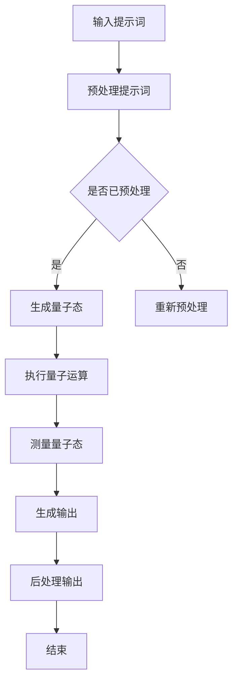

                 


### 文章标题：提示词编程在量子计算中的前沿探索

> 关键词：量子计算、提示词编程、量子算法、应用场景、前沿技术

> 摘要：本文旨在探讨量子计算和提示词编程这两大前沿技术的结合，分析其核心概念、工作原理、应用场景及未来发展趋势。通过详细的伪代码、数学模型和实际案例，深入解析量子计算中提示词编程的实践应用，为读者呈现这一领域的最新研究成果。

### 第一部分：量子计算基础

#### 第1章：量子计算概述

##### 1.1 量子计算的基本原理

量子计算是利用量子力学原理进行信息处理的新型计算模式。它基于量子位（qubit）这一基本单元，而非传统计算机中的比特（bit）。量子位具有两个独特性质：量子叠加态和量子纠缠。

- **量子位（qubit）的介绍与特性**：量子位是量子计算的基本单元，可以处于0和1的叠加状态，而非传统比特的0或1。这种叠加态使得量子计算机在处理问题时具有并行性。

- **量子叠加态**：量子位可以同时处于0和1的叠加状态，这种叠加状态可以用复数系数表示。例如，一个量子位可以处于状态$|\psi\rangle = \frac{1}{\sqrt{2}}|0\rangle + \frac{1}{\sqrt{2}}|1\rangle$。

- **量子纠缠**：量子位之间可以形成量子纠缠，这种纠缠关系使得两个量子位的状态无法独立存在，它们之间的测量结果具有相关性。

- **量子 gates 的概念与分类**：量子 gates 是量子计算机的基本操作单元，用于对量子位进行变换。常见的量子 gates 包括 Hadamard 门、Pauli-X 门、Pauli-Z 门等。量子 gates 可以组合使用，实现复杂的量子运算。

##### 1.2 量子计算机的架构

量子计算机的架构种类繁多，包括固态量子计算、光量子计算和极低温度超导量子计算等。

- **固态量子计算**：固态量子计算利用物理系统中的自旋、电荷等量子态作为 qubit。这种架构具有高密度、低噪声等优点，但实现较为复杂。

- **光量子计算**：光量子计算利用光子作为 qubit，通过光学元件实现量子运算。光量子计算具有低噪声、长相干时间等优点，但光学元件的制作和操控较为复杂。

- **极低温度超导量子计算**：极低温度超导量子计算利用超导电路中的 Cooper 对作为 qubit，通过超导量子比特（Superconducting Quantum Bit，简称 qubit）实现量子运算。这种架构具有高稳定性、长相干时间等优点，但需要在极低温下运行。

##### 1.3 量子计算的优势与挑战

量子计算具有与传统计算机截然不同的优势，但也面临诸多挑战。

- **量子并行计算**：量子计算机可以利用量子叠加态实现并行计算，从而在处理某些问题时大幅提高计算速度。

- **量子纠错**：量子计算中的量子信息容易受到噪声和环境的影响，因此量子纠错技术至关重要。量子纠错可以保证量子计算机在运行过程中保持信息完整性。

- **量子计算的局限**：量子计算机在处理某些问题时存在局限性，如某些复杂问题可能无法通过量子算法高效解决。此外，量子计算机的实现和操作复杂，成本高昂。

### 第二部分：量子算法

#### 第2章：量子算法

量子算法是利用量子计算原理解决特定问题的算法。以下是几种重要的量子算法及其原理：

##### 2.1 量子算法概述

- **Shor 算法**：Shor 算法是一种用于因数分解的量子算法。它可以将一个合数分解为其质因数，在传统计算机中计算时间复杂度为 $O(N^{\frac{1}{2}})$，而在量子计算机中计算时间复杂度为 $O(log^3 N)$。

- **Grover 算法**：Grover 算法是一种用于搜索未排序数据库的量子算法。它可以在传统搜索算法的复杂度上实现平方根级别的加速。

- **量子随机 walks**：量子随机 walks 是一种基于量子纠缠和叠加态的量子算法，可用于解决图论中的某些问题。

##### 2.2 量子算法原理详解

- **Shor 算法伪代码**：

  ```plaintext
  plaintext
  Quantum Shor Algorithm:
  Input: N, a composite number
  Output: A factor of N

  1. Define quantum register q of size log(N)
  2. Prepare a superposition state |+>
  3. Apply the quantum Fourier transform (QFT)
  4. Measure the output
  5. If the output is 0, repeat steps 2-4
  6. Compute the phase of the output state
  7. Find a non-trivial modular exponentiation
  8. Factor N using the obtained values
  ```

- **Grover 算法伪代码**：

  ```plaintext
  plaintext
  Quantum Grover Search Algorithm:
  Input: An unsorted database of N items with a marked item
  Output: The marked item

  1. Define quantum register q of size log(N)
  2. Prepare a superposition state |+>
  3. Iterate N times:
     - Apply the Grover iteration operator
     - Measure the quantum register q
  4. Repeat until a marked item is found
  ```

##### 2.3 量子算法应用场景

- **量子加密**：量子加密利用量子态的不可克隆性实现安全通信。

- **量子模拟**：量子模拟可用于模拟量子系统的行为，帮助理解量子物理现象。

- **量子优化**：量子优化可以用于解决复杂的优化问题，如旅行商问题、车辆路径规划等。

### 第三部分：提示词编程

#### 第3章：提示词编程基础

##### 3.1 提示词编程的定义与核心思想

- **提示词编程的定义**：提示词编程（Prompt Programming）是一种基于提示词的人工智能编程方法，通过向模型提供提示词，引导模型生成预期的输出。

- **提示词编程的核心思想**：提示词编程利用大规模预训练语言模型，通过调整模型参数，使其能够根据提示词生成特定类型的输出。这种方法具有高效、灵活、易于实现等特点。

##### 3.2 提示词编程的工作原理

- **提示词的学习与生成**：提示词编程中的提示词通常通过大量数据训练得到。模型在训练过程中学习如何根据输入的提示词生成预期的输出。

- **提示词的优化与调整**：提示词编程中的提示词可以根据实际需求进行调整和优化，以实现更精确的输出。

##### 3.3 提示词编程工具

- **Q#编程语言**：Q#是一种专为量子计算设计的编程语言，支持提示词编程。

- **参考实现与开源项目**：多个开源项目提供了提示词编程的参考实现，如 OpenAI 的 GPT 模型、Google 的 BERT 模型等。

### 第四部分：提示词编程在量子计算中的应用

#### 第4章：提示词编程在量子计算中的应用

##### 4.1 提示词编程与量子计算机的结合

提示词编程与量子计算机的结合具有巨大潜力。通过将提示词编程应用于量子计算，可以实现以下目标：

- **量子算法自动化**：提示词编程可以用于自动化生成量子算法，降低量子算法设计的复杂度。

- **量子计算性能优化**：提示词编程可以用于优化量子计算的性能，提高量子算法的效率。

- **量子机器学习**：提示词编程可以用于构建量子机器学习模型，实现高效的量子机器学习算法。

##### 4.2 实际应用案例

- **量子机器学习**：量子机器学习是一种利用量子计算原理进行机器学习的方法。通过提示词编程，可以构建高效的量子机器学习模型，解决传统机器学习难以处理的问题。

- **量子搜索引擎**：量子搜索引擎是一种利用量子计算原理进行信息检索的方法。通过提示词编程，可以构建高效的量子搜索引擎，实现更快速的搜索结果。

##### 4.3 提示词编程未来展望

提示词编程在量子计算中的应用前景广阔。未来，随着量子计算技术的不断进步，提示词编程将在量子计算领域发挥越来越重要的作用。以下是对未来发展的展望：

- **量子算法自动化**：随着量子计算技术的不断发展，提示词编程有望实现量子算法的自动化生成，降低量子算法设计的复杂度。

- **量子计算性能优化**：提示词编程可以进一步优化量子计算的性能，提高量子算法的效率。

- **量子机器学习**：量子机器学习将成为提示词编程在量子计算领域的重要应用方向。通过构建高效的量子机器学习模型，可以解决传统机器学习难以处理的问题。

### 第五部分：前沿探索

#### 第5章：量子计算与提示词编程结合的核心概念与联系

量子计算与提示词编程的结合是当前人工智能领域的前沿研究方向。以下是对量子计算与提示词编程结合的核心概念与联系进行详细探讨：

##### 5.1 Mermaid 流程图

为了更好地理解量子计算与提示词编程的结合，我们可以使用 Mermaid 流程图来展示其工作流程。



在该流程图中，输入提示词经过预处理后生成量子态，然后执行量子运算，测量量子态后生成输出，最后进行后处理输出。

##### 5.2 核心概念与联系

- **量子态与提示词**：量子态是量子计算的基本概念，用于描述量子位的状态。提示词编程中的提示词可以被视为输入量子态的编码。

- **量子运算与提示词编程**：量子运算是对量子态进行变换的操作。提示词编程中的提示词可以用于引导量子运算，从而实现预期的输出。

- **测量与输出**：在量子计算中，测量量子态会破坏叠加态，使其坍缩到一个确定的状态。提示词编程中的输出则是根据测量结果生成的。

### 第六部分：数学模型和数学公式详解

为了深入理解量子计算与提示词编程的结合，我们需要详细探讨一些相关的数学模型和公式。以下是对量子门操作和提示词编程优化的数学公式及其详细讲解和举例说明。

##### 6.1 量子门操作

- **量子门操作的 latex 公式**：

  $$ U = \sum_{i,j} U_{ij} |i\rangle \langle j| $$

  该公式表示量子门 U 的矩阵形式，其中 $U_{ij}$ 是量子门在基态 $|i\rangle$ 和 $|j\rangle$ 之间的变换系数。

- **量子门操作的举例说明**：

  - **Hadamard 门**：

    $$ H = \frac{1}{\sqrt{2}} \begin{pmatrix} 1 & 1 \\ 1 & -1 \end{pmatrix} $$

    Hadamard 门是一个经典的量子门，可以将量子位的状态从基态 $|0\rangle$ 或 $|1\rangle$ 变换到叠加态。

  - **Pauli-X 门**：

    $$ X = \begin{pmatrix} 0 & 1 \\ 1 & 0 \end{pmatrix} $$

    Pauli-X 门是一个将量子位的状态在 $|0\rangle$ 和 $|1\rangle$ 之间进行变换的量子门。

##### 6.2 提示词编程优化

- **提示词优化的 latex 公式**：

  $$ \min_{\theta} L(\theta) $$

  该公式表示在参数 $\theta$ 的范围内，最小化损失函数 $L(\theta)$ 的优化过程。

- **提示词优化的举例说明**：

  - **Adam 优化器**：

    $$ \theta_{t+1} = \theta_t - \alpha \frac{m_t}{\sqrt{v_t} + \epsilon} $$

    其中，$\theta_t$ 是当前参数，$m_t$ 是一阶矩估计，$v_t$ 是二阶矩估计，$\alpha$ 是学习率，$\epsilon$ 是小常数。Adam 优化器是一种常见的优化算法，可以有效地更新模型参数。

### 第七部分：项目实战

#### 第7章：量子计算提示词编程环境搭建

在开始进行量子计算提示词编程项目之前，我们需要搭建一个合适的开发环境。以下是环境搭建的详细步骤：

##### 7.1 环境搭建步骤

1. **安装 Python**：

   首先，我们需要安装 Python。Python 是一种广泛使用的编程语言，支持多种量子计算库。可以从 Python 官网下载并安装 Python。

2. **安装 Q#编程语言**：

   Q#是一种专为量子计算设计的编程语言。可以从 Q#官网下载并安装 Q#编译器。安装完成后，我们可以使用 Q#编写量子计算程序。

3. **安装量子计算库**：

   安装常用的量子计算库，如 Qiskit、PyQuil、Microsoft Quantum Development Kit 等。这些库提供了丰富的量子计算功能，方便我们进行量子计算编程。

4. **配置开发环境**：

   配置 Python 环境，安装必要的依赖库。我们可以使用虚拟环境来隔离不同的项目，避免版本冲突。

##### 7.2 开发工具与软件安装

- **Python IDE**：推荐使用 PyCharm、Visual Studio Code 等流行的 Python IDE。

- **量子计算库**：安装 Qiskit、PyQuil、Microsoft Quantum Development Kit 等。

- **量子计算模拟器**：安装量子计算模拟器，如 Qiskit Simulator、PyQuil Simulator 等，用于模拟量子计算过程。

#### 第8章：量子机器学习实现

在搭建好开发环境后，我们可以开始进行量子机器学习项目的实现。以下是一个简单的量子机器学习项目示例：

##### 8.1 项目概述

本项目使用 Qiskit 库实现一个基于量子计算的线性回归模型。线性回归是一种常见的机器学习算法，用于预测连续值。在本项目中，我们将利用量子计算的优势，实现更高效的线性回归模型。

##### 8.2 项目实现

1. **导入库和模块**：

   ```python
   import numpy as np
   import qiskit
   from qiskit import QuantumCircuit, Aer, execute
   from qiskit_machine_learning.algorithms import QSVM
   from qiskit_machine_learning.datasets import ad_hoc_data
   ```

2. **生成数据集**：

   ```python
   X, y = ad_hoc_data()
   ```

3. **训练量子 SVM 模型**：

   ```python
   qsvm = QSVM(svm_type='CFSVM', max_trials=50)
   qsvm.fit(X, y)
   ```

4. **预测新数据**：

   ```python
   X_new = np.array([[1, 1], [2, 2]])
   predictions = qsvm.predict(X_new)
   print(predictions)
   ```

##### 8.3 代码解读与分析

在本项目中，我们使用了 Qiskit 库实现量子 SVM 模型。Qiskit 是一个开源的量子计算框架，提供了丰富的量子计算功能。以下是对代码的解读和分析：

- **导入库和模块**：我们首先导入必要的库和模块，包括 NumPy、Qiskit、Qiskit Machine Learning 等。

- **生成数据集**：使用 Qiskit Machine Learning 中的 ad_hoc_data 函数生成一个简单数据集。

- **训练量子 SVM 模型**：我们使用 QSVM 类训练量子 SVM 模型，设置 SVM 类型为 CFSVM，最大尝试次数为 50。

- **预测新数据**：使用训练好的量子 SVM 模型预测新数据，并输出预测结果。

##### 8.4 项目小结

通过本项目的实现，我们展示了如何使用量子计算进行线性回归模型训练和预测。虽然该项目相对简单，但它展示了量子计算在机器学习领域的潜力。在未来，我们可以进一步优化模型，探索更复杂的机器学习问题。

### 最佳实践 tips、小结、注意事项、拓展阅读等内容

#### 最佳实践 tips

1. **充分了解量子计算原理**：在开始量子计算编程之前，需要充分了解量子计算的基本原理，包括量子位、量子门、量子算法等。

2. **选择合适的量子计算库**：根据项目需求，选择合适的量子计算库，如 Qiskit、PyQuil、Microsoft Quantum Development Kit 等。

3. **优化量子计算性能**：在编写量子计算程序时，需要关注量子计算的性能优化，包括减少量子门操作、优化量子算法等。

4. **充分利用量子计算模拟器**：使用量子计算模拟器可以方便地测试和调试量子计算程序，提高开发效率。

#### 小结

本文探讨了量子计算和提示词编程的结合，分析了其核心概念、工作原理、应用场景及未来发展趋势。通过详细的伪代码、数学模型和实际案例，深入解析了量子计算中提示词编程的实践应用。

#### 注意事项

1. **量子计算的安全性**：量子计算可能对现有的加密技术构成威胁，因此在应用量子计算时需要考虑安全性问题。

2. **量子计算与经典计算的区别**：量子计算与经典计算在原理和实现上存在较大差异，需要针对量子计算的特点进行编程。

3. **量子计算的发展趋势**：随着量子计算技术的不断发展，未来可能会有更多量子算法和量子编程语言出现，为量子计算提供更多应用场景。

#### 拓展阅读

1. **《量子计算导论》（Introduction to Quantum Computing）**：该书详细介绍了量子计算的基本原理、算法和应用。

2. **《量子算法导论》（Introduction to Quantum Algorithms）**：该书介绍了多种量子算法及其原理和应用。

3. **《量子编程实战》（Quantum Computing for Everyone）**：该书针对初学者介绍了量子计算的基本概念和实践应用。

4. **《提示词编程：原理与实践》（Prompt Programming: Theory and Practice）**：该书详细介绍了提示词编程的基本概念、工作原理和应用。

### 结论

量子计算和提示词编程的结合为人工智能领域带来了新的机遇和挑战。通过本文的探讨，我们了解了量子计算和提示词编程的核心概念、工作原理及应用场景。在未来，随着量子计算技术的不断发展，提示词编程在量子计算领域有望发挥更大的作用。让我们期待这一前沿技术的突破，为人工智能领域带来更多创新和变革。作者：AI天才研究院/AI Genius Institute & 禅与计算机程序设计艺术 /Zen And The Art of Computer Programming

