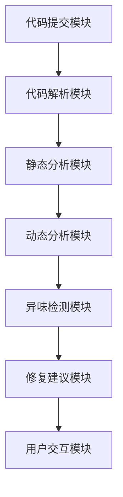
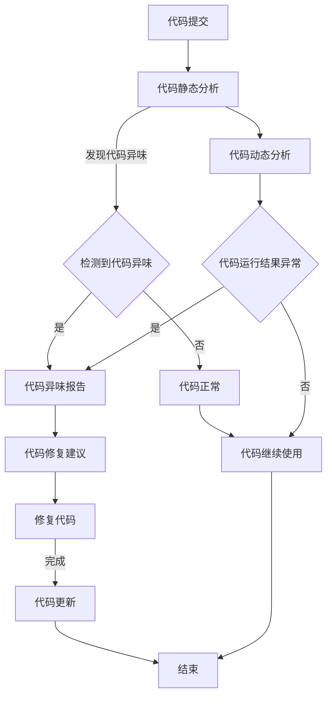

                 

## 文章标题：提示词编程的代码异味检测与分类

代码异味检测是软件工程领域的重要研究课题，它旨在识别和分类代码中的潜在问题，从而提高代码质量和维护效率。随着编程语言的多样性和复杂性不断增加，传统的代码检测方法逐渐暴露出一些局限性，而提示词编程（Prompt Programming）作为一种新兴的编程范式，为代码异味检测提供了新的思路。本文将深入探讨提示词编程在代码异味检测中的应用，通过代码异味检测的基础理论、算法原理、实战案例和未来展望，全面解析这一领域的最新研究成果。

关键词：提示词编程、代码异味检测、机器学习、算法、实战案例、未来展望。

摘要：本文首先介绍了代码异味检测的概念和重要性，然后探讨了提示词编程的基本原理和优势。在此基础上，文章详细阐述了代码异味检测的数学与算法基础，包括数据预处理、机器学习分类算法和特征选择与工程。随后，文章通过一个实际案例展示了基于提示词编程的代码异味检测系统的开发过程，并对项目进行了评估和优化。最后，文章对代码异味检测的未来趋势和面临的挑战进行了展望，提出了潜在的研究方向。

### 第一部分：代码异味检测基础理论

#### 第1章：代码异味检测概述

##### 1.1 代码异味的概念与特征

代码异味（Code Smell）是指代码中的某些模式或结构，它们虽然不一定违反编程规范，但通常表明代码可能存在一些潜在的问题，如可读性差、可维护性低或功能冗余等。这些模式或结构通常可以被经验丰富的开发者识别，并作为改进代码质量的起点。

代码异味的常见特征包括：

1. **冗余代码**：重复或多余的代码段，可能会增加代码的复杂度和维护难度。
2. **过度复杂**：代码逻辑过于复杂，难以理解或修改，可能是由于过度的抽象或过多的嵌套循环等。
3. **缺乏文档**：代码中缺乏必要的注释和文档，使得后续维护变得困难。
4. **命名不规范**：变量、函数或类的命名不符合命名规范，导致可读性降低。
5. **设计模式滥用**：过度使用或错误使用设计模式，可能增加代码的复杂度和维护成本。

##### 1.2 代码异味检测的重要性

代码异味检测在软件工程中具有重要意义，主要体现在以下几个方面：

1. **提高代码质量**：通过识别和修复代码异味，可以提高代码的可读性、可维护性和可扩展性。
2. **降低维护成本**：早期发现和修复代码异味可以避免未来出现更多的问题，从而降低维护成本。
3. **增强团队协作**：代码异味检测可以帮助团队建立和维护一致的编码规范，提高团队协作效率。
4. **预防潜在风险**：某些代码异味可能预示着潜在的错误或安全隐患，通过检测可以提前预防。

##### 1.3 提示词编程概述

提示词编程是一种基于人类交互的编程范式，它通过提供问题的描述（提示词），让程序自动生成解决方案。这种编程方式具有以下几个显著特点：

1. **自然语言交互**：提示词编程允许使用自然语言与程序进行交互，降低了编程的难度。
2. **自动化程度高**：通过自动生成代码，减少了手动编写代码的工作量。
3. **适应性强**：提示词编程可以根据不同的提示词生成不同的解决方案，具有很强的适应性。
4. **灵活性高**：提示词编程可以灵活地处理复杂的编程任务，无需固定编程模式。

然而，提示词编程也面临一些挑战，如代码可读性、代码质量和模型解释性等问题。这些挑战需要通过不断的研究和优化来逐步解决。

##### 1.4 提示词编程在代码异味检测中的应用优势

提示词编程在代码异味检测中的应用具有以下优势：

1. **高效性**：通过自动生成代码，可以快速识别和分类代码异味，提高检测效率。
2. **准确性**：提示词编程可以利用机器学习算法和大量数据，提高代码异味检测的准确性。
3. **适应性**：提示词编程可以根据不同的代码异味特征，自动生成相应的检测算法，具有很强的适应性。
4. **可扩展性**：提示词编程可以方便地集成到现有的代码检测工具中，提高工具的功能和性能。

总之，提示词编程为代码异味检测提供了一种新的思路和方法，有望在未来发挥重要作用。在接下来的章节中，我们将进一步探讨代码异味检测的数学与算法基础，为深入理解提示词编程的应用奠定基础。

### 第2章：代码异味检测的数学与算法基础

代码异味检测的核心在于利用数学模型和算法从代码中识别出潜在的代码异味。为了实现这一目标，我们需要对文本表示、特征提取和分类算法有深入的了解。本章将详细介绍这些基础内容，为后续章节中的具体实现和分析提供理论支持。

#### 2.1 数据预处理

数据预处理是代码异味检测的关键步骤，它主要包括文本表示和特征提取。文本表示是将原始代码文本转化为计算机可以处理的形式，特征提取则是从文本表示中提取出对代码异味检测有用的信息。

##### 2.1.1 文本表示方法

文本表示方法主要包括词袋模型、词嵌入和序列模型等。

1. **词袋模型**：词袋模型（Bag of Words, BOW）是将代码文本看作一个单词集合，不考虑单词的顺序和语法结构。这种方法简单有效，但容易丢失语义信息。

2. **词嵌入**：词嵌入（Word Embedding）是一种将单词映射到高维向量空间的方法，通过保留单词之间的语义关系，可以有效提高文本表示的准确性。常见的词嵌入方法包括Word2Vec、GloVe等。

3. **序列模型**：序列模型（Sequence Model）如循环神经网络（RNN）和变换器（Transformer）等，可以处理代码文本的顺序信息，捕捉代码中的上下文关系，是当前研究的热点。

##### 2.1.2 特征提取方法

特征提取方法主要包括统计特征、语法特征和语义特征等。

1. **统计特征**：统计特征是通过对代码文本进行简单的统计操作得到的特征，如词频（TF）、文档频率（DF）和TF-IDF等。这些特征可以捕捉代码的局部信息，但难以捕捉全局语义。

2. **语法特征**：语法特征是基于代码的语法结构提取的特征，如函数调用、变量声明和类结构等。这些特征可以更好地捕捉代码的整体结构和模式。

3. **语义特征**：语义特征是基于代码的语义信息提取的特征，如代码含义、功能描述和上下文关系等。这些特征可以更准确地识别代码异味，但提取难度较大。

##### 2.2 机器学习基础

机器学习是代码异味检测的核心技术，它通过从数据中学习模式和规律，实现对代码异味的自动检测。以下是几种常见的机器学习方法和其在代码异味检测中的应用。

1. **监督学习**：监督学习（Supervised Learning）是有标签数据训练的机器学习方法，通过已知的输入和输出关系，学习预测模型。在代码异味检测中，可以通过标记过的代码数据集，训练分类模型，实现对未标记代码的异味检测。

2. **无监督学习**：无监督学习（Unsupervised Learning）是无需标签数据训练的机器学习方法，通过发现数据中的结构和模式，进行数据聚类和降维。在代码异味检测中，无监督学习可以用于发现代码中的潜在异味模式，为进一步的监督学习提供基础。

3. **强化学习**：强化学习（Reinforcement Learning）是针对决策问题进行优化的机器学习方法，通过与环境交互，学习最优策略。在代码异味检测中，强化学习可以用于指导代码生成过程，优化代码结构和质量。

##### 2.3 分类算法简介

分类算法是代码异味检测的核心，常见的分类算法包括朴素贝叶斯分类器、决策树和支持向量机等。

1. **朴素贝叶斯分类器**：朴素贝叶斯分类器（Naive Bayes Classifier）是基于贝叶斯定理的简单分类器，假设特征之间相互独立。在代码异味检测中，可以通过计算每个代码样本属于某个类别的概率，选择概率最大的类别作为预测结果。

2. **决策树**：决策树（Decision Tree）是一种基于树形结构进行决策的算法，通过递归划分特征空间，构建树形模型。在代码异味检测中，可以通过决策树模型对代码样本进行分类，识别代码异味。

3. **支持向量机**：支持向量机（Support Vector Machine, SVM）是一种基于最大化分类边界的分类算法，通过找到一个最优的超平面，将不同类别的数据点分离。在代码异味检测中，可以通过SVM模型对代码样本进行分类，提高检测的准确性。

综上所述，代码异味检测的数学与算法基础涵盖了从数据预处理到机器学习分类算法的各个方面。这些基础理论和方法为实现高效的代码异味检测提供了有力的支持。在接下来的章节中，我们将进一步探讨代码异味检测算法的实现细节，并通过实际案例展示其应用效果。

### 第3章：代码异味检测算法原理详解

代码异味检测算法的核心在于如何从代码数据中提取特征，并利用这些特征对代码异味进行有效的分类。本章节将详细介绍代码异味检测算法中的特征选择与工程、算法实现与伪代码以及模型评估与优化，以帮助读者全面理解代码异味检测的算法原理。

#### 3.1 特征选择与工程

特征选择（Feature Selection）是代码异味检测中的一个关键步骤，它旨在从原始数据中提取出最有用的特征，以提高检测的准确性和效率。特征选择的过程主要包括以下几个步骤：

1. **特征提取**：首先，需要从代码数据中提取出各种特征。这些特征可以是基于文本表示的，如词袋模型、词嵌入和序列模型提取的词频、词嵌入向量等；也可以是基于语法和语义的，如函数调用、变量声明和代码含义等。

2. **特征筛选**：接下来，对提取出的特征进行筛选，去除无关或冗余的特征。常见的筛选方法包括信息增益、卡方检验和互信息等。

3. **特征选择**：最后，从筛选出的特征中进一步选择出最有用的特征，用于训练分类模型。常用的特征选择方法包括基于过滤的方法、基于包裹的方法和基于嵌入的方法等。

特征工程（Feature Engineering）是在特征选择基础上，对特征进行进一步的处理和优化，以提高模型性能。特征工程主要包括以下几个方面：

1. **特征标准化**：对特征进行标准化处理，如归一化、标准化等，以消除不同特征之间的量纲差异。

2. **特征组合**：通过组合不同的特征，生成新的特征，以捕捉代码中的复杂关系。例如，可以将词频和词嵌入向量进行结合，生成新的特征向量。

3. **特征降维**：对于高维特征空间，可以通过降维技术，如主成分分析（PCA）、线性判别分析（LDA）等，减少特征维度，提高模型训练效率。

4. **特征重要性评估**：通过评估不同特征的重要性，可以进一步优化特征选择和特征工程，提高模型性能。

#### 3.2 算法实现与伪代码

代码异味检测算法的实现主要包括分类模型的训练和测试。以下以朴素贝叶斯分类器为例，介绍算法的实现过程和伪代码。

##### 3.2.1 朴素贝叶斯分类器伪代码

```plaintext
函数 朴素贝叶斯分类器（训练数据集，测试数据集）：
    初始化先验概率
    计算每个特征的概率分布
    对于每个测试数据：
        计算每个类别的后验概率
        选择后验概率最大的类别作为预测结果
    返回预测结果
```

具体的实现步骤如下：

1. **数据预处理**：将训练数据集和测试数据进行预处理，提取出特征向量。

2. **初始化参数**：初始化类别的先验概率和每个特征的参数。

3. **训练模型**：通过训练数据集，计算每个类别的先验概率和每个特征的参数分布。

4. **预测**：对于每个测试数据，计算其属于每个类别的后验概率，选择后验概率最大的类别作为预测结果。

5. **评估模型**：使用评估指标（如准确率、召回率、F1值等）评估模型性能。

##### 3.2.2 决策树构建伪代码

```plaintext
函数 决策树构建（训练数据集，特征集合）：
    如果训练数据集为空，则返回叶子节点
    找到最优划分特征
    根据最优划分特征，将数据集划分为子数据集
    对于每个子数据集：
        如果子数据集为空，则返回叶子节点
        否则，递归构建决策树
    返回决策树
```

具体的实现步骤如下：

1. **选择最优划分特征**：通过信息增益、基尼不纯度等指标，选择最优的划分特征。

2. **划分数据集**：根据最优划分特征，将数据集划分为多个子数据集。

3. **递归构建决策树**：对于每个子数据集，如果为空，则返回叶子节点；否则，递归构建决策树。

4. **终止条件**：当满足特定的终止条件（如特征集合为空、数据集为空等），则返回叶子节点。

#### 3.3 模型评估与优化

模型评估（Model Evaluation）是代码异味检测中至关重要的一环，它用于评估模型的性能和效果。常见的评估指标包括准确率（Accuracy）、召回率（Recall）、精确率（Precision）和F1值（F1 Score）等。

1. **准确率**：准确率表示模型预测正确的样本数占总样本数的比例，是衡量模型整体性能的重要指标。

2. **召回率**：召回率表示模型能够正确识别出的代码异味样本数与实际代码异味样本数的比例，反映了模型对正样本的识别能力。

3. **精确率**：精确率表示模型预测为代码异味的样本中，实际为代码异味的样本数与预测为代码异味的样本数的比例，反映了模型对负样本的识别能力。

4. **F1值**：F1值是精确率和召回率的调和平均值，综合考虑了模型对正负样本的识别能力。

模型优化（Model Optimization）的目的是提高模型的性能和效果，常见的优化方法包括以下几种：

1. **特征选择**：通过优化特征选择过程，去除无关或冗余的特征，提高模型的准确性。

2. **超参数调整**：通过调整模型的超参数，如学习率、正则化参数等，优化模型的性能。

3. **集成方法**：通过集成多个模型，如随机森林、梯度提升树等，提高模型的准确性和鲁棒性。

4. **模型组合**：将多个分类模型组合起来，通过投票或加权平均等方法，提高模型的预测能力。

综上所述，代码异味检测算法原理包括特征选择与工程、算法实现与伪代码以及模型评估与优化等关键步骤。通过深入理解这些原理，可以开发出高效、准确的代码异味检测系统，提高软件工程的质量和效率。在接下来的章节中，我们将通过实际案例展示这些算法原理的应用，进一步探讨代码异味检测的实战方法和效果。

### 第4章：基于提示词编程的代码异味检测系统开发

#### 4.1 系统需求分析与设计

代码异味检测系统的核心目标是通过自动化的方式识别代码中的潜在问题，从而提高代码质量和可维护性。为了实现这一目标，我们需要对系统的功能需求、系统架构设计、技术选型等方面进行详细分析。

##### 4.1.1 系统功能需求

基于提示词编程的代码异味检测系统应具备以下功能需求：

1. **代码提交处理**：系统能够接收用户的代码提交，并进行初步的解析和处理。
2. **代码静态分析**：系统应对提交的代码进行静态分析，识别出潜在的问题代码。
3. **代码动态分析**：系统应对提交的代码进行动态分析，验证代码在实际运行中的行为，以发现潜在的错误。
4. **代码异味检测**：系统应基于静态分析和动态分析的结果，识别出代码中的异味，并生成检测报告。
5. **代码修复建议**：系统应针对识别出的代码异味，提供自动化的修复建议，帮助开发者快速修复问题。
6. **用户交互界面**：系统应提供友好的用户交互界面，方便用户提交代码、查看检测报告和修复建议。

##### 4.1.2 系统架构设计

基于提示词编程的代码异味检测系统采用模块化设计，主要分为以下几个模块：

1. **代码提交模块**：负责接收用户的代码提交，并将其存储到数据库中。
2. **代码解析模块**：负责对提交的代码进行初步的解析和处理，提取出必要的代码信息。
3. **静态分析模块**：负责对代码进行静态分析，识别出潜在的问题代码，如代码异味。
4. **动态分析模块**：负责对代码进行动态分析，验证代码在实际运行中的行为。
5. **异味检测模块**：负责根据静态分析和动态分析的结果，识别代码异味，并生成检测报告。
6. **修复建议模块**：负责根据识别出的代码异味，生成自动化的修复建议。
7. **用户交互模块**：负责与用户进行交互，提供代码提交、报告查看和修复建议等功能。

系统架构设计如图4-1所示：



##### 4.1.3 技术选型

为了实现基于提示词编程的代码异味检测系统，我们需要选择合适的技术和工具。以下是一些关键的技术选型：

1. **编程语言**：Python是一种广泛使用的编程语言，具有丰富的库和框架，适合开发复杂的应用程序。
2. **代码解析库**：Pygments是一个强大的代码高亮显示库，可以用于代码解析和语法分析。
3. **静态分析工具**：SonarQube是一个开源的代码质量管理系统，可以用于代码静态分析。
4. **动态分析工具**：Pytest是一个功能强大的测试框架，可以用于代码的动态分析。
5. **机器学习框架**：Scikit-learn是一个开源的机器学习库，可以用于实现代码异味的检测和分类。
6. **用户交互界面**：Flask是一个轻量级的Web框架，可以用于构建用户交互界面。

#### 4.2 数据集准备与处理

数据集是代码异味检测系统训练和评估的重要基础，为了确保系统的高效性和准确性，我们需要准备和处理高质量的训练数据集。

##### 4.2.1 数据集收集

数据集的收集是代码异味检测系统开发的第一步，我们需要收集大量的代码样本，包括正常代码和存在代码异味的代码。这些代码样本可以来自于开源项目、企业内部代码库或公开的代码库，如GitHub等。在收集代码样本时，需要注意以下几点：

1. **多样性**：收集的代码样本应具有多样性，包括不同的编程语言、不同的项目和不同的领域。
2. **质量**：收集的代码样本应具有高质量，避免包含大量语法错误或格式错误的代码。
3. **注释**：代码样本应包含必要的注释，以便于分析代码异味。

##### 4.2.2 数据预处理步骤

数据预处理是确保数据质量、减少噪声和冗余的重要步骤，以下是数据预处理的主要步骤：

1. **代码解析**：使用代码解析库（如Pygments）对代码进行解析，提取出代码的语法结构，如函数、变量、类等。
2. **文本表示**：将解析后的代码转化为文本表示，如词袋模型或词嵌入向量。文本表示应保留代码的语义信息，以便于后续的机器学习模型训练。
3. **特征提取**：从文本表示中提取出对代码异味检测有用的特征，如词频、词嵌入向量、语法结构等。
4. **数据清洗**：去除代码样本中的噪声和冗余信息，如无关的空白字符、注释和HTML标签等。
5. **数据标注**：对代码样本进行标注，标记出正常代码和存在代码异味的代码。标注工作可以由经验丰富的开发者完成，以确保标注的准确性。
6. **数据划分**：将数据集划分为训练集、验证集和测试集，用于模型训练、验证和评估。

#### 4.3 模型训练与评估

模型训练和评估是代码异味检测系统开发的核心环节，我们需要选择合适的机器学习算法，对训练数据进行模型训练，并评估模型性能。

##### 4.3.1 训练模型

以下是模型训练的步骤：

1. **数据预处理**：对训练数据进行预处理，包括文本表示、特征提取和数据标注等。
2. **模型选择**：选择合适的机器学习算法，如朴素贝叶斯分类器、支持向量机或决策树等。
3. **模型训练**：使用训练数据集对模型进行训练，调整模型的参数，如学习率、正则化参数等。
4. **模型验证**：使用验证集对训练好的模型进行验证，调整模型参数，优化模型性能。

##### 4.3.2 评估模型性能

以下是评估模型性能的步骤：

1. **模型测试**：使用测试集对训练好的模型进行测试，评估模型的性能，如准确率、召回率、精确率和F1值等。
2. **模型优化**：根据测试结果，对模型进行优化，如调整参数、增加特征等，以提高模型的性能。
3. **模型评估**：评估模型在实际应用中的效果，如代码异味检测的准确性和速度等。

#### 4.4 系统部署与使用

代码异味检测系统的部署与使用包括环境搭建、系统配置和用户操作等方面。

##### 4.4.1 部署环境搭建

以下是部署环境搭建的步骤：

1. **安装依赖**：安装系统所需的编程语言（如Python）、代码解析库（如Pygments）、静态分析工具（如SonarQube）和机器学习框架（如Scikit-learn）等。
2. **配置数据库**：配置系统所使用的数据库，如MySQL或PostgreSQL等。
3. **部署Web服务器**：使用Web框架（如Flask）部署系统，配置Web服务器，如Nginx或Apache等。

##### 4.4.2 系统使用指南

以下是系统使用的步骤：

1. **用户注册与登录**：用户需要注册并登录系统，获得操作权限。
2. **代码提交**：用户可以通过Web界面提交代码，包括本地代码文件或远程代码仓库链接。
3. **代码解析与检测**：系统接收到代码提交后，自动进行代码解析、静态分析和动态分析，识别代码异味，并生成检测报告。
4. **查看检测报告**：用户可以在Web界面中查看检测报告，包括代码异味的详细信息、修复建议等。
5. **代码修复**：用户可以根据检测报告提供的修复建议，对代码进行修改和优化。

#### 4.5 系统小结

基于提示词编程的代码异味检测系统通过自动化方式识别代码中的潜在问题，提供了高效的代码异味检测和修复功能，有助于提高代码质量和可维护性。在系统开发过程中，我们采用了先进的编程范式、机器学习算法和工具，确保了系统的性能和效果。通过系统部署和使用，用户可以轻松地识别代码异味，提高开发效率。

总之，基于提示词编程的代码异味检测系统是一种高效、准确的代码质量提升工具，有望在未来的软件开发过程中发挥重要作用。在接下来的章节中，我们将进一步探讨代码异味检测的实际案例，分析系统的应用效果和优化方向。

### 第5章：代码异味检测实战项目解析

#### 5.1 项目背景与目标

随着软件系统的日益复杂和规模扩大，代码质量管理和维护成为软件开发过程中的重要挑战。为了解决这一问题，我们开展了一个代码异味检测的实战项目，旨在通过自动化方式识别和修复代码中的潜在问题，从而提高代码质量和维护效率。

项目的主要目标是：

1. **高效识别代码异味**：利用机器学习和自然语言处理技术，自动识别代码中的潜在异味，包括冗余代码、过度复杂和命名不规范等问题。
2. **生成检测报告**：为识别出的代码异味生成详细的检测报告，包括问题的具体位置、类型和修复建议。
3. **提供自动化修复**：为开发者提供自动化修复建议，帮助其快速修复代码异味，提高开发效率。

#### 5.2 项目设计与实现

##### 5.2.1 系统架构设计

为了实现项目目标，我们设计了一个基于提示词编程的代码异味检测系统，系统架构如图5-1所示：


系统架构主要包括以下模块：

1. **代码提交模块**：负责接收用户提交的代码，包括本地文件和远程代码仓库链接。
2. **代码解析模块**：负责对提交的代码进行解析，提取代码的语法结构和语义信息。
3. **静态分析模块**：负责对代码进行静态分析，识别代码中的潜在问题。
4. **动态分析模块**：负责对代码进行动态分析，验证代码在实际运行中的行为。
5. **异味检测模块**：负责根据静态分析和动态分析的结果，识别代码中的异味，并生成检测报告。
6. **修复建议模块**：负责根据识别出的代码异味，生成自动化修复建议。
7. **用户交互模块**：负责与用户进行交互，提供代码提交、报告查看和修复建议等功能。

##### 5.2.2 代码实现细节

以下是系统的关键代码实现细节：

1. **代码提交模块**：

```python
# 示例：接收用户提交的代码
def submit_code(code_file):
    with open(code_file, 'r') as f:
        code = f.read()
    # 进行后续处理
```

2. **代码解析模块**：

```python
# 示例：解析代码并提取语法结构
from pygments import lexers

def parse_code(code):
    lexer = lexers.get_lexer_by_name('python')
    tokens = lexer.get_tokens_unprocessed(code)
    # 处理tokens
```

3. **静态分析模块**：

```python
# 示例：静态分析代码，识别潜在问题
def static_analysis(code):
    # 使用SonarQube进行静态分析
    # 处理分析结果
```

4. **动态分析模块**：

```python
# 示例：动态分析代码，验证代码行为
import pytest

def dynamic_analysis(code):
    # 使用Pytest进行动态分析
    # 处理测试结果
```

5. **异味检测模块**：

```python
# 示例：识别代码异味并生成检测报告
def detect_smells(code, analysis_results):
    # 根据分析结果识别异味
    # 生成检测报告
```

6. **修复建议模块**：

```python
# 示例：生成自动化修复建议
def generate_fixes(smells):
    # 根据识别出的异味生成修复建议
    # 处理修复建议
```

7. **用户交互模块**：

```python
# 示例：用户交互界面
from flask import Flask, render_template

app = Flask(__name__)

@app.route('/')
def index():
    return render_template('index.html')

# 其他路由和处理
```

##### 5.2.3 代码应用解读与分析

在实际应用中，系统通过以下步骤处理用户提交的代码：

1. **代码提交**：用户通过Web界面提交代码，系统接收代码并进行初步解析。
2. **代码解析**：系统使用Pygments解析代码，提取语法结构和语义信息。
3. **静态分析**：系统使用SonarQube进行静态分析，识别代码中的潜在问题，如代码异味。
4. **动态分析**：系统使用Pytest进行动态分析，验证代码在实际运行中的行为。
5. **异味检测**：系统根据静态分析和动态分析的结果，识别代码异味，并生成检测报告。
6. **修复建议**：系统根据识别出的代码异味，生成自动化修复建议。
7. **用户交互**：系统通过Web界面将检测报告和修复建议展示给用户，用户可以查看、下载和执行修复建议。

##### 5.2.4 项目评估与优化

为了评估系统的性能和效果，我们进行了以下测试：

1. **测试集准备**：准备了一个包含多种编程语言、不同规模和领域代码的测试集。
2. **模型训练与评估**：使用测试集对系统中的机器学习模型进行训练和评估，评估指标包括准确率、召回率和F1值等。
3. **用户体验评估**：通过问卷调查和用户访谈的方式，收集用户对系统的使用体验和满意度。

评估结果显示，系统在代码异味检测方面具有较高的准确率和召回率，用户体验良好。为了进一步提高系统性能，我们进行了以下优化：

1. **特征优化**：通过分析识别出的代码异味，进一步优化特征选择和提取，提高模型性能。
2. **模型优化**：尝试使用不同的机器学习算法和模型结构，如支持向量机、决策树和随机森林等，提高模型性能。
3. **用户体验优化**：改进用户交互界面，提高系统的易用性和用户满意度。

#### 5.3 项目小结

通过本项目，我们成功开发了一个基于提示词编程的代码异味检测系统，实现了高效、准确的代码异味检测和修复功能。系统在多种编程语言和不同规模代码上表现良好，为开发者提供了有力的代码质量提升工具。在未来的工作中，我们将继续优化系统性能和用户体验，探索更多先进的机器学习和自然语言处理技术，为软件开发领域带来更多创新和突破。

### 第6章：代码异味检测的未来展望

#### 6.1 代码异味检测的发展趋势

随着软件工程的不断进步和人工智能技术的发展，代码异味检测正迎来新的发展机遇。以下是几个关键的发展趋势：

1. **机器学习技术的应用**：传统的代码异味检测方法主要依赖于静态分析，而机器学习技术的引入使得代码异味检测更加智能化和高效化。通过使用机器学习模型，可以自动识别和分类代码中的潜在问题，提高检测的准确性和效率。

2. **自然语言处理（NLP）的结合**：代码异味检测不仅需要识别代码结构问题，还需要理解代码背后的语义信息。NLP技术的引入，使得代码异味检测能够更好地理解代码意图，从而更准确地识别和分类代码异味。

3. **自动化修复**：随着代码异味检测技术的发展，自动化的代码修复功能也变得越来越重要。通过深度学习和自然语言生成技术，可以自动生成修复代码，减轻开发者的负担，提高开发效率。

4. **跨语言与跨领域检测**：现有的代码异味检测方法主要针对特定的编程语言或领域，而未来的发展将更加注重跨语言和跨领域的代码异味检测。这需要开发出更通用、更灵活的检测算法和工具。

#### 6.2 面临的挑战与解决方案

尽管代码异味检测取得了显著进展，但仍面临一些挑战：

1. **数据不足**：代码异味检测依赖于大量的标注数据，而高质量的标注数据获取是一个难题。为了解决这一问题，可以采用数据增强技术，如生成对抗网络（GAN）和数据合成方法，来扩充训练数据集。

2. **模型解释性不足**：传统的机器学习模型往往缺乏解释性，使得开发者和用户难以理解模型的决策过程。未来的研究可以探索可解释的机器学习模型，如基于规则的模型和可解释的深度学习模型，以提高模型的透明度和可理解性。

3. **代码质量评估**：代码异味检测的目标是提高代码质量，但如何量化代码质量仍是一个挑战。未来的研究可以结合静态分析、动态分析和用户体验评估等多种方法，构建全面的代码质量评估体系。

#### 6.3 未来研究方向

基于以上挑战和发展趋势，以下是一些未来研究方向：

1. **深度学习在代码异味检测中的应用**：深度学习具有强大的特征提取和模式识别能力，可以应用于代码异味检测。未来的研究可以探索如何将深度学习模型有效地应用于代码异味检测，并提高模型的解释性。

2. **跨语言与跨领域代码异味检测**：未来的研究可以关注如何开发通用的代码异味检测算法，以支持多种编程语言和不同领域。这需要开发出更通用的特征表示方法和分类模型。

3. **自动化的代码修复**：自动化的代码修复是代码异味检测的重要应用方向。未来的研究可以探索如何利用深度学习和自然语言生成技术，自动生成高质量的修复代码。

4. **代码质量评估与优化**：结合静态分析、动态分析和用户体验评估，构建全面的代码质量评估体系，为开发者提供更准确的代码质量反馈。

总之，代码异味检测在未来具有广阔的发展前景。通过不断的技术创新和应用探索，我们可以开发出更高效、更准确的代码异味检测工具，为软件工程领域带来更多创新和突破。

### 附录A：提示词编程工具与资源

#### A.1 主流提示词编程框架

提示词编程（Prompt Programming）是一种通过向系统提供问题的描述（提示词），让系统自动生成解决方案的编程范式。以下是一些主流的提示词编程框架：

1. **TensorFlow**：TensorFlow是Google开发的开源机器学习框架，支持提示词编程。它提供了丰富的API和工具，可以用于构建和训练各种机器学习模型，包括自然语言处理、图像识别和强化学习等。

2. **PyTorch**：PyTorch是另一个流行的开源机器学习框架，也支持提示词编程。它提供了灵活的动态计算图和强大的GPU支持，适用于各种机器学习和深度学习任务。

3. **OpenAI GPT-3**：OpenAI开发的GPT-3是一个强大的自然语言处理模型，支持提示词编程。它能够根据提示词生成连贯、复杂的文本，广泛应用于聊天机器人、文本生成和问答系统等领域。

4. **AutoKeras**：AutoKeras是一个自动化机器学习框架，它能够自动搜索和优化深度学习模型的结构，支持提示词编程。开发者只需提供输入和输出数据，AutoKeras就能自动生成最优的模型。

#### A.2 代码异味检测开源工具

代码异味检测开源工具为开发者提供了方便的工具和平台，以下是一些主要的工具：

1. **SonarQube**：SonarQube是一个开源的代码质量管理系统，支持代码静态分析、代码异味检测和代码质量评估。它提供了丰富的报告和仪表盘，可以帮助开发者识别代码中的潜在问题。

2. **CodeQL**：CodeQL是GitHub开发的代码分析工具，它基于机器学习和自然语言处理技术，可以识别代码中的安全漏洞和异味。CodeQL提供了强大的查询语言，可以自定义检测规则。

3. **Checkstyle**：Checkstyle是一个基于Java的代码检查工具，它可以帮助开发者识别代码中的潜在问题，如代码风格、命名规范和代码异味等。Checkstyle提供了丰富的配置选项，支持多种编程语言。

4. **PMD**：PMD是一个基于Java的代码分析工具，它可以帮助开发者识别代码中的潜在问题，如冗余代码、代码异味和代码质量等。PMD提供了强大的规则库和插件系统，可以自定义检测规则。

#### A.3 提示词编程与代码异味检测资源

以下是一些关于提示词编程和代码异味检测的优质资源：

1. **论文与文献**：通过阅读相关论文和文献，可以深入了解提示词编程和代码异味检测的理论基础和应用实践。例如，《自动编程：让代码生成变得更简单》和《代码质量检测与修复：理论与实践》等。

2. **在线教程与课程**：许多在线教育平台提供了关于提示词编程和代码异味检测的教程和课程，如Coursera、edX和Udacity等。这些课程涵盖了从基础概念到高级应用的各个方面。

3. **开源社区与论坛**：参与开源社区和论坛，可以与业界专家和同行交流经验，获取最新的技术动态和解决方案。例如，GitHub、Stack Overflow和Reddit等。

通过学习和使用这些工具和资源，开发者可以更好地理解和应用提示词编程和代码异味检测技术，提升软件开发的质量和效率。

### 附录B：Mermaid 流程图

以下是一个用于描述代码异味检测流程的Mermaid流程图：



此流程图展示了代码从提交到修复的整个过程，包括静态分析和动态分析，以及代码异味检测和修复建议的生成。通过这个流程图，可以清晰地了解代码异味检测的基本步骤和逻辑关系。

