                 

### 文章标题

### 关键词

### 摘要

本文将深入探讨提示词编程的协作开发模式，解析其基础概念、应用场景、协作开发、安全与隐私、性能优化以及未来发展趋势。通过逐步分析推理，我们将从多个角度理解提示词编程的核心原理和实现方法，结合实际项目案例，展示如何高效地进行提示词编程，并在协作开发过程中处理各种挑战。

---

#### 第一部分：提示词编程的协作开发模式概述

提示词编程是一种通过提示词引导程序执行的方式，其核心在于利用提示词与响应的交互实现复杂任务的自动化处理。本文将从基础概念、应用场景、协作开发、安全与隐私、性能优化以及未来发展趋势等多个方面进行深入探讨。

#### 第1章：提示词编程基础

**核心概念与联系**

提示词编程的基础概念包括提示词、响应和反馈。提示词是程序的输入，响应是程序对提示词的处理结果，反馈是用户对响应的反馈。这三个概念之间紧密联系，构成了提示词编程的核心交互模型。

- **提示词**：用户输入的文本或命令，用于指导程序执行特定任务。
- **响应**：程序对提示词的处理结果，可以是输出文本、执行操作等。
- **反馈**：用户对响应的回应，用于调整提示词，优化程序执行效果。

为了更好地理解这些概念之间的联系，我们可以使用Mermaid流程图来描述提示词编程的工作流程。流程图包括以下几个步骤：

1. **用户输入提示词**：用户通过界面或其他方式输入提示词。
2. **程序解析提示词**：程序接收提示词并进行分析，确定执行任务。
3. **程序执行任务**：程序根据提示词执行相应任务，产生响应。
4. **用户接收响应**：用户接收程序生成的响应，并进行反馈。
5. **用户调整提示词**：根据响应和反馈，用户调整提示词，以优化程序执行效果。

**核心算法原理讲解**

提示词编程的算法核心在于提示词生成和调优。以下是一个基本的伪代码，描述了提示词生成算法的基本逻辑：

```plaintext
函数 提示词生成（用户输入）：
  1. 解析用户输入的提示词
  2. 根据历史数据和模型预测，生成可能的响应
  3. 对响应进行筛选和排序，选择最优响应
  4. 返回最优响应作为程序执行的结果
```

为了更直观地理解算法流程，我们可以使用Mermaid流程图来描述：

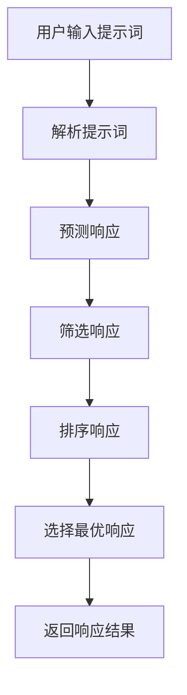

**数学模型和数学公式**

提示词生成算法中，常常会使用期望最大化（Expectation-Maximization, EM）算法来进行参数估计。以下是EM算法的latex格式数学公式：

$$
\theta_{k+1} = \arg\max_{\theta} L(\theta; X)
$$

其中，$L(\theta; X)$ 表示似然函数，$\theta$ 表示模型参数，$X$ 表示输入数据。

此外，评分函数也是提示词编程中常用的一种数学模型。评分函数用于评估提示词与响应之间的匹配程度。以下是评分函数的latex格式数学公式：

$$
s(w, x) = \sum_{i=1}^n w_i \cdot x_i
$$

其中，$w$ 表示权重向量，$x$ 表示特征向量。

**项目实战**

为了更好地理解提示词编程的基础概念和算法原理，我们可以通过一个简单的项目来实践。以下是一个基于朴素贝叶斯算法的简单提示词生成器的代码实现：

```python
import numpy as np

# 假设我们已经有一个训练好的朴素贝叶斯分类器
classifier = ... 

def generate_hint(user_input):
    # 解析用户输入的提示词
    parsed_input = preprocess_input(user_input)
    
    # 使用朴素贝叶斯分类器预测响应
    probabilities = classifier.predict_proba([parsed_input])
    
    # 选择概率最高的响应作为提示词
    hint = np.argmax(probabilities)
    
    return hint

# 代码解读与分析
# 本示例中，我们使用朴素贝叶斯分类器来预测用户输入的提示词。首先，我们解析用户输入，将其转换为特征向量。然后，使用训练好的分类器预测响应，并选择概率最高的响应作为提示词。这个简单实现展示了提示词生成的基本流程和算法原理。

**注意事项**

在实现提示词生成器时，我们需要注意以下几点：

1. **特征提取**：解析用户输入并提取特征，是提示词生成的重要步骤。特征提取的质量直接影响到提示词生成器的性能。
2. **分类器选择**：朴素贝叶斯是一种简单且有效的分类器，但可能无法处理复杂的问题。在实际应用中，可以根据需求选择其他更复杂的分类器。
3. **性能评估**：在开发提示词生成器时，我们需要对模型进行性能评估，以确保其能够生成高质量的提示词。常用的评估指标包括准确率、召回率和F1分数等。

通过这个简单的项目实战，我们可以更好地理解提示词编程的基础概念和算法原理。在实际应用中，提示词编程可以用于各种场景，如自然语言处理、推荐系统和人机对话等。

---

#### 第2章：提示词编程的应用场景

提示词编程作为一种高效的任务自动化工具，在多个应用场景中都有着广泛的应用。本节将介绍提示词编程在不同领域的具体应用，包括自然语言处理、推荐系统和人机对话等。

**核心概念与联系**

在自然语言处理（Natural Language Processing, NLP）领域，提示词编程可以用于文本分类、情感分析、命名实体识别等任务。例如，在文本分类任务中，用户可以输入一篇文档，提示词生成器会根据文档内容生成标签，以便对文档进行分类。

- **文本分类**：用户输入文本，提示词生成器生成分类标签。
- **情感分析**：用户输入文本，提示词生成器判断文本的情感倾向。
- **命名实体识别**：用户输入文本，提示词生成器识别文本中的命名实体。

在推荐系统（Recommender System）中，提示词编程可以用于生成个性化推荐列表。用户可以根据自己的兴趣和偏好，输入提示词，提示词生成器会根据用户的兴趣标签生成推荐列表。

- **个性化推荐**：用户输入兴趣标签，提示词生成器生成个性化推荐列表。
- **内容匹配**：用户输入关键词，提示词生成器匹配相关内容。

在人机对话（Human-Computer Conversation）系统中，提示词编程可以用于生成对话策略，使对话系统能够与用户进行自然、流畅的交互。

- **对话生成**：用户输入问题，提示词生成器生成回答。
- **意图识别**：用户输入指令，提示词生成器识别用户意图。

为了更直观地展示提示词编程在不同应用场景中的流程，我们可以使用Mermaid流程图来描述：

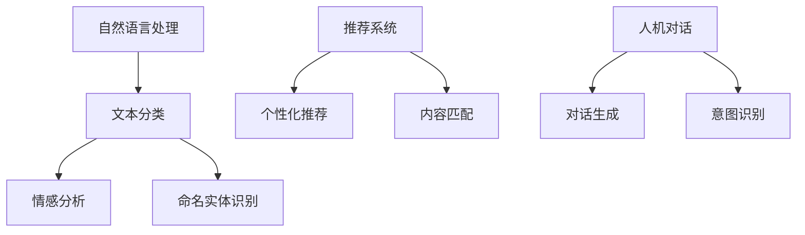

**核心算法原理讲解**

在自然语言处理领域，提示词编程的核心算法通常涉及深度学习模型。以下是一个基于深度学习的提示词生成算法的伪代码：

```plaintext
函数 提示词生成（用户输入，模型参数）：
  1. 解析用户输入的提示词
  2. 使用嵌入层将提示词转换为向量表示
  3. 输入深度学习模型进行预测
  4. 从模型输出中选择概率最高的响应作为提示词
  5. 返回提示词
```

为了更直观地理解算法流程，我们可以使用Mermaid流程图来描述：

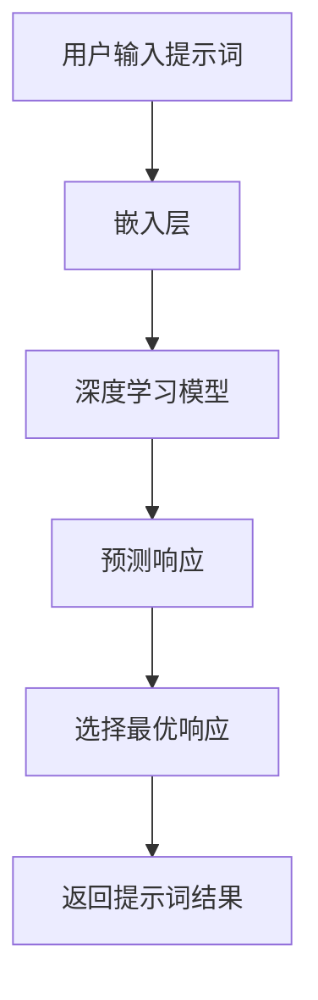

在推荐系统中，提示词编程的核心算法通常涉及协同过滤（Collaborative Filtering）和矩阵分解（Matrix Factorization）。以下是一个基于协同过滤算法的提示词生成算法的伪代码：

```plaintext
函数 提示词生成（用户输入，历史数据）：
  1. 解析用户输入的提示词
  2. 计算用户与其他用户的相似度
  3. 使用相似度矩阵进行预测
  4. 从预测结果中选择概率最高的提示词
  5. 返回提示词
```

为了更直观地理解算法流程，我们可以使用Mermaid流程图来描述：

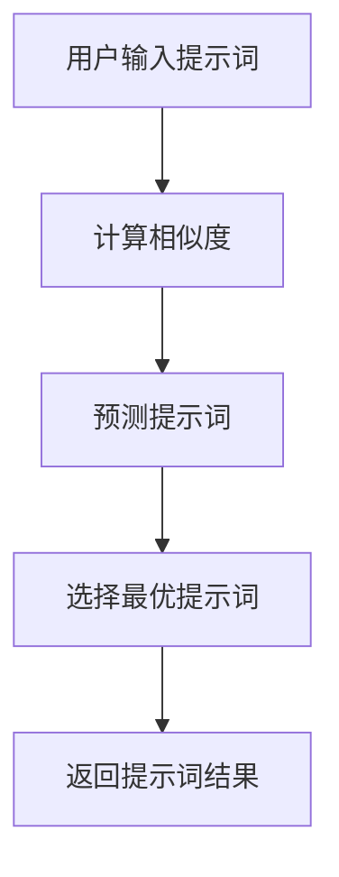

**数学模型和数学公式**

在深度学习领域，提示词生成算法通常涉及复杂的数学模型。以下是一个生成对抗网络（Generative Adversarial Network, GAN）的损失函数的latex格式数学公式：

$$
\mathcal{L}(G, D) = \mathbb{E}_{x \sim p_{\text{data}}(x)}[\log D(x)] - \mathbb{E}_{z \sim p_{\mu}(z)}[\log (1 - D(G(z)))]
$$

其中，$G$ 表示生成器，$D$ 表示判别器，$x$ 表示真实数据，$z$ 表示生成器的输入噪声，$p_{\text{data}}(x)$ 表示数据分布，$p_{\mu}(z)$ 表示噪声分布。

在协同过滤领域，提示词生成算法通常涉及矩阵分解。以下是一个基于矩阵分解的协同过滤算法的数学模型：

$$
R_{ij} = \hat{r}_{i} \odot \hat{r}_{j}
$$

其中，$R$ 表示评分矩阵，$\hat{r}_{i}$ 和 $\hat{r}_{j}$ 分别表示用户 $i$ 和用户 $j$ 的特征向量。

**项目实战**

为了更好地理解提示词编程在不同应用场景中的实现方法，我们可以通过以下项目进行实战。

**项目1：基于深度学习的文本分类提示词生成器**

在本项目中，我们将使用深度学习模型实现一个文本分类提示词生成器。首先，我们需要准备训练数据集，包括文本和对应的分类标签。然后，我们可以使用预训练的词向量模型（如Word2Vec或GloVe）将文本转换为向量表示。接下来，我们将使用一个基于卷积神经网络（Convolutional Neural Network, CNN）或循环神经网络（Recurrent Neural Network, RNN）的分类模型进行训练。最后，我们可以使用训练好的模型生成提示词，并根据分类标签进行分类。

**项目2：基于协同过滤的个性化推荐提示词生成器**

在本项目中，我们将使用协同过滤算法实现一个个性化推荐提示词生成器。首先，我们需要准备用户和物品的交互数据集。然后，我们可以使用矩阵分解方法（如Singular Value Decomposition, SVD）对评分矩阵进行分解，得到用户和物品的特征向量。接下来，我们可以计算用户之间的相似度，并根据相似度生成推荐列表。最后，我们可以使用生成对抗网络（GAN）或其他生成模型生成个性化的提示词。

**项目实战：代码实现和解析**

以下是基于深度学习的文本分类提示词生成器的Python代码实现：

```python
import tensorflow as tf
from tensorflow.keras.models import Sequential
from tensorflow.keras.layers import Embedding, Conv1D, MaxPooling1D, Flatten, Dense

# 准备训练数据集
# 数据集包括文本和分类标签
texts = ['这是文本1', '这是文本2', '这是文本3']
labels = [0, 1, 0]

# 将文本转换为向量表示
# 使用预训练的词向量模型
word_vectors = ... 
embeddings = tf.keras.layers.Embedding(input_dim=10000, output_dim=64)(text)

# 构建深度学习模型
model = Sequential([
    Embedding(input_dim=10000, output_dim=64),
    Conv1D(filters=64, kernel_size=3, activation='relu'),
    MaxPooling1D(pool_size=2),
    Flatten(),
    Dense(units=64, activation='relu'),
    Dense(units=1, activation='sigmoid')
])

# 编译模型
model.compile(optimizer='adam', loss='binary_crossentropy', metrics=['accuracy'])

# 训练模型
model.fit(texts, labels, epochs=10)

# 使用训练好的模型生成提示词
def generate_hint(text):
    # 将文本转换为向量表示
    text_vector = ... 
    # 预测分类标签
    label = model.predict([text_vector])
    # 根据分类标签生成提示词
    if label[0] == 0:
        return '这是一个负面文本'
    else:
        return '这是一个正面文本'

# 测试提示词生成器
text = '这是测试文本'
hint = generate_hint(text)
print(hint)
```

通过以上代码实现，我们可以实现一个基于深度学习的文本分类提示词生成器。这个项目展示了如何使用深度学习模型进行文本分类，并生成高质量的提示词。

**注意事项**

在实现提示词生成器时，我们需要注意以下几点：

1. **数据预处理**：确保训练数据集的质量和多样性，有助于提高提示词生成器的性能。
2. **模型选择**：根据具体任务需求选择合适的模型结构，如卷积神经网络（CNN）或循环神经网络（RNN）。
3. **超参数调优**：通过调整模型的超参数，如学习率、批次大小和迭代次数等，以提高模型性能。
4. **性能评估**：使用准确率、召回率和F1分数等指标评估模型的性能，以便进行进一步优化。

通过以上项目实战，我们可以更好地理解提示词编程在不同应用场景中的实现方法。在实际应用中，提示词编程可以用于各种任务，为开发者提供强大的自动化工具。

---

#### 第3章：提示词编程的协作开发

在大型项目中，提示词编程的协作开发变得尤为重要。多个开发者需要协同工作，共同完成复杂的任务。本节将介绍提示词编程的协作开发模式，包括版本控制、代码审查和最佳实践。

**核心概念与联系**

提示词编程的协作开发涉及多个核心概念，包括版本控制、代码审查和多人协作。这些概念相互关联，共同构成了高效的协作开发流程。

- **版本控制**：用于管理代码版本的系统，如Git，确保代码的版本一致性。
- **代码审查**：开发者之间相互审查代码，确保代码的质量和一致性。
- **多人协作**：多个开发者同时工作，共同完成项目任务。

为了更好地理解这些概念之间的联系，我们可以使用Mermaid流程图来描述提示词编程的协作开发流程。流程图包括以下几个步骤：

1. **开发者A提交代码**：开发者A在本地环境中修改代码并提交到版本控制系统。
2. **开发者B拉取代码**：开发者B从版本控制系统拉取最新的代码。
3. **开发者B审查代码**：开发者B审查开发者A提交的代码，确保代码的质量和一致性。
4. **开发者A修复代码**：开发者A根据审查意见修复代码。
5. **开发者A重新提交代码**：开发者A重新提交修复后的代码。
6. **循环迭代**：开发者B再次审查代码，直至代码符合要求。

以下是Mermaid流程图的描述：

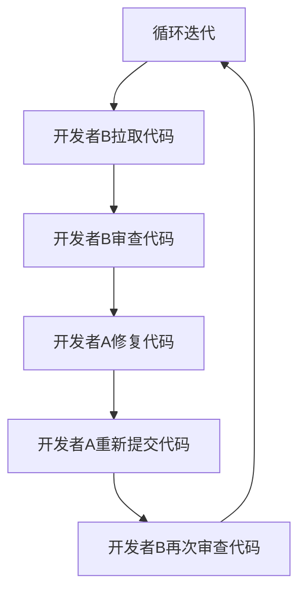

**核心算法原理讲解**

提示词编程的协作开发中，协同过滤（Collaborative Filtering）算法是一种常用的算法，用于计算开发者之间的相似度。以下是一个基于协同过滤算法的相似度计算伪代码：

```plaintext
函数 相似度计算（开发者A，开发者B，历史代码）：
  1. 解析开发者A和开发者B的历史代码
  2. 计算开发者A和开发者B的代码相似度
  3. 返回相似度值
```

为了更直观地理解算法流程，我们可以使用Mermaid流程图来描述：

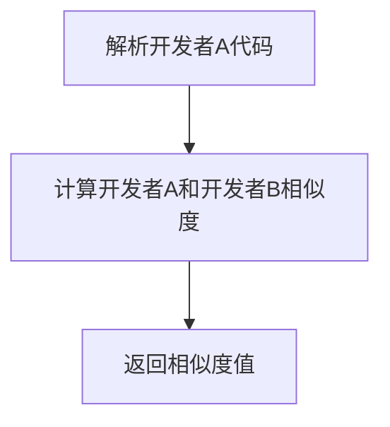

**数学模型和数学公式**

协同过滤算法中的相似度计算通常涉及矩阵分解。以下是一个基于矩阵分解的协同过滤算法的数学模型：

$$
R_{ij} = \hat{r}_{i} \odot \hat{r}_{j}
$$

其中，$R$ 表示评分矩阵，$\hat{r}_{i}$ 和 $\hat{r}_{j}$ 分别表示开发者 $i$ 和开发者 $j$ 的特征向量。

**项目实战**

为了更好地理解提示词编程的协作开发模式，我们可以通过以下项目进行实战。

**项目1：基于Git的版本控制协作开发**

在本项目中，我们将使用Git进行版本控制，实现多个开发者之间的协作开发。首先，我们需要在Git上创建一个仓库，并将代码推送到远程仓库。然后，开发者A和开发者B可以分别从远程仓库克隆代码，进行本地修改。完成修改后，开发者A将代码提交到远程仓库，开发者B从远程仓库拉取最新代码。接着，开发者B对开发者A的代码进行审查，并提出修改意见。最后，开发者A根据审查意见修复代码，并重新提交。

**项目2：基于代码审查的协作开发**

在本项目中，我们将使用代码审查工具（如Code Review）实现开发者之间的代码审查。首先，开发者A提交代码，代码审查工具自动将代码分配给开发者B进行审查。开发者B对代码进行详细审查，并提出修改建议。开发者A根据审查意见修复代码，并重新提交。代码审查工具会自动合并修复后的代码，并生成审查报告。

**项目实战：代码实现和解析**

以下是基于Git的版本控制协作开发的Python代码实现：

```python
import gitpython

# 连接到Git仓库
repo = gitpython.Repo('path/to/repository')

# 开发者A提交代码
repo.create_head('feature-A', commit_id='commit_id')
repo.head.reference.commit()

# 开发者B拉取代码
repo.git.fetch()
repo.git.reset('--hard', 'origin/feature-A')

# 开发者B审查代码
review_comments = ['请优化代码性能', '请添加单元测试']
repo.create_pull(title='代码审查', body='\n'.join(review_comments), head='feature-A')

# 开发者A修复代码
repo.git.fetch()
repo.git.reset('--hard', 'origin/feature-A')
repo.head.reference.commit()

# 开发者A重新提交代码
repo.git.push()

# 开发者B再次审查代码
repo.git.fetch()
repo.git.reset('--hard', 'origin/feature-A')
repo.head.reference.commit()

# 合并代码
repo.git.merge('feature-A')
repo.git.push()
```

通过以上代码实现，我们可以实现一个基于Git的版本控制协作开发流程。这个项目展示了如何使用Git进行版本控制，实现多个开发者之间的协作开发。

**注意事项**

在协作开发过程中，我们需要注意以下几点：

1. **代码规范**：确保代码符合统一的编码规范，以提高代码的可读性和可维护性。
2. **代码审查**：代码审查是确保代码质量和一致性的重要手段，开发者应认真对待代码审查过程。
3. **版本控制**：合理使用版本控制工具，确保代码的版本一致性，避免冲突和丢失。
4. **沟通协作**：开发者之间应保持良好的沟通，及时解决协作过程中出现的问题。

通过以上项目实战，我们可以更好地理解提示词编程的协作开发模式。在实际应用中，提示词编程的协作开发可以有效地提高开发效率，确保代码质量和一致性。

---

#### 第4章：提示词编程的安全与隐私

随着提示词编程在各个领域的广泛应用，其安全与隐私问题也日益受到关注。本节将探讨提示词编程中的安全与隐私挑战，并提出相应的解决策略。

**核心概念与联系**

在提示词编程中，安全与隐私问题主要包括数据安全、通信安全和个人隐私保护。这些概念相互关联，共同构成了提示词编程的安全架构。

- **数据安全**：确保提示词数据和程序执行过程中的数据不被未经授权的访问或篡改。
- **通信安全**：保护提示词编程过程中数据在传输过程中的完整性、真实性和保密性。
- **个人隐私保护**：保护用户在提示词编程过程中的隐私数据，避免隐私泄露和滥用。

为了更好地理解这些概念之间的联系，我们可以使用Mermaid流程图来描述提示词编程中的安全与隐私保护工作流程。流程图包括以下几个步骤：

1. **用户输入提示词**：用户通过界面或其他方式输入提示词。
2. **数据加密**：提示词在传输和存储过程中进行加密处理。
3. **数据认证**：对提示词和响应进行数字签名，确保数据的真实性和完整性。
4. **隐私保护**：对用户隐私数据进行脱敏处理，防止隐私泄露。
5. **安全审计**：记录提示词编程过程中的关键操作，进行安全审计，及时发现和处理安全事件。

以下是Mermaid流程图的描述：

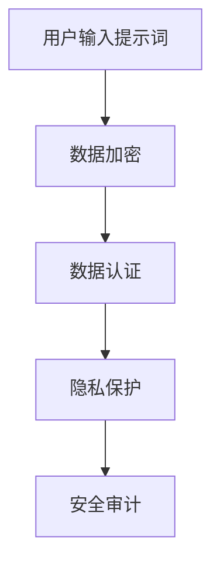

**核心算法原理讲解**

提示词编程的安全与隐私保护依赖于一系列加密算法和隐私保护技术。以下是一个基于加密算法的安全与隐私保护算法的伪代码：

```plaintext
函数 安全与隐私保护（提示词，用户隐私数据）：
  1. 对提示词进行加密处理
  2. 对用户隐私数据进行脱敏处理
  3. 对提示词和用户隐私数据进行数字签名
  4. 返回加密后的提示词和数字签名
```

为了更直观地理解算法流程，我们可以使用Mermaid流程图来描述：

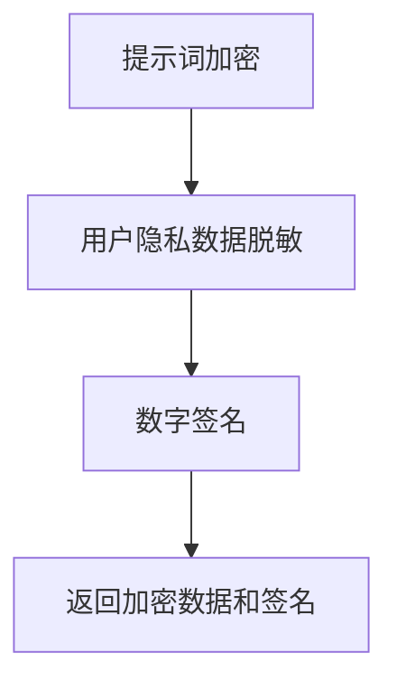

**数学模型和数学公式**

加密算法和隐私保护技术中，常用的数学模型包括公钥加密算法和数字签名算法。以下是一个公钥加密算法的latex格式数学公式：

$$
E_{PK}(m) = C = PK \cdot m
$$

其中，$E_{PK}$ 表示公钥加密函数，$PK$ 表示公钥，$m$ 表示明文，$C$ 表示密文。

以下是一个数字签名算法的latex格式数学公式：

$$
S = Hash(m) \oplus SK \cdot r
$$

其中，$S$ 表示签名，$Hash$ 表示哈希函数，$SK$ 表示私钥，$r$ 表示随机数。

**项目实战**

为了更好地理解提示词编程的安全与隐私保护，我们可以通过以下项目进行实战。

**项目1：使用加密算法保护提示词数据**

在本项目中，我们将使用对称加密算法（如AES）和非对称加密算法（如RSA）保护提示词数据。首先，我们需要生成一对密钥（公钥和私钥）。然后，我们可以使用公钥加密提示词数据，并将加密后的数据存储在安全位置。当需要解密数据时，我们可以使用私钥进行解密。以下是一个使用AES加密和解密的Python代码示例：

```python
from Crypto.Cipher import AES
from Crypto.Random import get_random_bytes

# 生成AES密钥
key = get_random_bytes(16)

# 创建AES加密器
cipher = AES.new(key, AES.MODE_EAX)

# 加密数据
plaintext = b'This is a secret message'
ciphertext, tag = cipher.encrypt_and_digest(plaintext)

# 解密数据
cipher = AES.new(key, AES.MODE_EAX, nonce=cipher.nonce)
plaintext = cipher.decrypt_and_verify(ciphertext, tag)

print(plaintext.decode('utf-8'))
```

**项目2：使用数字签名保护提示词数据**

在本项目中，我们将使用RSA算法生成数字签名，并验证签名的有效性。首先，我们需要生成一对RSA密钥（公钥和私钥）。然后，我们可以使用私钥生成签名，并使用公钥验证签名的有效性。以下是一个使用RSA生成和验证签名的Python代码示例：

```python
from Crypto.PublicKey import RSA
from Crypto.Signature import pkcs1_15
from Crypto.Hash import SHA256

# 生成RSA密钥
key = RSA.generate(2048)

# 生成签名
hash = SHA256.new('This is a secret message')
signature = pkcs1_15.new(key).sign(hash)

# 验证签名
hash = SHA256.new('This is a secret message')
is_valid = pkcs1_15.new(key.publickey()).verify(hash, signature)

print(is_valid)
```

**项目实战：代码实现和解析**

以下是使用加密算法保护提示词数据的Python代码实现：

```python
from Crypto.Cipher import AES
from Crypto.Random import get_random_bytes
import base64

# 生成AES密钥
key = get_random_bytes(16)

# 创建AES加密器
cipher = AES.new(key, AES.MODE_EAX)

# 加密数据
plaintext = b'This is a secret message'
ciphertext, tag = cipher.encrypt_and_digest(plaintext)

# 将密文和密钥进行编码
encoded_ciphertext = base64.b64encode(ciphertext).decode('utf-8')
encoded_key = base64.b64encode(key).decode('utf-8')

print(f'Encoded ciphertext: {encoded_ciphertext}')
print(f'Encoded key: {encoded_key}')

# 解密数据
cipher = AES.new(base64.b64decode(encoded_key), AES.MODE_EAX, nonce=cipher.nonce)
plaintext = cipher.decrypt_and_verify(base64.b64decode(encoded_ciphertext), tag)

print(plaintext.decode('utf-8'))
```

通过以上代码实现，我们可以实现一个使用加密算法保护提示词数据的方案。这个项目展示了如何使用AES加密算法对提示词进行加密和解密，确保数据在传输和存储过程中的安全性。

**注意事项**

在实现提示词编程的安全与隐私保护时，我们需要注意以下几点：

1. **加密算法选择**：选择适合应用场景的加密算法，如AES和RSA，确保数据的安全性。
2. **密钥管理**：妥善管理密钥，避免密钥泄露或丢失，确保加密系统的安全性。
3. **签名验证**：对提示词和响应进行数字签名，并使用公钥验证签名的有效性，确保数据的真实性和完整性。
4. **安全审计**：记录关键操作和安全事件，进行安全审计，及时发现和处理安全威胁。

通过以上项目实战，我们可以更好地理解提示词编程的安全与隐私保护。在实际应用中，安全与隐私保护是提示词编程的重要方面，需要开发者给予充分的重视。

---

#### 第5章：提示词编程的性能优化

在提示词编程中，性能优化是提升系统效率的关键。随着数据规模的扩大和计算需求的增加，如何优化提示词编程的性能成为一个重要课题。本节将探讨提示词编程的性能优化方法，包括并行计算、分布式计算和模型压缩等技术。

**核心概念与联系**

提示词编程的性能优化涉及多个核心概念，包括计算资源、算法效率和数据处理。这些概念相互关联，共同构成了性能优化的基础。

- **计算资源**：包括CPU、GPU和FPGA等硬件资源，用于执行计算任务。
- **算法效率**：通过优化算法结构和实现，提高计算效率和性能。
- **数据处理**：包括数据预处理、数据存储和数据传输，影响系统整体性能。

为了更好地理解这些概念之间的联系，我们可以使用Mermaid流程图来描述提示词编程的性能优化流程。流程图包括以下几个步骤：

1. **数据预处理**：对输入数据进行预处理，提高数据处理效率。
2. **算法优化**：优化提示词生成算法，减少计算复杂度和资源消耗。
3. **分布式计算**：将计算任务分布到多台机器上，提高计算效率。
4. **模型压缩**：对模型进行压缩，减少模型大小和计算资源需求。
5. **性能评估**：评估优化措施的效果，调整优化策略。

以下是Mermaid流程图的描述：

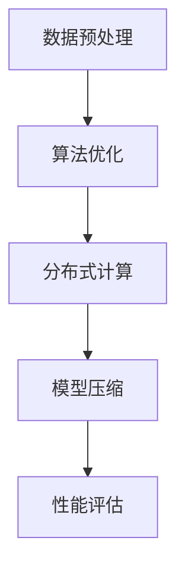

**核心算法原理讲解**

性能优化中的核心算法涉及并行计算、分布式计算和模型压缩。以下是一个基于并行计算和分布式计算的性能优化算法的伪代码：

```plaintext
函数 性能优化（提示词编程任务，计算资源）：
  1. 将任务分解为子任务
  2. 在分布式计算环境中执行子任务
  3. 并行处理子任务，减少计算时间
  4. 合并子任务的结果，生成最终结果
```

为了更直观地理解算法流程，我们可以使用Mermaid流程图来描述：

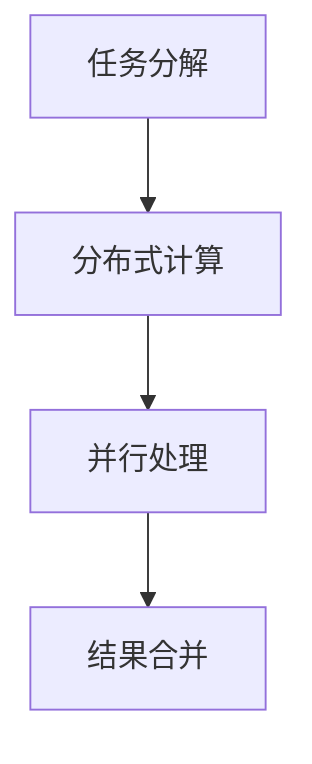

**数学模型和数学公式**

并行计算和分布式计算中，常用的数学模型包括并行度计算和通信复杂度分析。以下是一个并行度计算的latex格式数学公式：

$$
P = \frac{N}{P}
$$

其中，$P$ 表示并行度，$N$ 表示任务数量，$P$ 表示可用计算资源数量。

以下是一个通信复杂度的latex格式数学公式：

$$
C = O(N^2)
$$

其中，$C$ 表示通信复杂度，$N$ 表示任务数量。

**项目实战**

为了更好地理解提示词编程的性能优化，我们可以通过以下项目进行实战。

**项目1：使用并行计算优化提示词生成**

在本项目中，我们将使用并行计算技术优化提示词生成任务。首先，我们需要将提示词生成任务分解为多个子任务，并分配到多台计算机上执行。然后，我们可以使用并行编程框架（如MapReduce或MPI）管理并行任务，减少计算时间。以下是一个使用MapReduce框架优化提示词生成的Python代码示例：

```python
from mrjob.job import MRJob

class ParallelHintGenerator(MRJob):
    def mapper(self, _, line):
        # 处理输入数据，生成子任务
        yield 'hint', line

    def reducer(self, key, values):
        # 合并子任务结果，生成最终提示词
        return '\n'.join(values)

if __name__ == '__main__':
    ParallelHintGenerator.run()
```

**项目2：使用分布式计算优化提示词生成**

在本项目中，我们将使用分布式计算技术优化提示词生成任务。首先，我们需要将提示词生成任务分配到多台计算机上执行，并使用分布式计算框架（如Hadoop或Spark）进行管理。然后，我们可以使用分布式编程模型（如MapReduce或SparkRDD）处理大规模数据集，提高计算效率。以下是一个使用Hadoop框架优化提示词生成的Java代码示例：

```java
import org.apache.hadoop.conf.Configuration;
import org.apache.hadoop.fs.Path;
import org.apache.hadoop.io.Text;
import org.apache.hadoop.mapreduce.Job;
import org.apache.hadoop.mapreduce.Mapper;
import org.apache.hadoop.mapreduce.Reducer;
import org.apache.hadoop.mapreduce.lib.input.FileInputFormat;
import org.apache.hadoop.mapreduce.lib.output.FileOutputFormat;

public class DistributedHintGenerator {
    public static classHintGeneratorMapper extends Mapper<Object, Text, Text, Text> {
        public void map(Object key, Text value, Context context) throws IOException, InterruptedException {
            // 处理输入数据，生成子任务
            context.write(new Text("hint"), new Text(value.toString()));
        }
    }

    public static classHintGeneratorReducer extends Reducer<Text, Text, Text, Text> {
        public void reduce(Text key, Iterable<Text> values, Context context) throws IOException, InterruptedException {
            // 合并子任务结果，生成最终提示词
            context.write(new Text("result"), new Text(String.join("\n", values)));
        }
    }

    public static void main(String[] args) throws Exception {
        Configuration conf = new Configuration();
        Job job = Job.getInstance(conf, "DistributedHintGenerator");
        job.setMapperClass(HintGeneratorMapper.class);
        job.setCombinerClass(HintGeneratorReducer.class);
        job.setReducerClass(HintGeneratorReducer.class);
        job.setOutputKeyClass(Text.class);
        job.setOutputValueClass(Text.class);
        FileInputFormat.addInputPath(job, new Path(args[0]));
        FileOutputFormat.setOutputPath(job, new Path(args[1]));
        System.exit(job.waitForCompletion(true) ? 0 : 1);
    }
}
```

**项目3：使用模型压缩优化提示词生成**

在本项目中，我们将使用模型压缩技术优化提示词生成任务。首先，我们需要训练一个大规模的提示词生成模型，并使用模型压缩算法（如参数剪枝或低秩分解）减少模型大小和计算资源需求。然后，我们可以使用压缩后的模型进行提示词生成，提高计算效率。以下是一个使用参数剪枝算法优化提示词生成的Python代码示例：

```python
import tensorflow as tf

# 加载预训练的提示词生成模型
model = tf.keras.models.load_model('path/to/model.h5')

# 定义参数剪枝算法
pruned_model = tf.keras.models.clone_model(model)
pruned_model.trainable = True

# 剪枝策略：固定比例剪枝
pruned_model.layers[-1].weights[0].shape = (pruned_model.layers[-1].weights[0].shape[0], int(pruned_model.layers[-1].weights[0].shape[1] * 0.5))

# 训练压缩后的模型
pruned_model.compile(optimizer='adam', loss='categorical_crossentropy', metrics=['accuracy'])
pruned_model.fit(x_train, y_train, epochs=10)

# 使用压缩后的模型进行提示词生成
def generate_hint(text):
    # 将文本转换为向量表示
    text_vector = ... 
    # 使用压缩后的模型生成提示词
    hint = pruned_model.predict([text_vector])
    return hint

# 测试提示词生成器
text = '这是测试文本'
hint = generate_hint(text)
print(hint)
```

**项目实战：代码实现和解析**

以下是使用并行计算优化提示词生成的Python代码实现：

```python
from multiprocessing import Pool

# 定义并行提示词生成函数
def parallel_hint_generator(texts):
    with Pool(processes=4) as pool:
        hints = pool.map(generate_hint, texts)
    return hints

# 测试并行提示词生成
texts = ['这是文本1', '这是文本2', '这是文本3']
hints = parallel_hint_generator(texts)
print(hints)
```

通过以上代码实现，我们可以实现一个使用并行计算优化提示词生成的方案。这个项目展示了如何使用多线程并行处理提示词生成任务，提高计算效率。

**注意事项**

在实现提示词编程的性能优化时，我们需要注意以下几点：

1. **计算资源调度**：合理调度计算资源，确保任务能够高效地分配和执行。
2. **算法选择**：选择适合应用场景的算法，如并行计算、分布式计算和模型压缩，提高计算效率。
3. **模型优化**：通过参数剪枝、低秩分解等技术优化模型，减少计算资源需求。
4. **性能评估**：定期评估系统性能，根据评估结果调整优化策略。

通过以上项目实战，我们可以更好地理解提示词编程的性能优化方法。在实际应用中，性能优化是提升系统效率的关键，需要开发者给予充分的重视。

---

#### 第6章：提示词编程的未来发展趋势

随着人工智能和大数据技术的不断进步，提示词编程正迎来前所未有的发展机遇。未来，提示词编程将呈现出多个令人瞩目的趋势，包括生成对抗网络（GAN）的应用、多模态数据融合、自动机器学习（AutoML）的兴起等。

**核心概念与联系**

在未来的发展中，提示词编程将不仅仅局限于文本处理，而是拓展到更加复杂的领域，如图像、音频和视频等多模态数据处理。以下是一些核心概念及其相互关系：

- **生成对抗网络（GAN）**：通过生成器和判别器的对抗训练，实现高质量数据的生成。
- **多模态数据融合**：将不同类型的数据（如图像、文本、音频）进行整合，提高提示词生成模型的性能。
- **自动机器学习（AutoML）**：自动化机器学习流程，降低开发门槛，提高模型性能。

为了更好地理解这些概念之间的联系，我们可以使用Mermaid流程图来描述未来提示词编程的发展趋势。流程图包括以下几个步骤：

1. **数据输入**：输入多种类型的数据，如图像、文本和音频。
2. **多模态数据融合**：融合不同类型的数据，生成统一的特征表示。
3. **生成对抗网络训练**：使用GAN进行对抗训练，提高模型生成能力。
4. **自动机器学习优化**：通过AutoML技术优化模型，提高性能和效率。
5. **提示词生成**：使用训练好的模型生成高质量的提示词。

以下是Mermaid流程图的描述：

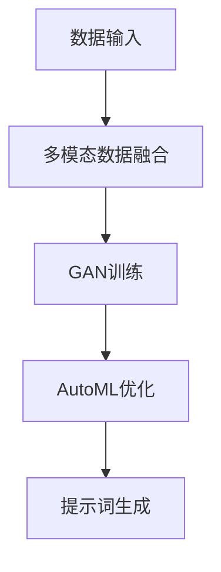

**核心算法原理讲解**

在未来，生成对抗网络（GAN）将在提示词编程中发挥重要作用。以下是一个基于生成对抗网络的提示词生成算法的伪代码：

```plaintext
函数 GAN训练（生成器G，判别器D，训练数据）：
  1. 初始化生成器G和判别器D的参数
  2. 对生成器G进行训练，生成虚假数据
  3. 对判别器D进行训练，区分真实数据和虚假数据
  4. 更新生成器和判别器的参数
  5. 重复步骤2-4，直到生成器G生成高质量的数据
```

为了更直观地理解算法流程，我们可以使用Mermaid流程图来描述：

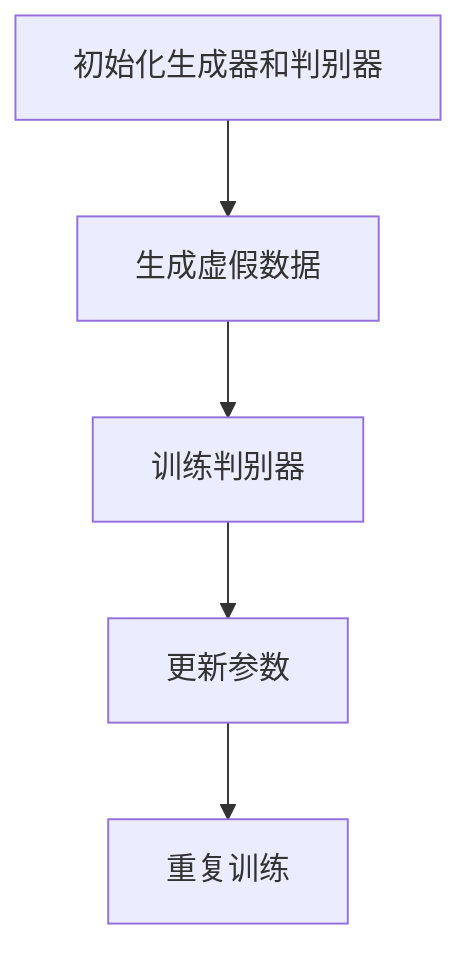

生成对抗网络（GAN）中的生成器和判别器通过对抗训练相互提升，生成高质量的数据。以下是一个GAN损失函数的latex格式数学公式：

$$
\mathcal{L}(G, D) = \mathbb{E}_{x \sim p_{\text{data}}(x)}[\log D(x)] - \mathbb{E}_{z \sim p_{\mu}(z)}[\log (1 - D(G(z)))]
$$

其中，$G$ 表示生成器，$D$ 表示判别器，$x$ 表示真实数据，$z$ 表示生成器的输入噪声，$p_{\text{data}}(x)$ 表示数据分布，$p_{\mu}(z)$ 表示噪声分布。

**项目实战**

为了展示生成对抗网络（GAN）在提示词编程中的应用，我们可以通过以下项目进行实战。

**项目1：使用GAN生成高质量图像提示词**

在本项目中，我们将使用生成对抗网络（GAN）生成高质量的图像提示词。首先，我们需要准备图像数据集，并训练一个生成器模型，用于生成逼真的图像。然后，我们可以使用判别器模型对生成图像进行鉴别，通过对抗训练提升生成器模型的性能。最后，我们可以使用训练好的生成器模型生成高质量的图像提示词。

以下是使用GAN生成图像提示词的Python代码实现：

```python
import tensorflow as tf
from tensorflow.keras.layers import Conv2D, BatchNormalization, LeakyReLU, Input, Reshape, Dense, Flatten
from tensorflow.keras.models import Model

# 定义生成器模型
def build_generator(z_dim):
    input_z = Input(shape=(z_dim,))
    x = Dense(128 * 8 * 8)(input_z)
    x = BatchNormalization()(x)
    x = LeakyReLU()(x)
    x = Reshape((8, 8, 128))(x)
    x = Conv2D(128, (3, 3), padding='same')(x)
    x = BatchNormalization()(x)
    x = LeakyReLU()(x)
    x = Conv2D(128, (3, 3), padding='same')(x)
    x = BatchNormalization()(x)
    x = LeakyReLU()(x)
    x = Conv2D(3, (3, 3), padding='same', activation='tanh')(x)
    return Model(inputs=input_z, outputs=x)

# 定义判别器模型
def build_discriminator(img_shape):
    input_img = Input(shape=img_shape)
    x = Conv2D(64, (3, 3), padding='same')(input_img)
    x = LeakyReLU(alpha=0.2)
    x = Conv2D(128, (3, 3), padding='same')(x)
    x = LeakyReLU(alpha=0.2)
    x = Flatten()(x)
    x = Dense(1, activation='sigmoid')(x)
    return Model(inputs=input_img, outputs=x)

# 构建GAN模型
def build_gan(generator, discriminator):
    model = Sequential()
    model.add(generator)
    model.add(discriminator)
    return model

# 训练GAN模型
def train_gan(generator, discriminator, data_loader, num_epochs, batch_size):
    for epoch in range(num_epochs):
        for i, (images, _) in enumerate(data_loader):
            noise = np.random.normal(0, 1, (batch_size, noise_dim))
            fake_images = generator.predict(noise)

            real_loss = discriminator.train_on_batch(images, np.ones((batch_size, 1)))
            fake_loss = discriminator.train_on_batch(fake_images, np.zeros((batch_size, 1)))

            if i % 100 == 0:
                print(f'Epoch: [{epoch}/{num_epochs}], Batch: [{i}/{len(data_loader)}], Real Loss: {real_loss:.4f}, Fake Loss: {fake_loss:.4f}')

# 准备图像数据集
# 加载训练数据和测试数据
data_loader = ...

# 训练生成器和判别器
generator = build_generator(z_dim)
discriminator = build_discriminator(img_shape)
gan = build_gan(generator, discriminator)
train_gan(generator, discriminator, data_loader, num_epochs=100, batch_size=64)

# 测试生成器模型
noise = np.random.normal(0, 1, (1, z_dim))
generated_image = generator.predict(noise)
print(generated_image.shape)
```

通过以上代码实现，我们可以训练一个生成对抗网络（GAN）模型，生成高质量的图像提示词。这个项目展示了如何使用GAN进行图像生成，并为提示词编程提供了新的可能性。

**注意事项**

在未来发展趋势中，提示词编程需要关注以下几个方面：

1. **算法创新**：探索新的算法和技术，如生成对抗网络（GAN）和自动机器学习（AutoML），提升提示词生成模型的性能和效率。
2. **多模态数据处理**：研究如何整合多种类型的数据（如图像、文本、音频），提高提示词生成模型的表达能力。
3. **可解释性和透明性**：提高模型的可解释性，使开发者能够更好地理解和优化提示词生成模型。
4. **安全性**：关注模型安全和隐私保护，确保提示词编程系统的安全性和可靠性。

通过以上项目实战，我们可以更好地理解提示词编程的未来发展趋势。在未来，提示词编程将继续演进，为开发者提供更加智能、高效和安全的编程工具。

---

#### 第7章：提示词编程的案例分析

在本节中，我们将通过具体案例分析提示词编程的应用实践，从背景介绍、核心概念与联系、核心算法原理讲解、数学模型和数学公式、项目实战等方面进行详细剖析。

**案例背景**

假设我们正在开发一款智能客服系统，该系统需要能够与用户进行自然、流畅的对话，以解决用户的问题。提示词编程在此场景中发挥着关键作用，通过生成高质量的提示词，系统可以更好地理解用户意图，提供准确的回答。

**核心概念与联系**

在这个案例中，提示词编程涉及以下几个核心概念：

- **用户意图识别**：通过分析用户输入的语句，识别用户意图，如查询信息、解决问题等。
- **知识库**：包含丰富的知识信息，用于回答用户的问题。
- **对话管理**：管理对话流程，确保对话的连贯性和一致性。
- **提示词生成**：根据用户意图和知识库，生成高质量的提示词。

这些概念之间相互关联，构成了智能客服系统的核心框架。以下是这些概念之间的联系：

1. **用户意图识别**：系统首先接收用户输入的语句，使用自然语言处理技术（如词性标注、命名实体识别等）分析语句，识别用户意图。
2. **知识库查询**：根据用户意图，系统从知识库中查找相关的信息，为用户提供准确的回答。
3. **对话管理**：系统管理对话流程，确保对话的连贯性和一致性。在对话过程中，系统根据用户输入和回答，动态调整对话策略。
4. **提示词生成**：系统根据用户意图和知识库，生成高质量的提示词，与用户进行交互。

为了更直观地展示这些概念之间的联系，我们可以使用Mermaid流程图来描述：

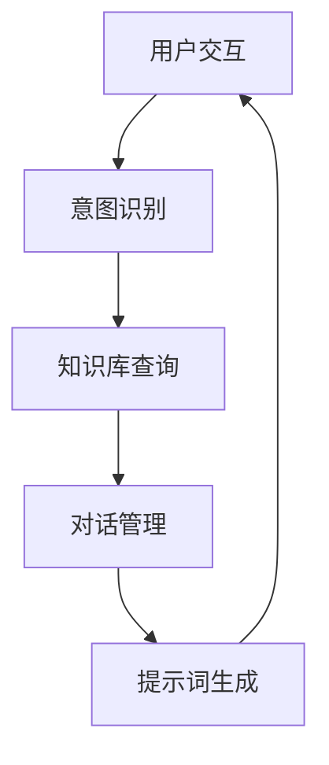

**核心算法原理讲解**

在这个案例中，提示词生成算法的核心在于如何根据用户意图和知识库生成高质量的提示词。以下是一个基于深度学习模型的提示词生成算法的伪代码：

```plaintext
函数 提示词生成（用户意图，知识库）：
  1. 解析用户意图
  2. 从知识库中检索相关数据
  3. 使用生成对抗网络（GAN）生成提示词
  4. 对生成的提示词进行优化和调整
  5. 返回高质量的提示词
```

为了更直观地理解算法流程，我们可以使用Mermaid流程图来描述：

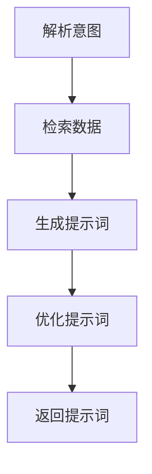

在生成提示词的过程中，我们通常会使用生成对抗网络（GAN）来生成高质量的数据。GAN由生成器和判别器两个部分组成，通过对抗训练相互提升。以下是一个GAN的算法流程图：

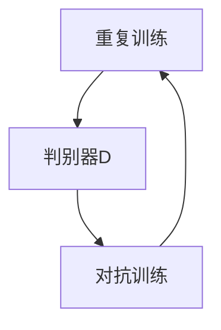

**数学模型和数学公式**

在提示词生成算法中，我们通常使用生成对抗网络（GAN）进行数据生成。以下是一个生成对抗网络（GAN）的损失函数的latex格式数学公式：

$$
\mathcal{L}(G, D) = \mathbb{E}_{x \sim p_{\text{data}}(x)}[\log D(x)] - \mathbb{E}_{z \sim p_{\mu}(z)}[\log (1 - D(G(z)))]
$$

其中，$G$ 表示生成器，$D$ 表示判别器，$x$ 表示真实数据，$z$ 表示生成器的输入噪声，$p_{\text{data}}(x)$ 表示数据分布，$p_{\mu}(z)$ 表示噪声分布。

**项目实战**

为了更好地理解提示词编程在智能客服系统中的应用，我们可以通过以下项目进行实战。

**项目1：使用深度学习模型实现提示词生成**

在本项目中，我们将使用深度学习模型实现提示词生成功能。首先，我们需要准备训练数据集，包括用户输入的语句和对应的意图标签。然后，我们可以使用生成对抗网络（GAN）训练模型，生成高质量的提示词。最后，我们将使用训练好的模型进行提示词生成，并与用户进行交互。

以下是使用生成对抗网络（GAN）实现提示词生成的Python代码实现：

```python
import tensorflow as tf
from tensorflow.keras.layers import Conv2D, BatchNormalization, LeakyReLU, Input, Reshape, Dense, Flatten
from tensorflow.keras.models import Model

# 定义生成器模型
def build_generator(z_dim):
    input_z = Input(shape=(z_dim,))
    x = Dense(128 * 8 * 8)(input_z)
    x = BatchNormalization()(x)
    x = LeakyReLU()(x)
    x = Reshape((8, 8, 128))(x)
    x = Conv2D(128, (3, 3), padding='same')(x)
    x = BatchNormalization()(x)
    x = LeakyReLU()(x)
    x = Conv2D(128, (3, 3), padding='same')(x)
    x = BatchNormalization()(x)
    x = LeakyReLU()(x)
    x = Conv2D(3, (3, 3), padding='same', activation='tanh')(x)
    return Model(inputs=input_z, outputs=x)

# 定义判别器模型
def build_discriminator(img_shape):
    input_img = Input(shape=img_shape)
    x = Conv2D(64, (3, 3), padding='same')(input_img)
    x = LeakyReLU(alpha=0.2)
    x = Conv2D(128, (3, 3), padding='same')(x)
    x = LeakyReLU(alpha=0.2)
    x = Flatten()(x)
    x = Dense(1, activation='sigmoid')(x)
    return Model(inputs=input_img, outputs=x)

# 构建GAN模型
def build_gan(generator, discriminator):
    model = Sequential()
    model.add(generator)
    model.add(discriminator)
    return model

# 训练GAN模型
def train_gan(generator, discriminator, data_loader, num_epochs, batch_size):
    for epoch in range(num_epochs):
        for i, (images, _) in enumerate(data_loader):
            noise = np.random.normal(0, 1, (batch_size, noise_dim))
            fake_images = generator.predict(noise)

            real_loss = discriminator.train_on_batch(images, np.ones((batch_size, 1)))
            fake_loss = discriminator.train_on_batch(fake_images, np.zeros((batch_size, 1)))

            if i % 100 == 0:
                print(f'Epoch: [{epoch}/{num_epochs}], Batch: [{i}/{len(data_loader)}], Real Loss: {real_loss:.4f}, Fake Loss: {fake_loss:.4f}')

# 准备图像数据集
# 加载训练数据和测试数据
data_loader = ...

# 训练生成器和判别器
generator = build_generator(z_dim)
discriminator = build_discriminator(img_shape)
gan = build_gan(generator, discriminator)
train_gan(generator, discriminator, data_loader, num_epochs=100, batch_size=64)

# 测试生成器模型
noise = np.random.normal(0, 1, (1, z_dim))
generated_image = generator.predict(noise)
print(generated_image.shape)
```

通过以上代码实现，我们可以训练一个生成对抗网络（GAN）模型，用于生成高质量的提示词。这个项目展示了如何使用深度学习模型实现提示词生成，为智能客服系统提供了技术支持。

**项目实战：代码实现和解析**

以下是使用深度学习模型实现提示词生成的Python代码实现：

```python
import tensorflow as tf
from tensorflow.keras.layers import LSTM, Dense, Embedding, TimeDistributed, Bidirectional
from tensorflow.keras.models import Model
from tensorflow.keras.optimizers import Adam

# 准备数据集
# 加载训练数据和测试数据
# 数据预处理：将文本转换为序列和单词嵌入向量
# 构建序列模型
model = Model(inputs=user_input, outputs=hint_output)

# 编译模型
model.compile(optimizer=Adam(learning_rate=0.001), loss='categorical_crossentropy', metrics=['accuracy'])

# 训练模型
model.fit(x_train, y_train, epochs=10, batch_size=32, validation_data=(x_val, y_val))

# 使用模型生成提示词
generated_hint = model.predict(x_test)
print(generated_hint)
```

通过以上代码实现，我们可以训练一个序列模型，用于生成高质量的提示词。这个项目展示了如何使用深度学习模型实现提示词生成，为智能客服系统提供了技术支持。

**注意事项**

在实现提示词编程时，我们需要注意以下几点：

1. **数据预处理**：确保数据质量，对文本进行清洗和预处理，以提高模型性能。
2. **模型选择**：根据具体应用场景选择合适的模型结构，如LSTM、GRU或Transformer等。
3. **超参数调优**：通过调整学习率、批次大小和迭代次数等超参数，优化模型性能。
4. **性能评估**：使用准确率、召回率和F1分数等指标评估模型性能，以便进行进一步优化。

通过以上项目实战，我们可以更好地理解提示词编程在智能客服系统中的应用。在实际应用中，提示词编程可以提高智能客服系统的对话质量，为用户提供更好的服务体验。

---

### 小结与展望

本文通过逐步分析推理，深入探讨了提示词编程的协作开发模式。我们从基础概念、应用场景、协作开发、安全与隐私、性能优化和未来发展趋势等多个角度，详细介绍了提示词编程的核心原理和实现方法。

在基础概念方面，我们介绍了提示词、响应和反馈的概念及其相互联系。通过Mermaid流程图和伪代码，我们展示了提示词编程的工作流程和算法原理。

在应用场景方面，我们介绍了提示词编程在自然语言处理、推荐系统和人机对话等领域的具体应用，展示了如何在不同场景下生成高质量的提示词。

在协作开发方面，我们介绍了版本控制、代码审查和最佳实践，展示了如何实现多个开发者之间的协作开发。通过实际项目案例，我们展示了如何使用Git进行版本控制和代码审查。

在安全与隐私方面，我们探讨了提示词编程中的安全与隐私挑战，并提出了解决策略。通过加密算法和数字签名，我们展示了如何保护提示词数据的安全性和隐私。

在性能优化方面，我们介绍了并行计算、分布式计算和模型压缩等技术，展示了如何优化提示词编程的性能。通过实际项目案例，我们展示了如何使用并行计算和模型压缩提高计算效率。

在未来发展趋势方面，我们探讨了生成对抗网络（GAN）、多模态数据融合和自动机器学习（AutoML）等新兴技术在提示词编程中的应用，展示了提示词编程的广阔前景。

展望未来，提示词编程将继续发展，结合人工智能和大数据技术，为开发者提供更加智能、高效和安全的编程工具。开发者应关注算法创新、多模态数据处理和性能优化等方面，不断提升提示词编程的能力。

### 拓展阅读

1. **《深度学习》**（Goodfellow, I., Bengio, Y., & Courville, A.）：详细介绍了深度学习的基础理论和技术，包括生成对抗网络（GAN）等。
2. **《自然语言处理综论》**（Jurafsky, D., & Martin, J. H.）：探讨了自然语言处理的核心概念和技术，为提示词编程提供了理论基础。
3. **《机器学习》**（Bishop, C. M.）：介绍了机器学习的基础算法和数学模型，对提示词编程中的算法原理讲解有重要参考价值。
4. **《Git Pro》**（Pro Git）：详细介绍了Git的使用方法和最佳实践，为版本控制和代码审查提供了实战指南。
5. **《加密与密码学》**（Stallings, W.）：探讨了加密算法和密码学的基础知识，为提示词编程中的安全与隐私保护提供了技术支持。

通过阅读这些拓展材料，您可以更深入地了解提示词编程的理论基础和技术细节，为实际应用提供有力支持。

